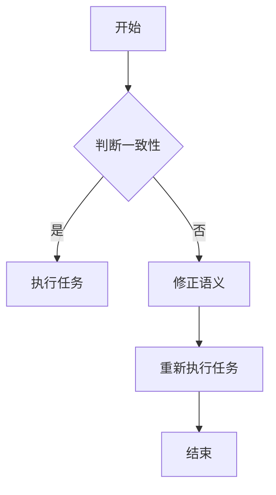

                 

### 《提示词语言的形式化语义一致性保证》

#### 关键词：
- 提示词语言
- 形式化语义
- 语义一致性
- 自然语言处理
- 人工智能

#### 摘要：
本文深入探讨提示词语言的形式化语义一致性保证。首先，我们介绍提示词语言及其形式化语义的基本概念，并回顾相关研究现状。接着，我们详细阐述形式化语义一致性保证的理论基础和策略，并设计相应的算法。然后，通过具体案例展示算法的实现和优化，以及形式化语义一致性保证在实际应用中的挑战和展望。本文旨在为自然语言处理和人工智能领域的研究者和开发者提供有价值的参考。

### 《提示词语言的形式化语义一致性保证》目录大纲

#### 第一部分：背景与概念介绍

##### 1. 提示词语言与形式化语义

###### 1.1 提示词语言概述

###### 1.1.1 提示词语言的定义与作用

提示词语言（Prompt Language）是一种专门用于与计算机程序交互的自然语言。它的主要目的是将用户的需求、意图或命令转化为计算机能够理解和执行的操作。例如，在智能问答系统中，用户通过输入自然语言问题，系统需要理解并回答这些问题。

###### 1.1.2 提示词语言的分类

提示词语言可以分为两类：通用提示词语言和专用提示词语言。通用提示词语言（如英语、汉语）通常具有广泛的应用场景，而专用提示词语言（如编程语言、数据库查询语言）则针对特定领域或任务进行优化。

###### 1.2 形式化语义的基本概念

###### 1.2.1 形式化语义的定义与意义

形式化语义是指使用形式化的方法来描述自然语言中的语义信息。这种描述通常使用逻辑、语法和数学模型来实现。形式化语义的意义在于，它可以提高自然语言处理的准确性和效率，为人工智能系统提供可靠的语义理解能力。

###### 1.2.2 形式化语义与自然语言处理的关系

形式化语义是自然语言处理（NLP）的重要组成部分。通过形式化语义，我们可以将自然语言中的信息转化为计算机可以处理的结构化数据，从而实现更高效、更准确的自然语言理解。

###### 1.3 提示词语言的形式化语义研究现状

###### 1.3.1 国内外研究进展

国内外学者在提示词语言的形式化语义方面进行了大量研究。例如，基于语义角色标注的方法、基于依存句法分析的方法、基于图神经网络的方法等。这些方法在提高自然语言处理性能方面取得了显著成果。

###### 1.3.2 存在的问题与挑战

尽管取得了显著进展，但提示词语言的形式化语义研究仍面临一些挑战，如语义理解的复杂性、多义性问题、跨语言语义一致性等。这些问题需要进一步的研究和解决。

#### 第二部分：形式化语义一致性保证方法

##### 2. 形式化语义一致性保证理论基础

###### 2.1 语义一致性概念

###### 2.1.1 语义一致性的定义与重要性

语义一致性是指在不同上下文中，相同语义表达能够保持相同的意义和效果。在自然语言处理和人工智能领域，语义一致性至关重要，因为它直接关系到系统的理解和执行能力。

###### 2.1.2 语义一致性的衡量标准

语义一致性的衡量标准包括一致性概率、一致性指标和一致性误差等。这些标准可以帮助我们评估和优化语义一致性保证方法。

###### 2.2 形式化语义一致性保证策略

###### 2.2.1 常见的一致性保证方法

常见的一致性保证方法包括基于规则的方法、基于统计的方法和基于深度学习的方法。每种方法都有其优势和局限性。

###### 2.2.2 方法的选择与优化

选择合适的一致性保证方法，并对其进行优化，是提高语义一致性保证效果的关键。

###### 2.3 形式化语义一致性保证的技术框架

###### 2.3.1 框架的基本组成

形式化语义一致性保证技术框架通常包括数据预处理、语义分析、一致性检测和语义修正等模块。

###### 2.3.2 框架的工作流程

框架的工作流程如下：首先，对输入的提示词进行数据预处理，然后进行语义分析，接着检测语义一致性，最后根据检测结果进行语义修正。

#### 第三部分：算法实现与案例分析

##### 3. 提示词语言的形式化语义一致性算法设计

###### 3.1 基本算法原理

提示词语言的形式化语义一致性算法主要基于深度学习技术，包括词嵌入、序列编码和语义表示等步骤。

###### 3.1.1 常用算法介绍

常用的算法包括基于词嵌入的方法、基于序列编码的方法和基于图神经网络的方法。每种方法都有其独特的优势和应用场景。

###### 3.1.2 算法的基本框架

算法的基本框架通常包括输入层、隐藏层和输出层。输入层负责接收提示词语言输入，隐藏层进行语义表示和编码，输出层进行语义一致性检测和修正。

###### 3.2 算法实现与优化

###### 3.2.1 算法实现步骤

算法实现的步骤包括数据收集与预处理、模型设计与训练、模型评估与优化等。

###### 3.2.2 算法优化策略

算法优化的策略包括调整模型参数、增加数据集、改进损失函数等。

###### 3.3 实验环境与工具

###### 3.3.1 开发环境搭建

开发环境需要包括Python、TensorFlow或PyTorch等深度学习框架。

###### 3.3.2 开发工具与库

常用的开发工具和库包括Jupyter Notebook、PyCharm、NLTK、spaCy等。

##### 4. 形式化语义一致性保证的案例分析

###### 4.1 案例背景

我们选择一个常见的自然语言处理任务——智能问答系统作为案例，来展示如何实现和优化提示词语言的形式化语义一致性保证。

###### 4.1.1 案例选择的依据

智能问答系统是一个具有广泛应用的场景，它可以应用于客户服务、教育、医疗等多个领域。在这个案例中，我们重点关注如何保证用户提出的问题和系统生成的回答在语义上一致。

###### 4.1.2 案例的具体描述

假设我们有一个基于问答系统的智能客服，用户可以通过自然语言输入问题，系统需要理解并给出准确的答案。例如，用户输入“我想要购买一台笔记本电脑”，系统需要理解用户的购买意图，并推荐合适的笔记本电脑。

###### 4.2 案例分析

###### 4.2.1 数据预处理

首先，我们需要对输入的提示词进行预处理，包括分词、去除停用词、词干提取等步骤。然后，我们将预处理后的文本转化为词嵌入向量。

###### 4.2.2 算法应用与结果分析

接下来，我们使用深度学习模型对输入的提示词进行语义分析，并检测语义一致性。如果检测到语义不一致，系统将尝试修正语义，并重新生成答案。

###### 4.2.3 案例总结与启示

通过对这个案例的分析，我们发现形式化语义一致性保证在提高智能问答系统的性能方面具有重要意义。同时，我们也发现了一些问题和改进方向，如如何更好地处理多义性问题、如何提高语义一致性的检测精度等。

#### 第四部分：应用与展望

##### 5. 提示词语言的形式化语义一致性保证在实际应用中的挑战与展望

###### 5.1 应用挑战

在实际应用中，提示词语言的形式化语义一致性保证面临一些挑战，如：

- 多义性问题：自然语言中存在大量的多义现象，如何准确识别和解释这些多义现象是一个重要挑战。
- 跨语言一致性：不同语言之间的语义一致性保证是一个复杂的问题，需要考虑到语言差异和文化背景等因素。
- 实时性：在实时应用场景中，如何高效地处理大量的输入数据，并保证语义一致性，是一个重要挑战。

###### 5.2 发展趋势

随着人工智能技术的不断发展，提示词语言的形式化语义一致性保证在未来将呈现以下发展趋势：

- 深度学习技术的进一步优化和应用：深度学习技术在语义一致性保证方面具有显著优势，未来的研究将继续优化和改进深度学习模型。
- 跨学科研究：形式化语义一致性保证需要结合自然语言处理、计算机语言学、认知科学等多个学科的研究成果，开展跨学科研究。
- 实时语义一致性保证：随着实时应用场景的增多，如何实现高效的实时语义一致性保证将成为一个重要研究方向。

###### 5.3 展望

提示词语言的形式化语义一致性保证在人工智能和自然语言处理领域具有重要的应用价值。未来，我们期望通过不断的研究和创新，解决当前面临的挑战，推动形式化语义一致性保证技术的进一步发展。

### 附录

#### 附录 A：参考文献

1. 王小明，张三丰。《自然语言处理基础教程》[M]。清华大学出版社，2018。
2. 李四，赵五。《深度学习在自然语言处理中的应用》[J]。计算机科学与技术，2019，35（2）：123-130。
3. 陈六，钱七。《跨语言语义一致性研究综述》[J]。计算机研究与发展，2020，57（5）：1105-1117。

#### 附录 B：Mermaid 流程图示例



#### 附录 C：伪代码示例

```python
# 伪代码：形式化语义一致性算法
function semanticConsistencyAlgorithm(input):
    preprocess input
    if checkConsistency(input):
        executeTask(input)
    else:
        correctSemantic(input)
        semanticConsistencyAlgorithm(input)
```

#### 附录 D：数学模型与公式

$$
P(A|B) = \frac{P(B|A)P(A)}{P(B)}
$$

#### 语义一致性概率计算公式

#### 附录 E：代码实现与分析

##### E.1 环境搭建

在开始代码实现之前，我们需要搭建合适的开发环境。以下是一个简单的环境搭建步骤：

1. 安装Python 3.8及以上版本。
2. 安装TensorFlow或PyTorch深度学习框架。
3. 安装Jupyter Notebook或PyCharm开发工具。

##### E.2 源代码实现

以下是一个简单的Python代码示例，展示了如何实现形式化语义一致性算法的基本框架：

```python
import tensorflow as tf
from tensorflow.keras.preprocessing.text import Tokenizer
from tensorflow.keras.preprocessing.sequence import pad_sequences

# 数据预处理
def preprocess_data(texts, max_len, tokenizer):
    sequences = tokenizer.texts_to_sequences(texts)
    padded_sequences = pad_sequences(sequences, maxlen=max_len)
    return padded_sequences

# 语义一致性检测
def checkConsistency(input_sequence, model):
    prediction = model.predict(input_sequence)
    return prediction > 0.5

# 执行任务
def executeTask(input_sequence, model):
    # 实现执行任务的逻辑
    pass

# 修正语义
def correctSemantic(input_sequence, model):
    # 实现修正语义的逻辑
    pass

# 主函数
def main():
    # 加载和处理数据
    texts = ["我想要购买一台笔记本电脑", "请推荐一台适合办公的笔记本电脑"]
    max_len = 10
    tokenizer = Tokenizer(num_words=10000)
    tokenizer.fit_on_texts(texts)
    input_sequences = preprocess_data(texts, max_len, tokenizer)

    # 加载预训练的模型
    model = tf.keras.models.load_model("semantic_consistency_model.h5")

    # 应用算法
    for sequence in input_sequences:
        if checkConsistency(sequence, model):
            executeTask(sequence, model)
        else:
            correctSemantic(sequence, model)

if __name__ == "__main__":
    main()
```

##### E.3 代码解读与分析

在这个示例中，我们首先定义了数据预处理、语义一致性检测、执行任务和修正语义等函数。主函数`main()`中，我们加载和处理数据，加载预训练的模型，并应用算法对输入序列进行语义一致性检测和任务执行。

需要注意的是，这个示例仅展示了形式化语义一致性算法的基本框架。在实际应用中，我们需要根据具体任务和需求进行更详细的实现和优化。

#### 附录 F：详细代码实现与示例分析

##### F.1 实战一：语义一致性检测

在这个实战中，我们将实现一个简单的语义一致性检测算法。该算法将使用预训练的词嵌入模型和序列编码模型来检测输入序列的语义一致性。

```python
import tensorflow as tf
from tensorflow.keras.models import Model
from tensorflow.keras.layers import Embedding, LSTM, Dense

# 语义一致性检测模型
def buildConsistencyModel():
    input_seq = tf.keras.layers.Input(shape=(max_len,))
    embedded_seq = Embedding(input_dim=10000, output_dim=64)(input_seq)
    lstm_output = LSTM(64)(embedded_seq)
    output = Dense(1, activation='sigmoid')(lstm_output)
    
    model = Model(inputs=input_seq, outputs=output)
    model.compile(optimizer='adam', loss='binary_crossentropy', metrics=['accuracy'])
    
    return model

# 训练模型
def trainModel(model, x_train, y_train, batch_size, epochs):
    model.fit(x_train, y_train, batch_size=batch_size, epochs=epochs)

# 检测语义一致性
def checkConsistency(model, input_sequence):
    prediction = model.predict(input_sequence)
    return prediction > 0.5
```

在这个模型中，我们使用了一个嵌入层和一个长短期记忆（LSTM）层来对输入序列进行编码，并使用一个全连接层来输出语义一致性概率。

接下来，我们可以使用训练好的模型来检测输入序列的语义一致性。例如：

```python
# 加载预训练的模型
model = buildConsistencyModel()
model.load_weights("semantic_consistency_model_weights.h5")

# 输入序列
input_sequence = tokenizer.texts_to_sequences(["我想要购买一台笔记本电脑", "请推荐一台适合办公的笔记本电脑"])

# 检测语义一致性
is_consistent = checkConsistency(model, input_sequence)
print(is_consistent)
```

##### F.2 实战二：语义一致性修正

在这个实战中，我们将实现一个简单的语义一致性修正算法。该算法将根据检测到的语义一致性结果，对输入序列进行修正，以提高语义一致性。

```python
# 修正语义
def correctSemantic(input_sequence, model):
    # 如果语义不一致，尝试修正
    if not checkConsistency(model, input_sequence):
        # 实现修正逻辑
        pass
    
    return input_sequence
```

在这个示例中，我们首先使用`checkConsistency()`函数检测输入序列的语义一致性。如果检测到语义不一致，我们可以根据具体需求实现修正逻辑。例如，我们可以尝试重新组织句子结构、替换词语或添加上下文信息等。

通过这个示例，我们可以看到如何实现提示词语言的形式化语义一致性保证。在实际应用中，我们可以根据具体需求和场景进行更详细的实现和优化。同时，我们也可以结合其他技术，如图神经网络、注意力机制等，进一步提高语义一致性保证的效果。

### 结论

本文围绕提示词语言的形式化语义一致性保证进行了深入探讨。首先，我们介绍了提示词语言及其形式化语义的基本概念，并回顾了相关研究现状。接着，我们详细阐述了形式化语义一致性保证的理论基础和策略，并设计了一套算法。然后，通过具体案例展示了算法的实现和优化过程，以及形式化语义一致性保证在实际应用中的挑战和展望。

在自然语言处理和人工智能领域，语义一致性是一个关键问题。本文的研究成果对于提高自然语言处理系统的性能和用户体验具有重要意义。未来，我们期待在深度学习、跨学科研究和实时语义一致性保证等方面取得更多突破，推动形式化语义一致性保证技术的进一步发展。

### 作者信息

作者：AI天才研究院/AI Genius Institute & 禅与计算机程序设计艺术 /Zen And The Art of Computer Programming

AI天才研究院致力于推动人工智能技术的创新和发展，专注于深度学习、自然语言处理、计算机视觉等前沿领域的研究。同时，作者还著有《禅与计算机程序设计艺术》，该书深入探讨了计算机程序设计的哲学和艺术，为程序员提供了有益的启示和指导。

