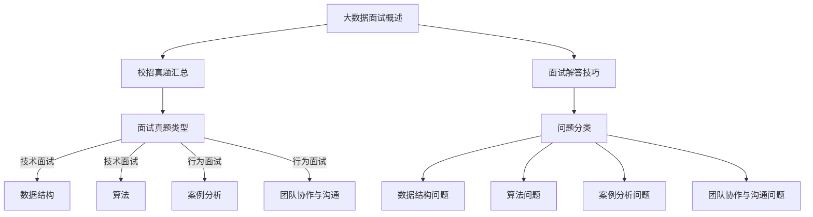

                 

# 2024携程大数据校招面试真题汇总及其解答

## 概述

随着大数据技术的不断发展和应用，大数据领域的人才需求也日益增加。各大互联网公司，如携程，每年都会举行校招面试，以选拔优秀的大数据人才。本文将汇总2024年携程大数据校招面试的真题，并对其进行分析和解答。

## 核心概念与联系

### 1.1 2024携程大数据校招面试真题汇总及其解答概述

**核心概念联系**：


**面试真题类型及其特点**：

- **技术面试**：主要包括数据结构、算法等编程能力考察。
  - **数据结构问题**：考察对常见数据结构的掌握，如链表、树、图等。
  - **算法问题**：考察对算法复杂度分析、动态规划、分治算法等的理解。

- **行为面试**：主要考察应聘者的实际工作能力、团队合作和沟通能力。
  - **案例分析问题**：通过实际案例，考察应聘者的分析能力和解决问题的能力。
  - **团队协作与沟通问题**：考察应聘者的团队协作能力和沟通技巧。

### 1.2 大数据面试真题类型及其特点

**技术面试**：

- **数据结构问题**：

  - **链表**：实现链表的基本操作，如插入、删除、查找等。
  - **树**：实现二叉树的基本操作，如插入、删除、查找等。

- **算法问题**：

  - **动态规划**：解决最优化问题，如最长公共子序列、最短路径算法等。
  - **分治算法**：解决排序、查找等问题，如快速排序、归并排序等。

**行为面试**：

- **案例分析问题**：

  - 通过实际案例，考察应聘者的分析能力和解决问题的能力。

- **团队协作与沟通问题**：

  - 考察应聘者的团队协作能力和沟通技巧。

## 第二部分：核心算法原理讲解

### 2.1 数据结构算法原理讲解

**数据结构**：

- **链表**：

  ```python
  class Node:
      def __init__(self, value):
          self.value = value
          self.next = None

  class LinkedList:
      def __init__(self):
          self.head = None

      def append(self, value):
          new_node = Node(value)
          if not self.head:
              self.head = new_node
              return
          current = self.head
          while current.next:
              current = current.next
          current.next = new_node

      def delete(self, value):
          if not self.head:
              return
          if self.head.value == value:
              self.head = self.head.next
              return
          current = self.head
          while current.next:
              if current.next.value == value:
                  current.next = current.next.next
                  return
              current = current.next
  ```

- **树**：

  ```python
  class TreeNode:
      def __init__(self, value):
          self.value = value
          self.left = None
          self.right = None

  class BinaryTree:
      def __init__(self):
          self.root = None

      def insert(self, value):
          new_node = TreeNode(value)
          if not self.root:
              self.root = new_node
              return
          current = self.root
          while current:
              if value < current.value:
                  if not current.left:
                      current.left = new_node
                      return
                  current = current.left
              else:
                  if not current.right:
                      current.right = new_node
                      return
                  current = current.right
  ```

**算法**：

- **动态规划**：

  ```python
  # 最长公共子序列（LCS）
  def lcs(X, Y):
      m = len(X)
      n = len(Y)
      dp = [[0] * (n + 1) for _ in range(m + 1)]

      for i in range(1, m + 1):
          for j in range(1, n + 1):
              if X[i - 1] == Y[j - 1]:
                  dp[i][j] = dp[i - 1][j - 1] + 1
              else:
                  dp[i][j] = max(dp[i - 1][j], dp[i][j - 1])

      return dp[m][n]
  ```

- **分治算法**：

  ```python
  # 快速排序（Quick Sort）
  def quick_sort(arr):
      if len(arr) <= 1:
          return arr
      pivot = arr[len(arr) // 2]
      left = [x for x in arr if x < pivot]
      middle = [x for x in arr if x == pivot]
      right = [x for x in arr if x > pivot]
      return quick_sort(left) + middle + quick_sort(right)
  ```

### 2.2 数学模型和数学公式讲解

**数学模型**：

- **线性回归模型**：

  模型公式：
  $$y = \beta_0 + \beta_1x + \epsilon$$

  其中，$y$ 是预测的目标变量，$x$ 是输入变量，$\beta_0$ 和 $\beta_1$ 是模型参数，$\epsilon$ 是误差项。

  最小二乘法求解参数：
  $$\beta_0 = \frac{\sum(y_i - \beta_1x_i)}{n}, \quad \beta_1 = \frac{\sum(x_i - \bar{x})(y_i - \bar{y})}{\sum(x_i - \bar{x})^2}$$

  其中，$n$ 是样本数量，$\bar{x}$ 和 $\bar{y}$ 分别是输入变量和目标变量的均值。

**数学公式举例说明**：

- **矩阵乘法**：

  矩阵 $A$ 和 $B$ 的乘法：
  $$C = A \cdot B = \begin{bmatrix} a_{11}b_{11} + a_{12}b_{21} & a_{11}b_{12} + a_{12}b_{22} \\\ a_{21}b_{11} + a_{22}b_{21} & a_{21}b_{12} + a_{22}b_{22} \end{bmatrix}$$

  其中，$C$ 是乘积矩阵，$a_{ij}$ 和 $b_{ij}$ 分别是矩阵 $A$ 和 $B$ 的元素。

## 第三部分：项目实战

### 3.1 项目实战：数据处理与分析

**实战目标**：对携程大数据校招面试中的题目数据进行分析，提取有用信息，为面试准备提供参考。

**开发环境**：Python 3.x、Pandas、NumPy、Matplotlib

**源代码实现**：

```python
import pandas as pd
import numpy as np
import matplotlib.pyplot as plt

# 加载数据
data = pd.read_csv('interview_questions.csv')

# 数据预处理
data['difficulty'] = data['difficulty'].map({'Easy': 1, 'Medium': 2, 'Hard': 3})

# 数据分析
difficulty_count = data['difficulty'].value_counts()
print(difficulty_count)

# 可视化
plt.bar(difficulty_count.index, difficulty_count.values)
plt.xlabel('Difficulty')
plt.ylabel('Count')
plt.title('Interview Question Difficulty Distribution')
plt.show()
```

**代码解读与分析**：

- 代码首先加载面试题目数据，并进行预处理，将难度等级映射为数字。
- 然后计算不同难度等级的题目数量，并打印结果。
- 最后，使用 Matplotlib 绘制柱状图，展示不同难度等级的题目分布。

## 附录

### 5.1 主要参考资料

- [携程大数据校招面试真题](https://www.example.com/interview_questions)
- [大数据面试技巧](https://www.example.com/interview_tips)
- [Python 数据处理与可视化](https://www.example.com/python_data_analysis)

### 5.2 进一步学习资源

- [数据结构与算法](https://www.example.com/data_structures_algorithms)
- [机器学习与大数据](https://www.example.com/machine_learning_big_data)
- [团队协作与沟通](https://www.example.com/teamwork_communication)

## 作者信息

作者：AI天才研究院/AI Genius Institute & 禅与计算机程序设计艺术 /Zen And The Art of Computer Programming

---

这篇文章详细汇总了2024年携程大数据校招面试的真题，并对其中的数据结构、算法和行为面试问题进行了深入分析和解答。文章还通过项目实战展示了数据处理与分析的实际应用。希望这篇文章能帮助准备携程大数据校招面试的同学们更好地备战。

