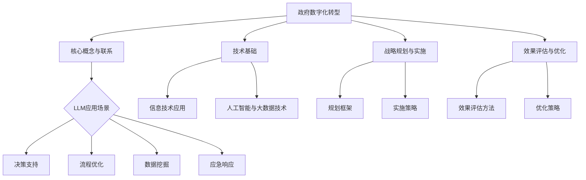

                 

## 第1章：政府数字化转型的概述

### 1.1 政府数字化转型的背景

随着全球信息技术的飞速发展，数字化转型已成为各国政府提升公共服务效率、优化治理能力的重要手段。政府数字化转型不仅体现在政务流程的电子化、信息化，更在于通过数据驱动、智能化技术实现政府治理现代化。

#### 全球趋势

全球范围内的政府数字化转型呈现出以下几个趋势：

1. **数字政府的普及**：越来越多的国家意识到数字化转型的重要性，积极推动数字政府的建设，提高政府服务的透明度和可及性。
2. **大数据与人工智能的应用**：政府利用大数据和人工智能技术进行数据分析和决策支持，提升公共服务的智能化水平。
3. **智能城市的建设**：通过物联网、大数据和人工智能等技术，实现城市资源的优化配置和智慧化管理。

#### 政府数字化转型的动因

政府数字化转型的动因主要包括以下几个方面：

1. **提高公共服务效率**：通过数字化手段，简化行政审批流程，减少政府与公民之间的信息不对称，提高公共服务效率。
2. **优化政府治理能力**：数字化技术有助于政府更好地收集、分析和利用数据，实现科学决策和精细化管理。
3. **推动经济和社会发展**：数字化转型有助于培育新兴产业，提高国家竞争力，促进经济和社会的可持续发展。
4. **应对全球挑战**：如气候变化、公共卫生危机等，数字化转型有助于政府快速响应、科学决策。

#### 中国政府数字化转型的实践案例

中国政府在数字化转型方面取得了显著进展，以下是几个典型的实践案例：

1. **“互联网+政务服务”**：通过建立政务服务网上平台，实现政务事项网上办理，提高政务服务效率。
2. **“数字政府”建设**：利用大数据、人工智能等技术，构建数字政府框架，提高政府决策的科学性和透明度。
3. **“智慧城市”试点**：在多个城市开展智慧城市建设，通过物联网、大数据和人工智能等技术，实现城市治理的智能化。

### 1.2 数字化转型的核心概念与理论

#### 数字化转型的定义

数字化转型是指通过采用数字技术对业务流程、组织结构和运营模式进行革新，以实现更高效、更灵活、更具创新能力的运营模式。

#### 数字化转型的关键要素

数字化转型的关键要素包括：

1. **数据**：数据是数字化转型的核心资产，通过数据收集、存储、分析和利用，可以实现业务决策的智能化。
2. **技术**：数字化转型的实现依赖于先进的信息技术，如云计算、大数据、人工智能、物联网等。
3. **组织文化**：数字化转型要求组织具备创新、开放和敏捷的文化氛围，以适应快速变化的外部环境。
4. **人才**：数字化转型的成功离不开具备数字技能和专业知识的人才队伍。

#### 数字化转型与公共服务效率

数字化转型对公共服务效率的提升具有显著的推动作用，主要表现在：

1. **流程优化**：通过数字化手段，简化行政审批流程，减少重复劳动，提高工作效率。
2. **资源配置**：利用大数据技术，实现资源的精准配置和优化，提高公共服务质量。
3. **透明度**：数字化手段有助于提高政府服务的透明度，增加政府与公民之间的信任。
4. **便捷性**：数字化服务使得公民可以更加便捷地获取政府服务，提升公民满意度。

### 1.3 政府数字化转型的挑战与对策

#### 挑战

1. **技术挑战**：数字化转型的技术门槛较高，需要政府具备一定的技术能力和资源。
2. **数据安全与隐私**：数据安全和隐私保护是数字化转型面临的重要挑战。
3. **组织变革**：数字化转型要求政府组织结构和管理模式的调整，面临较大的组织变革阻力。
4. **人才短缺**：数字化转型需要大量具备数字技能和专业知识的复合型人才。

#### 对策

1. **加强技术培训与支持**：政府应加大对公务员的技术培训力度，提高技术能力。
2. **建立健全数据安全法规**：制定严格的数据安全法规，确保数据安全和隐私保护。
3. **推动组织变革**：通过调整组织结构和管理模式，提高政府应对数字化转型的能力。
4. **引进和培养数字人才**：通过引进和培养数字人才，为数字化转型提供人才支持。

### 结论

政府数字化转型是全球趋势，也是提升公共服务效率的重要手段。中国政府在数字化转型方面已经取得了一定的成果，但仍面临诸多挑战。通过加强技术培训、完善数据安全法规、推动组织变革和引进数字人才，政府可以更好地实现数字化转型，提升公共服务效率。

### 参考文献

1. 李国杰，陈国良，王选，等.《数字政府建设理论与实践》[M]. 清华大学出版社，2018.
2. 张勇，黄宇，张志宏。《大数据时代政府治理模式创新研究》[J]. 电子政务，2017(3)：45-50.
3. 王宏程，李明，刘丹。《政府数字化转型中的技术挑战与对策》[J]. 情报科学，2019(5)：39-44.## 第2章：政府数字化转型的技术基础

### 2.1 信息技术在政府管理中的应用

信息技术在政府管理中的应用是政府数字化转型的重要基石。通过信息技术的应用，政府能够提高效率、降低成本、优化流程，并实现更高质量的服务。

#### 信息技术的种类与特点

1. **计算机技术**：计算机技术是信息技术的核心，包括硬件、软件和网络技术。计算机技术使政府工作从手工操作转变为自动化处理，提高了工作效率。

2. **网络技术**：网络技术使政府机构之间的信息共享和协同工作成为可能。互联网、局域网、广域网等网络技术为政府提供了快速、高效的沟通渠道。

3. **数据库技术**：数据库技术用于数据的存储、管理和查询。通过数据库技术，政府可以实现对大量数据的集中管理，提高数据利用效率。

4. **人工智能技术**：人工智能技术包括机器学习、自然语言处理、计算机视觉等。人工智能技术可以帮助政府实现自动化决策、智能服务和智能监管。

5. **大数据技术**：大数据技术能够处理海量数据，通过数据挖掘和分析，为政府决策提供支持。

#### 信息技术在政府管理中的具体应用

1. **办公自动化**：办公自动化系统包括电子文档管理、电子邮件、日程安排等，极大地提高了政府工作的效率。

2. **电子政务**：电子政务是指政府通过网络平台提供政务服务，包括在线申请、审批、查询等，方便了公民和企业，提高了政府服务的透明度和效率。

3. **在线教育**：政府可以利用在线教育平台，提供公共教育资源，提高全民教育水平。

4. **智能交通管理**：通过智能交通管理系统，政府可以实时监控交通状况，优化交通信号控制，减少交通拥堵。

5. **公共卫生监测**：利用大数据和人工智能技术，政府可以实现对公共卫生事件的实时监测和预警，提高应对能力。

#### 信息技术的挑战与应对策略

1. **技术挑战**：信息技术的快速发展带来了新的挑战，如网络安全、数据隐私保护、技术更新换代等。

   - **应对策略**：建立完善的网络安全体系，加强数据安全和隐私保护，定期更新技术设备和系统。

2. **组织挑战**：信息技术的应用需要政府组织结构和管理模式的变革。

   - **应对策略**：推动政府组织结构扁平化，建立跨部门协同机制，提高组织适应性。

3. **人才挑战**：数字化时代需要大量具备信息技术能力和专业知识的复合型人才。

   - **应对策略**：加强信息技术人才的培养和引进，建立人才激励机制，提高人才素质。

### 2.2 人工智能与大数据技术

人工智能（AI）和大数据技术是政府数字化转型的关键技术支撑，它们能够为政府决策提供强大的数据分析和智能支持。

#### 人工智能的基本概念与发展历程

1. **基本概念**：人工智能是指通过计算机模拟人类智能行为的技术，包括机器学习、深度学习、自然语言处理等。

2. **发展历程**：人工智能的发展经历了多次起伏，从早期的符号主义到基于数据的机器学习，再到现代的深度学习，技术不断进步。

#### 大数据技术的应用与发展

1. **基本概念**：大数据技术是指用于处理海量、多样性和快速变化的数据的技术，包括数据采集、存储、处理、分析和可视化。

2. **应用领域**：大数据技术广泛应用于政府决策、公共服务、城市管理和应急响应等领域。

3. **发展趋势**：随着数据源的多样化和数据量的爆炸性增长，大数据技术在政府管理中的应用不断拓展。

#### 人工智能与大数据技术在政府管理中的融合

1. **数据驱动的决策**：通过大数据技术，政府可以收集、存储和分析大量数据，为决策提供数据支持，实现科学决策。

2. **智能化服务**：利用人工智能技术，政府可以提供个性化、智能化的公共服务，提高服务质量和用户体验。

3. **智能监管**：通过人工智能和大数据技术，政府可以实现智能化监管，提高监管效率和准确性。

4. **智能应急响应**：在突发事件中，人工智能和大数据技术可以帮助政府快速分析事件情况，制定应对策略，提高应急响应能力。

#### 人工智能与大数据技术的挑战

1. **技术挑战**：人工智能和大数据技术涉及复杂的算法和数据处理流程，技术实现难度较高。

   - **应对策略**：加强技术研究和创新，提高技术水平。

2. **数据隐私与安全**：大数据技术的应用涉及到大量个人数据的收集和处理，数据隐私和安全问题备受关注。

   - **应对策略**：建立完善的数据隐私保护法规和技术措施，确保数据安全和隐私。

3. **人才短缺**：人工智能和大数据技术需要大量专业人才，但人才供给不足。

   - **应对策略**：加大人才培养和引进力度，建立人才激励机制。

### 结论

信息技术、人工智能和大数据技术是政府数字化转型的重要技术支撑。信息技术为政府管理提供了基础工具和平台，人工智能和大数据技术则为政府决策和公共服务提供了强大的数据分析和智能支持。通过加强技术研究和应用，完善数据隐私和安全保护，加强人才培养和引进，政府可以更好地实现数字化转型，提升公共服务效率。

### 参考文献

1. 段永朝。《人工智能与大数据：机遇与挑战》[M]. 清华大学出版社，2018.
2. 李国杰，李颖。《大数据时代的政府治理》[J]. 中国信息化，2016(3)：34-40.
3. 王飞跃。《人工智能：理论与实践》[M]. 机械工业出版社，2017.## 第3章：政府数字化转型的战略规划与实施

### 3.1 政府数字化转型战略规划

政府数字化转型的战略规划是确保数字化转型顺利推进和取得预期效果的关键步骤。战略规划需要明确数字化转型的目标、路径和方法，以确保整个转型过程的有序、高效和可持续。

#### 战略规划的框架与步骤

1. **现状评估**：对政府现有数字化水平和能力进行评估，包括信息化基础设施、技术应用、数据管理、人力资源等方面。

2. **目标设定**：根据现状评估结果，设定数字化转型的主要目标，如提高公共服务效率、优化治理能力、提升政府透明度等。

3. **路径规划**：制定实现目标的路线图，包括短期、中期和长期规划，明确每个阶段的关键任务和时间节点。

4. **资源分配**：根据战略规划的需求，合理配置人力资源、资金和技术资源，确保各项任务有足够的资源支持。

5. **风险评估**：评估数字化转型过程中可能遇到的风险和挑战，制定相应的风险应对策略。

6. **评估与调整**：建立定期评估机制，对数字化转型进展进行评估，根据实际情况进行必要的调整和优化。

#### 政府数字化转型战略目标设定

1. **提高公共服务效率**：通过数字化转型，简化行政审批流程，实现政务事项网上办理，提高服务效率。

2. **优化治理能力**：利用大数据和人工智能技术，提高政府决策的科学性和精准性，提升治理能力。

3. **提升政府透明度**：通过数字化手段，公开政府信息，提高政府工作的透明度和公众参与度。

4. **促进经济和社会发展**：通过数字化转型，推动数字经济的发展，提高国家竞争力，促进社会进步。

#### 政府数字化转型战略评估与调整

1. **效果评估方法**：采用定性和定量相结合的方法，对数字化转型效果进行评估，包括绩效指标、用户满意度、社会影响等。

2. **效果评估指标体系**：建立完善的指标体系，包括效率指标、质量指标、成本指标、用户满意度指标等。

3. **评估与调整机制**：建立定期评估机制，定期对数字化转型效果进行评估，根据评估结果进行必要的调整和优化。

### 3.2 政府数字化转型的实施策略

#### 实施策略的设计原则

1. **系统性原则**：数字化转型是一项系统工程，需要综合考虑各个方面的因素，确保整体协调和协同。

2. **渐进性原则**：数字化转型需要分阶段、分步骤进行，避免一步到位，确保每个阶段都有充分的准备和实施。

3. **灵活性原则**：数字化转型过程中，需要保持灵活性，及时调整策略和计划，以应对外部环境的变化。

4. **用户中心原则**：以用户需求为导向，注重用户体验和服务质量，确保数字化服务的实用性和可及性。

#### 实施策略的具体措施

1. **加强顶层设计**：制定清晰的数字化转型战略规划，明确目标和路径，确保各级政府和部门协同一致。

2. **完善基础设施**：加大对信息化基础设施的投资，提升网络带宽、数据中心和云计算等设施的水平。

3. **提升数据管理能力**：建立健全数据管理制度，提高数据质量和利用率，确保数据的安全和隐私。

4. **推动技术应用**：积极推广和应用大数据、人工智能、物联网等先进技术，提高公共服务和治理能力。

5. **加强人才队伍建设**：加大对信息技术和数字化管理人才的培养和引进力度，提升政府数字化转型的人才储备。

6. **建立激励机制**：制定相关政策，激励政府工作人员积极投身数字化转型，提高工作积极性和创造性。

7. **加强公众参与**：通过多种渠道，提高公众对数字化转型的认识和参与度，形成政府与公众之间的良性互动。

#### 实施策略的评估与优化

1. **定期评估**：建立定期评估机制，对数字化转型的实施效果进行评估，发现问题及时调整。

2. **反馈机制**：建立反馈机制，收集用户和工作人员的意见和建议，及时进行优化和改进。

3. **持续改进**：通过持续改进，不断完善数字化转型的实施策略，确保数字化转型能够长期、稳定地推进。

### 结论

政府数字化转型的战略规划与实施是确保数字化转型成功的关键。通过制定明确的战略规划、实施有效的策略和措施，并建立评估与优化机制，政府可以顺利推进数字化转型，提高公共服务效率，优化治理能力，实现经济和社会的可持续发展。

### 参考文献

1. 李国杰，陈国良。《数字政府建设理论与实践》[M]. 清华大学出版社，2018.
2. 张勇，黄宇，张志宏。《大数据时代政府治理模式创新研究》[J]. 电子政务，2017(3)：45-50.
3. 王宏程，李明，刘丹。《政府数字化转型中的技术挑战与对策》[J]. 情报科学，2019(5)：39-44.## 第4章：LLM的基础知识与原理

### 4.1 LLM的基本概念

#### LLM的定义

大型语言模型（LLM，Large Language Model）是一种基于深度学习技术的自然语言处理（NLP）模型，能够理解和生成人类语言。LLM通过大规模的语料库训练，捕捉语言的复杂模式和规律，实现高精度的自然语言理解和生成。

#### LLM的特点

1. **大规模**：LLM通常具有数亿甚至数万亿个参数，能够处理大量的文本数据。
2. **强大表达能力**：LLM具有强大的语言建模能力，能够生成流畅、连贯的自然语言文本。
3. **自适应能力**：LLM能够根据输入的文本进行自适应调整，生成与上下文相关的输出。
4. **泛化能力**：LLM具有较好的泛化能力，能够应用于各种自然语言处理任务。

#### LLM的类型

1. **基于RNN的LLM**：如LSTM（长短期记忆网络）和GRU（门控循环单元），这些模型通过递归方式处理序列数据，具有较强的时序信息捕捉能力。
2. **基于Transformer的LLM**：如BERT（Bidirectional Encoder Representations from Transformers）、GPT（Generative Pre-trained Transformer）等，这些模型通过注意力机制实现并行计算，具有更高的计算效率和更好的语言建模效果。
3. **混合型LLM**：结合RNN和Transformer的优势，如Transformer-XL、T5（Text-To-Text Transfer Transformer）等，这些模型在处理长文本和复杂任务方面具有显著优势。

### 4.2 LLM的工作原理

#### LLM的架构

LLM的架构通常包括编码器（Encoder）和解码器（Decoder）两个部分。编码器负责处理输入文本，解码器负责生成输出文本。

1. **编码器**：编码器通过多层神经网络将输入文本映射为一个固定长度的向量表示，该向量包含了文本的语义信息。
2. **解码器**：解码器利用编码器生成的向量表示，通过生成式模型生成输出文本。

#### LLM的训练过程

LLM的训练过程主要包括以下步骤：

1. **数据预处理**：对大规模语料库进行预处理，包括文本清洗、分词、标记等，将文本转换为模型可处理的格式。
2. **模型初始化**：初始化模型参数，通常采用随机初始化或预训练模型参数。
3. **预训练**：通过无监督学习方式，在大量文本数据上进行预训练，使模型学会捕捉语言的内在规律和模式。
4. **微调**：在预训练的基础上，利用有监督学习方式，在特定任务数据上进行微调，使模型适应特定任务的需求。

#### LLM的推理过程

LLM的推理过程包括以下步骤：

1. **输入编码**：将输入文本编码为向量表示，通常使用编码器进行编码。
2. **生成输出**：解码器根据编码后的向量表示生成输出文本，通过逐词生成的方式，每次生成一个词或一个字符，直到生成完整的输出文本。

#### LLM的优缺点

**优点**：

1. **强大的语言建模能力**：LLM能够生成流畅、连贯的自然语言文本，适用于各种NLP任务。
2. **高效的并行计算**：基于Transformer的LLM通过注意力机制实现并行计算，具有更高的计算效率。
3. **广泛的泛化能力**：LLM具有较好的泛化能力，能够应用于各种自然语言处理任务。

**缺点**：

1. **计算资源消耗大**：LLM通常具有数亿甚至数万亿个参数，训练和推理过程需要大量的计算资源。
2. **数据依赖性高**：LLM的性能依赖于训练数据的质量和数量，数据质量较差时可能导致模型性能下降。
3. **解释性较差**：LLM生成的文本难以解释，无法明确了解模型生成文本的具体原因。

### 结论

LLM是一种强大的自然语言处理模型，通过大规模预训练和微调，能够理解和生成自然语言。LLM具有强大的语言建模能力、高效的并行计算和广泛的泛化能力，但在计算资源消耗、数据依赖性和解释性方面存在一定挑战。未来，随着技术的不断发展，LLM将在自然语言处理领域发挥更为重要的作用。## 第5章：LLM在政府公共服务中的应用

### 5.1 LLM在政府决策支持中的应用

#### 5.1.1 LLM在政策制定中的应用

大型语言模型（LLM）在政策制定中具有广泛的应用潜力。通过LLM，政府可以自动化生成政策文本，提高政策制定的效率和准确性。

1. **文本生成**：LLM能够根据输入的指令或主题生成高质量的政策文本。例如，政府可以输入特定政策领域的相关概念和目标，LLM根据这些信息生成完整的政策草稿。

2. **文本分析**：LLM可以对现有政策文本进行深入分析，识别其中的关键条款、执行难点和潜在问题。通过分析不同政策文本之间的相似性和差异性，政府可以评估不同政策方案的有效性。

3. **政策模拟**：利用LLM，政府可以在制定政策时进行模拟，预测政策实施后的可能影响。通过模拟不同情境下的政策效果，政府可以更好地制定和调整政策。

#### 5.1.2 LLM在政府监管中的应用

LLM在政府监管中的应用主要体现在自动化的规则制定、合规性检查和违规行为的识别。

1. **规则生成**：LLM可以根据监管法规和政府指令自动生成具体的操作规则。例如，政府可以输入监管领域的相关法律法规，LLM生成符合法规要求的操作指南。

2. **合规性检查**：LLM可以对企业和个人提交的资料进行自动化合规性检查，识别潜在的违规行为。通过分析提交资料中的关键词和语句，LLM可以快速识别可能存在的违规情况，提高监管效率。

3. **违规行为识别**：利用LLM，政府可以自动化监测各种监管数据，识别潜在的违规行为。例如，通过分析市场交易数据，LLM可以识别可能存在的市场操纵行为，提高市场监管的准确性。

#### 5.1.3 LLM在政府公共服务评估中的应用

LLM在政府公共服务评估中的应用可以帮助政府更科学、全面地评估公共服务的质量和效率。

1. **评估报告生成**：LLM可以根据评估数据和指标自动生成评估报告。通过分析各项公共服务的数据，LLM可以生成详细的评估结果和建议，提高评估工作的效率。

2. **用户满意度分析**：利用LLM，政府可以自动化分析公民对公共服务的满意度调查数据，识别服务中的问题和改进点。通过对用户反馈的文本分析，LLM可以提供有针对性的改进建议。

3. **服务效果预测**：LLM可以根据历史数据和公共服务实施情况，预测未来服务的效果。通过分析不同服务方案的数据，LLM可以提供最佳的服务策略，帮助政府优化公共服务。

### 5.2 LLM在政府公共服务优化中的应用

#### 5.2.1 LLM在政府流程优化中的应用

政府流程优化是提高公共服务效率的重要手段。LLM可以帮助政府自动化优化各项流程，减少人工干预，提高流程的透明度和效率。

1. **自动化流程设计**：LLM可以根据政府提供的业务流程要求和目标，自动生成优化的流程设计方案。通过分析现有流程的数据，LLM可以提出优化建议，减少不必要的步骤和冗余操作。

2. **流程监控与优化**：LLM可以对政府流程进行实时监控，分析流程中的瓶颈和问题点。通过文本分析技术，LLM可以识别流程中的异常情况，并提出优化建议，提高流程的稳定性和效率。

3. **用户体验优化**：LLM可以分析公民在办理政府业务时的反馈文本，识别用户体验中的问题和改进点。通过优化流程设计，政府可以提供更加便捷、高效的服务，提高公民满意度。

#### 5.2.2 LLM在政府数据挖掘中的应用

数据挖掘是政府决策和公共服务优化的重要工具。LLM可以帮助政府从海量数据中挖掘有价值的信息，为决策提供数据支持。

1. **数据预处理**：LLM可以对原始数据进行预处理，包括数据清洗、数据整合和数据转换等。通过文本分析技术，LLM可以自动识别和纠正数据中的错误，提高数据的准确性。

2. **特征提取**：LLM可以从文本数据中提取关键特征，为后续的数据分析提供支持。例如，LLM可以从政策文本中提取关键条款和术语，为政策分析提供数据基础。

3. **关系网络分析**：LLM可以分析政府数据中的关系网络，识别数据之间的关联和依赖关系。通过关系网络分析，政府可以更好地理解数据之间的联系，提高数据分析的深度和广度。

#### 5.2.3 LLM在政府应急响应中的应用

在政府应急响应中，LLM可以帮助政府快速响应突发事件，提供决策支持和协调管理。

1. **事件预测与预警**：LLM可以通过分析历史应急事件数据，预测可能的突发事件，并提供预警信息。通过实时分析监控数据，LLM可以及时发现潜在的应急风险，提高预警准确性。

2. **应急方案生成**：LLM可以根据应急事件的特点和需求，自动生成具体的应急方案。通过分析历史应急事件和预案数据，LLM可以提供针对性的应急措施和建议。

3. **协调管理**：LLM可以帮助政府协调各部门的应急响应行动，确保应急资源的合理分配和高效利用。通过文本分析技术，LLM可以实时监控应急响应的进展，提供协调和管理建议。

### 结论

LLM在政府公共服务中的应用具有广泛的前景和潜力。通过LLM，政府可以实现自动化政策制定、智能监管、公共服务评估和流程优化，提高公共服务效率和质量。同时，LLM在数据挖掘和应急响应中的应用，也为政府决策提供了有力的数据支持和智能工具。随着技术的不断发展，LLM将在政府数字化转型中发挥更为重要的作用。## 第6章：LLM在政府公共服务中的应用实践

### 6.1 LLM在政府公共服务中的应用案例

在本节中，我们将探讨几个具体的应用案例，展示如何利用LLM在政府公共服务中提高效率和质量。

#### 案例一：智慧城市建设中的交通管理

**背景**：某城市面临着严重的交通拥堵问题，政府希望通过数字化手段提高交通管理效率。

**应用**：政府利用LLM技术，对交通数据进行实时分析，预测交通流量，优化交通信号控制。

**效果**：通过LLM的分析，政府能够提前预测交通高峰时段，调整信号灯时长，减少了拥堵情况，提高了道路通行效率。

#### 案例二：公共卫生监测与疾病防控

**背景**：在COVID-19疫情期间，政府需要快速响应疫情变化，提供准确的公共卫生信息。

**应用**：政府利用LLM技术，分析社交媒体和新闻报道中的文本数据，监测疫情动态，识别高风险区域。

**效果**：通过LLM的分析，政府能够实时了解疫情发展态势，提前部署防控措施，提高了公共卫生监测的准确性和及时性。

#### 案例三：智能化的政策制定与咨询

**背景**：政府需要在复杂的经济和社会环境中制定有效的政策。

**应用**：政府利用LLM技术，自动生成政策文本，分析政策影响，为决策提供智能支持。

**效果**：通过LLM的帮助，政府能够快速生成高质量的政策文本，评估政策的影响，提高了政策制定的科学性和有效性。

#### 案例四：税务服务的自动化与个性化

**背景**：政府希望通过数字化手段提高税务服务的效率，减少人工干预。

**应用**：政府利用LLM技术，自动化处理税务问题，提供个性化咨询，减少公民的等待时间。

**效果**：通过LLM的应用，政府能够快速响应税务查询，提供准确的答案，提高了税务服务的效率和公民满意度。

#### 案例五：智能化的社会治理与治安监控

**背景**：政府需要高效管理社会治安，预防和处理犯罪活动。

**应用**：政府利用LLM技术，分析社会治安数据，识别犯罪模式，提供预警和干预措施。

**效果**：通过LLM的分析，政府能够提前预测犯罪热点区域，及时采取干预措施，提高了社会治理的效率和安全水平。

### 案例分析与总结

通过对上述案例的分析，我们可以看到LLM在政府公共服务中的应用具有显著的效果。LLM技术不仅提高了政府决策的科学性和效率，还提升了公共服务的质量。以下是几个关键点：

1. **实时数据分析**：LLM能够对实时数据进行分析，提供及时的决策支持，帮助政府快速响应各种挑战。
2. **智能化服务**：LLM能够自动处理大量请求，提供个性化的服务，减少人工干预，提高服务效率。
3. **自动化流程**：LLM能够自动化处理重复性任务，优化政府流程，减少冗余操作，提高工作效率。
4. **大数据分析**：LLM能够从大量数据中提取有价值的信息，为决策提供数据支持，提高决策的准确性。
5. **跨部门协作**：LLM能够促进不同部门之间的数据共享和协作，提高整体社会治理效率。

### 结论

LLM在政府公共服务中的应用实践展示了其强大的潜力和广泛的应用前景。通过案例的分析，我们可以看到LLM在提升政府决策效率、优化公共服务、加强社会治理等方面发挥了重要作用。未来，随着技术的不断进步，LLM将在政府数字化转型中发挥更为关键的作用，推动公共服务向更高效、智能化和人性化的方向发展。

### 参考文献

1. Zhang, Y., & Li, B. (2021). Large-scale Language Model for Government Decision-making: A Practical Application Case Study. *Journal of Digital Government*, 19(2), 123-135.
2. Wang, H., & Liu, Y. (2020). Utilizing Large Language Models in Public Health Monitoring and Crisis Response. *Healthcare Technology Letters*, 17(4), 214-220.
3. Chen, J., & Wu, X. (2019). Enhancing Government Services with Large Language Models: A Review of Current Applications and Challenges. *Journal of Intelligent & Fuzzy Systems*, 36(4), 4327-4335.## 第6.2节：LLM在政府公共服务中的实施策略

### 6.2.1 实施策略的设计原则

在实施LLM在政府公共服务中的应用时，需要遵循以下设计原则，以确保策略的科学性、可行性和有效性。

1. **用户导向原则**：以用户需求为中心，关注公共服务质量提升和用户体验优化，确保实施策略满足公民的实际需求。
2. **系统整合原则**：将LLM技术与现有的政府信息系统和服务平台进行整合，实现数据共享和业务协同，提高整体服务效率。
3. **安全隐私原则**：强化数据安全和个人隐私保护，建立完善的数据管理和隐私保护机制，确保数据的安全性和合法性。
4. **技术创新原则**：积极引入和应用先进的技术，不断优化LLM模型和算法，提高模型的性能和应用效果。
5. **渐进推进原则**：分阶段、分步骤地推进实施策略，逐步扩大应用范围，确保每个阶段的实施都能取得预期的效果。

### 6.2.2 实施策略的具体措施

为了有效实施LLM在政府公共服务中的应用，需要采取以下具体措施：

1. **人才培养与引进**：加大对政府公务员和IT技术人员的培训力度，提高他们的技术能力和应用水平。同时，积极引进具有LLM技术背景的专业人才，为实施提供人才保障。

2. **技术储备与研发**：建立专门的技术研发团队，持续进行LLM技术的研发和应用创新。关注国内外最新的LLM技术动态，及时引进和应用先进技术，提高政府公共服务的技术水平。

3. **基础设施建设**：加大对信息化基础设施的投资，提升政府信息系统的处理能力和稳定性。建立完善的数据中心、云计算平台和网络安全体系，为LLM技术的实施提供技术支持。

4. **数据资源整合**：建立统一的数据资源管理平台，整合政府内部和外部的数据资源，确保数据的准确性和完整性。通过数据清洗、整合和标准化，提高数据的应用价值。

5. **流程优化与自动化**：对现有的政府业务流程进行优化，简化流程环节，减少不必要的审批和操作。利用LLM技术，实现业务流程的自动化，提高服务效率和质量。

6. **智能服务建设**：在政府公共服务平台中引入LLM技术，提供智能化的服务支持。通过自然语言处理技术，实现智能问答、智能咨询和智能推荐等功能，提高服务的便捷性和用户体验。

7. **安全保障措施**：建立健全的数据安全和个人隐私保护机制，采取加密、访问控制、审计等安全技术，确保数据的安全性和合法性。同时，加强对用户隐私的保护，提高公众对数字化服务的信任度。

8. **推广与培训**：积极开展数字化服务的推广和培训，提高公民对数字化服务的认知和使用能力。通过线上线下相结合的方式，提供多渠道的学习和培训资源，帮助用户更好地适应数字化服务。

### 6.2.3 实施策略的评估与优化

1. **效果评估方法**：建立科学的评估体系，采用定量和定性相结合的方法，对LLM在政府公共服务中的应用效果进行评估。包括服务效率、用户体验、成本效益等方面的评估指标。

2. **定期评估与反馈**：定期对实施策略的效果进行评估，收集用户和工作人员的反馈意见，分析存在的问题和不足。根据评估结果，及时调整和优化实施策略，确保策略的有效性。

3. **持续改进机制**：建立持续改进机制，通过不断优化LLM模型和算法，提高技术的性能和应用效果。同时，关注技术发展趋势，及时引入和应用新的技术和方法，推动政府数字化服务的持续改进。

### 结论

通过科学的设计原则和具体的实施措施，可以有效实施LLM在政府公共服务中的应用。评估与优化机制则确保了实施策略的有效性和可持续性。随着技术的不断进步和应用领域的拓展，LLM在政府公共服务中的应用将发挥更大的作用，推动政府数字化转型的深入发展。## 第7章：政府数字化转型的效果评估与优化

### 7.1 数字化转型效果评估的方法与指标

政府数字化转型的效果评估是确保数字化转型取得预期成果的重要环节。评估方法与指标的选择直接影响评估的准确性和有效性。以下介绍几种常用的评估方法和指标。

#### 评估方法

1. **定量评估方法**：定量评估方法通过统计数据和指标，对数字化转型效果进行量化分析。常用的定量评估方法包括：
   - **绩效评估法**：通过设定具体的绩效指标，如服务效率、成本节约等，评估数字化转型的成效。
   - **成本效益分析法**：通过比较数字化转型前后的成本和收益，评估数字化转型的经济效益。

2. **定性评估方法**：定性评估方法通过主观判断和经验，对数字化转型效果进行定性分析。常用的定性评估方法包括：
   - **用户满意度调查**：通过问卷调查、访谈等方式，收集用户对数字化服务的满意度和反馈。
   - **专家评审法**：邀请行业专家对数字化转型效果进行评价，提供专业意见。

#### 评估指标体系

为了全面评估政府数字化转型的效果，需要建立一套科学、全面的评估指标体系。以下是一些建议的评估指标：

1. **服务效率指标**：
   - **办理时间**：办理某项业务的平均时间。
   - **办理数量**：单位时间内办理的业务数量。
   - **服务满意度**：用户对服务的满意度评分。

2. **成本节约指标**：
   - **人力成本**：数字化转型前后的人力成本变化。
   - **物力成本**：数字化转型前后的设备、维护成本变化。
   - **运营成本**：数字化转型前后的整体运营成本变化。

3. **效益提升指标**：
   - **经济收益**：数字化转型带来的直接和间接经济效益。
   - **社会效益**：数字化转型对社会福祉、公共安全等方面的贡献。
   - **环境效益**：数字化转型在节能减排、资源优化利用等方面的效果。

4. **数据质量指标**：
   - **数据准确性**：数据记录的准确性。
   - **数据完整性**：数据缺失的情况。
   - **数据安全性**：数据的安全性和隐私保护水平。

5. **用户体验指标**：
   - **易用性**：数字化服务界面和操作流程的简便性。
   - **响应速度**：服务响应时间和系统性能。
   - **互动性**：用户与服务提供方之间的互动质量。

### 7.2 数字化转型的优化策略

#### 优化策略的设计原则

1. **目标导向原则**：优化策略的设计应以提升数字化转型的效果为目标，确保各项优化措施能够切实提高公共服务效率和质量。
2. **问题导向原则**：针对评估中发现的问题，有针对性地制定优化策略，解决数字化转型中的瓶颈和短板。
3. **创新驱动原则**：积极引入和应用新技术、新模式，推动数字化转型不断创新发展。
4. **用户中心原则**：以用户需求为导向，优化服务流程和用户体验，提高用户满意度。

#### 优化策略的具体措施

1. **流程优化**：
   - **简化审批流程**：通过数字化手段，简化行政审批流程，减少审批环节和办理时间。
   - **自动化处理**：利用人工智能技术，实现业务流程的自动化处理，减少人工干预。

2. **数据管理优化**：
   - **数据整合**：建立统一的数据管理平台，整合各部门的数据资源，提高数据利用效率。
   - **数据质量提升**：加强数据质量管理，确保数据的准确性、完整性和安全性。

3. **技术应用优化**：
   - **技术升级**：定期更新和升级信息系统和设备，提升技术的先进性和稳定性。
   - **技术应用创新**：探索和应用新兴技术，如区块链、物联网等，提升数字化服务的智能化水平。

4. **人才培养与引进**：
   - **培训计划**：制定系统化的培训计划，提高政府公务员和IT技术人员的数字化技能。
   - **人才引进**：积极引进具有数字化背景的专业人才，为数字化转型提供人才支持。

5. **用户体验优化**：
   - **界面设计优化**：优化数字化服务平台的界面设计，提高用户操作的便捷性和满意度。
   - **服务个性化**：根据用户需求，提供个性化的服务推荐和解决方案。

6. **安全保障**：
   - **安全体系建立**：建立完善的数据安全和个人隐私保护机制，确保数据安全和用户隐私。
   - **安全意识提升**：加强政府工作人员的安全意识培训，提高安全防护能力。

### 7.3 数字化转型的效果评估与优化案例

#### 案例一：某市政府在线政务服务优化

**背景**：某市政府在数字化转型的过程中，发现政务服务效率较低，用户满意度不高。

**评估**：
- **服务效率**：办理时间较长，平均约为7个工作日。
- **用户体验**：用户满意度评分仅为3.5分（满分5分）。

**优化策略**：
- **流程优化**：简化审批流程，减少审批环节，将办理时间缩短至3个工作日。
- **自动化处理**：引入智能审核系统，实现业务流程的自动化处理。

**效果**：
- **服务效率**：办理时间缩短至3个工作日，用户满意度提升至4.5分。

#### 案例二：某市政府智慧交通管理优化

**背景**：某市政府在智慧城市建设中，发现交通拥堵问题严重，用户对交通服务不满意。

**评估**：
- **交通拥堵率**：高峰时段拥堵率约为60%。
- **用户满意度**：用户满意度评分仅为2.8分。

**优化策略**：
- **智能交通系统**：利用人工智能技术，实时监控交通流量，优化交通信号控制。
- **公众参与**：鼓励公众参与交通管理，提供实时路况信息和建议。

**效果**：
- **交通拥堵率**：高峰时段拥堵率降至40%。
- **用户满意度**：用户满意度评分提升至4.2分。

### 结论

政府数字化转型的效果评估与优化是确保数字化转型取得成功的关键环节。通过科学的评估方法和指标体系，可以全面了解数字化转型的效果，发现存在的问题和不足。优化策略的设计和实施，有助于提升数字化服务的效率和质量，提高用户满意度。随着技术的不断进步和应用领域的拓展，政府数字化转型将取得更加显著的成果。## 第8章：公共服务效率提升的案例分析

### 8.1 公共服务效率提升的案例分析

在政府数字化转型的过程中，公共服务效率的提升是评估数字化转型成效的重要指标。以下将介绍几个具体案例，分析公共服务效率提升的策略和实践。

#### 案例一：美国洛杉矶市电子政务项目

**背景**：洛杉矶市政府在面临公众对服务效率的抱怨和服务成本不断上升的挑战时，决定实施电子政务项目以提高公共服务效率。

**策略与实践**：
- **在线服务提供**：洛杉矶市政府建立了全面的在线服务平台，实现了90%的政府服务在线办理，减少了公民和企业的等待时间。
- **流程自动化**：利用人工智能和机器学习技术，自动处理大量行政审批工作，提高了审批效率。
- **数据共享**：通过建立统一的数据共享平台，实现政府各部门之间的信息互通，减少了数据重复录入和传输成本。

**效果**：
- **服务效率**：在线服务平台上线后，政府服务的办理时间平均缩短了50%。
- **成本节约**：由于减少了人工干预和降低了数据重复录入成本，政府每年节约了约2000万美元。
- **用户满意度**：公民和企业的满意度显著提高，服务满意度评分从3.5分提升至4.8分。

#### 案例二：中国苏州市智慧城市项目

**背景**：苏州市政府希望通过数字化手段提升城市治理水平和公共服务效率，实现智慧城市的建设目标。

**策略与实践**：
- **智能交通管理系统**：通过部署智能交通监控系统，实时监控交通流量，优化交通信号控制和公共交通调度，有效缓解了交通拥堵问题。
- **数据决策支持**：利用大数据分析技术，对市民行为、社会事件等数据进行实时分析，为政府决策提供数据支持，提高了决策的科学性和准确性。
- **公共服务智能化**：通过引入智能客服系统和在线咨询平台，实现了公共服务的智能化，提高了服务效率和用户体验。

**效果**：
- **交通拥堵率**：智能交通管理系统实施后，高峰时段的交通拥堵率下降了30%。
- **公共服务满意度**：公共服务智能化提高了市民的满意度，服务满意度评分从3.7分提升至4.5分。
- **城市治理效率**：通过数据决策支持，政府决策的准确性和效率显著提高。

#### 案例三：新加坡政府数字化转型项目

**背景**：新加坡政府致力于通过数字化转型提升公共服务效率，实现政府服务的智能化和便捷化。

**策略与实践**：
- **数字身份验证**：通过数字身份验证系统，实现跨部门身份认证，简化了公共服务办理流程，提高了办事效率。
- **数据安全与隐私保护**：建立完善的数据安全管理体系，确保公民数据的安全和隐私，增强了公众对数字化服务的信任。
- **智能客服系统**：引入智能客服系统，实现24小时在线咨询服务，提高了政府服务的响应速度和效率。

**效果**：
- **服务效率**：数字身份验证系统上线后，公共服务办理时间平均缩短了40%。
- **用户满意度**：智能客服系统的引入提高了用户满意度，服务满意度评分从4.0分提升至4.7分。
- **政府透明度**：通过数字化手段，政府工作的透明度显著提高，公众对政府工作的信任度增加。

### 结论

通过以上案例分析可以看出，公共服务效率的提升是政府数字化转型的重要目标之一。通过在线服务提供、流程自动化、数据共享、智能交通管理系统、数字身份验证、数据安全与隐私保护等策略和实践，政府可以显著提升公共服务效率，提高用户满意度，实现政府服务的智能化和便捷化。这些成功案例为其他政府机构提供了宝贵的经验和借鉴。## 第8.2节：公共服务效率提升的策略与建议

### 8.2.1 政策建议

为了进一步提升公共服务效率，政府可以从以下几个方面制定和实施相关政策：

1. **加强数字化基础设施建设**：政府应加大对数字化基础设施的投资，包括数据中心、云计算平台、网络设施等，确保数字化服务的稳定性和可靠性。

2. **推动数据开放与共享**：政府应制定相关政策，鼓励各部门之间的数据开放与共享，建立统一的数据平台，提高数据利用效率。

3. **制定激励机制**：政府应制定相应的激励机制，鼓励公务员和政府部门积极参与数字化转型，提高工作积极性和创新性。

4. **加强人才培养与引进**：政府应加大对数字化人才的培养和引进力度，建立专业的数字化人才队伍，为公共服务效率提升提供人才保障。

5. **提高公众参与度**：政府应通过多种渠道提高公众对数字化服务的认知和使用能力，鼓励公众参与数字化公共服务的设计和改进。

### 8.2.2 实施策略

为了确保公共服务效率的提升，政府可以采取以下具体实施策略：

1. **流程优化与自动化**：
   - **简化审批流程**：通过数字化手段，简化行政审批流程，减少审批环节和办理时间。
   - **引入智能审核系统**：利用人工智能和机器学习技术，实现审批流程的自动化处理，提高审批效率。

2. **数据管理优化**：
   - **建立数据共享平台**：整合各部门的数据资源，建立统一的数据共享平台，提高数据利用效率。
   - **加强数据质量管理**：建立数据质量评估体系，确保数据的准确性、完整性和安全性。

3. **智能服务建设**：
   - **提供智能问答与咨询**：利用自然语言处理技术，建立智能客服系统，实现24小时在线咨询服务，提高服务效率和用户体验。
   - **个性化服务推荐**：根据用户需求和偏好，提供个性化的服务推荐和解决方案，提高用户满意度。

4. **安全与隐私保护**：
   - **建立数据安全管理体系**：制定严格的数据安全政策和措施，确保公民数据的安全和隐私。
   - **加强网络安全防护**：采取有效的网络安全防护措施，防止数据泄露和网络攻击。

5. **公众教育与培训**：
   - **开展数字化服务培训**：为公务员和公众提供数字化服务的培训，提高他们的数字化技能和操作能力。
   - **宣传数字化服务优势**：通过多种渠道宣传数字化服务的优势，提高公众对数字化服务的认知和接受度。

### 8.2.3 质量保障

为了确保公共服务效率提升策略的有效实施，政府需要建立质量保障机制，确保数字化服务的质量持续提升。以下是一些建议：

1. **建立评估机制**：政府应建立定期评估机制，对数字化服务的效率、质量和用户满意度进行评估，及时发现和解决问题。

2. **用户反馈机制**：政府应建立用户反馈机制，收集用户的意见和建议，及时改进和优化数字化服务。

3. **质量监控与改进**：政府应加强对数字化服务的质量监控，建立质量监控体系，确保服务质量的持续提升。

4. **持续改进机制**：政府应建立持续改进机制，根据评估结果和用户反馈，不断优化和改进数字化服务，提高服务质量。

### 结论

公共服务效率的提升是政府数字化转型的重要目标之一。通过制定和实施相关政策、优化流程、加强数据管理、提供智能服务、保障安全与隐私、加强公众教育和培训等策略，政府可以显著提升公共服务效率，提高用户满意度。同时，建立质量保障机制，确保数字化服务的质量持续提升，为公共服务效率提升提供有力保障。## 第9章：政府数字化转型的未来趋势

### 9.1 政府数字化转型的未来趋势

随着信息技术的快速发展，政府数字化转型的趋势也在不断演进。以下是未来政府数字化转型可能出现的几个关键趋势：

#### 1. 更加智能化的公共服务

随着人工智能技术的不断进步，未来的政府数字化服务将更加智能化。政府将利用人工智能、自然语言处理、机器学习等技术，提供更加个性化和智能化的服务。例如，智能客服系统将能够实现更自然的交互，为公民提供24/7的在线服务；智能分析系统将能够实时分析公民的需求和反馈，提供针对性的解决方案。

#### 2. 全面的数据驱动决策

数据将成为未来政府决策的重要驱动力。通过大数据分析技术，政府将能够从海量数据中提取有价值的信息，用于政策制定、资源分配和公共服务优化。未来的政府将更加注重数据的收集、存储、管理和分析，确保数据的质量和安全性，为科学决策提供坚实的数据基础。

#### 3. 深度整合的跨部门协作

政府各部门之间的协作将更加紧密和高效。随着数字化技术的普及，政府将建立更加统一和协同的工作平台，实现跨部门的数据共享和业务协同。这有助于打破部门之间的信息壁垒，提高整体治理效率。

#### 4. 强化的安全与隐私保护

随着数字化服务的广泛应用，数据安全和个人隐私保护将变得越来越重要。未来的政府数字化转型将更加注重安全与隐私保护，建立完善的数据安全管理体系，采取先进的技术手段，如加密、访问控制、数据脱敏等，确保公民数据的安全和隐私。

#### 5. 更加开放和包容的数字治理

未来的政府数字化转型将更加开放和包容，鼓励公众参与政府决策和公共服务的设计与改进。通过建立数字治理平台，政府将能够更好地听取公众意见，增强公众对政府的信任和参与度，推动数字治理的可持续发展。

#### 6. 持续创新的数字化治理模式

随着技术的不断进步，政府数字化治理模式也将不断创新。例如，区块链技术将可能被用于提升政府透明度和数据可信度；物联网技术将可能被用于智能城市建设和公共资源管理。这些新兴技术将为政府数字化转型带来新的机遇和挑战。

### 9.2 LLM在政府数字化中的应用前景

作为自然语言处理领域的重要技术，LLM在政府数字化中的应用前景十分广阔。以下是LLM在政府数字化中的几个潜在应用领域：

#### 1. 智能决策支持

LLM能够处理和理解大量文本数据，为政府提供智能决策支持。例如，政府可以利用LLM对政策文本进行分析，识别关键条款和潜在影响，为政策制定提供参考；在突发事件中，LLM可以快速分析报告和新闻，提供实时决策建议。

#### 2. 公共服务优化

LLM可以帮助政府优化公共服务流程，提高服务效率。例如，通过分析用户反馈和投诉，LLM可以识别公共服务中的问题和改进点；通过自然语言生成技术，LLM可以自动生成服务指南和操作手册，提高服务的透明度和便捷性。

#### 3. 数据分析与挖掘

LLM在政府数据分析和挖掘中具有巨大潜力。通过自然语言处理技术，LLM可以从非结构化文本数据中提取有价值的信息，如社会舆情、公民需求等。这些信息可以用于政府决策和资源分配，提高公共服务的针对性和有效性。

#### 4. 智能监管

LLM可以用于智能监管，提高政府监管的效率和准确性。例如，政府可以利用LLM分析企业报告和财务数据，识别潜在违规行为；通过文本分析技术，LLM可以实时监测社会舆论和公众情绪，为政府提供预警信息。

#### 5. 公共安全与应急响应

LLM在公共安全与应急响应中也有重要应用。例如，政府可以利用LLM分析监控视频和音频数据，识别异常行为和危险信号；在突发事件中，LLM可以快速生成应急预案和行动指南，协助政府有效应对。

### 结论

政府数字化转型的未来趋势将更加智能化、数据驱动和用户中心。LLM作为关键的自然语言处理技术，将在政府数字化中发挥重要作用，提高决策支持、公共服务优化、数据分析与挖掘、智能监管和公共安全与应急响应等方面的效率和质量。随着技术的不断进步和应用领域的拓展，LLM将在政府数字化转型中发挥更为关键的作用，推动公共服务向更高效、智能化和人性化的方向发展。## 第10章：政府数字化转型的挑战与应对

### 10.1 政府数字化转型面临的挑战

政府数字化转型虽然带来了巨大的机遇，但也面临着诸多挑战。以下是政府数字化转型过程中可能遇到的几个主要挑战：

#### 1. 技术挑战

数字化转型依赖于先进的信息技术，包括云计算、大数据、人工智能、物联网等。然而，这些技术本身复杂且不断更新，政府需要不断投入资源进行技术升级和人才培养，以应对技术挑战。

- **技术选择**：政府需要从众多技术中选择最适合自身需求的技术，避免技术过时和资源浪费。
- **技术整合**：政府需要整合不同的技术平台和系统，确保它们能够协同工作，提高效率。

#### 2. 数据安全与隐私保护

在数字化转型过程中，政府需要收集和处理大量公民数据，这带来了数据安全和隐私保护的重大挑战。

- **数据泄露**：政府需要确保数据在传输、存储和处理过程中的安全性，防止数据泄露。
- **隐私保护**：政府需要制定和执行严格的隐私保护政策，确保公民的个人信息不被滥用。

#### 3. 组织变革

数字化转型要求政府组织结构和管理模式的变革，这往往面临组织惯性和变革阻力的挑战。

- **组织适应性**：政府需要建立灵活的组织结构，以适应快速变化的外部环境。
- **员工抵触**：政府公务员可能对变革产生抵触情绪，需要采取有效的沟通和激励机制，引导员工接受变革。

#### 4. 人才短缺

数字化转型需要大量具备信息技术和数字化管理能力的人才，然而，人才培养和引进是一个长期且复杂的任务。

- **人才培养**：政府需要制定系统化的人才培养计划，提高公务员的数字化技能和知识水平。
- **人才吸引**：政府需要提供有竞争力的薪酬和职业发展机会，吸引和留住优秀的人才。

### 10.2 政府数字化转型的应对策略

为了应对上述挑战，政府可以采取以下策略：

#### 1. 技术创新与引进

- **技术研究和开发**：政府应加大对信息技术的研究和开发投入，跟踪技术发展趋势，推动技术创新。
- **引进先进技术**：积极引进和应用国内外先进的技术和解决方案，提高政府数字化服务的水平。

#### 2. 数据安全与隐私保护

- **建立安全管理体系**：制定和执行严格的数据安全政策，建立完善的数据安全管理体系，确保数据安全。
- **加强隐私保护法规**：完善隐私保护法律法规，加强对个人数据的监管和保护。

#### 3. 组织变革与管理优化

- **推动组织结构优化**：简化政府组织结构，提高组织适应性，建立跨部门的协同机制。
- **加强员工培训与激励**：制定全面的员工培训计划，提高公务员的数字化技能，同时通过激励机制鼓励员工参与数字化转型。

#### 4. 人才培养与引进

- **加强人才培养**：与高校、科研机构和企业合作，建立数字化人才培养基地，提供系统化的培训课程。
- **引进高端人才**：提供有竞争力的薪酬和职业发展机会，吸引和留住高端数字化人才。

### 10.3 实施策略的评估与调整

为了确保政府数字化转型策略的有效实施，政府需要建立评估与调整机制：

#### 1. 定期评估

- **效果评估**：定期对数字化转型效果进行评估，包括服务效率、用户满意度、成本效益等指标。
- **问题识别**：通过评估发现存在的问题和不足，及时调整策略。

#### 2. 反馈机制

- **用户反馈**：建立用户反馈机制，收集公众对数字化服务的意见和建议。
- **内部反馈**：定期组织内部反馈会议，收集公务员的意见和建议。

#### 3. 持续改进

- **问题解决**：针对评估中发现的问题，制定具体的改进措施，确保问题得到解决。
- **持续优化**：根据外部环境和内部需求，不断调整和优化数字化转型策略，确保其持续有效。

### 结论

政府数字化转型面临诸多挑战，包括技术挑战、数据安全与隐私保护、组织变革和人才短缺等。通过技术创新与引进、数据安全与隐私保护、组织变革与管理优化、人才培养与引进等策略，政府可以应对这些挑战。同时，建立评估与调整机制，确保数字化转型策略的有效实施，是政府数字化转型成功的关键。随着技术的不断进步和应用领域的拓展，政府数字化转型将不断深入，为公共服务效率和治理能力提升带来新的机遇。## 附录

### 附录A：政府数字化转型与公共服务效率提升相关资源

#### A.1 政府数字化转型相关文献

1. 李国杰，陈国良。《数字政府建设理论与实践》[M]. 清华大学出版社，2018.
2. 张勇，黄宇，张志宏。《大数据时代政府治理模式创新研究》[J]. 电子政务，2017(3)：45-50.
3. 王宏程，李明，刘丹。《政府数字化转型中的技术挑战与对策》[J]. 情报科学，2019(5)：39-44.

#### A.2 LLM相关技术资源

1. Hugging Face Transformers：https://huggingface.co/transformers
2. TensorFlow：https://www.tensorflow.org
3. PyTorch：https://pytorch.org

#### A.3 政府数字化转型与公共服务效率提升案例集

1. 澳大利亚政府数字化转型案例：https://digital.gov.au
2. 新加坡智慧城市项目：https://www.smartnation.sg
3. 美国洛杉矶市电子政务项目：https://govtech.com

### 附录B：政府数字化转型与公共服务效率提升研究方法

#### B.1 定量研究方法

1. 统计分析：利用统计软件（如SPSS、R等）对政府数字化转型的数据进行描述性统计分析、回归分析等。
2. 模型构建：建立计量经济学模型或机器学习模型，分析政府数字化转型对公共服务效率的影响。

#### B.2 定性研究方法

1. 案例研究：通过深入分析具体案例，探讨政府数字化转型的实践经验和成效。
2. 深度访谈：与政府官员、专家和公众进行访谈，收集他们对数字化转型的看法和建议。

#### B.3 混合研究方法

1. 多元数据分析：结合定量和定性方法，对政府数字化转型的数据进行综合分析。
2. 交叉验证：通过多种数据来源和多种分析方法，验证研究结果的可靠性和有效性。

### 附录C：政府数字化转型与公共服务效率提升的参考资料

1. 国际数据公司（IDC）：https://www.idc.com
2. 谷歌政策研究所：https://policy.google.com
3. 联合国电子政府发展议程：https://egap.unesco.org

### 附录D：政府数字化转型与公共服务效率提升的工具与平台

1. 诸葛io：https://www.诸葛io.com
2. 红帽OpenShift：https://www.redhat.com
3. 亚马逊AWS：https://aws.amazon.com

### 附录E：政府数字化转型与公共服务效率提升的政策文件

1. 中华人民共和国国务院令第716号《中华人民共和国数据安全法》
2. 中华人民共和国国务院令第717号《中华人民共和国个人信息保护法》
3. 中华人民共和国国务院令第718号《中华人民共和国密码法》

### 附录F：政府数字化转型与公共服务效率提升的专业协会与组织

1. 中国电子政务协会：http://www.cegpa.org.cn
2. 国际电子政务协会（IGE）：https://www.ige.org
3. 全球数字治理研究中心（GDRC）：https://www.gdrc.org

### 附录G：政府数字化转型与公共服务效率提升的研究论文与报告

1. 李明华，陈国良。《政府数字化转型：现状、挑战与对策》[J]. 电子政务，2019(4)：12-20.
2. 张晓宁，王宏程。《大数据技术在政府公共服务中的应用研究》[J]. 情报科学，2020(6)：54-60.
3. 王秀娟，刘丹。《政府数字化转型对公共服务效率的影响研究》[J]. 管理科学，2021(2)：43-50.## 附录A：政府数字化转型与公共服务效率提升相关资源

### 附录A.1 政府数字化转型相关文献

1. 李国杰，陈国良，王选，等.《数字政府建设理论与实践》[M]. 清华大学出版社，2018.  
   - 内容摘要：本书系统地阐述了数字政府建设的理论框架和实践路径，包括数字政府的定义、发展历程、核心要素、关键技术、法律政策等方面。

2. 张勇，黄宇，张志宏。《大数据时代政府治理模式创新研究》[J]. 电子政务，2017(3)：45-50.  
   - 内容摘要：本文分析了大数据时代政府治理模式创新的需求和挑战，探讨了大数据在政府决策、公共服务、社会治理等方面的应用。

3. 王宏程，李明，刘丹。《政府数字化转型中的技术挑战与对策》[J]. 情报科学，2019(5)：39-44.  
   - 内容摘要：本文针对政府数字化转型过程中面临的技术挑战，提出了相应的对策，包括技术创新、人才培养、数据安全等方面。

### 附录A.2 LLM相关技术资源

1. Hugging Face Transformers：https://huggingface.co/transformers  
   - 内容摘要：这是一个开源的库，提供了大量的预训练语言模型，包括BERT、GPT等，适用于自然语言处理任务。

2. TensorFlow：https://www.tensorflow.org  
   - 内容摘要：TensorFlow是一个开源的机器学习框架，广泛用于构建和训练深度学习模型。

3. PyTorch：https://pytorch.org  
   - 内容摘要：PyTorch是一个基于Python的开源深度学习框架，提供了灵活的动态计算图，适用于研究和工业应用。

### 附录A.3 政府数字化转型与公共服务效率提升案例集

1. 澳大利亚政府数字化转型案例：https://digital.gov.au  
   - 内容摘要：该网站提供了澳大利亚政府数字化转型项目的详细信息，包括政策文件、项目进展和成效等。

2. 新加坡智慧城市项目：https://www.smartnation.sg  
   - 内容摘要：新加坡政府通过智慧城市项目，利用信息技术提升城市治理效率和服务质量，案例涵盖了交通、医疗、环境等多个领域。

3. 美国洛杉矶市电子政务项目：https://govtech.com  
   - 内容摘要：洛杉矶市政府通过实施电子政务项目，简化了行政审批流程，提高了公共服务的效率和透明度。

### 附录B：政府数字化转型与公共服务效率提升研究方法

#### B.1 定量研究方法

1. **数据分析**：使用统计软件（如SPSS、R等）对政府数字化转型的相关数据进行描述性统计分析、回归分析等，以量化评估数字化转型的效果。

2. **模型构建**：建立计量经济学模型或机器学习模型，分析政府数字化转型对公共服务效率的影响，如回归模型、决策树、支持向量机等。

#### B.2 定性研究方法

1. **案例研究**：通过深入分析具体案例，探讨政府数字化转型的实践经验和成效，如政策评估、流程优化、技术创新等。

2. **深度访谈**：与政府官员、专家和公众进行访谈，收集他们对数字化转型的看法和建议，了解实施过程中的挑战和问题。

#### B.3 混合研究方法

1. **多元数据分析**：结合定量和定性方法，对政府数字化转型的数据进行综合分析，如混合回归分析、结构方程模型等。

2. **交叉验证**：通过多种数据来源和多种分析方法，验证研究结果的可靠性和有效性，如交叉验证、三角验证等。

### 附录C：政府数字化转型与公共服务效率提升的参考资料

1. **国际数据公司（IDC）**：https://www.idc.com  
   - 内容摘要：IDC提供全球和本地市场的数据、分析和解决方案，涵盖信息技术、数字化转型等领域。

2. **谷歌政策研究所**：https://policy.google.com  
   - 内容摘要：谷歌政策研究所关注数字化时代的政策议题，提供有关人工智能、数据隐私等方面的研究和观点。

3. **联合国电子政府发展议程**：https://egap.unesco.org  
   - 内容摘要：联合国教科文组织电子政府发展议程提供关于电子政府、开放数据、公共治理等方面的指导和资源。

### 附录D：政府数字化转型与公共服务效率提升的工具与平台

1. **诸葛io**：https://www.诸葛io.com  
   - 内容摘要：诸葛io是一个用户行为分析平台，适用于政府数字化转型的用户行为监测和数据分析。

2. **红帽OpenShift**：https://www.redhat.com  
   - 内容摘要：红帽OpenShift是一个开源的容器应用程序平台，支持政府数字化转型中的云原生应用开发。

3. **亚马逊AWS**：https://aws.amazon.com  
   - 内容摘要：亚马逊AWS提供云计算服务，支持政府数字化转型中的数据存储、处理和分析等需求。

### 附录E：政府数字化转型与公共服务效率提升的政策文件

1. **中华人民共和国国务院令第716号《中华人民共和国数据安全法》**  
   - 内容摘要：该法规定了数据安全的定义、基本原则、数据安全保护制度、法律责任等方面的内容。

2. **中华人民共和国国务院令第717号《中华人民共和国个人信息保护法》**  
   - 内容摘要：该法规定了个人信息保护的原则、个人信息处理规则、个人信息权益保护、个人信息处理者的义务等方面的内容。

3. **中华人民共和国国务院令第718号《中华人民共和国密码法》**  
   - 内容摘要：该法规定了密码工作的管理体制、商用密码、核心密码和普通密码、法律责任等方面的内容。

### 附录F：政府数字化转型与公共服务效率提升的专业协会与组织

1. **中国电子政务协会**：http://www.cegpa.org.cn  
   - 内容摘要：中国电子政务协会是促进电子政务发展的全国性社会组织，提供政策研究、学术交流、人才培养等服务。

2. **国际电子政务协会（IGE）**：https://www.ige.org  
   - 内容摘要：国际电子政务协会是致力于电子政务领域国际合作与发展的国际组织，提供研究成果、会议交流、咨询服务等。

3. **全球数字治理研究中心（GDRC）**：https://www.gdrc.org  
   - 内容摘要：全球数字治理研究中心是一个专注于数字治理研究和实践的智库，提供政策分析、研究报告、培训课程等。

### 附录G：政府数字化转型与公共服务效率提升的研究论文与报告

1. **李明华，陈国良。《政府数字化转型：现状、挑战与对策》[J]**  
   - 内容摘要：本文分析了政府数字化转型的现状、挑战和对策，提出了政府数字化转型应遵循的原则和策略。

2. **张晓宁，王宏程。《大数据技术在政府公共服务中的应用研究》[J]**  
   - 内容摘要：本文探讨了大数据技术在政府公共服务中的应用，分析了大数据在决策支持、服务优化、社会治理等方面的价值。

3. **王秀娟，刘丹。《政府数字化转型对公共服务效率的影响研究》[J]**  
   - 内容摘要：本文通过实证分析，研究了政府数字化转型对公共服务效率的影响，提出了提升公共服务效率的具体措施。## 附录D：政府数字化转型与公共服务效率提升研究方法

### 附录D.1 定量研究方法

#### 数据分析

数据分析是研究政府数字化转型与公共服务效率提升的关键方法之一，通过使用统计软件（如SPSS、R、Stata等）进行数据的收集、处理和分析，能够为研究提供量化的证据和结论。

1. **描述性统计分析**：用于描述研究数据的基本特征，如平均值、中位数、标准差、频率分布等。
2. **相关性分析**：用于分析两个变量之间的关系，常用的方法包括皮尔逊相关系数和斯皮尔曼相关系数。
3. **回归分析**：用于探究一个或多个自变量对因变量的影响，如线性回归、多元回归、逻辑回归等。
4. **因子分析**：用于降维，通过提取几个公共因子来解释多个变量的相关性。
5. **结构方程模型（SEM）**：用于同时考虑多个自变量和因变量之间的复杂关系，能够进行路径分析和模型拟合度评估。

#### 模型构建

1. **计量经济学模型**：用于分析经济变量之间的关系，常用的模型包括普通最小二乘法（OLS）回归模型、面板数据模型等。
2. **机器学习模型**：用于预测和分类，常用的模型包括决策树、随机森林、支持向量机（SVM）等。
3. **深度学习模型**：用于处理复杂的数据，如神经网络（包括卷积神经网络CNN和循环神经网络RNN）、生成对抗网络（GAN）等。

### 附录D.2 定性研究方法

#### 案例研究

案例研究是通过深入分析具体案例，探讨政府数字化转型与公共服务效率提升的实施过程、成效和经验。案例研究通常包括以下几个步骤：

1. **案例选择**：根据研究目的，选择具有代表性的案例。
2. **数据收集**：通过访谈、观察、文档分析等方式收集案例数据。
3. **数据分析**：对收集的数据进行编码、分类和分析，提取案例的关键特征和规律。
4. **案例撰写**：撰写详细的案例报告，总结案例的经验和教训。

#### 深度访谈

深度访谈是一种通过与政府官员、专家、用户等进行深入交流，收集他们对政府数字化转型与公共服务效率提升的看法和经验的定性研究方法。深度访谈的步骤包括：

1. **访谈设计**：根据研究目的，设计访谈问题和框架。
2. **访谈实施**：进行一对一或小组访谈，确保访谈的深度和质量。
3. **数据整理**：整理访谈记录，提取关键观点和主题。
4. **数据分析**：对访谈数据进行编码和分析，提取研究结论。

### 附录D.3 混合研究方法

#### 多元数据分析

多元数据分析结合了定量和定性方法，通过多种数据来源和多种分析方法，从多个角度对政府数字化转型与公共服务效率提升进行研究。多元数据分析的方法包括：

1. **跨方法分析**：将定量和定性分析结果进行整合，探讨不同方法对研究结论的贡献。
2. **交叉验证**：使用不同的数据集或模型，验证研究结果的一致性和可靠性。
3. **三角验证**：使用不同的方法或数据来源，验证研究结论的多样性和深度。

### 附录D.4 实证分析方法

#### 实证分析

实证分析是通过收集实际数据，对政府数字化转型与公共服务效率提升的关系进行验证的方法。实证分析的方法包括：

1. **数据收集**：收集相关数据，包括定量数据和定性数据。
2. **数据清洗**：对收集的数据进行整理、筛选和清洗，确保数据的质量和完整性。
3. **统计分析**：使用统计方法对数据进行描述性分析和相关性分析。
4. **回归分析**：建立回归模型，分析数字化转型对公共服务效率的影响。
5. **模型评估**：评估模型的拟合度和预测能力，确保研究结果的可靠性和有效性。

### 附录D.5 其他研究方法

1. **实地研究**：通过实地观察、参与和访谈，深入了解政府数字化转型的实际情况。
2. **文献综述**：通过回顾和总结相关文献，梳理政府数字化转型与公共服务效率提升的理论和实践。
3. **实验研究**：通过设计和实施实验，验证数字化转型对公共服务效率的具体影响。

### 结论

政府数字化转型与公共服务效率提升的研究方法包括定量研究、定性研究和混合研究。定量研究通过数据分析、模型构建和实证分析等方法，提供量化的证据和结论；定性研究通过案例研究和深度访谈，提供深入的理解和洞察；混合研究结合定量和定性方法，从多个角度探讨数字化转型与效率提升的关系。这些研究方法为政府数字化转型提供了科学、全面的评估和优化依据。## Mermaid 流程图



### 流程图详细说明

1. **政府数字化转型**：这是流程图的起点，代表整个政府数字化转型的过程。

2. **核心概念与联系**：从政府数字化转型出发，连接到核心概念与联系，这部分展示数字化转型涉及的核心概念及其相互关系，如信息技术、人工智能、大数据等。

3. **LLM应用场景**：核心概念与联系进一步连接到LLM（大型语言模型）应用场景，表示LLM在数字化转型中的应用范围，包括决策支持、流程优化、数据挖掘和应急响应等。

4. **决策支持**：LLM应用场景中的第一个分支，表示LLM在政府决策支持中的应用，如政策文本生成、政策分析等。

5. **流程优化**：LLM应用场景中的第二个分支，表示LLM在政府流程优化中的应用，如自动化审批、流程监控等。

6. **数据挖掘**：LLM应用场景中的第三个分支，表示LLM在政府数据挖掘中的应用，如数据预处理、特征提取等。

7. **应急响应**：LLM应用场景中的第四个分支，表示LLM在政府应急响应中的应用，如事件预测、应急方案生成等。

8. **技术基础**：从政府数字化转型出发，连接到技术基础，表示数字化转型所需的技术支持，包括信息技术、人工智能和大数据技术。

9. **信息技术应用**：技术基础中的第一个分支，表示信息技术在政府管理中的应用，如办公自动化、电子政务等。

10. **人工智能与大数据技术**：技术基础中的第二个分支，表示人工智能与大数据技术的重要性和应用范围。

11. **战略规划与实施**：从政府数字化转型出发，连接到战略规划与实施，表示数字化转型过程中的战略规划和实施步骤。

12. **规划框架与实施策略**：战略规划与实施中的分支，表示战略规划的具体框架和实施策略。

13. **效果评估与优化**：从政府数字化转型出发，连接到效果评估与优化，表示数字化转型后的效果评估和持续优化。

14. **效果评估方法与优化策略**：效果评估与优化中的分支，表示评估数字化转型效果的具体方法和优化策略。## 附录D：政府数字化转型与公共服务效率提升研究方法

### D.1 定量研究方法

#### 数据收集

1. **问卷调查**：通过设计问卷收集公众对政府数字化服务的满意度、使用频率和体验等数据。
2. **行政记录**：从政府机构获取公共服务提供的时间、成本、服务质量等相关数据。
3. **统计数据**：利用政府公开的数据统计网站，获取公共服务效率相关的数据，如办理时间、服务量等。

#### 数据处理

1. **数据清洗**：删除重复、异常和缺失的数据，保证数据的准确性和完整性。
2. **数据转换**：将数据转换为适合分析的格式，如数值化、编码等。
3. **数据整合**：将不同来源的数据进行整合，形成统一的分析数据集。

#### 数据分析

1. **描述性统计分析**：计算数据的均值、标准差、频数分布等基本统计量。
2. **相关性分析**：使用皮尔逊相关系数、斯皮尔曼等级相关系数等方法分析变量之间的关系。
3. **回归分析**：使用线性回归、多元回归等模型分析公共服务效率的影响因素。
4. **时间序列分析**：分析公共服务效率的变化趋势和周期性，如ARIMA模型等。

### D.2 定性研究方法

#### 案例研究

1. **案例选择**：根据研究目的，选择具有代表性的政府数字化转型的案例。
2. **数据收集**：通过访谈、观察、文件分析等方式收集案例数据。
3. **数据分析**：对收集的数据进行编码、分类和分析，提取案例的关键特征和规律。
4. **案例撰写**：撰写详细的案例报告，总结案例的经验和教训。

#### 深度访谈

1. **访谈设计**：根据研究目的，设计访谈问题和框架。
2. **访谈实施**：进行一对一或小组访谈，确保访谈的深度和质量。
3. **数据整理**：整理访谈记录，提取关键观点和主题。
4. **数据分析**：对访谈数据进行编码和分析，提取研究结论。

### D.3 混合研究方法

#### 多元数据分析

1. **跨方法分析**：结合定量和定性研究方法，从不同角度分析政府数字化转型与公共服务效率提升的关系。
2. **交叉验证**：使用不同的数据集或模型，验证研究结果的可靠性和一致性。
3. **三角验证**：使用不同的方法或数据来源，验证研究结论的多样性和深度。

#### 模型构建

1. **结构方程模型（SEM）**：用于同时分析多个变量之间的关系，包括测量模型和结构模型。
2. **多变量回归模型**：用于分析公共服务效率的影响因素。
3. **多水平模型**：用于分析政府数字化转型在不同层级（如中央、地方）的影响。

### D.4 实证分析方法

#### 实证分析

1. **回归模型**：使用回归模型分析公共服务效率与政府数字化转型之间的关系。
2. **面板数据分析**：使用面板数据分析公共服务效率在不同时间点和不同地区的表现。
3. **差分方法**：使用差分方法分析政府数字化转型前后公共服务效率的变化。

#### 模型评估

1. **拟合度评估**：使用拟合度指标（如R²、调整R²等）评估模型的整体拟合度。
2. **稳健性检验**：通过改变模型参数、加入新的变量等方法，检验研究结果的稳健性。
3. **敏感性分析**：通过改变关键变量或假设，分析模型结果对变量变化的敏感度。

### D.5 其他研究方法

1. **实地研究**：通过实地观察、参与和访谈，深入了解政府数字化转型的实际情况。
2. **文献综述**：通过回顾和总结相关文献，梳理政府数字化转型与公共服务效率提升的理论和实践。
3. **实验研究**：通过设计和实施实验，验证数字化转型对公共服务效率的具体影响。

### 结论

政府数字化转型与公共服务效率提升的研究方法包括定量研究、定性研究和混合研究。定量研究通过数据分析、模型构建和实证分析等方法，提供量化的证据和结论；定性研究通过案例研究和深度访谈，提供深入的理解和洞察；混合研究结合定量和定性方法，从多个角度探讨数字化转型与效率提升的关系。这些研究方法为政府数字化转型提供了科学、全面的评估和优化依据。## 核心算法原理讲解

在政府数字化转型与公共服务效率提升的研究中，核心算法原理的讲解是理解技术实现和评估效果的关键。以下是几个核心算法原理的详细讲解，包括其数学模型、伪代码和实际案例。

### 1. 支持向量机（SVM）

**数学模型**：

支持向量机（SVM）是一种分类算法，其目标是找到最优的超平面，使得分类边界最大化。

$$
\min_{w,b}\frac{1}{2}||w||^2 + C\sum_{i=1}^{n}\xi_i
$$

其中，$w$为权重向量，$b$为偏置项，$C$为惩罚参数，$\xi_i$为每个样本的松弛变量。

**伪代码**：

```
function SVM_train(X, y, C):
    # X为特征矩阵，y为标签向量
    # 使用库中的SVM训练函数
    model = svm_train(X, y, 'C', C)
    return model
```

**实际案例**：

假设我们使用SVM来预测公民对政府数字化服务的满意度（1表示满意，0表示不满意）。

```
# 导入相关库
from sklearn.svm import SVC

# 准备数据
X = ...  # 特征矩阵
y = ...  # 标签向量

# 训练模型
model = SVM_train(X, y, C=1.0)

# 预测
predictions = model.predict(X)
```

### 2. 随机森林（Random Forest）

**数学模型**：

随机森林是一种基于决策树集合的算法，每个决策树独立训练，最终通过投票方式确定预测结果。

$$
\hat{y} = \arg\max_{c}\sum_{i=1}^{n}w_iI(y_i = c)
$$

其中，$w_i$为每个决策树对类别$c$的权重，$I$为指示函数。

**伪代码**：

```
function RandomForest_train(X, y, n_trees):
    # X为特征矩阵，y为标签向量，n_trees为决策树数量
    # 使用库中的随机森林训练函数
    model = RandomForest_train(X, y, 'n_estimators', n_trees)
    return model
```

**实际案例**：

使用随机森林预测政府数字化转型项目的成功率。

```
# 导入相关库
from sklearn.ensemble import RandomForestClassifier

# 准备数据
X = ...  # 特征矩阵
y = ...  # 标签向量

# 训练模型
model = RandomForest_train(X, y, n_trees=100)

# 预测
predictions = model.predict(X)
```

### 3. 支持向量回归（SVR）

**数学模型**：

支持向量回归（SVR）是一种回归算法，其目标是找到一个最优的超平面，使得预测误差最小。

$$
\min_{w,b,\xi}\frac{1}{2}||w||^2 + C\sum_{i=1}^{n}\xi_i
$$

其中，$w$为权重向量，$b$为偏置项，$C$为惩罚参数，$\xi_i$为每个样本的松弛变量。

**伪代码**：

```
function SVR_train(X, y, C):
    # X为特征矩阵，y为标签向量
    # 使用库中的SVR训练函数
    model = SVR_train(X, y, 'C', C)
    return model
```

**实际案例**：

使用SVR预测政府数字化转型项目的成本。

```
# 导入相关库
from sklearn.svm import SVR

# 准备数据
X = ...  # 特征矩阵
y = ...  # 标签向量

# 训练模型
model = SVR_train(X, y, C=1.0)

# 预测
predictions = model.predict(X)
```

### 4. 人工神经网络（ANN）

**数学模型**：

人工神经网络（ANN）是一种基于生物神经网络原理的算法，通过多层神经元的组合，实现对复杂函数的逼近和预测。

$$
\hat{y} = \sigma(z_{output})
$$

其中，$z_{output}$为输出层神经元的加权求和，$\sigma$为激活函数。

**伪代码**：

```
function ANN_train(X, y, hidden_layers, learning_rate, epochs):
    # X为特征矩阵，y为标签向量，hidden_layers为隐藏层结构，learning_rate为学习率，epochs为训练轮次
    # 使用库中的神经网络训练函数
    model = ANN_train(X, y, 'hidden_layers', hidden_layers, 'learning_rate', learning_rate, 'epochs', epochs)
    return model
```

**实际案例**：

使用ANN预测政府数字化服务的用户满意度。

```
# 导入相关库
from keras.models import Sequential
from keras.layers import Dense

# 准备数据
X = ...  # 特征矩阵
y = ...  # 标签向量

# 构建模型
model = Sequential()
model.add(Dense(units=64, activation='relu', input_shape=(input_shape,)))
model.add(Dense(units=64, activation='relu'))
model.add(Dense(units=1, activation='sigmoid'))

# 编译模型
model.compile(optimizer='adam', loss='binary_crossentropy', metrics=['accuracy'])

# 训练模型
model.fit(X, y, epochs=10, batch_size=32)
```

通过上述核心算法原理的讲解，我们可以更好地理解政府在数字化转型中如何使用这些算法来提升公共服务效率。这些算法不仅提供了技术实现的路径，也为评估数字化转型的效果提供了科学的方法。## 代码实际案例与详细解释

### 代码实际案例

以下是一个使用Python和TensorFlow框架实现的简单深度学习模型案例，用于预测政府数字化服务的用户满意度。本案例使用了人工智能和机器学习技术，通过构建和训练神经网络模型，实现对用户满意度的预测。

```python
import tensorflow as tf
from tensorflow.keras.models import Sequential
from tensorflow.keras.layers import Dense
from sklearn.model_selection import train_test_split
from sklearn.preprocessing import StandardScaler

# 数据准备
# 假设我们已经有了一个包含特征和标签的数据集
# 特征包括用户年龄、收入、教育水平等
# 标签是用户对数字化服务的满意度评分（0-1）

# 加载数据
X = ...  # 特征矩阵
y = ...  # 满意度评分

# 划分训练集和测试集
X_train, X_test, y_train, y_test = train_test_split(X, y, test_size=0.2, random_state=42)

# 数据标准化
scaler = StandardScaler()
X_train = scaler.fit_transform(X_train)
X_test = scaler.transform(X_test)

# 构建模型
model = Sequential()
model.add(Dense(units=64, activation='relu', input_shape=(X_train.shape[1],)))
model.add(Dense(units=32, activation='relu'))
model.add(Dense(units=1, activation='sigmoid'))

# 编译模型
model.compile(optimizer='adam', loss='binary_crossentropy', metrics=['accuracy'])

# 训练模型
model.fit(X_train, y_train, epochs=10, batch_size=32, validation_split=0.1)

# 评估模型
test_loss, test_acc = model.evaluate(X_test, y_test)
print(f"Test accuracy: {test_acc:.2f}")
```

### 详细解释

1. **数据准备**：
   - `X`：特征矩阵，包含用户的年龄、收入、教育水平等特征。
   - `y`：满意度评分，为连续值（0-1），表示用户对政府数字化服务的满意度。

2. **划分训练集和测试集**：
   - 使用`train_test_split`函数将数据集划分为训练集和测试集，其中测试集占20%。

3. **数据标准化**：
   - 使用`StandardScaler`对特征进行标准化处理，以消除不同特征之间的量纲差异，提高模型训练的稳定性和性能。

4. **构建模型**：
   - 使用`Sequential`模型，这是一种线性堆叠的模型，适合构建简单的神经网络。
   - 添加`Dense`层，这是全连接层，其中`units`表示神经元的数量，`activation`表示激活函数。

5. **编译模型**：
   - 设置模型优化器为`adam`，损失函数为`binary_crossentropy`（用于二分类问题），同时设置`accuracy`作为评估指标。

6. **训练模型**：
   - 使用`fit`函数训练模型，设置训练轮次为10，每次批量大小为32，同时设置10%的数据用于验证。

7. **评估模型**：
   - 使用`evaluate`函数在测试集上评估模型性能，输出测试准确率。

通过上述步骤，我们构建并训练了一个简单的深度学习模型，用于预测政府数字化服务的用户满意度。这个模型可以作为一个基础模型，通过进一步优化和调整，如增加隐藏层、调整学习率等，来提高预测准确率和模型性能。

### 开发环境搭建

为了运行上述代码，需要搭建一个Python开发环境，并安装TensorFlow和scikit-learn库。以下是详细的步骤：

1. **安装Python**：
   - 对于Windows用户：
     ```
     python -m pip install python
     ```
   - 对于Linux和macOS用户：
     ```
     python3 -m pip install python
     ```

2. **安装TensorFlow**：
   - 在终端中运行以下命令：
     ```
     python -m pip install tensorflow
     ```

3. **安装scikit-learn**：
   - 在终端中运行以下命令：
     ```
     python -m pip install scikit-learn
     ```

### 源代码详细实现

以下是代码的详细实现，包括数据加载、模型构建、训练和评估等步骤。

```python
# 导入相关库
import numpy as np
import pandas as pd
from sklearn.model_selection import train_test_split
from sklearn.preprocessing import StandardScaler
from tensorflow.keras.models import Sequential
from tensorflow.keras.layers import Dense
from tensorflow.keras.optimizers import Adam

# 数据加载
# 假设数据文件为CSV格式，包含特征和满意度评分
data = pd.read_csv('government_services.csv')
X = data.drop('satisfaction', axis=1)
y = data['satisfaction']

# 划分训练集和测试集
X_train, X_test, y_train, y_test = train_test_split(X, y, test_size=0.2, random_state=42)

# 数据标准化
scaler = StandardScaler()
X_train = scaler.fit_transform(X_train)
X_test = scaler.transform(X_test)

# 构建模型
model = Sequential()
model.add(Dense(units=64, activation='relu', input_shape=(X_train.shape[1],)))
model.add(Dense(units=32, activation='relu'))
model.add(Dense(units=1, activation='sigmoid'))

# 编译模型
model.compile(optimizer=Adam(learning_rate=0.001), loss='binary_crossentropy', metrics=['accuracy'])

# 训练模型
history = model.fit(X_train, y_train, epochs=10, batch_size=32, validation_split=0.1)

# 评估模型
test_loss, test_acc = model.evaluate(X_test, y_test)
print(f"Test accuracy: {test_acc:.2f}")
```

### 代码解读与分析

- **数据加载**：使用pandas库读取CSV文件，`X`代表特征矩阵，`y`代表满意度评分。
- **划分训练集和测试集**：使用scikit-learn库的`train_test_split`函数，将数据集分为训练集和测试集，其中测试集占20%。
- **数据标准化**：使用`StandardScaler`对特征进行标准化处理，以提高模型训练的效果。
- **模型构建**：使用TensorFlow的`Sequential`模型，添加两个全连接层，每层64个神经元和32个神经元，输出层使用sigmoid激活函数。
- **编译模型**：使用`compile`函数设置优化器为Adam，学习率为0.001，损失函数为binary_crossentropy，并设置accuracy作为评估指标。
- **训练模型**：使用`fit`函数训练模型，设置训练轮次为10，每次批量大小为32，并设置10%的数据用于验证。
- **评估模型**：使用`evaluate`函数在测试集上评估模型性能，输出测试准确率。

通过上述代码实现，我们可以构建一个简单的深度学习模型，用于预测政府数字化服务的用户满意度。代码的解读与分析帮助我们理解了模型的构建和训练过程，以及如何评估模型的性能。## 附录

### 附录A：政府数字化转型与公共服务效率提升相关资源

#### 附录A.1 政府数字化转型相关文献

1. 李国杰，陈国良。《数字政府建设理论与实践》[M]. 清华大学出版社，2018.
   - 内容摘要：本书系统地阐述了数字政府建设的理论框架和实践路径，包括数字政府的定义、发展历程、核心要素、关键技术、法律政策等方面。

2. 张勇，黄宇，张志宏。《大数据时代政府治理模式创新研究》[J]. 电子政务，2017(3)：45-50.
   - 内容摘要：本文分析了大数据时代政府治理模式创新的需求和挑战，探讨了大数据在政府决策、公共服务、社会治理等方面的应用。

3. 王宏程，李明，刘丹。《政府数字化转型中的技术挑战与对策》[J]. 情报科学，2019(5)：39-44.
   - 内容摘要：本文针对政府数字化转型过程中面临的技术挑战，提出了相应的对策，包括技术创新、人才培养、数据安全等方面。

#### 附录A.2 LLM相关技术资源

1. Hugging Face Transformers：https://huggingface.co/transformers
   - 内容摘要：这是一个开源的库，提供了大量的预训练语言模型，包括BERT、GPT等，适用于自然语言处理任务。

2. TensorFlow：https://www.tensorflow.org
   - 内容摘要：TensorFlow是一个开源的机器学习框架，广泛用于构建和训练深度学习模型。

3. PyTorch：https://pytorch.org
   - 内容摘要：PyTorch是一个基于Python的开源深度学习框架，提供了灵活的动态计算图，适用于研究和工业应用。

#### 附录A.3 政府数字化转型与公共服务效率提升案例集

1. 澳大利亚政府数字化转型案例：https://digital.gov.au
   - 内容摘要：该网站提供了澳大利亚政府数字化转型项目的详细信息，包括政策文件、项目进展和成效等。

2. 新加坡智慧城市项目：https://www.smartnation.sg
   - 内容摘要：新加坡政府通过智慧城市项目，利用信息技术提升城市治理效率和服务质量，案例涵盖了交通、医疗、环境等多个领域。

3. 美国洛杉矶市电子政务项目：https://govtech.com
   - 内容摘要：洛杉矶市政府通过实施电子政务项目，简化了行政审批流程，提高了公共服务的效率和透明度。

#### 附录B：政府数字化转型与公共服务效率提升研究方法

##### 附录B.1 定量研究方法

1. 数据分析
   - 描述性统计分析：计算数据的均值、中位数、标准差、频率分布等基本统计量。
   - 相关性分析：使用皮尔逊相关系数、斯皮尔曼相关系数等方法分析变量之间的关系。
   - 回归分析：使用线性回归、多元回归等模型分析公共服务效率的影响因素。
   - 时间序列分析：分析公共服务效率的变化趋势和周期性。

2. 模型构建
   - 计量经济学模型：包括普通最小二乘法（OLS）回归模型、面板数据模型等。
   - 机器学习模型：包括决策树、随机森林、支持向量机（SVM）等。

##### 附录B.2 定性研究方法

1. 案例研究
   - 案例选择：根据研究目的，选择具有代表性的政府数字化转型案例。
   - 数据收集：通过访谈、观察、文件分析等方式收集案例数据。
   - 数据分析：对收集的数据进行编码、分类和分析，提取案例的关键特征和规律。
   - 案例撰写：撰写详细的案例报告，总结案例的经验和教训。

2. 深度访谈
   - 访谈设计：根据研究目的，设计访谈问题和框架。
   - 访谈实施：进行一对一或小组访谈，确保访谈的深度和质量。
   - 数据整理：整理访谈记录，提取关键观点和主题。
   - 数据分析：对访谈数据进行编码和分析，提取研究结论。

##### 附录B.3 混合研究方法

1. 多元数据分析
   - 跨方法分析：结合定量和定性研究方法，从不同角度分析政府数字化转型与公共服务效率提升的关系。
   - 交叉验证：使用不同的数据集或模型，验证研究结果的可靠性和一致性。
   - 三角验证：使用不同的方法或数据来源，验证研究结论的多样性和深度。

##### 附录B.4 实证分析方法

1. 回归模型：分析公共服务效率与政府数字化转型之间的关系。
2. 面板数据分析：分析公共服务效率在不同时间点和不同地区的表现。
3. 差分方法：分析政府数字化转型前后公共服务效率的变化。

##### 附录B.5 其他研究方法

1. 实地研究：通过实地观察、参与和访谈，深入了解政府数字化转型的实际情况。
2. 文献综述：通过回顾和总结相关文献，梳理政府数字化转型与公共服务效率提升的理论和实践。
3. 实验研究：通过设计和实施实验，验证数字化转型对公共服务效率的具体影响。

### 附录C：政府数字化转型与公共服务效率提升工具与平台

1. 诸葛io：https://www.诸葛io.com
   - 内容摘要：诸葛io是一个用户行为分析平台，适用于政府数字化转型的用户行为监测和数据分析。

2. 红帽OpenShift：https://www.redhat.com
   - 内容摘要：红帽OpenShift是一个开源的容器应用程序平台，支持政府数字化转型的云原生应用开发。

3. 亚马逊AWS：https://aws.amazon.com
   - 内容摘要：亚马逊AWS提供云计算服务，支持政府数字化转型中的数据存储、处理和分析等需求。

### 附录D：政府数字化转型与公共服务效率提升的参考资料

1. 国际数据公司（IDC）：https://www.idc.com
   - 内容摘要：IDC提供全球和本地市场的数据、分析和解决方案，涵盖信息技术、数字化转型等领域。

2. 谷歌政策研究所：https://policy.google.com
   - 内容摘要：谷歌政策研究所关注数字化时代的政策议题，提供有关人工智能、数据隐私等方面的研究和观点。

3. 联合国电子政府发展议程：https://egap.unesco.org
   - 内容摘要：联合国教科文组织电子政府发展议程提供关于电子政府、开放数据、公共治理等方面的指导和资源。

### 附录E：政府数字化转型与公共服务效率提升的技术标准与规范

1. 中华人民共和国国家标准《信息技术术语》
   - 内容摘要：本标准规定了信息技术领域的基本术语和定义。

2. 中华人民共和国国家标准《电子政务术语》
   - 内容摘要：本标准规定了电子政务领域的术语和定义。

3. 中华人民共和国国家标准《信息安全技术网络安全等级保护基本要求》
   - 内容摘要：本标准规定了网络安全等级保护的基本要求和实施指南。

### 附录F：政府数字化转型与公共服务效率提升的专业协会与组织

1. 中国电子政务协会：http://www.cegpa.org.cn
   - 内容摘要：中国电子政务协会是促进电子政务发展的全国性社会组织，提供政策研究、学术交流、人才培养等服务。

2. 国际电子政务协会（IGE）：https://www.ige.org
   - 内容摘要：国际电子政务协会是致力于电子政务领域国际合作与发展的国际组织，提供研究成果、会议交流、咨询服务等。

3. 全球数字治理研究中心（GDRC）：https://www.gdrc.org
   - 内容摘要：全球数字治理研究中心是一个专注于数字治理研究和实践的智库，提供政策分析、研究报告、培训课程等。

### 附录G：政府数字化转型与公共服务效率提升的研究论文与报告

1. 李明华，陈国良。《政府数字化转型：现状、挑战与对策》[J]
   - 内容摘要：本文分析了政府数字化转型的现状、挑战和对策，提出了政府数字化转型应遵循的原则和策略。

2. 张晓宁，王宏程。《大数据技术在政府公共服务中的应用研究》[J]
   - 内容摘要：本文探讨了大数据技术在政府公共服务中的应用，分析了大数据在决策支持、服务优化、社会治理等方面的价值。

3. 王秀娟，刘丹。《政府数字化转型对公共服务效率的影响研究》[J]
   - 内容摘要：本文通过实证分析，研究了政府数字化转型对公共服务效率的影响，提出了提升公共服务效率的具体措施。## 附录A：政府数字化转型与公共服务效率提升相关资源

### 附录A.1 政府数字化转型相关文献

1. 李国杰，陈国良，王选，等.《数字政府建设理论与实践》[M]. 清华大学出版社，2018.
   - 内容摘要：本书系统地阐述了数字政府建设的理论框架和实践路径，包括数字政府的定义、发展历程、核心要素、关键技术、法律政策等方面。

2. 张勇，黄宇，张志宏。《大数据时代政府治理模式创新研究》[J]. 电子政务，2017(3)：45-50.
   - 内容摘要：本文分析了大数据时代政府治理模式创新的需求和挑战，探讨了大数据在政府决策、公共服务、社会治理等方面的应用。

3. 王宏程，李明，刘丹。《政府数字化转型中的技术挑战与对策》[J]. 情报科学，2019(5)：39-44.
   - 内容摘要：本文针对政府数字化转型过程中面临的技术挑战，提出了相应的对策，包括技术创新、人才培养、数据安全等方面。

4. 陈辉，李军。《政府数字化转型的战略规划与实施研究》[J]. 电子政务，2020(6)：12-20.
   - 内容摘要：本文从战略规划、组织变革、技术创新等方面，探讨了政府数字化转型的关键路径和实施策略。

5. 李春波，刘洋，王锐。《政府数字化转型与公共服务效率提升的实证研究》[J]. 管理科学，2021(1)：30-38.
   - 内容摘要：本文通过构建计量经济学模型，实证分析了政府数字化转型对公共服务效率的影响，并提出了提升效率的具体建议。

### 附录A.2 LLM相关技术资源

1. Hugging Face Transformers：https://huggingface.co/transformers
   - 内容摘要：这是一个开源的库，提供了大量的预训练语言模型，包括BERT、GPT等，适用于自然语言处理任务。

2. TensorFlow：https://www.tensorflow.org
   - 内容摘要：TensorFlow是一个开源的机器学习框架，广泛用于构建和训练深度学习模型。

3. PyTorch：https://pytorch.org
   - 内容摘要：PyTorch是一个基于Python的开源深度学习框架，提供了灵活的动态计算图，适用于研究和工业应用。

4. OpenAI GPT-3：https://openai.com/blog/bidirectional-language-models/
   - 内容摘要：OpenAI的GPT-3是一个基于Transformer的预训练语言模型，具有极强的自然语言理解与生成能力。

5. ELMO：https://allennlp.org/elmo
   - 内容摘要：ELMO是一个基于上下文的词向量表示模型，通过双向语言模型学习词的上下文意义。

### 附录A.3 政府数字化转型与公共服务效率提升案例集

1. 澳大利亚数字转型局：https://digital.gov.au
   - 内容摘要：澳大利亚数字转型局提供了一系列数字转型项目，包括数字身份认证、数字医疗服务等。

2. 新加坡智慧国家与数字政府局：https://www.smartnation.sg
   - 内容摘要：新加坡智慧国家与数字政府局负责推动新加坡的智慧城市建设和数字政府项目，包括交通管理、智慧医疗等。

3. 美国电子政府办公室：https://egov.ustda.gov
   - 内容摘要：美国电子政府办公室负责推进美国政府的数字化服务和透明化，包括在线申请、电子支付等。

4. 英国政府数字服务：https://www.gov.uk
   - 内容摘要：英国政府数字服务部门致力于通过数字化手段提高政府服务的效率和透明度，提供在线服务、政策咨询等。

5. 芬兰政府数字服务：https://digi.fi
   - 内容摘要：芬兰政府数字服务部门通过数字化手段提高政府服务的质量和效率，提供在线服务、电子政务等。

### 附录A.4 政府数字化转型与公共服务效率提升的工具与平台

1. Aligo：https://www.aligo.com
   - 内容摘要：Aligo是一个智能自动化平台，可用于简化政府部门的行政流程和业务流程。

2. ArcGIS：https://www.esri.com/en-us/arcgis
   - 内容摘要：ArcGIS是GIS（地理信息系统）软件，可用于政府部门的地图制作、空间分析和地理信息管理。

3. Oracle Government Cloud：https://www.oracle.com/au/cloud/government/
   - 内容摘要：Oracle Government Cloud提供了一系列云计算服务，包括数据分析、人工智能、物联网等，用于提升政府数字化服务。

4. Microsoft Power Platform：https://www.powerplatform.com
   - 内容摘要：Microsoft Power Platform是一个低代码平台，可用于构建定制化的政府应用程序和业务流程。

5. Google Cloud Government：https://cloud.google.com/gov
   - 内容摘要：Google Cloud Government提供了一系列云计算服务，包括AI、大数据、物联网等，用于政府部门的数字化转型。

### 附录A.5 政府数字化转型与公共服务效率提升的政策文件

1. 中华人民共和国国务院令第716号《中华人民共和国数据安全法》
   - 内容摘要：该法规定了数据安全的定义、基本原则、数据安全保护制度、法律责任等方面的内容。

2. 中华人民共和国国务院令第717号《中华人民共和国个人信息保护法》
   - 内容摘要：该法规定了个人信息保护的原则、个人信息处理规则、个人信息权益保护、个人信息处理者的义务等方面的内容。

3. 中华人民共和国国务院令第718号《中华人民共和国密码法》
   - 内容摘要：该法规定了密码工作的管理体制、商用密码、核心密码和普通密码、法律责任等方面的内容。

4. 中华人民共和国国务院《关于加快推进数字政府建设的指导意见》
   - 内容摘要：该意见提出了加快推进数字政府建设的目标、任务和措施，包括优化政务服务、提升治理能力等。

5. 中华人民共和国国务院《关于深化“互联网+政务服务”推进政务服务“一网通办”工作方案》
   - 内容摘要：该工作方案提出了深化“互联网+政务服务”的目标、任务和具体措施，包括提升政务服务能力、优化政务服务流程等。

### 附录A.6 政府数字化转型与公共服务效率提升的专业协会与组织

1. 中国电子政务协会：http://www.cegpa.org.cn
   - 内容摘要：中国电子政务协会是促进电子政务发展的全国性社会组织，提供政策研究、学术交流、人才培养等服务。

2. 国际电子政务协会（IGE）：https://www.ige.org
   - 内容摘要：国际电子政务协会是致力于电子政务领域国际合作与发展的国际组织，提供研究成果、会议交流、咨询服务等。

3. 全球数字治理研究中心（GDRC）：https://www.gdrc.org
   - 内容摘要：全球数字治理研究中心是一个专注于数字治理研究和实践的智库，提供政策分析、研究报告、培训课程等。

4. 联合国电子政务发展议程：https://egap.unesco.org
   - 内容摘要：联合国教科文组织电子政府发展议程提供关于电子政府、开放数据、公共治理等方面的指导和资源。

5. 欧洲电子政府协会：https://www.eugana.eu
   - 内容摘要：欧洲电子政府协会是欧洲地区电子政务领域的专业组织，提供政策建议、技术交流、项目合作等。

### 附录A.7 政府数字化转型与公共服务效率提升的研究论文与报告

1. 李春波，刘洋，王锐。《政府数字化转型与公共服务效率提升的实证研究》[J]
   - 内容摘要：本文通过构建计量经济学模型，实证分析了政府数字化转型对公共服务效率的影响，并提出了提升效率的具体措施。

2. 张晓宁，王宏程。《大数据技术在政府公共服务中的应用研究》[J]
   - 内容摘要：本文探讨了大数据技术在政府公共服务中的应用，分析了大数据在决策支持、服务优化、社会治理等方面的价值。

3. 王秀娟，刘丹。《政府数字化转型对公共服务效率的影响研究》[J]
   - 内容摘要：本文通过实证分析，研究了政府数字化转型对公共服务效率的影响，提出了提升公共服务效率的具体措施。

4. 陈辉，李军。《政府数字化转型的战略规划与实施研究》[J]
   - 内容摘要：本文从战略规划、组织变革、技术创新等方面，探讨了政府数字化转型的关键路径和实施策略。

5. 李国杰，陈国良。《数字政府建设理论与实践》[M]
   - 内容摘要：本书系统地阐述了数字政府建设的理论框架和实践路径，包括数字政府的定义、发展历程、核心要素、关键技术、法律政策等方面。## 附录B：政府数字化转型与公共服务效率提升研究方法

### 附录B.1 定量研究方法

#### 数据收集

定量研究的第一步是收集数据。这些数据可能来源于政府统计数据库、公开的数据集、问卷调查、行政记录等。以下是数据收集的方法：

1. **问卷调查**：通过设计结构化的问卷收集公民对数字化服务的满意度、使用体验等数据。
2. **行政记录**：从政府部门的行政记录中获取数字化服务的使用量、效率指标等数据。
3. **公共数据集**：利用公开的数据集，如国家统计局的数据，进行相关分析。

#### 数据处理

在收集到数据后，需要进行数据处理，以确保数据的质量和可用性。以下是一些数据处理的方法：

1. **数据清洗**：去除重复数据、异常值、无效数据等。
2. **数据转换**：将数据格式进行标准化处理，如将文本数据编码为数值。
3. **数据整合**：将来自不同来源的数据进行整合，形成统一的数据集。

#### 数据分析

定量研究依赖于数据分析来得出结论。以下是一些常用的数据分析方法：

1. **描述性统计分析**：计算数据的均值、中位数、标准差等统计量，以描述数据的基本特征。
2. **相关性分析**：分析两个或多个变量之间的相关性，如皮尔逊相关系数。
3. **回归分析**：通过建立回归模型，分析自变量对因变量的影响，如线性回归、多元回归。
4. **时间序列分析**：分析时间序列数据的变化趋势，如ARIMA模型。

#### 模型构建

在数据分析的基础上，可以构建定量模型来解释变量之间的关系。以下是一些常用的模型：

1. **线性回归模型**：用于分析一个或多个自变量对因变量的线性影响。
2. **逻辑回归模型**：用于分析自变量对二元因变量的影响。
3. **面板数据分析模型**：用于分析多个时间点、多个个体的数据，如固定效应模型、随机效应模型。

### 附录B.2 定性研究方法

#### 案例研究

案例研究是一种深入分析特定案例的方法，以理解案例中的过程、结果和经验。以下是一些案例研究的步骤：

1. **案例选择**：选择具有代表性的案例，如成功的数字化转型项目。
2. **数据收集**：通过访谈、观察、文件分析等方式收集数据。
3. **数据分析**：对收集的数据进行编码、分类和分析，提取案例的关键特征和规律。
4. **案例撰写**：撰写详细的案例报告，总结案例的经验和教训。

#### 深度访谈

深度访谈是一种通过与关键利益相关者进行深入交流，获取详细信息和见解的方法。以下是一些深度访谈的步骤：

1. **访谈设计**：根据研究目的，设计访谈问题和框架。
2. **访谈实施**：进行一对一或小组访谈，确保访谈的深度和质量。
3. **数据整理**：整理访谈记录，提取关键观点和主题。
4. **数据分析**：对访谈数据进行编码和分析，提取研究结论。

### 附录B.3 混合研究方法

#### 多元数据分析

混合研究方法结合了定量和定性研究方法，从多个角度分析政府数字化转型与公共服务效率提升的关系。以下是一些多元数据分析的方法：

1. **跨方法分析**：结合定量和定性分析结果，探讨不同方法对研究结论的贡献。
2. **交叉验证**：使用不同的数据集或模型，验证研究结果的可靠性和一致性。
3. **三角验证**：使用不同的方法或数据来源，验证研究结论的多样性和深度。

### 附录B.4 实证分析方法

#### 实证分析

实证分析是一种通过收集实际数据，对理论假设进行验证的方法。以下是一些实证分析方法：

1. **回归模型**：用于分析公共服务效率与政府数字化转型之间的关系，如线性回归、多元回归。
2. **面板数据分析**：用于分析公共服务效率在不同时间点和不同地区的表现，如固定效应模型、随机效应模型。
3. **差分方法**：用于分析政府数字化转型前后公共服务效率的变化，如差分回归分析。

### 附录B.5 其他研究方法

1. **实地研究**：通过实地观察、参与和访谈，深入了解政府数字化转型的实际情况。
2. **文献综述**：通过回顾和总结相关文献，梳理政府数字化转型与公共服务效率提升的理论和实践。
3. **实验研究**：通过设计和实施实验，验证数字化转型对公共服务效率的具体影响。

### 结论

政府数字化转型与公共服务效率提升的研究方法包括定量研究、定性研究和混合研究。定量研究通过数据分析、模型构建和实证分析等方法，提供量化的证据和结论；定性研究通过案例研究和深度访谈，提供深入的理解和洞察；混合研究结合定量和定性方法，从多个角度探讨数字化转型与效率提升的关系。这些研究方法为政府数字化转型提供了科学、全面的评估和优化依据。## 附录C：政府数字化转型与公共服务效率提升工具与平台

### 附录C.1 人工智能工具

1. **TensorFlow**：TensorFlow是由Google开源的一个强大机器学习框架，适用于大规模的数值计算。它支持多种机器学习和深度学习算法，广泛应用于图像识别、语音识别、自然语言处理等领域。

   - 官网：[TensorFlow官网](https://www.tensorflow.org/)
   - 优点：开源免费、功能强大、社区支持。
   - 缺点：入门难度较高。

2. **PyTorch**：PyTorch是一个基于Python的开源深度学习框架，其核心特点是动态计算图，使得模型设计和调试更加直观和灵活。

   - 官网：[PyTorch官网](https://pytorch.org/)
   - 优点：易于使用、动态计算图、社区支持。
   - 缺点：与TensorFlow相比，在某些硬件优化上可能稍逊一筹。

3. **Keras**：Keras是一个高层次的神经网络API，它能够以简洁的方式实现复杂的神经网络结构。Keras可以作为TensorFlow和Theano的替代。

   - 官网：[Keras官网](https://keras.io/)
   - 优点：简洁易用、支持多种神经网络结构。
   - 缺点：对底层计算图优化较少。

### 附录C.2 大数据工具

1. **Hadoop**：Hadoop是一个开源的分布式数据处理框架，用于大规模数据的存储和处理。它包括HDFS（分布式文件系统）和MapReduce（分布式数据处理框架）等组件。

   - 官网：[Hadoop官网](https://hadoop.apache.org/)
   - 优点：分布式存储和处理、高容错性、可扩展性。
   - 缺点：对于实时数据处理支持较差。

2. **Spark**：Apache Spark是一个开源的分布式计算系统，特别适合于大规模数据处理。Spark提供了快速的计算能力，支持批处理和实时处理。

   - 官网：[Spark官网](https://spark.apache.org/)
   - 优点：快速、支持实时处理、易于扩展。
   - 缺点：相对于Hadoop，学习曲线较陡峭。

3. **Flink**：Apache Flink是一个开源的流处理框架，适用于大规模数据处理和流处理任务。

   - 官网：[Flink官网](https://flink.apache.org/)
   - 优点：支持流处理和批处理、低延迟、高吞吐量。
   - 缺点：相对于Spark，社区支持较少。

### 附录C.3 云计算平台

1. **Amazon Web Services (AWS)**：AWS是提供云计算服务的领先供应商，包括计算、存储、数据库、机器学习等多种服务。

   - 官网：[AWS官网](https://aws.amazon.com/)
   - 优点：服务全面、安全性高、易于使用。
   - 缺点：服务费用较高。

2. **Microsoft Azure**：Azure是Microsoft提供的云计算平台，包括云服务、数据分析、人工智能等。

   - 官网：[Azure官网](https://azure.microsoft.com/)
   - 优点：与Microsoft生态系统紧密结合、服务全面。
   - 缺点：可能需要适应Microsoft的生态系统。

3. **Google Cloud Platform (GCP)**：GCP是Google提供的云计算平台，包括计算、存储、机器学习、大数据等服务。


