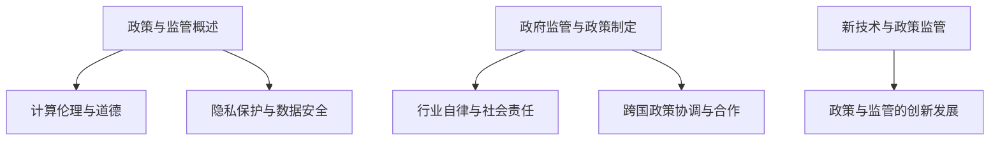

                 

# 政策与监管：引导人类计算的健康发展方向

> **关键词：** 政策、监管、计算、伦理、隐私保护、数据安全、政府监管、行业自律、国际合作、新技术监管

> **摘要：** 本文旨在探讨政策与监管在引导人类计算健康发展方向中的重要作用。通过对政策与监管的基础知识、具体实践及未来展望的深入分析，本文揭示了计算伦理与道德的重要性，隐私保护与数据安全的必要性，以及政策与监管在未来技术发展中的挑战与机遇。

## 《政策与监管：引导人类计算的健康发展方向》目录大纲

### 第一部分：政策与监管的基础知识

#### 第1章：政策与监管概述
- 1.1 政策与监管的概念
- 1.2 政策与监管的历史发展
- 1.3 政策与监管的体系结构
- 1.4 政策与监管的目标和原则

#### 第2章：计算伦理与道德
- 2.1 计算伦理的起源与发展
- 2.2 道德原则与计算实践
- 2.3 计算伦理面临的主要挑战

#### 第3章：隐私保护与数据安全
- 3.1 隐私保护的概念和原则
- 3.2 数据安全的基本措施
- 3.3 数据保护法规与国际标准

### 第二部分：政策与监管的具体实践

#### 第4章：政府监管与政策制定
- 4.1 监管机构的职能与责任
- 4.2 政策制定的过程与策略
- 4.3 案例分析：政府监管的成功与挑战

#### 第5章：行业自律与社会责任
- 5.1 行业自律的概念与作用
- 5.2 社会责任报告与评估
- 5.3 行业自律与政府监管的互动

#### 第6章：跨国政策协调与合作
- 6.1 跨国政策协调的重要性
- 6.2 国际合作机制与平台
- 6.3 跨国政策协调的案例分析

### 第三部分：政策与监管的未来展望

#### 第7章：新技术与政策监管
- 7.1 人工智能的政策监管挑战
- 7.2 区块链技术的政策监管问题
- 7.3 量子计算的监管前景

#### 第8章：政策与监管的创新发展
- 8.1 新监管工具与方法
- 8.2 政策创新与可持续发展
- 8.3 未来政策与监管的展望

### 附录

#### 附录A：政策与监管相关法律法规
- A.1 中国政策与监管法律法规概述
- A.2 国际政策与监管法律法规概述

#### 附录B：政策与监管案例分析
- B.1 案例分析1：某国网络安全事件
- B.2 案例分析2：某行业自律联盟的成立与发展

**核心概念与联系图（Mermaid流程图）**



**核心算法原理讲解（伪代码）**

```python
# 伪代码：隐私保护算法
def privacy_protection(data, sensitivity):
    # 步骤1：数据加密
    encrypted_data = encrypt(data)

    # 步骤2：数据去识别化
    deidentified_data = deidentify(encrypted_data)

    # 步骤3：数据共享与访问控制
    shared_data = share_data(deidentified_data)
    access_control(shared_data, sensitivity)

    return shared_data
```

**数学模型和数学公式（详细讲解）**

$$
\begin{aligned}
&\text{隐私保护成本函数} \; C(\theta) = f(\theta) + g(\theta) \\
&\text{其中} \; f(\theta) = \int_{D} L(d|\theta) \; d\theta, \; g(\theta) = \lambda \; \sum_{d\in D} \; \mathbb{E}_{x\sim P(x)} \; L(x|d,\theta)
\end{aligned}
$$

**项目实战（代码案例与解析）**

**代码实现：**

```python
# Python 代码示例：数据加密
from cryptography.fernet import Fernet

def encrypt_data(data, key):
    fernet = Fernet(key)
    encrypted_data = fernet.encrypt(data)
    return encrypted_data

# Python 代码示例：数据解密
def decrypt_data(encrypted_data, key):
    fernet = Fernet(key)
    decrypted_data = fernet.decrypt(encrypted_data)
    return decrypted_data
```

**代码解读与分析：**

- `encrypt_data` 函数用于加密数据。
- `decrypt_data` 函数用于解密数据。
- 使用 `Fernet` 类来实现加密和解密操作，确保数据的安全传输和存储。

**作者信息**

- 作者：AI天才研究院/AI Genius Institute & 禅与计算机程序设计艺术 /Zen And The Art of Computer Programming

接下来，我们将按照目录大纲逐步展开正文内容，进行深入分析和详细讲解。

