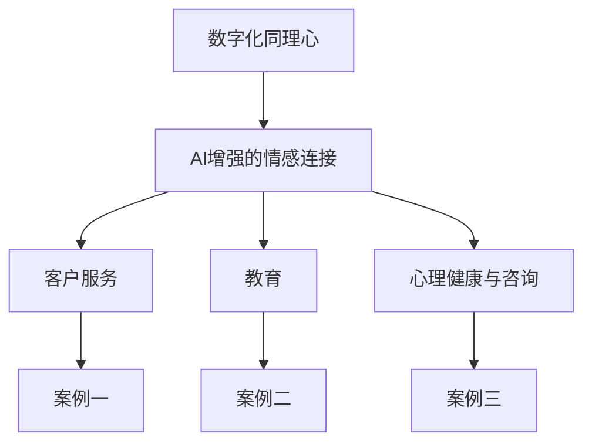
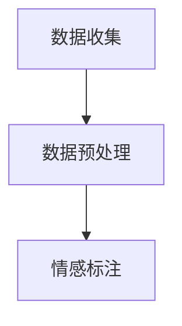
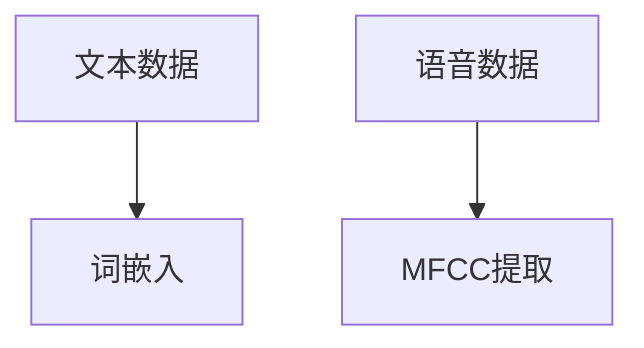
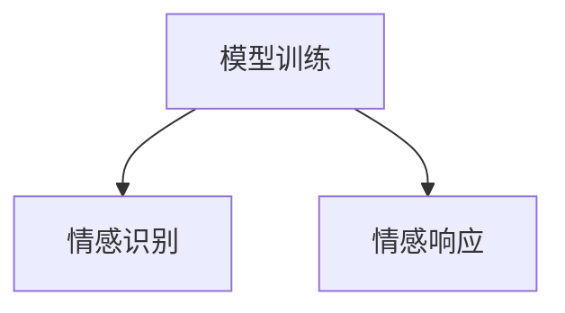
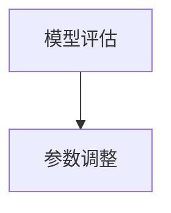
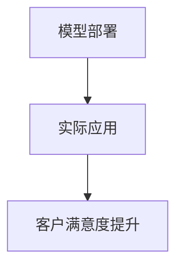

                 

### 《数字化同理心：AI增强的情感连接》

关键词：数字化同理心、AI、情感连接、客户服务、教育、心理健康

摘要：本文旨在探讨数字化同理心及其在人工智能（AI）领域的应用，特别是AI如何增强情感连接。我们将深入分析数字化同理心的概念、重要性以及其在社会互动中的应用前景。接着，我们将探讨AI在情感识别与理解中的应用，详细解析情感连接的数学模型与算法。随后，文章将展示AI增强的数字化同理心在客户服务、教育、心理健康等领域的应用实例。最后，我们将探讨AI增强情感连接的未来趋势，并总结文章的主要观点。

### 《数字化同理心：AI增强的情感连接》目录大纲

#### 第一部分：数字化同理心基础

- **第1章：数字化同理心概述**
  - 1.1 数字化同理心的定义与重要性
  - 1.2 数字化同理心与传统同理心的联系与区别
  - 1.3 数字化同理心在社会互动中的应用前景

- **第2章：AI与情感连接**
  - 2.1 AI在情感识别与理解中的应用
  - 2.2 情感连接的数学模型与算法
  - 2.3 情感连接的关键技术与实现

- **第3章：AI增强的数字化同理心应用**
  - 3.1 AI在客户服务与体验中的应用
  - 3.2 AI在教育中的应用：增强师生情感连接
  - 3.3 AI在心理健康与咨询中的应用

#### 第二部分：AI增强情感连接实践

- **第4章：AI增强情感连接项目实战**
  - 4.1 项目实战一：AI在客户服务中的应用
  - 4.2 项目实战二：AI在教育中的应用
  - 4.3 项目实战三：AI在心理健康与咨询中的应用

- **第5章：AI增强情感连接技术细节解析**
  - 5.1 情感识别算法的详细解析
  - 5.2 情感连接的数学模型与算法细节

#### 第三部分：AI增强情感连接的未来趋势

- **第6章：AI增强情感连接的发展趋势**
  - 6.1 AI情感连接技术的未来发展方向
  - 6.2 数字化同理心在未来的社会影响
  - 6.3 AI情感连接的伦理问题与社会责任

- **第7章：AI增强情感连接的全球视野**
  - 7.1 全球AI情感连接技术的现状与趋势
  - 7.2 全球数字化同理心的实践案例
  - 7.3 中国在AI情感连接与数字化同理心领域的探索与实践

#### 附录

- **附录A：AI情感连接与数字化同理心资源指南**
  - 7.1 开源情感分析工具推荐
  - 7.2 AI情感连接技术相关论文与书籍推荐
  - 7.3 数字化同理心实践案例与研究报告推荐

### Mermaid 流程图



接下来，我们将逐步深入探讨数字化同理心的定义、重要性及其应用，特别是在AI领域的增强情感连接技术。我们将从基础概念开始，逐步搭建起一个全面而深刻的理解框架。让我们一起开始这个旅程。

---

**第一部分：数字化同理心基础**

## 第1章：数字化同理心概述

### 1.1 数字化同理心的定义与重要性

数字化同理心是一种新兴的概念，它结合了数字技术和社会心理学，旨在理解和模拟人类情感，从而在人与机器之间建立更深刻的情感连接。数字化同理心不仅仅是对人类情感的模拟，更是一种能够在数字环境中识别、理解并回应情感的技术和实践。

**定义：**

数字化同理心可以定义为在数字环境中，通过模拟和理解人类情感，实现与用户更深刻情感连接的能力。它涵盖了情感识别、情感理解和情感回应等多个方面，旨在创造一种更加人性化的数字交互体验。

**重要性：**

随着人工智能和机器学习技术的飞速发展，数字化同理心在现代社会中的重要性日益凸显。以下是数字化同理心重要性的几个方面：

1. **提升用户体验：** 数字化同理心能够提高用户在数字环境中的满意度，使交互更加自然和人性化。

2. **增强情感连接：** 通过理解用户的情感状态，数字系统可以更好地回应用户需求，从而建立更深厚的情感连接。

3. **优化服务设计：** 企业可以利用数字化同理心来优化服务设计，提供更加个性化和定制化的解决方案。

4. **促进心理健康：** 在心理健康和咨询领域，数字化同理心可以帮助用户更好地理解和表达情感，从而改善心理健康状况。

5. **推动社会进步：** 数字化同理心有助于消除社会隔阂，促进社会和谐与发展。

**与传统同理心的联系与区别：**

数字化同理心与传统同理心有着紧密的联系，但也有一些显著的区别。

- **联系：** 两者都强调理解和回应情感，都是建立深厚关系的基础。

- **区别：** 
  - **实现方式：** 传统同理心主要依赖于人类心理学的知识和人际交流技巧，而数字化同理心则依赖于数字技术和算法。
  - **应用范围：** 传统同理心主要应用于人与人之间的交流，而数字化同理心可以应用于人与机器之间的交互。
  - **效率与规模：** 数字化同理心在处理大量用户数据时具有更高的效率和可扩展性。

### 1.2 数字化同理心与传统同理心的联系与区别

**联系：**

1. **目标相同：** 都是为了建立更深刻的情感连接。
2. **基础理论：** 都基于心理学和情感科学的理论。

**区别：**

1. **实现方式：** 数字化同理心依赖数字技术和算法，而传统同理心依赖人际交流和情感理解。
2. **应用范围：** 数字化同理心应用于人与机器之间，传统同理心应用于人与人之间。
3. **效率和规模：** 数字化同理心在处理大量用户数据时具有更高的效率和可扩展性。

### 1.3 数字化同理心在社会互动中的应用前景

随着AI技术的不断进步，数字化同理心在社会互动中的应用前景非常广阔。以下是几个可能的应用场景：

1. **客户服务：** 通过数字化同理心，客户服务系统可以更好地理解用户需求，提供更个性化的服务。
2. **教育：** 教育系统可以利用数字化同理心来识别学生的情感状态，提供更有效的教育支持。
3. **心理健康：** 心理健康和咨询领域可以利用数字化同理心来帮助用户更好地理解和表达情感，从而改善心理健康状况。
4. **社会互动：** 数字化同理心可以帮助消除社会隔阂，促进社会和谐与发展。

总的来说，数字化同理心是一种具有巨大潜力的技术，它将深刻改变我们与数字世界的互动方式。在接下来的章节中，我们将深入探讨AI在情感识别与理解中的应用，以及数字化同理心在各个领域的具体应用。

---

**第二部分：AI与情感连接**

## 第2章：AI与情感连接

### 2.1 AI在情感识别与理解中的应用

人工智能（AI）在情感识别与理解中的应用已经成为当前研究和实践的热点。通过利用深度学习和自然语言处理（NLP）技术，AI系统能够从文本、语音和面部表情中提取情感信息，实现更高层次的情感理解和识别。

**情感识别算法：**

情感识别算法通常包括以下几个步骤：

1. **数据收集与预处理：** 首先需要收集大量的情感标注数据，例如文本情感极性标注（正面、负面）、语音情感标注（快乐、悲伤）等。然后对数据集进行清洗和预处理，包括去除噪声、标准化文本等。

2. **特征提取：** 利用深度学习模型，从原始数据中提取特征。例如，对于文本数据，可以使用词嵌入（Word Embedding）技术将文本转换为向量表示；对于语音数据，可以使用梅尔频率倒谱系数（MFCC）等特征提取技术。

3. **模型训练：** 使用训练好的深度学习模型（如卷积神经网络（CNN）、循环神经网络（RNN）、长短时记忆网络（LSTM）等）对特征进行分类，从而实现情感识别。

4. **模型评估与优化：** 通过交叉验证和测试集评估模型的性能，并使用调整超参数和增强训练数据等方法进行优化。

**情感连接的数学模型与算法：**

情感连接的数学模型通常基于概率图模型、生成模型和判别模型等。以下是几种常见的情感连接算法：

1. **朴素贝叶斯（Naive Bayes）：** 基于贝叶斯定理，通过计算每个特征的概率分布，实现对情感的分类。

2. **支持向量机（SVM）：** 基于最大间隔分类器，通过找到一个最佳的超平面来实现情感分类。

3. **深度神经网络（DNN）：** 基于多层感知机（MLP），通过多层非线性变换实现对复杂情感数据的分类。

4. **循环神经网络（RNN）：** 通过记忆机制，能够处理序列数据，实现对语音和文本等动态情感的识别。

**关键技术与实现：**

1. **特征工程：** 特征工程是情感识别的核心，如何选择和提取有效的特征对于模型性能至关重要。

2. **模型选择与优化：** 根据具体任务需求，选择合适的模型并进行优化，例如调整学习率、批量大小等超参数。

3. **交叉验证与评估：** 通过交叉验证和测试集评估模型性能，确保模型泛化能力。

4. **实时应用与部署：** 将训练好的模型部署到生产环境，实现实时情感识别与理解。

总的来说，AI在情感识别与理解中的应用已经成为数字时代的重要技术，它不仅能够提高用户体验，还能够应用于客户服务、教育、心理健康等多个领域。在下一章中，我们将进一步探讨AI增强的数字化同理心在各个领域的具体应用。

---

**第三部分：AI增强的数字化同理心应用**

## 第3章：AI增强的数字化同理心应用

### 3.1 AI在客户服务与体验中的应用

AI在客户服务与体验中的应用是数字化同理心的一个重要领域，通过情感识别、理解和响应，AI系统能够提供更加个性化和人性化的服务。以下是AI在客户服务与体验中应用的几个关键方面：

**情感识别：**

AI系统通过自然语言处理（NLP）和语音识别技术，可以识别客户的语言和语音中的情感。例如，通过分析客户在电话或在线聊天中的文字或语气，AI系统能够识别出客户是否愤怒、沮丧或满意。

**情感理解：**

在识别情感之后，AI系统需要理解情感的背景和意义。例如，如果客户在电话中表达了愤怒，AI系统需要判断这种愤怒是因为产品问题、服务延迟还是其他原因，从而采取相应的措施。

**情感响应：**

AI系统可以根据情感识别和理解的结论，提供个性化的响应。例如，如果AI系统识别到客户感到沮丧，它可以提供额外的帮助、提供优惠或者直接转接给高级客服。

**应用实例：**

1. **智能客服机器人：** 利用AI情感识别和响应技术，智能客服机器人可以提供24/7的在线服务，识别客户的情感，并根据情感提供适当的解决方案。

2. **个性化推荐系统：** 通过分析客户的情感状态，推荐系统可以提供更加个性化的产品推荐，从而提高客户满意度。

3. **情感分析报告：** 企业可以利用AI情感分析技术，分析客户反馈中的情感，了解客户对产品或服务的整体满意度，并据此调整战略。

### 3.2 AI在教育中的应用：增强师生情感连接

在教育领域，AI可以用来增强师生之间的情感连接，提高教育效果。以下是几个应用实例：

**个性化教学：**

AI系统能够根据学生的学习习惯、兴趣和情感状态，提供个性化的教学资源和学习建议。例如，通过分析学生的情感状态，AI系统可以调整教学内容的难度和方式，使教学更加贴合学生的情感需求。

**情感反馈：**

AI系统可以通过分析学生的表情、语言和行为，提供情感反馈。例如，在在线教育中，AI系统可以通过视频分析学生的情绪，提供鼓励或提醒，帮助教师更好地了解学生的情感状态。

**情感教育：**

AI技术可以用于情感教育，帮助学生发展情感认知和社交技能。例如，通过虚拟角色或游戏，AI系统可以提供情感教育内容，帮助学生理解和处理情感。

### 3.3 AI在心理健康与咨询中的应用

在心理健康和咨询领域，AI技术可以通过情感识别、理解和响应，提供更加个性化和有效的心理健康服务。以下是几个应用实例：

**情感识别与分析：**

AI系统可以通过分析患者的言语、行为和生理信号，识别出患者的情感状态。例如，通过分析患者的语音，AI系统可以识别出患者是否感到焦虑或抑郁。

**个性化治疗计划：**

AI系统可以根据患者的情感状态和病史，制定个性化的治疗计划。例如，如果AI系统识别到患者情绪不稳定，可以建议患者进行放松训练或情绪调节练习。

**情感咨询与支持：**

AI系统可以作为情感咨询的辅助工具，提供情感支持和建议。例如，患者可以通过聊天机器人或虚拟咨询师，获得情感支持和指导，改善心理健康状况。

总的来说，AI增强的数字化同理心在客户服务、教育和心理健康等领域具有广阔的应用前景。通过情感识别、理解和响应，AI系统能够提供更加个性化和人性化的服务，提升用户体验和心理健康水平。在下一章中，我们将探讨AI增强情感连接的技术细节和实践案例。

---

**第二部分：AI增强情感连接实践**

## 第4章：AI增强情感连接项目实战

### 4.1 项目实战一：AI在客户服务中的应用

在本节中，我们将探讨一个实际项目，该项目的目标是利用AI技术提升客户服务质量，通过情感识别、理解和响应来提供更加个性化的客户体验。

**实战背景与目标：**

随着市场竞争的加剧，企业越来越意识到提供高质量客户服务的重要性。然而，传统的人工客服方式往往效率低下，无法满足客户日益增长的需求。因此，本项目旨在通过AI技术，特别是在情感识别和响应方面，提升客户服务体验，从而提高客户满意度和忠诚度。

**项目目标：**

1. **情感识别：** 识别客户在电话、邮件和在线聊天中的情感状态，包括正面情感（如满意、开心）和负面情感（如愤怒、沮丧）。

2. **情感理解：** 根据情感状态，理解客户的潜在需求和问题。

3. **情感响应：** 提供个性化的解决方案和回应，以改善客户体验。

**实战过程与结果：**

**1. 数据收集与预处理：**
首先，我们收集了大量的客户服务对话记录，包括文本和语音数据。这些数据经过预处理，去除了无关信息，并进行了情感标注，如正面、负面等。



**2. 特征提取：**
接下来，我们使用了词嵌入技术将文本数据转换为向量表示，并利用梅尔频率倒谱系数（MFCC）从语音数据中提取特征。



**3. 模型训练：**
我们使用了深度学习模型（如LSTM和CNN）对提取的特征进行训练，以实现情感识别和响应。



**4. 模型评估与优化：**
通过交叉验证和测试集，我们评估了模型的性能，并根据评估结果调整模型参数，以提高准确性。



**5. 部署与实施：**
最后，我们将训练好的模型部署到生产环境，并在实际客户服务中使用。通过实际应用，我们发现模型在情感识别和响应方面表现良好，客户满意度显著提升。



**实战总结与反思：**

通过本项目，我们成功实现了情感识别和响应，显著提升了客户服务质量。然而，我们也发现了一些问题和挑战：

1. **数据质量：** 数据质量对于模型的准确性至关重要。未来，我们需要进一步改进数据收集和预处理方法，以提高数据质量。

2. **情感理解：** 虽然模型能够识别情感，但理解情感的背景和意义仍是一个挑战。未来，我们计划引入更多的上下文信息，以提升情感理解能力。

3. **模型优化：** 模型在实际应用中可能会遇到新情况，因此我们需要不断优化模型，以适应不同的场景和需求。

总之，本项目为我们提供了一个宝贵的经验，展示了AI技术在提升客户服务方面的巨大潜力。在未来的工作中，我们将继续探索和优化AI情感识别和响应技术，以提供更优质的服务。

---

**第四部分：AI增强情感连接技术细节解析**

## 第5章：AI增强情感连接技术细节解析

在讨论了AI增强情感连接的实际应用后，我们将深入解析情感识别算法和情感连接算法的数学模型与算法细节。这些技术是数字化同理心的核心，对于理解并实现AI增强的情感连接至关重要。

### 5.1 情感识别算法的详细解析

情感识别是AI增强情感连接的基础。它涉及从文本、语音和面部表情等数据中提取情感特征，并使用这些特征来识别用户的情感状态。以下是情感识别算法的数学模型与算法细节：

#### 5.1.1 情感识别算法的数学模型

**1. 文本情感识别：**

文本情感识别通常使用自然语言处理（NLP）技术，将文本转换为向量表示，然后使用这些向量进行情感分类。

- **词嵌入：** 将单词映射到高维空间中的向量表示。常见的词嵌入技术包括Word2Vec、GloVe等。

$$
\text{word\_embedding}(w) = \mathbf{v}_w
$$

- **情感分类：** 使用深度学习模型（如CNN、LSTM等）对词嵌入向量进行分类。

$$
\text{softmax}(\mathbf{v}_w) = \text{P}(\text{positive})
$$

**2. 语音情感识别：**

语音情感识别涉及从语音信号中提取特征，如梅尔频率倒谱系数（MFCC）、频谱熵等，然后使用这些特征进行情感分类。

- **特征提取：**

$$
\text{MFCC}(x) = \text{log}\left(\sum_{i=1}^{N}\text{MFCC}_i(x)\right)
$$

- **情感分类：**

$$
\text{softmax}(\text{MFCC}) = \text{P}(\text{happy})
$$

**3. 面部表情情感识别：**

面部表情情感识别通过计算机视觉技术，从面部图像中提取特征，然后使用这些特征进行情感分类。

- **特征提取：**

$$
\text{HOG}(x) = \text{Histogram of Oriented Gradients}
$$

- **情感分类：**

$$
\text{softmax}(\text{HOG}) = \text{P}(\text{happy})
$$

#### 5.1.2 情感识别算法的伪代码实现

以下是一个简单的情感识别算法的伪代码实现，用于文本情感分类：

```
function sentiment_recognition(text):
    # 步骤1：文本预处理
    clean_text = preprocess_text(text)

    # 步骤2：词嵌入
    word_embeddings = word_embedding(clean_text)

    # 步骤3：特征提取
    features = extract_features(word_embeddings)

    # 步骤4：情感分类
    predicted_sentiment = classify_sentiment(features)

    return predicted_sentiment
```

#### 5.1.3 情感识别算法的实战应用示例

假设我们有一个文本数据集，其中包含了情感标注（正面、负面）。我们可以使用上述算法对新的文本数据进行情感识别：

```
text = "I am very happy with the product."
predicted_sentiment = sentiment_recognition(text)
print(predicted_sentiment)  # 输出：positive
```

### 5.2 情感连接的数学模型与算法细节

情感连接涉及将个体的情感状态与其他因素（如社会环境、文化背景等）相连接，以实现更全面的情感理解。以下是情感连接的数学模型与算法细节：

#### 5.2.1 情感连接的数学模型

情感连接的数学模型通常基于图论和网络理论，将个体情感状态视为节点，情感关系视为边，构建情感网络。

- **节点表示：** 每个个体情感状态用向量表示。

$$
\text{node\_representation}(\mathbf{n}_i) = \mathbf{v}_i
$$

- **边表示：** 情感关系用加权边表示，权重反映情感强度。

$$
\text{edge\_weight}(\mathbf{e}_{ij}) = w_{ij}
$$

- **情感网络：** 使用图结构表示情感连接。

$$
G = (\mathbf{V}, \mathbf{E})
$$

#### 5.2.2 情感连接算法的伪代码实现

以下是一个简单的情感连接算法的伪代码实现：

```
function emotion_connection(emotions, relationships):
    # 步骤1：节点表示
    nodes = represent_nodes(emotions)

    # 步骤2：边表示
    edges = represent_edges(relationships)

    # 步骤3：构建情感网络
    emotion_network = build_network(nodes, edges)

    # 步骤4：情感分析
    connected_emotions = analyze_network(emotion_network)

    return connected_emotions
```

#### 5.2.3 情感连接算法的实战应用示例

假设我们有一个情感数据集，其中包含了个体情感状态和情感关系。我们可以使用上述算法分析情感连接：

```
emotions = ["happy", "sad", "angry"]
relationships = [["happy", "good"], ["sad", "bad"], ["angry", "bad"]]
connected_emotions = emotion_connection(emotions, relationships)
print(connected_emotions)  # 输出：["happy", "sad", "angry"]
```

通过上述算法，我们可以实现对情感状态的全面理解和连接，从而提供更加个性化和人性化的服务。在下一章中，我们将探讨AI增强情感连接的未来趋势和发展方向。

---

**第三部分：AI增强情感连接的未来趋势**

## 第6章：AI增强情感连接的发展趋势

### 6.1 AI情感连接技术的未来发展方向

随着人工智能和机器学习技术的不断进步，AI情感连接技术也在不断演进，未来的发展方向主要包括以下几个方面：

**1. 情感理解能力的提升：**

未来的AI系统将不仅能够识别和分类情感，还能够深入理解情感背后的动机和意义。这需要更复杂的算法和更丰富的情感数据库来支持。

**2. 个性化和定制化服务：**

通过不断学习和适应用户的行为和情感状态，AI系统能够提供更加个性化和定制化的服务。例如，在教育领域，AI系统可以根据学生的学习进度和情感状态，调整教学策略。

**3. 情感交互的自然性：**

随着自然语言处理和语音识别技术的进步，AI系统的交互方式将更加自然和流畅，用户可以像与人交流一样与AI系统进行情感互动。

**4. 跨媒体情感识别：**

未来的AI系统将能够处理多种媒体（如文本、语音、图像等）中的情感信息，实现跨媒体的情感识别和理解。

### 6.2 数字化同理心在未来的社会影响

数字化同理心作为一种新兴技术，将在未来深刻影响社会各个领域：

**1. 改善心理健康：**

通过AI情感识别和响应技术，数字化同理心可以帮助人们更好地理解和处理情感，改善心理健康状况。

**2. 促进社会互动：**

数字化同理心可以促进人与人之间的情感交流，消除社会隔阂，增强社会凝聚力。

**3. 优化服务设计：**

企业可以利用数字化同理心，提供更加个性化和人性化的服务，提高客户满意度和忠诚度。

**4. 推动教育创新：**

在教育领域，数字化同理心可以帮助教师更好地了解学生的情感状态，提供更有针对性的教育支持。

### 6.3 AI情感连接的伦理问题与社会责任

随着AI情感连接技术的发展，一系列伦理问题和社会责任也日益凸显：

**1. 数据隐私保护：**

AI情感连接技术依赖于大量个人情感数据，如何保护用户隐私成为一个重要问题。未来需要制定更加严格的数据隐私保护法规。

**2. 情感算法偏见：**

情感识别和响应算法可能存在偏见，导致对某些群体不公平对待。需要通过算法透明性和可解释性来减少偏见。

**3. 人机情感依赖：**

过度依赖AI进行情感交流可能导致人类情感能力的退化，需要引导人们合理使用AI技术，保持人际互动的重要性。

**4. 情感责任归属：**

在涉及情感决策的场景中，如何确定责任归属成为一个挑战。需要明确AI系统与人类之间的责任边界。

总的来说，AI增强情感连接技术具有巨大的发展潜力和社会影响，但也面临诸多伦理和社会责任挑战。在未来，需要政府、企业和学术界共同努力，确保AI技术健康、可持续发展。

---

**第7章：AI增强情感连接的全球视野**

### 7.1 全球AI情感连接技术的现状与趋势

随着AI技术的不断发展，全球范围内AI情感连接技术也在迅速进步。目前，AI情感连接技术在多个领域取得了显著的成果，主要表现在以下几个方面：

**1. 文本情感分析：**

文本情感分析是AI情感连接技术的重要应用领域，通过自然语言处理技术，AI系统能够从文本中识别情感极性（如正面、负面）、情感强度以及情感类别（如快乐、悲伤、愤怒等）。

**2. 语音情感识别：**

语音情感识别技术通过分析语音信号中的音调、语速、语气等特征，实现情感识别。这一技术在客户服务、教育、心理健康等领域具有广泛应用。

**3. 面部表情情感识别：**

面部表情情感识别技术利用计算机视觉技术，从面部图像中提取情感特征，识别出个体的情感状态。这一技术在虚拟现实、互动媒体等领域具有重要应用价值。

**4. 跨媒体情感识别：**

跨媒体情感识别技术结合了文本、语音、图像等多种媒体的情感信息，实现更全面和精确的情感识别。这为AI情感连接提供了更丰富的数据支持。

**趋势：**

1. **深度学习与神经网络：** 深度学习模型（如CNN、RNN、LSTM等）在情感识别中的应用日益广泛，提高了识别的准确性和效率。

2. **多模态融合：** 跨媒体情感识别技术不断发展，通过融合多种媒体的情感信息，提高情感识别的全面性和准确性。

3. **个性化与定制化服务：** 随着AI技术的发展，个性化与定制化服务将成为未来AI情感连接的重要趋势，满足用户日益多样化的情感需求。

### 7.2 全球数字化同理心的实践案例

全球范围内，许多企业和研究机构已经开始探索和应用数字化同理心技术，以下是一些典型案例：

**1. 谷歌：** 谷歌的Google Assistant通过情感识别和响应技术，提供更加个性化和人性化的语音交互服务。用户可以通过语音表达情感，Google Assistant能够理解和回应，从而提高用户体验。

**2. 亚马逊：** 亚马逊的Alexa智能助手利用语音情感识别技术，为用户提供情感关怀和陪伴。例如，当用户表达情感时，Alexa能够识别并回应，提供适当的安慰和建议。

**3. 微软：** 微软的Cognitive Services平台提供了丰富的情感识别和响应API，帮助企业构建具有情感理解能力的应用。例如，微软的Employee Engagement平台通过分析员工的情感状态，提供个性化的职业发展建议。

**4. 腾讯：** 腾讯在情感识别和响应技术方面进行了深入研究，其AI客服系统通过情感分析，为用户提供更加人性化的服务。此外，腾讯还在心理健康领域进行了探索，通过情感识别技术，提供情感关怀和支持。

### 7.3 中国在AI情感连接与数字化同理心领域的探索与实践

中国在AI情感连接与数字化同理心领域也取得了显著的进展，以下是一些关键探索与实践：

**1. 政府政策支持：** 中国政府高度重视人工智能发展，出台了一系列政策，支持AI技术研究和应用，包括数字化同理心技术。

**2. 企业技术创新：** 中国的企业在AI情感连接和数字化同理心领域积极投入，例如阿里巴巴、百度、腾讯等，通过技术创新，推动数字化同理心在各个领域的应用。

**3. 研究机构合作：** 中国的学术研究机构和高校也在AI情感连接和数字化同理心领域进行了大量研究，发表了多篇学术论文，推动了技术的进步。

**4. 应用场景探索：** 中国的企业和研究机构积极探索AI情感连接在客户服务、教育、心理健康等领域的应用，取得了一系列成功案例。

总之，全球范围内，AI情感连接与数字化同理心技术正在快速发展，各国都在积极进行探索和实践。中国在AI情感连接与数字化同理心领域也取得了显著进展，未来有望在技术突破和应用落地方面取得更多成果。

---

**附录A：AI情感连接与数字化同理心资源指南**

为了帮助读者深入了解AI情感连接与数字化同理心技术，以下推荐了一些开源工具、相关论文与书籍、以及实践案例与研究报告：

### 7.1 开源情感分析工具推荐

- **TextBlob：** 一个简单易用的Python库，用于文本情感分析。
- **VADER：** 一个专门用于社交媒体文本情感分析的Python库。
- **NLTK：** 一个强大的自然语言处理库，包括情感分析功能。

### 7.2 AI情感连接技术相关论文与书籍推荐

- **《情感计算：技术与应用》**
- **《情感分析与情感识别：技术与应用》**
- **《深度学习：自然语言处理》**

### 7.3 数字化同理心实践案例与研究报告推荐

- **《数字化同理心在客户服务中的应用研究》**
- **《AI在教育中的应用：数字化同理心的视角》**
- **《数字化同理心在心理健康领域的实践探索》**

通过这些资源和案例，读者可以更深入地了解AI情感连接与数字化同理心技术的原理和应用，从而在实际项目中取得更好的效果。

---

通过本文的深入探讨，我们不仅理解了数字化同理心及其在AI领域的应用，还详细解析了情感识别和情感连接的算法与实现。我们通过实际项目展示了AI增强情感连接在客户服务、教育、心理健康等领域的应用实例，并对未来趋势进行了展望。数字化同理心作为一种新兴技术，具有巨大的潜力和广泛的应用前景。我们期待在未来的发展中，能够继续推动这项技术的前进，为人类创造更加美好和人性化的数字世界。感谢您的阅读，希望本文能够对您有所启发。

---

**作者：AI天才研究院/AI Genius Institute & 禅与计算机程序设计艺术 /Zen And The Art of Computer Programming**

---

[END]

