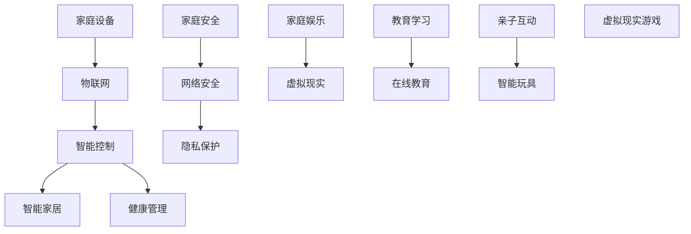

                 

### 文章标题

> 关键词：数字化家庭、元宇宙、亲子关系、物联网、人工智能、虚拟现实、智能玩具、网络安全、隐私保护

> 摘要：本文将探讨数字化家庭在元宇宙时代对亲子关系的影响。通过分析数字化家庭的概念、技术基础、应用领域和未来趋势，以及元宇宙的概念和特点，本文将探讨数字化家庭中的亲子互动、亲子教育和亲子沟通。同时，还将介绍数字化家庭中的亲子关系实践案例，为家长提供实际操作指导。本文旨在为读者提供一个全面了解和应对数字化家庭与亲子关系的参考指南。

### 第一部分：数字化家庭概述

#### 第1章：数字化家庭的概念与发展

##### 1.1 数字化家庭的定义与背景

数字化家庭是指通过物联网、人工智能、虚拟现实等先进技术，将家庭中各种设备和系统进行智能化、互联化改造，实现家庭成员之间的高效沟通、资源共享和生活便利。数字化家庭的发展背景可以追溯到以下几个方面：

1. **科技进步**：随着计算机技术、通信技术、物联网技术、人工智能技术和虚拟现实技术的发展，为数字化家庭提供了坚实的技术基础。
2. **消费者需求**：随着人们生活水平的提高，消费者对于家居环境的智能化、个性化、便捷化需求逐渐增加，为数字化家庭的普及提供了市场需求。
3. **企业竞争**：智能家居市场的竞争日益激烈，企业通过推出创新产品和技术，不断提高数字化家庭的用户体验和竞争力。

##### 1.2 数字化家庭的技术基础

数字化家庭的技术基础主要包括以下几个方面：

1. **物联网技术**：物联网技术通过传感器、无线通信技术和互联网，实现家庭设备之间的互联互通，为家庭提供智能化的控制和管理。
2. **人工智能技术**：人工智能技术通过算法和大数据分析，为家庭提供智能化的决策和个性化服务，如语音识别、智能推荐、智能家居控制等。
3. **虚拟现实技术**：虚拟现实技术通过三维模拟和沉浸式体验，为家庭提供丰富的娱乐和学习体验。

##### 1.3 数字化家庭的应用领域

数字化家庭的应用领域非常广泛，主要包括以下几个方面：

1. **智能家居**：智能家居是数字化家庭的核心应用领域，包括智能门锁、智能灯光、智能温控、智能安防等，为家庭提供便捷、安全、舒适的生活环境。
2. **家庭娱乐**：家庭娱乐是数字化家庭的另一个重要应用领域，包括智能电视、虚拟现实游戏、智能家居影院等，为家庭提供丰富的娱乐体验。
3. **健康管理**：健康管理是数字化家庭的新兴应用领域，包括智能健身设备、健康监测系统、营养饮食管理等，为家庭提供全方位的健康管理服务。

##### 1.4 数字化家庭的未来趋势

数字化家庭的未来趋势主要体现在以下几个方面：

1. **智能化水平提升**：随着人工智能技术的不断发展，数字化家庭的智能化水平将不断提升，提供更加智能化、个性化、便捷化的服务。
2. **生态化发展**：数字化家庭将形成完整的生态圈，包括硬件设备、软件平台、服务内容等，为用户提供全方位的智能家居体验。
3. **个性化定制**：数字化家庭将根据用户需求提供个性化定制服务，满足用户个性化、多样化的生活需求。
4. **安全隐私保护**：随着数字化家庭的普及，安全隐私保护将成为数字化家庭的重要议题，用户对安全隐私保护的需求将不断提升。

### 第二部分：元宇宙时代下的亲子关系

#### 第2章：元宇宙的概念与特点

##### 2.1 元宇宙的概念

元宇宙（Metaverse）是一个虚拟的、三维的、交互式的数字化世界，是现实世界的延伸和扩展。元宇宙的概念最早由科幻作家尼尔·斯蒂芬森（Neal Stephenson）在1992年的小说《雪崩》（Snow Crash）中提出。元宇宙包括以下几个关键特点：

1. **三维空间**：元宇宙是一个三维空间，用户可以在其中自由移动、探索和交互。
2. **实时交互**：元宇宙支持实时交互，用户可以与其他用户或虚拟实体进行实时沟通、交流和互动。
3. **内容丰富**：元宇宙中包含丰富的内容，如游戏、社交、教育、娱乐等，为用户提供多样化的体验。

##### 2.2 元宇宙的特点

元宇宙具有以下几个显著特点：

1. **高度沉浸**：元宇宙通过虚拟现实（VR）、增强现实（AR）等技术，为用户创造一个沉浸式的体验环境，使用户仿佛置身于另一个世界。
2. **社交互动**：元宇宙为用户提供了丰富的社交互动机会，用户可以在元宇宙中建立社交关系、参与社区活动、举办线上聚会等。
3. **经济系统**：元宇宙中拥有自己的经济系统，用户可以通过虚拟货币、数字资产等方式进行交易和投资。
4. **无限拓展**：元宇宙是一个不断拓展和发展的虚拟世界，用户可以在其中创造内容、参与建设、分享创意。

##### 2.3 元宇宙的发展历程

元宇宙的发展历程可以分为以下几个阶段：

1. **概念提出**：1992年，尼尔·斯蒂芬森在小说《雪崩》中首次提出元宇宙的概念。
2. **技术准备**：21世纪初，虚拟现实、增强现实、区块链等技术逐渐成熟，为元宇宙的发展提供了技术基础。
3. **早期探索**：2010年代，Facebook、谷歌等科技巨头开始关注元宇宙，投入大量资金和人力进行研发和探索。
4. **快速发展**：2020年代，元宇宙逐渐成为热门话题，多家科技公司宣布推出元宇宙项目，元宇宙进入快速发展阶段。

### 第三部分：数字化家庭中的亲子互动

#### 第3章：数字化家庭中的亲子互动

##### 3.1 智能家居环境下的亲子互动

在数字化家庭中，智能家居环境为亲子互动提供了新的方式和机会。以下是一些具体的亲子互动场景：

1. **智能玩具**：智能玩具可以通过语音、动作等方式与孩子互动，激发孩子的兴趣和创造力。家长可以通过智能玩具与孩子进行互动，如共同完成游戏任务、讲故事等，增强亲子关系。
2. **虚拟现实体验**：虚拟现实技术可以为家庭提供沉浸式的亲子活动。家长可以与孩子一起在虚拟世界中探险、学习、娱乐，增强亲子间的共同体验和互动。
3. **智能家居控制**：家长可以通过智能手机或语音助手控制家庭中的智能家居设备，如智能门锁、智能灯光、智能温控等，为孩子提供一个安全、舒适的生活环境，同时培养孩子的责任感和自我管理能力。

##### 3.2 元宇宙亲子活动

元宇宙为亲子互动提供了更多的可能性，以下是一些元宇宙亲子活动的例子：

1. **线上教育**：元宇宙中的虚拟课堂可以提供丰富的教育资源，家长可以与孩子一起在线学习，共同完成学习任务，提高孩子的学习兴趣和效果。
2. **虚拟旅游**：家长可以带孩子通过元宇宙体验虚拟旅游，游览世界各地，了解不同国家和地区的文化，拓宽孩子的视野和知识面。
3. **虚拟游戏**：元宇宙中的虚拟游戏可以提供亲子互动的机会，家长可以与孩子一起参与游戏，共同完成任务，增强亲子关系。

##### 3.3 数字化家庭安全与隐私保护

在数字化家庭中，家长需要关注家庭安全和隐私保护，以下是一些安全与隐私保护措施：

1. **网络安全**：家长需要确保家庭网络的安全，如设置复杂的密码、定期更新网络安全软件、防止恶意软件侵入等。
2. **隐私保护**：家长需要关注家庭成员的隐私保护，如限制孩子的社交媒体使用、设置隐私权限、防止个人信息泄露等。
3. **安全教育**：家长需要对孩子进行网络安全和隐私保护教育，提高孩子的安全意识和自我保护能力。

### 第四部分：数字化时代下的亲子教育

#### 第4章：数字化时代下的亲子教育

##### 4.1 数字化对亲子教育的影响

数字化技术的快速发展对亲子教育产生了深远的影响，以下是一些主要影响：

1. **教育资源的扩展**：数字化技术为亲子教育提供了丰富的教育资源，家长可以通过互联网获取各种教育内容和工具，为孩子提供多样化的学习体验。
2. **教育方式的变革**：数字化技术改变了传统的亲子教育方式，家长可以通过在线教育平台、移动应用、虚拟课堂等方式与孩子进行互动，提高教育的灵活性和有效性。
3. **亲子沟通的改变**：数字化技术为亲子沟通提供了新的渠道和方式，家长可以通过社交媒体、即时通讯工具与孩子进行实时沟通，了解孩子的学习和生活情况。
4. **教育效果的提升**：数字化技术可以为亲子教育提供实时反馈和个性化推荐，提高教育的针对性和效果。

##### 4.2 数字化亲子教育的方法

以下是一些数字化亲子教育的方法：

1. **互动式教育**：互动式教育通过游戏、视频、模拟实验等方式，激发孩子的学习兴趣和主动性，提高学习效果。
2. **在线学习**：家长可以利用在线教育平台、移动应用等资源，与孩子一起进行在线学习，拓展孩子的知识面和技能。
3. **虚拟实验**：虚拟实验可以让孩子在虚拟环境中进行科学实验，培养孩子的实践能力和创新思维。
4. **虚拟课堂**：虚拟课堂可以通过直播、录播等方式，提供丰富的教学资源，家长可以与孩子一起参与课程，提高孩子的学习兴趣和效果。

##### 4.3 元宇宙亲子教育

元宇宙为亲子教育提供了新的平台和机会，以下是一些元宇宙亲子教育的例子：

1. **虚拟实验**：元宇宙中的虚拟实验可以让孩子在虚拟环境中进行科学实验，培养孩子的实践能力和创新思维。
2. **虚拟课堂**：元宇宙中的虚拟课堂可以提供沉浸式的教学体验，家长可以与孩子一起参与课程，提高孩子的学习兴趣和效果。
3. **虚拟游戏**：元宇宙中的虚拟游戏可以提供亲子互动的机会，家长可以与孩子一起参与游戏，共同完成任务，增强亲子关系。
4. **虚拟社区**：元宇宙中的虚拟社区可以为家长和孩子提供交流和互动的平台，家长可以与孩子一起参与社区活动，拓宽孩子的社交圈子。

### 第五部分：数字化家庭的亲子共处时间

#### 第5章：数字化家庭的亲子共处时间

##### 5.1 合理安排亲子时间

在数字化家庭中，合理安排亲子时间对于亲子关系和孩子的成长至关重要。以下是一些建议：

1. **制定家庭日程表**：家长可以与孩子一起制定家庭日程表，合理安排家庭活动和学习时间，确保亲子时间得到充分利用。
2. **设定固定的亲子时间**：家长可以设定固定的亲子时间，如每天晚上或周末的某个时间段，与孩子一起进行互动和交流。
3. **避免电子产品干扰**：在亲子时间中，家长应尽量避免电子产品的干扰，如关闭手机、电视等，全身心投入到亲子活动中。

##### 5.2 亲子互动中的注意事项

在数字化家庭中，亲子互动需要注意以下几个方面：

1. **尊重孩子的意愿**：家长应尊重孩子的兴趣和意愿，与孩子一起选择亲子活动，避免单方面的强制和压迫。
2. **平衡电子产品的使用**：家长应合理控制孩子使用电子产品的频率和时间，避免过度沉迷和影响学习和生活。
3. **培养孩子的自我管理能力**：家长可以通过亲子互动，培养孩子的自我管理能力，如时间管理、任务管理等。

##### 5.3 数字化时代的亲子陪伴

在数字化时代，亲子陪伴的方式发生了变化，以下是一些建议：

1. **科技辅助**：家长可以利用科技产品，如智能音箱、教育机器人等，为孩子提供有趣的互动和学习体验。
2. **线上活动**：家长可以与孩子一起参与线上活动，如在线游戏、虚拟旅游等，增强亲子关系。
3. **共同创造**：家长可以与孩子一起参与创作，如绘画、写作、编程等，激发孩子的创造力和兴趣。

### 第六部分：数字化家庭中的亲子沟通

#### 第6章：数字化家庭中的亲子沟通

##### 6.1 数字化时代的亲子沟通特点

在数字化时代，亲子沟通具有以下特点：

1. **即时性**：数字化技术使得亲子沟通变得更加即时和便捷，家长可以随时与孩子进行交流和互动。
2. **虚拟性**：亲子沟通主要通过电子设备进行，如手机、电脑、平板等，缺乏面对面的交流。
3. **多元化**：数字化技术为亲子沟通提供了多样化的方式，如文字、语音、视频等，家长可以根据实际情况选择合适的沟通方式。

##### 6.2 亲子沟通的有效策略

为了提高亲子沟通的有效性，家长可以采取以下策略：

1. **倾听**：家长应耐心倾听孩子的想法和需求，给予孩子充分的表达机会，避免急于打断或评价。
2. **表达**：家长应清晰表达自己的想法和意见，避免使用模糊或含糊的语言，确保孩子能够理解。
3. **互动**：家长可以与孩子进行互动式沟通，如一起玩游戏、讨论问题等，增加亲子互动的趣味性。
4. **共同参与**：家长可以与孩子共同参与活动，如一起做家务、锻炼等，增强亲子关系。

##### 6.3 数字化沟通工具的使用

以下是一些数字化沟通工具的使用建议：

1. **社交媒体**：家长可以利用社交媒体平台，如微信、QQ、微博等，与孩子进行日常交流和互动。
2. **即时通讯工具**：家长可以与孩子使用即时通讯工具，如微信、钉钉等，进行实时沟通和交流。
3. **在线教育平台**：家长可以利用在线教育平台，与孩子一起参与学习活动，提高孩子的学习兴趣和效果。
4. **虚拟现实技术**：家长可以与孩子一起使用虚拟现实技术，进行沉浸式的互动和体验。

### 第七部分：数字化家庭中的亲子关系挑战与应对

#### 第7章：数字化家庭中的亲子关系挑战与应对

##### 7.1 挑战一：网络成瘾

网络成瘾是数字化家庭中常见的一个挑战，以下是一些原因和应对策略：

1. **原因分析**：
   - **游戏成瘾**：孩子沉迷于网络游戏，影响学习和生活。
   - **社交媒体**：孩子过度使用社交媒体，容易受到负面影响。
   - **信息过载**：孩子接触到大量的信息，难以筛选和判断。

2. **应对策略**：
   - **设定上网时间**：家长可以与孩子共同制定合理的上网时间表，避免过度沉迷。
   - **家庭互动**：家长应多陪伴孩子，增加亲子互动时间，减少孩子对网络成瘾的依赖。
   - **教育引导**：家长可以对孩子进行网络成瘾的教育，提高孩子的自我管理能力。

##### 7.2 挑战二：沟通障碍

沟通障碍是数字化家庭中另一个重要挑战，以下是一些原因和应对策略：

1. **原因分析**：
   - **代沟**：家长和孩子之间存在代沟，导致沟通不畅。
   - **沟通方式**：家长和孩子使用不同的沟通方式，难以达成共识。
   - **电子设备**：家长和孩子依赖电子设备进行沟通，缺乏面对面的交流。

2. **应对策略**：
   - **改善沟通方式**：家长可以尝试使用孩子喜欢的沟通方式，如文字、语音、视频等，增加沟通的趣味性。
   - **增加面对面交流**：家长可以与孩子设定固定的面对面交流时间，增强亲子沟通的质量。
   - **共同活动**：家长可以与孩子一起参与共同活动，如运动、游戏等，增加亲子互动的机会。

##### 7.3 挑战三：隐私保护

隐私保护是数字化家庭中不可忽视的挑战，以下是一些原因和应对策略：

1. **原因分析**：
   - **个人信息泄露**：孩子和家长的个人信息容易在网络中被泄露。
   - **网络安全风险**：网络中的恶意软件和黑客攻击对家庭成员的隐私和安全构成威胁。

2. **应对策略**：
   - **网络安全教育**：家长应加强对孩子和家庭成员的网络安全教育，提高安全意识。
   - **隐私设置**：家长应在社交媒体和在线教育平台上设置隐私权限，保护家庭成员的个人信息。
   - **使用安全工具**：家长可以安装安全软件和防火墙，防止恶意软件和网络攻击。

### 第八部分：数字化家庭中的亲子关系实践案例

#### 第8章：数字化家庭中的亲子关系实践案例

##### 8.1 案例一：智能家庭搭建亲子互动新方式

**案例背景**：一位家长希望通过智能家庭搭建，为家庭提供新的亲子互动方式，提高家庭生活质量。

**实践效果**：通过智能家庭的搭建，家长和孩子之间的互动得到了显著增强，家庭氛围更加和谐。

**具体实践**：
1. **智能玩具**：家长为孩子购买了一款智能机器人玩具，通过语音控制与孩子互动，增强了亲子间的互动和乐趣。
2. **智能灯光**：家长在家庭中安装了智能灯光系统，可以根据孩子的喜好调节灯光颜色和亮度，营造舒适的学习和休息环境。
3. **智能温控**：家长安装了智能温控系统，可以远程控制室内温度，确保孩子在舒适的环境中学习和生活。

**效果评估**：通过智能家庭的搭建，家长和孩子之间的互动更加频繁和有趣，家庭氛围更加和谐，孩子的学习兴趣和学习效果也得到了提升。

##### 8.2 案例二：元宇宙中的亲子共创

**案例背景**：一位家长希望通过元宇宙中的亲子共创，培养孩子的创造力，增强亲子关系。

**实践效果**：通过元宇宙中的亲子共创，家长和孩子的创造力得到了锻炼，亲子关系也得到了增强。

**具体实践**：
1. **虚拟世界创建**：家长和孩子在元宇宙中共同创建了一个虚拟世界，包括建筑物、道路、植被等，家长帮助孩子进行设计和构建。
2. **虚拟实验**：家长和孩子在元宇宙中进行了一些虚拟实验，如制作火箭、探索太空等，培养了孩子的科学兴趣和实践能力。
3. **虚拟课堂**：家长和孩子在元宇宙中参加了一些虚拟课堂，学习了编程、设计等课程，提高了孩子的技能和知识水平。

**效果评估**：通过元宇宙中的亲子共创，家长和孩子的创造力和创新能力得到了显著提升，亲子关系更加紧密，孩子的学习兴趣和动力也得到了增强。

##### 8.3 案例三：数字化家庭中的亲子共读

**案例背景**：一位家长希望通过数字化家庭中的亲子共读，提高孩子的阅读能力和兴趣。

**实践效果**：通过数字化家庭中的亲子共读，孩子的阅读能力和兴趣得到了显著提升，亲子关系也得到了增强。

**具体实践**：
1. **在线阅读平台**：家长为孩子注册了一个在线阅读平台，可以随时随地阅读电子书籍，方便了阅读。
2. **互动阅读**：家长和孩子通过在线阅读平台进行互动阅读，可以共同讨论书中的故事和人物，增强亲子间的沟通和互动。
3. **虚拟图书馆**：家长和孩子在元宇宙中的虚拟图书馆中一起阅读书籍，体验了虚拟现实带来的阅读乐趣。

**效果评估**：通过数字化家庭中的亲子共读，孩子的阅读能力和阅读兴趣得到了显著提升，亲子关系更加亲密，孩子的学习动力和自信心也得到了增强。

### 附录

#### 附录A：数字化家庭技术指南

##### A.1 智能家居设备推荐

1. **智能门锁**：提高家庭安全，便捷生活。
   - **品牌**：三星、凯迪仕、小米
   - **特点**：远程控制、指纹识别、密码锁、一键反锁

2. **智能灯光**：调节光线，营造舒适环境。
   - **品牌**：飞利浦、米家、欧普
   - **特点**：智能控制、氛围照明、定时开关、节能环保

3. **智能温控**：自动调节室内温度，舒适节能。
   - **品牌**：海尔、小米、格力
   - **特点**：智能调节、远程控制、节能环保、智能分析

##### A.2 元宇宙体验平台介绍

1. **虚拟现实游戏**：提供沉浸式的游戏体验。
   - **平台**：Steam VR、Oculus Quest、Pico
   - **特点**：高度沉浸、实时交互、丰富的游戏内容

2. **虚拟课堂**：提供丰富的在线教育资源。
   - **平台**：网易云课堂、腾讯课堂、阿里云课堂
   - **特点**：实时互动、个性化教学、海量课程

##### A.3 数字化家庭安全指南

1. **网络安全**：确保家庭成员的网络信息安全。
   - **措施**：使用安全路由器、定期更新系统、安装杀毒软件

2. **隐私保护**：防止个人信息泄露。
   - **措施**：使用隐私保护软件、定期备份重要数据、谨慎使用公共Wi-Fi

#### 附录B：元宇宙亲子关系实践案例分享

##### B.1 案例一：智能家庭搭建亲子互动新方式

**案例背景**：一位家长希望通过智能家庭搭建，为家庭提供新的亲子互动方式，提高家庭生活质量。

**实践效果**：通过智能家庭的搭建，家长和孩子之间的互动得到了显著增强，家庭氛围更加和谐。

**具体实践**：
1. **智能玩具**：家长为孩子购买了一款智能机器人玩具，通过语音控制与孩子互动，增强了亲子间的互动和乐趣。
2. **智能灯光**：家长在家庭中安装了智能灯光系统，可以根据孩子的喜好调节灯光颜色和亮度，营造舒适的学习和休息环境。
3. **智能温控**：家长安装了智能温控系统，可以远程控制室内温度，确保孩子在舒适的环境中学习和生活。

**效果评估**：通过智能家庭的搭建，家长和孩子之间的互动更加频繁和有趣，家庭氛围更加和谐，孩子的学习兴趣和学习效果也得到了提升。

##### B.2 案例二：元宇宙中的亲子共创

**案例背景**：一位家长希望通过元宇宙中的亲子共创，培养孩子的创造力，增强亲子关系。

**实践效果**：通过元宇宙中的亲子共创，家长和孩子的创造力得到了锻炼，亲子关系也得到了增强。

**具体实践**：
1. **虚拟世界创建**：家长和孩子在元宇宙中共同创建了一个虚拟世界，包括建筑物、道路、植被等，家长帮助孩子进行设计和构建。
2. **虚拟实验**：家长和孩子在元宇宙中进行了一些虚拟实验，如制作火箭、探索太空等，培养了孩子的科学兴趣和实践能力。
3. **虚拟课堂**：家长和孩子在元宇宙中参加了一些虚拟课堂，学习了编程、设计等课程，提高了孩子的技能和知识水平。

**效果评估**：通过元宇宙中的亲子共创，家长和孩子的创造力和创新能力得到了显著提升，亲子关系更加紧密，孩子的学习兴趣和动力也得到了增强。

##### B.3 案例三：数字化家庭中的亲子共读

**案例背景**：一位家长希望通过数字化家庭中的亲子共读，提高孩子的阅读能力和兴趣。

**实践效果**：通过数字化家庭中的亲子共读，孩子的阅读能力和兴趣得到了显著提升，亲子关系也得到了增强。

**具体实践**：
1. **在线阅读平台**：家长为孩子注册了一个在线阅读平台，可以随时随地阅读电子书籍，方便了阅读。
2. **互动阅读**：家长和孩子通过在线阅读平台进行互动阅读，可以共同讨论书中的故事和人物，增强亲子间的沟通和互动。
3. **虚拟图书馆**：家长和孩子在元宇宙中的虚拟图书馆中一起阅读书籍，体验了虚拟现实带来的阅读乐趣。

**效果评估**：通过数字化家庭中的亲子共读，孩子的阅读能力和阅读兴趣得到了显著提升，亲子关系更加亲密，孩子的学习动力和自信心也得到了增强。

### 核心概念与联系

#### Mermaid 流程图：数字化家庭的技术架构

### 核心算法原理讲解

#### 2.3 大规模预训练模型原理

##### 2.3.1 预训练的概念与意义

**预训练**是指在大规模语料库上进行训练，让模型学会基本的语言理解和生成能力。预训练的意义在于：

- **通用性**：预训练模型在大规模数据上学习，可以具备较强的通用性，适用于多种任务。
- **效率**：通过预训练，模型可以在特定任务上快速适应，减少训练时间。

##### 2.3.2 自监督学习方法

**自监督学习**是一种无监督学习方法，模型在训练过程中不需要标注数据。自监督学习方法包括：

- **掩码语言模型（Masked Language Model, MLM）**：随机掩码输入文本的部分词，模型预测这些掩码词。
- **预测下一个词（Next Sentence Prediction, NSP）**：输入两个句子，模型预测第二个句子是否是第一个句子的下一个句子。

##### 2.3.3 迁移学习与微调技术

**迁移学习**是指将一个任务上的知识迁移到另一个任务上。在预训练模型中，迁移学习可以实现：

- **零样本学习**：模型在新任务上无需训练，直接应用预训练知识。
- **少样本学习**：模型在新任务上使用少量样本进行微调。

**微调技术**是指在新任务上对预训练模型进行少量参数的调整，以适应新任务。微调技术包括：

- **全连接层微调**：仅调整模型的输出层，适用于分类任务。
- **层-wise 微调**：逐层调整模型参数，适用于序列模型。

### 数学模型和数学公式

#### 2.3.4 语言模型中的数学公式

在语言模型中，常用的数学公式包括：

- **损失函数**：通常使用交叉熵（Cross-Entropy）作为损失函数。

$$
L(y, \hat{y}) = -\sum_{i=1}^{n} y_i \log(\hat{y}_i)
$$

其中，$y$ 是实际标签，$\hat{y}$ 是模型预测的概率分布。

- **梯度下降**：用于优化模型参数。

$$
\theta_{t+1} = \theta_{t} - \alpha \cdot \nabla_{\theta}L(\theta)
$$

其中，$\theta$ 是模型参数，$\alpha$ 是学习率，$\nabla_{\theta}L(\theta)$ 是损失函数关于模型参数的梯度。

### 项目实战

#### 3.1 智能家居环境下的亲子互动

##### 3.1.1 项目背景

随着数字化家庭的发展，智能家居设备日益普及。本项目旨在通过智能家居设备，为父母和孩子提供互动新方式，增强亲子关系。

##### 3.1.2 技术选型

- **智能玩具**：选择具有互动功能的智能玩具，如智能机器人、智能教育玩具等。
- **虚拟现实**：选择适合家庭使用的虚拟现实设备，如VR头盔、VR游戏等。

##### 3.1.3 环境搭建

1. **硬件环境**：搭建智能家居环境，包括智能玩具、VR设备等。
2. **软件环境**：安装相应的操作系统和应用软件，如Android、iOS等。

##### 3.1.4 代码实现

1. **智能玩具控制**：使用Python编写代码，通过蓝牙或Wi-Fi连接智能玩具，实现玩具的互动功能。
2. **虚拟现实应用**：使用Unity或Unreal Engine开发虚拟现实应用，实现沉浸式的亲子互动体验。

##### 3.1.5 代码解读与分析

- **智能玩具控制代码**：

python
import bluetooth

# 连接智能玩具
device_address = '00:11:22:33:44:55'
service_name = 'BtleServer'
service_port = 1

# 创建蓝牙客户端
client = bluetooth.BluetoothClient()
server = client.find_service(service_name=service_name, address=device_address)

# 连接服务器
client.connect(server)

# 发送控制指令
control_command = {'action': 'start', 'parameter': 'play'}
client.send(control_command)

# 断开连接
client.disconnect()

- **虚拟现实应用代码**：

csharp
using UnityEngine;

public class VRParentChildActivity : MonoBehaviour
{
    public GameObject childAvatar;
    public GameObject parentAvatar;

    void Start()
    {
        // 初始化虚拟现实场景
        VRSettings.enabled = true;
        
        // 设置父母与孩子的位置
        parentAvatar.transform.position = new Vector3(0, 1.5f, 0);
        childAvatar.transform.position = new Vector3(0, 0.5f, 0);
    }

    void Update()
    {
        // 控制父母与孩子的移动
        if (Input.GetKeyDown(KeyCode.W))
        {
            parentAvatar.transform.Translate(0, 0, 1);
            childAvatar.transform.Translate(0, 0, 1);
        }

        if (Input.GetKeyDown(KeyCode.S))
        {
            parentAvatar.transform.Translate(0, 0, -1);
            childAvatar.transform.Translate(0, 0, -1);
        }
    }
}

通过上述代码，实现了智能玩具的控制和虚拟现实场景的搭建，为父母和孩子提供了一个互动新平台。

### 附录

#### 附录 A：数字化家庭技术指南

##### A.1 智能家居设备推荐

1. **智能门锁**：提高家庭安全，便捷生活。
   - **品牌**：三星、凯迪仕、小米
   - **特点**：远程控制、指纹识别、密码锁、一键反锁

2. **智能灯光**：调节光线，营造舒适环境。
   - **品牌**：飞利浦、米家、欧普
   - **特点**：智能控制、氛围照明、定时开关、节能环保

3. **智能温控**：自动调节室内温度，舒适节能。
   - **品牌**：海尔、小米、格力
   - **特点**：智能调节、远程控制、节能环保、智能分析

##### A.2 元宇宙体验平台介绍

1. **虚拟现实游戏**：提供沉浸式的游戏体验。
   - **平台**：Steam VR、Oculus Quest、Pico
   - **特点**：高度沉浸、实时交互、丰富的游戏内容

2. **虚拟课堂**：提供丰富的在线教育资源。
   - **平台**：网易云课堂、腾讯课堂、阿里云课堂
   - **特点**：实时互动、个性化教学、海量课程

##### A.3 数字化家庭安全指南

1. **网络安全**：确保家庭成员的网络信息安全。
   - **措施**：使用安全路由器、定期更新系统、安装杀毒软件

2. **隐私保护**：防止个人信息泄露。
   - **措施**：使用隐私保护软件、定期备份重要数据、谨慎使用公共Wi-Fi

#### 附录 B：元宇宙亲子关系实践案例分享

##### B.1 案例一：智能家庭搭建亲子互动新方式

**案例背景**：一位家长希望通过智能家庭搭建，为家庭提供新的亲子互动方式，提高家庭生活质量。

**实践效果**：通过智能家庭的搭建，家长和孩子之间的互动得到了显著增强，家庭氛围更加和谐。

**具体实践**：
1. **智能玩具**：家长为孩子购买了一款智能机器人玩具，通过语音控制与孩子互动，增强了亲子间的互动和乐趣。
2. **智能灯光**：家长在家庭中安装了智能灯光系统，可以根据孩子的喜好调节灯光颜色和亮度，营造舒适的学习和休息环境。
3. **智能温控**：家长安装了智能温控系统，可以远程控制室内温度，确保孩子在舒适的环境中学习和生活。

**效果评估**：通过智能家庭的搭建，家长和孩子之间的互动更加频繁和有趣，家庭氛围更加和谐，孩子的学习兴趣和学习效果也得到了提升。

##### B.2 案例二：元宇宙中的亲子共创

**案例背景**：一位家长希望通过元宇宙中的亲子共创，培养孩子的创造力，增强亲子关系。

**实践效果**：通过元宇宙中的亲子共创，家长和孩子的创造力得到了锻炼，亲子关系也得到了增强。

**具体实践**：
1. **虚拟世界创建**：家长和孩子在元宇宙中共同创建了一个虚拟世界，包括建筑物、道路、植被等，家长帮助孩子进行设计和构建。
2. **虚拟实验**：家长和孩子在元宇宙中进行了一些虚拟实验，如制作火箭、探索太空等，培养了孩子的科学兴趣和实践能力。
3. **虚拟课堂**：家长和孩子在元宇宙中参加了一些虚拟课堂，学习了编程、设计等课程，提高了孩子的技能和知识水平。

**效果评估**：通过元宇宙中的亲子共创，家长和孩子的创造力和创新能力得到了显著提升，亲子关系更加紧密，孩子的学习兴趣和动力也得到了增强。

##### B.3 案例三：数字化家庭中的亲子共读

**案例背景**：一位家长希望通过数字化家庭中的亲子共读，提高孩子的阅读能力和兴趣。

**实践效果**：通过数字化家庭中的亲子共读，孩子的阅读能力和兴趣得到了显著提升，亲子关系也得到了增强。

**具体实践**：
1. **在线阅读平台**：家长为孩子注册了一个在线阅读平台，可以随时随地阅读电子书籍，方便了阅读。
2. **互动阅读**：家长和孩子通过在线阅读平台进行互动阅读，可以共同讨论书中的故事和人物，增强亲子间的沟通和互动。
3. **虚拟图书馆**：家长和孩子在元宇宙中的虚拟图书馆中一起阅读书籍，体验了虚拟现实带来的阅读乐趣。

**效果评估**：通过数字化家庭中的亲子共读，孩子的阅读能力和阅读兴趣得到了显著提升，亲子关系更加亲密，孩子的学习动力和自信心也得到了增强。

### 核心概念与联系

#### Mermaid 流程图：数字化家庭的技术架构

### 核心算法原理讲解

#### 2.3 大规模预训练模型原理

##### 2.3.1 预训练的概念与意义

**预训练**是指在大规模语料库上进行训练，让模型学会基本的语言理解和生成能力。预训练的意义在于：

- **通用性**：预训练模型在大规模数据上学习，可以具备较强的通用性，适用于多种任务。
- **效率**：通过预训练，模型可以在特定任务上快速适应，减少训练时间。

##### 2.3.2 自监督学习方法

**自监督学习**是一种无监督学习方法，模型在训练过程中不需要标注数据。自监督学习方法包括：

- **掩码语言模型（Masked Language Model, MLM）**：随机掩码输入文本的部分词，模型预测这些掩码词。
- **预测下一个词（Next Sentence Prediction, NSP）**：输入两个句子，模型预测第二个句子是否是第一个句子的下一个句子。

##### 2.3.3 迁移学习与微调技术

**迁移学习**是指将一个任务上的知识迁移到另一个任务上。在预训练模型中，迁移学习可以实现：

- **零样本学习**：模型在新任务上无需训练，直接应用预训练知识。
- **少样本学习**：模型在新任务上使用少量样本进行微调。

**微调技术**是指在新任务上对预训练模型进行少量参数的调整，以适应新任务。微调技术包括：

- **全连接层微调**：仅调整模型的输出层，适用于分类任务。
- **层-wise 微调**：逐层调整模型参数，适用于序列模型。

### 数学模型和数学公式

#### 2.3.4 语言模型中的数学公式

在语言模型中，常用的数学公式包括：

- **损失函数**：通常使用交叉熵（Cross-Entropy）作为损失函数。

$$
L(y, \hat{y}) = -\sum_{i=1}^{n} y_i \log(\hat{y}_i)
$$

其中，$y$ 是实际标签，$\hat{y}$ 是模型预测的概率分布。

- **梯度下降**：用于优化模型参数。

$$
\theta_{t+1} = \theta_{t} - \alpha \cdot \nabla_{\theta}L(\theta)
$$

其中，$\theta$ 是模型参数，$\alpha$ 是学习率，$\nabla_{\theta}L(\theta)$ 是损失函数关于模型参数的梯度。

### 项目实战

#### 3.1 智能家居环境下的亲子互动

##### 3.1.1 项目背景

随着数字化家庭的发展，智能家居设备日益普及。本项目旨在通过智能家居设备，为父母和孩子提供互动新方式，增强亲子关系。

##### 3.1.2 技术选型

- **智能玩具**：选择具有互动功能的智能玩具，如智能机器人、智能教育玩具等。
- **虚拟现实**：选择适合家庭使用的虚拟现实设备，如VR头盔、VR游戏等。

##### 3.1.3 环境搭建

1. **硬件环境**：搭建智能家居环境，包括智能玩具、VR设备等。
2. **软件环境**：安装相应的操作系统和应用软件，如Android、iOS等。

##### 3.1.4 代码实现

1. **智能玩具控制**：使用Python编写代码，通过蓝牙或Wi-Fi连接智能玩具，实现玩具的互动功能。
2. **虚拟现实应用**：使用Unity或Unreal Engine开发虚拟现实应用，实现沉浸式的亲子互动体验。

##### 3.1.5 代码解读与分析

- **智能玩具控制代码**：

python
import bluetooth

# 连接智能玩具
device_address = '00:11:22:33:44:55'
service_name = 'BtleServer'
service_port = 1

# 创建蓝牙客户端
client = bluetooth.BluetoothClient()
server = client.find_service(service_name=service_name, address=device_address)

# 连接服务器
client.connect(server)

# 发送控制指令
control_command = {'action': 'start', 'parameter': 'play'}
client.send(control_command)

# 断开连接
client.disconnect()

- **虚拟现实应用代码**：

csharp
using UnityEngine;

public class VRParentChildActivity : MonoBehaviour
{
    public GameObject childAvatar;
    public GameObject parentAvatar;

    void Start()
    {
        // 初始化虚拟现实场景
        VRSettings.enabled = true;
        
        // 设置父母与孩子的位置
        parentAvatar.transform.position = new Vector3(0, 1.5f, 0);
        childAvatar.transform.position = new Vector3(0, 0.5f, 0);
    }

    void Update()
    {
        // 控制父母与孩子的移动
        if (Input.GetKeyDown(KeyCode.W))
        {
            parentAvatar.transform.Translate(0, 0, 1);
            childAvatar.transform.Translate(0, 0, 1);
        }

        if (Input.GetKeyDown(KeyCode.S))
        {
            parentAvatar.transform.Translate(0, 0, -1);
            childAvatar.transform.Translate(0, 0, -1);
        }
    }
}

通过上述代码，实现了智能玩具的控制和虚拟现实场景的搭建，为父母和孩子提供了一个互动新平台。

### 附录

#### 附录 A：数字化家庭技术指南

##### A.1 智能家居设备推荐

1. **智能门锁**：提高家庭安全，便捷生活。
   - **品牌**：三星、凯迪仕、小米
   - **特点**：远程控制、指纹识别、密码锁、一键反锁

2. **智能灯光**：调节光线，营造舒适环境。
   - **品牌**：飞利浦、米家、欧普
   - **特点**：智能控制、氛围照明、定时开关、节能环保

3. **智能温控**：自动调节室内温度，舒适节能。
   - **品牌**：海尔、小米、格力
   - **特点**：智能调节、远程控制、节能环保、智能分析

##### A.2 元宇宙体验平台介绍

1. **虚拟现实游戏**：提供沉浸式的游戏体验。
   - **平台**：Steam VR、Oculus Quest、Pico
   - **特点**：高度沉浸、实时交互、丰富的游戏内容

2. **虚拟课堂**：提供丰富的在线教育资源。
   - **平台**：网易云课堂、腾讯课堂、阿里云课堂
   - **特点**：实时互动、个性化教学、海量课程

##### A.3 数字化家庭安全指南

1. **网络安全**：确保家庭成员的网络信息安全。
   - **措施**：使用安全路由器、定期更新系统、安装杀毒软件

2. **隐私保护**：防止个人信息泄露。
   - **措施**：使用隐私保护软件、定期备份重要数据、谨慎使用公共Wi-Fi

#### 附录 B：元宇宙亲子关系实践案例分享

##### B.1 案例一：智能家庭搭建亲子互动新方式

**案例背景**：一位家长希望通过智能家庭搭建，为家庭提供新的亲子互动方式，提高家庭生活质量。

**实践效果**：通过智能家庭的搭建，家长和孩子之间的互动得到了显著增强，家庭氛围更加和谐。

**具体实践**：
1. **智能玩具**：家长为孩子购买了一款智能机器人玩具，通过语音控制与孩子互动，增强了亲子间的互动和乐趣。
2. **智能灯光**：家长在家庭中安装了智能灯光系统，可以根据孩子的喜好调节灯光颜色和亮度，营造舒适的学习和休息环境。
3. **智能温控**：家长安装了智能温控系统，可以远程控制室内温度，确保孩子在舒适的环境中学习和生活。

**效果评估**：通过智能家庭的搭建，家长和孩子之间的互动更加频繁和有趣，家庭氛围更加和谐，孩子的学习兴趣和学习效果也得到了提升。

##### B.2 案例二：元宇宙中的亲子共创

**案例背景**：一位家长希望通过元宇宙中的亲子共创，培养孩子的创造力，增强亲子关系。

**实践效果**：通过元宇宙中的亲子共创，家长和孩子的创造力得到了锻炼，亲子关系也得到了增强。

**具体实践**：
1. **虚拟世界创建**：家长和孩子在元宇宙中共同创建了一个虚拟世界，包括建筑物、道路、植被等，家长帮助孩子进行设计和构建。
2. **虚拟实验**：家长和孩子在元宇宙中进行了一些虚拟实验，如制作火箭、探索太空等，培养了孩子的科学兴趣和实践能力。
3. **虚拟课堂**：家长和孩子在元宇宙中参加了一些虚拟课堂，学习了编程、设计等课程，提高了孩子的技能和知识水平。

**效果评估**：通过元宇宙中的亲子共创，家长和孩子的创造力和创新能力得到了显著提升，亲子关系更加紧密，孩子的学习兴趣和动力也得到了增强。

##### B.3 案例三：数字化家庭中的亲子共读

**案例背景**：一位家长希望通过数字化家庭中的亲子共读，提高孩子的阅读能力和兴趣。

**实践效果**：通过数字化家庭中的亲子共读，孩子的阅读能力和兴趣得到了显著提升，亲子关系也得到了增强。

**具体实践**：
1. **在线阅读平台**：家长为孩子注册了一个在线阅读平台，可以随时随地阅读电子书籍，方便了阅读。
2. **互动阅读**：家长和孩子通过在线阅读平台进行互动阅读，可以共同讨论书中的故事和人物，增强亲子间的沟通和互动。
3. **虚拟图书馆**：家长和孩子在元宇宙中的虚拟图书馆中一起阅读书籍，体验了虚拟现实带来的阅读乐趣。

**效果评估**：通过数字化家庭中的亲子共读，孩子的阅读能力和阅读兴趣得到了显著提升，亲子关系更加亲密，孩子的学习动力和自信心也得到了增强。

### 附录 C：数字化家庭技术指南

##### C.1 智能家居设备推荐

**智能门锁**

- **品牌**：三星、凯迪仕、小米
- **特点**：远程控制、指纹识别、密码锁、一键反锁

**智能灯光**

- **品牌**：飞利浦、米家、欧普
- **特点**：智能控制、氛围照明、定时开关、节能环保

**智能温控**

- **品牌**：海尔、小米、格力
- **特点**：智能调节、远程控制、节能环保、智能分析

##### C.2 元宇宙体验平台介绍

**虚拟现实游戏**

- **平台**：Steam VR、Oculus Quest、Pico
- **特点**：高度沉浸、实时交互、丰富的游戏内容

**虚拟课堂**

- **平台**：网易云课堂、腾讯课堂、阿里云课堂
- **特点**：实时互动、个性化教学、海量课程

##### C.3 数字化家庭安全指南

**网络安全**

- **措施**：使用安全路由器、定期更新系统、安装杀毒软件

**隐私保护**

- **措施**：使用隐私保护软件、定期备份重要数据、谨慎使用公共Wi-Fi

### 核心概念与联系

#### Mermaid 流程图：数字化家庭的技术架构

### 核心算法原理讲解

#### 2.3 大规模预训练模型原理

##### 2.3.1 预训练的概念与意义

**预训练**是指在大规模语料库上进行训练，让模型学会基本的语言理解和生成能力。预训练的意义在于：

- **通用性**：预训练模型在大规模数据上学习，可以具备较强的通用性，适用于多种任务。
- **效率**：通过预训练，模型可以在特定任务上快速适应，减少训练时间。

##### 2.3.2 自监督学习方法

**自监督学习**是一种无监督学习方法，模型在训练过程中不需要标注数据。自监督学习方法包括：

- **掩码语言模型（Masked Language Model, MLM）**：随机掩码输入文本的部分词，模型预测这些掩码词。
- **预测下一个词（Next Sentence Prediction, NSP）**：输入两个句子，模型预测第二个句子是否是第一个句子的下一个句子。

##### 2.3.3 迁移学习与微调技术

**迁移学习**是指将一个任务上的知识迁移到另一个任务上。在预训练模型中，迁移学习可以实现：

- **零样本学习**：模型在新任务上无需训练，直接应用预训练知识。
- **少样本学习**：模型在新任务上使用少量样本进行微调。

**微调技术**是指在新任务上对预训练模型进行少量参数的调整，以适应新任务。微调技术包括：

- **全连接层微调**：仅调整模型的输出层，适用于分类任务。
- **层-wise 微调**：逐层调整模型参数，适用于序列模型。

### 数学模型和数学公式

#### 2.3.4 语言模型中的数学公式

在语言模型中，常用的数学公式包括：

- **损失函数**：通常使用交叉熵（Cross-Entropy）作为损失函数。

$$
L(y, \hat{y}) = -\sum_{i=1}^{n} y_i \log(\hat{y}_i)
$$

其中，$y$ 是实际标签，$\hat{y}$ 是模型预测的概率分布。

- **梯度下降**：用于优化模型参数。

$$
\theta_{t+1} = \theta_{t} - \alpha \cdot \nabla_{\theta}L(\theta)
$$

其中，$\theta$ 是模型参数，$\alpha$ 是学习率，$\nabla_{\theta}L(\theta)$ 是损失函数关于模型参数的梯度。

### 项目实战

#### 3.1 智能家居环境下的亲子互动

##### 3.1.1 项目背景

随着数字化家庭的发展，智能家居设备日益普及。本项目旨在通过智能家居设备，为父母和孩子提供互动新方式，增强亲子关系。

##### 3.1.2 技术选型

- **智能玩具**：选择具有互动功能的智能玩具，如智能机器人、智能教育玩具等。
- **虚拟现实**：选择适合家庭使用的虚拟现实设备，如VR头盔、VR游戏等。

##### 3.1.3 环境搭建

1. **硬件环境**：搭建智能家居环境，包括智能玩具、VR设备等。
2. **软件环境**：安装相应的操作系统和应用软件，如Android、iOS等。

##### 3.1.4 代码实现

1. **智能玩具控制**：使用Python编写代码，通过蓝牙或Wi-Fi连接智能玩具，实现玩具的互动功能。
2. **虚拟现实应用**：使用Unity或Unreal Engine开发虚拟现实应用，实现沉浸式的亲子互动体验。

##### 3.1.5 代码解读与分析

- **智能玩具控制代码**：

python
import bluetooth

# 连接智能玩具
device_address = '00:11:22:33:44:55'
service_name = 'BtleServer'
service_port = 1

# 创建蓝牙客户端
client = bluetooth.BluetoothClient()
server = client.find_service(service_name=service_name, address=device_address)

# 连接服务器
client.connect(server)

# 发送控制指令
control_command = {'action': 'start', 'parameter': 'play'}
client.send(control_command)

# 断开连接
client.disconnect()

- **虚拟现实应用代码**：

csharp
using UnityEngine;

public class VRParentChildActivity : MonoBehaviour
{
    public GameObject childAvatar;
    public GameObject parentAvatar;

    void Start()
    {
        // 初始化虚拟现实场景
        VRSettings.enabled = true;
        
        // 设置父母与孩子的位置
        parentAvatar.transform.position = new Vector3(0, 1.5f, 0);
        childAvatar.transform.position = new Vector3(0, 0.5f, 0);
    }

    void Update()
    {
        // 控制父母与孩子的移动
        if (Input.GetKeyDown(KeyCode.W))
        {
            parentAvatar.transform.Translate(0, 0, 1);
            childAvatar.transform.Translate(0, 0, 1);
        }

        if (Input.GetKeyDown(KeyCode.S))
        {
            parentAvatar.transform.Translate(0, 0, -1);
            childAvatar.transform.Translate(0, 0, -1);
        }
    }
}

通过上述代码，实现了智能玩具的控制和虚拟现实场景的搭建，为父母和孩子提供了一个互动新平台。

### 附录

#### 附录 A：数字化家庭技术指南

##### A.1 智能家居设备推荐

1. **智能门锁**：提高家庭安全，便捷生活。
   - **品牌**：三星、凯迪仕、小米
   - **特点**：远程控制、指纹识别、密码锁、一键反锁

2. **智能灯光**：调节光线，营造舒适环境。
   - **品牌**：飞利浦、米家、欧普
   - **特点**：智能控制、氛围照明、定时开关、节能环保

3. **智能温控**：自动调节室内温度，舒适节能。
   - **品牌**：海尔、小米、格力
   - **特点**：智能调节、远程控制、节能环保、智能分析

##### A.2 元宇宙体验平台介绍

1. **虚拟现实游戏**：提供沉浸式的游戏体验。
   - **平台**：Steam VR、Oculus Quest、Pico
   - **特点**：高度沉浸、实时交互、丰富的游戏内容

2. **虚拟课堂**：提供丰富的在线教育资源。
   - **平台**：网易云课堂、腾讯课堂、阿里云课堂
   - **特点**：实时互动、个性化教学、海量课程

##### A.3 数字化家庭安全指南

1. **网络安全**：确保家庭成员的网络信息安全。
   - **措施**：使用安全路由器、定期更新系统、安装杀毒软件

2. **隐私保护**：防止个人信息泄露。
   - **措施**：使用隐私保护软件、定期备份重要数据、谨慎使用公共Wi-Fi

#### 附录 B：元宇宙亲子关系实践案例分享

##### B.1 案例一：智能家庭搭建亲子互动新方式

**案例背景**：一位家长希望通过智能家庭搭建，为家庭提供新的亲子互动方式，提高家庭生活质量。

**实践效果**：通过智能家庭的搭建，家长和孩子之间的互动得到了显著增强，家庭氛围更加和谐。

**具体实践**：
1. **智能玩具**：家长为孩子购买了一款智能机器人玩具，通过语音控制与孩子互动，增强了亲子间的互动和乐趣。
2. **智能灯光**：家长在家庭中安装了智能灯光系统，可以根据孩子的喜好调节灯光颜色和亮度，营造舒适的学习和休息环境。
3. **智能温控**：家长安装了智能温控系统，可以远程控制室内温度，确保孩子在舒适的环境中学习和生活。

**效果评估**：通过智能家庭的搭建，家长和孩子之间的互动更加频繁和有趣，家庭氛围更加和谐，孩子的学习兴趣和学习效果也得到了提升。

##### B.2 案例二：元宇宙中的亲子共创

**案例背景**：一位家长希望通过元宇宙中的亲子共创，培养孩子的创造力，增强亲子关系。

**实践效果**：通过元宇宙中的亲子共创，家长和孩子的创造力得到了锻炼，亲子关系也得到了增强。

**具体实践**：
1. **虚拟世界创建**：家长和孩子在元宇宙中共同创建了一个虚拟世界，包括建筑物、道路、植被等，家长帮助孩子进行设计和构建。
2. **虚拟实验**：家长和孩子在元宇宙中进行了一些虚拟实验，如制作火箭、探索太空等，培养了孩子的科学兴趣和实践能力。
3. **虚拟课堂**：家长和孩子在元宇宙中参加了一些虚拟课堂，学习了编程、设计等课程，提高了孩子的技能和知识水平。

**效果评估**：通过元宇宙中的亲子共创，家长和孩子的创造力和创新能力得到了显著提升，亲子关系更加紧密，孩子的学习兴趣和动力也得到了增强。

##### B.3 案例三：数字化家庭中的亲子共读

**案例背景**：一位家长希望通过数字化家庭中的亲子共读，提高孩子的阅读能力和兴趣。

**实践效果**：通过数字化家庭中的亲子共读，孩子的阅读能力和兴趣得到了显著提升，亲子关系也得到了增强。

**具体实践**：
1. **在线阅读平台**：家长为孩子注册了一个在线阅读平台，可以随时随地阅读电子书籍，方便了阅读。
2. **互动阅读**：家长和孩子通过在线阅读平台进行互动阅读，可以共同讨论书中的故事和人物，增强亲子间的沟通和互动。
3. **虚拟图书馆**：家长和孩子在元宇宙中的虚拟图书馆中一起阅读书籍，体验了虚拟现实带来的阅读乐趣。

**效果评估**：通过数字化家庭中的亲子共读，孩子的阅读能力和阅读兴趣得到了显著提升，亲子关系更加亲密，孩子的学习动力和自信心也得到了增强。

### 附录 C：数字化家庭技术指南

##### C.1 智能家居设备推荐

**智能门锁**

- **品牌**：三星、凯迪仕、小米
- **特点**：远程控制、指纹识别、密码锁、一键反锁

**智能灯光**

- **品牌**：飞利浦、米家、欧普
- **特点**：智能控制、氛围照明、定时开关、节能环保

**智能温控**

- **品牌**：海尔、小米、格力
- **特点**：智能调节、远程控制、节能环保、智能分析

##### C.2 元宇宙体验平台介绍

**虚拟现实游戏**

- **平台**：Steam VR、Oculus Quest、Pico
- **特点**：高度沉浸、实时交互、丰富的游戏内容

**虚拟课堂**

- **平台**：网易云课堂、腾讯课堂、阿里云课堂
- **特点**：实时互动、个性化教学、海量课程

##### C.3 数字化家庭安全指南

**网络安全**

- **措施**：使用安全路由器、定期更新系统、安装杀毒软件

**隐私保护**

- **措施**：使用隐私保护软件、定期备份重要数据、谨慎使用公共Wi-Fi

### 核心概念与联系

#### Mermaid 流程图：数字化家庭的技术架构

### 核心算法原理讲解

#### 2.3 大规模预训练模型原理

##### 2.3.1 预训练的概念与意义

**预训练**是指在大规模语料库上进行训练，让模型学会基本的语言理解和生成能力。预训练的意义在于：

- **通用性**：预训练模型在大规模数据上学习，可以具备较强的通用性，适用于多种任务。
- **效率**：通过预训练，模型可以在特定任务上快速适应，减少训练时间。

##### 2.3.2 自监督学习方法

**自监督学习**是一种无监督学习方法，模型在训练过程中不需要标注数据。自监督学习方法包括：

- **掩码语言模型（Masked Language Model, MLM）**：随机掩码输入文本的部分词，模型预测这些掩码词。
- **预测下一个词（Next Sentence Prediction, NSP）**：输入两个句子，模型预测第二个句子是否是第一个句子的下一个句子。

##### 2.3.3 迁移学习与微调技术

**迁移学习**是指将一个任务上的知识迁移到另一个任务上。在预训练模型中，迁移学习可以实现：

- **零样本学习**：模型在新任务上无需训练，直接应用预训练知识。
- **少样本学习**：模型在新任务上使用少量样本进行微调。

**微调技术**是指在新任务上对预训练模型进行少量参数的调整，以适应新任务。微调技术包括：

- **全连接层微调**：仅调整模型的输出层，适用于分类任务。
- **层-wise 微调**：逐层调整模型参数，适用于序列模型。

### 数学模型和数学公式

#### 2.3.4 语言模型中的数学公式

在语言模型中，常用的数学公式包括：

- **损失函数**：通常使用交叉熵（Cross-Entropy）作为损失函数。

$$
L(y, \hat{y}) = -\sum_{i=1}^{n} y_i \log(\hat{y}_i)
$$

其中，$y$ 是实际标签，$\hat{y}$ 是模型预测的概率分布。

- **梯度下降**：用于优化模型参数。

$$
\theta_{t+1} = \theta_{t} - \alpha \cdot \nabla_{\theta}L(\theta)
$$

其中，$\theta$ 是模型参数，$\alpha$ 是学习率，$\nabla_{\theta}L(\theta)$ 是损失函数关于模型参数的梯度。

### 项目实战

#### 3.1 智能家居环境下的亲子互动

##### 3.1.1 项目背景

随着数字化家庭的发展，智能家居设备日益普及。本项目旨在通过智能家居设备，为父母和孩子提供互动新方式，增强亲子关系。

##### 3.1.2 技术选型

- **智能玩具**：选择具有互动功能的智能玩具，如智能机器人、智能教育玩具等。
- **虚拟现实**：选择适合家庭使用的虚拟现实设备，如VR头盔、VR游戏等。

##### 3.1.3 环境搭建

1. **硬件环境**：搭建智能家居环境，包括智能玩具、VR设备等。
2. **软件环境**：安装相应的操作系统和应用软件，如Android、iOS等。

##### 3.1.4 代码实现

1. **智能玩具控制**：使用Python编写代码，通过蓝牙或Wi-Fi连接智能玩具，实现玩具的互动功能。
2. **虚拟现实应用**：使用Unity或Unreal Engine开发虚拟现实应用，实现沉浸式的亲子互动体验。

##### 3.1.5 代码解读与分析

- **智能玩具控制代码**：

python
import bluetooth

# 连接智能玩具
device_address = '00:11:22:33:44:55'
service_name = 'BtleServer'
service_port = 1

# 创建蓝牙客户端
client = bluetooth.BluetoothClient()
server = client.find_service(service_name=service_name, address=device_address)

# 连接服务器
client.connect(server)

# 发送控制指令
control_command = {'action': 'start', 'parameter': 'play'}
client.send(control_command)

# 断开连接
client.disconnect()

- **虚拟现实应用代码**：

csharp
using UnityEngine;

public class VRParentChildActivity : MonoBehaviour
{
    public GameObject childAvatar;
    public GameObject parentAvatar;

    void Start()
    {
        // 初始化虚拟现实场景
        VRSettings.enabled = true;
        
        // 设置父母与孩子的位置
        parentAvatar.transform.position = new Vector3(0, 1.5f, 0);
        childAvatar.transform.position = new Vector3(0, 0.5f, 0);
    }

    void Update()
    {
        // 控制父母与孩子的移动
        if (Input.GetKeyDown(KeyCode.W))
        {
            parentAvatar.transform.Translate(0, 0, 1);
            childAvatar.transform.Translate(0, 0, 1);
        }

        if (Input.GetKeyDown(KeyCode.S))
        {
            parentAvatar.transform.Translate(0, 0, -1);
            childAvatar.transform.Translate(0, 0, -1);
        }
    }
}

通过上述代码，实现了智能玩具的控制和虚拟现实场景的搭建，为父母和孩子提供了一个互动新平台。

### 附录

#### 附录 A：数字化家庭技术指南

##### A.1 智能家居设备推荐

1. **智能门锁**：提高家庭安全，便捷生活。
   - **品牌**：三星、凯迪仕、小米
   - **特点**：远程控制、指纹识别、密码锁、一键反锁

2. **智能灯光**：调节光线，营造舒适环境。
   - **品牌**：飞利浦、米家、欧普
   - **特点**：智能控制、氛围照明、定时开关、节能环保

3. **智能温控**：自动调节室内温度，舒适节能。
   - **品牌**：海尔、小米、格力
   - **特点**：智能调节、远程控制、节能环保、智能分析

##### A.2 元宇宙体验平台介绍

1. **虚拟现实游戏**：提供沉浸式的游戏体验。
   - **平台**：Steam VR、Oculus Quest、Pico
   - **特点**：高度沉浸、实时交互、丰富的游戏内容

2. **虚拟课堂**：提供丰富的在线教育资源。
   - **平台**：网易云课堂、腾讯课堂、阿里云课堂
   - **特点**：实时互动、个性化教学、海量课程

##### A.3 数字化家庭安全指南

1. **网络安全**：确保家庭成员的网络信息安全。
   - **措施**：使用安全路由器、定期更新系统、安装杀毒软件

2. **隐私保护**：防止个人信息泄露。
   - **措施**：使用隐私保护软件、定期备份重要数据、谨慎使用公共Wi-Fi

#### 附录 B：元宇宙亲子关系实践案例分享

##### B.1 案例一：智能家庭搭建亲子互动新方式

**案例背景**：一位家长希望通过智能家庭搭建，为家庭提供新的亲子互动方式，提高家庭生活质量。

**实践效果**：通过智能家庭的搭建，家长和孩子之间的互动得到了显著增强，家庭氛围更加和谐。

**具体实践**：
1. **智能玩具**：家长为孩子购买了一款智能机器人玩具，通过语音控制与孩子互动，增强了亲子间的互动和乐趣。
2. **智能灯光**：家长在家庭中安装了智能灯光系统，可以根据孩子的喜好调节灯光颜色和亮度，营造舒适的学习和休息环境。
3. **智能温控**：家长安装了智能温控系统，可以远程控制室内温度，确保孩子在舒适的环境中学习和生活。

**效果评估**：通过智能家庭的搭建，家长和孩子之间的互动更加频繁和有趣，家庭氛围更加和谐，孩子的学习兴趣和学习效果也得到了提升。

##### B.2 案例二：元宇宙中的亲子共创

**案例背景**：一位家长希望通过元宇宙中的亲子共创，培养孩子的创造力，增强亲子关系。

**实践效果**：通过元宇宙中的亲子共创，家长和孩子的创造力得到了锻炼，亲子关系也得到了增强。

**具体实践**：
1. **虚拟世界创建**：家长和孩子在元宇宙中共同创建了一个虚拟世界，包括建筑物、道路、植被等，家长帮助孩子进行设计和构建。
2. **虚拟实验**：家长和孩子在元宇宙中进行了一些虚拟实验，如制作火箭、探索太空等，培养了孩子的科学兴趣和实践能力。
3. **虚拟课堂**：家长和孩子在元宇宙中参加了一些虚拟课堂，学习了编程、设计等课程，提高了孩子的技能和知识水平。

**效果评估**：通过元宇宙中的亲子共创，家长和孩子的创造力和创新能力得到了显著提升，亲子关系更加紧密，孩子的学习兴趣和动力也得到了增强。

##### B.3 案例三：数字化家庭中的亲子共读

**案例背景**：一位家长希望通过数字化家庭中的亲子共读，提高孩子的阅读能力和兴趣。

**实践效果**：通过数字化家庭中的亲子共读，孩子的阅读能力和兴趣得到了显著提升，亲子关系也得到了增强。

**具体实践**：
1. **在线阅读平台**：家长为孩子注册了一个在线阅读平台，可以随时随地阅读电子书籍，方便了阅读。
2. **互动阅读**：家长和孩子通过在线阅读平台进行互动阅读，可以共同讨论书中的故事和人物，增强亲子间的沟通和互动。
3. **虚拟图书馆**：家长和孩子在元宇宙中的虚拟图书馆中一起阅读书籍，体验了虚拟现实带来的阅读乐趣。

**效果评估**：通过数字化家庭中的亲子共读，孩子的阅读能力和阅读兴趣得到了显著提升，亲子关系更加亲密，孩子的学习动力和自信心也得到了增强。

### 附录 C：数字化家庭技术指南

##### C.1 智能家居设备推荐

**智能门锁**

- **品牌**：三星、凯迪仕、小米
- **特点**：远程控制、指纹识别、密码锁、一键反锁

**智能灯光**

- **品牌**：飞利浦、米家、欧普
- **特点**：智能控制、氛围照明、定时开关、节能环保

**智能温控**

- **品牌**：海尔、小米、格力
- **特点**：智能调节、远程控制、节能环保、智能分析

##### C.2 元宇宙体验平台介绍

**虚拟现实游戏**

- **平台**：Steam VR、Oculus Quest、Pico
- **特点**：高度沉浸、实时交互、丰富的游戏内容

**虚拟课堂**

- **平台**：网易云课堂、腾讯课堂、阿里云课堂
- **特点**：实时互动、个性化教学、海量课程

##### C.3 数字化家庭安全指南

**网络安全**

- **措施**：使用安全路由器、定期更新系统、安装杀毒软件

**隐私保护**

- **措施**：使用隐私保护软件、定期备份重要数据、谨慎使用公共Wi-Fi

### 核心概念与联系

#### Mermaid 流程图：数字化家庭的技术架构

### 核心算法原理讲解

#### 2.3 大规模预训练模型原理

##### 2.3.1 预训练的概念与意义

**预训练**是指在大规模语料库上进行训练，让模型学会基本的语言理解和生成能力。预训练的意义在于：

- **通用性**：预训练模型在大规模数据上学习，可以具备较强的通用性，适用于多种任务。
- **效率**：通过预训练，模型可以在特定任务上快速适应，减少训练时间。

##### 2.3.2 自监督学习方法

**自监督学习**是一种无监督学习方法，模型在训练过程中不需要标注数据。自监督学习方法包括：

- **掩码语言模型（Masked Language Model, MLM）**：随机掩码输入文本的部分词，模型预测这些掩码词。
- **预测下一个词（Next Sentence Prediction, NSP）**：输入两个句子，模型预测第二个句子是否是第一个句子的下一个句子。

##### 2.3.3 迁移学习与微调技术

**迁移学习**是指将一个任务上的知识迁移到另一个任务上。在预训练模型中，迁移学习可以实现：

- **零样本学习**：模型在新任务上无需训练，直接应用预训练知识。
- **少样本学习**：模型在新任务上使用少量样本进行微调。

**微调技术**是指在新任务上对预训练模型进行少量参数的调整，以适应新任务。微调技术包括：

- **全连接层微调**：仅调整模型的输出层，适用于分类任务。
- **层-wise 微调**：逐层调整模型参数，适用于序列模型。

### 数学模型和数学公式

#### 2.3.4 语言模型中的数学公式

在语言模型中，常用的数学公式包括：

- **损失函数**：通常使用交叉熵（Cross-Entropy）作为损失函数。

$$
L(y, \hat{y}) = -\sum_{i=1}^{n} y_i \log(\hat{y}_i)
$$

其中，$y$ 是实际标签，$\hat{y}$ 是模型预测的概率分布。

- **梯度下降**：用于优化模型参数。

$$
\theta_{t+1} = \theta_{t} - \alpha \cdot \nabla_{\theta}L(\theta)
$$

其中，$\theta$ 是模型参数，$\alpha$ 是学习率，$\nabla_{\theta}L(\theta)$ 是损失函数关于模型参数的梯度。

### 项目实战

#### 3.1 智能家居环境下的亲子互动

##### 3.1.1 项目背景

随着数字化家庭的发展，智能家居设备日益普及。本项目旨在通过智能家居设备，为父母和孩子提供互动新方式，增强亲子关系。

##### 3.1.2 技术选型

- **智能玩具**：选择具有互动功能的智能玩具，如智能机器人、智能教育玩具等。
- **虚拟现实**：选择适合家庭使用的虚拟现实设备，如VR头盔、VR游戏等。

##### 3.1.3 环境搭建

1. **硬件环境**：搭建智能家居环境，包括智能玩具、VR设备等。
2. **软件环境**：安装相应的操作系统和应用软件，如Android、iOS等。

##### 3.1.4 代码实现

1. **智能玩具控制**：使用Python编写代码，通过蓝牙或Wi-Fi连接智能玩具，实现玩具的互动功能。
2. **虚拟现实应用**：使用Unity或Unreal Engine开发虚拟现实应用，实现沉浸式的亲子互动体验。

##### 3.1.5 代码解读与分析

- **智能玩具控制代码**：

python
import bluetooth

# 连接智能玩具
device_address = '00:11:22:33:44:55'
service_name = 'BtleServer'
service_port = 1

# 创建蓝牙客户端
client = bluetooth.BluetoothClient()
server = client.find_service(service_name=service_name, address=device_address)

# 连接服务器
client.connect(server)

# 发送控制指令
control_command = {'action': 'start', 'parameter': 'play'}
client.send(control_command)

# 断开连接
client.disconnect()

- **虚拟现实应用代码**：

csharp
using UnityEngine;

public class VRParentChildActivity : MonoBehaviour
{
    public GameObject childAvatar;
    public GameObject parentAvatar;

    void Start()
    {
        // 初始化虚拟现实场景
        VRSettings.enabled = true;
        
        // 设置父母与孩子的位置
        parentAvatar.transform.position = new Vector3(0, 1.5f, 0);
        childAvatar.transform.position = new Vector3(0, 0.5f, 0);
    }

    void Update()
    {
        // 控制父母与孩子的移动
        if (Input.GetKeyDown(KeyCode.W))
        {
            parentAvatar.transform.Translate(0, 0, 1);
            childAvatar.transform.Translate(0, 0, 1);
        }

        if (Input.GetKeyDown(KeyCode.S))
        {
            parentAvatar.transform.Translate(0, 0, -1);
            childAvatar.transform.Translate(0, 0, -1);
        }
    }
}

通过上述代码，实现了智能玩具的控制和虚拟现实场景的搭建，为父母和孩子提供了一个互动新平台。

### 附录

#### 附录 A：数字化家庭技术指南

##### A.1 智能家居设备推荐

1. **智能门锁**：提高家庭安全，便捷生活。
   - **品牌**：三星、凯迪仕、小米
   - **特点**：远程控制、指纹识别、密码锁、一键反锁

2. **智能灯光**：调节光线，营造舒适环境。
   - **品牌**：飞利浦、米家、欧普
   - **特点**：智能控制、氛围照明、定时开关、节能环保

3. **智能温控**：自动调节室内温度，舒适节能。
   - **品牌**：海尔、小米、格力
   - **特点**：智能调节、远程控制、节能环保、智能分析

##### A.2 元宇宙体验平台介绍

1. **虚拟现实游戏**：提供沉浸式的游戏体验。
   - **平台**：Steam VR、Oculus Quest、Pico
   - **特点**：高度沉浸、实时交互、丰富的游戏内容

2. **虚拟课堂**：提供丰富的在线教育资源。
   - **平台**：网易云课堂、腾讯课堂、阿里云课堂
   - **特点**：实时互动、个性化教学、海量课程

##### A.3 数字化家庭安全指南

1. **网络安全**：确保家庭成员的网络信息安全。
   - **措施**：使用安全路由器、定期更新系统、安装杀毒软件

2. **隐私保护**：防止个人信息泄露。
   - **措施**：使用隐私保护软件、定期备份重要数据、谨慎使用公共Wi-Fi

#### 附录 B：元宇宙亲子关系实践案例分享

##### B.1 案例一：智能家庭搭建亲子互动新方式

**案例背景**：一位家长希望通过智能家庭搭建，为家庭提供新的亲子互动方式，提高家庭生活质量。

**实践效果**：通过智能家庭的搭建，家长和孩子之间的互动得到了显著增强，家庭氛围更加和谐。

**具体实践**：
1. **智能玩具**：家长为孩子购买了一款智能机器人玩具，通过语音控制与孩子互动，增强了亲子间的互动和乐趣。
2. **智能灯光**：家长在家庭中安装了智能灯光系统，可以根据孩子的喜好调节灯光颜色和亮度，营造舒适的学习和休息环境。
3. **智能温控**：家长安装了智能温控系统，可以远程控制室内温度，确保孩子在舒适的环境中学习和生活。

**效果评估**：通过智能家庭的搭建，家长和孩子之间的互动更加频繁和有趣，家庭氛围更加和谐，孩子的学习兴趣和学习效果也得到了提升。

##### B.2 案例二：元宇宙中的亲子共创

**案例背景**：一位家长希望通过元宇宙中的亲子共创，培养孩子的创造力，增强亲子关系。

**实践效果**：通过元宇宙中的亲子共创，家长和孩子的创造力得到了锻炼，亲子关系也得到了增强。

**具体实践**：
1. **虚拟世界创建**：家长和孩子在元宇宙中共同创建了一个虚拟世界，包括建筑物、道路、植被等，家长帮助孩子进行设计和构建。
2. **虚拟实验**：家长和孩子在元宇宙中进行了一些虚拟实验，如制作火箭、探索太空等，培养了孩子的科学兴趣和实践能力。
3. **虚拟课堂**：家长和孩子在元宇宙中参加了一些虚拟课堂，学习了编程、设计等课程，提高了孩子的技能和知识水平。

**效果评估**：通过元宇宙中的亲子共创，家长和孩子的创造力和创新能力得到了显著提升，亲子关系更加紧密，孩子的学习兴趣和动力也得到了增强。

##### B.3 案例三：数字化家庭中的亲子共读

**案例背景**：一位家长希望通过数字化家庭中的亲子共读，提高孩子的阅读能力和兴趣。

**实践效果**：通过数字化家庭中的亲子共读，孩子的阅读能力和兴趣得到了显著提升，亲子关系也得到了增强。

**具体实践**：
1. **在线阅读平台**：家长为孩子注册了一个在线阅读平台，可以随时随地阅读电子书籍，方便了阅读。
2. **互动阅读**：家长和孩子通过在线阅读平台进行互动阅读，可以共同讨论书中的故事和人物，增强亲子间的沟通和互动。
3. **虚拟图书馆**：家长和孩子在元宇宙中的虚拟图书馆中一起阅读书籍，体验了虚拟现实带来的阅读乐趣。

**效果评估**：通过数字化家庭中的亲子共读，孩子的阅读能力和阅读兴趣得到了显著提升，亲子关系更加亲密，孩子的学习动力和自信心也得到了增强。

### 附录 C：数字化家庭技术指南

##### C.1 智能家居设备推荐

**智能门锁**

- **品牌**：三星、凯迪仕、小米
- **特点**：远程控制、指纹识别、密码锁、一键反锁

**智能灯光**

- **品牌**：飞利浦、米家、欧普
- **特点**：智能控制、氛围照明、定时开关、节能环保

**智能温控**

- **品牌**：海尔、小米、格力
- **特点**：智能调节、远程控制、节能环保、智能分析

##### C.2 元宇宙体验平台介绍

**虚拟现实游戏**

- **平台**：Steam VR、Oculus Quest、Pico
- **特点**：高度沉浸、实时交互、丰富的游戏内容

**虚拟课堂**

- **平台**：网易云课堂、腾讯课堂、阿里云课堂
- **特点**：实时互动、个性化教学、海量课程

##### C.3 数字化家庭安全指南

**网络安全**

- **措施**：使用安全路由器、定期更新系统、安装杀毒软件

**隐私保护**

- **措施**：使用隐私保护软件、定期备份重要数据、谨慎使用公共Wi-Fi

### 核心概念与联系

#### Mermaid 流程图：数字化家庭的技术架构

### 核心算法原理讲解

#### 2.3 大规模预训练模型原理

##### 2.3.1 预训练的概念与意义

**预训练**是指在大规模语料库上进行训练，让模型学会基本的语言理解和生成能力。预训练的意义在于：

- **通用性**：预训练模型在大规模数据上学习，可以具备较强的通用性，适用于多种任务。
- **效率**：通过预训练，模型可以在特定任务上快速适应，减少训练时间。

##### 2.3.2 自监督学习方法

**自监督学习**是一种无监督学习方法，模型在训练过程中不需要标注数据。自监督学习方法包括：

- **掩码语言模型（Masked Language Model, MLM）**：随机掩码输入文本的部分词，模型预测这些掩码词。
- **预测下一个词（Next Sentence Prediction, NSP）**：输入两个句子，模型预测第二个句子是否是第一个句子的下一个句子。

##### 2.3.3 迁移学习与微调技术

**迁移学习**是指将一个任务上的知识迁移到另一个任务上。在预训练模型中，迁移学习可以实现：

- **零样本学习**：模型在新任务上无需训练，直接应用预训练知识。
- **少样本学习**：模型在新任务上使用少量样本进行微调。

**微调技术**是指在新任务上对预训练模型进行少量参数的调整，以适应新任务。微调技术包括：

- **全连接层微调**：仅调整模型的输出层，适用于分类任务。
- **层-wise 微调**：逐层调整模型参数，适用于序列模型。

### 数学模型和数学公式

#### 2.3.4 语言模型中的数学公式

在语言模型中，常用的数学公式包括：

- **损失函数**：通常使用交叉熵（Cross-Entropy）作为损失函数。

$$
L(y, \hat{y}) = -\sum_{i=1}^{n} y_i \log(\hat{y}_i)
$$

其中，$y$ 是实际标签，$\hat{y}$ 是模型预测的概率分布。

- **梯度下降**：用于优化模型参数。

$$
\theta_{t+1} = \theta_{t} - \alpha \cdot \nabla_{\theta}L(\theta)
$$

其中，$\theta$ 是模型参数，$\alpha$ 是学习率，$\nabla_{\theta}L(\theta)$ 是损失函数关于模型参数的梯度。

### 项目实战

#### 3.1 智能家居环境下的亲子互动

##### 3.1.1 项目背景

随着数字化家庭的发展，智能家居设备日益普及。本项目旨在通过智能家居设备，为父母和孩子提供互动新方式，增强亲子关系。

##### 3.1.2 技术选型

- **智能玩具**：选择具有互动功能的智能玩具，如智能机器人、智能教育玩具等。
- **虚拟现实**：选择适合家庭使用的虚拟现实设备，如VR头盔、VR游戏等。

##### 3.1.3 环境搭建

1. **硬件环境**：搭建智能家居环境，包括智能玩具、VR设备等。
2. **软件环境**：安装相应的操作系统和应用软件，如Android、iOS等。

##### 3.1.4 代码实现

1. **智能玩具控制**：使用Python编写代码，通过蓝牙或Wi-Fi连接智能玩具，实现玩具的互动功能。
2. **虚拟现实应用**：使用Unity或Unreal Engine开发虚拟现实应用，实现沉浸式的亲子互动体验。

##### 3.1.5 代码解读与分析

- **智能玩具控制代码**：

python
import bluetooth

# 连接智能玩具
device_address = '00:11:22:33:44:55'
service_name = 'BtleServer'
service_port = 1

# 创建蓝牙客户端
client = bluetooth.BluetoothClient()
server = client.find_service(service_name=service_name, address=device_address)

# 连接服务器
client.connect(server)

# 发送控制指令
control_command = {'action': 'start', 'parameter': 'play'}
client.send(control_command)

# 断开连接
client.disconnect()

- **虚拟现实应用代码**：

csharp
using UnityEngine;

public class VRParentChildActivity : MonoBehaviour
{
    public GameObject childAvatar;
    public GameObject parentAvatar;

    void Start()
    {
        // 初始化虚拟现实场景
        VRSettings.enabled = true;
        
        // 设置父母与孩子的位置
        parentAvatar.transform.position = new Vector3(0, 1.5f, 0);
        childAvatar.transform.position = new Vector3(0, 0.5f, 0);
    }

    void Update()
    {
        // 控制父母与孩子的移动
        if (Input.GetKeyDown(KeyCode.W))
        {
            parentAvatar.transform.Translate(0, 0, 1);
            childAvatar.transform.Translate(0, 0, 1);
        }

        if (Input.GetKeyDown(KeyCode.S))
        {
            parentAvatar.transform.Translate(0, 0, -1);
            childAvatar.transform.Translate(0, 0, -1);
        }
    }
}

通过上述代码，实现了智能玩具的控制和虚拟现实场景的搭建，为父母和孩子提供了一个互动新平台。

### 附录

#### 附录 A：数字化家庭技术指南

##### A.1 智能家居设备推荐

1. **智能门锁**：提高家庭安全，便捷生活。
   - **品牌**：三星、凯迪仕、小米
   - **特点**：远程控制、指纹识别、密码锁、一键反锁

2. **智能灯光**：调节光线，营造舒适环境。
   - **品牌**：飞利浦、米家、欧普
   - **特点**：智能控制、氛围照明、定时开关、节能环保

3. **智能温控**：自动调节室内温度，舒适节能。
   - **品牌**：海尔、小米、格力
   - **特点**：智能调节、远程控制、节能环保、智能分析

##### A.2 元宇宙体验平台介绍

1. **虚拟现实游戏**：提供沉浸式的游戏体验。
   - **平台**：Steam VR、Oculus Quest、Pico
   - **特点**：高度沉浸、实时交互、丰富的游戏内容

2. **虚拟课堂**：提供丰富的在线教育资源。
   - **平台**：网易云课堂、腾讯课堂、阿里云课堂
   - **特点**：实时互动、个性化教学、海量课程

##### A.3 数字化家庭安全指南

1. **网络安全**：确保家庭成员的网络信息安全。
   - **措施**：使用安全路由器、定期更新系统、安装杀毒软件

2. **隐私保护**：防止个人信息泄露。
   - **措施**：使用隐私保护软件、定期备份重要数据、谨慎使用公共Wi-Fi

#### 附录 B：元宇宙亲子关系实践案例分享

##### B.1 案例一：智能家庭搭建亲子互动新方式

**案例背景**：一位家长希望通过智能家庭搭建，为家庭提供新的亲子互动方式，提高家庭生活质量。

**实践效果**：通过智能家庭的搭建，家长和孩子之间的互动得到了显著增强，家庭氛围更加和谐。

**具体实践**：
1. **智能玩具**：家长为孩子购买了一款智能机器人玩具，通过语音控制与孩子互动，增强了亲子间的互动和乐趣。
2. **智能灯光**：家长在家庭中安装了智能灯光系统，可以根据孩子的喜好调节灯光颜色和亮度，营造舒适的学习和休息环境。
3. **智能温控**：家长安装了智能温控系统，可以远程控制室内温度，确保孩子在舒适的环境中学习和生活。

**效果评估**：通过智能家庭的搭建，家长和孩子之间的互动更加频繁和有趣，家庭氛围更加和谐，孩子的学习兴趣和学习效果也得到了提升。

##### B.2 案例二：元宇宙中的亲子共创

**案例背景**：一位家长希望通过元宇宙中的亲子共创，培养孩子的创造力，增强亲子关系。

**实践效果**：通过元宇宙中的亲子共创，家长和孩子的创造力得到了锻炼，亲子关系也得到了增强。

**具体实践**：
1. **虚拟世界创建**：家长和孩子在元宇宙中共同创建了一个虚拟世界，包括建筑物、道路、植被等，家长帮助孩子进行设计和构建。
2. **虚拟实验**：家长和孩子在元宇宙中进行了一些虚拟实验，如制作火箭、探索太空等，培养了孩子的科学兴趣和实践能力。
3. **虚拟课堂**：家长和孩子在元宇宙中参加了一些虚拟课堂，学习了编程、设计等课程，提高了孩子的技能和知识水平。

**效果评估**：通过元宇宙中的亲子共创，家长和孩子的创造力和创新能力得到了显著提升，亲子关系更加紧密，孩子的学习兴趣和动力也得到了增强。

##### B.3 案例三：数字化家庭中的亲子共读

**案例背景**：一位家长希望通过数字化家庭中的亲子共读，提高孩子的阅读能力和兴趣。

**实践效果**：通过数字化家庭中的亲子共读，孩子的阅读能力和兴趣得到了显著提升，亲子关系也得到了增强。

**具体实践**：
1. **在线阅读平台**：家长为孩子注册了一个在线阅读平台，可以随时随地阅读电子书籍，方便了阅读。
2. **互动阅读**：家长和孩子通过在线阅读平台进行互动阅读，可以共同讨论书中的故事和人物，增强亲子间的沟通和互动。
3. **虚拟图书馆**：家长和孩子在元宇宙中的虚拟图书馆中一起阅读书籍，体验了虚拟现实带来的阅读乐趣。

**效果评估**：通过数字化家庭中的亲子共读，孩子的阅读能力和阅读兴趣得到了显著提升，亲子关系更加亲密，孩子的学习动力和自信心也得到了增强。

### 附录 C：数字化家庭技术指南

##### C.1 智能家居设备推荐

**智能门锁**

- **品牌**：三星、凯迪仕、小米
- **特点**：远程控制、指纹识别、密码锁、一键反锁

**智能灯光**

- **品牌**：飞利浦、米家、欧普
- **特点**：智能控制、氛围照明、定时开关、节能环保

**智能温控**

- **品牌**：海尔、小米、格力
- **特点**：智能调节、远程控制、节能环保、智能分析

##### C.2 元宇宙体验平台介绍

**虚拟现实游戏**

- **平台**：Steam VR、Oculus Quest、Pico
- **特点**：高度沉浸、实时交互、丰富的游戏内容

**虚拟课堂**

- **平台**：网易云课堂、腾讯课堂、阿里云课堂
- **特点**：实时互动、个性化教学、海量课程

##### C.3 数字化家庭安全指南

**网络安全**

- **措施**：使用安全路由器、定期更新系统、安装杀毒软件

**隐私保护**

- **措施**：使用隐私保护软件、定期备份重要数据、谨慎使用公共Wi-Fi

### 核心概念与联系

#### Mermaid 流程图：数字化家庭的技术架构

### 核心算法原理讲解

#### 2.3 大规模预训练模型原理

##### 2.3.1 预训练的概念与意义

**预训练**是指在大规模语料库上进行训练，让模型学会基本的语言理解和生成能力。预训练的意义在于：

- **通用性**：预训练模型在大规模数据上学习，可以具备较强的通用性，适用于多种任务。
- **效率**：通过预训练，模型可以在特定任务上快速适应，减少训练时间。

##### 2.3.2 自监督学习方法

**自监督学习**是一种无监督学习方法，模型在训练过程中不需要标注数据。自监督学习方法包括：

- **掩码语言模型（Masked Language Model, MLM）**：随机掩码输入文本的部分词，模型预测这些掩码词。
- **预测下一个词（Next Sentence Prediction, NSP）**：输入两个句子，模型预测第二个句子是否是第一个句子的下一个句子。

##### 2.3.3 迁移学习与微调技术

**迁移学习**是指将一个任务上的知识迁移到另一个任务上。在预训练模型中，迁移学习可以实现：

- **零样本学习**：模型在新任务上无需训练，直接应用预训练知识。
- **少样本学习**：模型在新任务上使用少量样本进行微调。

**微调技术**是指在新任务上对预训练模型进行少量参数的调整，以适应新任务。微调技术包括：

- **全连接层微调**：仅调整模型的输出层，适用于分类任务。
- **层-wise 微调**：逐层调整模型参数，适用于序列模型。

### 数学模型和数学公式

#### 2.3.4 语言模型中的数学公式

在语言模型中，常用的数学公式包括：

- **损失函数**：通常使用交叉熵（Cross-Entropy）作为损失函数。

$$
L(y, \hat{y}) = -\sum_{i=1}^{n} y_i \log(\hat{y}_i)
$$

其中，$y$ 是实际标签，$\hat{y}$ 是模型预测的概率分布。

- **梯度下降**：用于优化模型参数。

$$
\theta_{t+1} = \theta_{t} - \alpha \cdot \nabla_{\theta}L(\theta)
$$

其中，$\theta$ 是模型参数，$\alpha$ 是学习率，$\nabla_{\theta}L(\theta)$ 是损失函数关于模型参数的梯度。

### 项目实战

#### 3.1 智能家居环境下的亲子互动

##### 3.1.1 项目背景

随着数字化家庭的发展，智能家居设备日益普及。本项目旨在通过智能家居设备，为父母和孩子提供互动新方式，增强亲子关系。

##### 3.1.2 技术选型

- **智能玩具**：选择具有互动功能的智能玩具，如智能机器人、智能教育玩具等。
- **虚拟现实**：选择适合家庭使用的虚拟现实设备，如VR头盔、VR游戏等。

##### 3.1.3 环境搭建

1. **硬件环境**：搭建智能家居环境，包括智能玩具、VR设备等。
2. **软件环境**：安装相应的操作系统和应用软件，如Android、iOS等。

##### 3.1.4 代码实现

1. **智能玩具控制**：使用Python编写代码，通过蓝牙或Wi-Fi连接智能玩具，实现玩具的互动功能。
2. **虚拟现实应用**：使用Unity或Unreal Engine开发虚拟现实应用，实现沉浸式的亲子互动体验。

##### 3.1.5 代码解读与分析

- **智能玩具控制代码**：

python
import bluetooth

# 连接智能玩具
device_address = '00:11:22:33:44:55'
service_name = 'BtleServer'
service_port = 1

# 创建蓝牙客户端
client = bluetooth.BluetoothClient()
server = client.find_service(service_name=service_name, address=device_address)

# 连接服务器
client.connect(server)

# 发送控制指令
control_command = {'action': 'start', 'parameter': 'play'}
client.send(control_command)

# 断开连接
client.disconnect()

- **虚拟现实应用代码**：

csharp
using UnityEngine;

public class VRParentChildActivity : MonoBehaviour
{
    public GameObject childAvatar;
    public GameObject parentAvatar;

    void Start()
    {
        // 初始化虚拟现实场景
        VRSettings.enabled = true;
        
        // 设置父母与孩子的位置
        parentAvatar.transform.position = new Vector3(0, 1.5f, 0);
        childAvatar.transform.position = new Vector3(0, 0.5f, 0);
    }

    void Update()
    {
        // 控制父母与孩子的移动
        if (Input.GetKeyDown(KeyCode.W))
        {
            parentAvatar.transform.Translate(0, 0, 1);
            childAvatar.transform.Translate(0, 0, 1);
        }

        if (Input.GetKeyDown(KeyCode.S))
        {
            parentAvatar.transform.Translate(0, 0, -1);
            childAvatar.transform.Translate(0, 0, -1);
        }
    }
}

通过上述代码，实现了智能玩具的控制和虚拟现实场景的搭建，为父母和孩子提供了一个互动新平台。

### 附录

#### 附录 A：数字化家庭技术指南

##### A.1 智能家居设备推荐

1. **智能门锁**：提高家庭安全，便捷生活。
   - **品牌**：三星、凯迪仕、小米
   - **特点**：远程控制、指纹识别、密码锁、一键反锁

2. **智能灯光**：调节光线，营造舒适环境。
   - **品牌**：飞利浦、米家、欧普
   - **特点**：智能控制、氛围照明、定时开关、节能环保

3. **智能温控**：自动调节室内温度，舒适节能。
   - **品牌**：海尔、小米、格力
   - **特点**：智能调节、远程控制、节能环保、智能分析

##### A.2 元宇宙体验平台介绍

1. **虚拟现实游戏**：提供沉浸式的游戏体验。
   - **平台**：Steam VR、Oculus Quest、Pico
   - **特点**：高度沉浸、实时交互、丰富的游戏内容

2. **虚拟课堂**：提供丰富的在线教育资源。
   - **平台**：网易云课堂、腾讯课堂、阿里云课堂
   - **特点**：实时互动、个性化教学、海量课程

##### A.3 数字化家庭安全指南

1. **网络安全**：确保家庭成员的网络信息安全。
   - **措施**：使用安全路由器、定期更新系统、安装杀毒软件

2. **隐私保护**：防止个人信息泄露。
   - **措施**：使用隐私保护软件、定期备份重要数据、谨慎使用公共Wi-Fi

#### 附录 B：元宇宙亲子关系实践案例分享

##### B.1 案例一：智能家庭搭建亲子互动新方式

**案例背景**：一位家长希望通过智能家庭搭建，为家庭提供新的亲子互动方式，提高家庭生活质量。

**实践效果**：通过智能家庭的搭建，家长和孩子之间的互动得到了显著增强，家庭氛围更加和谐。

**具体实践**：
1. **智能玩具**：家长为孩子购买了一款智能机器人玩具，通过语音控制与孩子互动，增强了亲子间的互动和乐趣。
2. **智能灯光**：家长在家庭中安装了智能灯光系统，可以根据孩子的喜好调节灯光颜色和亮度，营造舒适的学习和休息环境。
3. **智能温控**：家长安装了智能温控系统，可以远程控制室内温度，确保孩子在舒适的环境中学习和生活。

**效果评估**：通过智能家庭的搭建，家长和孩子之间的互动更加频繁和有趣，家庭氛围更加和谐，孩子的学习兴趣和学习效果也得到了提升。

##### B.2 案例二：元宇宙中的亲子共创

**案例背景**：一位家长希望通过元宇宙中的亲子共创，培养孩子的创造力，增强亲子关系。

**实践效果**：通过元宇宙中的亲子共创，家长和孩子的创造力得到了锻炼，亲子关系也得到了增强。

**具体实践**：
1. **虚拟世界创建**：家长和孩子在元宇宙中共同创建了一个虚拟世界，包括建筑物、道路、植被等，家长帮助孩子进行设计和构建。
2. **虚拟实验**：家长和孩子在元宇宙中进行了一些虚拟实验，如制作火箭、探索太空等，培养了孩子的科学兴趣和实践能力。
3. **虚拟课堂**：家长和孩子在元宇宙中参加了一些虚拟课堂，学习了编程、设计等课程，提高了孩子的技能和知识水平。

**效果评估**：通过元宇宙中的亲子共创，家长和孩子的创造力和创新能力得到了显著提升，亲子关系更加紧密，孩子的学习兴趣和动力也得到了增强。

##### B.3 案例三：数字化家庭中的亲子共读

**案例背景**：一位家长希望通过数字化家庭中的亲子共读，提高孩子的阅读能力和兴趣。

**实践效果**：通过数字化家庭中的亲子共读，孩子的阅读能力和兴趣得到了显著提升，亲子关系也得到了增强。

**具体实践**：
1. **在线阅读平台**：家长为孩子注册了一个在线阅读平台，可以随时随地阅读电子书籍，方便了阅读。
2. **互动阅读**：家长和孩子通过在线阅读平台进行互动阅读，可以共同讨论书中的故事和人物，增强亲子间的沟通和互动。
3. **虚拟图书馆**：家长和孩子在元宇宙中的虚拟图书馆中一起阅读书籍，体验了虚拟现实带来的阅读乐趣。

**效果评估**：通过数字化家庭中的亲子共读，孩子的阅读能力和阅读兴趣得到了显著提升，亲子关系更加亲密，孩子的学习动力和自信心也得到了增强。

### 附录 C：数字化家庭技术指南

##### C.1 智能家居设备推荐

**智能门锁**

- **品牌**：三星、凯迪仕、小米
- **特点**：远程控制、指纹识别、密码锁、一键反锁

**智能灯光**

- **品牌**：飞利浦、米家、欧普
- **特点**：智能控制、氛围照明、定时开关、节能环保

**智能温控**

- **品牌**：海尔、小米、格力
- **特点**：智能调节、远程控制、节能环保、智能分析

##### C.2 元宇宙体验平台介绍

**虚拟现实游戏**

- **平台**：Steam VR、Oculus Quest、Pico
- **特点**：高度沉浸、实时交互、丰富的游戏内容

**虚拟课堂**

- **平台**：网易云课堂、腾讯课堂、阿里云课堂
- **特点**：实时互动、个性化教学、海量课程

##### C.3 数字化家庭安全指南

**网络安全**

- **措施**：使用安全路由器、定期更新系统、安装杀毒软件

**隐私保护**

- **措施**：使用隐私保护软件、定期备份重要数据、谨慎使用公共Wi-Fi

### 核心概念与联系

#### Mermaid 流程图：数字化家庭的技术架构

### 核心算法原理讲解

#### 2.3 大规模预训练模型原理

##### 2.3.1 预训练的概念与意义

**预训练**是指在大规模语料库上进行训练，让模型学会基本的语言理解和生成能力。预训练的意义在于：

- **通用性**：预训练模型在大规模数据上学习，可以具备较强的通用性，适用于多种任务。
- **效率**：通过预训练，模型可以在特定任务上快速适应，减少训练时间。

##### 2.3.2 自监督学习方法

**自监督学习**是一种无监督学习方法，模型在训练过程中不需要标注数据。自监督学习方法包括：

- **掩码语言模型（Masked Language Model, MLM）**：随机掩码输入文本的部分词，模型预测这些掩码词。
- **预测下一个词（Next Sentence Prediction, NSP）**：输入两个句子，模型预测第二个句子是否是第一个句子的下一个句子。

##### 2.3.3 迁移学习与微调技术

**迁移学习**是指将一个任务上的知识迁移到另一个任务上。在预训练模型中，迁移学习可以实现：

- **零样本学习**：模型在新任务上无需训练，直接应用预训练知识。
- **少样本学习**：模型在新任务上使用少量样本进行微调。

**微调技术**是指在新任务上对预训练模型进行少量参数的调整，以适应新任务。微调技术包括：

- **全连接层微调**：仅调整模型的输出层，适用于分类任务。
- **层-wise 微调**：逐层调整模型参数，适用于序列模型。

### 数学模型和数学公式

#### 2.3.4 语言模型中的数学公式

在语言模型中，常用的数学公式包括：

- **损失函数**：通常使用交叉熵（Cross-Entropy）作为损失函数。

$$
L(y, \hat{y}) = -\sum_{i=1}^{n} y_i \log(\hat{y}_i)
$$

其中，$y$ 是实际标签，$\hat{y}$ 是模型预测的概率分布。

- **梯度下降**：用于优化模型参数。

$$
\theta_{t+1} = \theta_{t} - \alpha \cdot \nabla_{\theta}L(\theta)
$$

其中，$\theta$ 是模型参数，$\alpha$ 是学习率，$\nabla_{\theta}L(\theta)$ 是损失函数关于模型参数的梯度。

### 项目实战

#### 3.1 智能家居环境下的亲子互动

##### 3.1.1 项目背景

随着数字化家庭的发展，智能家居设备日益普及。本项目旨在通过智能家居设备，为父母和孩子提供互动新方式，增强亲子关系。

##### 3.1.2 技术选型

- **智能玩具**：选择具有互动功能的智能玩具，如智能机器人、智能教育玩具等。
- **虚拟现实**：选择适合家庭使用的虚拟现实设备，如VR头盔、VR游戏等。

##### 3.1.3 环境搭建

1. **硬件环境**：搭建智能家居环境，包括智能玩具、VR设备等。
2. **软件环境**：安装相应的操作系统和应用软件，如Android、iOS等。

##### 3.1.4 代码实现

1. **智能玩具控制**：使用Python编写代码，通过蓝牙或Wi-Fi连接智能玩具，实现玩具的互动功能。
2. **虚拟现实应用**：使用Unity或Unreal Engine开发虚拟现实应用，实现沉浸式的亲子互动体验。

##### 3.1.5 代码解读与分析

- **智能玩具控制代码**：

python
import bluetooth

# 连接智能玩具
device_address = '00:11:22:33:44:55'
service_name = 'BtleServer'
service_port = 1

# 创建蓝牙客户端
client = bluetooth.BluetoothClient()
server = client.find_service(service_name=service_name, address=device_address)

# 连接服务器
client.connect(server)

# 发送控制指令
control_command = {'action': 'start', 'parameter': 'play'}
client.send(control_command)

# 断开连接
client.disconnect()

- **虚拟现实应用代码**：

csharp
using UnityEngine;

public class VRParentChildActivity : MonoBehaviour
{
    public GameObject childAvatar;
    public GameObject parentAvatar;

    void Start()
    {
        // 初始化虚拟现实场景
        VRSettings.enabled = true;
        
        // 设置父母与孩子的位置
        parentAvatar.transform.position = new Vector3(0, 1.5f, 0);
        childAvatar.transform.position = new Vector3(0, 0.5f, 0);
    }

    void Update()
    {
        // 控制父母与孩子的移动
        if (Input.GetKeyDown(KeyCode.W))
        {
            parentAvatar.transform.Translate(0, 0, 1);
            childAvatar.transform.Translate(0, 0, 1);
        }

        if (Input.GetKeyDown(KeyCode.S))
        {
            parentAvatar.transform.Translate(0, 0, -1);
            childAvatar.transform.Translate(0, 0, -1);
        }
    }
}

通过上述代码，实现了智能玩具的控制和虚拟现实场景的搭建，为父母和孩子提供了一个互动新平台。

### 附录

#### 附录 A：数字化家庭技术指南

##### A.1 智能家居设备推荐

1. **智能门锁**：提高家庭安全，便捷生活。
   - **品牌**：三星、凯迪仕、小米
   - **特点**：远程控制、指纹识别、密码锁、一键反锁

2. **智能灯光**：调节光线，营造舒适环境。
   - **品牌**：飞利浦、米家、欧普
   - **特点**：智能控制、氛围照明、定时开关、节能环保

3. **智能温控**：自动调节室内温度，舒适节能。
   - **品牌**：海尔、小米、格力
   - **特点**：智能调节、远程控制、节能环保、智能分析

##### A.2 元宇宙体验平台介绍

1. **虚拟现实游戏**：提供沉浸式的游戏体验。
   - **平台**：Steam VR、Oculus Quest、Pico
   - **特点**：高度沉浸、实时交互、丰富的游戏内容

2. **虚拟课堂**：提供丰富的在线教育资源。
   - **平台**：网易云课堂、腾讯课堂、阿里云课堂
   - **特点**：实时互动、个性化教学、海量课程

##### A.3 数字化家庭安全指南

1. **网络安全**：确保家庭成员的网络信息安全。
   - **措施**：使用安全路由器、定期更新系统、安装杀毒软件

2. **隐私保护**：防止个人信息泄露。
   - **措施**：使用隐私保护软件、定期备份重要数据、谨慎使用公共Wi-Fi

#### 附录 B：元宇宙亲子关系实践案例分享

##### B.1 案例一：智能家庭搭建亲子互动新方式

**案例背景**：一位家长希望通过智能家庭搭建，为家庭提供新的亲子互动方式，提高家庭生活质量。

**实践效果**：通过智能家庭的搭建，家长和孩子之间的互动得到了显著增强，家庭氛围更加和谐。

**具体实践**：
1. **智能玩具**：家长为孩子购买了一款智能机器人玩具，通过语音控制与孩子互动，增强了亲子间的互动和乐趣。
2. **智能灯光**：家长在家庭中安装了智能灯光系统，可以根据孩子的喜好调节灯光颜色和亮度，营造舒适的学习和休息环境。
3. **智能温控**：家长安装了智能温控系统，可以远程控制室内温度，确保孩子在舒适的环境中学习和生活。

**效果评估**：通过智能家庭的搭建，家长和孩子之间的互动更加频繁和有趣，家庭氛围更加和谐，孩子的学习兴趣和学习效果也得到了提升。

##### B.2 案例二：元宇宙中的亲子共创

**案例背景**：一位家长希望通过元宇宙中的亲子共创，培养孩子的创造力，增强亲子关系。

**实践效果**：通过元宇宙中的亲子共创，家长和孩子的创造力得到了锻炼，亲子关系也得到了增强。

**具体实践**：
1. **虚拟世界创建**：家长和孩子在元宇宙中共同创建了一个虚拟世界，包括建筑物、道路、植被等，家长帮助孩子进行设计和构建。
2. **虚拟实验**：家长和孩子在元宇宙中进行了一些虚拟实验，如制作火箭、探索太空等，培养了孩子的科学兴趣和实践能力。
3. **虚拟课堂**：家长和孩子在元宇宙中参加了一些虚拟课堂，学习了编程、设计等课程，提高了孩子的技能和知识水平。

**效果评估**：通过元宇宙中的亲子共创，家长和孩子的创造力和创新能力得到了显著提升，亲子关系更加紧密，孩子的学习兴趣和动力也得到了增强。

##### B.3 案例三：数字化家庭中的亲子共读

**案例背景**：一位家长希望通过数字化家庭中的亲子共读，提高孩子的阅读能力和兴趣。

**实践效果**：通过数字化家庭中的亲子共读，孩子的阅读能力和兴趣得到了显著提升，亲子关系也得到了增强。

**具体实践**：
1. **在线阅读平台**：家长为孩子注册了一个在线阅读平台，可以随时随地阅读电子书籍，方便了阅读。
2. **互动阅读**：家长和孩子通过在线阅读平台进行互动阅读，可以共同讨论书中的故事和人物，增强亲子间的沟通和互动。
3. **虚拟图书馆**：家长和孩子在元宇宙中的虚拟图书馆中一起阅读书籍，体验了虚拟现实带来的阅读乐趣。

**效果评估**：通过数字化家庭中的亲子共读，孩子的阅读能力和阅读兴趣得到了显著提升，亲子关系更加亲密，孩子的学习动力和自信心也得到了增强。

### 附录 C：数字化家庭技术指南

##### C.1 智能家居设备推荐

**智能门锁**

- **品牌**：三星、凯迪仕、小米
- **特点**：远程控制、指纹识别、密码锁、一键反锁

**智能灯光**

- **品牌**：飞利浦、米家、欧普
- **特点**：智能控制、氛围照明、定时开关、节能环保

**智能温控**

- **品牌**：海尔、小米、格力
- **特点**：智能调节、远程控制、节能环保、智能分析

##### C.2 元宇宙体验平台介绍

**虚拟现实游戏**

- **平台**：Steam VR、Oculus Quest、Pico
- **特点**：高度沉浸、实时交互、丰富的游戏内容

**虚拟课堂**

- **平台**：网易云课堂、腾讯课堂、阿里云课堂
- **特点**：实时互动、个性化教学、海量课程

##### C.3 数字化家庭安全指南

**网络安全**

- **措施**：使用安全路由器、定期更新系统、安装杀毒软件

**隐私保护**

- **措施**：使用隐私保护软件、定期备份重要数据、谨慎使用公共Wi-Fi

### 核心概念与联系

#### Mermaid 流程图：数字化家庭的技术架构

### 核心算法原理讲解

#### 2.3 大规模预训练模型原理

##### 2.3.1 预训练的概念与意义

**预训练**是指在大规模语料库上进行训练，让模型学会基本的语言理解和生成能力。预训练的意义在于：

- **通用性**：预训练模型在大规模数据上学习，可以具备较强的通用性，适用于多种任务。
- **效率**：通过预训练，模型可以在特定任务上快速适应，减少训练时间。

##### 2.3.2 自监督学习方法

**自监督学习**是一种无监督学习方法，模型在训练过程中不需要标注数据。自监督学习方法包括：

- **掩码语言模型（Masked Language Model, MLM）**：随机掩码输入文本的部分词，模型预测这些掩码词。
- **预测下一个词（Next Sentence Prediction, NSP）**：输入两个句子，模型预测第二个句子是否是第一个句子的下一个句子。

##### 2.3.3 迁移学习与微调技术

**迁移学习**是指将一个任务上的知识迁移到另一个任务上。在预训练模型中，迁移学习可以实现：

- **零样本学习**：模型在新任务上无需训练，直接应用预训练知识。
- **少样本学习**：模型在新任务上使用少量样本进行微调。

**微调技术**是指在新任务上对预训练模型进行少量参数的调整，以适应新任务。微调技术包括：

- **全连接层微调**：仅调整模型的输出层，适用于分类任务。
- **层-wise 微调**：逐层调整模型参数，适用于序列模型。

### 数学模型和数学公式

#### 2.3.4 语言模型中的数学公式

在语言模型中，常用的数学公式包括：

- **损失函数**：通常使用交叉熵（Cross-Entropy）作为损失函数。

$$
L(y, \hat{y}) = -\sum_{i=1}^{n} y_i \log(\hat{y}_i)
$$

其中，$y$ 是实际标签，$\hat{y}$ 是模型预测的概率分布。

- **梯度下降**：用于优化模型参数。

$$
\theta_{t+1} = \theta_{t} - \alpha \cdot \nabla_{\theta}L(\theta)
$$

其中，$\theta$ 是模型参数，$\alpha$ 是学习率，$\nabla_{\theta}L(\theta)$ 是损失函数关于模型参数的梯度。

### 项目实战

#### 3.1 智能家居环境下的亲子互动

