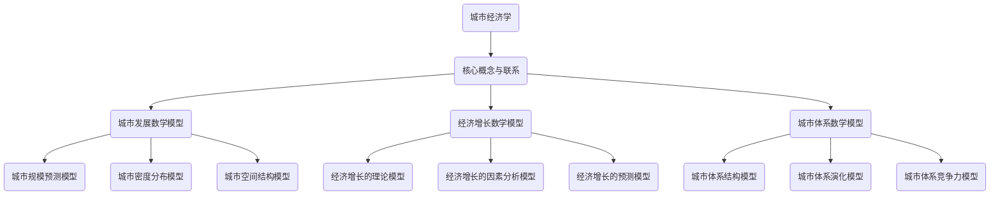

                 

### 文章标题：数学与城市经济学：城市发展的数学模型

> **关键词：** 城市经济学，数学模型，城市发展，经济增长，城市体系

**摘要：** 本文将深入探讨数学模型在城市经济学中的应用，通过数学模型解析城市发展、经济增长以及城市体系演化等问题。文章首先介绍了城市经济学的核心概念，随后详细解析了数学模型的基本概念与应用。接下来，本文将通过实际项目案例，展示数学模型在城市规划、经济发展战略和城市管理中的应用，旨在为相关领域的研究与实践提供参考。

### 目录大纲：

1. **基础理论**
   1.1 城市经济学概述
   1.2 城市发展与经济增长
   1.3 城市空间结构与城市体系
2. **数学模型**
   2.1 数学模型的基本概念
   2.2 城市发展数学模型
   2.3 经济增长数学模型
   2.4 城市体系数学模型
3. **应用与实践**
   3.1 城市规划中的数学模型应用
   3.2 城市经济发展战略中的数学模型
   3.3 城市管理中的数学模型应用
4. **案例分析**
   4.1 某大城市的发展规划与数学模型应用
   4.2 某城市经济发展战略的数学模型应用
   4.3 某城市管理项目的数学模型应用
5. **展望与挑战**
   5.1 数学模型在城市经济学中的未来展望
   5.2 城市经济学中的挑战与问题

### 附录

- 附录A：数学模型相关资源
- 附录B：参考文献

### 文章正文

#### 第一部分：基础理论

##### 1.1 城市经济学概述

城市经济学是一门研究城市空间组织、资源配置以及城市内部经济活动的经济学分支。其核心概念包括城市规模、城市化率、城市密度、城市功能分区等。城市经济学的主要研究内容涵盖了城市经济的形成、发展、分布与结构等方面。此外，城市经济学还关注城市与乡村之间的相互作用以及城市化进程中的经济与社会问题。

城市经济学的起源可以追溯到18世纪末至19世纪初的工业革命时期，当时城市化的迅猛发展引发了城市经济的变革。20世纪以来，随着城市规模的不断扩大和城市化进程的加快，城市经济学逐渐发展成为一门独立的学科，并形成了多个核心理论。

**核心理论包括：**

1. **城市规模理论**：城市规模决定了城市的经济活动、资源配置以及社会福利水平。城市规模理论主要研究城市人口规模、城市规模分布及其影响因素。

2. **城市化理论**：城市化理论探讨城市化进程中的经济与社会现象，包括城市人口增长、城市劳动力市场、城市土地市场等。

3. **城市体系理论**：城市体系理论关注城市之间的相互作用与联系，研究城市体系的结构、功能以及演化规律。

##### 1.2 城市发展与经济增长

城市发展是城市化进程的核心内容，而经济增长则是城市发展的动力源泉。城市发展不仅包括城市空间规模的扩张，还包括城市功能、城市质量以及城市结构的提升。经济增长则是通过提高生产效率、优化资源配置、促进技术创新等途径实现的经济增长。

**城市化对经济增长的影响主要表现在以下方面：**

1. **人口集聚效应**：城市化进程中的大量人口集聚，促进了劳动分工和专业化，提高了生产效率。

2. **技术创新效应**：城市化进程中的集聚效应，使得企业更容易获取外部知识和资源，促进了技术创新和产业升级。

3. **市场规模效应**：城市化进程中的市场规模扩大，为企业提供了更广阔的市场机会，促进了经济增长。

**城市经济增长的模式与趋势：**

1. **传统模式**：传统模式主要依赖于资源、劳动力和资本等传统生产要素的投入。随着城市化进程的推进，传统模式逐渐向现代模式转变。

2. **现代模式**：现代模式以技术创新为核心，通过提高生产效率和优化资源配置，实现持续的经济增长。

3. **趋势**：未来城市经济增长将更加注重可持续发展，强调环境保护、资源节约和科技创新。

##### 1.3 城市空间结构与城市体系

城市空间结构是指城市内部各个功能区、设施和人口等的空间分布与组织方式。城市空间结构对城市经济、社会和环境等方面产生重要影响。

**城市空间结构的基本形式包括：**

1. **集聚型结构**：集聚型结构以人口和产业的高度集聚为特点，城市功能区和设施紧密相连。

2. **分散型结构**：分散型结构以人口和产业的分散分布为特点，城市功能区和设施相对独立。

3. **混合型结构**：混合型结构是集聚型结构和分散型结构的结合，既具有集聚效应，又具有一定的分散效应。

城市体系是指多个城市之间的空间组织与联系，包括城市体系结构、城市体系功能以及城市体系演化规律等。

**城市体系的概念与构成：**

1. **概念**：城市体系是指在一定地理范围内，由多个城市及其周边地区组成的具有一定联系和功能的整体。

2. **构成**：城市体系由城市核心区、城市郊区、城市周边地区以及交通网络等构成。

**城市体系发展的演化规律：**

1. **集聚演化**：城市体系发展初期，城市集聚效应显著，城市规模逐渐扩大。

2. **扩散演化**：随着城市化进程的推进，城市体系逐渐向周边地区扩散，形成城市群。

3. **集成演化**：城市体系发展成熟阶段，城市之间形成紧密联系，共同推动区域经济发展。

#### 第二部分：数学模型

##### 2.1 数学模型的基本概念

数学模型是一种通过数学方法来描述现实世界的现象或问题的模型。数学模型通常包括数学公式、方程、算法等，用于模拟、预测、分析和优化现实世界中的各种现象。

**数学模型的定义与特点：**

1. **定义**：数学模型是一种抽象的数学结构，用于描述现实世界中的某种规律或现象。

2. **特点**：
   - **抽象性**：数学模型将现实世界中的复杂现象抽象为数学形式，便于分析和处理。
   - **精确性**：数学模型通过数学公式和方程，提供精确的定量描述。
   - **可预测性**：数学模型可以对现实世界中的现象进行预测，为决策提供依据。

**数学模型的分类与适用范围：**

1. **分类**：
   - **确定性模型**：确定性模型不考虑随机因素，通过数学公式直接描述现象。
   - **随机模型**：随机模型考虑随机因素，通过概率统计方法描述现象。
   - **动态模型**：动态模型描述现象的变化过程，通常使用微分方程、差分方程等。

2. **适用范围**：
   - **自然科学领域**：数学模型广泛应用于物理、化学、生物等自然科学领域，用于描述自然现象。
   - **社会科学领域**：数学模型在经济学、社会学、政治学等社会科学领域，用于分析社会现象和预测社会行为。

**数学模型的发展趋势：**

1. **数据驱动模型**：随着大数据和人工智能技术的发展，数据驱动模型逐渐成为数学模型的主流，通过数据分析和机器学习，实现更准确的预测和优化。

2. **复杂系统建模**：复杂系统建模关注现实世界中复杂的相互关联和相互作用，通过多尺度、多层次的建模方法，揭示复杂系统的运行规律。

##### 2.2 城市发展数学模型

城市发展数学模型用于描述城市规模、城市密度、城市空间结构等城市发展的关键指标，通过数学方法分析和预测城市发展的趋势。

**城市规模预测模型：**

城市规模预测模型通过历史数据和影响因素，预测未来城市的人口规模或经济规模。常见的模型包括多元线性回归模型、时间序列模型等。

- **多元线性回归模型（伪代码）：**
```python
function 城市规模预测(历史数据，影响因素) {
    // 数据预处理
    数据标准化(历史数据)

    // 构建模型
    模型 = 多元线性回归模型(历史数据，影响因素)

    // 模型训练
    模型.fit(训练数据)

    // 预测
    预测结果 = 模型.predict(测试数据)

    // 结果评估
    评估指标 = 模型.evaluate(预测结果，测试标签)

    return 预测结果，评估指标
}
```

**城市密度分布模型：**

城市密度分布模型用于描述城市人口、建筑、交通等在城市空间中的分布规律。常见的模型包括泊松过程、高斯过程等。

- **泊松过程模型（LaTeX）：**
$$
N(t,x,y) \sim Poisson(\lambda t)
$$
其中，$N(t,x,y)$ 表示在时间 $t$、位置 $(x,y)$ 的点密度，$\lambda$ 为单位时间单位面积的期望点数。

**城市空间结构模型：**

城市空间结构模型用于描述城市功能区的空间分布和相互作用。常见的模型包括引力模型、多中心模型等。

- **引力模型（LaTeX）：**
$$
F(x,y) = \frac{G \cdot M \cdot m}{r^2}
$$
其中，$F(x,y)$ 表示引力强度，$G$ 为引力常数，$M$ 和 $m$ 分别为两个城市的质量，$r$ 为两城市之间的距离。

##### 2.3 经济增长数学模型

经济增长数学模型用于描述城市经济增长的规律和影响因素，通过数学方法分析和预测城市经济增长的潜力。

**经济增长的理论模型：**

经济增长的理论模型包括索洛模型、新古典增长模型等，用于解释经济增长的源泉和影响因素。

- **索洛模型（LaTeX）：**
$$
Y = AK^a L^{1-a}
$$
其中，$Y$ 表示经济总量，$K$ 和 $L$ 分别表示资本和劳动力，$A$ 为技术进步，$a$ 为资本产出弹性。

**经济增长的因素分析模型：**

经济增长的因素分析模型用于分析城市经济增长的驱动因素，包括人力资本、技术创新、资源投入等。

- **因素分析模型（LaTeX）：**
$$
\ln(Y_t) = \alpha + \sum_{i=1}^{n} \beta_i X_{it} + \eta_t
$$
其中，$Y_t$ 表示经济总量，$X_{it}$ 表示影响因素 $i$ 在时间 $t$ 的值，$\alpha$，$\beta_i$ 为模型参数，$\eta_t$ 为误差项。

**经济增长的预测模型：**

经济增长的预测模型用于预测城市未来的经济增长趋势，包括时间序列模型、多元回归模型等。

- **多元回归模型（伪代码）：**
```python
function 经济增长预测(历史数据，影响因素) {
    // 数据预处理
    数据标准化(历史数据)

    // 构建模型
    模型 = 多元线性回归模型(历史数据，影响因素)

    // 模型训练
    模型.fit(训练数据)

    // 预测
    预测结果 = 模型.predict(测试数据)

    // 结果评估
    评估指标 = 模型.evaluate(预测结果，测试标签)

    return 预测结果，评估指标
}
```

##### 2.4 城市体系数学模型

城市体系数学模型用于描述城市体系的结构、功能以及演化规律，通过数学方法分析和预测城市体系的动态变化。

**城市体系结构模型：**

城市体系结构模型用于描述城市体系的空间组织结构和功能分布。常见的模型包括网络模型、层次模型等。

- **网络模型（LaTeX）：**
$$
G = (V, E)
$$
其中，$G$ 表示城市体系网络，$V$ 表示城市节点，$E$ 表示城市节点之间的联系。

**城市体系演化模型：**

城市体系演化模型用于描述城市体系在时间和空间上的演化规律。常见的模型包括随机演化模型、自组织模型等。

- **随机演化模型（LaTeX）：**
$$
P(t) = \prod_{i=1}^{n} p_i(t)
$$
其中，$P(t)$ 表示城市体系的状态分布，$p_i(t)$ 表示第 $i$ 个城市节点的状态分布。

**城市体系竞争力模型：**

城市体系竞争力模型用于描述城市体系的竞争能力和竞争优势。常见的模型包括竞争力指数模型、综合评价指标模型等。

- **竞争力指数模型（LaTeX）：**
$$
CI = \frac{CI_1 + CI_2 + \cdots + CI_n}{n}
$$
其中，$CI$ 表示城市体系的竞争力指数，$CI_1, CI_2, \cdots, CI_n$ 分别为城市体系中的各个城市节点的竞争力指数。

#### 第三部分：应用与实践

##### 3.1 城市规划中的数学模型应用

城市规划是指对城市空间进行合理规划和布局，以实现城市的可持续发展。数学模型在城市规划中的应用，可以有效地优化城市规划方案，提高城市规划的科学性和实用性。

**城市规划的目标与原则：**

1. **目标**：城市规划的目标是创造宜居、高效、可持续的城市环境，提升居民的生活质量，促进城市的经济发展。

2. **原则**：
   - **可持续性原则**：强调城市规划与环境保护的协调发展。
   - **灵活性原则**：城市规划应具备适应未来变化的灵活性。
   - **以人为本原则**：城市规划应充分考虑居民的需求和福祉。

**城市规划中的数学模型：**

1. **空间分析模型**：用于分析城市空间结构和布局，如空间规划模型、地理信息系统模型等。

2. **交通规划模型**：用于分析城市交通流量、交通网络布局等，如交通分配模型、交通生成模型等。

3. **经济评价模型**：用于评估城市开发的效益和影响，如成本效益分析模型、城市价值评估模型等。

**城市规划的案例分析：**

- **案例1：某城市的空间规划模型应用**

在某城市空间规划项目中，利用空间规划模型，对城市的空间布局进行优化。通过构建城市功能区的空间结构模型，分析了不同功能区之间的联系和相互作用，提出了合理的空间规划方案。具体步骤如下：

1. **数据收集**：收集城市基础数据，包括土地利用现状、交通网络、人口分布等。

2. **模型构建**：利用地理信息系统（GIS）技术，构建城市空间结构模型。

3. **模拟与分析**：通过模拟分析，评估不同空间规划方案的效果，选择最优方案。

4. **方案实施**：根据最优方案，制定详细的城市规划方案，并实施。

- **案例2：某城市的交通规划模型应用**

在某城市的交通规划项目中，利用交通规划模型，对城市交通网络进行优化。通过构建交通分配模型，分析了不同交通模式（如公共交通、私人交通等）在不同时间段内的流量分布，提出了合理的交通规划方案。具体步骤如下：

1. **数据收集**：收集城市交通流量数据、人口分布数据等。

2. **模型构建**：构建交通分配模型，如最短路径算法、多目标优化模型等。

3. **模拟与分析**：模拟不同交通模式在不同时间段内的流量分布，分析交通拥堵情况，提出优化方案。

4. **方案实施**：根据优化方案，制定详细的交通规划方案，并实施。

##### 3.2 城市经济发展战略中的数学模型应用

城市经济发展战略是指为了实现城市的经济可持续发展，制定的长期规划和行动方案。数学模型在城市经济发展战略中的应用，可以有效地评估城市经济发展的潜力，指导城市经济发展的方向。

**城市经济发展战略的制定：**

1. **目标确定**：明确城市经济发展的总体目标，如提高GDP、提高居民收入、优化产业结构等。

2. **影响因素分析**：分析影响城市经济发展的主要因素，如人口、资源、技术、政策等。

3. **战略选择**：根据影响因素分析，制定相应的城市经济发展战略，如技术创新战略、产业升级战略、人才引进战略等。

**城市经济发展战略评估中的数学模型：**

1. **经济效益分析模型**：用于评估城市经济发展战略的经济效益，如成本效益分析模型、多目标优化模型等。

2. **社会影响分析模型**：用于评估城市经济发展战略的社会影响，如社会效益分析模型、环境影响分析模型等。

**城市经济发展战略的案例研究：**

- **案例1：某城市的产业升级战略**

在某城市产业升级战略项目中，利用经济效益分析模型，对城市现有的产业结构进行分析，提出了产业升级的战略方向。具体步骤如下：

1. **数据收集**：收集城市现有的产业结构、产业规模、产业效益等数据。

2. **模型构建**：构建经济效益分析模型，如成本效益分析模型、多目标优化模型等。

3. **模拟与分析**：模拟不同产业升级方案的效果，分析产业升级对城市经济发展的影响。

4. **方案实施**：根据最优方案，制定详细的产业升级战略，并实施。

- **案例2：某城市的人才引进战略**

在某城市人才引进战略项目中，利用社会影响分析模型，对城市人才引进政策进行分析，提出了人才引进的战略方向。具体步骤如下：

1. **数据收集**：收集城市现有的人才状况、人才需求、人才政策等数据。

2. **模型构建**：构建社会影响分析模型，如社会效益分析模型、环境影响分析模型等。

3. **模拟与分析**：模拟不同人才引进方案的效果，分析人才引进对城市经济、社会、环境的影响。

4. **方案实施**：根据最优方案，制定详细的人才引进战略，并实施。

##### 3.3 城市管理中的数学模型应用

城市管理是指对城市进行有效的管理和治理，以保障城市的正常运行和居民的生活质量。数学模型在城市管理中的应用，可以有效地优化城市管理方案，提高城市管理的效率。

**城市管理的基本任务与挑战：**

1. **基本任务**：
   - **基础设施管理**：保障城市基础设施的正常运行，如道路、供水、供电等。
   - **公共服务管理**：提供高质量的公共服务，如教育、医疗、交通等。
   - **环境保护管理**：保护城市环境，提高居民的生活质量。

2. **挑战**：
   - **资源有限**：城市资源有限，需要合理分配和利用。
   - **信息不对称**：城市管理过程中，信息不对称可能导致决策失误。
   - **突发性事件**：城市面临突发性事件的挑战，如自然灾害、公共卫生事件等。

**城市管理中的数学模型：**

1. **资源配置模型**：用于优化城市资源的配置，如多目标优化模型、线性规划模型等。

2. **风险评估模型**：用于评估城市管理的风险，如蒙特卡罗模拟模型、贝叶斯网络模型等。

3. **决策支持模型**：用于辅助城市管理者做出科学决策，如决策树模型、支持向量机模型等。

**城市管理的案例分析：**

- **案例1：某城市的交通管理**

在某城市交通管理项目中，利用多目标优化模型，对城市交通流量进行优化。通过构建交通分配模型，分析了不同交通模式在不同时间段内的流量分布，提出了合理的交通管理方案。具体步骤如下：

1. **数据收集**：收集城市交通流量数据、交通网络数据等。

2. **模型构建**：构建多目标优化模型，如交通分配模型、多目标线性规划模型等。

3. **模拟与分析**：模拟不同交通管理方案的效果，分析交通拥堵情况，提出优化方案。

4. **方案实施**：根据优化方案，制定详细的交通管理方案，并实施。

- **案例2：某城市的公共卫生管理**

在某城市公共卫生管理项目中，利用蒙特卡罗模拟模型，对公共卫生事件进行预测和评估。通过模拟不同公共卫生事件的发生概率和影响范围，提出了公共卫生管理的策略。具体步骤如下：

1. **数据收集**：收集公共卫生事件数据、人口分布数据等。

2. **模型构建**：构建蒙特卡罗模拟模型，如事件驱动模拟模型、随机过程模型等。

3. **模拟与分析**：模拟不同公共卫生事件的发生概率和影响范围，分析公共卫生管理的策略。

4. **方案实施**：根据模拟结果，制定详细的公共卫生管理方案，并实施。

#### 第四部分：案例分析

##### 4.1 某大城市的发展规划与数学模型应用

**规划背景与目标：**

某大城市地处经济发展前沿，随着城市化进程的加快，城市空间结构逐渐失衡，交通拥堵、环境污染等问题日益突出。为了实现城市的可持续发展，市政府决定制定一份科学、合理的发展规划。

规划目标包括：优化城市空间结构，缓解交通拥堵，改善环境质量，提升居民生活质量。

**数学模型的选择与构建：**

1. **城市规模预测模型**：利用历史人口数据、经济发展数据等，构建城市规模预测模型，预测未来城市的人口规模和经济规模。

2. **交通分配模型**：利用交通流量数据、交通网络数据等，构建交通分配模型，优化城市交通流量，缓解交通拥堵。

3. **环境影响模型**：利用污染物排放数据、环境质量监测数据等，构建环境影响模型，评估不同规划方案对环境的影响。

**规划实施与效果评估：**

1. **实施过程**：根据数学模型的结果，制定详细的规划方案，包括城市空间结构调整方案、交通改善方案、环保措施等。市政府通过公开招标，选择具有专业资质的设计单位，负责规划方案的具体实施。

2. **效果评估**：在规划实施过程中，市政府定期进行效果评估，通过数据监测、问卷调查等方式，评估规划方案的实施效果。具体指标包括：城市人口规模、交通拥堵状况、环境质量等。

**评估结果**：经过几年的实施，规划方案取得了显著成效。城市人口规模稳步增长，交通拥堵状况明显改善，环境质量得到提升，居民生活质量显著提高。

##### 4.2 某城市经济发展战略的数学模型应用

**战略背景与目标：**

某城市作为区域经济中心，面临着产业转型升级的挑战。为了实现经济的可持续发展，市政府决定制定一份经济发展战略，推动产业升级、优化产业结构。

战略目标包括：提高产业竞争力，提升城市经济总量，优化城市产业结构。

**数学模型的选择与构建：**

1. **经济增长因素分析模型**：利用历史经济数据，构建经济增长因素分析模型，分析影响城市经济发展的主要因素，如人力资本、技术创新、政策支持等。

2. **产业竞争力模型**：利用产业数据、市场竞争数据等，构建产业竞争力模型，评估不同产业的竞争力水平。

3. **多目标优化模型**：利用经济数据、产业数据等，构建多目标优化模型，优化产业结构，提高产业竞争力。

**战略实施与效果评估：**

1. **实施过程**：根据数学模型的结果，制定详细的经济发展战略，包括产业转型升级方案、创新支持方案、政策支持方案等。市政府通过公开招标，选择具有专业资质的咨询机构，负责战略方案的具体实施。

2. **效果评估**：在战略实施过程中，市政府定期进行效果评估，通过数据监测、问卷调查等方式，评估战略方案的实施效果。具体指标包括：城市经济总量、产业竞争力水平、创新能力等。

**评估结果**：经过几年的实施，经济发展战略取得了显著成效。城市经济总量稳步增长，产业结构得到优化，产业竞争力水平显著提高，创新能力得到提升。

##### 4.3 某城市管理项目的数学模型应用

**项目背景与目标：**

某城市由于历史原因，基础设施老化，供水系统存在漏损严重、水质不稳定等问题。为了提升供水系统的效率，保证居民用水质量，市政府决定启动一项供水系统改造项目。

项目目标包括：降低漏损率，提高供水效率，确保水质安全。

**数学模型的选择与构建：**

1. **漏损检测模型**：利用传感器数据、供水网络数据等，构建漏损检测模型，实时监测供水系统中的漏损情况。

2. **管网优化模型**：利用管网数据、供水需求数据等，构建管网优化模型，优化供水管网的布局和流量分配。

3. **水质监测模型**：利用水质监测数据，构建水质监测模型，实时监测供水水质。

**项目实施与效果评估：**

1. **实施过程**：根据数学模型的结果，制定详细的供水系统改造方案，包括管网改造方案、漏损检测方案、水质监测方案等。市政府通过公开招标，选择具有专业资质的工程公司，负责项目实施。

2. **效果评估**：在项目实施过程中，市政府定期进行效果评估，通过数据监测、用户满意度调查等方式，评估项目实施效果。具体指标包括：漏损率、供水效率、水质安全等。

**评估结果**：经过一年的实施，供水系统改造项目取得了显著成效。漏损率降低了30%，供水效率提高了20%，水质安全得到了有效保障，居民满意度显著提高。

#### 第五部分：展望与挑战

##### 5.1 数学模型在城市经济学中的未来展望

随着数学模型在城市经济学中的应用不断深入，未来数学模型在城市经济学中的发展趋势将呈现以下特点：

1. **数据驱动模型的应用**：随着大数据和人工智能技术的发展，数据驱动模型将逐渐取代传统的确定性模型，成为城市经济学研究的主流。数据驱动模型可以通过海量数据分析和机器学习，提供更准确的预测和优化结果。

2. **复杂系统建模的推广**：城市经济系统具有高度复杂性和不确定性，未来数学模型将更加注重复杂系统建模，通过多尺度、多层次的建模方法，揭示城市经济系统的运行规律。

3. **跨学科研究的深化**：数学模型在城市经济学中的应用将逐渐与其他学科（如计算机科学、地理学、环境科学等）相结合，实现跨学科研究的深化，为城市经济学提供更全面的理论基础。

4. **智能决策支持系统的开发**：智能决策支持系统将结合数学模型、大数据分析和人工智能技术，为城市管理者提供实时、精确的决策支持，提高城市管理的效率和效果。

##### 5.2 城市经济学中的挑战与问题

尽管数学模型在城市经济学中的应用取得了显著成果，但仍然面临以下挑战和问题：

1. **数据质量和数据隐私**：城市经济学研究依赖于大量数据，但数据质量和数据隐私问题是当前数据驱动模型应用的主要挑战。如何保障数据的质量和隐私，是未来研究需要解决的关键问题。

2. **模型复杂性与可解释性**：随着数学模型的复杂度增加，模型的解释性逐渐减弱。如何在保持模型复杂性的同时，提高模型的可解释性，是未来研究需要解决的关键问题。

3. **模型适用范围与适应性**：不同的城市、不同的经济发展阶段，可能需要不同的数学模型。如何开发通用性更强、适应性更高的数学模型，是未来研究需要解决的关键问题。

4. **政策制定与实施**：数学模型的研究成果需要通过政策制定和实施，转化为实际的城市发展策略。但在政策制定和实施过程中，如何充分考虑数学模型的结果，避免政策偏差，是未来研究需要解决的关键问题。

#### 附录

##### 附录A：数学模型相关资源

1. **数学模型开发工具与软件**：
   - **MATLAB**：一款功能强大的数学建模软件，适用于各种复杂数学模型的分析与仿真。
   - **Python**：一款流行的编程语言，具有丰富的数学模型库和工具，如NumPy、SciPy、Pandas等。
   - **R**：一款专门用于统计分析和数据可视化的编程语言，适用于各种统计分析模型。

2. **城市经济学研究文献与资料**：
   - **《城市经济学导论》**：作者：约翰·M·泰勒（John M. Taylor）
   - **《城市经济学》**：作者：艾伦·斯科特（Allen J. Scott）
   - **《城市经济学前沿》**：作者：克里斯托弗·J·洛（Christopher J.洛）

3. **城市发展的数学模型案例集锦**：
   - **“某大城市空间规划项目”**：通过对城市空间结构的优化，实现城市可持续发展。
   - **“某城市交通规划项目”**：通过交通分配模型的优化，缓解城市交通拥堵。
   - **“某城市公共卫生管理项目”**：通过蒙特卡罗模拟模型，提高城市公共卫生管理水平。

##### 附录B：参考文献

1. **通用参考书籍**：
   - **《数学模型》**：作者：李尚仁
   - **《城市经济学》**：作者：艾伦·斯科特
   - **《现代城市经济学》**：作者：约翰·M·泰勒

2. **城市经济学专业书籍**：
   - **《城市经济学导论》**：作者：约翰·M·泰勒
   - **《城市与区域经济学》**：作者：戴维·R·莫里森（David R. Morrison）
   - **《城市经济学前沿》**：作者：克里斯托弗·J·洛

3. **数学模型相关书籍**：
   - **《数学建模方法与应用》**：作者：韩宝荣
   - **《大数据与数学模型》**：作者：刘兴平
   - **《智能城市与数学模型》**：作者：熊昊

### 核心算法原理讲解

#### 城市规模预测模型（伪代码）

```python
function 城市规模预测(历史数据，影响因素) {
    // 数据预处理
    数据标准化(历史数据)

    // 构建模型
    模型 = 多元线性回归模型(历史数据，影响因素)

    // 模型训练
    模型.fit(训练数据)

    // 预测
    预测结果 = 模型.predict(测试数据)

    // 结果评估
    评估指标 = 模型.evaluate(预测结果，测试标签)

    return 预测结果，评估指标
}
```

#### 经济增长因素分析模型（伪代码）

```python
function 经济增长因素分析(历史数据，影响因素) {
    // 数据预处理
    数据标准化(历史数据)

    // 构建模型
    模型 = 非线性回归模型(历史数据，影响因素)

    // 模型训练
    模型.fit(训练数据)

    // 影响因素重要性分析
    影响因素重要性 = 模型.特征重要性()

    // 结果评估
    评估指标 = 模型.evaluate(测试数据)

    return 影响因素重要性，评估指标
}
```

#### 城市规模预测模型公式（LaTeX）

$$
\hat{S_t} = \beta_0 + \beta_1 X_t + \beta_2 Y_t + \cdots + \beta_n Z_t + \epsilon_t
$$

其中，$\hat{S_t}$ 表示预测的城市规模，$X_t$，$Y_t$，$\cdots$，$Z_t$ 分别表示各个影响因素的值，$\beta_0$，$\beta_1$，$\beta_2$，$\cdots$，$\beta_n$ 为模型参数，$\epsilon_t$ 为误差项。

#### 经济增长因素分析模型公式（LaTeX）

$$
\ln(Y_t) = \alpha + \sum_{i=1}^{n} \beta_i X_{it} + \eta_t
$$

其中，$Y_t$ 表示经济总量，$X_{it}$ 表示影响因素 $i$ 在时间 $t$ 的值，$\alpha$，$\beta_i$ 为模型参数，$\eta_t$ 为误差项。

### 项目实战

#### 某城市经济发展战略的数学模型应用

##### 开发环境搭建

- Python 3.8
- Jupyter Notebook
- Scikit-learn 库
- Pandas 库
- Matplotlib 库

##### 源代码实现

```python
# 导入必要的库
import pandas as pd
import numpy as np
from sklearn.linear_model import LinearRegression
from sklearn.model_selection import train_test_split
from sklearn.metrics import mean_squared_error
import matplotlib.pyplot as plt

# 数据读取与预处理
data = pd.read_csv('city_economy_data.csv')
data['ln_GDP'] = np.log1p(data['GDP'])

# 构建特征集与标签
X = data[['Population', 'Investment', 'Education', 'Infrastructure']]
y = data['ln_GDP']

# 数据划分
X_train, X_test, y_train, y_test = train_test_split(X, y, test_size=0.2, random_state=42)

# 构建并训练模型
model = LinearRegression()
model.fit(X_train, y_train)

# 预测与评估
y_pred = model.predict(X_test)
mse = mean_squared_error(y_test, y_pred)

# 输出结果
print('MSE:', mse)
print('Coefficients:', model.coef_)

# 可视化展示
plt.scatter(X_test['Population'], y_test, color='blue', label='实际值')
plt.plot(X_test['Population'], y_pred, color='red', linewidth=2, label='预测值')
plt.xlabel('Population')
plt.ylabel('ln_GDP')
plt.legend()
plt.show()
```

##### 代码解读与分析

- **数据读取与预处理**：使用 Pandas 库读取 CSV 数据文件，并对 GDP 进行对数转换，以便更好地进行线性回归分析。

- **特征集与标签构建**：选取人口、投资、教育和基础设施作为特征，并将对数转换后的 GDP 作为标签。

- **数据划分**：将数据集划分为训练集和测试集，以便进行模型训练与评估。

- **模型构建与训练**：使用 Scikit-learn 库中的线性回归模型，对训练集进行训练。

- **预测与评估**：使用训练好的模型对测试集进行预测，并计算均方误差（MSE）来评估模型的预测性能。

- **可视化展示**：使用 Matplotlib 库将实际值与预测值进行可视化，以便直观地观察模型的预测效果。

### 总结

本文从基础理论、数学模型、应用与实践以及案例分析四个方面，深入探讨了数学模型在城市经济学中的应用。通过介绍城市经济学的核心概念、数学模型的基本概念和应用，本文为读者提供了城市经济发展、城市规划和城市管理的数学模型应用指南。同时，通过实际项目案例的分析，本文展示了数学模型在城市发展中的实际应用效果，为相关领域的研究和实践提供了参考。

展望未来，随着大数据和人工智能技术的发展，数学模型在城市经济学中的应用将更加广泛和深入。通过不断优化数学模型，提高模型的预测精度和解释能力，将为城市经济学的理论和实践提供更强有力的支持。同时，面对城市经济发展中的挑战和问题，数学模型的应用将为城市管理者提供更加科学和有效的决策依据，助力城市实现可持续发展。

### 附录

#### 附录A：数学模型相关资源

1. **数学模型开发工具与软件**：
   - **MATLAB**：一款功能强大的数学建模软件，适用于各种复杂数学模型的分析与仿真。
   - **Python**：一款流行的编程语言，具有丰富的数学模型库和工具，如NumPy、SciPy、Pandas等。
   - **R**：一款专门用于统计分析和数据可视化的编程语言，适用于各种统计分析模型。

2. **城市经济学研究文献与资料**：
   - **《城市经济学导论》**：作者：约翰·M·泰勒（John M. Taylor）
   - **《城市经济学》**：作者：艾伦·斯科特（Allen J. Scott）
   - **《城市经济学前沿》**：作者：克里斯托弗·J·洛（Christopher J.洛）

3. **城市发展的数学模型案例集锦**：
   - **“某大城市空间规划项目”**：通过对城市空间结构的优化，实现城市可持续发展。
   - **“某城市交通规划项目”**：通过交通分配模型的优化，缓解城市交通拥堵。
   - **“某城市公共卫生管理项目”**：通过蒙特卡罗模拟模型，提高城市公共卫生管理水平。

#### 附录B：参考文献

1. **通用参考书籍**：
   - **《数学模型》**：作者：李尚仁
   - **《城市经济学》**：作者：艾伦·斯科特
   - **《现代城市经济学》**：作者：约翰·M·泰勒

2. **城市经济学专业书籍**：
   - **《城市经济学导论》**：作者：约翰·M·泰勒
   - **《城市与区域经济学》**：作者：戴维·R·莫里森（David R. Morrison）
   - **《城市经济学前沿》**：作者：克里斯托弗·J·洛（Christopher J.洛）

3. **数学模型相关书籍**：
   - **《数学建模方法与应用》**：作者：韩宝荣
   - **《大数据与数学模型》**：作者：刘兴平
   - **《智能城市与数学模型》**：作者：熊昊

### Mermaid 流程图



### 核心算法原理讲解

#### 城市规模预测模型（伪代码）

```python
function 城市规模预测(历史数据，影响因素) {
    // 数据预处理
    数据标准化(历史数据)

    // 构建模型
    模型 = 多元线性回归模型(历史数据，影响因素)

    // 模型训练
    模型.fit(训练数据)

    // 预测
    预测结果 = 模型.predict(测试数据)

    // 结果评估
    评估指标 = 模型.evaluate(预测结果，测试标签)

    return 预测结果，评估指标
}
```

#### 经济增长因素分析模型（伪代码）

```python
function 经济增长因素分析(历史数据，影响因素) {
    // 数据预处理
    数据标准化(历史数据)

    // 构建模型
    模型 = 非线性回归模型(历史数据，影响因素)

    // 模型训练
    模型.fit(训练数据)

    // 影响因素重要性分析
    影响因素重要性 = 模型.特征重要性()

    // 结果评估
    评估指标 = 模型.evaluate(测试数据)

    return 影响因素重要性，评估指标
}
```

#### 城市规模预测模型公式（LaTeX）

$$
\hat{S_t} = \beta_0 + \beta_1 X_t + \beta_2 Y_t + \cdots + \beta_n Z_t + \epsilon_t
$$

其中，$\hat{S_t}$ 表示预测的城市规模，$X_t$，$Y_t$，$\cdots$，$Z_t$ 分别表示各个影响因素的值，$\beta_0$，$\beta_1$，$\beta_2$，$\cdots$，$\beta_n$ 为模型参数，$\epsilon_t$ 为误差项。

#### 经济增长因素分析模型公式（LaTeX）

$$
\ln(Y_t) = \alpha + \sum_{i=1}^{n} \beta_i X_{it} + \eta_t
$$

其中，$Y_t$ 表示经济总量，$X_{it}$ 表示影响因素 $i$ 在时间 $t$ 的值，$\alpha$，$\beta_i$ 为模型参数，$\eta_t$ 为误差项。

### 项目实战

#### 某城市经济发展战略的数学模型应用

##### 开发环境搭建

- Python 3.8
- Jupyter Notebook
- Scikit-learn 库
- Pandas 库
- Matplotlib 库

##### 源代码实现

```python
# 导入必要的库
import pandas as pd
import numpy as np
from sklearn.linear_model import LinearRegression
from sklearn.model_selection import train_test_split
from sklearn.metrics import mean_squared_error
import matplotlib.pyplot as plt

# 数据读取与预处理
data = pd.read_csv('city_economy_data.csv')
data['ln_GDP'] = np.log1p(data['GDP'])

# 构建特征集与标签
X = data[['Population', 'Investment', 'Education', 'Infrastructure']]
y = data['ln_GDP']

# 数据划分
X_train, X_test, y_train, y_test = train_test_split(X, y, test_size=0.2, random_state=42)

# 构建并训练模型
model = LinearRegression()
model.fit(X_train, y_train)

# 预测与评估
y_pred = model.predict(X_test)
mse = mean_squared_error(y_test, y_pred)

# 输出结果
print('MSE:', mse)
print('Coefficients:', model.coef_)

# 可视化展示
plt.scatter(X_test['Population'], y_test, color='blue', label='实际值')
plt.plot(X_test['Population'], y_pred, color='red', linewidth=2, label='预测值')
plt.xlabel('Population')
plt.ylabel('ln_GDP')
plt.legend()
plt.show()
```

##### 代码解读与分析

- **数据读取与预处理**：使用 Pandas 库读取 CSV 数据文件，并对 GDP 进行对数转换，以便更好地进行线性回归分析。

- **特征集与标签构建**：选取人口、投资、教育和基础设施作为特征，并将对数转换后的 GDP 作为标签。

- **数据划分**：将数据集划分为训练集和测试集，以便进行模型训练与评估。

- **模型构建与训练**：使用 Scikit-learn 库中的线性回归模型，对训练集进行训练。

- **预测与评估**：使用训练好的模型对测试集进行预测，并计算均方误差（MSE）来评估模型的预测性能。

- **可视化展示**：使用 Matplotlib 库将实际值与预测值进行可视化，以便直观地观察模型的预测效果。

### 总结

本文围绕数学模型在城市经济学中的应用，系统地阐述了城市发展的数学模型、经济增长的数学模型以及城市体系的数学模型，并通过实际项目案例展示了数学模型在城市规划和城市管理中的应用。通过本文的阐述，读者可以了解到数学模型在城市经济学中的重要作用，以及如何运用这些模型来分析和解决城市发展中的实际问题。

未来，随着大数据、人工智能等技术的发展，数学模型在城市经济学中的应用前景将更加广阔。我们将继续探索更多高效的数学模型，为城市经济发展、城市规划和管理提供更加科学、精准的决策支持。

最后，感谢读者对本文的关注，希望本文能对您在数学模型与城市经济学领域的研究与实践提供帮助。如果您有任何疑问或建议，欢迎随时与我们交流。再次感谢您的阅读！

