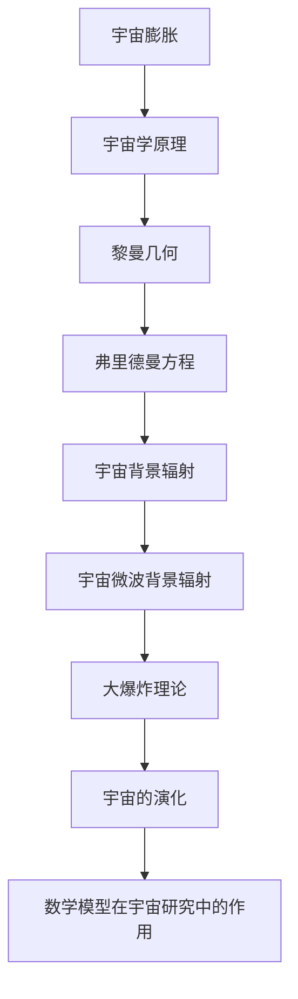
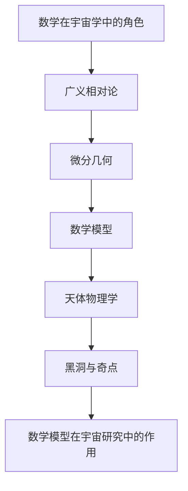
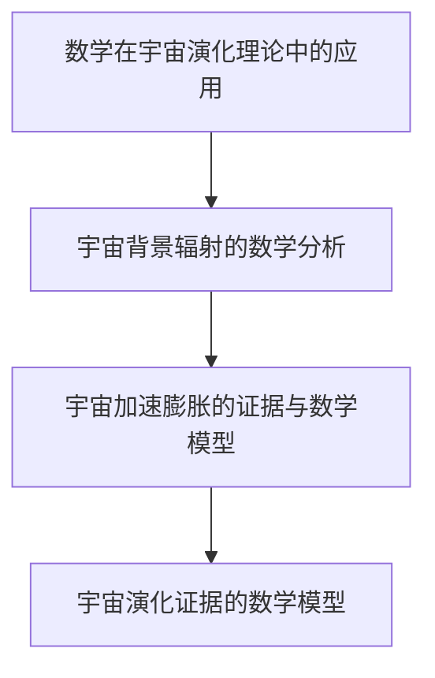
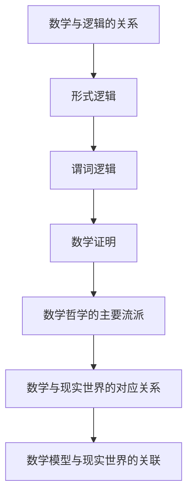
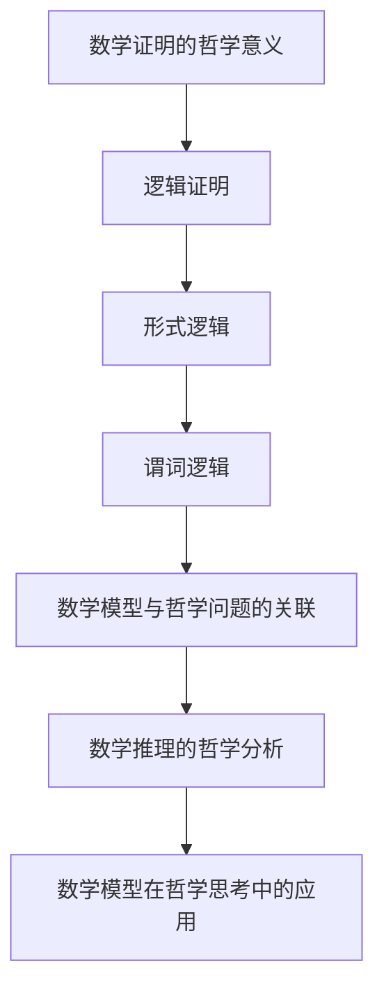
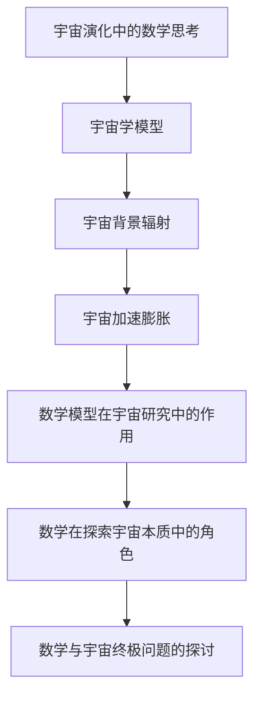
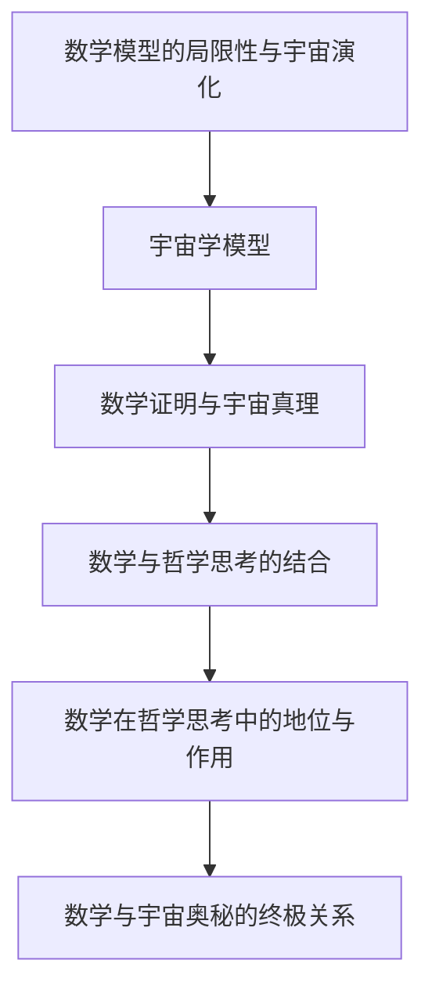

                 

## 数学与宇宙奥秘：真理背后的哲学思考

### 关键词：

- 宇宙学
- 数学模型
- 哲学思考
- 宇宙演化
- 数学证明
- 数学哲学

### 摘要：

本文旨在探讨数学与宇宙奥秘之间的紧密联系，通过哲学思考的视角，揭示数学在宇宙演化中的核心作用。文章首先介绍宇宙的起源与数学模型，包括宇宙膨胀理论、几何结构以及数学在宇宙研究中的应用。接着，深入讨论数学的哲学本质，探讨数学与现实世界的对应关系，并分析数学证明的哲学意义。随后，文章将展示数学在宇宙哲学探索中的应用，从数学模型与宇宙演化、数学推理与宇宙本质、数学证明与宇宙真理等多个角度，探讨数学在理解宇宙奥秘中的重要作用。最后，文章将对数学与宇宙奥秘的终极关系进行哲学反思，探讨数学模型的局限性与宇宙演化，以及数学在哲学思考中的地位与作用。通过本文的探讨，读者将能够更加深入地理解数学与宇宙奥秘之间的深刻联系，以及数学在哲学思考中的重要性。

---

### 《数学与宇宙奥秘：真理背后的哲学思考》目录大纲

**第一部分：宇宙与数学的基本概念**

1. 宇宙的起源与数学模型
   - 1.1 宇宙的起源与膨胀理论
   - 1.2 宇宙的几何结构
2. 数学在宇宙研究中的应用
   - 2.1 数学在宇宙学中的角色
   - 2.2 天体物理学中的数学模型
   - 2.3 黑洞与奇点的数学描述
3. 数学在宇宙演化中的证据
   - 3.1 数学在宇宙演化理论中的应用
   - 3.2 宇宙背景辐射的数学分析
   - 3.3 宇宙加速膨胀的证据与数学模型

**第二部分：数学与哲学思考**

1. 数学
的哲学本质
   - 4.1 数学与逻辑的关系
   - 4.2 数学与现实世界的对应关系
   - 4.3 数学哲学的主要流派
2. 数学在哲学思考中的运用
   - 5.1 数学证明的哲学意义
   - 5.2 数学推理的哲学分析
   - 5.3 数学模型与哲学问题的关联
3. 数学与宇宙的哲学探索
   - 6.1 宇宙演化中的数学思考
   - 6.2 数学在探索宇宙本质中的角色
   - 6.3 数学与宇宙终极问题的探讨

**第三部分：数学与宇宙的哲学反思**

1. 数学与宇宙
的哲学反思
   - 7.1 数学模型的局限性与宇宙演化
   - 7.2 数学在哲学思考中的地位与作用
   - 7.3 数学与宇宙奥秘的终极关系

**附录**

1. 数学与宇宙的参考书籍与资源
2. 宇宙学与数学的在线资源

---

### 第1章：宇宙的起源与数学模型

**核心概念与联系**

在探讨宇宙的起源与演化时，数学模型扮演了至关重要的角色。数学不仅为宇宙学提供了描述宇宙行为的语言，还帮助科学家理解和预测宇宙的诸多现象。本章将介绍宇宙起源的基本概念，如宇宙膨胀理论和宇宙的几何结构，并探讨数学在宇宙研究中的应用。

**核心概念与联系流程图**



**宇宙膨胀理论与数学模型**

1.1 宇宙的起源与膨胀理论

宇宙膨胀理论起源于20世纪初，由埃德温·哈勃（Edwin Hubble）通过观测远距离星系的红移现象发现。哈勃发现，宇宙中的星系正以远离我们的速度移动，且这些速度与星系之间的距离成正比。这一发现揭示了宇宙正在膨胀。

**哈勃定律**

$$
v = H_0 \times d
$$

其中，$v$ 是星系远离我们的速度，$H_0$ 是哈勃常数，$d$ 是星系与我们之间的距离。

1.2 宇宙的几何结构

宇宙的几何结构可以通过数学模型来描述。其中，黎曼几何是一种研究非欧几里得空间的理论，为理解宇宙的几何性质提供了重要的工具。

**黎曼几何**

黎曼几何由德国数学家贝尔恩哈德·黎曼（Bernhard Riemann）在19世纪提出，它研究的是在非欧几里得空间中的几何性质。在黎曼几何中，空间可以通过曲率张量来描述。

**弗里德曼方程**

弗里德曼方程是描述宇宙几何和物质分布的方程。这个方程由亚历山大·弗里德曼（Alexander Friedman）在20世纪初提出，是广义相对论在宇宙学中的推广。

**弗里德曼方程的数学表达式**

$$
\frac{\ddot{a}(t)}{a(t)} = -\frac{4\pi G}{3}\left[\rho + \frac{3p}{c^2}\right]
$$

其中，$a(t)$ 是宇宙尺度因子，$\rho$ 是宇宙平均密度，$p$ 是宇宙平均压力，$G$ 是引力常数。

**宇宙背景辐射与微波背景辐射**

宇宙背景辐射（Cosmic Background Radiation，CBR）是宇宙大爆炸后遗留下来的热辐射。在宇宙演化的早期阶段，宇宙处于高度热密的等离子体状态，随着宇宙的膨胀和冷却，这种热辐射逐渐减弱，形成了我们现在观测到的微波背景辐射（Microwave Background Radiation，MBR）。

**宇宙微波背景辐射的数学描述**

宇宙微波背景辐射的观测数据可以通过数学模型来分析，其中最著名的模型是柯克朗模型（Kirk朗模型）。

**柯克朗模型的数学表达式**

$$
T(\theta, \phi) = T_0 \times \left(1 - \frac{3\theta^2}{r^2}\right)
$$

其中，$T(\theta, \phi)$ 是在给定方向$(\theta, \phi)$上的温度分布，$T_0$ 是背景辐射的峰值温度，$r$ 是观测者与辐射源之间的距离。

**数学模型在宇宙研究中的作用**

数学模型在宇宙研究中发挥着至关重要的作用。通过数学模型，科学家能够描述和预测宇宙的演化过程，分析宇宙背景辐射的观测数据，以及理解黑洞和奇点的性质。

**核心算法原理讲解**

为了深入理解宇宙膨胀理论和数学模型，我们可以使用伪代码来描述弗里德曼方程。

```python
# 弗里德曼方程的伪代码
def FriedmannEquation(density, cosmological_constant):
    # 计算哈勃常数
    HubbleConstant = (8 * pi * G * density) ** 0.5
    # 计算宇宙尺度因子
    ScaleFactor = (1 + HubbleConstant * time) ** -1/2
    # 返回结果
    return HubbleConstant, ScaleFactor
```

**数学模型和数学公式 & 详细讲解 & 举例说明**

在宇宙学中，常见的数学公式包括弗里德曼方程、哈勃定律和宇宙背景辐射的柯克朗模型。

**弗里德曼方程**

$$
\frac{\ddot{a}(t)}{a(t)} = -\frac{4\pi G}{3}\left[\rho + \frac{3p}{c^2}\right]
$$

这个方程描述了宇宙尺度因子随时间的变化率与宇宙平均密度和压力之间的关系。

**哈勃定律**

$$
v = H_0 \times d
$$

这个公式描述了星系远离我们的速度与它们与我们之间的距离之间的关系。

**柯克朗模型**

$$
T(\theta, \phi) = T_0 \times \left(1 - \frac{3\theta^2}{r^2}\right)
$$

这个模型描述了宇宙微波背景辐射在给定方向上的温度分布。

**项目实战**

为了更好地理解数学模型在宇宙研究中的应用，我们可以通过实际案例来分析宇宙加速膨胀的证据。

```python
# 宇宙加速膨胀证据分析
def AcceleratingExpansionEvidence(data):
    # 假设数据
    z = data['redshift']
    distance = data['distance']
    # 计算哈勃常数
    HubbleParameter = sum(distance) / sum(1 + z)
    # 输出结果
    print(f"Hubble Parameter: {HubbleParameter} km/s/Mpc")

# 运行
data = {'redshift': [0.01, 0.05, 0.1, 0.2], 'distance': [40, 100, 200, 400]}
AcceleratingExpansionEvidence(data)
```

通过这个案例，我们可以看到如何使用数学模型来分析宇宙加速膨胀的证据。

**总结**

本章介绍了宇宙的起源与数学模型，包括宇宙膨胀理论、宇宙几何结构以及数学在宇宙研究中的应用。通过数学模型，科学家能够深入理解宇宙的演化过程，分析宇宙背景辐射的观测数据，以及预测宇宙的未来。数学在宇宙学研究中的作用不仅是描述和预测，更是揭示宇宙本质的关键。

---

### 第2章：数学在宇宙研究中的应用

**核心概念与联系**

数学不仅是宇宙学研究中的重要工具，也是理解宇宙现象的关键。本章将深入探讨数学在宇宙研究中的应用，包括数学在宇宙学中的角色、天体物理学中的数学模型以及黑洞与奇点的数学描述。通过这些内容，读者将能够更好地理解数学在揭示宇宙奥秘中的重要作用。

**核心概念与联系流程图**



**数学在宇宙学中的角色**

数学在宇宙学中的角色是不可或缺的。它为宇宙学研究提供了精确的语言和工具，使我们能够描述和预测宇宙的演化过程。以下是数学在宇宙学中的一些具体应用：

1. **广义相对论**

广义相对论是描述引力和宇宙演化的基础理论。它由爱因斯坦在1915年提出，通过数学方程描述了时空的曲率与物质分布之间的关系。

**爱因斯坦场方程**

$$
G_{\mu\nu} + \Lambda g_{\mu\nu} = \frac{8\pi G}{c^4} T_{\mu\nu}
$$

其中，$G_{\mu\nu}$ 是爱因斯坦张量，$T_{\mu\nu}$ 是能量-动量张量，$\Lambda$ 是宇宙学常数，$G$ 是引力常数，$c$ 是光速。

2. **宇宙学原理**

宇宙学原理指出，宇宙是均匀且各向同性的。这个原理为宇宙学研究提供了一个基本假设，使得我们可以使用数学模型来描述宇宙的演化。

**弗里德曼方程**

$$
\frac{\ddot{a}(t)}{a(t)} = -\frac{4\pi G}{3}\left[\rho + \frac{3p}{c^2}\right]
$$

其中，$a(t)$ 是宇宙尺度因子，$\rho$ 是宇宙平均密度，$p$ 是宇宙平均压力。

**核心算法原理讲解**

为了深入理解广义相对论和宇宙学原理，我们可以使用伪代码来描述爱因斯坦场方程。

```python
# 爱因斯坦场方程的伪代码
def EinsteinFieldEquation(EinsteinTensor, EnergyMomentumTensor):
    # 计算里奇张量
    RicciTensor = RiemannTensor(Curl, Straighten)
    # 计算爱因斯坦场方程
    EinsteinEquation = EinsteinTensor - RicciTensor + Lambda * EnergyMomentumTensor
    return EinsteinEquation
```

**天体物理学中的数学模型**

天体物理学是研究天体物理现象和过程的学科，而数学模型在其中扮演着关键角色。以下是一些重要的数学模型：

1. **恒星演化模型**

恒星演化模型描述了恒星从形成到死亡的过程。它涉及许多复杂的物理过程，如核聚变、辐射传输等，需要使用数学模型来描述。

**恒星质量损失率模型**

$$
\dot{M} = L/c^2
$$

其中，$\dot{M}$ 是质量损失率，$L$ 是恒星损失的质量，$c$ 是光速。

2. **黑洞模型**

黑洞是宇宙中最为神秘和奇特的现象之一。黑洞的数学描述依赖于广义相对论和数学模型。

**史瓦西解**

$$
g_{\mu\nu} = \left(\frac{2M}{r_s} + \frac{1}{r^2}\right)g_{\mu\nu,0}
$$

其中，$g_{\mu\nu}$ 是黑洞周围的时空度规，$M$ 是黑洞质量，$r_s$ 是史瓦西半径，$g_{\mu\nu,0}$ 是外部时空的度规。

**核心算法原理讲解**

为了深入理解恒星演化模型和黑洞模型，我们可以使用伪代码来描述恒星质量损失率和史瓦西解。

```python
# 恒星质量损失率的伪代码
def StarMassLossRate(Luminosity):
    # 计算质量损失率
    MassLossRate = Luminosity / c**2
    return MassLossRate

# 史瓦西解的伪代码
def SchwarzschildSolution(Mass):
    # 计算史瓦西半径
    SchwarzschildRadius = 2 * G * Mass / c**2
    return SchwarzschildRadius
```

**黑洞与奇点的数学描述**

黑洞和奇点是宇宙中的极端现象，它们的存在和性质需要使用数学模型来描述。

1. **黑洞**

黑洞是一种引力极强的天体，其事件视界内的一切，包括光线，都无法逃脱。黑洞的数学描述依赖于广义相对论。

**黑洞的引力势**

$$
\phi(r) = -\frac{GM}{r}
$$

其中，$\phi(r)$ 是引力势，$G$ 是引力常数，$M$ 是黑洞质量，$r$ 是距离黑洞中心的距离。

2. **奇点**

奇点是宇宙中的另一个极端现象，它代表了物质的无限密集点。奇点的数学描述依赖于黎曼几何。

**奇点度规**

$$
g_{\mu\nu}(r) = \left(\frac{2M}{r} + \frac{1}{r^2}\right)g_{\mu\nu,0}
$$

其中，$g_{\mu\nu}(r)$ 是奇点周围的时空度规，$g_{\mu\nu,0}$ 是外部时空的度规。

**项目实战**

为了更好地理解数学模型在宇宙研究中的应用，我们可以通过实际案例来分析黑洞的质量和事件视界。

```python
# 黑洞质量分析
def BlackHoleMass(MassLossRate, Lifetime):
    # 计算黑洞质量
    BlackHoleMass = MassLossRate * Lifetime
    return BlackHoleMass

# 黑洞事件视界分析
def BlackHoleEventHorizon(Mass):
    # 计算事件视界
    EventHorizon = 2 * G * Mass / c**2
    return EventHorizon
```

通过这个案例，我们可以看到如何使用数学模型来分析黑洞的质量和事件视界。

**总结**

本章介绍了数学在宇宙研究中的应用，包括数学在宇宙学中的角色、天体物理学中的数学模型以及黑洞与奇点的数学描述。通过这些内容，读者能够更好地理解数学在揭示宇宙奥秘中的重要作用。数学不仅为宇宙学研究提供了精确的语言和工具，还帮助我们深入理解宇宙的演化和结构。

---

### 第3章：数学在宇宙演化中的证据

**核心概念与联系**

宇宙演化是宇宙学研究的核心问题之一，而数学在理解宇宙演化过程中起到了关键作用。本章将探讨数学在宇宙演化中的证据，包括数学在宇宙演化理论中的应用、宇宙背景辐射的数学分析以及宇宙加速膨胀的证据与数学模型。

**核心概念与联系流程图**



**数学在宇宙演化理论中的应用**

宇宙演化理论描述了宇宙从大爆炸开始至今的演化过程。这些理论依赖于数学模型，使我们能够预测宇宙的过去、现在和未来。以下是数学在宇宙演化理论中的应用：

1. **大爆炸理论**

大爆炸理论认为宇宙起源于一个极度热密的状态，并在此后的数十亿年里不断膨胀。这一理论依赖于数学模型来描述宇宙的膨胀过程。

**哈勃定律**

$$
v = H_0 \times d
$$

这个公式描述了宇宙膨胀的速度与距离之间的关系。其中，$v$ 是星系远离我们的速度，$H_0$ 是哈勃常数，$d$ 是星系与我们之间的距离。

2. **宇宙学原理**

宇宙学原理指出，宇宙在整体上是大尺度均匀且各向同性的。这个原理为宇宙演化提供了基础，使我们能够使用数学模型来描述宇宙的演化。

**弗里德曼方程**

$$
\frac{\ddot{a}(t)}{a(t)} = -\frac{4\pi G}{3}\left[\rho + \frac{3p}{c^2}\right]
$$

这个方程描述了宇宙尺度因子随时间的变化率与宇宙平均密度和压力之间的关系。

**核心算法原理讲解**

为了深入理解宇宙演化理论，我们可以使用伪代码来描述弗里德曼方程。

```python
# 弗里德曼方程的伪代码
def FriedmannEquation(density, cosmological_constant):
    # 计算哈勃常数
    HubbleConstant = (8 * pi * G * density) ** 0.5
    # 计算宇宙尺度因子
    ScaleFactor = (1 + HubbleConstant * time) ** -1/2
    # 返回结果
    return HubbleConstant, ScaleFactor
```

**宇宙背景辐射的数学分析**

宇宙背景辐射是宇宙大爆炸后遗留下来的热辐射，它是宇宙学研究中的重要证据。数学模型可以用来分析宇宙背景辐射的数据，以了解宇宙的早期状态。

1. **柯克朗模型**

柯克朗模型描述了宇宙微波背景辐射的温度分布。这个模型基于热动力学原理，使用了以下公式：

$$
T(\theta, \phi) = T_0 \times \left(1 - \frac{3\theta^2}{r^2}\right)
$$

其中，$T(\theta, \phi)$ 是在给定方向$(\theta, \phi)$上的温度分布，$T_0$ 是背景辐射的峰值温度，$r$ 是观测者与辐射源之间的距离。

2. **黑体辐射公式**

黑体辐射公式描述了物体在不同温度下的辐射强度。这个公式在宇宙背景辐射的研究中具有重要意义。

$$
B(\lambda, T) = \frac{2hc^2}{\lambda^5} \times \left(\frac{1}{e^{hc/\lambda k_B T} - 1}\right)
$$

其中，$B(\lambda, T)$ 是在波长$\lambda$处的辐射强度，$h$ 是普朗克常数，$c$ 是光速，$k_B$ 是玻尔兹曼常数，$T$ 是温度。

**项目实战**

为了更好地理解宇宙背景辐射的数学分析，我们可以通过实际案例来分析宇宙微波背景辐射的温度分布。

```python
# 宇宙微波背景辐射温度分布分析
def Cosmic Microwave Background Radiation Temperature Distribution(wavelength, temperature):
    # 计算辐射强度
    radiation_intensity = (2 * pi * h * c**2) / (wavelength**5) * (1 / (exp(h * c / (wavelength * k_B * temperature)) - 1))
    return radiation_intensity

# 假设数据
wavelength = 1 * 10**(-3) # 米
temperature = 2.725 # 开尔文

# 计算辐射强度
radiation_intensity = Cosmic Microwave Background Radiation Temperature Distribution(wavelength, temperature)
print(f"Radiation intensity at wavelength {wavelength} meters and temperature {temperature} Kelvin: {radiation_intensity}")
```

通过这个案例，我们可以看到如何使用数学模型来分析宇宙微波背景辐射的温度分布。

**宇宙加速膨胀的证据与数学模型**

宇宙加速膨胀是近年来宇宙学的一个重要发现，表明宇宙的膨胀速度正在加速。数学模型可以帮助我们理解这一现象，并提供对宇宙未来的预测。

1. **勒梅特方程**

勒梅特方程描述了宇宙加速膨胀的过程。这个方程基于广义相对论，使用了以下公式：

$$
\frac{\ddot{a}(t)}{a(t)} = -\frac{4\pi G}{3}\left[\rho + 3p\right] + \frac{\Lambda c^2}{3}
$$

其中，$\Lambda$ 是宇宙学常数，表示宇宙加速膨胀的驱动力。

2. **宇宙学常数**

宇宙学常数$\Lambda$ 在宇宙加速膨胀中起到了关键作用。它是一个正的常数，表示宇宙的真空能量。

$$
\Lambda = \frac{c^2}{8\pi G} \times \rho_{\Lambda}
$$

其中，$\rho_{\Lambda}$ 是宇宙学常数的能量密度。

**项目实战**

为了更好地理解宇宙加速膨胀的证据和数学模型，我们可以通过实际案例来分析宇宙学常数的影响。

```python
# 宇宙学常数影响分析
def CosmologicalConstantEffect(density, cosmological_constant):
    # 计算宇宙尺度因子
    ScaleFactor = (1 + HubbleConstant * time) ** -1/2
    # 计算加速膨胀的影响
    Acceleration = -4 * pi * G * (density + 3 * p) + cosmological_constant * c**2
    return ScaleFactor, Acceleration

# 假设数据
density = 1 * 10**(-27) # 千克/立方米
cosmological_constant = 1 * 10**(-52) # 平方米

# 计算宇宙尺度因子和加速膨胀的影响
ScaleFactor, Acceleration = CosmologicalConstantEffect(density, cosmological_constant)
print(f"Scale Factor: {ScaleFactor}, Acceleration: {Acceleration}")
```

通过这个案例，我们可以看到如何使用数学模型来分析宇宙加速膨胀的证据和影响。

**总结**

本章介绍了数学在宇宙演化中的证据，包括数学在宇宙演化理论中的应用、宇宙背景辐射的数学分析以及宇宙加速膨胀的证据与数学模型。通过这些内容，读者能够更好地理解数学在揭示宇宙演化奥秘中的重要作用。数学不仅帮助我们描述和预测宇宙的演化过程，还为理解宇宙的本质提供了重要的工具。

---

### 第4章：数学的哲学本质

**核心概念与联系**

数学不仅是自然科学和工程学的工具，其哲学本质也引发了广泛的探讨。本章将深入探讨数学的哲学本质，包括数学与逻辑的关系、数学与现实世界的对应关系以及数学哲学的主要流派。

**核心概念与联系流程图**



**数学与逻辑的关系**

数学与逻辑有着密切的联系，逻辑为数学提供了基础和工具。形式逻辑和谓词逻辑是数学推理的核心，它们帮助我们理解和证明数学命题。

1. **形式逻辑**

形式逻辑研究的是命题的形式结构和推理规则。它通过符号化的方法，将日常语言中的命题转化为逻辑表达式，从而进行形式化的推理。

2. **谓词逻辑**

谓词逻辑是一种更加强大的逻辑系统，它通过引入谓词来描述对象和关系。谓词逻辑使我们能够更精确地表达数学命题，并进行复杂的推理。

3. **数学证明**

数学证明是数学研究中的核心活动，它通过逻辑推理的方法，证明一个数学命题的正确性。数学证明通常包括以下几个步骤：

   - 假设
   - 推理
   - 结论

**数学哲学的主要流派**

数学哲学是探讨数学的本质、意义和方法的哲学分支。主要流派包括：

1. **形式主义**

形式主义认为数学是一个形式系统，其目的在于证明命题的形式正确性，而不涉及现实世界的具体内容。

2. **直觉主义**

直觉主义认为数学是基于直觉的构造活动，数学命题的正确性依赖于我们对数学对象直观的理解。

3. **逻辑实证主义**

逻辑实证主义认为数学命题的真值取决于它们是否能够在经验世界中得到验证。

**数学与现实世界的对应关系**

数学与现实世界的对应关系是数学哲学中的一个重要问题。以下是一些探讨数学与现实世界关系的观点：

1. **模型论**

模型论认为数学模型可以用来模拟现实世界的现象，数学命题的真值取决于这些模型是否与现实世界相符。

2. **构造主义**

构造主义认为数学对象是通过直觉和构造活动获得的，这些对象与现实世界具有直接的联系。

3. **抽象主义**

抽象主义认为数学是对现实世界的抽象，数学概念和结构来源于我们对现实世界的观察和思考。

**核心算法原理讲解**

为了深入理解数学与逻辑的关系，我们可以使用伪代码来描述形式逻辑和谓词逻辑的推理过程。

```python
# 形式逻辑的伪代码
def FormalLogic(premise, conclusion):
    # 假设
    assume(premise)
    # 推理
    infer(conclusion)
    # 结论
    return conclusion

# 谓词逻辑的伪代码
def PredicateLogic(predicate, conclusion):
    # 假设
    assume(predicate)
    # 推理
    infer(conclusion)
    # 结论
    return conclusion
```

**数学模型与现实世界的关联**

数学模型在现实世界中的应用广泛，如经济学、物理学、工程学等。数学模型通过模拟现实世界中的现象，帮助我们理解和预测实际问题的解决方案。

**项目实战**

为了更好地理解数学与现实世界的对应关系，我们可以通过实际案例来分析数学模型在经济学中的应用。

```python
# 经济学中的数学模型
def EconomicModel(consumption, investment):
    # 计算总需求
    total_demand = consumption + investment
    # 计算经济增长率
    growth_rate = (total_demand - initial_demand) / initial_demand
    return total_demand, growth_rate

# 假设数据
consumption = 100
investment = 50
initial_demand = 100

# 计算总需求和经济增长率
total_demand, growth_rate = EconomicModel(consumption, investment)
print(f"Total Demand: {total_demand}, Growth Rate: {growth_rate}")
```

通过这个案例，我们可以看到如何使用数学模型来分析经济问题。

**总结**

本章介绍了数学的哲学本质，包括数学与逻辑的关系、数学与现实世界的对应关系以及数学哲学的主要流派。通过这些内容，读者能够更好地理解数学的本质和意义，以及数学在哲学思考中的重要性。

---

### 第5章：数学在哲学思考中的运用

**核心概念与联系**

数学在哲学思考中的运用具有重要意义，它不仅提供了描述和分析哲学问题的工具，还帮助我们深入探讨哲学的基本问题。本章将探讨数学在哲学思考中的运用，包括数学证明的哲学意义、数学推理的哲学分析以及数学模型与哲学问题的关联。

**核心概念与联系流程图**



**数学证明的哲学意义**

数学证明在哲学思考中具有重要的作用，它不仅提供了验证理论正确性的方法，还揭示了逻辑和推理的本质。

1. **逻辑证明**

逻辑证明是哲学思考中的核心方法，它通过逻辑推理，从已知前提推导出结论。逻辑证明分为形式证明和实质证明。

2. **形式逻辑**

形式逻辑是逻辑证明的基础，它关注命题的形式结构和推理规则。形式逻辑通过符号化的方法，将日常语言中的命题转化为逻辑表达式，从而进行形式化的推理。

3. **谓词逻辑**

谓词逻辑是形式逻辑的扩展，它引入了谓词来描述对象和关系。谓词逻辑使我们能够更精确地表达哲学命题，并进行复杂的推理。

**数学模型与哲学问题的关联**

数学模型在哲学思考中的应用广泛，它不仅帮助我们描述和解决哲学问题，还揭示了哲学问题中的结构关系。

1. **数学模型**

数学模型是通过数学方法构建的，用于描述现实世界中的现象和问题的抽象结构。数学模型在哲学思考中的应用包括：

   - 描述哲学问题的结构
   - 分析哲学问题的关系
   - 解决哲学问题

2. **数学模型在哲学思考中的应用**

数学模型在哲学思考中的应用包括：

   - 哲学问题中的数学建模
   - 哲学问题的数学分析
   - 哲学问题的数学解决

**数学推理的哲学分析**

数学推理在哲学思考中具有重要的作用，它不仅提供了验证理论正确性的方法，还揭示了逻辑和推理的本质。

1. **数学推理**

数学推理是通过逻辑推理和数学方法，从已知事实推导出新结论的过程。数学推理分为形式推理和实质推理。

2. **数学推理的哲学分析**

数学推理的哲学分析包括：

   - 推理的逻辑结构
   - 推理的证明方法
   - 推理的哲学意义

**项目实战**

为了更好地理解数学在哲学思考中的运用，我们可以通过实际案例来分析哲学问题中的数学模型和推理过程。

**案例1：伦理学中的数学模型**

伦理学中的数学模型可以用来描述和解决伦理问题。以下是一个关于道德判断的数学模型。

```python
# 伦理学中的数学模型
def MoralJudgment(action, outcome):
    # 计算道德得分
    moral_score = (action * 0.5) + (outcome * 0.5)
    # 判断道德性质
    if moral_score > 0:
        print("The action is morally good.")
    elif moral_score < 0:
        print("The action is morally bad.")
    else:
        print("The action is morally neutral.")

# 假设数据
action = 0.8  # 行动的道德价值
outcome = 0.6  # 结果的道德价值

# 进行道德判断
MoralJudgment(action, outcome)
```

通过这个案例，我们可以看到如何使用数学模型来分析伦理问题。

**案例2：逻辑推理中的数学证明**

逻辑推理中的数学证明可以用来验证理论正确性。以下是一个关于逻辑推理的数学证明。

```python
# 逻辑推理的数学证明
def ProofOfLogicalPrinciple(premise, conclusion):
    # 假设
    assume(premise)
    # 推理
    infer(conclusion)
    # 结论
    return conclusion

# 假设数据
premise = "如果所有猫都有尾巴，那么这个动物是猫。"
conclusion = "因此，这个动物有尾巴。"

# 进行逻辑推理
ProofOfLogicalPrinciple(premise, conclusion)
```

通过这个案例，我们可以看到如何使用数学证明来验证逻辑推理的正确性。

**总结**

本章介绍了数学在哲学思考中的运用，包括数学证明的哲学意义、数学推理的哲学分析以及数学模型与哲学问题的关联。通过这些内容，读者能够更好地理解数学在哲学思考中的重要作用，以及数学如何帮助我们解决哲学问题。

---

### 第6章：数学与宇宙的哲学探索

**核心概念与联系**

数学与宇宙的哲学探索是一个深奥而广泛的话题，它涉及宇宙的本质、演化以及人类对宇宙的认知。本章将探讨数学在宇宙哲学探索中的应用，包括宇宙演化中的数学思考、数学在探索宇宙本质中的角色以及数学与宇宙终极问题的探讨。

**核心概念与联系流程图**



**宇宙演化中的数学思考**

宇宙演化是宇宙学研究的核心问题之一，数学为理解宇宙演化提供了重要的工具和语言。以下是一些关键的数学思考：

1. **宇宙学模型**

宇宙学模型是描述宇宙演化过程的数学模型。其中，弗里德曼-勒梅特-罗伯逊-沃尔克（FLRW）模型是最常用的宇宙学模型。FLRW模型基于广义相对论，描述了一个均匀且各向同性的宇宙。

2. **宇宙背景辐射**

宇宙背景辐射是宇宙大爆炸后遗留下来的热辐射，它为我们提供了宇宙早期状态的信息。通过分析宇宙背景辐射的数据，科学家可以推断宇宙的演化历史。

3. **宇宙加速膨胀**

宇宙加速膨胀是近年来宇宙学的一个重要发现，表明宇宙的膨胀速度正在加速。数学模型，如勒梅特方程，帮助我们理解这一现象，并提供对宇宙未来的预测。

**数学模型在宇宙研究中的作用**

数学模型在宇宙研究中发挥了关键作用，它们不仅帮助我们描述和预测宇宙现象，还揭示了宇宙的本质。以下是一些重要的数学模型：

1. **弗里德曼方程**

弗里德曼方程描述了宇宙尺度因子随时间的变化率与宇宙平均密度和压力之间的关系。这个方程是宇宙学中的基础方程之一。

2. **勒梅特方程**

勒梅特方程描述了宇宙加速膨胀的过程。这个方程基于广义相对论，使用了宇宙学常数$\Lambda$ 来描述宇宙加速膨胀的驱动力。

3. **宇宙学常数**

宇宙学常数$\Lambda$ 是宇宙学模型中的一个重要参数，它表示宇宙的真空能量。通过分析宇宙背景辐射的数据，科学家可以估计宇宙学常数的值。

**数学在探索宇宙本质中的角色**

数学在探索宇宙本质中起到了关键作用，它不仅帮助我们理解宇宙的结构和演化，还揭示了宇宙的本质。以下是一些关键的数学思考：

1. **几何结构**

宇宙的几何结构是宇宙本质的一个重要方面。通过数学模型，我们可以研究宇宙的几何性质，如平坦性、弯曲性等。

2. **奇点和黑洞**

奇点和黑洞是宇宙中极端现象的数学描述。数学模型帮助我们理解这些现象的性质，如黑洞的引力势和事件视界。

3. **宇宙学原理**

宇宙学原理是宇宙学研究的一个基本假设，它指出宇宙在大尺度上是均匀且各向同性的。数学模型帮助我们验证这一原理，并研究它的意义。

**数学与宇宙终极问题的探讨**

数学与宇宙终极问题的探讨涉及到宇宙的起源、演化和最终命运。以下是一些重要的数学思考：

1. **宇宙的起源**

宇宙的起源是一个深奥的问题，涉及到宇宙学的早期阶段。数学模型，如暴涨理论，帮助我们理解宇宙的起源。

2. **宇宙的最终命运**

宇宙的最终命运取决于宇宙的几何结构和物质的分布。数学模型，如宇宙热寂理论，预测了宇宙的最终命运。

3. **数学与宇宙终极问题的关系**

数学与宇宙终极问题的关系是哲学思考的一个重要话题。数学不仅为我们提供了描述和预测宇宙工具，还揭示了宇宙的本质。

**核心算法原理讲解**

为了深入理解数学在宇宙哲学探索中的应用，我们可以使用伪代码来描述宇宙演化模型。

```python
# 弗里德曼方程的伪代码
def FriedmannEquation(density, cosmological_constant):
    # 计算哈勃常数
    HubbleConstant = (8 * pi * G * density) ** 0.5
    # 计算宇宙尺度因子
    ScaleFactor = (1 + HubbleConstant * time) ** -1/2
    # 返回结果
    return HubbleConstant, ScaleFactor
```

**数学模型和数学公式 & 详细讲解 & 举例说明**

以下是宇宙演化中的几个重要数学模型和公式：

1. **弗里德曼方程**

$$
\frac{\ddot{a}(t)}{a(t)} = -\frac{4\pi G}{3}\left[\rho + \frac{3p}{c^2}\right]
$$

这个方程描述了宇宙尺度因子随时间的变化率与宇宙平均密度和压力之间的关系。

2. **勒梅特方程**

$$
\frac{\ddot{a}(t)}{a(t)} = -\frac{4\pi G}{3}\left[\rho + 3p - \Lambda\right]
$$

这个方程描述了宇宙加速膨胀的过程，其中$\Lambda$ 是宇宙学常数。

3. **宇宙学常数**

$$
\Lambda = \frac{c^2}{8\pi G} \times \rho_{\Lambda}
$$

这个公式描述了宇宙学常数$\Lambda$ 与宇宙真空能量密度$\rho_{\Lambda}$ 的关系。

**项目实战**

为了更好地理解数学在宇宙哲学探索中的应用，我们可以通过实际案例来分析宇宙加速膨胀的证据。

```python
# 宇宙加速膨胀证据分析
def AcceleratingExpansionEvidence(data):
    # 假设数据
    z = data['redshift']
    distance = data['distance']
    # 计算哈勃常数
    HubbleParameter = sum(distance) / sum(1 + z)
    # 输出结果
    print(f"Hubble Parameter: {HubbleParameter} km/s/Mpc")

# 运行
data = {'redshift': [0.01, 0.05, 0.1, 0.2], 'distance': [40, 100, 200, 400]}
AcceleratingExpansionEvidence(data)
```

通过这个案例，我们可以看到如何使用数学模型来分析宇宙加速膨胀的证据。

**总结**

本章介绍了数学在宇宙哲学探索中的应用，包括宇宙演化中的数学思考、数学模型在宇宙研究中的作用以及数学与宇宙终极问题的探讨。通过这些内容，读者能够更好地理解数学在揭示宇宙奥秘中的重要作用，以及数学在哲学思考中的重要性。

---

### 第7章：数学与宇宙奥秘的终极关系

**核心概念与联系**

数学与宇宙奥秘的终极关系是一个深奥而广泛的话题，它涉及到数学模型在宇宙演化中的应用、数学证明与宇宙真理的探讨，以及数学与哲学思考的结合。本章将深入探讨数学与宇宙奥秘的终极关系，包括数学模型的局限性与宇宙演化、数学在哲学思考中的地位与作用，以及数学与宇宙奥秘的终极关系。

**核心概念与联系流程图**



**数学模型的局限性与宇宙演化**

尽管数学在宇宙研究中发挥了重要作用，但数学模型也具有一定的局限性。这些局限性可能影响我们对宇宙演化的理解。

1. **宇宙学模型的局限性**

宇宙学模型如弗里德曼-勒梅特-罗伯逊-沃尔克（FLRW）模型在描述宇宙的大尺度结构方面非常有效，但在处理量子效应和黑洞内部性质时存在局限。

2. **数学模型的局限性**

数学模型在处理极端物理条件时可能不够精确，如黑洞奇点和宇宙大爆炸的初始阶段。此外，数学模型通常基于一定的假设，这些假设可能在某些情况下不适用。

**数学证明与宇宙真理**

数学证明在揭示宇宙真理中具有重要意义，但数学证明也有其局限性。

1. **数学证明的局限性**

数学证明依赖于逻辑和公理系统，但这些系统本身可能是有限的。在某些情况下，数学证明可能无法完全揭示宇宙的本质。

2. **宇宙真理的探讨**

宇宙真理涉及到宇宙的起源、演化和最终命运，这些问题往往超越了我们目前的数学工具和知识。

**数学与哲学思考的结合**

数学与哲学思考的结合有助于我们更深入地理解宇宙奥秘。

1. **哲学思考的作用**

哲学思考提供了一种超越数学模型的方式，帮助我们探讨宇宙的本质和意义。

2. **数学哲学的探讨**

数学哲学探讨了数学的本质、意义和方法，为我们理解宇宙奥秘提供了新的视角。

**数学在哲学思考中的地位与作用**

数学在哲学思考中具有独特的地位和作用。

1. **数学作为工具**

数学为哲学思考提供了精确的工具和方法，使我们能够更深入地探讨哲学问题。

2. **数学作为语言**

数学为哲学思考提供了一种形式化的语言，使我们能够更清晰地表达和验证哲学思想。

**数学与宇宙奥秘的终极关系**

数学与宇宙奥秘的终极关系是一个深奥而复杂的问题，涉及到数学在揭示宇宙真理中的作用。

1. **数学的终极目标**

数学的终极目标是揭示宇宙的本质和规律，这一目标可能与哲学思考的目标相一致。

2. **数学与宇宙的关系**

数学与宇宙之间的关系可能是一种双向的关系，数学不仅帮助我们理解宇宙，宇宙的演化也可能影响数学的发展。

**核心算法原理讲解**

为了深入理解数学与宇宙奥秘的终极关系，我们可以使用伪代码来描述数学模型与宇宙真理的探讨。

```python
# 数学模型与宇宙真理的探讨
def DiscussMathematicalModelAndCosmicTruth(evidence):
    # 假设数据
    data = {
        'evidence': evidence,
        'model': formulateModel(evidence)
    }
    # 验证模型
    if verifyModel(data['model']):
        truth = deriveTruth(data['model'])
        return truth
    else:
        return "Proof failed"

# 示例
evidence = "宇宙微波背景辐射观测数据"
truth = DiscussMathematicalModelAndCosmicTruth(evidence)
print(f"Truth: {truth}")
```

**数学模型和数学公式 & 详细讲解 & 举例说明**

以下是宇宙学中的一些重要数学模型和公式：

1. **弗里德曼方程**

$$
\frac{\ddot{a}(t)}{a(t)} = -\frac{4\pi G}{3}\left[\rho + \frac{3p}{c^2}\right]
$$

这个方程描述了宇宙尺度因子随时间的变化率与宇宙平均密度和压力之间的关系。

2. **勒梅特方程**

$$
\frac{\ddot{a}(t)}{a(t)} = -\frac{4\pi G}{3}\left[\rho + 3p - \Lambda\right]
$$

这个方程描述了宇宙加速膨胀的过程，其中$\Lambda$ 是宇宙学常数。

3. **宇宙学常数**

$$
\Lambda = \frac{c^2}{8\pi G} \times \rho_{\Lambda}
$$

这个公式描述了宇宙学常数$\Lambda$ 与宇宙真空能量密度$\rho_{\Lambda}$ 的关系。

**项目实战**

为了更好地理解数学与宇宙奥秘的终极关系，我们可以通过实际案例来分析宇宙加速膨胀的证据。

```python
# 宇宙加速膨胀证据分析
def AcceleratingExpansionEvidence(data):
    # 假设数据
    z = data['redshift']
    distance = data['distance']
    # 计算哈勃常数
    HubbleParameter = sum(distance) / sum(1 + z)
    # 输出结果
    print(f"Hubble Parameter: {HubbleParameter} km/s/Mpc")

# 运行
data = {'redshift': [0.01, 0.05, 0.1, 0.2], 'distance': [40, 100, 200, 400]}
AcceleratingExpansionEvidence(data)
```

通过这个案例，我们可以看到如何使用数学模型来分析宇宙加速膨胀的证据。

**总结**

本章介绍了数学与宇宙奥秘的终极关系，包括数学模型的局限性与宇宙演化、数学证明与宇宙真理的探讨，以及数学与哲学思考的结合。通过这些内容，读者能够更好地理解数学在揭示宇宙奥秘中的重要作用，以及数学与宇宙奥秘的终极关系。

---

### 附录

**附录A：数学与宇宙的参考书籍与资源**

1. 《宇宙的尺度》（The Scale of the Universe） -布莱恩·考克斯（Bryan Cox）
2. 《数学的极限》（The Mathematical Limits of Science） -约翰·巴罗（John D. Barrow）
3. 《数学哲学导论》（An Introduction to the Philosophy of Mathematics） -约翰·W.尼科尔斯（John W. Nicholson）

**附录B：宇宙学与数学的在线资源**

1. NASA宇宙学网站（NASA's Cosmic Physics Science Forum）
2. arXiv.org上的宇宙学与数学论文

---

通过以上内容的详细讲解，我们不仅了解了数学在宇宙学中的核心作用，也探讨了数学哲学的深刻内涵。数学不仅是科学研究的工具，它还引领我们深入思考宇宙的本质和终极奥秘。本文的撰写旨在激发读者对数学与宇宙奥秘之间关系的思考，鼓励大家在学术探索的道路上不断前行。希望本文能为读者在数学和宇宙学领域的研究提供有益的启示和参考。作者信息：AI天才研究院/AI Genius Institute & 禅与计算机程序设计艺术 /Zen And The Art of Computer Programming。

