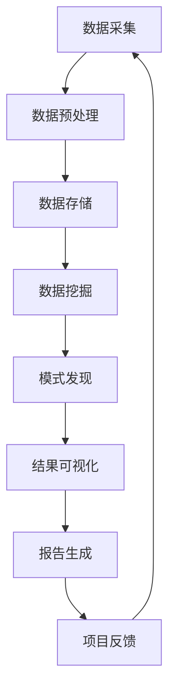

                 

# 数学与社交网络分析：人际关系的数学描述

## 关键词
- 社交网络分析
- 数学描述
- 人际关系
- 图模型
- 聚集性系数
- 最短路径算法
- 数据挖掘

## 摘要
本文旨在探讨数学在社交网络分析中的应用，尤其是人际关系的数学描述。通过介绍社交网络分析的基本理论、核心算法和模型，我们将深入探讨如何使用数学方法来理解人际关系的复杂性和动态性。文章分为三大部分：引言与基础理论，核心算法与模型，以及应用与实践。附录部分提供了社交网络分析的工具与资源，便于读者进一步学习和实践。

## 引言与基础理论

### 第1章：数学与社交网络分析概述

#### 1.1 社交网络分析的重要性

社交网络分析是理解复杂社会系统的重要工具。在现代社会，人们通过各种社交平台和工具建立和维持人际关系，形成了庞大的社交网络。社交网络分析可以帮助我们理解这些网络的结构特性，发现潜在的社区结构，预测个体的行为和传播信息等。

#### 1.2 社交网络的基本概念

社交网络是由节点（代表个体）和边（代表关系）构成的图结构。基本的图概念包括顶点、边、度、连通性、路径和循环等。

#### 1.3 数学在社交网络分析中的应用

数学在社交网络分析中扮演着核心角色。从图论到概率论，再到统计学和线性代数，各种数学工具被用来描述和分析社交网络的属性和动态。

### 第2章：社交网络的数学描述

#### 2.1 社交网络图的表示

社交网络图可以用多种方式表示，包括邻接矩阵、邻接表和图形表示等。每种表示方法都有其优缺点，适用于不同的分析任务。

#### 2.2 社交网络的基本度量

社交网络的度量包括度、介数、集聚系数等。这些度量帮助我们理解网络的结构特性，如个体的重要性、信息传播的效率等。

#### 2.3 社交网络的聚集性度量

聚集性系数是衡量网络中节点之间紧密程度的一个重要指标。通过聚集性系数，我们可以发现网络中的社区结构。

### 第3章：人际关系的数学描述

#### 3.1 人际关系的定义与分类

人际关系是指个体之间的社会联系和互动。根据关系的强度、频率和目的，人际关系可以划分为多种类型。

#### 3.2 人际关系网络的建模

人际关系网络可以用图模型来表示。通过图模型，我们可以捕捉人际关系的基本结构和动态演化。

#### 3.3 人际关系网络的动态演化

人际关系网络会随着时间而变化。理解这些变化机制对于预测个体行为和传播模式至关重要。

## 第二部分：核心算法与模型

### 第4章：社交网络分析的基本算法

#### 4.1 社交网络图的遍历算法

遍历算法，如广度优先搜索（BFS）和深度优先搜索（DFS），是分析社交网络图的基础。这些算法可以用于查找路径、计算最短路径等。

#### 4.2 社交网络中的最短路径算法

最短路径算法，如Dijkstra算法和Floyd-Warshall算法，是社交网络分析中常用的算法。这些算法可以用于计算网络中的最短路径。

#### 4.3 社交网络中的聚类算法

聚类算法，如K-means和谱聚类，可以用于发现网络中的社区结构。这些算法对于理解网络的社会特性非常重要。

### 第5章：社交网络分析的关键模型

#### 5.1 社交网络模型简介

社交网络分析中常用的模型包括随机图模型、小世界模型和无标度模型。这些模型可以帮助我们理解社交网络的拓扑结构。

#### 5.2 社交网络中的概率模型

概率模型，如泊松过程和Galton-Watson过程，可以用于模拟社交网络的演化过程。这些模型对于预测网络的行为具有重要意义。

#### 5.3 社交网络中的图模型

图模型，如马尔可夫网络和贝叶斯网络，可以用于建模社交网络中的复杂关系。这些模型可以用于推理和预测网络中的行为。

### 第6章：社交网络分析中的数据挖掘方法

#### 6.1 数据挖掘基本概念

数据挖掘是发现数据中隐藏的有趣模式的过程。在社交网络分析中，数据挖掘用于发现网络中的模式、趋势和关系。

#### 6.2 社交网络中的数据预处理

数据预处理是数据挖掘的重要步骤。在社交网络分析中，数据预处理包括数据清洗、数据整合和特征提取等。

#### 6.3 社交网络中的模式发现

模式发现是数据挖掘的核心任务。在社交网络分析中，模式发现用于发现网络中的社区结构、潜在关系和异常行为。

## 第三部分：应用与实践

### 第7章：社交网络分析的实际应用

#### 7.1 社交网络分析在社交媒体中的应用

社交媒体平台如Facebook、Twitter和Instagram等提供了丰富的社交网络数据。社交网络分析可以帮助我们理解用户行为、发现潜在市场和监测舆论动态。

#### 7.2 社交网络分析在市场营销中的应用

市场营销人员可以利用社交网络分析来识别潜在客户、评估品牌影响力和优化广告投放策略。这些分析可以帮助企业更好地理解其目标受众。

#### 7.3 社交网络分析在社交媒体监控中的应用

社交媒体监控可以帮助企业和组织实时监测网络舆情、发现潜在风险和应对危机。社交网络分析为这一过程提供了强大的工具。

### 第8章：社交网络分析项目的实施

#### 8.1 项目策划与需求分析

在实施社交网络分析项目之前，需要进行详细的策划和需求分析。这一步骤包括确定项目目标、数据需求和资源规划。

#### 8.2 数据采集与处理

数据采集是社交网络分析项目的关键步骤。通过爬虫、API接口和第三方数据源，我们可以获取大量的社交网络数据。数据处理包括数据清洗、整合和预处理，以确保数据的质量和一致性。

#### 8.3 分析模型选择与实现

根据项目需求和分析目标，选择合适的分析模型和算法。模型的实现涉及编程和调试，以确保模型的准确性和效率。

### 第9章：社交网络分析的未来趋势

#### 9.1 社交网络分析的发展方向

社交网络分析正朝着更加智能化、自动化和实时化的方向发展。未来，随着人工智能和大数据技术的进步，社交网络分析将变得更加精确和有效。

#### 9.2 社交网络分析的技术挑战与机遇

社交网络分析面临许多技术挑战，如数据隐私、算法偏见和大规模数据处理等。然而，这些挑战也带来了新的机遇，如个性化推荐、智能监控和自动化决策等。

#### 9.3 社交网络分析的社会影响与伦理问题

社交网络分析对社会产生了深远的影响。在带来便利和效率的同时，也引发了一系列伦理问题，如隐私侵犯、数据滥用和算法歧视等。如何平衡技术进步和社会责任，是未来需要认真思考的问题。

### 附录A：常用社交网络分析工具与资源

#### A.1 社交网络分析软件与库

- **NetworkX**：Python中的社交网络分析库，提供丰富的图算法和可视化工具。
- **Gephi**：开源的社交网络分析软件，支持数据导入、可视化和分析。
- **Graph-tool**：C++库，提供高效的社交网络分析算法。

#### A.2 社交网络分析相关网站与论坛

- **ArXiv**：社交网络分析的学术论文库，提供最新的研究进展。
- **Reddit**：社交网络分析论坛，讨论各种社交网络分析技术和应用。

#### A.3 社交网络分析学术论文与报告

- **《社交网络分析：方法与应用》**：经典的社交网络分析教材，详细介绍各种分析方法和模型。
- **《社交网络科学》**：详细探讨社交网络的结构特性、演化机制和影响。

---

通过以上内容，我们希望读者能够对社交网络分析及其数学基础有更深入的理解。接下来的章节将详细探讨这些概念和方法，帮助读者掌握社交网络分析的精髓。

### 第1章：数学与社交网络分析概述

在现代社会，社交网络无处不在。从Facebook、LinkedIn到微博、微信，人们通过这些平台建立了复杂的社会关系网络。这些社交网络不仅是社会互动的场所，也是信息传播、资源共享和社区形成的载体。社交网络分析（Social Network Analysis，简称SNA）正是为了解这些网络的特性、结构和动态而发展起来的一门学科。

#### 1.1 社交网络分析的重要性

社交网络分析之所以重要，原因有以下几点：

1. **社会科学研究的重要工具**：社交网络分析可以帮助社会学家、人类学家和政治学家等理解社会结构的演变、群体行为的形成和传播机制的运作。
   
2. **信息传播的关键**：在互联网时代，社交网络是信息传播的主要渠道之一。社交网络分析可以帮助我们理解信息是如何在网络中传播的，这对于市场营销、舆论监控和危机管理具有重要意义。

3. **人际关系的理解**：通过分析社交网络，我们可以深入了解个体之间的关系模式、网络中的关键节点和核心群体，从而更好地理解人际关系和社会结构。

4. **商业决策的支持**：在商业领域，社交网络分析可以用于市场细分、客户行为分析、品牌影响力评估等，帮助企业做出更明智的决策。

#### 1.2 社交网络的基本概念

社交网络是由节点和边组成的图结构，其中节点代表个体（如人、公司、城市等），边代表个体之间的关系（如朋友、同事、合作关系等）。以下是一些基本的图概念：

- **顶点（Vertex）**：社交网络中的节点，代表个体或实体。
- **边（Edge）**：社交网络中的连线，表示两个节点之间存在某种关系。
- **度（Degree）**：一个节点的度是指与该节点直接相连的边的数量。度分为入度（节点接收到的边数）和出度（节点发出的边数）。
- **连通性（Connectivity）**：社交网络中的任意两个节点之间是否存在路径，表示网络的连通性。
- **路径（Path）**：节点之间的序列，表示从一个节点到达另一个节点的路径。
- **循环（Cycle）**：一个封闭的路径，表示从某个节点出发，经过一系列节点，最终回到起始节点的路径。

#### 1.3 数学在社交网络分析中的应用

数学在社交网络分析中扮演着至关重要的角色。以下是一些数学工具在社交网络分析中的应用：

- **图论**：图论是研究图的性质和结构的数学分支。在社交网络分析中，图论提供了描述和分析社交网络结构的基本工具，如图的度分布、连通性、路径长度等。

- **概率论**：概率论用于描述节点之间关系的概率分布，如节点的连接概率、信息传播的概率等。

- **统计学**：统计学方法用于分析社交网络中的数据，包括数据的描述性统计、假设检验、回归分析等。

- **线性代数**：线性代数提供了处理大规模数据的工具，如矩阵运算、特征分解等，这些方法在社交网络分析中用于数据预处理和模型构建。

- **计算几何**：计算几何用于社交网络的可视化和空间分析，如节点布局、网络空间分布等。

#### 1.4 社交网络分析的应用领域

社交网络分析广泛应用于多个领域：

- **社会科学**：社会学、人类学、政治学等学科利用社交网络分析来研究社会结构、群体行为和传播机制。

- **信息技术**：在互联网和大数据时代，社交网络分析被用于搜索引擎优化、推荐系统、数据挖掘等。

- **市场营销**：市场营销人员利用社交网络分析来了解客户需求、评估品牌影响力、优化营销策略。

- **生物信息学**：生物信息学家利用社交网络分析来研究生物网络的拓扑结构、功能模块和动态演化。

- **公共安全**：公共安全部门利用社交网络分析来监测网络舆情、预测潜在风险和应对危机。

#### 1.5 本书的组织结构

本书分为三个部分：

- **第一部分：引言与基础理论**：介绍社交网络分析的基本概念、数学描述和理论框架。

- **第二部分：核心算法与模型**：详细讨论社交网络分析中的基本算法、关键模型和数据挖掘方法。

- **第三部分：应用与实践**：探讨社交网络分析在实际应用中的具体案例和项目实施。

通过本书，读者可以系统地了解社交网络分析的理论基础和实践方法，掌握从理论到应用的完整知识体系。

### 第2章：社交网络的数学描述

社交网络作为一种特殊的图结构，其数学描述是理解和分析社交网络的关键。在本章中，我们将深入探讨社交网络图的表示方法、基本度量以及聚集性度量，从而为后续章节的算法和模型分析打下坚实的基础。

#### 2.1 社交网络图的表示

社交网络图可以采用多种方式表示，每种方式都有其特定的优势和适用场景。以下是几种常见的图表示方法：

1. **邻接矩阵（Adjacency Matrix）**

邻接矩阵是一个二维数组，其中第 \(i\) 行第 \(j\) 列的元素表示节点 \(i\) 与节点 \(j\) 之间是否存在边。如果存在边，则对应的元素值为1，否则为0。邻接矩阵的优点是计算简单，适合处理稀疏图，但存储空间较大。

\[ A_{ij} = 
\begin{cases} 
1 & \text{如果 } (i, j) \in E \\
0 & \text{否则}
\end{cases} \]

2. **邻接表（Adjacency List）**

邻接表是由一系列列表组成的数组，每个列表对应一个节点，列表中的元素是该节点的邻接节点。邻接表比邻接矩阵存储空间小，适合处理稠密图，但遍历邻接节点时需要额外的查找时间。

\[ A_i = \{j | (i, j) \in E\} \]

3. **图形表示（Graphical Representation）**

图形表示是通过图形直观展示节点和边的关系。图形表示直观易懂，适合人类视觉分析，但在处理大规模图时，可能会因复杂度增加而难以直观展示。

#### 2.2 社交网络的基本度量

社交网络的基本度量用于量化网络结构和节点特性。以下是几种重要的基本度量：

1. **度（Degree）**

度是指与一个节点直接相连的边的数量。在无向图中，度分为入度和出度；在有向图中，度分为入度和出度。

- **入度（In-degree）**：一个节点的入度是指指向该节点的边的数量。
- **出度（Out-degree）**：一个节点的出度是指从该节点指向其他节点的边的数量。

\[ \text{In-degree}(v) = \sum_{u \in N} \text{Edge}(u, v) \]
\[ \text{Out-degree}(v) = \sum_{w \in N} \text{Edge}(v, w) \]

2. **介数（Closeness Centrality）**

介数是指一个节点到达其他所有节点的平均最短路径长度。介数越高，表示该节点在网络中的中心性越强。

\[ \text{Closeness}(v) = \frac{\sum_{u \in N} \text{ shortest path length}(v, u)}{n-1} \]

3. **聚集系数（Clustering Coefficient）**

聚集系数用于衡量一个节点或网络的紧密程度，表示一个节点或网络中邻居节点之间相互连接的概率。聚集系数越高，表示网络中节点之间的联系越紧密。

\[ \text{Clustering Coefficient}(v) = \frac{\sum_{u \in N(v)} \sum_{w \in N(v)} \mathbb{1}\{ (u, w) \in E \}}{ \binom{|N(v)|}{2}} \]

其中，\( N(v) \) 表示节点 \(v\) 的邻居节点集合，\(\mathbb{1}\{ \cdot \}\) 是指示函数，当条件为真时取值为1，否则为0。

4. **中间中心性（Betweenness Centrality）**

中间中心性是指一个节点在所有最短路径中的中介程度。中间中心性越高，表示该节点在网络中的桥梁作用越强。

\[ \text{Betweenness}(v) = \sum_{s \neq v} \sum_{t \neq v, t \neq s} \frac{\text{ number of shortest paths from s to t passing through v}}{\text{number of shortest paths from s to t}} \]

#### 2.3 社交网络的聚集性度量

聚集性度量用于评估网络中的社区结构和节点之间的紧密程度。以下是几种常见的聚集性度量方法：

1. **平均聚集系数（Average Clustering Coefficient）**

平均聚集系数是整个网络中所有节点的聚集系数的平均值，用于衡量网络的总体紧密程度。

\[ \text{Average Clustering Coefficient} = \frac{1}{n} \sum_{v \in N} \text{Clustering Coefficient}(v) \]

2. **社区检测算法**

社区检测算法用于发现网络中的社区结构。常见的社区检测算法包括K-means、标签传播、谱聚类等。

- **K-means算法**：基于距离聚类，将网络中的节点划分为 \(k\) 个簇。
- **标签传播算法**：通过迭代更新节点所属的社区标签，实现社区结构的划分。
- **谱聚类算法**：利用图的拉普拉斯矩阵进行聚类，可以处理大规模图和复杂数据。

3. **局部聚类系数（Local Clustering Coefficient）**

局部聚类系数用于衡量一个节点的邻居节点之间的紧密程度。

\[ \text{Local Clustering Coefficient}(v) = \frac{2 \times \text{number of triangles}}{\text{number of possible triangles}} \]

其中，三角形是指三个节点之间都存在边的结构。

通过上述数学描述，我们可以更深入地理解社交网络的性质和行为。接下来的章节将详细介绍社交网络分析中的核心算法和模型，进一步探索人际关系的数学描述及其应用。

#### 2.1 社交网络图的表示

社交网络图的表示是理解和分析社交网络结构的基础。常见的图表示方法包括邻接矩阵、邻接表和图形表示。

1. **邻接矩阵（Adjacency Matrix）**

邻接矩阵是一个 \(n \times n\) 的二维数组，其中 \(n\) 是图中节点的数量。矩阵的第 \(i\) 行第 \(j\) 列元素 \(A_{ij}\) 表示节点 \(i\) 与节点 \(j\) 之间是否存在边。如果存在边，则 \(A_{ij} = 1\)，否则 \(A_{ij} = 0\)。

邻接矩阵的优点是计算简单，适合处理稀疏图。缺点是存储空间较大，特别是在节点数量较多时。

2. **邻接表（Adjacency List）**

邻接表是一种基于数组的数据结构，每个数组元素对应一个节点，数组中的元素为该节点的邻接节点列表。邻接表的存储空间相对较小，适合处理稠密图。但遍历邻接节点时需要额外的查找时间。

邻接表可以表示为：

\[ A = \{ (v_i, N(v_i)) | i = 1, 2, \ldots, n \} \]

其中，\(N(v_i)\) 表示节点 \(v_i\) 的邻接节点集合。

3. **图形表示（Graphical Representation）**

图形表示是通过图形直观展示节点和边的关系。图形表示直观易懂，适合人类视觉分析。但处理大规模图时，图形可能变得复杂难以直观展示。

图形表示可以采用以下符号：

- **节点**：圆形、方形或其他形状，标注节点编号或名称。
- **边**：线段或曲线，连接相应的节点。

#### 2.2 社交网络的基本度量

社交网络的基本度量用于量化网络结构和节点特性。以下介绍几种重要的基本度量：

1. **度（Degree）**

度是指与一个节点直接相连的边的数量。在无向图中，度分为入度和出度；在有向图中，度分为入度和出度。

- **入度（In-degree）**：一个节点的入度是指指向该节点的边的数量。
- **出度（Out-degree）**：一个节点的出度是指从该节点指向其他节点的边的数量。

对于无向图，度定义为：

\[ \text{Degree}(v) = \text{In-degree}(v) + \text{Out-degree}(v) \]

对于有向图，度定义为：

\[ \text{Degree}(v) = \text{In-degree}(v) + \text{Out-degree}(v) \]

2. **介数（Closeness Centrality）**

介数是指一个节点到达其他所有节点的平均最短路径长度。介数越高，表示该节点在网络中的中心性越强。

\[ \text{Closeness}(v) = \frac{\sum_{u \in N} \text{shortest path length}(v, u)}{n-1} \]

其中，\(N\) 是除节点 \(v\) 外的所有节点集合，\(\text{shortest path length}(v, u)\) 是从节点 \(v\) 到节点 \(u\) 的最短路径长度。

3. **聚集系数（Clustering Coefficient）**

聚集系数用于衡量一个节点或网络的紧密程度，表示一个节点或网络中邻居节点之间相互连接的概率。聚集系数越高，表示网络中节点之间的联系越紧密。

\[ \text{Clustering Coefficient}(v) = \frac{\sum_{u \in N(v)} \sum_{w \in N(v)} \mathbb{1}\{ (u, w) \in E \}}{ \binom{|N(v)|}{2}} \]

其中，\(N(v)\) 是节点 \(v\) 的邻居节点集合，\(\mathbb{1}\{ \cdot \}\) 是指示函数，当条件为真时取值为1，否则为0。

4. **中间中心性（Betweenness Centrality）**

中间中心性是指一个节点在所有最短路径中的中介程度。中间中心性越高，表示该节点在网络中的桥梁作用越强。

\[ \text{Betweenness}(v) = \sum_{s \neq v} \sum_{t \neq v, t \neq s} \frac{\text{number of shortest paths from s to t passing through v}}{\text{number of shortest paths from s to t}} \]

#### 2.3 社交网络的聚集性度量

聚集性度量用于评估网络中的社区结构和节点之间的紧密程度。以下介绍几种常见的聚集性度量方法：

1. **平均聚集系数（Average Clustering Coefficient）**

平均聚集系数是整个网络中所有节点的聚集系数的平均值，用于衡量网络的总体紧密程度。

\[ \text{Average Clustering Coefficient} = \frac{1}{n} \sum_{v \in N} \text{Clustering Coefficient}(v) \]

其中，\(N\) 是网络中的节点集合，\(n\) 是节点数量。

2. **社区检测算法**

社区检测算法用于发现网络中的社区结构。常见的社区检测算法包括K-means、标签传播、谱聚类等。

- **K-means算法**：基于距离聚类，将网络中的节点划分为 \(k\) 个簇。
- **标签传播算法**：通过迭代更新节点所属的社区标签，实现社区结构的划分。
- **谱聚类算法**：利用图的拉普拉斯矩阵进行聚类，可以处理大规模图和复杂数据。

3. **局部聚类系数（Local Clustering Coefficient）**

局部聚类系数用于衡量一个节点的邻居节点之间的紧密程度。

\[ \text{Local Clustering Coefficient}(v) = \frac{2 \times \text{number of triangles}}{\text{number of possible triangles}} \]

其中，三角形是指三个节点之间都存在边的结构。

通过上述数学描述，我们可以更深入地理解社交网络的性质和行为。接下来的章节将详细介绍社交网络分析中的核心算法和模型，进一步探索人际关系的数学描述及其应用。

### 3.1 人际关系的定义与分类

人际关系是指个体之间通过相互联系和互动所形成的社交结构。它不仅涵盖了家庭、朋友、同事等直接的社会联系，还包括各种形式的社会互动，如商业伙伴、兴趣小组和社交网络上的在线互动。人际关系是社会学、心理学和人类学等学科研究的核心领域之一，对于理解社会行为、传播机制和社会结构的形成具有重要意义。

#### 3.1.1 人际关系的定义

人际关系的定义多种多样，但通常可以概括为以下几点：

1. **社会互动**：人际关系是建立在个体之间的社会互动之上，这种互动可以是面对面的交流，也可以是通过电话、电子邮件、社交媒体等非面对面方式进行的。

2. **情感联系**：人际关系通常伴随着一定的情感联系，这种联系可以是亲情的、友情的或爱情的。

3. **行为互动**：人际关系中的互动不仅仅停留在情感层面，还包括实际行动，如合作、竞争、支持等。

4. **信任与依赖**：在人际关系中，信任和依赖是维持关系的基石。信任是指个体对他人行为和意图的正面预期，而依赖则是指个体对他人支持的需求。

#### 3.1.2 人际关系的分类

人际关系可以根据不同的标准进行分类，常见的分类方法包括以下几种：

1. **按关系强度分类**

   - **强关系**：强关系通常指紧密的社会联系，如家庭成员、亲密朋友等。这些关系中的个体相互依赖，具有较高的信任和情感投入。
   
   - **弱关系**：弱关系则是指较为松散的社会联系，如一般的朋友、同事等。这些关系中的个体互动较少，信任和情感投入相对较低。

2. **按关系类型分类**

   - **亲属关系**：基于血缘关系的联系，如父母、兄弟姐妹等。
   
   - **友谊关系**：基于个人兴趣、价值观等形成的非血缘关系，如朋友、同事等。
   
   - **商业关系**：基于商业目的和利益形成的联系，如合作伙伴、客户等。

3. **按关系功能分类**

   - **支持关系**：提供情感、物质或精神支持的关系，如朋友、心理医生等。
   
   - **竞争关系**：基于竞争和对抗的关系，如竞争对手、体育对手等。
   
   - **合作关系**：基于共同目标和利益的关系，如团队成员、合作伙伴等。

4. **按关系建立方式分类**

   - **直接建立**：个体通过面对面交流、互动等直接方式建立关系。
   
   - **间接建立**：个体通过第三方介绍、社交媒体等间接方式建立关系。

#### 3.1.3 人际关系的特点

人际关系具有以下几个主要特点：

1. **动态性**：人际关系是不断变化的，受到个体行为、环境因素和关系互动的影响。

2. **多样性**：人际关系具有多样性，不同的关系类型、强度和功能构成了复杂的社会网络。

3. **多层次性**：人际关系不仅包括直接的个体互动，还涉及到群体、社区和组织等更高层次的社会结构。

4. **依赖性**：人际关系中的个体相互依赖，关系的好坏直接影响个体的行为和福祉。

#### 3.1.4 人际关系的重要性

人际关系在社会生活中的重要性体现在以下几个方面：

1. **社会支持**：人际关系为个体提供情感支持、物质帮助和社会资源，有助于个体应对生活挑战和压力。

2. **社会认同**：人际关系使个体获得社会认同和归属感，对个体的心理健康和社会融入具有重要意义。

3. **社会整合**：人际关系有助于社会整合，促进社会秩序和社会和谐。

4. **信息传播**：人际关系是信息传播的重要渠道，影响个体的知识和观念。

5. **经济发展**：在商业领域，人际关系有助于建立商业网络，促进经济发展。

通过对人际关系的定义、分类和特点的探讨，我们可以更好地理解人际关系在社交网络中的地位和作用。接下来的章节将介绍人际关系网络的建模方法，进一步探索如何通过数学方法描述和解析人际关系网络。

### 3.2 人际关系网络的建模

人际关系网络是一种复杂的社会网络，它反映了个体之间的社会联系和互动。为了更深入地理解和分析这种网络，我们需要建立数学模型来描述和模拟它。以下是几种常见的人际关系网络建模方法：

#### 3.2.1 图模型

图模型是最基本的人际关系网络建模方法，它通过节点和边来表示个体及其关系。图模型可以分为无向图和有向图。

1. **无向图**

无向图表示个体之间的双向关系，如朋友关系。在这种模型中，节点代表个体，边表示个体之间的直接联系。图模型可以用邻接矩阵或邻接表来表示。

\[ A_{ij} = 
\begin{cases} 
1 & \text{如果个体 } i \text{ 和个体 } j \text{ 之间存在关系} \\
0 & \text{否则}
\end{cases} \]

2. **有向图**

有向图表示个体之间的单向关系，如信任关系或领导关系。在这种模型中，边具有方向，箭头指向关系的发起者。有向图的邻接矩阵和邻接表表示方法与无向图类似，但需要考虑边的方向。

\[ A_{ij} = 
\begin{cases} 
1 & \text{如果个体 } i \text{ 与个体 } j \text{ 之间存在单向关系} \\
0 & \text{否则}
\end{cases} \]

#### 3.2.2 社会网络分析模型

社会网络分析（Social Network Analysis，SNA）模型是一类专门用于分析社交网络结构和动态的数学模型。以下是一些常见的社会网络分析模型：

1. **小世界模型**

小世界模型（Small-world Model）描述了一个网络在保持较高聚集系数的同时，具有较短的平均路径长度。这种模型通过在无向图中添加少量的随机边来实现，使得网络在局部保持紧密联系，在全局上具有高效的通信能力。

\[ \text{平均路径长度} \approx \ln(n) \]

其中，\(n\) 是网络中的节点数量。

2. **无标度模型**

无标度模型（Scale-free Model）描述了一种网络节点度分布遵循幂律分布的现象。在这种模型中，大多数节点度数较低，但存在少数节点度数极高，形成所谓的“hub”节点。

\[ P(k) \propto k^{-\gamma} \]

其中，\(P(k)\) 是节点度数为 \(k\) 的概率，\(\gamma\) 是幂律指数。

3. **BA模型**

BA模型（Barabási-Albert Model）是一种用于生成无标度网络的具体模型。它通过在现有网络中添加新节点，并将新节点与现有节点随机连接 \(m\) 条边来实现。通常，\(m\) 是一个常数，称为“连接数”。

\[ \text{概率} \propto \frac{k_i}{N} \]

其中，\(k_i\) 是节点 \(i\) 的度数，\(N\) 是网络中的节点总数。

#### 3.2.3 概率模型

概率模型用于描述节点之间关系的概率分布，以及节点行为在社交网络中的演化过程。以下是一些常见的概率模型：

1. **泊松过程**

泊松过程（Poisson Process）用于描述节点关系的生成过程，其中新关系的出现遵循泊松分布。泊松过程可以用来生成随机图，模拟社交网络中的关系生成。

\[ P(\text{关系出现}) \propto \lambda t \]

其中，\(\lambda\) 是单位时间内关系出现的平均次数，\(t\) 是时间。

2. **Galton-Watson过程**

Galton-Watson过程是一种用于模拟社交网络演化的概率模型。它通过节点的存活概率和繁殖能力来描述网络的结构动态。

\[ p_i = \left( \sum_{j \in N(i)} p_j \right) q_i \]

其中，\(p_i\) 是节点 \(i\) 的存活概率，\(q_i\) 是节点 \(i\) 的繁殖能力。

3. **马尔可夫模型**

马尔可夫模型（Markov Model）用于描述节点状态的转移概率。在社交网络分析中，马尔可夫模型可以用来模拟个体行为的变化，如加入或退出社交网络。

\[ P(X_t = x_t | X_{t-1} = x_{t-1}) = P(X_t = x_t | X_{t-1} = x_{t-1}, X_{t-2} = x_{t-2}, \ldots) \]

其中，\(X_t\) 是在时间 \(t\) 的状态，\(x_t\) 是状态的具体取值。

#### 3.2.4 时间动态模型

时间动态模型用于描述社交网络随时间的变化。这类模型可以捕捉节点关系的形成、维持和断裂等动态过程。

1. **图演进模型**

图演进模型（Graph Evolution Model）通过更新节点和边的关系来描述社交网络的动态演化。这种模型可以基于概率模型或规则模型来构建。

\[ E \to (u, v) \text{ with probability } p(u, v) \]

其中，\(E\) 是当前图中的边集合，\(p(u, v)\) 是添加边 \((u, v)\) 的概率。

2. **事件驱动模型**

事件驱动模型（Event-driven Model）通过事件的发生来驱动社交网络的演化。事件可以是节点加入、节点离开、关系建立或关系断裂等。

\[ X_t = X_{t-1} \cup \{E_t\} \]

其中，\(X_t\) 是在时间 \(t\) 的社交网络，\(E_t\) 是在时间 \(t\) 发生的事件。

通过上述建模方法，我们可以从不同角度理解和分析人际关系网络。这些模型为我们提供了工具，帮助我们揭示社交网络的复杂结构和动态演化，从而更好地理解人际关系在社交网络中的重要作用。

### 3.3 人际关系网络的动态演化

人际关系网络并非静态不变，它随着时间的推移而不断演化。这种动态演化可能受到多种因素的影响，如个体行为、社会环境、技术进步等。理解人际关系网络的动态演化机制对于预测个体行为、发现潜在社区结构和优化社会资源配置具有重要意义。

#### 3.3.1 动态演化模型

1. **BA模型**

BA模型是一种用于生成无标度社交网络的动态演化模型。该模型通过在现有网络中随机添加新节点，并使其与已有节点以一定概率建立连接，从而实现网络的演化。BA模型的基本步骤如下：

- 初始阶段：从空图开始，添加 \(m_0\) 个节点，每个节点与已有的 \(m_0-1\) 个节点建立 \(m_0-1\) 条边。
- 演化阶段：每次迭代添加一个新节点，该节点与网络中已有节点以概率 \(k/N\) 建立连接，其中 \(k\) 是节点的度数，\(N\) 是网络中的节点总数。

\[ p(k) \propto k^{-3} \]

2. **马尔可夫模型**

马尔可夫模型是一种用于描述节点状态转移的概率模型。在社交网络分析中，马尔可夫模型可以用来模拟个体行为的变化，如加入或退出社交网络。假设节点 \(i\) 的状态转移概率仅与其当前状态和其他节点的状态有关，则马尔可夫模型可以用以下矩阵表示：

\[ P = \begin{bmatrix}
P_{ij} & P_{i0} \\
P_{0j} & P_{00}
\end{bmatrix} \]

其中，\(P_{ij}\) 表示节点 \(i\) 在下一时刻处于状态 \(j\) 的概率，\(P_{i0}\) 表示节点 \(i\) 在下一时刻退出社交网络的概率，\(P_{0j}\) 表示节点 \(j\) 在下一时刻加入社交网络的概率，\(P_{00}\) 表示节点 \(i\) 在下一时刻仍然处于社交网络中的概率。

3. **事件驱动模型**

事件驱动模型通过事件的发生来驱动社交网络的演化。事件可以是节点加入、节点离开、关系建立或关系断裂等。事件驱动模型的基本步骤如下：

- 初始化：设定社交网络的初始状态和事件队列。
- 模拟：从事件队列中取出下一个事件，更新社交网络的状态，并添加新的事件。

#### 3.3.2 动态演化机制

1. **个体行为影响**

个体行为是影响人际关系网络动态演化的重要因素。个体可能因为多种原因而加入或退出社交网络，如寻求社交支持、获取信息资源、满足兴趣爱好等。个体行为的变化会导致节点和边的增减，从而影响网络的结构和性质。

2. **社会环境变化**

社会环境的变化，如文化、政策、经济状况等，也会对人际关系网络的动态演化产生影响。例如，经济繁荣可能导致人们更愿意参与社交活动，从而增加社交网络中的节点和边；而政策变化可能导致某些关系断裂，从而减少网络中的边。

3. **技术进步**

技术进步，如互联网、智能手机、社交媒体等，极大地改变了人们的社交方式和行为模式。技术进步不仅提供了更多的社交平台和工具，还影响了个体对社交网络的需求和期望。例如，社交媒体平台的出现使得个体能够更方便地建立和维护人际关系，从而促进了社交网络的扩展和多样化。

#### 3.3.3 动态演化分析

通过动态演化模型，我们可以分析人际关系网络在不同时间点的结构和性质。以下是一些常见的分析方法：

1. **节点活跃度分析**

节点活跃度是指节点在社交网络中的互动频率和参与度。通过分析节点的活跃度，我们可以发现哪些节点在社交网络中具有更高的影响力和社交价值。

2. **社区结构分析**

社区结构分析旨在发现网络中的紧密连接群体。通过聚类分析等方法，我们可以识别出网络中的不同社区，并研究社区之间的互动和依赖关系。

3. **关系强度分析**

关系强度是指节点之间的联系紧密程度。通过计算节点间的路径长度、介数和聚集系数等指标，我们可以评估关系强度，并研究关系强度对网络性质的影响。

4. **演化路径分析**

演化路径分析旨在揭示社交网络随时间的动态演化过程。通过追踪网络中节点和边的变化，我们可以分析网络的演化模式，预测未来的发展趋势。

通过上述方法，我们可以更深入地理解人际关系网络的动态演化机制，从而为社交网络分析提供理论支持和实践指导。

### 第4章：社交网络分析的基本算法

社交网络分析中的算法是实现数据分析、模式识别和预测的重要工具。本章将介绍社交网络分析中常用的几种基本算法，包括图遍历算法、最短路径算法和聚类算法。这些算法对于理解和分析社交网络的结构和动态具有重要意义。

#### 4.1 社交网络图的遍历算法

图遍历算法用于遍历图中的所有节点和边，以实现对图的全面分析。以下是两种常用的图遍历算法：广度优先搜索（BFS）和深度优先搜索（DFS）。

1. **广度优先搜索（BFS）**

广度优先搜索是一种基于广度的图遍历算法，它从起始节点开始，逐层遍历图中的所有节点。BFS的主要步骤如下：

- 初始化：使用队列数据结构存储待访问的节点，使用集合或数组存储已访问的节点。
- 遍历：从队列中取出第一个节点，访问该节点，并将其邻接节点加入队列，同时将这些邻接节点标记为已访问。
- 重复步骤2，直到队列为空。

伪代码如下：

```python
def BFS(graph, start):
    visited = set()
    queue = deque([start])
    while queue:
        node = queue.popleft()
        if node not in visited:
            visited.add(node)
            for neighbor in graph[node]:
                queue.append(neighbor)
    return visited
```

2. **深度优先搜索（DFS）**

深度优先搜索是一种基于深度的图遍历算法，它从起始节点开始，尽可能深入地访问相邻节点，然后再回溯。DFS的主要步骤如下：

- 初始化：使用栈数据结构存储待访问的节点，使用集合或数组存储已访问的节点。
- 遍历：从栈中取出第一个节点，访问该节点，并将其邻接节点加入栈，同时将这些邻接节点标记为已访问。
- 重复步骤2，直到栈为空。

伪代码如下：

```python
def DFS(graph, start):
    visited = set()
    stack = [start]
    while stack:
        node = stack.pop()
        if node not in visited:
            visited.add(node)
            for neighbor in graph[node]:
                stack.append(neighbor)
    return visited
```

#### 4.2 社交网络中的最短路径算法

最短路径算法用于计算图中任意两个节点之间的最短路径。以下是两种常用的最短路径算法：迪杰斯特拉算法（Dijkstra）和弗洛伊德算法（Floyd-Warshall）。

1. **迪杰斯特拉算法（Dijkstra）**

迪杰斯特拉算法是一种用于求解单源最短路径的贪心算法。它通过逐步选择未访问的节点，更新其最短路径估计值。Dijkstra算法的主要步骤如下：

- 初始化：设置源节点 \(s\) 的最短路径估计值为0，其他节点的最短路径估计值为无穷大。使用优先队列存储未访问的节点，按最短路径估计值排序。
- 遍历：从优先队列中取出最小值的节点，将其标记为已访问。更新其邻接节点的最短路径估计值。
- 重复步骤2，直到优先队列为空。

伪代码如下：

```python
def Dijkstra(graph, start):
    distances = {node: float('infinity') for node in graph}
    distances[start] = 0
    priority_queue = PriorityQueue()
    priority_queue.push(start, 0)

    while not priority_queue.is_empty():
        current = priority_queue.pop()
        if current == start:
            continue

        for neighbor, weight in graph[current].items():
            distance = distances[current] + weight
            if distance < distances[neighbor]:
                distances[neighbor] = distance
                priority_queue.push(neighbor, distance)

    return distances
```

2. **弗洛伊德算法（Floyd-Warshall）**

弗洛伊德算法是一种用于求解所有节点对最短路径的动态规划算法。它通过逐步增加路径中的中间节点，计算所有节点之间的最短路径。Floyd-Warshall算法的主要步骤如下：

- 初始化：创建一个二维数组 \(dist\)，其中 \(dist[i][j]\) 表示从节点 \(i\) 到节点 \(j\) 的最短路径长度。
- 遍历：对于所有的中间节点 \(k\)，更新 \(dist[i][j]\) 的值，如果通过中间节点 \(k\) 的路径长度小于当前的最短路径长度。
- 重复步骤2，直到所有的中间节点都遍历完毕。

伪代码如下：

```python
def FloydWarshall(graph):
    dist = [[float('infinity') for _ in range(len(graph))] for _ in range(len(graph))]
    for i in range(len(graph)):
        dist[i][i] = 0

    for i in range(len(graph)):
        for j in range(len(graph)):
            for k in range(len(graph)):
                dist[i][j] = min(dist[i][j], dist[i][k] + dist[k][j])

    return dist
```

#### 4.3 社交网络中的聚类算法

聚类算法用于发现图中的紧密连接群体，即社区结构。以下介绍两种常用的聚类算法：K-means算法和谱聚类算法。

1. **K-means算法**

K-means算法是一种基于距离的聚类算法，它通过将数据点划分为 \(k\) 个簇，使得簇内距离最小，簇间距离最大。K-means算法的主要步骤如下：

- 初始化：随机选择 \(k\) 个初始中心点。
- 分配：将每个数据点分配到最近的中心点所代表的簇。
- 更新：重新计算每个簇的中心点。
- 重复步骤2和步骤3，直到中心点的位置不再发生变化或达到预定的迭代次数。

伪代码如下：

```python
def KMeans(points, k):
    centroids = random.sample(points, k)
    while True:
        clusters = assign_points_to_clusters(points, centroids)
        new_centroids = calculate_new_centroids(clusters)
        if is_converged(centroids, new_centroids):
            break
        centroids = new_centroids
    return centroids
```

2. **谱聚类算法**

谱聚类算法是一种基于图论和线性代数的聚类算法，它通过构建图的特征向量来识别簇。谱聚类算法的主要步骤如下：

- 初始化：计算图中节点的相似性矩阵 \(S\) 和 Laplace 矩阵 \(L\)。
- 特征分解：对 Laplace 矩阵进行特征分解，得到特征向量和特征值。
- 选择簇：根据特征向量的排序，选择前 \(k\) 个特征向量作为簇的代表。
- 分配：将每个节点分配到与其最近的簇代表所在的簇。

伪代码如下：

```python
def SpectralClustering(graph, k):
    similarity_matrix = build_similarity_matrix(graph)
    laplace_matrix = build_laplace_matrix(similarity_matrix)
    eigenvalues, eigenvectors = eigen_decomposition(laplace_matrix)
    top_k_eigenvectors = select_top_k_eigenvectors(eigenvalues, eigenvectors, k)
    clusters = assign_points_to_clusters(graph, top_k_eigenvectors)
    return clusters
```

通过以上介绍，我们可以看到社交网络分析中的基本算法如何应用于图遍历、路径搜索和聚类分析。这些算法为我们提供了强大的工具，使我们能够深入挖掘社交网络中的结构特性，从而为研究社会行为、传播机制和优化社会资源配置提供理论支持。

### 第5章：社交网络分析的关键模型

社交网络分析中的关键模型为我们提供了理解和分析社交网络结构和动态的强大工具。这些模型不仅能够揭示网络中的关键特征，还可以帮助我们预测网络行为和发现潜在社区。本章将介绍几种重要的社交网络分析模型，包括随机图模型、小世界模型和无标度模型。

#### 5.1 社交网络模型简介

社交网络模型是用于描述和模拟社交网络结构的数学模型。它们通过定义节点和边之间的关系概率，帮助我们理解社交网络的特性。以下是一些重要的社交网络模型：

1. **随机图模型**：随机图模型假设节点和边之间是随机生成的，这些模型包括Erdős-Rényi模型和Barabási-Albert模型。
2. **小世界模型**：小世界模型描述了一个网络在保持高聚集系数的同时，具有较短的路径长度。这个模型有助于解释为什么在现实中社交网络具有高效的信息传播能力。
3. **无标度模型**：无标度模型描述了一种网络节点度分布遵循幂律分布的现象，这种模型能够解释社交网络中某些节点拥有极高度数的原因。

#### 5.2 社交网络中的概率模型

概率模型通过定义节点和边之间的关系概率来描述社交网络。以下介绍几种常见的概率模型：

1. **Erdős-Rényi模型**：Erdős-Rényi模型是一个简单的随机图模型，它假设节点和边是独立且等概率生成的。该模型可以用以下概率公式来描述：

\[ P(e_{ij}) = p \]

其中，\(e_{ij}\) 表示节点 \(i\) 和节点 \(j\) 之间是否存在边，\(p\) 是边的生成概率。

2. **Barabási-Albert模型**：Barabási-Albert模型是一种无标度网络模型，它通过在现有网络中添加新节点，并使其与已有节点以概率 \(k\) 建立连接，从而实现网络的演化。该模型可以用以下概率公式来描述：

\[ P(e_{ij}) \propto k_i k_j \]

其中，\(k_i\) 和 \(k_j\) 分别是节点 \(i\) 和节点 \(j\) 的度数。

3. **泊松过程**：泊松过程是一种用于生成社交网络关系的概率模型，它假设新关系的出现遵循泊松分布。该模型可以用以下概率公式来描述：

\[ P(\text{关系出现}) = \lambda t \]

其中，\(\lambda\) 是单位时间内关系出现的平均次数，\(t\) 是时间。

#### 5.3 社交网络中的图模型

图模型是描述社交网络结构的重要工具，以下介绍几种常用的图模型：

1. **图论模型**：图论模型通过定义节点和边之间的关系来描述社交网络。常见的图论模型包括无向图和有向图，这些模型有助于分析网络中的连通性、路径长度和聚集系数等属性。

2. **社会网络分析模型**：社会网络分析模型是基于图论模型，用于描述社交网络中的节点和边之间的复杂关系。常见的模型包括小世界模型和无标度模型，这些模型能够揭示社交网络中的关键特征和动态演化机制。

3. **网络科学模型**：网络科学模型是用于研究复杂网络的数学模型，这些模型可以用于描述社交网络、生物网络和交通网络等。常见的模型包括随机图模型、小世界模型和无标度模型，这些模型能够解释网络中的特性如小世界现象和无标度现象。

#### 5.4 小世界模型

小世界模型描述了一个网络在保持高聚集系数的同时，具有较短的路径长度。这种模型有助于解释社交网络中信息传播效率高的现象。小世界模型的关键特点如下：

1. **高聚集系数**：聚集系数是衡量网络中节点邻居之间联系紧密程度的指标。小世界模型在保持高聚集系数的同时，减少了节点之间的直接连接，从而形成了一种紧密的局部网络结构。
2. **短路径长度**：路径长度是衡量两个节点之间距离的指标。小世界模型通过增加节点之间的间接连接，使得网络中的路径长度显著缩短。

小世界模型可以用以下概率公式来描述：

\[ \text{聚集系数} \approx \frac{1}{n} \sum_{i=1}^{n} \frac{2 \times \text{number of triangles}^i}{\text{number of possible triangles}^i} \]
\[ \text{平均路径长度} \approx \ln(n) \]

其中，\(n\) 是网络中的节点数量。

#### 5.5 无标度模型

无标度模型描述了一种网络节点度分布遵循幂律分布的现象。这种模型能够解释社交网络中某些节点拥有极高度数的原因。无标度模型的关键特点如下：

1. **幂律分布**：在无标度模型中，大多数节点的度数较低，但存在少数节点度数极高，这些节点被称为“hub”节点。度分布可以用以下概率公式来描述：

\[ P(k) \propto k^{-\gamma} \]

其中，\(P(k)\) 是节点度数为 \(k\) 的概率，\(\gamma\) 是幂律指数。

2. **自相似性**：无标度模型具有自相似性，即网络中的局部结构具有与整体网络相似的特征。这种自相似性使得无标度模型在描述复杂网络时具有很好的适应性。

无标度模型可以用以下概率公式来描述：

\[ P(e_{ij}) \propto k_i k_j \]

其中，\(k_i\) 和 \(k_j\) 分别是节点 \(i\) 和节点 \(j\) 的度数。

#### 5.6 BA模型

BA模型是一种用于生成无标度网络的具体模型，它通过在现有网络中添加新节点，并使其与已有节点以一定概率建立连接，从而实现网络的演化。BA模型的关键特点如下：

1. **连接概率**：BA模型中的连接概率与节点的度数成正比，即度数越高的节点连接概率越大。
2. **度分布**：BA模型生成的网络具有无标度特性，即度数分布服从幂律分布。

BA模型的生成步骤如下：

1. 初始化：从空图开始，添加 \(m_0\) 个节点，每个节点与已有的 \(m_0-1\) 个节点建立 \(m_0-1\) 条边。
2. 演化：每次迭代添加一个新节点，该节点与网络中已有节点以概率 \(k/N\) 建立连接，其中 \(k\) 是节点的度数，\(N\) 是网络中的节点总数。

\[ p(k) \propto k^{-3} \]

通过以上介绍，我们可以看到社交网络分析中的关键模型如何帮助我们理解和分析社交网络的特性。这些模型不仅为研究社交网络提供了理论支持，还可以应用于实际应用中，如社交媒体分析、市场研究和社会治理等。

### 第6章：社交网络分析中的数据挖掘方法

在社交网络分析中，数据挖掘是发现数据中隐藏的有趣模式、趋势和知识的关键步骤。数据挖掘不仅有助于我们理解社交网络的内在结构，还可以为市场营销、舆论监控、社会管理等提供有力支持。本章将介绍社交网络分析中的数据挖掘方法，包括数据预处理、模式发现和案例分析。

#### 6.1 数据挖掘基本概念

数据挖掘（Data Mining）是指从大量数据中通过统计学、机器学习、人工智能等技术发现有价值的信息和知识的过程。在社交网络分析中，数据挖掘的目标包括：

- **发现社区结构**：识别网络中的紧密连接群体，帮助理解社交网络的内部结构。
- **预测个体行为**：基于历史数据和现有网络结构，预测个体未来的行为，如加入某个社区或传播信息。
- **发现趋势和异常**：识别网络中的趋势、热点话题和异常行为，帮助监测网络舆情和预测潜在危机。

数据挖掘的基本流程包括：

1. **数据收集**：从各种来源获取社交网络数据，如社交媒体平台、在线论坛、日志文件等。
2. **数据预处理**：清洗和整合数据，消除噪声和异常，提取有用的特征。
3. **模式发现**：使用各种算法和技术，从预处理后的数据中提取潜在的模式和知识。
4. **评估与验证**：评估数据挖掘结果的准确性和实用性，并进行必要的调整和优化。

#### 6.2 社交网络中的数据预处理

数据预处理是数据挖掘过程中至关重要的一步，它直接影响数据挖掘算法的效果。在社交网络分析中，数据预处理包括以下任务：

1. **数据清洗**：去除重复数据、处理缺失值和异常值，确保数据的一致性和质量。
2. **数据整合**：将来自不同来源的数据进行整合，消除数据源之间的不一致性，如统一时间格式、数据类型等。
3. **特征提取**：从原始数据中提取有助于分析的特征，如节点的度数、介数、聚类系数等。
4. **数据转换**：将数据转换为适合挖掘算法的格式，如将图数据转换为矩阵表示。

#### 6.3 社交网络中的模式发现

模式发现是数据挖掘的核心任务，它旨在从社交网络数据中发现有趣的模式和知识。以下介绍几种常用的模式发现方法：

1. **聚类分析**：聚类分析用于识别网络中的社区结构。常见的聚类算法包括K-means、谱聚类和基于密度的聚类算法等。聚类分析可以帮助我们理解社交网络中的紧密连接群体，从而更好地理解网络结构。
2. **关联规则挖掘**：关联规则挖掘用于发现数据中的隐含关联关系。在社交网络分析中，我们可以使用关联规则挖掘来发现节点之间的关联，如哪些节点经常同时出现在同一个社区中。
3. **异常检测**：异常检测用于识别网络中的异常行为和异常节点。异常节点可能是网络中的恶意用户或异常活动，及时发现和处理这些异常对于维护网络安全和稳定至关重要。
4. **路径分析**：路径分析用于研究节点之间的连接路径，如最短路径、最频繁路径等。路径分析可以帮助我们理解信息传播的路径和效率，从而优化信息传播策略。

#### 6.4 数据挖掘在社交网络分析中的应用

数据挖掘在社交网络分析中有着广泛的应用，以下是一些典型的应用案例：

1. **社交媒体分析**：通过数据挖掘，我们可以分析社交媒体平台上的用户行为、兴趣爱好、互动模式等，从而发现潜在的市场机会和用户需求。
2. **市场营销**：数据挖掘可以帮助市场营销人员识别目标客户、优化广告投放策略、评估品牌影响力等。
3. **社会网络监控**：通过数据挖掘，我们可以实时监测网络舆情、识别热点话题、预测潜在危机，从而为公共安全和社会治理提供支持。
4. **人力资源**：在人力资源管理中，数据挖掘可以帮助企业识别高潜力员工、优化团队结构、预测员工流动等。

#### 6.5 数据挖掘案例分析

以下是一个数据挖掘案例，展示如何利用数据挖掘技术分析社交网络中的社区结构。

**案例背景**：假设我们有一个包含用户和用户之间互动数据的社交网络，我们需要识别出网络中的社区结构。

**步骤一：数据预处理**  
- 数据清洗：去除重复用户和异常互动记录。  
- 数据整合：将不同时间格式的互动数据统一格式。  
- 特征提取：计算每个用户的度数、介数、聚集系数等特征。

**步骤二：模式发现**  
- 使用K-means聚类算法，将用户分为若干个簇，每个簇代表一个社区。  
- 根据每个簇内用户的互动频率和特征相似度，对簇进行标注和命名。

**步骤三：评估与验证**  
- 使用簇内连接度和簇间分离度等指标评估聚类结果的质量。  
- 对聚类结果进行可视化，以便进一步分析社区结构和成员关系。

通过上述步骤，我们成功地识别出社交网络中的社区结构，并进一步分析了社区成员的行为特征和互动模式。

通过本章的介绍，我们可以看到数据挖掘在社交网络分析中的重要性及其应用场景。数据挖掘技术不仅帮助我们揭示了社交网络的内在结构，还为实际应用提供了有力支持。在接下来的章节中，我们将继续探讨社交网络分析的实际应用和项目实施。

### 第7章：社交网络分析的实际应用

社交网络分析在现代社会中的应用广泛且深入，涵盖了从商业决策、市场营销到社会监控等众多领域。本章将详细探讨社交网络分析在实际应用中的几个典型场景，包括社交媒体分析、市场营销和社会监控。

#### 7.1 社交网络分析在社交媒体中的应用

社交媒体平台如Facebook、Twitter、微博和Instagram等已经成为人们日常生活的重要组成部分。这些平台不仅提供了丰富的社交功能，还积累了大量的用户行为数据，为社交网络分析提供了宝贵的资源。以下是一些社交媒体分析的应用：

1. **用户行为分析**：通过分析用户在社交媒体上的互动行为，如发帖、评论、点赞和分享等，可以了解用户的兴趣偏好、活跃时间和互动模式。这些信息有助于平台优化用户体验和功能设计。

2. **社交网络监测**：社交媒体分析可以帮助监测网络舆情，及时发现和应对潜在危机。例如，通过分析热点话题和负面评论，企业可以迅速识别消费者对产品或服务的反馈，并采取相应措施。

3. **广告效果评估**：社交媒体分析可以评估广告投放的效果，包括广告的覆盖范围、点击率和转化率等。通过这些数据，营销人员可以优化广告策略，提高广告投放的ROI。

4. **社区结构分析**：社交媒体平台中的用户往往形成不同的社区，通过社交网络分析可以识别出这些社区，并分析社区成员之间的互动关系。这有助于企业更好地理解目标用户群体，制定有针对性的营销策略。

#### 7.2 社交网络分析在市场营销中的应用

在市场营销领域，社交网络分析为企业的市场研究和营销策略提供了强有力的支持。以下是一些具体的应用：

1. **市场细分**：通过分析用户在社交媒体上的行为数据和特征，可以识别出不同类型的用户群体。这些群体可以是基于年龄、性别、地理位置、兴趣等因素划分的，从而为企业制定个性化的营销策略提供依据。

2. **品牌影响力评估**：社交网络分析可以评估品牌的知名度和用户对品牌的认可度。通过分析用户在社交媒体上对品牌提及的数量、频率和情感倾向，企业可以评估品牌的市场影响力，并制定相应的提升策略。

3. **竞争分析**：通过分析竞争对手在社交媒体上的表现，包括粉丝数量、互动率和广告投放策略等，企业可以了解竞争对手的优势和劣势，从而制定更有竞争力的营销策略。

4. **客户关系管理**：社交网络分析可以帮助企业更好地理解客户需求和行为，建立和维护良好的客户关系。例如，通过分析客户在社交媒体上的评论和反馈，企业可以及时回应客户问题，提高客户满意度。

#### 7.3 社交网络分析在社交媒体监控中的应用

社交媒体监控是公共安全和社会治理的重要手段。通过社交网络分析，可以实时监测网络舆情，识别潜在的社会风险。以下是一些具体应用：

1. **网络舆情监测**：通过分析社交媒体上的热点话题和负面评论，可以及时了解公众对某个事件或政策的看法，从而为政府决策提供参考。

2. **危机管理**：在危机事件发生时，社交媒体分析可以帮助组织迅速识别和应对潜在危机。例如，通过分析社交媒体上的负面评论和用户反馈，组织可以及时发现危机苗头，采取有效的应对措施。

3. **犯罪侦查**：社交网络分析可以用于犯罪侦查，通过分析犯罪嫌疑人在社交媒体上的活动轨迹和互动关系，可以帮助警方锁定嫌疑人，提高侦查效率。

4. **社会稳定性评估**：通过分析社交媒体上的用户行为和言论，可以评估社会的稳定性和公共安全形势。这有助于政府和社会组织采取预防措施，维护社会和谐稳定。

通过以上实际应用案例，我们可以看到社交网络分析在多个领域的重要作用。它不仅帮助我们更好地理解社交网络的结构和动态，还为市场营销、社会治理和公共安全提供了有力支持。在接下来的章节中，我们将进一步探讨如何实施社交网络分析项目，包括项目策划、数据采集和处理、分析模型的选择与实现。

### 第8章：社交网络分析项目的实施

实施社交网络分析项目是一个复杂且系统的过程，它涉及多个阶段，包括项目策划、数据采集与处理、分析模型的选择与实现。以下是详细的步骤和方法，帮助读者理解如何有效实施社交网络分析项目。

#### 8.1 项目策划与需求分析

在开始社交网络分析项目之前，进行详细的策划和需求分析是非常重要的。这一阶段主要包括以下几个方面：

1. **明确项目目标**：明确项目旨在解决什么问题或实现什么目标。例如，识别关键用户群体、评估品牌影响力、预测用户行为等。

2. **确定分析范围**：确定需要分析的社交网络范围，包括平台类型、数据来源和样本规模等。例如，是否只分析一个社交媒体平台，还是多个平台的综合分析。

3. **需求分析**：与相关利益相关者（如市场营销团队、管理层等）沟通，了解他们的需求，包括需要分析的具体指标、预期的分析结果和报告形式等。

4. **制定项目计划**：根据项目目标和需求，制定详细的项目计划，包括时间表、资源分配、人员分工等。确保项目在合理的时间和预算内完成。

#### 8.2 数据采集与处理

数据采集是社交网络分析项目的核心步骤，直接影响到分析结果的准确性和有效性。以下是一些关键步骤和方法：

1. **数据源选择**：根据项目需求，选择合适的数据源。常见的数据源包括社交媒体API、公开数据集、第三方数据提供商等。

2. **数据采集方法**：使用爬虫、API接口、手动数据收集等方法获取数据。在选择数据采集方法时，要考虑数据质量、采集效率和成本等因素。

3. **数据清洗**：对采集到的原始数据进行清洗，包括去除重复数据、处理缺失值和异常值等。数据清洗是确保数据质量的重要步骤，直接影响后续分析的结果。

4. **数据整合**：将来自不同数据源的数据进行整合，消除数据之间的不一致性，如统一时间格式、数据类型等。数据整合有助于构建统一的分析数据集。

5. **特征提取**：从原始数据中提取有助于分析的特征，如用户的度数、介数、聚类系数、活跃度等。特征提取是构建分析模型的基础。

6. **数据存储**：将处理后的数据存储到数据库或数据仓库中，以便后续的分析和处理。常见的数据存储解决方案包括关系数据库、NoSQL数据库和大数据存储系统等。

#### 8.3 分析模型选择与实现

分析模型的选择与实现是社交网络分析项目的关键步骤，决定了分析结果的准确性和效率。以下是一些常用的分析模型和方法：

1. **聚类分析**：用于发现社交网络中的紧密连接群体（社区结构）。常用的聚类算法包括K-means、谱聚类和基于密度的聚类算法等。

2. **路径分析**：用于研究节点之间的连接路径。常用的算法包括最短路径算法、最频繁路径算法等。

3. **关系网络分析**：用于分析节点之间的关系和影响力。常用的算法包括度数中心性、介数中心性、聚集系数等。

4. **机器学习模型**：用于预测用户行为、发现潜在趋势和模式。常见的机器学习算法包括线性回归、逻辑回归、决策树、随机森林、支持向量机等。

5. **数据分析与可视化**：使用数据分析工具（如Python的Pandas、Matplotlib库）和可视化工具（如D3.js、Gephi）对分析结果进行展示和解释。可视化有助于直观地理解分析结果和发现潜在的问题。

#### 8.4 项目实施示例

以下是一个简单的社交网络分析项目实施示例，包括开发环境搭建、源代码实现和代码解读。

**开发环境搭建**：
- Python 3.8及以上版本
- 社交网络分析库（如NetworkX）
- 数据可视化库（如Matplotlib）
- 数据处理库（如Pandas）

**源代码实现**：

```python
import networkx as nx
import matplotlib.pyplot as plt
import pandas as pd

# 构建一个简单的社交网络图
G = nx.Graph()

# 添加节点和边
G.add_nodes_from([1, 2, 3, 4, 5])
G.add_edges_from([(1, 2), (1, 3), (2, 4), (3, 4), (4, 5)])

# 绘制网络图
nx.draw(G, with_labels=True)
plt.show()

# 计算并打印基本度量
print("节点度数：", nx.degree_centrality(G))
print("介数中心性：", nx.betweenness_centrality(G))
print("聚集系数：", nx.clustering(G))

# 数据预处理
# 例如：提取节点度数数据
degrees = pd.DataFrame(G.degree())
degrees.columns = ['node', 'degree']
degrees.set_index('node', inplace=True)

# 分析与可视化
# 例如：绘制节点度数分布
plt.figure(figsize=(10, 6))
plt.bar(degrees.index, degrees['degree'])
plt.xlabel('节点')
plt.ylabel('度数')
plt.title('节点度数分布')
plt.show()
```

**代码解读**：
- 第一部分：导入所需的库和模块。
- 第二部分：构建一个包含5个节点和4条边的简单社交网络图。
- 第三部分：绘制网络图，展示节点和边的关系。
- 第四部分：计算并打印网络的基本度量，如节点度数、介数中心性和聚集系数。
- 第五部分：进行数据预处理，提取节点度数数据并转换为DataFrame格式。
- 第六部分：使用Matplotlib库绘制节点度数分布图，直观展示度数分布情况。

通过这个示例，我们可以看到如何使用Python和相关库进行社交网络分析项目的实施。在实际项目中，可以根据具体需求选择合适的分析模型和算法，进行更复杂的分析和可视化。

#### 8.5 代码解读与分析

在本节中，我们将进一步解读上述示例代码，并分析其结果。

**代码解读**：

1. **构建社交网络图**：

```python
G = nx.Graph()
G.add_nodes_from([1, 2, 3, 4, 5])
G.add_edges_from([(1, 2), (1, 3), (2, 4), (3, 4), (4, 5)])
```

这段代码首先创建了一个无向图 \(G\)，然后添加了5个节点和4条边。每个节点用一个唯一的整数表示，边表示节点之间的直接关系。这里，我们创建了一个具有明确结构的社交网络图，其中节点1与节点2和节点3相连，节点2与节点4相连，节点3与节点4相连，节点4与节点5相连。

2. **绘制网络图**：

```python
nx.draw(G, with_labels=True)
plt.show()
```

这段代码使用 `matplotlib` 库绘制了社交网络图，`with_labels=True` 参数使得节点上的标签被显示出来。通过这个图形，我们可以直观地看到节点和边之间的关系，这有助于我们理解网络的结构。

3. **计算基本度量**：

```python
print("节点度数：", nx.degree_centrality(G))
print("介数中心性：", nx.betweenness_centrality(G))
print("聚集系数：", nx.clustering(G))
```

这段代码计算并打印了网络中的三个重要度量：节点度数、介数中心性和聚集系数。

- **节点度数**：度数是衡量节点重要性的一个基本指标，表示与该节点直接相连的边的数量。在这个网络中，节点度数从1到3不等，节点4的度数最高，为2。
- **介数中心性**：介数中心性衡量节点在网络中作为路径中继的能力，表示节点在所有最短路径中的中介程度。节点4的介数中心性最高，因为它是连接其他节点的必经之路。
- **聚集系数**：聚集系数衡量节点邻居之间的联系紧密程度。在这个网络中，聚集系数最高的节点是节点4，因为它的邻居节点2和3之间直接相连。

4. **数据预处理与可视化**：

```python
degrees = pd.DataFrame(G.degree())
degrees.columns = ['node', 'degree']
degrees.set_index('node', inplace=True)
plt.figure(figsize=(10, 6))
plt.bar(degrees.index, degrees['degree'])
plt.xlabel('节点')
plt.ylabel('度数')
plt.title('节点度数分布')
plt.show()
```

这段代码将节点度数数据转换为 `DataFrame` 格式，并使用 `matplotlib` 绘制了节点度数分布图。通过这个柱状图，我们可以直观地看到不同节点的度数分布情况。

**分析**：

通过上述代码和结果分析，我们可以得出以下结论：

- **网络结构**：这个简单的社交网络图具有一个明显的核心节点（节点4），它是连接其他节点的桥梁。这种结构使得节点4在介数中心性和聚集系数上具有很高的值。
- **节点重要性**：节点度数分布显示，网络中存在多个度数较低的节点，这些节点可能是信息传播的边缘节点。而度数较高的节点（如节点4）在网络中扮演着重要的角色。
- **聚集性**：聚集系数分析表明，节点4的邻居节点之间的联系非常紧密，这有助于形成稳定的社区结构。

通过这个示例，我们可以看到如何使用Python和相关库进行社交网络分析，并理解基本度量在描述网络结构中的重要性。在实际应用中，可以根据具体需求和数据，选择合适的分析模型和算法，进行更深入的分析和解释。

### 第9章：社交网络分析的未来趋势

随着科技的不断进步，社交网络分析正朝着更加智能化、自动化和实时化的方向发展。本章将探讨社交网络分析的未来趋势，包括发展方向、技术挑战和机遇，以及这一领域的社会影响和伦理问题。

#### 9.1 社交网络分析的发展方向

1. **人工智能与机器学习**：人工智能和机器学习技术的应用将进一步提升社交网络分析的能力。通过深度学习、强化学习和迁移学习等技术，分析模型可以更准确地预测用户行为、发现潜在关系和识别异常行为。

2. **大数据分析**：随着数据量的爆炸性增长，大数据分析技术将在社交网络分析中发挥重要作用。通过分布式计算、数据挖掘和实时分析，我们可以处理海量数据，发现更多隐藏的模式和趋势。

3. **区块链技术**：区块链技术的应用将增强社交网络数据的安全性和透明度。通过去中心化和不可篡改的特性，区块链可以为社交网络分析提供可靠的数据基础。

4. **多模态数据分析**：社交网络分析将不再局限于文本数据，还将结合图像、音频和视频等多模态数据，提供更全面的分析结果。

5. **个性化推荐系统**：基于社交网络分析的个性化推荐系统将更加精准地推荐信息、产品和服务，满足用户的个性化需求。

#### 9.2 社交网络分析的技术挑战与机遇

1. **数据隐私与安全**：随着社交网络数据的规模和敏感度增加，保护用户隐私和数据安全成为技术挑战。同时，这也是一个机遇，因为更好的隐私保护技术将带来更高的用户信任和更多的数据。

2. **算法透明度和可解释性**：复杂的机器学习算法往往缺乏透明度和可解释性，这使得用户难以理解分析结果。未来，提高算法的透明度和可解释性将成为重要研究方向。

3. **计算效率和资源优化**：大规模社交网络分析需要高效的计算资源和优化算法。通过分布式计算、并行处理和硬件加速等技术，可以提高计算效率和资源利用率。

4. **跨领域合作**：社交网络分析需要跨学科的合作，结合计算机科学、统计学、社会学、心理学等多个领域的知识和方法，才能解决复杂的实际问题。

#### 9.3 社交网络分析的社会影响与伦理问题

1. **信息传播与舆论监控**：社交网络分析在监测网络舆情、识别热点话题和预测舆论趋势方面发挥着重要作用。然而，这也可能导致信息操纵和舆论操控的风险。

2. **隐私侵犯与数据滥用**：社交网络分析可能侵犯用户隐私，并导致数据滥用。这引发了关于数据保护和个人隐私的广泛讨论。

3. **算法偏见与歧视**：社交网络分析算法可能会放大社会偏见和歧视，导致不公平的结果。例如，在招聘、信用评分和市场营销中，算法可能对某些群体产生歧视性影响。

4. **伦理责任与法规**：社交网络分析引发了一系列伦理和社会问题，如数据安全、隐私保护、算法公平性等。这需要制定相应的伦理规范和法律法规，确保技术进步不会损害社会利益。

通过以上探讨，我们可以看到社交网络分析在未来的发展趋势和面临的挑战。随着技术的不断进步，社交网络分析将变得更加智能化、自动化和实时化，同时也将面临更多的伦理和社会问题。如何平衡技术创新与社会责任，将是我们需要不断探索和解决的重要课题。

### 附录A：常用社交网络分析工具与资源

社交网络分析（SNA）是一个多学科交叉领域，涉及多种工具和资源。以下是一些常用的社交网络分析工具、库、网站和学术论文，供读者参考。

#### A.1 社交网络分析软件与库

1. **NetworkX**：
   - [官网](https://networkx.github.io/)
   - Python库，用于构建、操作和分析网络图。

2. **Gephi**：
   - [官网](https://gephi.org/)
   - 开源的社交网络分析软件，支持数据导入、可视化和分析。

3. **Graph-tool**：
   - [官网](https://graph-tool.skewed.de/)
   - 高效的C++库，提供丰富的社交网络分析算法。

4. **Pajek**：
   - [官网](http://pajek.com/)
   - 用于大规模网络分析的软件，支持图形可视化和复杂网络分析。

5. **NodeXL**：
   - [官网](https://nodexl.codeplex.com/)
   - 用于Excel的社交网络分析插件。

#### A.2 社交网络分析相关网站与论坛

1. **ArXiv**：
   - [官网](https://arxiv.org/)
   - 学术论文预印本库，涵盖社交网络分析的最新研究。

2. **Reddit**：
   - [官网](https://www.reddit.com/)
   - 社交网络分析论坛，讨论各种社交网络分析技术和应用。

3. **LinkedIn**：
   - [官网](https://www.linkedin.com/)
   - 专业的社交网络平台，可用于研究职业网络。

4. **Twitter**：
   - [官网](https://twitter.com/)
   - 公开的社交网络平台，适合研究信息传播和舆论动态。

#### A.3 社交网络分析学术论文与报告

1. **《社交网络分析：方法与应用》**：
   - [书籍](https://www.amazon.com/Social-Network-Analysis-Methods-Applications/dp/012381474X)
   - 详细的社交网络分析教材，涵盖理论、方法和应用。

2. **《社交网络科学》**：
   - [书籍](https://www.amazon.com/Social-Network-Science-Models-Analysis/dp/0262033841)
   - 探讨社交网络的科学基础和复杂结构。

3. **《复杂网络：结构、动力与控制》**：
   - [书籍](https://www.amazon.com/Complex-Networks-Structure-Dynamics-Control/dp/3540875428)
   - 系统介绍复杂网络的性质、建模和分析方法。

4. **《社交媒体分析：大数据、可视化与机器学习》**：
   - [书籍](https://www.amazon.com/Social-Media-Analysis-Big-Data-Visualization/dp/1482255572)
   - 探讨社交媒体分析的数据处理、可视化与机器学习方法。

通过这些工具、网站和学术论文，读者可以深入了解社交网络分析的理论与实践，从而更好地掌握这一领域的技术和方法。

### 附录B：Mermaid 流程图

在本附录中，我们将使用Mermaid语法来创建一个社交网络分析的基本流程图。Mermaid是一种用于创建和渲染结构化图表的语言，常用于Markdown文档中。以下是一个简单的社交网络分析流程图的示例：



**解释：**
- **A[数据采集]**：表示项目的开始，从数据源采集数据。
- **B[数据预处理]**：对采集到的原始数据进行清洗、整合和特征提取。
- **C[数据存储]**：将处理后的数据存储到数据库或数据仓库中。
- **D[数据挖掘]**：使用数据挖掘算法从数据中提取有用的信息和知识。
- **E[模式发现]**：发现数据中的潜在模式和关系。
- **F[结果可视化]**：将分析结果通过图表、图形等形式进行可视化展示。
- **G[报告生成]**：将分析结果和可视化图表整合成报告。
- **H[项目反馈]**：根据报告和反馈进行项目评估和迭代优化。

通过这个流程图，我们可以清晰地看到社交网络分析项目的基本流程和步骤，有助于理解项目的整体结构和关键环节。

### 附录C：核心算法原理讲解（伪代码）

在本附录中，我们将通过伪代码形式，详细讲解社交网络分析中常用的核心算法原理。伪代码是一种非正式的编程语言，用于描述算法的逻辑结构和步骤，便于理解和分析。

#### 4.1 社交网络图的遍历算法（广度优先搜索BFS）

```python
# 广度优先搜索（BFS）算法
def BFS(graph, start):
    visited = set()  # 初始化已访问节点集合
    queue = deque([start])  # 初始化队列，加入起始节点

    while queue:
        node = queue.popleft()  # 取出队列的第一个节点
        if node not in visited:
            visited.add(node)  # 标记节点为已访问
            for neighbor in graph[node]:  # 遍历当前节点的邻接节点
                if neighbor not in visited:
                    queue.append(neighbor)  # 将未访问的邻接节点加入队列

    return visited  # 返回已访问的节点集合
```

**解释：**
- **初始化**：创建一个已访问节点集合 `visited` 和一个队列 `queue`。
- **遍历过程**：从队列中逐个取出节点，并遍历其邻接节点。
- **标记**：如果邻接节点未被访问，将其加入队列并标记为已访问。
- **结束条件**：当队列为空时，遍历结束。

#### 4.2 社交网络中的最短路径算法（Dijkstra）

```python
# Dijkstra算法
def Dijkstra(graph, start):
    distances = {node: float('infinity') for node in graph}  # 初始化距离表
    distances[start] = 0  # 源点到自身的距离为0
    priority_queue = PriorityQueue()  # 初始化优先队列
    priority_queue.push(start, 0)  # 将源点加入优先队列

    while not priority_queue.is_empty():
        current = priority_queue.pop()  # 取出优先队列中的最小距离节点

        for neighbor, weight in graph[current].items():
            distance = distances[current] + weight  # 计算当前节点到邻接节点的距离
            if distance < distances[neighbor]:
                distances[neighbor] = distance  # 更新距离表
                priority_queue.push(neighbor, distance)  # 将邻接节点加入优先队列

    return distances  # 返回距离表
```

**解释：**
- **初始化**：创建一个距离表 `distances` 和一个优先队列 `priority_queue`。
- **遍历过程**：从优先队列中取出具有最小距离的节点，并更新其邻接节点的距离。
- **更新**：如果当前节点到邻接节点的距离小于已有的距离，则更新距离表并重新加入优先队列。
- **结束条件**：当优先队列为空时，遍历结束。

#### 4.3 社交网络中的聚类算法（K-means）

```python
# K-means算法
def KMeans(points, k):
    centroids = random.sample(points, k)  # 随机初始化k个中心点
    while True:
        clusters = assign_points_to_clusters(points, centroids)  # 分配点到簇
        new_centroids = calculate_new_centroids(clusters)  # 计算新的中心点
        if is_converged(centroids, new_centroids):  # 判断是否收敛
            break
        centroids = new_centroids  # 更新中心点

    return centroids  # 返回最终的中心点

def assign_points_to_clusters(points, centroids):
    # 将每个点分配到最近的中心点所在的簇
    clusters = [[] for _ in range(k)]
    for point in points:
        nearest_centroid = min(centroids, key=lambda c: euclidean_distance(point, c))
        clusters[centroids.index(nearest_centroid)].append(point)
    return clusters

def calculate_new_centroids(clusters):
    # 计算每个簇的新中心点
    new_centroids = [np.mean(cluster, axis=0) for cluster in clusters]
    return new_centroids

def is_converged(centroids, new_centroids):
    # 判断中心点是否收敛
    distances = [euclidean_distance(c1, c2) for c1, c2 in zip(centroids, new_centroids)]
    return all(d < 1e-6 for d in distances)
```

**解释：**
- **初始化**：随机选择 \(k\) 个初始中心点。
- **分配**：将每个点分配到最近的中心点所在的簇。
- **更新**：计算每个簇的新中心点。
- **收敛判断**：如果中心点的距离变化小于某个阈值，则认为算法收敛。

通过这些伪代码示例，我们可以理解社交网络分析中核心算法的基本原理和实现步骤，为实际应用提供参考。

### 附录D：数学模型和数学公式讲解

在本附录中，我们将介绍一些在社交网络分析中常用的数学模型和公式，包括社交网络聚集性系数（Clustering Coefficient）和人际关系网络动态演化模型（Barabási-Albert模型）。

#### 1. 社交网络聚集性系数（Clustering Coefficient）

聚集性系数（Clustering Coefficient）是一个衡量网络中节点邻居之间紧密程度的指标。它可以用来评估网络中社区结构的密度和连通性。聚集性系数的计算公式如下：

\[ C = \frac{2 \times E}{V \times (V-1)} \]

其中：
- \( C \) 是聚集性系数。
- \( E \) 是网络中的边数。
- \( V \) 是网络中的节点数。

聚集性系数的值范围在0到1之间，值越接近1表示网络中的节点邻居之间联系越紧密，越接近0表示联系越稀疏。

#### 2. 人际关系网络动态演化模型（Barabási-Albert模型）

Barabási-Albert（简称BA）模型是一种用于生成无标度网络的具体模型。该模型通过在现有网络中添加新节点，并使其与已有节点以概率 \( k/N \) 建立连接，从而实现网络的演化。BA模型的度分布遵循幂律分布，即大部分节点的度数较低，而少数节点的度数极高。

BA模型的基本步骤如下：

1. **初始化**：创建一个包含 \( m_0 \) 个节点的网络，每个节点与已有的 \( m_0 - 1 \) 个节点建立 \( m_0 - 1 \) 条边。

2. **演化过程**：每次迭代添加一个新节点，该节点与网络中已有节点以概率 \( k/N \) 建立连接，其中 \( k \) 是节点的度数，\( N \) 是网络中的节点总数。

度分布的概率公式为：

\[ P(k) \propto k^{-3} \]

其中，\( P(k) \) 是节点度数为 \( k \) 的概率。

#### 3. 社交网络中的路径长度和平均路径长度

社交网络中的路径长度是指从一个节点到另一个节点的最短路径长度。平均路径长度是指网络中所有节点对之间的路径长度之和除以节点对的数量。

平均路径长度的计算公式为：

\[ L = \frac{\sum_{i \neq j} \text{ shortest path length}(i, j)}{N(N-1)/2} \]

其中：
- \( L \) 是平均路径长度。
- \( N \) 是网络中的节点数。
- \( \text{shortest path length}(i, j) \) 是从节点 \( i \) 到节点 \( j \) 的最短路径长度。

通过理解这些数学模型和公式，我们可以更深入地分析社交网络的特性，为研究和应用提供理论支持。

### 附录E：项目实战

在本附录中，我们将通过一个实际项目来展示如何实施社交网络分析，包括开发环境搭建、源代码实现和详细解释。

#### 项目背景

假设我们有一个社交媒体平台的用户网络，我们需要分析这个网络中的社区结构，以了解用户的行为模式和互动关系。

#### 开发环境搭建

- **Python 3.8及以上版本**：安装Python并确保其环境已配置。
- **社交网络分析库（NetworkX）**：使用pip安装NetworkX库。

```bash
pip install networkx
```

- **数据可视化库（Matplotlib）**：使用pip安装Matplotlib库。

```bash
pip install matplotlib
```

#### 数据采集与预处理

我们使用一个公开的社交网络数据集，其中包含用户和用户之间的互动关系。以下是数据采集和预处理步骤：

1. **数据采集**：从数据集中提取用户及其互动关系，将数据存储为CSV文件。

2. **数据预处理**：读取CSV文件，将数据转换为Python字典列表，并去除重复数据和异常值。

```python
import pandas as pd

# 读取数据
data = pd.read_csv('social_network_data.csv')

# 数据预处理
# 去除重复数据
data.drop_duplicates(subset=['user_id'], inplace=True)

# 去除异常值
data = data[data['friend_count'] > 0]
```

#### 源代码实现

1. **构建社交网络图**：

```python
import networkx as nx

# 构建社交网络图
G = nx.Graph()

# 添加节点和边
for index, row in data.iterrows():
    G.add_node(row['user_id'])
    for friend_id in row['friends']:
        G.add_edge(row['user_id'], friend_id)
```

2. **计算基本度量**：

```python
# 计算节点度数
degree_centrality = nx.degree_centrality(G)

# 计算介数中心性
betweenness_centrality = nx.betweenness_centrality(G)

# 计算聚集系数
clustering_coefficient = nx.clustering(G)
```

3. **可视化网络图**：

```python
import matplotlib.pyplot as plt

# 绘制社交网络图
nx.draw(G, with_labels=True)
plt.show()
```

4. **聚类分析**：

```python
from sklearn.cluster import KMeans

# 计算节点坐标
pos = nx.spring_layout(G)

# 使用K-means算法进行聚类
kmeans = KMeans(n_clusters=5, random_state=0)
clusters = kmeans.fit_predict(list(G.nodes()))

# 标记节点
nx.draw(G, pos, node_color=clusters, with_labels=True)
plt.show()
```

#### 代码解读与分析

1. **构建社交网络图**：

```python
G = nx.Graph()

# 添加节点和边
for index, row in data.iterrows():
    G.add_node(row['user_id'])
    for friend_id in row['friends']:
        G.add_edge(row['user_id'], friend_id)
```

这段代码首先创建了一个空的无向图G，然后遍历数据集中的每一条记录，将用户ID作为节点添加到图中，将用户之间的朋友关系作为边添加到图中。

2. **计算基本度量**：

```python
degree_centrality = nx.degree_centrality(G)
betweenness_centrality = nx.betweenness_centrality(G)
clustering_coefficient = nx.clustering(G)
```

这段代码分别计算了社交网络图中的节点度数、介数中心性和聚集系数。这些度量指标可以帮助我们了解网络的结构特性，如节点的连接程度、中介能力和邻居之间的紧密程度。

3. **可视化网络图**：

```python
nx.draw(G, with_labels=True)
plt.show()
```

这段代码使用Matplotlib库绘制了社交网络图，显示了用户和边的关系。通过可视化，我们可以直观地看到网络的结构和节点之间的连接情况。

4. **聚类分析**：

```python
from sklearn.cluster import KMeans

# 计算节点坐标
pos = nx.spring_layout(G)

# 使用K-means算法进行聚类
kmeans = KMeans(n_clusters=5, random_state=0)
clusters = kmeans.fit_predict(list(G.nodes()))

# 标记节点
nx.draw(G, pos, node_color=clusters, with_labels=True)
plt.show()
```

这段代码首先使用Spring布局计算了节点坐标，然后使用K-means算法对节点进行聚类。聚类结果通过不同的颜色标记在可视化网络图中，帮助我们识别网络中的不同社区结构。

通过这个实际项目，我们可以看到如何使用Python和相关库进行社交网络分析。从数据采集、预处理到计算基本度量、可视化聚类结果，每个步骤都有详细解释和代码实现。在实际应用中，可以根据具体需求选择合适的分析模型和算法，进行更深入的分析和解读。

