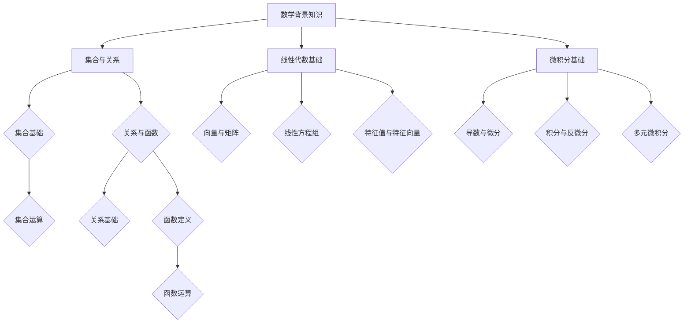

                 

### 第1章：数学背景知识

#### **核心概念与联系**

在探讨神经网络时，数学背景知识是不可或缺的。本章将介绍一些基本的数学概念和工具，包括集合与关系、线性代数基础和微积分基础。以下是这些概念和联系的核心流程图，以便读者更好地理解：



#### **核心算法原理讲解**

**1.1 集合与关系**

**集合基础**

- **定义**：集合是由一些确定的、互不相同的元素组成的整体。通常用大写字母表示集合，例如 \( A \)、\( B \)，元素用小写字母表示，例如 \( a \)、\( b \)。
- **表示**：集合的表示方法有列举法和描述法。列举法是将集合中的所有元素一一列举出来，如 \( A = \{1, 2, 3\} \)；描述法是用数学描述或规则表示集合，如 \( B = \{x \mid x \text{ 是自然数}\} \)。

**集合运算**

- **交集**：集合 \( A \) 和 \( B \) 的交集，记作 \( A \cap B \)，包含所有既属于 \( A \) 又属于 \( B \) 的元素。
- **并集**：集合 \( A \) 和 \( B \) 的并集，记作 \( A \cup B \)，包含所有属于 \( A \) 或 \( B \) 的元素。
- **补集**：集合 \( A \) 在全集 \( U \) 中的补集，记作 \( A^c \)，包含所有不属于 \( A \) 的元素。
- **差集**：集合 \( A \) 和 \( B \) 的差集，记作 \( A - B \) 或 \( A \cap B^c \)，包含所有属于 \( A \) 而不属于 \( B \) 的元素。

**关系与函数**

**关系基础**

- **定义**：关系是集合之间的一种关系，通常用二元组表示，例如 \( R = \{(x, y) \mid \text{条件}\} \)。
- **性质**：
  - **自反性**：\( \forall x, (x, x) \in R \)。
  - **对称性**：\( \forall x, y, (x, y) \in R \Rightarrow (y, x) \in R \)。
  - **传递性**：\( \forall x, y, z, (x, y) \in R \text{ 且 } (y, z) \in R \Rightarrow (x, z) \in R \)。

**函数定义**

- **定义**：函数是特定类型的关系，每个输入值都有唯一对应的输出值。形式化定义：\( f: A \rightarrow B \)，其中 \( A \) 是定义域，\( B \) 是值域，满足 \( \forall x \in A, \exists y \in B \text{ 使得 } f(x) = y \)。
- **性质**：
  - **单射**：\( \forall x_1, x_2 \in A, x_1 \neq x_2 \Rightarrow f(x_1) \neq f(x_2) \)。
  - **满射**：\( \forall y \in B, \exists x \in A \text{ 使得 } f(x) = y \)。
  - **双射**：既是单射又是满射的函数。

**函数运算**

- **复合函数**：\( f \circ g: A \rightarrow B \)，定义 \( (f \circ g)(x) = f(g(x)) \)。
- **逆函数**：若 \( f: A \rightarrow B \) 是双射，则存在逆函数 \( f^{-1}: B \rightarrow A \)，定义 \( (f^{-1} \circ f)(x) = x \)。

**1.2 线性代数基础**

**向量与矩阵**

- **定义**：向量是具有大小和方向的量，通常表示为列矩阵。
- **性质**：
  - **加法**：\( \vec{u} + \vec{v} \)。
  - **数乘**：\( c\vec{u} \)。

- **矩阵**
  - **定义**：矩阵是按行列排列的复数数组，通常表示为 \( A = [a_{ij}] \)。
  - **性质**：
    - **矩阵加法**：\( A + B \)。
    - **矩阵数乘**：\( cA \)。
    - **矩阵乘法**：\( AB \)。

**线性方程组**

- **定义**：由若干个线性方程构成的集合，通常表示为 \( \begin{cases} a_{11}x_1 + a_{12}x_2 + \cdots + a_{1n}x_n = b_1 \\ a_{21}x_1 + a_{22}x_2 + \cdots + a_{2n}x_n = b_2 \\ \vdots \\ a_{m1}x_1 + a_{m2}x_2 + \cdots + a_{mn}x_n = b_m \end{cases} \)。

- **解法**：
  - **高斯消元法**：通过初等行变换将矩阵化为阶梯形式，从而求解线性方程组。
  - **克莱姆法则**：若系数矩阵的行列式不为零，则线性方程组有唯一解，解可通过克莱姆法则计算。

**特征值与特征向量**

- **定义**：对于方阵 \( A \)，存在非零向量 \( \vec{v} \) 使得 \( A\vec{v} = \lambda\vec{v} \)，其中 \( \lambda \) 是特征值。

- **特征向量**
  - **定义**：与特征值对应的非零向量 \( \vec{v} \)。

- **性质**：
  - **线性性**：若 \( \vec{v_1} \) 和 \( \vec{v_2} \) 是 \( A \) 的特征向量，对应特征值 \( \lambda_1 \) 和 \( \lambda_2 \)，则对于任意常数 \( c_1 \) 和 \( c_2 \)，\( c_1\vec{v_1} + c_2\vec{v_2} \) 也是 \( A \) 的特征向量，对应特征值 \( c_1\lambda_1 + c_2\lambda_2 \)。

**1.3 微积分基础**

**导数与微分**

- **定义**：函数在某一点的导数表示函数在该点的切线斜率，形式化定义为 \( f'(x) = \lim_{h \to 0} \frac{f(x+h) - f(x)}{h} \)。

- **微分**
  - **定义**：函数在某一点的微分是导数在无穷小量 \( dx \) 下的线性近似，形式化定义为 \( df = f'(x)dx \)。

**积分与反微分**

- **定积分**
  - **定义**：函数 \( f(x) \) 在区间 \([a, b]\) 上的定积分，表示为 \( \int_{a}^{b} f(x)dx \)，是函数在该区间上的“面积”或“总量”。

- **积分方法**
  - **基本积分法**：包括直接积分法、换元积分法和分部积分法。
  - **定积分的几何意义**：表示曲线 \( y = f(x) \) 在区间 \([a, b]\) 上与 \( x \) 轴和两垂直线所围成的图形的面积。

**多元微积分**

- **多元函数**
  - **定义**：涉及多个变量的函数，例如 \( f(x, y) \)。

- **偏导数**
  - **定义**：多元函数对单个变量的导数，形式化定义为 \( f_x = \frac{\partial f}{\partial x} \)，\( f_y = \frac{\partial f}{\partial y} \)。

- **梯度**
  - **定义**：多元函数在一点处的梯度，是向量形式，表示为 \( \nabla f = \left( \frac{\partial f}{\partial x}, \frac{\partial f}{\partial y} \right) \)。

- **多重积分**
  - **定义**：函数 \( f(x, y) \) 在区域 \( D \) 上的双重积分，形式化定义为 \( \iint_{D} f(x, y)dA \)。

### **数学模型和公式 & 详细讲解 & 举例说明**

**集合与关系**

- **交集**：集合 \( A \) 和 \( B \) 的交集，记作 \( A \cap B \)，包含所有既属于 \( A \) 又属于 \( B \) 的元素。

  例如，设 \( A = \{1, 2, 3\} \) 和 \( B = \{2, 3, 4\} \)，则 \( A \cap B = \{2, 3\} \)。

- **并集**：集合 \( A \) 和 \( B \) 的并集，记作 \( A \cup B \)，包含所有属于 \( A \) 或 \( B \) 的元素。

  例如，设 \( A = \{1, 2, 3\} \) 和 \( B = \{2, 3, 4\} \)，则 \( A \cup B = \{1, 2, 3, 4\} \)。

- **补集**：集合 \( A \) 在全集 \( U \) 中的补集，记作 \( A^c \)，包含所有不属于 \( A \) 的元素。

  例如，设 \( U = \{1, 2, 3, 4, 5\} \) 和 \( A = \{1, 2, 3\} \)，则 \( A^c = \{4, 5\} \)。

- **差集**：集合 \( A \) 和 \( B \) 的差集，记作 \( A - B \) 或 \( A \cap B^c \)，包含所有属于 \( A \) 而不属于 \( B \) 的元素。

  例如，设 \( A = \{1, 2, 3\} \) 和 \( B = \{2, 3, 4\} \)，则 \( A - B = \{1\} \)。

**函数**

- **定义**：函数是特定类型的关系，每个输入值都有唯一对应的输出值。形式化定义：\( f: A \rightarrow B \)，其中 \( A \) 是定义域，\( B \) 是值域，满足 \( \forall x \in A, \exists y \in B \text{ 使得 } f(x) = y \)。

  例如，函数 \( f(x) = x^2 \) 的定义域是所有实数，值域是非负实数。

- **单射**：\( \forall x_1, x_2 \in A, x_1 \neq x_2 \Rightarrow f(x_1) \neq f(x_2) \)。

  例如，函数 \( f(x) = x^2 \) 不是单射，因为 \( f(1) = f(-1) = 1 \)。

- **满射**：\( \forall y \in B, \exists x \in A \text{ 使得 } f(x) = y \)。

  例如，函数 \( f(x) = x^2 \) 不是满射，因为对于 \( y < 0 \)，不存在 \( x \) 使得 \( f(x) = y \)。

- **双射**：既是单射又是满射的函数。

  例如，函数 \( f(x) = 2x + 1 \) 是双射，因为对于任意 \( y \in \mathbb{R} \)，都存在 \( x = \frac{y-1}{2} \) 使得 \( f(x) = y \)。

**线性代数**

- **矩阵**
  - **定义**：矩阵是按行列排列的复数数组，通常表示为 \( A = [a_{ij}] \)。
  - **性质**：
    - **矩阵加法**：\( A + B \)。
    - **矩阵数乘**：\( cA \)。
    - **矩阵乘法**：\( AB \)。

  例如，设 \( A = \begin{bmatrix} 1 & 2 \\ 3 & 4 \end{bmatrix} \) 和 \( B = \begin{bmatrix} 5 & 6 \\ 7 & 8 \end{bmatrix} \)，则 \( A + B = \begin{bmatrix} 6 & 8 \\ 10 & 12 \end{bmatrix} \) 和 \( cA = \begin{bmatrix} c & 2c \\ 3c & 4c \end{bmatrix} \)。

- **线性方程组**
  - **定义**：由若干个线性方程构成的集合，通常表示为 \( \begin{cases} a_{11}x_1 + a_{12}x_2 + \cdots + a_{1n}x_n = b_1 \\ a_{21}x_1 + a_{22}x_2 + \cdots + a_{2n}x_n = b_2 \\ \vdots \\ a_{m1}x_1 + a_{m2}x_2 + \cdots + a_{mn}x_n = b_m \end{cases} \)。
  - **解法**：
    - **高斯消元法**：通过初等行变换将矩阵化为阶梯形式，从而求解线性方程组。
    - **克莱姆法则**：若系数矩阵的行列式不为零，则线性方程组有唯一解，解可通过克莱姆法则计算。

  例如，考虑以下线性方程组：
  \[
  \begin{cases}
  2x + 3y = 8 \\
  4x - y = 5
  \end{cases}
  \]
  通过高斯消元法或克莱姆法则，可以得到解 \( x = 2 \) 和 \( y = 2 \)。

- **特征值与特征向量**
  - **定义**：对于方阵 \( A \)，存在非零向量 \( \vec{v} \) 使得 \( A\vec{v} = \lambda\vec{v} \)，其中 \( \lambda \) 是特征值。

  例如，考虑方阵 \( A = \begin{bmatrix} 4 & -1 \\ 2 & 3 \end{bmatrix} \)，其特征值为 \( \lambda_1 = 2 \) 和 \( \lambda_2 = 5 \)，对应的特征向量分别为 \( \vec{v_1} = \begin{bmatrix} 1 \\ 1 \end{bmatrix} \) 和 \( \vec{v_2} = \begin{bmatrix} 1 \\ -1 \end{bmatrix} \)。

**微积分**

- **导数与微分**
  - **定义**：函数在某一点的导数表示函数在该点的切线斜率，形式化定义为 \( f'(x) = \lim_{h \to 0} \frac{f(x+h) - f(x)}{h} \)。

  例如，考虑函数 \( f(x) = x^2 \)，其在点 \( x = 2 \) 的导数 \( f'(2) = \lim_{h \to 0} \frac{(2+h)^2 - 2^2}{h} = 4 \)。

  - **微分**
    - **定义**：函数在某一点的微分是导数在无穷小量 \( dx \) 下的线性近似，形式化定义为 \( df = f'(x)dx \)。

  例如，考虑函数 \( f(x) = x^2 \)，其在点 \( x = 2 \) 的微分 \( df = 4dx \)。

- **定积分**
  - **定义**：函数 \( f(x) \) 在区间 \([a, b]\) 上的定积分，表示为 \( \int_{a}^{b} f(x)dx \)，是函数在该区间上的“面积”或“总量”。

  例如，考虑函数 \( f(x) = x^2 \) 在区间 \([0, 1]\) 上的定积分 \( \int_{0}^{1} x^2 dx = \frac{1}{3} \)。

- **多元微积分**
  - **多元函数**
    - **定义**：涉及多个变量的函数，例如 \( f(x, y) \)。

  例如，考虑函数 \( f(x, y) = x^2 + y^2 \)。

  - **偏导数**
    - **定义**：多元函数对单个变量的导数，形式化定义为 \( f_x = \frac{\partial f}{\partial x} \)，\( f_y = \frac{\partial f}{\partial y} \)。

  例如，考虑函数 \( f(x, y) = x^2 + y^2 \)，其在点 \( (1, 2) \) 的偏导数 \( f_x = 2x \) 和 \( f_y = 2y \)，即 \( f_x(1, 2) = 2 \) 和 \( f_y(1, 2) = 4 \)。

  - **梯度**
    - **定义**：多元函数在一点处的梯度，是向量形式，表示为 \( \nabla f = \left( \frac{\partial f}{\partial x}, \frac{\partial f}{\partial y} \right) \)。

  例如，考虑函数 \( f(x, y) = x^2 + y^2 \)，其在点 \( (1, 2) \) 的梯度 \( \nabla f(1, 2) = \begin{bmatrix} 2 \\ 4 \end{bmatrix} \)。

  - **多重积分**
    - **定义**：函数 \( f(x, y) \) 在区域 \( D \) 上的双重积分，形式化定义为 \( \iint_{D} f(x, y)dA \)。

  例如，考虑函数 \( f(x, y) = x^2 + y^2 \) 在矩形区域 \( D = \{(x, y) \mid 0 \leq x \leq 1, 0 \leq y \leq 1\} \) 上的双重积分 \( \iint_{D} (x^2 + y^2)dA = \frac{2}{3} \)。

### **项目实战**

#### **开发环境搭建**

在开始多层感知机的实现之前，我们需要搭建一个合适的开发环境。以下是具体的步骤：

1. **安装Python**：Python是实现多层感知机的首选编程语言。确保您已安装Python 3.x版本。
2. **安装依赖库**：我们需要安装一些常用的机器学习库，如NumPy、Pandas、Matplotlib等。使用pip命令进行安装：

   ```bash
   pip install numpy pandas matplotlib
   ```

3. **创建项目文件夹**：在您的计算机上创建一个名为“MLP”的项目文件夹，用于存放代码和数据。

#### **源代码详细实现**

以下是一个简单的多层感知机实现的伪代码：

```python
import numpy as np

# 初始化参数
input_size = 784
hidden_size = 256
output_size = 10
learning_rate = 0.001
epochs = 10

# 初始化权重和偏置
W1 = np.random.normal(size=(input_size, hidden_size))
b1 = np.random.normal(size=(hidden_size,))
W2 = np.random.normal(size=(hidden_size, output_size))
b2 = np.random.normal(size=(output_size,))

# 前向传播
def forward(x):
    z1 = np.dot(x, W1) + b1
    a1 = np.tanh(z1)
    z2 = np.dot(a1, W2) + b2
    a2 = softmax(z2)
    return a2

# 反向传播
def backward(x, y, a2):
    dZ2 = a2 - y
    dW2 = np.dot(a1.T, dZ2)
    db2 = np.sum(dZ2, axis=0)
    
    dZ1 = np.dot(dZ2, W2.T) * (1 - np.square(a1))
    dW1 = np.dot(x.T, dZ1)
    db1 = np.sum(dZ1, axis=0)
    
    return dW1, dW2, db1, db2

# 梯度下降
for epoch in range(epochs):
    for x, y in data:
        a2 = forward(x)
        dW1, dW2, db1, db2 = backward(x, y, a2)
        W1 -= learning_rate * dW1
        b1 -= learning_rate * db1
        W2 -= learning_rate * dW2
        b2 -= learning_rate * db2

# 评估模型
accuracy = 0
for x, y in test_data:
    a2 = forward(x)
    if np.argmax(a2) == np.argmax(y):
        accuracy += 1
accuracy /= len(test_data)
print(f"Test Accuracy: {accuracy}")
```

#### **代码解读与分析**

1. **初始化参数**：我们首先定义了输入层、隐藏层和输出层的大小，学习率和训练轮数。这些参数将用于初始化权重和偏置，以及控制训练过程。

2. **初始化权重和偏置**：权重和偏置通过正态分布初始化，以避免梯度消失或爆炸问题。

3. **前向传播**：前向传播函数接收输入 \( x \)，计算通过隐藏层和输出层的输出 \( a2 \)。激活函数使用 \( \tanh \) 函数，这是因为 \( \tanh \) 函数在中间值附近导数较小，有助于缓解梯度消失问题。

4. **反向传播**：反向传播函数计算输出层的误差 \( dZ2 \)，并通过链式法则计算隐藏层的误差 \( dZ1 \)。这里使用了 \( \tanh \) 函数的导数性质。

5. **梯度下降**：在每个训练迭代中，我们通过计算梯度并更新权重和偏置来优化模型。

6. **评估模型**：在训练完成后，我们使用测试集评估模型的准确率。

### **总结**

本章介绍了神经网络所需的数学背景知识，包括集合与关系、线性代数基础和微积分基础。通过详细的伪代码和示例，我们展示了如何实现多层感知机的基本结构。在下一章中，我们将进一步探讨神经网络的实现细节和高级主题。

