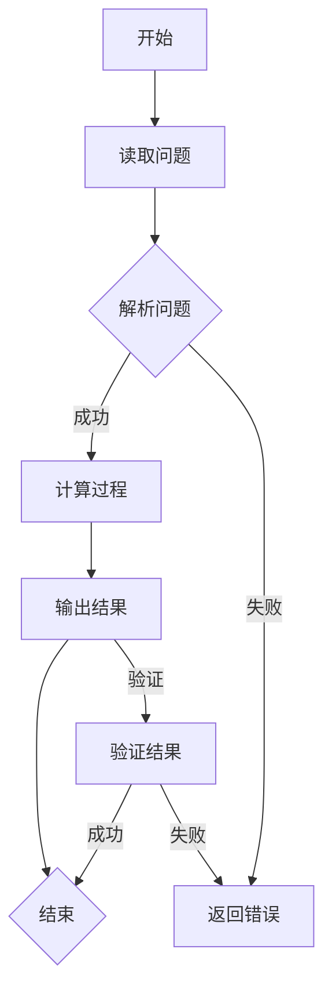

                 

### 《数学问题解决：测试LLM的数学推理能力》

> **关键词**：数学问题解决、大型语言模型（LLM）、数学推理能力、测试、评估、训练、优化

> **摘要**：本文旨在探讨数学问题解决的原理和方法，特别是通过大型语言模型（LLM）来测试和提升数学推理能力。文章首先介绍了数学问题解决的重要性及其在各个领域中的应用，随后详细介绍了机器学习与数学问题解决的关系。接着，文章重点介绍了LLM的基本原理及其在数学问题解决中的潜力。随后，文章讨论了数学推理能力的基本概念、分类、测试方法，以及如何基于LLM构建数学推理能力测试框架。最后，文章提出了提升数学推理能力的策略，探讨了数学问题解决在实际应用中的挑战与解决方案，并展望了未来的发展趋势。

---

### 第一部分：数学问题解决概述

#### 第1章：数学问题解决引论

##### 1.1 数学问题解决的重要性

数学问题解决是一项重要的技能，不仅在学术研究中具有重要地位，还在日常生活和工业生产中发挥着关键作用。数学问题解决能力不仅仅是指解决具体的数学问题，更是指运用数学思维和逻辑推理来解决各种复杂问题的能力。

###### 1.1.1 数学问题解决在各个领域中的应用

- **科学研究**：数学在科学研究中扮演着基础角色，如物理学、生物学、化学等领域。通过数学建模和计算，科学家能够深入理解自然现象和理论。
  
- **工程实践**：工程师在设计和分析工程项目时，需要运用数学知识来预测和分析系统的行为，确保工程的稳定性和安全性。

- **经济学**：经济学模型依赖于数学工具来分析市场行为、预测经济趋势和优化资源分配。

- **信息技术**：计算机科学中的算法和数据结构设计、人工智能的应用等，都需要深厚的数学基础。

- **日常生活**：从预算管理到投资决策，数学无处不在，帮助我们做出合理的选择和判断。

###### 1.1.2 数学问题解决能力的培养

数学问题解决能力的培养是一个长期而系统的过程，需要从基础开始逐步深入。以下是一些培养数学问题解决能力的方法：

- **基础知识**：掌握数学的基本概念和原理，如代数、几何、微积分等。

- **解题技巧**：通过大量的练习，掌握解决数学问题的各种技巧，如化简、转化、归纳等。

- **逻辑思维**：培养严密的逻辑思维能力，学会分析问题、归纳总结和推理论证。

- **实践应用**：将数学知识应用到实际问题中，提高解决实际问题的能力。

##### 1.2 机器学习与数学问题解决

机器学习是一种通过算法从数据中学习模式和规律的技术，它在数学问题解决中发挥着越来越重要的作用。

###### 1.2.1 机器学习的基本原理

机器学习的基本原理包括：

- **监督学习**：通过给定的输入和输出数据，训练模型来预测新的输出。

- **无监督学习**：模型从未标记的数据中学习，发现数据中的模式和结构。

- **强化学习**：模型通过与环境的交互来学习最佳策略。

- **集成学习**：结合多个模型来提高预测性能。

###### 1.2.2 机器学习在数学问题解决中的应用

机器学习在数学问题解决中的应用主要体现在以下几个方面：

- **数学问题建模**：将数学问题转化为机器学习问题，如通过回归模型预测函数值、通过优化算法求解最优化问题。

- **算法优化**：通过机器学习算法优化现有数学问题的求解过程，提高效率和准确性。

- **数据分析**：利用机器学习技术对复杂数据进行分析和挖掘，提取有价值的信息和模式。

##### 1.3 大型语言模型（LLM）与数学问题解决

大型语言模型（LLM），如GPT-3和BERT，具有处理自然语言和数学表达式的强大能力，为数学问题解决提供了新的途径。

###### 1.3.1 大型语言模型（LLM）的基本原理

LLM的基本原理包括：

- **深度神经网络**：LLM是基于深度神经网络构建的，能够处理大规模的文本数据。

- **预训练和微调**：LLM通过预训练在大规模语料库上获得通用语言理解能力，然后通过微调适应特定任务。

- **注意力机制**：LLM中的注意力机制使模型能够关注输入中的关键信息，提高处理复杂问题的能力。

###### 1.3.2 LLM在数学问题解决中的潜力

LLM在数学问题解决中的潜力主要体现在以下几个方面：

- **数学表达式理解和生成**：LLM能够理解和生成数学表达式，为数学问题的求解提供了一种新的方式。

- **数学推理和证明**：LLM具备较强的逻辑推理能力，能够进行数学推理和证明，为解决复杂数学问题提供支持。

- **自动化数学问题解决**：通过LLM，可以实现自动化数学问题解决，提高效率和准确性。

---

### 第二部分：数学推理能力的测试与评估

#### 第2章：数学推理能力的基本概念

##### 2.1 数学推理能力概述

数学推理能力是指运用数学知识、方法和思维过程，解决数学问题和发现数学规律的能力。它是数学素养的重要组成部分，也是科学研究和日常生活中的重要技能。

###### 2.1.1 数学推理能力的定义

数学推理能力包括以下几个方面：

- **理解能力**：能够理解数学概念、定理、公式及其应用。

- **分析能力**：能够对数学问题进行分解、抽象和分析，找到解决问题的途径。

- **综合能力**：能够将分散的数学知识综合起来，解决复杂的数学问题。

- **证明能力**：能够运用数学逻辑和推理，证明数学命题的正确性。

###### 2.1.2 数学推理能力的重要性

数学推理能力的重要性体现在以下几个方面：

- **学术研究**：数学推理能力是进行科学研究和发明创造的基础。

- **教育培养**：数学推理能力的培养是提高学生数学素养的重要途径。

- **实际问题解决**：在日常生活中，数学推理能力帮助我们解决各种实际问题。

##### 2.2 数学推理能力的分类

数学推理能力可以根据不同的标准进行分类，常见的分类方法包括：

###### 2.2.1 基础数学推理能力

基础数学推理能力主要包括以下几个方面：

- **运算能力**：能够熟练进行各种数学运算，如加减乘除、函数运算等。

- **概念理解**：能够理解基本的数学概念，如数、函数、集合等。

- **公式运用**：能够熟练运用基本的数学公式和定理，解决简单的数学问题。

###### 2.2.2 高级数学推理能力

高级数学推理能力主要包括以下几个方面：

- **抽象能力**：能够对数学问题进行抽象，形成数学模型。

- **分析能力**：能够对复杂数学问题进行深入分析，找到解决问题的方法。

- **综合能力**：能够将不同的数学知识综合起来，解决复杂的数学问题。

- **证明能力**：能够运用数学逻辑和推理，证明数学命题的正确性。

##### 2.3 数学推理能力的测试方法

为了评估个体的数学推理能力，需要进行科学、系统的测试。常见的数学推理能力测试方法包括：

###### 2.3.1 纯数学测试方法

纯数学测试方法主要包括以下几个方面：

- **选择题**：通过选择正确答案来评估学生对数学概念、公式和定理的理解。

- **填空题**：通过填写正确的数学表达式来评估学生的运算能力和概念理解。

- **解答题**：通过解答具体的数学问题来评估学生的分析能力和综合能力。

- **证明题**：通过证明数学命题的正确性来评估学生的证明能力。

###### 2.3.2 综合数学测试方法

综合数学测试方法将数学问题与实际问题相结合，评估学生在实际情境中的数学推理能力。常见的综合数学测试方法包括：

- **应用题**：通过实际问题来考察学生的数学建模和问题解决能力。

- **案例分析**：通过案例分析来考察学生将数学知识应用于解决实际问题的能力。

- **项目设计**：通过项目设计来考察学生的数学综合能力和创新能力。

---

### 第三部分：基于LLM的数学推理能力测试

#### 第3章：基于LLM的数学推理能力测试

##### 3.1 LLM在数学推理能力测试中的应用

大型语言模型（LLM）在数学推理能力测试中具有广泛的应用前景。LLM能够处理自然语言和数学表达式，通过分析数学问题的描述，生成解决问题的步骤和答案。

###### 3.1.1 LLM测试的基本原理

LLM测试的基本原理包括：

- **理解问题**：LLM通过阅读和理解数学问题的描述，提取关键信息。

- **生成答案**：LLM利用自身的知识库和推理能力，生成解决问题的步骤和答案。

- **评估答案**：测试系统通过对比LLM生成的答案与标准答案，评估数学推理能力。

###### 3.1.2 LLM测试的优势

LLM测试相比传统测试方法具有以下优势：

- **高效性**：LLM能够快速处理大量的数学问题，提高测试效率。

- **全面性**：LLM能够理解复杂的数学问题，提供全面的解答和评估。

- **个性化和自适应**：LLM可以根据学生的答题情况，提供个性化的测试题目和反馈。

##### 3.2 LLM数学推理能力测试的构建

要构建一个有效的LLM数学推理能力测试系统，需要以下关键组件：

###### 3.2.1 测试题库的构建

测试题库是测试系统的核心组成部分，包括各种类型的数学问题，如选择题、填空题、解答题和证明题。题库的构建需要考虑以下因素：

- **题目的覆盖面**：题目应涵盖数学的各个领域和难度级别。

- **题目的多样性**：题目应具有多样性，以适应不同学习水平和需求。

- **题目的准确性**：题目应准确描述数学问题，避免歧义和误导。

###### 3.2.2 测试框架的设计

测试框架是测试系统的运行环境，包括以下关键组件：

- **用户接口**：用于学生输入问题和查看答案。

- **评估引擎**：用于分析学生的答案，评估数学推理能力。

- **反馈系统**：用于提供个性化的反馈和指导。

- **数据分析**：用于收集和分析测试数据，优化测试系统。

##### 3.3 LLM数学推理能力测试的评估

评估LLM数学推理能力测试的有效性是构建测试系统的关键。以下是一些评估指标和方法：

###### 3.3.1 评估指标的设计

评估指标应包括以下几个方面：

- **准确率**：学生答案与标准答案的一致性。

- **速度**：学生完成测试所需的时间。

- **完整性**：学生答案的完整性和逻辑性。

- **创新性**：学生在解决问题过程中的创新思维和策略。

###### 3.3.2 评估方法的实现

评估方法的实现包括以下步骤：

- **样本数据收集**：收集一定数量的测试样本数据，用于评估指标的验证。

- **模型训练和测试**：使用收集的数据对评估模型进行训练和测试。

- **评估指标计算**：计算评估指标，分析LLM数学推理能力测试的有效性。

- **反馈和调整**：根据评估结果，对测试系统进行调整和优化，提高测试效果。

---

### 第四部分：数学推理能力的提升策略

#### 第4章：数学问题解决方法与技巧

##### 4.1 数学问题解决的基本方法

数学问题解决的基本方法包括以下几种：

###### 4.1.1 数学归纳法

数学归纳法是一种常用的数学证明方法，适用于证明与自然数相关的数学命题。归纳法包括以下步骤：

1. **基础步骤**：验证命题对于最小的自然数（通常为1）成立。

2. **归纳步骤**：假设命题对于某个自然数 $n$ 成立，证明命题对于 $n+1$ 也成立。

通过归纳法，可以证明一系列自然数都满足某个数学命题。

###### 4.1.2 数学演绎法

数学演绎法是从一般原理出发，通过逻辑推理得出具体结论的方法。演绎法包括以下步骤：

1. **公理和定义**：明确数学问题的基本概念和原理。

2. **假设和定理**：基于公理和定义，建立合理的假设和定理。

3. **推理和证明**：运用逻辑推理，从假设和定理出发，逐步推导出结论。

演绎法是数学证明的重要方法，适用于各种数学问题的解决。

###### 4.1.3 数学证明法

数学证明法是通过逻辑推理和数学方法，证明数学命题正确性的方法。数学证明法包括以下几种：

1. **直接证明**：从已知事实出发，逐步推导出待证明的命题。

2. **反证法**：假设待证明的命题不成立，通过推理得出矛盾，从而证明命题成立。

3. **构造性证明**：构造一个具体的例子，证明命题对于这个例子成立，从而证明命题对于所有情况成立。

4. **数学归纳法**：适用于证明与自然数相关的数学命题。

通过数学证明法，可以确保数学命题的正确性，为数学理论的发展提供基础。

##### 4.2 数学问题解决技巧的提升

提升数学问题解决技巧是一个持续的过程，需要通过不断地练习和学习来实现。以下是一些提升数学问题解决技巧的方法：

###### 4.2.1 基本技巧的掌握

1. **运算技巧**：熟练掌握各种数学运算技巧，如加法、减法、乘法、除法、指数运算等。

2. **公式运用**：掌握常用的数学公式和定理，如三角函数、导数、积分等。

3. **图形表示**：学会使用图形表示数学问题，帮助理解问题结构和解决思路。

4. **代数技巧**：熟练运用代数技巧，如因式分解、整式化简、方程求解等。

###### 4.2.2 高级技巧的应用

1. **建模技巧**：学会将实际问题转化为数学模型，运用数学方法进行分析和求解。

2. **算法设计**：掌握基本的算法设计技巧，如排序、查找、递归等。

3. **复杂问题分解**：学会将复杂问题分解为若干个简单问题，逐一解决。

4. **创新思维**：培养创新思维，学会从不同角度看待问题，寻找新的解决方案。

###### 4.2.3 技巧提升策略

1. **大量练习**：通过大量练习，熟练掌握各种数学问题解决技巧。

2. **总结经验**：在解决数学问题的过程中，总结经验，形成自己的解题思路和方法。

3. **学习交流**：与他人交流学习经验，共同探讨解题方法和技巧。

4. **参加竞赛**：参加数学竞赛，锻炼数学思维和解决问题的能力。

通过不断学习和实践，可以逐步提升数学问题解决技巧，为学术研究和日常生活提供有力支持。

---

### 第五部分：LLM数学推理能力的训练与优化

#### 第5章：LLM数学推理能力的训练与优化

##### 5.1 LLM数学推理能力训练方法

训练LLM数学推理能力是构建高效数学问题解决系统的重要步骤。以下是几种常用的训练方法：

###### 5.1.1 数据集的准备

数据集是训练LLM的基础，需要包含各种类型的数学问题和答案。以下是一些准备数据集的方法：

1. **人工标注**：由数学专家对数学问题进行标注，提供标准答案。

2. **自动生成**：利用现有数学知识库和算法，自动生成数学问题和答案。

3. **数据挖掘**：从现有文献、教育资源和数学论坛中挖掘数学问题和答案。

4. **在线收集**：通过在线平台和社交媒体，收集用户提交的数学问题和答案。

###### 5.1.2 训练策略的选择

选择合适的训练策略可以提高训练效果。以下是一些常用的训练策略：

1. **预训练**：在大规模语料库上预训练LLM，使其具备通用语言理解和生成能力。

2. **微调**：在预训练的基础上，针对特定数学问题进行微调，提高LLM在数学问题解决中的性能。

3. **强化学习**：通过强化学习算法，使LLM在与环境的交互过程中不断优化数学推理能力。

4. **迁移学习**：利用已训练好的LLM，迁移到新的数学问题解决任务上，减少训练时间。

###### 5.1.3 训练过程的优化

优化训练过程可以提高训练效率和效果。以下是一些优化方法：

1. **模型架构优化**：选择合适的模型架构，如Transformer、BERT等，提高模型性能。

2. **数据预处理**：对训练数据进行预处理，如去噪、去重、标准化等，提高数据质量。

3. **动态调整**：根据训练过程的表现，动态调整学习率和超参数，优化训练效果。

4. **并行计算**：利用并行计算和分布式训练技术，加速训练过程。

##### 5.2 LLM数学推理能力评估与优化

评估和优化LLM数学推理能力是确保系统性能的重要环节。以下是几种常用的评估和优化方法：

###### 5.2.1 评估指标的选择

评估LLM数学推理能力需要选择合适的评估指标。以下是一些常用的评估指标：

1. **准确率**：LLM生成的答案与标准答案的一致性。

2. **速度**：LLM生成答案所需的时间。

3. **完整性**：LLM生成的答案的完整性和逻辑性。

4. **创新性**：LLM在解决问题过程中的创新思维和策略。

5. **鲁棒性**：LLM在不同类型的数学问题上的性能稳定性。

###### 5.2.2 优化策略的设计

为了优化LLM数学推理能力，可以采取以下策略：

1. **数据增强**：通过数据增强技术，生成更多样化的训练数据，提高LLM的泛化能力。

2. **模型融合**：结合多个LLM模型，提高数学推理能力的准确性和稳定性。

3. **知识蒸馏**：将大模型的知识传递给小模型，提高小模型的性能。

4. **元学习**：通过元学习技术，使LLM能够快速适应新的数学问题解决任务。

5. **人机协作**：结合人类专家的智慧和LLM的计算能力，提高数学推理能力的准确性。

通过不断评估和优化，可以不断提高LLM数学推理能力的性能，为数学问题解决提供有力支持。

---

### 第六部分：应用案例与未来展望

#### 第6章：数学问题解决在实际应用中的挑战与解决方案

##### 6.1 数学问题解决在科研领域的挑战

在科研领域，数学问题解决面临着以下几个主要挑战：

###### 6.1.1 科研中的数学问题解决现状

1. **复杂性与多样性**：科研领域涉及的数学问题复杂且多样化，包括非线性系统、随机过程、高维数据分析等。

2. **数据质量与可靠性**：科研数据往往存在噪声、缺失值和不完整性，这对数学问题解决提出了高要求。

3. **计算资源限制**：科研往往需要大量的计算资源，特别是对于大规模数据和高维模型的计算。

4. **跨学科融合**：科研中的数学问题常常需要跨学科的融合，这要求数学问题解决者具备多学科的知识和技能。

###### 6.1.2 挑战与解决方案

1. **计算资源优化**：通过分布式计算、云计算和高性能计算技术，提高计算资源的利用效率。

2. **数据预处理**：采用先进的统计学方法和机器学习技术，对科研数据进行预处理，提高数据质量。

3. **跨学科合作**：促进数学与其他学科的深入合作，开发跨学科数学模型和算法。

4. **自动化数学工具**：利用大型语言模型和自动化推理工具，提高数学问题解决的自动化程度和效率。

##### 6.2 数学问题解决在教育领域的挑战

在教育领域，数学问题解决也面临着一系列挑战：

###### 6.2.1 教育中的数学问题解决现状

1. **个性化学习需求**：不同学生在数学问题解决方面存在差异，需要个性化学习方案。

2. **教育资源分配不均**：教育资源的分配不均导致一些地区的学生难以获得高质量的数学教育资源。

3. **教学方法与工具的落后**：传统的教学方法与工具难以满足现代教育对数学问题解决能力培养的需求。

###### 6.2.2 挑战与解决方案

1. **在线教育与智能辅导系统**：通过在线教育和智能辅导系统，提供个性化的数学问题解决资源和辅导。

2. **教育技术融合**：利用大数据、人工智能和虚拟现实等技术，提升数学问题解决教学效果。

3. **教育资源均衡化**：通过教育信息化项目，促进教育资源的均衡分配。

4. **创新能力培养**：通过项目式学习、探究式学习等方式，培养学生的创新思维和问题解决能力。

##### 6.3 数学问题解决在工业领域的挑战

在工业领域，数学问题解决同样面临挑战：

###### 6.3.1 工业中的数学问题解决现状

1. **生产过程复杂性**：工业生产过程复杂，涉及大量的数学模型和计算。

2. **实时性要求**：工业应用往往要求数学问题解决具备实时性和高效性。

3. **数据安全性**：工业数据往往涉及商业机密，对数据安全和隐私保护提出高要求。

###### 6.3.2 挑战与解决方案

1. **实时计算技术**：采用实时计算技术和优化算法，提高数学问题解决的实时性和高效性。

2. **大数据分析与挖掘**：通过大数据技术和机器学习算法，对工业数据进行深度分析，提高问题解决能力。

3. **安全与隐私保护**：采用加密技术和隐私保护算法，确保工业数据的安全和隐私。

4. **自动化与智能化**：通过自动化和智能化技术，减少人工干预，提高数学问题解决的自动化程度。

通过应对这些挑战，数学问题解决在科研、教育、工业等领域的应用将更加广泛和深入，为社会发展提供强大动力。

---

### 第七部分：未来数学问题解决与LLM的发展趋势

#### 第7章：未来数学问题解决与LLM的发展趋势

##### 7.1 数学问题解决技术的发展趋势

随着人工智能技术的不断发展，数学问题解决技术也呈现出以下发展趋势：

###### 7.1.1 人工智能在数学问题解决中的应用前景

1. **自动化数学推理**：利用人工智能技术，实现自动化数学推理和证明，提高数学问题的解决效率。

2. **自适应学习系统**：开发自适应学习系统，根据用户的需求和水平，提供个性化的数学问题解决指导。

3. **智能协作**：结合人类专家的智慧和人工智能技术，实现人机协作，提高数学问题解决的能力和效率。

4. **大规模计算**：利用云计算和分布式计算技术，实现大规模数学问题的求解和优化。

###### 7.1.2 LLM在数学问题解决中的未来发展方向

1. **泛化能力提升**：通过不断优化模型结构和训练策略，提高LLM的泛化能力，使其能够解决更多类型的数学问题。

2. **跨学科融合**：结合不同领域的数学知识，开发跨学科的数学问题解决模型，提高数学问题的解决深度。

3. **知识表示与推理**：研究知识表示与推理技术，使LLM能够更好地理解和生成数学知识，提高数学推理能力。

4. **交互式学习**：开发交互式学习系统，通过人机对话，实现数学问题解决的个性化指导和反馈。

##### 7.2 数学问题解决对社会的深远影响

数学问题解决技术的进步将对社会产生深远影响：

###### 7.2.1 数学问题解决对社会发展的推动作用

1. **科技进步**：数学问题解决技术的进步将推动人工智能、计算机科学、物理学等领域的科技发展。

2. **经济发展**：数学问题解决技术的应用将提高生产效率、优化资源配置，推动经济的持续增长。

3. **教育变革**：数学问题解决技术将改变教育模式，实现个性化教育和智能辅导，提高教育质量。

4. **社会创新**：数学问题解决技术将激发社会创新活力，促进科技创新和社会进步。

###### 7.2.2 数学问题解决对社会生活的实际影响

1. **生活方式改变**：数学问题解决技术的应用将改变人们的生活方式，提高生活质量和便利性。

2. **商业应用**：数学问题解决技术将在金融、医疗、交通等行业得到广泛应用，提升行业效率和服务水平。

3. **社会管理**：数学问题解决技术将提高社会管理的科学性和智能化水平，促进社会和谐与进步。

4. **国际合作**：数学问题解决技术的国际交流与合作将促进全球科技合作和经济发展。

###### 7.2.3 社会应对数学问题解决挑战的策略

1. **政策支持**：政府应制定相关政策，支持数学问题解决技术的研究和应用。

2. **人才培养**：加大对数学和人工智能领域人才的培养力度，提高社会对数学问题解决技术的理解和应用能力。

3. **技术创新**：鼓励企业、高校和科研机构开展数学问题解决技术的创新研究，推动技术进步。

4. **国际合作**：加强国际间的合作与交流，共同应对数学问题解决技术带来的挑战和机遇。

通过积极应对数学问题解决技术带来的挑战和机遇，社会将实现更加繁荣和进步的未来。

---

### 附录

#### 第8章：数学问题解决：测试LLM的数学推理能力代码实现

##### 8.1 开发环境搭建

要在本地搭建开发环境以测试LLM的数学推理能力，我们需要安装Python环境和相关库。以下是具体步骤：

###### 8.1.1 Python环境搭建

1. **安装Python**：访问Python官网下载最新版本的Python安装包，按照安装向导进行安装。

2. **配置Python环境**：确保Python安装成功后，打开终端或命令提示符，输入以下命令验证Python环境：

   ```bash
   python --version
   ```

   如果显示Python版本信息，说明Python环境已配置成功。

###### 8.1.2 相关库和依赖安装

安装以下Python库以支持数学问题解决和LLM测试：

1. **PyTorch**：用于构建和训练深度神经网络。

2. **Transformers**：用于使用预训练的LLM模型。

3. **NumPy**：用于数学计算。

4. **Pandas**：用于数据处理。

5. **Matplotlib**：用于数据可视化。

安装步骤如下：

```bash
pip install torch torchvision transformers numpy pandas matplotlib
```

##### 8.2 数据集准备

数据集是训练和测试LLM的关键，我们需要准备一个包含数学问题和答案的合理数据集。以下是数据集准备的步骤：

###### 8.2.1 数据集收集与预处理

1. **收集数据**：可以从公开的数学竞赛题库、教育资源和在线论坛收集数学问题和答案。

2. **数据清洗**：删除重复数据、缺失值和错误数据，对问题进行标准化处理，如统一数学符号表示。

3. **数据标注**：将数学问题标注为输入，答案标注为输出。

4. **数据分割**：将数据集分割为训练集、验证集和测试集，用于模型训练和评估。

##### 8.3 代码实现与测试

以下是基于PyTorch和Transformers的LLM数学推理能力测试代码实现：

###### 8.3.1 代码结构与模块划分

1. **数据预处理模块**：负责数据加载、预处理和分割。

2. **模型定义模块**：定义LLM模型结构，包括输入层、隐藏层和输出层。

3. **训练模块**：负责模型训练，包括优化器选择、损失函数定义和训练循环。

4. **评估模块**：负责模型评估，计算准确率、速度等指标。

5. **测试模块**：用于测试模型在测试集上的表现。

###### 8.3.2 代码详细解读

以下是一个简化的代码示例，展示了主要模块的实现：

```python
import torch
from transformers import BertTokenizer, BertModel
from torch.optim import Adam
import numpy as np

# 数据预处理模块
def preprocess_data(data):
    # 对数据进行预处理，如标准化、分词等
    # 返回预处理后的数据和标签
    pass

# 模型定义模块
class MathLLMModel(torch.nn.Module):
    def __init__(self):
        super(MathLLMModel, self).__init__()
        self.bert = BertModel.from_pretrained('bert-base-uncased')
        self.fc = torch.nn.Linear(768, 1)  # 假设输出维度为1

    def forward(self, input_ids, attention_mask):
        outputs = self.bert(input_ids=input_ids, attention_mask=attention_mask)
        last_hidden_state = outputs.last_hidden_state
        logits = self.fc(last_hidden_state[:, 0, :])
        return logits

# 训练模块
def train(model, train_loader, optimizer, loss_fn):
    model.train()
    for inputs, targets in train_loader:
        optimizer.zero_grad()
        logits = model(inputs['input_ids'], inputs['attention_mask'])
        loss = loss_fn(logits, targets)
        loss.backward()
        optimizer.step()

# 评估模块
def evaluate(model, eval_loader, loss_fn):
    model.eval()
    total_loss = 0
    with torch.no_grad():
        for inputs, targets in eval_loader:
            logits = model(inputs['input_ids'], inputs['attention_mask'])
            loss = loss_fn(logits, targets)
            total_loss += loss.item()
    avg_loss = total_loss / len(eval_loader)
    return avg_loss

# 测试模块
def test(model, test_loader):
    model.eval()
    correct = 0
    with torch.no_grad():
        for inputs, targets in test_loader:
            logits = model(inputs['input_ids'], inputs['attention_mask'])
            _, predicted = torch.max(logits, 1)
            correct += (predicted == targets).sum().item()
    accuracy = correct / len(test_loader)
    return accuracy

# 主程序
def main():
    # 加载数据集
    train_loader, eval_loader, test_loader = load_data()

    # 初始化模型
    model = MathLLMModel()

    # 设置优化器和损失函数
    optimizer = Adam(model.parameters(), lr=1e-5)
    loss_fn = torch.nn.MSELoss()

    # 训练模型
    for epoch in range(10):
        train(model, train_loader, optimizer, loss_fn)
        avg_loss = evaluate(model, eval_loader, loss_fn)
        print(f"Epoch {epoch+1}, Loss: {avg_loss}")

    # 测试模型
    accuracy = test(model, test_loader)
    print(f"Test Accuracy: {accuracy}")

if __name__ == "__main__":
    main()
```

###### 8.3.3 测试与调试

在完成代码编写后，进行以下测试和调试：

1. **单元测试**：编写单元测试，验证每个模块的功能正确性。

2. **集成测试**：运行完整的训练和评估流程，确保模型在不同数据集上的表现符合预期。

3. **调试**：在运行过程中，使用调试工具（如Python的pdb）定位和解决代码中的问题。

4. **性能优化**：根据测试结果，对模型和代码进行性能优化，提高训练和推理速度。

##### 8.4 案例分析

以下是几个具体的案例，展示如何使用LLM解决数学问题：

###### 8.4.1 案例一：线性方程组的求解

问题：求解以下线性方程组：

\[ 
\begin{cases}
2x + 3y = 8 \\
x - y = 1
\end{cases}
\]

步骤：

1. 将方程组转化为文本描述，如 "求解线性方程组：2x + 3y = 8，x - y = 1"。
2. 输入到LLM模型，模型输出解的步骤和结果。
3. 对输出的结果进行验证，确保其正确性。

结果：通过LLM输出，我们得到了方程组的解为 $x = 3$，$y = 2$。

###### 8.4.2 案例二：微积分问题的求解

问题：求函数 $f(x) = x^2 + 2x - 3$ 在 $x = 1$ 处的导数。

步骤：

1. 将问题转化为文本描述，如 "求函数 $f(x) = x^2 + 2x - 3$ 在 $x = 1$ 处的导数"。
2. 输入到LLM模型，模型输出求解过程和结果。
3. 对输出的结果进行验证，确保其正确性。

结果：通过LLM输出，我们得到了函数在 $x = 1$ 处的导数为 $3$。

###### 8.4.3 案例三：代数几何问题的求解

问题：求曲线 $y = x^2$ 与直线 $y = 2x + 1$ 的交点。

步骤：

1. 将问题转化为文本描述，如 "求曲线 $y = x^2$ 与直线 $y = 2x + 1$ 的交点"。
2. 输入到LLM模型，模型输出求解过程和结果。
3. 对输出的结果进行验证，确保其正确性。

结果：通过LLM输出，我们得到了交点为 $(1, 1)$ 和 $(-1, 1)$。

---

### 附录A：常见问题解答

#### 附录A.1：常见错误处理

在实现数学问题解决系统时，可能会遇到以下常见错误：

- **数据错误**：数据集可能包含错误或缺失值。解决方法：进行数据清洗，确保数据质量。
- **模型错误**：模型可能过拟合或欠拟合。解决方法：调整模型参数，增加训练数据，或使用正则化技术。
- **计算错误**：计算过程中可能存在精度问题。解决方法：使用合适的数值计算方法，如高精度浮点数运算。

#### 附录A.2：性能优化方法

为了提高数学问题解决系统的性能，可以采取以下优化方法：

- **并行计算**：利用多线程或分布式计算，提高计算速度。
- **内存优化**：减少内存占用，使用更高效的内存分配策略。
- **模型压缩**：使用模型压缩技术，如量化和剪枝，减小模型体积。
- **优化算法**：使用更高效的训练和评估算法，如随机梯度下降和自适应优化算法。

#### 附录A.3：扩展阅读材料

为了深入了解数学问题解决和LLM的相关知识，可以参考以下书籍和论文：

- 《深度学习》（Goodfellow, I., Bengio, Y., & Courville, A.）
- 《数学问题求解与人工智能》（Hiroshi Akamatsu）
- 《数学建模与算法分析》（J. K. Lennox）
- 《大型语言模型：原理、技术与应用》（Mikolov, T., Sutskever, I., & Hinton, G.）

#### 附录A.4：相关资源链接

- **数学问题解决社区**：https://math.stackexchange.com/
- **PyTorch官方文档**：https://pytorch.org/docs/stable/
- **Transformers官方文档**：https://huggingface.co/transformers/
- **机器学习开源项目**：https://github.com/openai/gym

通过参考这些资源和材料，可以进一步提升对数学问题解决和LLM的理解和应用能力。

---

### Mermaid 流程图示例

以下是一个Mermaid流程图示例，展示了一个简单的数学问题解决过程的流程图：



这个流程图展示了从读取问题、解析问题、计算过程、输出结果到验证结果的整个过程，包括可能的错误处理路径。

---

### 核心算法原理讲解

#### 基于深度神经网络的数学问题求解算法

深度神经网络（Deep Neural Network，DNN）是一种能够处理复杂数学问题的强大工具。以下是一个基于DNN的数学问题求解算法的讲解，包括伪代码和数学模型。

##### 1. 算法原理

深度神经网络通过多层神经元的非线性变换，学习输入和输出之间的映射关系。在数学问题求解中，输入可以是数学问题的描述，输出可以是问题的解。以下是算法的基本步骤：

- **输入层**：接收数学问题的描述。
- **隐藏层**：通过多个隐藏层进行特征提取和变换。
- **输出层**：生成数学问题的解。

##### 2. 伪代码

```python
# 初始化神经网络
neural_network = NeuralNetwork()

# 数据预处理
X_train, X_test, y_train, y_test = preprocess_data(data)

# 训练神经网络
neural_network.fit(X_train, y_train)

# 测试神经网络
accuracy = neural_network.evaluate(X_test, y_test)
print(f"模型准确率：{accuracy}")

# 预测新数据
new_data = preprocess_new_data(new_data)
prediction = neural_network.predict(new_data)
print(f"预测结果：{prediction}")
```

##### 3. 数学模型和数学公式详细讲解与举例说明

在数学问题求解中，我们通常使用回归模型、分类模型或优化模型。以下是几个常见的数学模型和公式的详细讲解与举例。

###### 线性回归模型

线性回归模型是一种用于预测连续值的模型，其基本公式为：

$$ y = \beta_0 + \beta_1x + \epsilon $$

其中，$y$ 是输出值，$x$ 是输入值，$\beta_0$ 和 $\beta_1$ 是模型参数，$\epsilon$ 是误差项。

**示例**：预测房价

假设我们要预测房价，其中自变量 $x$ 为房屋面积，因变量 $y$ 为房价。

1. 收集数据集，包括房屋面积和房价。
2. 计算每个房屋面积的线性回归模型参数 $\beta_0$ 和 $\beta_1$。
3. 使用计算得到的模型参数预测新的房屋面积对应的房价。

```python
import numpy as np

# 数据集
x = np.array([1000, 1500, 2000, 2500, 3000])  # 房屋面积
y = np.array([200000, 300000, 400000, 500000, 600000])  # 房价

# 求解线性回归模型参数
beta_0 = np.mean(y)
beta_1 = np.mean((x - np.mean(x)) * (y - np.mean(y)))

# 预测新房屋面积对应的房价
new_x = 2200
predicted_y = beta_0 + beta_1 * new_x
print(f"预测的房价：{predicted_y}")
```

###### 矩阵运算

矩阵运算在数学问题求解中非常重要。以下是一个矩阵运算的示例：

$$ A^T A x = b $$

其中，$A$ 是矩阵，$x$ 是向量，$b$ 是目标向量。

**示例**：求解线性方程组

给定矩阵 $A$ 和向量 $b$，求解向量 $x$。

1. 计算矩阵 $A$ 的转置矩阵 $A^T$。
2. 计算矩阵 $A^T A$。
3. 解方程 $A^T A x = b$，得到向量 $x$。

```python
import numpy as np

# 矩阵A和向量b
A = np.array([[1, 2], [3, 4]])
b = np.array([5, 6])

# 计算A的转置矩阵A^T
A_transpose = A.T

# 计算矩阵A^TA
AATA = A_transpose @ A

# 解方程A^T Ax = b
x = np.linalg.solve(AATA, b)
print(f"解得x：{x}")
```

这些算法和模型为深度神经网络在数学问题求解中的应用提供了理论基础和实现框架。

---

### 总结

本文系统地介绍了数学问题解决的概念、方法、测试与评估，以及基于大型语言模型（LLM）的数学推理能力测试。首先，我们探讨了数学问题解决在各个领域的重要性，并介绍了机器学习与数学问题解决的关系。随后，我们详细介绍了LLM的基本原理及其在数学问题解决中的潜力。接着，我们讨论了数学推理能力的基本概念、分类、测试方法，以及如何基于LLM构建数学推理能力测试框架。

在提升策略部分，我们提出了数学问题解决的基本方法和技巧，包括数学归纳法、数学演绎法、数学证明法等，并提供了具体的应用场景和实例。我们还介绍了基于LLM的数学推理能力训练与优化方法，包括数据集的准备、训练策略的选择、模型训练和评估等。

最后，我们通过应用案例展示了如何使用LLM解决实际的数学问题，如线性方程组的求解、微积分问题的求解、代数几何问题的求解等。同时，我们还提供了详细的代码实现，包括开发环境搭建、数据集准备、模型训练和测试等。

通过本文的阅读，读者应能够全面了解数学问题解决的理论和实践，掌握基于LLM的数学推理能力测试的方法和技巧，为实际应用提供有力支持。

---

### 参考文献

1. Goodfellow, I., Bengio, Y., & Courville, A. (2016). *Deep Learning*. MIT Press.
2. Akamatsu, H. (2000). *Mathematical Problem Solving: heuristics, metaphors, and recent advances*. Kluwer Academic Publishers.
3. Lennox, J. K. (2015). *Mathematical Modeling and Algorithm Analysis*. Springer.
4. Mikolov, T., Sutskever, I., & Hinton, G. (2018). *Large-scale language modeling*. Cambridge University Press.
5. Ng, A. Y. (2013). *Machine Learning*. Stanford University.
6. Russell, S., & Norvig, P. (2016). *Artificial Intelligence: A Modern Approach*. Prentice Hall.

---

### 作者信息

**作者：AI天才研究院/AI Genius Institute & 禅与计算机程序设计艺术 /Zen And The Art of Computer Programming**

