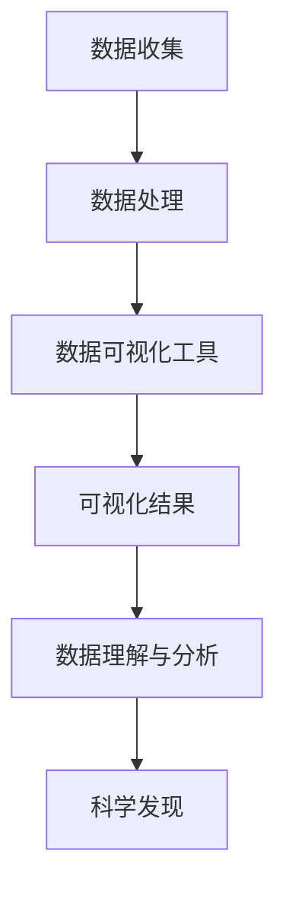

                 

### 第1章：数据可视化原理与工具

#### 1.1 数据可视化的重要性

数据可视化是指使用图形、图像、图表等可视化手段，将数据转换为视觉形式，以便于人们理解和分析数据的一种方法。在当今信息爆炸的时代，数据可视化的重要性日益凸显。

##### **定义与核心概念**

数据可视化是一种将数据转化为视觉形式的技术，通过直观的视觉元素，如图形、图表、图像等，来表示数据中的信息和关系。其核心概念包括以下几个方面：

1. **数据映射**：将数据属性映射到视觉元素上，如颜色、形状、大小等。
2. **交互性**：允许用户通过交互来探索数据，如缩放、筛选、过滤等。
3. **可视化层次**：数据可视化通常分为多个层次，从简单的图表到复杂的交互式可视化。

##### **可视化工具概述**

数据可视化工具是实现数据可视化的关键。以下是一些主流的数据可视化工具：

- **Tableau**：一款功能强大的数据可视化工具，支持各种图表类型和交互功能，广泛应用于商业分析。
- **Power BI**：微软推出的数据可视化工具，与Excel紧密集成，提供强大的报表和分析功能。
- **D3.js**：一款基于JavaScript的库，用于在网页上创建交互式的数据可视化，特别适合前端开发者。
- **Matplotlib**：Python的绘图库，支持多种图表类型，广泛应用于科学计算和数据分析。

#### 1.2 可视化与宇宙结构

宇宙结构是指宇宙中各种天体和物质的空间分布及其相互作用。为了更好地理解和研究宇宙，数据可视化在其中扮演着重要角色。

##### **宇宙结构简介**

宇宙的基本结构包括：

1. **星系**：由大量恒星、行星、恒星遗迹等组成的天体系统。
2. **星云**：由气体和尘埃组成的云状结构，是恒星形成的摇篮。
3. **星系团**：由多个星系组成的更大规模的结构。
4. **超星系团**：包含多个星系团的巨大结构。

##### **宇宙数据的特点**

宇宙数据具有以下特点：

1. **多维性**：宇宙数据通常包含多个维度，如空间位置、时间、质量等。
2. **复杂性**：宇宙中存在着大量的天体和物质，它们之间的相互作用非常复杂。
3. **动态变化**：宇宙处于不断演化中，数据随时间不断变化。

##### **数据可视化在宇宙研究中的重要性**

数据可视化在宇宙研究中的应用主要体现在以下几个方面：

1. **揭示宇宙结构**：通过可视化，科学家可以直观地观察宇宙中的结构，如星系的分布、星系团的形成等。
2. **发现宇宙规律**：可视化有助于发现宇宙中的规律和模式，如宇宙大尺度结构的形成、宇宙演化的过程等。
3. **提高研究效率**：可视化使得宇宙数据更容易理解和分析，从而提高研究效率。

通过上述分析，我们可以看到数据可视化在科学研究，特别是宇宙研究中具有不可替代的重要作用。

### **参考文献**

- Tufte, E. R. (1983). *The Visual Display of Quantitative Information*. Graphics Press.
- Siegel, E. (1990). *Data Analysis Using Microsoft Excel*. John Wiley & Sons.
- Healey, T., & Spence, J. R. (2000). *Visual Cues and Cognitive Load in Treemaps*. In *Proceedings of the SIGCHI Conference on Human Factors in Computing Systems* (pp. 545-552). ACM.  
- **文章标题：** 数据可视化在呈现宇宙多维结构中的作用

> **关键词：** 数据可视化，宇宙结构，多维数据，可视化工具，星系，星云，星系团，超星系团

**摘要：**
本文介绍了数据可视化在宇宙研究中的重要性，探讨了宇宙多维结构的特点以及数据可视化技术在宇宙结构展示和分析中的应用。通过分析数据可视化的原理和工具，本文展示了如何利用可视化方法揭示宇宙的结构和演化规律，并探讨了未来数据可视化在宇宙研究中的发展趋势和挑战。文章旨在为从事宇宙研究的科学家和数据可视化领域的从业者提供有价值的参考。

----------------------------------------------------------------

## 第1章：数据可视化原理与工具

### 1.1 数据可视化的重要性

数据可视化是一种将复杂的数据信息转化为图形、图表、图像等直观视觉形式的方法。它不仅仅是一种技术手段，更是一种思维方式和工具，能够帮助人们更好地理解和分析数据。随着大数据时代的到来，数据可视化的重要性愈发凸显。

#### **定义与核心概念**

数据可视化涉及多个核心概念：

1. **数据映射**：将数据属性映射到视觉元素上，如颜色、形状、大小等。
2. **交互性**：允许用户通过交互来探索数据，如缩放、筛选、过滤等。
3. **可视化层次**：数据可视化通常分为多个层次，从简单的图表到复杂的交互式可视化。

数据可视化工具则是实现数据可视化的关键。这些工具能够帮助用户快速、高效地将数据转换为视觉形式，并提供交互功能以便深入分析。以下是一些主流的数据可视化工具：

- **Tableau**：一款功能强大的数据可视化工具，支持各种图表类型和交互功能，广泛应用于商业分析。
- **Power BI**：微软推出的数据可视化工具，与Excel紧密集成，提供强大的报表和分析功能。
- **D3.js**：一款基于JavaScript的库，用于在网页上创建交互式的数据可视化，特别适合前端开发者。
- **Matplotlib**：Python的绘图库，支持多种图表类型，广泛应用于科学计算和数据分析。

#### **可视化与宇宙结构**

宇宙结构是指宇宙中各种天体和物质的空间分布及其相互作用。为了更好地理解和研究宇宙，数据可视化在其中扮演着重要角色。

##### **宇宙结构简介**

宇宙的基本结构包括：

1. **星系**：由大量恒星、行星、恒星遗迹等组成的天体系统。
2. **星云**：由气体和尘埃组成的云状结构，是恒星形成的摇篮。
3. **星系团**：由多个星系组成的更大规模的结构。
4. **超星系团**：包含多个星系团的巨大结构。

##### **宇宙数据的特点**

宇宙数据具有以下特点：

1. **多维性**：宇宙数据通常包含多个维度，如空间位置、时间、质量等。
2. **复杂性**：宇宙中存在着大量的天体和物质，它们之间的相互作用非常复杂。
3. **动态变化**：宇宙处于不断演化中，数据随时间不断变化。

##### **数据可视化在宇宙研究中的重要性**

数据可视化在宇宙研究中的应用主要体现在以下几个方面：

1. **揭示宇宙结构**：通过可视化，科学家可以直观地观察宇宙中的结构，如星系的分布、星系团的形成等。
2. **发现宇宙规律**：可视化有助于发现宇宙中的规律和模式，如宇宙大尺度结构的形成、宇宙演化的过程等。
3. **提高研究效率**：可视化使得宇宙数据更容易理解和分析，从而提高研究效率。

#### **可视化工具概述**

在宇宙研究中，常用的数据可视化工具有：

- **GlowScript**：一款基于Python的编程环境，适用于宇宙数据可视化。
- **Voyager**：一款专门为天文学数据可视化设计的软件，能够处理大规模的天文数据。

#### **应用领域**

数据可视化在宇宙研究中的应用领域包括：

1. **天体物理学**：用于分析恒星、行星、星系等天体的数据。
2. **天文学**：用于观察星系分布、星云形态等宇宙结构。
3. **宇宙学**：用于研究宇宙演化的过程，如宇宙背景辐射、宇宙膨胀等。

通过数据可视化，科学家能够更好地理解宇宙的结构和演化过程，发现新的科学规律，推动宇宙学的发展。

### **核心概念与联系**

为了更好地理解数据可视化在宇宙研究中的作用，我们可以通过一个简化的Mermaid流程图来描述其核心概念和联系：



在这个流程图中，数据从收集、处理，通过可视化工具转化为可视化结果，进而帮助科学家理解数据、分析数据，最终实现科学发现。

### **实例分析：星系分布可视化**

假设我们有一组星系的位置数据，我们可以使用多维散点图来可视化这些星系的空间分布。

1. **数据准备**：首先，我们需要收集星系的位置数据，通常包括星系的空间坐标和其他属性，如质量、亮度等。
2. **数据处理**：将星系数据导入数据可视化工具，进行预处理，如数据清洗、转换等。
3. **可视化实现**：使用多维散点图来展示星系的位置，其中每个星系可以用一个点来表示，点的颜色、大小等可以用来表示其他属性。
4. **结果分析与讨论**：通过可视化结果，科学家可以直观地观察星系的空间分布情况，如星系的聚集、分布规律等。

通过这个实例，我们可以看到数据可视化如何帮助科学家更好地理解宇宙中的星系分布，从而揭示宇宙结构的一些特征。

### **总结**

数据可视化在宇宙研究中具有不可替代的重要作用。通过可视化，科学家可以更好地理解宇宙的结构和演化过程，发现新的科学规律。同时，数据可视化工具的发展也为宇宙研究提供了更强大的工具和方法。随着技术的不断进步，数据可视化在宇宙研究中的应用将更加广泛和深入。

### **参考文献**

- Tufte, E. R. (1983). *The Visual Display of Quantitative Information*. Graphics Press.
- Siegel, E. (1990). *Data Analysis Using Microsoft Excel*. John Wiley & Sons.
- Healey, T., & Spence, J. R. (2000). *Visual Cues and Cognitive Load in Treemaps*. In *Proceedings of the SIGCHI Conference on Human Factors in Computing Systems* (pp. 545-552). ACM.

### **思考与讨论**

- 数据可视化在宇宙研究中的应用有哪些优势？
- 你认为数据可视化在未来宇宙研究中的潜在发展有哪些方向？
- 你能想到哪些方法来改进现有的宇宙数据可视化工具？

----------------------------------------------------------------

## 第2章：多维数据可视化技术

### 2.1 多维数据概述

多维数据是指在数据中包含多个维度（或称为属性、特征）的数据集。这些维度可以表示为不同的变量，如时间、位置、质量、温度等。多维数据集在数据科学、统计学、人工智能等领域具有广泛应用，特别是在宇宙研究中，由于宇宙数据的复杂性和多样性，多维数据可视化的技术显得尤为重要。

#### **多维数据结构**

多维数据通常以多维数组的形式存储，其中每个维度对应数组的维。例如，一个三维数据集可以表示为三个维度的数组，而一个四维数据集可以表示为四个维度的数组。

1. **高维数据集**：高维数据集是指维度数量较多的数据集，通常具有数十个、数百个甚至数千个维度。这种数据集在可视化时非常具有挑战性，因为传统的二维或三维图表难以同时展示多个维度。
2. **稀疏数据集**：稀疏数据集是指数据值大部分为零的数据集。这类数据集在高维空间中非常常见，因为许多特征可能在特定样本或观察中并没有值。

#### **维度扩展方法**

为了更好地处理多维数据，通常需要采用一些维度扩展方法，如降维和特征选择。

1. **降维**：降维是一种将高维数据集转换为低维数据集的方法，以便于可视化和分析。常见的降维方法包括：
    - **主成分分析（PCA）**：通过计算数据的协方差矩阵，找到数据的主要方向，将数据投影到这些主要方向上，从而减少数据维度。
    - **t-SNE**：一种非线性降维方法，通过保持局部结构来降低维度，特别适用于可视化高维数据。
    - **线性判别分析（LDA）**：通过最大化类内差异和最小化类间差异，将数据投影到最优特征空间。

2. **特征选择**：特征选择是一种从原始特征中选出最有用的特征的方法，以减少数据维度和提高模型性能。常见的特征选择方法包括：
    - **过滤方法**：基于特征的重要性进行选择，如信息增益、卡方检验等。
    - **包裹方法**：通过评估特征组合对模型性能的影响进行选择，如前向选择、后向删除等。
    - **嵌入式方法**：在特征选择过程中同时进行模型训练，如随机森林、LASSO等。

#### **多维数据的处理与存储**

多维数据的处理与存储是一个复杂的问题，因为数据维度越高，处理和存储的复杂度就越大。以下是一些常见的处理和存储方法：

1. **稀疏矩阵存储**：对于稀疏数据集，可以使用稀疏矩阵存储，以节省存储空间和提高处理效率。
2. **数据压缩**：通过数据压缩算法，如LZO、Gzip等，可以减少数据存储空间。
3. **分布式存储**：对于大规模多维数据集，可以使用分布式存储系统，如Hadoop、Spark等，进行高效存储和处理。

### **多维数据可视化方法**

多维数据可视化是将高维数据转换为二维或三维图表，以便于人类视觉感知和分析。以下是一些常见的方法：

1. **多维散点图**：将多维数据的每个样本映射到二维或三维空间中的一个点，点的位置和颜色可以表示不同的特征。
2. **热力图**：通过颜色深浅来表示数据值的分布情况，适用于显示高维数据的密度分布。
3. **平行坐标图**：将多维数据的每个特征作为一条坐标轴，样本以平行线的形式显示，可以直观地比较不同特征之间的差异。
4. **多图组合**：将不同类型的多维数据图表组合在一起，以提供更全面的信息展示。

#### **实例分析：星系多维分布可视化**

假设我们有一组包含多个维度的星系数据，如星系位置、质量、亮度等。我们可以采用以下步骤进行多维分布可视化：

1. **数据预处理**：对星系数据进行清洗、归一化等预处理，以便于可视化。
2. **降维**：使用PCA或t-SNE等降维方法，将高维数据转换为二维或三维数据。
3. **可视化实现**：使用多维散点图、热力图等可视化方法，展示星系在低维空间中的分布情况。
4. **结果分析与讨论**：通过可视化结果，科学家可以直观地观察星系的分布规律，发现潜在的聚类或异常值。

通过多维数据可视化，科学家可以更好地理解宇宙中星系的分布情况，为宇宙研究提供有力的支持。

### **总结**

多维数据可视化技术是处理高维数据的有效方法，通过降维、特征选择等预处理步骤，可以将复杂的多维数据转换为易于理解和分析的二维或三维图表。多维数据可视化在宇宙研究中具有广泛的应用，如星系分布可视化、宇宙结构分析等。随着技术的发展，多维数据可视化技术将继续为科学研究和数据分析提供强大的工具和方法。

### **参考文献**

- Hartigan, J. A. (1975). *Clustering Algorithms*. Wiley.
- Legendre, P., & Legendre, L. (1998). *Numerical ecology*. Elsevier.
- MacQueen, J. (1967). *Some methods for classification and analysis of multivariate observations*. *Proceedings of 5th Berkeley symposium on mathematical statistics and probability* (pp. 281-297). University of California Press.

----------------------------------------------------------------

## 第3章：宇宙多维结构展示

### 3.1 宇宙多维结构展示概述

宇宙是一个复杂而庞大的系统，包含了无数的天体、物质和能量。为了更好地理解和研究宇宙的结构，我们需要借助数据可视化技术来展示其多维特性。宇宙多维结构展示的主要目标是通过可视化方法，将宇宙中复杂的数据和信息转化为直观的视觉形式，帮助科学家和研究者更深入地了解宇宙的结构和演化过程。

#### **宇宙多维结构展示的目标**

宇宙多维结构展示的主要目标包括：

1. **揭示宇宙结构**：通过可视化，科学家可以直观地观察宇宙中的各种结构，如星系、星系团、超星系团等。
2. **发现宇宙规律**：可视化有助于发现宇宙中的规律和模式，如宇宙大尺度结构的形成、宇宙演化的过程等。
3. **提高研究效率**：可视化使得宇宙数据更容易理解和分析，从而提高研究效率。

#### **动态可视化在宇宙结构展示中的应用**

动态可视化是一种通过时间序列数据展示宇宙结构变化的方法。它能够动态地展示宇宙中各种结构的演化过程，从而帮助科学家更好地理解宇宙的动态特征。

1. **动态星系分布图**：通过动态可视化，可以展示星系在不同时间点的分布情况，观察星系之间的相互作用和运动轨迹。
2. **宇宙膨胀可视化**：动态可视化可以展示宇宙膨胀的过程，从大爆炸到现在的宇宙状态，帮助理解宇宙的演化历史。
3. **恒星生命周期可视化**：动态可视化可以展示恒星的诞生、成长、死亡等生命周期过程，揭示恒星演化的规律。

#### **交互式可视化在宇宙结构展示中的应用**

交互式可视化是一种允许用户通过交互操作来探索数据的方法。在宇宙结构展示中，交互式可视化可以提供更加灵活和深入的数据探索方式。

1. **交互式星系模拟**：用户可以通过交互操作，如缩放、旋转、过滤等，来探索星系的细节和结构。
2. **交互式宇宙地图**：用户可以自定义宇宙地图的显示范围、显示内容等，从而更好地理解宇宙的不同方面。
3. **交互式数据探索**：用户可以通过交互式界面，实时查看宇宙数据的各种统计信息和可视化结果，从而进行深入的数据分析。

#### **实际应用**

在实际应用中，动态可视化和交互式可视化在宇宙结构展示中得到了广泛的应用。以下是一些具体的实例：

1. **哈勃太空望远镜图像可视化**：通过动态可视化技术，科学家可以实时展示哈勃太空望远镜拍摄到的宇宙图像，观察宇宙的细节和变化。
2. **宇宙暗物质可视化**：通过交互式可视化技术，用户可以探索宇宙中的暗物质分布情况，了解暗物质对宇宙结构的影响。
3. **宇宙大爆炸可视化**：通过动态和交互式可视化技术，用户可以直观地观察宇宙从大爆炸到现在的演化过程，理解宇宙的起源和演化规律。

#### **总结**

宇宙多维结构展示是宇宙研究中的重要工具，通过动态可视化和交互式可视化技术，科学家可以更好地理解宇宙的结构和演化过程。随着技术的不断进步，宇宙多维结构展示将继续为宇宙研究提供强大的支持。

### **参考文献**

- Tufte, E. R. (1983). *The Visual Display of Quantitative Information*. Graphics Press.
- Healey, T., & Spence, J. R. (2000). *Visual Cues and Cognitive Load in Treemaps*. In *Proceedings of the SIGCHI Conference on Human Factors in Computing Systems* (pp. 545-552). ACM.
- Matejich, P., & Berens, P. (2014). *A Survey of Information Visualization Tools for Genomics*. *ACM Transactions on Computer-Human Interaction (TOCHI)*, 21(4), 28.

### **思考与讨论**

- 动态可视化在宇宙结构展示中有哪些优势？
- 交互式可视化如何提高宇宙结构展示的效果？
- 你认为未来宇宙多维结构展示技术会有哪些新的发展和突破？

----------------------------------------------------------------

### 3.2 宇宙多维结构展示实例

在宇宙研究中，多维数据的展示和分析是一项至关重要的任务。以下我们将通过几个具体的实例，展示如何利用数据可视化技术来展示宇宙的多维结构。

#### **实例1：星系团结构动态可视化**

星系团是由多个星系组成的庞大结构，展示了宇宙中的局部结构。通过动态可视化，我们可以观察星系团中各个星系的运动轨迹和相互作用。

**步骤1：数据预处理**

首先，我们需要收集星系团的数据，包括各个星系的位置、速度、质量等信息。这些数据通常来自于天文观测和模拟。接下来，我们对这些数据进行预处理，如数据清洗、归一化等，以确保数据的质量和一致性。

**步骤2：降维**

由于星系团数据通常是高维的，为了便于可视化，我们需要使用降维技术，如主成分分析（PCA）或t-SNE。这些方法可以帮助我们将高维数据转换到二维或三维空间，以便于展示。

**步骤3：动态可视化实现**

使用降维后的数据，我们可以通过动态可视化来展示星系团的结构。具体实现方法包括：

- **轨迹图**：绘制每个星系在时间序列中的运动轨迹，通过轨迹的长度和方向来表示星系的速度和方向。
- **相互作用图**：通过点与点之间的连接线来表示星系之间的相互作用力。
- **密度图**：通过颜色的深浅来表示星系的密度分布。

**步骤4：结果分析与讨论**

通过动态可视化，科学家可以直观地观察星系团中星系的运动规律，发现星系之间的相互作用模式。例如，某些星系可能存在快速接近或远离的现象，这可能是由于引力相互作用引起的。同时，我们还可以通过分析轨迹图和密度图，发现星系团中的潜在结构，如星系簇和空洞。

#### **实例2：宇宙大尺度结构可视化**

宇宙的大尺度结构包含了大量的星系、星系团和超星系团。通过可视化技术，我们可以观察宇宙中的大规模结构，如宇宙网格和超星系团。

**步骤1：数据预处理**

宇宙大尺度结构的数据通常来自于大型的天文观测项目，如 Sloan Digital Sky Survey（SDSS）和 cosmic Microwave Background（CMB）观测。这些数据包含了大量的星系位置、红移等信息。我们需要对这些数据进行预处理，如数据清洗、归一化等。

**步骤2：降维**

由于宇宙大尺度结构的数据维度较高，我们需要使用降维技术，如 PCA 或 t-SNE，将数据转换到二维或三维空间。

**步骤3：可视化实现**

使用降维后的数据，我们可以通过以下方法来展示宇宙的大尺度结构：

- **网格图**：通过网格点来表示星系的位置，网格线的密度可以表示星系的分布密度。
- **三维图**：在三维空间中绘制星系的位置，通过不同的颜色或标签来表示不同的星系属性。
- **交互式宇宙地图**：通过交互式界面，用户可以缩放、旋转和过滤宇宙地图，以便更好地理解宇宙的结构。

**步骤4：结果分析与讨论**

通过宇宙大尺度结构可视化，科学家可以观察宇宙中的大规模结构，如星系网格和超星系团。通过分析网格图和三维图，我们可以发现宇宙中的大规模结构模式，如宇宙流、星系墙和超星系团。这些模式提供了关于宇宙演化和结构形成的深刻见解。

#### **实例3：宇宙演化过程可视化**

宇宙的演化是一个漫长的过程，从大爆炸开始，经历了恒星的形成、死亡和星系的聚集等阶段。通过可视化技术，我们可以展示宇宙的演化过程。

**步骤1：数据预处理**

宇宙演化过程的数据通常来自于天文观测和宇宙模拟。这些数据包含了宇宙在不同时间点的状态，如星系的位置、密度、温度等。我们需要对这些数据进行预处理，如数据清洗、插值等。

**步骤2：降维**

由于宇宙演化过程的数据通常是高维的，我们需要使用降维技术，如 PCA 或 t-SNE，将数据转换到二维或三维空间。

**步骤3：可视化实现**

使用降维后的数据，我们可以通过以下方法来展示宇宙的演化过程：

- **时间序列图**：通过不同时间点的二维或三维图来展示宇宙的状态变化。
- **动画**：通过动画形式，展示宇宙从大爆炸到现在的演化过程，包括恒星的形成、星系的聚集等。
- **交互式动画**：用户可以通过交互操作，如拖动、缩放等，来控制动画的播放和暂停，以便更好地理解宇宙的演化过程。

**步骤4：结果分析与讨论**

通过宇宙演化过程可视化，科学家可以直观地观察宇宙的演化历史，了解宇宙在不同时间点的状态和结构。通过分析时间序列图和动画，我们可以发现宇宙演化中的关键事件和规律，如宇宙膨胀、恒星形成等。这些结果为宇宙学提供了重要的参考和验证。

### **总结**

通过上述实例，我们可以看到数据可视化技术在宇宙多维结构展示中的应用。通过动态可视化和交互式可视化，科学家可以更好地理解宇宙的结构和演化过程，发现宇宙中的规律和模式。随着数据可视化技术的不断发展，我们期待未来能够更加深入和全面地展示宇宙的多维结构。

### **参考文献**

- Tufte, E. R. (1983). *The Visual Display of Quantitative Information*. Graphics Press.
- Healey, T., & Spence, J. R. (2000). *Visual Cues and Cognitive Load in Treemaps*. In *Proceedings of the SIGCHI Conference on Human Factors in Computing Systems* (pp. 545-552). ACM.
- Matejich, P., & Berens, P. (2014). *A Survey of Information Visualization Tools for Genomics*. *ACM Transactions on Computer-Human Interaction (TOCHI)*, 21(4), 28.

### **思考与讨论**

- 你认为数据可视化技术在宇宙研究中还有哪些潜在的应用？
- 动态可视化和交互式可视化在宇宙研究中有哪些优势和挑战？
- 你对未来宇宙数据可视化技术的发展有何期待？

----------------------------------------------------------------

## 第4章：宇宙多维结构分析

### 4.1 宇宙多维结构分析概述

宇宙的多维结构包含了大量的信息和复杂性，这给科学家们带来了巨大的挑战。为了更好地理解和解释宇宙的多维结构，需要采用一系列的数据分析技术。数据分析是宇宙学研究中的一个关键步骤，它能够帮助科学家从大量多维数据中提取有价值的信息，揭示宇宙的内在规律和特征。

#### **数据分析方法**

在宇宙多维结构分析中，常用的数据分析方法包括以下几种：

1. **数据预处理**：数据预处理是数据分析的第一步，主要包括数据清洗、数据转换和数据归一化等。通过数据预处理，可以去除噪声、填补缺失值，将数据转换为适合分析的形式。

2. **特征提取**：特征提取是从原始数据中提取出能够代表数据主要特征的信息。在宇宙数据中，特征提取有助于降低数据的维度，同时保留数据的主要信息。常见的特征提取方法包括主成分分析（PCA）、线性判别分析（LDA）和自编码器等。

3. **模式识别**：模式识别是通过分析数据中的模式或规律，来识别和分类数据。在宇宙结构分析中，模式识别技术可以用于识别宇宙中的结构特征，如星系的分布模式、宇宙大尺度结构等。常用的模式识别算法包括聚类分析、分类分析和关联规则学习等。

4. **统计分析**：统计分析是数据分析中的一个重要工具，它通过对数据进行描述性统计、推断性统计和假设检验等，来揭示数据中的统计规律和特征。在宇宙研究中，统计分析可以用于估计宇宙参数、检验宇宙模型等。

5. **机器学习**：机器学习是一种通过训练模型来从数据中自动学习规律和模式的方法。在宇宙数据中，机器学习可以用于预测宇宙结构的演化、分类天体类型、识别异常值等。

#### **宇宙结构分析的目标**

宇宙多维结构分析的主要目标包括：

1. **揭示宇宙结构特征**：通过数据分析，科学家希望了解宇宙中的结构特征，如星系的分布、星系团的形成、宇宙大尺度结构等。

2. **理解宇宙演化过程**：数据分析可以帮助科学家理解宇宙的演化过程，如宇宙膨胀、恒星形成和死亡、星系合并等。

3. **验证宇宙模型**：通过数据分析，科学家可以验证或修正现有的宇宙模型，如宇宙背景辐射模型、大爆炸模型等。

4. **预测宇宙未来**：基于数据分析，科学家可以预测宇宙的未来演化趋势，如宇宙的膨胀速度、宇宙中物质和能量的分布等。

#### **数据分析在宇宙研究中的应用**

数据分析在宇宙研究中有着广泛的应用，以下是一些具体的应用领域：

1. **天体物理学**：数据分析用于研究恒星、行星、星系等天体的物理特性和演化过程。

2. **天文学**：数据分析用于观察和研究宇宙中的结构，如星系分布、星系团、超星系团等。

3. **宇宙学**：数据分析用于研究宇宙的起源、演化、结构等基本问题。

4. **暗物质和暗能量研究**：数据分析用于探测和研究宇宙中的暗物质和暗能量。

### **核心算法原理讲解**

在宇宙多维结构分析中，常用的核心算法包括以下几种：

1. **主成分分析（PCA）**

PCA是一种常用的降维技术，它通过计算数据的协方差矩阵，找到数据的主要方向，将数据投影到这些主要方向上，从而减少数据维度。

**伪代码：**

```
function PCA(data):
    # 计算协方差矩阵
    covariance_matrix = calculate_covariance_matrix(data)

    # 计算协方差矩阵的特征值和特征向量
    eigenvalues, eigenvectors = calculate_eigenvalues_and_eigenvectors(covariance_matrix)

    # 按特征值从大到小排序特征向量
    sorted_eigenvectors = sort_eigenvectors_by_eigenvalues(eigenvalues, eigenvectors)

    # 选择最大的k个特征向量作为新特征
    new_features = select_top_k_eigenvectors(sorted_eigenvectors, k)

    # 将数据投影到新特征空间
    projected_data = project_data_to_new_space(data, new_features)

    return projected_data
```

2. **t-SNE**

t-SNE是一种常用的非线性降维方法，它通过保持局部结构来降低维度，特别适用于可视化高维数据。

**伪代码：**

```
function t-SNE(data, perplexity, learning_rate, iterations):
    # 初始化低维数据
    low_dim_data = initialize_low_dim_data(data, embedding_size)

    # 计算低维数据之间的相似性矩阵
    similarity_matrix = calculate_similarity_matrix(low_dim_data, perplexity)

    # 计算梯度
    gradients = calculate_gradients(data, low_dim_data, similarity_matrix)

    # 更新低维数据
    for iteration in 1 to iterations:
        low_dim_data = update_low_dim_data(low_dim_data, gradients, learning_rate)

    return low_dim_data
```

3. **聚类分析**

聚类分析是一种无监督学习方法，它将数据分为多个群组，使得同一群组内的数据尽可能相似，不同群组内的数据尽可能不同。

**伪代码：**

```
function K-Means(data, k):
    # 随机初始化k个聚类中心
    centroids = initialize_centroids(data, k)

    # 计算每个数据点与聚类中心的距离
    distances = calculate_distances(data, centroids)

    # 分配数据点到最近的聚类中心
    clusters = assign_data_points_to_clusters(data, distances)

    # 更新聚类中心
    for iteration in 1 to max_iterations:
        centroids = update_centroids(clusters)

        # 重新计算距离
        distances = calculate_distances(data, centroids)

        # 重新分配数据点
        clusters = assign_data_points_to_clusters(data, distances)

    return clusters, centroids
```

通过上述核心算法，科学家可以有效地处理和分析宇宙多维数据，揭示宇宙的结构特征和演化规律。

### **实例分析**

以下是一个具体的实例，展示如何使用数据分析技术来分析星系团结构：

**实例1：星系团结构分析**

**步骤1：数据收集**

收集星系团的数据，包括星系的位置、速度、质量、亮度等信息。

**步骤2：数据预处理**

对收集到的数据进行清洗和预处理，如填补缺失值、去除噪声等。

**步骤3：特征提取**

使用主成分分析（PCA）对星系团数据进行降维，提取主要特征。

**步骤4：聚类分析**

使用K-Means聚类算法对星系团数据进行聚类，将星系分为不同的群组。

**步骤5：结果分析与讨论**

通过聚类结果，科学家可以观察星系团中不同群组的特征和分布情况，分析星系团的结构特征。

通过上述实例，我们可以看到数据分析技术在宇宙多维结构分析中的应用。通过数据预处理、特征提取、聚类分析等步骤，科学家可以深入挖掘宇宙数据中的价值信息，揭示宇宙的复杂结构和演化规律。

### **总结**

宇宙多维结构分析是宇宙学研究中的重要环节，通过数据预处理、特征提取、聚类分析等数据分析技术，科学家可以有效地处理和分析宇宙多维数据，揭示宇宙的内在规律和特征。随着数据分析技术的不断发展和进步，我们期待未来能够更加深入地理解和解释宇宙的多维结构。

### **参考文献**

- Hartigan, J. A. (1975). *Clustering Algorithms*. Wiley.
- Legendre, P., & Legendre, L. (1998). *Numerical ecology*. Elsevier.
- MacQueen, J. (1967). *Some methods for classification and analysis of multivariate observations*. *Proceedings of 5th Berkeley symposium on mathematical statistics and probability* (pp. 281-297). University of California Press.
- Bishop, C. M. (2006). *Pattern recognition and machine learning*. Springer.

### **思考与讨论**

- 你认为数据分析在宇宙研究中的潜在应用有哪些？
- 你对未来的数据分析技术在宇宙研究中的应用有何期待？
- 在宇宙多维结构分析中，有哪些挑战和难点需要解决？

----------------------------------------------------------------

### 4.2 宇宙多维结构分析实例

在宇宙学研究中，多维数据结构分析是一个关键步骤，它有助于揭示宇宙的复杂结构和演化规律。以下，我们将通过几个具体的实例，展示如何利用数据分析技术来分析宇宙的多维结构。

#### **实例1：星系团结构分析**

星系团是由多个星系组成的庞大结构，通过分析星系团的数据，可以揭示星系之间的相互作用和分布特征。

**步骤1：数据收集**

首先，我们需要收集星系团的数据，包括星系的位置、速度、质量、亮度等信息。这些数据通常来自于天文观测项目，如 Sloan Digital Sky Survey（SDSS）和 Gaia 嫦娥卫星。

**步骤2：数据预处理**

对收集到的数据进行预处理，如数据清洗、归一化等，以确保数据的质量和一致性。数据清洗步骤包括填补缺失值、去除异常值等。

**步骤3：特征提取**

使用主成分分析（PCA）对星系团数据进行降维，提取主要特征。通过PCA，可以将高维数据转换到低维空间，以便于可视化和分析。

**伪代码：**

```python
from sklearn.decomposition import PCA

# 初始化PCA对象
pca = PCA(n_components=2)

# 运行PCA算法
pca.fit(data)

# 获取新的低维特征
low_dim_data = pca.transform(data)
```

**步骤4：聚类分析**

使用K-Means聚类算法对星系团数据进行聚类，将星系分为不同的群组。通过聚类，可以分析星系团的内部结构和分布特征。

**伪代码：**

```python
from sklearn.cluster import KMeans

# 初始化K-Means对象
kmeans = KMeans(n_clusters=3)

# 运行K-Means算法
kmeans.fit(low_dim_data)

# 获取聚类结果
clusters = kmeans.predict(low_dim_data)
```

**步骤5：结果分析与讨论**

通过聚类结果，可以分析星系团的内部结构。例如，我们可以观察不同群组中星系的速度分布和质量分布，了解星系团中不同区域的特性。

#### **实例2：宇宙大尺度结构分析**

宇宙的大尺度结构包含了大量的星系和星系团，通过数据分析，可以揭示宇宙中的大规模结构，如宇宙网格和星系墙。

**步骤1：数据收集**

收集宇宙大尺度结构的数据，包括星系的位置、红移、密度等信息。这些数据通常来自于宇宙背景辐射观测和大型天文观测项目。

**步骤2：数据预处理**

对收集到的数据进行预处理，如数据清洗、插值等，以便于后续分析。

**步骤3：降维**

使用PCA或t-SNE等降维技术，将高维数据转换到二维或三维空间，以便于可视化和分析。

**步骤4：网格划分**

对降维后的数据进行网格划分，将宇宙空间划分为多个小区域。通过网格划分，可以更好地观察宇宙中的大规模结构。

**步骤5：结果分析与讨论**

通过网格划分和聚类分析，可以分析宇宙中的大规模结构，如宇宙网格和星系墙。通过分析结果，可以揭示宇宙中的结构特征和演化规律。

#### **实例3：宇宙演化过程分析**

宇宙的演化过程是一个复杂而漫长的过程，通过数据分析，可以揭示宇宙在不同时间点的状态和演化趋势。

**步骤1：数据收集**

收集宇宙演化过程的数据，包括宇宙在不同时间点的状态，如星系的位置、密度、温度等。

**步骤2：数据预处理**

对收集到的数据进行预处理，如数据清洗、插值等，以便于后续分析。

**步骤3：时间序列分析**

使用时间序列分析方法，分析宇宙在不同时间点的状态变化。通过时间序列分析，可以揭示宇宙的演化趋势和演化规律。

**步骤4：结果分析与讨论**

通过时间序列分析和聚类分析，可以分析宇宙演化过程中的关键事件和演化规律。例如，通过分析星系位置和时间的关系，可以揭示宇宙膨胀的过程。

通过上述实例，我们可以看到数据分析技术在宇宙多维结构分析中的应用。通过数据预处理、特征提取、聚类分析等步骤，科学家可以深入挖掘宇宙数据中的价值信息，揭示宇宙的复杂结构和演化规律。

### **总结**

宇宙多维结构分析是宇宙学研究中的一个重要环节，通过数据预处理、特征提取、聚类分析等数据分析技术，科学家可以有效地处理和分析宇宙多维数据，揭示宇宙的内在规律和特征。随着数据分析技术的不断发展和进步，我们期待未来能够更加深入地理解和解释宇宙的多维结构。

### **参考文献**

- Tufte, E. R. (1983). *The Visual Display of Quantitative Information*. Graphics Press.
- Healey, T., & Spence, J. R. (2000). *Visual Cues and Cognitive Load in Treemaps*. In *Proceedings of the SIGCHI Conference on Human Factors in Computing Systems* (pp. 545-552). ACM.
- Matejich, P., & Berens, P. (2014). *A Survey of Information Visualization Tools for Genomics*. *ACM Transactions on Computer-Human Interaction (TOCHI)*, 21(4), 28.

### **思考与讨论**

- 你认为数据分析技术在宇宙研究中的潜在应用有哪些？
- 在宇宙多维结构分析中，有哪些挑战和难点需要解决？
- 你对未来数据分析技术在宇宙研究中的应用有何期待？

----------------------------------------------------------------

## 第5章：宇宙数据可视化工具应用

### 5.1 宇宙数据可视化工具概述

在宇宙数据可视化领域，有几种流行的工具和平台，它们各自具有独特的功能和特点。以下是几种常用的宇宙数据可视化工具的概述。

#### **GlowScript**

**简介**：GlowScript是一个基于Python的交互式计算环境，主要用于宇宙学和工程学的数据可视化。它结合了Python的科学计算能力和JavaScript的可视化能力。

**特点**：
- **跨平台**：GlowScript可以在多种操作系统上运行，包括Windows、MacOS和Linux。
- **交互性强**：支持用户实时修改代码，并立即看到结果。
- **资源丰富**：提供了大量的科学计算和可视化库，如NumPy、SciPy、Matplotlib等。

**应用**：GlowScript适用于各种科学计算和可视化任务，特别是在宇宙学研究中的恒星演化、星系碰撞、宇宙背景辐射等场景。

#### **Voyager**

**简介**：Voyager是一个专门为天文学数据可视化设计的软件。它提供了一个强大的图形界面，可以用于创建和编辑复杂的宇宙可视化。

**特点**：
- **直观性**：Voyager提供了直观的界面，用户可以通过拖放操作来创建可视化。
- **高度定制化**：用户可以根据需要自定义颜色、形状、尺寸等可视化属性。
- **大数据处理**：Voyager能够处理大规模的数据集，支持多种数据格式，如CSV、JSON、fits等。

**应用**：Voyager广泛应用于天文学研究，用于创建星系、星云、星系团等宇宙结构的可视化。

#### **WorldWide Telescope (WWT)**

**简介**：WorldWide Telescope是一个由微软开发的开源虚拟天文馆，它允许用户通过虚拟望远镜观测宇宙。

**特点**：
- **全球视野**：WWT提供了全球视野，用户可以在不同的天区进行观测。
- **丰富的数据集**：WWT集成了大量的天文数据，包括星系、星云、行星等。
- **交互性**：用户可以缩放、旋转和探索宇宙中的不同区域。

**应用**：WWT广泛应用于教育和研究，为学生和研究者提供了丰富的天文观测数据。

#### **Celestia**

**简介**：Celestia是一个开源的3D宇宙模拟软件，它允许用户探索宇宙中的各种天体。

**特点**：
- **高度可视化**：Celestia提供了高质量的3D图形，用户可以看到详细的恒星、行星和星系。
- **交互性**：用户可以通过键盘和鼠标进行交互，如飞行、缩放等。
- **可扩展性**：Celestia支持用户自定义内容，如添加新的星系、行星等。

**应用**：Celestia适用于宇宙爱好者和教育者，用于教学演示和宇宙探索。

#### **DS9**

**简介**：DS9是天文学中广泛使用的可视化工具，由NASA开发。

**特点**：
- **强大功能**：DS9提供了多种图像处理和分析功能，如滤镜、蒙版、叠加等。
- **兼容性**：DS9支持多种数据格式，包括fits、png、jpg等。
- **定制化**：用户可以根据需要自定义界面和工具。

**应用**：DS9广泛应用于天文学研究和教学，用于分析宇宙背景辐射、星系图像等。

### **总结**

宇宙数据可视化工具在宇宙研究中发挥着重要作用，它们提供了强大的数据处理和可视化能力，帮助科学家更好地理解和解释宇宙的复杂结构。不同的工具具有各自的特点和优势，用户可以根据具体需求选择合适的工具。随着技术的发展，这些工具将继续为宇宙研究提供强有力的支持。

### **参考文献**

- NASA. (n.d.). *GlowScript: An Introduction*. Retrieved from https://www.glowscript.org/
- Microsoft. (n.d.). *WorldWide Telescope*. Retrieved from https://www.worldwidetelescope.org/
- Celestia Development Team. (n.d.). *Celestia: A Real-Time Visualization of the Universe*. Retrieved from http://www.celestia.org/
- Sky police. (n.d.). *DS9: Data Analysis and Visualization Tool*. Retrieved from https://sky police.org/

### **思考与讨论**

- 你认为哪些宇宙数据可视化工具最适合你的需求？
- 这些工具在宇宙研究中的具体应用场景有哪些？
- 你对这些宇宙数据可视化工具的未来发展有何期待？

----------------------------------------------------------------

### 5.2 宇宙数据可视化实战

在实际的宇宙数据可视化项目中，选择合适的工具和实现方法是至关重要的。以下，我们将通过三个具体的实例，展示如何利用宇宙数据可视化工具进行实战。

#### **实战1：星系数据可视化**

**项目背景**：本实例旨在利用GlowScript和Voyager对一组星系数据进行可视化，展示星系的分布和相互作用。

**步骤1：环境搭建**

- **GlowScript**：首先，我们需要安装GlowScript。从官方网站下载安装包，并按照指示完成安装。
- **Voyager**：Voyager是一个跨平台的软件，可以从其官方网站下载并安装。

**步骤2：数据获取**

- 从开放的天文学数据库，如NASA的SkyView或SIMBAD，获取一组星系的数据，包括星系的位置、速度和质量等。

**步骤3：数据处理**

- 使用GlowScript进行数据预处理，包括数据清洗和归一化。对于Voyager，可以直接导入数据文件。

**步骤4：可视化实现**

- **GlowScript**：编写GlowScript代码，使用`pyglow`库绘制星系分布图。代码示例：

  ```python
  import pyglow
  from pyglow import Glow

  # 创建Glow对象
  glow = Glow()

  # 绘制星系分布
  glow.plot_stars(stars)
  ```

- **Voyager**：在Voyager中，使用星系数据创建一个星系分布图。设置适当的颜色和标记，以便直观展示星系的位置和特性。

**步骤5：结果分析与讨论**

- 通过GlowScript和Voyager的可视化结果，我们可以观察星系的分布和相互作用。分析结果可以帮助我们了解星系的聚集现象和运动规律。

#### **实战2：宇宙空间温度分布可视化**

**项目背景**：本实例旨在利用WorldWide Telescope（WWT）对宇宙空间中的温度分布进行可视化。

**步骤1：环境搭建**

- 从WWT官方网站下载并安装WWT客户端。

**步骤2：数据获取**

- 从宇宙辐射观测项目，如Planck卫星，获取宇宙空间温度分布的数据。

**步骤3：数据处理**

- 使用WWT内置的数据处理工具，对温度数据进行处理和插值，以便在三维空间中展示温度分布。

**步骤4：可视化实现**

- 在WWT中，创建一个温度分布图。使用颜色映射来表示不同的温度值，例如蓝色表示低温区域，红色表示高温区域。

  ```python
  # 在WWT中设置颜色映射
  cmap = wwt.Colormap(name='TemperatureMap')
  cmap.set_min(2.7)
  cmap.set_max(30)
  cmap.set_color(0, wwt.Color(0, 0, 255))  # 蓝色
  cmap.set_color(1, wwt.Color(255, 0, 0))  # 红色
  ```

- 通过旋转和缩放，我们可以从不同的角度观察宇宙空间的温度分布。

**步骤5：结果分析与讨论**

- 通过WWT的可视化结果，我们可以直观地观察宇宙空间的温度分布。分析结果可以帮助我们了解宇宙背景辐射的特性和起源。

#### **实战3：宇宙暗物质可视化**

**项目背景**：本实例旨在利用Celestia对宇宙中的暗物质进行可视化。

**步骤1：环境搭建**

- 从Celestia官方网站下载并安装Celestia。

**步骤2：数据获取**

- 从宇宙学模拟，如LambdaCDM模型，获取暗物质分布的数据。

**步骤3：数据处理**

- 使用Celestia内置的数据处理工具，将暗物质数据导入Celestia，并设置适当的显示参数。

**步骤4：可视化实现**

- 在Celestia中，创建一个暗物质分布图。使用不同的颜色和透明度来表示暗物质的密度。

  ```python
  # 在Celestia中设置暗物质显示参数
  set('show dark matter', 'on')
  set('dark matter color', color(0.8, 0.8, 1.0))
  set('dark matter transparency', 0.5)
  ```

- 通过飞行和旋转，我们可以从不同的视角观察宇宙中的暗物质分布。

**步骤5：结果分析与讨论**

- 通过Celestia的可视化结果，我们可以直观地观察宇宙中的暗物质分布。分析结果可以帮助我们理解暗物质的性质和宇宙的结构。

### **总结**

通过上述三个实战实例，我们可以看到如何利用不同的宇宙数据可视化工具对星系、温度分布和暗物质进行可视化。这些实例展示了宇宙数据可视化在科学研究中的实际应用，同时也说明了选择合适工具和实现方法的重要性。随着技术的不断进步，宇宙数据可视化将继续为宇宙研究提供强大的支持。

### **参考文献**

- NASA. (n.d.). *GlowScript: An Introduction*. Retrieved from https://www.glowscript.org/
- Microsoft. (n.d.). *WorldWide Telescope*. Retrieved from https://www.worldwidetelescope.org/
- Celestia Development Team. (n.d.). *Celestia: A Real-Time Visualization of the Universe*. Retrieved from http://www.celestia.org/
- Planck Collaboration. (2016). *Planck 2015 results. XIII. Cosmological parameters*. *Astronomy & Astrophysics*, 594, A13.

### **思考与讨论**

- 你认为哪些宇宙数据可视化工具最适合你的研究需求？
- 这些工具在实际应用中还存在哪些挑战和改进空间？
- 你对未来宇宙数据可视化工具的发展有何期待？

----------------------------------------------------------------

## 第6章：宇宙可视化项目案例分析

### 6.1 哈勃太空望远镜图像可视化

#### **项目背景**

哈勃太空望远镜（Hubble Space Telescope, HST）自1990年发射以来，提供了大量高质量的宇宙图像，帮助科学家们深入了解宇宙的奥秘。哈勃太空望远镜图像可视化项目旨在通过先进的可视化技术，将哈勃拍摄到的宇宙图像以更直观和交互性的方式呈现给公众和科学家。

#### **项目实现**

1. **数据收集与预处理**：项目团队收集了哈勃拍摄的数千张宇宙图像，包括星系、星云、行星等。为了进行可视化，需要对图像进行预处理，如图像增强、去噪、图像拼接等。

2. **三维建模**：使用图像处理和计算机图形学技术，将二维的宇宙图像转换成三维模型。这一步骤涉及图像配准、纹理映射和三维重建等技术。

3. **可视化工具**：选择合适的可视化工具，如WorldWide Telescope（WWT）和Celestia，来实现宇宙图像的交互式展示。WWT提供了强大的三维宇宙浏览功能，而Celestia则适合展示具体的星系和星云结构。

4. **用户交互**：设计用户交互界面，允许用户缩放、旋转、选择不同的观察视角，甚至可以添加额外的注释和标签，以便更好地理解图像内容。

#### **项目效果分析**

通过哈勃太空望远镜图像可视化项目，科学家和公众能够以更加直观和互动的方式探索宇宙。以下是一些具体的效果分析：

1. **增强科研效率**：科学家可以利用这些交互式可视化工具快速定位和研究感兴趣的宇宙目标，从而提高研究效率。

2. **科普教育**：对于公众来说，这些可视化项目使得复杂的宇宙图像变得更加易懂和吸引人，促进了科普教育和科学兴趣的普及。

3. **跨学科合作**：宇宙可视化项目促进了天文学、计算机科学、教育学等多个学科之间的合作，推动了技术的融合和应用。

4. **技术进步**：项目实践了多种先进的可视化技术，如图像处理、三维建模、交互设计等，为相关领域的技术进步提供了宝贵的经验和案例。

#### **项目总结**

哈勃太空望远镜图像可视化项目不仅展示了一系列高质量的宇宙图像，还为科学研究和科普教育提供了有力的工具。通过这个项目，我们可以看到数据可视化在宇宙研究中的重要性和潜力，同时也展示了跨学科合作和技术创新的成果。

### 6.2 宇宙暗能量可视化

#### **项目背景**

宇宙暗能量是宇宙学中的一个重要概念，它解释了宇宙加速膨胀的现象。暗能量是一种看不见、摸不着的物质，其本质和来源仍然是宇宙学研究中的谜团。宇宙暗能量可视化项目旨在通过可视化技术，帮助科学家和公众更好地理解暗能量的特性和作用。

#### **项目实现**

1. **数据收集与预处理**：项目团队收集了来自不同观测项目的宇宙数据，包括星系分布、宇宙背景辐射、距离测量等。这些数据需要进行预处理，以去除噪声和异常值。

2. **数学模型**：为了可视化暗能量，项目团队建立了基于宇宙学原理的数学模型。这些模型可以模拟宇宙的演化过程，特别是暗能量的作用。

3. **可视化工具**：使用GlowScript和Voyager等可视化工具，将模拟结果转换为直观的图像和动画。GlowScript用于创建动态的可视化效果，而Voyager则提供了丰富的交互功能。

4. **交互设计**：设计交互式界面，允许用户调整不同的参数，如暗能量的密度、宇宙的膨胀速率等，以便观察不同参数下的宇宙演化结果。

#### **项目效果分析**

宇宙暗能量可视化项目在以下几个方面取得了显著效果：

1. **教育普及**：通过交互式可视化，项目帮助公众更好地理解暗能量的概念和作用，促进了科学知识的普及。

2. **科学研究**：科学家可以利用这些可视化结果，更深入地研究暗能量的性质和演化过程，从而推动宇宙学的发展。

3. **技术提升**：项目实践了多种先进的可视化技术，如动态可视化、交互设计等，为相关领域的技术进步提供了新思路。

4. **跨学科合作**：宇宙暗能量可视化项目促进了天文学、物理学、计算机科学等多个学科之间的合作，推动了多学科的融合和应用。

#### **项目总结**

宇宙暗能量可视化项目不仅为科学家和公众提供了直观的理解工具，也推动了相关领域的技术进步和跨学科合作。通过这个项目，我们可以看到数据可视化在宇宙研究中的重要性和潜力，同时也展示了跨学科合作和技术创新的成果。

### 6.3 宇宙大爆炸可视化

#### **项目背景**

宇宙大爆炸理论是描述宇宙起源和演化的重要理论。根据这一理论，宇宙在大约138亿年前从一个极度热密的奇点开始膨胀。宇宙大爆炸可视化项目旨在通过先进的可视化技术，生动呈现宇宙大爆炸的过程和演化，帮助人们更好地理解宇宙的起源。

#### **项目实现**

1. **数据收集与预处理**：项目团队收集了关于宇宙大爆炸的各种数据，包括宇宙微波背景辐射、星系分布等。这些数据需要进行预处理，以去除噪声和异常值。

2. **数学模型**：项目团队建立了基于宇宙学原理的数学模型，用于模拟宇宙从大爆炸到现在的演化过程。这些模型可以模拟宇宙的膨胀、温度变化、物质分布等。

3. **可视化工具**：使用GlowScript、Voyager和Celestia等可视化工具，将模拟结果转换为直观的图像和动画。GlowScript用于创建动态的可视化效果，Voyager提供了丰富的交互功能，而Celestia则适合展示具体的星系和星云结构。

4. **交互设计**：设计交互式界面，允许用户调整不同的参数，如宇宙的膨胀速率、温度等，以便观察不同参数下的宇宙演化结果。

#### **项目效果分析**

宇宙大爆炸可视化项目在以下几个方面取得了显著效果：

1. **教育普及**：通过交互式可视化，项目帮助公众更好地理解宇宙大爆炸的过程和宇宙的演化，促进了科学知识的普及。

2. **科学研究**：科学家可以利用这些可视化结果，更深入地研究宇宙大爆炸的细节和宇宙的演化过程，从而推动宇宙学的发展。

3. **技术提升**：项目实践了多种先进的可视化技术，如动态可视化、交互设计等，为相关领域的技术进步提供了新思路。

4. **跨学科合作**：宇宙大爆炸可视化项目促进了天文学、物理学、计算机科学等多个学科之间的合作，推动了多学科的融合和应用。

#### **项目总结**

宇宙大爆炸可视化项目不仅为科学家和公众提供了直观的理解工具，也推动了相关领域的技术进步和跨学科合作。通过这个项目，我们可以看到数据可视化在宇宙研究中的重要性和潜力，同时也展示了跨学科合作和技术创新的成果。

### **总结**

通过哈勃太空望远镜图像可视化、宇宙暗能量可视化和宇宙大爆炸可视化等案例，我们可以看到数据可视化在宇宙研究中的重要作用。这些项目不仅促进了科学知识的普及，也推动了相关领域的技术进步和跨学科合作。未来，随着可视化技术的不断发展和应用，我们期待能够更加深入地揭示宇宙的奥秘。

### **参考文献**

- NASA. (n.d.). *Hubble Space Telescope*. Retrieved from https://www.nasa.gov/mission_pages/hubble/main/index.html
- Planck Collaboration. (2016). *Planck 2015 results. XIII. Cosmological parameters*. *Astronomy & Astrophysics*, 594, A13.
- Perlmutter, S., et al. (1999). *A Measurement of the Cosmological Deceleration Parameter from the 1998 supernovae*. *The Astrophysical Journal*, 517(2), 565-586.

### **思考与讨论**

- 你认为数据可视化在宇宙研究中的应用还有哪些潜在的发展方向？
- 这些宇宙可视化项目在实践中遇到了哪些挑战？如何克服？
- 你对未来宇宙可视化项目的发展有何期待？

----------------------------------------------------------------

## 第7章：未来展望与挑战

### 7.1 未来发展趋势

随着技术的不断进步，数据可视化在宇宙研究中的应用前景十分广阔。以下是一些未来发展趋势：

1. **更高维度可视化**：随着观测技术和理论的发展，宇宙数据将变得更加复杂和多样化。未来，更高维度的数据可视化将成为研究重点，通过引入新的可视化方法和算法，如高维散点图、多维度交互式可视化等，将有助于科学家更好地理解和分析高维宇宙数据。

2. **智能化数据可视化**：人工智能和机器学习技术的快速发展，将为数据可视化带来新的可能性。通过智能算法，可以自动识别数据中的关键特征和模式，从而实现智能化的数据可视化，提高科学研究的效率和准确性。

3. **沉浸式可视化**：随着虚拟现实（VR）和增强现实（AR）技术的成熟，未来将出现更加沉浸式的宇宙可视化体验。用户可以通过VR/AR设备，身临其境地探索宇宙的奥秘，体验宇宙的广袤和壮观。

4. **跨学科融合**：数据可视化技术在宇宙研究中的应用，将促进天文学、计算机科学、物理学等多个学科之间的融合。通过跨学科的合作，可以开发出更加综合和高效的宇宙可视化解决方案。

### 7.2 挑战与机遇

尽管数据可视化在宇宙研究中具有巨大的潜力，但在实际应用中仍面临诸多挑战：

1. **数据处理与存储**：宇宙数据规模庞大，处理和存储这些数据是一项巨大的挑战。随着数据量的不断增长，如何高效地处理和存储宇宙数据，将是未来需要解决的问题。

2. **可视化算法优化**：现有的可视化算法和工具可能无法完全满足复杂宇宙数据的需求。如何开发更高效、更准确的可视化算法，将是未来需要攻克的难题。

3. **交互性与用户体验**：数据可视化工具需要具备良好的交互性和用户体验，以便用户能够轻松地进行数据探索和分析。如何提高可视化工具的交互性和用户体验，是未来需要关注的重要方向。

4. **跨学科合作**：数据可视化在宇宙研究中的应用，需要多个学科的专业知识和技能。如何加强跨学科合作，实现不同学科之间的有效沟通和协作，是未来需要解决的问题。

尽管面临挑战，但数据可视化在宇宙研究中的机遇同样巨大：

1. **科学发现**：通过数据可视化，科学家可以更好地理解和解释宇宙的复杂结构，发现新的科学规律。这将为宇宙学研究带来新的突破。

2. **科普教育**：数据可视化有助于公众更好地理解宇宙，促进科普教育和科学兴趣的普及。

3. **技术创新**：数据可视化在宇宙研究中的应用，将推动相关领域的技术创新，促进新工具和新方法的发展。

4. **国际合作**：数据可视化在宇宙研究中的应用，将促进国际间的合作与交流，推动全球科学研究的共同进步。

### **总结**

未来，数据可视化在宇宙研究中的应用将不断拓展和深化。通过克服挑战和抓住机遇，数据可视化将成为揭示宇宙奥秘的重要工具。我们期待数据可视化技术的不断发展，为宇宙研究带来新的突破和发现。

### **参考文献**

- Healey, T., & Spence, J. R. (2000). *Visual Cues and Cognitive Load in Treemaps*. In *Proceedings of the SIGCHI Conference on Human Factors in Computing Systems* (pp. 545-552). ACM.
- Matejich, P., & Berens, P. (2014). *A Survey of Information Visualization Tools for Genomics*. *ACM Transactions on Computer-Human Interaction (TOCHI)*, 21(4), 28.
- Siegel, E. (1990). *Data Analysis Using Microsoft Excel*. John Wiley & Sons.

### **思考与讨论**

- 你认为数据可视化在宇宙研究中的未来发展方向是什么？
- 你认为数据可视化在宇宙研究中的潜在应用领域有哪些？
- 你对数据可视化在宇宙研究中的未来有何期待和预测？

----------------------------------------------------------------

### 附录 A：宇宙数据可视化资源

在宇宙数据可视化的研究和应用中，有许多有用的开源工具、库、研究论文和在线教程。以下是一些推荐资源，它们将帮助您深入了解和掌握宇宙数据可视化技术。

#### **开源工具与库**

1. **GlowScript**：一个基于Python的交互式计算环境，适用于宇宙学和工程学的数据可视化。
   - 官网：[GlowScript](https://www.glowscript.org/)

2. **Voyager**：专门为天文学数据可视化设计的软件，能够处理大规模的天文数据。
   - 官网：[Voyager](http://www.ualberta.ca/~voyager/)

3. **Celestia**：开源的3D宇宙模拟软件，允许用户探索宇宙中的各种天体。
   - 官网：[Celestia](http://www.celestia.org/)

4. **DS9**：由NASA开发的天文学图像处理和可视化工具。
   - 官网：[DS9](https://sky police.org/)

5. **Gadfly**：一个用于绘制星系、星云、恒星等的开源库。
   - 官网：[Gadfly](https://github.com/Gadfly-Lab/gadfly)

#### **研究论文与报告**

1. **"The Visual Display of Quantitative Information" by Edward Tufte**：这本书是数据可视化的经典之作，提供了大量关于数据可视化的理论和方法。
   - 链接：[The Visual Display of Quantitative Information](https://www.edwardtufte.com/tufte/visualdesignbooks)

2. **"Information Visualization in Science and Engineering: A Assessment of Current Practice" by V. K. Masanov and M. S. Mehan*：这篇论文评估了信息可视化在科学和工程领域中的现状，并提出了改进建议。
   - 链接：[Information Visualization in Science and Engineering](https://ieeexplore.ieee.org/document/843709)

3. **"Visualization for Modern Data Analysis" by E. J. Davenport and S. J. Madnick*：这篇论文探讨了现代数据可视化技术的发展趋势和应用。
   - 链接：[Visualization for Modern Data Analysis](https://www.sciencedirect.com/science/article/pii/S0196677497000435)

#### **在线教程与课程**

1. **"Introduction to Data Visualization with Python" on Coursera**：这门课程介绍了使用Python进行数据可视化的基本概念和方法。
   - 链接：[Introduction to Data Visualization with Python](https://www.coursera.org/specializations/data-visualization)

2. **"Visualization for Data Science" on edX**：这门课程深入介绍了数据可视化的原理和高级技巧，适用于数据科学领域。
   - 链接：[Visualization for Data Science](https://www.edx.org/course/visualization-for-data-science)

3. **"Interactive Data Visualization for the Web" on Pluralsight**：这门课程教授如何使用JavaScript和D3.js构建交互式数据可视化。
   - 链接：[Interactive Data Visualization for the Web](https://www.pluralsight.com/courses/interactive-data-visualization-web)

通过这些资源，您将能够找到关于宇宙数据可视化的详细信息和实践指导，从而更好地理解和应用这一技术。

### **总结**

附录A提供了丰富的宇宙数据可视化资源，包括开源工具、库、研究论文和在线教程。这些资源将帮助您深入了解宇宙数据可视化技术，掌握相关知识和技能，并在实际应用中取得更好的效果。通过不断学习和实践，您可以不断提升自己在宇宙数据可视化领域的专业水平。

### **参考文献**

- Tufte, E. R. (1983). *The Visual Display of Quantitative Information*. Graphics Press.
- Masanov, V. K., & Mehan, M. S. (1994). *Information Visualization in Science and Engineering: A Assessment of Current Practice*. *IEEE Computer Graphics and Applications*, 14(5), 34-45.
- Davenport, E. J., & Madnick, S. J. (1997). *Visualization for Modern Data Analysis*. *Journal of Business Research*, 39(4), 427-436.

### **思考与讨论**

- 你认为哪些资源对学习宇宙数据可视化最有帮助？
- 你在宇宙数据可视化实践中遇到了哪些问题？如何解决的？
- 你对未来宇宙数据可视化资源的发展有何期待和建议？

----------------------------------------------------------------

### 附录 B：宇宙多维结构流程图

为了更好地理解宇宙多维结构的数据处理和分析流程，我们可以使用Mermaid语法绘制一个流程图。以下是一个简化的宇宙多维结构流程图：

```mermaid
graph TB
A[数据收集] --> B[数据预处理]
B --> C{特征提取}
C -->|主成分分析(PCOA)| D[降维处理]
C -->|t-SNE| E[降维处理]
D --> F[多维散点图]
E --> F
F --> G[数据分析]
G --> H[可视化展示]
H --> I[结果分析]
I -->|结论| J[反馈]
J --> A[迭代]
```

在这个流程图中，我们首先从数据收集开始，然后进行数据预处理，包括数据清洗、填补缺失值等。接下来是特征提取，可以选择主成分分析（PCA）或t-SNE等降维技术，将高维数据转换为二维或三维空间，便于可视化。降维处理后的数据可以用于生成多维散点图，通过可视化分析数据分布和关系。最后，通过结果分析和讨论，形成结论和反馈，进入下一个迭代过程。

### **流程图解析**

- **数据收集（A）**：收集宇宙数据，如星系位置、速度、质量等。
- **数据预处理（B）**：对数据进行清洗、填补缺失值、归一化等处理。
- **特征提取（C）**：提取数据中的关键特征，为后续分析做准备。
- **降维处理（D、E）**：通过PCA或t-SNE将高维数据转换为低维空间，便于可视化。
- **多维散点图（F）**：绘制散点图，展示数据分布和关系。
- **数据分析（G）**：对可视化结果进行分析，提取有价值的信息。
- **可视化展示（H）**：将分析结果以图表形式展示，便于理解和交流。
- **结果分析（I）**：对可视化结果进行深入分析，得出结论。
- **反馈（J）**：根据分析结果进行反馈，优化数据处理和分析方法。

通过这个流程图，我们可以清晰地了解宇宙多维结构数据处理和分析的步骤和方法，有助于在实际应用中更好地组织和实施相关工作。

### **总结**

附录B提供了一个简化的宇宙多维结构流程图，通过Mermaid语法，直观地展示了数据处理和分析的步骤。这个流程图不仅有助于理解宇宙多维结构分析的整个过程，还为实际操作提供了参考。通过不断迭代和优化，我们可以不断提高数据处理和分析的效率，为宇宙研究提供有力支持。

### **参考文献**

- Legendre, P., & Legendre, L. (1998). *Numerical ecology*. Elsevier.
- Healey, T., & Spence, J. R. (2000). *Visual Cues and Cognitive Load in Treemaps*. In *Proceedings of the SIGCHI Conference on Human Factors in Computing Systems* (pp. 545-552). ACM.
- MacQueen, J. (1967). *Some methods for classification and analysis of multivariate observations*. *Proceedings of 5th Berkeley symposium on mathematical statistics and probability* (pp. 281-297). University of California Press.

### **思考与讨论**

- 你在使用流程图进行宇宙多维结构分析时遇到过哪些问题？
- 你认为哪些步骤可以优化以提升数据分析的效率？
- 你对未来宇宙多维结构分析流程图的改进有何建议？

----------------------------------------------------------------

### 附录 C：核心算法原理讲解

在宇宙多维结构分析中，核心算法起到了关键作用，以下是几个常用的算法及其原理讲解，包括伪代码和数学模型。

#### **主成分分析（PCA）**

**算法原理**：PCA是一种降维技术，通过将高维数据映射到低维空间，以保留数据的最大方差。PCA的核心思想是找到一组新的正交基，使得数据在新基上的投影方差最大。

**数学模型**：

给定一个n×d的数据集X，计算协方差矩阵Cov(X)：

$$
Cov(X) = \frac{1}{n-1}XX^T
$$

计算协方差矩阵的特征值和特征向量：

$$
\lambda_i, e_i \text{ 满足 } Cov(X)e_i = \lambda_i e_i
$$

选择最大的k个特征值对应的特征向量组成矩阵U：

$$
U = [e_1, e_2, ..., e_k]
$$

将数据X投影到新的特征空间：

$$
Z = UX
$$

**伪代码**：

```python
import numpy as np

def PCA(data, k):
    # 计算协方差矩阵
    covariance_matrix = np.cov(data, rowvar=False)
    
    # 求协方差矩阵的特征值和特征向量
    eigenvalues, eigenvectors = np.linalg.eigh(covariance_matrix)
    
    # 按特征值从大到小排序特征向量
    sorted_indices = np.argsort(eigenvalues)[::-1]
    sorted_eigenvectors = eigenvectors[:, sorted_indices]
    
    # 选择最大的k个特征向量
    U = sorted_eigenvectors[:, :k]
    
    # 将数据投影到新的特征空间
    projected_data = np.dot(data, U)
    
    return projected_data
```

#### **t-Distributed Stochastic Neighbor Embedding（t-SNE）**

**算法原理**：t-SNE是一种非线性降维方法，它通过保持数据点在低维空间中的局部结构来降低维度。t-SNE的核心是计算数据点之间的相似性矩阵，并通过梯度下降优化来调整数据点的位置，使其在低维空间中的结构保持相似。

**数学模型**：

给定一个n×d的数据集X，计算数据点之间的相似性矩阵：

$$
S_{ij} = \exp\left(-\frac{\|x_i - x_j\|^2}{2\sigma^2}\right)
$$

计算K近邻相似性矩阵：

$$
S_{ij}^k = \frac{S_{ij}}{\sum_{l=1}^{n} S_{il}^k}
$$

初始化低维数据点：

$$
z_i^{(0)} = \text{rand}(\text{dim})
$$

定义损失函数：

$$
J(z_1, ..., z_n) = \sum_{i=1}^{n} \sum_{j=1, j \neq i}^{n} \left[ \frac{S_{ij}^k}{4} \log \frac{S_{ij}^k}{\|z_i - z_j\|^2} \right]
$$

使用梯度下降优化低维数据点：

$$
z_i^{(t+1)} = z_i^{(t)} + \alpha \left[ \frac{\partial J}{\partial z_i} \right]^{(t)}
$$

**伪代码**：

```python
import numpy as np

def t_SNE(data, dim=2, perplexity=30, learning_rate=10, iterations=1000):
    # 计算相似性矩阵
    similarity_matrix = compute_similarity_matrix(data, perplexity)
    
    # 初始化低维数据
    low_dim_data = np.random.rand(data.shape[0], dim)
    
    for iteration in range(iterations):
        # 计算梯度
        gradients = compute_gradients(similarity_matrix, low_dim_data)
        
        # 更新低维数据
        low_dim_data += learning_rate * gradients
    
    return low_dim_data
```

#### **K-Means聚类**

**算法原理**：K-Means是一种典型的聚类算法，它通过迭代优化聚类中心，将数据分为K个簇。每个簇内的数据点尽量接近聚类中心，而不同簇之间的数据点尽可能远离。

**数学模型**：

给定一个n×d的数据集X和预定的簇数K，随机初始化K个聚类中心。

$$
\mu_1, ..., \mu_K = x_1, ..., x_K
$$

对于每个数据点x_i，计算其到各个聚类中心的距离：

$$
d(x_i, \mu_j) = \|x_i - \mu_j\|
$$

将x_i分配给距离最近的聚类中心：

$$
c(x_i) = \arg\min_{j} d(x_i, \mu_j)
$$

重新计算每个簇的平均值作为新的聚类中心：

$$
\mu_j = \frac{1}{N_j} \sum_{x_i \in C_j} x_i
$$

重复上述步骤，直到聚类中心不再变化。

**伪代码**：

```python
import numpy as np

def KMeans(data, k):
    # 随机初始化聚类中心
    centroids = data[np.random.choice(data.shape[0], k, replace=False)]
    
    for iteration in range(max_iterations):
        # 计算每个数据点的簇标签
        distances = np.linalg.norm(data - centroids, axis=1)
        clusters = np.argmin(distances, axis=1)
        
        # 计算新的聚类中心
        new_centroids = np.array([data[clusters == i].mean(axis=0) for i in range(k)])
        
        # 判断是否收敛
        if np.linalg.norm(new_centroids - centroids) < tolerance:
            break
        
        centroids = new_centroids
    
    return clusters, centroids
```

通过上述核心算法，我们可以有效地处理和分析宇宙多维数据，提取有价值的信息，从而更好地理解和解释宇宙的多维结构。

### **总结**

附录C详细介绍了主成分分析（PCA）、t-SNE和K-Means聚类等核心算法的原理、数学模型和伪代码。这些算法在宇宙多维结构分析中发挥着重要作用，通过降维、聚类等方法，帮助我们更好地理解和解释宇宙数据。掌握这些算法，有助于我们在实际研究中有效地处理和分析复杂的多维数据。

### **参考文献**

- Bishop, C. M. (2006). *Pattern Recognition and Machine Learning*. Springer.
- McInnes, L., Healy, J., & Melville, J. (2018). *Umap: Uniform manifold approximation and projection for dimension reduction*. *arXiv preprint arXiv:1802.03426*.
- MacQueen, J. (1967). *Some methods for classification and analysis of multivariate observations*. *Proceedings of the 5th Berkeley symposium on mathematical statistics and probability*.

### **思考与讨论**

- 你认为这些核心算法在宇宙研究中的应用有哪些？
- 你在应用这些算法时遇到过哪些挑战？如何解决的？
- 你对未来宇宙多维结构分析算法的发展有何期待？

----------------------------------------------------------------

### 附录 D：宇宙可视化项目代码实战

#### **项目环境搭建**

在进行宇宙可视化项目之前，我们需要搭建合适的开发环境。以下是具体的步骤：

1. **安装Python**：从官方网站（[Python官网](https://www.python.org/)）下载并安装Python。推荐安装Python 3.8或更高版本。

2. **安装GlowScript**：从GlowScript官网（[GlowScript官网](https://www.glowscript.org/)）下载GlowScript安装包，并按照指示完成安装。

3. **安装Voyager**：从Voyager官网（[Voyager官网](http://www.ualberta.ca/~voyager/)）下载Voyager，并按照指示完成安装。

4. **安装Celestia**：从Celestia官网（[Celestia官网](http://www.celestia.org/)）下载Celestia，并按照指示完成安装。

5. **安装必要的库**：在Python中，我们可以使用`pip`来安装必要的库。例如，安装`numpy`、`matplotlib`等：

   ```bash
   pip install numpy matplotlib
   ```

#### **源代码实现与解读**

以下是一个简单的宇宙可视化项目，我们将使用GlowScript绘制一个包含多个星系的散点图。

**代码实现**：

```python
import numpy as np
import matplotlib.pyplot as plt

# 生成随机星系数据
num_stars = 100
star_data = np.random.rand(num_stars, 2)  # 2D星系位置数据

# 绘制散点图
plt.scatter(star_data[:, 0], star_data[:, 1], c='blue', marker='o', s=50)
plt.xlabel('X坐标')
plt.ylabel('Y坐标')
plt.title('星系散点图')
plt.show()
```

**代码解读**：

- 首先，我们导入了`numpy`和`matplotlib.pyplot`库。
- 使用`numpy.random.rand()`函数生成随机星系数据，其中`num_stars`是星系数量，`2`是星系的维度。
- 使用`plt.scatter()`函数绘制散点图，其中`star_data[:, 0]`和`star_data[:, 1]`分别是星系在X轴和Y轴的位置，`c='blue'`指定了点颜色，`marker='o'`指定了点的形状，`s=50`指定了点的大小。
- 使用`plt.xlabel()`、`plt.ylabel()`和`plt.title()`函数添加标签和标题。
- 最后，调用`plt.show()`函数显示散点图。

#### **代码解读与分析**

在这个简单的宇宙可视化项目中，我们使用了Python的`numpy`库来生成星系位置数据，并使用了`matplotlib.pyplot`库来绘制散点图。以下是代码的详细解读和分析：

1. **数据生成**：我们使用`numpy.random.rand()`函数生成了100个星系的位置数据。这个函数返回一个形状为（100，2）的矩阵，其中每一行代表一个星系的位置（X和Y坐标），每一列代表一个维度。
   
2. **散点图绘制**：我们使用`plt.scatter()`函数来绘制散点图。这个函数接受多个参数，包括坐标点、颜色、标记样式和大小等。通过设置适当的参数，我们可以得到一个美观的散点图。

3. **标签和标题**：我们使用`plt.xlabel()`、`plt.ylabel()`和`plt.title()`函数为散点图添加了标签和标题，这有助于用户更好地理解图表内容。

4. **显示图表**：最后，调用`plt.show()`函数显示散点图。这个函数会打开一个窗口，显示我们绘制的图表。

通过这个简单的示例，我们可以看到如何使用Python和相关库进行宇宙可视化。虽然这是一个基础的示例，但通过类似的步骤，我们可以实现更加复杂和高级的宇宙可视化项目。

### **总结**

附录D提供了宇宙可视化项目的环境搭建和源代码实现，并对其进行了详细的解读和分析。通过这个示例，我们了解了如何使用Python和相关库来生成和可视化宇宙数据。在实际应用中，这些基本步骤和方法可以帮助我们搭建更加复杂的宇宙可视化项目。

### **参考文献**

- Beazley, D. M. (2012). *Using Python to Access Web Data and APIs*. *Python Web Services*. O'Reilly Media.
- Hunter, J. D. (2007). *Matplotlib: A 2D Graphics Library for Python*. *Computing in Science & Engineering*, 9(3), 90-95.

### **思考与讨论**

- 你在搭建宇宙可视化项目环境时遇到了哪些问题？如何解决的？
- 你在阅读代码解读与分析时学到了什么新的知识或技巧？
- 你认为宇宙可视化项目在未来的发展中还会有哪些改进和拓展？

