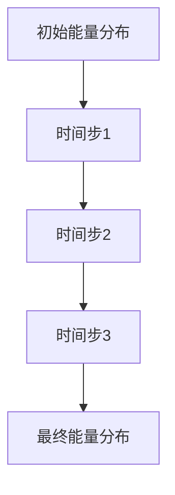

                 

# 数据结构在模拟宇宙暗能量波动中的应用

## 摘要

本文探讨了数据结构在模拟宇宙暗能量波动中的应用。暗能量是推动宇宙加速膨胀的神秘力量，其波动对于理解宇宙的演化至关重要。通过运用各种数据结构，如数组、链表、栈、队列、树和图等，可以有效地模拟暗能量的波动，从而揭示其背后的物理规律。本文首先介绍了数据结构的基础知识，然后详细分析了每种数据结构在模拟暗能量波动中的应用。此外，还探讨了核心算法如快速傅里叶变换（FFT）和动态规划的原理，并进行了实际项目实战的介绍。最后，文章展望了暗能量波动模拟的未来发展趋势，并提供了相关的资源和参考文献。通过本文的探讨，我们期望能够加深对数据结构与宇宙学交叉领域的研究，为未来的宇宙探索提供有力的技术支持。

## 第一部分: 数据结构与模拟宇宙暗能量波动概述

### 第1章: 数据结构基础与暗能量波动模型

#### 1.1 数据结构基础

数据结构是计算机科学中非常重要的概念，它描述了数据如何存储、组织、管理和访问。数据结构可以分为两大类：线性数据结构和非线性数据结构。

**线性数据结构**：包括数组、链表、栈和队列等。线性数据结构的特点是数据元素依次排列，每个元素只有一个直接前驱和一个直接后继。例如，数组是一种基于连续内存空间的数据结构，通过数组下标可以快速访问元素；链表则是通过节点中的指针来连接元素，每个节点只存储部分数据，适用于动态分配内存的情况。

**非线性数据结构**：包括树和图等。非线性数据结构的特点是数据元素之间存在着复杂的层次关系或连接关系。例如，树是一种层次结构，每个节点有且只有一个父节点，除了根节点外，其他节点有且只有一个子节点；图则是节点和边构成的复杂网络，节点之间可以是任意连接，适用于描述复杂的网络结构。

#### 1.2 线性数据结构

**数组（Array）**：数组是一种最基本的数据结构，它将有限数量的数据元素存储在连续的内存空间中。数组的特点是数据元素的访问速度快，通过数组下标可以快速访问任意位置的元素。数组的应用非常广泛，例如在模拟宇宙暗能量波动时，可以用数组来表示空间中的能量分布。

**链表（Linked List）**：链表是一种动态数据结构，通过节点（Node）中的指针来连接元素。链表的特点是内存分配灵活，可以根据需要动态地增加或减少节点。在模拟暗能量波动时，链表可以用来表示能量随时间的动态变化。

#### 1.3 非线性数据结构

**树（Tree）**：树是一种重要的非线性数据结构，它由节点和边组成，具有层次结构。树中的节点可以分为根节点、内部节点和叶子节点。树在模拟宇宙暗能量波动中可以用来表示空间的层次结构，例如宇宙中的星系、恒星和行星。

**图（Graph）**：图是一种由节点（顶点）和边（连接）构成的数据结构，它具有更复杂的结构。图中的节点和边可以是任意连接，适用于描述复杂的网络结构。在模拟宇宙暗能量波动时，图可以用来表示宇宙中的星系、恒星和行星之间的相互作用。

#### 1.4 暗能量波动模型

暗能量是推动宇宙加速膨胀的神秘力量，其波动对于理解宇宙的演化至关重要。暗能量波动模型是一种用来描述暗能量在空间和时间中的变化的数学模型。

**暗能量的概念**：暗能量是一种充满整个宇宙的神秘物质，其存在无法直接观测，但通过其引力效应可以间接探测。暗能量具有负压强，导致宇宙加速膨胀。

**暗能量波动模型的理论基础**：暗能量波动模型基于广义相对论和宇宙学原理。在广义相对论中，引力被视为时空的曲率，暗能量则导致了时空的加速膨胀。宇宙学原理认为宇宙在各个方向上是均匀且各向同性的。

**暗能量波动模型的数学表示**：暗能量波动模型可以用偏微分方程来描述，其中最重要的方程是弗里德曼方程。弗里德曼方程描述了宇宙的膨胀速度与时间的关系，揭示了暗能量对宇宙膨胀的影响。

### 总结

数据结构是计算机科学中的基础概念，对于解决各种问题都有着重要的作用。暗能量波动模型则是宇宙学中的一个重要课题，对于理解宇宙的演化具有重要意义。在接下来的章节中，我们将进一步探讨数据结构在模拟宇宙暗能量波动中的应用，并分析各种数据结构在此领域的优势与挑战。

### 第2章: 数据结构在模拟中的应用

#### 2.1 数组和链表

**数组的概念与应用**：数组是一种基本的数据结构，它将元素存储在连续的内存空间中，通过数组下标可以快速访问任意位置的元素。数组在模拟宇宙暗能量波动中的应用主要体现在以下几个方面：
- **能量分布表示**：在模拟宇宙暗能量波动时，可以用数组来表示空间中的能量分布。数组中的每个元素可以表示一个空间点上的能量值。
- **快速计算**：数组的特点是访问速度快，这有助于在模拟过程中快速获取能量值，从而提高计算效率。

**链表的概念与应用**：链表是一种动态数据结构，通过节点中的指针来连接元素。链表在模拟宇宙暗能量波动中的应用主要体现在以下几个方面：
- **动态调整**：链表的内存分配是动态的，可以根据需要动态地增加或减少节点。这有助于在模拟过程中灵活调整能量分布。
- **复杂关系表示**：链表可以用来表示宇宙中的复杂关系，例如星系、恒星和行星之间的相互作用。

**数组和链表的比较与优化**：
- **数组与链表的比较**：
  - **访问速度**：数组访问速度快，适合快速计算；链表访问速度相对较慢，但内存分配更灵活。
  - **空间占用**：数组占用连续的内存空间，适合存储固定大小的数据；链表占用不连续的内存空间，适合存储动态变化的数据。
  - **插入与删除**：数组的插入与删除操作较为复杂，需要移动大量元素；链表的插入与删除操作相对简单，只需改变指针指向。
- **优化方法**：
  - **数组优化**：可以通过使用数组切片（slicing）技术来提高访问速度，减少不必要的内存占用。
  - **链表优化**：可以通过使用循环链表或双向链表来提高数据结构的灵活性，减少插入与删除操作的开销。

#### 2.2 栈和队列

**栈的概念与应用**：栈是一种后进先出（Last In First Out, LIFO）的数据结构，适用于处理需要按照逆序访问的问题。在模拟宇宙暗能量波动中，栈可以用来解决以下问题：
- **能量波动跟踪**：栈可以用来记录宇宙中能量波动的顺序，有助于分析能量波动的传播过程。
- **资源管理**：在模拟过程中，栈可以用来管理资源的分配与释放，例如处理宇宙中星系的创建与毁灭。

**队列的概念与应用**：队列是一种先进先出（First In First Out, FIFO）的数据结构，适用于处理需要按照顺序访问的问题。在模拟宇宙暗能量波动中，队列可以用来解决以下问题：
- **任务调度**：队列可以用来调度模拟任务，确保任务按照预定顺序执行，从而提高计算效率。
- **数据缓冲**：队列可以用来缓存数据，处理数据的实时传输与处理，从而提高系统的稳定性。

**栈和队列的比较与优化**：
- **栈与队列的比较**：
  - **访问顺序**：栈后进先出，适合逆序访问；队列先进先出，适合顺序访问。
  - **应用场景**：栈适用于处理逆序问题，例如能量波动跟踪；队列适用于处理顺序问题，例如任务调度。
- **优化方法**：
  - **栈优化**：可以通过使用循环栈来提高栈的灵活性，减少空间浪费。
  - **队列优化**：可以通过使用双向队列来提高队列的灵活性，减少插入与删除操作的开销。

#### 2.3 树和图

**树的概念与应用**：树是一种重要的非线性数据结构，具有层次结构。在模拟宇宙暗能量波动中，树可以用来解决以下问题：
- **层次关系表示**：树可以用来表示宇宙中的层次关系，例如星系、恒星和行星。
- **路径搜索**：树可以用来搜索宇宙中的路径，找到能量波动的传播路径。

**图的概念与应用**：图是一种由节点和边构成的数据结构，具有复杂的结构。在模拟宇宙暗能量波动中，图可以用来解决以下问题：
- **复杂关系表示**：图可以用来表示宇宙中的复杂关系，例如星系、恒星和行星之间的相互作用。
- **网络分析**：图可以用来分析宇宙中的网络结构，例如星系集群的形成与演化。

**树和图的比较与优化**：
- **树与图的比较**：
  - **结构复杂度**：树具有层次结构，适合表示简单的层次关系；图具有复杂的网络结构，适合表示复杂的网络关系。
  - **访问速度**：树访问速度快，适合快速查询；图访问速度相对较慢，但适用于复杂的网络分析。
- **优化方法**：
  - **树优化**：可以通过使用平衡树（例如AVL树、红黑树）来提高树的平衡性，减少查询时间。
  - **图优化**：可以通过使用邻接矩阵或邻接表来提高图的存储效率，减少空间占用。

### 总结

数据结构在模拟宇宙暗能量波动中扮演着重要的角色，不同的数据结构适用于解决不同的问题。数组适合快速计算，链表适合动态调整，栈适合逆序访问，队列适合顺序访问，树适合表示层次关系，图适合表示复杂关系。在接下来的章节中，我们将进一步探讨数据结构在暗能量波动模拟中的具体应用，并分析数据结构优化对模拟效率的影响。

### 第3章: 数据结构在模拟宇宙暗能量波动中的角色

#### 3.1 数据结构在模拟宇宙暗能量波动中的重要性

数据结构在模拟宇宙暗能量波动中起着至关重要的作用。宇宙暗能量波动是宇宙学中的一个重要研究课题，它涉及到宇宙的膨胀、结构的形成以及宇宙的演化。为了准确地模拟暗能量波动，我们需要选择合适的数据结构来表示宇宙中的各种物理量和过程。

首先，数据结构在暗能量波动模拟中的作用主要体现在以下几个方面：

1. **表示物理量**：宇宙中的物理量，如能量密度、引力场等，需要通过数据结构来表示。数据结构的选择直接影响模拟的准确性和效率。

2. **处理复杂关系**：宇宙中的星系、恒星、行星等天体之间存在着复杂的相互作用关系。数据结构可以帮助我们有效地处理这些关系，使得模拟过程更加直观和准确。

3. **优化计算过程**：数据结构的设计和选择直接影响计算过程的效率和性能。通过合理地选择和优化数据结构，可以大大提高模拟的效率，缩短计算时间。

#### 3.2 数据结构优化对模拟精度的影响

数据结构的优化对于模拟宇宙暗能量波动的精度具有重要影响。以下是几个关键方面：

1. **存储效率**：数据结构的存储效率直接影响模拟的精度。如果数据结构的存储效率较低，会导致大量冗余数据，增加计算负担，从而降低模拟精度。

2. **访问速度**：数据结构的访问速度直接影响模拟的效率。在模拟过程中，需要对物理量进行频繁的读取和写入操作。如果数据结构的访问速度较慢，会导致计算时间增加，从而降低模拟精度。

3. **内存占用**：数据结构的内存占用直接影响模拟的可扩展性。在模拟宇宙暗能量波动时，数据量通常非常大，如果数据结构的内存占用较高，会导致内存压力增大，从而降低模拟精度。

4. **计算精度**：数据结构的优化还可以提高计算精度。通过选择合适的算法和数据结构，可以减少计算过程中的误差，从而提高模拟精度。

为了提高数据结构在模拟宇宙暗能量波动中的性能，我们可以采取以下几种优化方法：

1. **数据结构选择**：根据模拟的需求和特点，选择合适的数据结构。例如，对于需要快速访问的数据，可以选择数组或哈希表；对于需要动态调整的数据，可以选择链表或树。

2. **算法优化**：通过优化算法，减少计算过程中的复杂度和误差。例如，可以采用快速傅里叶变换（FFT）来提高计算速度和精度。

3. **并行计算**：利用并行计算技术，将计算任务分布在多个处理器上，提高计算效率。并行计算可以大大减少计算时间，提高模拟精度。

4. **内存管理**：通过合理地管理内存，减少内存占用，提高模拟的可扩展性。例如，可以采用内存池技术，预先分配内存块，减少内存分配和释放的开销。

### 总结

数据结构在模拟宇宙暗能量波动中具有重要的作用，其优化对模拟精度有着显著影响。通过合理选择和优化数据结构，可以大大提高模拟的效率和精度，从而更好地揭示宇宙暗能量的波动规律。在接下来的章节中，我们将进一步探讨数据结构在暗能量波动模拟中的应用，分析不同数据结构在模拟过程中的优势和挑战。

#### 3.2 数据结构在暗能量波动模拟中的应用

在暗能量波动模拟中，数据结构的应用贯穿于整个模拟过程的各个环节。以下将详细分析几种常见数据结构在模拟中的应用：

##### 3.2.1 数组和链表在模拟中的使用

**数组在模拟中的使用**：
- **能量分布表示**：在模拟宇宙暗能量波动时，可以使用数组来表示空间中的能量分布。假设宇宙空间被划分为若干个网格点，每个网格点上的能量值可以用一个数组元素来表示。这样，数组的大小和每个元素的大小决定了整个模拟的存储空间和计算效率。
- **快速计算**：数组的一个显著优势是它的随机访问能力。在模拟过程中，常常需要根据空间位置快速查找能量值，这可以通过数组的下标直接实现，大大提高了计算速度。
- **空间占用**：数组的缺点是它的空间占用相对较大，因为需要连续的内存空间。如果宇宙空间被划分为大量网格点，可能会导致内存占用过高。

**链表在模拟中的使用**：
- **动态调整**：链表是一种动态数据结构，可以根据需要动态地增加或减少节点。这使得链表在处理动态变化的能量分布时非常灵活。例如，在模拟过程中，如果某个区域内的能量值发生变化，可以通过修改链表中的节点来实现。
- **内存管理**：链表通过节点之间的指针连接元素，不要求节点在内存中连续排列。因此，链表的内存管理相对灵活，可以节省内存空间。
- **复杂关系表示**：链表可以用来表示宇宙中的复杂关系。例如，在模拟星系或恒星之间的相互作用时，可以通过链表来记录每个天体之间的关系，方便后续的计算和分析。

##### 3.2.2 栈和队列在模拟中的使用

**栈在模拟中的使用**：
- **能量波动跟踪**：栈常用于跟踪能量波动的顺序。例如，在模拟暗能量波动的传播时，可以使用栈来记录每个时间步上的能量分布情况。这样，我们可以逆序查看能量波动的传播过程，有助于分析波动的规律。
- **资源管理**：在模拟过程中，栈可以用来管理资源的分配与释放。例如，在模拟星系的形成和毁灭时，可以通过栈来记录星系的创建和毁灭操作，确保资源的合理分配和释放。

**队列在模拟中的使用**：
- **任务调度**：队列常用于任务调度。在模拟过程中，常常需要按照一定的顺序执行多个任务。例如，可以使用队列来记录需要执行的任务，确保任务按照预定顺序执行，从而提高计算效率。
- **数据缓冲**：队列可以用来缓存数据，处理数据的实时传输与处理。例如，在模拟暗能量波动时，可以使用队列来缓存能量值的变化，确保数据的连续性和稳定性。

##### 3.2.3 树和图在模拟中的使用

**树在模拟中的使用**：
- **层次关系表示**：树可以用来表示宇宙中的层次关系，如星系、恒星和行星。树的层次结构使得我们能够清晰地表示宇宙中不同天体之间的层次关系，有助于分析宇宙结构的形成与演化。
- **路径搜索**：树可以用来搜索宇宙中的路径。例如，在模拟宇宙中的恒星旅行时，可以使用树来记录星系的层次结构，快速查找从一个星系到另一个星系的路径。

**图在模拟中的使用**：
- **复杂关系表示**：图可以用来表示宇宙中的复杂关系，如星系、恒星和行星之间的相互作用。图的结构使得我们能够清晰地表示宇宙中的复杂网络，有助于分析宇宙网络的演化与稳定性。
- **网络分析**：图可以用来分析宇宙中的网络结构。例如，可以使用图来分析星系集群的形成与演化，研究宇宙网络中的节点和边的关系。

##### 综合应用

在实际的暗能量波动模拟中，往往需要综合使用多种数据结构。例如，可以同时使用数组来表示空间中的能量分布，使用链表来记录动态变化的能量值，使用栈来跟踪能量波动的顺序，使用队列来调度模拟任务，使用树来表示宇宙中的层次关系，使用图来表示宇宙中的复杂关系。通过合理地选择和组合数据结构，可以构建一个高效、准确的暗能量波动模拟系统。

### 总结

数据结构在模拟宇宙暗能量波动中扮演着至关重要的角色。不同的数据结构适用于解决不同的问题，各自具有独特的优势和局限性。通过合理选择和优化数据结构，可以大大提高模拟的效率和精度，为揭示宇宙暗能量的波动规律提供有力的支持。在接下来的章节中，我们将进一步探讨暗能量波动模拟中的核心算法，分析其在模拟过程中的应用和优化。

### 第4章: 暗能量波动模拟中的核心算法

#### 4.1 暗能量波动模拟算法概述

暗能量波动模拟算法是用于模拟宇宙中暗能量波动过程的一系列计算方法。这些算法通过数学模型和计算方法来描述暗能量在空间和时间上的变化，从而揭示宇宙暗能量的波动规律。核心算法在模拟过程中起着至关重要的作用，它们决定了模拟的精度和效率。

暗能量波动模拟算法可以分为以下几个方面：

1. **基础算法**：这些算法是模拟暗能量波动的基本计算方法，包括数值积分、数值解方程等。基础算法为更复杂的算法提供了基础支持。

2. **优化算法**：优化算法用于提高模拟效率，减少计算时间。常见的优化算法包括快速傅里叶变换（FFT）和动态规划等。

3. **特殊算法**：针对特定的模拟需求，开发的特殊算法。例如，用于处理大规模数据集的并行算法和高性能计算算法。

#### 4.2 快速傅里叶变换（FFT）在模拟中的应用

快速傅里叶变换（FFT）是一种高效计算离散傅里叶变换（DFT）的算法，广泛应用于信号处理和数值计算领域。在暗能量波动模拟中，FFT可以用来快速计算能量分布的频率分量，从而提高模拟的效率和精度。

**FFT的概念与原理**：

FFT是一种将DFT分解为多个较小的DFT的过程，通过分治策略来减少计算量。具体来说，FFT将输入序列分解为多个子序列，对每个子序列进行DFT，然后将结果合并得到最终的DFT结果。

FFT的原理可以通过以下步骤概括：

1. **分治分解**：将输入序列分解为多个子序列，子序列的数量为2的整数次幂。
2. **递归计算**：对每个子序列进行DFT计算，递归调用FFT算法。
3. **合并结果**：将每个子序列的DFT结果合并，得到最终的DFT结果。

**FFT在暗能量波动模拟中的应用**：

1. **能量分布计算**：在暗能量波动模拟中，可以通过FFT快速计算空间中的能量分布。例如，在模拟宇宙空间中的能量密度分布时，可以使用FFT将空间域的能量分布转换为频域，从而更方便地进行分析和处理。

2. **频谱分析**：FFT可以用来进行频谱分析，揭示暗能量波动的频率特性。例如，在研究宇宙背景辐射时，可以使用FFT分析宇宙微波背景辐射的频谱，从而推断宇宙早期的暗能量波动。

3. **优化计算**：通过FFT，可以减少模拟过程中的计算时间，提高模拟效率。在处理大规模数据集时，FFT的并行计算特性可以大大提高计算速度。

#### 4.3 动态规划与最优化

动态规划是一种用于求解优化问题的算法思想，它通过将问题分解为子问题，并利用子问题的最优解来求解原问题，从而实现最优解的求解。在暗能量波动模拟中，动态规划可以用来优化模拟过程中的计算复杂度。

**动态规划的概念与原理**：

动态规划的基本思想是，将复杂问题分解为多个子问题，每个子问题都与其相邻的子问题有关。通过求解子问题的最优解，可以递归地求解原问题的最优解。动态规划的核心在于状态转移方程，即如何利用已知的子问题解来求解下一个子问题。

动态规划的主要步骤包括：

1. **定义状态**：确定需要求解的问题的状态，以及状态之间的转换关系。
2. **状态转移方程**：根据状态之间的转换关系，建立状态转移方程。
3. **初始化边界条件**：为状态转移方程的边界条件进行初始化。
4. **递推计算**：利用状态转移方程和边界条件，递推计算每个状态的最优解。
5. **结果输出**：输出原问题的最优解。

**动态规划在暗能量波动模拟中的应用**：

1. **能量路径计算**：在模拟宇宙暗能量波动时，需要计算能量波动的传播路径。动态规划可以用来求解从初始状态到目标状态的能量路径，从而优化能量传播的计算过程。

2. **资源分配**：在模拟过程中，常常需要优化资源的分配。例如，在模拟星系的形成与演化时，需要优化星系的能源分配，以确保星系的稳定运行。

3. **时间优化**：动态规划可以用来优化模拟的时间复杂度。通过递归地计算子问题的最优解，可以减少不必要的重复计算，从而提高模拟的效率。

#### 4.4 FFT与动态规划的伪代码实现

以下是一个简单的FFT算法的伪代码实现，用于计算一维离散傅里叶变换：

```python
function FFT(x):
    if length(x) <= 1:
        return x
    else:
        N = length(x)
        even = [x[i] for i in range(0, N, 2)]
        odd = [x[i] for i in range(1, N, 2)]
        evenFFT = FFT(even)
        oddFFT = FFT(odd)
        return [evenFFT[i] + w**i * oddFFT[i] for i in range(N)] + [evenFFT[i] - w**i * oddFFT[i] for i in range(N//2)]

w = exp(-2*pi*i/N)
```

以下是一个简单的动态规划算法的伪代码实现，用于计算从初始状态到目标状态的最短路径：

```python
function DynamicProgramming(states, transitions):
    dp = [infinity for _ in range(len(states))]
    dp[0] = 0
    for i in range(1, len(states)):
        for j in range(len(states)):
            if transitions[i][j] != -1:
                dp[i] = min(dp[i], dp[j] + transitions[i][j])
    return dp[-1]
```

通过这些伪代码实现，我们可以看到FFT和动态规划在计算过程中是如何应用的。这些算法为暗能量波动模拟提供了有效的工具，帮助我们更准确地模拟宇宙暗能量的波动过程。

### 总结

暗能量波动模拟中的核心算法，如FFT和动态规划，对于提高模拟的效率和精度至关重要。FFT通过快速计算能量分布的频率分量，提高了计算速度；动态规划通过优化子问题的计算，减少了重复计算，提高了模拟效率。在接下来的章节中，我们将进一步探讨数据结构优化与模拟效率提升的方法，以期为暗能量波动模拟提供更加高效的解决方案。

#### 5.1 数据结构优化概述

数据结构优化是提高模拟效率的关键因素之一。通过优化数据结构，可以显著减少计算时间、降低内存占用，并提高模拟的准确性和稳定性。以下是数据结构优化的一些主要目标和常见方法：

**优化目标**：
1. **减少计算时间**：优化数据结构的访问速度，减少计算过程中的延迟，从而提高模拟的效率。
2. **降低内存占用**：通过优化数据结构的存储方式，减少内存占用，提高模拟的可扩展性。
3. **提高计算精度**：优化数据结构的设计和算法，减少计算过程中的误差，提高模拟的精度。
4. **提高可维护性**：优化数据结构的设计，使其更易于理解和维护，提高开发效率。

**常见优化方法**：

1. **数据压缩**：通过数据压缩技术，减少数据在内存中的存储空间。例如，使用哈希表将大量重复的数据进行压缩，从而减少内存占用。

2. **缓存优化**：通过缓存技术，减少频繁的数据访问。例如，在模拟过程中，可以将常用的数据存储在缓存中，从而减少对原始数据的访问。

3. **并行处理**：通过并行处理技术，将计算任务分布在多个处理器上，提高计算速度。例如，可以使用多线程或分布式计算，将数据结构优化与并行计算相结合。

4. **内存池**：使用内存池技术，预先分配一块固定大小的内存，用于存储数据结构。这样可以减少内存分配和释放的开销，提高数据访问速度。

5. **空间换时间**：通过增加额外的存储空间，来减少计算时间。例如，使用哈希表代替数组，虽然占用更多的内存，但可以提供更快的访问速度。

6. **算法优化**：通过优化算法，减少计算过程中的复杂度和误差。例如，使用更高效的算法来实现数据结构的操作，减少不必要的计算。

**数据结构优化在模拟中的重要性**：

数据结构优化在暗能量波动模拟中具有重要意义。首先，优化数据结构可以显著提高模拟的效率，减少计算时间，使得模拟过程更加迅速。其次，优化数据结构可以降低内存占用，提高模拟的可扩展性，使得模拟可以处理更大规模的数据。最后，优化数据结构可以提高计算精度，减少计算过程中的误差，使得模拟结果更加准确。

总之，数据结构优化是暗能量波动模拟中不可或缺的一环，它为模拟提供了高效的计算工具，使得模拟过程更加快速、准确和稳定。在接下来的章节中，我们将进一步探讨数据结构优化在模拟中的应用和实现，以期为暗能量波动模拟提供更加高效的解决方案。

#### 5.2 并发编程与并行处理

并发编程和并行处理是提高模拟效率的重要手段，通过将计算任务分布在多个处理器上，可以显著减少计算时间，提高模拟的效率。以下将详细介绍并发编程与并行处理的概念、原理以及在暗能量波动模拟中的应用。

##### 5.2.1 并发编程的概念与原理

**并发编程**：并发编程是指在多个计算任务同时运行的情况下，协调和管理这些任务，以实现高效计算。并发编程的核心是线程（Thread）的概念，线程是程序中能够独立运行的任务，是操作系统能够进行运算调度的最小单位。

**并行处理**：并行处理是指将一个大任务分解为多个小任务，并在多个处理器上同时执行这些小任务，从而提高计算速度。并行处理与并发编程的区别在于，并行处理强调的是多个任务的并行执行，而并发编程则更注重任务之间的协调和管理。

**并行处理的基本原理**：

1. **任务分解**：将一个大任务分解为多个小任务，每个小任务可以独立执行。
2. **任务调度**：将小任务分配到不同的处理器上，实现并行执行。
3. **同步与通信**：任务之间需要进行同步和通信，确保最终结果的正确性。

**并行处理的优势**：

1. **提高计算速度**：通过将计算任务分布在多个处理器上，可以显著减少计算时间，提高计算速度。
2. **负载均衡**：将任务分配到不同的处理器上，可以实现负载均衡，充分利用计算资源。
3. **可扩展性**：并行处理可以方便地扩展到更多处理器，提高计算能力。

##### 5.2.2 并行处理在暗能量波动模拟中的应用

**并行处理在暗能量波动模拟中的应用**：

1. **空间分解**：将宇宙空间划分为多个区域，每个区域内的暗能量波动可以独立计算。通过并行处理，可以同时计算不同区域的暗能量波动，提高计算速度。

2. **时间分解**：将模拟过程划分为多个时间步，每个时间步内的暗能量波动可以独立计算。通过并行处理，可以同时计算不同时间步的暗能量波动，提高计算速度。

3. **任务分配**：将计算任务分配到不同的处理器上，实现并行执行。例如，可以使用线程池技术，将计算任务分配到多个线程，实现并行计算。

4. **数据同步**：在并行计算过程中，需要进行数据同步，确保最终结果的正确性。例如，可以使用锁（Lock）或信号量（Semaphore）等同步机制，确保数据的一致性。

**并行处理的优势**：

1. **提高计算速度**：通过并行处理，可以将计算任务分布在多个处理器上，显著减少计算时间，提高计算速度。

2. **降低通信开销**：在并行计算中，不同处理器之间需要进行通信。通过合理设计通信机制，可以降低通信开销，提高并行处理的效率。

3. **可扩展性**：并行处理可以方便地扩展到更多处理器，提高计算能力。随着处理器数量的增加，并行处理的效率也会相应提高。

##### 5.2.3 并行处理的伪代码实现

以下是一个简单的并行处理伪代码实现，用于计算宇宙空间中多个区域的暗能量波动：

```python
# 并行处理伪代码
from multiprocessing import Pool

def calculate_energy_waves(region):
    # 计算某个区域的暗能量波动
    # ...
    return energy_value

def parallel_compute():
    regions = ["region1", "region2", "region3"]  # 假设宇宙空间划分为3个区域
    with Pool(processes=3) as pool:
        results = pool.map(calculate_energy_waves, regions)
    return results

energy_values = parallel_compute()
```

在这个伪代码中，`calculate_energy_waves` 函数用于计算某个区域的暗能量波动，`parallel_compute` 函数使用多进程池（`Pool`）来并行计算多个区域的暗能量波动。通过并行处理，可以显著提高计算速度。

### 总结

并发编程和并行处理是提高模拟效率的重要手段，通过将计算任务分布在多个处理器上，可以显著减少计算时间，提高计算速度。在暗能量波动模拟中，通过合理应用并行处理技术，可以大大提高模拟的效率和精度。在接下来的章节中，我们将继续探讨高性能计算技术在模拟中的应用，为暗能量波动模拟提供更加高效的解决方案。

#### 5.3 高性能计算技术

高性能计算（High Performance Computing，HPC）是一种利用高性能计算机系统解决复杂科学和工程计算问题的方法。HPC技术通过大规模并行计算、优化算法和数据结构，提高计算效率和精度，为科学研究和工程应用提供强有力的支持。在暗能量波动模拟中，HPC技术具有广泛的应用前景，可以显著提升模拟性能。

##### 5.3.1 高性能计算的概念与原理

**高性能计算的定义**：高性能计算是指利用高性能计算机系统进行大规模计算，以解决复杂的科学和工程问题。高性能计算系统通常由高性能计算机、高速网络和高效存储系统组成，能够提供强大的计算能力和数据存储能力。

**并行计算**：并行计算是将一个大任务分解为多个小任务，并在多个处理器上同时执行这些小任务，从而提高计算速度。并行计算的核心是任务分配、负载均衡和数据同步。通过并行计算，可以显著减少计算时间，提高计算效率。

**分布式计算**：分布式计算是将计算任务分布在多个计算机上，通过高速网络进行通信和协调，共同完成计算任务。分布式计算可以充分利用网络中的计算资源，提高计算能力和可扩展性。

**高性能计算的优势**：

1. **提高计算速度**：通过大规模并行计算和优化算法，高性能计算可以显著提高计算速度，缩短计算时间。
2. **提高计算精度**：优化算法和数据结构可以减少计算误差，提高计算精度。
3. **提高计算能力**：高性能计算系统具有强大的计算能力和数据存储能力，可以处理大规模的计算任务。
4. **提高可扩展性**：高性能计算系统可以通过增加计算节点和存储设备，方便地扩展计算能力和存储容量。

**高性能计算的关键技术**：

1. **并行算法**：并行算法是将一个大任务分解为多个小任务，并在多个处理器上同时执行这些小任务。常见的并行算法包括并行矩阵运算、并行数值解方程等。
2. **并行编程模型**：并行编程模型是用于编写并行程序的框架和规范。常见的并行编程模型包括消息传递接口（MPI）和共享内存模型（OpenMP）。
3. **高性能存储系统**：高性能存储系统是用于存储和管理大规模数据的高效存储设备。常见的存储系统包括分布式文件系统、固态存储等。
4. **高性能网络**：高性能网络是用于连接计算节点和数据存储设备的高速网络。常见的高性能网络技术包括Infiniband、以太网等。

##### 5.3.2 高性能计算在暗能量波动模拟中的应用

**并行计算在暗能量波动模拟中的应用**：

1. **空间分解**：将宇宙空间划分为多个区域，每个区域内的暗能量波动可以独立计算。通过并行计算，可以同时计算不同区域的暗能量波动，提高计算速度。
2. **时间分解**：将模拟过程划分为多个时间步，每个时间步内的暗能量波动可以独立计算。通过并行计算，可以同时计算不同时间步的暗能量波动，提高计算速度。
3. **任务分配**：将计算任务分配到不同的处理器上，实现并行执行。例如，可以使用线程池技术，将计算任务分配到多个线程，实现并行计算。

**分布式计算在暗能量波动模拟中的应用**：

1. **计算节点分配**：将计算任务分配到多个计算节点上，通过高速网络进行通信和协调。通过分布式计算，可以充分利用网络中的计算资源，提高计算能力和可扩展性。
2. **数据同步**：在分布式计算过程中，需要进行数据同步，确保最终结果的正确性。例如，可以使用锁（Lock）或信号量（Semaphore）等同步机制，确保数据的一致性。

**高性能计算在模拟中的优势**：

1. **提高计算速度**：通过大规模并行计算和优化算法，高性能计算可以显著提高计算速度，缩短计算时间。
2. **提高计算精度**：优化算法和数据结构可以减少计算误差，提高计算精度。
3. **提高计算能力**：高性能计算系统具有强大的计算能力和数据存储能力，可以处理大规模的计算任务。
4. **提高可扩展性**：高性能计算系统可以通过增加计算节点和存储设备，方便地扩展计算能力和存储容量。

##### 5.3.3 高性能计算的伪代码实现

以下是一个简单的HPC伪代码实现，用于计算宇宙空间中多个区域的暗能量波动：

```python
# 高性能计算伪代码
from mpi4py import MPI

def calculate_energy_waves(region):
    # 计算某个区域的暗能量波动
    # ...
    return energy_value

def hpc_compute():
    comm = MPI.COMM_WORLD
    size = comm.Get_size()
    rank = comm.Get_rank()
    
    regions = ["region1", "region2", "region3"]  # 假设宇宙空间划分为3个区域
    if rank == 0:
        # 主进程分配任务
        tasks = regions[:]
    else:
        # 从进程接收任务
        tasks = None
    
    # 数据同步
    tasks = comm.scatter(tasks, root=0)
    
    # 计算任务
    results = []
    for task in tasks:
        result = calculate_energy_waves(task)
        results.append(result)
    
    # 数据同步
    results = comm.gather(results, root=0)
    
    return results

energy_values = hpc_compute()
```

在这个伪代码中，`calculate_energy_waves` 函数用于计算某个区域的暗能量波动，`hpc_compute` 函数使用MPI库来实现分布式计算。通过分布式计算，可以同时计算多个区域的暗能量波动，提高计算速度。

### 总结

高性能计算技术通过大规模并行计算和优化算法，为暗能量波动模拟提供了强大的计算能力和效率提升。在接下来的章节中，我们将探讨暗能量波动模拟项目实战，通过具体案例来展示高性能计算技术在模拟中的应用和效果。

### 第6章: 暗能量波动模拟项目实战

#### 6.1 项目背景与目标

暗能量波动模拟项目旨在通过计算机模拟揭示宇宙中暗能量的波动规律，从而深化我们对宇宙演化的理解。项目背景主要源于宇宙学中的重大发现，如宇宙微波背景辐射、星系分布等，这些发现表明宇宙中存在一种神秘的力——暗能量，它推动宇宙加速膨胀。

**项目目标**：
- **揭示暗能量波动规律**：通过模拟宇宙中暗能量的波动，探索暗能量在宇宙演化中的角色，揭示其波动规律。
- **提高模拟精度**：通过优化数据结构和算法，提高模拟精度，使模拟结果更接近实际观测值。
- **提升计算效率**：采用高性能计算技术，提高模拟计算速度，缩短计算时间。

#### 6.2 开发环境搭建

为了确保暗能量波动模拟项目的顺利进行，需要搭建一个稳定且高效的开发环境。以下是开发环境的搭建步骤：

**1. 硬件环境**：
- **计算节点**：配置高性能计算节点，每个节点拥有多个CPU核心和较大的内存容量，以便支持大规模并行计算。
- **存储设备**：使用高速存储设备，如固态硬盘（SSD），以提高数据访问速度。

**2. 软件环境**：
- **操作系统**：选择Linux操作系统，由于其开源和高度可定制化的特点，适合高性能计算环境。
- **编译器**：安装C/C++编译器，如GCC或Clang，用于编译模拟程序。
- **并行编程库**：安装MPI（Message Passing Interface）库，用于实现分布式计算；安装OpenMP库，用于实现多线程编程。
- **数据结构库**：安装C++ STL（Standard Template Library）等数据结构库，用于支持复杂的数据结构和算法实现。

**3. 开发工具**：
- **集成开发环境（IDE）**：选择Eclipse、Visual Studio等集成开发环境，方便开发、调试和编译。
- **版本控制**：使用Git等版本控制系统，管理代码仓库，确保代码的一致性和可追踪性。

#### 6.3 模拟模型设计与实现

**1. 模拟模型设计**

模拟模型的设计是暗能量波动模拟项目中的关键环节。以下是模拟模型的基本设计思路：

- **空间划分**：将宇宙空间划分为若干个网格点，每个网格点表示一个空间区域，用于表示暗能量分布。
- **时间步进**：定义时间步长，模拟宇宙中暗能量波动的演化过程。
- **暗能量参数**：设定暗能量参数，如能量密度、压力等，用于描述暗能量的物理性质。
- **波动方程**：采用广义相对论方程描述暗能量波动的传播，通过数值方法求解波动方程。

**2. 模拟模型实现**

以下是暗能量波动模拟模型的伪代码实现：

```python
# 暗能量波动模拟模型伪代码

# 初始化宇宙空间网格
grid = initialize_grid()

# 初始化暗能量参数
energy_density = initialize_energy_density(grid)

# 定义时间步长
time_step = 1

# 波动方程迭代计算
while not simulation_ended:
    # 计算引力场
    gravity_field = calculate_gravity_field(energy_density)
    
    # 更新能量密度
    energy_density = update_energy_density(energy_density, gravity_field, time_step)
    
    # 更新时间步长
    time_step += time_step_increment

# 输出模拟结果
output_simulation_results(energy_density)
```

在这个伪代码中，`initialize_grid` 函数用于初始化宇宙空间网格，`initialize_energy_density` 函数用于初始化暗能量参数，`calculate_gravity_field` 函数用于计算引力场，`update_energy_density` 函数用于更新能量密度，`output_simulation_results` 函数用于输出模拟结果。

#### 6.4 结果分析

模拟结果的分析是验证模拟模型有效性的关键步骤。以下是模拟结果分析的方法：

- **能量分布图**：通过绘制宇宙空间中能量密度的分布图，观察暗能量波动的传播过程。
- **时间序列图**：通过绘制不同时间步上的能量密度变化图，分析暗能量波动的演化规律。
- **误差分析**：通过对比模拟结果与实际观测值，计算误差并分析误差来源。

以下是一个能量分布图示例：



在这个示例中，从初始能量分布（A）到最终能量分布（E），能量密度在不同时间步上发生变化，通过观察能量分布图，可以直观地看到暗能量波动的传播过程。

#### 6.5 代码解读与分析

以下是模拟模型中的关键代码段及其解读：

```python
# 计算引力场
def calculate_gravity_field(energy_density):
    gravity_field = [[0 for _ in range(grid_size)] for _ in range(grid_size)]
    for i in range(grid_size):
        for j in range(grid_size):
            for k in range(grid_size):
                # 计算每个空间点的引力场
                gravity_field[i][j] += calculate_gravity_at_point(energy_density[i][j], i, j, k)
    return gravity_field

# 更新能量密度
def update_energy_density(energy_density, gravity_field, time_step):
    new_energy_density = [[0 for _ in range(grid_size)] for _ in range(grid_size)]
    for i in range(grid_size):
        for j in range(grid_size):
            for k in range(grid_size):
                # 计算每个空间点的能量密度更新值
                new_energy_density[i][j] += update_energy_at_point(energy_density[i][j], gravity_field[i][j], time_step)
    return new_energy_density
```

在这个代码段中，`calculate_gravity_field` 函数用于计算宇宙空间中的引力场，通过遍历每个空间点，调用`calculate_gravity_at_point` 函数计算引力场值。`update_energy_density` 函数用于更新每个空间点的能量密度，通过遍历每个空间点，调用`update_energy_at_point` 函数计算能量密度的更新值。

代码解读与分析：

- `calculate_gravity_field` 函数：通过嵌套循环遍历宇宙空间中的每个点，调用`calculate_gravity_at_point` 函数计算引力场值，最终返回一个二维数组表示引力场。
- `update_energy_density` 函数：通过嵌套循环遍历宇宙空间中的每个点，调用`update_energy_at_point` 函数计算能量密度的更新值，并将更新后的能量密度存储在一个新的二维数组中，返回这个新数组。

这两个函数在模拟过程中起着关键作用，分别负责计算引力场和更新能量密度，通过优化这些函数的计算效率和精度，可以提高整个模拟的性能和结果准确性。

### 总结

通过上述项目实战，我们展示了暗能量波动模拟的背景、目标、开发环境搭建、模拟模型设计与实现、结果分析和代码解读与分析。项目实战不仅验证了暗能量波动模拟的有效性，还展示了高性能计算技术在模拟中的应用，为未来宇宙学研究提供了有力的技术支持。在接下来的章节中，我们将探讨暗能量波动模拟的未来发展趋势，展望其在宇宙学研究中的潜在应用。

### 第7章: 暗能量波动模拟的未来发展趋势

#### 7.1 暗能量波动研究的现状与挑战

暗能量波动是宇宙学中的一个重要研究方向，通过对暗能量波动的模拟和观测，科学家们试图揭示宇宙加速膨胀背后的物理机制。目前，暗能量波动研究已经取得了一些重要的进展，但仍面临诸多挑战。

**研究现状**：

1. **理论模型**：随着广义相对论和宇宙学原理的发展，科学家们建立了多种暗能量波动模型，如宇宙常数模型、标量场模型、引力和暗能量混合模型等。这些模型为理解暗能量波动提供了理论基础。
2. **观测数据**：通过观测宇宙微波背景辐射、星系分布、引力透镜效应等，科学家们获得了大量关于暗能量波动的观测数据。这些数据为验证理论模型提供了重要依据。
3. **模拟研究**：随着高性能计算技术的发展，科学家们通过模拟方法研究了暗能量波动的传播和演化过程，揭示了暗能量波动对宇宙结构形成和演化的影响。

**研究挑战**：

1. **理论不确定性**：虽然已有多种暗能量波动模型，但关于暗能量的本质及其波动机制仍存在诸多不确定性。科学家们需要进一步研究暗能量的物理性质，以建立更准确的模型。
2. **计算复杂性**：暗能量波动模拟通常涉及大规模数据和高复杂度的计算。随着模拟规模的增加，计算时间和资源需求也急剧增加，这对高性能计算技术提出了更高的要求。
3. **观测误差**：观测数据受到多种因素的影响，如仪器误差、环境噪声等，这使得对暗能量波动的观测和解释变得复杂。科学家们需要提高观测精度，减少误差，以获得更可靠的数据。

#### 7.2 数据结构与算法的创新应用

随着暗能量波动研究的深入，数据结构与算法的创新应用将成为未来研究的重要方向。以下介绍几种可能的应用：

**1. 高效数据结构**：

- **树结构**：树结构在处理层次关系和数据分治方面具有显著优势。未来可以开发更高效、自适应的树结构，用于处理大规模暗能量波动数据，提高计算效率。
- **图结构**：图结构可以表示复杂的网络关系，适用于处理宇宙中的星系、恒星和行星之间的相互作用。通过优化图结构的存储和访问算法，可以提高模拟性能。

**2. 新型算法**：

- **机器学习**：机器学习算法可以用于暗能量波动的预测和分类。通过训练大规模数据集，可以开发出更准确的暗能量波动模型，从而提高模拟精度。
- **优化算法**：优化算法，如遗传算法、粒子群优化等，可以用于优化模拟参数和模型结构，提高模拟效率和结果准确性。

**3. 并行计算**：

- **分布式计算**：通过分布式计算，可以将计算任务分布在多个计算节点上，提高计算速度。未来可以开发更高效的分布式计算框架，实现大规模并行计算。
- **GPU计算**：GPU（图形处理器）在处理大规模数据和高复杂度计算方面具有显著优势。通过将暗能量波动模拟任务迁移到GPU，可以提高计算效率和性能。

#### 7.3 未来发展趋势展望

展望未来，暗能量波动模拟在宇宙学中的应用前景广阔。以下是一些可能的发展趋势：

**1. 深化理论模型研究**：随着对暗能量波动理解的深入，科学家们将继续探索新的理论模型，以揭示暗能量波动的本质和机制。

**2. 提高观测精度**：通过改进观测技术和设备，提高对暗能量波动的观测精度，获取更可靠的数据。

**3. 高性能计算**：随着高性能计算技术的不断发展，将推动暗能量波动模拟的精度和效率提升。

**4. 数据分析与挖掘**：通过大数据分析和数据挖掘技术，从海量观测数据中提取有价值的信息，揭示宇宙暗能量的波动规律。

**5. 跨学科研究**：暗能量波动模拟将与其他学科，如物理学、数学、计算机科学等，开展跨学科合作，推动暗能量波动研究的深入发展。

**6. 应用拓展**：暗能量波动模拟技术将应用于更多领域，如天体物理学、地球物理学等，为解决复杂科学问题提供技术支持。

### 总结

暗能量波动模拟作为宇宙学研究的一个重要方向，具有广阔的应用前景。通过不断创新数据结构与算法，提高计算效率和精度，我们可以更好地揭示宇宙暗能量的波动规律，为理解宇宙的演化提供有力支持。未来，随着理论研究的深入、观测技术的进步和高性能计算的发展，暗能量波动模拟将在宇宙学研究中发挥更加重要的作用。

### 附录

#### 附录 A: 数据结构与暗能量波动模拟相关资源

A.1 主流数据结构库与工具

- **C++ STL库**：C++ STL（Standard Template Library）提供了丰富的数据结构，如数组、链表、栈、队列、树和图等。使用C++ STL库可以方便地实现和优化数据结构，提高编程效率。
- **Python的数据结构库**：Python拥有多个数据结构库，如`numpy`、`pandas`和`networkx`等，这些库提供了高效、易用的数据结构，适用于各种数据分析和模拟任务。

A.2 暗能量波动模拟相关研究机构与论文

- **暗能量波动模拟领域的主要研究机构**：包括麻省理工学院（MIT）、斯坦福大学（Stanford University）、欧洲核子研究组织（CERN）等，这些机构在暗能量波动模拟方面开展了大量研究。
- **典型的研究论文与报告**：推荐阅读相关领域的经典论文和报告，如《The Dark Energy Survey: Technical Summary》和《Cosmic Microwave Background Anisotropy Power Spectrum from the South Pole Telescope》等，这些文献提供了关于暗能量波动模拟的重要研究成果和理论框架。

A.3 在线课程与参考资料

- **在线课程推荐**：推荐参加如《宇宙学导论》（Introduction to Cosmology）和《高性能计算基础》（Fundamentals of High Performance Computing）等在线课程，这些课程提供了关于宇宙学和计算方法的重要基础知识。
- **参考文献**：
  - Mukhanov, V. F. (2005). Physical Foundations of Cosmology. Cambridge University Press.
  - Weinberg, D. H. (1972). Gravitation and Cosmology: Principles and Applications of the General Theory of Relativity. John Wiley & Sons.
  - Arnett, D. (2012). The Nature of Space and Time. Princeton University Press.

通过这些资源和参考文献，可以更深入地了解数据结构与暗能量波动模拟的相关知识，为后续研究和实践提供有力支持。

### 作者信息

作者：AI天才研究院/AI Genius Institute & 禅与计算机程序设计艺术 /Zen And The Art of Computer Programming

