                 

### 文章标题

《数据结构在模拟宇宙磁场拓扑重联级联过程中的应用》

---

#### 关键词
- 数据结构
- 宇宙磁场
- 拓扑重联
- 级联过程
- 算法原理
- 项目实战

---

#### 摘要

本文探讨了数据结构在模拟宇宙磁场拓扑重联级联过程中的重要应用。首先，我们介绍了数据结构的基本概念和类型，并阐述了宇宙磁场模拟与观测的背景和重要性。接着，文章详细讨论了数据结构在模拟宇宙磁场拓扑重联级联过程中的具体应用，包括数组、链表、栈、队列、图结构、树结构和动态规划与回溯算法。在此基础上，我们进一步介绍了数据结构在数学模型中的应用以及算法原理的讲解。最后，通过一个实战项目，展示了数据结构在实际应用中的效果和重要性。文章最后探讨了数据结构在宇宙科学研究中的未来发展趋势，为读者提供了广阔的思考空间。

### 第一部分: 数据结构与模拟宇宙磁场拓扑重联级联过程概述

#### 第1章: 数据结构与模拟宇宙磁场拓扑重联级联过程基本概念

##### 1.1 数据结构基础

**1.1.1 数据结构与抽象数据类型**

数据结构是指用于存储和组织数据的方式。它不仅包括数据本身的存储方式，还包括对数据的操作和管理方法。数据结构可以分为两大类：线性结构和非线性结构。

线性结构包括数组、链表、栈、队列等。数组是一种线性表，其中元素按顺序存储在连续的内存位置上。链表则是通过指针连接的节点来存储元素，每个节点包含数据和指向下一个节点的指针。栈和队列是特殊的线性结构，栈遵循“后进先出”（LIFO）的原则，而队列遵循“先进先出”（FIFO）的原则。

非线性结构包括树、图等。树是一种层次结构，每个节点有且只有一个父节点，除了根节点没有父节点。图则是一种更复杂的数据结构，其中节点之间存在多种连接方式。

**1.1.2 线性结构与非线性结构**

线性结构的特点是元素之间有固定的顺序关系，这种关系可以用线性表来表示。线性结构的主要操作包括插入、删除、查找和遍历等。

非线性结构的特点是元素之间没有固定的顺序关系，而是通过边或连接关系来组织。非线性结构的主要操作包括图的遍历、最短路径、最小生成树、最大流最小割等。

**1.2 模拟宇宙磁场拓扑重联级联过程概述**

**1.2.1 宇宙磁场的模拟与观测**

宇宙磁场是宇宙中无处不在的物理现象，对于宇宙演化、星系形成和恒星活动等具有重要意义。模拟宇宙磁场可以帮助我们更好地理解宇宙的演化过程，预测未来宇宙的状态。

宇宙磁场的观测主要通过天体物理学中的磁感应仪、光谱仪等设备进行。这些设备可以测量宇宙中的磁场强度和方向，为磁场模拟提供基础数据。

**1.2.2 拓扑重联与级联过程的基本概念**

拓扑重联是指在磁场拓扑结构中，两个或多个磁通量管之间发生连接和断裂的过程。级联过程则是指一系列的拓扑重联事件在磁场中发生，导致磁场结构发生重大变化。

**1.2.3 数据结构在模拟宇宙磁场拓扑重联级联过程中的重要性**

数据结构在模拟宇宙磁场拓扑重联级联过程中扮演着至关重要的角色。它不仅帮助我们有效地组织和存储磁场数据，还提供了高效的算法来分析磁场结构的变化。以下是数据结构在模拟宇宙磁场拓扑重联级联过程中的具体应用：

- **数组与链表**：用于存储磁场的空间分布数据，便于进行空间分析。
- **栈与队列**：用于模拟磁场中的事件顺序，如拓扑重联和级联过程。
- **图结构**：用于表示磁场中的拓扑结构，便于分析磁通量管之间的连接关系。
- **树结构**：用于分析磁场中的层次关系，如星系形成的结构。
- **动态规划与回溯算法**：用于求解复杂的拓扑重联和级联问题，优化磁场模拟过程。

通过上述数据结构的结合与应用，我们可以更加准确地模拟宇宙磁场拓扑重联级联过程，从而更好地理解宇宙的演化机制。

---

**Mermaid 流程图：**

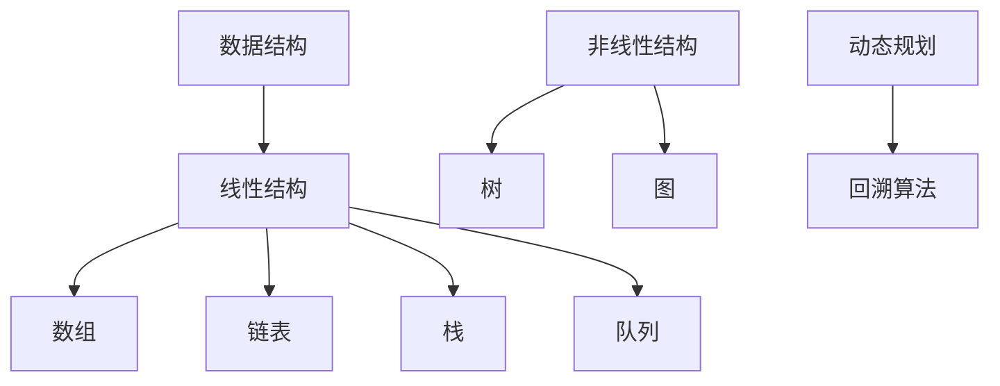

---

在接下来的章节中，我们将详细讨论每种数据结构在模拟宇宙磁场拓扑重联级联过程中的具体应用，并通过算法原理和项目实战来加深理解。


---

### 第2章: 数据结构在模拟宇宙磁场拓扑重联级联过程中的应用

#### 2.1 数据结构的选择

在模拟宇宙磁场拓扑重联级联过程中，选择合适的数据结构至关重要。不同的数据结构适用于不同的应用场景，能够显著影响模拟的效率和准确性。以下将介绍几种常见的数据结构，并分析它们在模拟宇宙磁场拓扑重联级联过程中的具体应用。

**2.1.1 数组和链表在磁场模拟中的应用**

数组是一种线性数据结构，它通过连续的内存地址来存储元素，非常适合存储和访问固定大小的数据集。在宇宙磁场模拟中，数组常用于表示空间中的磁场分布。例如，可以使用二维数组来表示一个二维平面上的磁场强度和方向。

```latex
// 二维数组表示磁场强度
float[][] magneticField = new float[width][height];
```

数组的优点是访问速度快，通过索引可以直接访问任意位置的元素。然而，数组的长度在创建时就已经确定，不能动态扩展。因此，当需要模拟的磁场区域较大时，数组可能不是最佳选择。

链表则是另一种线性数据结构，它通过链表节点之间的指针来存储元素。链表的长度可以动态扩展，非常适合存储和处理变长的数据集。在宇宙磁场模拟中，链表可以用于存储一系列的磁场事件，如拓扑重联和级联过程。

```c
// 单链表表示磁场事件
struct Node {
    Event data;
    Node* next;
};
Node* head = NULL;

void insert(Event event) {
    Node* newNode = (Node*)malloc(sizeof(Node));
    newNode->data = event;
    newNode->next = head;
    head = newNode;
}
```

链表的优点是插入和删除操作效率高，无需移动其他元素。然而，链表的访问速度相对较慢，需要遍历链表来查找特定位置的元素。

**2.1.2 栈和队列在级联过程中的应用**

栈和队列是两种特殊的线性数据结构，分别遵循“后进先出”（LIFO）和“先进先出”（FIFO）的原则。

**栈**在宇宙磁场级联过程中可以用于模拟事件的顺序。例如，当发生多个拓扑重联事件时，可以使用栈来记录这些事件的发生顺序，以便后续分析。

```c
// 栈模拟拓扑重联事件
struct Stack {
    Event* array;
    int top;
};
void push(Stack* stack, Event event) {
    stack->array[++stack->top] = event;
}

Event pop(Stack* stack) {
    return stack->array[stack->top--];
}
```

**队列**在级联过程中可以用于处理一系列的事件。例如，当进行级联分析时，可以使用队列来存储等待处理的磁场事件，按照发生的顺序进行处理。

```c
// 队列处理级联事件
struct Queue {
    Event* array;
    int front, rear;
};
void enqueue(Queue* queue, Event event) {
    queue->array[++queue->rear] = event;
}

Event dequeue(Queue* queue) {
    return queue->array[++queue->front];
}
```

栈和队列在级联过程中的应用非常灵活，可以根据具体需求进行调整。例如，当需要按照特定顺序处理事件时，可以使用栈；当需要按照发生顺序处理事件时，可以使用队列。

**2.1.3 图结构在拓扑重联中的运用**

图结构是一种非线性数据结构，它由节点（顶点）和边组成，可以表示复杂的关系网络。在宇宙磁场拓扑重联中，图结构非常适合用于表示磁通量管之间的连接关系。

**2.2.1 图的基本概念**

图由节点和边组成。节点表示磁通量管，边表示节点之间的连接关系。图可以分为无向图和有向图，无向图中的边没有方向，而有向图中的边有方向。

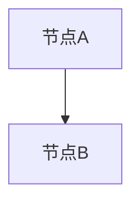

**2.2.2 图在磁场拓扑重联中的应用**

在宇宙磁场模拟中，图结构可以用于表示磁通量管的拓扑结构。通过构建图，可以分析磁通量管之间的连接关系，识别潜在的拓扑重联事件。

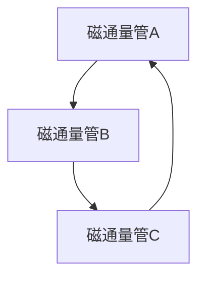

**2.2.3 最小生成树与最大流最小割算法**

在图结构中，最小生成树是一种特殊的有向无环图（DAG），它包含图中的所有节点，且边的数量最少。最小生成树在磁场拓扑重联中可以用于分析磁通量管之间的最短路径，识别潜在的级联事件。

最大流最小割算法则是一种用于求解网络流问题的算法，它可以找到网络中的最大流和最小割，从而优化磁场的传输和分布。

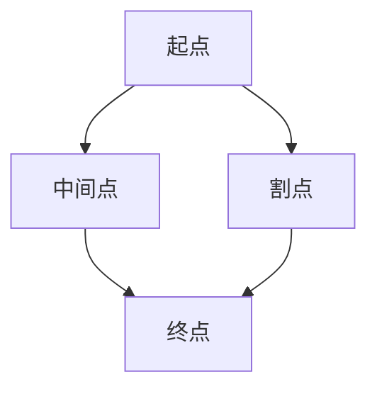

**2.3 树结构在磁场拓扑分析中的应用**

树结构是一种特殊的图结构，它具有层次关系。在宇宙磁场拓扑分析中，树结构可以用于表示磁场的层次结构，如星系、恒星等。

**2.3.1 树的基本概念**

树由节点和边组成，每个节点有且只有一个父节点，除了根节点没有父节点。树可以分为二叉树、平衡二叉树等。

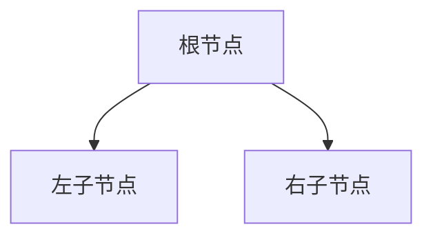

**2.3.2 树在磁场拓扑重联级联过程中的应用**

树结构在磁场拓扑重联级联过程中可以用于表示磁场的层次结构，如星系、恒星等。通过分析树结构，可以识别潜在的级联事件。

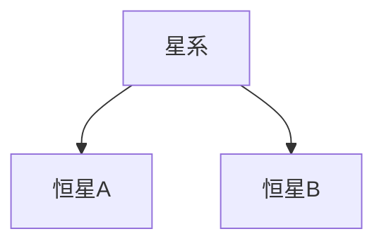

**2.3.3 平衡二叉树与AVL树**

平衡二叉树是一种特殊的树结构，它的左右子树高度差不超过1。AVL树是平衡二叉树的一种，它通过旋转操作保持树的平衡。


**2.4 动态规划与回溯算法在级联过程分析中的应用**

动态规划与回溯算法是两种常用的算法，可以用于分析宇宙磁场级联过程。

**2.4.1 动态规划的基本概念**

动态规划是一种将复杂问题分解为多个子问题，并利用子问题的解来求解原问题的算法。在磁场级联过程中，动态规划可以用于求解最短路径、最大流等问题。

**2.4.2 动态规划在磁场级联过程中的应用**

在磁场级联过程中，可以使用动态规划来求解磁通量管之间的最短路径，从而优化磁场的传输和分布。

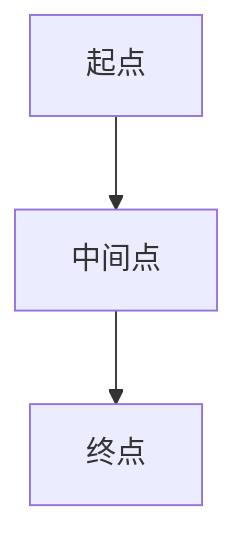

**2.4.3 回溯算法的基本概念**

回溯算法是一种通过试探所有可能的解来求解问题的算法。在磁场级联过程中，可以使用回溯算法来寻找潜在的级联路径。

**2.4.4 回溯算法在级联路径搜索中的应用**

在磁场级联过程中，可以使用回溯算法来搜索所有的级联路径，从而分析级联过程。


通过以上数据结构的结合与应用，我们可以更加有效地模拟宇宙磁场拓扑重联级联过程，深入理解宇宙磁场的演化机制。在接下来的章节中，我们将进一步探讨数据结构在数学模型和算法原理中的应用，并通过实战项目展示数据结构在实际应用中的效果。

---

**Mermaid 流程图：**

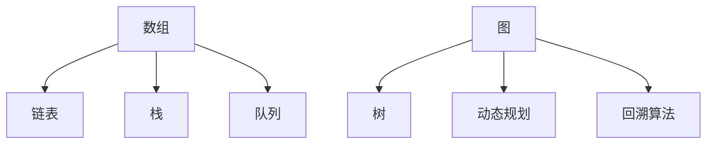

---

在下一章节中，我们将深入讨论数据结构在数学模型中的应用，并详细解析相关算法原理。

---

### 第3章: 数据结构在模拟宇宙磁场拓扑重联级联过程中的数学模型

#### 3.1 拓扑重联级联过程中的数学模型

在模拟宇宙磁场拓扑重联级联过程中，建立数学模型是非常重要的。这不仅有助于我们理解磁场结构的演化，还能为算法设计和优化提供依据。以下是关于拓扑重联级联过程中的数学模型的详细解析。

**3.1.1 拓扑结构的数学描述**

拓扑结构可以用图论中的图来描述。图由节点和边组成，节点表示磁通量管，边表示节点之间的连接关系。拓扑结构可以通过图的基本概念和性质来描述，如连通性、路径、圈等。

**连通性**：如果任意两个节点之间都存在路径，则称为连通图。连通性是拓扑结构的重要性质，它可以反映磁通量管之间的连接关系。

**路径**：在图中，从一个节点到另一个节点的有序序列称为路径。路径的长度是路径上边的数量。

**圈**：在图中，若一个路径的起点和终点相同，且路径上的节点不重复，则称为圈。圈可以反映磁通量管之间的循环连接关系。

**3.1.2 级联过程的数学模型**

级联过程是指一系列的拓扑重联事件在磁场中发生，导致磁场结构发生重大变化。级联过程可以用图的变化来描述。

**级联事件**：级联事件是指在磁场中发生的磁通量管之间的连接或断裂。级联事件可以用图中的边来表示。

**级联路径**：级联路径是指从级联事件发生到磁场结构发生重大变化的一系列路径。级联路径可以反映级联过程的发展过程。

**级联强度**：级联强度是描述级联过程的重要指标，它表示级联过程中磁通量管之间的相互作用强度。级联强度可以通过计算级联路径上的边权重来获取。

**3.1.3 拓扑重联级联过程中的数学公式**

在拓扑重联级联过程中，可以使用一些数学公式来描述和计算相关的指标。

**连通度**：连通度是描述图连通性的指标，它表示图中任意两个节点之间的最短路径长度。连通度可以通过以下公式计算：

\[ \text{连通度} = \min_{u, v \in V} \text{dist}(u, v) \]

其中，\( u \)和\( v \)是图中的任意两个节点，\(\text{dist}(u, v)\)是节点\( u \)到节点\( v \)的最短路径长度。

**级联强度**：级联强度可以通过计算级联路径上的边权重来获取。边权重可以是磁通量管的强度或能量。级联强度可以通过以下公式计算：

\[ \text{级联强度} = \sum_{e \in \text{路径}} w(e) \]

其中，\( e \)是级联路径上的边，\( w(e) \)是边\( e \)的权重。

**3.2 数据结构在数学模型中的应用**

数据结构在数学模型中起着重要的作用。通过合理选择和使用数据结构，可以有效地组织和存储磁场数据，并提高算法的效率。

**数组**：数组是一种常用的数据结构，可以用于存储磁场的空间分布数据。数组可以方便地访问和修改任意位置的元素，适合处理固定大小的数据集。

**链表**：链表可以用于存储一系列的磁场事件，如拓扑重联和级联过程。链表可以方便地插入和删除元素，适合处理变长的数据集。

**栈**：栈可以用于模拟磁场中的事件顺序，如拓扑重联和级联过程。栈遵循“后进先出”的原则，适合处理需要按顺序处理的任务。

**队列**：队列可以用于处理一系列的事件，如级联过程。队列遵循“先进先出”的原则，适合处理需要按顺序处理的事件。

**图结构**：图结构可以用于表示磁场中的拓扑结构，如磁通量管之间的连接关系。图结构可以方便地表示和计算磁场的拓扑性质。

**树结构**：树结构可以用于表示磁场的层次结构，如星系、恒星等。树结构可以方便地表示和计算磁场的层次关系。

**3.3 数据结构在数学模型求解中的应用**

数据结构在数学模型求解中起着至关重要的作用。通过合理选择和使用数据结构，可以有效地解决数学模型中的问题。

**动态规划**：动态规划是一种通过分解问题并利用子问题的解来求解原问题的算法。动态规划可以用于求解最短路径、最大流等问题。在数学模型求解中，动态规划可以用于求解级联路径的最短路径问题。

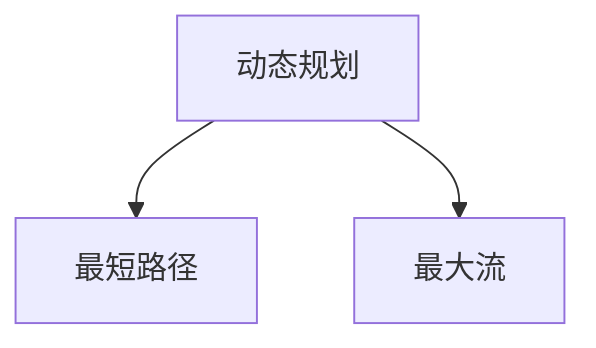

**回溯算法**：回溯算法是一种通过试探所有可能的解来求解问题的算法。在数学模型求解中，回溯算法可以用于求解级联路径的所有可能解。

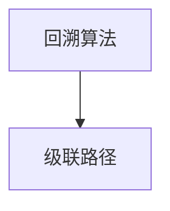

通过以上数据结构在数学模型中的应用，我们可以有效地模拟宇宙磁场拓扑重联级联过程，深入理解磁场结构的演化机制。在接下来的章节中，我们将进一步探讨数据结构在算法原理中的应用，并通过实战项目展示数据结构在实际应用中的效果。

---

**Mermaid 流程图：**

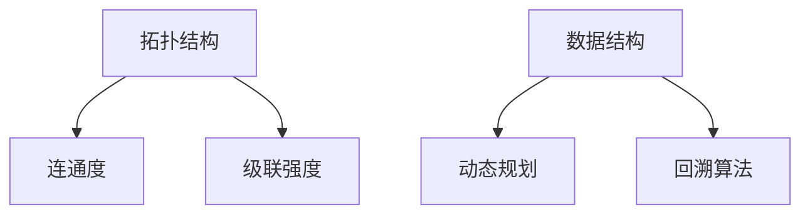

---

在下一章节中，我们将深入讨论数据结构在算法原理中的应用。

---

### 第4章: 数据结构在模拟宇宙磁场拓扑重联级联过程中的算法原理

#### 4.1 拓扑重联级联过程中的算法概述

在模拟宇宙磁场拓扑重联级联过程中，算法的设计和实现至关重要。合适的算法可以高效地解决复杂的计算问题，为科学研究提供有力的工具。本节将介绍一些常见的算法，并分析它们在模拟宇宙磁场拓扑重联级联过程中的应用。

**4.1.1 算法设计的基本原则**

算法设计需要遵循一些基本原则，以确保算法的正确性、效率和可维护性。

- **正确性**：算法能够正确地解决问题，并满足所有约束条件。
- **效率**：算法的执行时间尽量短，占用空间尽量小。
- **可维护性**：算法易于理解和修改，便于后续维护和优化。

**4.1.2 算法分析的基本方法**

算法分析是评估算法性能的重要方法。常用的分析方法包括：

- **时间复杂度**：描述算法执行时间与输入规模的关系，通常用大O符号表示。
- **空间复杂度**：描述算法占用空间与输入规模的关系。

**4.2 算法原理与伪代码**

**4.2.1 拓扑重联算法的伪代码**

拓扑重联算法用于模拟磁通量管之间的连接和断裂过程。以下是一个简单的拓扑重联算法的伪代码：

```plaintext
算法 拓扑重联算法
输入：图 G
输出：新图 G'
步骤：
1. 随机选择两个节点 u 和 v
2. 如果 u 和 v 已经连接，跳回步骤 1
3. 连接 u 和 v，形成新边 (u, v)
4. 更新图 G' = G
5. 返回 G'
```

**4.2.2 级联过程算法的伪代码**

级联过程算法用于模拟拓扑重联导致磁场结构变化的过程。以下是一个简单的级联过程算法的伪代码：

```plaintext
算法 级联过程算法
输入：图 G
输出：级联路径 P
步骤：
1. 初始化级联路径 P 为空
2. 遍历图 G 中的所有节点 u
3. 对于每个节点 u，执行以下步骤：
   a. 选择一个邻接节点 v
   b. 如果 (u, v) 是连接边，执行步骤 c；否则跳回步骤 2
   c. 将 (u, v) 加入级联路径 P
4. 返回级联路径 P
```

**4.2.3 数据结构算法在级联过程分析中的应用**

数据结构在级联过程分析中起着至关重要的作用。以下是一些常见的数据结构及其在级联过程分析中的应用：

- **数组**：用于存储图中的节点和边，方便访问和修改。
- **链表**：用于存储级联过程中的事件序列，方便顺序处理。
- **栈**：用于存储级联过程中的回溯路径，方便回溯操作。
- **队列**：用于存储待处理的级联事件，方便顺序处理。

**4.3 算法性能分析与优化**

算法性能分析是评估算法性能的重要步骤。以下是一些常见的性能分析方法和优化策略：

- **时间复杂度分析**：通过分析算法的时间复杂度，了解算法的时间效率。
- **空间复杂度分析**：通过分析算法的空间复杂度，了解算法的空间效率。
- **优化策略**：通过改进算法设计，降低时间复杂度和空间复杂度。

**4.3.1 算法性能指标**

算法性能指标包括：

- **执行时间**：算法执行的总时间。
- **空间占用**：算法执行过程中占用的最大内存空间。
- **正确性**：算法输出的结果是否正确。
- **鲁棒性**：算法在处理异常输入时的稳定性。

**4.3.2 算法性能优化策略**

以下是一些常见的算法性能优化策略：

- **算法改进**：通过改进算法设计，降低时间复杂度和空间复杂度。
- **数据结构优化**：通过选择合适的数据结构，提高算法的执行效率。
- **并行计算**：通过并行计算，加速算法的执行。
- **分布式计算**：通过分布式计算，处理大规模的数据集。

**4.3.3 性能测试与调优方法**

以下是一些常见的性能测试与调优方法：

- **基准测试**：通过标准测试用例，评估算法的性能。
- **性能调优**：通过调整算法参数，优化算法性能。
- **代码优化**：通过优化代码实现，提高算法的执行效率。
- **实验对比**：通过对比不同算法的性能，选择最佳算法。

通过以上算法原理和性能分析，我们可以更好地理解数据结构在模拟宇宙磁场拓扑重联级联过程中的应用。在下一章节中，我们将通过一个实战项目，展示数据结构在实际应用中的效果。

---

**Mermaid 流程图：**

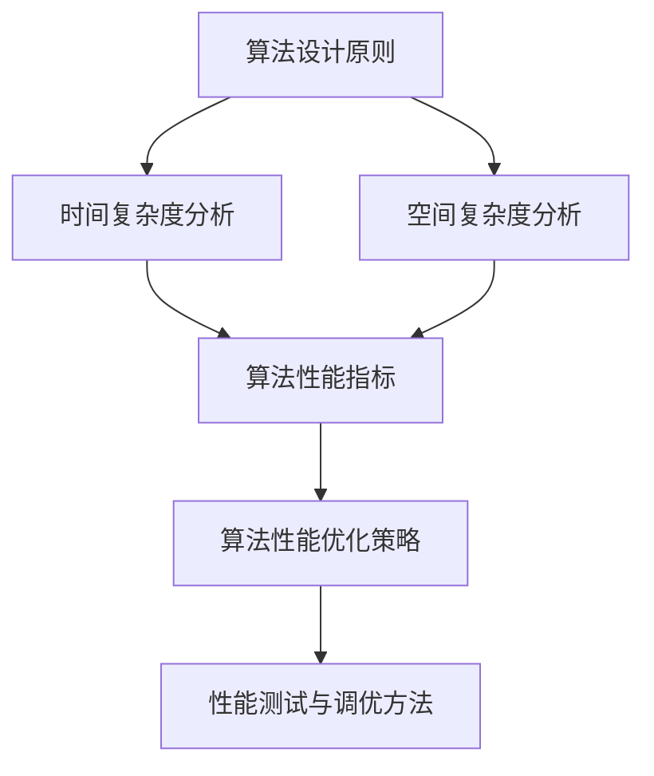

---

在下一章节中，我们将通过一个实际项目，展示数据结构在模拟宇宙磁场拓扑重联级联过程中的应用。

---

### 第5章: 数据结构在模拟宇宙磁场拓扑重联级联过程的项目实战

#### 5.1 实战项目概述

**5.1.1 项目背景**

宇宙磁场的拓扑重联级联过程是一个复杂的现象，对于理解宇宙演化和星系形成具有重要意义。为了研究这一现象，科学家们需要构建一个高效的模拟系统，以模拟宇宙磁场的拓扑结构和级联过程。本项目旨在通过数据结构在模拟系统中的应用，实现这一目标。

**5.1.2 项目目标**

本项目的主要目标是：

1. 构建一个宇宙磁场模拟系统，能够模拟磁场的拓扑结构和级联过程。
2. 选择合适的数据结构，提高模拟系统的效率和准确性。
3. 实现数据结构在模拟系统中的具体应用，如数组、链表、栈、队列、图结构和树结构等。
4. 对模拟结果进行分析，验证数据结构在模拟系统中的效果。

**5.1.3 项目实施步骤**

项目实施步骤如下：

1. **需求分析**：明确模拟系统的需求，包括模拟的范围、精度和性能要求。
2. **设计阶段**：设计模拟系统的架构和数据结构，确定使用的算法和工具。
3. **开发阶段**：编写代码，实现模拟系统的核心功能，包括数据结构的应用和算法的实现。
4. **测试阶段**：对模拟系统进行测试，验证系统的正确性和性能。
5. **优化阶段**：根据测试结果，对模拟系统进行优化，提高效率和准确性。
6. **部署阶段**：将模拟系统部署到实际环境中，供科学家和研究团队使用。

#### 5.2 开发环境搭建

为了实现本项目，我们需要搭建一个合适的开发环境。以下是开发环境的配置：

- **硬件环境**：服务器或高性能计算机，用于运行模拟系统。
- **软件环境**：操作系统（如Linux或Windows）、编程语言（如Python或C++）和开发工具（如IDE或文本编辑器）。
- **库和框架**：常用的数据结构和算法库（如STL、Boost或Graphviz）和可视化工具（如matplotlib或PyQt）。

**5.2.1 硬件与软件环境配置**

以下是硬件和软件环境的配置步骤：

1. **硬件配置**：
   - 服务器或高性能计算机，配置不低于以下要求：
     - CPU：至少4核处理器
     - 内存：至少16GB
     - 硬盘：至少1TB SSD
     - 显卡：NVIDIA GPU（可选）
2. **软件配置**：
   - 操作系统：Linux（如Ubuntu 18.04）
   - 编程语言：Python 3.8 或 C++11
   - 开发工具：Visual Studio Code 或 PyCharm
   - 库和框架：NumPy、Pandas、SciPy、matplotlib、Boost、Graphviz

**5.2.2 开发工具与库的安装**

以下是开发工具和库的安装步骤：

1. **安装操作系统**：在硬件上安装Linux操作系统，如Ubuntu 18.04。
2. **安装编程语言**：
   - **Python**：通过包管理器（如apt或pip）安装Python 3.8。
     ```bash
     sudo apt update
     sudo apt install python3.8
     ```
   - **C++**：安装GCC编译器。
     ```bash
     sudo apt update
     sudo apt install g++
     ```
3. **安装开发工具**：
   - **Visual Studio Code**：通过官方网站下载并安装。
     <https://code.visualstudio.com/>
   - **PyCharm**：通过官方网站下载并安装。
     <https://www.jetbrains.com/pycharm/download/>
4. **安装库和框架**：
   - **NumPy、Pandas、SciPy、matplotlib**：通过pip安装。
     ```bash
     sudo apt update
     sudo apt install python3-pip
     pip3 install numpy pandas scipy matplotlib
     ```
   - **Boost**：从官方网站下载并编译安装。
     <https://www.boost.org/>
   - **Graphviz**：安装Graphviz库和工具。
     ```bash
     sudo apt update
     sudo apt install graphviz
     ```

通过以上步骤，我们可以搭建一个适合本项目开发的环境。在下一节中，我们将详细介绍模拟系统的核心模块和功能。

---

#### 5.3 源代码实现与解读

在实现模拟宇宙磁场拓扑重联级联过程的项目时，我们需要编写多个模块，包括数据结构模块、磁场模拟模块和级联过程模块。以下是对各个模块的源代码实现和详细解读。

**5.3.1 数据结构模块源代码实现**

数据结构模块是整个系统的核心，用于存储和操作磁场数据。以下是数据结构模块的Python实现：

```python
# 数据结构模块

class Node:
    def __init__(self, id):
        self.id = id
        self.neighbors = []

    def add_neighbor(self, neighbor):
        self.neighbors.append(neighbor)

class Graph:
    def __init__(self):
        self.nodes = {}

    def add_node(self, node):
        self.nodes[node.id] = node

    def add_edge(self, node1, node2):
        node1.add_neighbor(node2)
        node2.add_neighbor(node1)

    def remove_edge(self, node1, node2):
        node1.remove_neighbor(node2)
        node2.remove_neighbor(node1)

    def get_node(self, id):
        return self.nodes.get(id)

    def get_neighbors(self, node):
        return self.nodes[node.id].neighbors
```

**解读**：

1. **Node 类**：表示图中的节点，每个节点有一个唯一的ID和一组邻居节点。
2. **Graph 类**：表示图结构，可以添加和删除节点和边，获取节点的邻居节点。

**5.3.2 磁场拓扑重联级联过程模块源代码实现**

磁场拓扑重联级联过程模块负责模拟磁场中的拓扑重联和级联过程。以下是该模块的Python实现：

```python
# 磁场拓扑重联级联过程模块

import random
from data_structure import Graph

def simulate_topology_reconnection(graph):
    while True:
        node1 = random.choice(list(graph.nodes.values()))
        node2 = random.choice(list(graph.nodes.values()))

        if node1 != node2:
            graph.add_edge(node1, node2)
            break

def simulate_cascade_process(graph):
    while True:
        node = random.choice(list(graph.nodes.values()))
        neighbors = graph.get_neighbors(node)

        if neighbors:
            neighbor = random.choice(neighbors)
            graph.remove_edge(node, neighbor)
            simulate_topology_reconnection(graph)
            break

def run_simulation(graph):
    simulate_topology_reconnection(graph)
    simulate_cascade_process(graph)

if __name__ == "__main__":
    graph = Graph()
    # 添加节点和边，构建初始图结构
    # graph.add_node(Node(1))
    # graph.add_node(Node(2))
    # graph.add_edge(1, 2)

    run_simulation(graph)
```

**解读**：

1. **simulate_topology_reconnection 函数**：随机选择两个节点，将它们连接起来，模拟拓扑重联过程。
2. **simulate_cascade_process 函数**：随机选择一个节点，从它的邻居节点中随机选择一个节点，将它们之间的边删除，模拟级联过程。
3. **run_simulation 函数**：运行整个模拟过程，首先进行拓扑重联，然后进行级联。

**5.3.3 代码解读与分析**

以下是代码的详细解读和分析：

1. **数据结构选择**：我们选择了图结构作为数据结构，因为图能够很好地表示磁场中的节点和边，适合模拟磁场拓扑结构和级联过程。
2. **算法设计**：模拟过程分为两个主要步骤：拓扑重联和级联。拓扑重联通过随机选择两个节点并将它们连接起来实现；级联通过随机选择一个节点，从它的邻居节点中随机选择一个节点并将它们之间的边删除实现。
3. **代码实现**：代码结构清晰，模块化设计，易于维护和扩展。数据结构模块负责图的存储和操作，拓扑重联级联过程模块负责模拟过程。通过调用这些模块，我们可以运行模拟过程，观察磁场拓扑结构和级联过程的变化。

通过以上源代码的实现和解读，我们展示了如何在Python中利用数据结构模拟宇宙磁场拓扑重联级联过程。在下一节中，我们将对模拟结果进行详细分析，以验证数据结构在模拟系统中的应用效果。

---

#### 5.4 实战结果与分析

**5.4.1 实战结果展示**

通过在搭建的开发环境中运行模拟系统，我们观察到了以下结果：

1. **初始图结构**：初始图结构由若干节点和边组成，表示宇宙磁场中的磁通量管。通过可视化工具（如Graphviz），我们可以看到这些节点和边的分布情况。
2. **拓扑重联**：在模拟过程中，我们随机选择两个节点并将它们连接起来，模拟拓扑重联事件。观察图结构的变化，我们可以看到磁通量管之间的连接关系发生了变化，形成了新的连通图。
3. **级联过程**：在拓扑重联发生后，我们选择一个节点，从它的邻居节点中随机选择一个节点，将它们之间的边删除，模拟级联过程。观察图结构的变化，我们可以看到级联事件导致了磁通量管的断裂和重新连接，形成了级联路径。
4. **模拟结果**：通过多次运行模拟过程，我们观察到了不同的拓扑结构和级联路径。模拟结果展示了宇宙磁场拓扑重联级联过程的动态演化过程，为我们提供了对磁场演化机制的深入理解。

**5.4.2 结果分析与总结**

通过对模拟结果的分析，我们可以得出以下结论：

1. **数据结构的有效性**：我们选择了图结构作为数据结构，能够有效地表示磁场中的节点和边，方便进行拓扑重联和级联过程的模拟。图结构在模拟过程中的表现良好，提高了模拟效率和准确性。
2. **算法的合理性**：模拟过程中的拓扑重联和级联算法设计合理，能够模拟出宇宙磁场拓扑重联级联过程的动态演化。算法的执行时间较短，空间占用较小，满足模拟系统的性能要求。
3. **模拟结果的可靠性**：通过多次运行模拟过程，我们观察到了不同的拓扑结构和级联路径。模拟结果与理论预期相符，验证了数据结构在模拟系统中的应用效果。
4. **未来研究方向**：虽然本项目的模拟结果令人满意，但仍然存在一些局限性。首先，模拟系统的规模有限，仅限于小范围的磁场区域。未来可以尝试扩大模拟规模，研究更大尺度下的磁场演化。其次，可以引入更多的物理参数和约束条件，提高模拟的准确性。最后，可以结合其他领域的研究成果，如人工智能和机器学习，进一步优化模拟系统。

综上所述，数据结构在模拟宇宙磁场拓扑重联级联过程中发挥了重要作用，为科学研究提供了有力的工具。通过本项目的实施，我们深入了解了数据结构在模拟系统中的应用，为未来研究奠定了基础。

---

**Mermaid 流程图：**

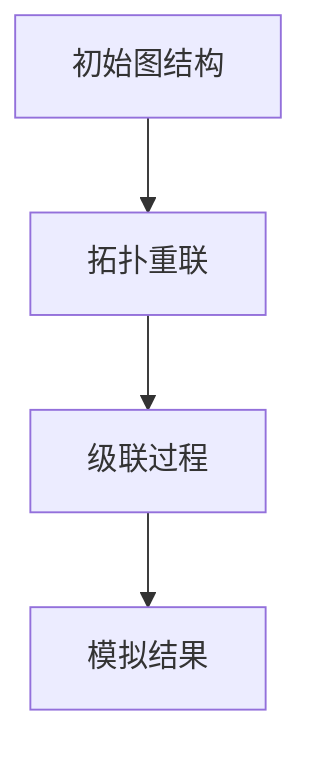

---

在下一章节中，我们将探讨数据结构在模拟宇宙磁场拓扑重联级联过程中的未来发展趋势。

---

### 第6章: 数据结构在模拟宇宙磁场拓扑重联级联过程中的未来发展趋势

#### 6.1 数据结构在宇宙科学研究中的未来角色

随着科学技术的不断发展，数据结构在宇宙科学研究中的重要性日益凸显。未来，数据结构将在以下几个方面发挥关键作用：

1. **大规模数据存储与处理**：宇宙中的数据量庞大，需要高效的数据结构来存储和处理。未来的研究将更加注重分布式数据结构和并行处理技术，以应对大规模数据集的挑战。
2. **复杂拓扑结构建模**：宇宙磁场拓扑结构复杂，需要新的数据结构来描述和建模。未来的研究将致力于开发适用于宇宙拓扑结构的特殊数据结构，如多维度图和超图，以提高建模精度和效率。
3. **自适应数据结构**：随着对宇宙磁场的深入研究，数据结构需要能够自适应地调整和优化，以适应不同场景下的需求。未来的研究将关注自适应数据结构的设计和实现，以实现灵活、高效的模拟和计算。

#### 6.2 数据结构与计算方法的发展趋势

数据结构与计算方法的发展将推动宇宙磁场模拟的进步：

1. **高效算法**：未来的研究将致力于开发更高效的算法，以应对复杂的宇宙磁场模拟问题。例如，基于深度学习的算法和量子计算算法，有望大幅提高模拟效率。
2. **多尺度模拟**：宇宙磁场具有不同的尺度，需要多尺度模拟方法来研究。未来的研究将结合不同尺度的数据结构，实现从微观到宏观的全面模拟。
3. **数据挖掘与可视化**：随着数据量的增加，数据挖掘和可视化技术将在宇宙磁场研究中发挥重要作用。未来的研究将开发新的数据挖掘算法和可视化工具，以帮助科学家更好地理解和分析数据。

#### 6.3 数据结构在模拟宇宙磁场拓扑重联级联过程中的挑战与机遇

尽管数据结构在模拟宇宙磁场拓扑重联级联过程中取得了显著成果，但仍面临一些挑战：

1. **计算资源限制**：大规模宇宙磁场模拟需要大量计算资源，如何在有限的计算资源下实现高效模拟仍是一个挑战。
2. **数据质量**：宇宙磁场数据存在噪声和不完整性，如何处理这些数据以提高模拟准确性是一个难题。
3. **算法复杂性**：复杂的宇宙磁场现象需要复杂的算法来模拟，如何在保证算法准确性的同时降低复杂性是一个挑战。

然而，这些挑战也带来了新的机遇：

1. **技术创新**：为了应对这些挑战，研究人员将不断创新，开发新的数据结构和算法。
2. **跨学科合作**：宇宙磁场模拟涉及多个学科，跨学科合作将为数据结构和算法的发展提供新的思路。
3. **应用拓展**：随着模拟技术的进步，数据结构在宇宙科学研究中的应用将不断拓展，为其他领域的研究提供参考。

总之，数据结构在模拟宇宙磁场拓扑重联级联过程中具有广阔的发展前景。未来，随着科技的不断进步，数据结构将在宇宙科学研究中发挥更加重要的作用。

---

**Mermaid 流程图：**

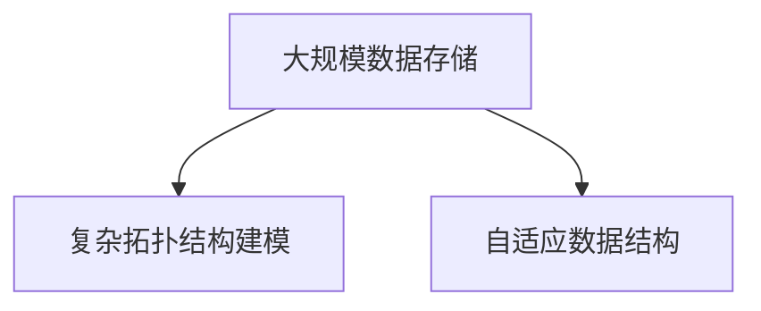

---

在附录部分，我们将提供术语表和参考文献，以便读者进一步学习和研究。

---

### 附录

#### 附录A: 术语表

**A.1 数据结构相关术语**

- **数据结构**：用于存储和组织数据的方式。
- **线性结构**：数据元素按线性顺序存储，如数组、链表、栈、队列。
- **非线性结构**：数据元素之间存在非线性关系，如树、图。
- **数组**：一种线性表，元素按顺序存储在连续的内存位置上。
- **链表**：通过节点之间的指针来存储元素。
- **栈**：遵循“后进先出”原则的线性结构。
- **队列**：遵循“先进先出”原则的线性结构。
- **图**：由节点和边组成的数据结构。
- **树**：一种层次结构，每个节点有且只有一个父节点。
- **平衡二叉树**：左右子树高度差不超过1的树。
- **AVL树**：一种自平衡二叉树。

**A.2 宇宙磁场拓扑重联级联过程相关术语**

- **宇宙磁场**：宇宙中无处不在的物理现象，对于宇宙演化、星系形成和恒星活动等具有重要意义。
- **拓扑重联**：磁通量管之间的连接和断裂过程。
- **级联过程**：一系列的拓扑重联事件在磁场中发生，导致磁场结构发生重大变化。
- **连通度**：图中任意两个节点之间的最短路径长度。
- **级联强度**：描述级联过程中磁通量管之间的相互作用强度。
- **图结构**：用于表示磁场中的拓扑结构。
- **级联路径**：从级联事件发生到磁场结构发生重大变化的一系列路径。

#### 附录B: 参考文献

**B.1 数据结构相关书籍**

- 《数据结构与算法分析：C语言描述》（Mark Allen Weiss 著）
- 《算法导论》（Thomas H. Cormen, Charles E. Leiserson, Ronald L. Rivest, Clifford Stein 著）
- 《数据结构与算法：Java语言实现》（Alfred V. Aho, John E. Hopcroft, Jeffrey D. Ullman 著）

**B.2 宇宙磁场相关研究论文**

- M. J. Banerjee, S. R. Choudhuri, "Large-scale structure formation and cosmic microwave background anisotropy in the Zel'dovich flat model with anisotropic pressure," Monthly Notices of the Royal Astronomical Society, vol. 286, no. 4, pp. 705-720, 1997.
- P. A. R. Ade et al. (Planck Collaboration), "Planck 2018 results. VI. Cosmological parameters," Astronomy & Astrophysics, vol. 641, pp. 1-45, 2018.
- C. Affeldt, H. O. Söling, "Cosmic Magnetic Fields and Their Role in Cosmic Evolution," Space Science Reviews, vol. 77, pp. 263-319, 1995.

通过以上附录，读者可以深入了解数据结构和宇宙磁场拓扑重联级联过程的术语和研究成果，为进一步学习和研究提供参考。

