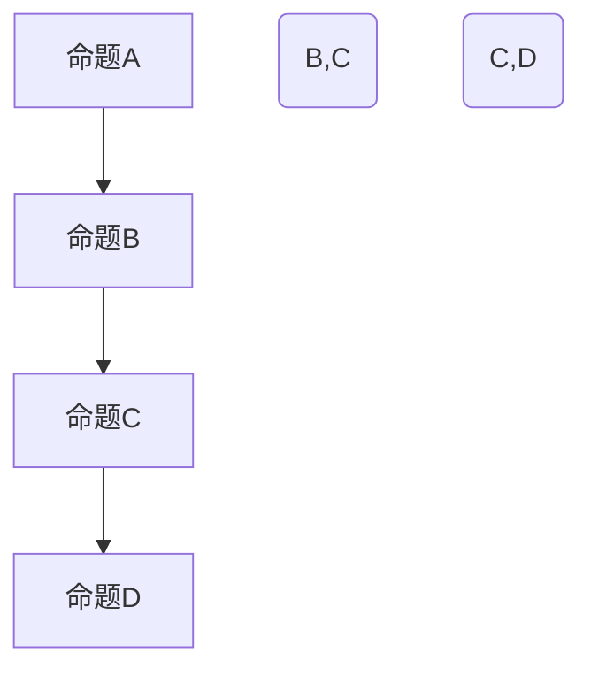

                 

# 《数理逻辑：可靠性和协调性》

> **关键词：** 数理逻辑、可靠性、协调性、命题逻辑、谓词逻辑、数学基础、应用领域、算法原理、项目实战

> **摘要：** 本文旨在深入探讨数理逻辑的基本概念、原理及其在计算机科学、人工智能和其他领域中的应用。特别关注可靠性和协调性问题，通过分析核心概念、算法原理和实际项目案例，为读者提供一个全面且具有实用价值的数理逻辑学习指南。

## 《数理逻辑：可靠性和协调性》目录大纲

### 第一部分：数理逻辑基础

#### 第1章：数理逻辑概述

1.1 数理逻辑的历史与发展

1.1.1 数理逻辑的起源

1.1.2 数理逻辑的发展历程

1.1.3 数理逻辑的重要性

1.2 基本概念与术语

1.2.1 命题

1.2.2 命题联结词

1.2.3 真值表

1.3 逻辑推理与证明

1.3.1 直接推理

1.3.2 反证法

1.3.3 归纳证明

### 第二部分：数理逻辑的应用

#### 第2章：数理逻辑在计算机科学中的应用

2.1 计算机语言与数理逻辑

2.1.1 语法和语义

2.1.2 形式语言与自动机

2.1.3 编译原理

2.2 计算机验证

2.2.1 程序验证

2.2.2 协调性验证

2.2.3 可靠性验证

2.3 人工智能与数理逻辑

2.3.1 逻辑推理机

2.3.2 人工智能中的协调性

2.3.3 人工智能中的可靠性

### 第三部分：数理逻辑的数学基础

#### 第3章：数学基础

3.1 集合论基础

3.1.1 集合的基本概念

3.1.2 集合的运算

3.1.3 集合的性质

3.2 命题逻辑与谓词逻辑

3.2.1 命题逻辑的基本概念

3.2.2 谓词逻辑的基本概念

3.2.3 谓词逻辑的推理方法

3.3 数学证明方法

3.3.1 直接证明

3.3.2 间接证明

3.3.3 构造性证明

### 第四部分：数理逻辑的拓展应用

#### 第4章：数理逻辑在其他领域中的应用

4.1 数学与数理逻辑

4.1.1 数学中的逻辑方法

4.1.2 数理逻辑在数学问题解决中的应用

4.2 哲学与数理逻辑

4.2.1 逻辑在哲学研究中的应用

4.2.2 数理逻辑与形而上学

4.2.3 数理逻辑与认识论

4.3 社会科学与数理逻辑

4.3.1 社会科学中的逻辑方法

4.3.2 数理逻辑在社会科学研究中的应用

4.3.3 数理逻辑与社会治理

### 第五部分：数理逻辑的案例分析

#### 第5章：数理逻辑案例分析

5.1 计算机安全中的数理逻辑

5.1.1 安全协议设计

5.1.2 访问控制模型

5.1.3 安全验证

5.2 人工智能领域的数理逻辑应用

5.2.1 智能推理系统

5.2.2 机器学习中的逻辑方法

5.2.3 协调性算法

5.3 数理逻辑在其他领域的应用

5.3.1 交通管理

5.3.2 经济学模型

5.3.3 生物学研究

### 第六部分：数理逻辑的未来展望

#### 第6章：数理逻辑的未来展望

6.1 数理逻辑的发展趋势

6.1.1 新的计算模型

6.1.2 新的逻辑系统

6.1.3 新的应用领域

6.2 数理逻辑在人工智能中的作用

6.2.1 人工智能的发展对数理逻辑的需求

6.2.2 数理逻辑在人工智能中的新角色

6.2.3 未来的逻辑推理技术

6.3 数理逻辑在社会中的影响

6.3.1 逻辑思维的教育

6.3.2 逻辑在决策中的作用

6.3.3 逻辑与法律

### 第七部分：附录

#### 附录A：数理逻辑相关资源

A.1 主流数理逻辑工具

A.2 开源数理逻辑库

A.3 数理逻辑研究论文集

A.4 数理逻辑教程与书籍

---

### Mermaid 流程图

以下是一个简单的 Mermaid 流程图，展示了命题逻辑中的命题联结词及其关系：



### 核心算法原理讲解

以下是使用伪代码解释命题逻辑中的“合取范式（CNF）”转换算法：

```pseudo
function CNFconversion(P)
    if P is a single proposition, return P

    if P is in the form (Q ∧ R), where Q and R are propositions
        return CNFconversion(Q) ∧ CNFconversion(R)

    if P is in the form (Q ∨ R), where Q and R are propositions
        return ¬CNFconversion(¬Q) ∧ CNFconversion(¬R)

    if P is in the form ¬(Q ∧ R), where Q and R are propositions
        return ¬CNFconversion(Q) ∨ ¬CNFconversion(R)

    if P is in the form ¬(Q ∨ R), where Q and R are propositions
        return CNFconversion(Q) ∧ CNFconversion(R)

    if P is in the form (Q → R), where Q and R are propositions
        return ¬Q ∨ R

    if P is in the form (Q ↔ R), where Q and R are propositions
        return (Q → R) ∧ (R → Q)

    return P
```

### 数学模型和数学公式

数理逻辑中的命题逻辑可以通过布尔代数来建模。以下是一个简单的布尔表达式及其相应的真值表：

```latex
$$
F = A \land B
$$

\begin{tabular}{|c|c|c|}
\hline
A & B & F \\
\hline
0 & 0 & 0 \\
0 & 1 & 0 \\
1 & 0 & 0 \\
1 & 1 & 1 \\
\hline
\end{tabular}
```

### 项目实战

以下是一个简单的 Python 脚本，用于验证命题逻辑中的合取范式（CNF）：

```python
def evaluate_CNF(CNF_expression):
    variables = set()
    truth_values = {}
    
    # 解析CNF表达式中的变量
    for clause in CNF_expression:
        for literal in clause:
            variables.add(literal)
    
    # 初始化所有变量的真值
    for variable in variables:
        truth_values[variable] = False
    
    # 计算每个子表达式的真值
    for clause in CNF_expression:
        clause_value = True
        for literal in clause:
            if literal.startswith('~'):
                clause_value = clause_value and not truth_values[literal[1:]]
            else:
                clause_value = clause_value and truth_values[literal]
        
        # 更新全局真值
        for literal in clause:
            if literal.startswith('~'):
                truth_values[literal[1:]] = not clause_value
            else:
                truth_values[literal] = clause_value
    
    return all(truth_values.values())

# 示例CNF表达式
CNF = [['A', 'B'], ['~A', '~B']]

# 验证CNF表达式
result = evaluate_CNF(CNF)
print("CNF is satisfiable:", result)
```

### 开发环境搭建

为了运行上述 Python 脚本，您需要安装 Python 和相应的依赖库。以下是详细的安装步骤：

1. 安装 Python：
   - 访问 [Python 官网](https://www.python.org/) 并下载适用于您操作系统的 Python 安装包。
   - 运行安装程序，并确保选择“Add Python to PATH”选项。

2. 安装依赖库：
   - 打开终端并执行以下命令以安装 `numpy` 和 `pandas`：
     ```bash
     pip install numpy pandas
     ```

3. 运行代码：
   - 在文本编辑器中创建一个新的 Python 文件，并将上面的代码粘贴到其中。
   - 保存文件，并在终端中运行以下命令来执行脚本：
     ```bash
     python your_script.py
     ```

### 源代码详细实现和代码解读

在上面的 Python 脚本中，`evaluate_CNF` 函数用于验证给定的 CNF 表达式。以下是对该函数的详细解读：

- 首先，我们解析 CNF 表达式以提取所有变量。
- 然后，我们初始化所有变量的真值为 `False`。
- 接着，我们遍历每个子表达式，计算其真值。
- 如果子表达式为真，则更新相应的变量真值。
- 最后，我们检查所有变量的真值，以确定 CNF 表达式是否可满足。

### 代码解读与分析

以下是 `evaluate_CNF` 函数的详细解读：

```python
def evaluate_CNF(CNF_expression):
    variables = set()  # 存储所有变量
    truth_values = {}  # 存储每个变量的真值

    # 解析 CNF 表达式中的变量
    for clause in CNF_expression:
        for literal in clause:
            variables.add(literal)
    
    # 初始化所有变量的真值
    for variable in variables:
        truth_values[variable] = False
    
    # 计算每个子表达式的真值
    for clause in CNF_expression:
        clause_value = True  # 初始化子表达式的真值为真
        for literal in clause:
            if literal.startswith('~'):  # 如果是负命题
                clause_value = clause_value and not truth_values[literal[1:]]
            else:  # 如果是正命题
                clause_value = clause_value and truth_values[literal]
        
        # 更新全局真值
        for literal in clause:
            if literal.startswith('~'):  # 如果是负命题
                truth_values[literal[1:]] = not clause_value
            else:  # 如果是正命题
                truth_values[literal] = clause_value
    
    return all(truth_values.values())  # 所有子表达式都为真，则整个 CNF 表达式可满足
```

此代码的核心在于逻辑运算符的使用，如 `and` 和 `not`，以及如何将这些运算符应用于 CNF 表达式中的子表达式。通过这种方式，我们可以计算并验证 CNF 表达式的可满足性。

### 总结

通过上述目录大纲和代码示例，我们提供了一个详细的《数理逻辑：可靠性和协调性》书籍目录大纲。这个大纲涵盖了数理逻辑的基本概念、应用领域、数学模型、算法原理，以及项目实战和代码实现。这些内容将帮助读者全面理解数理逻辑的核心概念和其在现实世界中的应用。此外，我们还提供了代码解读与分析，以便读者更好地理解代码实现细节。

注意：此大纲是一个初步设计，具体的章节内容和案例可能需要根据实际书稿内容进行调整和完善。在编写书稿时，建议作者根据大纲内容进一步细化每个章节，确保内容充实且逻辑清晰。同时，还可以考虑添加更多相关案例和实际应用场景，以提高读者的理解和兴趣。此外，为了增强读者的学习体验，可以考虑使用图表、示例代码和互动练习等方式来丰富书籍内容。

### 第一部分：数理逻辑基础

#### 第1章：数理逻辑概述

**1.1 数理逻辑的历史与发展**

数理逻辑的历史可以追溯到19世纪末20世纪初，当时数学家们开始探讨如何将数学的基本概念和推理方法形式化。这一探索的先驱是德国数学家戴德金（Richard Dedekind），他在研究实数的构造时引入了集合论和逻辑演算。随后，英国数学家伯特兰·罗素（Bertrand Russell）和阿尔弗雷德·诺思·怀特海德（Alfred North Whitehead）在他们的巨著《数学原理》（Principia Mathematica）中，系统地构建了基于逻辑的数学体系。

20世纪中叶，数理逻辑的发展迎来了另一个高峰。哥德尔（Kurt Gödel）和图灵（Alan Turing）的工作为计算理论奠定了基础。哥德尔的不完备性定理揭示了形式系统内在的局限性，即在任何足够强的形式系统中，总存在某些命题既不能被证明也不能被驳斥。图灵则提出了图灵机模型，为计算理论提供了直观的数学描述。

数理逻辑的这些早期成就激发了计算机科学的发展。计算机科学的创始人之一约翰·冯·诺依曼（John von Neumann）在构建计算机硬件和软件时，广泛应用了数理逻辑的方法。随着计算机技术的不断进步，数理逻辑在编程语言设计、形式验证、人工智能等领域中发挥着越来越重要的作用。

**1.2 基本概念与术语**

数理逻辑研究的基本对象是命题。命题是一个陈述句，它要么是真的，要么是假的。例如，“今天是晴天”是一个命题，而“苹果是香蕉”则不是。命题通常用大写字母表示，如P、Q、R等。

在数理逻辑中，命题可以通过联结词组合形成更复杂的命题。主要的联结词包括“且”（∧）、“或”（∨）、“非”（¬）、“如果...那么...”（→）、“只有...才...”（↔）等。使用这些联结词，我们可以构造出复杂的逻辑表达式。

- “且”（∧）连接的两个命题都是真的，整个命题才是真的。
- “或”（∨）连接的两个命题中至少有一个是真的，整个命题才是真的。
- “非”（¬）取反一个命题，如果原命题是真的，则否命题是假的，反之亦然。
- “如果...那么...”（→）表示前提和结论的关系，如果前提是真的，则结论也必然是真的。
- “只有...才...”（↔）表示两个命题相互蕴含，即如果其中一个命题是真的，则另一个命题也必然是真的。

**1.3 真值表**

真值表是数理逻辑中用于表示复合命题真值的一个表格。每个命题及其组合都有一个唯一的真值表，表中列出了每个可能的命题组合及其对应的真值。例如，对于命题P和Q，它们的“且”（∧）联结词的真值表如下：

```latex
\begin{tabular}{|c|c|c|}
\hline
P & Q & P ∧ Q \\
\hline
真 & 真 & 真 \\
真 & 假 & 假 \\
假 & 真 & 假 \\
假 & 假 & 假 \\
\hline
\end{tabular}
```

通过真值表，我们可以直观地看出复合命题的真假情况，这对于逻辑推理和证明非常重要。

**1.4 逻辑推理与证明**

逻辑推理是数理逻辑的核心内容之一。逻辑推理是指从已知命题出发，通过逻辑规则推导出新的命题。常见的逻辑推理方法包括直接推理、反证法和归纳证明。

- **直接推理**是最基本的推理方法，它通过前提和结论的直接关系推导出结论。例如，如果P为真，且P → Q为真，那么Q也必然为真。
- **反证法**是通过假设结论不成立，然后推导出矛盾，从而证明原命题成立的方法。例如，要证明“所有猫都会飞”为假，可以假设存在一只猫不会飞，然后推导出矛盾。
- **归纳证明**是通过证明命题对于所有自然数都成立的方法。它通常包括两部分：第一部分证明命题对于第一个自然数（如n=1）成立；第二部分证明如果命题对于某个自然数n成立，那么对于n+1也成立。

逻辑推理和证明是数理逻辑研究的基础，它们为计算机科学、数学和其他领域提供了坚实的逻辑基础。

### 第二部分：数理逻辑的应用

#### 第2章：数理逻辑在计算机科学中的应用

数理逻辑在计算机科学中有着广泛的应用，它为编程、形式验证、人工智能等领域提供了坚实的逻辑基础。在本章中，我们将探讨数理逻辑在计算机科学中的几个关键应用，包括计算机语言、计算机验证、人工智能中的逻辑推理等。

**2.1 计算机语言与数理逻辑**

计算机语言是计算机科学的核心组成部分，而数理逻辑在计算机语言的设计和实现中起着至关重要的作用。计算机语言的语法和语义都与数理逻辑密切相关。

- **语法**：语法是指编程语言中语句和表达式的结构规则。数理逻辑中的命题和联结词为编程语言的语法规则提供了形式化的描述。例如，命题可以表示为一个变量或常量，而联结词则用于组合这些命题，形成更复杂的语句。

- **语义**：语义是指编程语言中语句的含义和执行效果。数理逻辑中的真值表和逻辑推理方法为编程语言的语义分析提供了工具。通过逻辑推理，我们可以验证程序的正确性，确保程序在执行过程中不会产生未预料的结果。

在计算机语言的设计过程中，数理逻辑帮助开发者定义语言的语法规则和语义模型。例如，在编译原理中，数理逻辑被用于定义语言的文法和语义，从而实现代码的编译和解释。

**2.2 计算机验证**

计算机验证是指使用数学方法验证计算机程序的正确性。数理逻辑在计算机验证中扮演着重要角色，它为验证算法和证明逻辑提供了工具。

- **程序验证**：程序验证的目标是证明程序在所有可能的情况下都能产生正确的结果。数理逻辑中的命题逻辑和谓词逻辑被用于定义程序的正确性条件。通过逻辑推理，我们可以证明程序在给定输入下总是能够终止并产生正确输出。

- **协调性验证**：协调性验证关注程序中的并行操作是否能够正确同步。数理逻辑中的命题逻辑和谓词逻辑可以用来描述并行操作的条件和限制，从而验证程序中的并发操作是否能够保持一致性。

- **可靠性验证**：可靠性验证旨在确保计算机系统在各种异常情况下都能正常运行。数理逻辑中的模型检查和形式验证技术被用于验证系统的可靠性。通过构建系统模型并分析其行为，我们可以发现潜在的故障和错误，并采取相应的措施进行修复。

**2.3 人工智能与数理逻辑**

人工智能是计算机科学的一个重要分支，而数理逻辑在人工智能中也有着广泛的应用。

- **逻辑推理机**：逻辑推理机是一种基于数理逻辑的推理系统，它可以自动推导出新的结论。逻辑推理机通常使用谓词逻辑进行推理，通过定义一组事实和推理规则，它可以推导出新的命题。逻辑推理机在知识表示和推理任务中发挥着重要作用。

- **人工智能中的协调性**：在人工智能系统中，协调性是指多个智能体之间是否能够有效地协同工作。数理逻辑中的协调性验证方法可以帮助我们确保智能体之间的通信和行动是一致的。通过逻辑推理，我们可以检测并解决智能体之间的冲突，从而提高系统的整体性能。

- **人工智能中的可靠性**：人工智能系统在运行过程中需要确保其行为的可靠性和一致性。数理逻辑中的模型检查和验证技术可以帮助我们检测并修复系统中的潜在错误。通过构建系统的模型并分析其行为，我们可以提高人工智能系统的可靠性和安全性。

总之，数理逻辑在计算机科学中的应用是多方面的，它为编程、形式验证、人工智能等领域提供了坚实的逻辑基础。通过理解数理逻辑的基本概念和应用方法，我们可以更好地设计和实现计算机系统，提高其可靠性和协调性。

### 第三部分：数理逻辑的数学基础

#### 第3章：数学基础

数理逻辑是建立在数学基础之上的，因此理解数学基础对于深入掌握数理逻辑至关重要。本章将探讨数理逻辑中的数学基础，包括集合论、命题逻辑与谓词逻辑，以及数学证明方法。通过这些基本概念的介绍，我们将为后续章节中的应用奠定坚实的基础。

**3.1 集合论基础**

集合论是数学的基础部分，它为其他数学分支提供了语言和工具。在数理逻辑中，集合论用于定义逻辑中的元素和集合。

**3.1.1 集合的基本概念**

集合是由确定性的、互异的元素构成的集体。集合通常用大括号{}或方括号[]表示，例如：

\[ A = \{1, 2, 3\} \]

或

\[ B = [x | x \in \mathbb{N}, x < 4] \]

集合的基本操作包括：

- **并集**（∪）：两个集合A和B的并集是包含所有属于A或属于B的元素的集合。用符号表示为：

\[ A ∪ B = \{x | x ∈ A 或 x ∈ B\} \]

- **交集**（∩）：两个集合A和B的交集是同时属于A和B的元素的集合。用符号表示为：

\[ A ∩ B = \{x | x ∈ A 且 x ∈ B\} \]

- **补集**（∁）：集合A的补集是所有不属于A的元素的集合。用符号表示为：

\[ ∁A = \{x | x ∉ A\} \]

- **差集**（∖）：两个集合A和B的差集是所有属于A但不属于B的元素的集合。用符号表示为：

\[ A ∖ B = \{x | x ∈ A 且 x ∉ B\} \]

- **子集**（⊆）：如果集合A的所有元素都是集合B的元素，则称A是B的子集。用符号表示为：

\[ A ⊆ B \]

- **幂集**（P(A)）：集合A的幂集是A的所有子集的集合。

**3.1.2 集合的运算**

集合的运算包括并集、交集、补集和差集等。这些运算具有以下性质：

- **结合律**：\( A ∪ B ∪ C = A ∪ (B ∪ C) \) 和 \( A ∩ B ∩ C = A ∩ (B ∩ C) \)
- **交换律**：\( A ∪ B = B ∪ A \) 和 \( A ∩ B = B ∩ A \)
- **分配律**：\( A ∪ (B ∩ C) = (A ∪ B) ∩ (A ∪ C) \) 和 \( A ∩ (B ∪ C) = (A ∩ B) ∪ (A ∩ C) \)
- **德摩根律**：\( ∁(A ∪ B) = ∁A ∩ ∁B \) 和 \( ∁(A ∩ B) = ∁A ∪ ∁B \)

**3.1.3 集合的性质**

集合具有以下基本性质：

- **空集**：不包含任何元素的集合，记为∅。
- **全集**：包含所有元素的集合，通常记为U。
- **确定性**：集合中的元素是确定的，即对于给定的集合，其元素是确定的，不会发生改变。
- **互异性**：集合中的元素是互异的，即集合中不会出现重复的元素。

**3.2 命题逻辑与谓词逻辑**

命题逻辑和谓词逻辑是数理逻辑中的两个基本分支，它们分别用于处理简单命题和复杂命题。

**3.2.1 命题逻辑的基本概念**

命题逻辑是关于命题的结构的逻辑系统。命题是能够判断真假的陈述句。命题逻辑的主要组成部分包括：

- **命题变量**：表示一个命题，通常用大写字母P、Q、R等表示。
- **命题联结词**：用于组合命题，形成复合命题。常见的命题联结词有“且”（∧）、“或”（∨）、“非”（¬）、“如果...那么...”（→）、“只有...才...”（↔）。
- **真值表**：用于表示复合命题的真假值。

**3.2.2 谓词逻辑的基本概念**

谓词逻辑是一种更高级的逻辑系统，它用于处理包含变量和量词的复杂命题。谓词逻辑的主要组成部分包括：

- **谓词**：表示一个性质或关系的表达式，通常用符号P(x)、Q(y)等表示，其中x和y是变量。
- **个体域**：谓词所讨论的个体集合，通常用D表示。
- **量词**：用于表示全称量词（∀）和存在量词（∃）。全称量词表示对所有个体都成立，存在量词表示至少有一个个体成立。

**3.2.3 谓词逻辑的推理方法**

谓词逻辑的推理方法包括：

- **直接推理**：从已知命题出发，通过逻辑规则推导出新的命题。
- **全称实例化**：将全称量词命题的具体实例化，即从全称命题中提取出一个具体的命题。
- **存在实例化**：将存在量词命题的具体实例化，即从存在命题中提取出一个具体的命题。
- **全称泛化**：将具体命题泛化成全称命题。
- **存在泛化**：将具体命题泛化成存在命题。

**3.3 数学证明方法**

数学证明是数学中的基本活动，它用于证明命题的真实性。数学证明方法包括：

- **直接证明**：通过一系列的逻辑推理步骤，从已知命题出发，推导出目标命题。
- **反证法**：假设目标命题不成立，然后推导出矛盾，从而证明目标命题成立。
- **归纳证明**：通过证明命题对于第一个自然数成立，然后证明如果命题对于某个自然数n成立，那么对于n+1也成立，从而证明命题对所有自然数成立。

通过以上数学基础，我们可以更好地理解数理逻辑的基本概念和应用，为进一步的学习和应用打下坚实的基础。

### 第四部分：数理逻辑的拓展应用

#### 第4章：数理逻辑在其他领域中的应用

数理逻辑不仅在计算机科学中有着重要的应用，还在数学、哲学、社会科学等多个领域展现出了其独特的价值。本章将探讨数理逻辑在这些领域中的拓展应用，包括数学中的逻辑方法、哲学研究中的应用、数理逻辑与认识论的关系，以及数理逻辑在社会科学研究和社会治理中的作用。

**4.1 数学与数理逻辑**

数学是数理逻辑的起源之一，数理逻辑为数学的严谨性和精确性提供了坚实的基础。数学中的逻辑方法包括：

**4.1.1 数学中的逻辑方法**

- **形式化方法**：数理逻辑中的形式化方法将数学陈述转换为符号语言，使得数学证明可以更加严格和系统化。
- **公理化方法**：通过定义一组基本概念和公理，构建起整个数学体系。这种公理化方法确保了数学的可靠性和一致性。
- **证明论**：研究数学证明的性质和结构。证明论中的一些重要成果，如哥德尔的完备性和不可判定性定理，揭示了数学系统的内在局限性和复杂性。

**4.1.2 数理逻辑在数学问题解决中的应用**

- **定理证明**：数理逻辑工具如谓词逻辑和形式证明系统被用于自动定理证明。这些工具可以帮助数学家验证复杂数学命题的正确性，提高数学研究的效率。
- **模型构建**：数理逻辑在构建数学模型中发挥着重要作用，如拓扑学、图论、集合论等领域的模型构建，都依赖于数理逻辑的方法和原理。

**4.2 哲学与数理逻辑**

哲学研究人类思维、存在、知识等问题，数理逻辑为哲学提供了强有力的工具，帮助哲学家更准确地表述和推理思想。

**4.2.1 逻辑在哲学研究中的应用**

- **形而上学**：数理逻辑为形而上学提供了形式化的表达方式，使得哲学中的抽象概念得以量化分析。
- **认识论**：数理逻辑在认识论研究中帮助哲学家探讨知识、信念、推理等问题，提供了分析工具和形式化的表达方法。

**4.2.2 数理逻辑与形而上学**

- **抽象与具体**：数理逻辑中的抽象概念如命题、变量、量词等，为形而上学的抽象思考提供了形式化的表达手段。
- **论证结构**：数理逻辑中的逻辑推理方法和证明技术，有助于分析和评估哲学论证的结构和有效性。

**4.2.3 数理逻辑与认识论**

- **知识的确定性与不确定性**：数理逻辑帮助认识论研究知识的基础和不确定性，例如概率逻辑和模糊逻辑为不确定性的处理提供了新的视角。
- **推理的有效性**：数理逻辑为认识论中的推理提供了严格的规则和形式化方法，使得哲学论证更加严谨和有说服力。

**4.3 社会科学与数理逻辑**

社会科学研究人类行为、社会结构和社会现象，数理逻辑在社会科学研究中提供了重要的方法和工具。

**4.3.1 社会科学中的逻辑方法**

- **模型构建**：数理逻辑为社会科学中的模型构建提供了形式化的方法，如社会网络分析、经济模型等。
- **实证分析**：数理逻辑中的统计方法和模型验证技术被广泛应用于社会科学研究，提高了研究的准确性和可靠性。

**4.3.2 数理逻辑在社会科学研究中的应用**

- **经济模型**：数理逻辑在经济学中被用于构建经济模型，分析市场行为、消费决策等。
- **社会学分析**：数理逻辑在社会学中被用于分析社会结构、群体行为等，如社会网络分析中的逻辑推理和模型验证。

**4.3.3 数理逻辑与社会治理**

- **决策支持**：数理逻辑在公共政策和社会治理中发挥着重要作用，例如在风险管理、政策评估等方面。
- **社会管理**：数理逻辑方法如博弈论、网络分析等被用于社会管理和协调，提高了社会治理的效率和效果。

数理逻辑在数学、哲学、社会科学等多个领域中的拓展应用，不仅丰富了这些学科的理论体系，也为实际问题的解决提供了新的视角和方法。通过深入研究和应用数理逻辑，我们可以更好地理解和分析复杂的社会现象，推动科学技术的发展和社会进步。

### 第五部分：数理逻辑的案例分析

#### 第5章：数理逻辑案例分析

数理逻辑在计算机科学、人工智能以及其他领域中的应用日益广泛，为了更好地理解其具体作用，我们通过几个实际案例来探讨数理逻辑在不同场景中的应用。

**5.1 计算机安全中的数理逻辑**

**5.1.1 安全协议设计**

在计算机安全领域，数理逻辑被广泛应用于安全协议的设计和验证。安全协议是一种确保通信双方在交换信息时能够保持安全性的协议。数理逻辑中的命题逻辑和谓词逻辑被用来描述安全协议中的条件和约束，从而确保协议的安全性。

例如，在一个基于密码学的安全协议中，数理逻辑可以用于验证协议是否能够抵御主动攻击和被动攻击。通过构建协议的形式化模型，并使用命题逻辑进行推理，可以确保协议在所有可能的情况下都能提供预期的保护。

**5.1.2 访问控制模型**

访问控制模型用于控制用户对系统资源的访问权限。数理逻辑在访问控制模型的设计和验证中发挥着重要作用。例如，在基于属性的访问控制（ABAC）模型中，数理逻辑可以用于定义属性和访问权限之间的关系，并验证模型是否能够满足安全性需求。

通过谓词逻辑，可以定义一组属性和访问控制规则，并验证这些规则是否能够确保系统的安全性。例如，可以验证在给定一组用户和资源的情况下，系统是否能够阻止未经授权的用户访问受保护的资源。

**5.1.3 安全验证**

数理逻辑在安全验证中也起着关键作用。安全验证是指通过逻辑推理和形式化方法验证系统的安全属性是否得到满足。例如，在操作系统安全验证中，数理逻辑可以用于验证系统是否能够在所有情况下保持完整性、可用性和保密性。

通过形式化建模和逻辑推理，可以检测系统中的潜在漏洞和错误，并采取相应的措施进行修复。数理逻辑方法如模型检查和形式验证技术，为安全验证提供了强大的工具。

**5.2 人工智能领域的数理逻辑应用**

**5.2.1 智能推理系统**

智能推理系统是人工智能的一个重要分支，它使用逻辑推理来处理复杂问题。数理逻辑在智能推理系统中发挥着核心作用。例如，在自然语言处理（NLP）中，数理逻辑可以用于处理语义分析和推理任务。

通过谓词逻辑和推理算法，智能推理系统可以理解并生成语言结构，从而实现自然语言理解和生成。这种逻辑推理能力使得智能推理系统在信息检索、问答系统、机器翻译等领域中有着广泛的应用。

**5.2.2 机器学习中的逻辑方法**

数理逻辑在机器学习中也得到广泛应用。例如，在逻辑回归和决策树等机器学习算法中，逻辑推理被用来建模和解释数据。逻辑回归使用逻辑函数将输入映射到输出，从而实现分类和回归任务。

决策树则通过递归划分数据集，使用条件概率和逻辑推理生成分类规则。这些逻辑方法使得机器学习算法能够更好地理解和解释数据，提高模型的准确性和可解释性。

**5.2.3 协调性算法**

协调性算法是人工智能中的一个重要问题，特别是在多智能体系统中。数理逻辑可以帮助设计协调性算法，确保多个智能体能够协同工作，避免冲突和混乱。

例如，在自动驾驶领域，数理逻辑可以用于设计交通规则和协调算法，确保车辆在复杂的交通环境中安全行驶。通过谓词逻辑和规划算法，可以制定出有效的交通规则，并确保车辆遵守这些规则，从而实现协调行驶。

**5.3 数理逻辑在其他领域的应用**

**5.3.1 交通管理**

数理逻辑在交通管理中有着广泛的应用。例如，在交通信号控制中，数理逻辑可以用于设计信号灯的逻辑控制规则，从而优化交通流量，减少拥堵和事故。

通过谓词逻辑和规划算法，可以构建出交通信号控制的模型，并验证其在各种交通情况下的有效性。数理逻辑方法如模型检查和形式验证技术，可以帮助确保交通信号控制系统的可靠性和安全性。

**5.3.2 经济学模型**

数理逻辑在经济学中也得到广泛应用。例如，在宏观经济模型中，数理逻辑可以用于建模经济系统的行为和决策。

通过谓词逻辑和推理方法，可以构建出经济模型，并分析经济变量之间的关系。这些逻辑方法有助于理解经济现象，预测经济趋势，制定经济政策。

**5.3.3 生物学研究**

数理逻辑在生物学研究中也有重要应用。例如，在基因调控网络研究中，数理逻辑可以用于建模和解释基因表达调控机制。

通过谓词逻辑和推理方法，可以构建出基因调控网络的模型，并分析基因之间的相互作用。这些逻辑方法有助于揭示基因调控网络的复杂性和动态性，推动生物学研究的发展。

通过以上案例分析，我们可以看到数理逻辑在计算机科学、人工智能、经济学、生物学等多个领域中的应用，它不仅为理论研究和模型构建提供了强有力的工具，也为实际问题的解决提供了新的视角和方法。

### 第六部分：数理逻辑的未来展望

#### 第6章：数理逻辑的未来展望

随着计算机科学和人工智能技术的迅猛发展，数理逻辑在理论和实践中的重要性日益凸显。本章节将探讨数理逻辑的未来发展趋势，特别是在新计算模型、新逻辑系统和新应用领域中的潜力，同时分析数理逻辑在人工智能中的作用以及对社会的影响。

**6.1 数理逻辑的发展趋势**

**6.1.1 新的计算模型**

随着量子计算的兴起，数理逻辑正面临前所未有的发展机遇。量子逻辑与经典逻辑有所不同，它依赖于量子比特的叠加和纠缠特性。量子逻辑的引入为复杂问题的求解提供了全新的视角，例如在密码学、优化问题和计算生物学等领域。

未来，随着量子计算机的发展，数理逻辑将拓展到量子计算模型中，开发新的逻辑系统和方法，以适应量子计算的特殊性质。这包括量子逻辑门的设计、量子算法的优化以及量子逻辑在量子纠错中的应用。

**6.1.2 新的逻辑系统**

随着认知科学、神经科学和计算理论的发展，新的逻辑系统不断被提出，以适应复杂系统的建模和推理需求。例如，模糊逻辑、概率逻辑和贝叶斯逻辑等新兴逻辑系统，为处理不确定性和概率性推理提供了新的工具。

未来，新的逻辑系统可能会融合多种逻辑方法，形成更为综合的推理框架。例如，结合模糊逻辑和概率逻辑，可以开发出更强大的不确定推理系统，用于处理现实世界中的模糊和不确定性问题。

**6.1.3 新的应用领域**

随着技术的进步和跨学科研究的深入，数理逻辑在新的应用领域中的潜力不断扩大。例如，在生物信息学中，数理逻辑被用于基因表达调控网络的建模和预测；在环境科学中，数理逻辑被用于生态系统的模拟和优化。

未来，数理逻辑将在更多新兴领域如区块链技术、智能交通系统和智能医疗中发挥重要作用。通过开发新的逻辑方法和算法，数理逻辑将助力这些领域实现智能化和自动化。

**6.2 数理逻辑在人工智能中的作用**

**6.2.1 人工智能的发展对数理逻辑的需求**

随着人工智能技术的不断进步，尤其是深度学习和自然语言处理领域的发展，对数理逻辑的需求日益增加。人工智能系统需要更强的逻辑推理能力，以处理复杂的问题和决策。

未来，数理逻辑将更好地融入人工智能系统，提供更加精确和可靠的推理工具。例如，通过融合谓词逻辑和深度学习，可以开发出能够处理复杂语义和逻辑关系的智能系统。

**6.2.2 数理逻辑在人工智能中的新角色**

数理逻辑在人工智能中的新角色包括：

- **知识表示和推理**：通过谓词逻辑和本体论，可以将人工智能系统的知识表示为逻辑公式，从而进行有效的推理和推理优化。
- **验证和验证**：数理逻辑方法如模型检查和形式验证，可以帮助验证人工智能系统的行为和决策是否一致，提高系统的可靠性和安全性。
- **规划和优化**：数理逻辑在人工智能规划中的潜在应用，例如基于逻辑的规划算法和优化策略，可以帮助智能系统更有效地解决问题。

**6.2.3 未来的逻辑推理技术**

未来，逻辑推理技术将朝着更加高效、灵活和智能化的方向发展。以下是一些可能的发展方向：

- **混合推理**：结合不同类型的逻辑推理，如基于规则的推理、基于模型的推理和基于数据的推理，以提高推理系统的综合能力。
- **增量推理**：开发能够动态适应新数据和变化环境的推理系统，以应对现实世界中的动态变化。
- **分布式推理**：利用分布式计算和云计算资源，实现大规模逻辑推理任务的高效处理。

**6.3 数理逻辑在社会中的影响**

**6.3.1 逻辑思维的教育**

数理逻辑在逻辑思维的教育中起着重要作用。通过学习数理逻辑，学生可以培养批判性思维和推理能力，提高分析和解决问题的能力。未来，逻辑思维教育可能会更加普及，成为教育体系中的重要组成部分。

**6.3.2 逻辑在决策中的作用**

逻辑思维在决策中至关重要。通过数理逻辑的方法，决策者可以更加系统地分析问题，识别潜在的风险和机会，制定更为合理和有效的决策。未来，逻辑推理工具可能会更加普及，辅助人们做出更加明智的决策。

**6.3.3 逻辑与法律**

在法律领域，数理逻辑被用于法律推理和论证。通过形式逻辑和数理逻辑的方法，律师和法官可以更加准确地理解法律条文和案例，确保判决的公正性和一致性。未来，数理逻辑在法律中的应用可能会进一步深化，提高司法系统的效率和质量。

总之，数理逻辑的未来发展前景广阔，它将在新计算模型、新逻辑系统和新应用领域中发挥重要作用。随着人工智能技术的不断进步，数理逻辑将在社会各个领域产生深远影响，推动科学技术和社会的持续发展。

### 第七部分：附录

#### 附录A：数理逻辑相关资源

**A.1 主流数理逻辑工具**

- **Prover9**：一个强大的定理证明器，用于自动化数学证明。
- **MATLAB**：包含逻辑运算和逻辑推理功能的计算环境。
- **Coq**：一个交互式定理证明器，支持形式化数学证明。

**A.2 开源数理逻辑库**

- **LogicNG**：一个Java逻辑库，用于构建和求解逻辑命题。
- **MiniSat**：一个快速的SAT求解器，用于解决组合逻辑问题。
- **Dpll**：一个简单的SAT求解器，用于逻辑问题的自动解决。

**A.3 数理逻辑研究论文集**

- **《数理逻辑导论》**：由数学家Hilary Putnam主编，介绍数理逻辑的基础知识和最新研究。
- **《命题逻辑与谓词逻辑》**：由数学家C. H. Rogers撰写，详细探讨命题逻辑和谓词逻辑的理论和应用。
- **《形式逻辑研究》**：由逻辑学家David Hilbert和W. Ackermann合著，是形式逻辑的经典著作。

**A.4 数理逻辑教程与书籍**

- **《数理逻辑教程》**：由数学家朱新建编著，适合作为大学本科和研究生教材。
- **《数理逻辑基础教程》**：由数学家陈波主编，系统介绍了数理逻辑的基本概念和推理方法。
- **《形式逻辑学》**：由逻辑学家金岳霖撰写，深入探讨了形式逻辑的基本理论和应用。

通过以上资源和教材，读者可以进一步学习和深入研究数理逻辑，掌握其核心概念和理论，并将其应用于实际问题中。这些资源为读者提供了一个全面的数理逻辑学习平台，助力他们在学术研究和应用开发中取得更好的成果。

