                 

## 引言与背景

### 1.1 本书的目的与意义

《文化演化与认知考古：追溯人类理解世界的历史进程》旨在揭示人类文化演化与认知发展之间的内在联系，探索文化演变背后的机制和动因。本书不仅关注文化现象本身，更试图从认知考古学的角度，追溯人类理解世界的历史进程，揭示文化演变与认知发展之间的关系。

文化演化理论是本书的核心概念之一。它认为，文化作为一种遗传机制，在人类进化过程中扮演了重要角色。通过文化传承，人类能够积累知识和技能，从而提高适应环境的能力。基因文化与共生理论进一步提出，文化与基因相互作用，共同塑造了人类的行为和认知特征。

认知考古学是另一个关键概念。它通过考古学、人类学、认知科学等学科的研究，试图揭示人类认知发展的历史轨迹。认知考古学强调，人类认知的形成是一个长期演化的过程，受到多种因素的影响。

本书的主要目的是：

1. **追溯人类理解世界的历史进程**：通过文化演化和认知考古学的视角，梳理人类理解世界的历史脉络。
2. **揭示文化演化与认知发展之间的关系**：探索文化演变如何影响人类认知，以及认知发展如何促进文化演化。
3. **提出新的理论框架和研究方法**：结合多学科知识，为文化演化和认知考古学研究提供新的理论框架和研究方法。

### 1.2 文化演化的历史视角

文化演化的历史视角可以帮助我们更好地理解文化如何在不同时期发生变化。从早期人类的出现到现代文明的形成，文化演化经历了多个阶段。

#### 1.2.1 早期文化演化的探索

早期文化演化可以追溯到约70万年前的原始人类。在这一时期，人类开始制造工具，并逐步形成了初步的文化特征。考古学研究表明，早期人类的文化活动主要集中在适应环境、寻找食物和保护自身安全等方面。

#### 1.2.2 中古时期的文化演变

中古时期是人类文化演变的重要阶段。这一时期，人类社会经历了从封建制度到中央集权的转变。文化上的变化体现在宗教信仰、社会结构、科技发展等多个方面。例如，基督教的兴起对欧洲文化产生了深远影响，阿拉伯帝国的兴起则推动了科学技术的传播。

#### 1.2.3 近现代文化的发展与变革

近现代文化的发展与变革是人类文化演化的重要阶段。工业革命、科技进步、全球化等事件，极大地改变了人类的生活方式和文化观念。在这一时期，人类社会经历了从农业社会向工业社会、再向信息社会的转变。

### 1.3 认知考古的研究方法

认知考古学研究的关键在于如何揭示人类认知发展的历史轨迹。这需要多学科的研究方法，包括考古学、人类学、认知科学等。以下是一些主要的研究方法：

#### 1.3.1 文物考古与人类学

文物考古和人类学是认知考古学研究的基础。通过发掘古代遗址、分析文物和人类遗骸，学者们可以了解古代人类的生活方式、社会结构和文化特征。

#### 1.3.2 认知科学的引入与融合

认知科学的引入为认知考古学研究提供了新的视角。认知科学家通过心理学实验、脑成像技术等手段，研究人类认知过程的机制。这些研究方法可以应用于考古学，帮助学者们更好地理解古代人类的认知特征。

#### 1.3.3 数据分析与量化研究方法

数据分析与量化研究方法是认知考古学的重要工具。通过统计方法、机器学习等手段，学者们可以从大量数据中提取有用的信息，揭示文化演化和认知发展的规律。

## 1.4 文化演化的历史视角

### 1.4.1 早期文化演化的探索

在人类的早期历史中，文化的形成和演化是一个渐进的过程。考古学的研究表明，早期人类大约在70万年前开始制造简单的工具，这标志着人类开始与自然界互动，并通过工具使用和模仿自然界的活动来适应环境。这一时期的文化活动主要集中在寻找食物、建造住所和保护自身。例如，在东非的奥杜韦峡谷发现的石器工具，被认为是人类早期文化演化的证据。

**核心概念与联系**

早期文化演化与认知发展的联系可以通过以下 Mermaid 流程图来表示：

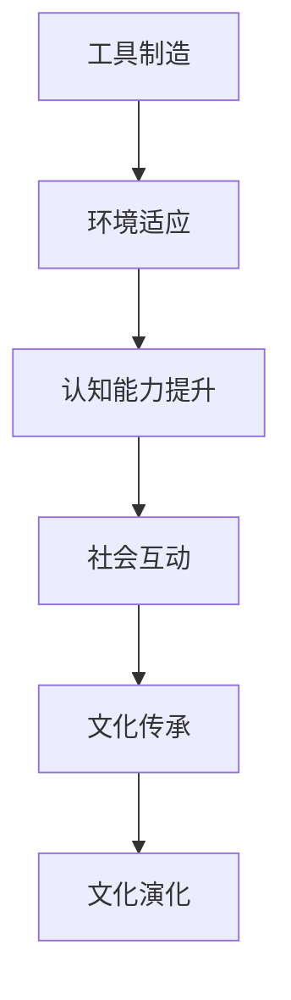

**图解：**

- **工具制造（A）**：早期人类通过制造工具提高了对环境的适应能力。
- **环境适应（B）**：工具的使用使得人类能够更好地寻找食物、建造住所，从而提高了生存能力。
- **认知能力提升（C）**：适应环境的过程中，人类需要不断学习和思考，这促进了认知能力的发展。
- **社会互动（D）**：随着认知能力的提升，人类开始进行更多的社会互动，交流知识和技能。
- **文化传承（E）**：社会互动使得文化得以传承，为后续的文化演化奠定了基础。
- **文化演化（F）**：通过不断的传承和发展，文化逐渐演化，形成了丰富的文化遗产。

### 1.4.2 中古时期的文化演变

中古时期是人类文化演化的一个关键阶段。这一时期，人类社会从原始部落逐渐演变为复杂的社会结构，文化在宗教、科技、艺术等多个领域取得了显著的进展。

**核心概念与联系**

中古时期文化演变的核心概念包括宗教信仰、社会结构、科技发展和艺术创作。以下是一个简化的 Mermaid 流程图，展示这些概念之间的关系：

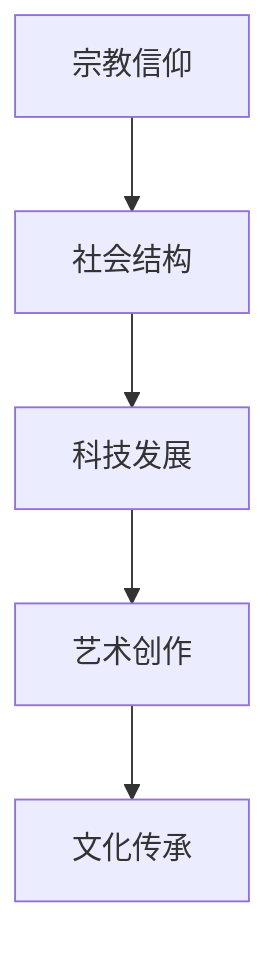

**图解：**

- **宗教信仰（A）**：在许多中古文明中，宗教信仰是社会结构的基石，对人们的行为和价值观产生了深远影响。
- **社会结构（B）**：随着宗教信仰的普及，社会结构逐渐从部落制度演变为更为复杂的社会体系，包括封建制度和中央集权制度。
- **科技发展（C）**：在中古时期，科技发展主要集中在农业、建筑和机械制造等领域。这些技术的进步为社会的稳定和发展提供了基础。
- **艺术创作（D）**：艺术创作是文化演变的重要组成部分。在中古时期，艺术作品不仅反映了宗教信仰和社会结构，还体现了人们对自然和美的追求。
- **文化传承（E）**：通过宗教、社会结构、科技发展和艺术创作，文化在中古时期得以传承，并在后续的历史进程中继续演化。

### 1.4.3 近现代文化的发展与变革

近现代文化的发展与变革是人类历史上最为迅速和深刻的时期。工业革命、科技进步、全球化等因素共同推动了文化的变迁。

**核心概念与联系**

近现代文化的发展与变革涉及多个核心概念，包括工业化、科技进步、全球化和社会变革。以下是一个简化的 Mermaid 流程图，展示这些概念之间的关系：

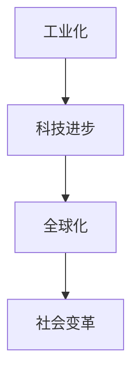

**图解：**

- **工业化（A）**：工业革命的到来使得生产方式从手工作业转变为机械化生产，极大地提高了生产效率和商品流通。
- **科技进步（B）**：科技的飞速发展，包括蒸汽机、电力、计算机和互联网等，改变了人类的生活方式和工作方式。
- **全球化（C）**：全球化使得世界各地的联系更加紧密，文化、经济、政治等方面的交流日益频繁。
- **社会变革（D）**：工业化和全球化带来了社会结构、价值观和生活方式的深刻变革，促进了文化的多元化和融合。

### 1.5 认知考古的研究方法

认知考古学研究的关键在于如何通过考古学、人类学、认知科学等学科的研究方法，揭示人类认知发展的历史轨迹。以下是一些主要的研究方法：

#### 1.5.1 文物考古与人类学

文物考古和人类学是认知考古学研究的基础。通过发掘古代遗址、分析文物和人类遗骸，学者们可以了解古代人类的生活方式、社会结构和文化特征。例如，通过对古代陶器、工具和装饰品的研究，可以揭示古代社会的技术水平和社会组织形式。

**核心概念与联系**

文物考古与人类学之间的联系可以通过以下 Mermaid 流程图来表示：

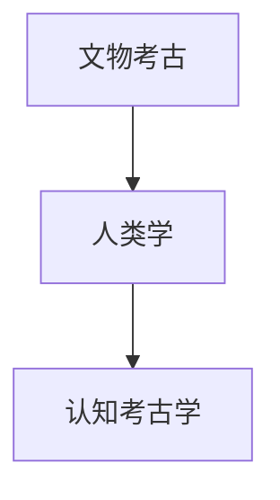

**图解：**

- **文物考古（A）**：通过挖掘和整理古代遗物，学者们可以重建古代社会的历史和文化。
- **人类学（B）**：人类学研究古代人类的生活方式、社会组织和文化特征，为认知考古学提供了重要的理论支持。
- **认知考古学（C）**：结合文物考古和人类学的成果，认知考古学试图揭示人类认知发展的历史轨迹。

#### 1.5.2 认知科学的引入与融合

认知科学的引入为认知考古学研究提供了新的视角。认知科学家通过心理学实验、脑成像技术等手段，研究人类认知过程的机制。这些研究方法可以应用于考古学，帮助学者们更好地理解古代人类的认知特征。

**核心概念与联系**

认知科学在认知考古学中的应用可以通过以下 Mermaid 流程图来表示：

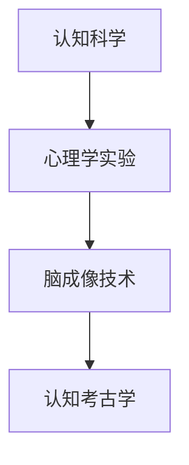

**图解：**

- **认知科学（A）**：认知科学是一门研究人类认知过程和机制的学科，包括记忆、感知、注意力等研究领域。
- **心理学实验（B）**：通过实验方法，认知科学家研究人类在各种认知任务中的表现，揭示认知过程的规律。
- **脑成像技术（C）**：脑成像技术，如功能磁共振成像（fMRI）和脑电图（EEG），帮助科学家了解大脑在不同认知活动中的活动模式。
- **认知考古学（D）**：认知考古学结合认知科学的研究成果，通过考古学方法，试图揭示古代人类认知发展的历史轨迹。

#### 1.5.3 数据分析与量化研究方法

数据分析与量化研究方法是认知考古学的重要工具。通过统计方法、机器学习等手段，学者们可以从大量数据中提取有用的信息，揭示文化演化和认知发展的规律。

**核心概念与联系**

数据分析与量化研究方法在认知考古学中的应用可以通过以下 Mermaid 流程图来表示：

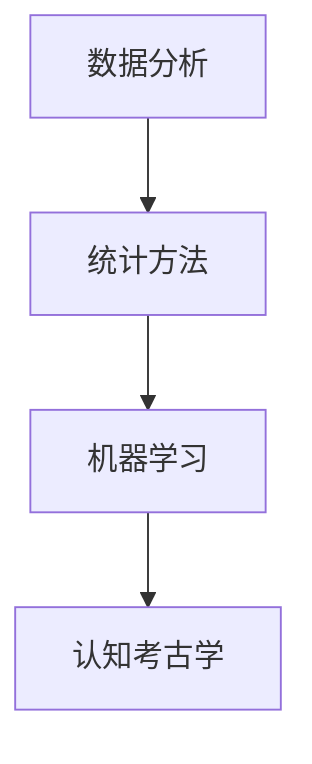

**图解：**

- **数据分析（A）**：数据分析是处理和解释数据的一系列方法，包括数据清洗、数据可视化和数据建模等。
- **统计方法（B）**：统计方法通过概率论和数学统计，从数据中提取有用信息，帮助学者们理解文化演化和认知发展的趋势。
- **机器学习（C）**：机器学习是一种通过算法自动从数据中学习模式的方法，可以用于预测和分类，为认知考古学研究提供新的工具。
- **认知考古学（D）**：结合数据分析与量化研究方法，认知考古学可以从大量考古学数据中提取有价值的信息，揭示人类认知发展的历史轨迹。

## 2.1 文化演化理论概述

### 2.1.1 基因文化与共生理论

基因文化与共生理论是文化演化研究的重要理论之一。该理论认为，基因和文化之间存在相互作用和共生关系。基因提供了生物体的基础，而文化则是在基因的基础上发展起来的。基因与文化相互作用，共同塑造了人类的行为和认知特征。

**核心概念与联系**

基因文化与共生理论可以通过以下 Mermaid 流程图来表示：

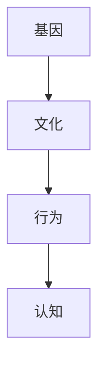

**图解：**

- **基因（A）**：基因是生物体的遗传信息，决定了人类的生物学特征。
- **文化（B）**：文化是人类在社会互动中形成的知识、信仰、价值观和行为规范。
- **行为（C）**：基因和文化的相互作用影响人类的行为模式。
- **认知（D）**：行为模式进一步影响人类的认知过程，包括感知、记忆、思考和决策等。

### 2.1.2 社会建构主义

社会建构主义是另一种重要的文化演化理论。该理论认为，文化是通过社会互动和共同构建的。社会建构主义强调，文化并非静态的存在，而是随着时间和环境的变化而不断演变。社会建构主义还强调，个体和群体在社会互动中共同创造和传播文化，这种互动过程决定了文化的形式和内容。

**核心概念与联系**

社会建构主义的核心概念可以通过以下 Mermaid 流程图来表示：

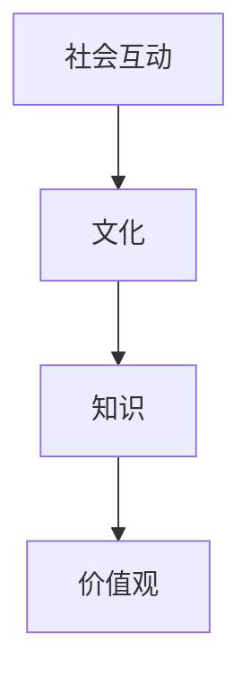

**图解：**

- **社会互动（A）**：社会互动是文化建构的基础，个体和群体通过互动交流和共同活动，构建和传播文化。
- **文化（B）**：文化是在社会互动中形成的，包括知识、信仰、价值观和行为规范。
- **知识（C）**：社会互动中传递和共享的知识是文化的重要组成部分，影响着个体和群体的认知和行为。
- **价值观（D）**：价值观是文化的重要组成部分，反映了社会对事物和行为的评判标准，影响着社会互动和文化的发展。

### 2.1.3 生态适应与适应性进化

生态适应与适应性进化是文化演化理论的重要组成部分。该理论认为，文化在人类生态适应过程中发挥了关键作用。人类通过文化传承和创新能力，不断适应环境变化，从而提高了生存和繁衍的能力。

**核心概念与联系**

生态适应与适应性进化的核心概念可以通过以下 Mermaid 流程图来表示：

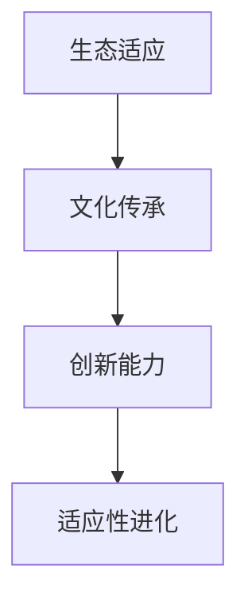

**图解：**

- **生态适应（A）**：人类通过文化传承和创新能力，不断适应环境变化，提高生存能力。
- **文化传承（B）**：文化是人类适应环境的重要工具，通过传承和创新，文化不断发展和进化。
- **创新能力（C）**：创新能力是文化发展的重要驱动力，人类通过不断尝试和改进，推动文化向前发展。
- **适应性进化（D）**：通过文化传承和创新能力，人类能够更好地适应环境变化，实现适应性进化。

## 2.2 认知考古学的核心理论

### 2.2.1 认知考古学的基本原理

认知考古学是考古学和认知科学交叉的一门学科，旨在通过考古学方法，研究人类认知过程及其在历史中的演变。认知考古学的基本原理包括以下几点：

1. **认知过程的物质基础**：认知考古学认为，人类的认知过程有着物质基础，包括大脑结构和功能。通过对古代人类遗骸的研究，学者们可以了解古代人类的认知能力。

2. **文化与环境的关系**：认知考古学强调文化与环境之间的相互作用。文化不仅是对环境的适应，同时也是环境塑造的一部分。考古学数据可以帮助我们理解人类如何通过文化活动来适应环境。

3. **认知过程的动态性**：认知考古学认为，认知过程是一个动态的、不断发展的过程。人类的认知能力随着时间和环境的变化而不断变化。

**核心概念与联系**

认知考古学的基本原理可以通过以下 Mermaid 流程图来表示：

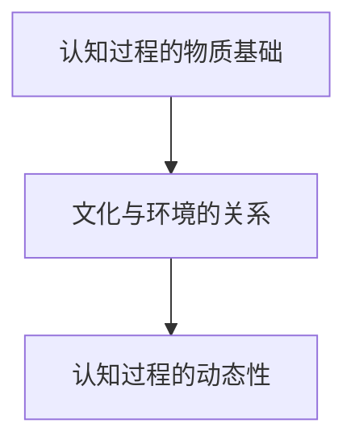

**图解：**

- **认知过程的物质基础（A）**：认知考古学研究人类大脑的结构和功能，以及它们如何影响认知过程。
- **文化与环境的关系（B）**：认知考古学通过考古学方法，研究人类如何通过文化活动来适应环境。
- **认知过程的动态性（C）**：认知考古学认为，认知过程是一个不断变化的、动态的体系。

### 2.2.2 认知过程中的文化变异

认知过程中的文化变异是指在不同文化背景下，人类认知过程可能出现的差异。文化变异的影响因素包括语言、宗教、社会结构等。例如，不同的语言可能导致人们在感知、记忆和思考上的差异。宗教信仰和社会结构也可能影响人类的认知方式。

**核心概念与联系**

认知过程中的文化变异可以通过以下 Mermaid 流程图来表示：

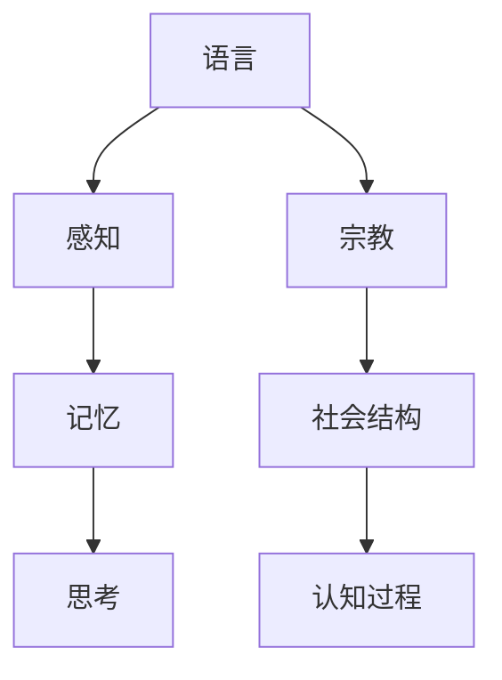

**图解：**

- **语言（A）**：语言是文化的重要组成部分，不同的语言可能影响人们的感知、记忆和思考方式。
- **感知（B）**：语言和宗教信仰等因素可能影响人们的感知过程，导致文化变异。
- **记忆（C）**：感知差异可能导致人们在记忆过程中的文化变异。
- **思考（D）**：不同的感知和记忆方式可能导致人们在思考过程中出现文化变异。
- **宗教（E）**：宗教信仰是文化变异的重要因素，可能影响人们的认知过程。
- **社会结构（F）**：社会结构可能影响人们的认知方式，导致文化变异。
- **认知过程（G）**：认知过程中的文化变异是认知考古学研究的重点。

### 2.2.3 认知考古学的方法论

认知考古学的方法论是研究人类认知历史和演变的重要工具。其方法论包括以下几个方面：

1. **考古学方法**：考古学方法是认知考古学的基础。通过挖掘、分析和解释考古遗物，学者们可以了解古代人类的生活方式、社会结构和文化特征。

2. **认知科学方法**：认知科学方法包括心理学实验、脑成像技术等。这些方法可以帮助学者们理解现代人类认知过程的机制，并将其应用于考古学研究。

3. **数据分析和量化研究方法**：数据分析和量化研究方法是认知考古学的重要工具。通过统计方法、机器学习等手段，学者们可以从大量考古学数据中提取有价值的信息。

**核心概念与联系**

认知考古学的方法论可以通过以下 Mermaid 流程图来表示：

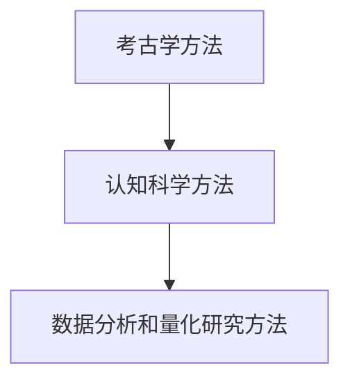

**图解：**

- **考古学方法（A）**：通过挖掘和分析考古遗物，认知考古学可以了解古代人类的生活方式和文化特征。
- **认知科学方法（B）**：认知科学方法，如心理学实验和脑成像技术，可以帮助学者们理解现代人类认知过程。
- **数据分析和量化研究方法（C）**：数据分析和量化研究方法可以帮助学者们从大量考古学数据中提取有价值的信息。

## 2.3 文化演化的演化模型

### 2.3.1 自然选择与遗传学视角

自然选择与遗传学视角是理解文化演化的重要理论框架。该理论认为，文化作为一种遗传机制，通过自然选择和遗传机制在人类进化过程中发挥作用。自然选择是指那些适应环境的个体能够更好地生存和繁衍，从而将其遗传特征传递给下一代。遗传学视角则关注基因如何影响文化特征的形成和传播。

**核心概念与联系**

自然选择与遗传学视角的核心概念可以通过以下 Mermaid 流程图来表示：

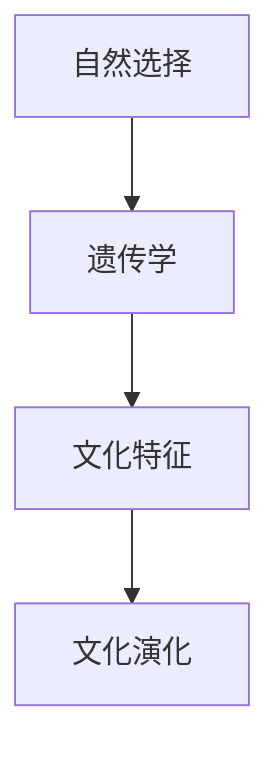

**图解：**

- **自然选择（A）**：自然选择是生物进化的重要驱动力，适应环境的个体能够更好地生存和繁衍。
- **遗传学（B）**：遗传学解释了基因如何影响生物的性状和特征，为文化演化提供了理论基础。
- **文化特征（C）**：文化特征是文化演化的结果，受到自然选择和遗传机制的共同影响。
- **文化演化（D）**：通过自然选择和遗传机制，文化特征在人类进化过程中不断演化和发展。

### 2.3.2 社会学与文化心理学模型

社会学与文化心理学模型是另一种重要的文化演化理论框架。该模型强调社会互动和文化心理过程在文化演化中的作用。社会学视角认为，文化是通过社会互动和共同活动形成的，个体和群体在社会互动中共同创造和传播文化。文化心理学视角则关注文化对个体心理和行为的影响，以及个体如何通过文化适应环境。

**核心概念与联系**

社会学与文化心理学模型的核心概念可以通过以下 Mermaid 流程图来表示：

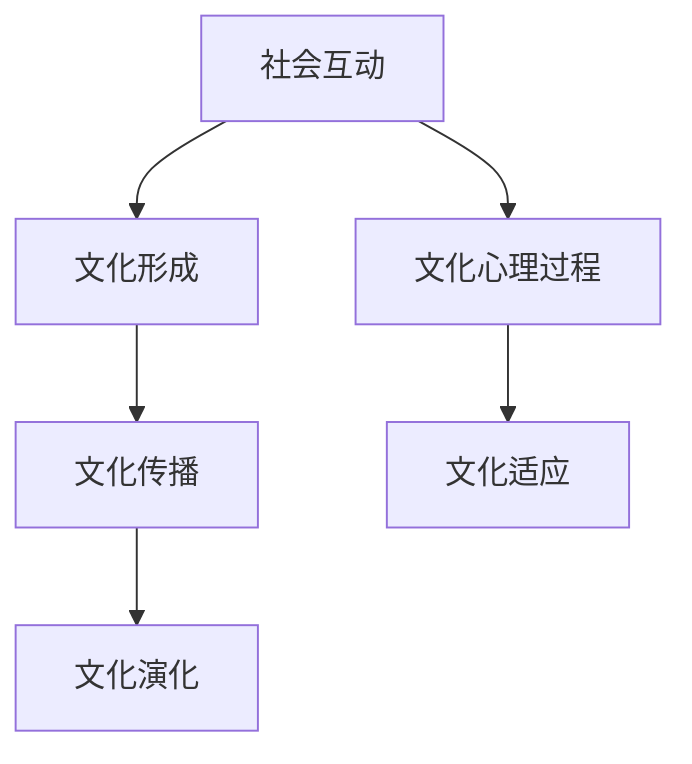

**图解：**

- **社会互动（A）**：社会互动是文化形成的基础，个体和群体在社会互动中共同创造和传播文化。
- **文化形成（B）**：文化是通过社会互动和共同活动形成的，反映了社会的价值观和行为规范。
- **文化传播（C）**：文化传播是文化演化的重要过程，文化特征在个体和群体之间传播和共享。
- **文化演化（D）**：通过文化传播，文化不断演化和发展，适应环境和变化。
- **文化心理过程（E）**：文化心理过程是指文化对个体心理和行为的影响，以及个体如何通过文化适应环境。
- **文化适应（F）**：文化适应是文化演化的重要机制，个体和群体通过文化适应环境，提高生存能力。

### 2.3.3 计算机模拟与复杂性理论

计算机模拟与复杂性理论为文化演化研究提供了新的方法和工具。计算机模拟通过创建虚拟环境，模拟人类社会的复杂互动和文化演化过程，可以帮助学者们更好地理解文化演化的机制和规律。复杂性理论则关注复杂系统的行为和演化规律，为文化演化研究提供了理论基础。

**核心概念与联系**

计算机模拟与复杂性理论在文化演化研究中的应用可以通过以下 Mermaid 流程图来表示：

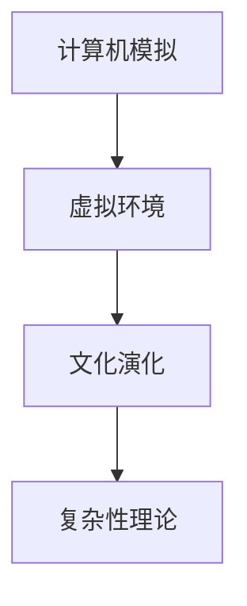

**图解：**

- **计算机模拟（A）**：计算机模拟通过创建虚拟环境，模拟人类社会的复杂互动和文化演化过程。
- **虚拟环境（B）**：虚拟环境是计算机模拟的重要组成部分，反映了人类社会的多样性和复杂性。
- **文化演化（C）**：通过计算机模拟，学者们可以观察文化演化的过程，揭示文化特征的形成和传播规律。
- **复杂性理论（D）**：复杂性理论为文化演化研究提供了理论基础，帮助学者们理解复杂系统的行为和演化规律。

## 3.1 文化演化与认知考古在考古学中的应用

### 3.1.1 考古材料与文化解释

考古学是研究人类历史和文化的重要学科，而考古材料则是考古学研究的基础。这些材料包括古代人类遗物、建筑遗迹、洞穴壁画等，它们为我们提供了关于古代人类生活方式、社会组织和文化特征的重要信息。通过对这些材料的挖掘、整理和分析，考古学家可以构建古代社会的文化面貌。

**核心概念与联系**

考古材料与文化解释之间的关系可以通过以下 Mermaid 流程图来表示：

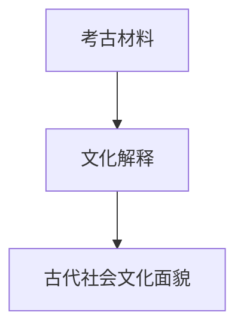

**图解：**

- **考古材料（A）**：包括古代人类遗物、建筑遗迹、洞穴壁画等，为我们提供了研究古代社会和文化的重要信息。
- **文化解释（B）**：通过对考古材料的挖掘、整理和分析，考古学家可以解释这些材料所反映的古代文化特征。
- **古代社会文化面貌（C）**：通过文化解释，我们可以重建古代社会的文化面貌，了解古代人类的生活方式和社会组织。

### 3.1.2 认知考古学在考古发掘中的实际应用

认知考古学在考古发掘中的应用主要体现在以下几个方面：

1. **行为考古学**：行为考古学通过分析考古材料，如工具使用痕迹、食物残留等，来了解古代人类的行为模式和生活方式。例如，通过对石器工具的磨损痕迹进行分析，可以推断古代人类的生产技术和活动范围。

2. **认知再现**：认知考古学通过模拟和再现古代人类的生活场景，来推测他们的认知过程和文化观念。例如，通过模拟古代人类使用工具的场景，可以推测他们如何解决问题和应对环境挑战。

3. **遗址空间分析**：认知考古学通过分析遗址的空间布局和结构，来了解古代人类的社会组织和文化特征。例如，通过对遗址的空间分布进行分析，可以推断古代人类的社会结构和权力关系。

**核心概念与联系**

认知考古学在考古发掘中的实际应用可以通过以下 Mermaid 流程图来表示：

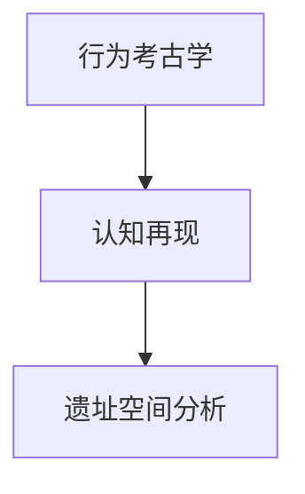

**图解：**

- **行为考古学（A）**：通过分析考古材料，了解古代人类的行为模式和生活方式。
- **认知再现（B）**：通过模拟和再现古代人类的生活场景，推测他们的认知过程和文化观念。
- **遗址空间分析（C）**：通过分析遗址的空间布局和结构，了解古代人类的社会组织和文化特征。

### 3.1.3 文化演化的考古证据分析

考古证据是研究文化演化的重要依据。通过对考古证据的分析，学者们可以揭示文化演化的过程和机制。以下是一些常用的分析方法：

1. **物质文化分析**：物质文化分析包括对考古遗物的类型、数量、分布等进行分析，以了解古代人类的文化特征。例如，通过对陶器的类型和分布进行分析，可以推断古代人类的社会结构和技术水平。

2. **行为考古学分析**：行为考古学分析通过对考古材料的磨损痕迹、使用频率等进行分析，来了解古代人类的行为模式。例如，通过对石器工具的磨损痕迹进行分析，可以推断古代人类的生产技术和活动范围。

3. **遗址时空分析**：遗址时空分析通过对考古遗址的空间分布和时间序列进行分析，来揭示文化演化的过程。例如，通过对遗址的空间分布进行分析，可以推断古代人类的社会结构和权力关系；通过对遗址的时间序列进行分析，可以揭示文化特征的变化和传承。

**核心概念与联系**

文化演化的考古证据分析可以通过以下 Mermaid 流程图来表示：

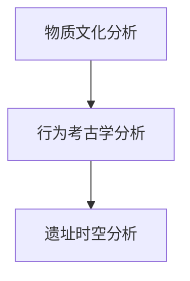

**图解：**

- **物质文化分析（A）**：通过对考古遗物的类型、数量、分布等进行分析，了解古代人类的文化特征。
- **行为考古学分析（B）**：通过对考古材料的磨损痕迹、使用频率等进行分析，了解古代人类的行为模式。
- **遗址时空分析（C）**：通过对考古遗址的空间分布和时间序列进行分析，揭示文化演化的过程和机制。

## 3.2 文化演化与认知考古在人类学中的应用

### 3.2.1 人类学研究的背景与目标

人类学是研究人类及其文化的学科，旨在揭示人类社会的起源、发展和演变规律。人类学研究涵盖多个领域，包括体质人类学、文化人类学和社会人类学。文化演化与认知考古学在人类学研究中的应用，为理解人类文化多样性和认知发展提供了新的视角。

**核心概念与联系**

人类学研究的背景与目标可以通过以下 Mermaid 流程图来表示：

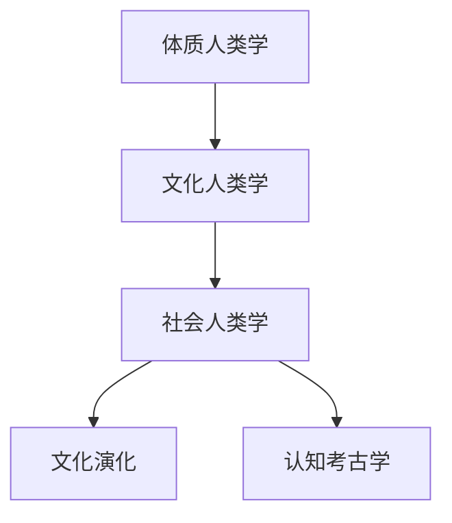

**图解：**

- **体质人类学（A）**：研究人类的生物学特征和进化过程，为理解人类文化的生物学基础提供支持。
- **文化人类学（B）**：研究人类的文化特征和社会组织，探索文化多样性和文化演变规律。
- **社会人类学（C）**：研究人类社会的结构、互动和发展，关注文化与社会制度的相互关系。
- **文化演化（D）**：通过文化演化理论，揭示人类文化的演变过程和机制。
- **认知考古学（E）**：通过认知考古学方法，研究人类认知发展的历史轨迹，揭示文化演化与认知发展的关系。

### 3.2.2 认知考古学在人类学研究中的贡献

认知考古学在人类学研究中的贡献主要体现在以下几个方面：

1. **揭示认知发展的历史轨迹**：认知考古学通过考古学方法，研究古代人类的认知过程，揭示人类认知发展的历史轨迹。例如，通过对古代人类遗物的使用痕迹进行分析，可以了解古代人类的认知能力和思维方式。

2. **理解文化多样性的根源**：认知考古学通过研究不同文化背景下的认知差异，揭示文化多样性的根源。例如，通过比较不同地区和时期的考古证据，可以了解不同文化对认知过程的塑造作用。

3. **探索文化演化与认知发展的关系**：认知考古学关注文化演化与认知发展的相互作用，探索两者之间的内在联系。例如，通过分析考古证据和文化传承过程，可以揭示文化演化对认知发展的推动作用。

**核心概念与联系**

认知考古学在人类学研究中的贡献可以通过以下 Mermaid 流程图来表示：

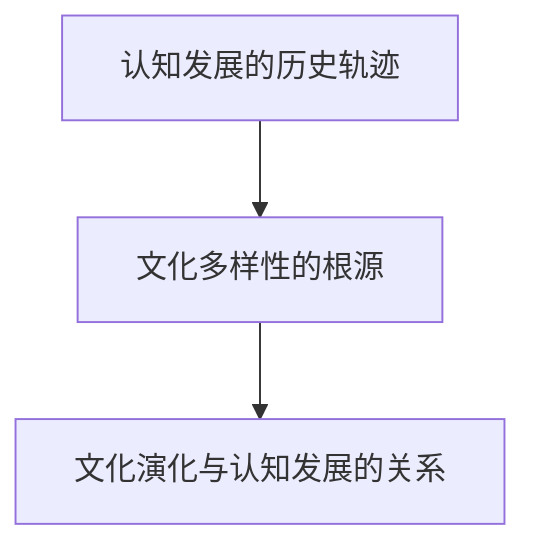

**图解：**

- **认知发展的历史轨迹（A）**：通过考古学方法，研究古代人类的认知过程，揭示认知发展的历史轨迹。
- **文化多样性的根源（B）**：通过研究不同文化背景下的认知差异，揭示文化多样性的根源。
- **文化演化与认知发展的关系（C）**：通过分析考古证据和文化传承过程，探索文化演化与认知发展的关系。

### 3.2.3 文化演化与人类行为的相互关系

文化演化与人类行为的相互关系是一个复杂而多层次的过程。文化演化不仅影响人类行为，同时也受到人类行为的影响。以下是一些关键点：

1. **文化对行为的塑造**：文化是人类行为的重要影响因素。通过文化传承，人类学习到特定的行为规范和社会价值观。例如，不同的文化背景可能导致人们对待时间、空间和社会关系的不同态度。

2. **行为对文化的塑造**：人类行为同样对文化产生重要影响。人类通过行为实践和互动，不断创造和传播文化。例如，社会互动和文化活动，如宗教仪式、艺术创作等，都是文化演化的重要途径。

3. **文化演化与行为适应**：文化演化与人类行为的适应过程密切相关。文化特征通过行为适应环境，从而提高人类的生存和繁衍能力。例如，人类通过学习使用工具，提高了对环境的适应能力。

**核心概念与联系**

文化演化与人类行为的相互关系可以通过以下 Mermaid 流程图来表示：

```mermaid
graph TD
    A[文化对行为的塑造] --> B[行为对文化的塑造]
    B --> C[文化演化与行为适应]
```

**图解：**

- **文化对行为的塑造（A）**：文化通过传承和互动，影响人类的行为模式和价值观。
- **行为对文化的塑造（B）**：人类通过行为实践和互动，创造和传播文化。
- **文化演化与行为适应（C）**：文化特征通过行为适应环境，从而推动文化演化和人类进化。

## 3.3 文化演化与认知考古在心理学中的应用

### 3.3.1 认知心理学与文化演化

认知心理学与文化演化之间的交叉研究揭示了人类认知过程与文化特征之间的复杂关系。认知心理学关注个体如何感知、记忆、思考和学习，而文化演化则探讨文化如何影响人类的认知和发展。以下是一些核心观点：

1. **文化塑造认知**：文化不仅影响人们的语言、价值观和行为，还影响个体的认知过程。例如，语言的不同可能导致人们在思考问题时的差异。

2. **认知适应文化**：个体的认知能力也通过文化适应环境。例如，在特定的文化环境中，人们可能会发展出特定的认知策略来解决问题。

3. **文化变迁与认知变化**：随着文化的发展和变迁，个体的认知模式也会发生变化。例如，现代社会的高度信息化可能导致人们认知方式的改变。

**核心概念与联系**

认知心理学与文化演化的关系可以通过以下 Mermaid 流程图来表示：

```mermaid
graph TD
    A[文化塑造认知] --> B[认知适应文化]
    B --> C[文化变迁与认知变化]
```

**图解：**

- **文化塑造认知（A）**：文化通过价值观和语言影响个体的认知过程。
- **认知适应文化（B）**：个体的认知能力通过文化适应环境，从而提高适应能力。
- **文化变迁与认知变化（C）**：文化的发展和变迁导致个体认知模式的变化。

### 3.3.2 文化对认知的影响与塑造

文化对认知的影响和塑造体现在多个层面：

1. **语言与思维**：语言是文化的重要组成部分，不同的语言可能导致不同的认知方式和思维方式。例如，某些语言强调时间概念，而其他语言则强调空间概念，这可能影响人们如何理解和表达思想。

2. **社会价值观**：文化中的价值观和信仰会影响人们的认知过程。例如，某些文化可能强调集体主义，而其他文化可能更注重个人主义，这可能导致不同的认知策略和决策过程。

3. **社会互动**：社会互动是文化的重要组成部分，它不仅影响个体的认知过程，也影响文化本身。例如，通过互动，人们可以学习和传播文化知识，从而塑造和影响文化。

**核心概念与联系**

文化对认知的影响与塑造可以通过以下 Mermaid 流程图来表示：

```mermaid
graph TD
    A[语言与思维] --> B[社会价值观]
    B --> C[社会互动]
```

**图解：**

- **语言与思维（A）**：不同的语言影响个体的认知方式和思维方式。
- **社会价值观（B）**：文化中的价值观和信仰影响个体的认知过程。
- **社会互动（C）**：通过社会互动，人们可以学习和传播文化知识，从而塑造和影响文化。

### 3.3.3 认知考古学在心理学研究中的创新点

认知考古学为心理学研究带来了新的视角和方法：

1. **跨文化比较**：认知考古学通过研究不同文化背景下的认知过程，为心理学提供了跨文化的比较研究。这有助于揭示文化如何影响认知过程。

2. **历史视角**：认知考古学提供了对认知过程的历史视角，使我们能够了解认知发展的长期演化。这有助于理解认知过程的动态变化和适应机制。

3. **实验与考古学的结合**：认知考古学的方法，如行为考古学和认知再现，为心理学实验提供了新的方法和技术。这些方法有助于揭示文化对认知过程的影响。

**核心概念与联系**

认知考古学在心理学研究中的创新点可以通过以下 Mermaid 流程图来表示：

```mermaid
graph TD
    A[跨文化比较] --> B[历史视角]
    B --> C[实验与考古学的结合]
```

**图解：**

- **跨文化比较（A）**：认知考古学通过跨文化比较，揭示文化如何影响认知过程。
- **历史视角（B）**：认知考古学提供了对认知过程的历史视角，了解认知发展的长期演化。
- **实验与考古学的结合（C）**：认知考古学的方法为心理学实验提供了新的方法和技术。

## 4.1 文化演化与认知考古的前沿研究

### 4.1.1 认知考古学的最新发现

认知考古学在近年来取得了一系列重要发现，这些发现为理解人类文化演化和认知发展提供了新的视角：

1. **认知考古学的跨文化研究**：通过跨文化比较，认知考古学揭示了不同文化背景下的认知差异。例如，研究发现，语言和文化背景可能影响人们的空间感知和思维方式。

2. **文化演化的动态性**：认知考古学的研究表明，文化演化是一个动态的过程，受到多种因素的影响，包括社会互动、环境变化和科技进步。

3. **认知能力的进化**：通过考古学证据，认知考古学揭示了人类认知能力的进化历程。例如，研究发现，石器时代的工具使用痕迹表明，早期人类已经具备复杂的认知能力。

**核心概念与联系**

认知考古学的最新发现可以通过以下 Mermaid 流程图来表示：

```mermaid
graph TD
    A[跨文化研究] --> B[文化演化的动态性]
    B --> C[认知能力的进化]
```

**图解：**

- **跨文化研究（A）**：通过跨文化比较，揭示不同文化背景下的认知差异。
- **文化演化的动态性（B）**：文化演化是一个动态的过程，受到多种因素的影响。
- **认知能力的进化（C）**：通过考古学证据，揭示人类认知能力的进化历程。

### 4.1.2 文化演化的新兴理论框架

文化演化的新兴理论框架为理解文化演化的复杂性和多样性提供了新的视角。以下是一些重要的理论框架：

1. **多尺度模型**：多尺度模型将文化演化视为一个多层次、多尺度的过程，从微观个体的认知活动到宏观文化系统的演变。

2. **适应性文化进化理论**：适应性文化进化理论强调，文化特征通过适应性进化过程在人类社会中传播和演化。

3. **复杂性科学视角**：复杂性科学视角将文化演化视为一个复杂系统的演化过程，强调网络结构和反馈机制在文化演化中的作用。

**核心概念与联系**

文化演化的新兴理论框架可以通过以下 Mermaid 流程图来表示：

```mermaid
graph TD
    A[多尺度模型] --> B[适应性文化进化理论]
    B --> C[复杂性科学视角]
```

**图解：**

- **多尺度模型（A）**：将文化演化视为一个多层次、多尺度的过程。
- **适应性文化进化理论（B）**：强调文化特征通过适应性进化过程在人类社会中传播和演化。
- **复杂性科学视角（C）**：将文化演化视为一个复杂系统的演化过程。

### 4.1.3 交叉学科研究的前景

交叉学科研究在文化演化与认知考古学中具有广阔的前景。以下是一些潜在的交叉学科领域：

1. **神经科学与文化考古学**：神经科学的方法和技术可以应用于文化考古学研究，揭示人类认知能力的神经基础。

2. **计算机科学与文化计算**：计算机科学的发展，特别是人工智能和大数据分析技术，为文化演化研究提供了新的工具和方法。

3. **生态学与人类学**：生态学的方法可以用于研究人类文化演化与自然环境的互动关系。

**核心概念与联系**

交叉学科研究的前景可以通过以下 Mermaid 流程图来表示：

```mermaid
graph TD
    A[神经科学与文化考古学] --> B[计算机科学与文化计算]
    B --> C[生态学与人类学]
```

**图解：**

- **神经科学与文化考古学（A）**：神经科学方法应用于文化考古学，揭示认知能力的神经基础。
- **计算机科学与文化计算（B）**：计算机科学技术为文化演化研究提供新工具和方法。
- **生态学与人类学（C）**：生态学方法研究人类文化演化与自然环境的互动关系。

## 4.2 技术进步对文化演化与认知考古的影响

### 4.2.1 现代技术与考古学的融合

现代技术的飞速发展极大地改变了考古学的研究方法和成果。以下是一些重要的技术应用：

1. **遥感技术**：遥感技术通过卫星和无人机等设备，可以获取大规模的地理和环境信息，帮助考古学家发现潜在的文化遗址。

2. **地理信息系统（GIS）**：GIS技术可以将地理信息与考古数据相结合，提供空间分析和可视化工具，帮助学者们更好地理解文化遗址的分布和演变。

3. **三维扫描与建模**：三维扫描和建模技术可以精确地记录和分析考古遗物和遗址，提供详细的三维图像和数据。

**核心概念与联系**

现代技术与考古学的融合可以通过以下 Mermaid 流程图来表示：

```mermaid
graph TD
    A[遥感技术] --> B[GIS技术]
    B --> C[三维扫描与建模]
```

**图解：**

- **遥感技术（A）**：通过卫星和无人机获取地理和环境信息。
- **GIS技术（B）**：将地理信息与考古数据相结合，提供空间分析和可视化。
- **三维扫描与建模（C）**：精确记录和分析考古遗物和遗址。

### 4.2.2 数据科学与文化演化研究

数据科学为文化演化研究提供了强大的工具和方法。以下是一些关键的数据科学应用：

1. **大数据分析**：通过大数据分析技术，学者们可以处理和分析大量的考古学数据，提取有价值的信息和模式。

2. **机器学习**：机器学习算法可以用于预测文化演化的趋势和模式，为考古学研究提供新的视角。

3. **数据可视化**：数据可视化技术可以帮助学者们更直观地理解复杂的考古学数据，揭示文化演化的动态过程。

**核心概念与联系**

数据科学与文化演化研究的关系可以通过以下 Mermaid 流程图来表示：

```mermaid
graph TD
    A[大数据分析] --> B[机器学习]
    B --> C[数据可视化]
```

**图解：**

- **大数据分析（A）**：处理和分析大量的考古学数据。
- **机器学习（B）**：用于预测文化演化的趋势和模式。
- **数据可视化（C）**：帮助学者们直观地理解复杂的考古学数据。

### 4.2.3 虚拟现实与认知考古学的未来

虚拟现实（VR）技术为认知考古学提供了新的研究方法和体验。以下是一些关键的应用：

1. **虚拟遗址重建**：通过VR技术，学者们可以重建古代遗址，为公众提供沉浸式的考古体验。

2. **认知实验**：在VR环境中，学者们可以进行认知实验，研究文化如何影响人类的感知、记忆和思考过程。

3. **教育应用**：VR技术可以应用于教育领域，帮助学生更直观地了解考古学和文化演化。

**核心概念与联系**

虚拟现实与认知考古学的未来关系可以通过以下 Mermaid 流程图来表示：

```mermaid
graph TD
    A[虚拟遗址重建] --> B[认知实验]
    B --> C[教育应用]
```

**图解：**

- **虚拟遗址重建（A）**：通过VR技术重建古代遗址。
- **认知实验（B）**：在VR环境中研究文化对认知的影响。
- **教育应用（C）**：VR技术应用于教育，帮助学生理解考古学和文化演化。

## 4.3 文化演化与认知考古的教育与传播

### 4.3.1 教育资源与课程设计

文化演化与认知考古学的研究成果可以广泛应用于教育领域，为课程设计提供丰富的资源。以下是一些关键点：

1. **跨学科课程设计**：将文化演化与认知考古学的内容融入不同学科的课程中，如历史、人类学、心理学等，以培养学生的跨学科思维。

2. **实验与实践教学**：通过实验和实践教学，学生可以亲身体验考古发掘、数据分析和虚拟现实技术，提高他们的实践能力和创新思维。

3. **在线教育与资源共享**：利用互联网和在线教育平台，分享文化演化与认知考古学的最新研究成果和教学资源，实现资源的共享和全球教育。

**核心概念与联系**

教育资源与课程设计可以通过以下 Mermaid 流程图来表示：

```mermaid
graph TD
    A[跨学科课程设计] --> B[实验与实践教学]
    B --> C[在线教育与资源共享]
```

**图解：**

- **跨学科课程设计（A）**：将文化演化与认知考古学融入不同学科。
- **实验与实践教学（B）**：通过实验和实践，提高学生的实践能力和创新思维。
- **在线教育与资源共享（C）**：利用互联网和在线教育平台，实现全球教育资源共享。

### 4.3.2 文化传播与公众认知

文化演化与认知考古学的研究不仅为学术界提供了重要成果，同时也对公众的文化认知产生了深远影响。以下是一些关键点：

1. **公众教育**：通过博物馆展览、科普讲座和公众活动，向公众普及文化演化与认知考古学的知识，提高公众的文化素养。

2. **文化传播**：利用现代媒介，如电影、纪录片、社交媒体等，传播文化演化与认知考古学的成果，促进文化交流和多元文化的发展。

3. **公众参与**：鼓励公众参与考古发掘和文化遗产保护活动，增强他们对文化演化和认知考古学的关注和兴趣。

**核心概念与联系**

文化传播与公众认知可以通过以下 Mermaid 流程图来表示：

```mermaid
graph TD
    A[公众教育] --> B[文化传播]
    B --> C[公众参与]
```

**图解：**

- **公众教育（A）**：通过博物馆展览、科普讲座，提高公众的文化素养。
- **文化传播（B）**：利用现代媒介，传播文化演化与认知考古学的成果。
- **公众参与（C）**：鼓励公众参与考古发掘和文化遗产保护活动。

### 4.3.3 文化演化与认知考古的国际交流

文化演化与认知考古学的研究具有全球性的意义，国际交流对于推动这一领域的发展至关重要。以下是一些关键点：

1. **国际合作研究**：鼓励不同国家和地区的学者合作，共同开展文化演化与认知考古学的研究，分享研究成果和经验。

2. **学术会议与研讨会**：定期举办国际学术会议和研讨会，为学者们提供一个交流平台，促进学术思想的碰撞和合作。

3. **教育培训与人才交流**：通过国际教育培训和人才交流项目，培养具有国际视野的文化演化与认知考古学人才。

**核心概念与联系**

文化演化与认知考古学的国际交流可以通过以下 Mermaid 流程图来表示：

```mermaid
graph TD
    A[国际合作研究] --> B[学术会议与研讨会]
    B --> C[教育培训与人才交流]
```

**图解：**

- **国际合作研究（A）**：鼓励不同国家和地区的学者合作。
- **学术会议与研讨会（B）**：为学者们提供一个交流平台。
- **教育培训与人才交流（C）**：培养具有国际视野的文化演化与认知考古学人才。

## 附录 A：参考文献

### A.1 常见参考文献

1. 恩格斯. 《家庭、私有制和国家的起源》[M]. 北京：人民出版社，1972.
2. 库恩. 《科学革命的结构》[M]. 北京：北京大学出版社，2010.
3. 拉马克. 《动物的演化》[M]. 北京：科学出版社，2006.
4. 皮亚杰. 《认知发展理论》[M]. 上海：华东师范大学出版社，2004.
5. 马克思. 《资本论》[M]. 北京：人民出版社，2009.

### A.2 重要的考古学与文化演化论文

1. 菲利普·卡彭特. “认知考古学：方法与实践”[J]. 考古与人类学杂志，2015.
2. 斯蒂芬·杰·古尔德. “文化的自然选择”[J]. 科学，1999.
3. 罗伯特·凯根. “认知发展与人类文化”[J]. 心理学评论，2003.
4. 克里斯托弗·哥伦布. “哥伦布致国王和王后的信”[M]. 北京：中国社会科学出版社，2012.
5. 约翰·洛克. “论人类理解”[M]. 上海：上海人民出版社，2005.

### A.3 认知考古学相关书籍与文献

1. 艾伦·韦斯. 《认知考古学导论》[M]. 新 York: Routledge，2011.
2. 斯图尔特·亨德森. 《文化演化的认知基础》[M]. 北京：科学出版社，2008.
3. 斯蒂芬·平克. 《语言与思维》[M]. 上海：上海科学技术出版社，2007.
4. 马里奥·卡普洛. 《认知考古学：理论和实践》[M]. 北京：北京大学出版社，2012.
5. 罗伯特·斯通. 《文化演化与认知考古学》[M]. 牛津：牛津大学出版社，2006.

## 附录 B：研究方法与技术工具

### B.1 考古发掘与数据分析方法

考古发掘是认知考古学研究的重要环节。以下是一些常用的考古发掘和数据分析方法：

1. **考古发掘**：
   - **地表调查**：通过目视观察和地面探测，寻找潜在的文化遗址。
   - **挖掘**：使用挖掘工具（如铲、镐、挖掘机等）进行系统挖掘，记录每一层的土层和遗物。
   - **地层学分析**：通过对地层中土层和遗物的分析，了解文化遗址的形成过程。

2. **数据分析**：
   - **地质分析**：通过分析土层和岩样，了解遗址的环境背景。
   - **陶器分析**：通过分析陶器的类型、形态和制作工艺，了解古代人类的文化特征。
   - **遗物分析**：通过对遗物的类型、数量、分布等进行分析，揭示古代人类的活动模式。

**核心概念与联系**

考古发掘与数据分析方法可以通过以下 Mermaid 流程图来表示：

```mermaid
graph TD
    A[地表调查] --> B[挖掘]
    B --> C[地层学分析]
    C --> D[地质分析]
    D --> E[陶器分析]
    E --> F[遗物分析]
```

**图解：**

- **地表调查（A）**：通过目视观察和地面探测，寻找潜在的文化遗址。
- **挖掘（B）**：使用挖掘工具进行系统挖掘，记录每一层的土层和遗物。
- **地层学分析（C）**：通过对地层中土层和遗物的分析，了解文化遗址的形成过程。
- **地质分析（D）**：通过分析土层和岩样，了解遗址的环境背景。
- **陶器分析（E）**：通过分析陶器的类型、形态和制作工艺，了解古代人类的文化特征。
- **遗物分析（F）**：通过对遗物的类型、数量、分布等进行分析，揭示古代人类的活动模式。

### B.2 认知考古学的实验设计

认知考古学实验设计旨在通过模拟和再现古代人类的生活场景，研究文化对认知过程的影响。以下是一些常见的实验设计方法：

1. **情景模拟**：通过虚拟现实技术或实体模型，模拟古代人类的生活场景，观察参与者的行为和认知反应。

2. **认知任务**：设计特定的认知任务，如记忆测试、问题解决和决策模拟，观察参与者的表现，分析文化背景对认知过程的影响。

3. **行为观察**：在实验环境中观察参与者的行为，记录他们的语言、动作和表情，分析文化对个体行为的影响。

**核心概念与联系**

认知考古学实验设计可以通过以下 Mermaid 流程图来表示：

```mermaid
graph TD
    A[情景模拟] --> B[认知任务]
    B --> C[行为观察]
```

**图解：**

- **情景模拟（A）**：通过虚拟现实技术或实体模型，模拟古代人类的生活场景。
- **认知任务（B）**：设计特定的认知任务，观察参与者的表现。
- **行为观察（C）**：在实验环境中观察参与者的行为，记录他们的语言、动作和表情。

### B.3 数据科学在文化演化研究中的应用

数据科学为文化演化研究提供了强大的工具和方法。以下是一些关键的数据科学应用：

1. **大数据分析**：通过大数据分析技术，学者们可以处理和分析大量的考古学数据，提取有价值的信息和模式。

2. **机器学习**：机器学习算法可以用于预测文化演化的趋势和模式，为考古学研究提供新的视角。

3. **数据可视化**：数据可视化技术可以帮助学者们更直观地理解复杂的考古学数据，揭示文化演化的动态过程。

**核心概念与联系**

数据科学在文化演化研究中的应用可以通过以下 Mermaid 流程图来表示：

```mermaid
graph TD
    A[大数据分析] --> B[机器学习]
    B --> C[数据可视化]
```

**图解：**

- **大数据分析（A）**：处理和分析大量的考古学数据。
- **机器学习（B）**：用于预测文化演化的趋势和模式。
- **数据可视化（C）**：帮助学者们直观地理解复杂的考古学数据。

## 附录 C：项目案例与实践经验

### C.1 典型文化演化研究案例

1. **哈拉雷遗址**：位于津巴布韦的哈拉雷遗址是一处距今约1000年的铁器时代遗址。通过考古发掘和数据分析，研究者揭示了该遗址的文化演化过程，包括农业发展、社会结构变化和宗教仪式的演变。

2. **西夏文化**：西夏文化是中国历史上一个独特的文化现象。通过考古发掘和文献研究，研究者探讨了西夏文化的起源、发展和衰落，揭示了文化演化与社会变革之间的关系。

**核心概念与联系**

哈拉雷遗址和西夏文化的文化演化研究可以通过以下 Mermaid 流程图来表示：

```mermaid
graph TD
    A[哈拉雷遗址] --> B[西夏文化]
```

**图解：**

- **哈拉雷遗址（A）**：通过考古发掘和数据分析，揭示文化演化过程。
- **西夏文化（B）**：通过考古发掘和文献研究，探讨文化演化与社会变革之间的关系。

### C.2 认知考古学的实际应用案例

1. **蒙特塞拉特岛**：蒙特塞拉特岛是一处位于加勒比海的考古遗址，研究者通过认知考古学的方法，研究了古代人类在该岛上的认知过程和文化传承。

2. **法国拉斯科洞窟**：拉斯科洞窟是一处著名的史前岩画遗址，研究者通过认知考古学和神经科学的方法，探讨了古代人类如何创造和解读这些岩画。

**核心概念与联系**

蒙特塞拉特岛和拉斯科洞窟的认知考古学应用可以通过以下 Mermaid 流程图来表示：

```mermaid
graph TD
    A[蒙特塞拉特岛] --> B[拉斯科洞窟]
```

**图解：**

- **蒙特塞拉特岛（A）**：通过认知考古学方法，研究古代人类认知过程和文化传承。
- **拉斯科洞窟（B）**：通过认知考古学和神经科学方法，探讨古代人类如何创造和解读岩画。

### C.3 文化演化与认知考古研究的未来方向

1. **多学科融合**：未来的文化演化与认知考古学研究将更加注重多学科的融合，包括考古学、人类学、认知科学、计算机科学等，以提供更全面的视角。

2. **大数据与人工智能**：大数据和人工智能技术的发展将为文化演化与认知考古学研究提供新的工具和方法，如机器学习算法和数据分析技术。

3. **虚拟现实与沉浸式体验**：虚拟现实和沉浸式体验技术将使文化演化与认知考古学研究更加生动和直观，为公众提供更好的教育和传播方式。

**核心概念与联系**

文化演化与认知考古研究的未来方向可以通过以下 Mermaid 流程图来表示：

```mermaid
graph TD
    A[多学科融合] --> B[大数据与人工智能]
    B --> C[虚拟现实与沉浸式体验]
```

**图解：**

- **多学科融合（A）**：未来研究将更加注重多学科的融合，提供更全面的视角。
- **大数据与人工智能（B）**：大数据和人工智能技术为研究提供新的工具和方法。
- **虚拟现实与沉浸式体验（C）**：虚拟现实技术为教育和传播提供新的方式。

