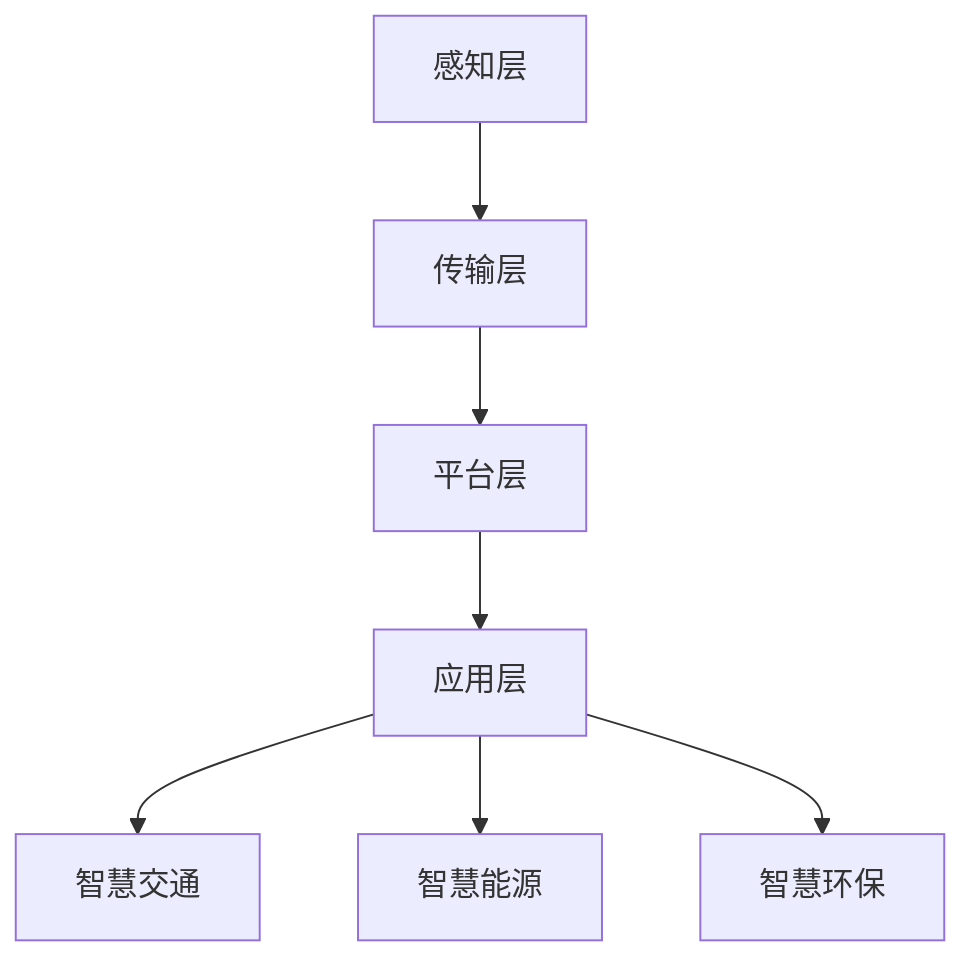

                 

# 《智慧城市创业：打造未来宜居环境》

## 关键词
智慧城市、物联网（IoT）、大数据、人工智能（AI）、边缘计算、智慧交通、智慧能源、智慧环保、创业实践

## 摘要
随着科技的迅猛发展，智慧城市逐渐成为全球城市发展的新趋势。本文将深入探讨智慧城市的概念、技术架构和应用场景，分析智慧城市创业的机遇与挑战，并通过实际案例提供创业指导与建议。旨在为读者提供一份全面、实用的智慧城市创业指南，助力打造未来宜居环境。

## 目录大纲

### 第一部分：智慧城市基础

1. 智慧城市概述
   - 1.1 智慧城市的定义与发展历程
   - 1.2 智慧城市的架构
   - 1.3 智慧城市的全球趋势

2. 智慧城市核心概念与联系
   - 2.1 数据治理与开放
   - 2.2 物联网（IoT）与智能传感器
   - 2.3 大数据和云计算
   - 2.4 人工智能（AI）与机器学习
   - 2.5 智慧城市中的 Mermaid 流程图

### 第二部分：智慧城市关键技术

3. 物联网（IoT）技术
   - 3.1 IoT 设备与通信协议
   - 3.2 IoT 安全与隐私保护

4. 大数据处理与存储
   - 4.1 数据采集与集成
   - 4.2 数据仓库与数据湖

5. 云计算与边缘计算
   - 5.1 云计算服务模型
   - 5.2 边缘计算的优势与应用

### 第三部分：智慧城市应用场景

6. 智慧交通
   - 6.1 交通信息管理系统
   - 6.2 自驾驶车辆技术

7. 智慧能源
   - 7.1 智能电网技术
   - 7.2 能源大数据分析

8. 智慧环保
   - 8.1 环境监测与预警
   - 8.2 智能污染控制技术

### 第四部分：智慧城市创业实践

9. 智慧城市创业案例分析
   - 9.1 智能交通管理系统案例
   - 9.2 智慧能源管理系统案例

10. 智慧城市创业指导与建议
    - 10.1 创业机遇与挑战
    - 10.2 创业路径与策略

### 附录

11. 智慧城市技术资源与工具

### 参考文献

## 深入探讨

### 第一部分：智慧城市基础

#### 1.1 智慧城市的定义与发展历程

智慧城市是指通过信息通信技术（ICT）和其他现代技术手段，实现城市资源高效配置、环境友好和可持续发展的一种新型城市发展模式。智慧城市的核心在于利用大数据、物联网、云计算、人工智能等先进技术，实现城市管理的智能化和精细化。

智慧城市的发展历程可以追溯到20世纪80年代，当时信息技术开始逐步应用于城市管理。随着互联网和移动互联网的普及，智慧城市的概念逐渐成熟。2008年，IBM提出了“智慧地球”战略，推动了智慧城市建设的发展。近年来，随着物联网、大数据、人工智能等技术的不断创新，智慧城市已经成为全球城市发展的重要趋势。

#### 1.2 智慧城市的架构

智慧城市的架构可以分为四个层次：感知层、传输层、平台层和应用层。

- **感知层**：包括各种传感器和智能设备，如环境传感器、交通传感器、摄像头等，用于采集城市中的各种数据。
- **传输层**：负责将感知层采集到的数据传输到平台层，通常采用无线网络、光纤网络等。
- **平台层**：是智慧城市的中枢大脑，负责数据存储、处理和分析，提供各种服务接口。
- **应用层**：是智慧城市的外部表现，包括智慧交通、智慧能源、智慧环保等各种具体应用。

#### 1.3 智慧城市的全球趋势

全球智慧城市建设呈现出以下几个趋势：

- **数据驱动**：越来越多的城市开始重视数据的价值，通过数据采集、分析和利用，实现城市管理的智能化和精细化。
- **物联网普及**：物联网技术已成为智慧城市建设的核心技术，各种智能设备广泛应用于城市管理的各个方面。
- **智能化服务**：智慧城市致力于提供更加智能化、便捷化的公共服务，提升市民的生活质量。
- **可持续发展**：智慧城市注重节能减排、环境保护和可持续发展，通过技术创新实现绿色、低碳的城市发展模式。

### 第二部分：智慧城市核心技术

#### 2.1 数据治理与开放

数据治理是智慧城市成功的关键因素之一。数据治理包括数据质量管理、数据安全管理和数据生命周期管理等方面。

- **数据质量管理**：确保数据准确性、完整性和一致性，是数据治理的基础。通过数据清洗、数据整合和数据标准化等手段，提高数据质量。
- **数据安全管理**：保护数据免受泄露、篡改和非法访问，是智慧城市建设的重要任务。采用加密、访问控制和安全审计等技术，确保数据安全。
- **数据生命周期管理**：对数据从产生到销毁的全过程进行管理，确保数据的合法、合规和安全。

数据开放是智慧城市建设的另一个重要方面。通过开放数据平台，将城市中的各种数据资源向社会开放，为创新创业和公共服务提供数据支持。

#### 2.2 物联网（IoT）与智能传感器

物联网（IoT）是智慧城市建设的基础技术之一。IoT技术通过连接各种智能设备，实现数据的实时采集和传输。

- **IoT设备**：包括各种传感器、智能终端和执行器等，用于采集城市中的各种数据。
- **通信协议**：如MQTT、CoAP、ZigBee等，用于传输数据。

智能传感器是IoT技术的重要组成部分。智能传感器具有感知、处理和通信功能，能够实时监测城市环境、交通、能源等各种数据。

#### 2.3 大数据和云计算

大数据是智慧城市建设的重要数据来源。大数据技术包括数据采集、存储、处理和分析等方面。

- **数据采集**：通过传感器、社交网络、互联网等渠道，收集城市中的各种数据。
- **数据存储**：采用数据仓库、数据湖等技术，存储大量数据。
- **数据处理**：利用分布式计算、并行处理等技术，对大数据进行高效处理。
- **数据分析**：利用机器学习、数据挖掘等技术，从大数据中提取有价值的信息。

云计算是智慧城市建设的核心基础设施。云计算技术包括IaaS、PaaS、SaaS等模型。

- **IaaS（基础设施即服务）**：提供计算、存储、网络等基础设施资源。
- **PaaS（平台即服务）**：提供开发平台、中间件、数据库等资源。
- **SaaS（软件即服务）**：提供应用软件和服务。

#### 2.4 人工智能（AI）与机器学习

人工智能（AI）和机器学习是智慧城市建设的重要技术手段。AI技术包括计算机视觉、自然语言处理、智能推理等方面。

- **计算机视觉**：通过图像识别、目标检测等技术，实现城市环境、交通、安防等方面的监控和管理。
- **自然语言处理**：通过文本分析、语义理解等技术，实现人机交互、智能客服等功能。
- **智能推理**：利用逻辑推理、知识图谱等技术，实现智能决策和预测。

机器学习是AI的核心技术之一。通过训练模型，让机器学习从数据中提取规律和模式，为智慧城市建设提供智能化的解决方案。

#### 2.5 智慧城市中的 Mermaid 流程图

为了更好地展示智慧城市的架构和流程，我们可以使用Mermaid流程图进行描述。

在上述流程图中，感知层负责采集城市中的各种数据，传输层负责将数据传输到平台层，平台层负责数据存储、处理和分析，应用层则实现智慧交通、智慧能源、智慧环保等具体应用。

### 第三部分：智慧城市应用场景

#### 3.1 智慧交通

智慧交通是智慧城市的重要组成部分，旨在通过信息技术手段优化交通管理，提高交通效率，改善交通环境。

- **交通信息管理系统**：通过实时监测交通流量、路况信息等，为市民提供出行指南，优化交通管理。
- **自动驾驶技术**：利用人工智能技术，实现车辆的自动驾驶，减少交通事故，提高交通效率。

#### 3.2 智慧能源

智慧能源是智慧城市建设的另一个重要领域，旨在通过信息技术手段实现能源的高效利用和可持续发展。

- **智能电网技术**：通过实时监测电力需求和供应，优化电力调度和管理，提高能源利用效率。
- **能源大数据分析**：利用大数据技术，对能源消耗进行预测和优化，实现能源的智能管理。

#### 3.3 智慧环保

智慧环保是智慧城市建设的重要组成部分，旨在通过信息技术手段实现环境的实时监测、预警和治理。

- **环境监测与预警**：通过传感器网络，实时监测空气质量、水质等环境参数，实现环境污染的预警和管理。
- **智能污染控制技术**：利用人工智能技术，实现污染物的排放监测和污染治理，改善环境质量。

### 第四部分：智慧城市创业实践

#### 4.1 智能交通管理系统案例

**案例背景**：某创业公司专注于智能交通管理系统的研究和开发，旨在通过信息技术手段优化城市交通管理。

**解决方案**：公司开发了基于物联网和大数据技术的智能交通管理系统，包括交通流量监测、路况分析、交通信号控制等功能。

**实施过程**：
1. 在城市道路上布置智能传感器，实时监测交通流量和路况。
2. 收集数据并传输到云端平台，进行数据存储和处理。
3. 利用大数据分析技术，对交通流量和路况进行分析，优化交通信号控制策略。
4. 将分析结果反馈给交通管理部门，提供交通管理建议。

**项目成果**：
1. 显著提高了城市交通效率，减少了拥堵现象。
2. 提高了市民的出行体验，降低了交通事故率。

**市场反响**：项目受到了政府和市民的欢迎，取得了良好的市场反响。

#### 4.2 智慧能源管理系统案例

**案例背景**：某创业公司专注于智慧能源管理系统的研究和开发，旨在通过信息技术手段实现能源的高效利用和可持续发展。

**解决方案**：公司开发了基于物联网和大数据技术的智慧能源管理系统，包括能源监测、数据分析、能源调度等功能。

**实施过程**：
1. 在能源设备上安装智能传感器，实时监测能源消耗和供应情况。
2. 收集数据并传输到云端平台，进行数据存储和处理。
3. 利用大数据分析技术，对能源消耗进行预测和优化，实现能源的智能调度。
4. 将分析结果反馈给能源管理部门，提供能源管理建议。

**项目成果**：
1. 显著提高了能源利用效率，降低了能源成本。
2. 实现了能源的可持续发展，减少了碳排放。

**市场反响**：项目受到了政府和能源企业的关注，取得了良好的市场反响。

### 第五部分：智慧城市创业指导与建议

#### 5.1 创业机遇与挑战

智慧城市创业面临着巨大的机遇和挑战。

**机遇**：
1. 政策支持：政府出台了一系列政策，鼓励智慧城市建设和发展，为创业者提供了良好的发展环境。
2. 技术进步：物联网、大数据、人工智能等技术的不断发展，为智慧城市建设提供了强大的技术支持。
3. 市场需求：随着城市化进程的加快，智慧城市的需求日益增长，为创业者提供了广阔的市场空间。

**挑战**：
1. 技术门槛：智慧城市涉及多种技术，创业者需要具备丰富的技术知识和实践经验。
2. 数据安全：智慧城市涉及大量数据，数据安全和隐私保护是重要的挑战。
3. 融资难题：智慧城市项目投资较大，创业者需要寻找合适的融资渠道。

#### 5.2 创业路径与策略

智慧城市创业可以采取以下路径和策略：

1. **市场需求分析**：深入了解市场需求，确定创业方向和目标市场。
2. **技术研发**：加强技术研发，提高产品和服务的竞争力。
3. **合作伙伴**：寻找合适的合作伙伴，共同推进智慧城市项目。
4. **市场拓展**：积极开拓市场，扩大市场份额。
5. **团队建设**：建立专业团队，提高团队执行力和创新能力。

### 附录

#### 5.1 智慧城市技术资源与工具

- **物联网平台**： ThingSpeak、IoT Hub、IoT Analytics
- **大数据平台**： Hadoop、Spark、MongoDB
- **云计算服务提供商**： AWS、Azure、Google Cloud
- **人工智能开发工具**： TensorFlow、PyTorch、Keras

### 参考文献

1. IBM. (2008). Smarter Planet. [Online]. Available at: https://www.ibm.com/smarterplanet/us/en/planet/governments/
2. Gartner. (2018). Gartner Definition of Smart City. [Online]. Available at: https://www.gartner.com/doc/reprints/451-research/451-market-guide-smart-city-platforms-2018/gartnr_451_market_guide_smart_city Platforms_2018_v1.0.pdf
3. World Economic Forum. (2017). The Future of Cities: Navigating the Next Urban Revolution. [Online]. Available at: https://www.weforum.org/reports/the-future-of-cities-navigating-the-next-urban-revolution
4. Yu, J., Zhu, L., & Zhou, Y. (2018). Smart City Architecture: A Research Overview. Journal of Network and Computer Applications, 92, 219-234.
5. Wang, L., Li, L., & Yu, J. (2019). A Survey of Smart City Technologies and Applications. IEEE Access, 7, 48525-48551.

## 总结

智慧城市是未来城市发展的重要方向，为创业者提供了广阔的舞台。通过本文的探讨，我们了解到智慧城市的概念、架构、技术、应用场景以及创业实践。希望本文能为智慧城市创业者提供有益的启示，助力打造未来宜居环境。

## 作者信息

作者：AI天才研究院/AI Genius Institute & 禅与计算机程序设计艺术 /Zen And The Art of Computer Programming

### 附录：智慧城市技术资源与工具

#### 11.1 主流物联网平台与设备

- **物联网平台**：
  - **AWS IoT**：提供了广泛的物联网功能，包括设备管理、消息传递和数据存储。
  - **Azure IoT Hub**：提供了设备连接、数据处理和安全性等功能。
  - **Google Cloud IoT**：集成了设备管理、数据分析和机器学习服务。

- **智能设备**：
  - **Arduino**：开源硬件平台，适用于各种传感器和智能设备的开发。
  - **Raspberry Pi**：微型计算机，适用于低成本物联网项目。
  - **ESP8266/ESP32**：低功耗Wi-Fi模块，广泛应用于物联网项目。

#### 11.2 大数据与云计算服务提供商

- **大数据平台**：
  - **Hadoop**：由Apache Software Foundation维护，是一个开源的大数据平台。
  - **Apache Spark**：一个快速、通用的大数据处理引擎。
  - **MongoDB**：一个开源的NoSQL数据库，适用于大数据存储。

- **云计算服务提供商**：
  - **AWS**：提供了全面的云计算服务，包括计算、存储、数据库和AI服务。
  - **Microsoft Azure**：提供了广泛的云服务，支持各种开发和部署需求。
  - **Google Cloud Platform**：提供了强大的计算、存储和机器学习服务。

#### 11.3 人工智能开发工具与框架

- **人工智能开发工具**：
  - **TensorFlow**：由Google开发，是一个开源的机器学习框架。
  - **PyTorch**：由Facebook开发，是一个流行的深度学习框架。
  - **Keras**：是一个高层次的神经网络API，可以与TensorFlow和Theano配合使用。

- **人工智能框架**：
  - **TensorFlow.js**：TensorFlow的JavaScript版本，适用于前端开发。
  - **TensorFlow Lite**：TensorFlow的轻量级版本，适用于移动设备和嵌入式系统。
  - **TensorFlow Extended**（TFX）：一个端到端的机器学习平台，用于构建、训练和部署机器学习模型。

这些技术和工具为智慧城市的开发提供了丰富的选择，创业者可以根据自己的需求和项目特点进行选择和组合。通过充分利用这些资源，智慧城市创业者可以更快地实现创新，推动智慧城市的发展。

