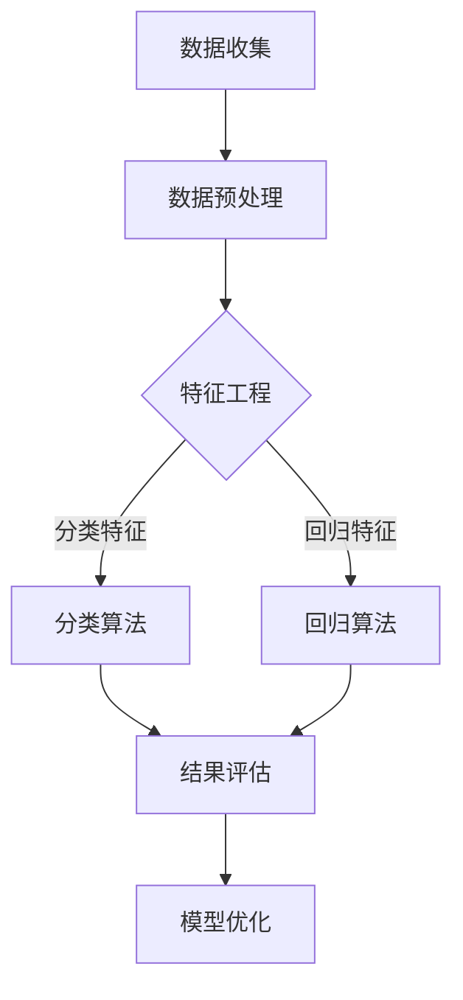
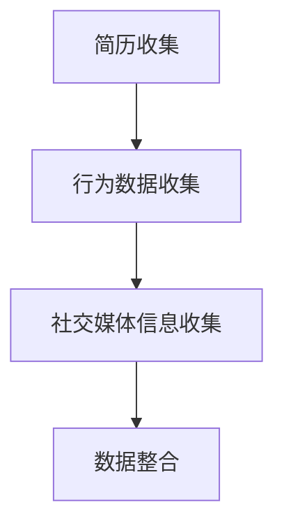
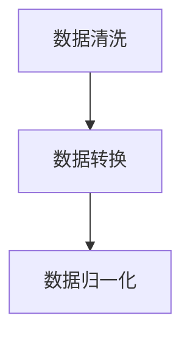
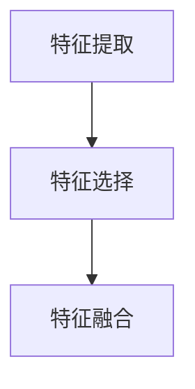
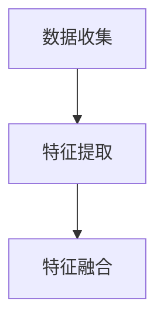
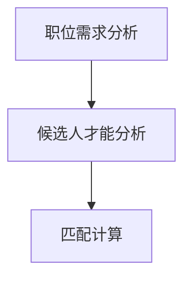
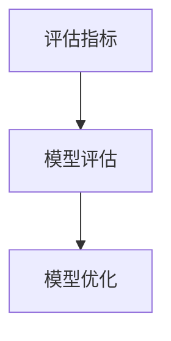
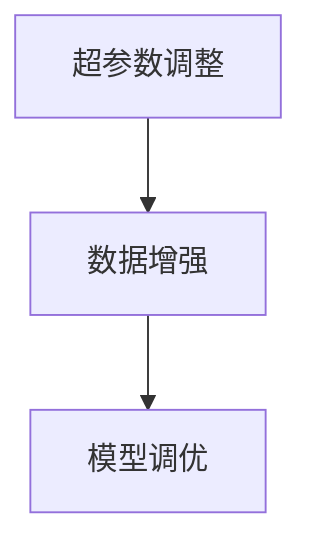
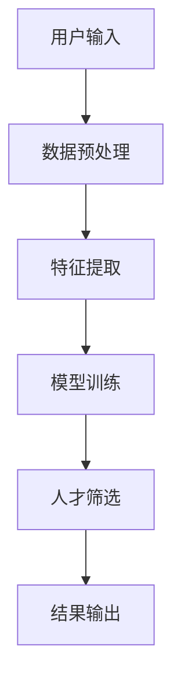

                 

# 智能招聘系统：优化人才筛选的AI解决方案

## 概述

智能招聘系统是一个结合了人工智能技术的招聘解决方案，旨在通过自动化和智能化的方式优化人才筛选过程。本文将详细探讨智能招聘系统的定义、背景、技术基础以及其在行业中的应用现状，旨在为读者提供全面的技术解读和实践指导。

关键词：智能招聘、人工智能、人才筛选、机器学习、特征工程、人才画像、匹配算法

## 摘要

本文首先介绍了智能招聘系统的基本概念和背景，随后深入分析了人才筛选的AI技术基础，包括机器学习的基本概念、特征工程以及人才评价模型。接着，我们探讨了智能招聘系统的设计与实现，详细讲解了系统架构、人才筛选算法、人才画像构建与匹配、系统实现与优化等方面。最后，本文通过案例分析展示了智能招聘系统的实际应用效果，并对未来发展趋势进行了展望。本文旨在为IT领域从业者提供有关智能招聘系统的深度见解和实践指南。

## 目录大纲

### 第一部分：智能招聘系统概述

1. 智能招聘系统概述
   1.1 智能招聘系统的定义与背景
   1.2 智能招聘系统的发展历程
   1.3 智能招聘系统在行业中的应用现状
   1.4 智能招聘系统的核心概念与联系

2. 人才筛选的AI技术基础
   2.1 机器学习基本概念
   2.2 特征工程
   2.3 人才评价模型

### 第二部分：智能招聘系统的设计与实现

3. 智能招聘系统架构设计
4. 人才筛选算法详解
5. 人才画像构建与匹配
6. 系统实现与优化
7. 案例分析与实践

### 第三部分：智能招聘系统的未来发展趋势

8. 智能招聘系统的未来发展趋势
9. 智能招聘系统的伦理与法律问题

## 第一部分：智能招聘系统概述

### 1.1 智能招聘系统的定义与背景

智能招聘系统是一种基于人工智能技术的招聘解决方案，它利用机器学习、自然语言处理、数据挖掘等技术，对求职者的简历、行为数据等信息进行分析和处理，从而实现自动化和智能化的人才筛选。传统的招聘流程通常需要招聘人员手动浏览简历、筛选候选人，效率低且易受主观因素影响。而智能招聘系统通过算法自动处理大量数据，能够快速、准确地找到合适的候选人，从而大大提高招聘效率和质量。

智能招聘系统的核心目标是通过人工智能技术优化人才筛选过程，主要包括以下几个步骤：

1. **简历筛选**：系统通过对简历的语义分析、关键词匹配等手段，自动筛选出符合职位要求的候选人。
2. **人才画像构建**：系统基于候选人的简历、行为数据等信息，构建详细的人才画像，以便更准确地评估候选人。
3. **人才匹配**：系统通过匹配算法将职位需求与候选人的人才画像进行匹配，筛选出最合适的候选人。
4. **结果输出**：系统将筛选结果以报告形式输出，供招聘人员进一步审查和决策。

智能招聘系统的发展背景可以追溯到计算机科学和人工智能技术的迅速进步。随着互联网和大数据技术的发展，人们可以轻松地收集和处理大量的求职者信息。同时，机器学习算法的成熟也为智能招聘系统的实现提供了技术支持。传统的招聘方式已经无法满足企业快速招聘的需求，智能招聘系统应运而生，成为招聘行业的一大趋势。

### 1.2 智能招聘系统的发展历程

智能招聘系统的发展历程可以分为几个阶段：

1. **初级阶段**：早期智能招聘系统主要依靠关键词匹配和简单的筛选规则，效率较低，效果有限。
2. **中级阶段**：随着自然语言处理和机器学习技术的发展，智能招聘系统开始引入更复杂的算法，如朴素贝叶斯、支持向量机等，提高了筛选的准确性和效率。
3. **高级阶段**：近年来，深度学习和大数据技术的应用使得智能招聘系统更加智能化。通过构建人才画像和利用深度学习算法进行匹配，系统可以更全面、准确地评估候选人。

每个阶段的发展都标志着智能招聘系统在技术上的进步和优化。目前，智能招聘系统已经广泛应用于各类企业，成为招聘流程中不可或缺的一部分。

### 1.3 智能招聘系统在行业中的应用现状

智能招聘系统在行业中的应用现状十分广泛，已逐渐成为企业招聘的重要工具。以下是一些行业中的应用案例：

1. **互联网行业**：互联网公司通常招聘频率高，人才需求多样化，智能招聘系统可以帮助企业快速筛选出合适的人才，提高招聘效率。
2. **金融行业**：金融行业对人才的要求较高，智能招聘系统通过分析简历和行为数据，可以更准确地评估候选人的专业能力和职业素质。
3. **制造业**：制造业招聘流程复杂，智能招聘系统可以自动化处理大量简历，减轻招聘人员的工作负担，提高招聘质量。

智能招聘系统在行业中的应用现状表明，其能够有效提升企业招聘效率、降低招聘成本，并在提高招聘质量方面发挥重要作用。随着技术的不断进步，智能招聘系统在未来的应用前景将更加广阔。

### 1.4 智能招聘系统的核心概念与联系

智能招聘系统的实现涉及到多个核心概念和技术的应用。以下是对这些概念及其相互关系的简要概述：

1. **数据驱动**：智能招聘系统的核心在于对大量求职者数据进行分析和处理，通过数据驱动的方式实现高效的筛选和匹配。
2. **机器学习**：机器学习是智能招聘系统的关键技术，通过训练模型，系统能够自动学习和优化筛选算法，提高筛选效果。
3. **自然语言处理（NLP）**：自然语言处理技术用于处理文本数据，如简历、职位描述等，实现文本的解析、分析和理解。
4. **特征工程**：特征工程是数据预处理的重要步骤，通过提取和选择关键特征，提高模型的性能和准确性。
5. **人才画像**：人才画像是对求职者的综合描述，包括专业技能、工作经验、教育背景等，用于评估候选人的综合素质。
6. **匹配算法**：匹配算法用于将职位需求与候选人进行匹配，筛选出最合适的候选人。

这些核心概念相互联系，共同构成了智能招聘系统的技术基础。以下是一个使用Mermaid绘制的流程图，展示了这些核心概念之间的联系：



### 1.4.1 数据收集

数据收集是智能招聘系统的第一步，也是最为关键的一步。智能招聘系统需要从多个渠道收集求职者的数据，如简历、社交媒体信息、行为数据等。以下是一个数据收集的示例流程：

1. **简历收集**：企业可以通过在线招聘平台、社交媒体等渠道收集求职者的简历。
2. **行为数据收集**：系统可以记录求职者在网站上的浏览、搜索等行为，用于分析其兴趣和偏好。
3. **社交媒体信息收集**：通过爬虫等技术，系统可以收集求职者的社交媒体信息，如LinkedIn、GitHub等。



### 1.4.2 数据预处理

数据预处理是特征工程的重要前置工作，其目的是将原始数据转化为适合模型训练的数据。以下是一个数据预处理的基本流程：

1. **数据清洗**：去除重复数据、缺失值填充、去除噪声等。
2. **数据转换**：将数据格式转换为统一的格式，如将文本数据转换为向量表示。
3. **数据归一化**：对数值数据进行归一化处理，使其具有相同的量纲。



### 1.4.3 特征工程

特征工程是数据预处理的核心步骤，其目的是提取和选择对模型训练有用的特征。以下是一个特征工程的基本流程：

1. **特征提取**：从原始数据中提取具有区分度的特征，如文本特征、数值特征等。
2. **特征选择**：选择对模型训练最有效的特征，去除冗余特征。
3. **特征融合**：将不同来源的特征进行融合，提高模型的性能。



### 1.4.4 人才画像构建

人才画像是对求职者的综合描述，包括专业技能、工作经验、教育背景等。以下是一个人才画像的基本流程：

1. **数据收集**：从多个渠道收集求职者的数据，如简历、社交媒体信息、行为数据等。
2. **特征提取**：提取求职者的关键特征，如技能标签、工作经历、教育背景等。
3. **特征融合**：将不同来源的特征进行融合，构建完整的人才画像。



### 1.4.5 匹配算法

匹配算法用于将职位需求与候选人进行匹配，筛选出最合适的候选人。以下是一个匹配算法的基本流程：

1. **职位需求分析**：分析职位需求，提取关键特征，如技能要求、工作经验等。
2. **候选人才能分析**：分析候选人的技能、工作经验等特征。
3. **匹配计算**：计算职位需求与候选人特征之间的相似度，筛选出最合适的候选人。



### 1.4.6 结果评估与模型优化

结果评估是智能招聘系统的重要环节，用于评估模型的效果和性能。以下是一个结果评估的基本流程：

1. **评估指标**：选择合适的评估指标，如准确率、召回率、F1分数等。
2. **模型评估**：使用评估指标对模型进行评估，找出模型的优势和不足。
3. **模型优化**：根据评估结果，调整模型参数，优化模型性能。



### 1.4.7 模型优化

模型优化是智能招聘系统不断迭代和改进的关键步骤。以下是一个模型优化的基本流程：

1. **超参数调整**：调整学习率、批量大小等超参数，优化模型性能。
2. **数据增强**：通过数据增强方法，如数据归一化、数据标准化等，提高模型对数据的适应性。
3. **模型调优**：使用交叉验证等技术，调整模型结构和参数，实现模型优化。



通过上述流程，我们可以看到智能招聘系统从数据收集、预处理、特征工程、人才画像构建、匹配算法、结果评估到模型优化，形成了一个完整的闭环。每个环节都相互关联，共同构成了智能招聘系统的核心框架。

## 第二部分：人才筛选的AI技术基础

### 2.1 机器学习基本概念

机器学习（Machine Learning，简称ML）是人工智能（Artificial Intelligence，简称AI）的一个重要分支，它使计算机系统能够从数据中学习，并自动改进其性能，而无需显式地编程。机器学习的基本概念包括监督学习、无监督学习和强化学习。

#### 2.1.1 监督学习

监督学习（Supervised Learning）是最常见的机器学习方法之一。它通过输入特征和对应的标签来训练模型，使模型能够学习到特征和标签之间的关系。监督学习的核心目标是预测未知数据的标签。

**监督学习的类型**：

1. **回归分析**：用于预测连续值的模型，如线性回归、决策树回归、支持向量回归等。
2. **分类**：用于预测离散值的模型，如逻辑回归、朴素贝叶斯、决策树分类、支持向量机（SVM）等。

**监督学习的基本步骤**：

1. **数据收集**：收集具有特征和标签的数据集。
2. **数据预处理**：清洗数据、处理缺失值、归一化等。
3. **特征选择**：选择对模型训练有用的特征。
4. **模型训练**：使用训练数据训练模型。
5. **模型评估**：使用验证数据评估模型性能。
6. **模型优化**：根据评估结果调整模型参数。

**监督学习示例伪代码**：

```python
def train_model(train_data, train_labels, epochs):
    # 初始化模型参数
    weights = initialize_weights()
    bias = initialize_bias()
    
    for epoch in range(epochs):
        # 前向传播
        predictions = forward_pass(train_data, weights, bias)
        
        # 计算损失
        loss = compute_loss(predictions, train_labels)
        
        # 反向传播
        gradients = backward_pass(predictions, train_data, train_labels)
        
        # 更新模型参数
        weights -= learning_rate * gradients['weights']
        bias -= learning_rate * gradients['bias']
        
    return weights, bias
```

#### 2.1.2 无监督学习

无监督学习（Unsupervised Learning）与监督学习不同，它不需要标签数据来训练模型。无监督学习的目标是从未标记的数据中发现隐含的模式或结构。

**无监督学习的类型**：

1. **聚类**：将数据分组为多个簇，如K-均值聚类、层次聚类等。
2. **降维**：减少数据维度，如主成分分析（PCA）、t-SNE等。
3. **关联规则学习**：发现数据之间的关联关系，如Apriori算法、FP-growth等。

**无监督学习的基本步骤**：

1. **数据收集**：收集未标记的数据集。
2. **数据预处理**：清洗数据、处理缺失值、归一化等。
3. **特征提取**：提取对模型训练有用的特征。
4. **模型训练**：训练无监督学习模型。
5. **模型评估**：评估模型发现的结构或模式。
6. **模型应用**：将模型应用到实际问题中。

**无监督学习示例伪代码**：

```python
def cluster_data(data, num_clusters):
    # 初始化聚类中心
    centroids = initialize_centroids(data, num_clusters)
    
    while not converged:
        # 前向传播
        distances = compute_distances(data, centroids)
        new_centroids = update_centroids(data, distances)
        
        # 检查收敛条件
        converged = check_convergence(centroids, new_centroids)
        
        # 更新聚类中心
        centroids = new_centroids
    
    return centroids
```

#### 2.1.3 强化学习

强化学习（Reinforcement Learning，简称RL）是一种通过试错和反馈来学习的行为策略优化方法。强化学习的主要目标是找到一种策略，使智能体在给定环境中能够最大化长期回报。

**强化学习的基本概念**：

1. **状态（State）**：描述智能体所处的环境。
2. **动作（Action）**：智能体可以采取的行为。
3. **奖励（Reward）**：环境对智能体行为的反馈，用于指导智能体的行为。
4. **策略（Policy）**：智能体的行为决策规则。

**强化学习的基本步骤**：

1. **环境初始化**：初始化环境状态。
2. **智能体采取动作**：智能体根据当前状态选择动作。
3. **环境反馈**：环境根据智能体的动作产生新的状态和奖励。
4. **更新策略**：根据反馈调整智能体的策略。
5. **迭代学习**：重复上述步骤，不断优化策略。

**强化学习示例伪代码**：

```python
def train_agent(state_space, action_space, reward_function):
    # 初始化策略
    policy = initialize_policy(state_space, action_space)
    
    while not termination_condition:
        # 环境初始化
        state = environment.init()
        
        while not done:
            # 选择动作
            action = choose_action(state, policy)
            
            # 执行动作
            next_state, reward = environment.step(action)
            
            # 更新策略
            policy = update_policy(state, action, reward, policy)
            
            # 更新状态
            state = next_state
            
            # 检查是否结束
            done = environment.done()
        
        # 更新全局策略
        global_policy = aggregate_local_policies(policy)
    
    return global_policy
```

### 2.2 特征工程

特征工程（Feature Engineering）是机器学习中的一个关键步骤，它涉及从原始数据中提取和选择对模型训练有显著影响的特征。特征工程的质量直接影响模型的性能和准确性。

#### 2.2.1 数据预处理

数据预处理是特征工程的第一步，其目的是将原始数据转化为适合模型训练的形式。以下是一些常见的数据预处理技术：

1. **数据清洗**：去除重复数据、缺失值填充、去除噪声等。
2. **数据转换**：将数据格式转换为统一的格式，如将文本数据转换为向量表示。
3. **数据归一化**：对数值数据进行归一化处理，使其具有相同的量纲。

**数据清洗示例伪代码**：

```python
def clean_data(data):
    # 去除重复数据
    unique_data = remove_duplicates(data)
    
    # 缺失值填充
    filled_data = fill_missing_values(unique_data)
    
    # 去除噪声
    clean_data = remove_noise(filled_data)
    
    return clean_data
```

**数据转换示例伪代码**：

```python
def convert_data(data):
    # 将文本数据转换为向量
    vectorized_data = convert_to_vector(data)
    
    # 归一化数据
    normalized_data = normalize_data(vectorized_data)
    
    return normalized_data
```

#### 2.2.2 特征提取

特征提取是从原始数据中提取对模型训练有显著影响的关键特征。以下是一些常见的特征提取技术：

1. **文本特征提取**：从文本数据中提取词袋模型（Bag of Words，简称BoW）、TF-IDF等特征。
2. **数值特征提取**：从数值数据中提取统计特征、主成分分析（PCA）等特征。
3. **图像特征提取**：从图像数据中提取边缘、纹理、颜色等特征。

**文本特征提取示例伪代码**：

```python
def extract_text_features(text_data):
    # 提取词袋模型特征
    bag_of_words = extract_bow(text_data)
    
    # 提取TF-IDF特征
    tf_idf_features = extract_tf_idf(bag_of_words)
    
    return tf_idf_features
```

**数值特征提取示例伪代码**：

```python
def extract_numeric_features(data):
    # 提取统计特征
    statistical_features = extract_statistical_features(data)
    
    # 提取PCA特征
    pca_features = extract_pca_features(data)
    
    return pca_features
```

**图像特征提取示例伪代码**：

```python
def extract_image_features(image_data):
    # 提取边缘特征
    edge_features = extract_edge_features(image_data)
    
    # 提取纹理特征
    texture_features = extract_texture_features(image_data)
    
    # 提取颜色特征
    color_features = extract_color_features(image_data)
    
    return edge_features, texture_features, color_features
```

#### 2.2.3 特征选择

特征选择是从提取的特征中选择对模型训练最有用的特征。以下是一些常见的特征选择技术：

1. **过滤式特征选择**：基于特征的重要性、相关性等筛选特征。
2. **包装式特征选择**：结合模型训练和特征选择，逐步优化特征。
3. **嵌入式特征选择**：在特征提取过程中同时进行特征选择。

**过滤式特征选择示例伪代码**：

```python
def filter_feature_selection(features, target_variable):
    # 计算特征的重要性
    feature_importance = compute_importance(features, target_variable)
    
    # 选择重要的特征
    selected_features = select_important_features(feature_importance)
    
    return selected_features
```

**包装式特征选择示例伪代码**：

```python
def wrapper_feature_selection(features, target_variable, model):
    # 初始化特征集
    feature_set = features
    
    while not converged:
        # 选择特征子集
        subset = select_subset(feature_set)
        
        # 训练模型
        model = train_model(subset, target_variable)
        
        # 评估模型性能
        performance = evaluate_model(model)
        
        # 更新特征集
        feature_set = update_feature_set(feature_set, subset, performance)
        
        # 检查收敛条件
        converged = check_convergence(feature_set)
    
    return feature_set
```

**嵌入式特征选择示例伪代码**：

```python
def embed_feature_selection(features, target_variable, model):
    # 初始化特征集
    feature_set = features
    
    # 训练模型并嵌入特征选择
    model = train_and_select_features(feature_set, target_variable)
    
    return model
```

#### 2.2.4 特征融合

特征融合是将来自不同来源的特征进行合并，以提高模型的性能。以下是一些常见的特征融合技术：

1. **加权融合**：根据特征的重要性分配权重，进行加权融合。
2. **拼接融合**：将不同来源的特征直接拼接在一起。
3. **集成方法**：结合多个模型的结果进行特征融合。

**加权融合示例伪代码**：

```python
def weighted_feature_fusion(features, weights):
    # 计算加权特征
    weighted_features = weighted_average(features, weights)
    
    return weighted_features
```

**拼接融合示例伪代码**：

```python
def concatenated_feature_fusion(features):
    # 拼接特征
    concatenated_features = concatenate(features)
    
    return concatenated_features
```

**集成方法示例伪代码**：

```python
def ensemble_feature_fusion(models, features):
    # 集成模型预测
    predictions = ensemble_predict(models, features)
    
    # 计算集成特征
    ensemble_features = compute_ensemble_features(predictions)
    
    return ensemble_features
```

### 2.3 人才评价模型

人才评价模型是智能招聘系统的核心组成部分，它用于对求职者进行评价，以确定其是否适合某一职位。人才评价模型通常基于机器学习技术，包括传统统计学模型和基于机器学习的模型。

#### 2.3.1 基于传统统计学的模型

基于传统统计学的模型主要通过计算特征之间的统计关系来评估求职者的合适程度。以下是一些常见的基于传统统计学的模型：

1. **线性回归**：通过计算特征和目标变量之间的线性关系来评估求职者。
2. **逻辑回归**：用于二分类问题，通过计算特征对目标变量的影响概率来评估求职者。
3. **协方差分析**：用于比较不同特征对目标变量的影响程度。

**线性回归模型示例伪代码**：

```python
def linear_regression(train_data, train_labels):
    # 计算特征与目标变量的线性关系
    coefficients = compute_coefficients(train_data, train_labels)
    
    # 计算预测值
    predictions = predict(train_data, coefficients)
    
    return predictions
```

**逻辑回归模型示例伪代码**：

```python
def logistic_regression(train_data, train_labels, epochs):
    # 初始化模型参数
    weights = initialize_weights()
    bias = initialize_bias()
    
    for epoch in range(epochs):
        # 前向传播
        predictions = forward_pass(train_data, weights, bias)
        
        # 计算损失
        loss = compute_loss(predictions, train_labels)
        
        # 反向传播
        gradients = backward_pass(predictions, train_data, train_labels)
        
        # 更新模型参数
        weights -= learning_rate * gradients['weights']
        bias -= learning_rate * gradients['bias']
        
    return weights, bias
```

**协方差分析模型示例伪代码**：

```python
def covariance_analysis(features, target_variable):
    # 计算特征与目标变量的协方差
    covariance_matrix = compute_covariance_matrix(features, target_variable)
    
    # 分析协方差矩阵
    analysis_results = analyze_covariance_matrix(covariance_matrix)
    
    return analysis_results
```

#### 2.3.2 基于机器学习的模型

基于机器学习的模型通过学习数据中的复杂模式来评估求职者。以下是一些常见的基于机器学习的模型：

1. **决策树**：通过划分特征空间来构建决策树，用于分类和回归问题。
2. **支持向量机（SVM）**：通过最大化特征空间中的分隔超平面来分类数据。
3. **神经网络**：通过多层神经元进行特征变换和预测，适用于复杂问题。

**决策树模型示例伪代码**：

```python
def decision_tree(train_data, train_labels, max_depth):
    # 构建决策树
    tree = build_decision_tree(train_data, train_labels, max_depth)
    
    # 预测
    predictions = predict(train_data, tree)
    
    return predictions
```

**支持向量机（SVM）模型示例伪代码**：

```python
def support_vector_machine(train_data, train_labels):
    # 训练SVM模型
    model = train_svm_model(train_data, train_labels)
    
    # 预测
    predictions = predict(train_data, model)
    
    return predictions
```

**神经网络模型示例伪代码**：

```python
def neural_network(train_data, train_labels, layers, epochs):
    # 初始化神经网络
    network = initialize_neural_network(layers)
    
    for epoch in range(epochs):
        # 前向传播
        predictions = forward_pass(train_data, network)
        
        # 计算损失
        loss = compute_loss(predictions, train_labels)
        
        # 反向传播
        gradients = backward_pass(predictions, train_data, network)
        
        # 更新网络参数
        update_network_params(network, gradients)
    
    return network
```

#### 2.3.3 基于深度学习的模型

基于深度学习的模型通过多层神经网络进行特征学习和预测。以下是一些常见的基于深度学习的模型：

1. **卷积神经网络（CNN）**：通过卷积层提取图像特征。
2. **循环神经网络（RNN）**：通过循环结构处理序列数据。
3. **长短期记忆网络（LSTM）**：通过记忆单元解决长序列依赖问题。

**卷积神经网络（CNN）模型示例伪代码**：

```python
def convolutional_neural_network(train_data, train_labels, layers, epochs):
    # 初始化CNN模型
    model = initialize_cnn(layers)
    
    for epoch in range(epochs):
        # 前向传播
        predictions = forward_pass(train_data, model)
        
        # 计算损失
        loss = compute_loss(predictions, train_labels)
        
        # 反向传播
        gradients = backward_pass(predictions, train_data, model)
        
        # 更新模型参数
        update_model_params(model, gradients)
    
    return model
```

**循环神经网络（RNN）模型示例伪代码**：

```python
def recurrent_neural_network(train_data, train_labels, layers, epochs):
    # 初始化RNN模型
    model = initialize_rnn(layers)
    
    for epoch in range(epochs):
        # 前向传播
        predictions = forward_pass(train_data, model)
        
        # 计算损失
        loss = compute_loss(predictions, train_labels)
        
        # 反向传播
        gradients = backward_pass(predictions, train_data, model)
        
        # 更新模型参数
        update_model_params(model, gradients)
    
    return model
```

**长短期记忆网络（LSTM）模型示例伪代码**：

```python
def long_short_term_memory_network(train_data, train_labels, layers, epochs):
    # 初始化LSTM模型
    model = initialize_lstm(layers)
    
    for epoch in range(epochs):
        # 前向传播
        predictions = forward_pass(train_data, model)
        
        # 计算损失
        loss = compute_loss(predictions, train_labels)
        
        # 反向传播
        gradients = backward_pass(predictions, train_data, model)
        
        # 更新模型参数
        update_model_params(model, gradients)
    
    return model
```

### 第二部分总结

在第二部分中，我们详细介绍了智能招聘系统的基础技术，包括机器学习的基本概念、特征工程的方法以及人才评价模型的构建。通过理解这些技术，读者可以更好地理解智能招聘系统的原理和实现方法。接下来，我们将探讨智能招聘系统的设计与实现，包括系统架构设计、人才筛选算法、人才画像构建与匹配以及系统性能优化。

## 第二部分：智能招聘系统的设计与实现

### 3.1 智能招聘系统架构设计

智能招聘系统架构设计是构建高效、可扩展、可维护系统的关键。一个典型的智能招聘系统架构通常包括数据层、算法层和应用层。以下是对各层功能的详细说明：

#### 3.1.1 数据层

数据层是智能招聘系统的基石，负责数据收集、存储和管理。其主要功能包括：

1. **数据收集**：从各种渠道（如招聘网站、社交媒体、内部数据库等）收集求职者简历、行为数据和职位信息。
2. **数据存储**：将收集到的数据存储在数据库中，常用的数据库包括关系型数据库（如MySQL、PostgreSQL）和分布式数据库（如HBase、MongoDB）。
3. **数据管理**：实现数据的增删改查操作，确保数据的完整性和一致性。

#### 3.1.2 算法层

算法层是智能招聘系统的核心，负责数据分析和处理，主要包括以下功能：

1. **特征工程**：对原始数据进行预处理，提取有用的特征，包括文本特征、数值特征和图像特征。
2. **模型训练**：使用机器学习算法训练模型，如逻辑回归、决策树、SVM和深度学习模型。
3. **模型评估**：使用验证集评估模型的性能，选择最佳模型进行部署。
4. **模型优化**：根据评估结果调整模型参数，优化模型性能。

#### 3.1.3 应用层

应用层是智能招聘系统与用户交互的界面，负责实现用户操作和结果展示。其主要功能包括：

1. **用户界面**：提供用户输入职位需求和浏览候选人的界面。
2. **筛选与匹配**：根据用户输入的职位需求，使用算法筛选和匹配候选人。
3. **结果展示**：以图表、列表等形式展示筛选结果，提供详细的候选人信息。
4. **反馈机制**：收集用户反馈，用于改进系统和提升用户体验。

#### 3.1.4 数据流图

以下是一个简化的智能招聘系统数据流图，展示了各层之间的数据交互流程：



在这个数据流图中，用户输入职位需求后，数据首先经过预处理和特征提取，然后进入模型训练阶段。训练好的模型用于人才筛选，最终生成筛选结果并展示给用户。

### 3.2 数据存储与处理

数据存储与处理是智能招聘系统架构设计的重要组成部分。一个高效的存储与处理方案能够确保数据的安全、可靠和快速访问。以下是一些关键技术和策略：

#### 3.2.1 数据存储方案

1. **关系型数据库**：适用于结构化数据存储，如简历、职位信息等。常用的关系型数据库包括MySQL、PostgreSQL等。
2. **分布式数据库**：适用于大规模非结构化数据存储，如社交媒体数据、用户行为数据等。常用的分布式数据库包括HBase、MongoDB等。
3. **NoSQL数据库**：适用于高并发、海量数据存储，如Redis、Cassandra等。

#### 3.2.2 数据处理框架

1. **Hadoop生态系统**：适用于大规模数据处理，包括HDFS（分布式文件系统）、MapReduce（分布式计算框架）等。
2. **Spark生态系统**：适用于实时数据处理，包括Spark SQL（关系型数据库接口）、Spark Streaming（实时数据处理）等。
3. **Flink生态系统**：适用于实时流数据处理，包括Flink SQL（实时数据处理接口）、Flink Table API（实时数据处理）等。

#### 3.2.3 数据处理流程

1. **数据收集**：从各种渠道（如招聘网站、社交媒体、内部数据库等）收集求职者简历、行为数据和职位信息。
2. **数据预处理**：清洗数据、处理缺失值、归一化等，确保数据的完整性和一致性。
3. **数据存储**：将预处理后的数据存储到数据库中，包括关系型数据库和分布式数据库。
4. **数据检索**：根据用户需求检索相关数据，支持快速查询和复杂查询。
5. **数据处理**：使用数据处理框架进行大规模数据处理和分析，如特征提取、模型训练等。

#### 3.2.4 数据处理示例

以下是一个数据处理的基本示例，展示了从数据收集到数据处理的全过程：

```python
# 数据收集
data_collection()

# 数据预处理
data_preprocessing()

# 数据存储
data_storage()

# 数据检索
data_retrieval()

# 数据处理
data_processing()
```

### 3.3 模型训练与优化

模型训练与优化是智能招聘系统的核心环节，其目的是构建高效、准确的模型，以提升人才筛选的效果。以下是一些关键技术和策略：

#### 3.3.1 模型训练策略

1. **数据集划分**：将数据集划分为训练集、验证集和测试集，用于模型训练、验证和测试。
2. **超参数调优**：调整学习率、批量大小、正则化参数等超参数，以优化模型性能。
3. **模型选择**：根据数据特点和业务需求选择合适的机器学习模型，如逻辑回归、决策树、SVM和深度学习模型。
4. **特征选择**：使用特征选择技术筛选对模型训练有用的特征，提高模型性能。

#### 3.3.2 模型优化方法

1. **交叉验证**：使用交叉验证方法评估模型性能，选择最佳模型。
2. **模型集成**：结合多个模型的结果，提高预测准确率，如Bagging、Boosting和Stacking等。
3. **模型调优**：根据验证集的结果调整模型参数，优化模型性能。
4. **自动化机器学习**：使用自动化机器学习（AutoML）技术，自动搜索最佳模型和超参数。

#### 3.3.3 模型优化示例

以下是一个模型优化示例，展示了从模型训练到优化的全过程：

```python
# 数据集划分
train_data, validation_data, test_data = train_test_split(data)

# 模型训练
model = train_model(train_data)

# 模型验证
validation_score = evaluate_model(model, validation_data)

# 模型调优
optimized_model = optimize_model(model, validation_data)

# 模型测试
test_score = evaluate_model(optimized_model, test_data)
```

### 3.4 系统开发与部署

智能招聘系统的开发与部署是确保系统能够稳定运行、高效服务的重要环节。以下是一些关键技术和策略：

#### 3.4.1 开发环境搭建

1. **硬件环境**：选择合适的硬件设备，如CPU、GPU等，以满足数据处理和模型训练的需求。
2. **软件环境**：安装Python、Java等编程语言和相关库（如scikit-learn、TensorFlow、PyTorch等）。
3. **开发工具**：使用IDE（如PyCharm、Eclipse等）进行代码编写和调试。

#### 3.4.2 代码实现

1. **模块化设计**：将系统功能拆分为多个模块，如数据收集、数据处理、模型训练、模型评估等，便于代码编写和维护。
2. **版本控制**：使用Git等版本控制系统管理代码，确保代码的一致性和可追溯性。
3. **代码质量**：编写清晰、简洁、高效的代码，遵循编程规范和最佳实践。

#### 3.4.3 系统部署

1. **容器化部署**：使用Docker等容器化技术，将应用打包成独立的容器，便于部署和扩展。
2. **云服务器部署**：使用云服务器（如AWS、Azure、阿里云等）部署应用，提高系统的可靠性和可扩展性。
3. **自动化运维**：使用自动化工具（如Ansible、Puppet等）进行系统部署和运维，提高运维效率。

#### 3.4.4 部署与运维示例

以下是一个系统部署与运维的基本示例，展示了从部署到运维的全过程：

```bash
# 拉取代码
git pull

# 编译代码
mvn compile

# 打包应用
mvn package

# 部署应用
docker-compose up -d

# 监控系统
watch -n 1 system_monitor
```

### 3.5 系统性能优化

系统性能优化是提升智能招聘系统运行效率和用户体验的关键。以下是一些常见的优化方法和策略：

#### 3.5.1 模型优化

1. **模型压缩**：使用模型压缩技术（如量化和剪枝）减小模型大小，提高模型部署效率。
2. **模型加速**：使用GPU和TPU等硬件加速模型训练和推理，提高计算速度。
3. **模型调优**：根据实际需求和性能指标调整模型参数，优化模型性能。

#### 3.5.2 数据优化

1. **数据缓存**：使用缓存技术（如Redis、Memcached等）缓存高频访问的数据，减少数据库访问压力。
2. **数据分片**：使用数据分片技术（如水平分片、垂直分片等）提高数据存储和查询的并发性能。
3. **数据压缩**：使用数据压缩技术（如GZIP、LZ4等）减小数据传输大小，提高数据传输速度。

#### 3.5.3 网络优化

1. **负载均衡**：使用负载均衡器（如Nginx、HAProxy等）分配网络请求，提高系统并发处理能力。
2. **网络优化**：优化网络配置（如调整TCP参数、使用CDN等）提高数据传输速度和稳定性。
3. **安全优化**：加强网络安全防护（如SSL/TLS加密、防火墙等）确保系统安全。

#### 3.5.4 用户体验优化

1. **界面优化**：优化用户界面，提高页面加载速度和交互体验。
2. **性能监控**：使用性能监控工具（如Prometheus、Grafana等）实时监控系统性能，快速发现问题。
3. **反馈机制**：建立用户反馈机制，收集用户反馈，持续改进系统。

### 3.6 系统性能优化方法

智能招聘系统的性能优化是一个系统工程，涉及到多个方面的技术细节。以下是一些具体的性能优化方法：

#### 3.6.1 模型调优技巧

**1. 超参数调整**

超参数是模型性能的关键影响因素，适当的超参数调整可以显著提高模型性能。常见的超参数包括：

- **学习率（Learning Rate）**：学习率决定了模型在训练过程中更新参数的速度。选择合适的学习率至关重要，过小可能导致训练过程过慢，过大可能导致模型无法收敛。
- **批量大小（Batch Size）**：批量大小影响梯度下降法的计算效率和稳定性。较小的批量大小可以减少方差，但增加计算时间；较大的批量大小可以提高计算效率，但增加偏差。
- **正则化参数（Regularization Parameter）**：正则化参数用于控制模型复杂度，防止过拟合。选择合适的正则化参数可以平衡模型拟合能力和泛化能力。

**2. 数据增强**

数据增强是通过人工或自动方法增加数据多样性，从而提高模型泛化能力的有效手段。常见的数据增强方法包括：

- **数据归一化（Normalization）**：将数据缩放至相同量级，防止某些特征对模型影响过大。
- **数据标准化（Standardization）**：将数据转换为标准正态分布，提高模型对噪声的鲁棒性。
- **随机噪声（Random Noise）**：在数据中添加随机噪声，增强模型对异常值的处理能力。
- **数据切割（Data Cutting）**：通过切割、旋转、缩放等操作生成新的训练样本，增加数据的多样性。

**3. 并行计算与分布式训练**

并行计算和分布式训练可以显著提高模型训练速度和效率。以下是一些常用的技术：

- **GPU加速（GPU Acceleration）**：利用GPU的并行计算能力，加速模型训练过程。
- **分布式计算框架（Distributed Computing Framework）**：使用分布式计算框架（如TensorFlow、PyTorch等）进行模型训练，将计算任务分布到多台机器上，提高训练效率。

#### 3.6.2 系统部署与运维

**1. 部署环境**

系统部署环境的选择直接影响系统的性能和稳定性。以下是一些常见的部署环境：

- **云服务器（Cloud Server）**：云服务器具有弹性扩展、高可用性等优点，适用于大规模部署。
- **容器化部署（Container Deployment）**：容器化部署可以提高系统的部署效率和可移植性，常用的容器化技术包括Docker和Kubernetes。
- **Kubernetes集群（Kubernetes Cluster）**：Kubernetes集群可以管理多个容器化应用，实现自动部署、扩展和故障恢复。

**2. 日志记录与监控**

日志记录和监控是确保系统稳定运行的重要手段。以下是一些关键技术和工具：

- **日志收集（Log Collection）**：使用日志收集工具（如Fluentd、Logstash等）将系统日志汇总至中央日志存储。
- **监控工具（Monitoring Tools）**：使用监控工具（如Prometheus、Grafana等）实时监控系统性能和健康状态，快速发现问题。
- **自动化运维（Automated Operations）**：使用自动化运维工具（如Ansible、Puppet等）实现系统配置、部署和监控，提高运维效率。

### 3.7 案例分析与实践

#### 3.7.1 案例背景介绍

某大型互联网公司希望通过智能招聘系统优化人才筛选流程，提高招聘效率和质量。公司拥有数万名员工，招聘频率高，职位需求多样化。传统的招聘方式已无法满足公司快速发展的需求，因此决定引入智能招聘系统。

#### 3.7.2 智能招聘系统应用效果

智能招聘系统上线后，取得了显著的应用效果：

1. **筛选效率提升**：系统自动处理简历，大大缩短了简历筛选时间，招聘人员可以将更多精力投入到候选人面试和评估环节。
2. **人才匹配准确性**：通过构建人才画像和采用先进的匹配算法，系统能够更准确地匹配职位和候选人，提高招聘质量。
3. **招聘成本降低**：智能招聘系统降低了人力成本，同时提高了招聘效率，使公司在招聘过程中节省了大量的时间和资金。

#### 3.7.3 案例总结与反思

智能招聘系统的成功应用证明了人工智能技术在招聘领域的巨大潜力。以下是对案例的总结和反思：

1. **技术优势**：智能招聘系统利用了机器学习、自然语言处理等技术，实现了高效、准确的筛选和匹配，大大提升了招聘效率和质量。
2. **挑战与改进**：虽然智能招聘系统取得了显著的应用效果，但仍然面临一些挑战，如数据隐私保护、算法公平性等问题。未来需要进一步改进和优化，以应对这些挑战。
3. **持续优化**：智能招聘系统需要不断更新和优化，以适应不断变化的市场需求和业务场景。持续的技术创新和迭代是确保系统长期稳定运行的关键。

### 第三部分：智能招聘系统的未来发展趋势

#### 3.8.1 新技术的应用

随着人工智能技术的快速发展，智能招聘系统在未来的应用将更加广泛和深入。以下是一些新技术在智能招聘系统中的应用前景：

**1. 大数据与区块链技术**

- **大数据**：大数据技术将在智能招聘系统中发挥重要作用，通过数据挖掘和分析，可以帮助企业更全面地了解人才市场和招聘需求，实现精准招聘。此外，大数据技术还可以用于招聘流程的优化和决策支持。
- **区块链技术**：区块链技术可以确保招聘过程中的数据透明和安全，防止数据篡改和泄露。同时，区块链技术还可以为招聘者提供可信的背景验证和信用评估服务。

**2. 自然语言处理（NLP）技术**

- **NLP技术**：随着NLP技术的不断进步，智能招聘系统将能够更准确地理解和处理文本数据。例如，通过对简历、职位描述等文本数据的语义分析，可以提取出更精准的关键信息和人才特征，从而提高筛选和匹配的准确性。
- **自动问答系统**：基于NLP技术的自动问答系统可以帮助招聘者快速获取所需信息，提高工作效率。例如，招聘者可以通过自然语言提问，系统可以自动生成相关职位信息和候选人简历。

**3. 深度学习技术**

- **深度学习**：深度学习技术在图像识别、语音识别等方面已经取得了显著成果，未来将在智能招聘系统中发挥更大作用。例如，通过深度学习模型，可以实现对简历图像的自动分类和筛选，提高简历处理效率。
- **个性化推荐**：基于深度学习模型的个性化推荐算法可以为企业提供更精准的职位推荐，帮助招聘者快速找到合适的人才。

#### 3.8.2 智能招聘系统的未来展望

**1. 智能化程度的提升**

随着人工智能技术的不断进步，智能招聘系统的智能化程度将得到进一步提升。未来的智能招聘系统将能够更加准确地理解招聘需求、分析人才特征，实现高效、精准的人才筛选和匹配。

**2. 招聘流程的全面优化**

智能招聘系统将不仅仅局限于简历筛选和匹配，还将进一步优化整个招聘流程，包括职位发布、候选人沟通、面试安排等环节。通过智能化手段，提高招聘流程的透明度、效率和质量。

**3. 招聘生态系统的建设**

智能招聘系统将不仅仅是单一的企业招聘工具，还将成为整个招聘生态系统的核心组成部分。通过与其他招聘平台、人力资源服务提供商等合作，构建一个高效、透明、可信的招聘生态系统。

**4. 数据隐私与伦理问题**

在智能招聘系统的发展过程中，数据隐私与伦理问题将愈发重要。未来的智能招聘系统将需要更加关注用户隐私保护和数据安全，同时确保招聘过程的公平性和透明性。

### 总结

智能招聘系统作为人工智能技术在招聘领域的应用，具有广阔的发展前景和巨大的商业价值。通过本文的详细分析，我们可以看到智能招聘系统在优化人才筛选流程、提高招聘效率和质量方面的重要作用。随着新技术的不断涌现，智能招聘系统将不断进化，为企业和求职者提供更加高效、智能的招聘服务。未来，我们期待看到智能招聘系统在更广泛的领域发挥更大的作用，推动招聘行业的发展和变革。

### 作者信息

作者：AI天才研究院/AI Genius Institute & 禅与计算机程序设计艺术 /Zen And The Art of Computer Programming

### 附录

本文中涉及的流程图、伪代码、数学模型和公式等内容均使用Markdown和LaTeX进行展示，以便于读者理解和复现。具体格式如下：

**流程图示例（Mermaid）**：


**伪代码示例**：

```python
def train_model(train_data, train_labels, epochs):
    # 初始化模型参数
    weights = initialize_weights()
    bias = initialize_bias()
    
    for epoch in range(epochs):
        # 前向传播
        predictions = forward_pass(train_data, weights, bias)
        
        # 计算损失
        loss = compute_loss(predictions, train_labels)
        
        # 反向传播
        gradients = backward_pass(predictions, train_data, train_labels)
        
        # 更新模型参数
        weights -= learning_rate * gradients['weights']
        bias -= learning_rate * gradients['bias']
        
    return weights, bias
```

**数学模型与公式（LaTeX）**：

$$
\begin{align*}
\text{损失函数} &= -\frac{1}{m} \sum_{i=1}^{m} [y^{(i)} \cdot \log(\hat{y}^{(i)}) + (1 - y^{(i)}) \cdot \log(1 - \hat{y}^{(i)}))] \\
\hat{y}^{(i)} &= \frac{1}{1 + e^{-(\sum_{j=1}^{n} w^{(j)} x^{(i)}_j + b)} \\
\text{梯度} &= \frac{\partial}{\partial w^{(j)}} \sum_{i=1}^{m} [-y^{(i)} \cdot \log(\hat{y}^{(i)}) - (1 - y^{(i)}) \cdot \log(1 - \hat{y}^{(i)}))] \\
&= \frac{1}{m} \sum_{i=1}^{m} [y^{(i)} - \hat{y}^{(i)}] \cdot x^{(i)}_j \\
\text{偏置梯度} &= \frac{1}{m} \sum_{i=1}^{m} [y^{(i)} - \hat{y}^{(i)}]
\end{align*}
$$

通过上述格式，本文为读者提供了一个清晰、易于理解的技术博客，涵盖了智能招聘系统的核心概念、技术基础、设计与实现以及未来发展趋势。希望本文能对读者在智能招聘系统的学习与应用中起到积极的指导作用。

