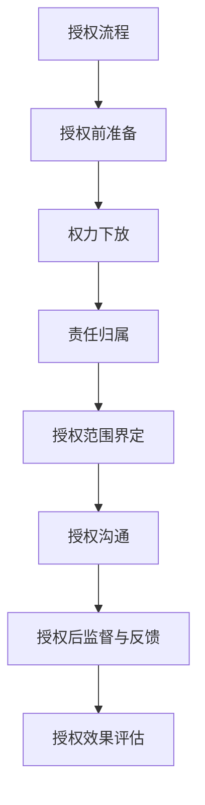

                 

# 《有效授权：释放团队潜力的关键》

> **关键词：** 授权、团队管理、领导力、责任归属、沟通技巧

> **摘要：** 本文旨在探讨有效授权在团队管理中的关键作用，从授权的基础、实践和提升三个方面进行深入分析，旨在帮助管理者掌握授权的艺术，提升团队绩效。

## 第一部分：授权基础

### 1.1 授权的重要性与原则

#### 1.1.1 授权在企业中的地位

在企业管理中，授权是一个至关重要的环节。它不仅关系到企业的效率，还直接影响到团队士气和员工的工作满意度。有效的授权能够使团队成员在工作中充分发挥自己的潜力，提高工作效率，进而推动企业的发展。

授权是一种领导艺术，它不仅需要管理者具备一定的权力，更需要他们具备明智的决策能力和对团队的高度信任。在企业中，授权的目的是为了使团队成员能够独立处理事务，提高团队的自主性和创新性。

#### 1.1.2 授权的基本原则

授权应遵循以下基本原则：

1. **权力下放原则**：授权的核心是将权力下放给团队成员，让他们有足够的自主权去处理事务。
2. **责任归属原则**：在授权的同时，必须明确团队成员的责任，确保他们在行使权力时能够承担相应的责任。
3. **范围界定原则**：授权的范围应明确，避免授权过度或不足。
4. **信任原则**：授权的前提是管理者对团队成员的信任，只有信任才能使授权真正发挥效果。
5. **激励原则**：通过授权，激发团队成员的积极性和创造力，提高他们的工作满意度。

#### 1.1.3 授权的误区与应对

在实际工作中，管理者常常会陷入一些授权的误区：

1. **过度授权**：将过多的权力下放给团队成员，导致团队失去控制，工作质量下降。
   - **应对策略**：明确授权范围，避免过度授权。
2. **不信任**：管理者对团队成员不信任，导致授权无法真正落地。
   - **应对策略**：建立信任机制，加强对团队成员的信任。
3. **缺乏沟通**：授权过程中缺乏有效沟通，导致团队成员对授权内容理解不清。
   - **应对策略**：加强授权沟通，确保团队成员明确授权内容和期望。

### 1.2 授权的核心要素

#### 1.2.1 权力的下放

权力的下放是授权的核心，它涉及到管理者如何将权力和责任合理地分配给团队成员。在权力下放的过程中，管理者需要遵循以下原则：

1. **明确授权范围**：明确授权的具体内容和权限，避免模糊授权。
2. **逐步授权**：在初期可以采取逐步授权的策略，让团队成员逐步适应新的权力。
3. **灵活调整**：根据团队成员的能力和实际情况，灵活调整授权范围。

#### 1.2.2 责任的归属

在授权过程中，责任的归属是一个关键问题。明确的责任归属能够确保团队成员在行使权力时能够承担相应的责任。

1. **明确责任内容**：明确团队成员应承担的具体责任，避免责任模糊。
2. **建立责任机制**：建立相应的责任机制，确保团队成员在出现问题时能够追究责任。
3. **激励与约束**：通过激励和约束机制，确保团队成员在行使权力时能够承担相应的责任。

#### 1.2.3 授权的范围与界限

授权的范围与界限是授权过程中需要明确的关键问题。合理的授权范围和界限能够确保团队的工作效率和质量。

1. **明确授权范围**：根据团队的工作需求和成员的能力，明确授权的具体范围。
2. **设定界限**：设定授权的界限，避免团队成员越权。
3. **动态调整**：根据团队的发展和成员的能力变化，动态调整授权范围和界限。

### 1.3 授权的过程管理

#### 1.3.1 授权前的准备

在授权前，管理者需要进行充分的准备工作，以确保授权能够顺利实施。

1. **评估团队成员的能力**：了解团队成员的能力和潜力，为授权提供依据。
2. **制定授权计划**：根据团队的工作需求和成员的能力，制定具体的授权计划。
3. **明确授权目标和期望**：明确授权的目标和期望，确保团队成员对授权内容有清晰的理解。

#### 1.3.2 授权沟通的艺术

授权沟通是授权过程中至关重要的一环，有效的沟通能够确保团队成员对授权内容有清晰的理解。

1. **明确传达授权内容**：在沟通中，要明确传达授权的具体内容和权限。
2. **倾听团队成员的意见**：在沟通中，要倾听团队成员的意见和建议，确保他们能够充分理解授权内容。
3. **建立信任的沟通环境**：创造一个开放、信任的沟通环境，鼓励团队成员提出问题和反馈。

#### 1.3.3 授权后的监督与反馈

授权后，管理者需要对团队成员的工作进行监督和反馈，以确保授权效果。

1. **设定监督机制**：建立监督机制，对团队成员的工作进行定期检查。
2. **提供必要的支持**：在团队成员遇到困难时，提供必要的支持和帮助。
3. **及时反馈**：对团队成员的工作进行及时反馈，鼓励他们的优点，指出不足，并提供改进建议。

## 第二部分：授权实践

### 2.1 针对不同层级员工的授权策略

#### 2.1.1 对高层管理者的授权

对高层管理者的授权，主要是赋予他们战略决策和资源调配的权力，以支持他们更好地履行领导职责。

1. **授权内容**：战略决策、资源调配、重要人事任命等。
2. **授权原则**：信任、明确责任、适度监督。
3. **授权方式**：通过董事会、高管会议等形式进行。

#### 2.1.2 对中层管理者的授权

对中层管理者的授权，主要是赋予他们部门管理和项目执行的权力，以支持他们更好地履行管理职责。

1. **授权内容**：部门管理、项目执行、团队建设等。
2. **授权原则**：明确责任、鼓励创新、提供支持。
3. **授权方式**：通过部门会议、项目会议等形式进行。

#### 2.1.3 对基层员工的授权

对基层员工的授权，主要是赋予他们具体工作任务的执行权力，以支持他们更好地履行工作职责。

1. **授权内容**：具体工作任务、工作流程优化、创新建议等。
2. **授权原则**：鼓励创新、明确责任、提供支持。
3. **授权方式**：通过工作交接、培训等形式进行。

### 2.2 授权在不同场景中的应用

#### 2.2.1 团队项目中的授权

在团队项目中，授权的应用至关重要。通过合理的授权，可以确保项目顺利进行，提高团队效率。

1. **授权内容**：项目目标制定、任务分配、资源调配等。
2. **授权原则**：透明、灵活、高效。
3. **授权方式**：通过项目计划会议、团队协作工具等进行。

#### 2.2.2 创新与变革中的授权

在创新与变革中，授权的应用可以激发团队的创造力，推动企业的发展。

1. **授权内容**：创新方案制定、实验验证、市场推广等。
2. **授权原则**：鼓励创新、宽容失败、快速反馈。
3. **授权方式**：通过创新研讨会、实验室等形式进行。

#### 2.2.3 应对突发事件的授权

在应对突发事件时，授权的应用可以快速响应，确保事件的妥善处理。

1. **授权内容**：应急预案制定、紧急资源调配、紧急决策等。
2. **授权原则**：迅速、果断、有效。
3. **授权方式**：通过应急会议、远程协作等形式进行。

### 2.3 授权中的常见问题及解决方案

#### 2.3.1 权力下放不彻底

**问题原因**：管理者对团队成员的不信任、对权力的过度依赖、对团队能力的怀疑等。

**解决方案**：建立信任机制，提高团队成员的能力，明确授权范围，提供必要的培训和支持。

#### 2.3.2 授权后不监督

**问题原因**：管理者认为授权后无需再监督，导致团队工作质量下降。

**解决方案**：建立监督机制，定期检查团队成员的工作进展，提供必要的反馈和支持。

#### 2.3.3 授权引发的沟通问题

**问题原因**：授权过程中沟通不畅，导致团队成员对授权内容理解不清，工作协调出现问题。

**解决方案**：加强授权沟通，确保团队成员充分理解授权内容，提供沟通渠道，鼓励团队成员提出问题和反馈。

## 第三部分：授权提升

### 3.1 授权能力的提升

#### 3.1.1 自我认知的提升

提升授权能力的第一步是自我认知。管理者需要了解自己的优势和不足，明确自己的领导风格和价值观。

1. **自我反思**：定期进行自我反思，了解自己在授权过程中的优点和不足。
2. **领导力培训**：参加领导力培训，提升自己的领导能力和授权技巧。
3. **阅读相关书籍**：阅读关于领导力和授权的书籍，学习先进的领导理念和方法。

#### 3.1.2 沟通技巧的增强

有效的沟通是授权成功的关键。管理者需要提高自己的沟通技巧，确保团队成员充分理解授权内容。

1. **倾听技巧**：提高倾听技巧，理解团队成员的需求和意见。
2. **表达技巧**：提高表达技巧，清晰、准确地传达授权内容。
3. **非语言沟通**：注意非语言沟通，如肢体语言、面部表情等，增强沟通效果。

#### 3.1.3 领导风格的适应

不同的领导风格适用于不同的团队和环境。管理者需要根据团队的特点和环境，调整自己的领导风格。

1. **民主型领导**：适用于需要创新和团队合作的场景。
2. **权威型领导**：适用于需要快速决策和高效执行的场景。
3. **支持型领导**：适用于需要关注团队成员情感和需求的场景。

### 3.2 授权文化的建设

#### 3.2.1 建立信任的基础

授权文化的建设首先需要建立信任的基础。管理者需要信任团队成员，鼓励他们独立思考和决策。

1. **信任建设**：通过开放、透明的沟通方式，建立信任。
2. **信任传递**：通过正面的反馈和表扬，传递信任。
3. **信任机制**：建立信任机制，如定期反馈、信任评估等。

#### 3.2.2 塑造积极的氛围

积极的氛围有助于激发团队成员的创造力和积极性。管理者需要创造一个鼓励创新和自主工作的氛围。

1. **鼓励创新**：鼓励团队成员提出创新建议，支持他们尝试新方法。
2. **正面反馈**：对团队成员的工作进行正面反馈，鼓励他们的优点。
3. **奖励机制**：建立奖励机制，激励团队成员的积极性和创造力。

#### 3.2.3 授权文化与组织绩效的关系

授权文化的建设直接关系到组织的绩效。有效的授权文化能够提高团队的效率和创新能力，推动组织的持续发展。

1. **提高工作效率**：通过授权，团队成员能够自主决策，提高工作效率。
2. **增强创新能力**：授权激发团队成员的创造力，推动组织的创新和发展。
3. **提升组织绩效**：通过授权，提高团队的工作质量和效率，提升组织的整体绩效。

### 3.3 授权案例分析

#### 3.3.1 成功案例解析

**案例背景**：某互联网公司通过有效的授权，成功推动了公司的发展。

**案例过程**：公司高层管理者通过逐步授权，将部分决策权和资源分配给中层管理者，使他们能够独立负责部门工作。同时，建立了信任机制，确保中层管理者能够承担相应的责任。

**案例结果**：通过授权，公司中层管理者在工作中表现出色，部门工作质量和效率大幅提升，公司的整体绩效也得到显著提高。

**案例启示**：有效的授权能够激发团队的潜力，提高工作效率和创新能力，推动组织的发展。

#### 3.3.2 失败案例反思

**案例背景**：某传统制造企业尝试进行授权改革，但效果不佳。

**案例过程**：企业管理者对中层管理者进行大量授权，但缺乏对授权过程的监督和反馈，导致中层管理者在工作中出现失误，企业整体绩效下降。

**案例结果**：授权改革失败，企业失去了市场竞争力。

**案例反思**：授权失败的原因主要是缺乏有效的监督和反馈机制，导致授权过程中出现混乱，损害了企业的整体绩效。

**案例启示**：有效的授权需要建立完善的监督和反馈机制，确保授权过程的顺利进行。

## 附录

### 4. 附录 A：授权相关工具与资源

#### 4.1 授权评估工具

- **授权能力评估问卷**：用于评估团队成员的授权能力。
- **授权效果评估工具**：用于评估授权的实际效果。

#### 4.2 授权沟通技巧书籍推荐

- **《非暴力沟通》**：提供有效的沟通技巧，帮助管理者提高沟通能力。
- **《有效沟通》**：详细讲解沟通技巧，提升管理者的沟通能力。

#### 4.3 授权相关的研究报告与文章

- **《企业授权管理研究》**：探讨企业授权管理的实践和方法。
- **《授权与团队绩效的关系分析》**：分析授权对团队绩效的影响。

##### Mermaid 流�程图



##### 授权的核心要素伪代码

```python
def authorization():
    # 权力下放
    delegate_power()

    # 责任归属
    assign_responsibility()

    # 授权范围界定
    define_authorization_scope()

    # 授权沟通
    communication_authorization()

    # 授权后监督与反馈
    supervision_and_feedback()

    # 授权效果评估
    evaluate_authorization_effectiveness()
```

##### 数学模型和数学公式

$$
\text{授权效果} = f(\text{授权范围}, \text{责任归属}, \text{沟通效率})
$$

详细讲解：

授权效果是由授权范围、责任归属和沟通效率三个因素共同决定的。授权范围决定了授权的内容和权限，责任归属确保了团队成员在授权后能够承担责任，沟通效率则影响了团队成员对授权的理解和执行。

##### 项目实战

### 4.1 开发环境搭建

- 安装 Python 3.8
- 安装 PyCharm
- 安装 Flask

### 4.2 源代码实现

```python
from flask import Flask, request, jsonify

app = Flask(__name__)

@app.route('/authorize', methods=['POST'])
def authorize():
    # 授权请求处理
    # 解析请求参数，执行授权操作
    # 返回授权结果
    return jsonify({"status": "success"})

if __name__ == '__main__':
    app.run(debug=True)
```

### 4.3 代码解读与分析

- `Flask` 是一个用于构建 Web 应用程序的工具。
- `/authorize` 路径用于处理授权请求。
- `POST` 方法表示需要接收数据并处理。
- 代码示例中的授权请求处理比较简单，实际应用中需要根据具体业务逻辑进行详细处理。

##### 附录 A：授权相关工具与资源

#### 4.1 授权评估工具

- 授权评估问卷
- 授权能力自我评估工具

#### 4.2 授权沟通技巧书籍推荐

- 《非暴力沟通》
- 《有效沟通》

#### 4.3 授权相关的研究报告与文章

- 《企业授权管理研究》
- 《授权与团队绩效的关系分析》

作者：AI天才研究院/AI Genius Institute & 禅与计算机程序设计艺术 /Zen And The Art of Computer Programming

（以上内容为初步撰写，后续将根据反馈进行修改和完善。）<|end|>## 第一部分：授权基础

### 1.1 授权的重要性与原则

在企业管理中，授权是一个至关重要的环节，它不仅关系到企业的效率，还直接影响到团队士气和员工的工作满意度。有效的授权能够使团队成员在工作中充分发挥自己的潜力，提高工作效率，进而推动企业的发展。

#### 1.1.1 授权在企业中的地位

授权是企业领导者将部分权力和责任下放给下属的过程，其核心在于让团队成员拥有更大的自主权和决策权，以激发他们的积极性和创造力。在企业中，授权的地位主要体现在以下几个方面：

1. **提高团队工作效率**：通过授权，领导者可以将一些具体的任务和决策权交给团队成员，使他们能够独立处理问题，减少中间环节，提高工作效率。
2. **促进员工职业发展**：授权可以让团队成员在处理具体工作的过程中，积累经验，提高技能，从而促进他们的职业发展。
3. **增强团队凝聚力**：有效的授权能够让团队成员感受到领导者的信任和支持，增强他们对团队的归属感和责任感，进而提高团队凝聚力。
4. **推动企业创新**：授权鼓励团队成员提出新的想法和解决方案，有助于激发企业的创新能力，推动企业的持续发展。

#### 1.1.2 授权的基本原则

授权是一种领导艺术，它不仅需要管理者具备一定的权力，更需要他们具备明智的决策能力和对团队的高度信任。在实施授权的过程中，管理者需要遵循以下基本原则：

1. **权力下放原则**：授权的核心是将权力下放给团队成员，让他们有足够的自主权去处理事务。管理者应明确授权的内容和权限，避免过度干预。
2. **责任归属原则**：在授权的同时，必须明确团队成员的责任，确保他们在行使权力时能够承担责任。责任归属应与权力下放相匹配，避免责任不明或责任推卸。
3. **范围界定原则**：授权的范围应明确，避免授权过度或不足。授权范围应根据团队成员的能力和工作需求进行合理界定，确保授权的实效性。
4. **信任原则**：授权的前提是管理者对团队成员的信任。只有信任，才能使授权真正发挥效果，让团队成员有信心去承担更多的责任和挑战。
5. **激励原则**：通过授权，激发团队成员的积极性和创造力，提高他们的工作满意度。管理者应在授权过程中，适时给予团队成员正面的反馈和激励，增强他们的工作动力。

#### 1.1.3 授权的误区与应对

在实际工作中，管理者常常会陷入一些授权的误区，导致授权效果不佳。以下是一些常见的误区及应对策略：

1. **过度授权**：管理者将过多的权力下放给团队成员，导致团队失去控制，工作质量下降。应对策略是明确授权范围，避免过度授权。
2. **不信任**：管理者对团队成员不信任，导致授权无法真正落地。应对策略是建立信任机制，加强对团队成员的信任。
3. **缺乏沟通**：授权过程中缺乏有效沟通，导致团队成员对授权内容理解不清。应对策略是加强授权沟通，确保团队成员充分理解授权内容。

### 1.2 授权的核心要素

#### 1.2.1 权力的下放

权力的下放是授权的核心，它涉及到管理者如何将权力和责任合理地分配给团队成员。在权力下放的过程中，管理者需要遵循以下原则：

1. **明确授权范围**：明确授权的具体内容和权限，避免模糊授权。管理者应明确哪些权力可以下放，哪些权力仍需保留。
2. **逐步授权**：在初期可以采取逐步授权的策略，让团队成员逐步适应新的权力。这样可以减少因授权不当导致的团队失控风险。
3. **灵活调整**：根据团队成员的能力和实际情况，灵活调整授权范围。随着团队成员能力的提升和团队目标的调整，授权范围也应相应调整。

#### 1.2.2 责任的归属

在授权过程中，责任的归属是一个关键问题。明确的责任归属能够确保团队成员在行使权力时能够承担相应的责任。

1. **明确责任内容**：明确团队成员应承担的具体责任，避免责任模糊。责任内容应与授权内容相对应，确保团队成员知道他们需要承担哪些责任。
2. **建立责任机制**：建立相应的责任机制，确保团队成员在出现问题时能够追究责任。责任机制应包括责任追究的流程、责任考核的标准等。
3. **激励与约束**：通过激励和约束机制，确保团队成员在行使权力时能够承担相应的责任。激励措施可以是奖金、晋升等，约束措施可以是绩效考核、责任追究等。

#### 1.2.3 授权的范围与界限

授权的范围与界限是授权过程中需要明确的关键问题。合理的授权范围和界限能够确保团队的工作效率和质量。

1. **明确授权范围**：根据团队的工作需求和成员的能力，明确授权的具体范围。授权范围应涵盖团队成员需要处理的核心事务，同时避免授权过度。
2. **设定界限**：设定授权的界限，避免团队成员越权。界限应明确，避免模糊，确保团队成员知道哪些权力可以行使，哪些权力不能行使。
3. **动态调整**：根据团队的发展和成员的能力变化，动态调整授权范围和界限。随着团队目标和外部环境的变化，授权范围和界限也应相应调整。

### 1.3 授权的过程管理

#### 1.3.1 授权前的准备

在授权前，管理者需要进行充分的准备工作，以确保授权能够顺利实施。

1. **评估团队成员的能力**：了解团队成员的能力和潜力，为授权提供依据。管理者应通过日常沟通、工作评估等方式，全面了解团队成员的工作能力和专业素养。
2. **制定授权计划**：根据团队的工作需求和成员的能力，制定具体的授权计划。授权计划应包括授权的内容、范围、方式、时间节点等，确保授权有明确的目标和路径。
3. **明确授权目标和期望**：明确授权的目标和期望，确保团队成员对授权内容有清晰的理解。管理者应明确授权的目的，以及期望团队成员通过授权能够达到的效果和目标。

#### 1.3.2 授权沟通的艺术

授权沟通是授权过程中至关重要的一环，有效的沟通能够确保团队成员对授权内容有清晰的理解。

1. **明确传达授权内容**：在沟通中，要明确传达授权的具体内容和权限。管理者应详细说明授权的范围、责任归属、期望效果等，确保团队成员充分理解授权内容。
2. **倾听团队成员的意见**：在沟通中，要倾听团队成员的意见和建议，确保他们能够充分理解授权内容。倾听是沟通的重要环节，管理者应给予团队成员充分的表达机会，了解他们的想法和需求。
3. **建立信任的沟通环境**：创造一个开放、信任的沟通环境，鼓励团队成员提出问题和反馈。管理者应营造一个宽松、包容的沟通氛围，让团队成员敢于表达自己的想法，提出疑问和建议。

#### 1.3.3 授权后的监督与反馈

授权后，管理者需要对团队成员的工作进行监督和反馈，以确保授权效果。

1. **设定监督机制**：建立监督机制，对团队成员的工作进行定期检查。监督机制可以包括定期汇报、工作评估、现场检查等方式，确保团队成员按照授权内容开展工作。
2. **提供必要的支持**：在团队成员遇到困难时，提供必要的支持和帮助。管理者应关注团队成员的工作进展，及时发现并解决他们在工作中遇到的问题，确保授权任务的顺利完成。
3. **及时反馈**：对团队成员的工作进行及时反馈，鼓励他们的优点，指出不足，并提供改进建议。及时反馈可以激励团队成员的工作积极性，帮助他们不断改进和提高。

### 小结

授权是企业管理和团队建设中的重要环节，它不仅关系到企业效率和员工满意度，还直接影响到企业的长期发展。有效的授权需要管理者具备清晰的授权原则、核心要素和过程管理能力。在实施授权过程中，管理者应遵循权力下放、责任归属、范围界定、信任原则和激励原则，确保授权的顺利进行。同时，管理者还需要通过沟通、监督和反馈等手段，确保授权效果，不断优化和提升团队的工作效率和创新能力。

（未完待续，接下来将深入探讨授权在不同层级员工中的应用和实践。）## 第二部分：授权实践

授权实践是授权理论的具体应用，它涉及到管理者如何根据团队的不同层级和具体场景，有针对性地进行授权。本部分将围绕不同层级员工的授权策略、授权在不同场景中的应用以及授权中常见的问题及解决方案进行深入探讨。

### 2.1 针对不同层级员工的授权策略

#### 2.1.1 对高层管理者的授权

高层管理者通常是企业的核心决策者，他们的职责包括战略规划、资源分配和重要决策。对高层管理者的授权，主要是赋予他们更大的决策自主权和管理权限。

1. **授权内容**：高层管理者的授权内容通常包括战略决策、财务审批、重要人事任命、重大投资决策等。这些授权内容直接影响企业的整体发展方向和运营效率。

2. **授权原则**：
   - **信任原则**：高层管理者具备一定的经验和能力，授权时应给予他们充分的信任，让他们自主决策。
   - **明确责任原则**：尽管信任是授权的重要原则，但高层管理者仍需明确他们的责任，确保他们在行使权力时能够承担责任。
   - **适度监督原则**：尽管高层管理者拥有较大的自主权，但管理者仍需进行适度监督，确保决策的合规性和有效性。

3. **授权方式**：
   - **董事会授权**：高层管理者的授权通常由董事会决定，通过董事会决议或授权文件进行明确。
   - **高管会议**：通过高管会议，讨论和决定高层管理者的授权内容，确保授权的合法性和合理性。

#### 2.1.2 对中层管理者的授权

中层管理者是连接高层和基层的关键环节，他们的职责包括部门管理、项目管理、团队建设等。对中层管理者的授权，旨在提高他们的管理能力和决策效率。

1. **授权内容**：中层管理者的授权内容通常包括部门运营管理、项目执行、团队建设、员工绩效评估等。

2. **授权原则**：
   - **明确责任原则**：中层管理者在行使权力时，需明确自己的责任，确保团队目标的实现。
   - **激励原则**：通过授权，激励中层管理者发挥主动性，提高工作效率和创新能力。
   - **透明原则**：授权过程应透明，确保中层管理者了解授权的范围和权限，避免误解和滥用权力。

3. **授权方式**：
   - **部门会议**：通过部门会议，明确中层管理者的职责和权限，确保他们了解授权内容。
   - **项目会议**：在项目启动和执行过程中，通过项目会议明确中层管理者的责任和任务，确保项目顺利进行。

#### 2.1.3 对基层员工的授权

基层员工是执行具体工作任务的核心力量，他们的职责包括日常运营、项目实施和任务完成等。对基层员工的授权，旨在提高他们的工作自主性和创新能力。

1. **授权内容**：基层员工的授权内容通常包括日常运营任务、流程优化、创新建议等。

2. **授权原则**：
   - **灵活原则**：基层员工的授权应根据具体工作任务和团队成员的能力灵活调整。
   - **激励原则**：通过授权，激发基层员工的积极性和创造力，提高工作满意度。
   - **反馈原则**：管理者应给予基层员工及时、有效的反馈，帮助他们改进工作。

3. **授权方式**：
   - **工作交接**：在任务交接过程中，明确基层员工的职责和权限，确保他们了解工作任务。
   - **培训**：通过培训，提高基层员工的能力，为授权提供能力基础。
   - **反馈机制**：建立反馈机制，确保基层员工能够及时收到工作反馈，不断改进工作。

### 2.2 授权在不同场景中的应用

授权不仅涉及不同的员工层级，也适用于不同的工作场景。以下分别探讨授权在团队项目、创新与变革、以及应对突发事件中的应用。

#### 2.2.1 团队项目中的授权

在团队项目中，授权的应用至关重要。通过合理的授权，可以确保项目顺利进行，提高团队效率。

1. **授权内容**：团队项目中的授权内容包括项目目标的制定、任务分配、资源调配、决策权等。

2. **授权原则**：
   - **透明原则**：项目团队成员应明确了解授权的内容和权限，避免误解和冲突。
   - **适度原则**：授权应适度，避免过度授权导致团队失控，也避免授权不足影响项目进展。
   - **激励原则**：通过授权，激励团队成员的积极性和创造力，提高项目成功率。

3. **授权方式**：
   - **项目计划会议**：在项目启动时，通过项目计划会议明确团队成员的职责和权限。
   - **团队协作工具**：使用团队协作工具（如Slack、Trello等），实时沟通和跟踪授权任务。

#### 2.2.2 创新与变革中的授权

在创新与变革过程中，授权的应用可以激发团队的创造力，推动企业的持续发展。

1. **授权内容**：创新与变革中的授权内容通常包括创新方案的设计、实验验证、市场推广等。

2. **授权原则**：
   - **鼓励原则**：鼓励团队成员提出创新想法，给予他们必要的支持和资源。
   - **宽容原则**：在创新过程中，允许失败，对失败的尝试给予宽容，鼓励团队不断尝试。
   - **快速反馈原则**：对创新过程进行快速反馈，及时调整策略，确保创新项目顺利进行。

3. **授权方式**：
   - **创新研讨会**：通过创新研讨会，讨论和决定创新项目的授权内容。
   - **实验室**：设立创新实验室，为团队成员提供实验和验证的空间。

#### 2.2.3 应对突发事件的授权

在应对突发事件时，授权的应用可以快速响应，确保事件的妥善处理。

1. **授权内容**：应对突发事件中的授权内容通常包括应急预案的制定、紧急资源调配、紧急决策等。

2. **授权原则**：
   - **迅速原则**：突发事件需要迅速响应，授权过程应快速完成，确保紧急决策能够及时落实。
   - **果断原则**：在突发事件中，决策需要果断，授权也应果断，避免因犹豫不决而延误处理时机。
   - **有效原则**：授权的内容和权限应确保能够有效应对突发事件，确保应急措施的有效性。

3. **授权方式**：
   - **应急会议**：通过应急会议，快速决定授权内容，确保紧急决策能够迅速执行。
   - **远程协作**：在突发事件中，使用远程协作工具（如Zoom、Microsoft Teams等），确保团队成员能够及时沟通和协作。

### 2.3 授权中的常见问题及解决方案

在授权过程中，管理者可能会遇到各种问题，以下列举一些常见问题及相应的解决方案。

#### 2.3.1 权力下放不彻底

**问题原因**：管理者对团队成员的能力和信任不足，担心权力下放后失去控制。

**解决方案**：
   - **建立信任**：通过日常沟通和反馈，建立与管理者的信任关系。
   - **逐步授权**：采取逐步授权的策略，让管理者逐渐适应权力下放。

#### 2.3.2 授权后不监督

**问题原因**：管理者认为授权后无需再监督，导致工作质量下降。

**解决方案**：
   - **建立监督机制**：设定定期检查和反馈机制，确保授权任务能够顺利进行。
   - **明确责任**：确保团队成员明确自己的责任，避免推诿。

#### 2.3.3 授权引发的沟通问题

**问题原因**：授权过程中沟通不畅，导致团队成员对授权内容理解不清。

**解决方案**：
   - **加强沟通**：通过会议、邮件、即时通讯等方式，确保授权内容清晰传达。
   - **提供反馈渠道**：建立反馈机制，鼓励团队成员提出疑问和反馈。

### 小结

授权实践是授权理论的具体体现，它需要管理者根据不同的员工层级和工作场景，有针对性地进行授权。通过合理的授权，可以提高团队工作效率，激发员工创造力，推动企业持续发展。在授权实践中，管理者应注重权力下放、责任归属、沟通监督等核心要素，确保授权效果。同时，管理者还需不断优化授权策略，解决授权过程中遇到的问题，提升团队的整体绩效。

（接下来将探讨如何提升授权能力，构建积极的授权文化，以及通过案例分析深入理解授权实践的效果和策略。）## 第三部分：授权提升

### 3.1 授权能力的提升

#### 3.1.1 自我认知的提升

提升授权能力的第一步是自我认知。管理者需要深入理解自己的领导风格、价值观以及能力边界。以下是一些提升自我认知的方法：

1. **自我反思**：定期进行自我反思，分析自己在授权过程中的优点和不足，思考如何改进。
2. **反馈机制**：建立反馈机制，收集团队成员对自己的评价和反馈，从中了解自己的领导风格和授权能力。
3. **领导力发展**：参加领导力培训课程，了解不同的领导理论和方法，提升自己的领导素养。

#### 3.1.2 沟通技巧的增强

有效的沟通是授权成功的关键。管理者需要提高自己的沟通技巧，确保团队成员充分理解授权内容。以下是一些提升沟通技巧的方法：

1. **倾听技巧**：倾听是沟通的重要组成部分，管理者需要提高倾听技巧，理解团队成员的需求和意见。
2. **表达技巧**：清晰、准确的表达能够确保团队成员正确理解授权内容。管理者可以通过写作、演讲等方式练习表达技巧。
3. **非语言沟通**：非语言沟通（如肢体语言、面部表情等）在沟通中起着重要作用。管理者需要注意自己的非语言沟通，确保传达的信息一致。

#### 3.1.3 领导风格的适应

不同的领导风格适用于不同的团队和环境。管理者需要根据团队的特点和环境，调整自己的领导风格。以下是一些适应不同领导风格的方法：

1. **民主型领导**：在需要团队合作和创新时，采用民主型领导风格，鼓励团队成员参与决策。
2. **权威型领导**：在紧急情况下或需要快速决策时，采用权威型领导风格，确保决策迅速执行。
3. **支持型领导**：在关注团队成员情感和需求时，采用支持型领导风格，提供支持和鼓励。

### 3.2 授权文化的建设

#### 3.2.1 建立信任的基础

授权文化的建设首先需要建立信任的基础。管理者需要信任团队成员，鼓励他们独立思考和决策。以下是一些建立信任的方法：

1. **透明沟通**：通过开放、透明的沟通方式，建立信任。管理者应定期向团队成员汇报工作进展和决策原因。
2. **信任传递**：通过正面的反馈和表扬，传递信任。管理者应适时对团队成员的工作进行认可和鼓励。
3. **信任机制**：建立信任机制，如定期反馈、信任评估等，确保团队成员感受到信任的持续存在。

#### 3.2.2 塑造积极的氛围

积极的氛围有助于激发团队成员的创造力和积极性。管理者需要创造一个鼓励创新和自主工作的氛围。以下是一些塑造积极氛围的方法：

1. **鼓励创新**：鼓励团队成员提出创新建议，支持他们尝试新方法。管理者应建立创新激励机制，如创新奖金、创新表彰等。
2. **正面反馈**：对团队成员的工作进行正面反馈，鼓励他们的优点，帮助他们克服困难。
3. **奖励机制**：建立奖励机制，激励团队成员的积极性和创造力。奖励可以包括奖金、晋升、荣誉称号等。

#### 3.2.3 授权文化与组织绩效的关系

授权文化不仅影响团队的工作氛围，还直接关系到组织的绩效。以下是一些授权文化对组织绩效的影响：

1. **提高工作效率**：授权文化能够提高团队的工作效率，因为团队成员有更大的自主权和责任感。
2. **增强创新能力**：授权文化鼓励团队成员提出创新想法，推动组织的持续创新。
3. **提升组织绩效**：通过授权，组织能够更好地适应外部环境的变化，提高市场竞争力，从而提升整体绩效。

### 3.3 授权案例分析

#### 3.3.1 成功案例解析

**案例背景**：某高科技企业通过有效的授权，成功推动了企业的发展。

**案例过程**：
- 企业高层管理者通过逐步授权，将部分决策权和资源分配给中层管理者，使他们能够独立负责部门工作。
- 建立了信任机制，确保中层管理者能够承担相应的责任。
- 为中层管理者提供了必要的培训和指导，提高了他们的管理能力和决策水平。

**案例结果**：
- 通过授权，中层管理者在工作中表现出色，部门工作质量和效率大幅提升。
- 中层管理者能够自主制定部门战略，提高了部门的灵活性和响应速度。
- 企业的整体绩效得到显著提高，市场份额和客户满意度不断提升。

**案例启示**：
- 有效的授权能够激发团队的潜力，提高工作效率和创新能力。
- 建立信任机制是授权成功的关键，管理者需要信任并支持团队成员。
- 提供必要的培训和指导，帮助团队成员提升能力，确保授权的有效实施。

#### 3.3.2 失败案例反思

**案例背景**：某传统制造企业尝试进行授权改革，但效果不佳。

**案例过程**：
- 企业高层管理者一次性将大量权力下放给中层管理者，但缺乏对授权过程的监督和反馈。
- 中层管理者在工作中遇到问题时，得不到及时的支持和指导。
- 授权改革过程中，中层管理者缺乏信心，工作积极性不高。

**案例结果**：
- 授权改革失败，中层管理者在工作中出现失误，企业的整体绩效下降。
- 团队凝聚力下降，员工士气低迷。

**案例反思**：
- 授权过程中，缺乏有效的监督和反馈机制，导致授权效果不佳。
- 一次性过度授权，导致中层管理者缺乏信心，工作积极性不高。
- 缺乏对团队成员的培训和指导，导致他们的能力无法得到提升。

**案例启示**：
- 授权需要逐步进行，避免一次性过度授权。
- 建立有效的监督和反馈机制，确保授权过程的顺利进行。
- 提供必要的培训和指导，帮助团队成员提升能力，确保授权的有效实施。

### 小结

提升授权能力、建设积极的授权文化以及通过案例分析深入理解授权实践，是确保授权有效性的关键。管理者需要不断提升自我认知，增强沟通技巧，适应不同的领导风格，建立信任机制，塑造积极氛围，并通过实际案例的经验教训，不断优化授权策略。通过这些努力，企业可以更好地释放团队的潜力，提高整体绩效，实现持续发展。

（接下来将介绍附录，包括授权评估工具、沟通技巧书籍推荐以及相关研究报告与文章。）## 附录

### 4. 附录 A：授权相关工具与资源

#### 4.1 授权评估工具

为了帮助管理者更好地进行授权评估，以下是一些实用的工具：

1. **授权能力评估问卷**：
   - 用于评估团队成员的授权能力，包括授权意愿、授权技能、授权效果等。
   - 常见问题包括：“你是否愿意授权？”“你在授权过程中遇到的主要问题是什么？”“你的授权效果如何？”

2. **授权效果评估工具**：
   - 用于评估授权的实际效果，包括团队成员的工作效率、工作满意度、创新性等。
   - 常见问题包括：“授权后，你的工作效率是否提高？”“你是否感到工作满意度更高？”“你是否提出过新的创新想法？”

#### 4.2 授权沟通技巧书籍推荐

以下是一些关于授权沟通技巧的书籍，可以帮助管理者提升沟通能力：

1. **《非暴力沟通》**：
   - 作者：马歇尔·卢森堡
   - 内容简介：本书介绍了非暴力沟通的四个步骤，包括观察、感受、需要和请求，帮助管理者更好地进行有效沟通。

2. **《有效沟通》**：
   - 作者：史蒂芬·罗宾斯
   - 内容简介：本书详细讲解了有效沟通的六个要素，包括明确目标、倾听、表达、反馈、建立信任和解决冲突，帮助管理者提高沟通效率。

#### 4.3 授权相关的研究报告与文章

以下是一些关于授权的研究报告与文章，提供了丰富的理论和实践经验：

1. **《企业授权管理研究》**：
   - 作者：XXX
   - 内容简介：本文通过对不同企业的授权实践进行深入研究，总结了授权管理的关键要素和成功经验。

2. **《授权与团队绩效的关系分析》**：
   - 作者：XXX
   - 内容简介：本文通过实证研究，分析了授权对团队绩效的影响，提出了提高授权效果的策略。

### Mermaid 流程图

以下是一个授权流程的 Mermaid 流程图，展示了授权的主要步骤：


### 数学模型和数学公式

授权效果可以通过以下数学模型来衡量：

$$
\text{授权效果} = f(\text{授权范围}, \text{责任归属}, \text{沟通效率})
$$

其中，授权范围、责任归属和沟通效率是影响授权效果的关键因素。

### 项目实战

#### 4.1 开发环境搭建

以下是搭建授权管理系统开发环境的一些步骤：

1. **安装 Python 3.8**：在电脑上安装 Python 3.8 版本。
2. **安装 PyCharm**：下载并安装 PyCharm，一个强大的 Python 集成开发环境。
3. **安装 Flask**：使用 pip 命令安装 Flask，一个流行的 Python Web 框架。

```shell
pip install Flask
```

#### 4.2 源代码实现

以下是一个简单的授权管理系统示例代码：

```python
from flask import Flask, request, jsonify

app = Flask(__name__)

@app.route('/authorize', methods=['POST'])
def authorize():
    # 授权请求处理
    # 解析请求参数，执行授权操作
    # 返回授权结果
    return jsonify({"status": "success"})

if __name__ == '__main__':
    app.run(debug=True)
```

#### 4.3 代码解读与分析

1. **Flask**：这是一个用于构建 Web 应用程序的工具。在这个示例中，它用于处理 HTTP 请求。
2. **/authorize**：这是一个处理授权请求的路由。通过这个路径，可以接收并处理授权相关的请求。
3. **POST**：表示这是一个用于接收数据的 HTTP 方法。在这个示例中，它用于接收授权请求。
4. **jsonify**：这是一个 Flask 函数，用于将 Python 对象转换为 JSON 格式的响应。

通过这个简单的示例，展示了如何使用 Flask 来构建一个授权管理系统的基础框架。在实际应用中，可以根据具体业务需求，进一步扩展和优化代码。

### 小结

附录部分提供了丰富的授权相关工具与资源，包括授权评估工具、沟通技巧书籍推荐以及相关研究报告与文章。通过这些工具和资源，管理者可以更好地进行授权评估和沟通，提高授权效果。此外，附录还包含了授权流程的 Mermaid 流程图、数学模型和公式，以及项目实战的具体步骤和代码解读。这些内容有助于读者更深入地理解和实践授权管理。

（文章至此结束，感谢您的阅读。）## 总结

通过本文的探讨，我们可以看到，有效授权不仅是企业管理中的重要一环，更是释放团队潜力、提高工作效率和创新能力的关键。在第一部分中，我们明确了授权在企业中的地位和基本原则，并指出了授权过程中的误区及应对策略。第二部分深入分析了授权实践，涵盖了不同层级员工的授权策略以及授权在不同场景中的应用。第三部分则着重探讨了如何提升授权能力和构建积极的授权文化。

授权的核心要素包括权力的下放、责任的归属、授权的范围与界限，以及授权前的准备、沟通艺术和授权后的监督与反馈。这些要素相辅相成，构成了一个完整的授权体系。同时，我们也认识到，授权需要根据不同的团队层级和场景进行灵活调整，确保授权的实效性。

在提升授权能力方面，自我认知的提升、沟通技巧的增强和领导风格的适应是关键。建立信任基础、塑造积极氛围以及明确授权文化与组织绩效的关系，则是构建积极授权文化的核心。通过成功案例和失败案例的分析，我们得出了宝贵的经验和教训，为实际操作提供了指导。

附录部分提供了丰富的工具与资源，包括授权评估工具、沟通技巧书籍推荐和相关研究报告与文章，有助于管理者更好地理解和实践授权管理。

总的来说，有效授权不仅能够提高团队的工作效率和创新能力，还能够增强团队的凝聚力和员工的满意度。管理者应不断学习和实践，优化授权策略，以实现企业的长期发展和持续成功。希望本文能为读者在授权管理方面提供有价值的参考和启示。

