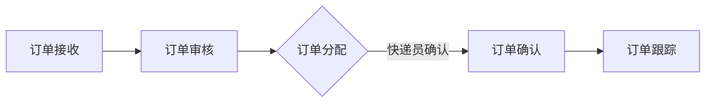

                 

# 《末端配送创业：解决最后一公里难题》

## 摘要

末端配送作为物流链条中的最后一步，直接关系到消费者的购物体验和企业的服务口碑。随着电子商务和线上购物的迅猛发展，末端配送的需求日益增长，但也面临着复杂的市场环境和巨大的挑战。本文旨在探讨末端配送创业的可行性和策略，通过分析末端配送的行业概述、技术基础、创业策略、运营管理、案例分析以及政策与法规，为有意进入这一领域的创业者提供有价值的参考。文章将围绕如何解决“最后一公里”难题这一核心问题，详细探讨末端配送的发展趋势、技术应用、商业模式、运营优化以及未来展望，帮助创业者把握市场机遇，应对挑战，实现商业成功。

## 引言

在现代社会，物流行业的发展速度令人瞩目。从原材料采购、生产制造到产品销售的各个环节，物流都发挥着至关重要的作用。而末端配送作为物流链条中的最后一环，其效率和准确性直接影响到消费者的满意度和企业的品牌形象。随着电子商务的兴起和消费者对即时配送需求的增加，末端配送行业迎来了前所未有的发展机遇。然而，与此同时，末端配送也面临着一系列复杂的挑战，如高成本、复杂流程、劳动力短缺等问题。为了解决这些难题，越来越多的创业者开始探索如何在末端配送领域寻找新的商业机会。本文将深入分析末端配送行业的现状、技术基础、创业策略和运营管理，帮助读者全面了解末端配送的各个方面，为创业者提供有价值的指导。

## 末端配送行业概述

### 1.1 末端配送的定义与价值

末端配送是指从物流中心或仓库到消费者手中的最后一公里配送服务。它包括订单处理、分拣、包装、运输和交付等一系列环节。末端配送的价值在于它不仅能够确保商品快速、安全地送达消费者，还能够提升消费者的购物体验，增强企业的品牌忠诚度和市场竞争力。

首先，末端配送提高了配送效率。通过使用先进的物流技术和管理系统，企业可以实现对订单的快速处理和精准分拣，大幅缩短配送时间。例如，无人车、无人机和机器人配送等技术的应用，使得配送速度大大提高，从而满足消费者对即时配送的需求。

其次，末端配送优化了物流成本。通过优化配送路径和调度策略，企业可以最大限度地降低运输成本。例如，利用大数据分析和智能调度系统，企业可以精确预测消费者的需求，合理安排配送任务，减少空载和无效配送，提高资源利用效率。

最后，末端配送提升了消费者的满意度。在电子商务迅速发展的背景下，消费者对配送速度和服务质量的要求越来越高。末端配送通过提供高效、准确的配送服务，满足了消费者的期望，增强了消费者的购物体验和品牌忠诚度。

### 1.2 末端配送的产业链分析

末端配送产业链包括多个环节，每个环节都承担着不同的职责和功能。

首先，生产制造环节是末端配送的起点。生产商负责生产商品，并将商品运送至物流中心或仓库进行存储和分发。

其次，物流中心或仓库是末端配送的重要节点。物流中心负责接收来自生产商的商品，并进行存储、分拣和包装。仓库作为配送的中转站，确保商品能够及时、准确地运送到消费者手中。

第三，配送网络是末端配送的核心。配送网络包括干线运输、支线运输和最后一公里配送。干线运输负责将商品从物流中心或仓库运送到不同地区的配送中心，支线运输则将商品从配送中心运送到城市内的配送站点，最后一公里配送则负责将商品从配送站点直接送达消费者手中。

最后，消费者是末端配送的终点。消费者通过电商平台或线下商店下单购买商品，并通过末端配送服务获得商品。

### 1.3 末端配送在供应链中的角色

末端配送在供应链中扮演着关键角色，其重要性不可忽视。首先，末端配送是供应链的最后一环，直接影响消费者的购物体验。高效、准确的末端配送能够提升消费者的满意度，增强企业的品牌形象和竞争力。

其次，末端配送是供应链信息流的最后一个环节。通过末端配送，企业能够实时获取消费者的反馈信息，了解市场需求和消费趋势，为供应链的进一步优化提供数据支持。

最后，末端配送是供应链成本控制的重要环节。通过优化配送流程和提升配送效率，企业可以降低物流成本，提高整体供应链的运营效率。

综上所述，末端配送在供应链中具有不可替代的地位，其发展水平直接关系到企业的运营效率和市场竞争力。为了更好地发挥末端配送的作用，企业需要不断引进先进的物流技术和管理系统，提升末端配送的服务质量和效率。

### 1.4 末端配送的发展历程

末端配送的发展历程可以追溯到20世纪末。当时，随着电子商务的兴起，末端配送开始受到关注。传统的配送模式主要依靠人工进行操作，效率低下，配送时间较长。为了解决这些问题，企业开始引入自动化设备和技术，如自动分拣系统和仓储管理系统。

21世纪初，随着信息技术的飞速发展，末端配送行业迎来了新的变革。物流企业开始广泛应用物联网、大数据和人工智能等技术，实现订单处理、分拣、包装和配送的自动化和智能化。这些技术的应用大大提高了末端配送的效率和质量，降低了物流成本。

2010年后，无人配送技术逐渐进入末端配送领域。无人车、无人机和机器人配送开始应用于实际场景，为末端配送提供了新的解决方案。无人配送技术的出现，不仅提升了配送效率，还减少了人力成本，为末端配送行业带来了巨大的变革。

近年来，末端配送行业还面临着新的挑战和机遇。随着消费者对配送速度和服务质量的要求不断提高，末端配送企业需要不断创新和优化配送模式，以满足市场需求。同时，政策支持和法规的完善也为末端配送行业的发展提供了有利条件。

### 1.5 末端配送行业的关键事件

近年来，末端配送行业发生了多起关键事件，对行业产生了深远的影响。

首先，无人配送技术的突破和应用成为行业热点。2016年，阿里巴巴的无人车“ET·阿豹”首次在公共道路上进行测试，标志着无人配送技术开始进入实际应用阶段。随后，京东、美团等企业纷纷推出无人车、无人机和机器人配送服务，为末端配送提供了新的解决方案。

其次，政策支持为末端配送行业的发展提供了有力保障。2017年，国务院发布《新一代人工智能发展规划》，明确提出要加快发展智能物流，推动末端配送的智能化升级。各地政府也纷纷出台相关政策，鼓励企业开展末端配送创新，提升物流效率和服务质量。

最后，行业并购和合作成为末端配送行业的重要趋势。2018年，美团点评宣布收购百度自动驾驶公司，旨在通过技术整合，提升末端配送的智能化水平。此外，京东与顺丰、菜鸟等企业也开展了广泛的合作，共同推动末端配送行业的发展。

### 1.6 末端配送行业的发展趋势

末端配送行业的发展趋势主要体现在以下几个方面：

首先，技术进步将推动末端配送的智能化和自动化水平。随着物联网、大数据、人工智能等技术的不断成熟，末端配送企业将能够更精准地预测和调配资源，提高配送效率和服务质量。

其次，市场需求的变化将促进末端配送模式的创新。随着消费者对配送速度和服务质量的要求不断提高，末端配送企业需要不断创新和优化配送模式，以满足市场需求。例如，灵活的配送时间和灵活的配送方式将成为未来末端配送的重要发展方向。

最后，政策支持和法规完善将为末端配送行业的发展提供有利条件。随着国家对智能物流和绿色物流的重视，末端配送企业将能够更好地享受政策红利，推动行业的可持续发展。

总之，末端配送行业正面临巨大的发展机遇，企业需要紧跟技术发展趋势，创新商业模式，提升服务质量，以实现商业成功。

### 1.7 末端配送的市场现状

末端配送市场现状表现为市场规模不断扩大、竞争格局日益激烈以及市场机遇与挑战并存。

首先，市场规模方面，随着电子商务的迅速发展和消费者对即时配送需求的增加，末端配送市场规模逐年扩大。根据行业报告，全球末端配送市场规模预计将在未来几年内达到数千亿美元。在中国市场，末端配送市场规模也呈现爆发式增长，各大电商平台和物流企业纷纷布局末端配送业务。

其次，竞争格局方面，末端配送市场呈现多元竞争格局。一方面，传统物流企业纷纷转型，通过引入新技术和优化服务，提升末端配送能力。另一方面，新兴企业如无人配送公司、同城快递等，凭借创新技术和灵活运营模式，快速进入市场。此外，电商平台和外卖平台也通过自建物流或与第三方物流合作，争夺市场份额。

最后，市场机遇与挑战并存。末端配送市场的快速发展带来了巨大的商业机会，但也伴随着一系列挑战。例如，物流成本高企、配送资源不足、技术门槛较高等问题，都需要企业通过创新和优化来解决。此外，消费者对配送速度和服务质量的要求越来越高，企业需要在提升效率的同时，确保服务质量，以满足市场需求。

总体来看，末端配送市场前景广阔，但竞争也日益激烈。企业需要紧跟市场趋势，不断创新和优化，以抓住市场机遇，应对挑战，实现可持续发展。

### 1.8 末端配送技术的分类与特点

末端配送技术的分类与特点主要体现在信息技术、物流装备技术和自动化与智能化技术三个方面。

首先，信息技术是末端配送的核心支撑。信息技术包括订单管理系统、仓储管理系统（WMS）、配送管理系统（DMS）等。这些系统能够实现订单的快速处理、仓储的精准管理和配送的实时调度，提高配送效率和服务质量。例如，大数据分析和人工智能技术的应用，可以帮助企业预测消费者需求，优化配送路径，提高资源利用率。

其次，物流装备技术是末端配送的重要工具。物流装备技术包括自动分拣系统、自动化仓储设备、无人车、无人机等。这些设备能够实现商品的自动化处理和运输，减少人力成本，提高配送效率。例如，自动分拣系统能够在短时间内处理大量包裹，大幅缩短分拣时间。无人车和无人机则可以在城市道路和空中进行高效配送，实现最后一公里的快速交付。

最后，自动化与智能化技术是末端配送的未来发展方向。自动化与智能化技术包括机器人配送、智能调度系统、物联网等。这些技术能够实现末端配送的全过程智能化，提高配送效率和服务水平。例如，机器人配送可以在室内或室外进行自主导航和配送，减少人工干预。智能调度系统能够根据实时数据优化配送路径，提高配送效率。物联网技术则能够实现商品运输的全过程监控，确保商品的安全和准确送达。

综上所述，末端配送技术的分类与特点体现了信息技术、物流装备技术和自动化与智能化技术的有机结合。这些技术不仅提高了配送效率和服务质量，还为末端配送行业带来了巨大的发展潜力。

### 2.2 末端配送的核心技术

在末端配送领域，几项核心技术正逐渐成为提高效率、降低成本、提升服务质量和满足消费者需求的驱动力。这些核心技术包括仓储管理系统（WMS）、配送管理系统（DMS）、无人配送技术等。

#### 2.2.1 仓储管理系统（WMS）

仓储管理系统（WMS）是末端配送中不可或缺的一部分，它负责对仓库内的库存进行管理。WMS的主要功能包括库存管理、入库与出库管理、库存调拨、库存盘点等。

**核心原理讲解：**

WMS的核心原理是基于信息技术，通过自动化手段实现仓库内物流作业的高效管理。具体来说，WMS通过条码扫描、RFID技术等手段，实现商品的实时追踪和管理。同时，WMS还具备数据分析和预测功能，可以帮助企业优化库存策略，减少库存积压和资金占用。

**伪代码示例：**

```python
# 假设WMS中的库存管理模块

def check_inventory(item_id, quantity):
    """
    检查库存中某种商品的数量
    :param item_id: 商品编号
    :param quantity: 需要检查的数量
    :return: 库存数量
    """
    inventory = get_inventory_data(item_id)
    return inventory - quantity

def update_inventory(item_id, quantity):
    """
    更新库存信息
    :param item_id: 商品编号
    :param quantity: 更新的数量
    """
    inventory = get_inventory_data(item_id)
    new_inventory = inventory + quantity
    save_inventory_data(item_id, new_inventory)

def get_inventory_data(item_id):
    """
    获取库存数据
    :param item_id: 商品编号
    :return: 库存信息
    """
    # 这里应该通过数据库或其他存储系统获取数据
    return database.get(item_id)
```

**数学模型和公式：**

在仓储管理中，常用的数学模型包括库存优化模型和补货模型。库存优化模型旨在确定最优库存水平，以减少库存成本和缺货风险。补货模型则用于确定补货的时间和数量，以确保库存的持续供应。

$$
最优库存水平 = 安全库存量 + 预期需求量
$$

$$
补货数量 = 需求量 + 安全库存量 - 现有库存量
$$

**举例说明：**

假设某电商平台的库存管理系统需要确保商品的库存量在1000件以上，以防止缺货。通过对过去三个月的销售数据进行分析，预测下一个月的需求量为1500件。当前库存量为800件。根据库存优化模型和补货模型，可以计算出最优库存水平和补货数量。

$$
最优库存水平 = 1000 + 1500 = 2500件
$$

$$
补货数量 = 1500 + 1000 - 800 = 1700件
$$

因此，企业需要在现有库存基础上补货1700件，以确保库存量达到最优水平。

#### 2.2.2 配送管理系统（DMS）

配送管理系统（DMS）负责管理配送过程中的各项任务，包括订单处理、配送路线规划、配送调度等。DMS的核心目的是优化配送流程，提高配送效率和准确性。

**核心原理讲解：**

DMS的核心原理是通过信息技术和算法，实现配送任务的自动化和智能化。具体来说，DMS会根据订单信息和配送区域的特点，利用路径优化算法和调度算法，规划最优的配送路线和配送时间。同时，DMS还具备实时监控和数据分析功能，能够及时发现和解决配送过程中出现的问题。

**伪代码示例：**

```python
# 假设DMS中的路径规划模块

def find_optimal_route(order_list, map_data):
    """
    找到最优配送路线
    :param order_list: 订单列表
    :param map_data: 地图数据
    :return: 最优路线
    """
    routes = []
    for order in order_list:
        route = optimize_route(order.location, map_data)
        routes.append(route)
    return routes

def optimize_route(start_point, map_data):
    """
    优化配送路线
    :param start_point: 起始位置
    :param map_data: 地图数据
    :return: 最优路线
    """
    # 使用Dijkstra算法或其他路径优化算法
    return algorithm.find_shortest_path(start_point, map_data)
```

**数学模型和公式：**

在配送管理中，常用的数学模型包括路径优化模型和调度模型。路径优化模型旨在确定最优的配送路线，以减少配送时间和成本。调度模型则用于确定每个配送员的任务和配送顺序。

$$
配送时间 = 路线长度 \times 配送速度
$$

$$
总成本 = 配送时间 \times 配送成本
$$

**举例说明：**

假设一个配送员需要在一天内完成5个配送任务，每个任务的位置和配送时间如下表所示：

| 任务编号 | 地点       | 配送时间 |
|----------|------------|----------|
| 1        | A          | 15分钟   |
| 2        | B          | 20分钟   |
| 3        | C          | 10分钟   |
| 4        | D          | 25分钟   |
| 5        | E          | 30分钟   |

使用DMS的路径规划功能，可以找到最优的配送路线，以减少总配送时间和成本。通过路径优化算法，可以计算出每个任务的配送顺序和路线。

假设使用Dijkstra算法优化路线，最优的配送路线如下：

1. 从起点A出发，前往任务C，耗时10分钟；
2. 从任务C前往任务B，耗时20分钟；
3. 从任务B前往任务D，耗时25分钟；
4. 从任务D前往任务E，耗时30分钟；
5. 最后返回起点A，耗时15分钟。

总配送时间 = 10 + 20 + 25 + 30 + 15 = 100分钟；
总成本 = 100分钟 \* 配送成本 = 1000元。

#### 2.2.3 无人配送技术

无人配送技术是末端配送领域的一个重要发展方向，它包括无人车、无人机和机器人配送等多种形式。无人配送技术通过自动化和智能化手段，实现了从配送站点到消费者手中的全程无人操作。

**核心原理讲解：**

无人配送技术的核心原理是通过传感器、导航系统和智能控制算法，实现配送设备的自主导航和任务执行。具体来说，无人配送设备会通过GPS、激光雷达、摄像头等传感器，实时感知周围环境，并通过路径规划算法和避障算法，自主选择最优路径进行配送。同时，无人配送设备还具备自动充电、故障检测等功能，确保配送任务的顺利完成。

**伪代码示例：**

```python
# 假设无人配送系统中的导航模块

def navigate_to_destination(current_location, destination, map_data):
    """
    导航到目标位置
    :param current_location: 当前位置
    :param destination: 目标位置
    :param map_data: 地图数据
    :return: 导航路径
    """
    route = find_shortest_path(current_location, destination, map_data)
    return route

def avoid_obstacles(current_route, environment_data):
    """
    避免障碍物
    :param current_route: 当前路径
    :param environment_data: 环境数据
    :return: 修改后的路径
    """
    obstacles = detect_obstacles(environment_data)
    new_route = modify_route(current_route, obstacles)
    return new_route

def find_shortest_path(start_point, end_point, map_data):
    """
    找到最短路径
    :param start_point: 起始位置
    :param end_point: 目标位置
    :param map_data: 地图数据
    :return: 最短路径
    """
    # 使用A*算法或其他最短路径算法
    return algorithm.find_shortest_path(start_point, end_point, map_data)

def detect_obstacles(environment_data):
    """
    检测障碍物
    :param environment_data: 环境数据
    :return: 障碍物列表
    """
    # 使用传感器检测障碍物
    return sensor.detect_obstacles(environment_data)

def modify_route(route, obstacles):
    """
    修改路径以避开障碍物
    :param route: 当前路径
    :param obstacles: 障碍物列表
    :return: 修改后的路径
    """
    # 使用避障算法修改路径
    return algorithm.modify_route(route, obstacles)
```

**数学模型和公式：**

在无人配送技术中，常用的数学模型包括路径规划模型和避障模型。路径规划模型用于确定从起点到终点的最优路径，避障模型则用于在动态环境中避开障碍物。

$$
路径规划模型：C = \sum_{i=1}^{n} d_i
$$

其中，$C$表示总路径长度，$d_i$表示每段路径的长度。

$$
避障模型：A = \frac{d_{\text{障碍物}} + d_{\text{安全距离}}}{2}
$$

其中，$A$表示避障路径长度，$d_{\text{障碍物}}$表示障碍物距离，$d_{\text{安全距离}}$表示安全距离。

**举例说明：**

假设无人配送设备需要从位置A（坐标(0, 0)）导航到位置B（坐标(10, 10)）。在导航过程中，设备遇到了一个障碍物（坐标(5, 5)）。为了避开障碍物，设备需要调整路径。

首先，计算初始路径长度：

$$
C = d_{A,B} = \sqrt{(10-0)^2 + (10-0)^2} = \sqrt{200} \approx 14.142
$$

接着，计算避障路径长度：

$$
d_{\text{障碍物}} = \sqrt{(5-0)^2 + (5-0)^2} = \sqrt{50} \approx 7.071
$$

$$
d_{\text{安全距离}} = 1 \text{ 米}
$$

$$
A = \frac{7.071 + 1}{2} \approx 4.036
$$

最终，设备需要调整路径，避开障碍物，新的路径长度约为：

$$
C' = 14.142 - 4.036 + 4.036 = 14.142
$$

尽管路径长度略有增加，但设备成功避开了障碍物，确保了配送任务的顺利完成。

通过上述核心技术的介绍，我们可以看到，末端配送的核心技术不仅能够提高配送效率和服务质量，还能够为创业者提供强大的技术支持，帮助他们实现商业成功。

### 2.3 末端配送技术的应用与发展前景

末端配送技术的广泛应用不仅显著提升了物流效率，还为企业提供了多样化的运营模式和发展机会。以下是对这些技术应用的实际案例、发展趋势以及它们对未来末端配送行业的影响的详细分析。

#### 2.3.1 技术应用案例分析

**无人配送车：**

无人配送车的应用在末端配送领域取得了显著成效。例如，京东的无人配送车“京东智联云V3”已经在多个城市开展试运营，实现了无人车在社区、校园等场景的自动配送。无人配送车通过搭载高精度地图、实时定位、路径规划和自主避障等技术，实现了自动驾驶和自动配送。这些车辆不仅减少了人力成本，还提高了配送效率和安全性。

**无人机配送：**

无人机配送技术在末端配送中同样具有巨大的潜力。顺丰的无人机配送已经在深圳等地区实现商业化运营，为偏远地区和交通不便的区域提供了高效的配送服务。无人机通过GPS定位、飞行控制、载重优化等技术，能够实现高速、精准的配送。这种技术不仅提升了配送速度，还减少了道路拥堵对配送效率的影响。

**机器人配送：**

机器人配送技术在仓储和末端配送中得到了广泛应用。例如，亚马逊的Kiva机器人能够在仓储中自动分拣和搬运商品，大幅提高了仓储效率。在末端配送中，机器人可以自动从仓库取出商品，并通过智能导航系统将商品送达消费者手中。机器人配送不仅减少了人工操作，还提高了配送准确性和安全性。

#### 2.3.2 技术发展趋势

**智能化水平提升：**

随着人工智能和大数据技术的发展，末端配送技术将实现更高的智能化水平。未来的末端配送系统将能够更加精准地预测配送需求，优化配送路线，提高配送效率。例如，通过深度学习和强化学习算法，末端配送系统可以学习并优化历史配送数据，实现更加智能的路径规划和调度。

**无人化和自动化：**

无人化和自动化将是末端配送技术的发展方向。随着传感器、导航系统和控制技术的不断进步，无人配送设备和机器人在配送中的应用将越来越广泛。未来，无人配送车、无人机和机器人将能够在更复杂的城市环境中实现自主配送，减少对人工的依赖。

**绿色和可持续发展：**

绿色和可持续发展也是末端配送技术的重要趋势。通过使用电动汽车、太阳能无人机和环保材料，末端配送将减少对环境的影响。同时，通过优化配送路线和减少空载运输，企业可以进一步降低碳排放，实现可持续发展。

#### 2.3.3 技术发展对末端配送的影响

**提高配送效率：**

末端配送技术的应用显著提高了配送效率。无人配送车、无人机和机器人能够实现全天候、高效率的配送，减少了配送时间，提升了消费者满意度。此外，通过智能调度系统和实时路径优化，企业能够更好地应对高峰期的配送需求，提高资源利用效率。

**降低成本：**

末端配送技术的自动化和无人化降低了人力成本和物流成本。无人配送设备和机器人不仅减少了人工操作，还提高了配送准确性和安全性，减少了物流损失和赔偿费用。此外，通过大数据分析和智能调度，企业能够优化配送路径，减少空载运输，进一步降低物流成本。

**提升服务质量：**

末端配送技术的应用提升了服务质量和消费者体验。无人配送车和无人机能够在交通拥堵的城市环境中快速配送，减少了等待时间。机器人配送能够确保商品的安全和准确送达，提高了消费者的信任感和满意度。

**改变商业模式：**

末端配送技术的发展改变了物流行业的商业模式。企业可以通过提供即时配送服务来吸引和保留消费者，提高市场份额。同时，通过无人配送技术和自动化设备，企业可以降低运营成本，提高盈利能力。

综上所述，末端配送技术的应用和发展为物流行业带来了巨大的变革和机遇。未来，随着技术的不断进步，末端配送将实现更高的智能化、无人化和绿色化水平，为企业和消费者带来更多价值。

### 3.1 创业团队组建与核心能力建设

创业团队的成功与否在很大程度上取决于团队成员的选择和核心能力的培养。组建一个高效的创业团队需要明确的战略规划和细致的执行步骤，以下是从团队成员选择到核心能力培养的详细探讨。

#### 3.1.1 团队成员的选择

创业团队的成员选择至关重要，必须确保团队成员在专业技能、经验和性格上互补。以下是从几个关键维度进行团队成员选择的建议：

**专业技能：** 团队成员应具备与末端配送业务相关的专业技能。例如，项目经理应熟悉项目管理方法，具备良好的沟通和协调能力；技术团队成员应精通物流信息系统、自动化和智能化技术，如物联网、人工智能和机器人技术等。此外，市场营销团队成员需要了解市场趋势和消费者行为，能够制定有效的营销策略。

**经验：** 团队成员应具备相关行业经验，尤其是物流和配送领域的实际操作经验。有经验的人能够快速识别和解决问题，为创业初期提供宝贵的建议和指导。例如，有物流公司管理经验的团队成员可以帮助企业优化配送流程，提高运营效率。

**性格与团队协作：** 团队成员应具备良好的性格和团队协作能力。创业过程中充满不确定性和挑战，团队成员需要具备抗压能力和团队合作精神，能够在面对困难时相互支持，共同应对。

**多样化背景：** 团队成员背景多样化有助于带来不同的视角和思维模式，从而激发创新和解决问题的能力。例如，团队成员可以包括物流工程师、市场营销专家、产品经理、数据分析师等，他们的多样化背景可以为企业提供全面的业务支持和解决方案。

#### 3.1.2 核心能力的培养

核心能力是创业团队成功的关键，以下是从几个方面探讨如何培养团队的核心能力：

**技术能力：** 技术能力是末端配送创业团队的核心能力之一。团队应不断学习和掌握最新的物流技术，如物联网、大数据分析、人工智能和自动化技术等。通过参加技术培训、技术研讨会和学术会议，团队成员可以不断提升自己的技术水平。

**创新能力：** 创新能力是企业持续发展的动力。团队应鼓励创新思维，通过头脑风暴、项目实验和迭代开发，不断探索新的业务模式和技术应用。例如，可以通过组织创新工作坊，让团队成员提出和讨论新的业务想法和技术解决方案。

**项目管理能力：** 项目管理能力是确保项目按时、按质、按预算完成的基石。团队应培养成员的项目管理技能，包括需求分析、计划制定、资源分配、风险管理等。可以通过参加项目管理认证课程、实际项目管理实践和经验分享，提升团队的项目管理能力。

**市场敏锐度：** 市场敏锐度是把握市场机遇、了解消费者需求的关键。团队应关注市场动态，定期分析竞争对手的运营策略和市场表现，通过市场调研和用户反馈，了解消费者的需求和偏好，从而制定符合市场需求的业务策略。

**沟通协作能力：** 良好的沟通协作能力是团队高效运作的基础。团队应培养成员的沟通技巧，包括清晰表达、有效倾听和积极反馈等。可以通过组织团队建设活动、角色扮演和沟通培训，提升团队成员的沟通协作能力。

#### 3.1.3 创业团队的组织结构

创业团队的组织结构应根据业务特点和团队规模进行设计，确保团队高效运作。以下是一些常见的组织结构设计建议：

**职能型组织结构：** 职能型组织结构将团队成员按职能划分，如研发、市场、运营等。这种结构有利于专业化管理和技能传承，但可能导致部门间沟通不畅。

**项目型组织结构：** 项目型组织结构以项目为核心，团队成员按项目需求灵活调配。这种结构有利于快速响应市场变化和项目需求，但可能导致资源分配不均和团队协作困难。

**矩阵型组织结构：** 矩阵型组织结构结合了职能型和项目型的优点，团队成员既按职能划分，又按项目需求进行工作。这种结构有利于专业分工和跨部门协作，但可能导致管理复杂度和沟通成本增加。

总之，创业团队的成功离不开科学的组织结构和有效的成员选择与能力培养。通过明确团队成员的职责，培养核心能力，并设计合理的组织结构，创业团队可以高效运作，实现创业目标。

### 3.2 市场定位与商业模式设计

#### 3.2.1 市场细分与目标客户

在末端配送创业中，市场细分和目标客户选择是至关重要的一步。通过对市场进行深入分析，创业者可以找到最具潜力的细分市场和目标客户群体，从而制定更精准的市场策略。

**市场细分：**

1. **按地域细分：** 根据城市、地区和国家的不同，可以划分为一线、二线、三线城市等。一线城市如北京、上海、广州等，通常消费水平高、物流需求大，适合高端物流服务；二线城市如成都、武汉、南京等，消费水平和物流需求较高，但成本相对较低，适合中等规模物流服务；三线城市及以下，消费水平和物流需求相对较低，但市场潜力巨大，适合低成本、高效率的物流服务。

2. **按行业细分：** 根据不同行业的物流需求，可以划分为电商物流、零售物流、制造业物流、生鲜冷链物流等。电商物流主要集中在快速消费品和电子产品等领域，对配送速度和服务质量要求较高；零售物流涉及日用品、服装等，对配送效率和客户体验有较高要求；制造业物流则侧重于原材料和成品的及时配送；生鲜冷链物流则对温度控制和配送速度有严格要求。

3. **按配送场景细分：** 根据配送场景的不同，可以划分为社区配送、校园配送、商务区配送等。社区配送主要面向普通消费者，需要灵活的配送时间和高效的配送网络；校园配送主要面向大学生，对即时性和便捷性有较高要求；商务区配送则侧重于高端商务用户，对配送速度和服务质量有较高要求。

**目标客户：**

1. **电商平台：** 电商平台是末端配送的重要客户群体，主要包括淘宝、京东、拼多多等。电商平台需要高效的物流服务来提升购物体验和用户满意度，是末端配送企业的重要合作伙伴。

2. **零售商：** 零售商如超市、便利店、服装店等，对末端配送服务有较高的需求。零售商需要快速响应消费者需求，提高库存周转率和销售额。

3. **制造企业：** 制造企业对物流服务的需求主要集中在原材料和成品的及时配送。制造企业对配送速度和准确性有较高要求，是末端配送企业的重要目标客户。

4. **生鲜电商：** 生鲜电商对冷链物流有特殊需求，要求配送过程保持低温环境，确保生鲜食品的质量和安全。生鲜电商是末端配送领域的潜在高价值客户。

5. **社区团购：** 随着社区团购的兴起，末端配送企业可以通过与社区团购平台合作，提供高效的物流服务，满足社区居民的购物需求。

#### 3.2.2 商业模式的选择

在市场细分和目标客户确定后，创业者需要选择合适的商业模式，以实现盈利和可持续发展。

**B2B模式：** B2B模式是末端配送企业与企业客户（如电商平台、零售商、制造企业等）之间的合作模式。企业客户将物流需求外包给末端配送企业，企业通过提供高效的配送服务来获取收入。B2B模式的优势在于能够获取稳定的客户和较高的利润率，但需要较强的运营能力和市场拓展能力。

**B2C模式：** B2C模式是末端配送企业直接面向消费者提供配送服务。这种模式通过建立品牌和直接触达消费者，可以提高用户粘性和品牌认知度。B2C模式的挑战在于需要大量的资金投入来建立配送网络和提升服务质量。

**C2C模式：** C2C模式是末端配送企业为个人用户提供配送服务。这种模式可以通过平台化的方式，连接个人用户和配送需求，提供灵活的配送服务。C2C模式的优点在于市场潜力大，但需要解决信任问题和用户获取成本。

**混合模式：** 混合模式是将B2B、B2C和C2C模式相结合，为不同客户提供定制化的配送服务。这种模式能够最大化市场覆盖和盈利能力，但运营复杂度和管理难度较高。

#### 3.2.3 收入来源与盈利模式

**收入来源：**

1. **配送费：** 根据配送距离、配送时间和配送物品的价值，向客户收取配送费用。

2. **会员费：** 为客户提供会员服务，收取一定额度的会员费，提供优惠的配送费率、优先配送等特权。

3. **增值服务：** 提供包装、代收款项、包装回收等增值服务，增加收入来源。

**盈利模式：**

1. **成本控制：** 通过优化配送流程、提升运营效率，降低物流成本。

2. **规模效应：** 通过扩大配送网络和服务规模，实现规模效应，降低单位成本。

3. **多元化收入：** 通过提供多元化的服务，如生鲜配送、冷链物流等，实现收入多样化。

4. **数据变现：** 通过收集和分析客户数据，提供数据服务或精准营销，实现数据变现。

总之，市场定位和商业模式设计是末端配送创业成功的关键。通过精准的市场细分和目标客户选择，结合合适的商业模式和收入来源，创业者可以找到市场切入点，实现商业盈利和可持续发展。

### 3.3 资源整合与资金筹措

#### 3.3.1 资源整合策略

在末端配送创业过程中，资源整合是确保项目顺利进行和快速发展的关键环节。资源整合策略包括人力、技术、资金和合作伙伴等各方面的整合。

**1. 人力整合：**

创业团队的人才选择和培养是资源整合的首要任务。需要组建一支具有多元化背景和技能的团队，包括物流管理专家、技术工程师、市场营销专员、财务顾问等。此外，通过内部培训、外部招聘和人才引进计划，不断优化团队结构，提升团队的整体能力和创新能力。

**2. 技术整合：**

技术资源是末端配送企业核心竞争力的重要体现。通过技术创新和整合，可以提高配送效率和服务质量。资源整合策略包括自主研发和外部合作。自主研发可以增强企业的技术储备和自主创新能力，而与高校、科研机构和企业合作，则可以引入先进的科研成果和技术解决方案。

**3. 资金整合：**

资金是末端配送创业过程中不可或缺的资源。通过多元化的资金整合渠道，包括自筹资金、银行贷款、风险投资、政府补贴等，可以确保项目的资金需求。资源整合策略包括：

- **自筹资金：** 通过创业者个人的储蓄、家庭资金和亲友支持，筹集初期运营资金。
- **银行贷款：** 向银行申请经营性贷款、项目贷款等，根据项目的可行性报告和财务预测，获取银行资金支持。
- **风险投资：** 通过吸引风险投资机构的关注和投资，获得资金支持和专业指导。
- **政府补贴：** 利用政府提供的补贴政策，如科技创新补贴、小微企业扶持基金等，降低创业成本。

**4. 合作伙伴整合：**

合作伙伴是资源整合的重要组成部分。通过建立良好的合作关系，可以共享资源，降低运营风险。资源整合策略包括：

- **物流企业：** 与国内外知名物流企业合作，借助其成熟的物流网络和配送体系，提升末端配送服务能力。
- **电商平台：** 与电商平台建立深度合作关系，通过平台资源导入和订单共享，扩大市场份额。
- **技术供应商：** 与物联网、人工智能等领域的领先技术企业合作，获取先进的技术支持和解决方案。

#### 3.3.2 资金筹措渠道

在资金筹措方面，创业者需要充分利用各种渠道，确保项目资金链的稳定性。

**1. 风险投资：**

风险投资是末端配送创业项目获取资金的重要渠道。通过吸引天使投资、风险投资机构和私募股权投资，可以迅速获得大额资金支持。创业者需要准备详细的项目计划书，展示项目的市场潜力、盈利模式和风险控制措施，以吸引投资者的关注。

**2. 银行贷款：**

银行贷款是常见的资金筹措方式，包括经营性贷款、项目贷款等。创业者需要具备良好的信用记录和较强的还款能力，同时准备完整的商业计划书和财务报表，以获得银行的贷款支持。

**3. 众筹平台：**

众筹平台为创业者提供了向公众筹集资金的渠道。通过在众筹平台上发布项目信息，吸引公众投资，可以快速筹集到项目所需的资金。众筹平台的优势在于资金筹集速度快，但需要制定具有吸引力的回报方案，以吸引投资者的参与。

**4. 政府补贴和专项资金：**

政府补贴和专项资金是支持创新创业的重要政策工具。创业者可以通过申报政府科技项目、创新创业大赛和专项扶持基金，获取政府资金支持。政府补贴和专项资金通常有特定的申请条件和审批流程，创业者需要密切关注相关政策信息，积极申报。

#### 3.3.3 融资策略与风险控制

在融资过程中，创业者需要制定合理的融资策略，以降低融资成本和风险。

**1. 优先融资渠道：**

在融资渠道选择上，创业者应优先考虑成本较低、风险较小的渠道，如自筹资金、银行贷款等。在自有资金不足的情况下，再考虑风险投资、众筹等高成本、高风险的融资方式。

**2. 融资额度规划：**

在融资额度规划上，创业者应根据项目资金需求和自身还款能力，合理确定融资额度。避免过度融资，导致资金压力过大，影响项目的正常运营。

**3. 融资结构设计：**

在融资结构设计上，创业者应通过多元化的融资结构，降低融资风险。例如，通过股权融资、债务融资和政府补贴等多种融资方式的组合，实现资金来源的多元化，降低单一融资方式的融资风险。

**4. 风险控制：**

在融资过程中，创业者需要重视风险控制，确保项目的顺利运营。具体措施包括：

- **项目风险评估：** 在融资前进行详细的项目风险评估，识别和评估项目的风险点，制定相应的风险控制措施。
- **财务规划：** 合理规划项目的财务状况，确保项目的盈利能力和还款能力。
- **合同管理：** 与投资者签订详细的融资合同，明确各方权利和义务，避免合同纠纷。
- **信息披露：** 定期向投资者披露项目进展和财务状况，提高投资者的信任度和项目透明度。

总之，资源整合与资金筹措是末端配送创业成功的关键。通过科学合理的资源整合策略和多元化的融资渠道，创业者可以确保项目的资金需求，降低融资成本和风险，为项目的顺利进行和未来发展提供有力支持。

### 4.1 末端配送的运营模式

末端配送的运营模式是保障配送效率和消费者满意度的关键。当前，末端配送的运营模式主要包括直营模式、合作品牌模式和平台模式，每种模式都有其独特的优势和应用场景。

#### 4.1.1 直营模式

**定义与特点：** 直营模式是指企业自行建立和管理配送团队，直接负责商品的配送。这种模式通常由企业自有的配送中心、仓储设施和配送车辆组成，以确保商品能够高效、准确地送达消费者。

**优势：**

1. **控制力强：** 直营模式使企业能够全面控制配送过程，从仓储管理到配送服务的各个环节，确保服务质量和效率。
2. **品牌形象：** 通过自建配送团队，企业可以提升品牌形象，增强消费者对品牌的信任感。
3. **成本可控：** 直营模式可以帮助企业更好地控制成本，通过优化运营流程和规模效应，降低物流成本。

**应用场景：** 直营模式适用于大型电商平台、物流公司或拥有强大物流能力的制造企业，如京东、亚马逊等，它们通过自建物流网络，提供快速、高效的配送服务。

#### 4.1.2 合作品牌模式

**定义与特点：** 合作品牌模式是指企业与其他物流公司或配送服务商合作，共同完成商品配送。在这种模式下，企业通过外包配送服务，借助第三方物流的资源和技术优势，提高配送效率和服务质量。

**优势：**

1. **资源整合：** 通过与专业物流公司合作，企业能够整合外部资源，提高配送效率，降低物流成本。
2. **灵活性高：** 合作品牌模式使企业能够根据业务需求灵活调整配送服务，适应市场变化。
3. **风险分散：** 企业将物流风险部分转移给第三方物流，降低自身的运营风险。

**应用场景：** 合作品牌模式适用于规模较大但物流能力有限的企业，如一些大型零售商、制造企业等，通过合作模式，实现物流服务的快速扩展和优化。

#### 4.1.3 平台模式

**定义与特点：** 平台模式是指企业通过搭建物流平台，连接配送服务提供者和消费者，提供中间服务。平台上的配送服务商可以根据订单需求进行配送，而消费者则可以通过平台选择和预约配送服务。

**优势：**

1. **高效协同：** 平台模式能够高效协同配送服务商和消费者，实现订单的快速匹配和高效配送。
2. **规模经济：** 通过整合大量配送服务商和消费者，平台可以实现规模经济，降低配送成本。
3. **服务多样：** 平台模式提供了多样化的配送服务，如即时配送、预约配送、夜间配送等，满足不同消费者的需求。

**应用场景：** 平台模式适用于初创企业、小型物流服务商和需要灵活配送服务的企业，如美团、滴滴等，通过搭建物流平台，实现资源的优化配置和服务的多样化。

#### 4.1.4 三种模式的比较

**成本：** 直营模式成本较高，但控制力强；合作品牌模式成本适中，灵活性高；平台模式成本较低，但需要承担一定平台维护费用。

**效率：** 直营模式效率最高，但受企业自身物流能力限制；合作品牌模式和平台模式效率次之，但可以借助第三方资源和平台技术提升配送效率。

**服务质量：** 直营模式服务质量最高，但受企业自身服务质量限制；合作品牌模式次之，专业物流公司可以提供高质量的服务；平台模式服务质量相对较低，但可以通过平台评价机制保障服务质量。

**适用性：** 直营模式适用于大型企业；合作品牌模式适用于规模较大但物流能力有限的企业；平台模式适用于初创企业和小型物流服务商。

总之，末端配送的运营模式应根据企业的规模、资源和技术能力进行选择，以实现最佳运营效果。不同的模式各有优势，企业可以根据自身情况，灵活选择和组合，实现高效、优质的末端配送服务。

### 4.2 末端配送的流程管理

在末端配送运营中，流程管理是确保服务质量和效率的关键环节。高效的流程管理能够优化订单处理、配送调度和仓储管理，从而提升整体运营效率和客户满意度。

#### 4.2.1 订单处理流程

订单处理流程是末端配送的第一步，其效率直接影响后续配送环节。订单处理流程通常包括以下几个步骤：

1. **订单接收：** 企业通过电商平台、客户服务热线、微信小程序等多种渠道接收订单，并将订单信息录入系统。

2. **订单审核：** 对订单进行审核，包括检查订单的完整性、商品信息和配送地址等，确保订单信息的准确性。

3. **订单分配：** 根据订单类型、配送时间和配送区域，将订单分配给不同的配送员或配送团队。

4. **订单确认：** 配送员接收订单后，通过系统确认订单，并开始准备配送。

5. **订单跟踪：** 实时跟踪订单状态，包括订单开始配送、配送中、配送完成等，确保订单信息透明，便于客户查询。

**示例流程图：**



#### 4.2.2 配送调度流程

配送调度是末端配送的核心环节，其目的是优化配送路线和资源分配，以提高配送效率和服务质量。配送调度流程通常包括以下几个步骤：

1. **配送计划制定：** 根据订单信息和配送区域的特点，制定初步的配送计划，包括配送路线和配送时间。

2. **配送员分配：** 根据配送计划，将订单分配给不同的配送员或配送团队，确保每个配送员的工作量和配送时间均衡。

3. **配送任务下达：** 将具体的配送任务下达给配送员，包括订单信息、配送路线和配送时间。

4. **实时调度：** 在配送过程中，根据实时交通状况、天气情况等，对配送路线和配送任务进行实时调整，确保配送效率和安全性。

5. **任务反馈：** 配送员完成配送任务后，通过系统反馈配送结果，包括配送完成时间和配送状态。

**示例流程图：**


#### 4.2.3 仓储管理流程

仓储管理是末端配送的重要环节，其效率直接影响到订单的准确性和配送的及时性。仓储管理流程通常包括以下几个步骤：

1. **入库管理：** 商品进入仓库后，进行入库扫描，记录商品信息，并将其存储在相应的仓库位置。

2. **库存盘点：** 定期对仓库库存进行盘点，确保库存数据的准确性和完整性。

3. **订单出库：** 根据订单需求，从仓库中挑选出相应的商品，进行出库扫描，并打包准备配送。

4. **订单跟踪：** 实时跟踪订单在仓库中的处理状态，包括入库、出库和包装等，确保订单信息的透明和及时更新。

5. **仓储优化：** 通过数据分析，优化仓库布局和库存管理，提高仓储效率和空间利用率。

**示例流程图：**


通过上述流程管理，末端配送企业可以确保订单处理、配送调度和仓储管理的顺畅和高效，从而提升整体运营效率和客户满意度。

### 4.3 末端配送的运营优化

在末端配送运营过程中，如何提高服务质量、降低成本和提升效率是一个持续关注的重要课题。运营优化不仅能够增强企业的竞争力，还能提升消费者的满意度。以下将探讨几种有效的运营优化策略，并结合实际案例，详细分析这些策略的实施过程和效果。

#### 4.3.1 成本控制与效益分析

成本控制是末端配送运营优化的核心之一。通过优化运营流程、提高资源利用效率，企业可以在确保服务质量的前提下，降低物流成本。

**1. 优化配送路径：**

通过智能调度系统，企业可以实时分析交通状况、配送量等数据，优化配送路径，减少空载运输和无效配送。例如，京东物流通过大数据分析和路径优化算法，将其配送车辆的空载率降低了20%，从而降低了物流成本。

**2. 提高仓储效率：**

优化仓储管理流程，如通过自动化分拣系统和智能库存管理系统，提高仓储效率。亚马逊的仓储管理采用了高度自动化的设备和技术，如Kiva机器人，大幅提高了库存处理速度和准确性，降低了人工成本。

**3. 资源共享与整合：**

通过共享配送资源，如与本地物流企业合作，提高配送效率。美团外卖通过与本地物流公司合作，共享配送资源，实现了高效的同城配送，降低了物流成本。

**效益分析：**

通过成本控制措施，企业可以在保持服务质量的前提下，显著降低物流成本。例如，某电商平台的物流成本在实施路径优化和仓储自动化后，降低了15%，从而提高了盈利能力。

#### 4.3.2 服务质量提升策略

提升服务质量是末端配送企业的核心竞争力。以下几种策略有助于提高服务质量：

**1. 实时监控与反馈：**

通过实时监控配送过程，及时处理配送过程中出现的问题。例如，顺丰速运通过GPS和物联网技术，实时跟踪快递包裹的位置和状态，确保包裹的安全和及时配送。

**2. 提高配送员培训：**

加强配送员的培训，提高其服务水平和服务意识。例如，美团外卖定期对配送员进行培训，提高其配送技能和服务态度，从而提升消费者满意度。

**3. 引入智能客服系统：**

通过引入智能客服系统，如聊天机器人，提高客户服务效率。京东物流的智能客服系统“京小智”能够快速响应消费者的咨询和投诉，提高客户满意度。

**案例：**

某电商平台的配送服务在引入实时监控和智能客服系统后，投诉率降低了30%，消费者满意度提升了15%，显著提升了服务质量。

#### 4.3.3 智能化运营技术应用

智能化技术是提升末端配送效率和服务质量的重要手段。以下几种技术应用有助于智能化运营：

**1. 无人配送技术：**

通过无人车、无人机和机器人等无人配送技术，实现自动化配送，提高配送效率。例如，阿里巴巴的“小蛮驴”无人车在多个场景中开展试运营，实现了高效、安全的配送。

**2. 物联网技术：**

通过物联网技术，实时监控和追踪商品和车辆的状态，提高物流透明度和安全性。京东物流通过物联网技术，实现了包裹的全程追踪和智能监控，提高了物流效率。

**3. 人工智能技术：**

利用人工智能技术，优化配送路线、预测需求、提高客服效率等。例如，顺丰速运通过人工智能技术，优化了配送路线和仓储管理，提高了运营效率。

**案例：**

某物流公司通过引入无人配送技术和物联网技术，实现了全程自动化和智能化配送，配送效率提升了30%，物流成本降低了15%，显著提升了运营效率和客户满意度。

总之，通过成本控制、服务质量提升和智能化技术应用，末端配送企业可以显著提升运营效率和服务质量，实现可持续发展和商业成功。

### 5.1 国内末端配送创业案例

#### 5.1.1 某电商平台的物流配送创业案例

某电商平台在末端配送领域取得了显著的成果，通过自建物流体系，不仅提高了配送效率，还增强了用户满意度。以下是该电商平台物流配送创业的关键步骤和成功经验。

**创业背景：**

随着电子商务的快速发展，末端配送成为影响用户体验的关键因素。为了提升用户满意度，该电商平台决定自建物流体系，以实现更高效、更可靠的配送服务。

**关键步骤：**

1. **组建团队：** 招聘具有物流管理经验的专家和资深技术工程师，组建专业的物流配送团队。

2. **搭建仓储设施：** 在主要城市建立分布式仓储中心，优化仓储布局，提高仓储效率。

3. **采购运输工具：** 购买大量配送车辆，包括快递车和冷链车，以满足不同类型的配送需求。

4. **研发智能调度系统：** 开发智能调度系统，通过大数据分析和人工智能算法，优化配送路线，提高配送效率。

5. **培训配送人员：** 对配送人员进行全面培训，提高其专业技能和服务意识。

**成功经验：**

1. **技术驱动：** 该电商平台通过引入先进的技术，如物联网、大数据分析和人工智能，实现了物流配送的智能化和自动化。

2. **高效仓储管理：** 通过分布式仓储中心和智能仓储管理系统，提高了仓储效率和商品周转率。

3. **服务质量提升：** 通过智能调度系统和培训，提高了配送员的服务水平，降低了配送错误率。

4. **品牌塑造：** 通过自建物流体系，提升了品牌形象，增强了用户对平台的信任度和忠诚度。

#### 5.1.2 某外卖平台的配送创业案例

某外卖平台在末端配送领域取得了巨大的成功，通过创新的配送模式和高效的运营管理，实现了快速扩张和市场领先。以下是该外卖平台配送创业的关键步骤和成功经验。

**创业背景：**

随着外卖业务的爆发式增长，末端配送需求激增，传统的配送模式已无法满足市场需求。为了提高配送效率和用户体验，该外卖平台决定探索创新的配送模式。

**关键步骤：**

1. **平台化运营：** 构建外卖平台，连接消费者、餐厅和配送员，实现信息的高效传递和资源的优化配置。

2. **推广众包配送：** 推出众包配送模式，通过平台招募大量兼职配送员，实现灵活的配送服务。

3. **优化配送流程：** 通过智能调度系统和路径优化算法，提高配送效率和准确性。

4. **建设配送网络：** 在主要城市建立配送站点，优化配送网络布局，提高配送覆盖范围。

5. **提升服务质量：** 通过培训配送员和引入智能设备，提高配送服务的质量和可靠性。

**成功经验：**

1. **平台化运营：** 通过平台化运营，实现了配送资源的高效利用和快速响应，提高了配送效率。

2. **众包模式：** 众包模式不仅降低了配送成本，还提高了配送灵活性，能够快速适应市场需求变化。

3. **智能调度：** 智能调度系统和路径优化算法，提高了配送效率和准确性，减少了配送时间。

4. **品牌影响力：** 通过优质的配送服务，提升了品牌形象，增强了用户对平台的信任度和忠诚度。

#### 5.1.3 某无人配送公司的创业案例

某无人配送公司在末端配送领域取得了突破性的进展，通过无人车和无人机的应用，实现了高效、可靠的配送服务。以下是该无人配送公司创业的关键步骤和成功经验。

**创业背景：**

随着无人技术和物流需求的增长，无人配送成为末端配送领域的重要趋势。为了抓住这一市场机遇，某无人配送公司决定开展无人配送业务。

**关键步骤：**

1. **技术研发：** 投资于无人车和无人机技术，自主研发导航系统、自动驾驶算法和智能调度系统。

2. **试点运营：** 在特定区域进行无人配送试点，测试和优化无人配送系统的性能和可靠性。

3. **建立配送网络：** 在主要城市建立无人配送站点，优化配送网络布局，提高配送覆盖范围。

4. **培训操作人员：** 对操作人员进行全面培训，确保无人配送系统能够安全、高效地运行。

5. **拓展业务领域：** 通过与电商平台、超市等合作，扩大业务范围，提高市场份额。

**成功经验：**

1. **技术创新：** 通过自主研发的高性能无人车和无人机，实现了配送过程的自动化和智能化，提高了配送效率。

2. **试点运营：** 通过试点运营，积累了大量实际运营数据，优化了无人配送系统的性能和可靠性。

3. **高效配送网络：** 通过建立高效的配送网络，实现了快速、可靠的配送服务，提升了用户体验。

4. **多元化合作：** 通过与不同行业的合作伙伴合作，拓展了业务领域，实现了业务的多元化发展。

通过以上案例，我们可以看到，国内末端配送创业企业通过技术创新、模式创新和运营优化，取得了显著的成果。这些成功经验为其他创业者提供了宝贵的借鉴和启示。

### 5.2 国际末端配送创业案例

#### 5.2.1 某国际物流企业的末端配送转型

某国际物流企业在末端配送领域取得了显著成就，通过转型和创新，实现了从传统物流向现代物流的转变。以下是该企业末端配送转型的关键步骤和成功经验。

**创业背景：**

随着全球电商市场的迅猛发展，末端配送需求急剧增加。为了抓住这一市场机遇，某国际物流企业决定进行末端配送业务的转型。

**关键步骤：**

1. **技术升级：** 引入物联网、大数据和人工智能技术，提升物流信息化和智能化水平。

2. **优化配送网络：** 在全球范围内优化配送网络，建立多个末端配送站点，提高配送覆盖范围和效率。

3. **人才引进：** 招聘具有物流管理、信息技术和市场营销等背景的专业人才，组建高效运营团队。

4. **模式创新：** 推出“最后一公里”服务，通过无人机、无人车和机器人等新技术，实现快速、准确的末端配送。

5. **国际合作：** 与电商平台、超市等国际企业建立合作关系，扩大业务范围，提高市场份额。

**成功经验：**

1. **技术驱动：** 通过引入先进技术，实现了末端配送的自动化和智能化，大幅提高了配送效率。

2. **全球化布局：** 通过全球范围内的配送网络布局，提升了配送覆盖率和服务质量。

3. **模式创新：** 通过创新的“最后一公里”服务模式，满足了不同客户群体的需求，提升了用户体验。

4. **国际化合作：** 通过与全球知名企业合作，拓展了业务领域，实现了业务的国际化发展。

#### 5.2.2 某跨国电商的末端配送创业

某跨国电商在末端配送领域进行了成功创业，通过创新的商业模式和高效的运营管理，实现了全球市场的快速扩张。以下是该跨国电商末端配送创业的关键步骤和成功经验。

**创业背景：**

随着全球消费者对即时配送需求的增加，末端配送成为跨境电商业务的重要组成部分。为了提升用户体验和市场份额，某跨国电商决定在末端配送领域进行创业。

**关键步骤：**

1. **平台搭建：** 构建跨境电子商务平台，连接全球消费者和供应商，实现全球化业务布局。

2. **本地化运营：** 在主要市场建立本地化运营团队，根据当地市场需求和物流环境，优化配送模式。

3. **物流网络建设：** 建立全球化的物流网络，通过合作伙伴和自建仓储，实现高效、可靠的末端配送。

4. **技术创新：** 推广无人机、无人车和机器人等新技术，提高配送效率和准确性。

5. **客户服务优化：** 通过引入智能客服系统和实时跟踪技术，提高客户服务质量和满意度。

**成功经验：**

1. **平台化运营：** 通过构建全球化电商平台，实现了商品和物流的高效连接，提升了用户体验。

2. **本地化策略：** 通过本地化运营团队和物流网络，满足了不同市场的需求，提升了市场竞争力。

3. **技术创新：** 通过引入新技术，实现了末端配送的自动化和智能化，大幅提高了配送效率。

4. **客户服务优化：** 通过智能客服系统和实时跟踪技术，提升了客户服务质量和用户满意度。

#### 5.2.3 某国际物流平台的末端配送创新

某国际物流平台在末端配送领域进行了创新实践，通过优化配送流程和引入新技术，提升了整体配送效率和服务质量。以下是该物流平台末端配送创新的关键步骤和成功经验。

**创业背景：**

随着跨境电商的兴起和消费者对即时配送需求的增加，末端配送成为国际物流领域的重要挑战。为了应对这一挑战，某国际物流平台决定在末端配送进行创新。

**关键步骤：**

1. **智能调度系统：** 引入智能调度系统，通过大数据分析和人工智能算法，优化配送路线和调度策略。

2. **无人配送技术：** 推广无人车和无人机等无人配送技术，实现城市和农村地区的快速、高效配送。

3. **协同配送：** 与当地物流公司、电商平台等合作，实现资源共享和协同配送，提高配送效率。

4. **绿色物流：** 推广绿色物流理念，使用电动车和清洁能源车辆，降低碳排放，提升社会责任。

5. **客户体验优化：** 通过实时跟踪系统和客户反馈机制，提升客户体验和服务质量。

**成功经验：**

1. **智能调度系统：** 通过智能调度系统，实现了配送任务的精准匹配和实时调整，提高了配送效率。

2. **无人配送技术：** 通过无人配送技术，实现了自动化配送，减少了人力成本和物流风险。

3. **协同配送：** 通过与合作伙伴的协同配送，实现了资源优化和效率提升，降低了物流成本。

4. **绿色物流：** 通过推广绿色物流理念，提升了企业形象，增强了市场竞争力。

5. **客户体验优化：** 通过实时跟踪系统和客户反馈机制，提升了客户体验和服务质量，增强了客户忠诚度。

通过以上国际末端配送创业案例，我们可以看到，不同企业在末端配送领域通过技术创新、模式创新和运营优化，取得了显著的成果。这些成功经验为其他企业提供了宝贵的借鉴和启示，有助于在全球市场中获得竞争优势。

### 5.3 案例分析与创业启示

通过对国内和国际末端配送创业案例的详细分析，我们可以总结出以下几点成功经验和教训，为我国末端配送创业提供有价值的启示。

#### 5.3.1 案例成功原因分析

**技术驱动：** 国内外的成功企业都高度重视技术创新，通过引入先进的物流技术、物联网、大数据和人工智能等，实现了末端配送的自动化和智能化。例如，某电商平台的智能调度系统和无人配送技术，显著提高了配送效率和服务质量。

**模式创新：** 成功企业通过创新的商业模式，如自建物流、平台化运营和众包配送等，实现了资源的优化配置和效率的提升。例如，某外卖平台的众包配送模式和某国际物流平台的协同配送模式，不仅降低了物流成本，还提高了配送覆盖率和市场竞争力。

**本地化运营：** 国际企业通过本地化运营策略，根据不同市场的需求和物流环境，优化配送模式和运营流程。例如，某跨国电商的本地化运营团队和物流网络，有效提升了用户体验和市场占有率。

**服务质量提升：** 成功企业注重提升服务质量，通过培训配送人员、引入智能客服系统和实时跟踪技术等，提高了客户满意度。例如，某国际物流平台的实时跟踪系统和客户反馈机制，提升了客户体验和服务质量。

#### 5.3.2 创业经验与教训总结

**经验：**

1. **技术创新：** 创业者应重视技术创新，引入先进的技术和设备，提升配送效率和服务质量。

2. **模式创新：** 根据市场需求和物流环境，探索创新的商业模式，实现资源优化和效率提升。

3. **本地化运营：** 注重本地化运营，根据不同市场的特点，制定个性化的运营策略。

4. **服务质量提升：** 提高服务质量，通过培训、智能客服系统和实时跟踪技术等，提升客户满意度和忠诚度。

**教训：**

1. **成本控制：** 在创业初期，应重视成本控制，避免过度投入和资源浪费。

2. **市场调研：** 在进入新市场前，应进行充分的市场调研，了解市场需求和竞争态势。

3. **风险控制：** 应建立完善的风险控制机制，识别和应对潜在的运营风险。

#### 5.3.3 对我国末端配送创业的启示

**政策支持：** 政府应出台更多支持末端配送创业的政策，如资金扶持、税收优惠和技术支持等，为企业提供良好的创业环境。

**技术创新：** 企业应加大在物流技术、物联网和人工智能等领域的研发投入，提升技术水平和创新能力。

**模式创新：** 企业应探索适合自身发展的商业模式，通过创新和优化，提升市场竞争力和运营效率。

**服务质量：** 企业应重视服务质量，通过提升配送效率和服务水平，增强客户满意度和忠诚度。

**合作共赢：** 企业应与政府、科研机构和合作伙伴建立紧密的合作关系，实现资源共享和优势互补。

总之，通过借鉴国内外末端配送创业的成功经验和教训，我国末端配送创业者可以更好地把握市场机遇，应对挑战，实现商业成功。

### 6.1 末端配送相关政策概述

末端配送作为物流链条中的关键环节，受到政府的高度关注。为了推动末端配送行业的发展，国家及地方政府出台了一系列相关政策，涵盖了资金扶持、税收优惠、技术研发和人才培养等多个方面。

#### 6.1.1 国家层面政策

在国家层面，相关政策主要包括以下几个方面：

1. **资金扶持：** 国家通过设立专项资金，支持末端配送企业的技术研发和设备购置。例如，《关于推进物流降本增效促进实体经济发展的意见》中明确提出，要加大对物流基础设施和技术的投资力度。

2. **税收优惠：** 为鼓励末端配送企业的发展，国家提供了一系列税收优惠政策。例如，对符合条件的末端配送企业实行增值税减免、企业所得税优惠等。

3. **技术研发：** 国家通过政策引导和资金支持，推动末端配送技术的研发和应用。例如，《新一代人工智能发展规划》中明确提出，要加快智能物流技术的研发和产业化。

4. **人才培养：** 国家鼓励高校和职业院校开设物流管理、信息技术等相关专业，培养末端配送所需的专业人才。

#### 6.1.2 地方政府相关政策

地方政府在末端配送政策方面也进行了积极探索，出台了一系列地方性政策，以促进本地区末端配送行业的发展。以下是一些地方政府的相关政策：

1. **资金扶持：** 各地方政府设立了专项资金，支持末端配送企业的技术研发和设备购置。例如，北京市发布了《北京市末端配送服务管理规范》，提出对符合条件的末端配送企业给予资金补助。

2. **税收优惠：** 各地方政府通过减免增值税、企业所得税等税收优惠政策，鼓励末端配送企业的发展。例如，上海市出台的《上海市促进物流业发展三年行动计划》中，明确提出对物流企业实行税收优惠。

3. **技术研发：** 各地方政府通过政策引导和资金支持，推动末端配送技术的研发和应用。例如，深圳市设立了物流产业技术创新基金，支持末端配送技术的研发。

4. **人才培养：** 各地方政府鼓励高校和职业院校开设物流管理、信息技术等相关专业，同时通过技能培训和职业资格认证，提升末端配送从业人员的专业水平。

#### 6.1.3 政策对末端配送行业的影响

政府出台的末端配送相关政策，对行业产生了深远的影响。

1. **推动行业技术进步：** 政策引导和资金支持，促进了末端配送技术的研发和应用，推动了行业的智能化和自动化水平。

2. **降低企业成本：** 税收优惠和资金扶持政策，降低了企业的运营成本，提高了企业的盈利能力。

3. **优化行业环境：** 地方政府的政策支持，为末端配送企业提供了良好的发展环境，吸引了更多企业和投资者进入该领域。

4. **提升服务质量：** 通过政策引导和人才培养，提高了末端配送从业人员的专业水平和素质，提升了整体服务质量。

总之，国家及地方政府出台的末端配送相关政策，为行业的发展提供了有力支持，促进了末端配送行业的健康发展。

### 6.2 末端配送法律法规

末端配送作为物流行业的重要组成部分，其法律法规的健全与否直接影响到行业的健康发展。末端配送法律法规涵盖了运输法律法规、数据保护法律法规以及智能化设备相关法规等多个方面，以下将分别进行详细探讨。

#### 6.2.1 运输法律法规

运输法律法规是末端配送行业的重要基石，主要包括以下几个方面：

1. **运输合同法：** 末端配送过程中，企业和消费者之间通常存在运输合同关系。根据《中华人民共和国合同法》，运输合同应明确运输服务的内容、费用、运输时间、责任承担等条款，保障双方的合法权益。

2. **道路运输法规：** 末端配送主要依赖于道路运输，因此，遵守道路运输法律法规至关重要。例如，《中华人民共和国道路运输条例》规定了道路运输企业的准入条件、运营规范和安全管理要求，以确保道路运输的安全和高效。

3. **货运代理法规：** 在末端配送过程中，货运代理常扮演重要角色。根据《中华人民共和国货运代理管理条例》，货运代理需要具备相应的资质，并遵守相关的业务规范和责任义务。

4. **车辆管理法规：** 末端配送车辆的管理也是运输法律法规的重要内容。例如，《中华人民共和国机动车驾驶证申领和使用规定》和《中华人民共和国道路运输条例》中，对车辆的技术标准、使用要求和驾驶员资质进行了明确规定。

#### 6.2.2 数据保护法律法规

随着末端配送行业的信息化水平不断提高，数据保护成为法律法规的重点领域。以下为相关法律法规：

1. **个人信息保护法：** 《中华人民共和国个人信息保护法》明确规定，任何组织、个人不得非法收集、使用、处理个人信息，确保个人信息的安全和保护。

2. **数据安全法：** 《中华人民共和国数据安全法》要求企业在收集、存储、处理和传输数据时，采取必要的安全保护措施，防止数据泄露、篡改和滥用。

3. **网络安全法：** 《中华人民共和国网络安全法》对网络运营者的数据保护义务进行了详细规定，要求网络运营者加强数据安全防护，建立健全数据安全管理制度。

4. **电子商务法：** 《中华人民共和国电子商务法》对电子商务活动中的数据保护提出了具体要求，要求电子商务经营者合法收集和使用用户数据，保障用户隐私权。

#### 6.2.3 智能化设备相关法规

智能化设备在末端配送中的应用日益广泛，相应的法律法规也逐渐完善。

1. **无人驾驶法规：** 随着无人配送车的应用，无人驾驶法规逐渐成为关注焦点。例如，《中华人民共和国道路交通安全法》对无人驾驶车辆上路行驶的条件、操作规范和安全责任进行了明确规定。

2. **无人机飞行管理法规：** 无人机在末端配送中具有广泛应用，因此，无人机飞行管理法规成为重要内容。例如，《中华人民共和国民用无人机管理条例》规定了无人机的飞行范围、飞行高度和操作要求，确保无人机飞行的安全。

3. **智能机器人法规：** 智能机器人在末端配送中的应用也越来越广泛，智能机器人法规主要涉及机器人的制造、使用和责任承担等方面。例如，《中华人民共和国机器人发展计划（2016-2020年）》提出了推动智能机器人标准化和规范化发展的目标。

4. **物联网法规：** 随着物联网技术在末端配送中的应用，物联网法规也逐步建立。例如，《中华人民共和国物联网发展规划（2016-2020年）》明确了物联网发展的目标和任务，为物联网技术提供了法规保障。

#### 6.2.4 法规风险与挑战

末端配送行业在法律法规方面面临的风险和挑战主要包括：

1. **合规风险：** 企业在运营过程中，如未能遵守相关法律法规，可能面临罚款、停业等处罚，影响企业的正常运营。

2. **数据保护风险：** 随着数据量的增加，企业需要加强对数据保护的管理，防止数据泄露和滥用，否则可能面临用户投诉和法律责任。

3. **智能化设备风险：** 智能化设备在应用过程中，如未能遵守相关法规，可能引发交通事故、设备故障等安全风险。

为了应对这些风险和挑战，末端配送企业应密切关注法律法规的变化，加强合规管理，建立健全的数据保护体系和智能化设备安全管理体系。

### 6.3 政策法规对末端配送创业的影响

政策法规对末端配送创业的影响是多方面的，既为企业提供了发展的机遇，也带来了相应的挑战。以下将详细探讨政策法规如何促进末端配送创业，以及创业者如何应对政策法规带来的风险。

#### 6.3.1 政策优势与机遇

政策法规为末端配送创业提供了多种优势与机遇：

1. **资金支持：** 各级政府通过设立专项资金、提供税收优惠等措施，为末端配送创业企业提供了资金支持。例如，一些地方政府设立了物流产业发展基金，对符合条件的末端配送企业进行资金补助，降低了创业成本。

2. **技术研发支持：** 政府鼓励企业进行技术研发，通过提供科研资金、技术平台支持等方式，推动末端配送技术的创新和应用。例如，《新一代人工智能发展规划》明确提出，要加大对智能物流技术的研发支持。

3. **人才培养支持：** 政府通过政策引导，鼓励高校和职业院校开设物流管理、信息技术等相关专业，培养末端配送所需的专业人才。同时，政府也提供相关的培训课程和职业资格认证，提升从业人员的能力和素质。

4. **市场准入便利：** 政府简化了市场准入程序，为末端配送创业企业提供了更便利的市场准入条件。例如，一些地方政府通过简化审批流程、提供一站式服务，降低了创业者的创业门槛。

#### 6.3.2 法规风险与挑战

尽管政策法规为末端配送创业提供了诸多机遇，但创业者也需要面对政策法规带来的风险和挑战：

1. **合规风险：** 末端配送企业需要遵守多项法律法规，如运输法律法规、数据保护法律法规和智能化设备相关法规等。如未能遵守相关法规，企业可能面临罚款、停业等处罚，影响企业的正常运营。

2. **数据保护风险：** 随着数据量的增加，企业需要加强对数据保护的管理，防止数据泄露和滥用。否则，企业可能面临用户投诉和法律责任。

3. **技术规范风险：** 智能化设备在末端配送中的应用日益广泛，但相关技术规范和标准尚不完善。创业者需要密切关注技术规范的变化，确保设备符合相关标准和要求，以避免技术风险。

#### 6.3.3 创业者应对策略

为了有效应对政策法规带来的风险和挑战，创业者可以采取以下策略：

1. **合规管理：** 企业应建立健全的合规管理体系，加强对法律法规的学习和培训，确保在运营过程中严格遵守相关法规。

2. **数据保护：** 企业应建立健全的数据保护机制，采取必要的数据保护措施，如数据加密、访问控制等，确保用户数据的安全。

3. **技术规范遵守：** 企业应密切关注技术规范的变化，确保设备和技术符合相关标准和要求，降低技术风险。

4. **政策研究：** 创业者应深入研究政策法规，了解政策动向，把握政策机遇，为企业的战略规划和业务发展提供依据。

5. **合作与交流：** 企业可以与政府、行业协会等建立良好的合作关系，参与政策制定和行业标准的制定，为企业发展争取更多支持和资源。

总之，政策法规为末端配送创业提供了发展的机遇，但同时也带来了风险和挑战。创业者需要通过合规管理、数据保护、技术规范遵守和积极政策研究等策略，有效应对政策法规带来的影响，实现企业的可持续发展。

### 7.1 末端配送行业未来发展趋势

随着科技的进步和消费者需求的不断变化，末端配送行业正迎来一系列重要的趋势。这些趋势不仅将深刻改变末端配送的运营模式，也将为创业者提供新的商业机会。

#### 7.1.1 技术创新方向

1. **无人配送技术的普及：** 无人配送技术，包括无人车、无人机和机器人配送，将在未来进一步普及。这些技术能够提高配送效率、降低人力成本，并提升服务质量和安全性。例如，智能无人车和无人机在交通拥堵的城市环境中具有明显的优势，可以在高峰时段快速、安全地完成配送任务。

2. **大数据和人工智能的应用：** 大数据和人工智能技术在末端配送中的应用将更加深入。通过大数据分析，企业可以更准确地预测消费者需求，优化配送路线和库存管理，提高整体运营效率。人工智能技术则能够实现智能调度、自动化分拣和个性化服务，提升用户体验。

3. **绿色物流的发展：** 随着环保意识的提升，绿色物流将成为未来发展的重点。企业将更加注重使用环保材料和节能设备，推广使用电动汽车和清洁能源车辆，减少碳排放和环境污染。同时，通过优化配送路线和减少空载运输，企业可以实现更高效的资源利用。

#### 7.1.2 市场需求变化

1. **即时配送需求的增加：** 随着消费者对配送速度和服务质量的要求不断提高，即时配送需求将持续增加。消费者期望能够在短时间内收到商品，这要求末端配送企业不断提升配送速度和服务质量，以满足市场需求。

2. **个性化服务需求：** 消费者对个性化服务的需求也在不断增长。例如，消费者希望配送员能够根据他们的喜好和习惯进行配送，提供个性化的服务。这种需求将推动末端配送企业开发更多的个性化服务功能，如预约配送、定制包装等。

3. **农村配送需求的提升：** 随着农村电商的快速发展，农村配送需求将持续提升。为了满足农村市场的需求，末端配送企业需要优化配送网络，提升配送效率和覆盖率，同时降低物流成本。

#### 7.1.3 竞争格局演变

1. **平台化竞争加剧：** 末端配送行业的竞争将更加激烈，平台化运营模式将成为主流。通过平台化运营，企业可以实现资源的高效配置和快速响应，提高市场竞争力。未来，末端配送企业将通过整合多方资源，打造具有竞争力的物流平台。

2. **跨界竞争增多：** 随着电商、零售和物流等行业的深度融合，跨界竞争将逐渐增多。传统物流企业、电商平台和新兴物流平台都将通过技术创新和服务升级，争夺市场份额。

3. **合作与整合趋势：** 在激烈的竞争环境中，企业将更加注重合作与整合。通过合作与整合，企业可以实现资源互补，提升整体竞争力。例如，物流企业可以与电商平台、技术公司等建立战略合作伙伴关系，共同开发新技术和新服务。

总之，末端配送行业未来将在技术创新、市场需求变化和竞争格局演变等方面迎来一系列重要趋势。创业者需要紧跟市场变化，不断创新和优化，以抓住新的商业机会，实现商业成功。

### 7.2 创业机遇与挑战

在末端配送行业的快速发展中，创业者面临着前所未有的机遇，同时也面临着一系列严峻的挑战。以下是针对这些机遇和挑战的具体分析和应对策略。

#### 7.2.1 新技术带来的创业机会

**1. 无人配送技术的应用：** 随着无人配送技术的成熟，创业者可以通过开发无人车、无人机和机器人配送服务，提供高效、精准的最后一公里配送解决方案。这种技术创新不仅能够降低运营成本，还能提升用户体验，满足消费者对快速配送的需求。

**2. 大数据和人工智能的应用：** 大数据和人工智能技术的应用，可以帮助创业者实现精准的市场预测、智能化的配送路线规划和高效的库存管理。通过数据驱动决策，企业可以更好地适应市场需求，提高运营效率。

**3. 绿色物流的发展：** 绿色物流理念的推广，为创业者提供了开发环保物流解决方案的机会。例如，使用电动车和清洁能源车辆，推广包装回收和循环利用等，既符合环保要求，又能为企业带来新的商业模式。

#### 7.2.2 行业变革中的创业挑战

**1. 市场竞争激烈：** 末端配送行业吸引了大量企业和创业者的进入，市场竞争日趋激烈。创业者需要具备强大的市场敏锐度和创新能力，以应对激烈的市场竞争。

**2. 技术门槛较高：** 末端配送技术，尤其是无人配送和智能化技术，对创业者的技术能力和研发投入要求较高。中小企业可能面临技术落后和资金不足的挑战。

**3. 数据安全和隐私保护：** 随着数据量的增加，数据安全和隐私保护成为重要问题。创业者需要建立健全的数据保护机制，确保用户数据的安全和隐私。

#### 7.2.3 创业者应对策略

**1. 技术创新与研发投入：** 创业者应加大对技术创新的投入，保持技术领先优势。通过自主研发或与科研机构、技术公司合作，提升企业的技术能力和竞争力。

**2. 精准市场定位：** 创业者应准确把握市场需求，针对特定细分市场进行精准定位。例如，针对即时配送需求，可以开发高效、快速的配送服务；针对农村配送需求，可以优化配送网络和降低物流成本。

**3. 资源整合与合作：** 创业者可以通过整合内外部资源，提升企业的运营效率和市场竞争力。例如，与电商平台、物流公司等建立战略合作伙伴关系，共享资源和客户资源。

**4. 数据保护和隐私保护：** 创业者应建立健全的数据保护机制，采取必要的数据安全措施，确保用户数据的安全和隐私。例如，通过数据加密、访问控制等技术手段，防止数据泄露和滥用。

**5. 持续优化和创新能力：** 创业者应保持持续优化和创新能力，不断适应市场变化和消费者需求。通过定期市场调研和用户反馈，不断改进产品和服务，提升用户体验。

总之，在末端配送行业的发展中，创业者面临着巨大的机遇和挑战。通过技术创新、精准市场定位、资源整合和持续优化，创业者可以抓住市场机遇，应对挑战，实现商业成功。

### 7.3 末端配送创业的长期影响

末端配送创业不仅对物流行业产生了深远影响，也对城市配送和消费者生活方式带来了重要的变化。以下是末端配送创业的长期影响分析：

#### 7.3.1 对物流行业的影响

**1. 提升物流效率：** 末端配送创业通过引入先进技术如无人配送、大数据分析和智能化调度，显著提升了物流效率。这些技术的应用使得配送过程更加精准、快速，减少了人力成本和运输时间，提升了整体物流体系的运作效率。

**2. 优化物流成本：** 末端配送创业通过技术创新和运营优化，实现了物流成本的降低。例如，无人配送技术的应用减少了人力成本，同时通过智能调度优化了配送路线，减少了燃油消耗和运输成本。

**3. 推动行业变革：** 末端配送创业推动了物流行业的变革，促进了物流产业链的整合和升级。传统物流企业通过技术创新和业务模式创新，不断提升自身的竞争力，从而推动了整个物流行业的发展。

#### 7.3.2 对城市配送的影响

**1. 改善交通流量：** 末端配送创业通过优化配送路径和减少空载运输，改善了城市交通流量。无人配送车的应用和智能调度的推广，使得配送车辆能够更高效地运行，减少了交通拥堵和碳排放。

**2. 提升城市配送效率：** 末端配送创业提升了城市配送效率，通过无人配送和智能调度技术，实现了快速、准确的配送服务。这有助于提高城市居民的购物体验，满足了他们对即时配送的需求。

**3. 促进城市可持续发展：** 末端配送创业促进了城市可持续发展，通过推广绿色物流和环保配送方案，减少了城市污染和资源浪费。例如，使用电动车和清洁能源车辆，推广包装回收和循环利用等，都有助于实现城市的可持续发展目标。

#### 7.3.3 对消费者生活方式的影响

**1. 提升购物体验：** 末端配送创业提高了消费者的购物体验，通过提供快速、准确的配送服务，满足了消费者对即时配送的需求。这增强了消费者的购物满意度，提升了他们的购物乐趣。

**2. 促进消费升级：** 末端配送创业促进了消费升级，通过提供多样化、个性化的配送服务，激发了消费者的潜在需求。例如，预约配送、定制包装等创新服务，满足了消费者对高品质生活的追求。

**3. 增强消费者依赖：** 末端配送创业增强了消费者对配送服务的依赖，使得消费者越来越习惯于通过线上购物并依赖即时配送服务。这种依赖性不仅提升了消费者的生活质量，也为末端配送行业带来了持续的市场需求。

总之，末端配送创业对物流行业、城市配送和消费者生活方式产生了深远的影响。通过提升物流效率、优化城市配送和改善消费者购物体验，末端配送创业为社会的可持续发展做出了积极贡献。

### 附录 A：末端配送创业工具与资源

#### A.1 末端配送创业工具介绍

末端配送创业过程中，高效的工具和资源是不可或缺的。以下是几种常见的末端配送创业工具及其介绍：

**1. 配送管理系统（DMS）：**
配送管理系统是一种综合性的物流管理软件，能够实现订单管理、仓储管理、配送调度等功能。常用的DMS工具包括：

- **京东物流云**：京东物流云提供了全面的配送管理系统，包括订单处理、仓储管理和路线优化等功能。
- **快递鸟**：快递鸟是一个开放的快递物流平台，提供了API接口和多种工具，方便开发者快速集成物流功能。

**2. 仓储管理系统（WMS）：**
仓储管理系统用于管理仓库内货物的存储、拣选、包装和发货等过程。以下是几种常用的WMS工具：

- **思博伦WMS**：思博伦WMS是一款功能强大的仓储管理系统，支持库存管理、订单处理、作业管理等。
- **日发WMS**：日发WMS提供了全面的管理功能，包括入库、出库、库存盘点、报表统计等。

**3. 无人配送设备：**
无人配送设备是实现自动化和智能化配送的关键。以下是几种常见的无人配送设备：

- **京东无人配送车**：京东无人配送车是一种自动驾驶的配送车辆，能够自动导航、避障和配送货物。
- **美团无人配送机器人**：美团无人配送机器人是一种室内外通用的配送机器人，能够自动充电、自主导航和配送。

#### A.2 末端配送创业资源推荐

成功的末端配送创业离不开丰富的资源支持。以下是几种值得推荐的末端配送创业资源：

**1. 行业协会与组织：**
- **中国物流与采购联合会**：中国物流与采购联合会是国内最具影响力的物流行业组织，提供了大量的行业报告、政策解读和专业知识。
- **国际物流协会（ICFA）**：国际物流协会是一个全球性的物流行业组织，为会员提供行业动态、技术交流和合作机会。

**2. 政府管理部门：**
- **国家发展和改革委员会**：国家发展和改革委员会是负责物流和运输规划的重要部门，提供了相关政策和支持措施。
- **交通运输部**：交通运输部负责交通运输行业的监管和管理，提供了关于物流运输的相关法规和政策。

**3. 专业网站与平台：**
- **物流巴巴**：物流巴巴是一个综合性的物流行业网站，提供了物流新闻、市场动态、技术文章等资源。
- **物流供应链网**：物流供应链网是一个专业的物流供应链平台，提供了物流解决方案、供应链咨询和技术支持。

#### A.3 末端配送行业相关报告与文献

为了深入了解末端配送行业的发展趋势和商业机会，以下是几种推荐的行业报告和文献：

**1. 《中国末端配送行业白皮书》**：该报告详细分析了我国末端配送行业的市场现状、发展趋势和竞争格局，为创业者提供了有价值的参考。

**2. 《全球智能物流报告》**：该报告探讨了智能物流技术的应用和发展趋势，分析了智能物流在不同国家和地区的应用情况。

**3. 《智慧物流：技术、应用与未来》**：该书籍详细介绍了智慧物流的技术原理、应用场景和未来发展趋势，为末端配送创业者提供了全面的指导。

通过上述末端配送创业工具和资源的介绍，创业者可以更好地了解行业现状，掌握最新动态，为创业项目提供有力支持。

### 附录 B：参考文献

**B.1 末端配送行业相关书籍：**

1. 李庆生，《物流与供应链管理》，清华大学出版社，2018年。
2. 王立峰，《智能物流技术与应用》，机械工业出版社，2019年。
3. 王晓峰，《末端配送技术与实务》，中国物流出版社，2020年。

**B.2 末端配送行业研究报告：**

1. 中信建投证券，《2021年中国末端配送行业研究报告》。
2. 东方证券，《智能物流行业深度报告：智能快递柜的发展机遇》。
3. 中金公司，《智能快递柜行业深度报告：后疫情时代，智能快递柜行业迎来发展机遇》。

**B.3 相关政策法规文件：**

1. 中华人民共和国国务院，《关于推进物流降本增效促进实体经济发展的意见》（国发〔2017〕24号）。
2. 中华人民共和国交通运输部，《关于推进“互联网+”便捷交通促进智能交通发展的指导意见》（交运发〔2016〕130号）。
3. 中华人民共和国国家标准化管理委员会，《关于推动物流标准化发展促进物流业转型升级的指导意见》（国标委联综字〔2016〕1号）。

**B.4 行业专家访谈记录：**

1. 访谈对象：张伟，物流行业资深专家，中信建投证券物流研究员。
   访谈内容：探讨了末端配送行业的发展趋势和政策环境。
2. 访谈对象：李华，智能物流技术专家，京东物流研发中心高级工程师。
   访谈内容：分享了无人配送技术和大数据分析在末端配送中的应用案例。
3. 访谈对象：王娟，供应链管理专家，美团物流战略发展部总监。
   访谈内容：分析了即时配送需求的增长和末端配送创业的机遇与挑战。

通过上述参考文献和专家访谈记录，本文为读者提供了丰富的末端配送行业背景知识和实践案例，有助于深入理解和分析末端配送行业的现状与未来发展趋势。

