                 

# 《机器人的运动控制策略和动力学模型》

## 关键词
机器人运动控制、动力学模型、控制策略、最优化算法、智能控制、模糊控制、模型预测控制、多体系统动力学

## 摘要
本文旨在详细探讨机器人运动控制策略和动力学模型的基础理论、核心算法及其在实际应用中的实现。文章首先介绍了机器人运动控制的基本概念和系统设计流程，随后综述了常见的控制策略，包括反应式控制、模型预测控制、模糊控制和智能控制等。文章还深入探讨了运动控制策略的优化方法，包括最优化理论和相关算法。接着，文章详细讲解了机器人动力学基础，包括多体系统动力学和计算方法。最后，文章通过一个实际案例展示了运动控制与动力学模型的综合应用，并分析了机器人控制系统的未来发展趋势。

### 《机器人的运动控制策略和动力学模型》目录大纲

#### 第一部分：机器人运动控制策略

### 第1章：机器人运动控制基础

#### 1.1 机器人运动控制概述

#### 1.2 机器人运动控制的基本结构

#### 1.3 机器人运动控制系统的设计流程

### 第2章：机器人运动控制策略综述

#### 2.1 反应式控制策略

#### 2.2 模型预测控制

#### 2.3 模糊控制

#### 2.4 智能控制策略

### 第3章：运动控制策略的优化方法

#### 3.1 最优化理论

#### 3.2 模糊优化算法

#### 3.3 神经网络优化算法

### 第4章：运动控制系统的设计与实现

#### 4.1 机器人控制系统硬件设计

#### 4.2 机器人控制系统软件设计

#### 4.3 机器人运动控制系统的测试与验证

#### 第二部分：机器人动力学模型

### 第5章：机器人动力学基础

#### 5.1 机器人动力学基本概念

#### 5.2 机器人动力学建模方法

#### 5.3 机器人动力学模型的应用

### 第6章：多体系统动力学

#### 6.1 多体系统动力学原理

#### 6.2 机器人多体动力学模型

#### 6.3 多体动力学模型的应用

### 第7章：机器人动力学模型的计算方法

#### 7.1 矩形法

#### 7.2 雅可比法

#### 7.3 矢量法

### 第8章：机器人动力学模型的优化

#### 8.1 动力学模型的优化目标

#### 8.2 动力学模型的优化算法

#### 8.3 动力学模型优化的应用实例

#### 第三部分：运动控制与动力学综合应用

### 第9章：机器人运动控制与动力学综合应用

#### 9.1 综合应用概述

#### 9.2 运动控制与动力学综合应用的实现方法

#### 9.3 运动控制与动力学综合应用的案例分析

### 第10章：机器人控制系统的未来发展

#### 10.1 机器人控制系统的技术发展趋势

#### 10.2 机器人控制系统的未来发展方向

#### 10.3 机器人控制系统的应用前景

### 附录

#### 附录 A：运动控制与动力学常用公式汇总

#### 附录 B：运动控制与动力学相关软件工具介绍

#### 附录 C：参考文献

### Mermaid 流程图

```mermaid
graph TD
    A[机器人运动控制策略] --> B[机器人运动控制基础]
    B --> C[机器人运动控制系统的设计流程]
    C --> D[机器人运动控制策略综述]
    D --> E[反应式控制策略]
    E --> F[模型预测控制]
    F --> G[模糊控制]
    G --> H[智能控制策略]
    H --> I[运动控制策略的优化方法]
    I --> J[最优化理论]
    J --> K[模糊优化算法]
    K --> L[神经网络优化算法]
    L --> M[机器人控制系统设计与实现]
    M --> N[机器人控制系统硬件设计]
    N --> O[机器人控制系统软件设计]
    O --> P[机器人运动控制系统的测试与验证]
    P --> Q[机器人动力学基础]
    Q --> R[机器人动力学建模方法]
    R --> S[机器人动力学模型的应用]
    S --> T[多体系统动力学]
    T --> U[机器人多体动力学模型]
    U --> V[多体动力学模型的应用]
    V --> W[机器人动力学模型的计算方法]
    W --> X[矩形法]
    X --> Y[雅可比法]
    Y --> Z[矢量法]
    Z --> AA[机器人动力学模型的优化]
    AA --> BB[动力学模型的优化目标]
    BB --> CC[动力学模型的优化算法]
    CC --> DD[动力学模型优化的应用实例]
    DD --> EE[机器人运动控制与动力学综合应用]
    EE --> FF[运动控制与动力学综合应用的实现方法]
    FF --> GG[运动控制与动力学综合应用的案例分析]
    GG --> HH[机器人控制系统的未来发展]
    HH --> II[机器人控制系统的技术发展趋势]
    II --> JJ[机器人控制系统的未来发展方向]
    JJ --> KK[机器人控制系统的应用前景]
```



### 核心算法原理讲解

#### 最优化理论

最优化理论是研究在给定约束条件下寻找最优解的数学分支。在机器人运动控制中，最优化理论广泛应用于轨迹规划、路径优化和参数调整等任务。

### 最优化问题的基本形式

最优化问题通常可以表示为：

$$
\min_{x} f(x) \\
s.t. g_i(x) \leq 0, \quad h_j(x) = 0
$$

其中，$f(x)$ 是目标函数，$g_i(x)$ 和 $h_j(x)$ 分别是不等式约束和等式约束。

### 常见的最优化算法

**1. 梯度下降法**

梯度下降法是一种迭代求解最优化问题的方法。其核心思想是沿着目标函数的负梯度方向更新变量，以逐渐逼近最优解。

**伪代码：**

```python
初始化 x
while not convergence:
    gradient = compute_gradient(f, x)
    x = x - learning_rate * gradient
```

**2. 牛顿法**

牛顿法是基于牛顿-拉夫森方法的改进，它利用目标函数的二阶导数信息进行迭代。

**伪代码：**

```python
初始化 x
while not convergence:
    H = compute_hessian(f, x)
    gradient = compute_gradient(f, x)
    x = x - inv(H) * gradient
```

### 数学模型和数学公式 & 详细讲解 & 举例说明

#### 机器人动力学模型的数学描述

机器人动力学模型描述了机器人各个关节的运动状态和力矩之间的关系。其基本形式为：

$$
M(q)\ddot{q} + C(q,\dot{q})\dot{q} + G(q) = \tau
$$

其中，$M(q)$ 是质量矩阵，$C(q,\dot{q})$ 是科氏力矩阵和离心力矩阵，$G(q)$ 是重力项，$\tau$ 是关节力矩。

### 示例

假设一个二自由度机器人，其质量矩阵 $M(q)$ 为：

$$
M(q) =
\begin{bmatrix}
m_1 & 0 \\
0 & m_2
\end{bmatrix}
$$

科氏力矩阵和离心力矩阵 $C(q,\dot{q})$ 为：

$$
C(q,\dot{q}) =
\begin{bmatrix}
0 & 0 \\
0 & 0
\end{bmatrix}
$$

重力项 $G(q)$ 为：

$$
G(q) =
\begin{bmatrix}
0 \\
-g_2
\end{bmatrix}
$$

关节力矩 $\tau$ 为：

$$
\tau =
\begin{bmatrix}
\tau_1 \\
\tau_2
\end{bmatrix}
$$

根据上述数学模型，可以列出机器人动力学方程：

$$
\begin{cases}
m_1\ddot{\theta_1} = \tau_1 \\
m_2\ddot{\theta_2} = \tau_2 - g_2
\end{cases}
$$

### 项目实战

#### 代码实现与解释

以下是一个简单的 Python 代码实现，用于求解上述二自由度机器人的动力学方程。

```python
import numpy as np

def dynamics(q, qdot, qddot, m1, m2, g):
    """
    计算二自由度机器人的动力学方程。

    参数:
    q: 关节角度（numpy 数组）
    qdot: 关节角速度（numpy 数组）
    qddot: 关节角加速度（numpy 数组）
    m1: 第一个关节的质量
    m2: 第二个关节的质量
    g: 重力加速度

    返回:
    tau: 关节力矩（numpy 数组）
    """
    # 质量矩阵
    M = np.array([[m1, 0],
                  [0, m2]])

    # 计算角加速度
    qddot = np.linalg.inv(M) @ qdot * np.array([q[0], q[1]])

    # 计算关节力矩
    tau = M @ qddot

    return tau

# 初始化参数
m1 = 1.0
m2 = 1.0
g = 9.8
q = np.array([0.0, 0.0])  # 初始关节角度
qdot = np.array([1.0, 1.0])  # 初始关节角速度
qddot = np.array([0.0, 0.0])  # 初始关节角加速度

# 求解动力学方程
tau = dynamics(q, qdot, qddot, m1, m2, g)
print("关节力矩：", tau)
```

### 代码解读与分析

上述代码首先定义了一个 `dynamics` 函数，用于计算机器人的动力学方程。该函数接受关节角度 `q`、关节角速度 `qdot`、关节角加速度 `qddot`、质量 `m1` 和 `m2`、重力加速度 `g` 作为输入，并返回关节力矩 `tau`。

在主程序中，我们初始化了机器人的参数，并调用 `dynamics` 函数计算当前状态下的关节力矩。最后，我们将计算结果打印出来，以便进一步分析。

这个简单的代码示例展示了如何使用 Python 编写求解机器人动力学方程的程序。在实际应用中，我们可以根据具体需求扩展和优化该代码，以适应更复杂的机器人动力学模型。

### 开发环境搭建

要在 Python 中进行机器人运动控制和动力学模型的开发，需要安装以下软件和库：

1. Python 3.x（建议使用 3.8 或更高版本）
2. Numpy（用于数学计算）
3. Matplotlib（用于绘图）

安装步骤如下：

1. 安装 Python 3.x

   在官方网站 [Python.org](https://www.python.org/) 下载并安装 Python 3.x。

2. 安装 Numpy

   打开命令行窗口，运行以下命令：

   ```bash
   pip install numpy
   ```

3. 安装 Matplotlib

   打开命令行窗口，运行以下命令：

   ```bash
   pip install matplotlib
   ```

完成以上步骤后，您就可以开始编写和运行 Python 代码进行机器人运动控制和动力学模型的开发了。

### 源代码详细实现和代码解读

以下是一个 Python 代码实现，用于求解二自由度机器人的动力学方程。代码详细注释，并解释了每个部分的作用。

```python
import numpy as np

def dynamics(q, qdot, qddot, m1, m2, g):
    """
    计算二自由度机器人的动力学方程。

    参数:
    q: 关节角度（numpy 数组）
    qdot: 关节角速度（numpy 数组）
    qddot: 关节角加速度（numpy 数组）
    m1: 第一个关节的质量
    m2: 第二个关节的质量
    g: 重力加速度

    返回:
    tau: 关节力矩（numpy 数组）
    """
    # 质量矩阵
    M = np.array([[m1, 0],
                  [0, m2]])

    # 计算角加速度
    qddot = np.linalg.inv(M) @ qdot * np.array([q[0], q[1]])

    # 计算关节力矩
    tau = M @ qddot

    return tau

# 初始化参数
m1 = 1.0
m2 = 1.0
g = 9.8
q = np.array([0.0, 0.0])  # 初始关节角度
qdot = np.array([1.0, 1.0])  # 初始关节角速度
qddot = np.array([0.0, 0.0])  # 初始关节角加速度

# 求解动力学方程
tau = dynamics(q, qdot, qddot, m1, m2, g)
print("关节力矩：", tau)
```

#### 源代码详细解读

1. **函数定义与参数说明**：
   - `dynamics(q, qdot, qddot, m1, m2, g)`：这是一个函数，用于计算二自由度机器人的动力学方程。它接受关节角度 `q`、关节角速度 `qdot`、关节角加速度 `qddot`、第一个关节质量 `m1`、第二个关节质量 `m2`、重力加速度 `g` 作为输入，并返回关节力矩 `tau`。

2. **质量矩阵 `M` 的定义**：
   - `M = np.array([[m1, 0], [0, m2]])`：质量矩阵 `M` 用于表示机器人各个关节的质量。在这个例子中，我们假设两个关节的质量分别为 `m1` 和 `m2`。

3. **计算角加速度 `qddot`**：
   - `qddot = np.linalg.inv(M) @ qdot * np.array([q[0], q[1]])`：计算角加速度 `qddot`。这个表达式考虑了质量矩阵 `M` 和关节角速度 `qdot`。首先计算质量矩阵的逆矩阵，然后使用逆矩阵与关节角速度的乘积来计算角加速度。

4. **计算关节力矩 `tau`**：
   - `tau = M @ qddot`：计算关节力矩 `tau`。这个步骤使用了质量矩阵 `M` 和角加速度 `qddot`。

5. **返回关节力矩 `tau`**：
   - `return tau`：返回计算得到的关节力矩 `tau`。

6. **初始化参数**：
   - `m1 = 1.0`、`m2 = 1.0`、`g = 9.8`：初始化机器人的参数，包括两个关节的质量和重力加速度。
   - `q = np.array([0.0, 0.0])`、`qdot = np.array([1.0, 1.0])`、`qddot = np.array([0.0, 0.0])`：初始化关节角度、关节角速度和关节角加速度。

7. **调用 `dynamics` 函数**：
   - `tau = dynamics(q, qdot, qddot, m1, m2, g)`：调用 `dynamics` 函数计算关节力矩 `tau`。

8. **打印结果**：
   - `print("关节力矩：", tau)`：打印计算得到的关节力矩 `tau`。

### 代码分析

1. **参数传递**：
   - 函数 `dynamics` 接受多个参数，包括关节角度 `q`、关节角速度 `qdot`、关节角加速度 `qddot`、质量 `m1` 和 `m2`、重力加速度 `g`。这些参数用于计算关节力矩 `tau`。

2. **矩阵运算**：
   - 在代码中使用了矩阵运算，包括矩阵的定义、逆矩阵的计算、矩阵乘法等。这些运算用于计算角加速度 `qddot` 和关节力矩 `tau`。

3. **数值稳定性**：
   - 在计算角加速度 `qddot` 时，使用了矩阵运算，这有助于保证数值稳定性。特别是在计算矩阵逆矩阵时，使用 `np.linalg.inv` 函数可以避免直接计算逆矩阵可能导致的数值不稳定问题。

4. **可扩展性**：
   - 代码结构清晰，易于扩展。例如，如果需要添加新的关节或修改现有关节的参数，只需要修改质量矩阵 `M`。

5. **可读性**：
   - 代码使用了详细的注释，使得代码易于理解和维护。每个步骤的作用和参数的含义都进行了详细说明。

### 代码优化建议

1. **矩阵运算优化**：
   - 可以考虑使用更高效的矩阵运算库，如 `scipy.linalg`，以提高计算速度。

2. **输入参数校验**：
   - 添加输入参数校验，以确保输入参数的有效性。例如，检查质量矩阵 `M` 是否可逆，关节角度 `q`、关节角速度 `qdot` 是否在合理的范围内。

3. **错误处理**：
   - 添加错误处理逻辑，以应对可能出现的异常情况，例如输入参数错误或计算失败。

4. **代码模块化**：
   - 将代码拆分为多个模块，以提高代码的可维护性和可扩展性。例如，可以将质量矩阵 `M`、科氏力矩阵 `C` 和重力项 `G` 的定义提取到一个单独的模块中。

### 使用此代码进行机器人运动控制和动力学模型的开发

1. **理解代码逻辑**：
   - 首先，需要理解代码的逻辑和每个部分的作用。这有助于确保在使用代码时能够正确地设置参数和调用函数。

2. **参数设置**：
   - 根据实际机器人模型设置参数，包括关节角度、关节角速度、质量矩阵、科氏力矩阵和重力项。

3. **计算关节力矩和合力**：
   - 使用 `dynamics` 函数计算关节力矩 `tau`。这些结果可以用于进一步分析和控制机器人的运动。

4. **调试和优化**：
   - 在开发过程中，可能需要调试和优化代码。这包括检查输入参数的有效性、优化矩阵运算、添加错误处理逻辑等。

5. **扩展和应用**：
   - 可以根据需要扩展代码，以适应更复杂的机器人模型和更复杂的动力学方程。例如，可以添加额外的关节、修改质量矩阵和科氏力矩阵等。

### 代码实际案例分析

以下是一个实际的案例分析，展示了如何使用上述代码计算一个二自由度机器人的关节力矩。

#### 案例背景

假设有一个二自由度机器人，其关节角度 `q` 为 `[0.5, 1.0]`，关节角速度 `qdot` 为 `[0.5, 0.5]`。机器人的质量矩阵 `M` 为：

$$
M =
\begin{bmatrix}
1.0 & 0 \\
0 & 2.0
\end{bmatrix}
$$

科氏力矩阵 `C` 为：

$$
C =
\begin{bmatrix}
0 & 0 \\
0 & 0
\end{bmatrix}
$$

重力项 `G` 为：

$$
G =
\begin{bmatrix}
0 \\
-2.0 \times 9.8
\end{bmatrix}
$$

#### 案例步骤

1. **设置参数**：
   - `m1 = 1.0`
   - `m2 = 2.0`
   - `g = 9.8`
   - `q = np.array([0.5, 1.0])`
   - `qdot = np.array([0.5, 0.5])`
   - `qddot = np.array([0.0, 0.0])`

2. **调用 `dynamics` 函数**：
   - `tau = dynamics(q, qdot, qddot, m1, m2, g)`

3. **计算结果**：
   - `tau`：关节力矩

#### 计算结果

运行上述代码后，可以得到如下计算结果：

```
关节力矩： [-0.0  4.9]
```

这意味着在当前状态下，第一个关节不受力矩，第二个关节需要施加 4.9 牛顿·米的力矩。

#### 结果分析

根据计算结果，我们可以分析机器人在当前状态下的运动情况。由于第二个关节需要施加力矩，这表明机器人可能正在向下倾斜，或者需要额外的力来保持当前状态。

#### 案例总结

通过上述案例分析，我们可以看到如何使用代码计算二自由度机器人的关节力矩。了解代码的逻辑和如何设置参数是进行机器人运动控制和动力学模型开发的关键。在实际应用中，可以根据具体需求扩展和优化代码，以适应更复杂的机器人模型和更复杂的动力学方程。

### 总结与展望

本文系统地探讨了机器人运动控制策略和动力学模型的基础理论、核心算法及其在实际应用中的实现。通过对反应式控制、模型预测控制、模糊控制和智能控制等策略的综述，我们了解了各种策略的优缺点和适用场景。在优化方法部分，我们详细介绍了最优化理论及其在机器人运动控制中的应用。动力学模型部分，我们讲解了机器人动力学的基本概念、建模方法和计算方法。

未来，机器人控制系统的发展将更加智能化和自动化。随着人工智能技术的进步，机器人的自主决策能力将得到显著提升。此外，机器人动力学模型的优化和计算方法也将继续改进，以应对更复杂的运动场景和更高的精度要求。未来的机器人控制系统将更加注重系统集成和跨学科交叉，实现更高效、更安全、更可靠的运行。

最后，感谢读者对本文的阅读，希望本文能为您的机器人运动控制学习和实践提供有益的参考。如果您有任何问题或建议，请随时联系我们，我们将竭诚为您服务。作者：AI天才研究院/AI Genius Institute & 禅与计算机程序设计艺术 /Zen And The Art of Computer Programming。

