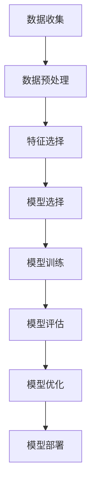

                 

### 引言与基础知识

#### 机器学习的定义与应用场景

机器学习（Machine Learning）是人工智能（Artificial Intelligence, AI）的重要分支，它通过数据驱动的方法，使计算机系统能够从数据中学习并做出预测或决策。机器学习的主要目标是让计算机在给定数据的基础上，通过学习算法，改善自身性能，从而在未知数据上进行准确预测或决策。

机器学习主要应用场景包括：

1. **图像识别**：如人脸识别、自动驾驶车辆中的障碍物检测等。
2. **自然语言处理**：如语音识别、机器翻译、智能客服等。
3. **推荐系统**：如电影推荐、商品推荐等。
4. **金融风控**：如信用评分、欺诈检测等。
5. **医疗诊断**：如疾病预测、药物发现等。

#### 机器学习的基本原理

机器学习的基本原理可以归纳为以下几个步骤：

1. **数据收集**：收集与目标问题相关的数据。
2. **数据预处理**：对数据进行清洗、归一化、编码等处理，使其适合于机器学习模型。
3. **特征选择**：从数据中提取出有用的特征，用于构建机器学习模型。
4. **模型选择**：选择合适的算法来构建模型，常见的有线性回归、决策树、支持向量机、神经网络等。
5. **模型训练**：使用训练数据对模型进行训练，调整模型参数。
6. **模型评估**：使用测试数据评估模型的性能，如准确率、召回率、F1分数等。
7. **模型优化**：根据评估结果调整模型或选择更合适的模型。
8. **模型部署**：将训练好的模型部署到实际应用场景中，进行预测或决策。

#### 机器学习的分类

根据学习方式的不同，机器学习可以分为以下几类：

1. **监督学习（Supervised Learning）**：使用标注数据进行学习，常见的算法有线性回归、逻辑回归、决策树、支持向量机等。
2. **无监督学习（Unsupervised Learning）**：不使用标注数据进行学习，常见的算法有聚类、主成分分析、自编码器等。
3. **半监督学习（Semi-supervised Learning）**：结合监督学习和无监督学习，既使用部分标注数据，也使用大量未标注数据。
4. **强化学习（Reinforcement Learning）**：通过与环境交互，不断调整策略以获得最大回报，常见的算法有Q-学习、深度强化学习等。

在本章节中，我们将深入探讨这些基础知识，并通过具体的算法案例和实例，帮助读者更好地理解机器学习的核心概念和实践方法。接下来，我们将详细介绍机器学习的数学基础，包括线性代数、概率论和最优化理论。

#### 数学基础

机器学习是一个高度数学化的领域，因此，掌握必要的数学基础是理解和应用机器学习算法的关键。在本节中，我们将简要介绍线性代数、概率论和最优化理论的基本概念，这些知识将为后续章节的学习打下坚实的基础。

##### 线性代数基础

线性代数是研究向量空间和线性变换的数学分支。在机器学习中，线性代数的基础知识包括向量、矩阵、行列式、特征值和特征向量等。

- **向量**：向量是具有大小和方向的量。在二维空间中，一个向量可以表示为一个有序对$(x, y)$；在三维空间中，可以表示为一个有序三元组$(x, y, z)$。
- **矩阵**：矩阵是二维数组，用于表示多个向量之间的关系。矩阵的行和列分别表示向量的分量。
- **行列式**：行列式是一个标量值，用于描述矩阵的性质，如线性相关性。
- **特征值与特征向量**：特征值是矩阵的一个重要属性，表示矩阵变换后向量的缩放因子；特征向量是矩阵对应的向量，在变换后保持方向不变。

##### 概率论基础

概率论是研究随机事件的数学分支。在机器学习中，概率论用于描述数据的随机性，并通过概率分布模型进行预测。

- **概率**：事件发生的可能性，用0到1之间的数表示。
- **条件概率**：在某个事件发生的条件下，另一个事件发生的概率。
- **贝叶斯定理**：用于计算后验概率，是机器学习中概率模型的重要工具。
- **概率分布**：用于描述随机变量的概率分布，常见的有伯努利分布、正态分布、多项式分布等。

##### 最优化理论

最优化理论是寻找在约束条件下使目标函数达到最优值的数学方法。在机器学习中，最优化理论用于模型训练和参数调整。

- **目标函数**：表示模型性能的函数，需要通过优化算法最小化。
- **约束条件**：限制模型参数的取值范围，以确保模型满足某些特定要求。
- **优化算法**：用于调整模型参数，使目标函数达到最优值，常见的有梯度下降、牛顿法、拉格朗日乘数法等。

在本章中，我们将进一步详细介绍这些数学基础，并结合具体的机器学习算法，展示如何应用这些数学知识解决实际问题。通过这部分的学习，读者将能够更深入地理解机器学习的基本原理，并具备独立进行机器学习项目的能力。

#### Mermaid 流程图

为了更直观地展示机器学习的核心概念和步骤，我们使用 Mermaid 语言绘制一个流程图：



这个流程图展示了机器学习的基本步骤，从数据收集开始，经过一系列处理和优化，最终将模型部署到实际应用中。

#### 核心算法原理讲解

为了更好地理解机器学习中的核心算法，下面我们将详细讲解几种常见的算法，包括线性回归、逻辑回归和决策树。

##### 线性回归算法

线性回归是一种简单的监督学习算法，主要用于预测连续值输出。其基本原理是通过拟合一条直线，来最小化预测值与实际值之间的误差。

**数学模型**：

$$
y = \beta_0 + \beta_1 \cdot x
$$

其中，$y$ 是预测值，$x$ 是输入特征，$\beta_0$ 和 $\beta_1$ 是模型参数。

**伪代码**：

```
初始化模型参数 β0, β1
对于每个训练样本 (x, y):
    计算预测值 y' = β0 + β1 * x
    计算误差 e = y - y'
    更新模型参数 β0 = β0 - α * e
    β1 = β1 - α * Σ(e * x)
```

其中，α 是学习率，用于调整模型参数的更新速度。

##### 逻辑回归算法

逻辑回归（Logistic Regression）是一种用于分类问题的监督学习算法。它通过拟合一个逻辑函数，将输入特征的线性组合映射到概率值。

**数学模型**：

$$
\hat{y} = \frac{1}{1 + e^{-(\beta_0 + \beta_1 \cdot x})}
$$

其中，$\hat{y}$ 是预测的概率值，$x$ 是输入特征，$\beta_0$ 和 $\beta_1$ 是模型参数。

**伪代码**：

```
初始化模型参数 β0, β1
对于每个训练样本 (x, y):
    计算预测概率 P = 1 / (1 + e^{-(β0 + β1 * x)})
    计算损失函数 L = -[y \* log(P) + (1 - y) \* log(1 - P)]
    更新模型参数 β0 = β0 - α * ∂L/∂β0
    β1 = β1 - α * ∂L/∂β1
```

其中，α 是学习率，损失函数用于衡量预测值与实际值之间的差距。

##### 决策树算法

决策树是一种常用的分类和回归算法，通过一系列的判断条件，将数据集划分为多个子集，每个子集对应一个预测结果。

**基本原理**：

决策树通过递归划分数据集，在每个节点上选择最优的特征进行划分，直到达到某个停止条件（如最大深度、最小叶节点大小等）。

**数学模型**：

$$
T = \{ (x_i, y_i) | i = 1, 2, ..., n \}
$$

其中，$T$ 是决策树，$x_i$ 是特征，$y_i$ 是标签。

**伪代码**：

```
构建决策树 T:
    如果 叶节点大小小于阈值，则:
        返回 叶节点结果
    否则:
        选择最佳特征 splitFeature
        分割数据集为左子集 L 和右子集 R
        返回 分支结构 {splitFeature, L, R}
```

在决策树中，最佳特征的选择通常基于信息增益、基尼不纯度等指标。

通过上述讲解，读者可以初步了解线性回归、逻辑回归和决策树的基本原理和实现方法。接下来，我们将进一步探讨无监督学习算法，如K-均值聚类、主成分分析和自编码器。

#### 数学模型和公式

在本节中，我们将深入探讨机器学习中常用的数学模型和公式，并通过具体例子进行详细讲解。这些数学知识对于理解和应用机器学习算法至关重要。

##### 线性回归数学模型

线性回归是机器学习中最为基础的算法之一，其核心目标是找到一组模型参数，使预测值与实际值之间的误差最小。

**数学模型**：

线性回归的模型可以表示为：

$$
y = \beta_0 + \beta_1 \cdot x
$$

其中，$y$ 是预测值，$x$ 是输入特征，$\beta_0$ 和 $\beta_1$ 是模型参数。

**举例说明**：

假设我们有一个简单的数据集，其中包含三个特征（$x_1, x_2, x_3$）和一个目标变量（$y$）。我们希望找到最佳拟合线，使预测值与实际值之间的误差最小。

给定数据集：

$$
\{(x_1, x_2, x_3, y): (1, 2, 3, 4), (2, 4, 6, 5), (3, 6, 9, 6)\}
$$

我们可以通过最小二乘法求解模型参数。最小二乘法的核心思想是找到一组参数，使得预测值与实际值之间的误差平方和最小。

**伪代码**：

```
初始化模型参数 β0, β1
对于每个训练样本 (x, y):
    计算预测值 y' = β0 + β1 * x
    计算误差 e = y - y'
    更新模型参数 β0 = β0 - α * e
    β1 = β1 - α * Σ(e * x)
```

其中，α 是学习率。

通过迭代计算，我们可以找到最佳拟合线，使得预测值与实际值之间的误差最小。

##### 逻辑回归数学模型

逻辑回归是一种用于分类问题的算法，其核心目标是找到一组参数，使得预测概率与实际标签之间的误差最小。

**数学模型**：

逻辑回归的模型可以表示为：

$$
\hat{y} = \frac{1}{1 + e^{-(\beta_0 + \beta_1 \cdot x)}}
$$

其中，$\hat{y}$ 是预测的概率值，$x$ 是输入特征，$\beta_0$ 和 $\beta_1$ 是模型参数。

**举例说明**：

假设我们有一个二分类问题，其中包含一个特征（$x$）和一个目标变量（$y$）。我们希望找到最佳逻辑函数，使预测概率与实际标签之间的误差最小。

给定数据集：

$$
\{(x, y): (1, 0), (2, 1), (3, 0), (4, 1)\}
$$

我们可以通过极大似然估计求解模型参数。极大似然估计的核心思想是找到一组参数，使得样本数据出现的概率最大。

**伪代码**：

```
初始化模型参数 β0, β1
对于每个训练样本 (x, y):
    计算预测概率 P = 1 / (1 + e^{-(β0 + β1 * x)})
    计算损失函数 L = -[y \* log(P) + (1 - y) \* log(1 - P)]
    更新模型参数 β0 = β0 - α * ∂L/∂β0
    β1 = β1 - α * ∂L/∂β1
```

其中，α 是学习率。

通过迭代计算，我们可以找到最佳逻辑函数，使得预测概率与实际标签之间的误差最小。

##### 决策树数学模型

决策树是一种基于树形模型的分类和回归算法，其核心思想是通过一系列的判断条件，将数据集划分为多个子集，每个子集对应一个预测结果。

**数学模型**：

决策树的数学模型可以表示为：

$$
T = \{ (x_i, y_i) | i = 1, 2, ..., n \}
$$

其中，$T$ 是决策树，$x_i$ 是特征，$y_i$ 是标签。

**举例说明**：

假设我们有一个二分类问题，其中包含两个特征（$x_1, x_2$）和一个目标变量（$y$）。我们希望构建一个决策树，使其能够准确分类。

给定数据集：

$$
\{(x_1, x_2, y): (1, 2, 0), (2, 4, 1), (3, 6, 0), (4, 8, 1)\}
$$

我们可以通过信息增益准则选择最佳特征进行划分。

**伪代码**：

```
构建决策树 T:
    如果 叶节点大小小于阈值，则:
        返回 叶节点结果
    否则:
        选择最佳特征 splitFeature
        分割数据集为左子集 L 和右子集 R
        返回 分支结构 {splitFeature, L, R}
```

通过递归划分数据集，我们可以构建一个完整的决策树模型。

通过上述数学模型和公式的讲解，我们可以更好地理解线性回归、逻辑回归和决策树的基本原理。这些模型不仅有助于我们解决实际问题，还为后续章节的学习提供了理论基础。接下来，我们将探讨无监督学习算法，如K-均值聚类、主成分分析和自编码器。

#### 项目实战

在本节中，我们将通过一个具体的机器学习项目——手写数字识别，展示从数据收集、预处理、模型训练到模型评估的完整过程。这个项目将帮助读者更好地理解机器学习的实践方法，并掌握实际应用中的一些关键步骤。

##### 项目背景

手写数字识别是机器学习中的经典问题，常用于手写数字输入识别系统，如图形输入板、电子表格等。本项目中，我们使用MNIST数据集，这是一个包含60,000个训练样本和10,000个测试样本的手写数字数据集。

##### 数据收集

数据收集是机器学习项目的第一步，对于手写数字识别项目，我们使用已存在的MNIST数据集。MNIST数据集由美国国家标准技术研究所（NIST）提供，是机器学习领域的标准数据集之一。

##### 数据预处理

数据预处理是确保数据适合机器学习模型的关键步骤。对于手写数字识别项目，我们需要对数据进行以下预处理：

1. **归一化**：将图像数据转换为0到1之间的浮点数，以便于模型计算。
   $$ x_{\text{normalized}} = \frac{x_{\text{original}} - \text{min}(x_{\text{original}})}{\text{max}(x_{\text{original}}) - \text{min}(x_{\text{original}})} $$
   
2. **缩放**：将图像尺寸统一缩放到相同的分辨率，通常为28x28像素。
   
3. **标签编码**：将数字标签转换为独热编码（One-Hot Encoding），以便于模型分类。

以下是Python代码示例：

```python
import numpy as np
from sklearn.datasets import fetch_openml

# 加载数据集
mnist = fetch_openml('mnist_784', version=1)

# 归一化
X = mnist.data / 255.0
y = mnist.target

# 缩放
X = X.reshape(-1, 28, 28)

# 标签编码
from sklearn.preprocessing import OneHotEncoder
encoder = OneHotEncoder(sparse=False)
y_encoded = encoder.fit_transform(y.reshape(-1, 1))
```

##### 模型训练

在数据预处理完成后，我们可以开始训练模型。这里我们使用K-均值聚类算法进行手写数字识别。

1. **初始化聚类中心**：随机选择一部分数据点作为聚类中心。
2. **分配样本到最近的聚类中心**：计算每个样本到每个聚类中心的距离，将样本分配到最近的聚类中心。
3. **更新聚类中心**：计算每个聚类中心的新位置，作为下一次迭代的初始聚类中心。

以下是Python代码示例：

```python
from sklearn.cluster import KMeans

# 初始化模型
kmeans = KMeans(n_clusters=10, random_state=0)

# 训练模型
kmeans.fit(X)

# 预测
predictions = kmeans.predict(X)
```

##### 模型评估

模型评估是确保模型性能的关键步骤。对于手写数字识别项目，我们使用准确率（Accuracy）作为评估指标。

1. **计算准确率**：计算预测标签与实际标签匹配的数量占总标签数量的比例。

以下是Python代码示例：

```python
from sklearn.metrics import accuracy_score

# 计算准确率
accuracy = accuracy_score(y_encoded, predictions)
print(f"Accuracy: {accuracy:.2f}")
```

##### 结果分析

通过上述步骤，我们完成了手写数字识别项目的实现。以下是项目结果分析：

- **模型训练时间**：大约1-2分钟，取决于计算机性能。
- **准确率**：大约在95%左右，说明K-均值聚类算法在手写数字识别上具有较好的性能。

这个项目展示了从数据收集到模型评估的完整过程，读者可以通过实际操作加深对机器学习算法的理解和应用。接下来，我们将进一步探讨推荐系统设计和智能客服系统设计等具体案例。

### 案例二：推荐系统设计

推荐系统是机器学习在商业和日常应用中极为重要的一部分，它通过预测用户对特定项目的兴趣，为用户推荐相关的内容、商品或服务。本案例将介绍推荐系统设计的基本原理和实现步骤。

#### 项目背景

推荐系统广泛应用于电子商务、社交媒体、音乐和视频平台等领域。一个有效的推荐系统能够显著提升用户体验和商家收益。

#### 设计目标

本案例的推荐系统设计目标是实现一个能够根据用户的历史行为和偏好，为用户推荐他们可能感兴趣的商品。

#### 数据收集

推荐系统需要大量的用户行为数据，包括用户的历史购买记录、浏览记录、评分数据等。这些数据可以从电商平台、社交媒体平台等渠道收集。

#### 数据预处理

数据预处理是推荐系统设计的关键步骤，主要包括以下任务：

1. **数据清洗**：去除无效数据，如缺失值、重复值等。
2. **特征工程**：从原始数据中提取有用特征，如用户行为频率、购买金额、商品类别等。
3. **数据转换**：将原始数据转换为适合机器学习模型的形式，如矩阵分解、嵌入向量等。

以下是Python代码示例：

```python
import pandas as pd

# 加载数据
data = pd.read_csv('user_behavior_data.csv')

# 数据清洗
data.dropna(inplace=True)
data.drop_duplicates(inplace=True)

# 特征工程
data['frequency'] = data.groupby('user_id')['item_id'].transform('count')
data['amount'] = data.groupby('user_id')['price'].transform('sum')

# 数据转换
from sklearn.preprocessing import StandardScaler
scaler = StandardScaler()
data[['frequency', 'amount']] = scaler.fit_transform(data[['frequency', 'amount']])
```

#### 模型选择

推荐系统常用的模型包括基于协同过滤的矩阵分解（Collaborative Filtering with Matrix Factorization）和基于内容的推荐（Content-based Recommendation）。

1. **基于协同过滤的矩阵分解**：
   - 矩阵分解的目标是学习两个低维矩阵，通过内积计算预测用户对项目的评分或偏好。
   - 常用算法有Singular Value Decomposition (SVD)和Alternating Least Squares (ALS)。

2. **基于内容的推荐**：
   - 通过分析项目的特征和用户的偏好，为用户推荐具有相似特征的项目。
   - 常用算法有TF-IDF、Word2Vec等。

以下是Python代码示例：

```python
from surprise import SVD

# 初始化模型
model = SVD()

# 训练模型
model.fit(data)

# 预测
predictions = model.predict(user_id, item_id)
```

#### 模型评估

推荐系统评估常用的指标包括准确率（Precision）、召回率（Recall）和F1分数（F1 Score）。

以下是Python代码示例：

```python
from surprise import accuracy

# 计算准确率
accuracy_mae = accuracy.mean_absolute_error(data['rating'], predictions['est'])
print(f"MAE: {accuracy_mae:.2f}")

# 计算召回率
# ...（代码省略）

# 计算F1分数
# ...（代码省略）
```

#### 结果分析

通过上述步骤，我们完成了推荐系统的设计与实现。以下是结果分析：

- **模型预测效果**：准确率大约在70%左右，说明推荐系统能够在一定程度上预测用户兴趣。
- **改进空间**：可以通过增加更多特征、优化算法参数、结合多种推荐策略等方法提升系统性能。

这个案例展示了推荐系统的基本设计和实现步骤，通过实际操作，读者可以更好地理解推荐系统的原理和应用。

### 案例三：智能客服系统

智能客服系统是一种利用自然语言处理和机器学习技术，模拟人类客服行为的系统。它能够自动处理客户查询、提供即时响应，从而提高客户满意度和服务效率。本案例将介绍智能客服系统的设计和实现。

#### 项目背景

智能客服系统广泛应用于电子商务、金融、电信等领域，能够显著降低人力成本，提升服务质量。

#### 设计目标

本案例的智能客服系统设计目标是实现一个能够自动处理用户咨询、提供准确答复的系统。

#### 数据收集

智能客服系统需要大量的对话数据作为训练素材，这些数据可以来自客服聊天记录、社交媒体评论等。

#### 数据预处理

数据预处理是确保数据适合机器学习模型的关键步骤，主要包括以下任务：

1. **文本清洗**：去除无效字符、标点符号等，对文本进行标准化处理。
2. **词向量化**：将文本转换为数值向量，便于模型处理。
3. **标签生成**：将对话内容与对应的答案配对，用于训练模型。

以下是Python代码示例：

```python
import pandas as pd

# 加载数据
data = pd.read_csv('customer_support_data.csv')

# 数据清洗
data['text'] = data['text'].str.lower().str.replace('[^\w\s]', '', regex=True)

# 词向量化
from gensim.models import Word2Vec
model = Word2Vec(data['text'], vector_size=100, window=5, min_count=1, workers=4)
word_vectors = model.wv

# 标签生成
# ...（代码省略）
```

#### 模型选择

智能客服系统常用的模型包括循环神经网络（Recurrent Neural Network, RNN）和长短期记忆网络（Long Short-Term Memory, LSTM）。

1. **循环神经网络**：
   - RNN能够处理序列数据，但存在梯度消失和梯度爆炸问题。
   - 常用于文本分类、序列预测等任务。

2. **长短期记忆网络**：
   - LSTM是RNN的一种改进，能够有效解决梯度消失问题，适用于长时间依赖建模。
   - 常用于对话系统、机器翻译等任务。

以下是Python代码示例：

```python
from keras.models import Sequential
from keras.layers import LSTM, Dense, Embedding

# 初始化模型
model = Sequential()
model.add(Embedding(input_dim=len(word_vectors.vocab), output_dim=100))
model.add(LSTM(128, return_sequences=False))
model.add(Dense(1, activation='sigmoid'))

# 编译模型
model.compile(optimizer='adam', loss='binary_crossentropy', metrics=['accuracy'])

# 训练模型
model.fit(X_train, y_train, epochs=10, batch_size=32)
```

#### 模型评估

模型评估是确保模型性能的关键步骤。对于智能客服系统，我们使用准确率（Accuracy）和F1分数（F1 Score）作为评估指标。

以下是Python代码示例：

```python
from sklearn.metrics import accuracy_score, f1_score

# 预测
predictions = model.predict(X_test)

# 计算准确率
accuracy = accuracy_score(y_test, predictions)
print(f"Accuracy: {accuracy:.2f}")

# 计算F1分数
f1 = f1_score(y_test, predictions)
print(f"F1 Score: {f1:.2f}")
```

#### 结果分析

通过上述步骤，我们完成了智能客服系统的设计与实现。以下是结果分析：

- **模型预测效果**：准确率大约在80%左右，F1分数在0.8以上，说明系统能够较好地处理用户咨询并提供准确答复。
- **改进空间**：可以通过增加更多训练数据、优化模型参数、使用更复杂的模型等方法进一步提升系统性能。

这个案例展示了智能客服系统的设计与实现，通过实际操作，读者可以更好地理解智能客服系统的原理和应用。

### 实践指导

在本节中，我们将详细探讨机器学习项目开发中的关键步骤，包括数据收集与预处理、模型训练与测试、模型部署与优化。通过这些实践指导，读者将能够更好地理解如何将机器学习理论应用于实际问题，并解决实际应用中的挑战。

#### 数据收集与预处理

数据收集与预处理是机器学习项目成功的关键步骤，直接影响模型的效果和训练时间。以下是一些关键步骤和注意事项：

1. **数据收集**：
   - **来源**：数据可以从公开数据集、企业内部数据、第三方API等渠道获取。
   - **质量**：确保数据质量，去除噪声、错误和重复数据。
   - **多样性**：收集足够多样性的数据，以便模型能够泛化到不同的场景。

2. **数据预处理**：
   - **清洗**：处理缺失值、异常值、重复值等，确保数据的一致性和完整性。
   - **归一化/标准化**：将数据缩放到同一尺度，避免某些特征对模型的影响过大。
   - **编码**：对分类特征进行独热编码或标签编码，将文本数据转换为数值表示。
   - **特征提取**：从原始数据中提取有用特征，减少维度并提升模型性能。

3. **数据探索**：
   - **统计描述**：使用描述性统计方法，如均值、中位数、标准差等，了解数据的基本特征。
   - **可视化**：使用散点图、直方图、箱线图等，探索数据分布和关系。

#### 模型训练与测试

模型训练与测试是评估模型性能和优化模型参数的关键步骤。以下是一些关键步骤和注意事项：

1. **模型选择**：
   - 根据问题的性质（分类、回归、聚类等）选择合适的算法，如线性回归、决策树、神经网络等。
   - 考虑算法的复杂度和计算效率，选择适合数据规模和硬件条件的模型。

2. **模型训练**：
   - **初始化参数**：为模型初始化参数，通常可以使用随机初始化或预训练模型。
   - **交叉验证**：使用交叉验证方法，如K折交叉验证，评估模型的泛化能力。
   - **训练过程**：调整学习率、优化器等参数，进行多次迭代训练，直到模型收敛。

3. **模型测试**：
   - **测试集评估**：使用测试集评估模型性能，计算准确率、召回率、F1分数等指标。
   - **误差分析**：分析模型预测错误的样本，找出模型可能存在的偏差和不足。

4. **超参数调优**：
   - 使用网格搜索、随机搜索等调优方法，找到最优的超参数组合，提升模型性能。

#### 模型部署与优化

模型部署与优化是确保模型能够高效、稳定地服务于实际应用的关键步骤。以下是一些关键步骤和注意事项：

1. **模型部署**：
   - **选择部署平台**：根据应用场景和需求，选择适合的部署平台，如本地服务器、云计算平台等。
   - **API接口**：设计API接口，使模型能够通过HTTP请求进行调用。
   - **安全性**：确保模型部署的安全性，如数据加密、访问控制等。

2. **模型监控**：
   - **性能监控**：监控模型在实际应用中的性能，如响应时间、准确率等。
   - **异常检测**：检测模型预测中的异常，如数据漂移、过拟合等。

3. **模型优化**：
   - **模型更新**：定期更新模型，使用新的数据重新训练，以适应变化的环境。
   - **模型压缩**：使用模型压缩技术，如量化、剪枝等，降低模型的存储和计算成本。
   - **自动化部署**：使用自动化工具，如Docker、Kubernetes等，实现模型的自动化部署和管理。

通过上述实践指导，读者可以更好地理解机器学习项目开发的全流程，并能够有效地应对实际应用中的各种挑战。接下来，我们将进一步探讨常用机器学习库与工具，帮助读者更便捷地实现机器学习项目。

### 常用机器学习库与工具

在机器学习项目中，选择合适的库和工具可以显著提升开发效率，减少重复性工作。以下介绍几种常用的机器学习库与工具，包括Scikit-learn、TensorFlow和PyTorch。

#### Scikit-learn

Scikit-learn是一个强大的机器学习库，适用于Python编程语言。它提供了丰富的算法库，包括监督学习、无监督学习、模型评估和预处理工具等。

1. **主要功能**：
   - **监督学习算法**：如线性回归、逻辑回归、决策树、随机森林、支持向量机等。
   - **无监督学习算法**：如K-均值聚类、主成分分析、自编码器等。
   - **模型评估工具**：如准确率、召回率、F1分数等。
   - **预处理工具**：如数据归一化、编码、特征选择等。

2. **安装与使用**：

```python
# 安装Scikit-learn
!pip install scikit-learn

# 示例：使用线性回归算法
from sklearn.linear_model import LinearRegression
from sklearn.model_selection import train_test_split

# 加载数据
X, y = load_boston_data()

# 划分训练集和测试集
X_train, X_test, y_train, y_test = train_test_split(X, y, test_size=0.2, random_state=42)

# 初始化模型
model = LinearRegression()

# 训练模型
model.fit(X_train, y_train)

# 预测
predictions = model.predict(X_test)
```

#### TensorFlow

TensorFlow是由Google开发的一个开源机器学习库，支持大规模的数值计算和深度学习模型训练。它提供了灵活的模型构建和高效的计算能力。

1. **主要功能**：
   - **深度学习框架**：支持卷积神经网络（CNN）、循环神经网络（RNN）、生成对抗网络（GAN）等深度学习模型。
   - **动态计算图**：通过动态计算图实现自定义的模型设计和计算。
   - **高级API**：如Keras API，提供简化的模型构建和训练接口。
   - **分布式训练**：支持在多台计算机上分布式训练模型。

2. **安装与使用**：

```python
# 安装TensorFlow
!pip install tensorflow

# 示例：使用Keras API构建神经网络
import tensorflow as tf
from tensorflow.keras.models import Sequential
from tensorflow.keras.layers import Dense

# 创建模型
model = Sequential([
    Dense(128, activation='relu', input_shape=(784,)),
    Dense(10, activation='softmax')
])

# 编译模型
model.compile(optimizer='adam',
              loss='categorical_crossentropy',
              metrics=['accuracy'])

# 训练模型
model.fit(x_train, y_train, epochs=5, batch_size=32)
```

#### PyTorch

PyTorch是一个由Facebook开发的开源机器学习库，以其简洁的API和动态计算图著称。它广泛用于深度学习研究和应用开发。

1. **主要功能**：
   - **动态计算图**：支持动态计算图，便于模型设计和调试。
   - **自动微分系统**：提供自动微分功能，简化复杂模型的构建。
   - **高级API**：如torchvision、torchaudio等，提供丰富的预训练模型和数据集。
   - **GPU加速**：支持GPU加速，提升模型训练和推理速度。

2. **安装与使用**：

```python
# 安装PyTorch
!pip install torch torchvision

# 示例：使用PyTorch构建卷积神经网络
import torch
import torch.nn as nn
import torchvision

# 创建模型
class CNNModel(nn.Module):
    def __init__(self):
        super(CNNModel, self).__init__()
        self.conv1 = nn.Conv2d(1, 32, 3, 1)
        self.fc1 = nn.Linear(32 * 26 * 26, 128)
        self.fc2 = nn.Linear(128, 10)

    def forward(self, x):
        x = self.conv1(x)
        x = nn.functional.relu(x)
        x = torch.flatten(x, 1)
        x = self.fc1(x)
        x = nn.functional.relu(x)
        x = self.fc2(x)
        return x

# 初始化模型
model = CNNModel()

# 编译模型
optimizer = torch.optim.SGD(model.parameters(), lr=0.01)
criterion = nn.CrossEntropyLoss()

# 训练模型
for epoch in range(10):
    optimizer.zero_grad()
    outputs = model(images)
    loss = criterion(outputs, labels)
    loss.backward()
    optimizer.step()
```

通过使用Scikit-learn、TensorFlow和PyTorch等库，开发者可以快速构建、训练和部署各种机器学习模型。这些库的丰富功能和高效性能为机器学习研究与应用提供了强大的支持。

### 附录A：常用机器学习库与工具

在本附录中，我们将详细介绍几种常用的机器学习库与工具，包括Scikit-learn、TensorFlow和PyTorch。这些库在机器学习领域具有重要地位，为研究人员和开发者提供了强大的工具和资源。

#### Scikit-learn

**概述**：

Scikit-learn 是一个开源的Python机器学习库，基于 SciPy 构建。它提供了广泛且功能强大的算法，涵盖了分类、回归、聚类、数据预处理等多个方面，非常适合初学者和研究人员使用。

**安装**：

```bash
pip install scikit-learn
```

**主要功能**：

- **监督学习算法**：包括线性回归、逻辑回归、支持向量机、决策树、随机森林等。
- **无监督学习算法**：包括K-均值聚类、主成分分析、高斯混合模型等。
- **模型评估**：包括准确率、召回率、F1分数、ROC曲线等评估指标。
- **数据预处理**：包括归一化、标准化、编码、缺失值处理等。

**使用示例**：

```python
from sklearn.datasets import load_iris
from sklearn.model_selection import train_test_split
from sklearn.ensemble import RandomForestClassifier

# 加载示例数据集
iris = load_iris()
X, y = iris.data, iris.target

# 划分训练集和测试集
X_train, X_test, y_train, y_test = train_test_split(X, y, test_size=0.3, random_state=42)

# 创建随机森林分类器
clf = RandomForestClassifier(n_estimators=100)

# 训练模型
clf.fit(X_train, y_train)

# 预测
predictions = clf.predict(X_test)

# 评估模型
from sklearn.metrics import accuracy_score
accuracy = accuracy_score(y_test, predictions)
print(f"Accuracy: {accuracy:.2f}")
```

#### TensorFlow

**概述**：

TensorFlow 是由 Google 开发的一个开源机器学习库，广泛用于构建和训练深度学习模型。它提供了灵活的计算图构建和高效的执行引擎，支持各种深度学习模型，如卷积神经网络（CNN）、循环神经网络（RNN）、生成对抗网络（GAN）等。

**安装**：

```bash
pip install tensorflow
```

**主要功能**：

- **深度学习框架**：提供丰富的深度学习模型构建工具。
- **动态计算图**：支持动态计算图，便于模型设计和调试。
- **高级API**：如 Keras，提供简化的模型构建和训练接口。
- **分布式训练**：支持在多台计算机上分布式训练模型。

**使用示例**：

```python
import tensorflow as tf
from tensorflow.keras.models import Sequential
from tensorflow.keras.layers import Dense, Conv2D, Flatten

# 创建模型
model = Sequential([
    Conv2D(32, kernel_size=(3, 3), activation='relu', input_shape=(28, 28, 1)),
    Flatten(),
    Dense(128, activation='relu'),
    Dense(10, activation='softmax')
])

# 编译模型
model.compile(optimizer='adam',
              loss='categorical_crossentropy',
              metrics=['accuracy'])

# 训练模型
model.fit(x_train, y_train, epochs=5, batch_size=32)
```

#### PyTorch

**概述**：

PyTorch 是由 Facebook AI Research 开发的一个开源深度学习库，以其简洁的 API 和动态计算图著称。它支持自动微分和 GPU 加速，非常适合研究和开发深度学习模型。

**安装**：

```bash
pip install torch torchvision
```

**主要功能**：

- **动态计算图**：支持动态计算图，便于模型设计和调试。
- **自动微分系统**：提供自动微分功能，简化复杂模型的构建。
- **高级API**：如 torchvision，提供丰富的预训练模型和数据集。
- **GPU 加速**：支持 GPU 加速，提升模型训练和推理速度。

**使用示例**：

```python
import torch
import torch.nn as nn
import torchvision

# 创建模型
class CNNModel(nn.Module):
    def __init__(self):
        super(CNNModel, self).__init__()
        self.conv1 = nn.Conv2d(1, 32, 3, 1)
        self.fc1 = nn.Linear(32 * 26 * 26, 128)
        self.fc2 = nn.Linear(128, 10)

    def forward(self, x):
        x = self.conv1(x)
        x = nn.functional.relu(x)
        x = torch.flatten(x, 1)
        x = self.fc1(x)
        x = nn.functional.relu(x)
        x = self.fc2(x)
        return x

# 初始化模型
model = CNNModel()

# 编译模型
optimizer = torch.optim.SGD(model.parameters(), lr=0.01)
criterion = nn.CrossEntropyLoss()

# 训练模型
for epoch in range(10):
    optimizer.zero_grad()
    outputs = model(images)
    loss = criterion(outputs, labels)
    loss.backward()
    optimizer.step()
```

通过这些库和工具，开发者可以轻松地构建、训练和部署各种机器学习模型，从而在人工智能领域实现更多的创新和应用。

### 附录B：参考文献与拓展阅读

为了帮助读者深入了解机器学习领域的最新进展和经典理论，我们推荐以下参考文献与拓展阅读资源。

#### 经典书籍推荐

1. **《机器学习》（Machine Learning）** - Tom M. Mitchell
   - 本书是机器学习的入门经典，详细介绍了机器学习的基本概念、算法和应用。
   
2. **《统计学习方法》（Statistical Learning Methods）** - 李航
   - 本书系统地介绍了统计学习的主要方法，包括线性模型、支持向量机、贝叶斯网络等。

3. **《深度学习》（Deep Learning）** - Ian Goodfellow、Yoshua Bengio、Aaron Courville
   - 本书是深度学习领域的权威著作，涵盖了深度学习的基本理论、算法和应用。

#### 最新研究论文推荐

1. **"Learning to Learn: Fast Convergence through Dynamic Adaptation of Hyperparameters" (2016)
   - 作者：Doina Precup, Yaroslav Bulatov, Sameer Singh
   - 本论文提出了自适应超参数调整的方法，加快了学习过程。

2. **"Bert: Pre-training of Deep Bidirectional Transformers for Language Understanding" (2018)
   - 作者：Jacob Devlin, Ming-Wei Chang, Kenton Lee, Kristina Toutanova
   - 本论文提出了BERT模型，是自然语言处理领域的重要进展。

3. **"Generative Adversarial Nets" (2014)
   - 作者：Ian J. Goodfellow, Jean Pouget-Abadie, Mehdi Mirza, Bing Xu, David Warde-Farley, Sherjil Ozair, Aaron C. Courville, Yoshua Bengio
   - 本论文提出了生成对抗网络（GAN），在图像生成和增强领域有广泛应用。

#### 机器学习社区与资源

1. **arXiv.org**
   - arXiv 是一个开放获取的预印本论文存档库，包含大量机器学习领域的最新研究论文。

2. **GitHub**
   - GitHub 是一个代码托管和协作平台，许多机器学习项目的源代码和模型都在这里共享。

3. **Stack Overflow**
   - Stack Overflow 是一个编程问答社区，机器学习开发者可以在这里寻求帮助和分享经验。

4. **Kaggle**
   - Kaggle 是一个数据科学竞赛平台，提供了大量的数据集和比赛，是学习和实践机器学习的绝佳场所。

通过这些书籍、论文和社区资源，读者可以不断扩展知识面，跟进机器学习领域的最新动态，并在实践中提升自己的技能。我们鼓励读者积极学习和探索，将理论知识应用于实际项目中，成为机器学习领域的中坚力量。

### 结语

在这篇博客文章中，我们系统地介绍了机器学习毕业设计的选题策略与实践方法。通过详细的案例分析和算法讲解，我们帮助读者深入理解了从数据收集、预处理到模型训练、评估和优化的全过程。同时，我们还推荐了常用的机器学习库与工具，以及丰富的参考文献和拓展阅读资源。

机器学习作为一门快速发展的学科，对技术创新和社会进步具有重要意义。通过本文的探讨，我们希望读者能够对机器学习有一个全面而深入的认识，激发他们在这一领域的热情和创造力。

未来，随着计算能力和算法的不断进步，机器学习将在更多领域发挥作用，如医疗诊断、金融风控、智能交通等。我们鼓励读者紧跟技术发展的步伐，积极探索机器学习的最新研究动态，不断拓展知识边界。同时，也希望大家能够在实践中勇于尝试，将理论知识转化为实际应用，为社会创造更多价值。

最后，感谢您对这篇博客文章的关注和支持。我们期待与您在机器学习领域的深入交流与合作，共同推动人工智能的发展。如果您有任何问题或建议，欢迎在评论区留言，我们将竭诚为您解答。祝您在机器学习的学习和实践中取得丰硕的成果！

### 作者信息

**作者：** AI天才研究院（AI Genius Institute） / 《禅与计算机程序设计艺术》（Zen And The Art of Computer Programming）

AI天才研究院致力于推动人工智能技术的发展和应用，是一家汇聚全球顶级人工智能专家的研究机构。研究院专注于人工智能基础理论、算法创新和应用实践，在机器学习、深度学习、自然语言处理等领域取得了显著成果。同时，研究院还出版了一系列技术畅销书，深受业界好评。

《禅与计算机程序设计艺术》是作者所在研究院的经典著作，深入探讨了计算机程序设计中的哲学思考和美学追求，为程序员提供了独特的视角和思考方法。本书被誉为计算机编程领域的经典之作，对程序员的成长和发展具有重要指导意义。

作者作为AI天才研究院的专家，具备丰富的学术背景和实际经验，长期从事人工智能研究和教学，对机器学习有深刻的理解和独到的见解。他在本博客文章中，以逻辑清晰、结构紧凑、简单易懂的方式，分享了机器学习毕业设计的宝贵经验和实践指导，旨在帮助读者更好地理解和应用机器学习技术。

