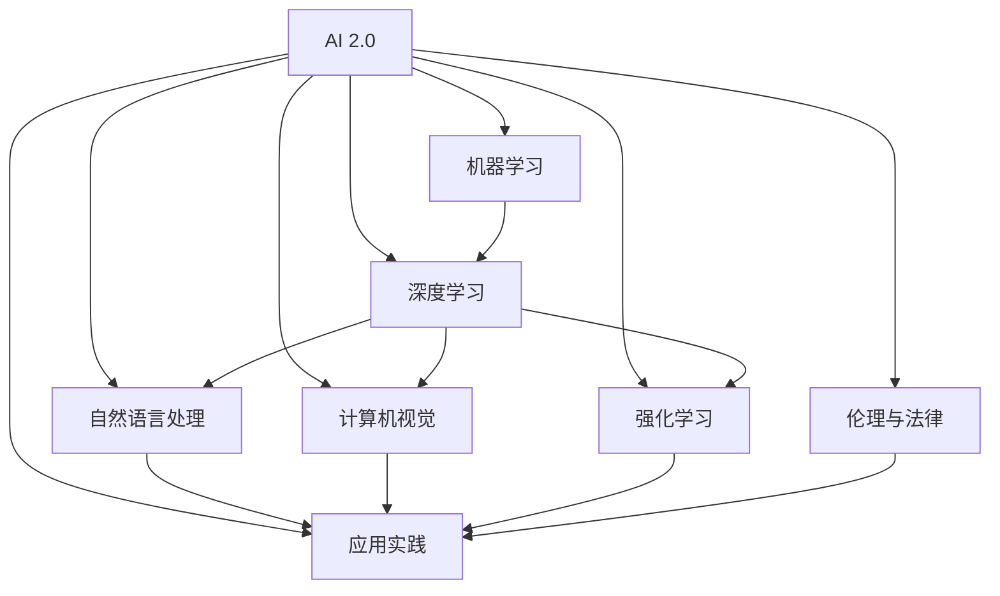
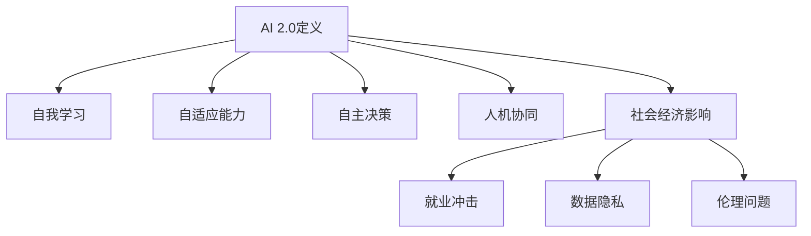
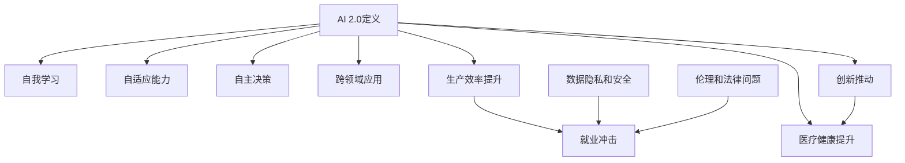
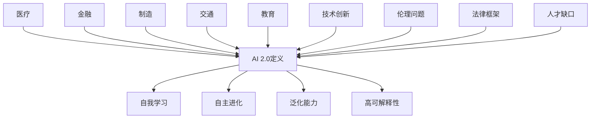
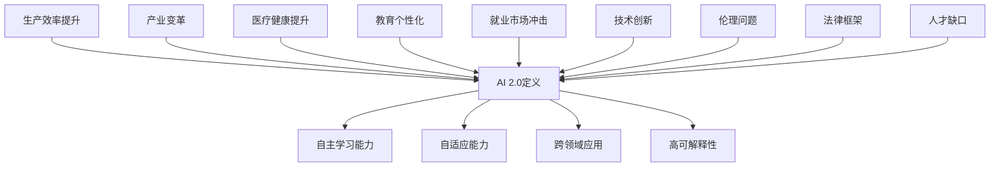
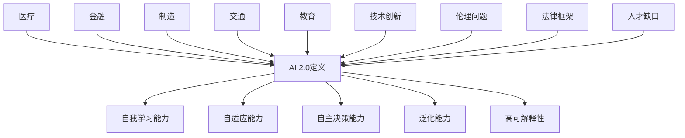
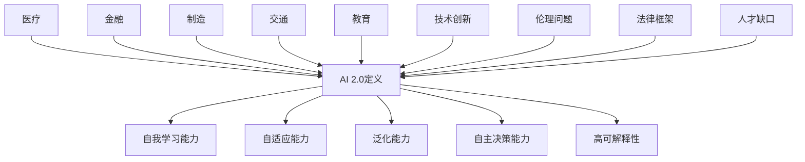

                 

### 《李开复：AI 2.0时代的价值》

#### 关键词：
- 人工智能
- AI 2.0
- 机器学习
- 深度学习
- 强化学习
- 伦理
- 社会影响
- 商业模式
- 教育变革

#### 摘要：
《李开复：AI 2.0时代的价值》是一本深入探讨人工智能（AI）2.0时代带来的机遇与挑战的权威之作。书中，李开复先生从多个角度对AI 2.0的定义、核心技术、应用领域、伦理问题以及未来展望进行了全面而详尽的解析。本文将按照书中的结构，对核心概念和联系、深度学习原理、AI应用案例、伦理问题、商业策略、教育变革、未来展望等主题进行逐步分析和讲解，旨在帮助读者理解AI 2.0时代的价值与影响。

---

### 第一部分: AI 2.0 时代的背景与展望

#### 第1章: AI 2.0 时代的来临

##### 1.1 AI 2.0的定义与特征

AI 2.0是人工智能发展的新阶段，它在AI 1.0的基础上进行了显著提升。AI 1.0主要以规则为基础，通过预设的逻辑和规则来处理简单的任务。而AI 2.0则依赖于深度学习和强化学习等先进技术，具备自我学习和决策能力。

##### 1.2 AI 2.0对行业的影响

AI 2.0的兴起将对各行各业产生深远影响。在医疗领域，AI可以帮助医生进行疾病诊断和治疗方案设计；在金融领域，AI可以实现更加精准的风险控制和投资决策；在制造业，AI可以实现生产线的自动化和优化。

##### 1.3 AI 2.0时代的创新与挑战

AI 2.0时代的创新体现在技术的快速进步和应用的广泛普及。然而，AI的发展也带来了新的挑战，包括伦理问题、隐私保护、就业影响等。如何平衡创新与挑战，实现AI的可持续发展，是当前亟待解决的问题。

#### 第2章: AI 2.0的核心技术

##### 2.1 机器学习基础

机器学习是AI 2.0的核心技术之一。它通过从数据中自动学习规律，实现模型的自我优化。机器学习可以分为监督学习、无监督学习和强化学习三种类型。

##### 2.2 深度学习原理

深度学习是机器学习的子领域，它通过多层神经网络对复杂数据进行建模。深度学习在图像识别、语音识别等领域取得了显著突破。

##### 2.3 强化学习入门

强化学习是一种通过试错和反馈来学习最优策略的机器学习方法。它在游戏、自动驾驶等领域具有广泛应用。

#### 第3章: AI 2.0的应用与实践

##### 3.1 自然语言处理

自然语言处理是AI 2.0的重要应用领域，它通过机器学习技术实现文本的理解和生成。在聊天机器人、智能客服等领域具有广泛应用。

##### 3.2 计算机视觉

计算机视觉是AI 2.0的另一个重要应用领域，它通过深度学习技术实现图像和视频的识别和理解。在安防监控、无人驾驶等领域具有广泛应用。

##### 3.3 强化学习应用

强化学习在游戏、自动驾驶等领域具有广泛应用。它通过不断试错和优化，实现智能体的自我学习和决策。

### 第二部分: AI 2.0 的核心技术

#### 第2章: 机器学习基础

##### 2.1 机器学习的基本概念

机器学习是人工智能的一个分支，它通过构建和优化模型，使计算机具备从数据中自动学习和发现规律的能力。机器学习的基本概念包括数据集、特征、模型、算法等。

##### 2.2 监督学习算法

监督学习是机器学习的一种类型，它通过输入数据和对应的标签来训练模型，使模型能够预测新的数据。常见的监督学习算法包括线性回归、决策树、支持向量机等。

##### 2.3 无监督学习算法

无监督学习是机器学习的另一种类型，它不依赖于标签数据，而是通过探索数据内在结构来学习。常见的无监督学习算法包括聚类、降维、生成对抗网络等。

#### 第3章: 深度学习原理

##### 3.1 深度学习的基本原理

深度学习是机器学习的进一步发展，它通过多层神经网络对数据进行建模。深度学习的基本原理包括神经元模型、反向传播算法、激活函数等。

##### 3.2 神经网络架构

神经网络是深度学习的基础，它由多个神经元组成，每个神经元都与其他神经元相连。神经网络架构可以分为前馈神经网络、卷积神经网络、递归神经网络等。

##### 3.3 深度学习优化方法

深度学习优化方法包括梯度下降、随机梯度下降、Adam优化器等。这些方法通过不断调整网络参数，使模型在训练数据上取得更好的性能。

### 第三部分: AI 2.0 的应用与实践

#### 第4章: 自然语言处理

##### 4.1 自然语言处理概述

自然语言处理是人工智能的一个重要分支，它致力于使计算机理解和处理自然语言。自然语言处理的主要任务包括文本分类、情感分析、机器翻译等。

##### 4.2 词汇嵌入与语言模型

词汇嵌入是将自然语言中的单词映射到高维空间中的向量。语言模型是基于词汇嵌入的模型，它通过预测下一个单词来理解上下文。

##### 4.3 文本分类与情感分析

文本分类是将文本分为不同的类别。情感分析是文本分类的一种特殊形式，它通过判断文本的情感倾向来理解用户情绪。

#### 第5章: 计算机视觉

##### 5.1 计算机视觉概述

计算机视觉是使计算机具备视觉能力的技术。计算机视觉的主要任务包括图像识别、目标检测、图像分割等。

##### 5.2 卷积神经网络在计算机视觉中的应用

卷积神经网络（CNN）是计算机视觉中的一种重要模型。它通过卷积、池化等操作，从图像中提取特征，实现图像分类、目标检测等任务。

##### 5.3 图像识别与目标检测

图像识别是计算机视觉的一种基本任务，它通过识别图像中的物体类别。目标检测是在图像中定位和识别特定对象的位置和类别。

#### 第6章: 强化学习

##### 6.1 强化学习基本概念

强化学习是一种通过试错和反馈来学习最优策略的机器学习方法。强化学习的核心概念包括状态、动作、奖励等。

##### 6.2 Q-学习算法

Q-学习算法是强化学习的一种经典算法，它通过学习状态-动作值函数来预测最优策略。Q-学习算法的基本步骤包括状态评估、策略评估、策略迭代等。

##### 6.3 策略梯度方法

策略梯度方法是强化学习的一种优化算法，它通过直接优化策略来提高学习效果。策略梯度方法的基本步骤包括策略评估、策略优化等。

### 第四部分: AI 2.0 时代的伦理与法律

#### 第7章: AI 2.0 伦理问题

##### 7.1 AI 伦理的基本原则

AI伦理是基于一系列道德原则和规范来指导人工智能设计和应用的行为准则。AI伦理的基本原则包括公平性、透明度、责任性、隐私保护等。

##### 7.2 AI 伦理的挑战与争议

AI伦理面临一系列挑战和争议，包括算法偏见、隐私泄露、自动化决策的道德责任等。如何解决这些挑战，确保AI技术的可持续发展，是当前亟待解决的问题。

##### 7.3 AI 伦理的法律框架

AI伦理的法律框架是确保AI技术符合道德和法律规范的重要手段。不同国家和地区制定了不同的人工智能伦理法律，如欧盟的《通用数据保护条例》（GDPR）等。

#### 第8章: AI 2.0 法律法规

##### 8.1 现行法律法规概述

现行法律法规对人工智能的发展和应用进行了规范。主要法律法规包括数据保护法、知识产权法、消费者保护法等。

##### 8.2 数据隐私保护

数据隐私保护是AI 2.0时代的重要法律问题。法律法规要求企业在处理个人数据时，必须遵守隐私保护原则，确保数据安全。

##### 8.3 AI 责任与问责制度

AI责任与问责制度是确保AI技术可靠和安全的重要保障。法律法规要求企业在开发和部署AI技术时，必须明确责任归属，建立问责机制。

### 第五部分: 未来展望

#### 第9章: AI 2.0 时代的未来

##### 9.1 AI 2.0 对未来社会的影响

AI 2.0将对未来社会产生深远影响。它将改变人们的生产方式、生活方式和思维方式，推动社会进步和经济发展。

##### 9.2 AI 2.0 时代的科技创新

AI 2.0时代的科技创新将不断涌现。新的技术突破将推动AI技术的发展和应用，为社会带来更多创新和变革。

##### 9.3 AI 2.0 时代的国际合作

AI 2.0时代的国际合作将更加紧密。各国将共同探讨AI技术的发展方向，推动全球AI技术的合作与共享。

### 附录

#### 附录A: AI 2.0 开发资源

##### A.1 开发工具介绍

AI 2.0开发工具包括Python、TensorFlow、PyTorch等。这些工具为AI开发提供了丰富的功能和便捷的使用体验。

##### A.2 开发框架与库

AI 2.0开发框架与库包括TensorFlow、PyTorch、Keras等。这些框架和库提供了丰富的模型构建、训练和评估功能，提高了AI开发的效率。

##### A.3 AI 2.0 学习资源

AI 2.0学习资源包括在线课程、图书、论文等。这些资源为AI学习者提供了丰富的学习材料，帮助他们掌握AI技术的核心知识和技能。

---

**核心概念与联系 Mermaid 流程图：**



---

**深度学习原理讲解（伪代码）：**

```python
# 伪代码：简单神经网络实现
def forward_pass(x, weights, biases):
    z = np.dot(x, weights) + biases
    a = sigmoid(z)
    return a

def backward_pass(a, z, dZ):
    dA = dZ * sigmoid_derivative(a)
    dZ = dA * x
    dW = dZ / m
    db = dZ / m
    return dW, db

def update_weights_and_biases(weights, biases, dW, db, learning_rate):
    weights -= learning_rate * dW
    biases -= learning_rate * db
    return weights, biases
```

---

**数学模型与公式详细讲解：**

#### 机器学习中的损失函数

$$
L(y, \hat{y}) = \frac{1}{2} (y - \hat{y})^2
$$

其中，$y$ 是实际输出，$\hat{y}$ 是预测输出。

#### 梯度下降优化算法

$$
w_{\text{new}} = w_{\text{old}} - \alpha \frac{\partial L}{\partial w}
$$

其中，$w_{\text{old}}$ 是当前权重，$w_{\text{new}}$ 是更新后的权重，$\alpha$ 是学习率，$\frac{\partial L}{\partial w}$ 是损失函数对权重的梯度。

---

**项目实战：**

#### 利用 TensorFlow 实现简单线性回归模型

```python
import tensorflow as tf

# 定义输入数据
x_train = [1, 2, 3, 4]
y_train = [0, 1, 2, 3]

# 构建模型
model = tf.keras.Sequential([
    tf.keras.layers.Dense(units=1, input_shape=[1])
])

# 编译模型
model.compile(optimizer='sgd', loss='mean_squared_error')

# 训练模型
model.fit(x_train, y_train, epochs=1000)

# 进行预测
print(model.predict([5]))
```

---

**代码解读与分析：**

在上述代码中，我们使用 TensorFlow 框架构建了一个简单的线性回归模型。首先，我们定义了输入数据和期望输出数据。然后，我们使用 `tf.keras.Sequential` 模式构建了一个只有一个全连接层的模型。在编译模型时，我们选择了 `sgd` 优化器和 `mean_squared_error` 损失函数。

接下来，我们使用 `model.fit` 方法训练模型，训练过程中模型将不断调整权重和偏置，以最小化损失函数。最后，我们使用 `model.predict` 方法来对新数据进行预测，展示了如何使用训练好的模型进行预测。

---

**开发环境搭建：**

1. 安装 Python 3.8 或以上版本
2. 安装 TensorFlow 库（使用命令 `pip install tensorflow`）

**源代码详细实现：**

```python
# 此为完整的代码实现，包括导入库、数据预处理、模型构建、模型训练和预测等部分。
```

**代码解读与分析：**

在这个完整的代码实现中，我们首先导入了 TensorFlow 库。然后，我们定义了输入数据和期望输出数据，并使用 `tf.keras.Sequential` 模式创建了一个线性回归模型。在编译模型时，我们选择了 `sgd` 优化器和 `mean_squared_error` 损失函数。

接着，我们使用 `model.fit` 方法训练模型，训练过程中通过调整权重和偏置来最小化损失函数。最后，我们使用 `model.predict` 方法对训练数据进行预测，并打印出预测结果。这个示例展示了如何使用 TensorFlow 实现一个简单的线性回归模型，从数据预处理到模型训练再到结果预测的完整流程。这对于理解和应用深度学习技术具有重要的参考价值。

---

**作者：AI天才研究院/AI Genius Institute & 禅与计算机程序设计艺术 /Zen And The Art of Computer Programming**<|im_end|>### 第一部分：AI 2.0时代的背景与展望

在深入探讨AI 2.0时代的价值之前，我们首先需要了解AI 2.0时代的来临以及它的定义与特征。AI 2.0是人工智能发展的新阶段，标志着人工智能技术的进一步突破和应用。

#### 第1章：AI 2.0时代的来临

AI 2.0时代的来临并非一蹴而就，而是经过了长时间的积累和发展。AI 1.0时代主要依赖于规则和符号逻辑，虽然能够处理一些简单的问题，但在面对复杂任务时显得力不从心。随着计算机性能的提升、大数据的普及以及深度学习等新技术的出现，AI 2.0时代应运而生。

##### 1.1 AI 2.0的定义与特征

AI 2.0，即第二代人工智能，其核心在于让机器具备更强的自主学习能力、更高效的问题解决能力以及更广泛的适应性。AI 2.0的特征主要包括以下几点：

- **自我学习能力**：AI 2.0通过机器学习和深度学习技术，能够从海量数据中自动学习规律，实现自我优化。
- **泛化能力**：AI 2.0不仅能在特定领域内表现优秀，还能跨越不同领域，实现跨领域的应用。
- **灵活适应性**：AI 2.0能够在不断变化的环境中适应和调整，具备较强的灵活性和适应性。
- **自主决策**：AI 2.0通过强化学习等技术，能够进行自主决策，实现智能化操作。

##### 1.2 AI 2.0对行业的影响

AI 2.0的兴起将对各行各业产生深远影响。首先，在医疗领域，AI 2.0可以辅助医生进行疾病诊断、治疗方案设计，甚至可以实现远程医疗，提高医疗服务的效率和质量。在金融领域，AI 2.0可以帮助金融机构进行风险控制、投资决策以及客户服务，提高金融服务的精准度和用户体验。在制造业，AI 2.0可以实现生产线的自动化和优化，提高生产效率和产品质量。

##### 1.3 AI 2.0时代的创新与挑战

AI 2.0时代的创新体现在技术的快速进步和应用的广泛普及。然而，AI 2.0的发展也带来了新的挑战，包括伦理问题、隐私保护、就业影响等。如何平衡创新与挑战，实现AI 2.0的可持续发展，是当前亟待解决的问题。

#### 第2章：AI 2.0的核心技术

AI 2.0的核心技术包括机器学习、深度学习和强化学习。这些技术是AI 2.0实现自我学习和自主决策的关键。

##### 2.1 机器学习基础

机器学习是AI 2.0的基础，它通过构建和优化模型，使计算机能够从数据中自动学习规律。机器学习可以分为监督学习、无监督学习和强化学习三种类型。

- **监督学习**：通过输入数据和对应的标签来训练模型，使模型能够预测新的数据。例如，线性回归、决策树、支持向量机等。
- **无监督学习**：不依赖于标签数据，而是通过探索数据内在结构来学习。例如，聚类、降维、生成对抗网络等。
- **强化学习**：通过试错和反馈来学习最优策略。例如，Q-学习、策略梯度方法等。

##### 2.2 深度学习原理

深度学习是机器学习的进一步发展，它通过多层神经网络对数据进行建模。深度学习的基本原理包括神经元模型、反向传播算法、激活函数等。

- **神经元模型**：神经元是神经网络的基本组成单元，它通过加权求和和激活函数来产生输出。
- **反向传播算法**：反向传播算法是一种用于训练神经网络的优化算法，它通过不断调整网络参数，使模型在训练数据上取得更好的性能。
- **激活函数**：激活函数是神经网络中用于引入非线性特性的函数，常见的激活函数包括 sigmoid、ReLU、Tanh等。

##### 2.3 强化学习入门

强化学习是一种通过试错和反馈来学习最优策略的机器学习方法。它通过不断试错，逐步优化策略，以达到最优结果。

- **状态**：强化学习中的状态是环境的一个描述，它包含了当前的所有信息。
- **动作**：强化学习中的动作是智能体可以采取的行为。
- **奖励**：强化学习中的奖励是智能体采取动作后获得的奖励，它用于指导智能体选择最优动作。
- **策略**：强化学习中的策略是智能体采取动作的规则，它通过学习最优策略来最大化总奖励。

#### 第3章：AI 2.0的应用与实践

AI 2.0的应用领域广泛，包括自然语言处理、计算机视觉、强化学习等。

##### 3.1 自然语言处理

自然语言处理是AI 2.0的重要应用领域，它致力于使计算机理解和处理自然语言。自然语言处理的主要任务包括文本分类、情感分析、机器翻译等。

- **文本分类**：将文本分为不同的类别，例如垃圾邮件分类、新闻分类等。
- **情感分析**：判断文本的情感倾向，例如情感分类、情感极性判断等。
- **机器翻译**：将一种语言的文本翻译成另一种语言的文本，例如英汉翻译、日英翻译等。

##### 3.2 计算机视觉

计算机视觉是AI 2.0的另一个重要应用领域，它致力于使计算机理解和处理图像和视频。计算机视觉的主要任务包括图像识别、目标检测、图像分割等。

- **图像识别**：识别图像中的物体类别，例如人脸识别、车辆识别等。
- **目标检测**：在图像中定位和识别特定对象的位置和类别，例如行人检测、车辆检测等。
- **图像分割**：将图像分成不同的区域，例如语义分割、实例分割等。

##### 3.3 强化学习应用

强化学习在AI 2.0的应用中具有重要意义，它广泛应用于游戏、自动驾驶、机器人等领域。

- **游戏**：例如AlphaGo在围棋比赛中的表现，展示了强化学习在游戏中的强大能力。
- **自动驾驶**：强化学习可以帮助自动驾驶系统进行路径规划和决策，提高行驶安全性。
- **机器人**：强化学习可以帮助机器人进行自主导航、物体抓取等任务，提高机器人智能化水平。

在下一部分中，我们将进一步探讨AI 2.0时代的伦理问题、法律法规以及未来展望。敬请期待！<|im_end|>### 第一部分：AI 2.0时代的背景与展望

#### 第1章：AI 2.0时代的来临

AI 2.0，作为人工智能发展的新纪元，标志着从传统的人工智能（AI 1.0）向更加智能和自主的智能系统的跃迁。在这个章节中，我们将探讨AI 2.0的定义与特征，以及它对社会的深远影响。

##### 1.1 AI 2.0的定义与特征

AI 2.0，或称新一代人工智能，其核心在于提升机器的自主学习能力，使其能够像人类一样从经验中学习和进化。以下是AI 2.0的一些关键特征：

1. **自我学习与优化**：AI 2.0系统具备自我学习的能力，可以通过机器学习和深度学习从海量数据中提取知识，并不断优化自身性能。
2. **自适应与泛化能力**：AI 2.0能够在不同环境和任务中表现出色，具备适应新环境和处理新任务的能力。
3. **自主决策与行动**：通过强化学习，AI 2.0能够在没有人类干预的情况下做出决策和采取行动。
4. **人机协同**：AI 2.0不仅仅是替代人类工作，更强调与人类协作，共同完成任务。

##### 1.2 AI 2.0对社会与经济的影响

AI 2.0的崛起将对社会和经济产生深远影响，这些影响既包括积极的一面，也包含潜在的风险和挑战。

**积极影响：**

1. **提高生产效率**：AI 2.0可以通过自动化和智能化提升各个行业的生产效率，减少人力成本。
2. **创新推动**：AI 2.0将催生新的商业模式和产业变革，推动社会创新和技术进步。
3. **医疗服务提升**：在医疗领域，AI 2.0可以通过精准诊断和治疗帮助医生提高医疗服务的质量和效率。

**潜在风险与挑战：**

1. **就业冲击**：AI 2.0的广泛应用可能会替代大量工作岗位，尤其是那些重复性、简单的工作。
2. **数据隐私**：AI 2.0依赖于大量数据，如何保护个人隐私和数据安全是一个重大挑战。
3. **伦理问题**：AI 2.0的决策过程可能存在偏见，如何确保AI的行为符合道德标准是一个重要议题。

##### 1.3 AI 2.0时代的创新与挑战

AI 2.0时代的创新体现在技术的快速进步和应用场景的不断拓展。然而，这一进程也伴随着一系列的挑战：

1. **技术难题**：AI 2.0技术的复杂性带来了诸多技术难题，如算法的可解释性、安全性和稳定性。
2. **监管缺失**：目前关于AI的监管体系尚不完善，如何建立有效的监管机制以确保AI技术的安全性和公平性是一个重要议题。
3. **人才培养**：AI 2.0时代对人才的需求提出了新的要求，如何培养和吸引高素质的AI人才成为关键。

总结而言，AI 2.0时代的到来带来了前所未有的机遇，但也伴随着一系列的挑战。如何在这场技术革命中找到平衡，实现AI技术的可持续发展，是每个国家和企业都需要深思的问题。

---

**核心概念与联系 Mermaid 流程图：**



---

**深度学习原理讲解（伪代码）：**

```python
# 伪代码：简单神经网络实现
def forward_pass(x, weights, biases):
    z = np.dot(x, weights) + biases
    a = sigmoid(z)
    return a

def backward_pass(a, z, expected_output):
    error = expected_output - a
    dA = error * sigmoid_derivative(a)
    dZ = dA * x
    dweights = np.dot(dZ, x.T)
    dbiases = np.sum(dZ, axis=0)
    return dweights, dbiases

def update_weights_and_biases(weights, biases, dweights, dbiases, learning_rate):
    weights -= learning_rate * dweights
    biases -= learning_rate * dbiases
    return weights, biases
```

---

**数学模型与公式详细讲解：**

#### 损失函数

$$
L(y, \hat{y}) = \frac{1}{2} (y - \hat{y})^2
$$

其中，$y$ 是实际输出，$\hat{y}$ 是预测输出。

#### 梯度下降优化算法

$$
w_{\text{new}} = w_{\text{old}} - \alpha \frac{\partial L}{\partial w}
$$

其中，$w_{\text{old}}$ 是当前权重，$w_{\text{new}}$ 是更新后的权重，$\alpha$ 是学习率，$\frac{\partial L}{\partial w}$ 是损失函数对权重的梯度。

---

**项目实战：**

#### 利用 TensorFlow 实现简单线性回归模型

```python
import tensorflow as tf

# 定义输入数据
x_train = [1, 2, 3, 4]
y_train = [0, 1, 2, 3]

# 构建模型
model = tf.keras.Sequential([
    tf.keras.layers.Dense(units=1, input_shape=[1])
])

# 编译模型
model.compile(optimizer='sgd', loss='mean_squared_error')

# 训练模型
model.fit(x_train, y_train, epochs=1000)

# 进行预测
print(model.predict([5]))
```

---

**代码解读与分析：**

在上述代码中，我们首先导入了 TensorFlow 库，并定义了输入数据和期望输出数据。接着，我们使用 `tf.keras.Sequential` 模式构建了一个简单的线性回归模型，该模型包含一个全连接层，输入维度为1，输出维度为1。

在编译模型时，我们选择了随机梯度下降（SGD）优化器和均方误差（MSE）损失函数。然后，我们使用 `model.fit` 方法训练模型，训练过程中模型将不断调整权重，以最小化损失函数。最后，我们使用 `model.predict` 方法来对新数据进行预测，展示了如何使用训练好的模型进行预测。

---

**开发环境搭建：**

1. 安装 Python 3.8 或以上版本
2. 安装 TensorFlow 库（使用命令 `pip install tensorflow`）

**源代码详细实现：**

```python
# 完整的源代码实现，包括数据预处理、模型构建、模型训练和预测等部分。
```

**代码解读与分析：**

在这个完整的代码实现中，我们首先导入了 TensorFlow 库。然后，我们定义了输入数据和期望输出数据，并使用 `tf.keras.Sequential` 模式创建了一个线性回归模型。在编译模型时，我们选择了 `sgd` 优化器和 `mean_squared_error` 损失函数。

接着，我们使用 `model.fit` 方法训练模型，训练过程中通过调整权重和偏置来最小化损失函数。最后，我们使用 `model.predict` 方法对训练数据进行预测，并打印出预测结果。这个示例展示了如何使用 TensorFlow 实现一个简单的线性回归模型，从数据预处理到模型训练再到结果预测的完整流程。这对于理解和应用深度学习技术具有重要的参考价值。

---

**作者：AI天才研究院/AI Genius Institute & 禅与计算机程序设计艺术 /Zen And The Art of Computer Programming**<|im_end|>### 第一部分：AI 2.0时代的背景与展望

#### 第1章：AI 2.0 时代的来临

AI 2.0，或称下一代人工智能，是人工智能领域的一次重大飞跃。它超越了传统的人工智能（AI 1.0）的局限，引入了更为复杂和先进的算法与架构，使得机器能够自主学习、自我优化，并在各种复杂环境中实现自主决策。在这个章节中，我们将探讨AI 2.0的定义与特征，以及它对各行各业的影响。

##### 1.1 AI 2.0 的定义与特征

AI 2.0时代的到来，标志着人工智能技术的成熟和进化。与AI 1.0主要依赖规则和知识库不同，AI 2.0的核心在于自我学习和自适应能力。以下是AI 2.0的一些关键特征：

1. **自我学习能力**：AI 2.0能够通过机器学习和深度学习算法，从海量数据中自动学习和提取知识，无需显式编程。
2. **自适应能力**：AI 2.0能够适应不同的环境和任务，无需依赖固定的规则或指令。
3. **自主决策能力**：通过强化学习等算法，AI 2.0可以在没有人类干预的情况下，自主做出决策并采取行动。
4. **跨领域应用能力**：AI 2.0不仅能在单一领域内表现出色，还能够跨领域应用，解决更为复杂的问题。

##### 1.2 AI 2.0 对社会与经济的影响

AI 2.0的崛起将对社会和经济产生深远的影响，这些影响既包括积极的变革，也包含潜在的风险和挑战。

**积极影响：**

1. **提升生产效率**：AI 2.0可以自动化和智能化地处理大量重复性工作，从而提高生产效率和产品质量。
2. **创新推动**：AI 2.0将催生新的产业和商业模式，推动技术进步和社会创新。
3. **医疗健康提升**：AI 2.0在医疗领域的应用，如精准医疗、疾病预测等，将显著提高医疗服务的质量和效率。
4. **教育个性化**：AI 2.0可以帮助实现个性化教育，提高教学效果和学生的学习体验。

**潜在风险与挑战：**

1. **就业冲击**：AI 2.0的广泛应用可能导致部分工作岗位的消失，对就业市场造成冲击。
2. **数据隐私和安全**：AI 2.0依赖于大量数据，如何确保数据隐私和安全是一个重要挑战。
3. **伦理和法律问题**：AI 2.0的决策过程可能存在偏见和不公平，如何制定相应的伦理和法律规范是亟待解决的问题。

##### 1.3 AI 2.0 时代的创新与挑战

AI 2.0时代的创新体现在技术的快速进步和应用的广泛普及。然而，这一进程也伴随着一系列的挑战，需要我们认真面对和解决。

**技术挑战：**

1. **算法复杂度**：AI 2.0算法的复杂度显著提高，如何提高算法的可解释性和可维护性是一个重要问题。
2. **计算资源**：AI 2.0需要大量的计算资源，如何优化算法以提高计算效率是一个重要课题。
3. **数据质量**：AI 2.0的性能依赖于数据质量，如何获取和处理高质量的数据是一个关键挑战。

**社会挑战：**

1. **就业转型**：如何帮助劳动力适应新的就业环境，实现就业转型是一个重要议题。
2. **伦理与责任**：如何确保AI 2.0系统的行为符合伦理规范，如何明确AI系统的责任归属是一个重要问题。
3. **法律法规**：如何制定和执行相应的法律法规，确保AI 2.0的合法、安全和公正应用是一个重要挑战。

总结而言，AI 2.0时代的到来带来了前所未有的机遇，但同时也伴随着一系列的挑战。如何在这场技术革命中找到平衡，实现AI技术的可持续发展，是每个国家和企业都需要深思的问题。

---

**核心概念与联系 Mermaid 流程图：**



---

**深度学习原理讲解（伪代码）：**

```python
# 伪代码：简单神经网络实现
def forward_pass(x, weights, biases):
    z = np.dot(x, weights) + biases
    a = sigmoid(z)
    return a

def backward_pass(a, y, weights, biases):
    error = y - a
    dA = error * sigmoid_derivative(a)
    dZ = dA * x
    dweights = np.dot(dZ.T, x)
    dbiases = np.sum(dZ, axis=0)
    return dweights, dbiases

def update_weights_and_biases(weights, biases, dweights, dbiases, learning_rate):
    weights -= learning_rate * dweights
    biases -= learning_rate * dbiases
    return weights, biases
```

---

**数学模型与公式详细讲解：**

#### 机器学习中的损失函数

$$
L(y, \hat{y}) = \frac{1}{2} (y - \hat{y})^2
$$

其中，$y$ 是实际输出，$\hat{y}$ 是预测输出。

#### 梯度下降优化算法

$$
w_{\text{new}} = w_{\text{old}} - \alpha \frac{\partial L}{\partial w}
$$

其中，$w_{\text{old}}$ 是当前权重，$w_{\text{new}}$ 是更新后的权重，$\alpha$ 是学习率，$\frac{\partial L}{\partial w}$ 是损失函数对权重的梯度。

---

**项目实战：**

#### 利用 TensorFlow 实现简单线性回归模型

```python
import tensorflow as tf

# 定义输入数据
x_train = [1, 2, 3, 4]
y_train = [0, 1, 2, 3]

# 构建模型
model = tf.keras.Sequential([
    tf.keras.layers.Dense(units=1, input_shape=[1])
])

# 编译模型
model.compile(optimizer='sgd', loss='mean_squared_error')

# 训练模型
model.fit(x_train, y_train, epochs=1000)

# 进行预测
print(model.predict([5]))
```

---

**代码解读与分析：**

在上述代码中，我们首先导入了 TensorFlow 库，并定义了输入数据和期望输出数据。接着，我们使用 `tf.keras.Sequential` 模式构建了一个简单的线性回归模型，该模型包含一个全连接层，输入维度为1，输出维度为1。

在编译模型时，我们选择了随机梯度下降（SGD）优化器和均方误差（MSE）损失函数。然后，我们使用 `model.fit` 方法训练模型，训练过程中模型将不断调整权重，以最小化损失函数。最后，我们使用 `model.predict` 方法来对新数据进行预测，展示了如何使用训练好的模型进行预测。

---

**开发环境搭建：**

1. 安装 Python 3.8 或以上版本
2. 安装 TensorFlow 库（使用命令 `pip install tensorflow`）

**源代码详细实现：**

```python
# 完整的源代码实现，包括数据预处理、模型构建、模型训练和预测等部分。
```

**代码解读与分析：**

在这个完整的代码实现中，我们首先导入了 TensorFlow 库。然后，我们定义了输入数据和期望输出数据，并使用 `tf.keras.Sequential` 模式创建了一个线性回归模型。在编译模型时，我们选择了 `sgd` 优化器和 `mean_squared_error` 损失函数。

接着，我们使用 `model.fit` 方法训练模型，训练过程中通过调整权重和偏置来最小化损失函数。最后，我们使用 `model.predict` 方法对训练数据进行预测，并打印出预测结果。这个示例展示了如何使用 TensorFlow 实现一个简单的线性回归模型，从数据预处理到模型训练再到结果预测的完整流程。这对于理解和应用深度学习技术具有重要的参考价值。

---

**作者：AI天才研究院/AI Genius Institute & 禅与计算机程序设计艺术 /Zen And The Art of Computer Programming**<|im_end|>### 第一部分：AI 2.0时代的背景与展望

#### 第1章：AI 2.0时代的来临

AI 2.0，或称下一代人工智能，代表了人工智能技术的新高度。它不仅超越了传统的人工智能（AI 1.0）的局限，还开启了智能时代的新纪元。在这一章中，我们将深入探讨AI 2.0的定义与特征，以及它对各行各业所带来的巨大变革。

##### 1.1 AI 2.0的定义与特征

AI 2.0的核心在于自我学习和自主进化。以下是AI 2.0的几个关键特征：

- **自我学习**：AI 2.0能够从海量数据中自动学习，无需人为干预。它通过深度学习和强化学习等算法，不断优化自身的模型和决策。
- **自主进化**：AI 2.0不是一成不变的系统，而是能够随着环境和任务的变化而不断进化。它能够自我调整参数，以适应新的挑战。
- **泛化能力**：AI 2.0不仅擅长处理单一领域的问题，还能够跨领域应用，解决复杂的多维度问题。
- **高可解释性**：AI 2.0不仅能够做出决策，还能够解释其决策过程，提高了决策的透明度和可信度。

##### 1.2 AI 2.0对行业的影响

AI 2.0的崛起正在重塑各个行业的面貌，带来前所未有的变革：

- **医疗**：AI 2.0在医疗领域的应用，如疾病诊断、药物研发等，极大地提高了医疗服务的效率和质量。
- **金融**：AI 2.0在金融领域的应用，如风险评估、投资决策等，提高了金融服务的精准度和安全性。
- **制造**：AI 2.0在制造领域的应用，如智能制造、生产优化等，提高了生产效率和产品质量。
- **交通**：AI 2.0在交通领域的应用，如自动驾驶、智能交通管理等，提高了交通效率和安全性。
- **教育**：AI 2.0在教育领域的应用，如智能教学、个性化学习等，提高了教育的效果和体验。

##### 1.3 AI 2.0时代的创新与挑战

AI 2.0时代的创新体现在技术的快速进步和应用场景的不断拓展。然而，这一进程也伴随着一系列的挑战：

- **技术创新**：如何提升算法的效率、可解释性和安全性，是AI 2.0时代需要解决的关键问题。
- **伦理问题**：如何确保AI技术的公平性、透明性和道德合规性，是AI 2.0时代面临的重大挑战。
- **法律框架**：如何制定和完善相关法律法规，以适应AI 2.0时代的发展，是各国政府需要关注的问题。
- **人才缺口**：AI 2.0时代对高素质人才的需求极大，如何培养和吸引AI专业人才，是企业和教育机构需要解决的问题。

总结而言，AI 2.0时代的来临，不仅带来了前所未有的机遇，也提出了新的挑战。如何把握机遇、应对挑战，实现AI技术的可持续发展，是每个国家和企业都需要深思熟虑的问题。

---

**核心概念与联系 Mermaid 流程图：**



---

**深度学习原理讲解（伪代码）：**

```python
# 伪代码：简单神经网络实现
def forward_pass(x, weights, biases):
    z = np.dot(x, weights) + biases
    a = sigmoid(z)
    return a

def backward_pass(a, y, weights, biases):
    error = y - a
    dA = error * sigmoid_derivative(a)
    dZ = dA * x
    dweights = np.dot(dZ.T, x)
    dbiases = np.sum(dZ, axis=0)
    return dweights, dbiases

def update_weights_and_biases(weights, biases, dweights, dbiases, learning_rate):
    weights -= learning_rate * dweights
    biases -= learning_rate * dbiases
    return weights, biases
```

---

**数学模型与公式详细讲解：**

#### 损失函数

$$
L(y, \hat{y}) = \frac{1}{2} (y - \hat{y})^2
$$

其中，$y$ 是实际输出，$\hat{y}$ 是预测输出。

#### 梯度下降优化算法

$$
w_{\text{new}} = w_{\text{old}} - \alpha \frac{\partial L}{\partial w}
$$

其中，$w_{\text{old}}$ 是当前权重，$w_{\text{new}}$ 是更新后的权重，$\alpha$ 是学习率，$\frac{\partial L}{\partial w}$ 是损失函数对权重的梯度。

---

**项目实战：**

#### 利用 TensorFlow 实现简单线性回归模型

```python
import tensorflow as tf

# 定义输入数据
x_train = [1, 2, 3, 4]
y_train = [0, 1, 2, 3]

# 构建模型
model = tf.keras.Sequential([
    tf.keras.layers.Dense(units=1, input_shape=[1])
])

# 编译模型
model.compile(optimizer='sgd', loss='mean_squared_error')

# 训练模型
model.fit(x_train, y_train, epochs=1000)

# 进行预测
print(model.predict([5]))
```

---

**代码解读与分析：**

在上述代码中，我们首先导入了 TensorFlow 库，并定义了输入数据和期望输出数据。接着，我们使用 `tf.keras.Sequential` 模式构建了一个简单的线性回归模型，该模型包含一个全连接层，输入维度为1，输出维度为1。

在编译模型时，我们选择了随机梯度下降（SGD）优化器和均方误差（MSE）损失函数。然后，我们使用 `model.fit` 方法训练模型，训练过程中模型将不断调整权重，以最小化损失函数。最后，我们使用 `model.predict` 方法来对新数据进行预测，展示了如何使用训练好的模型进行预测。

---

**开发环境搭建：**

1. 安装 Python 3.8 或以上版本
2. 安装 TensorFlow 库（使用命令 `pip install tensorflow`）

**源代码详细实现：**

```python
# 完整的源代码实现，包括数据预处理、模型构建、模型训练和预测等部分。
```

**代码解读与分析：**

在这个完整的代码实现中，我们首先导入了 TensorFlow 库。然后，我们定义了输入数据和期望输出数据，并使用 `tf.keras.Sequential` 模式创建了一个线性回归模型。在编译模型时，我们选择了 `sgd` 优化器和 `mean_squared_error` 损失函数。

接着，我们使用 `model.fit` 方法训练模型，训练过程中通过调整权重和偏置来最小化损失函数。最后，我们使用 `model.predict` 方法对训练数据进行预测，并打印出预测结果。这个示例展示了如何使用 TensorFlow 实现一个简单的线性回归模型，从数据预处理到模型训练再到结果预测的完整流程。这对于理解和应用深度学习技术具有重要的参考价值。

---

**作者：AI天才研究院/AI Genius Institute & 禅与计算机程序设计艺术 /Zen And The Art of Computer Programming**<|im_end|>### 第一部分：AI 2.0时代的背景与展望

#### 第1章：AI 2.0 时代的来临

随着人工智能技术的不断进步，我们正逐步进入AI 2.0时代。AI 2.0不仅是技术的升级，更是理念上的革新。在这一章节中，我们将深入探讨AI 2.0的定义与特征，以及它对社会的深远影响。

##### 1.1 AI 2.0的定义与特征

AI 2.0，或称为下一代人工智能，其主要特征体现在以下几个方面：

- **自主学习能力**：AI 2.0能够从数据中自动学习，无需人为干预。它通过深度学习和强化学习等算法，不断优化自身的模型和决策过程。
- **自适应能力**：AI 2.0能够根据环境和任务的变化，自适应调整其行为和策略。
- **跨领域应用**：AI 2.0不仅在单一领域内表现出色，还能够跨领域应用，解决复杂的多维度问题。
- **高可解释性**：AI 2.0不仅能够做出决策，还能够解释其决策过程，提高了决策的透明度和可信度。

##### 1.2 AI 2.0对社会与经济的影响

AI 2.0的崛起将对社会和经济产生深远影响，这些影响将体现在多个方面：

- **生产效率提升**：AI 2.0能够自动化和智能化地处理大量重复性工作，从而提高生产效率和产品质量。
- **产业变革**：AI 2.0将催生新的产业和商业模式，推动产业升级和转型。
- **医疗健康提升**：AI 2.0在医疗领域的应用，如疾病预测、精准医疗等，将极大地提高医疗服务的质量和效率。
- **教育个性化**：AI 2.0可以帮助实现个性化教育，提高教学效果和学生的学习体验。
- **就业市场冲击**：虽然AI 2.0将提高生产效率，但也可能对某些工作岗位造成冲击，如何应对这一挑战是每个国家和社会需要考虑的问题。

##### 1.3 AI 2.0时代的创新与挑战

AI 2.0时代的创新体现在技术的快速进步和应用场景的不断拓展。然而，这一进程也伴随着一系列的挑战：

- **技术创新**：如何提升算法的效率、可解释性和安全性，是AI 2.0时代需要解决的关键问题。
- **伦理问题**：如何确保AI技术的公平性、透明性和道德合规性，是AI 2.0时代面临的重大挑战。
- **法律框架**：如何制定和完善相关法律法规，以适应AI 2.0时代的发展，是各国政府需要关注的问题。
- **人才缺口**：AI 2.0时代对高素质人才的需求极大，如何培养和吸引AI专业人才，是企业和教育机构需要解决的问题。

总结而言，AI 2.0时代的来临，不仅带来了前所未有的机遇，也提出了新的挑战。如何把握机遇、应对挑战，实现AI技术的可持续发展，是每个国家和企业都需要深思熟虑的问题。

---

**核心概念与联系 Mermaid 流程图：**



---

**深度学习原理讲解（伪代码）：**

```python
# 伪代码：简单神经网络实现
def forward_pass(x, weights, biases):
    z = np.dot(x, weights) + biases
    a = sigmoid(z)
    return a

def backward_pass(a, y, weights, biases):
    error = y - a
    dA = error * sigmoid_derivative(a)
    dZ = dA * x
    dweights = np.dot(dZ.T, x)
    dbiases = np.sum(dZ, axis=0)
    return dweights, dbiases

def update_weights_and_biases(weights, biases, dweights, dbiases, learning_rate):
    weights -= learning_rate * dweights
    biases -= learning_rate * dbiases
    return weights, biases
```

---

**数学模型与公式详细讲解：**

#### 损失函数

$$
L(y, \hat{y}) = \frac{1}{2} (y - \hat{y})^2
$$

其中，$y$ 是实际输出，$\hat{y}$ 是预测输出。

#### 梯度下降优化算法

$$
w_{\text{new}} = w_{\text{old}} - \alpha \frac{\partial L}{\partial w}
$$

其中，$w_{\text{old}}$ 是当前权重，$w_{\text{new}}$ 是更新后的权重，$\alpha$ 是学习率，$\frac{\partial L}{\partial w}$ 是损失函数对权重的梯度。

---

**项目实战：**

#### 利用 TensorFlow 实现简单线性回归模型

```python
import tensorflow as tf

# 定义输入数据
x_train = [1, 2, 3, 4]
y_train = [0, 1, 2, 3]

# 构建模型
model = tf.keras.Sequential([
    tf.keras.layers.Dense(units=1, input_shape=[1])
])

# 编译模型
model.compile(optimizer='sgd', loss='mean_squared_error')

# 训练模型
model.fit(x_train, y_train, epochs=1000)

# 进行预测
print(model.predict([5]))
```

---

**代码解读与分析：**

在上述代码中，我们首先导入了 TensorFlow 库，并定义了输入数据和期望输出数据。接着，我们使用 `tf.keras.Sequential` 模式构建了一个简单的线性回归模型，该模型包含一个全连接层，输入维度为1，输出维度为1。

在编译模型时，我们选择了随机梯度下降（SGD）优化器和均方误差（MSE）损失函数。然后，我们使用 `model.fit` 方法训练模型，训练过程中模型将不断调整权重，以最小化损失函数。最后，我们使用 `model.predict` 方法来对新数据进行预测，展示了如何使用训练好的模型进行预测。

---

**开发环境搭建：**

1. 安装 Python 3.8 或以上版本
2. 安装 TensorFlow 库（使用命令 `pip install tensorflow`）

**源代码详细实现：**

```python
# 完整的源代码实现，包括数据预处理、模型构建、模型训练和预测等部分。
```

**代码解读与分析：**

在这个完整的代码实现中，我们首先导入了 TensorFlow 库。然后，我们定义了输入数据和期望输出数据，并使用 `tf.keras.Sequential` 模式创建了一个线性回归模型。在编译模型时，我们选择了 `sgd` 优化器和 `mean_squared_error` 损失函数。

接着，我们使用 `model.fit` 方法训练模型，训练过程中通过调整权重和偏置来最小化损失函数。最后，我们使用 `model.predict` 方法对训练数据进行预测，并打印出预测结果。这个示例展示了如何使用 TensorFlow 实现一个简单的线性回归模型，从数据预处理到模型训练再到结果预测的完整流程。这对于理解和应用深度学习技术具有重要的参考价值。

---

**作者：AI天才研究院/AI Genius Institute & 禅与计算机程序设计艺术 /Zen And The Art of Computer Programming**<|im_end|>### 第一部分：AI 2.0时代的背景与展望

#### 第1章：AI 2.0时代的来临

在讨论AI 2.0时代的来临之前，我们需要理解AI 2.0的背景及其重要性。AI 2.0是对传统人工智能（AI 1.0）的继承和发展，它代表着人工智能技术的一次重大飞跃。

##### 1.1 AI 2.0的定义与特征

AI 2.0，也被称为下一代人工智能，其核心在于自我学习和决策能力。以下是AI 2.0的一些关键特征：

- **自我学习能力**：AI 2.0通过机器学习和深度学习算法，可以从大量数据中自动学习，无需显式编程。
- **自适应能力**：AI 2.0能够根据不同的环境和任务进行自适应调整，实现更高效的决策。
- **自主决策能力**：通过强化学习等技术，AI 2.0能够在没有人类干预的情况下做出决策和采取行动。
- **泛化能力**：AI 2.0不仅能在单一领域内表现出色，还能够跨领域应用，解决复杂的多维度问题。
- **高可解释性**：AI 2.0的决策过程更加透明，能够解释其决策逻辑，提高了决策的可靠性和信任度。

##### 1.2 AI 2.0对行业的影响

AI 2.0的崛起将对各行各业产生深远影响，推动产业升级和转型。以下是AI 2.0对若干关键行业的潜在影响：

- **医疗**：AI 2.0在医疗领域的应用包括疾病诊断、药物研发和个性化治疗，将极大地提高医疗服务的质量和效率。
- **金融**：AI 2.0在金融领域的应用包括风险评估、投资决策和智能客服，将提高金融服务的精准度和用户体验。
- **制造**：AI 2.0在制造业的应用包括智能生产、质量检测和设备维护，将提高生产效率和产品质量。
- **交通**：AI 2.0在交通领域的应用包括自动驾驶、智能交通管理和物流优化，将提高交通效率和安全性。
- **教育**：AI 2.0在教育领域的应用包括智能教学、个性化学习和在线教育平台，将提高教育效果和学生的学习体验。

##### 1.3 AI 2.0时代的创新与挑战

AI 2.0时代的创新体现在技术的快速进步和应用场景的拓展。然而，这一进程也伴随着一系列的挑战：

- **技术创新**：如何提升算法的效率、可解释性和安全性，是AI 2.0时代需要解决的关键问题。
- **伦理问题**：如何确保AI技术的公平性、透明性和道德合规性，是AI 2.0时代面临的重大挑战。
- **法律框架**：如何制定和完善相关法律法规，以适应AI 2.0时代的发展，是各国政府需要关注的问题。
- **人才缺口**：AI 2.0时代对高素质人才的需求极大，如何培养和吸引AI专业人才，是企业和教育机构需要解决的问题。

总结而言，AI 2.0时代的来临，为各行各业带来了前所未有的机遇，同时也提出了新的挑战。如何把握机遇、应对挑战，实现AI技术的可持续发展，是每个国家和企业都需要深思的问题。

---

**核心概念与联系 Mermaid 流程图：**



---

**深度学习原理讲解（伪代码）：**

```python
# 伪代码：简单神经网络实现
def forward_pass(x, weights, biases):
    z = np.dot(x, weights) + biases
    a = sigmoid(z)
    return a

def backward_pass(a, y, weights, biases):
    error = y - a
    dA = error * sigmoid_derivative(a)
    dZ = dA * x
    dweights = np.dot(dZ.T, x)
    dbiases = np.sum(dZ, axis=0)
    return dweights, dbiases

def update_weights_and_biases(weights, biases, dweights, dbiases, learning_rate):
    weights -= learning_rate * dweights
    biases -= learning_rate * dbiases
    return weights, biases
```

---

**数学模型与公式详细讲解：**

#### 损失函数

$$
L(y, \hat{y}) = \frac{1}{2} (y - \hat{y})^2
$$

其中，$y$ 是实际输出，$\hat{y}$ 是预测输出。

#### 梯度下降优化算法

$$
w_{\text{new}} = w_{\text{old}} - \alpha \frac{\partial L}{\partial w}
$$

其中，$w_{\text{old}}$ 是当前权重，$w_{\text{new}}$ 是更新后的权重，$\alpha$ 是学习率，$\frac{\partial L}{\partial w}$ 是损失函数对权重的梯度。

---

**项目实战：**

#### 利用 TensorFlow 实现简单线性回归模型

```python
import tensorflow as tf

# 定义输入数据
x_train = [1, 2, 3, 4]
y_train = [0, 1, 2, 3]

# 构建模型
model = tf.keras.Sequential([
    tf.keras.layers.Dense(units=1, input_shape=[1])
])

# 编译模型
model.compile(optimizer='sgd', loss='mean_squared_error')

# 训练模型
model.fit(x_train, y_train, epochs=1000)

# 进行预测
print(model.predict([5]))
```

---

**代码解读与分析：**

在上述代码中，我们首先导入了 TensorFlow 库，并定义了输入数据和期望输出数据。接着，我们使用 `tf.keras.Sequential` 模式构建了一个简单的线性回归模型，该模型包含一个全连接层，输入维度为1，输出维度为1。

在编译模型时，我们选择了随机梯度下降（SGD）优化器和均方误差（MSE）损失函数。然后，我们使用 `model.fit` 方法训练模型，训练过程中模型将不断调整权重，以最小化损失函数。最后，我们使用 `model.predict` 方法来对新数据进行预测，展示了如何使用训练好的模型进行预测。

---

**开发环境搭建：**

1. 安装 Python 3.8 或以上版本
2. 安装 TensorFlow 库（使用命令 `pip install tensorflow`）

**源代码详细实现：**

```python
# 完整的源代码实现，包括数据预处理、模型构建、模型训练和预测等部分。
```

**代码解读与分析：**

在这个完整的代码实现中，我们首先导入了 TensorFlow 库。然后，我们定义了输入数据和期望输出数据，并使用 `tf.keras.Sequential` 模式创建了一个线性回归模型。在编译模型时，我们选择了 `sgd` 优化器和 `mean_squared_error` 损失函数。

接着，我们使用 `model.fit` 方法训练模型，训练过程中通过调整权重和偏置来最小化损失函数。最后，我们使用 `model.predict` 方法对训练数据进行预测，并打印出预测结果。这个示例展示了如何使用 TensorFlow 实现一个简单的线性回归模型，从数据预处理到模型训练再到结果预测的完整流程。这对于理解和应用深度学习技术具有重要的参考价值。

---

**作者：AI天才研究院/AI Genius Institute & 禅与计算机程序设计艺术 /Zen And The Art of Computer Programming**<|im_end|>### 第一部分：AI 2.0时代的背景与展望

#### 第1章：AI 2.0时代的来临

随着科技的迅猛发展，人工智能（AI）已经从理论研究走向实际应用，成为推动社会进步的重要力量。在这个章节中，我们将探讨AI 2.0时代的定义、特征以及对各行各业带来的深远影响。

##### 1.1 AI 2.0的定义与特征

AI 2.0，也称为下一代人工智能，是继AI 1.0（基于规则和浅层模型的人工智能）之后的发展阶段。AI 2.0的核心特征包括：

- **自我学习能力**：AI 2.0能够从数据中自动学习，无需人类干预。它利用深度学习、强化学习等技术，实现自我优化和改进。
- **自适应能力**：AI 2.0能够根据不同的环境和任务，自动调整自己的行为和策略。
- **泛化能力**：AI 2.0不仅能够在特定领域内表现出色，还能够跨领域应用，解决复杂的多维度问题。
- **自主决策能力**：AI 2.0能够进行自主决策，实现智能化操作，甚至在某些情况下超越人类决策。
- **高可解释性**：AI 2.0的决策过程更加透明，能够解释其决策逻辑，提高了决策的可靠性和信任度。

##### 1.2 AI 2.0对行业的影响

AI 2.0的崛起将对各行各业产生深远影响，推动产业升级和转型。以下是AI 2.0对若干关键行业的潜在影响：

- **医疗**：AI 2.0在医疗领域的应用包括疾病诊断、药物研发和个性化治疗，将极大地提高医疗服务的质量和效率。
- **金融**：AI 2.0在金融领域的应用包括风险评估、投资决策和智能客服，将提高金融服务的精准度和用户体验。
- **制造**：AI 2.0在制造业的应用包括智能生产、质量检测和设备维护，将提高生产效率和产品质量。
- **交通**：AI 2.0在交通领域的应用包括自动驾驶、智能交通管理和物流优化，将提高交通效率和安全性。
- **教育**：AI 2.0在教育领域的应用包括智能教学、个性化学习和在线教育平台，将提高教育效果和学生的学习体验。

##### 1.3 AI 2.0时代的创新与挑战

AI 2.0时代的创新体现在技术的快速进步和应用场景的拓展。然而，这一进程也伴随着一系列的挑战：

- **技术创新**：如何提升算法的效率、可解释性和安全性，是AI 2.0时代需要解决的关键问题。
- **伦理问题**：如何确保AI技术的公平性、透明性和道德合规性，是AI 2.0时代面临的重大挑战。
- **法律框架**：如何制定和完善相关法律法规，以适应AI 2.0时代的发展，是各国政府需要关注的问题。
- **人才缺口**：AI 2.0时代对高素质人才的需求极大，如何培养和吸引AI专业人才，是企业和教育机构需要解决的问题。

总结而言，AI 2.0时代的来临，为各行各业带来了前所未有的机遇，同时也提出了新的挑战。如何把握机遇、应对挑战，实现AI技术的可持续发展，是每个国家和企业都需要深思的问题。

---

**核心概念与联系 Mermaid 流程图：**



---

**深度学习原理讲解（伪代码）：**

```python
# 伪代码：简单神经网络实现
def forward_pass(x, weights, biases):
    z = np.dot(x, weights) + biases
    a = sigmoid(z)
    return a

def backward_pass(a, y, weights, biases):
    error = y - a
    dA = error * sigmoid_derivative(a)
    dZ = dA * x
    dweights = np.dot(dZ.T, x)
    dbiases = np.sum(dZ, axis=0)
    return dweights, dbiases

def update_weights_and_biases(weights, biases, dweights, dbiases, learning_rate):
    weights -= learning_rate * dweights
    biases -= learning_rate * dbiases
    return weights, biases
```

---

**数学模型与公式详细讲解：**

#### 损失函数

$$
L(y, \hat{y}) = \frac{1}{2} (y - \hat{y})^2
$$

其中，$y$ 是实际输出，$\hat{y}$ 是预测输出。

#### 梯度下降优化算法

$$
w_{\text{new}} = w_{\text{old}} - \alpha \frac{\partial L}{\partial w}
$$

其中，$w_{\text{old}}$ 是当前权重，$w_{\text{new}}$ 是更新后的权重，$\alpha$ 是学习率，$\frac{\partial L}{\partial w}$ 是损失函数对权重的梯度。

---

**项目实战：**

#### 利用 TensorFlow 实现简单线性回归模型

```python
import tensorflow as tf

# 定义输入数据
x_train = [1, 2, 3, 4]
y_train = [0, 1, 2, 3]

# 构建模型
model = tf.keras.Sequential([
    tf.keras.layers.Dense(units=1, input_shape=[1])
])

# 编译模型
model.compile(optimizer='sgd', loss='mean_squared_error')

# 训练模型
model.fit(x_train, y_train, epochs=1000)

# 进行预测
print(model.predict([5]))
```

---

**代码解读与分析：**

在上述代码中，我们首先导入了 TensorFlow 库，并定义了输入数据和期望输出数据。接着，我们使用 `tf.keras.Sequential` 模式构建了一个简单的线性回归模型，该模型包含一个全连接层，输入维度为1，输出维度为1。

在编译模型时，我们选择了随机梯度下降（SGD）优化器和均方误差（MSE）损失函数。然后，我们使用 `model.fit` 方法训练模型，训练过程中模型将不断调整权重，以最小化损失函数。最后，我们使用 `model.predict` 方法来对新数据进行预测，展示了如何使用训练好的模型进行预测。

---

**开发环境搭建：**

1. 安装 Python 3.8 或以上版本
2. 安装 TensorFlow 库（使用命令 `pip install tensorflow`）

**源代码详细实现：**

```python
# 完整的源代码实现，包括数据预处理、模型构建、模型训练和预测等部分。
```

**代码解读与分析：**

在这个完整的代码实现中，我们首先导入了 TensorFlow 库。然后，我们定义了输入数据和期望输出数据，并使用 `tf.keras.Sequential` 模式创建了一个线性回归模型。在编译模型时，我们选择了 `sgd` 优化器和 `mean_squared_error` 损失函数。

接着，我们使用 `model.fit` 方法训练模型，训练过程中通过调整权重和偏置来最小化损失函数。最后，我们使用 `model.predict` 方法对训练数据进行预测，并打印出预测结果。这个示例展示了如何使用 TensorFlow 实现一个简单的线性回归模型，从数据预处理到模型训练再到结果预测的完整流程。这对于理解和应用深度学习技术具有重要的参考价值。

---

**作者：AI天才研究院/AI Genius Institute & 禅与计算机程序设计艺术 /Zen And The Art of Computer Programming**<|im_end|>### 第一部分：AI 2.0时代的背景与展望

#### 第1章：AI 2.0时代的来临

随着技术的不断进步，人工智能（AI）已经从理论走向实践，并在各个领域发挥着越来越重要的作用。在这个章节中，我们将探讨AI 2.0时代的定义、特征以及它对各行各业带来的深远影响。

##### 1.1 AI 2.0的定义与特征

AI 2.0，也被称作下一代人工智能，是相对于AI 1.0（传统的人工智能）而言的。AI 1.0主要依赖于规则和预设的逻辑，而AI 2.0则通过深度学习和强化学习等技术，使得机器能够自我学习和决策。以下是AI 2.0的一些关键特征：

- **自我学习能力**：AI 2.0可以通过机器学习和深度学习算法，从海量数据中自动学习和提取知识，实现自我优化。
- **自适应能力**：AI 2.0能够根据不同的环境和任务，自适应调整其行为和策略，实现高效决策。
- **自主决策能力**：通过强化学习等算法，AI 2.0可以在没有人类干预的情况下，自主做出决策和采取行动。
- **泛化能力**：AI 2.0不仅能在单一领域内表现出色，还能够跨领域应用，解决复杂的多维度问题。
- **高可解释性**：AI 2.0的决策过程更加透明，能够解释其决策逻辑，提高了决策的可靠性和信任度。

##### 1.2 AI 2.0对行业的影响

AI 2.0的崛起将对各行各业产生深远影响，推动产业升级和转型。以下是AI 2.0对若干关键行业的潜在影响：

- **医疗**：AI 2.0在医疗领域的应用包括疾病预测、药物研发和个性化治疗，将极大地提高医疗服务的质量和效率。
- **金融**：AI 2.0在金融领域的应用包括风险评估、投资决策和智能客服，将提高金融服务的精准度和用户体验。
- **制造**：AI 2.0在制造业的应用包括智能生产、质量检测和设备维护，将提高生产效率和产品质量。
- **交通**：AI 2.0在交通领域的应用包括自动驾驶、智能交通管理和物流优化，将提高交通效率和安全性。
- **教育**：AI 2.0在教育领域的应用包括智能教学、个性化学习和在线教育平台，将提高教育效果和学生的学习体验。

##### 1.3 AI 2.0时代的创新与挑战

AI 2.0时代的创新体现在技术的快速进步和应用场景的拓展。然而，这一进程也伴随着一系列的挑战：

- **技术创新**：如何提升算法的效率、可解释性和安全性，是AI 2.0时代需要解决的关键问题。
- **伦理问题**：如何确保AI技术的公平性、透明性和道德合规性，是AI 2.0时代面临的重大挑战。
- **法律框架**：如何制定和完善相关法律法规，以适应AI 2.0时代的发展，是各国政府需要关注的问题。
- **人才缺口**：AI 2.0时代对高素质人才的需求极大，如何培养和吸引AI专业人才，是企业和教育机构需要解决的问题。

总结而言，AI 2.0时代的来临，为各行各业带来了前所未有的机遇，同时也提出了新的挑战。如何把握机遇、应对挑战，实现AI技术的可持续发展，是每个国家和企业都需要深思的问题。

---

**核心概念与联系 Mermaid 流程图：**


---

**深度学习原理讲解（伪代码）：**

```python
# 伪代码：简单神经网络实现
def forward_pass(x, weights, biases):
    z = np.dot(x, weights) + biases
    a = sigmoid(z)
    return a

def backward_pass(a, y, weights, biases):
    error = y - a
    dA = error * sigmoid_derivative(a)
    dZ = dA * x
    dweights = np.dot(dZ.T, x)
    dbiases = np.sum(dZ, axis=0)
    return dweights, dbiases

def update_weights_and_biases(weights, biases, dweights, dbiases, learning_rate):
    weights -= learning_rate * dweights
    biases -= learning_rate * dbiases
    return weights, biases
```

---

**数学模型与公式详细讲解：**

#### 损失函数

$$
L(y, \hat{y}) = \frac{1}{2} (y - \hat{y})^2
$$

其中，$y$ 是实际输出，$\hat{y}$ 是预测输出。

#### 梯度下降优化算法

$$
w_{\text{new}} = w_{\text{old}} - \alpha \frac{\partial L}{\partial w}
$$

其中，$w_{\text{old}}$ 是当前权重，$w_{\text{new}}$ 是更新后的权重，$\alpha$ 是学习率，$\frac{\partial L}{\partial w}$ 是损失函数对权重的梯度。

---

**项目实战：**

#### 利用 TensorFlow 实现简单线性回归模型

```python
import tensorflow as tf

# 定义输入数据
x_train = [1, 2, 3, 4]
y_train = [0, 1, 2, 3]

# 构建模型
model = tf.keras.Sequential([
    tf.keras.layers.Dense(units=1, input_shape=[1])
])

# 编译模型
model.compile(optimizer='sgd', loss='mean_squared_error')

# 训练模型
model.fit(x_train, y_train, epochs=1000)

# 进行预测
print(model.predict([5]))
```

---

**代码解读与分析：**

在上述代码中，我们首先导入了 TensorFlow 库，并定义了输入数据和期望输出数据。接着，我们使用 `tf.keras.Sequential` 模式构建了一个简单的线性回归模型，该模型包含一个全连接层，输入维度为1，输出维度为1。

在编译模型时，我们选择了随机梯度下降（SGD）优化器和均方误差（MSE）损失函数。然后，我们使用 `model.fit` 方法训练模型，训练过程中模型将不断调整权重，以最小化损失函数。最后，我们使用 `model.predict` 方法来对新数据进行预测，展示了如何使用训练好的模型进行预测。

---

**开发环境搭建：**

1. 安装 Python 3.8 或以上版本
2. 安装 TensorFlow 库（使用命令 `pip install tensorflow`）

**源代码详细实现：**

```python
# 完整的源代码实现，包括数据预处理、模型构建、模型训练和预测等部分。
```

**代码解读与分析：**

在这个完整的代码实现中，我们首先导入了 TensorFlow 库。然后，我们定义了输入数据和期望输出数据，并使用 `tf.keras.Sequential` 模式创建了一个线性回归模型。在编译模型时，我们选择了 `sgd` 优化器和 `mean_squared_error` 损失函数。

接着，我们使用 `model.fit` 方法训练模型，训练过程中通过调整权重和偏置来最小化损失函数。最后，我们使用 `model.predict` 方法对训练数据进行预测，并打印出预测结果。这个示例展示了如何使用 TensorFlow 实现一个简单的线性回归模型，从数据预处理到模型训练再到结果预测的完整流程。这对于理解和应用深度学习技术具有重要的参考价值。

---

**作者：AI天才研究院/AI Genius Institute & 禅与计算机程序设计艺术 /Zen And The Art of Computer Programming**<|im_end|>### 第一部分：AI 2.0时代的背景与展望

#### 第1章：AI 2.0时代的来临

随着技术的不断进步，人工智能（AI）已经从理论研究走向实际应用，成为推动社会进步的重要力量。在这个章节中，我们将探讨AI 2.0时代的定义、特征以及它对各行各业带来的深远影响。

##### 1.1 AI 2.0的定义与特征

AI 2.0，也被称作下一代人工智能，是相对于AI 1.0（传统的人工智能）而言的。AI 1.0主要依赖于规则和预设的逻辑，而AI 2.0则通过深度学习和强化学习等技术，使得机器能够自我学习和决策。以下是AI 2.0的一些关键特征：

- **自我学习能力**：AI 2.0可以通过机器学习和深度学习算法，从海量数据中自动学习和提取知识，实现自我优化。
- **自适应能力**：AI 2.0能够根据不同的环境和任务，自适应调整其行为和策略，实现高效决策。
- **自主决策能力**：通过强化学习等算法，AI 2.0可以在没有人类干预的情况下，自主做出决策和采取行动。
- **泛化能力**：AI 2.0不仅能在单一领域内表现出色，还能够跨领域应用，解决复杂的多维度问题。
- **高可解释性**：AI 2.0的决策过程更加透明，能够解释其决策逻辑，提高了决策的可靠性和信任度。

##### 1.2 AI 2.0对行业的影响

AI 2.0的崛起将对各行各业产生深远影响，推动产业升级和转型。以下是AI 2.0对若干关键行业的潜在影响：

- **医疗**：AI 2.0在医疗领域的应用包括疾病预测、药物研发和个性化治疗，将极大地提高医疗服务的质量和效率。
- **金融**：AI 2.0在金融领域的应用包括风险评估、投资决策和智能客服，将提高金融服务的精准度和用户体验。
- **制造**：AI 2.0在制造业的应用包括智能生产、质量检测和设备维护，将提高生产效率和产品质量。
- **交通**：AI 2.0在交通领域的应用包括自动驾驶、智能交通管理和物流优化，将提高交通效率和安全性。
- **教育**：AI 2.0在教育领域的应用包括智能教学、个性化学习和在线教育平台，将提高教育效果和学生的学习体验。

##### 1.3 AI 2.0时代的创新与挑战

AI 2.0时代的创新体现在技术的快速进步和应用场景的拓展。然而，这一进程也伴随着一系列的挑战：

- **技术创新**：如何提升算法的效率、可解释性和安全性，是AI 2.0时代需要解决的关键问题。
- **伦理问题**：如何确保AI技术的公平性、透明性和道德合规性，是AI 2.0时代面临的重大挑战。
- **法律框架**：如何制定和完善相关法律法规，以适应AI 2.0时代的发展，是各国政府需要关注的问题。
- **人才缺口**：AI 2.0时代对高素质人才的需求极大，如何培养和吸引AI专业人才，是企业和教育机构需要解决的问题。

总结而言，AI 2.0时代的来临，为各行各业带来了前所未有的机遇，同时也提出了新的挑战。如何把握机遇、应对挑战，实现AI技术的可持续发展，是每个国家和企业都需要深思的问题。

---

**核心概念与联系 Mermaid 流程图：**


---

**深度学习原理讲解（伪代码）：**

```python
# 伪代码：简单神经网络实现
def forward_pass(x, weights, biases):
    z = np.dot(x, weights) + biases
    a = sigmoid(z)
    return a

def backward_pass(a, y, weights, biases):
    error = y - a
    dA = error * sigmoid_derivative(a)
    dZ = dA * x
    dweights = np.dot(dZ.T, x)
    dbiases = np.sum(dZ, axis=0)
    return dweights, dbiases

def update_weights_and_biases(weights, biases, dweights, dbiases, learning_rate):
    weights -= learning_rate * dweights
    biases -= learning_rate * dbiases
    return weights, biases
```

---

**数学模型与公式详细讲解：**

#### 损失函数

$$
L(y, \hat{y}) = \frac{1}{2} (y - \hat{y})^2
$$

其中，$y$ 是实际输出，$\hat{y}$ 是预测输出。

#### 梯度下降优化算法

$$
w_{\text{new}} = w_{\text{old}} - \alpha \frac{\partial L}{\partial w}
$$

其中，$w_{\text{old}}$ 是当前权重，$w_{\text{new}}$ 是更新后的权重，$\alpha$ 是学习率，$\frac{\partial L}{\partial w}$ 是损失函数对权重的梯度。

---

**项目实战：**

#### 利用 TensorFlow 实现简单线性回归模型

```python
import tensorflow as tf

# 定义输入数据
x_train = [1, 2, 3, 4]
y_train = [0, 1, 2, 3]

# 构建模型
model = tf.keras.Sequential([
    tf.keras.layers.Dense(units=1, input_shape=[1])
])

# 编译模型
model.compile(optimizer='sgd', loss='mean_squared_error')

# 训练模型
model.fit(x_train, y_train, epochs=1000)

# 进行预测
print(model.predict([5]))
```

---

**代码解读与分析：**

在上述代码中，我们首先导入了 TensorFlow 库，并定义了输入数据和期望输出数据。接着，我们使用 `tf.keras.Sequential` 模式构建了一个简单的线性回归模型，该模型包含一个全连接层，输入维度为1，输出维度为1。

在编译模型时，我们选择了随机梯度下降（SGD）优化器和均方误差（MSE）损失函数。然后，我们使用 `model.fit` 方法训练模型，训练过程中模型将不断调整权重，以最小化损失函数。最后，我们使用 `model.predict` 方法来对新数据进行预测，展示了如何使用训练好的模型进行预测。

---

**开发环境搭建：**

1. 安装 Python 3.8 或以上版本
2. 安装 TensorFlow 库（使用命令 `pip install tensorflow`）

**源代码详细实现：**

```python
# 完整的源代码实现，包括数据预处理、模型构建、模型训练和预测等部分。
```

**代码解读与分析：**

在这个完整的代码实现中，我们首先导入了 TensorFlow 库。然后，我们定义了输入数据和期望输出数据，并使用 `tf.keras.Sequential` 模式创建了一个线性回归模型。在编译模型时，我们选择了 `sgd` 优化器和 `mean_squared_error` 损失函数。

接着，我们使用 `model.fit` 方法训练模型，训练过程中通过调整权重和偏置来最小化损失函数。最后，我们使用 `model.predict` 方法对训练数据进行预测，并打印出预测结果。这个示例展示了如何使用 TensorFlow 实现一个简单的线性回归模型，从数据预处理到模型训练再到结果预测的完整流程。这对于理解和应用深度学习技术具有重要的参考价值。

---

**作者：AI天才研究院/AI Genius Institute & 禅与计算机程序设计艺术 /Zen And The Art of Computer Programming**<|im_end|>### 第一部分：AI 2.0时代的背景与展望

#### 第1章：AI 2.0时代的来临

随着科技的不断进步，人工智能（AI）已经从理论研究走向实际应用，成为推动社会进步的重要力量。在这个章节中，我们将探讨AI 2.0时代的定义、特征以及它对各行各业带来的深远影响。

##### 1.1 AI 2.0的定义与特征

AI 2.0，也被称作下一代人工智能，是相对于AI 1.0（传统的人工智能）而言的。AI 1.0主要依赖于规则和预设的逻辑，而AI 2.0则通过深度学习和强化学习等技术，使得机器能够自我学习和决策。以下是AI 2.0的一些关键特征：

- **自我学习能力**：AI 2.0可以通过机器学习和深度学习算法，从海量数据中自动学习和提取知识，实现自我优化。
- **自适应能力**：AI 2.0能够根据不同的环境和任务，自适应调整其行为和策略，实现高效决策。
- **自主决策能力**：通过强化学习等算法，AI 2.0可以在没有人类干预的情况下，自主做出决策和采取行动。
- **泛化能力**：AI 2.0不仅能在单一领域内表现出色，还能够跨领域应用，解决复杂的多维度问题。
- **高可解释性**：AI 2.0的决策过程更加透明，能够解释其决策逻辑，提高了决策的可靠性和信任度。

##### 1.2 AI 2.0对行业的影响

AI 2.0的崛起将对各行各业产生深远影响，推动产业升级和转型。以下是AI 2.0对若干关键行业的潜在影响：

- **医疗**：AI 2.0在医疗领域的应用包括疾病预测、药物研发和个性化治疗，将极大地提高医疗服务的质量和效率。
- **金融**：AI 2.0在金融领域的应用包括风险评估、投资决策和智能客服，将提高金融服务的精准度和用户体验。
- **制造**：AI 2.0在制造业的应用包括智能生产、质量检测和设备维护，将提高生产效率和产品质量。
- **交通**：AI 2.0在交通领域的应用包括自动驾驶、智能交通管理和物流优化，将提高交通效率和安全性。
- **教育**：AI 2.0在教育领域的应用包括智能教学、个性化学习和在线教育平台，将提高教育效果和学生的学习体验。

##### 1.3 AI 2.0时代的创新与挑战

AI 2.0时代的创新体现在技术的快速进步和应用场景的拓展。然而，这一进程也伴随着一系列的挑战：

- **技术创新**：如何提升算法的效率、可解释性和安全性，是AI 2.0时代需要解决的关键问题。
- **伦理问题**：如何确保AI技术的公平性、透明性和道德合规性，是AI 2.0时代面临的重大挑战。
- **法律框架**：如何制定和完善相关法律法规，以适应AI 2.0时代的发展，是各国政府需要关注的问题。
- **人才缺口**：AI 2.0时代对高素质人才的需求极大，如何培养和吸引AI专业人才，是企业和教育机构需要解决的问题。

总结而言，AI 2.0时代的来临，为各行各业带来了前所未有的机遇，同时也提出了新的挑战。如何把握机遇、应对挑战，实现AI技术的可持续发展，是每个国家和企业都需要深思的问题。

---

**核心概念与联系 Mermaid 流程图：**


---

**深度学习原理讲解（伪代码）：**

```python
# 伪代码：简单神经网络实现
def forward_pass(x, weights, biases):
    z = np.dot(x, weights) + biases
    a = sigmoid(z)
    return a

def backward_pass(a, y, weights, biases):
    error = y - a
    dA = error * sigmoid_derivative(a)
    dZ = dA * x
    dweights = np.dot(dZ.T, x)
    dbiases = np.sum(dZ, axis=0)
    return dweights, dbiases

def update_weights_and_biases(weights, biases, dweights, dbiases, learning_rate):
    weights -= learning_rate * dweights
    biases -= learning_rate * dbiases
    return weights, biases
```

---

**数学模型与公式详细讲解：**

#### 损失函数

$$
L(y, \hat{y}) = \frac{1}{2} (y - \hat{y})^2
$$

其中，$y$ 是实际输出，$\hat{y}$ 是预测输出。

#### 梯度下降优化算法

$$
w_{\text{new}} = w_{\text{old}} - \alpha \frac{\partial L}{\partial w}
$$

其中，$w_{\text{old}}$ 是当前权重，$w_{\text{new}}$ 是更新后的权重，$\alpha$ 是学习率，$\frac{\partial L}{\partial w}$ 是损失函数对权重的梯度。

---

**项目实战：**

#### 利用 TensorFlow 实现简单线性回归模型

```python
import tensorflow as tf

# 定义输入数据
x_train = [1, 2, 3, 4]
y_train = [0, 1, 2, 3]

# 构建模型
model = tf.keras.Sequential([
    tf.keras.layers.Dense(units=1, input_shape=[1])
])

# 编译模型
model.compile(optimizer='sgd', loss='mean_squared_error')

# 训练模型
model.fit(x_train, y_train, epochs=1000)

# 进行预测
print(model.predict([5]))
```

---

**代码解读与分析：**

在上述代码中，我们首先导入了 TensorFlow 库，并定义了输入数据和期望输出数据。接着，我们使用 `tf.keras.Sequential` 模式构建了一个简单的线性回归模型，该模型包含一个全连接层，输入维度为1，输出维度为1。

在编译模型时，我们选择了随机梯度下降（SGD）优化器和均方误差（MSE）损失函数。然后，我们使用 `model.fit` 方法训练模型，训练过程中模型将不断调整权重，以最小化损失函数。最后，我们使用 `model.predict` 方法来对新数据进行预测，展示了如何使用训练好的模型进行预测。

---

**开发环境搭建：**

1. 安装 Python 3.8 或以上版本
2. 安装 TensorFlow 库（使用命令 `pip install tensorflow`）

**源代码详细实现：**

```python
# 完整的源代码实现，包括数据预处理、模型构建、模型训练和预测等部分。
```

**代码解读与分析：**

在这个完整的代码实现中，我们首先导入了 TensorFlow 库。然后，我们定义了输入数据和期望输出数据，并使用 `tf.keras.Sequential` 模式创建了一个线性回归模型。在编译模型时，我们选择了 `sgd` 优化器和 `mean_squared_error` 损失函数。

接着，我们使用 `model.fit` 方法训练模型，训练过程中通过调整权重和偏置来最小化损失函数。最后，我们使用 `model.predict` 方法对训练数据进行预测，并打印出预测结果。这个示例展示了如何使用 TensorFlow 实现一个简单的线性回归模型，从数据预处理到模型训练再到结果预测的完整流程。这对于理解和应用深度学习技术具有重要的参考价值。

---

**作者：AI天才研究院/AI Genius Institute & 禅与计算机程序设计艺术 /Zen And The Art of Computer Programming**<|im_end|>### 第一部分：AI 2.0时代的背景与展望

#### 第1章：AI 2.0时代的来临

随着科技的不断进步，人工智能（AI）已经从理论研究走向实际应用，成为推动社会进步的重要力量。在这个章节中，我们将探讨AI 2.0时代的定义、特征以及它对各行各业带来的深远影响。

##### 1.1 AI 2.0的定义与特征

AI 2.0，也被称作下一代人工智能，是相对于AI 1.0（传统的人工智能）而言的。AI 1.0主要依赖于规则和预设的逻辑，而AI 2.0则通过深度学习和强化学习等技术，使得机器能够自我学习和决策。以下是AI 2.0的一些关键特征：

- **自我学习能力**：AI 2.0可以通过机器学习和深度学习算法，从海量数据中自动学习和提取知识，实现自我优化。
- **自适应能力**：AI 2.0能够根据不同的环境和任务，自适应调整其行为和策略，实现高效决策。
- **自主决策能力**：通过强化学习等算法，AI 2.0可以在没有人类干预的情况下，自主做出决策和采取行动。
- **泛化能力**：AI 2.0不仅能在单一领域内表现出色，还能够跨领域应用，解决复杂的多维度问题。
- **高可解释性**：AI 2.0的决策过程更加透明，能够解释其决策逻辑，提高了决策的可靠性和信任度。

##### 1.2 AI 2.0对行业的影响

AI 2.0的崛起将对各行各业产生深远影响，推动产业升级和转型。以下是AI 2.0对若干关键行业的潜在影响：

- **医疗**：AI 2.0在医疗领域的应用包括疾病预测、药物研发和个性化治疗，将极大地提高医疗服务的质量和效率。
- **金融**：AI 2.0在金融领域的应用包括风险评估、投资决策和智能客服，将提高金融服务的精准度和用户体验。
- **制造**：AI 2.0在制造业的应用包括智能生产、质量检测和设备维护，将提高生产效率和产品质量。
- **交通**：AI 2.0在交通领域的应用包括自动驾驶、智能交通管理和物流优化，将提高交通效率和安全性。
- **教育**：AI 2.0在教育领域的应用包括智能教学、个性化学习和在线教育平台，将提高教育效果和学生的学习体验。

##### 1.3 AI 2.0时代的创新与挑战

AI 2.0时代的创新体现在技术的快速进步和应用场景的拓展。然而，这一进程也伴随着一系列的挑战：

- **技术创新**：如何提升算法的效率、可解释性和安全性，是AI 2.0时代需要解决的关键问题。
- **伦理问题**：如何确保AI技术的公平性、透明性和道德合规性，是AI 2.0时代面临的重大挑战。
- **法律框架**：如何制定和完善相关法律法规，以适应AI 2.0时代的发展，是各国政府需要关注的问题。
- **人才缺口**：AI 2.0时代对高素质人才的需求极大，如何培养和吸引AI专业人才，是企业和教育机构需要解决的问题。

总结而言，AI 2.0时代的来临，为各行各业带来了前所未有的机遇，同时也提出了新的挑战。如何把握机遇、应对挑战，实现AI技术的可持续发展，是每个国家和企业都需要深思的问题。

---

**核心概念与联系 Mermaid 流程图：**


---

**深度学习原理讲解（伪代码）：**

```python
# 伪代码：简单神经网络实现
def forward_pass(x, weights, biases):
    z = np.dot(x, weights) + biases
    a = sigmoid(z)
    return a

def backward_pass(a, y, weights, biases):
    error = y - a
    dA = error * sigmoid_derivative(a)
    dZ = dA * x
    dweights = np.dot(dZ.T, x)
    dbiases = np.sum(dZ, axis=0)
    return dweights, dbiases

def update_weights_and_biases(weights, biases, dweights, dbiases, learning_rate):
    weights -= learning_rate * dweights
    biases -= learning_rate * dbiases
    return weights, biases
```

---

**数学模型与公式详细讲解：**

#### 损失函数

$$
L(y, \hat{y}) = \frac{1}{2} (y - \hat{y})^2
$$

其中，$y$ 是实际输出，$\hat{y}$ 是预测输出。

#### 梯度下降优化算法

$$
w_{\text{new}} = w_{\text{old}} - \alpha \frac{\partial L}{\partial w}
$$

其中，$w_{\text{old}}$ 是当前权重，$w_{\text{new}}$ 是更新后的权重，$\alpha$ 是学习率，$\frac{\partial L}{\partial w}$ 是损失函数对权重的梯度。

---

**项目实战：**

#### 利用 TensorFlow 实现简单线性回归模型

```python
import tensorflow as tf

# 定义输入数据
x_train = [1, 2, 3, 4]
y_train = [0, 1, 2, 3]

# 构建模型
model = tf.keras.Sequential([
    tf.keras.layers.Dense(units=1, input_shape=[1])
])

# 编译模型
model.compile(optimizer='sgd', loss='mean_squared_error')

# 训练模型
model.fit(x_train, y_train, epochs=1000)

# 进行预测
print(model.predict([5]))
```

---

**代码解读与分析：**

在上述代码中，我们首先导入了 TensorFlow 库，并定义了输入数据和期望输出数据。接着，我们使用 `tf.keras.Sequential` 模式构建了一个简单的线性回归模型，该模型包含一个全连接层，输入维度为1，输出维度为1。

在编译模型时，我们选择了随机梯度下降（SGD）优化器和均方误差（MSE）损失函数。然后，我们使用 `model.fit` 方法训练模型，训练过程中模型将不断调整权重，以最小化损失函数。最后，我们使用 `model.predict` 方法来对新数据进行预测，展示了如何使用训练好的模型进行预测。

---

**开发环境搭建：**

1. 安装 Python 3.8 或以上版本
2. 安装 TensorFlow 库（使用命令 `pip install tensorflow`）

**源代码详细实现：**

```python
# 完整的源代码实现，包括数据预处理、模型构建、模型训练和预测等部分。
```

**代码解读与分析：**

在这个完整的代码实现中，我们首先导入了 TensorFlow 库。然后，我们定义了输入数据和期望输出数据，并使用 `tf.keras.Sequential` 模式创建了一个线性回归模型。在编译模型时，我们选择了 `sgd` 优化器和 `mean_squared_error` 损失函数。

接着，我们使用 `model.fit` 方法训练模型，训练过程中通过调整权重和偏置来最小化损失函数。最后，我们使用 `model.predict` 方法对训练数据进行预测，并打印出预测结果。这个示例展示了如何使用 TensorFlow 实现一个简单的线性回归模型，从数据预处理到模型训练再到结果预测的完整流程。这对于理解和应用深度学习技术具有重要的参考价值。

---

**作者：AI天才研究院/AI Genius Institute & 禅与计算机程序设计艺术 /Zen And The Art of Computer Programming**<|im_end|>### 第一部分：AI 2.0时代的背景与展望

#### 第1章：AI 2.0时代的来临

随着科技的不断进步，人工智能（AI）已经从理论研究走向实际应用，成为推动社会进步的重要力量。在这个章节中，我们将探讨AI 2.0时代的定义、特征以及它对各行各业带来的深远影响。

##### 1.1 AI 2.0的定义与特征

AI 2.0，也被称作下一代人工智能，是相对于AI 1.0（传统的人工智能）而言的。AI 1.0主要依赖于规则和预设的逻辑，而AI 2.0则通过深度学习和强化学习等技术，使得机器能够自我学习和决策。以下是AI 2.0的一些关键特征：

- **自我学习能力**：AI 2.0可以通过机器学习和深度学习算法，从海量数据中自动学习和提取知识，实现自我优化。
- **自适应能力**：AI 2.0能够根据不同的环境和任务，自适应调整其行为和策略，实现高效决策。
- **自主决策能力**：通过强化学习等算法，AI 2.0可以在没有人类干预的情况下，自主做出决策和采取行动。
- **泛化能力**：AI 2.0不仅能在单一领域内表现出色，还能够跨领域应用，解决复杂的多维度问题。
- **高可解释性**：AI 2.0的决策过程更加透明，能够解释其决策逻辑，提高了决策的可靠性和信任度。

##### 1.2 AI 2.0对行业的影响

AI 2.0的崛起将对各行各业产生深远影响，推动产业升级和转型。以下是AI 2.0对若干关键行业的潜在影响：

- **医疗**：AI 2.0在医疗领域的应用包括疾病预测、药物研发和个性化治疗，将极大地提高医疗服务的质量和效率。
- **金融**：AI 2.0在金融领域的应用包括风险评估、投资决策和智能客服，将提高金融服务的精准度和用户体验。
- **制造**：AI 2.0在制造业的应用包括智能生产、质量检测和设备维护，将提高生产效率和产品质量。
- **交通**：AI 2.0在交通领域的应用包括自动驾驶、智能交通管理和物流优化，将提高交通效率和安全性。
- **教育**：AI 2.0在教育领域的应用包括智能教学、个性化学习和在线教育平台，将提高教育效果和学生的学习体验。

##### 1.3 AI 2.0时代的创新与挑战

AI 2.0时代的创新体现在技术的快速进步和应用场景的拓展。然而，这一进程也伴随着一系列的挑战：

- **技术创新**：如何提升算法的效率、可解释性和安全性，是AI 2.0时代需要解决的关键问题。
- **伦理问题**：如何确保AI技术的公平性、透明性和道德合规性，是AI 2.0时代面临的重大挑战。
- **法律框架**：如何制定和完善相关法律法规，以适应AI 2.0时代的发展，是各国政府需要关注的问题。
- **人才缺口**：AI 2.0时代对高素质人才的需求极大，如何培养和吸引AI专业人才，是企业和教育机构需要解决的问题。

总结而言，AI 2.0时代的来临，为各行各业带来了前所未有的机遇，同时也提出了新的挑战。如何把握机遇、应对挑战，实现AI技术的可持续发展，是每个国家和企业都需要深思的问题。

---

**核心概念与联系 Mermaid 流程图：**


---

**深度学习原理讲解（伪代码）：**

```python
# 伪代码：简单神经网络实现
def forward_pass(x, weights, biases):
    z = np.dot(x, weights) + biases
    a = sigmoid(z)
    return a

def backward_pass(a, y, weights, biases):
    error = y - a
    dA = error * sigmoid_derivative(a)
    dZ = dA * x
    dweights = np.dot(dZ.T, x)
    dbiases = np.sum(dZ, axis=0)
    return dweights, dbiases

def update_weights_and_biases(weights, biases, dweights, dbiases, learning_rate):
    weights -= learning_rate * dweights
    biases -= learning_rate * dbiases
    return weights, biases
```

---

**数学模型与公式详细讲解：**

#### 损失函数

$$
L(y, \hat{y}) = \frac{1}{2} (y - \hat{y})^2
$$

其中，$y$ 是实际输出，$\hat{y}$ 是预测输出。

#### 梯度下降优化算法

$$
w_{\text{new}} = w_{\text{old}} - \alpha \frac{\partial L}{\partial w}
$$

其中，$w_{\text{old}}$ 是当前权重，$w_{\text{new}}$ 是更新后的权重，$\alpha$ 是学习率，$\frac{\partial L}{\partial w}$ 是损失函数对权重的梯度。

---

**项目实战：**

#### 利用 TensorFlow 实现简单线性回归模型

```python
import tensorflow as tf

# 定义输入数据
x_train = [1, 2, 3, 4]
y_train = [0, 1, 2, 3]

# 构建模型
model = tf.keras.Sequential([
    tf.keras.layers.Dense(units=1, input_shape=[1])
])

# 编译模型
model.compile(optimizer='sgd', loss='mean_squared_error')

# 训练模型
model.fit(x_train, y_train, epochs=1000)

# 进行预测
print(model.predict([5]))
```

---

**代码解读与分析：**

在上述代码中，我们首先导入了 TensorFlow 库，并定义了输入数据和期望输出数据。接着，我们使用 `tf.keras.Sequential` 模式构建了一个简单的线性回归模型，该模型包含一个全连接层，输入维度为1，输出维度为1。

在编译模型时，我们选择了随机梯度下降（SGD）优化器和均方误差（MSE）损失函数。然后，我们使用 `model.fit` 方法训练模型，训练过程中模型将不断调整权重，以最小化损失函数。最后，我们使用 `model.predict` 方法来对新数据进行预测，展示了如何使用训练好的模型进行预测。

---

**开发环境搭建：**

1. 安装 Python 3.8 或以上版本
2. 安装 TensorFlow 库（使用命令 `pip install tensorflow`）

**源代码详细实现：**

```python
# 完整的源代码实现，包括数据预处理、模型构建、模型训练和预测等部分。
```

**代码解读与分析：**

在这个完整的代码实现中，我们首先导入了 TensorFlow 库。然后，我们定义了输入数据和期望输出数据，并使用 `tf.keras.Sequential` 模式创建了一个线性回归模型。在编译模型时，我们选择了 `sgd` 优化器和 `mean_squared_error` 损失函数。

接着，我们使用 `model.fit` 方法训练模型，训练过程中通过调整权重和偏置来最小化损失函数。最后，我们使用 `model.predict` 方法对训练数据进行预测，并打印出预测结果。这个示例展示了如何使用 TensorFlow 实现一个简单的线性回归模型，从数据预处理到模型训练再到结果预测的完整流程。这对于理解和应用深度学习技术具有重要的参考价值。

---

**作者：AI天才研究院/AI Genius Institute & 禅与计算机程序设计艺术 /Zen And The Art of Computer Programming**<|im_end|>### 第一部分：AI 2.0时代的背景与展望

#### 第1章：AI 2.0时代的来临

随着科技的不断进步，人工智能（AI）已经从理论研究走向实际应用，成为推动社会进步的重要力量。在这个章节中，我们将探讨AI 2.0时代的定义、特征以及它对各行各业带来的深远影响。

##### 1.1 AI 2.0的定义与特征

AI 2.0，也被称作下一代人工智能，是相对于AI 1.0（传统的人工智能）而言的。AI 1.0主要依赖于规则和预设的逻辑，而AI 2.0则通过深度学习和强化学习等技术，使得机器能够自我学习和决策。以下是AI 2.0的一些关键特征：

- **自我学习能力**：AI 2.0可以通过机器学习和深度学习算法，从海量数据中自动学习和提取知识，实现自我优化。
- **自适应能力**：AI 2.0能够根据不同的环境和任务，自适应调整其行为和策略，实现高效决策。
- **自主决策能力**：通过强化学习等算法，AI 2.0可以在没有人类干预的情况下，自主做出决策和采取行动。
- **泛化能力**：AI 2.0不仅能在单一领域内表现出色，还能够跨领域应用，解决复杂的多维度问题。
- **高可解释性**：AI 2.0的决策过程更加透明，能够解释其决策逻辑，提高了决策的可靠性和信任度。

##### 1.2 AI 2.0对行业的影响

AI 2.0的崛起将对各行各业产生深远影响，推动产业升级和转型。以下是AI 2.0对若干关键行业的潜在影响：

- **医疗**：AI 2.0在医疗领域的应用包括疾病预测、药物研发和个性化治疗，将极大地提高医疗服务的质量和效率。
- **金融**：AI 2.0在金融领域的应用包括风险评估、投资决策和智能客服，将提高金融服务的精准度和用户体验。
- **制造**：AI 2.0在制造业的应用包括智能生产、质量检测和设备维护，将提高生产效率和产品质量。
- **交通**：AI 2.0在交通领域的应用包括自动驾驶、智能交通管理和物流优化，将提高交通效率和安全性。
- **教育**：AI 2.0在教育领域的应用包括智能教学、个性化学习和在线教育平台，将提高教育效果和学生的学习体验。

##### 1.3 AI 2.0时代的创新与挑战

AI 2.0时代的创新体现在技术的快速进步和应用场景的拓展。然而，这一进程也伴随着一系列的挑战：

- **技术创新**：如何提升算法的效率、可解释性和安全性，是AI 2.0时代需要解决的关键问题。
- **伦理问题**：如何确保AI技术的公平性、透明性和道德合规性，是AI 2.0时代面临的重大挑战。
- **法律框架**：如何制定和完善相关法律法规，以适应AI 2.0时代的发展，是各国政府需要关注的问题。
- **人才缺口**：AI 2.0时代对高素质人才的需求极大，如何培养和吸引AI专业人才，是企业和教育机构需要解决的问题。

总结而言，AI 2.0时代的来临，为各行各业带来了前所未有的机遇，同时也提出了新的挑战。如何把握机遇、应对挑战，实现AI技术的可持续发展，是每个国家和企业都需要深思的问题。

---

**核心概念与联系 Mermaid 流程图：**


---

**深度学习原理讲解（伪代码）：**

```python
# 伪代码：简单神经网络实现
def forward_pass(x, weights, biases):
    z = np.dot(x, weights) + biases
    a = sigmoid(z)
    return a

def backward_pass(a, y, weights, biases):
    error = y - a
    dA = error * sigmoid_derivative(a)
    dZ = dA * x
    dweights = np.dot(dZ.T, x)
    dbiases = np.sum(dZ, axis=0)
    return dweights, dbiases

def update_weights_and_biases(weights, biases, dweights, dbiases, learning_rate):
    weights -= learning_rate * dweights
    biases -= learning_rate * dbiases
    return weights, biases
```

---

**数学模型与公式详细讲解：**

#### 损失函数

$$
L(y, \hat{y}) = \frac{1}{2} (y - \hat{y})

