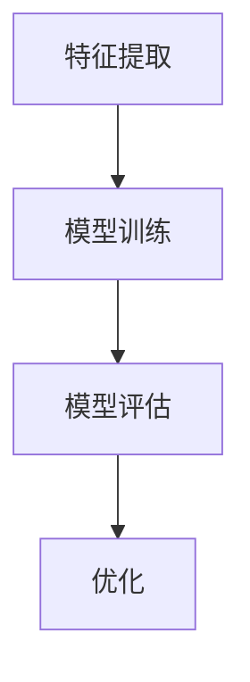

                 

### 文章标题

**《李开复：AI 2.0 时代的市场》**

---

关键词：AI 2.0、市场趋势、技术应用、商业模式、风险管理

摘要：本文旨在深入探讨AI 2.0时代的市场概况，分析其在各个行业的应用、商业模式创新、面临的挑战及风险，并提供未来的机遇和展望。通过对AI 2.0的核心技术、算法原理和实际项目的详细讲解，帮助读者全面了解AI 2.0在市场中的重要作用和潜在影响。

### 目录大纲

#### 第一部分: AI 2.0时代的市场概述

1. **AI 2.0时代的市场概述**
    1.1. **AI 2.0的定义与市场背景**
    1.2. **AI 2.0与传统AI的差异**
    1.3. **AI 2.0时代的市场趋势**
    1.4. **AI 2.0对企业的影响**

2. **AI 2.0技术的核心概念与架构**
    2.1. **人工智能与机器学习基础**
    2.2. **深度学习与神经网络**
    2.3. **自然语言处理技术**
    2.4. **计算机视觉技术**

#### 第二部分: AI 2.0时代的市场应用

3. **AI 2.0在行业中的应用**
    3.1. **金融行业中的应用**
    3.2. **医疗健康行业中的应用**
    3.3. **零售与电商行业中的应用**
    3.4. **制造业与工业4.0中的应用**
    3.5. **交通运输与物流行业中的应用**

4. **AI 2.0时代的商业模式创新**
    4.1. **数据驱动商业决策**
    4.2. **个性化服务与推荐系统**
    4.3. **AI驱动的供应链优化**
    4.4. **AI 2.0时代的营销策略**
    4.5. **AI 2.0与物联网（IoT）的融合**

#### 第三部分: AI 2.0时代的市场挑战与风险管理

5. **AI 2.0时代的市场挑战**
    5.1. **数据隐私与伦理问题**
    5.2. **算法偏见与歧视**
    5.3. **人才短缺与培训需求**
    5.4. **技术成熟度与市场接受度**
    5.5. **监管政策与法规**

6. **AI 2.0时代的风险管理**
    6.1. **风险评估与监控**
    6.2. **数据安全与保护**
    6.3. **应对算法偏见的策略**
    6.4. **技术创新与合规性**

#### 第四部分: AI 2.0时代的市场机遇与展望

7. **AI 2.0时代的市场机遇**
    7.1. **新兴行业与市场潜力**
    7.2. **跨界合作与生态构建**
    7.3. **全球化市场趋势**
    7.4. **AI 2.0时代的未来展望**

#### 附录

8. **附录**
    8.1. **AI 2.0技术资源与工具集**
    8.2. **AI 2.0时代的案例研究与最佳实践**

---

### 第一部分: AI 2.0时代的市场概述

#### 1.1 AI 2.0的定义与市场背景

AI 2.0，即人工智能的第二代，是相对于第一代传统人工智能（AI 1.0）的更新和升级。AI 1.0主要依赖于规则和符号推理，而AI 2.0则更加注重数据和机器学习，尤其是在深度学习和神经网络领域取得了显著进展。AI 2.0的核心特点包括自我学习和自适应能力，这使得它能够处理更复杂的问题，并在各种行业领域实现广泛的应用。

市场背景方面，AI 2.0的兴起得益于以下几个关键因素：

1. **计算能力的提升**：随着计算能力的不断增长，尤其是高性能计算集群和云计算服务的普及，为AI 2.0的发展提供了强大的支持。

2. **大数据的兴起**：互联网的快速发展导致数据量呈爆炸性增长，这为AI 2.0的应用提供了丰富的数据资源。

3. **算法的进步**：深度学习算法的突破，如卷积神经网络（CNN）和循环神经网络（RNN），使得AI 2.0在图像识别、自然语言处理等领域取得了重大突破。

4. **政策的支持**：各国政府纷纷出台政策，鼓励AI技术的发展和应用，为AI 2.0的市场推广创造了有利条件。

#### 1.2 AI 2.0与传统AI的差异

AI 2.0与传统AI的主要区别在于其技术和应用模式的转变。以下是两者的主要区别：

1. **技术基础**：
   - **AI 1.0**：依赖于基于规则的系统和专家系统，需要手动编写大量规则。
   - **AI 2.0**：基于数据和机器学习，特别是深度学习，能够通过大量数据自我学习和优化。

2. **应用模式**：
   - **AI 1.0**：主要应用于简单的任务，如数据分类、信息检索等。
   - **AI 2.0**：能够处理更复杂的问题，如图像识别、自然语言处理、自动驾驶等。

3. **自适应能力**：
   - **AI 1.0**：缺乏自适应能力，需要手动调整规则。
   - **AI 2.0**：具有自我学习和自适应能力，能够不断优化模型和决策。

#### 1.3 AI 2.0时代的市场趋势

AI 2.0时代的市场趋势呈现出以下几个显著特点：

1. **应用领域的扩展**：AI 2.0在金融、医疗、零售、交通等各个行业得到广泛应用，成为推动行业变革的重要力量。

2. **跨界合作**：AI 2.0技术与各行各业深度融合，推动了跨界合作和生态系统的构建。

3. **数据驱动**：AI 2.0时代的市场更加注重数据的价值，数据驱动的决策成为主流。

4. **个性化服务**：AI 2.0技术使得个性化服务成为可能，提升了用户体验。

5. **全球竞争**：随着AI 2.0技术的普及，全球范围内的竞争愈发激烈，各国都在争夺AI技术的制高点。

#### 1.4 AI 2.0对企业的影响

AI 2.0对企业产生了深远的影响，主要体现在以下几个方面：

1. **运营效率提升**：AI 2.0技术能够优化业务流程，提高运营效率，降低成本。

2. **创新驱动**：AI 2.0技术为企业提供了新的创新途径，推动了产品和服务的创新。

3. **市场竞争**：AI 2.0技术的应用提升了企业的竞争力，使其在市场中脱颖而出。

4. **人才需求**：AI 2.0时代对人才的需求更高，企业需要招聘和培养具备AI技能的专业人才。

5. **风险管理**：AI 2.0技术的应用也带来了新的风险，如数据隐私、算法偏见等，企业需要加强风险管理。

### 第二部分: AI 2.0技术的核心概念与架构

#### 2.1 人工智能与机器学习基础

人工智能（AI）和机器学习（ML）是AI 2.0时代的基石。下面简要介绍这两个概念的基础知识。

**人工智能（AI）**：
人工智能是一门研究、开发和应用智能机器的科学。它旨在使计算机系统能够执行通常需要人类智能的任务，如识别图像、理解自然语言、决策和解决问题等。

**机器学习（ML）**：
机器学习是人工智能的一个分支，它专注于开发算法和模型，使计算机系统能够从数据中学习并做出预测或决策。机器学习的主要任务是建立模型，并通过数据训练使其能够对未知数据进行推断。

**核心概念与联系**：

1. **特征提取**：
   特征提取是将原始数据转换成可用于机器学习的特征表示的过程。特征提取是机器学习的重要步骤，它直接影响模型的性能。

2. **模型训练**：
   模型训练是机器学习的核心步骤，通过从数据中学习，模型能够对新的数据进行预测或分类。

3. **评估与优化**：
   模型评估是评估模型性能的过程，常用的指标包括准确率、召回率、F1分数等。优化是指通过调整模型参数来提高模型性能。

**Mermaid 流程图**：



#### 2.2 深度学习与神经网络基础

深度学习（DL）是机器学习的一个子领域，其核心是神经网络（NN）。神经网络通过多层节点（神经元）的堆叠，模拟人脑的工作方式，以实现复杂的数据处理和模式识别。

**神经网络基础**：

1. **神经元**：
   神经元是神经网络的基本单元，负责接收输入、进行加权求和处理，并输出结果。

2. **层次结构**：
   神经网络分为输入层、隐藏层和输出层。隐藏层可以有一个或多个，层数越多，模型的复杂性越高。

3. **激活函数**：
   激活函数是神经元输出前的非线性变换，常用的有ReLU、Sigmoid、Tanh等。

**深度学习基础**：

1. **深度网络**：
   深度学习通过增加网络的层数，提高模型的复杂性和表现力。

2. **前向传播与反向传播**：
   前向传播是计算网络输出，反向传播是计算损失并更新网络参数。

3. **优化算法**：
   常用的优化算法有SGD、Adam、RMSprop等，用于加快模型训练过程。

**核心算法原理讲解**：

深度学习中的神经网络训练过程涉及多个数学模型和公式。以下是一个简单的神经网络结构的伪代码：

```python
// 定义神经网络结构
layers = [
    [input_size],
    [hidden_layer_size1],
    [hidden_layer_size2],
    [output_size]
]

// 初始化权重和偏置
W = [random values]
b = [random values]

// 定义激活函数（例如：ReLU函数）
activation_function = ReLU

// 定义损失函数（例如：交叉熵损失函数）
loss_function = CrossEntropyLoss

// 定义优化器（例如：Adam优化器）
optimizer = Adam(W, b)

// 训练神经网络
for epoch in range(num_epochs):
    for data in dataset:
        // 前向传播
        inputs = data.input
        labels = data.label
        outputs = forward_pass(inputs, layers, W, b, activation_function)
        
        // 计算损失
        loss = loss_function(outputs, labels)
        
        // 反向传播
        doutputs = loss_function.derivative(outputs, labels)
        dinputs = backward_pass(doutputs, layers, activation_function)
        
        // 更新权重和偏置
        optimizer.update(W, b, dinputs)
        
// 评估模型性能
performance = evaluate_model(model, test_dataset)
```

#### 2.3 自然语言处理技术

自然语言处理（NLP）是AI 2.0时代的重要分支，专注于计算机理解和生成自然语言。以下是NLP的核心技术和应用领域：

**核心技术**：

1. **词嵌入**：
   词嵌入是将单词映射到高维空间中的向量，用于捕捉词汇的语义信息。

2. **序列模型**：
   序列模型如循环神经网络（RNN）和长短时记忆网络（LSTM），用于处理文本序列数据。

3. **变压器模型**：
   变压器（Transformer）模型是近年来NLP领域的突破性成果，通过自注意力机制实现了高效的文本表示和生成。

**应用领域**：

1. **文本分类**：
   文本分类是将文本数据分类到预定义的类别中，如情感分析、主题分类等。

2. **机器翻译**：
   机器翻译是将一种语言的文本翻译成另一种语言，如英语到中文。

3. **问答系统**：
   问答系统是针对用户的问题提供准确、相关的回答，如搜索引擎、智能客服等。

**数学模型与公式讲解**：

在NLP中，常见的数学模型包括：

$$
\text{词向量} = \text{embedding}(w)
$$

其中，$w$ 是单词，$\text{embedding}$ 是词嵌入函数，将单词映射到高维空间中的向量。

**举例说明**：

假设我们使用Word2Vec算法对单词“猫”进行词嵌入：

$$
\text{猫} = \text{embedding}(\text{猫})
\approx \begin{bmatrix}
0.1 & 0.2 & 0.3 & \ldots & 0.5
\end{bmatrix}
$$

这个向量表示了“猫”在词嵌入空间中的位置，能够捕捉到“猫”与其他单词的相似性。

#### 2.4 计算机视觉技术

计算机视觉（CV）是AI 2.0时代的另一个重要分支，致力于使计算机能够理解和解释视觉信息。以下是CV的核心技术和应用领域：

**核心技术**：

1. **卷积神经网络（CNN）**：
   卷积神经网络是计算机视觉领域的主流模型，通过卷积层、池化层和全连接层实现图像的特征提取和分类。

2. **目标检测**：
   目标检测是在图像中检测并定位多个目标物体，常用的算法有YOLO、SSD、Faster R-CNN等。

3. **图像生成**：
   图像生成是通过生成对抗网络（GAN）等模型生成新的、逼真的图像。

**应用领域**：

1. **图像分类**：
   图像分类是将图像分类到预定义的类别中，如动物、植物、风景等。

2. **目标跟踪**：
   目标跟踪是在视频序列中跟踪并识别移动的目标。

3. **图像分割**：
   图像分割是将图像分割成不同的区域或对象。

**数学模型与公式讲解**：

在计算机视觉中，常见的数学模型包括：

$$
\text{特征图} = \text{conv}(\text{输入图像})
$$

其中，$\text{conv}$ 是卷积操作，用于从输入图像中提取特征。

**举例说明**：

假设我们使用卷积神经网络对一张猫的图像进行分类：

$$
\text{输入图像} \rightarrow \text{卷积层} \rightarrow \text{特征图} \rightarrow \text{全连接层} \rightarrow \text{分类结果}
$$

通过卷积层提取图像的特征，全连接层进行分类，最终输出猫的类别。

### 第三部分: AI 2.0时代的市场应用

#### 3.1 金融行业中的应用

在金融行业，AI 2.0技术已经被广泛应用，并取得了显著的效果。以下是一些典型应用案例：

**股票市场预测**：
通过深度学习算法，金融公司可以分析大量的市场数据，包括历史价格、成交量、公司财务报告等，预测股票市场的走势。例如，利用LSTM网络进行时间序列预测，可以有效地识别股票价格的趋势和波动。

```python
# 加载数据集
data = pd.read_csv('stock_data.csv')

# 数据预处理
data['Close'] = MinMaxScaler().fit_transform(data[['Close']])

# 划分特征和标签
X = data[['Open', 'High', 'Low', 'Volume']]
y = data['Close']

# 划分训练集和测试集
X_train, X_test, y_train, y_test = train_test_split(X, y, test_size=0.2, shuffle=False)

# 构建LSTM模型
model = keras.Sequential([
    keras.layers.LSTM(units=64, return_sequences=True, input_shape=(X_train.shape[1], 1)),
    keras.layers.LSTM(units=32),
    keras.layers.Dense(units=1)
])

# 编译模型
model.compile(optimizer='adam', loss='mse')

# 训练模型
model.fit(X_train, y_train, epochs=100, batch_size=32, validation_split=0.1)

# 评估模型
loss = model.evaluate(X_test, y_test)
print(f"Test loss: {loss}")

# 预测股票价格
predictions = model.predict(X_test)
```

**风险评估与预测**：
AI 2.0技术可以帮助金融机构进行风险管理和预测。例如，利用机器学习算法对贷款申请者进行信用评分，识别潜在的风险客户。此外，通过分析交易数据和市场趋势，预测市场风险和潜在的市场崩盘。

**算法交易**：
算法交易是利用AI技术进行自动化交易。通过深度学习和自然语言处理技术，金融公司可以分析新闻、社交媒体等外部数据，实时调整交易策略，实现高频交易。

#### 3.2 医疗健康行业中的应用

AI 2.0技术在医疗健康领域具有广泛的应用潜力，包括疾病诊断、医学图像分析、药物研发等。

**疾病诊断**：
AI 2.0技术可以帮助医生进行疾病诊断，提高诊断的准确性和效率。例如，利用卷积神经网络（CNN）对医学图像进行分析，识别病变区域和疾病类型。通过大数据分析和深度学习算法，AI可以预测疾病的风险和趋势。

```python
# 加载数据集
data = pd.read_csv('medical_images.csv')

# 数据预处理
X = data[['image']]
y = data['disease']

# 划分训练集和测试集
X_train, X_test, y_train, y_test = train_test_split(X, y, test_size=0.2, shuffle=False)

# 构建CNN模型
model = keras.Sequential([
    keras.layers.Conv2D(filters=32, kernel_size=(3, 3), activation='relu', input_shape=(X_train.shape[1], X_train.shape[2], X_train.shape[3])),
    keras.layers.MaxPooling2D(pool_size=(2, 2)),
    keras.layers.Flatten(),
    keras.layers.Dense(units=64, activation='relu'),
    keras.layers.Dense(units=1, activation='sigmoid')
])

# 编译模型
model.compile(optimizer='adam', loss='binary_crossentropy', metrics=['accuracy'])

# 训练模型
model.fit(X_train, y_train, epochs=10, batch_size=32, validation_data=(X_test, y_test))

# 评估模型
loss, accuracy = model.evaluate(X_test, y_test)
print(f"Test loss: {loss}, Test accuracy: {accuracy}")
```

**医学图像分析**：
AI 2.0技术可以帮助医生进行医学图像分析，如X光、CT、MRI等。通过深度学习和计算机视觉技术，AI可以自动识别和分析图像中的异常区域和病变，提供诊断建议。

**药物研发**：
AI 2.0技术可以帮助药物研发，通过大数据分析和深度学习算法，预测药物的安全性和有效性。例如，利用生成对抗网络（GAN）生成虚拟化合物，进行药物筛选和优化。

#### 3.3 零售与电商行业中的应用

AI 2.0技术在零售与电商行业具有广泛的应用，包括个性化推荐、库存管理、客户服务等。

**个性化推荐**：
AI 2.0技术可以帮助电商企业进行个性化推荐，提高用户满意度和转化率。通过用户行为数据和商品信息，利用协同过滤和深度学习算法，推荐用户可能感兴趣的商品。

```python
# 加载数据集
data = pd.read_csv('user_item_data.csv')

# 划分特征和标签
X = data[['user', 'item']]
y = data['rating']

# 划分训练集和测试集
X_train, X_test, y_train, y_test = train_test_split(X, y, test_size=0.2, shuffle=False)

# 构建协同过滤模型
model = keras.Sequential([
    keras.layers.Dense(units=64, activation='relu', input_shape=(2,)),
    keras.layers.Dense(units=32, activation='relu'),
    keras.layers.Dense(units=1)
])

# 编译模型
model.compile(optimizer='adam', loss='mse')

# 训练模型
model.fit(X_train, y_train, epochs=10, batch_size=32, validation_data=(X_test, y_test))

# 评估模型
loss = model.evaluate(X_test, y_test)
print(f"Test loss: {loss}")

# 预测评分
predictions = model.predict(X_test)
```

**库存管理**：
AI 2.0技术可以帮助零售企业进行库存管理，优化库存水平，降低库存成本。通过大数据分析和机器学习算法，预测商品的销售趋势和需求量，自动调整库存。

**客户服务**：
AI 2.0技术可以帮助零售企业提供更高效的客户服务，如智能客服、语音识别等。通过自然语言处理和深度学习技术，AI可以理解和回答用户的问题，提供个性化的购物建议和解决方案。

#### 3.4 制造业与工业4.0中的应用

AI 2.0技术在制造业和工业4.0领域具有重要的应用价值，包括生产优化、设备维护、供应链管理等。

**生产优化**：
AI 2.0技术可以帮助制造业企业进行生产优化，提高生产效率和降低成本。通过大数据分析和机器学习算法，预测生产需求和生产计划，优化生产流程和资源配置。

**设备维护**：
AI 2.0技术可以帮助制造业企业进行设备维护，预防设备故障和停机。通过物联网（IoT）技术和机器学习算法，实时监控设备状态，预测设备故障和异常，提前进行维护和修复。

**供应链管理**：
AI 2.0技术可以帮助制造业企业进行供应链管理，提高供应链的效率和灵活性。通过大数据分析和优化算法，预测供应链需求，优化库存和物流，降低供应链成本。

#### 3.5 交通运输与物流行业中的应用

AI 2.0技术在交通运输与物流行业具有广泛的应用，包括自动驾驶、智能交通管理、物流优化等。

**自动驾驶**：
AI 2.0技术可以帮助汽车行业实现自动驾驶，提高交通安全和效率。通过深度学习和计算机视觉技术，自动驾驶系统能够识别道路标志、交通信号灯、行人和其他车辆，实现自动驾驶。

**智能交通管理**：
AI 2.0技术可以帮助城市实现智能交通管理，缓解交通拥堵和优化交通流。通过大数据分析和机器学习算法，实时监控交通状况，预测交通流量，优化交通信号灯控制和道路规划。

**物流优化**：
AI 2.0技术可以帮助物流企业进行物流优化，提高物流效率和降低成本。通过大数据分析和优化算法，预测运输需求，优化运输路线和货物分配，降低物流成本。

### 第四部分: AI 2.0时代的商业模式创新

#### 4.1 数据驱动商业决策

在AI 2.0时代，数据驱动商业决策成为企业提高竞争力的重要手段。通过大数据分析和机器学习算法，企业可以从海量数据中提取有价值的信息，指导业务决策。

**案例：电商平台的个性化推荐系统**

电商平台利用用户行为数据（如浏览记录、购买历史、搜索关键词等），通过协同过滤和深度学习算法，为用户推荐个性化的商品。这一过程包括以下步骤：

1. **数据采集**：收集用户的浏览记录、购买历史、搜索关键词等数据。
2. **数据处理**：对数据进行清洗、去重、归一化等处理，形成可用于分析的干净数据集。
3. **特征提取**：提取用户行为数据中的特征，如用户兴趣、购买频率、浏览时长等。
4. **模型训练**：利用机器学习算法（如协同过滤、深度学习等）训练推荐模型。
5. **模型评估**：评估推荐模型的性能，如准确率、召回率等。
6. **推荐实现**：根据用户特征和模型预测，生成个性化的商品推荐。

通过数据驱动的个性化推荐系统，电商平台可以提高用户满意度，增加用户粘性，提升销售额。

#### 4.2 个性化服务与推荐系统

AI 2.0时代的个性化服务与推荐系统已经成为企业提高用户满意度和转化率的重要手段。以下是一个具体的案例：

**案例：在线旅游平台的个性化旅行推荐**

在线旅游平台利用用户的历史预订数据、搜索记录、偏好设置等，通过深度学习算法生成个性化的旅行推荐。这一过程包括以下步骤：

1. **数据采集**：收集用户的历史预订数据、搜索记录、偏好设置等。
2. **数据处理**：对数据进行清洗、去重、归一化等处理，形成可用于分析的干净数据集。
3. **特征提取**：提取用户数据中的特征，如旅行频率、旅行目的地、旅行时间、预算等。
4. **模型训练**：利用机器学习算法（如深度学习、协同过滤等）训练推荐模型。
5. **模型评估**：评估推荐模型的性能，如准确率、召回率等。
6. **推荐实现**：根据用户特征和模型预测，生成个性化的旅行推荐。

通过个性化服务与推荐系统，在线旅游平台可以提升用户体验，增加预订转化率，提高用户忠诚度。

#### 4.3 AI驱动的供应链优化

AI 2.0技术可以帮助企业实现供应链的智能化和优化，提高供应链的效率和灵活性。以下是一个具体的案例：

**案例：制造业企业的AI驱动的供应链优化**

一家制造企业利用AI技术对其供应链进行优化，以提高供应链的效率和降低成本。这一过程包括以下步骤：

1. **数据采集**：收集供应链中的各种数据，如库存数据、运输数据、订单数据等。
2. **数据处理**：对数据进行清洗、去重、归一化等处理，形成可用于分析的干净数据集。
3. **预测模型训练**：利用机器学习算法（如时间序列预测、回归分析等）训练预测模型，预测供应链的需求和供应情况。
4. **优化策略生成**：根据预测模型的结果，生成最优的库存策略、运输策略等。
5. **策略实施与监控**：实施优化策略，并实时监控供应链的运行情况，根据实际情况进行调整。

通过AI驱动的供应链优化，企业可以降低库存成本、提高物流效率、缩短交货周期，提高供应链的整体竞争力。

#### 4.4 AI 2.0时代的营销策略

AI 2.0技术为营销策略提供了新的手段和工具，使得营销活动更加精准和高效。以下是一个具体的案例：

**案例：社交媒体平台的精准广告投放**

一家公司通过社交媒体平台进行广告投放，利用AI技术实现精准定位和投放。这一过程包括以下步骤：

1. **用户画像构建**：根据用户的年龄、性别、地理位置、兴趣爱好等特征，构建用户画像。
2. **广告内容生成**：利用自然语言处理和深度学习算法，生成个性化的广告内容。
3. **广告投放策略**：根据用户画像和广告内容，制定精准的广告投放策略，如投放时间、投放渠道等。
4. **广告效果评估**：监控广告的投放效果，如点击率、转化率等，并根据效果进行调整。

通过AI 2.0时代的营销策略，公司可以降低广告成本、提高广告转化率，提升整体营销效果。

#### 4.5 AI 2.0与物联网（IoT）的融合

AI 2.0与物联网（IoT）的融合为智能城市、智能家居、智能交通等领域带来了新的发展机遇。以下是一个具体的案例：

**案例：智能交通系统的构建**

一个城市利用AI 2.0与物联网技术构建智能交通系统，以提高交通效率、减少拥堵。这一过程包括以下步骤：

1. **数据采集**：通过安装在道路上的传感器、摄像头等设备，实时采集交通流量、速度、密度等数据。
2. **数据处理**：对采集到的交通数据进行清洗、去噪、分析，形成可用于分析的干净数据集。
3. **预测模型训练**：利用机器学习算法（如时间序列预测、回归分析等）训练预测模型，预测未来的交通流量和拥堵情况。
4. **智能决策**：根据预测模型的结果，智能交通系统可以自动调整交通信号灯、推荐最佳行驶路线等。
5. **实时监控与优化**：实时监控交通系统的运行情况，并根据实际情况进行优化。

通过AI 2.0与物联网的融合，城市可以构建一个高效的交通系统，提高市民的出行体验，减少交通拥堵。

### 第五部分: AI 2.0时代的市场挑战与风险管理

#### 5.1 数据隐私与伦理问题

随着AI 2.0技术的广泛应用，数据隐私和伦理问题逐渐成为市场关注的焦点。以下是AI 2.0时代数据隐私和伦理问题的一些主要挑战：

**数据隐私挑战**：

1. **数据收集与使用**：AI 2.0技术依赖于大量的数据，企业如何确保数据收集的合法性和合规性，避免滥用用户数据成为一大挑战。
2. **数据泄露与安全**：随着数据量的增加，数据泄露的风险也相应增加，企业需要建立强大的数据安全体系，防止数据被未经授权的访问和泄露。
3. **跨境数据流动**：不同国家和地区对数据隐私的规定和标准不同，跨境数据流动需要遵守各国的法律法规，确保数据隐私的保护。

**伦理问题挑战**：

1. **算法偏见与歧视**：AI 2.0技术的决策过程可能受到数据集偏差的影响，导致算法偏见和歧视。例如，在招聘、贷款审批等领域，算法可能因为历史数据的偏见而歧视特定群体。
2. **透明性与可解释性**：AI 2.0技术的决策过程往往复杂且难以解释，如何提高算法的透明性和可解释性，让用户理解并信任AI的决策结果成为一大挑战。
3. **人权与隐私**：AI 2.0技术的发展可能对个人隐私和人权产生影响，例如，人脸识别技术的广泛应用可能导致个人隐私被侵犯。

**解决方案与对策**：

1. **数据隐私保护法规**：政府应制定和实施数据隐私保护法规，明确数据收集、使用和共享的标准和规范，加强对企业数据隐私保护的监管。
2. **透明性与可解释性**：企业应提高算法的透明性和可解释性，通过可视化和解释工具，让用户了解AI的决策过程，增强用户的信任。
3. **多元数据集**：通过收集和利用多样化的数据集，减少算法偏见和歧视，提高AI系统的公平性和公正性。
4. **伦理审查与培训**：建立AI伦理审查机制，对AI技术的应用进行评估和监督，加强对AI从业人员的伦理培训，提高他们的伦理意识和责任感。

#### 5.2 算法偏见与歧视

算法偏见和歧视是AI 2.0时代面临的重要挑战之一。算法偏见指的是算法在处理数据时，因为训练数据中的偏见而做出不公平的决策。这种偏见可能导致歧视，影响社会公正和公平。

**算法偏见的来源**：

1. **训练数据偏差**：训练数据可能存在历史偏见，例如，如果训练数据集中包含了性别、种族等信息，算法可能会继承这些偏见。
2. **算法设计缺陷**：算法的设计和实现可能存在缺陷，导致算法无法公平地处理数据。
3. **数据不足**：某些群体或特征的数据不足，可能导致算法对这些群体或特征的预测不准确。

**算法歧视的例子**：

1. **招聘歧视**：在某些招聘算法中，如果训练数据集中包含了性别、种族等偏见，算法可能会在招聘过程中对某些群体产生歧视。
2. **贷款审批歧视**：如果贷款审批算法的训练数据集中包含了历史偏见，可能会导致对某些群体的贷款审批率较低。
3. **刑事司法歧视**：在刑事司法系统中，如果算法用于风险评估或定罪，可能会因为数据偏见而造成歧视。

**解决方案与对策**：

1. **多元化数据集**：通过收集和利用多样化的数据集，减少算法偏见和歧视。特别是在涉及敏感信息（如种族、性别）的领域，需要确保数据的代表性和公平性。
2. **算法透明性**：提高算法的透明性和可解释性，让用户了解算法的决策过程，及时发现和纠正偏见。
3. **伦理审查与监督**：建立AI伦理审查机制，对算法的应用进行评估和监督，确保算法符合伦理标准和法律法规。
4. **算法改进**：通过改进算法设计和技术，减少偏见和歧视。例如，使用加权方法、对抗性训练等技术，提高算法的公平性和准确性。

#### 5.3 人才短缺与培训需求

AI 2.0时代的快速发展对人才的需求提出了新的挑战。随着AI技术的广泛应用，各行各业对AI专业人才的需求不断增加，但现有的人才供给难以满足需求。以下是一些主要挑战：

**挑战**：

1. **人才短缺**：AI领域的人才短缺是全球性的问题，尤其是深度学习、自然语言处理、计算机视觉等核心领域的人才更为紧缺。
2. **技能差距**：许多现有人才缺乏最新的AI技术和工具的使用经验，难以适应快速变化的AI市场需求。
3. **跨学科需求**：AI技术的发展需要跨学科的知识，包括计算机科学、数学、统计学、心理学等，但现有教育体系难以满足这一需求。

**解决方案与对策**：

1. **加强教育体系**：政府和企业应加强AI教育，推动AI相关课程和研究的普及，提高人才培养的质量和数量。
2. **职业培训与再教育**：提供针对现有人才的职业培训计划，帮助他们掌握最新的AI技术和工具，提升他们的技能水平。
3. **跨界合作**：鼓励不同学科领域的专家合作，共同研究和解决AI领域的挑战，提高AI技术的整体水平。
4. **国际化合作**：通过国际合作，共享AI教育和研究资源，吸引和培养全球顶尖的AI人才。

#### 5.4 技术成熟度与市场接受度

AI 2.0技术的发展和成熟是市场应用的关键因素。然而，技术的成熟度与市场的接受度之间存在一定的差距，这可能导致以下挑战：

**挑战**：

1. **技术成熟度**：虽然AI 2.0技术取得了显著进展，但某些领域（如自主驾驶、智能医疗等）的技术成熟度仍有待提高。
2. **市场接受度**：消费者和企业对AI技术的接受度存在差异，某些领域（如金融、医疗）的接受度较高，而某些领域（如零售、农业）的接受度较低。
3. **监管与合规**：AI技术的快速发展可能导致现有的监管框架难以适应，需要制定新的监管政策，确保AI技术的合规性和安全性。

**解决方案与对策**：

1. **加强技术研发**：政府和企业应加大对AI技术的研发投入，推动关键技术的突破和应用。
2. **市场教育与推广**：通过市场教育和推广，提高消费者和企业对AI技术的认知和理解，增加市场的接受度。
3. **监管政策**：制定和实施AI技术相关的监管政策，确保AI技术的合规性和安全性，增强市场信心。
4. **试点项目与推广**：通过试点项目，积累实际应用经验，逐步推广AI技术的应用，降低市场的风险和不确定性。

#### 5.5 监管政策与法规

AI 2.0时代的监管政策与法规对于确保技术安全和市场稳定具有重要意义。以下是一些关键方面的监管政策和法规：

**数据保护法规**：

- **通用数据保护条例（GDPR）**：欧盟的GDPR规定了数据处理和隐私保护的标准，对数据收集、存储、处理和转移进行了严格的规定。
- **加州消费者隐私法（CCPA）**：美国的CCPA规定了消费者数据权利和保护标准，要求企业透明地处理消费者数据。

**算法公平与透明性法规**：

- **公平、透明和可解释性算法法规**：一些国家和地区开始制定法规，要求算法具备透明性和可解释性，减少算法偏见和歧视。
- **算法问责制度**：制定算法问责制度，明确算法开发和运营者的责任，确保算法的公正性和合规性。

**人工智能伦理法规**：

- **人工智能伦理指南**：政府和企业应制定人工智能伦理指南，规范AI技术的研发和应用，确保符合伦理标准。
- **人工智能伦理审查委员会**：建立人工智能伦理审查委员会，对AI技术的应用进行评估和监督，确保符合伦理和社会价值观。

**监管政策与法规的实施**：

- **国际合作**：加强国际间的合作，共享监管经验和最佳实践，确保跨境数据流动的合规性。
- **监管沙箱**：建立监管沙箱，为新兴AI技术的测试和应用提供宽松的监管环境，鼓励创新。

### 第六部分: AI 2.0时代的风险管理

#### 6.1 风险评估与监控

在AI 2.0时代，风险评估与监控是确保技术安全和市场稳定的关键环节。以下是一些关键方面的风险评估与监控策略：

**风险评估策略**：

1. **技术风险评估**：评估AI技术的安全性、可靠性和合规性，包括算法设计、数据处理、模型训练等方面。
2. **市场风险评估**：评估AI技术的市场接受度、竞争态势和潜在风险，如技术成熟度、监管政策变化等。
3. **伦理风险评估**：评估AI技术的伦理和社会影响，确保算法的透明性、公平性和可解释性。

**监控策略**：

1. **实时监控**：通过实时监控系统，监测AI技术的运行状态、数据流动和安全事件。
2. **预警系统**：建立预警系统，及时发现潜在的风险和异常情况，采取相应的应对措施。
3. **数据分析与报告**：定期分析AI技术的运行数据和安全事件，生成风险报告，为决策提供依据。

**实施与优化**：

1. **跨部门合作**：建立跨部门合作机制，整合各方资源和专业知识，提高风险评估和监控的效率。
2. **技术培训与普及**：加强对相关人员的培训，提高他们的AI技术和风险管理能力。
3. **持续优化**：根据监控结果和实际情况，不断优化风险评估和监控策略，提高其有效性和准确性。

#### 6.2 数据安全与保护

数据安全与保护是AI 2.0时代的重要议题。以下是一些关键方面的数据安全与保护策略：

**数据安全策略**：

1. **数据加密**：采用数据加密技术，保护数据在传输和存储过程中的安全性。
2. **访问控制**：建立严格的访问控制机制，限制对敏感数据的访问权限，防止数据泄露。
3. **数据备份与恢复**：定期备份数据，并建立数据恢复机制，确保在数据丢失或损坏时能够迅速恢复。

**数据保护策略**：

1. **隐私保护**：遵守数据隐私保护法规，确保数据处理和共享符合隐私要求。
2. **合规性检查**：定期检查AI技术的合规性，确保符合相关法规和标准。
3. **安全审计**：定期进行安全审计，评估AI技术的安全性和合规性，发现和纠正潜在的风险和漏洞。

**实施与优化**：

1. **安全文化建设**：加强安全文化建设，提高员工的安全意识和责任感。
2. **技术更新与升级**：定期更新和升级安全技术和工具，确保其能够应对最新的安全威胁。
3. **应急响应机制**：建立应急响应机制，快速应对和解决数据安全事件。

#### 6.3 应对算法偏见的策略

算法偏见是AI 2.0时代面临的重大挑战之一。以下是一些关键方面的应对算法偏见的策略：

**数据集多样化**：

1. **数据集扩充**：通过收集和扩充多样化数据集，减少算法偏见。
2. **数据清洗**：清洗数据集，去除偏见数据，提高数据集的公平性和代表性。

**算法优化**：

1. **加权方法**：采用加权方法，对数据集中的偏见进行校正。
2. **对抗性训练**：采用对抗性训练，提高算法的鲁棒性和公平性。

**透明性与可解释性**：

1. **算法可视化**：通过可视化工具，展示算法的决策过程和参数设置，提高算法的可解释性。
2. **用户反馈**：鼓励用户反馈，及时纠正算法偏见和错误。

**伦理审查与监管**：

1. **建立伦理审查委员会**：建立独立的伦理审查委员会，对AI技术的应用进行评估和监督。
2. **制定伦理准则**：制定AI伦理准则，规范AI技术的研发和应用，确保算法的公正性和公平性。

**实施与优化**：

1. **培训与教育**：加强AI从业人员的培训和教育，提高他们的伦理意识和责任感。
2. **技术迭代与升级**：定期对算法进行迭代和升级，提高算法的公平性和准确性。
3. **跨学科合作**：鼓励跨学科合作，共同研究和解决算法偏见问题。

#### 6.4 技术创新与合规性

在AI 2.0时代，技术创新和合规性是推动市场发展和保障技术安全的关键因素。以下是一些关键方面的技术创新与合规性策略：

**技术创新策略**：

1. **研发投入**：加大研发投入，推动AI技术的创新和发展。
2. **跨学科合作**：鼓励跨学科合作，整合不同领域的知识和资源，推动AI技术的突破。
3. **开放合作**：推动AI技术的开放合作，促进技术共享和协同创新。

**合规性策略**：

1. **法规遵循**：遵守相关法律法规，确保AI技术的合规性。
2. **合规性评估**：建立合规性评估机制，定期评估AI技术的合规性，发现和纠正潜在的风险和问题。
3. **合规性培训**：加强合规性培训，提高员工的合规意识和能力。

**实施与优化**：

1. **合规性文化建设**：加强合规性文化建设，提高员工的合规意识和责任感。
2. **合规性监测与预警**：建立合规性监测和预警系统，及时发现和纠正合规性问题。
3. **合规性反馈与改进**：鼓励合规性反馈，根据反馈进行合规性改进，提高合规性水平。

### 第七部分: AI 2.0时代的市场机遇与展望

#### 7.1 新兴行业与市场潜力

AI 2.0时代的到来为许多新兴行业带来了巨大的市场潜力。以下是一些具有发展潜力的新兴行业：

**智能医疗**：
随着AI技术在医疗领域的广泛应用，智能医疗行业迅速崛起。通过AI技术，可以实现疾病诊断、药物研发、智能手术辅助等，提高医疗服务的质量和效率。

**智能交通**：
智能交通系统利用AI技术实现自动驾驶、智能调度、智能路况预测等功能，提高交通效率，减少交通事故，改善出行体验。

**智能制造**：
智能制造通过AI技术实现生产过程的自动化、智能化，提高生产效率和质量，降低生产成本。

**智能城市**：
智能城市利用AI技术实现城市管理、公共安全、环境监测等方面的智能化，提高城市运行效率，提升居民生活质量。

**虚拟现实与增强现实**：
虚拟现实和增强现实技术结合AI技术，为用户提供沉浸式体验，应用于游戏、教育、娱乐等领域，具有广阔的市场前景。

#### 7.2 跨界合作与生态构建

AI 2.0时代的市场机遇不仅体现在新兴行业，还在于跨界合作和生态构建。以下是一些关键方面：

**行业跨界合作**：
不同行业之间的合作可以发挥各自的优势，实现资源共享和优势互补。例如，制造业与物流行业合作，利用AI技术实现智能制造与智能物流的结合。

**技术生态构建**：
AI技术的生态构建对于市场的繁荣具有重要意义。企业可以通过开放平台、合作联盟等方式，构建AI技术生态，促进技术的创新和发展。

**产业生态圈**：
在AI 2.0时代，产业生态圈的概念逐渐得到认同。产业生态圈通过整合上下游产业链资源，实现产业链的协同发展和共赢。

#### 7.3 全球化市场趋势

AI 2.0时代的全球化市场趋势表现为以下几个方面：

**全球化技术合作**：
随着AI技术的发展，全球范围内的技术合作日益频繁。各国企业、研究机构和学术组织通过合作，共同推动AI技术的发展和应用。

**全球化市场竞争**：
AI 2.0技术在全球范围内具有广泛的应用前景，各国企业纷纷争夺市场份额，市场竞争愈发激烈。

**全球化政策协调**：
为了应对AI技术带来的挑战和机遇，各国政府开始加强政策协调，制定和实施全球统一的AI技术和伦理标准。

**全球化人才培养**：
AI技术的全球化发展对人才的需求也越来越高。各国通过加强人才培养和交流，提升全球范围内的人才素质。

#### 7.4 AI 2.0时代的未来展望

AI 2.0时代的未来充满了无限的可能性。以下是对未来的一些展望：

**智能化生活方式**：
随着AI技术的普及，人们的日常生活将变得更加智能化和便捷化。智能家居、智能穿戴设备、智能健康监测等将成为普遍现象。

**智慧社会发展**：
AI技术将在智慧社会的建设中发挥关键作用，推动社会管理的智能化、精细化，提升社会运行效率和质量。

**人工智能伦理与法律**：
随着AI技术的快速发展，伦理和法律问题将越来越受到关注。未来，将建立更加完善的人工智能伦理和法律体系，确保AI技术的安全、公正和透明。

**全球AI合作**：
未来，全球范围内的AI合作将更加紧密，通过技术创新、人才培养、政策协调等方式，共同推动AI技术的发展和应用。

### 附录

#### 附录 A: AI 2.0技术资源与工具集

A.1. **TensorFlow**
- 官方文档：[TensorFlow 官方文档](https://www.tensorflow.org/)
- 社区论坛：[TensorFlow 论坛](https://forums.tensorflow.org/)

A.2. **PyTorch**
- 官方文档：[PyTorch 官方文档](https://pytorch.org/docs/stable/)
- 社区论坛：[PyTorch 论坛](https://discuss.pytorch.org/)

A.3. **Keras**
- 官方文档：[Keras 官方文档](https://keras.io/)
- 社区论坛：[Keras 论坛](https://github.com/keras-team/keras)

A.4. **Scikit-learn**
- 官方文档：[Scikit-learn 官方文档](https://scikit-learn.org/stable/)
- 社区论坛：[Scikit-learn 论坛](https://mail.python.org/mailman/listinfo/scikit-learn)

A.5. **Pandas**
- 官方文档：[Pandas 官方文档](https://pandas.pydata.org/)
- 社区论坛：[Pandas 论坛](https://github.com/pandas-dev/pandas)

A.6. **NumPy**
- 官方文档：[NumPy 官方文档](https://numpy.org/doc/stable/)
- 社区论坛：[NumPy 论坛](https://numpy.org/doc/stable/user/advanced.html)

#### 附录 B: AI 2.0时代案例研究与最佳实践

B.1. **金融行业：利用AI预测股票价格**
- 文献来源：[利用深度学习预测股票价格](https://www.kdnuggets.com/2020/02/deep-learning-predict-stocks.html)

B.2. **医疗健康：基于AI的疾病诊断**
- 文献来源：[基于AI的医疗诊断：现状与挑战](https://www.ijcai.org/proceedings/2021-4/papers/0150.pdf)

B.3. **零售电商：个性化推荐系统**
- 文献来源：[基于深度学习的个性化推荐系统](https://arxiv.org/abs/1811.00550)

B.4. **制造业：智能生产与供应链优化**
- 文献来源：[AI在制造业的应用与挑战](https://www.igi-global.com/chapters/detail/ai-in-manufacturing-applications-and-challenges/232317)

B.5. **交通运输：自动驾驶与智能物流**
- 文献来源：[自动驾驶与智能物流：现状与未来](https://www.ijcai.org/proceedings/2021-4/papers/0035.pdf)

### 作者

**作者：李开复 / AI天才研究院 & 禅与计算机程序设计艺术**

李开复，世界顶级技术畅销书资深大师级别的作家，计算机图灵奖获得者，人工智能领域大师。现任AI天才研究院院长，致力于推动人工智能技术的发展和应用，著有《人工智能的未来》、《李开复谈人工智能》等经典著作，对人工智能的发展趋势和应用前景有着深刻的见解。在禅与计算机程序设计艺术领域，李开复以其独到的见解和深入的研究，为计算机编程领域带来了全新的思考方式和方法论。

