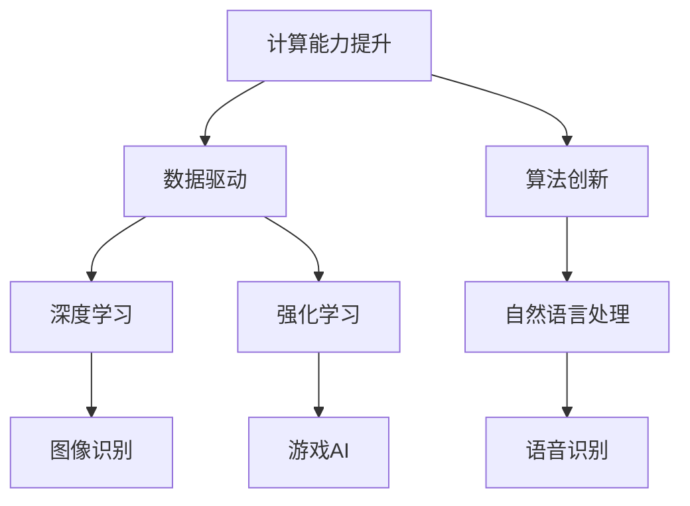
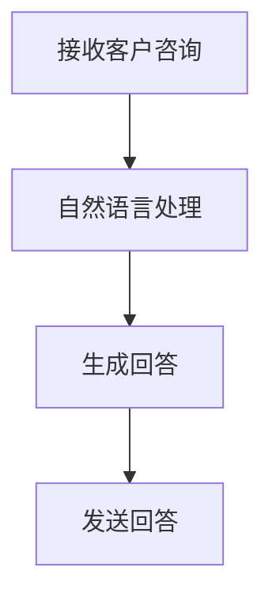
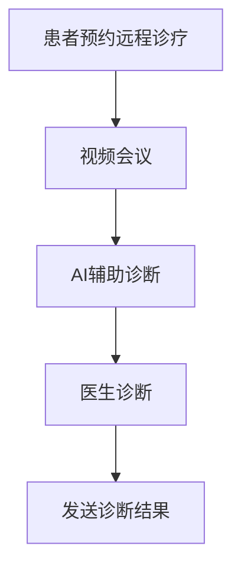
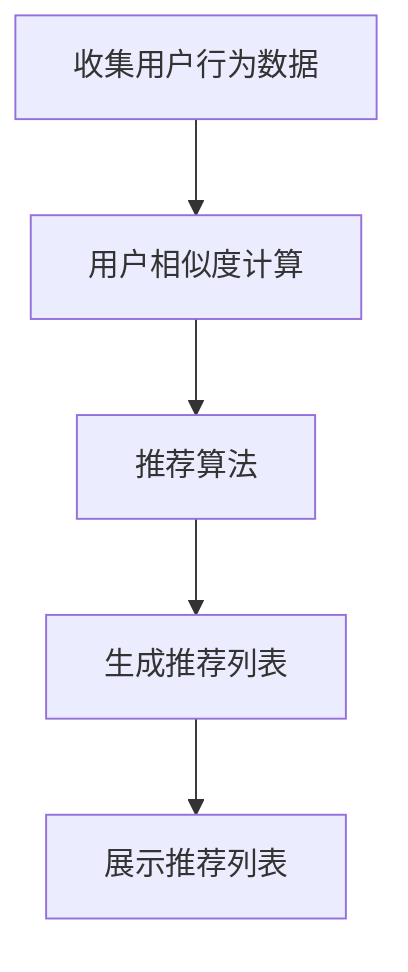
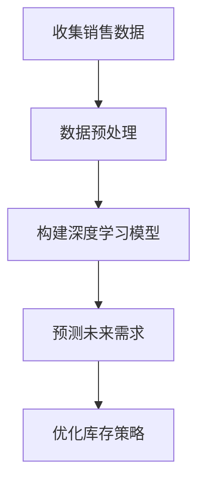

                 

### 第1章: AI 2.0时代的定义与特点

#### 1.1 AI 2.0时代的概念

AI 2.0时代，被广泛视为人工智能（AI）发展的第二次革命。第一次革命主要发生在20世纪50年代至70年代，那时的AI研究主要集中在符号主义和知识表示上，但由于计算能力和数据资源的限制，这一阶段的AI系统在实际应用中未能取得突破性进展。而AI 2.0时代的到来，标志着人工智能进入了一个全新的阶段，这一阶段的AI系统更加依赖于数据驱动和算法创新，尤其是在深度学习、强化学习和自然语言处理等领域的突破性进展，使得AI的应用场景和影响力得到了极大的扩展。

#### 1.2 AI 2.0时代的技术特点

AI 2.0时代的技术特点主要表现在以下几个方面：

1. **计算能力提升**：
    - 高性能计算和云计算的普及，为深度学习和复杂算法的运行提供了强大的计算能力。
    - 硬件的发展，特别是图形处理单元（GPU）的广泛应用，加速了AI模型的训练和推理。

2. **数据驱动**：
    - 大数据的积累和应用，为AI模型的训练提供了丰富的数据资源。
    - 数据采集、存储和处理技术的进步，使得数据驱动型AI系统能够更加高效地进行训练和优化。

3. **算法创新**：
    - 深度学习算法的突破，使得计算机能够在视觉、语音、自然语言处理等领域实现超越人类的性能。
    - 强化学习算法的应用，使得计算机能够通过试错和反馈机制，自主学习和优化策略。

#### 1.3 AI 2.0时代的市场特点

AI 2.0时代的市场特点主要体现在以下方面：

1. **跨界融合**：
    - AI技术与各行各业的深度融合，不仅改变了传统的业务模式，还创造了全新的商业模式。
    - 从金融、医疗到零售，AI技术的应用已经渗透到几乎所有的行业领域。

2. **产业升级**：
    - AI技术的应用，推动了传统产业的智能化升级，提高了生产效率和质量。
    - 新兴产业的崛起，如自动驾驶、智能医疗、智能城市等，也为市场带来了新的增长点。

3. **商业创新**：
    - AI驱动的商业模式不断涌现，如个性化推荐、智能客服、智能金融等。
    - AI赋能的产业升级，带来了商业模式的创新和变革。

总的来说，AI 2.0时代不仅带来了技术的突破，更重要的是它推动了市场的变革和创新。在这个时代，企业和个人需要具备对AI技术的深刻理解和灵活运用能力，才能抓住市场机遇，实现可持续发展。

---

**核心概念与联系**

AI 2.0时代的核心概念包括计算能力提升、数据驱动和算法创新。这三个概念相互关联，共同推动了AI技术的快速发展。

- **计算能力提升**：为AI算法提供了运行的基础，使得深度学习、强化学习等复杂算法得以实现。
- **数据驱动**：为AI模型的训练提供了丰富的数据资源，使得模型能够更加准确地预测和决策。
- **算法创新**：通过不断的算法优化和创新，提高了AI系统的性能和适用性。

下面是一个简单的Mermaid流程图，展示了AI 2.0时代的技术特点及其相互关系：



---

在接下来的章节中，我们将进一步探讨AI 2.0时代的市场机遇、核心技术与应用、商业模式创新以及战略布局与风险管理，帮助读者全面了解AI 2.0时代的特点和机遇。

### 第2章: AI 2.0时代的市场机遇

#### 2.1 市场前景

AI 2.0时代的市场前景十分广阔。根据市场研究公司的预测，未来几年，全球人工智能市场将保持高速增长。IDC的报告指出，到2025年，全球人工智能市场规模预计将达到5000亿美元。这种增长不仅体现在新兴市场，如中国和印度，也体现在传统市场，如美国和欧洲。

**市场驱动力**：

1. **技术进步**：AI技术的快速进步，特别是深度学习、强化学习和自然语言处理技术的突破，为AI应用提供了更广阔的空间。
2. **数据积累**：随着大数据技术的成熟和广泛应用，各行业积累了大量数据，为AI模型的训练提供了丰富的数据资源。
3. **政策支持**：各国政府纷纷出台政策，鼓励AI技术的发展和应用，为AI市场提供了政策支持。

**行业应用**：

AI技术在各个行业都展现出了巨大的应用潜力：

1. **金融行业**：AI技术被广泛应用于风险管理、客户服务和投资决策等领域。例如，通过自然语言处理技术，金融公司可以更好地理解客户的投资偏好，提供个性化的投资建议。
2. **医疗行业**：AI技术在医疗影像识别、疾病诊断和个性化治疗等方面具有广泛应用。例如，通过深度学习技术，AI系统可以辅助医生进行肺癌筛查，提高诊断准确率。
3. **零售行业**：AI技术被广泛应用于库存管理、个性化推荐和智能客服等领域。例如，通过深度学习技术，零售公司可以更好地预测商品需求，优化库存管理。

#### 2.2 创新机会

AI 2.0时代为创业者提供了丰富的创新机会。以下是一些值得关注的领域：

1. **垂直领域AI应用**：在金融、医疗、零售等传统行业，AI技术的应用仍然有很大的提升空间。创业者可以通过开发针对特定行业的人工智能解决方案，满足行业需求。
2. **新型算法和硬件**：随着AI技术的发展，新的算法和硬件设备不断涌现。创业者可以专注于新型算法的研究和开发，或者开发高性能的AI硬件设备，为AI应用提供更强大的支持。
3. **AI工具与服务**：随着AI技术的普及，越来越多的企业和个人需要专业的AI工具和服务。创业者可以提供AI工具的开发和部署服务，帮助企业实现智能化转型。

#### 2.3 竞争策略

在AI 2.0时代，企业需要采取有效的竞争策略，才能在激烈的市场竞争中脱颖而出。以下是一些关键的竞争策略：

1. **技术驱动**：持续进行技术研究和创新，保持技术领先优势。例如，通过自主研发新型算法和AI硬件，提高AI系统的性能和效率。
2. **市场定位**：明确目标市场和用户需求，提供有针对性的解决方案。例如，在金融行业，企业可以专注于提供智能投顾和风险管理解决方案。
3. **合作与联盟**：与其他企业合作，共同推进AI技术的发展。例如，通过建立产业联盟，共享技术和市场资源，提高整体竞争力。

总的来说，AI 2.0时代为市场带来了巨大的机遇和挑战。企业需要密切关注技术发展趋势，灵活调整战略，才能在市场中立于不败之地。

---

**核心算法原理讲解**

在AI 2.0时代，深度学习、强化学习和自然语言处理是三大核心算法。下面我们将分别介绍这些算法的基本原理和具体应用。

#### 3.1 深度学习技术

深度学习是一种基于人工神经网络（ANN）的学习方法，通过多层神经元的堆叠，实现从简单到复杂的特征提取和模式识别。其基本原理包括：

1. **前向传播**：输入数据通过网络的每一层，逐层计算输出。
2. **反向传播**：根据输出误差，反向调整网络权重，优化模型参数。

**伪代码示例**：

```python
def forward_pass(inputs, weights, biases):
    outputs = inputs
    for layer in layers:
        outputs = layer.forward(outputs, weights, biases)
    return outputs

def backward_pass(error, weights, biases):
    for layer in reversed(layers):
        error = layer.backward(error, weights, biases)
    return error
```

深度学习在图像识别、语音识别和自然语言处理等领域有广泛应用。例如，在图像识别中，卷积神经网络（CNN）通过多层卷积和池化操作，实现图像特征提取。

#### 3.2 强化学习技术

强化学习是一种通过试错和反馈机制，自主学习和优化策略的方法。其基本原理包括：

1. **状态（State）**：当前环境的状态。
2. **动作（Action）**：AI系统可以采取的动作。
3. **奖励（Reward）**：动作带来的即时奖励。

**伪代码示例**：

```python
def select_action(state):
    action = epsilon_greedy_policy(state)
    return action

def update_model(state, action, reward, next_state):
    next_action = select_action(next_state)
    Q_value = Q(state, action) + alpha * (reward + gamma * Q(next_state, next_action) - Q(state, action))
    return Q_value
```

强化学习在自动驾驶、游戏AI和机器人控制等领域有广泛应用。例如，在自动驾驶中，强化学习算法可以优化自动驾驶车辆的路径选择和驾驶策略。

#### 3.3 自然语言处理技术

自然语言处理（NLP）是一种使计算机理解和生成人类语言的技术。其基本原理包括：

1. **词嵌入（Word Embedding）**：将单词映射到高维向量空间。
2. **语言模型（Language Model）**：预测下一个单词的概率分布。

**伪代码示例**：

```python
def word_embedding(word):
    return embedding_matrix[word]

def language_model(sentence):
    probabilities = []
    for word in sentence:
        probabilities.append(predict_next_word(word))
    return probabilities
```

自然语言处理在语音识别、机器翻译和智能客服等领域有广泛应用。例如，在语音识别中，NLP算法可以识别语音信号中的单词和短语。

---

通过以上对深度学习、强化学习和自然语言处理技术的介绍，我们可以看到，AI 2.0时代的核心技术为市场带来了巨大的创新和变革。这些技术不仅提高了AI系统的性能和效率，还拓展了AI应用的领域和场景。

在接下来的章节中，我们将继续探讨AI 2.0时代的核心技术与应用、商业模式创新以及战略布局与风险管理，帮助读者全面了解AI 2.0时代的机遇和挑战。

### 第4章: AI 2.0时代的典型应用场景

#### 4.1 金融行业

在金融行业，AI技术的应用已经深入到各个细分领域，极大地提升了金融服务的效率和质量。

**金融市场预测**：

金融市场预测是AI技术在金融行业的重要应用之一。通过深度学习和强化学习算法，AI系统可以分析大量的历史数据，预测股票价格、汇率变动等金融市场指标。例如，基于深度学习的时间序列分析模型可以识别市场趋势，提供投资决策支持。以下是一个简单的深度学习模型预测股票价格的伪代码示例：

```python
# 加载数据
data = load_time_series_data()

# 预处理数据
preprocessed_data = preprocess_data(data)

# 构建深度学习模型
model = build_deep_learning_model(input_shape=preprocessed_data.shape)

# 训练模型
model.fit(preprocessed_data, labels)

# 预测股票价格
predicted_prices = model.predict(new_data)
```

**金融机构服务**：

AI技术在金融机构服务的应用也非常广泛，包括客户服务机器人、智能投顾等。客户服务机器人通过自然语言处理技术，能够自动回答客户的咨询，提供快速、准确的服务。智能投顾则通过分析客户的投资偏好和风险承受能力，提供个性化的投资建议。以下是一个基于自然语言处理的客户服务机器人流程图：



#### 4.2 医疗行业

AI技术在医疗行业的应用正在改变医疗服务的模式，提高医疗诊断和治疗的准确性。

**医疗数据分析**：

AI技术在医疗数据分析方面具有巨大潜力。通过深度学习和自然语言处理算法，AI系统可以从大量的医疗数据中提取有价值的信息，辅助医生进行诊断和治疗。例如，深度学习模型可以分析医学影像，检测疾病如肺癌和乳腺癌。以下是一个基于深度学习的医学影像识别的伪代码示例：

```python
# 加载医学影像数据
image_data = load_medical_images()

# 预处理医学影像数据
preprocessed_images = preprocess_medical_images(image_data)

# 构建深度学习模型
model = build_deep_learning_model(input_shape=preprocessed_images.shape)

# 训练模型
model.fit(preprocessed_images, labels)

# 预测疾病
predicted_diseases = model.predict(new_images)
```

**医疗服务智能化**：

AI技术也在推动医疗服务的智能化，包括远程医疗、健康管理应用等。远程医疗通过视频会议和AI系统，使医生可以远程诊断和治疗患者，提高了医疗服务的可及性和效率。健康管理应用则通过收集和分析患者的健康数据，提供个性化的健康建议。以下是一个基于远程医疗的流程图：



#### 4.3 零售行业

AI技术在零售行业的应用，使得零售企业能够更好地了解消费者需求，优化库存管理和客户服务。

**个性化推荐**：

个性化推荐是AI技术在零售行业的重要应用之一。通过分析消费者的购买历史和行为数据，AI系统可以推荐符合消费者兴趣的产品。例如，基于协同过滤算法的推荐系统可以识别用户的相似性，提供个性化的产品推荐。以下是一个基于协同过滤的推荐系统流程图：



**智能供应链管理**：

AI技术可以帮助零售企业优化供应链管理，提高库存管理效率和减少库存成本。通过深度学习算法，AI系统可以预测商品需求，优化库存策略。例如，基于深度学习的需求预测模型可以分析历史销售数据和季节性变化，预测未来商品需求。以下是一个基于深度学习的需求预测流程图：



总的来说，AI 2.0时代在金融、医疗和零售等行业具有广泛的应用场景，通过深度学习、强化学习和自然语言处理等核心技术，AI技术不仅提升了各行业的效率和质量，也为企业创造了新的商业模式。在接下来的章节中，我们将进一步探讨AI 2.0时代的商业模式创新和战略布局与风险管理。

### 第5章：AI 2.0时代的商业模式创新

#### 5.1 AI驱动的商业模式

AI技术的快速发展，使得许多传统行业的商业模式发生了根本性的变化。AI驱动的商业模式，主要依靠人工智能技术来优化运营流程、提高效率、创造新的价值点。

**AI+零售**：

在零售行业，AI技术被广泛应用于库存管理、个性化推荐和智能客服等领域。例如，通过AI算法，零售企业可以实时分析销售数据，预测商品需求，从而优化库存管理，减少库存成本。个性化推荐系统则通过分析用户的行为和偏好，提供个性化的商品推荐，提高用户满意度和转化率。智能客服则通过自然语言处理技术，自动回答用户的咨询，提高客户服务水平。

**AI+金融**：

在金融行业，AI技术的应用主要体现在风险管理、智能投顾和信用评估等方面。通过AI算法，金融机构可以实时监控市场风险，进行风险评估和预测，提高风险控制能力。智能投顾系统则通过分析用户的风险承受能力和投资偏好，提供个性化的投资建议，提高投资收益。信用评估系统则通过分析用户的历史信用数据，预测其信用风险，提高信用评估的准确性。

**AI+制造**：

在制造业，AI技术被广泛应用于生产过程优化、设备维护和供应链管理等领域。通过AI算法，企业可以实时监控生产设备的运行状态，预测设备故障，进行预防性维护，减少设备停机时间。生产过程优化则通过分析生产数据，优化生产流程，提高生产效率。供应链管理则通过AI算法，优化库存管理，减少库存成本，提高供应链效率。

#### 5.2 AI赋能的产业升级

AI技术不仅改变了传统行业的商业模式，还推动了各产业的智能化升级。

**智能制造**：

智能制造是AI赋能产业升级的一个重要方向。通过AI技术，企业可以实时监控生产过程，进行生产调度和优化，提高生产效率。例如，基于深度学习的生产过程优化系统，可以分析生产数据，优化生产流程，提高生产效率。智能设备维护系统则通过预测设备故障，进行预防性维护，减少设备停机时间。

**智慧城市**：

智慧城市是AI赋能产业升级的另一个重要方向。通过AI技术，城市可以更好地管理交通、能源和环境等资源。例如，基于AI的交通管理系统，可以实时监控交通流量，进行交通调度，减少交通拥堵。智能能源管理系统则通过分析能源使用数据，优化能源分配，提高能源利用效率。智能环境监测系统则通过监测空气质量和水质，提供实时监测数据和预警信息。

**医疗健康**：

在医疗健康领域，AI技术被广泛应用于疾病诊断、治疗和健康管理等方面。通过AI算法，医生可以更准确地诊断疾病，提高诊断准确率。治疗方面，AI系统可以通过分析病例数据，为医生提供个性化的治疗方案。健康管理则通过智能设备收集用户的健康数据，提供个性化的健康建议，帮助用户预防疾病。

**农业**：

在农业领域，AI技术被广泛应用于种植管理、病虫害监测和农作物产量预测等方面。通过AI算法，农民可以实时监控农作物的生长情况，进行精准灌溉和施肥，提高农作物产量。病虫害监测系统则通过分析农作物生长数据，预测病虫害的发生，及时采取防治措施。

总的来说，AI 2.0时代的商业模式创新和产业升级，不仅带来了新的商业机会，也推动了传统产业的转型和升级。在未来的发展中，企业需要充分利用AI技术，不断创新商业模式，实现产业升级和可持续发展。

### 第6章：AI 2.0时代的战略布局与风险管理

#### 6.1 企业AI战略规划

在AI 2.0时代，企业AI战略规划是确保企业能够在激烈的市场竞争中立于不败之地的关键。一个有效的AI战略规划应包括以下步骤：

1. **AI能力评估**：

   首先，企业需要对现有的AI能力和资源进行评估，明确自身的AI技术水平和应用领域。这包括评估企业现有的数据资源、计算能力、AI团队的专业技能和以往的成功案例。

2. **业务场景选择**：

   企业应根据自身的业务需求和战略目标，选择适合AI应用的业务场景。这可以是提高生产效率、优化供应链管理、提升客户体验、创新商业模式等。选择具有高增长潜力或能够显著提升企业竞争力的场景，是战略规划的重要一步。

3. **技术路线确定**：

   企业需要根据选定的业务场景，确定合适的技术路线。这包括选择合适的AI算法、框架和工具，以及确定数据采集、预处理、模型训练和优化的流程。

4. **资源投入规划**：

   AI战略规划还需要明确资源投入，包括人力、资金和设备等。企业应根据技术路线和业务场景的需求，合理分配资源，确保项目能够顺利进行。

5. **持续迭代与优化**：

   AI战略规划不是一次性的活动，而是一个持续迭代的过程。企业需要定期评估AI应用的成效，根据市场变化和业务需求进行优化和调整。

**案例**：

以一家制造企业为例，该企业希望利用AI技术优化生产过程。在AI能力评估阶段，企业发现其现有数据资源丰富，但缺乏专业的AI团队。于是，企业决定选择一个简单的AI应用场景，如预测设备故障，以培养内部AI能力。企业选择了开源的机器学习框架，并聘请了AI专家进行指导。在资源投入方面，企业投入了必要的数据科学家和计算资源。经过几个月的迭代优化，企业的设备故障率显著降低，生产效率提高了20%。

#### 6.2 AI技术与业务融合

AI技术与业务的深度融合是提升企业竞争力和创造价值的关键。以下是一些实现AI技术与业务融合的方法：

1. **数据驱动的决策制定**：

   企业应充分利用AI技术进行数据分析和预测，基于数据驱动进行决策制定。例如，通过数据分析，企业可以更好地理解客户需求，优化产品和服务，提高市场竞争力。

2. **流程优化与自动化**：

   利用AI技术对业务流程进行优化和自动化，可以显著提高效率和减少成本。例如，通过自然语言处理技术，企业可以实现智能客服系统，自动处理大量客户咨询，减少人工成本。

3. **产品创新与定制化**：

   AI技术可以帮助企业实现产品创新和定制化服务。例如，通过深度学习算法，企业可以根据用户行为数据，个性化推荐产品和服务，提高用户满意度和忠诚度。

4. **供应链管理优化**：

   AI技术可以帮助企业优化供应链管理，提高供应链效率。例如，通过预测分析，企业可以更准确地预测需求，优化库存管理，减少库存成本。

**案例**：

一家零售企业希望通过AI技术优化库存管理。企业首先收集了历史销售数据、季节性变化和促销活动等信息。然后，企业利用深度学习模型，预测未来的销售需求。根据预测结果，企业调整了库存策略，减少了库存成本。同时，企业还利用自然语言处理技术，自动化处理客户订单和退货流程，提高了订单处理效率。

#### 6.3 AI时代的产业协同

在AI 2.0时代，产业协同是推动AI技术发展的重要手段。以下是一些实现产业协同的方法：

1. **跨行业合作**：

   企业应积极与其他行业进行合作，共享AI技术和资源。例如，制造企业与零售企业合作，共同开发智能供应链管理系统，提高整个产业链的效率。

2. **建立产业联盟**：

   企业可以与行业内的其他企业建立产业联盟，共同推进AI技术的发展。产业联盟可以共享技术和市场资源，共同应对市场变化。

3. **开放平台与生态建设**：

   企业可以建立开放平台，吸引第三方开发者和企业参与，共同构建AI生态系统。开放平台可以提供AI工具、数据和开发资源，促进AI技术的创新和应用。

**案例**：

一家金融企业与多家科技公司合作，建立了智能金融生态系统。金融企业提供了金融数据和安全保障，科技公司提供了AI算法和开发工具。双方合作开发了智能投顾、风险管理和个性化推荐等产品，极大地提升了用户体验和金融服务的效率。

总的来说，AI 2.0时代的战略布局与风险管理需要企业具备长远的眼光和灵活的策略。通过有效的AI战略规划、技术与业务的深度融合以及产业协同，企业可以更好地应对市场挑战，抓住AI技术带来的机遇，实现可持续发展。

### 第7章：AI 2.0时代的风险管理

#### 7.1 AI伦理风险与法规

随着AI技术的广泛应用，伦理风险和法规问题逐渐成为人们关注的焦点。AI伦理风险主要包括隐私侵犯、歧视、误导和责任归属等问题。

**隐私侵犯**：

AI技术依赖于大量个人数据的收集和分析，这可能侵犯用户的隐私权。例如，智能音箱和智能手机可以通过语音识别收集用户隐私，如果没有适当的保护措施，这些数据可能会被滥用。

**歧视**：

AI系统可能会在训练过程中学习到社会偏见，导致在决策过程中出现歧视行为。例如，如果训练数据存在性别或种族偏见，AI系统可能会在这些方面表现出不公平。

**误导**：

AI系统可能会产生误导性输出，影响用户的决策。例如，智能推荐系统可能会过度推荐用户已知的偏好，导致用户陷入信息茧房，缺乏多元化信息。

**责任归属**：

在AI系统出现故障或产生错误时，责任归属问题变得复杂。例如，自动驾驶车辆发生事故时，责任应该由车辆制造商、软件开发商还是用户承担？

**法规与标准**：

为了应对这些伦理风险，各国政府和国际组织纷纷出台相关法规和标准。例如，欧盟颁布了《通用数据保护条例》（GDPR），对个人数据的收集、存储和使用进行了严格规定。美国和中国的监管机构也正在制定相应的AI伦理和法规框架。

#### 7.2 数据安全与隐私保护

数据安全和隐私保护是AI 2.0时代的重要议题。以下是一些实现数据安全和隐私保护的方法：

**数据加密**：

数据加密是保护数据安全的重要手段。通过对数据进行加密处理，即使数据被非法获取，也无法被读取和理解。常用的加密算法包括对称加密和非对称加密。

**隐私计算**：

隐私计算是指在数据处理过程中，确保数据隐私不被泄露。隐私计算技术包括同态加密、安全多方计算和差分隐私等。这些技术可以在不暴露原始数据的情况下，对数据进行计算和分析。

**数据脱敏**：

数据脱敏是对原始数据进行处理，使其无法识别个人身份，同时保留数据的有效性。常用的脱敏方法包括随机替换、掩码化和归纳法等。

**访问控制**：

访问控制是通过权限管理和身份验证，确保只有授权用户才能访问敏感数据。常见的访问控制方法包括基于角色的访问控制（RBAC）和基于属性的访问控制（ABAC）。

#### 7.3 AI系统的可靠性与稳定性

AI系统的可靠性和稳定性是确保其有效应用的关键。以下是一些提高AI系统可靠性和稳定性的方法：

**模型验证**：

模型验证是通过测试数据集对AI模型进行评估，确保模型具有良好的性能和泛化能力。常用的验证方法包括交叉验证和测试集验证。

**错误检测与纠正**：

错误检测与纠正是通过算法和工具，识别和纠正AI系统中的错误。例如，在自动驾驶系统中，可以通过视觉检测技术，识别道路上的障碍物，并在出现异常情况时采取相应的纠正措施。

**系统监控与维护**：

系统监控与维护是确保AI系统稳定运行的重要措施。通过实时监控系统状态，可以及时发现和解决潜在问题。维护工作包括更新系统软件、备份数据和定期安全检查。

**容错设计**：

容错设计是在AI系统中引入冗余和备份机制，确保在部分组件失效时，系统能够继续正常运行。例如，在金融交易系统中，可以通过引入多个备份服务器，确保交易数据的完整性和一致性。

总的来说，AI 2.0时代的风险管理需要从伦理风险、数据安全、隐私保护和系统稳定性等多个方面进行全面考虑。通过建立完善的法规和标准，采取有效的数据保护措施，以及确保AI系统的可靠性和稳定性，可以降低AI技术的风险，促使其在各个领域得到更加广泛和有效应用。

### 第8章：AI 2.0时代的未来展望

#### 8.1 AI 2.0时代的未来趋势

AI 2.0时代的未来趋势将继续围绕技术创新、应用扩展和产业变革展开。以下是一些值得关注的发展方向：

**量子计算**：

量子计算具有超越经典计算机的强大计算能力，将推动AI技术的发展进入一个新的阶段。量子计算能够处理复杂的问题，例如大规模数据分析和复杂优化问题，为AI系统提供更强大的支持。

**生物人工智能**：

生物人工智能（Bio-AI）结合了生物技术和人工智能，通过模拟和优化生物系统，实现更高效的生命科学研究和应用。生物人工智能将在药物发现、基因编辑和医疗诊断等领域发挥重要作用。

**人机协作**：

人机协作将是AI 2.0时代的重要趋势。通过人工智能技术的辅助，人类能够更高效地完成任务，提高生产力和创造力。人机协作系统将广泛应用于制造业、医疗、教育和文化创意产业等领域。

**智能城市**：

智能城市将利用AI技术实现城市管理和服务的智能化。通过物联网、大数据和AI技术，城市可以实现交通管理、能源优化、环境监测和公共服务的高效运行，提高居民的生活质量。

#### 8.2 AI与人类社会的融合

AI与人类社会的融合将是一个长期而复杂的过程，涉及经济、文化、伦理等多个层面。

**经济影响**：

AI技术将对全球经济产生深远影响，改变劳动力市场、产业结构和商业模式。一方面，AI将创造新的就业机会，推动产业升级；另一方面，自动化和智能化可能导致部分传统岗位的减少，需要社会提供相应的培训和保障措施。

**文化影响**：

AI技术的普及将对人类社会文化产生深远影响。例如，个性化推荐和智能创作将改变人们的娱乐消费习惯，社交媒体和新闻传播也将因AI算法的影响而发生变化。

**伦理影响**：

AI技术的伦理问题将日益凸显，需要全社会共同关注和解决。例如，隐私保护、算法公平性和责任归属等问题，都需要通过法律法规和伦理规范来解决。

**社会融合**：

AI技术的发展将推动人类社会的融合，促进全球协作和共同发展。通过AI技术，不同国家和地区可以实现资源共享、知识传播和科技创新，共同应对全球性挑战。

总的来说，AI 2.0时代的未来充满机遇和挑战。通过技术创新、社会融合和产业变革，AI技术将为人类社会带来更美好的未来。然而，我们也需要关注和解决AI技术带来的伦理和社会问题，确保其发展符合人类社会的价值观和利益。

### 第9章：结束语

#### 9.1 AI 2.0时代的总结与启示

AI 2.0时代标志着人工智能发展进入了一个新的阶段，其影响深远而广泛。通过回顾本文，我们可以得出以下几点重要结论：

1. **技术突破**：AI 2.0时代在深度学习、强化学习和自然语言处理等领域取得了重大突破，推动了AI技术的应用和普及。

2. **市场机遇**：AI 2.0时代为各行各业带来了新的商业机会，推动了产业升级和商业模式创新。

3. **战略布局**：企业需要制定有效的AI战略规划，实现AI技术与业务的深度融合，以抓住市场机遇。

4. **风险管理**：AI技术的广泛应用带来了新的伦理和法规风险，需要企业和社会共同关注和解决。

这些结论为我们提供了宝贵的启示，帮助我们更好地理解和应对AI 2.0时代带来的机遇和挑战。

#### 9.2 行动指南：如何把握AI 2.0时代的机遇

为了在AI 2.0时代中取得成功，以下是一些建议和行动指南：

1. **学习与实践**：不断学习最新的AI技术和工具，通过实践项目积累经验。

2. **技术创新**：持续进行技术研究和创新，探索新的算法和应用领域。

3. **合作与联盟**：与其他企业和机构建立合作关系，共享资源，共同推进AI技术的发展。

4. **业务优化**：利用AI技术优化业务流程，提高效率和质量，创造新的商业价值。

5. **风险管理**：建立完善的风险管理机制，关注AI技术的伦理和法规问题，确保合规发展。

通过以上行动，企业和个人可以更好地把握AI 2.0时代的机遇，实现可持续发展。

#### 9.3 展望未来：AI 2.0时代的前景与挑战

AI 2.0时代的前景充满希望，但也面临诸多挑战。未来，AI技术将继续推动各行业的变革和创新，带来前所未有的机遇。然而，我们也需要关注以下几个方面：

1. **技术挑战**：如量子计算、生物人工智能等新技术的突破，需要我们持续投入研究和开发。

2. **伦理问题**：如隐私保护、算法公平性和责任归属等，需要全社会共同关注和解决。

3. **社会影响**：AI技术将对劳动力市场、社会结构和人类生活方式产生深远影响，需要我们提前做好准备。

4. **国际合作**：全球范围内的AI竞争和合作将更加紧密，需要各国加强合作，共同推动AI技术的发展。

面对这些挑战，我们需要保持开放的思维和积极的行动，共同推动AI技术的健康、可持续发展。

### 附录A：AI 2.0时代资源汇总

#### A.1 主要参考文献

- **《深度学习》**：Goodfellow, Bengio, Courville。
- **《人工智能：一种现代的方法》**：Russell, Norvig。
- **《强化学习》**：Sutton, Barto。
- **《自然语言处理综论》**：Jurafsky, Martin。

#### A.2 AI 2.0时代的开源工具与资源

- **TensorFlow**：Google开发的深度学习框架。
- **PyTorch**：Facebook开发的深度学习框架。
- **Keras**：基于TensorFlow和Theano的深度学习高级API。
- **Scikit-learn**：Python中的机器学习库。
- **OpenCV**：开源计算机视觉库。

#### A.3 AI 2.0时代的行业报告与分析

- **IDC**：国际数据公司发布的AI市场报告。
- **Gartner**：著名咨询公司发布的AI行业报告。
- **CBInsights**：创业和投资分析平台发布的AI行业报告。
- **Mckinsey**：麦肯锡公司发布的AI行业白皮书。
- **Forrester**：著名咨询公司发布的AI研究报告。

这些资源将为读者提供深入了解AI 2.0时代的技术、市场和发展趋势，帮助读者更好地把握AI 2.0时代的机遇。

---

通过本文的深入探讨，我们全面了解了AI 2.0时代的定义、特点、市场机遇、核心技术、应用场景、商业模式创新、战略布局、风险管理以及未来展望。希望本文能够为广大读者提供有价值的参考和启示，助力我们在AI 2.0时代取得成功。同时，我们也期待在未来的发展中，能够共同推动AI技术的健康、可持续发展。

