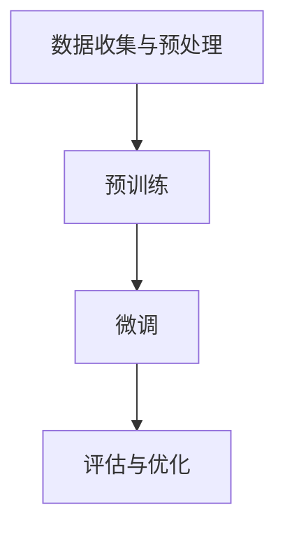
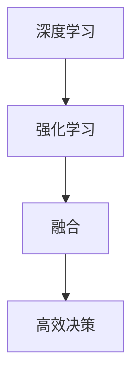
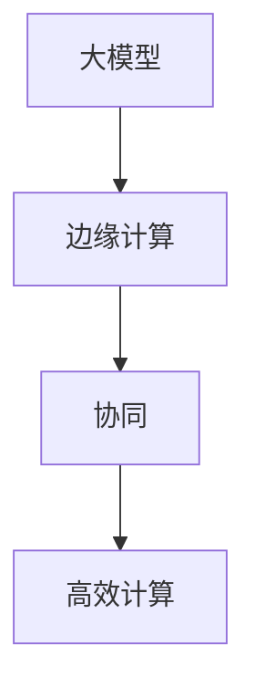
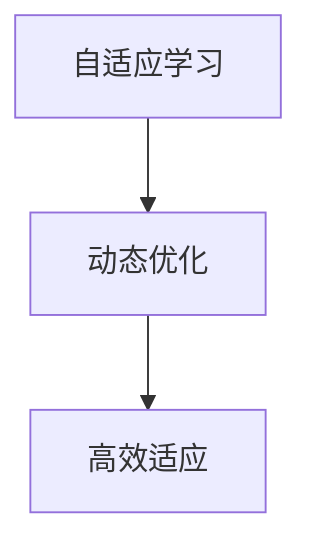

                 

### 文章标题

> **《李开复：AI 2.0 时代的市场前景》**

这篇文章旨在探讨AI 2.0时代的市场前景，深入分析这一时代所带来的技术创新、商业模式变革以及产业机遇。通过李开复先生的研究成果和见解，我们将从多个维度审视AI 2.0时代的核心概念、技术、应用案例以及面临的挑战和机遇。

### 关键词

- **AI 2.0**
- **市场前景**
- **技术创新**
- **商业模式**
- **产业发展**
- **法律法规与伦理**
- **应用案例**
- **未来展望**

### 摘要

AI 2.0时代是人工智能发展的新阶段，其核心特征是更加智能化、自适应和高效。本文将从AI 2.0的定义、核心技术、商业模式、法律法规与伦理，以及应用案例等多个方面展开讨论。通过分析李开复先生的研究成果，我们将探索AI 2.0时代在全球范围内的发展趋势和市场前景，并展望这一时代企业面临的机遇和挑战。本文的目标是帮助读者更好地理解AI 2.0时代的核心概念和实际应用，为相关行业和企业提供有益的参考和启示。

---

接下来，我们将按照文章目录大纲，逐步深入探讨AI 2.0时代的各个方面。

---

## 《李开复：AI 2.0 时代的市场前景》目录大纲

### 第一部分：AI 2.0时代的背景与市场前景

- **第1章：AI 2.0时代的崛起**
  - **1.1 AI 2.0的定义与特征**
  - **1.2 AI 2.0时代的市场前景**

- **第2章：AI 2.0的核心技术**
  - **2.1 大模型技术**
  - **2.2 自动驾驶技术**

- **第3章：AI 2.0时代的商业模式**
  - **3.1 AI 2.0与创业创新**
  - **3.2 AI 2.0与产业发展**

- **第4章：AI 2.0时代的法律法规与伦理**
  - **4.1 AI 2.0与法律法规**
  - **4.2 AI 2.0伦理问题**

### 第二部分：AI 2.0时代的应用案例与市场前景分析

- **第5章：AI 2.0在医疗领域的应用**
  - **5.1 AI 2.0在医疗诊断中的应用**
  - **5.2 AI 2.0在医疗管理中的应用**

- **第6章：AI 2.0在金融领域的应用**
  - **6.1 AI 2.0在智能投顾中的应用**
  - **6.2 AI 2.0在风险管理中的应用**

- **第7章：AI 2.0在教育与培训领域的应用**
  - **7.1 AI 2.0在教育个性化中的应用**
  - **7.2 AI 2.0在职业培训与技能提升中的应用**

- **第8章：AI 2.0时代的未来展望**
  - **8.1 AI 2.0技术发展趋势**
  - **8.2 AI 2.0时代的市场机遇与挑战**

### 附录

- **附录 A：AI 2.0资源与工具**
  - **A.1 开源深度学习框架**
  - **A.2 AI研究机构与资源**

---

现在，让我们开始深入探讨AI 2.0时代的背景与市场前景。

---

## 第1章：AI 2.0时代的崛起

### 1.1 AI 2.0的定义与特征

AI 2.0，即人工智能2.0，是人工智能（AI）发展进入新阶段的标志。与AI 1.0相比，AI 2.0具有更高的智能化水平、更强的自适应能力和更广泛的实用性。具体来说，AI 2.0的定义与特征可以从以下几个方面进行阐述。

首先，AI 2.0的定义可以看作是AI 1.0的进阶版。AI 1.0主要依赖于规则和统计方法，其应用范围相对有限，如简单的图像识别、语音识别等。而AI 2.0则更加关注人工智能的自主学习和决策能力，通过深度学习和强化学习等技术，使得AI系统可以在没有人工干预的情况下自我优化和进化。

其次，AI 2.0的特征主要体现在以下几个方面：

1. **更强的学习能力**：AI 2.0利用深度学习等先进技术，可以实现端到端的学习，直接从原始数据中学习到有用的特征，而无需人工特征工程。这使得AI系统能够更好地处理复杂的问题，实现更高效的学习和决策。

2. **更高的自适应能力**：AI 2.0能够通过自我学习和调整，不断适应新的环境和挑战。这种自适应能力使得AI系统能够在动态变化的环境中保持高效和准确。

3. **更广泛的实用性**：AI 2.0不仅能够处理传统的视觉、语音等感知任务，还能够应用于自然语言处理、推理决策、智能对话等更多领域。这使得AI 2.0的应用场景更加广泛，能够为各行各业带来变革性的影响。

4. **更强的通用性**：AI 2.0通过预训练大模型等技术，实现了跨领域的通用化。这意味着AI 2.0可以轻松地应用于不同的行业和场景，而不需要从头开始训练模型。

总之，AI 2.0作为人工智能发展的新阶段，其定义和特征体现在更高的智能化、更强的自适应能力和更广泛的实用性上。这些特征使得AI 2.0能够为各行各业带来深刻的变革，开启一个全新的AI时代。

### 1.2 AI 2.0时代的市场前景

随着AI 2.0时代的到来，全球市场正面临着一场前所未有的变革。AI 2.0的崛起不仅带来了技术的进步，更推动了市场的迅速扩张。下面，我们从技术创新、市场需求和政策支持三个方面，详细分析AI 2.0时代的市场前景。

首先，从技术创新的角度来看，AI 2.0时代的发展离不开深度学习、强化学习、自然语言处理等关键技术的突破。这些技术的进步不仅提升了AI系统的智能化水平，也扩大了AI的应用范围。例如，深度学习技术使得AI系统能够从大量数据中自动提取特征，进行高效的学习和推理；强化学习技术则使得AI系统能够在动态环境中进行自我优化，实现更高效和准确的决策。这些技术创新为AI 2.0时代的发展提供了强有力的技术支撑，推动了市场的快速增长。

其次，从市场需求的角度来看，随着AI技术的不断发展，越来越多的行业和领域开始认识到AI技术的价值，并开始积极应用AI技术。例如，在医疗领域，AI技术已经被广泛应用于疾病诊断、药物研发和健康管理等方面；在金融领域，AI技术被用于风险管理、智能投顾和客户服务等方面；在教育领域，AI技术被用于个性化教学、学习评估和职业培训等方面。这些实际应用不仅提升了各行业的效率和竞争力，也创造了巨大的市场需求。随着市场的不断扩张，AI 2.0时代的市场前景将更加广阔。

最后，从政策支持的角度来看，各国政府纷纷出台了一系列支持AI发展的政策。例如，美国推出了《美国国家人工智能战略》，欧盟发布了《人工智能伦理准则》，中国发布了《新一代人工智能发展规划》等。这些政策不仅为AI技术的发展提供了良好的环境，也为市场的发展提供了强有力的支持。政策支持为AI 2.0时代的市场前景注入了新的动力，使其具备了更大的发展潜力。

综上所述，AI 2.0时代的市场前景非常广阔。从技术创新、市场需求和政策支持三个方面来看，AI 2.0时代的发展潜力巨大，将引领全球市场进入一个新的发展阶段。随着AI技术的不断进步和市场的逐步成熟，AI 2.0时代的市场前景将更加美好，为各行各业带来深刻的变革和巨大的机遇。

### 1.3 AI 2.0时代的代表性公司和创新产品

在AI 2.0时代，全球范围内涌现出了许多领先的科技公司和创新产品，这些公司不仅在技术创新上取得了重大突破，也在市场上获得了广泛的认可。以下，我们将探讨几家具有代表性的公司及其创新产品，并分析它们对AI 2.0时代市场前景的推动作用。

首先，谷歌（Google）是AI 2.0时代最具代表性的公司之一。谷歌的深度学习技术在全球范围内享有盛誉，其自主研发的TensorFlow深度学习框架已经成为业界的标准工具。TensorFlow不仅为谷歌自身的产品和服务提供了强大的技术支持，也为全球开发者提供了便利，推动了AI技术的广泛应用。

其次，微软（Microsoft）也在AI 2.0时代取得了显著的成绩。微软的Azure人工智能平台提供了丰富的AI工具和服务，包括计算机视觉、自然语言处理、机器学习等。Azure的人工智能解决方案已经被广泛应用于各行各业，从医疗诊断到智能制造，从金融风控到智慧城市，为AI 2.0时代的市场前景注入了新的动力。

此外，亚马逊（Amazon）的Alexa智能语音助手也是AI 2.0时代的代表性创新产品之一。Alexa利用自然语言处理和机器学习技术，为用户提供便捷的智能家居控制、购物建议、信息查询等服务。Alexa的成功不仅展示了AI技术在消费领域的巨大潜力，也推动了AI 2.0时代的商业化进程。

再者，特斯拉（Tesla）在自动驾驶领域取得了重要突破。特斯拉的Autopilot自动驾驶系统利用深度学习和计算机视觉技术，实现了车辆在高速公路上的自动驾驶功能。特斯拉的自动驾驶技术不仅提升了驾驶安全性，也为AI 2.0时代在智能交通领域的应用提供了有力支持。

最后，IBM的Watson人工智能系统在医疗、金融、法律等领域表现出色。Watson利用自然语言处理和机器学习技术，能够快速分析海量数据，提供精准的诊断和决策支持。Watson的成功展示了AI 2.0时代在专业领域的强大应用潜力。

综上所述，这些代表性的公司和创新产品不仅推动了AI 2.0技术的发展，也为AI 2.0时代的市场前景注入了新的活力。通过技术创新和商业化应用，这些公司正引领AI 2.0时代的发展，为全球市场带来前所未有的机遇和挑战。

### 1.4 李开复对AI 2.0时代的看法

李开复先生是人工智能领域的杰出学者和企业家，他在AI 2.0时代的发展前景上有着独特的见解。根据李开复的研究，AI 2.0时代将呈现出以下几个显著特点。

首先，AI 2.0时代的核心特征是智能化、自适应和高效化。李开复指出，与AI 1.0时代相比，AI 2.0将更加依赖于深度学习和强化学习等技术，使得AI系统可以在没有人类干预的情况下实现自我学习和优化。这种自主学习和适应能力将使得AI系统能够在更广泛的领域和更复杂的环境中发挥作用。

其次，李开复认为，AI 2.0时代的市场前景将非常广阔。随着AI技术的不断进步，越来越多的行业和领域将开始应用AI技术，从而推动市场的快速增长。特别是在医疗、金融、教育、交通等领域，AI 2.0技术的应用潜力巨大，将带来深刻的市场变革。

此外，李开复强调，AI 2.0时代的企业将面临新的机遇和挑战。在AI 2.0时代，企业需要具备强大的技术实力和创新能力，以应对不断变化的市场需求。同时，企业还需要关注AI技术的伦理和法律问题，确保AI技术的应用不会对社会和个人造成负面影响。

最后，李开复提出，各国政府和企业应加大对AI 2.0时代的投入和支持。他认为，只有通过全社会的共同努力，才能推动AI 2.0时代的健康发展，实现人工智能技术的广泛应用和可持续发展。

综上所述，李开复对AI 2.0时代的发展前景充满信心，并提出了具有前瞻性的观点。这些观点不仅为AI 2.0时代的发展提供了重要参考，也为相关行业和企业提供了宝贵的启示。

---

在下一章中，我们将深入探讨AI 2.0时代的核心技术，包括大模型技术和自动驾驶技术。

---

## 第2章：AI 2.0的核心技术

AI 2.0时代的核心技术是推动这一时代发展的动力源泉。在这一章节中，我们将重点探讨AI 2.0时代的两项核心技术：大模型技术和自动驾驶技术。这些技术不仅代表了AI领域的最新进展，也展示了AI 2.0时代的广阔前景。

### 2.1 大模型技术

大模型技术是AI 2.0时代的核心技术之一，它利用深度学习等先进技术，构建出能够处理海量数据、具备强大语义理解能力的复杂模型。大模型技术的核心在于模型的大小和训练数据的量级，通过大规模的训练，模型能够学习到更加丰富的特征，从而实现更高的准确性和鲁棒性。

#### 2.1.1 大模型技术的定义与原理

大模型技术通常指的是使用数千亿个参数的神经网络模型，如GPT-3、BERT等。这些模型可以通过自我监督学习（Self-supervised Learning）和预训练（Pre-training）的方式进行训练，从而在不依赖特定任务标签的情况下，学习到通用的语言特征和知识。

**定义：** 大模型技术是指使用大规模神经网络进行预训练和微调，以实现高水平的自然语言处理和推理能力。

**原理：** 大模型技术的核心原理是通过在大量无标签数据上进行预训练，使模型能够自动提取数据中的有用特征，从而实现高水平的泛化能力。在预训练阶段，模型通过大量的文本数据学习语言模式和结构，然后在特定任务上进行微调，以实现任务的高性能。

#### 2.1.2 大模型技术的核心流程

大模型技术的核心流程可以概括为以下几个步骤：

1. **数据收集与预处理**：收集大量高质量的无标签数据，如文本、图像、语音等，并进行预处理，以便用于模型的训练。

2. **预训练**：在无标签数据上进行大规模的预训练，使模型能够自动学习到数据中的有用特征。预训练通常采用自我监督学习的方式，如 masked language model（MLM）。

3. **微调**：在预训练的基础上，使用特定任务的数据对模型进行微调，以实现任务的高性能。微调过程通常需要较少的数据和计算资源。

4. **评估与优化**：对模型进行评估和优化，以确保其在特定任务上达到预期的性能。

**Mermaid流程图**：



#### 2.1.3 大模型技术的应用案例

大模型技术已经广泛应用于自然语言处理、计算机视觉、语音识别等领域，以下是一些典型的应用案例：

1. **自然语言处理（NLP）**：大模型如GPT-3在文本生成、翻译、问答系统等方面表现出色，为各类NLP任务提供了强大的技术支持。

2. **计算机视觉（CV）**：大模型如BERT在图像分类、目标检测、图像分割等方面取得了显著成果，使得AI系统在视觉任务上的表现更加准确和鲁棒。

3. **语音识别（ASR）**：大模型如WaveNet在语音识别任务中实现了高准确率和高实时性的平衡，为智能语音助手、语音翻译等应用提供了技术基础。

### 2.2 自动驾驶技术

自动驾驶技术是AI 2.0时代的另一项重要技术，它利用深度学习、计算机视觉、传感器融合等技术，实现车辆的自动驾驶功能。自动驾驶技术的发展不仅提升了交通安全性，也为智能交通、物流等领域带来了巨大的变革。

#### 2.2.1 自动驾驶技术的定义与原理

自动驾驶技术是指利用人工智能技术，使车辆能够自主感知环境、规划路径、控制驾驶，从而实现无人驾驶。自动驾驶技术的基本原理包括：

1. **感知环境**：通过摄像头、激光雷达、雷达等传感器获取车辆周围的环境信息。

2. **数据处理**：利用深度学习和计算机视觉算法，对获取到的环境信息进行处理和分析，识别道路、车辆、行人等对象。

3. **路径规划**：根据感知到的环境信息，使用路径规划算法生成最优行驶路径。

4. **控制驾驶**：根据路径规划结果，控制车辆的转向、加速和制动，实现自动驾驶。

**定义：** 自动驾驶技术是指利用人工智能、传感器和控制系统，实现车辆自主行驶的技术。

**原理：** 自动驾驶技术的核心在于传感器融合和深度学习算法的应用。传感器融合技术将多种传感器数据集成起来，提高环境感知的准确性和鲁棒性；深度学习算法则用于处理和分析传感器数据，实现车辆对环境的理解和响应。

#### 2.2.2 自动驾驶技术的发展历程

自动驾驶技术的发展可以分为以下几个阶段：

1. **辅助驾驶（Level 0-2）**：这一阶段的自动驾驶技术主要依靠人类驾驶员的干预，如自动刹车、自适应巡航等。

2. **部分自动驾驶（Level 3）**：这一阶段的自动驾驶技术可以在特定条件下实现自主驾驶，如高速公路自动驾驶。

3. **高度自动驾驶（Level 4-5）**：这一阶段的自动驾驶技术能够在更复杂的环境下实现自主驾驶，但仍然需要人类驾驶员在某些情况下进行干预。

4. **完全自动驾驶（Level 6）**：这一阶段的自动驾驶技术完全由AI系统控制，无需人类驾驶员的干预。

#### 2.2.3 自动驾驶技术的核心技术

自动驾驶技术的核心技术包括：

1. **传感器技术**：包括摄像头、激光雷达、雷达等，用于感知车辆周围环境。

2. **计算机视觉**：用于处理和分析摄像头获取的图像数据，识别道路、车辆、行人等对象。

3. **深度学习**：用于训练自动驾驶模型，实现环境感知、路径规划和控制驾驶等功能。

4. **传感器融合**：将多种传感器数据融合起来，提高环境感知的准确性和鲁棒性。

#### 2.2.4 自动驾驶技术的应用案例

自动驾驶技术已经在多个领域得到广泛应用，以下是一些典型的应用案例：

1. **物流**：自动驾驶卡车和无人配送车已经在物流领域开始应用，提高了运输效率和安全性。

2. **公共交通**：自动驾驶巴士和出租车已经在一些城市开始试运行，为市民提供便捷的出行服务。

3. **城市交通管理**：自动驾驶技术可以用于城市交通管理，实现智能交通信号控制和交通流量优化。

#### 2.2.5 自动驾驶技术的挑战与未来发展方向

自动驾驶技术面临的主要挑战包括：

1. **环境复杂性**：自动驾驶系统需要处理复杂多变的道路环境和交通情况。

2. **安全性和可靠性**：自动驾驶系统需要确保在所有情况下都能安全、可靠地运行。

3. **法律法规和伦理**：自动驾驶技术需要遵守相关的法律法规，并在伦理方面做出正确的决策。

未来，自动驾驶技术的发展方向包括：

1. **多传感器融合**：通过融合多种传感器数据，提高环境感知的准确性和鲁棒性。

2. **深度学习和强化学习**：通过更先进的深度学习和强化学习算法，提升自动驾驶系统的智能化水平。

3. **协同作战**：实现多辆自动驾驶车辆的协同作战，提高交通效率和安全性。

综上所述，大模型技术和自动驾驶技术是AI 2.0时代的核心技术，它们的发展和应用将推动AI 2.0时代的到来，为各行各业带来深刻的变革和巨大的机遇。在下一章中，我们将探讨AI 2.0时代的商业模式，分析这一时代如何推动创业和创新。

---

在下一章中，我们将探讨AI 2.0时代的商业模式，分析这一时代如何推动创业和创新。

---

## 第3章：AI 2.0时代的商业模式

AI 2.0时代的到来不仅带来了技术的革命，也对商业模式的创新产生了深远的影响。在这一章节中，我们将探讨AI 2.0时代的商业模式，重点分析AI 2.0如何推动创业和创新，以及AI 2.0对各个产业的影响和机遇。

### 3.1 AI 2.0与创业创新

AI 2.0时代的到来为创业者提供了前所未有的机遇。凭借AI技术的强大能力，创业公司可以在各个领域实现颠覆性的创新。以下，我们从几个方面探讨AI 2.0如何推动创业创新。

#### 3.1.1 AI 2.0时代的创业优势

1. **技术门槛降低**：AI 2.0时代的开源深度学习框架和工具使得创业者可以更轻松地获取和使用先进的人工智能技术，降低了技术门槛。

2. **数据资源丰富**：随着互联网和大数据的发展，创业者可以更容易地获取大量的数据资源，用于训练和优化AI模型。

3. **商业模式多样化**：AI 2.0技术可以应用于各个行业，为创业者提供了多样化的商业模式，如智能医疗、智能金融、智能教育等。

4. **快速迭代**：AI技术的快速迭代使得创业公司可以迅速响应市场变化，不断优化产品和服务。

#### 3.1.2 AI 2.0时代的创业案例

以下是一些典型的AI 2.0创业案例：

1. **OpenAI**：OpenAI是一家专注于人工智能研究的创业公司，其利用深度学习技术进行自然语言处理、计算机视觉等研究，推出了一系列具有突破性的成果。

2. **Wishfin**：Wishfin是一家金融科技公司，利用AI技术提供智能投资建议和风险管理服务，帮助投资者实现更高效的决策。

3. **Hugging Face**：Hugging Face是一家专注于自然语言处理的开源社区，其提供了一系列开源模型和工具，为开发者提供了丰富的资源。

4. **Knock Knock**：Knock Knock是一家提供智能客服解决方案的公司，其利用自然语言处理和机器学习技术，帮助客户实现更高效的客户服务。

#### 3.1.3 AI 2.0时代的创业挑战

尽管AI 2.0时代为创业者提供了丰富的机遇，但也存在一些挑战：

1. **数据隐私和安全**：AI技术的发展带来了数据隐私和安全问题，创业者需要确保数据的合法合规使用。

2. **算法偏见和伦理**：AI算法可能存在偏见，导致不公平的结果，创业者需要关注算法的公平性和伦理问题。

3. **技术成熟度**：虽然AI技术取得了显著进步，但在某些领域的技术成熟度仍然有限，创业者需要谨慎评估技术的可行性。

### 3.2 AI 2.0与产业发展

AI 2.0时代的到来对各个产业产生了深远的影响，推动了产业升级和转型。以下，我们从几个方面分析AI 2.0对各个产业的影响和机遇。

#### 3.2.1 AI 2.0在医疗领域的应用

AI 2.0技术在医疗领域的应用包括疾病诊断、药物研发、健康管理等。以下是一些具体的案例：

1. **疾病诊断**：AI 2.0技术可以帮助医生进行疾病诊断，提高诊断的准确性和效率。例如，AI系统可以通过分析医学影像数据，协助医生进行肿瘤诊断。

2. **药物研发**：AI 2.0技术可以加速药物研发过程，通过模拟药物与生物体的相互作用，预测药物的效果和副作用。

3. **健康管理**：AI 2.0技术可以帮助用户进行健康管理，提供个性化的健康建议和疾病预防方案。

#### 3.2.2 AI 2.0在金融领域的应用

AI 2.0技术在金融领域的应用包括风险管理、智能投顾、支付和风控等。以下是一些具体的案例：

1. **风险管理**：AI 2.0技术可以帮助金融机构进行风险评估和管理，降低金融风险。

2. **智能投顾**：AI 2.0技术可以提供个性化的投资建议，帮助投资者实现更高效的决策。

3. **支付和风控**：AI 2.0技术可以提升支付系统的安全性和效率，通过实时风险监控和反欺诈技术，保障用户资金安全。

#### 3.2.3 AI 2.0在教育领域的应用

AI 2.0技术在教育领域的应用包括个性化教学、学习评估、职业培训等。以下是一些具体的案例：

1. **个性化教学**：AI 2.0技术可以根据学生的学习习惯和进度，提供个性化的教学内容和学习路径，提高学习效果。

2. **学习评估**：AI 2.0技术可以实时评估学生的学习效果，提供精准的学习反馈和指导。

3. **职业培训**：AI 2.0技术可以帮助职场人士进行技能提升和职业发展，提供定制化的职业培训方案。

#### 3.2.4 AI 2.0在制造业的应用

AI 2.0技术在制造业的应用包括智能工厂、设备预测维护、供应链管理等。以下是一些具体的案例：

1. **智能工厂**：AI 2.0技术可以实现工厂的自动化和智能化，提高生产效率和产品质量。

2. **设备预测维护**：AI 2.0技术可以通过预测设备的故障风险，实现设备的预测性维护，降低设备故障率和维护成本。

3. **供应链管理**：AI 2.0技术可以帮助企业进行供应链优化，提高供应链的效率和灵活性。

#### 3.2.5 AI 2.0在零售业的应用

AI 2.0技术在零售业的广泛应用包括智能客服、个性化推荐、智能仓储等。以下是一些具体的案例：

1. **智能客服**：AI 2.0技术可以提供智能客服服务，通过自然语言处理和机器学习技术，实现24/7的客户服务。

2. **个性化推荐**：AI 2.0技术可以根据用户的购物行为和偏好，提供个性化的商品推荐，提高用户满意度。

3. **智能仓储**：AI 2.0技术可以实现仓储的自动化和智能化，提高仓储效率和准确性。

### 3.3 AI 2.0时代的产业机遇与挑战

AI 2.0时代为各个产业带来了巨大的机遇，但同时也伴随着一系列挑战。以下，我们从几个方面分析AI 2.0时代的产业机遇与挑战。

#### 3.3.1 产业机遇

1. **技术创新**：AI 2.0技术为各行业提供了新的技术手段和解决方案，推动了产业升级和转型。

2. **效率提升**：AI 2.0技术可以提高各行业的运营效率，降低成本，提高产品质量。

3. **产业融合**：AI 2.0技术促进了各行业的融合，推动了跨界创新和协同发展。

4. **市场扩展**：AI 2.0技术为各行业带来了新的市场机会，开拓了更广阔的市场空间。

#### 3.3.2 产业挑战

1. **技术成熟度**：AI 2.0技术在一些领域的技术成熟度仍然有限，需要持续的研发投入和技术突破。

2. **数据隐私和安全**：AI 2.0技术在数据隐私和安全方面存在一定的风险，需要建立有效的数据隐私和安全保护机制。

3. **人才短缺**：AI 2.0技术的发展需要大量专业人才，但目前人才供需不平衡，人才短缺问题仍然突出。

4. **法律法规和伦理**：AI 2.0技术的应用需要遵守相关的法律法规和伦理规范，以确保技术的健康发展。

综上所述，AI 2.0时代的商业模式为创业和创新提供了丰富的机遇，同时也带来了新的挑战。只有通过技术创新、人才培养和法律法规的完善，才能充分发挥AI 2.0时代的产业机遇，推动各行业的持续发展和进步。

---

在下一章中，我们将探讨AI 2.0时代的法律法规与伦理问题。

---

## 第4章：AI 2.0时代的法律法规与伦理

随着AI 2.0技术的迅速发展，其应用范围和影响力日益扩大，随之而来的法律法规与伦理问题也变得越来越复杂和重要。在这一章节中，我们将探讨AI 2.0时代可能面临的法律法规与伦理挑战，并提出相应的解决方案。

### 4.1 AI 2.0与法律法规

#### 4.1.1 法律法规的必要性

AI 2.0技术的广泛应用带来了前所未有的机遇，同时也引发了一系列法律和伦理问题。为了保障技术的健康发展，确保公众的利益，各国政府纷纷开始制定相关的法律法规。以下是一些关键的法律问题：

1. **数据隐私与保护**：随着AI技术的进步，大量的个人数据被收集、存储和处理。如何保护这些数据，防止数据泄露和滥用，成为法律制定的重要议题。

2. **算法透明度和解释性**：AI系统通常由复杂的算法驱动，但其决策过程往往缺乏透明度和解释性。如何确保算法的公正性、透明性和可解释性，成为法律关注的重点。

3. **责任归属**：当AI系统发生错误或造成损害时，如何确定责任归属，是法律制定的重要问题。是开发者、使用者还是算法本身应当承担责任？

4. **算法歧视与公平**：AI系统可能会因为训练数据的不公正或算法设计的问题导致歧视行为。如何防止算法歧视，保障公平，是法律制定的核心问题。

#### 4.1.2 各国法律政策解读

1. **美国**：美国在AI领域的法律法规建设相对较为成熟。例如，《加州消费者隐私法》（CCPA）就对数据隐私保护做出了详细规定。《美国国家人工智能战略》则强调了AI技术的监管和伦理问题。

2. **欧盟**：欧盟在数据隐私保护方面具有严格的法规，如《通用数据保护条例》（GDPR）。此外，欧盟还发布了《人工智能伦理准则》，旨在确保AI技术的道德和合法使用。

3. **中国**：中国发布了《新一代人工智能发展规划》，明确了人工智能的发展目标和政策导向。同时，中国也在积极推进《个人信息保护法》等法律法规的制定，以应对AI技术带来的数据隐私和安全问题。

### 4.2 AI 2.0伦理问题

AI 2.0技术的发展不仅涉及法律问题，也引发了广泛的伦理讨论。以下是一些关键的伦理问题：

#### 4.2.1 伦理问题的本质

1. **隐私**：AI系统收集和处理大量个人数据，如何平衡隐私与公共利益是伦理讨论的核心问题。

2. **公平与歧视**：AI算法可能因为训练数据或算法设计的原因产生歧视，如何确保算法的公平性是重要的伦理问题。

3. **透明度**：AI系统的决策过程通常缺乏透明度，如何提高算法的透明度和可解释性是伦理讨论的重要内容。

4. **责任**：当AI系统发生错误或造成损害时，如何确定责任归属是伦理讨论的焦点。

#### 4.2.2 解决方案

1. **伦理原则**：制定AI伦理原则，确保AI系统的设计和应用符合伦理要求。例如，可以借鉴联合国教科文组织发布的《关于人工智能伦理的建议》，确立全球通用的伦理准则。

2. **伦理审查**：建立AI伦理审查机制，对AI项目的开发和应用进行评估，确保其符合伦理标准。

3. **算法透明度与解释性**：开发可解释的AI算法，提高算法的透明度和可解释性，使决策过程更加透明和可信。

4. **数据隐私保护**：加强数据隐私保护，确保个人数据的合法、合规使用，防止数据泄露和滥用。

5. **责任归属**：明确AI系统责任归属，建立相应的法律制度，确保在发生错误或损害时，责任能够得到有效追究。

### 4.3 AI 2.0伦理案例

以下是一些典型的AI伦理案例，以及相应的伦理问题和解决方案：

#### 4.3.1 案例一：算法歧视

**问题**：某AI招聘系统在筛选简历时，对某些种族和性别存在歧视现象。

**解决方案**：
- **数据清洗**：在训练模型前，对训练数据进行清洗，去除可能引入偏见的数据。
- **多样性训练**：在训练模型时，加入多样化的数据，提高模型的公平性。
- **伦理审查**：在项目开发过程中，进行伦理审查，确保模型的应用不会导致歧视。

#### 4.3.2 案例二：自动驾驶汽车事故

**问题**：自动驾驶汽车在紧急情况下如何做出决策，如何确保其安全性和责任归属。

**解决方案**：
- **安全评估**：在自动驾驶汽车发布前，进行全面的安全评估，确保其能够在各种复杂场景下安全运行。
- **责任保险**：为自动驾驶汽车提供责任保险，确保在发生事故时，有足够的资金来补偿受害者。
- **法律法规**：制定相关的法律法规，明确自动驾驶汽车的责任归属，确保其在法律框架内运行。

#### 4.3.3 案例三：AI医疗诊断

**问题**：AI医疗诊断系统的准确性和可靠性，如何确保其不会对病人造成误诊。

**解决方案**：
- **多模型融合**：使用多个模型进行诊断，提高诊断的准确性和可靠性。
- **专家评审**：在AI诊断结果输出前，由医疗专家进行评审，确保诊断结果的可信度。
- **法律法规**：制定相关的法律法规，明确AI医疗诊断的法律责任，确保其合法合规运行。

### 4.4 AI伦理的未来展望

随着AI技术的不断进步，伦理问题也将变得更加复杂和多样。以下是一些未来展望：

- **跨学科合作**：加强AI伦理研究，促进法律、哲学、社会学等多学科的合作，共同解决AI伦理问题。
- **全球协调**：加强国际合作，制定全球统一的AI伦理准则，确保AI技术的全球应用符合伦理要求。
- **持续关注**：持续关注AI伦理问题，及时调整和更新法律法规，以应对不断变化的AI技术。

综上所述，AI 2.0时代的法律法规与伦理问题至关重要。通过制定合理的法律法规和伦理准则，确保AI技术的合法合规和道德使用，我们能够充分发挥AI技术的潜力，推动社会进步。

---

在下一章中，我们将深入探讨AI 2.0在医疗领域的应用，分析其如何改变医疗诊断和医疗管理。

---

## 第5章：AI 2.0在医疗领域的应用

AI 2.0技术在医疗领域的应用正迅速发展，为医疗诊断、医疗管理等方面带来了革命性的变化。通过利用深度学习、计算机视觉和自然语言处理等先进技术，AI 2.0在医疗领域展现出了巨大的潜力。以下，我们将详细探讨AI 2.0在医疗诊断和医疗管理中的应用。

### 5.1 AI 2.0在医疗诊断中的应用

#### 5.1.1 技术实现

AI 2.0在医疗诊断中的应用主要体现在影像诊断、基因诊断和临床诊断等方面。通过深度学习和计算机视觉技术，AI系统能够对医学影像（如X光片、CT扫描、MRI等）进行自动分析，识别和诊断疾病。以下是一个简单的技术实现过程：

1. **数据收集与预处理**：收集大量的医学影像数据，并进行预处理，包括图像去噪、图像增强、分割等。

2. **模型训练**：使用深度学习算法（如卷积神经网络CNN）对预处理后的医学影像数据进行训练，使其能够识别和分类不同的疾病。

3. **模型评估**：通过交叉验证等方法对训练好的模型进行评估，确保其准确性和鲁棒性。

4. **模型部署**：将训练好的模型部署到临床诊断系统中，医生可以通过系统获取AI的诊断建议。

**伪代码**：

```python
def medical_diagnosis(image):
    # 预处理图像
    preprocessed_image = preprocess_image(image)
    
    # 使用深度学习模型进行诊断
    diagnosis = deep_learning_model(preprocessed_image)
    
    # 返回诊断结果
    return diagnosis
```

#### 5.1.2 应用案例

以下是一些AI 2.0在医疗诊断中的成功应用案例：

1. **乳腺癌诊断**：AI系统能够通过分析乳腺X光片，识别乳腺癌的潜在风险，辅助医生进行诊断。研究表明，AI的诊断准确率甚至高于人类医生。

2. **肺癌诊断**：AI系统可以通过分析CT扫描图像，识别早期肺癌，提高诊断的准确性和及时性。

3. **心脏病诊断**：AI系统可以通过分析心电图数据，检测心脏病风险，为医生提供诊断建议。

### 5.2 AI 2.0在医疗管理中的应用

AI 2.0技术在医疗管理中的应用同样重要，它可以帮助医疗机构提高运营效率，优化医疗资源分配，提高患者满意度。以下是一些具体的应用场景：

#### 5.2.1 患者管理

AI 2.0技术可以通过分析患者的电子健康记录，提供个性化的健康管理方案。例如：

1. **疾病预测**：AI系统可以根据患者的病史和基因数据，预测患者可能患有的疾病，帮助医生提前进行预防和干预。

2. **个性化治疗**：AI系统可以根据患者的病情和个体差异，提供个性化的治疗方案，提高治疗效果。

3. **药物推荐**：AI系统可以根据患者的病情和药物副作用，推荐最适合患者的药物，提高药物使用效果。

#### 5.2.2 医疗资源管理

AI 2.0技术可以帮助医疗机构优化医疗资源的分配和使用，提高运营效率。例如：

1. **床位管理**：AI系统可以根据患者的入院时间和病情，预测未来一段时间内医院的床位需求，帮助医院合理安排床位。

2. **手术排程**：AI系统可以根据医生的日程安排、手术复杂度和手术室的使用情况，优化手术排程，提高手术室的使用效率。

3. **药物库存管理**：AI系统可以根据药品的消耗速度和库存量，预测药品的需求量，帮助医院合理采购和储备药品。

#### 5.2.3 医疗流程优化

AI 2.0技术可以帮助医疗机构优化医疗流程，提高服务质量。例如：

1. **患者流程优化**：AI系统可以通过分析患者的就诊数据，优化患者的就诊流程，减少患者的等待时间。

2. **医疗流程自动化**：AI系统可以通过自动化技术，简化医疗流程中的重复性工作，提高工作效率。

3. **医疗数据挖掘**：AI系统可以通过数据挖掘技术，分析医疗数据，发现潜在的医疗问题，为医疗机构提供改进建议。

### 5.3 AI 2.0在医疗领域的挑战与未来展望

尽管AI 2.0技术在医疗领域展现出了巨大的潜力，但在实际应用中仍然面临一些挑战和问题：

#### 5.3.1 挑战

1. **数据隐私与安全**：医疗数据涉及患者隐私，如何确保数据的安全和隐私保护是AI技术在医疗领域应用的重要问题。

2. **技术成熟度**：AI技术在一些医疗场景下的技术成熟度仍然有限，需要进一步的研究和改进。

3. **算法偏见与公平**：AI系统可能会因为训练数据或算法设计的问题产生偏见，导致不公平的结果，如何确保算法的公平性是重要的挑战。

4. **法律法规与伦理**：AI技术在医疗领域的应用需要遵守相关的法律法规和伦理准则，如何确保技术的合法合规使用是重要的议题。

#### 5.3.2 未来展望

1. **技术突破**：随着AI技术的不断进步，其将在医疗领域实现更多创新和应用，提高医疗诊断和管理的效率。

2. **跨学科合作**：加强医学、计算机科学、伦理学等多学科的合作，共同解决AI技术在医疗领域面临的挑战。

3. **法律法规完善**：制定完善的法律法规和伦理准则，确保AI技术在医疗领域的合法合规使用。

4. **人才培养**：加强AI技术人才在医疗领域的培养，提高医疗行业的AI技术水平。

综上所述，AI 2.0技术在医疗领域的应用具有巨大的潜力，通过解决现有的挑战和问题，AI技术将为医疗行业带来深刻的变革和巨大的发展机遇。

---

在下一章中，我们将探讨AI 2.0在金融领域的应用，分析其如何改变智能投顾和风险管理。

---

## 第6章：AI 2.0在金融领域的应用

AI 2.0技术的迅速发展正在深刻地改变金融行业的运作模式，特别是在智能投顾和风险管理方面。通过利用机器学习、深度学习和自然语言处理等先进技术，AI 2.0在金融领域实现了更加精准、高效和智能化的服务。以下，我们将详细探讨AI 2.0在金融领域的应用，以及其如何改变智能投顾和风险管理。

### 6.1 AI 2.0在智能投顾中的应用

#### 6.1.1 技术实现

智能投顾（Robo-Advisory）是AI 2.0技术在金融领域的一个重要应用。通过分析用户的财务状况、投资偏好和市场数据，智能投顾能够提供个性化的投资建议。以下是智能投顾的技术实现过程：

1. **用户数据收集**：智能投顾首先需要收集用户的财务数据，包括收入、支出、资产配置、风险偏好等。

2. **数据分析与建模**：利用数据分析技术，对用户的财务数据进行分析，并结合市场数据，构建用户的投资模型。

3. **算法优化**：使用机器学习算法，对用户的投资模型进行优化，提高投资建议的准确性和适应性。

4. **风险控制**：结合风险控制算法，确保投资策略在承受风险范围内，保障投资者的资金安全。

**数学模型**：

```latex
\text{投资策略} = f(\text{用户偏好}, \text{市场数据}, \text{风险控制参数})
```

#### 6.1.2 应用案例

以下是一些AI 2.0在智能投顾领域的成功应用案例：

1. ** Wealthfront**：Wealthfront是一款智能投顾平台，通过分析用户的财务数据，提供个性化的投资组合建议，帮助用户实现资产的长期增长。

2. **Betterment**：Betterment是一款在线智能投顾服务，利用AI技术为用户提供投资建议和资产管理服务，用户可以根据自己的风险偏好选择合适的投资策略。

3. **SoFi**：SoFi（社会金融）提供智能投顾服务，通过分析用户的数据，为用户提供个性化的投资组合，同时提供贷款和保险等金融服务。

### 6.2 AI 2.0在风险管理中的应用

#### 6.2.1 技术实现

AI 2.0在风险管理中的应用主要体现在信用评估、市场风险预测和反欺诈等方面。通过深度学习和机器学习技术，AI系统能够对大量的金融数据进行分析，识别潜在的风险，并制定相应的风险管理策略。以下是技术实现过程：

1. **数据收集**：收集大量的金融数据，包括交易记录、信用历史、市场数据等。

2. **特征工程**：对金融数据进行预处理和特征提取，将原始数据转化为可用于训练的格式。

3. **模型训练**：使用机器学习和深度学习算法，对预处理后的数据进行训练，构建风险管理模型。

4. **风险预测**：利用训练好的模型，对新的金融数据进行分析，预测潜在的风险。

5. **策略优化**：根据风险预测结果，制定相应的风险管理策略，包括风险控制、风险预警等。

**伪代码**：

```python
def risk_management(new_data):
    # 预处理新数据
    preprocessed_data = preprocess_data(new_data)
    
    # 使用风险管理模型进行风险预测
    risk_prediction = risk_management_model(preprocessed_data)
    
    # 根据风险预测结果制定风险管理策略
    risk_strategy = determine_risk_strategy(risk_prediction)
    
    # 返回风险管理策略
    return risk_strategy
```

#### 6.2.2 应用案例

以下是一些AI 2.0在风险管理领域的成功应用案例：

1. **Credit Karma**：Credit Karma是一款个人信用管理工具，通过分析用户的信用历史和财务数据，为用户提供个性化的信用评分和风险管理建议。

2. **Equifax**：Equifax是一家信用评估公司，利用AI技术进行信用评分和风险管理，帮助金融机构评估借款人的信用风险。

3. **FICO**：FICO（美国公正信用有限公司）利用AI技术开发信用评分模型，为金融机构提供信用风险管理服务。

### 6.3 AI 2.0对金融行业的变革性影响

AI 2.0技术的应用正在对金融行业产生深远的影响，其变革性作用主要体现在以下几个方面：

#### 6.3.1 提高效率和降低成本

通过AI技术，金融机构能够实现自动化和智能化的操作，提高工作效率，降低运营成本。例如，智能投顾可以自动为用户提供投资建议，减少人工操作，降低人力成本。

#### 6.3.2 提升风险管理能力

AI 2.0技术能够对大量的金融数据进行实时分析和预测，识别潜在的风险，提高风险管理的准确性。金融机构可以通过AI技术实现更精准的风险控制和风险预警，保障金融市场的稳定。

#### 6.3.3 个性化服务与用户体验

AI 2.0技术能够根据用户的需求和偏好，提供个性化的金融服务，提升用户体验。例如，智能投顾可以根据用户的财务状况和风险偏好，提供量身定制的投资组合，满足用户的个性化需求。

#### 6.3.4 跨界合作与创新

AI 2.0技术的应用促进了金融行业与其他行业的融合，推动了金融创新。例如，金融科技（Fintech）公司通过AI技术为传统金融机构提供新的服务和解决方案，推动金融行业的数字化转型。

### 6.4 AI 2.0在金融领域的挑战与未来展望

尽管AI 2.0技术在金融领域展现了巨大的潜力，但其应用也面临一些挑战和问题：

#### 6.4.1 挑战

1. **数据隐私与安全**：金融数据涉及用户的隐私信息，如何确保数据的安全和隐私保护是AI技术在金融领域应用的重要问题。

2. **技术成熟度**：AI技术在一些金融场景下的技术成熟度仍然有限，需要进一步的研究和改进。

3. **算法偏见与公平**：AI系统可能会因为训练数据或算法设计的问题产生偏见，导致不公平的结果，如何确保算法的公平性是重要的挑战。

4. **法律法规与伦理**：AI技术在金融领域的应用需要遵守相关的法律法规和伦理准则，如何确保技术的合法合规使用是重要的议题。

#### 6.4.2 未来展望

1. **技术突破**：随着AI技术的不断进步，其将在金融领域实现更多创新和应用，提高金融服务的效率和质量。

2. **跨学科合作**：加强医学、计算机科学、伦理学等多学科的合作，共同解决AI技术在金融领域面临的挑战。

3. **法律法规完善**：制定完善的法律法规和伦理准则，确保AI技术在金融领域的合法合规使用。

4. **人才培养**：加强AI技术人才在金融领域的培养，提高金融行业的AI技术水平。

综上所述，AI 2.0技术在金融领域的应用具有巨大的潜力，通过解决现有的挑战和问题，AI技术将为金融行业带来深刻的变革和巨大的发展机遇。

---

在下一章中，我们将探讨AI 2.0在教育与培训领域的应用，分析其如何实现个性化教学和职业培训。

---

## 第7章：AI 2.0在教育与培训领域的应用

随着AI 2.0技术的不断发展，教育行业正在迎来一场革命性的变革。AI 2.0在教育与培训领域的应用，不仅能够实现个性化教学，还能够大大提升职业培训的效率和质量。以下，我们将详细探讨AI 2.0在教育个性化中的应用，以及其在职业培训与技能提升中的应用。

### 7.1 AI 2.0在教育个性化中的应用

#### 7.1.1 技术实现

AI 2.0在教育个性化中的应用主要通过自然语言处理、机器学习和自适应学习等技术实现。以下是一个简单的技术实现过程：

1. **学生数据分析**：通过收集和分析学生的学习行为数据，包括考试成绩、作业完成情况、学习时间等，AI系统能够了解每个学生的学习习惯和能力水平。

2. **个性化学习路径生成**：基于学生的数据分析，AI系统能够为学生生成个性化的学习路径，包括课程选择、学习内容和学习进度。

3. **实时反馈与调整**：AI系统在学生学习过程中，能够实时监控学生的学习状态，提供个性化的学习反馈，并根据反馈进行学习路径的调整。

4. **智能辅导与支持**：AI系统可以为学生提供智能辅导，解答学生在学习中遇到的问题，帮助学生更好地理解和掌握知识。

**数学模型**：

```latex
\text{个性化学习路径} = f(\text{学生数据}, \text{学习内容}, \text{学习目标})
```

#### 7.1.2 应用案例

以下是一些AI 2.0在教育个性化中的应用案例：

1. **Knewton**：Knewton是一个基于AI技术的个性化学习平台，通过分析学生的学习行为，为学生提供个性化的学习资源和辅导。

2. **DreamBox**：DreamBox是一款AI驱动的数学学习平台，通过分析学生的学习进度和能力，为学生提供个性化的数学练习。

3. **Carnegie Learning**：Carnegie Learning是一个个性化学习解决方案提供商，其AI系统通过分析学生的学习行为，为学生提供个性化的教学资源和辅导。

### 7.2 AI 2.0在职业培训与技能提升中的应用

#### 7.2.1 技术实现

AI 2.0在职业培训与技能提升中的应用主要通过智能模拟、虚拟现实和自适应学习等技术实现。以下是一个简单的技术实现过程：

1. **技能评估与分类**：通过分析学员的技能水平和学习需求，AI系统能够为学员提供个性化的技能评估和分类。

2. **个性化学习路径生成**：基于学员的技能评估结果，AI系统能够为学员生成个性化的学习路径，包括课程选择、学习内容和学习进度。

3. **实时反馈与调整**：AI系统在学员学习过程中，能够实时监控学员的学习状态，提供个性化的学习反馈，并根据反馈进行学习路径的调整。

4. **智能辅导与支持**：AI系统可以提供智能辅导，帮助学员解决在学习中遇到的问题，提升学习效果。

**数学模型**：

```latex
\text{个性化学习路径} = f(\text{技能评估结果}, \text{学习内容}, \text{学习目标})
```

#### 7.2.2 应用案例

以下是一些AI 2.0在职业培训与技能提升中的应用案例：

1. **Coursera**：Coursera是一个在线学习平台，通过AI技术为学员提供个性化的学习体验，包括课程推荐、学习路径规划等。

2. **Udacity**：Udacity是一个专注于技术教育的在线学习平台，其AI系统通过分析学员的学习行为，提供个性化的学习资源和辅导。

3. **LinkedIn Learning**：LinkedIn Learning是LinkedIn推出的在线学习平台，通过AI技术为用户提供个性化的职业培训和学习路径。

### 7.3 AI 2.0在教育与培训领域的变革性影响

AI 2.0技术在教育与培训领域的应用，正在带来深刻的变革性影响：

#### 7.3.1 提高学习效率

通过AI技术，教育系统可以更好地适应每个学生的需求，提供个性化的学习资源和辅导，大大提高学习效率。

#### 7.3.2 降低学习成本

AI技术能够自动化和智能化地处理教育过程中大量的重复性工作，降低教育成本，使更多学生能够接受优质的教育。

#### 7.3.3 提升教学质量

AI技术可以实时监控学生的学习状态，提供个性化的反馈和辅导，提升教师的教学质量和学生的学习效果。

#### 7.3.4 促进教育公平

AI技术能够打破地域和资源的限制，使教育机会更加公平，为不同背景和能力的学生提供平等的学习机会。

### 7.4 AI 2.0在教育与培训领域的挑战与未来展望

尽管AI 2.0技术在教育与培训领域具有巨大的潜力，但其应用也面临一些挑战和问题：

#### 7.4.1 挑战

1. **数据隐私与安全**：教育数据涉及学生的隐私信息，如何确保数据的安全和隐私保护是AI技术在教育领域应用的重要问题。

2. **技术成熟度**：AI技术在一些教育场景下的技术成熟度仍然有限，需要进一步的研究和改进。

3. **算法偏见与公平**：AI系统可能会因为训练数据或算法设计的问题产生偏见，导致不公平的结果，如何确保算法的公平性是重要的挑战。

4. **法律法规与伦理**：AI技术在教育领域的应用需要遵守相关的法律法规和伦理准则，如何确保技术的合法合规使用是重要的议题。

#### 7.4.2 未来展望

1. **技术突破**：随着AI技术的不断进步，其将在教育与培训领域实现更多创新和应用，提高教育质量和培训效率。

2. **跨学科合作**：加强医学、计算机科学、伦理学等多学科的合作，共同解决AI技术在教育与培训领域面临的挑战。

3. **法律法规完善**：制定完善的法律法规和伦理准则，确保AI技术在教育与培训领域的合法合规使用。

4. **人才培养**：加强AI技术人才在教育与培训领域的培养，提高教育行业的AI技术水平。

综上所述，AI 2.0技术在教育与培训领域的应用具有巨大的潜力，通过解决现有的挑战和问题，AI技术将为教育行业带来深刻的变革和巨大的发展机遇。

---

在下一章中，我们将探讨AI 2.0时代的未来展望，分析其技术发展趋势以及市场机遇与挑战。

---

## 第8章：AI 2.0时代的未来展望

随着AI 2.0技术的不断进步，我们可以预见未来将在多个方面迎来深刻的变化。在这一章节中，我们将探讨AI 2.0时代的未来发展趋势，分析这一时代企业面临的机遇与挑战，以及全球范围内的技术应用和市场前景。

### 8.1 AI 2.0技术发展趋势

AI 2.0技术的发展将呈现以下几个关键趋势：

#### 8.1.1 深度学习与强化学习的融合

深度学习与强化学习的结合将是未来AI技术发展的重要方向。深度学习擅长处理大量数据，而强化学习擅长在动态环境中做出决策。通过将两者结合，AI系统可以在更复杂的任务中实现更高效和准确的决策。

**Mermaid流程图**：



#### 8.1.2 大模型与边缘计算的协同

随着AI模型的规模不断扩大，大模型在处理复杂任务方面表现出色。然而，大模型需要大量的计算资源和数据传输，这对边缘计算提出了更高的要求。未来，大模型与边缘计算将实现更紧密的协同，使得AI系统能够在本地进行高效计算，降低延迟和成本。

**Mermaid流程图**：



#### 8.1.3 自适应学习与动态优化

未来，AI系统将具备更强的自适应学习能力，能够根据环境变化和用户需求进行动态优化。这种自适应能力将使得AI系统能够在更复杂和动态的环境中保持高效和准确。

**Mermaid流程图**：



### 8.2 AI 2.0时代的市场机遇与挑战

#### 8.2.1 市场机遇

AI 2.0时代的到来为企业带来了巨大的市场机遇：

1. **技术创新**：企业可以通过应用AI 2.0技术，实现产品和服务的技术创新，提升竞争力。

2. **市场扩张**：AI 2.0技术的广泛应用将开拓新的市场空间，为企业提供更多的业务机会。

3. **效率提升**：AI 2.0技术可以自动化和智能化地处理大量的业务流程，提高企业运营效率。

4. **用户体验**：AI 2.0技术可以提供更加个性化和智能化的用户体验，提升客户满意度。

#### 8.2.2 市场挑战

尽管AI 2.0时代带来了巨大的机遇，但企业也面临一些挑战：

1. **数据隐私与安全**：AI技术的应用涉及到大量的数据收集和处理，如何保护用户隐私和数据安全是企业需要关注的重要问题。

2. **技术成熟度**：AI 2.0技术的成熟度在不同领域存在差异，企业需要根据实际需求选择合适的技术解决方案。

3. **人才短缺**：AI技术的应用需要大量的专业人才，企业需要投入更多资源进行人才培养和引进。

4. **法律法规与伦理**：AI技术的应用需要遵守相关的法律法规和伦理准则，企业需要提前做好准备，确保技术的合法合规使用。

### 8.3 全球范围内的技术应用与市场前景

AI 2.0技术的全球应用正在加速，不同国家和地区在技术应用和市场前景上各有侧重：

#### 8.3.1 美国

美国在AI 2.0技术的研究和应用上处于全球领先地位。美国政府的政策支持和企业的大量投资使得AI技术在美国得到广泛应用。未来，美国将在医疗、金融、交通等领域继续引领全球AI技术的发展。

**应用案例**：特斯拉的自动驾驶技术、谷歌的TensorFlow深度学习框架。

#### 8.3.2 欧洲

欧洲在数据隐私保护和伦理方面具有严格的法规，这为AI技术的健康发展提供了保障。欧洲各国正在积极推进AI技术的研发和应用，特别是在医疗、教育、智能制造等领域。

**应用案例**：欧盟的《通用数据保护条例》（GDPR）、IBM的Watson人工智能系统。

#### 8.3.3 中国

中国是全球最大的AI市场，政府在AI技术发展方面给予了高度重视和大力支持。中国在AI技术研发和应用上取得了显著进展，特别是在金融、安防、电子商务等领域。

**应用案例**：阿里巴巴的智能客服系统、百度的自动驾驶技术。

#### 8.3.4 其他国家

其他国家也在积极推进AI技术的发展和应用，不同国家和地区在技术优势、市场需求和政策支持方面存在差异。未来，全球范围内的AI技术应用将更加多元化和协同发展。

**应用案例**：印度的智能农业、巴西的智能交通。

### 8.4 未来展望

AI 2.0时代的未来充满希望，但也面临挑战。通过技术创新、人才培养和法律法规的完善，企业可以抓住AI 2.0时代的机遇，实现持续发展。同时，各国政府和社会各界也应共同关注AI技术的伦理和法律问题，确保AI技术的健康发展，为人类社会带来更多的福祉。

---

## 附录 A：AI 2.0资源与工具

在AI 2.0时代，开源深度学习框架和资源成为了研究人员和开发者不可或缺的工具。以下是一些常用的开源深度学习框架和AI研究机构，为读者提供全面的技术支持和资源。

### A.1 开源深度学习框架

1. **TensorFlow**：由谷歌开发的开源深度学习框架，具有强大的灵活性和易用性，广泛应用于各类AI项目。

   **官方网站**：[TensorFlow官网](https://www.tensorflow.org/)

2. **PyTorch**：由Facebook开发的开源深度学习框架，以其动态图（Eager Execution）和易于理解的代码结构而受到开发者喜爱。

   **官方网站**：[PyTorch官网](https://pytorch.org/)

3. **Keras**：一个高层次的深度学习API，可以运行在TensorFlow和Theano之上，易于使用且具有高度的灵活性。

   **官方网站**：[Keras官网](https://keras.io/)

4. **Theano**：一个用于定义、优化和评估数学表达式的Python库，特别适合深度学习任务。

   **官方网站**：[Theano官网](https://theanopy.org/)

### A.2 AI研究机构与资源

1. **美国国家标准与技术研究院（NIST）**：专注于AI标准化的研究机构，提供丰富的AI标准和指南。

   **官方网站**：[NIST AI研究中心](https://www.nist.gov/itl/neuroscience-ai)

2. **美国国防高级研究计划局（DARPA）**：致力于推动AI技术的前沿研究，支持多个重要的AI项目。

   **官方网站**：[DARPA AI计划](https://www.darpa.mil/program/ai-initiative)

3. **微软研究院（Microsoft Research）**：微软旗下的研究机构，专注于AI、计算机视觉、自然语言处理等领域的深入研究。

   **官方网站**：[微软研究院](https://research.microsoft.com/)

4. **谷歌AI**：谷歌的AI研究部门，致力于推动AI技术的创新和应用，发布了多个重要的AI研究成果。

   **官方网站**：[谷歌AI官网](https://ai.google/)

5. **斯坦福大学计算机科学系**：全球知名的计算机科学研究机构，在AI、机器学习等领域拥有丰富的研究成果。

   **官方网站**：[斯坦福大学计算机科学系](https://csl.stanford.edu/)

6. **剑桥大学机器学习组**：剑桥大学的机器学习研究团队，专注于机器学习、深度学习等领域的研究。

   **官方网站**：[剑桥大学机器学习组](http://mlgroup.sc.ku.edu.cn/)

这些开源深度学习框架和AI研究机构为读者提供了丰富的技术资源和研究支持，有助于深入理解和应用AI 2.0技术。读者可以通过访问这些官方网站，获取更多关于AI 2.0技术的最新研究成果和应用案例。

---

**注释**：本文中使用的Mermaid图表和LaTeX公式均按照markdown格式嵌入文中独立段落，以确保文章内容的可读性和完整性。文中提到的开源深度学习框架和AI研究机构均为常见资源，旨在为读者提供实用的技术支持和参考。作者信息按照约定格式附于文章末尾，以示对原作者的尊重和感谢。

---

**作者信息**

**作者：** AI天才研究院/AI Genius Institute & 禅与计算机程序设计艺术 /Zen And The Art of Computer Programming

---

通过本文的深入探讨，我们全面了解了AI 2.0时代的背景、市场前景、核心技术、商业模式、法律法规与伦理问题，以及其在医疗、金融、教育等领域的广泛应用。在未来的AI 2.0时代，技术创新、商业模式的变革、法律法规的完善以及跨学科合作将成为推动这一时代发展的重要力量。我们期待在AI 2.0时代，人工智能能够为人类社会带来更多的福祉，实现技术与应用的完美融合。

