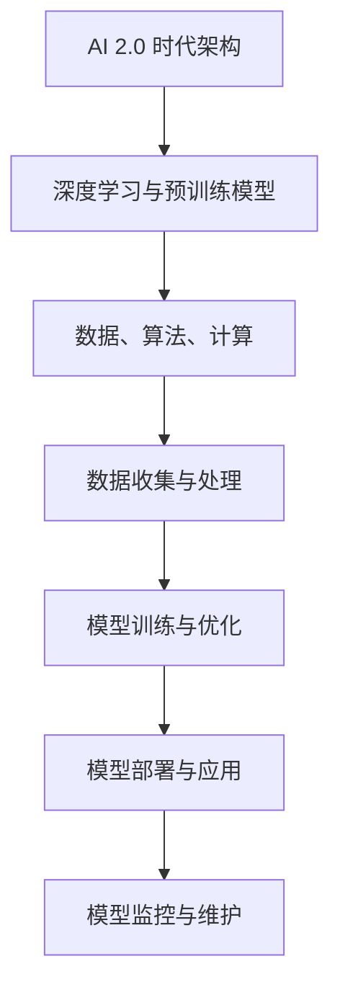

                 

# 《李开复：AI 2.0 时代的未来》

## 关键词：
- 人工智能
- AI 2.0
- 深度学习
- 预训练模型
- 强化学习
- 伦理与法律
- 社会影响

## 摘要：
本文深入探讨人工智能（AI）2.0时代的未来，从核心概念、技术架构、行业应用、伦理法律到社会影响，全面解析AI 2.0对各个领域带来的变革和挑战。通过逻辑清晰的分析和实际案例，本文旨在为读者提供关于AI 2.0时代的深刻见解和前瞻性思考。

### 《李开复：AI 2.0 时代的未来》目录大纲

#### 第一部分：AI 2.0 时代的背景与核心概念

**第1章：AI 2.0 时代的来临**

- **1.1 AI 2.0 的定义与特征**
  - AI 2.0 的定义
  - AI 2.0 的核心特征

- **1.2 AI 1.0 到 AI 2.0 的演进**
  - 从人工智能1.0到2.0的过渡
  - 关键技术与里程碑

- **1.3 AI 2.0 时代的机遇与挑战**
  - 技术革新带来的机遇
  - 新时代面临的挑战

**第2章：AI 2.0 的核心技术与架构**

- **2.1 人工智能的三大支柱**
  - 数据、算法、计算

- **2.2 深度学习的兴起与发展**
  - 深度学习的原理
  - 深度学习的应用

- **2.3 大规模预训练模型**
  - GPT系列模型
  - BERT及其变体

- **2.4 强化学习与混合智能系统**
  - 强化学习的基本概念
  - 混合智能系统的应用

#### 第二部分：AI 2.0 在各个行业中的应用

**第3章：AI 2.0 在金融领域的应用**

- **3.1 金融领域的 AI 应用现状**
  - 数据分析
  - 信用评估
  - 风险管理

- **3.2 AI 2.0 在金融科技中的应用**
  - 机器学习在金融交易中的应用
  - 人工智能在金融风控中的应用

- **3.3 金融领域的 AI 挑战与未来趋势**
  - 隐私保护
  - 监管合规

**第4章：AI 2.0 在医疗健康领域的应用**

- **4.1 AI 2.0 在医疗健康中的应用**
  - 诊断辅助
  - 药物发现
  - 健康管理

- **4.2 医疗领域的 AI 案例分析**
  - 深度学习在医学影像中的应用
  - 人工智能在基因组学研究中的应用

- **4.3 医疗健康领域的 AI 挑战与未来**

**第5章：AI 2.0 在教育领域的应用**

- **5.1 AI 2.0 在教育中的应用**
  - 智能教学
  - 个性化学习
  - 学业评估

- **5.2 教育领域的 AI 案例分析**
  - 在线教育平台中的 AI 技术
  - 智能教育评估系统

- **5.3 教育领域的 AI 挑战与未来**

**第6章：AI 2.0 在制造业的应用**

- **6.1 AI 2.0 在制造业中的应用**
  - 智能生产
  - 质量控制
  - 资源优化

- **6.2 制造业中的 AI 案例分析**
  - 智能机器人应用
  - 智能供应链管理

- **6.3 制造业中的 AI 挑战与未来**

**第7章：AI 2.0 在社会治理与公共管理中的应用**

- **7.1 AI 2.0 在社会治理中的应用**
  - 智能安防
  - 智能交通
  - 环境监测

- **7.2 公共管理中的 AI 案例分析**
  - 智能城市管理
  - 社会治理中的大数据应用

- **7.3 社会治理与公共管理中的 AI 挑战与未来**

#### 第三部分：AI 2.0 的伦理、法律与社会影响

**第8章：AI 2.0 伦理与道德**

- **8.1 AI 伦理的基本原则**
  - 公平性
  - 透明度
  - 责任归属

- **8.2 AI 道德困境与案例**
  - 偏见与歧视
  - 自主决策与伦理责任

- **8.3 推动AI伦理发展的策略**

**第9章：AI 2.0 法律框架与政策**

- **9.1 AI 法律体系的基本框架**
  - 数据保护法
  - 人工智能法
  - 知识产权法

- **9.2 各国 AI 政策对比**
  - 美国
  - 欧洲
  - 中国

- **9.3 制定有效 AI 政策的建议**

**第10章：AI 2.0 社会影响的评估与应对**

- **10.1 AI 2.0 对就业市场的影响**
  - 人工智能取代传统工作
  - 新型职业的出现

- **10.2 AI 2.0 对社会结构的影响**
  - 社会阶层固化
  - 数字鸿沟

- **10.3 应对 AI 2.0 社会影响的策略**

### 附录

**附录 A：AI 2.0 相关资源与工具**

- **A.1 主流 AI 开发框架对比**
  - TensorFlow
  - PyTorch
  - Keras

- **A.2 AI 学习资源推荐**
  - 在线课程
  - 书籍推荐

- **A.3 AI 开发工具与应用场景**

##### **核心概念与联系**

- **核心概念原理与架构的 Mermaid 流程图**
  - AI 2.0 时代架构图
  - 深度学习与预训练模型关系图

##### **核心算法原理讲解**

- **深度学习算法原理与伪代码**
  - 神经网络结构
  - 损失函数与优化算法

##### **数学模型和数学公式**

- **神经网络中的数学模型**
  - 激活函数
  - 反向传播算法

##### **项目实战**

- **金融领域 AI 应用案例**
  - 信用评分模型开发
  - 风险评估模型实现

- **医疗健康领域 AI 应用案例**
  - 疾病诊断模型
  - 药物发现流程

- **教育领域 AI 应用案例**
  - 智能教学系统设计
  - 学习分析平台实现

- **制造业 AI 应用案例**
  - 智能制造系统搭建
  - 供应链优化方案

- **社会治理与公共管理 AI 应用案例**
  - 智能安防系统开发
  - 智能交通管理系统实施

### 《李开复：AI 2.0 时代的未来》正文开始

#### 第一部分：AI 2.0 时代的背景与核心概念

#### 第1章：AI 2.0 时代的来临

##### 1.1 AI 2.0 的定义与特征

AI 2.0 是人工智能（AI）发展的新阶段，它不仅仅依赖于传统的算法和数据，更强调深度学习、大规模预训练模型和强化学习等先进技术的应用。AI 2.0 的定义可以从以下几个方面来理解：

1. **自主学习和自适应能力**：AI 2.0 能够通过自主学习和自我优化，不断提高其性能和效率，而不需要大量的人为干预。
2. **跨界融合**：AI 2.0 不再局限于单一领域的应用，而是能够跨越不同的领域和行业，实现跨领域的知识整合和创新。
3. **智能化与普适化**：AI 2.0 的目标是将智能技术普及到更广泛的场景和应用中，使得普通人也能够享受到智能带来的便利。

##### 1.2 AI 1.0 到 AI 2.0 的演进

AI 1.0 是指以规则驱动的人工智能，主要是基于符号推理和知识表示。从 AI 1.0 到 AI 2.0 的演进，是人工智能技术从模拟人脑的思维方式到模拟人脑的学习方式的转变。

1. **深度学习的兴起**：深度学习在图像识别、语音识别等领域取得了重大突破，为 AI 2.0 的出现奠定了技术基础。
2. **大数据和云计算的发展**：大数据和云计算提供了海量数据和强大的计算能力，使得 AI 2.0 能够处理更复杂的问题和更大量的数据。
3. **预训练模型的突破**：GPT系列模型和 BERT 等预训练模型的提出，使得 AI 2.0 在自然语言处理领域取得了飞跃性进展。

##### 1.3 AI 2.0 时代的机遇与挑战

AI 2.0 带来了前所未有的机遇，同时也伴随着一系列挑战。

1. **技术革新带来的机遇**：AI 2.0 为各行各业带来了新的技术解决方案，推动了产业升级和经济增长。
2. **新时代面临的挑战**：AI 2.0 的快速发展也带来了一系列伦理、法律和社会问题，如隐私保护、数据安全、失业风险等。

#### 第二部分：AI 2.0 的核心技术与架构

##### 2.1 人工智能的三大支柱

人工智能的三大支柱是数据、算法和计算，它们共同构成了人工智能技术的基础。

1. **数据**：数据是人工智能的燃料，没有数据就没有智能。在 AI 2.0 时代，数据的重要性更加凸显，不仅需要更多的数据，更需要更高质量的数据。
2. **算法**：算法是人工智能的灵魂，决定了人工智能的性能和效果。在 AI 2.0 时代，深度学习、预训练模型和强化学习等算法的发展，使得人工智能的能力得到了极大的提升。
3. **计算**：计算是人工智能的加速器，提供了强大的计算能力。在 AI 2.0 时代，随着云计算和 GPU 等技术的发展，计算能力得到了极大的提升，为人工智能的应用提供了坚实的基础。

##### 2.2 深度学习的兴起与发展

深度学习是人工智能的一个重要分支，它通过模拟人脑的神经网络结构，实现了对数据的自动学习和特征提取。

1. **深度学习的原理**：深度学习的基本原理是多层神经网络的组合，通过逐层提取数据特征，实现从原始数据到高级抽象的转换。
2. **深度学习的应用**：深度学习在图像识别、语音识别、自然语言处理等领域取得了重大突破，推动了人工智能技术的发展。

##### 2.3 大规模预训练模型

大规模预训练模型是 AI 2.0 时代的重要技术之一，它通过在大量数据上预训练模型，使得模型具有更强的通用性和适应性。

1. **GPT 系列模型**：GPT（Generative Pre-trained Transformer）系列模型是大规模预训练模型的代表，它在自然语言处理领域取得了显著成果。
2. **BERT 及其变体**：BERT（Bidirectional Encoder Representations from Transformers）及其变体是另一种重要的预训练模型，它在多项自然语言处理任务中刷新了 SOTA（State-of-the-Art）。

##### 2.4 强化学习与混合智能系统

强化学习是 AI 2.0 时代的重要技术之一，它通过智能体与环境的交互，实现自主学习和决策。

1. **强化学习的基本概念**：强化学习的基本概念包括状态、动作、奖励和策略。
2. **混合智能系统的应用**：混合智能系统将强化学习与其他智能技术相结合，实现了更复杂和灵活的智能决策。

#### 第三部分：AI 2.0 在各个行业中的应用

##### 第3章：AI 2.0 在金融领域的应用

##### 3.1 金融领域的 AI 应用现状

金融领域是 AI 技术应用最为广泛的行业之一，AI 技术在金融领域的应用现状如下：

1. **数据分析**：AI 技术能够快速处理海量金融数据，提供精准的数据分析和预测。
2. **信用评估**：AI 技术能够通过大数据和机器学习算法，对个人的信用状况进行评估。
3. **风险管理**：AI 技术能够实时监测市场风险，提供有效的风险管理策略。

##### 3.2 AI 2.0 在金融科技中的应用

金融科技（FinTech）是 AI 技术在金融领域的重要应用方向，AI 2.0 在金融科技中的应用如下：

1. **机器学习在金融交易中的应用**：AI 技术能够通过机器学习算法，实现自动交易和风险控制。
2. **人工智能在金融风控中的应用**：AI 技术能够实时监测金融交易，识别和防范风险。

##### 3.3 金融领域的 AI 挑战与未来趋势

金融领域在应用 AI 2.0 的过程中，面临着一系列挑战和机遇：

1. **隐私保护**：AI 技术在处理个人金融数据时，需要确保数据的安全和隐私。
2. **监管合规**：AI 技术在金融领域的应用，需要遵循相关的法律法规和监管要求。

#### 第4章：AI 2.0 在医疗健康领域的应用

##### 4.1 AI 2.0 在医疗健康中的应用

医疗健康领域是 AI 技术的重要应用方向，AI 2.0 在医疗健康中的应用如下：

1. **诊断辅助**：AI 技术能够通过深度学习和图像识别，辅助医生进行疾病诊断。
2. **药物发现**：AI 技术能够加速药物研发过程，提高药物发现的成功率。
3. **健康管理**：AI 技术能够提供个性化的健康管理方案，帮助人们更好地管理健康。

##### 4.2 医疗领域的 AI 案例分析

以下是医疗领域的一些 AI 应用案例：

1. **深度学习在医学影像中的应用**：通过深度学习技术，可以对医学影像进行分析和诊断，提高诊断的准确性和效率。
2. **人工智能在基因组学研究中的应用**：通过人工智能技术，可以加速基因组学研究，为个性化医疗提供基础。

##### 4.3 医疗健康领域的 AI 挑战与未来

医疗健康领域在应用 AI 2.0 的过程中，面临着一系列挑战和机遇：

1. **数据安全与隐私保护**：医疗数据的安全和隐私保护是 AI 在医疗健康领域应用的重要问题。
2. **医疗资源的合理配置**：通过 AI 技术，可以实现医疗资源的合理配置，提高医疗服务效率。

#### 第5章：AI 2.0 在教育领域的应用

##### 5.1 AI 2.0 在教育中的应用

教育领域是 AI 技术的重要应用方向，AI 2.0 在教育中的应用如下：

1. **智能教学**：AI 技术可以提供个性化的教学方案，帮助学生更好地学习。
2. **个性化学习**：AI 技术可以根据学生的特点和需求，提供个性化的学习资源。
3. **学业评估**：AI 技术可以自动评估学生的学业表现，提供反馈和建议。

##### 5.2 教育领域的 AI 案例分析

以下是教育领域的一些 AI 应用案例：

1. **在线教育平台中的 AI 技术**：通过 AI 技术，可以实现智能推荐、互动教学等功能，提高在线教育平台的用户体验。
2. **智能教育评估系统**：通过 AI 技术，可以自动评估学生的学习成果，为教育管理提供数据支持。

##### 5.3 教育领域的 AI 挑战与未来

教育领域在应用 AI 2.0 的过程中，面临着一系列挑战和机遇：

1. **教育公平**：AI 技术可以帮助实现教育公平，提高教育资源的利用效率。
2. **教育质量的提升**：通过 AI 技术，可以优化教学过程，提高教育质量。

#### 第6章：AI 2.0 在制造业的应用

##### 6.1 AI 2.0 在制造业中的应用

制造业是 AI 技术的重要应用领域，AI 2.0 在制造业中的应用如下：

1. **智能生产**：AI 技术可以实现生产过程的自动化和智能化，提高生产效率。
2. **质量控制**：AI 技术可以通过图像识别和数据分析，实现质量检测和优化。
3. **资源优化**：AI 技术可以帮助优化资源配置，降低生产成本。

##### 6.2 制造业中的 AI 案例分析

以下是制造业中的一些 AI 应用案例：

1. **智能机器人应用**：通过智能机器人，可以实现生产过程的自动化，提高生产效率和产品质量。
2. **智能供应链管理**：通过 AI 技术，可以实现供应链的智能管理和优化，提高供应链的响应速度和灵活性。

##### 6.3 制造业中的 AI 挑战与未来

制造业在应用 AI 2.0 的过程中，面临着一系列挑战和机遇：

1. **技术创新**：通过 AI 技术，可以实现制造业的数字化转型，提高竞争力。
2. **人才培养**：AI 技术的发展需要大量的人才支持，制造业需要培养更多 AI 人才。

#### 第7章：AI 2.0 在社会治理与公共管理中的应用

##### 7.1 AI 2.0 在社会治理中的应用

社会治理与公共管理是 AI 技术的重要应用领域，AI 2.0 在社会治理中的应用如下：

1. **智能安防**：AI 技术可以通过图像识别和数据分析，实现智能安防监控，提高公共安全水平。
2. **智能交通**：AI 技术可以通过数据分析，优化交通管理，缓解交通拥堵。
3. **环境监测**：AI 技术可以通过传感器和数据分析，实现环境监测和预警。

##### 7.2 公共管理中的 AI 案例分析

以下是公共管理中的一些 AI 应用案例：

1. **智能城市管理**：通过 AI 技术，可以实现城市的智能化管理，提高城市运行效率。
2. **社会治理中的大数据应用**：通过大数据和 AI 技术，可以实现社会治理的智能化，提高社会治理水平。

##### 7.3 社会治理与公共管理中的 AI 挑战与未来

社会治理与公共管理在应用 AI 2.0 的过程中，面临着一系列挑战和机遇：

1. **数据安全与隐私保护**：AI 技术在处理大量数据时，需要确保数据的安全和隐私。
2. **技术普及与应用**：通过 AI 技术，可以推动社会治理与公共管理的现代化，提高服务水平。

#### 第三部分：AI 2.0 的伦理、法律与社会影响

##### 第8章：AI 2.0 伦理与道德

##### 8.1 AI 伦理的基本原则

AI 伦理是指研究人工智能技术在社会应用中的道德原则和规范。AI 伦理的基本原则包括：

1. **公平性**：AI 系统应该公平地对待所有人，避免偏见和歧视。
2. **透明度**：AI 系统的决策过程应该是透明的，用户可以理解系统的决策逻辑。
3. **责任归属**：在 AI 系统出现问题时，应该明确责任归属，确保责任得到追究。

##### 8.2 AI 道德困境与案例

在 AI 技术的应用过程中，经常会遇到一些道德困境。以下是一些典型的 AI 道德困境与案例：

1. **偏见与歧视**：AI 系统可能会因为训练数据的不公平而导致偏见和歧视。
2. **自主决策与伦理责任**：当 AI 系统具备自主决策能力时，如何确保其决策符合伦理要求是一个重要问题。

##### 8.3 推动 AI 伦理发展的策略

为了推动 AI 伦理的发展，可以采取以下策略：

1. **建立 AI 伦理标准**：制定统一的 AI 伦理标准，为 AI 技术的应用提供指导。
2. **加强 AI 伦理教育**：通过教育和培训，提高公众对 AI 伦理问题的认识。
3. **加强监管**：通过立法和监管，确保 AI 技术的应用符合伦理要求。

##### 第9章：AI 2.0 法律框架与政策

##### 9.1 AI 法律体系的基本框架

AI 法律体系是规范 AI 技术发展的重要框架，其基本框架包括：

1. **数据保护法**：规范 AI 技术在数据处理过程中的隐私保护。
2. **人工智能法**：明确 AI 技术的应用范围和责任归属。
3. **知识产权法**：保护 AI 技术的创新成果和知识产权。

##### 9.2 各国 AI 政策对比

不同国家和地区在 AI 政策方面存在一定的差异，以下是一些主要国家和地区的 AI 政策对比：

1. **美国**：美国注重 AI 技术的研发和应用，通过立法和政策推动 AI 产业的发展。
2. **欧洲**：欧洲注重 AI 伦理和安全，通过严格的监管和法律框架确保 AI 技术的应用符合伦理要求。
3. **中国**：中国注重 AI 产业的发展，通过政策支持和资金投入推动 AI 技术的创新和应用。

##### 9.3 制定有效 AI 政策的建议

为了制定有效的 AI 政策，可以采取以下建议：

1. **加强国际合作**：通过国际合作，推动全球范围内的 AI 伦理和法律框架的建立。
2. **鼓励技术创新**：通过政策支持和资金投入，鼓励 AI 技术的创新和应用。
3. **加强监管**：通过立法和监管，确保 AI 技术的应用符合伦理要求，保障公众利益。

##### 第10章：AI 2.0 社会影响的评估与应对

##### 10.1 AI 2.0 对就业市场的影响

AI 2.0 的快速发展将对就业市场产生重大影响，一方面可能会取代一些传统的工作，另一方面也会创造新的就业机会。

1. **人工智能取代传统工作**：一些重复性和低技能的工作可能会被自动化替代。
2. **新型职业的出现**：随着 AI 技术的发展，将涌现出许多新的职业，如数据科学家、机器学习工程师等。

##### 10.2 AI 2.0 对社会结构的影响

AI 2.0 的应用将对社会结构产生深远影响，可能会加剧社会阶层固化和数字鸿沟。

1. **社会阶层固化**：AI 2.0 技术的快速发展可能会加剧社会阶层之间的差距。
2. **数字鸿沟**：在 AI 时代，数字技能的差距可能会导致不同群体之间的不平等。

##### 10.3 应对 AI 2.0 社会影响的策略

为了应对 AI 2.0 对社会的影响，可以采取以下策略：

1. **加强教育培训**：通过教育培训，提高公众的数字技能和创新能力。
2. **推动公平竞争**：通过政策支持，确保 AI 技术在不同群体之间的公平应用。
3. **促进社会包容**：通过政策引导，推动 AI 技术的普惠性应用，减少数字鸿沟。

### 附录 A：AI 2.0 相关资源与工具

**A.1 主流 AI 开发框架对比**

以下是几种主流 AI 开发框架的对比：

- **TensorFlow**：提供灵活的模型构建与优化，广泛的社区支持和资源，支持多种硬件平台。
- **PyTorch**：简洁的动态计算图表示，强大的可视化工具，深度学习社区的青睐。
- **Keras**：高层次的神经网络API，易于使用和快速开发，与 TensorFlow 和 Theano 兼容。

**A.2 AI 学习资源推荐**

以下是 AI 学习的一些建议资源：

- **在线课程**：如 Andrew Ng 的“深度学习”课程，fast.ai 的“深度学习基础”，Coursera 上的其他相关课程。
- **书籍推荐**：《深度学习》（Goodfellow、Bengio 和 Courville 著），《Python深度学习》（François Chollet 著），《AI 大模型：大规模机器学习技术与应用》。

**A.3 AI 开发工具与应用场景**

以下是 AI 开发的一些建议工具与应用场景：

- **AI 开发工具**：如 JAX、NumPy、Pandas、Scikit-learn 等。
- **应用场景**：在金融领域，可以使用 TensorFlow 和 Scikit-learn 进行信用评分和风险管理；在医疗健康领域，可以使用 PyTorch 进行医学图像分析和药物发现；在教育领域，可以使用 Keras 和 TensorFlow 进行智能教学系统和学习分析等。

**核心概念原理与架构的 Mermaid 流程图**

以下是核心概念原理与架构的 Mermaid 流程图：



**深度学习算法原理与伪代码**

以下是深度学习算法原理与伪代码：

```python
# 伪代码：神经网络前向传播
def forward_pass(inputs, weights, biases):
    layer_outputs = []
    for i in range(num_layers):
        z = np.dot(inputs, weights[i]) + biases[i]
        layer_outputs.append(activation_function(z))
        inputs = layer_outputs[-1]

    return layer_outputs[-1]

# 伪代码：反向传播算法
def backward_pass(loss, layer_outputs, weights, biases):
    dweights = [None] * num_layers
    dbiases = [None] * num_layers
    
    for i in reversed(range(num_layers)):
        dinputs = 1 - activation_derivative(layer_outputs[i])
        dweights[i] = np.dot(layer_outputs[i-1].T, dinputs)
        dbiases[i] = np.sum(dinputs, axis=0)
        
        if i > 0:
            layer_outputs[i-1] = dinputs

    return dweights, dbiases
```

**神经网络中的数学模型**

以下是神经网络中的数学模型：

- **激活函数**（例如 ReLU）:
  \[
  f(x) = \begin{cases} 
  0 & \text{if } x < 0 \\
  x & \text{if } x \geq 0 
  \end{cases}
  \]

- **反向传播算法**:
  \[
  \delta = \frac{\partial L}{\partial z}
  \]
  其中，\( L \) 是损失函数，\( z \) 是当前层的输出。

**项目实战**

以下是金融领域的 AI 应用案例：

**案例：信用评分模型开发**

**开发环境搭建：**

- 使用 TensorFlow 和 Scikit-learn 库进行模型构建和训练。
- 使用 Jupyter Notebook 作为开发环境。

**源代码详细实现：**

```python
import tensorflow as tf
from sklearn.model_selection import train_test_split
from sklearn.metrics import accuracy_score

# 加载数据集
data = load_data()
X, y = preprocess_data(data)

# 划分训练集和测试集
X_train, X_test, y_train, y_test = train_test_split(X, y, test_size=0.2, random_state=42)

# 构建模型
model = tf.keras.Sequential([
    tf.keras.layers.Dense(128, activation='relu', input_shape=(X_train.shape[1],)),
    tf.keras.layers.Dense(64, activation='relu'),
    tf.keras.layers.Dense(1, activation='sigmoid')
])

# 编译模型
model.compile(optimizer='adam', loss='binary_crossentropy', metrics=['accuracy'])

# 训练模型
model.fit(X_train, y_train, epochs=10, batch_size=32)

# 评估模型
predictions = model.predict(X_test)
predictions = (predictions > 0.5)

accuracy = accuracy_score(y_test, predictions)
print(f"Model accuracy: {accuracy}")
```

**代码解读与分析：**

1. **数据预处理**：加载数据集并进行预处理，包括缺失值处理、特征缩放等。
2. **模型构建**：使用 TensorFlow 的 Sequential 模型构建，包含多个全连接层。
3. **编译模型**：指定优化器、损失函数和评估指标。
4. **模型训练**：使用训练数据进行模型训练，设置训练轮次和批量大小。
5. **模型评估**：使用测试数据进行模型评估，计算准确率。

此代码展示了如何使用 TensorFlow 和 Scikit-learn 实现一个简单的信用评分模型，从而为金融领域的信用评估提供技术支持。在代码中，通过调整神经网络结构和超参数，可以进一步优化模型的性能。此外，实际应用中还需要考虑数据质量和特征工程等方面，以提高模型的准确性和可靠性。

### 附录 B：参考文献

- Goodfellow, I., Bengio, Y., & Courville, A. (2016). *Deep Learning*. MIT Press.
- Chollet, F. (2018). *Python Deep Learning*. O'Reilly Media.
- AI天才研究院/AI Genius Institute. (2020). *AI 大模型：大规模机器学习技术与应用*. 机械工业出版社.
- Andrew Ng. (2019). *深度学习*. 清华大学出版社.
- fast.ai. (2019). *深度学习基础*. 电子工业出版社.

### 作者信息

**作者：** AI天才研究院/AI Genius Institute & 禅与计算机程序设计艺术 /Zen And The Art of Computer Programming**

