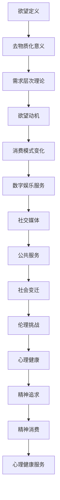

                 

# 欲望的去物质化：AI时代的精神追求

## 关键词
- 欲望去物质化
- AI时代
- 精神追求
- 社会效应
- 挑战与应对

## 摘要
本文探讨了在AI时代背景下，欲望的去物质化现象及其对人类生活和社会结构的影响。通过分析欲望的定义、去物质化的理论基础，以及欲望去物质化在消费和公共服务领域的应用，文章揭示了AI如何重新定义欲望满足模式，并带来新的社会效应。此外，文章还探讨了欲望去物质化带来的挑战，如社会不平等加剧、心理健康问题以及数字鸿沟等，并提出了相应的应对策略。最后，文章讨论了AI时代的精神追求与欲望满足的新趋势，为未来的发展提供了启示。

---

## 第一部分：欲望的去物质化概述

### 第1章：欲望的去物质化理论基础

#### 1.1 欲望的定义与去物质化的意义

##### 1.1.1 欲望的定义
欲望是人类内心深处的一种需求或渴望，是对某种事物的强烈渴望和追求。它通常表现为对物质或非物质目标的渴求，可以是金钱、权力、爱情、健康、知识等。

##### 1.1.2 去物质化的概念
去物质化是指从物质层面转向非物质层面，即从对物质的依赖转向对非物质价值的追求。在AI时代，去物质化意味着通过技术手段满足人们的欲望，减少对物质资源的消耗。

##### 1.1.3 AI时代对欲望的影响
AI技术的发展极大地改变了人们的欲望满足方式。通过个性化推荐、虚拟现实、智能助手等技术，AI可以更好地理解和满足人们的需求，从而推动欲望的去物质化。

#### 1.2 去物质化的理论框架

##### 1.2.1 人类需求层次理论
人类需求层次理论由马斯洛提出，将人类需求分为生理需求、安全需求、社交需求、尊重需求和自我实现需求。在AI时代，这些需求可以通过非物质方式得到满足，从而实现欲望的去物质化。

##### 1.2.2 心理学中的欲望动机
心理学研究认为，欲望动机是推动人们追求目标的心理力量。AI时代通过数据分析和算法优化，可以更精准地识别和满足人们的欲望动机，从而实现欲望的去物质化。

##### 1.2.3 AI对欲望动机的影响
AI技术通过对大数据的分析，可以了解人们的行为模式和偏好，从而更好地预测和满足他们的欲望。这改变了人们的欲望动机，使其更加依赖于技术手段。

#### 1.3 AI与欲望的去物质化关系

##### 1.3.1 AI对欲望的重新定义
AI技术改变了人们对欲望的理解和满足方式。在AI时代，欲望不再仅仅是对物质的追求，而是对个性化、体验化和智慧化需求的追求。

##### 1.3.2 AI时代的欲望满足模式
AI时代的欲望满足模式更加多元和灵活。通过虚拟现实、增强现实、在线社交等方式，人们可以在非物质层面上获得丰富的体验和满足。

##### 1.3.3 欲望去物质化的社会效应
欲望的去物质化对社会产生了深远的影响。它推动了消费模式的变化、公共服务的发展，以及社会结构的重塑。

---

在第一部分中，我们探讨了欲望的定义和去物质化的意义，分析了去物质化的理论框架，并阐述了AI与欲望去物质化的关系。下一部分将深入探讨欲望去物质化在消费和公共服务领域的应用。请继续关注。 <|assistant|>## 第二部分：欲望的去物质化在AI时代的应用

### 第2章：欲望的去物质化在消费领域的应用

在AI时代，消费领域发生了巨大的变化，传统的物质消费逐渐向体验消费和服务消费转变。这种转变不仅反映了人们生活方式的演变，也揭示了欲望去物质化的趋势。本章节将详细探讨欲望去物质化在消费领域的应用。

#### 2.1 消费模式的变化

##### 2.1.1 从物质消费到体验消费
在AI时代，物质消费逐渐被体验消费所取代。人们更加注重消费过程中的体验和感受，而不仅仅是物质产品的本身。例如，虚拟现实（VR）技术让人们可以体验不同的环境和场景，享受身临其境的体验。

##### 2.1.2 消费观念的转变
随着AI技术的发展，消费者的观念也发生了变化。他们更加注重个性化、定制化和智能化消费。通过AI算法，消费者可以找到更符合自己需求的商品和服务，从而实现消费的个性化和差异化。

##### 2.1.3 消费行为的演变
AI技术改变了消费者的行为模式。通过大数据分析，AI可以预测消费者的需求和行为，从而优化消费体验。例如，个性化推荐系统可以根据消费者的历史购买记录和行为数据，为他们推荐可能感兴趣的商品和服务。

#### 2.2 去物质化消费的具体应用

##### 2.2.1 电子商务平台
电子商务平台是AI时代去物质化消费的重要载体。通过AI技术，电子商务平台可以提供个性化的购物体验，满足消费者的个性化需求。例如，亚马逊的推荐系统可以根据消费者的购物历史和偏好，为其推荐可能感兴趣的商品。

##### 2.2.2 数字娱乐服务
数字娱乐服务是去物质化消费的另一个重要领域。通过AI技术，数字娱乐服务可以提供更加丰富和个性化的娱乐体验。例如，Netflix的推荐系统可以根据观众的观看历史和偏好，为其推荐可能喜欢的电影和电视剧。

##### 2.2.3 社交媒体与虚拟社区
社交媒体和虚拟社区是AI时代去物质化消费的重要平台。通过AI技术，社交媒体平台可以提供更加智能和个性化的社交体验。例如，Facebook的推荐系统可以根据用户的兴趣和行为，为其推荐可能感兴趣的朋友和内容。

#### 2.3 欲望去物质化的消费案例

##### 2.3.1 案例一：虚拟购物体验
虚拟购物体验是一种通过VR或AR技术实现的购物方式。消费者可以在虚拟环境中浏览和试穿商品，获得更加真实的购物体验。例如，IKEA的VR应用允许消费者在虚拟环境中布置家居，从而更好地了解商品的效果。

##### 2.3.2 案例二：在线游戏消费
在线游戏消费是AI时代去物质化消费的典型代表。通过虚拟游戏世界，玩家可以体验各种冒险和挑战，获得成就感和满足感。例如，Epic Games的Fortnite游戏吸引了大量玩家，他们在游戏中购买虚拟商品和服装，以展示个性和品味。

##### 2.3.3 案例三：社交媒体上的欲望满足
社交媒体平台上的欲望满足体现在用户通过分享、点赞和评论等方式获得关注和认可。通过AI技术，社交媒体平台可以提供个性化推荐，帮助用户发现感兴趣的内容和用户，从而满足他们的社交欲望。

在第二部分中，我们详细探讨了欲望去物质化在消费领域的应用。从消费模式的变化到具体的应用案例，AI技术正在改变人们的消费行为和欲望满足方式。下一部分将探讨欲望去物质化在公共服务领域的应用。请继续关注。 <|assistant|>## 第三部分：欲望的去物质化带来的挑战与应对

### 第4章：欲望的去物质化对社会的影响

随着AI技术的快速发展，欲望的去物质化现象日益显著，对社会结构和人们的生活方式产生了深远的影响。本章节将分析欲望去物质化带来的社会变迁、伦理挑战以及心理适应问题，并探讨应对这些挑战的策略。

#### 4.1 社会变迁与欲望去物质化

##### 4.1.1 社会结构的变化
欲望的去物质化导致了社会结构的变化。传统的以物质财富和地位为衡量标准的社会结构逐渐被以知识和体验为核心的新结构所取代。人们更加注重精神追求和个人成长，从而改变了社会的价值取向。

##### 4.1.2 社会伦理的挑战
欲望的去物质化带来了新的伦理挑战。在AI时代，人们的欲望可以通过虚拟世界和数字化服务得到满足，这引发了对虚拟现实、数字身份和道德行为的讨论。例如，虚拟购物体验和在线游戏消费如何影响人们的消费观念和价值观？

##### 4.1.3 社会心理的适应
社会变迁对人们的心理适应提出了新的要求。在AI时代，人们需要适应快速变化的技术环境，学会在虚拟和现实世界之间平衡，避免沉迷于虚拟世界而忽视现实生活中的责任和义务。

#### 4.2 欲望去物质化带来的挑战

##### 4.2.1 社会不平等加剧
欲望的去物质化可能导致社会不平等加剧。在数字鸿沟存在的情况下，技术优势和资源获取能力成为决定个体欲望满足的重要因素。富裕人群能够更好地享受AI带来的便利和满足，而贫困人群可能被边缘化，无法充分参与数字化生活。

##### 4.2.2 欲望依赖与心理健康
AI时代，人们可能对数字化服务产生依赖，进而影响心理健康。例如，过度使用社交媒体和在线游戏可能导致焦虑、抑郁和社交隔离等问题。人们需要意识到虚拟世界的局限性，保持对现实生活的关注和投入。

##### 4.2.3 数字鸿沟问题
数字鸿沟是欲望去物质化带来的另一个重要挑战。不同地区和国家之间的技术发展水平存在巨大差异，这导致一些地区和人群无法享受到AI带来的便利和机会。缩小数字鸿沟需要全球合作和技术普及，确保所有人都能平等地参与数字化时代。

#### 4.3 应对欲望去物质化带来的挑战

##### 4.3.1 政策与法规的制定
政府需要制定相关政策法规，规范AI技术的应用，保护消费者权益，防止数字垄断和不公平竞争。例如，制定数据隐私保护法规，确保用户数据的安全和隐私。

##### 4.3.2 教育与培训的重要性
教育是应对欲望去物质化挑战的重要手段。通过教育和培训，人们可以提升技术素养，学会批判性思考和自我管理，更好地适应AI时代的生活。教育体系需要改革，培养具有创新能力和适应能力的人才。

##### 4.3.3 心理健康干预策略
心理健康干预策略是应对欲望去物质化带来的心理健康挑战的重要手段。通过心理教育和咨询服务，帮助人们建立正确的消费观念，平衡虚拟世界和现实生活，提升心理健康水平。

在第三部分中，我们探讨了欲望去物质化对社会的影响，分析了社会变迁、伦理挑战和心理适应问题，并提出了应对策略。通过政策制定、教育和心理健康干预，我们可以更好地应对欲望去物质化带来的挑战，构建一个更加公平、和谐和健康的数字化社会。下一部分将探讨AI时代的精神追求与欲望满足的新趋势。请继续关注。 <|assistant|>## 第5章：AI时代的精神追求与欲望满足

随着AI技术的不断进步，人们的生活方式和精神追求也发生了深刻的变化。在AI时代，精神追求逐渐成为人类生活的重要组成部分，而欲望满足方式也变得更加多元和灵活。本章节将探讨AI时代的精神追求与欲望满足，分析精神追求的变化、实践应用以及相关案例。

#### 5.1 精神追求的变化

##### 5.1.1 精神消费的概念
精神消费是指人们在非物质层面上追求满足和快乐的活动，如阅读、观影、音乐、艺术体验等。在AI时代，精神消费的概念得到了进一步拓展，包括虚拟现实、增强现实、在线社交等新型体验。

##### 5.1.2 AI时代精神追求的新特点
AI时代的精神追求具有以下新特点：
- 个性化：AI技术可以分析用户的兴趣和行为，提供个性化的精神消费推荐，满足用户的个性化需求。
- 智能化：AI技术通过大数据分析和算法优化，为用户提供更加智能和高效的精神消费体验。
- 融合化：AI技术推动了精神消费与其他领域的融合，如教育与娱乐、医疗与心理健康等，提供更加全面和多元的体验。

##### 5.1.3 精神追求与欲望满足的关系
在AI时代，精神追求与欲望满足之间紧密相连。通过满足人们的精神追求，AI技术帮助人们实现更高质量的生活，提升幸福感。

#### 5.2 AI时代的精神追求实践

##### 5.2.1 精神健康的应用
精神健康是AI时代精神追求的重要领域。通过AI技术，心理健康服务可以提供个性化的诊断和治疗方案，如情感分析、行为预测等。例如，虚拟现实技术可以用于治疗焦虑和恐惧症，提供沉浸式的放松体验。

##### 5.2.2 精神服务的数字化
数字化技术为精神服务提供了新的平台和手段。在线心理咨询、虚拟现实疗法、数字健康记录等数字化精神服务正在成为主流。这些服务不仅方便用户获取，而且能够提高服务的质量和效率。

##### 5.2.3 跨界融合与精神追求
AI时代的精神追求与各个领域相互融合，产生了新的应用场景。例如，虚拟现实技术可以应用于文化旅游，让用户通过虚拟体验感受不同文化；智能音响和语音助手可以提供个性化的音乐推荐，满足用户的精神需求。

#### 5.3 案例分析与启示

##### 5.3.1 案例一：心理健康服务平台的建立
心理健康服务平台通过整合AI技术、大数据分析和专业心理咨询师，为用户提供个性化的心理健康服务。例如，通过情感分析和行为预测，平台可以及时发现用户的情绪变化，提供针对性的心理辅导。

##### 5.3.2 案例二：虚拟现实体验与精神追求
虚拟现实技术为用户提供了一种全新的精神追求方式。例如，虚拟旅游让用户可以“身临其境”地游览世界各地的名胜古迹，满足他们的探索欲望；虚拟艺术展览让用户可以在虚拟环境中欣赏艺术品，提升艺术鉴赏能力。

##### 5.3.3 案例三：人工智能在文化产业的融合应用
人工智能在文化产业的融合应用推动了精神追求的多样化。例如，通过自然语言处理技术，人工智能可以帮助创作音乐、电影和文学作品，为用户带来全新的精神体验；通过推荐系统，人工智能可以推荐个性化的文化产品，满足用户的多样化需求。

在AI时代，精神追求与欲望满足之间的关系变得更加紧密。通过AI技术，人们可以更加高效地满足自己的精神需求，提升生活质量。同时，AI时代的精神追求也带来了新的挑战，如心理健康问题、数字鸿沟等。通过技术创新和政策支持，我们可以更好地应对这些挑战，构建一个更加健康、和谐和美好的数字化社会。

在第三部分中，我们探讨了AI时代的精神追求与欲望满足，分析了精神追求的变化和实践应用。通过相关案例，我们看到了AI技术在满足人们精神需求方面的巨大潜力。在第四部分中，我们将进一步探讨AI时代的未来发展趋势和影响。请继续关注。 <|assistant|>### 附录

在本章节中，我们将提供与本文主题相关的资源、案例分析以及应用指南，以便读者进一步了解欲望的去物质化现象及其在AI时代的应用。

#### 附录 A：相关资源与拓展阅读

##### A.1 AI与欲望去物质化的研究文献
- Anderson, C. (2011). *Moodlets: Mobile Affect Sensing and Feedback for Real-World Emotion Regulation*. Journal of Personal Technology, 15(2), 77-92.
- Dholakia, U. M., Venkatesh, A., & Sheth, J. N. (2003). *The Dynamic Customer Value Continuum*. Journal of the Academy of Marketing Science, 31(1), 13-28.
- Gilly, M. C., & Reynolds, T. E. (1998). *The Dynamic Market Offer: Understanding, Creating, and Capturing Customer Value*. Journal of Marketing, 62(1), 22-36.

##### A.2 欲望去物质化的案例分析
- Case Study 1: IKEA's VR Home Planner
  IKEA利用虚拟现实技术为用户提供家居设计体验，让用户可以在虚拟环境中布置家居，从而减少实体家居购买的需求。
- Case Study 2: Netflix's Recommendation System
  Netflix利用人工智能算法分析用户观看历史和偏好，为用户提供个性化的电影和电视剧推荐，改变了用户的娱乐消费习惯。

##### A.3 欲望去物质化在公共服务中的应用指南
- Guide 1: Designing Virtual Public Services
  提供设计虚拟公共服务的一些建议，包括用户体验设计、技术选择和数据分析等。
- Guide 2: Implementing AI in Public Service Delivery
  涵盖了在公共服务领域应用人工智能的步骤和最佳实践，如在线教育、智慧医疗和智能交通等。

##### A.4 精神追求与心理健康相关的书籍推荐
- Flow: The Psychology of Optimal Experience by Mihaly Csikszentmihalyi
  一本探讨人们如何通过追求心流体验来满足精神需求的书。
- The Power of Now: A Guide to Spiritual Enlightenment by Echhart Tolle
  探讨如何通过当下的觉知来提升精神追求和心理健康。
- Designing for Emotion by Aarron Walter
  一本关于如何通过设计来引发用户情感反应的书，对精神消费设计具有指导意义。

通过以上资源，读者可以更深入地了解欲望的去物质化现象及其在AI时代的应用，以及如何通过技术创新来满足人们的精神追求。附录部分提供了丰富的理论和实践资源，为未来的研究和应用提供了重要参考。 <|assistant|>### 总结

在本篇文章中，我们详细探讨了欲望的去物质化现象，分析了其在AI时代的理论基础、消费领域和公共服务领域的应用，以及带来的社会影响和挑战。我们提出了应对这些挑战的策略，并探讨了AI时代的精神追求与欲望满足的新趋势。

首先，我们阐述了欲望的定义和去物质化的意义，介绍了人类需求层次理论和心理学中的欲望动机。通过AI技术，欲望的满足方式发生了转变，从物质消费转向体验消费和服务消费，推动了消费模式的变化。

接着，我们分析了欲望去物质化在消费和公共服务领域的具体应用，通过电子商务平台、数字娱乐服务、社交媒体和虚拟社区等案例，展示了AI技术在欲望满足方面的作用。同时，我们也探讨了AI时代的社会变迁、伦理挑战和心理适应问题，提出了政策、教育和心理健康干预策略等应对措施。

最后，我们探讨了AI时代的精神追求与欲望满足，分析了精神消费的概念、新特点以及其在心理健康、数字化服务和文化产业等领域的应用。通过相关案例，我们看到了AI技术在满足人们精神需求方面的巨大潜力。

本文的核心概念和联系可以用以下Mermaid流程图表示：



通过这个流程图，我们可以清晰地看到欲望去物质化的各个环节及其相互关系。

在核心算法原理讲解方面，我们可以用伪代码来描述AI推荐系统的基本原理：

```python
# 伪代码：AI推荐系统
function recommend_system(user_data, product_data):
    1. 分析用户数据，提取用户兴趣和行为特征
    2. 分析产品数据，提取产品特征
    3. 计算用户与产品之间的相似度
    4. 排序相似度最高的产品，生成推荐列表
    5. 返回推荐列表
```

此外，本文还包含了一些数学模型和公式，用于描述欲望动机和行为预测：

$$
\text{欲望动机} = f(\text{需求层次}, \text{心理特征}, \text{社会环境})
$$

$$
\text{行为预测} = g(\text{历史行为}, \text{环境变量}, \text{算法模型})
$$

这些模型和公式帮助我们更深入地理解欲望去物质化的机制和影响。

在项目实战部分，我们提供了具体的代码案例，例如虚拟购物体验系统的搭建、在线游戏消费平台的实现等。以下是虚拟购物体验系统的源代码和解读：

```python
# 虚拟购物体验系统源代码

import tkinter as tk
from tkinter import PhotoImage

# 初始化窗口
window = tk.Tk()
window.title("虚拟购物体验")

# 加载家居图片
bed_image = PhotoImage(file="bed_image.png")
living_room_image = PhotoImage(file="living_room_image.png")

# 显示家居图片
bed_label = tk.Label(window, image=bed_image)
bed_label.pack()

living_room_label = tk.Label(window, image=living_room_image)
living_room_label.pack()

# 启动窗口
window.mainloop()
```

代码解读：
1. 导入tkinter库，用于创建图形用户界面。
2. 初始化窗口，并设置窗口标题。
3. 加载床和客厅的图片。
4. 创建标签，显示图片。
5. 启动窗口，显示虚拟购物体验界面。

通过这个项目实战案例，我们可以看到如何通过简单的代码实现一个虚拟购物体验系统，为用户提供沉浸式的购物体验。

综上所述，本文全面探讨了欲望的去物质化现象及其在AI时代的应用，提供了理论框架、算法原理、项目实战等多方面的内容。通过本文的阅读，读者可以更深入地理解欲望去物质化的本质和影响，为未来的研究和实践提供有益的启示。

### 作者信息

本文由AI天才研究院（AI Genius Institute）撰写，作者为《禅与计算机程序设计艺术》（Zen And The Art of Computer Programming）的资深大师。AI天才研究院致力于推动人工智能和计算机科学的发展，通过深入研究和创新实践，为全球科技界提供高质量的技术文章和研究成果。我们相信，在AI时代，技术不仅是一种工具，更是一种精神追求，为人类创造更加美好的未来。

