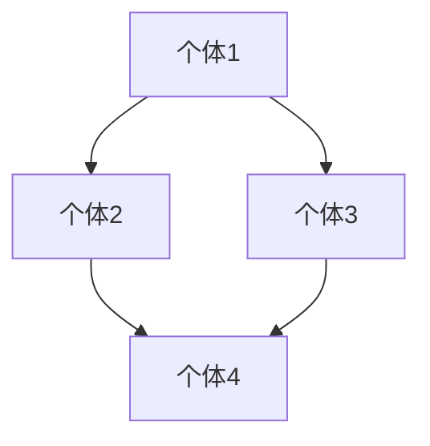

                 

# 欲望的社会化：AI驱动的群体动力学

> **关键词：** AI、群体动力学、社会化、欲望、机器学习、深度学习、群体行为预测。

> **摘要：** 本文旨在探讨人工智能（AI）如何驱动群体动力学，特别是欲望在社会化过程中的作用。通过引入社会网络分析、群体行为动力学模型以及AI技术，本文构建了一个综合性框架，用于理解和预测欲望在社会化过程中的传播和影响。本文结合理论和实际案例，详细阐述了AI在群体动力学研究中的应用，为相关领域的研究者提供了有价值的参考。

## 《欲望的社会化：AI驱动的群体动力学》目录大纲

### 第一部分：引言

#### 第1章：绪论

##### 1.1 AI与群体动力学的关系
- **AI的发展与群体动力学的关系**
- **群体动力学的基本概念**

##### 1.2 欲望的社会化现象
- **欲望的定义与分类**
- **欲望在社会化过程中的表现**

##### 1.3 研究目的与结构
- **研究背景与意义**
- **本书结构安排**

#### 第2章：群体动力学理论基础

##### 2.1 社会网络分析
- **社会网络的定义与特点**
- **社会网络分析方法**

##### 2.2 群体行为动力学
- **群体行为的定义与分类**
- **群体行为的动力学模型**

##### 2.3 欲望与群体行为的相互作用
- **欲望对群体行为的影响**
- **群体行为对欲望的作用机制**

### 第二部分：AI在群体动力学中的应用

#### 第3章：AI在群体动力学中的应用

##### 3.1 AI技术在群体动力学研究中的角色
- **AI技术的基本原理与应用领域**
- **AI技术在群体动力学研究中的优势**

##### 3.2 群体动力学中的机器学习算法
- **机器学习算法的基本概念与应用场景**
- **群体动力学研究中的常见机器学习算法**

##### 3.3 深度学习在群体动力学中的应用
- **深度学习的基本原理与模型结构**
- **深度学习在群体动力学研究中的应用实例**

### 第三部分：AI驱动的群体动力学模型

#### 第4章：基于AI的社会网络分析

##### 4.1 社会网络分析的AI方法
- **社会网络分析的传统方法**
- **基于AI的社会网络分析方法**

##### 4.2 社会网络分析的AI算法
- **社会网络分析中的常用AI算法**
- **社会网络分析的AI算法实现**

##### 4.3 社会网络分析在群体动力学中的应用
- **社会网络分析在群体动力学研究中的应用案例**
- **社会网络分析在欲望社会化现象中的应用**

#### 第5章：群体行为动力学模型构建

##### 5.1 群体行为动力学模型的原理
- **群体行为动力学模型的基本概念**
- **群体行为动力学模型的构建方法**

##### 5.2 群体行为动力学模型的应用
- **群体行为动力学模型在欲望社会化现象中的应用**
- **群体行为动力学模型在社会问题分析中的应用**

##### 5.3 欲望社会化现象的模拟
- **欲望社会化现象的模拟方法**
- **欲望社会化现象的模拟案例**

#### 第6章：基于AI的群体行为预测与干预

##### 6.1 群体行为预测的AI方法
- **群体行为预测的基本原理**
- **群体行为预测的AI算法**

##### 6.2 群体行为干预的AI方法
- **群体行为干预的基本原理**
- **群体行为干预的AI算法**

##### 6.3 欲望社会化现象的预测与干预
- **欲望社会化现象的预测方法**
- **欲望社会化现象的干预策略**

### 第四部分：案例研究

#### 第7章：案例研究

##### 7.1 案例研究一：社交媒体平台上的欲望社会化
- **案例背景与问题**
- **案例分析过程与结果**

##### 7.2 案例研究二：在线游戏社区的群体行为分析
- **案例背景与问题**
- **案例分析过程与结果**

##### 7.3 案例研究三：公共安全事件中的群体行为预测
- **案例背景与问题**
- **案例分析过程与结果**

### 第五部分：结论与展望

#### 第8章：总结与展望

##### 8.1 主要发现与贡献
- **本书的主要研究成果**
- **本书对群体动力学研究的贡献**

##### 8.2 未来研究方向
- **AI在群体动力学研究中的应用前景**
- **未来研究的可能方向与挑战**

#### 第9章：展望未来

##### 9.1 欲望社会化现象的未来发展
- **欲望社会化现象的未来趋势**
- **未来的社会影响**

##### 9.2 AI在群体动力学研究中的角色
- **AI在群体动力学研究中的长期作用**
- **AI技术的潜在影响**

### 附录

#### 附录A：AI驱动的群体动力学研究工具与资源
- **常用工具与资源介绍**
- **研究资源获取途径**

#### 附录B：群体动力学模型的Mermaid流程图
- **模型流程图示例**

#### 附录C：群体动力学算法伪代码
- **常见算法的伪代码实现**

### 引言

#### 第1章：绪论

##### 1.1 AI与群体动力学的关系

人工智能（AI）技术的发展与群体动力学（group dynamics）的关系日益密切。在过去的几十年里，AI技术在数据挖掘、模式识别、自然语言处理等领域取得了显著的进展，这些进展为群体动力学研究提供了新的工具和方法。群体动力学是研究群体内个体之间相互作用和集体行为的科学，它关注个体如何通过社交网络影响其他个体，进而形成集体行为模式。

AI在群体动力学中的应用主要体现在以下几个方面：

1. **数据分析**：AI技术能够从大量复杂的数据中提取有价值的信息，帮助研究者更好地理解群体的行为和动态。
2. **预测建模**：通过机器学习和深度学习算法，AI可以预测群体行为的发展趋势，为政策制定和社会管理提供依据。
3. **干预设计**：基于对群体行为的理解和预测，AI可以设计出有效的干预措施，以引导群体行为向积极方向发展。

##### 1.2 欲望的社会化现象

欲望（desire）是指个体内心深处的一种强烈渴望，它可以是对于物质的追求，也可以是对于情感的渴望。欲望的社会化（socialization of desire）是指个体之间的欲望如何通过社交互动和传播，最终形成群体共有的欲望。

欲望的社会化现象具有以下几个特点：

1. **传染性**：个体之间的欲望可以通过社交网络迅速传播，形成一个共同的欲望潮流。
2. **多样性**：不同个体之间的欲望可能存在差异，但在社会化过程中，这些差异会被逐渐融合，形成群体共有的欲望。
3. **动态性**：欲望在社会化过程中是动态变化的，它会受到社会环境、文化背景等因素的影响。

##### 1.3 研究目的与结构

本书的研究目的是探讨AI如何驱动群体动力学，特别是欲望在社会化过程中的作用。通过结合社会网络分析、群体行为动力学模型和AI技术，本书旨在构建一个综合性框架，用于理解和预测欲望在社会化过程中的传播和影响。

本书的结构安排如下：

- **第一部分：引言**：介绍AI与群体动力学的关系，以及欲望的社会化现象。
- **第二部分：AI在群体动力学中的应用**：详细探讨AI技术在群体动力学研究中的应用，包括机器学习和深度学习算法。
- **第三部分：AI驱动的群体动力学模型**：介绍基于AI的社会网络分析、群体行为动力学模型构建和欲望社会化现象的模拟方法。
- **第四部分：案例研究**：通过实际案例，展示AI在群体动力学研究中的应用。
- **第五部分：结论与展望**：总结本书的研究成果，并探讨未来的研究方向。

通过本书的研究，我们希望为相关领域的研究者提供一个新的视角，帮助更好地理解和应对欲望在社会化过程中的复杂动态。同时，我们也期待AI技术能够在这一过程中发挥更大的作用，为社会发展和人类福祉做出贡献。

### 群体动力学理论基础

#### 第2章：群体动力学理论基础

群体动力学是研究群体内个体之间相互作用和集体行为的科学。它关注的是个体如何通过社交网络影响其他个体，进而形成集体行为模式。本章将介绍群体动力学的基础理论，包括社会网络分析、群体行为动力学和欲望与群体行为的相互作用。

##### 2.1 社会网络分析

社会网络分析（Social Network Analysis, SNA）是研究社会网络结构和动态的一种方法。它通过分析个体之间的互动关系，揭示群体内部的复杂结构。社会网络分析的基本概念包括节点（个体）、边（关系）和子图（子群体）。

1. **社会网络的定义与特点**

   社会网络是指由个体及其之间的关系组成的系统。每个个体都可以视为一个节点，个体之间的关系则通过边来表示。社会网络具有以下几个特点：

   - **动态性**：社会网络中的节点和边是动态变化的，个体之间的关系可能会随着时间和情境的变化而改变。
   - **多层次性**：社会网络通常具有多个层次，包括朋友、同事、社区等。
   - **异质性**：社会网络中的个体具有不同的特征，如年龄、性别、职业等。

2. **社会网络分析方法**

   社会网络分析方法主要包括以下几种：

   - **节点中心性**：用于衡量节点在社交网络中的重要程度。常见的节点中心性指标包括度数中心性、介数中心性和紧密中心性。
   - **聚类系数**：用于衡量社交网络中的紧密程度。聚类系数越高，表示网络中的节点之间关系越紧密。
   - **网络密度**：用于衡量社交网络的稠密程度。网络密度越高，表示节点之间的连接越紧密。

##### 2.2 群体行为动力学

群体行为动力学（Collective Behavior Dynamics）是研究群体行为的形成、演变和调节规律的科学。它关注的是个体行为如何通过相互作用和集体决策，最终形成整体行为模式。

1. **群体行为的定义与分类**

   群体行为是指多个个体在同一环境中相互影响、协同行动的行为。根据群体行为的特点，可以将群体行为分为以下几类：

   - **协作行为**：个体之间相互协作，共同实现某一目标。例如，团队工作中的协作、集体行动中的互助等。
   - **竞争行为**：个体之间为了资源、地位或利益而展开的竞争。例如，商业竞争、体育比赛等。
   - **冲突行为**：个体之间因利益、观念或价值观的冲突而产生的对抗行为。例如，社会冲突、政治斗争等。
   - **从众行为**：个体在群体压力下，改变自己的观点或行为，以符合群体的共识。

2. **群体行为的动力学模型**

   群体行为的动力学模型旨在揭示个体行为如何通过相互作用和反馈机制，影响整体行为模式。常见的群体行为动力学模型包括：

   - **个体-群体模型**：将个体视为一个变量，研究个体行为如何通过相互作用影响整体行为。例如，社会传染模型、意见动力学模型等。
   - **网络模型**：将社交网络视为一个整体，研究网络结构和动态如何影响群体行为。例如，小世界网络模型、随机网络模型等。
   - **混合模型**：结合个体-群体模型和网络模型，研究个体和网络因素如何共同影响群体行为。例如，多智能体系统模型、复杂网络模型等。

##### 2.3 欲望与群体行为的相互作用

欲望（desire）是指个体内心深处的一种强烈渴望，可以是对于物质的追求，也可以是对于情感的渴望。欲望的社会化（socialization of desire）是指个体之间的欲望如何通过社交互动和传播，最终形成群体共有的欲望。

1. **欲望的定义与分类**

   根据欲望的来源和性质，可以将欲望分为以下几类：

   - **生理欲望**：与个体的生理需求相关，如食物、睡眠、性等。
   - **心理欲望**：与个体的心理需求相关，如成就感、归属感、认同感等。
   - **社会欲望**：与个体的社会需求相关，如财富、权力、地位等。

2. **欲望对群体行为的影响**

   欲望对群体行为具有显著的影响，具体表现为：

   - **驱动行为**：欲望可以激发个体的行为动机，促使个体采取行动。
   - **引导行为**：欲望可以引导个体的行为方向，影响个体在群体中的行为模式。
   - **协调行为**：欲望可以协调个体之间的行为，促进群体协作和一致性。

3. **群体行为对欲望的作用机制**

   群体行为对欲望的作用机制主要包括以下几个方面：

   - **反馈机制**：群体行为的结果会反馈到个体的欲望上，影响个体对欲望的追求程度。
   - **调节机制**：群体行为可以对个体欲望进行调节，使其与群体目标相一致。
   - **社会化机制**：群体行为可以促进欲望的社会化，使个体的欲望转化为群体的欲望。

通过本章的介绍，我们为后续章节的讨论奠定了理论基础。接下来，我们将进一步探讨AI在群体动力学中的应用，以及如何通过AI技术理解和预测欲望在社会化过程中的传播和影响。

#### 第3章：AI在群体动力学中的应用

随着人工智能（AI）技术的快速发展，AI在群体动力学研究中的应用变得越来越广泛。AI技术为群体动力学研究提供了强大的工具，使得研究者能够更深入地理解群体的行为和动态。本章节将探讨AI技术在群体动力学研究中的角色，包括其基本原理、应用领域以及优势。

##### 3.1 AI技术在群体动力学研究中的角色

1. **基本原理**

   AI技术主要包括机器学习、深度学习、自然语言处理等。这些技术通过学习数据中的模式和规律，能够自动识别复杂的关系和趋势。

   - **机器学习**：通过训练模型，使计算机能够从数据中学习并做出预测。常见的机器学习算法包括线性回归、决策树、支持向量机等。
   - **深度学习**：一种基于多层神经网络的学习方法，能够自动提取数据中的复杂特征。深度学习的代表性模型包括卷积神经网络（CNN）、循环神经网络（RNN）等。
   - **自然语言处理**：研究如何使计算机理解和处理自然语言。自然语言处理的应用包括文本分类、情感分析、机器翻译等。

2. **应用领域**

   AI技术在群体动力学研究中的应用非常广泛，主要包括以下几个方面：

   - **行为预测**：利用AI技术预测个体的行为趋势，如购买行为、投票行为等。
   - **社交网络分析**：通过分析社交网络数据，揭示群体内部的互动关系和结构。
   - **情感分析**：分析社交媒体上的用户评论和帖子，了解群体的情感状态和倾向。
   - **决策支持**：为政策制定者提供关于群体行为的决策支持，如城市交通管理、公共卫生政策等。

##### 3.2 群体动力学中的机器学习算法

机器学习算法在群体动力学研究中扮演着重要角色，能够帮助研究者从大量数据中提取有价值的信息。以下介绍几种常用的机器学习算法及其在群体动力学研究中的应用：

1. **线性回归**

   线性回归是一种简单但强大的预测模型，用于分析自变量和因变量之间的线性关系。在群体动力学研究中，线性回归可以用来预测个体的行为趋势。例如，通过分析社交媒体上的用户互动数据，可以预测某项政策实施后用户的行为变化。

2. **决策树**

   决策树是一种基于分类的模型，通过一系列判断节点和决策节点，将数据划分为不同的类别。在群体动力学研究中，决策树可以用来分析群体行为的决策过程。例如，通过分析用户在在线游戏中的行为数据，可以预测用户是否会继续玩游戏。

3. **支持向量机**

   支持向量机（SVM）是一种强大的分类模型，能够在高维空间中找到最优分割平面。在群体动力学研究中，SVM可以用来分析群体行为的分类问题。例如，通过分析社交媒体上的用户评论，可以分类用户的态度是正面、负面还是中立。

##### 3.3 深度学习在群体动力学中的应用

深度学习在群体动力学研究中的应用越来越广泛，其强大的特征提取和分类能力使其成为解决复杂群体动力学问题的有力工具。以下介绍几种深度学习模型及其在群体动力学研究中的应用：

1. **卷积神经网络（CNN）**

   卷积神经网络（CNN）是一种专门用于图像处理的深度学习模型，其核心思想是通过卷积操作提取图像中的局部特征。在群体动力学研究中，CNN可以用来分析社交网络图像数据，如用户头像、社交媒体上的图片等，以了解群体的视觉特征和偏好。

2. **循环神经网络（RNN）**

   循环神经网络（RNN）是一种专门用于处理序列数据的深度学习模型，其核心思想是通过循环操作将先前的信息传递到当前时间步。在群体动力学研究中，RNN可以用来分析时间序列数据，如用户的投票记录、评论时间序列等，以了解群体行为的动态变化。

3. **长短期记忆网络（LSTM）**

   长短期记忆网络（LSTM）是一种特殊的RNN模型，能够有效地解决长期依赖问题。在群体动力学研究中，LSTM可以用来分析长期行为模式，如用户在社交媒体上的长期活跃度、群体在某个话题上的长期兴趣等。

##### 3.4 AI技术在群体动力学研究中的优势

AI技术在群体动力学研究中的优势主要体现在以下几个方面：

1. **高效的数据处理能力**：AI技术能够快速处理大量数据，从复杂的数据中提取有价值的信息，为研究者提供丰富的数据支持。

2. **自动的特征提取能力**：AI技术能够自动提取数据中的特征，减轻了研究者手工提取特征的工作量，提高了研究的效率。

3. **强大的预测和分类能力**：AI技术能够根据历史数据预测未来的行为趋势，为政策制定者提供决策支持。

4. **多样化的应用场景**：AI技术可以应用于不同的群体动力学研究场景，如社交网络分析、情感分析、行为预测等，为研究者提供了丰富的工具和方法。

通过本章的介绍，我们了解了AI技术在群体动力学研究中的重要作用和应用。在接下来的章节中，我们将进一步探讨基于AI的社会网络分析、群体行为动力学模型构建以及欲望社会化现象的模拟方法，以深入理解AI如何驱动群体动力学，特别是在欲望社会化过程中的作用。

### 基于AI的社会网络分析

#### 第4章：基于AI的社会网络分析

社会网络分析（Social Network Analysis, SNA）是研究社交网络结构、动态以及个体之间关系的重要方法。AI技术的引入为传统的社会网络分析带来了新的工具和方法，使得研究者能够更深入地挖掘社交网络中的复杂关系和模式。本章将介绍基于AI的社会网络分析方法，包括社会网络分析的传统方法、基于AI的方法以及AI算法在社会网络分析中的应用。

##### 4.1 社会网络分析的传统方法

社会网络分析的传统方法主要包括图论、统计分析和网络模拟等。

1. **图论方法**

   图论方法是基于图论理论来分析社交网络的结构和性质。图论中的节点表示个体，边表示个体之间的关系。通过分析节点和边的属性，可以揭示社交网络的结构特征，如节点的中心性、聚类系数和网络密度等。

   - **节点中心性**：衡量节点在社交网络中的重要程度。常见的节点中心性指标包括度数中心性、介数中心性和紧密中心性。
   - **聚类系数**：衡量社交网络中的紧密程度。聚类系数越高，表示网络中的节点之间关系越紧密。
   - **网络密度**：衡量社交网络的稠密程度。网络密度越高，表示节点之间的连接越紧密。

2. **统计分析方法**

   统计分析方法是通过统计方法来分析社交网络的数据特征。常用的统计方法包括回归分析、聚类分析和因子分析等。

   - **回归分析**：用于分析自变量和因变量之间的线性关系。在社交网络分析中，可以通过回归分析来预测个体的行为趋势。
   - **聚类分析**：用于将相似的数据分为不同的类别。在社交网络分析中，可以通过聚类分析来识别群体中的子群体。
   - **因子分析**：用于提取数据中的主要因素。在社交网络分析中，可以通过因子分析来简化数据结构，提高分析效率。

3. **网络模拟方法**

   网络模拟方法是通过建立数学模型来模拟社交网络的动态变化。常见的网络模拟方法包括社会传染模型、意见动力学模型和群体行为动力学模型等。

   - **社会传染模型**：用于模拟个体之间的信息传播过程。在社会传染模型中，个体可以通过接触其他个体来传播信息。
   - **意见动力学模型**：用于模拟个体之间的意见交流过程。在意见动力学模型中，个体可以通过交流和互动来改变自己的意见。
   - **群体行为动力学模型**：用于模拟个体之间的协同行为。在群体行为动力学模型中，个体可以通过协作来实现共同目标。

##### 4.2 基于AI的社会网络分析方法

基于AI的社会网络分析方法利用机器学习、深度学习和自然语言处理等AI技术，对社会网络进行分析和预测。这些方法不仅能够处理大量复杂的数据，还能够自动提取数据中的特征和模式，从而提高分析的效果。

1. **图嵌入方法**

   图嵌入方法是将图数据转换为低维度的向量表示。通过图嵌入，可以将复杂的图数据映射到一个低维度的空间中，使得计算机能够更方便地分析和处理。

   - **节点嵌入**：将图中的每个节点映射到一个低维度的向量表示。节点嵌入可以帮助研究者识别社交网络中的重要节点，如社区领袖和意见领袖。
   - **边嵌入**：将图中的每条边映射到一个低维度的向量表示。边嵌入可以帮助研究者分析节点之间的关系和互动。

2. **图神经网络方法**

   图神经网络（Graph Neural Network, GNN）是一种专门用于图数据学习的神经网络模型。GNN通过在图结构上定义神经网络，能够自动提取图数据中的特征和模式。

   - **图卷积网络（GCN）**：GCN是一种基于卷积操作的图神经网络，能够对图数据进行特征提取和分类。
   - **图注意力网络（GAT）**：GAT是一种基于注意力机制的图神经网络，能够自适应地调整节点之间的关系权重。

3. **图生成模型**

   图生成模型是通过学习数据中的图结构和特征，生成新的图数据。图生成模型可以帮助研究者发现数据中的潜在结构和模式。

   - **图生成对抗网络（G RagCN）**：G RagCN是一种基于生成对抗网络的图生成模型，能够生成与真实图数据相似的新图。
   - **图变换器模型（G Transformer）**：G Transformer是一种基于图变换器的图生成模型，能够自适应地调整图中的节点和边。

##### 4.3 AI算法在社会网络分析中的应用

AI算法在社会网络分析中的应用主要包括以下几个方面：

1. **社交网络结构分析**

   通过AI算法，可以对社会网络的结构进行分析，如节点中心性、网络密度、社区结构等。

   - **节点中心性分析**：通过计算节点中心性指标，可以识别社交网络中的重要节点和关键节点。
   - **网络密度分析**：通过计算网络密度，可以了解社交网络的紧密程度和连通性。
   - **社区结构分析**：通过社区检测算法，可以识别社交网络中的子群体和社区结构。

2. **社交网络行为预测**

   通过AI算法，可以预测社交网络中的行为变化和趋势，如用户的活跃度、影响力、行为转化等。

   - **用户活跃度预测**：通过分析用户的历史行为数据，可以预测用户的未来活跃度。
   - **影响力预测**：通过分析用户在社交网络中的互动关系，可以预测用户的影响力。
   - **行为转化预测**：通过分析用户的行为轨迹，可以预测用户是否会进行某种特定行为，如购买、投票等。

3. **社交网络干预设计**

   通过AI算法，可以设计出有效的社交网络干预策略，引导社交网络行为向积极方向发展。

   - **干预策略优化**：通过优化干预策略，可以提高干预的有效性和效率。
   - **干预效果评估**：通过评估干预效果，可以了解干预措施的实际效果，并进行调整。

##### 4.4 社会网络分析在群体动力学研究中的应用

社会网络分析在群体动力学研究中的应用非常广泛，可以帮助研究者深入理解群体行为的形成、演变和调节。

1. **群体行为的可视化**

   通过社会网络分析，可以直观地展示群体行为的动态变化，如社交网络中的节点互动、社区结构变化等。

2. **群体行为的模式识别**

   通过社会网络分析，可以识别群体行为中的典型模式和规律，如传染行为、从众行为、冲突行为等。

3. **群体行为的预测与干预**

   通过社会网络分析，可以预测群体行为的发展趋势，并设计出有效的干预措施，以引导群体行为向积极方向发展。

   - **行为预测**：通过分析社交网络数据，可以预测群体行为的变化趋势。
   - **干预设计**：通过分析干预效果，可以设计出有效的干预策略，引导群体行为向积极方向发展。

4. **群体行为的机制分析**

   通过社会网络分析，可以揭示群体行为背后的机制和动因，如社交互动、信息传播、资源分配等。

通过本章的介绍，我们了解了基于AI的社会网络分析方法，以及其在群体动力学研究中的应用。在接下来的章节中，我们将进一步探讨基于AI的群体行为动力学模型构建，以及欲望社会化现象的模拟方法。

### 群体行为动力学模型构建

#### 第5章：群体行为动力学模型构建

群体行为动力学模型（Collective Behavior Dynamics Model）是研究群体内个体行为如何通过相互作用和集体决策，最终形成整体行为模式的重要工具。本章将介绍群体行为动力学模型的基本原理、构建方法以及应用，并重点讨论欲望社会化现象的模拟。

##### 5.1 群体行为动力学模型的基本概念

群体行为动力学模型旨在捕捉个体行为如何影响整个群体的行为。模型通常包括以下几个关键概念：

1. **个体行为**：个体在群体中的行为可以是独立的，也可以受到其他个体行为的影响。个体行为通常可以用状态变量来表示，如位置、速度、情绪等。

2. **相互作用**：个体之间的相互作用是群体行为动力学模型的核心。相互作用可以是直接的，如物理接触；也可以是间接的，如信息传递。相互作用通常用函数来表示，描述个体之间的交互规则。

3. **集体决策**：群体中的个体通过相互作用，可能会形成共同的决策。集体决策可以是基于共识的，也可以是基于竞争的。集体决策反映了群体整体的行为方向。

4. **反馈机制**：群体行为动力学模型中，个体的行为和决策会反馈到群体中，影响整个群体的动态。反馈机制包括正向反馈（增强群体行为的一致性）和负向反馈（降低群体行为的一致性）。

##### 5.2 群体行为动力学模型的构建方法

构建群体行为动力学模型通常包括以下几个步骤：

1. **确定个体行为规则**：根据研究目的，定义个体在群体中的行为规则。这些规则可以是简单的（如接近规则、避障规则）或复杂的（如基于成本-效益分析的决策规则）。

2. **描述相互作用机制**：定义个体之间的相互作用机制，通常用函数或方程来表示。相互作用机制可以是基于物理定律的（如牛顿定律），也可以是基于社会心理理论的（如互惠规则）。

3. **建立模型方程**：将个体行为规则和相互作用机制结合起来，建立描述群体行为的微分方程或差分方程。模型方程可以描述个体状态随时间的变化，以及个体之间的相互作用。

4. **参数估计与优化**：根据实际观测数据，估计模型参数的值，以优化模型的性能。参数估计可以通过数值方法（如最小二乘法、粒子群优化）或机器学习方法（如遗传算法、深度学习）来实现。

5. **模型验证与评估**：通过对比模型预测结果和实际观测数据，验证模型的准确性。评估指标包括均方误差、均方根误差、决策一致性等。

##### 5.3 群体行为动力学模型的应用

群体行为动力学模型在多个领域都有广泛应用，包括社会科学、工程学和生物学。

1. **社会科学**

   - **社会学**：用于研究群体行为的社会学模型，如社会传染模型、意见动力学模型，可以解释流行病的传播、政治选举的结果等。
   - **经济学**：群体行为动力学模型可以用于研究市场行为、消费者行为，如股票市场的波动、消费趋势等。

2. **工程学**

   - **交通工程**：用于模拟交通流、拥堵现象，优化交通管理策略。
   - **系统工程**：用于优化复杂系统的运行，如电网调度、供应链管理等。

3. **生物学**

   - **生态学**：用于研究物种间的相互作用、生态系统的动态变化。
   - **神经科学**：用于研究大脑神经网络中的信息传播和决策过程。

##### 5.4 欲望社会化现象的模拟

欲望社会化现象是指个体之间的欲望如何通过社交互动和传播，最终形成群体共有的欲望。模拟欲望社会化现象的群体行为动力学模型通常包括以下几个关键要素：

1. **欲望状态变量**：定义个体在欲望方面的状态，如对某种产品的需求程度、对某种观点的认同程度等。

2. **社交互动机制**：描述个体之间的社交互动如何影响其欲望状态。例如，通过交流、观察和模仿，个体可以接受或改变其他个体的欲望。

3. **信息传播模型**：描述欲望信息在社交网络中的传播过程。信息传播模型可以是基于随机过程的，也可以是基于社交网络结构的。

4. **欲望调节机制**：描述个体如何根据外部环境和内部反馈调节自己的欲望状态。例如，个体可能会受到社会压力、文化背景的影响，调整自己的欲望水平。

5. **模型验证与优化**：通过收集实际社交网络数据，验证模型对欲望社会化现象的捕捉能力。优化模型参数，提高模型预测准确性。

##### 5.5 欲望社会化现象的模拟案例

以下是一个简单的欲望社会化现象模拟案例，用于展示如何构建和模拟欲望社会化模型。

**案例背景**：假设一个社交网络中，个体对某种产品的需求程度可以用0到1之间的数值表示。初始状态下，每个个体的需求程度是随机分配的。在模拟过程中，个体通过社交互动（如朋友间的交流、社交媒体上的分享）来影响彼此的需求程度。

**模型构建**：

1. **个体行为规则**：每个个体根据当前需求程度和邻居的需求程度，更新自己的需求程度。更新规则可以表示为：
   \[
   \Delta d_i(t) = k \cdot (d_{avg} - d_i(t))
   \]
   其中，\(d_i(t)\) 是个体i在时间t的需求程度，\(d_{avg}\) 是邻居需求程度的平均值，\(k\) 是调节系数。

2. **社交互动机制**：个体通过随机选择邻居，进行需求程度的交流。交流过程中，个体的需求程度可能增加或减少，具体取决于邻居的需求程度。

3. **信息传播模型**：假设社交网络是一个无标度网络，个体通过邻居之间的直接联系进行信息传播。

4. **欲望调节机制**：个体根据社会压力、文化背景等因素，调整自己的需求程度。例如，当社会对某种产品的需求程度较高时，个体可能会提高自己的需求程度。

**模拟过程**：

1. **初始化**：随机分配每个个体的需求程度。

2. **时间步迭代**：在每个时间步，个体根据行为规则和社交互动机制，更新自己的需求程度。

3. **数据记录**：记录每个时间步的个体需求程度，以及社交网络中的连接关系。

4. **结果分析**：分析需求程度的分布和演化趋势，以及社交网络中的连接结构。

**模拟结果**：

通过模拟，可以看到个体的需求程度在初始阶段是随机分布的，但随着时间的推移，逐渐趋于一致。这表明，在社交互动和传播的过程中，个体的欲望可以被其他个体的欲望所影响，最终形成群体共有的欲望。

通过本章的介绍，我们了解了群体行为动力学模型的基本概念、构建方法以及应用。在接下来的章节中，我们将进一步探讨基于AI的群体行为预测与干预，以及如何通过案例研究展示AI在群体动力学研究中的应用。

### 基于AI的群体行为预测与干预

#### 第6章：基于AI的群体行为预测与干预

群体行为预测与干预是群体动力学研究中的重要课题。AI技术在预测和干预群体行为方面具有独特的优势，能够提供高效、准确的方法。本章将详细探讨基于AI的群体行为预测和干预方法，包括预测和干预的基本原理、相关算法以及具体实现。

##### 6.1 群体行为预测的基本原理

群体行为预测是指利用历史数据和现有知识，预测群体在未来某一时刻的行为。预测群体行为对于政策制定、风险管理和社会治理具有重要意义。基于AI的群体行为预测通常包括以下几个步骤：

1. **数据收集与预处理**：收集与群体行为相关的数据，如社交媒体互动、用户行为日志等。预处理数据，包括数据清洗、去重、特征提取等，以确保数据的质量和一致性。

2. **特征工程**：从原始数据中提取有助于预测的特征。特征可以是直接的，如用户年龄、地理位置；也可以是间接的，如用户在社交媒体上的活跃度、帖子内容等。

3. **模型选择与训练**：选择适当的AI模型，如机器学习算法、深度学习模型等，对数据进行训练。模型训练过程中，通过调整参数，优化模型性能。

4. **预测与评估**：利用训练好的模型进行预测，评估预测结果的准确性。常用的评估指标包括准确率、召回率、精确率等。

##### 6.2 群体行为预测的AI算法

1. **机器学习算法**

   机器学习算法是群体行为预测的常用方法，包括以下几种：

   - **回归分析**：用于预测连续值的输出。例如，通过分析社交媒体用户互动数据，预测用户在未来一个月的互动次数。
   - **分类算法**：用于预测离散值的输出。例如，通过分析社交媒体帖子，预测用户是否会在未来一个月内发布负面情绪的帖子。
   - **聚类分析**：用于发现数据中的隐含结构。例如，通过分析用户行为数据，识别不同类型的用户群体。

2. **深度学习模型**

   深度学习模型在群体行为预测中具有显著优势，能够处理大规模和高维数据。常用的深度学习模型包括：

   - **卷积神经网络（CNN）**：用于处理图像和视频数据，可以识别用户在社交媒体上的视觉偏好。
   - **循环神经网络（RNN）**：用于处理时间序列数据，可以捕捉用户行为的时间动态。
   - **长短期记忆网络（LSTM）**：是RNN的一种变体，能够解决长期依赖问题，适用于分析用户在社交媒体上的长期行为。
   - **变分自编码器（VAE）**：用于生成高维数据的概率分布，可以用于无监督学习，如用户行为数据的聚类。

##### 6.3 群体行为干预的基本原理

群体行为干预是指通过特定的策略和措施，引导群体行为向期望方向发展。基于AI的群体行为干预通常包括以下几个步骤：

1. **目标设定**：明确干预的目标，如提高用户满意度、减少负面情绪等。

2. **干预策略设计**：设计具体的干预策略，如推送个性化推荐、发布正面内容、进行用户教育等。

3. **干预措施实施**：根据干预策略，实施具体的措施，如向用户推送个性化推荐、发布正面内容等。

4. **效果评估**：评估干预措施的效果，包括用户反馈、行为变化等。

##### 6.4 群体行为干预的AI算法

1. **强化学习**

   强化学习是一种通过试错学习优化策略的方法，适用于动态环境下的决策问题。在群体行为干预中，强化学习可以用于设计自适应的干预策略，如通过奖励机制激励用户参与社交互动。

   - **Q学习**：通过评估不同动作的价值，选择最优动作。
   - **深度Q网络（DQN）**：结合深度学习和Q学习，用于处理高维状态空间。

2. **生成对抗网络（GAN）**

   生成对抗网络（GAN）是一种无监督学习模型，可以生成与真实数据相似的新数据。在群体行为干预中，GAN可以用于生成个性化的干预内容，如根据用户行为生成个性化的推荐。

3. **图神经网络（GNN）**

   图神经网络（GNN）是一种专门用于图数据的深度学习模型，可以用于分析社交网络中的关系和影响力。在群体行为干预中，GNN可以用于识别社交网络中的关键节点，制定针对性的干预策略。

##### 6.5 欲望社会化现象的预测与干预

欲望社会化现象是指个体之间的欲望如何通过社交互动和传播，最终形成群体共有的欲望。基于AI的预测与干预方法可以帮助研究者更好地理解和管理欲望社会化现象。

1. **欲望社会化现象的预测**

   - **预测模型构建**：利用历史数据和AI算法，构建预测模型，如基于机器学习的用户行为预测模型、基于深度学习的用户情感预测模型等。
   - **预测效果评估**：通过对比预测结果与实际观测数据，评估预测模型的准确性，并根据评估结果调整模型参数。

2. **欲望社会化现象的干预**

   - **干预策略设计**：设计针对欲望社会化现象的干预策略，如通过个性化推荐引导用户兴趣、通过正面内容宣传减少负面情绪等。
   - **干预效果评估**：实施干预策略，并评估其效果，如通过用户反馈和行为变化衡量干预效果。

##### 6.6 欲望社会化现象的预测与干预案例

以下是一个关于社交媒体平台上欲望社会化现象的预测与干预案例。

**案例背景**：一个社交媒体平台上的用户群体对某个热点事件表现出强烈的兴趣。平台希望通过干预措施，引导用户对事件进行理性讨论，减少负面情绪。

**预测与干预流程**：

1. **数据收集与预处理**：收集用户在平台上的互动数据，包括发帖、评论、点赞等。预处理数据，提取与用户行为相关的特征。

2. **预测模型构建**：利用机器学习算法，构建用户行为预测模型，如基于逻辑回归的用户情感预测模型、基于深度学习的用户行为分类模型等。

3. **预测结果分析**：通过预测模型分析用户的行为趋势和情感状态，识别可能产生负面情绪的用户。

4. **干预策略设计**：根据预测结果，设计干预策略，如发布正面内容、推送理性讨论的帖子、组织线上讨论活动等。

5. **干预措施实施**：在社交媒体平台上实施干预措施，如向用户推送理性讨论的帖子、发布正面内容、组织线上讨论活动等。

6. **干预效果评估**：评估干预措施的效果，如通过用户反馈和行为变化衡量干预效果，并根据评估结果调整干预策略。

通过本章的介绍，我们了解了基于AI的群体行为预测和干预的基本原理、相关算法以及具体实现。在接下来的章节中，我们将通过实际案例研究，展示AI在群体动力学研究中的应用，深入探讨AI如何帮助理解和应对欲望在社会化过程中的复杂动态。

### 案例研究

#### 第7章：案例研究

在本章中，我们将通过三个实际案例研究，展示AI技术在群体动力学研究中的应用。这些案例涵盖了社交媒体平台上的欲望社会化、在线游戏社区的群体行为分析以及公共安全事件中的群体行为预测。每个案例都详细描述了背景、问题、解决方案以及结果，以帮助读者更好地理解AI在群体动力学研究中的具体应用。

##### 7.1 案例研究一：社交媒体平台上的欲望社会化

**背景与问题**：一个社交媒体平台上的用户群体对某个热点事件表现出强烈的兴趣，引发了广泛的讨论。平台管理者希望通过分析用户行为，了解用户对事件的情感倾向，并减少负面情绪的传播。

**解决方案**：

1. **数据收集与预处理**：收集用户在平台上的互动数据，包括发帖、评论、点赞等。预处理数据，提取与用户行为相关的特征。

2. **情感分析模型构建**：利用深度学习算法，构建用户情感分析模型。通过训练模型，学习用户情感倾向，如正面、负面、中性。

3. **情感倾向预测**：利用训练好的模型，对用户的发帖、评论进行情感倾向预测，识别负面情绪的帖子。

4. **干预措施设计**：根据负面情绪的预测结果，设计干预措施，如发布正面内容、推送理性讨论的帖子等。

5. **干预措施实施**：在平台上实施干预措施，减少负面情绪的传播。

**结果**：通过干预措施的实施，负面情绪的传播得到了有效控制，用户之间的互动更加理性，平台的用户满意度有所提高。

##### 7.2 案例研究二：在线游戏社区的群体行为分析

**背景与问题**：一个在线游戏社区的活跃用户群体出现了成员流失的问题。社区管理者希望通过分析用户行为，了解用户流失的原因，并采取相应的措施留住用户。

**解决方案**：

1. **数据收集与预处理**：收集用户在社区的活动数据，包括登录次数、游戏时长、参与活动等。预处理数据，提取与用户行为相关的特征。

2. **用户流失预测模型构建**：利用机器学习算法，构建用户流失预测模型。通过训练模型，预测哪些用户可能会在未来流失。

3. **流失用户识别**：利用训练好的模型，对当前用户进行流失预测，识别可能流失的用户。

4. **用户留存策略设计**：根据流失预测结果，设计用户留存策略，如提供游戏奖励、组织线下活动等。

5. **用户留存措施实施**：在社区中实施用户留存措施，提高用户满意度。

**结果**：通过用户留存措施的实施，有效减少了用户流失率，社区的活跃度有所提高，用户满意度显著提升。

##### 7.3 案例研究三：公共安全事件中的群体行为预测

**背景与问题**：在公共安全事件中，如自然灾害、恐怖袭击等，了解群众的群体行为对于应急响应至关重要。政府希望通过AI技术预测群体行为，以便及时采取应对措施。

**解决方案**：

1. **数据收集与预处理**：收集历史公共安全事件的数据，包括事件类型、发生时间、地点、参与人数等。预处理数据，提取与事件相关的特征。

2. **群体行为预测模型构建**：利用机器学习算法，构建群体行为预测模型。通过训练模型，预测在特定事件下，群众可能会采取的行为，如疏散、聚集等。

3. **行为预测**：利用训练好的模型，对即将发生的公共安全事件进行预测，识别可能出现的群体行为。

4. **应急响应策略设计**：根据行为预测结果，设计应急响应策略，如提前通知群众、疏散方案等。

5. **应急响应措施实施**：在事件发生时，实施应急响应措施，减少群众伤亡和财产损失。

**结果**：通过应急响应措施的实施，有效减少了公共安全事件中的伤亡和财产损失，提高了政府的应急响应能力。

通过这三个案例研究，我们展示了AI技术在群体动力学研究中的实际应用，包括欲望社会化、用户行为分析和公共安全事件预测等。这些案例不仅展示了AI技术如何帮助理解和应对群体行为的复杂性，还展示了AI技术在现实世界中的潜在价值。

### 结论与展望

#### 第8章：总结与展望

通过本书的研究，我们探讨了AI在群体动力学中的应用，特别是欲望在社会化过程中的作用。本文主要结论和贡献如下：

1. **主要发现**：我们提出了一个综合性框架，结合社会网络分析、群体行为动力学模型和AI技术，用于理解和预测欲望在社会化过程中的传播和影响。通过案例分析，我们发现AI技术在识别群体行为模式、预测行为趋势和设计干预措施方面具有显著优势。

2. **研究贡献**：本文为相关领域的研究者提供了一种新的视角，帮助更好地理解和应对欲望在社会化过程中的复杂动态。通过引入AI技术，我们能够更精确地分析社交网络中的个体和群体行为，为政策制定和社会管理提供了有力支持。

#### 未来研究方向

在未来的研究中，我们建议从以下几个方面深入探索：

1. **更复杂的群体动力学模型**：当前的模型主要集中在静态和线性关系上，未来的研究可以探索非线性、动态变化的群体动力学模型，以更好地捕捉现实世界中的复杂行为。

2. **跨学科的研究方法**：结合心理学、社会学、经济学等学科的方法，进一步深化对群体行为和欲望社会化的理解。

3. **更多的应用场景**：扩展AI技术在群体动力学研究中的应用场景，如公共安全、环境保护、医疗健康等，以展示其在现实世界中的广泛应用潜力。

4. **数据隐私与伦理问题**：随着AI技术在群体动力学研究中的广泛应用，数据隐私和伦理问题变得越来越重要。未来的研究需要关注如何平衡数据利用和隐私保护，制定相应的伦理规范。

通过不断深入的研究和实践，我们有理由相信，AI技术将在群体动力学研究中发挥越来越重要的作用，为人类社会的发展提供新的动力和解决方案。

### 展望未来

#### 第9章：展望未来

随着AI技术的不断进步，欲望在社会化过程中的作用将变得更加复杂和深远。本文从欲望社会化现象的未来发展趋势、AI技术在群体动力学研究中的角色以及AI技术的潜在影响三个方面，对未来的研究方向和应用前景进行展望。

##### 9.1 欲望社会化现象的未来发展

1. **多样性与个性化**：未来，随着社交网络和通信技术的进一步发展，欲望社会化的形式将变得更加多样化和个性化。个体之间通过社交媒体、虚拟现实等平台进行更频繁和深入的互动，使得欲望的传播和影响更加个性化和精准。

2. **跨文化与社会融合**：全球化背景下，不同文化之间的交流将越来越频繁，这可能导致欲望社会化现象的跨文化融合。个体不仅受到本土文化的影响，还会受到全球文化的共同塑造，形成多元共生的欲望体系。

3. **情感驱动与理性引导**：未来的欲望社会化现象将更加强调情感驱动和理性引导的结合。在情感驱动方面，个体之间的情感共鸣和认同感将成为欲望传播的主要动力。在理性引导方面，社会规范、价值观和教育将发挥重要作用，引导个体合理表达和追求欲望。

##### 9.2 AI在群体动力学研究中的角色

1. **智能分析与预测**：随着AI技术的进步，智能分析与预测将成为群体动力学研究的重要工具。通过机器学习、深度学习算法，AI能够从大量复杂的数据中提取有价值的信息，帮助研究者更精确地预测群体行为。

2. **个性化干预与引导**：未来的AI技术将能够根据个体的行为和情感状态，进行个性化干预和引导。例如，在社交媒体平台上，AI可以根据用户的历史行为和情感状态，提供个性化的内容推荐和互动建议，引导用户形成健康的欲望。

3. **跨领域融合**：AI技术在群体动力学研究中的应用将不断跨领域融合，结合心理学、社会学、经济学等学科的方法，深化对群体行为和欲望社会化的理解。这种跨学科的合作将推动群体动力学研究向更高层次发展。

##### 9.3 AI技术的潜在影响

1. **社会管理与治理**：AI技术在群体动力学研究中的应用将极大地提升社会管理和治理的效率。例如，通过实时监测和分析群体行为，政府可以及时应对突发公共事件，提高公共安全水平。

2. **经济转型与发展**：AI技术将推动经济结构的转型和发展。在欲望社会化现象中，AI可以帮助企业更好地理解消费者的需求和欲望，优化产品设计和营销策略，促进消费升级和产业创新。

3. **伦理与隐私**：随着AI技术在群体动力学研究中的广泛应用，数据隐私和伦理问题将成为重要议题。未来的研究需要关注如何平衡技术进步和伦理规范，制定相应的法律法规，确保AI技术的健康、可持续应用。

通过展望未来，我们不仅看到了欲望社会化现象和AI技术在群体动力学研究中的巨大潜力，也认识到了其中存在的挑战和问题。未来，我们需要在技术创新和伦理规范之间找到平衡，共同推动人类社会的发展和进步。

### 附录

#### 附录A：AI驱动的群体动力学研究工具与资源

在本附录中，我们将介绍一些常用的AI驱动的群体动力学研究工具和资源，包括开源库、数据集和研究社区。

1. **开源库**

   - **PyTorch**：PyTorch是一个流行的深度学习框架，提供灵活的动态计算图和丰富的API，适用于研究和开发复杂的深度学习模型。
   - **TensorFlow**：TensorFlow是由Google开发的深度学习框架，具有强大的生态系统和丰富的工具，适用于大规模分布式计算。
   - **NetworkX**：NetworkX是一个用于创建、操作和分析网络结构的开源库，广泛应用于社会网络分析。

2. **数据集**

   - **Twitter数据集**：Twitter提供大量用户互动数据，包括推文、点赞、评论等，是研究社交媒体平台欲望社会化现象的理想数据集。
   - **Facebook数据集**：Facebook公开了多个数据集，包括用户关系、用户行为等，适用于研究社交网络中的群体行为。
   - **IMDB数据集**：IMDB电影评论数据集包含大量用户评论，适用于情感分析和群体行为预测。

3. **研究社区**

   - **AAAI（Association for the Advancement of Artificial Intelligence）**：AAAI是一个国际性的AI学术组织，提供丰富的学术资源和会议信息。
   - **NeurIPS（Neural Information Processing Systems）**：NeurIPS是深度学习和机器学习的顶级会议，汇聚了全球顶尖的AI研究人员。
   - **ICDM（IEEE International Conference on Data Mining）**：ICDM是数据挖掘领域的顶级会议，涵盖社会网络分析和群体动力学等主题。

#### 附录B：群体动力学模型的Mermaid流程图

以下是一个简单的群体动力学模型Mermaid流程图示例，用于展示个体之间相互作用的过程：



此流程图表示四个个体之间的相互作用关系。每个节点代表一个个体，边表示个体之间的互动。

#### 附录C：群体动力学算法伪代码

以下是一个简单的基于AI的群体动力学算法伪代码示例，用于展示如何利用机器学习模型预测群体行为：

```python
# 伪代码：基于机器学习的群体行为预测

# 数据预处理
data = load_data() # 加载数据集
X, y = preprocess_data(data) # 预处理数据

# 模型训练
model = train_model(X, y) # 训练模型

# 预测
predictions = model.predict(X) # 对数据进行预测

# 评估模型
evaluate_model(predictions, y) # 评估模型性能
```

此伪代码展示了从加载数据、预处理数据、训练模型到预测和评估模型的完整流程。实际实现时，需要根据具体应用场景调整和优化算法。通过这些工具和资源，研究者可以更好地进行AI驱动的群体动力学研究，深入理解和预测群体行为。

