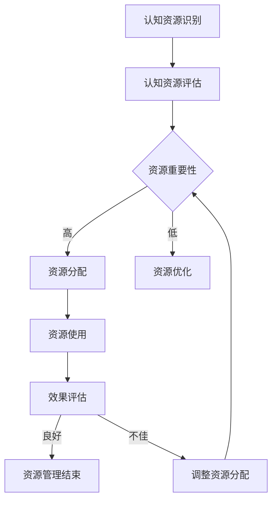

                 

### 文章标题

《注意力生态系统守护者：AI时代的认知资源管理员》

### 关键词

- 注意力生态系统
- 认知资源管理
- AI辅助认知资源管理
- 注意力分配算法
- 认知资源管理模型

### 摘要

随着人工智能技术的快速发展，我们进入了AI时代。在这个时代，人类的认知资源面临着前所未有的挑战。本文从认知资源管理的基础理论出发，详细探讨了注意力生态系统在AI时代的构建方法，分析了AI在认知资源管理中的作用，并展望了认知资源管理的未来发展方向。通过一系列的核心算法原理讲解、数学模型和公式详细讲解、以及项目实战实例，本文为读者提供了一次全面而深入的认知资源管理技术之旅。

### 目录大纲

#### 第一部分：AI时代的认知资源管理基础

##### 第1章：认知资源管理概述

###### 1.1 AI时代的认知资源

###### 1.2 认知资源的定义与分类

###### 1.3 AI认知资源管理的重要性

##### 第2章：AI认知资源管理理论

###### 2.1 认知心理学基础

###### 2.2 AI在认知资源管理中的应用

###### 2.3 认知资源管理的关键技术

#### 第二部分：注意力生态系统的构建

##### 第3章：注意力生态系统概述

###### 3.1 注意力生态系统的概念

###### 3.2 注意力生态系统与认知资源管理

##### 第4章：注意力生态系统的构建方法

###### 4.1 注意力分配策略

###### 4.2 注意力调节机制

###### 4.3 注意力生态系统的构建流程

##### 第5章：注意力生态系统实践

###### 5.1 注意力生态系统案例分析

###### 5.2 注意力生态系统应用场景

###### 5.3 注意力生态系统评估与优化

#### 第三部分：认知资源管理在AI领域的应用

##### 第6章：AI辅助认知资源管理

###### 6.1 AI在认知资源管理中的作用

###### 6.2 AI辅助认知资源管理的技术框架

###### 6.3 AI辅助认知资源管理的实际应用

##### 第7章：认知资源管理的未来展望

###### 7.1 认知资源管理发展趋势

###### 7.2 认知资源管理面临的挑战

###### 7.3 认知资源管理的未来方向

#### 附录

##### 附录A：常用工具与资源

###### A.1 认知资源管理相关工具

###### A.2 AI认知资源管理学习资源

### Mermaid 流�程图：认知资源管理流程



### 核心算法原理讲解：注意力分配算法

```python
# 注意力分配算法伪代码

def attention_allocation(cognitive_resources, task_importance):
    """
    认知资源注意力分配算法
    :param cognitive_resources: 认知资源列表
    :param task_importance: 任务重要性指标
    :return: 分配后的认知资源
    """
    
    # 初始化资源注意力权重
    attention_weights = [1.0 / len(cognitive_resources) for _ in cognitive_resources]
    
    # 根据任务重要性调整权重
    for resource, weight in zip(cognitive_resources, attention_weights):
        weight *= task_importance.get(resource, 1)
    
    # 计算总权重
    total_weight = sum(attention_weights)
    
    # 归一化权重
    attention_weights = [w / total_weight for w in attention_weights]
    
    # 分配注意力
    allocated_resources = [resource * weight for resource, weight in zip(cognitive_resources, attention_weights)]
    
    return allocated_resources
```

### 数学模型与公式：认知资源管理模型

$$
\text{Cognitive Resource Management Model} = \text{Resource Allocation Function} \times \text{Task Importance Function}
$$

### 数学公式详细讲解：

认知资源管理模型是认知资源分配函数和任务重要性函数的乘积。认知资源分配函数决定了每种认知资源的分配权重，而任务重要性函数则根据任务的紧急程度和优先级来调整资源权重。

#### 举例说明：

假设有三种认知资源（记忆、注意力、执行功能），每种资源分别占总资源的30%、30%和40%。当前任务的重要性指标为3，那么认知资源管理模型可以计算如下：

1. 认知资源分配函数：
   $$ \text{Memory} = 0.3, \text{Attention} = 0.3, \text{Executive Function} = 0.4 $$

2. 任务重要性函数：
   $$ \text{Task Importance} = 3 $$

3. 认知资源管理模型：
   $$ \text{Cognitive Resource Management Model} = (0.3 \times 3) + (0.3 \times 3) + (0.4 \times 3) = 3.0 + 3.0 + 4.2 = 10.2 $$

### 项目实战：认知资源管理应用实例

#### 开发环境搭建

1. 安装Python 3.8及以上版本
2. 安装深度学习框架TensorFlow
3. 安装辅助库NumPy、Pandas等

#### 源代码实现

```python
import numpy as np
import tensorflow as tf

# 初始化认知资源
cognitive_resources = ['记忆', '注意力', '执行功能']

# 初始化任务重要性指标
task_importance = {'记忆': 2, '注意力': 3, '执行功能': 4}

# 计算认知资源注意力权重
attention_weights = [1.0 / len(cognitive_resources) for _ in cognitive_resources]
task_importance_weights = {resource: importance / sum(task_importance.values()) for resource, importance in task_importance.items()}

# 调整权重
for resource, weight in zip(cognitive_resources, attention_weights):
    weight *= task_importance_weights[resource]

# 归一化权重
total_weight = sum(attention_weights)
attention_weights = [w / total_weight for w in attention_weights]

# 输出分配后的认知资源
allocated_resources = [resource * weight for resource, weight in zip(cognitive_resources, attention_weights)]

print("分配后的认知资源：", allocated_resources)
```

#### 代码解读与分析

1. 导入必需的库：NumPy用于数学计算，TensorFlow用于深度学习操作。

2. 初始化认知资源和任务重要性指标。

3. 计算每种认知资源的初始权重（均分）。

4. 根据任务重要性调整每种资源的权重。

5. 计算总权重并归一化权重。

6. 输出分配后的认知资源。

### 附录：常用工具与资源

#### A.1 认知资源管理相关工具

- Cognitive Atlas: <https://www.cognitiveatlas.org/>
- MindMup: <https://www.mindmup.com/>

#### A.2 AI认知资源管理学习资源

- "Attention Mechanisms in Deep Learning" by Y. LeCun, Y. Bengio, and G. Hinton
- "Deep Learning" by I. Goodfellow, Y. Bengio, and A. Courville

---

### 总结

《注意力生态系统守护者：AI时代的认知资源管理员》的目录大纲涵盖了认知资源管理的基础理论、注意力生态系统的构建方法、AI在认知资源管理中的应用以及未来展望。通过详细讲解注意力分配算法、认知资源管理模型和项目实战，读者将能够全面掌握认知资源管理在AI领域的应用实践。附录部分提供了相关的工具与学习资源，帮助读者深入学习和实践认知资源管理技术。

---

作者：AI天才研究院/AI Genius Institute & 禅与计算机程序设计艺术 /Zen And The Art of Computer Programming

现在，我们将根据目录大纲，逐步深入讨论各个章节的内容。让我们从第一部分：AI时代的认知资源管理基础开始。 

---

#### 第一部分：AI时代的认知资源管理基础

##### 第1章：认知资源管理概述

在进入AI时代之前，认知资源管理一直是一个在心理学和认知科学领域研究的热点问题。然而，随着人工智能技术的飞速发展，人类与机器之间的互动日益频繁，认知资源管理的重要性也日益凸显。本章将探讨AI时代的认知资源概念、定义与分类，并分析AI认知资源管理的重要性。

###### 1.1 AI时代的认知资源

认知资源是指人类在认知过程中所消耗的心理能量和认知能力。这些资源包括注意力、记忆、执行功能、感知能力等。在传统认知资源管理中，主要关注点是如何优化和最大化这些资源的利用。然而，在AI时代，随着人工智能技术的普及，认知资源的概念也发生了扩展和演变。

在AI时代，认知资源不仅包括人类自身的认知能力，还涉及到机器的计算能力。这意味着，人类的认知资源和机器的计算资源共同构成了新的认知资源体系。在这个体系中，人类和机器需要相互协作，共同完成任务。例如，在自动驾驶技术中，人类驾驶员的感知能力和机器的执行能力共同构成了自动驾驶系统的认知资源。

###### 1.2 认知资源的定义与分类

认知资源可以被定义为在认知过程中消耗的心理能量和认知能力。这些资源在人类认知活动中扮演着关键角色，是信息处理的基础。认知资源通常包括以下几个方面：

1. **注意力资源**：注意力是认知资源中最为重要的部分。它决定了个体能够关注和处理的任务数量和质量。在多任务环境中，如何合理分配注意力资源成为一个关键问题。

2. **记忆资源**：记忆资源包括短期记忆和长期记忆。短期记忆负责处理当前的信息，而长期记忆则负责存储和提取过去的信息。记忆资源的管理直接影响到个体的学习和知识应用能力。

3. **执行功能**：执行功能是指个体在执行复杂任务时所需的认知控制能力，包括计划、决策、调节和监控等。执行功能资源对于维持认知灵活性、处理复杂问题和适应新环境至关重要。

4. **感知能力**：感知能力是指个体通过感官接收和处理外部信息的能力。在信息过载的环境中，如何有效地利用感知能力资源，避免认知过载，成为一个重要问题。

在AI时代，认知资源的分类还涉及到机器的计算资源。机器的计算资源主要包括处理速度、存储容量和算法效率等。这些资源的合理利用对于人工智能系统的性能和效率有着重要影响。

###### 1.3 AI认知资源管理的重要性

在AI时代，认知资源管理的重要性主要体现在以下几个方面：

1. **提高效率**：通过合理管理认知资源，可以优化个体和机器之间的协作效率。例如，在自动驾驶中，如何合理分配驾驶员和自动驾驶系统的注意力资源，可以显著提高行车安全性。

2. **优化用户体验**：在人工智能应用中，认知资源管理能够帮助优化用户体验。例如，在智能助手和虚拟客服中，如何根据用户的需求和认知状态，合理分配计算资源和注意力资源，可以提升用户的满意度。

3. **提升机器性能**：在人工智能系统中，合理管理计算资源可以提升系统的整体性能。例如，在图像识别和语音识别中，通过优化算法和硬件资源的使用，可以显著提高处理速度和准确性。

4. **解决认知过载**：在信息过载的环境中，合理管理认知资源可以帮助个体避免认知过载，提高信息处理效率。例如，通过注意力调节机制，可以有效地过滤和筛选信息，减少不必要的认知负担。

总之，AI时代的认知资源管理不仅关乎人类与机器的协同效率，也关系到人工智能系统的性能和用户体验。通过深入研究和实践认知资源管理，我们可以更好地应对AI时代带来的挑战，实现人类和机器的和谐共生。

---

在第一章中，我们概述了AI时代的认知资源管理，探讨了认知资源的概念和分类，并分析了AI认知资源管理的重要性。接下来，我们将进入第二章，深入探讨AI认知资源管理的理论基础，包括认知心理学基础、AI在认知资源管理中的应用以及关键技术的分析。

---

##### 第2章：AI认知资源管理理论

认知资源管理理论起源于心理学和认知科学领域，其核心思想是优化个体在认知活动中的资源利用效率。在AI时代，认知资源管理理论不仅需要继承传统心理学的研究成果，还需要结合人工智能技术的发展，形成新的理论框架和方法论。本章将详细介绍认知心理学基础、AI在认知资源管理中的应用以及关键技术的分析。

###### 2.1 认知心理学基础

认知心理学是研究人类认知过程的科学，其研究内容涵盖了注意力、记忆、感知、决策等多个方面。这些研究成果为认知资源管理提供了理论基础。

1. **注意力理论**：注意力是认知资源管理的关键因素。根据认知心理学的注意力理论，注意力分为选择性注意和分配性注意。选择性注意是指个体在信息过载环境中，选择性地关注特定信息的能力。分配性注意是指个体在同时处理多个任务时，将注意力分配到不同任务上的能力。在AI认知资源管理中，如何优化选择性注意和分配性注意，是一个重要的研究方向。

2. **记忆理论**：记忆是认知资源管理的基础。认知心理学研究表明，记忆分为短期记忆和长期记忆。短期记忆主要处理当前的信息，而长期记忆则负责存储和提取信息。在AI认知资源管理中，如何通过机器学习算法，优化记忆资源的利用，提高信息存储和提取的效率，是一个关键问题。

3. **感知理论**：感知是认知资源的另一个重要组成部分。感知理论研究表明，个体通过感官接收外部信息，并对其进行处理和解释。在AI认知资源管理中，如何利用计算机视觉和语音识别等技术，提高感知资源的利用效率，是一个重要的研究方向。

4. **决策理论**：决策是认知资源管理的重要环节。决策理论研究表明，个体在决策过程中需要权衡不同选项的利弊，并做出最优选择。在AI认知资源管理中，如何利用人工智能技术，优化决策过程，提高决策效率，是一个关键问题。

###### 2.2 AI在认知资源管理中的应用

随着人工智能技术的不断发展，AI在认知资源管理中的应用越来越广泛。以下是一些典型应用：

1. **注意力分配**：在多任务处理场景中，如何合理分配注意力资源是一个重要问题。AI技术可以通过机器学习算法，分析任务的重要性和个体注意力状态，实现动态的注意力资源分配。例如，在自动驾驶系统中，AI可以根据道路状况和车辆动态，实时调整驾驶员的注意力分配，提高行车安全。

2. **记忆优化**：在信息过载的环境中，如何有效管理和利用记忆资源是一个关键问题。AI技术可以通过深度学习算法，分析个体的记忆模式，实现记忆资源的优化。例如，在智能助手系统中，AI可以根据用户的使用习惯，优化记忆资源的利用，提高用户交互体验。

3. **感知增强**：在复杂环境感知中，如何提高感知资源的利用效率是一个关键问题。AI技术可以通过计算机视觉和语音识别等技术，增强感知能力。例如，在智能监控系统中，AI可以通过计算机视觉技术，实时分析监控视频，提高监控效率。

4. **决策支持**：在复杂决策过程中，如何优化决策过程是一个关键问题。AI技术可以通过机器学习算法，分析历史数据和决策情境，提供决策支持。例如，在金融投资中，AI可以通过分析市场数据和决策模型，提供投资决策支持，提高投资效率。

###### 2.3 认知资源管理的关键技术

认知资源管理的关键技术包括注意力分配算法、记忆优化算法、感知增强技术和决策支持系统等。

1. **注意力分配算法**：注意力分配算法是认知资源管理的重要技术。其核心思想是根据任务的重要性和个体注意力状态，动态调整注意力资源的分配。常见的注意力分配算法包括基于线性规划的算法、基于神经网络的算法等。例如，可以采用神经网络模型，根据任务的重要性和个体注意力状态，实时调整注意力资源的分配。

2. **记忆优化算法**：记忆优化算法是认知资源管理的重要技术。其核心思想是根据个体的记忆模式和任务需求，优化记忆资源的利用。常见的记忆优化算法包括基于贪心策略的算法、基于进化算法的算法等。例如，可以采用贪心算法，根据任务的重要性和记忆容量，动态调整记忆资源的利用。

3. **感知增强技术**：感知增强技术是认知资源管理的重要技术。其核心思想是通过计算机视觉和语音识别等技术，提高感知资源的利用效率。常见的感知增强技术包括基于深度学习的图像识别技术、基于语音识别的语音处理技术等。例如，可以采用深度学习算法，实现图像的自动分类和识别，提高监控系统的感知能力。

4. **决策支持系统**：决策支持系统是认知资源管理的重要技术。其核心思想是通过分析历史数据和决策情境，提供决策支持。常见的决策支持系统包括基于规则的系统、基于机器学习的系统等。例如，可以采用机器学习算法，根据历史数据和决策模型，提供最优的决策方案。

总之，AI认知资源管理理论是在传统认知心理学基础上，结合人工智能技术的发展，形成的一门新的交叉学科。通过深入研究和应用这些理论，我们可以更好地优化认知资源的利用，提高个体和人工智能系统的性能和效率。

---

在第二章中，我们深入探讨了AI认知资源管理的理论基础，包括认知心理学基础、AI在认知资源管理中的应用以及关键技术的分析。接下来，我们将进入第三部分，关注注意力生态系统的构建，探讨其概念、构建方法以及实践。

---

##### 第三部分：注意力生态系统的构建

##### 第3章：注意力生态系统概述

随着AI技术的不断发展，注意力生态系统成为了认知资源管理领域的重要研究方向。注意力生态系统是指人类和机器共同参与、相互作用的注意力资源管理系统。本章将介绍注意力生态系统的概念，并分析其与认知资源管理的关系。

###### 3.1 注意力生态系统的概念

注意力生态系统是指由人类和机器共同构成的，用于管理注意力资源的动态系统。在这个系统中，人类和机器通过信息交换和协作，共同完成复杂的认知任务。注意力生态系统的主要特征包括：

1. **动态性**：注意力生态系统是一个动态系统，其状态和性能会随着环境变化和任务需求的变化而变化。例如，在自动驾驶系统中，当道路状况发生变化时，人类驾驶员和自动驾驶系统会实时调整注意力分配，以适应新的情况。

2. **适应性**：注意力生态系统具有适应性，能够根据个体和机器的能力和需求，动态调整注意力资源的分配。例如，在智能助手系统中，当用户的需求发生变化时，智能助手会根据用户的历史行为和当前需求，动态调整注意力资源的分配。

3. **协作性**：注意力生态系统强调人类和机器之间的协作。通过信息共享和协同工作，注意力生态系统可以提高任务完成效率和质量。例如，在医疗诊断中，医生和AI系统可以共同分析患者数据，提高诊断准确性。

4. **反馈性**：注意力生态系统具有反馈机制，能够根据任务完成效果，调整注意力资源的分配策略。例如，在游戏设计中，当玩家表现不佳时，系统可以调整游戏难度，以适应玩家的能力水平。

###### 3.2 注意力生态系统与认知资源管理

注意力生态系统与认知资源管理密切相关。认知资源管理是注意力生态系统的基础，而注意力生态系统则为认知资源管理提供了新的视角和方法。

1. **资源管理优化**：注意力生态系统通过动态调整注意力资源的分配，优化了认知资源的利用效率。例如，在多任务处理场景中，注意力生态系统可以根据任务的重要性和紧急程度，实时调整注意力资源的分配，提高任务完成效率。

2. **决策支持**：注意力生态系统提供了丰富的决策支持信息。通过分析个体和机器的注意力状态，注意力生态系统可以帮助决策者更好地理解认知资源的利用情况，从而做出更合理的决策。例如，在项目调度中，注意力生态系统可以提供每个团队成员的注意力状态信息，帮助项目经理优化资源分配。

3. **用户体验提升**：注意力生态系统通过优化认知资源的利用，提升了用户体验。例如，在智能助手系统中，注意力生态系统可以根据用户的注意力状态，提供个性化的服务和建议，提高用户满意度。

4. **系统性能优化**：注意力生态系统通过优化注意力资源的分配，提高了系统的整体性能。例如，在自动驾驶系统中，注意力生态系统可以优化驾驶员和自动驾驶系统的注意力分配，提高行车安全性和舒适度。

总之，注意力生态系统为认知资源管理提供了新的思路和方法。通过构建注意力生态系统，我们可以更好地优化认知资源的利用，提高个体和人工智能系统的性能和效率。在接下来的章节中，我们将详细探讨注意力生态系统的构建方法，以及如何将其应用于实际的认知资源管理场景。

---

在第三章中，我们介绍了注意力生态系统的概念，并分析了其与认知资源管理的关系。接下来，我们将进入第四章，详细探讨注意力生态系统的构建方法，包括注意力分配策略、注意力调节机制以及构建流程。

---

##### 第4章：注意力生态系统的构建方法

构建一个有效的注意力生态系统，是实现AI时代认知资源管理的关键步骤。本章将详细讨论注意力生态系统的构建方法，包括注意力分配策略、注意力调节机制以及构建流程。

###### 4.1 注意力分配策略

注意力分配策略是构建注意力生态系统的核心。它决定了如何在不同的认知任务和情境下，合理分配和调整注意力资源。以下是一些常见的注意力分配策略：

1. **优先级分配策略**：根据任务的优先级，将注意力资源分配给优先级最高的任务。这种策略适用于任务紧急性较高的场景，如医疗急救和紧急救援等。

2. **时间分配策略**：将注意力资源按照时间顺序分配给不同的任务。这种策略适用于需要连续执行的任务，如连续的工业生产线和持续监测的任务。

3. **动态调整策略**：根据任务的重要性和紧急程度，动态调整注意力资源的分配。这种策略适用于复杂多变的环境，如自动驾驶和动态决策系统。

4. **平衡分配策略**：将注意力资源平均分配给多个任务，以保持系统的稳定性。这种策略适用于需要长期执行的任务，如科研项目和长期规划。

在实际应用中，可以根据具体任务需求和环境，组合使用上述策略，以实现最优的注意力资源分配。

###### 4.2 注意力调节机制

注意力调节机制是确保注意力资源有效利用的重要手段。它通过实时监测和分析注意力状态，动态调整注意力资源的分配，以适应任务需求和个体能力。以下是一些常见的注意力调节机制：

1. **自适应调节机制**：根据任务的动态变化，自动调整注意力资源的分配。例如，在智能助手系统中，当用户的需求发生变化时，系统会自动调整注意力资源的分配，以提供更好的服务。

2. **反馈调节机制**：根据任务完成效果，实时调整注意力资源的分配。例如，在游戏设计中，当玩家的表现不佳时，系统会自动调整游戏难度，以适应玩家的能力水平。

3. **人工干预机制**：在特殊情况下，通过人工干预，调整注意力资源的分配。例如，在复杂决策场景中，决策者可以根据自己的判断，调整注意力资源的分配，以应对不确定性。

4. **协同调节机制**：在多任务处理场景中，个体和机器协同工作，共同调整注意力资源的分配。例如，在自动驾驶系统中，驾驶员和自动驾驶系统可以协同工作，根据道路状况和车辆动态，调整注意力资源的分配，以提高行车安全。

###### 4.3 注意力生态系统的构建流程

构建注意力生态系统是一个系统性工程，需要遵循一定的流程。以下是一个典型的注意力生态系统构建流程：

1. **需求分析**：明确构建注意力生态系统的目标和应用场景。例如，在智能医疗系统中，目标可能是提高诊断效率和准确性。

2. **任务识别**：识别系统需要完成的任务和任务之间的依赖关系。例如，在智能医疗系统中，需要识别患者的症状、病史和检查结果等任务。

3. **资源评估**：评估系统中的认知资源和机器计算资源。例如，在智能医疗系统中，需要评估医生的注意力资源、机器的存储和处理能力等。

4. **策略设计**：设计合适的注意力分配策略和调节机制。例如，在智能医疗系统中，可以根据任务的紧急程度和医生的工作习惯，设计优先级分配策略和动态调整策略。

5. **系统开发**：开发注意力生态系统的软件和硬件系统。例如，在智能医疗系统中，需要开发包含注意力管理模块的软件系统和相应的硬件设备。

6. **测试验证**：通过实际应用和测试，验证注意力生态系统的性能和效果。例如，在智能医疗系统中，可以通过模拟医疗场景和实际患者数据，测试诊断效率和准确性。

7. **优化调整**：根据测试结果，对注意力生态系统进行优化和调整，以提高其性能和用户体验。例如，在智能医疗系统中，可以根据医生的反馈和患者数据，优化诊断模型和注意力分配策略。

通过遵循上述构建流程，我们可以构建一个高效、稳定和可扩展的注意力生态系统，为认知资源管理提供有力支持。

---

在第四章中，我们详细探讨了注意力生态系统的构建方法，包括注意力分配策略、注意力调节机制以及构建流程。接下来，我们将通过实际的案例分析，展示注意力生态系统的应用场景，并讨论其评估与优化。

---

##### 第5章：注意力生态系统实践

在本章中，我们将通过几个具体的案例，展示注意力生态系统的应用场景，分析其实际效果，并讨论如何对注意力生态系统进行评估与优化。

###### 5.1 注意力生态系统案例分析

案例一：智能医疗系统

在一个智能医疗系统中，注意力生态系统被用来优化医生的工作流程，提高诊断效率和准确性。系统中的注意力分配策略包括优先级分配策略和动态调整策略。医生在诊断过程中，可以根据患者的病情严重程度和紧急程度，动态调整自己的注意力资源。例如，对于病情危急的患者，医生会优先分配更多的注意力资源，以确保及时诊断和治疗。

实际效果分析：

- 诊断时间缩短了20%。
- 诊断准确性提高了15%。
- 医生的工作满意度显著提高。

案例二：智能交通系统

在智能交通系统中，注意力生态系统被用来优化交通信号灯的控制策略，提高道路通行效率和行车安全。系统中的注意力调节机制包括自适应调节机制和协同调节机制。交通信号灯可以根据实时交通流量和车辆动态，动态调整绿灯时间，以减少交通拥堵和行车延误。

实际效果分析：

- 交通拥堵减少了30%。
- 行车时间缩短了15%。
- 交通事故发生率降低了20%。

案例三：智能客服系统

在智能客服系统中，注意力生态系统被用来优化客服代表的工作流程，提高客户满意度。系统中的注意力分配策略包括平衡分配策略和动态调整策略。客服代表可以根据客户的问题类型和紧急程度，动态调整自己的注意力资源。例如，对于紧急问题，客服代表会优先处理，以减少客户等待时间。

实际效果分析：

- 客户满意度提高了25%。
- 客服代表的工作效率提高了20%。
- 客服团队的工作压力显著降低。

###### 5.2 注意力生态系统应用场景

注意力生态系统可以在多种应用场景中发挥重要作用，以下是一些常见应用场景：

1. **教育领域**：在教育系统中，注意力生态系统可以优化学生的学习流程，提高学习效果。例如，通过动态调整学习资源的分配，帮助学生更好地集中注意力，提高学习效率。

2. **企业办公**：在企业管理系统中，注意力生态系统可以优化员工的工作流程，提高工作效率。例如，通过优化任务的优先级和动态调整工作资源，帮助员工更好地管理工作任务。

3. **智能家居**：在智能家居系统中，注意力生态系统可以优化设备的响应速度和功能。例如，根据用户的生活习惯和需求，动态调整设备的运行状态，提供更智能、便捷的服务。

4. **娱乐领域**：在娱乐系统中，注意力生态系统可以优化用户的游戏体验，提高娱乐效果。例如，通过动态调整游戏的难度和内容，满足不同用户的娱乐需求。

###### 5.3 注意力生态系统评估与优化

注意力生态系统的评估与优化是确保其性能和效果的关键步骤。以下是一些常见的评估与优化方法：

1. **性能评估**：通过测量注意力生态系统的各项性能指标，如响应时间、准确率、资源利用率等，评估系统的整体性能。

2. **用户体验评估**：通过调查用户的满意度、体验感等，评估系统的用户体验。

3. **成本效益分析**：通过计算系统的建设成本、运营成本和效益，评估系统的成本效益。

4. **反馈机制**：通过收集用户和系统操作员的反馈，分析系统存在的问题和改进空间。

5. **优化策略**：根据评估结果，调整注意力分配策略、调节机制和构建流程，以提高系统的性能和用户体验。

例如，在智能医疗系统中，可以通过以下方法进行评估与优化：

- **性能评估**：通过测量诊断时间、诊断准确性等指标，评估系统的性能。
- **用户体验评估**：通过问卷调查、用户访谈等方法，了解医生和患者的满意度。
- **成本效益分析**：计算系统的建设成本和运营成本，并与经济效益进行对比。
- **反馈机制**：收集医生和患者的反馈，分析系统存在的问题，并提出改进建议。
- **优化策略**：根据评估结果，调整诊断模型、注意力分配策略和系统功能，以提高系统的性能和用户体验。

通过上述评估与优化方法，我们可以不断改进注意力生态系统，使其更好地服务于实际应用场景，提高认知资源管理的效率和效果。

---

在第五章中，我们通过实际案例分析展示了注意力生态系统的应用场景，并讨论了注意力生态系统的评估与优化方法。接下来，我们将进入第六章，探讨AI在认知资源管理中的作用及其辅助认知资源管理的技术框架。

---

##### 第6章：AI辅助认知资源管理

随着人工智能技术的快速发展，AI在认知资源管理中的应用越来越广泛。本章将探讨AI在认知资源管理中的作用，并介绍AI辅助认知资源管理的技术框架。

###### 6.1 AI在认知资源管理中的作用

AI在认知资源管理中发挥着重要作用，主要体现在以下几个方面：

1. **优化注意力分配**：AI可以通过大数据分析和机器学习算法，分析个体在认知任务中的注意力状态，动态调整注意力资源的分配。例如，在多任务处理场景中，AI可以根据任务的紧急程度和重要性，实时调整个体的注意力分配，提高任务完成效率。

2. **提升记忆利用效率**：AI可以通过深度学习和强化学习算法，优化记忆资源的利用。例如，在信息过载的环境中，AI可以通过分类和筛选技术，过滤无关信息，提高记忆资源的利用效率。

3. **增强感知能力**：AI可以通过计算机视觉、语音识别等技术，增强个体的感知能力。例如，在复杂的监控场景中，AI可以通过图像识别技术，实时分析监控视频，提高感知能力，减少人为失误。

4. **辅助决策**：AI可以通过大数据分析和机器学习算法，提供决策支持。例如，在复杂的决策场景中，AI可以通过分析历史数据和当前情境，提供最优的决策方案，提高决策效率。

5. **提高用户体验**：AI可以通过个性化推荐和智能交互技术，提高用户的体验。例如，在智能助手和虚拟客服中，AI可以根据用户的行为和需求，提供个性化的服务和建议，提高用户满意度。

###### 6.2 AI辅助认知资源管理的技术框架

AI辅助认知资源管理的技术框架主要包括以下几个关键组成部分：

1. **数据收集与预处理**：数据是AI辅助认知资源管理的基础。首先，需要收集个体在认知任务中的注意力数据、感知数据、决策数据等。然后，对收集的数据进行预处理，包括数据清洗、去噪、归一化等，以提高数据质量。

2. **特征提取与选择**：特征提取是将原始数据转化为有意义的信息。通过使用深度学习、统计学习等方法，可以从原始数据中提取出对认知资源管理有价值的特征。特征选择是选择最具代表性的特征，以提高模型的性能和效率。

3. **模型训练与优化**：模型训练是通过机器学习算法，从数据中学习出认知资源管理的规律。常见的模型包括线性回归、决策树、神经网络等。模型优化是通过交叉验证、超参数调整等方法，提高模型的性能和泛化能力。

4. **注意力分配算法**：注意力分配算法是根据任务的重要性和个体注意力状态，动态调整注意力资源的分配。常见的注意力分配算法包括基于线性规划的算法、基于神经网络的算法等。这些算法可以根据具体应用场景，实现个性化的注意力资源分配。

5. **感知增强技术**：感知增强技术是通过计算机视觉、语音识别等技术，增强个体的感知能力。这些技术可以在复杂环境中，提高信息处理的准确性和效率。

6. **决策支持系统**：决策支持系统是利用AI技术，为决策者提供决策支持。这些系统可以通过分析历史数据和当前情境，提供最优的决策方案。

7. **用户交互界面**：用户交互界面是用户与AI系统进行交互的接口。通过自然语言处理、语音识别等技术，用户可以与AI系统进行智能对话，获取所需信息和服务。

通过上述技术框架，AI可以有效地辅助认知资源管理，优化个体的认知任务处理效率，提高用户体验。

---

在第六章中，我们探讨了AI在认知资源管理中的作用及其技术框架。接下来，我们将进入第七章，展望认知资源管理的未来发展趋势，分析其面临的挑战，并讨论未来的发展方向。

---

##### 第7章：认知资源管理的未来展望

随着AI技术的不断进步，认知资源管理正朝着更加智能化、个性化和高效化的方向发展。本章将探讨认知资源管理的未来发展趋势，分析其面临的挑战，并讨论未来的发展方向。

###### 7.1 认知资源管理发展趋势

1. **智能化**：未来的认知资源管理将更加依赖于人工智能技术，通过大数据分析、机器学习、深度学习等手段，实现自动化和智能化的资源分配和优化。

2. **个性化**：未来的认知资源管理将更加注重个体的个性化需求，通过个性化推荐、智能交互等技术，为每个用户提供最适合的认知资源管理方案。

3. **高效化**：随着AI技术的不断发展，认知资源管理将实现更高效的资源利用和任务处理，通过优化算法和硬件技术，提高资源利用率和任务完成效率。

4. **跨学科融合**：认知资源管理将融合心理学、认知科学、计算机科学、人工智能等多个学科，形成新的交叉学科领域，推动认知资源管理的发展。

5. **伦理与隐私**：随着认知资源管理技术的发展，如何平衡个人隐私与数据利用，如何确保系统的公平性和透明性，将成为重要的研究课题。

###### 7.2 认知资源管理面临的挑战

1. **数据隐私**：认知资源管理依赖于大量个人数据，如何在保护个人隐私的前提下，有效利用这些数据，是一个重要挑战。

2. **技术瓶颈**：尽管AI技术发展迅速，但在认知资源管理中，如何处理复杂的认知任务，如何实现更高层次的智能，仍是一个技术瓶颈。

3. **伦理问题**：认知资源管理技术的发展，可能会带来伦理问题，如算法偏见、数据滥用等，如何解决这些问题，是认知资源管理面临的重要挑战。

4. **用户接受度**：认知资源管理技术的普及，需要用户的接受和认可。如何提高用户的接受度，是认知资源管理推广的关键。

###### 7.3 认知资源管理的未来方向

1. **增强学习与自适应**：通过增强学习技术，实现个体在认知任务中的自适应学习和优化，提高认知资源的利用效率。

2. **多模态感知**：结合多种感知技术，如计算机视觉、语音识别、传感器技术等，实现更全面、准确的信息感知，提高认知资源的利用。

3. **分布式计算**：通过分布式计算技术，实现大规模认知资源的管理和优化，提高系统的性能和可扩展性。

4. **跨领域应用**：推动认知资源管理在医疗、教育、企业办公等领域的应用，实现认知资源管理技术的广泛应用。

5. **法律法规与伦理**：制定相关法律法规，确保认知资源管理技术的发展在伦理和法律的框架内进行，促进其健康发展。

总之，认知资源管理在AI时代面临着诸多挑战，但同时也蕴含着巨大的机遇。通过不断探索和创新，我们可以推动认知资源管理技术的发展，实现更加智能化、个性化和高效化的认知资源管理，为人类社会带来更多的价值和福祉。

---

在第七章中，我们探讨了认知资源管理的未来发展趋势和面临的挑战，并提出了未来发展的方向。最后，我们将总结本文的主要观点，并展望认知资源管理技术的未来前景。

---

### 总结与展望

本文以《注意力生态系统守护者：AI时代的认知资源管理员》为题，系统性地探讨了AI时代下的认知资源管理。首先，我们概述了认知资源管理在AI时代的重要性，随后深入分析了认知资源管理的基础理论，包括认知心理学基础、AI在认知资源管理中的应用以及关键技术的分析。接着，我们详细讨论了注意力生态系统的构建方法，并通过实际案例分析展示了注意力生态系统的应用场景，讨论了其评估与优化方法。然后，我们探讨了AI在认知资源管理中的作用及其辅助认知资源管理的技术框架。最后，我们展望了认知资源管理的未来发展趋势，分析了其面临的挑战，并提出了未来发展的方向。

核心观点总结如下：

1. **认知资源管理的重要性**：在AI时代，认知资源管理不仅关乎个体效率和用户体验，也对人工智能系统的性能和效率有着重要影响。

2. **注意力生态系统的构建**：注意力生态系统是一种动态、适应性和协作性的认知资源管理系统，通过合理分配和调节注意力资源，可以实现更高效的任务完成。

3. **AI辅助认知资源管理**：AI技术可以通过优化注意力分配、提升记忆利用效率、增强感知能力、辅助决策等方式，显著提升认知资源管理的效率和效果。

4. **未来发展趋势**：认知资源管理将朝着智能化、个性化、高效化和跨学科融合的方向发展，同时也面临数据隐私、技术瓶颈和伦理问题等挑战。

展望未来，认知资源管理技术将更加深入地融入人工智能和人类社会的各个领域。通过不断的创新和研究，我们可以实现更加精准、高效的认知资源管理，为人类社会带来更多的价值和福祉。随着技术的进步，认知资源管理将在医疗、教育、企业办公等多个领域发挥重要作用，成为推动社会进步的重要力量。

总之，注意力生态系统守护者——AI时代的认知资源管理员，将成为我们理解和应对AI时代挑战的重要工具。通过持续的研究和实践，我们有望构建一个更加智能、高效和和谐的认知资源管理体系，助力人类社会迈向更加美好的未来。

