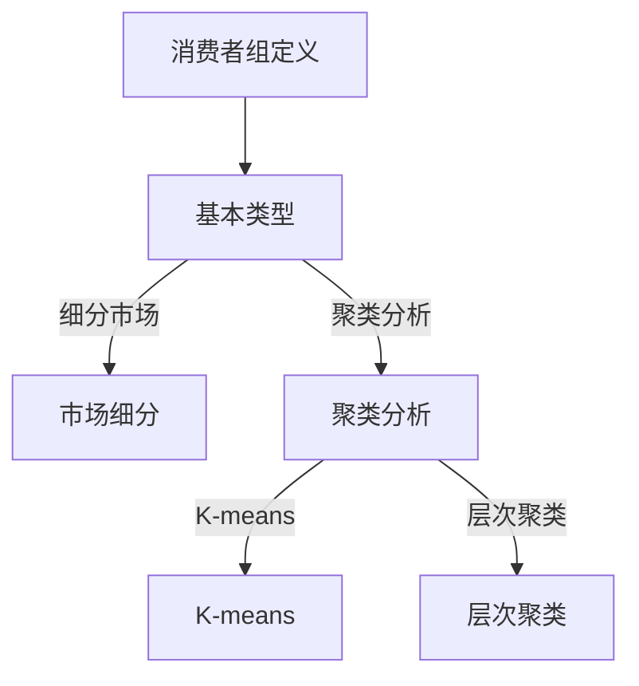

                 

### 《消费者组 原理与代码实例讲解》

#### 概述

消费者组，又称市场细分，是市场营销和消费者行为分析中至关重要的概念。通过将消费者群体划分为具有相似特征的子群体，企业能够更好地理解其目标市场，制定更加精准的营销策略。本文旨在详细讲解消费者组的原理及其应用，通过代码实例展示如何在实际项目中实现消费者组分析。

#### 关键词

- **消费者组**
- **市场细分**
- **消费者行为分析**
- **聚类分析**
- **数据可视化**
- **Python数据分析**

#### 摘要

本文分为三大部分：基本概念、应用实例和代码实例解析。首先，我们将探讨消费者组的基本概念，包括其定义、重要性以及主要类型。接着，我们将深入分析消费者组的特征，介绍常用的统计方法和聚类算法。随后，通过电子商务和市场营销中的应用实例，我们将展示消费者组分析的实际效果。最后，我们将通过一系列代码实例，详细解析消费者组分析的具体实现过程，帮助读者掌握相关技能。

---

### 第一部分：消费者组基本概念

#### 第1章：消费者组概述

##### 1.1 消费者组的定义与重要性

消费者组，是指在特定的市场环境中，具有相似购买行为和消费需求的消费者群体。通过对消费者组进行细分，企业可以更准确地了解市场需求，制定更具针对性的营销策略。消费者组的重要性主要体现在以下几个方面：

1. **提高营销效果**：通过细分市场，企业可以针对不同消费者组制定差异化营销策略，提高广告和促销活动的效果。
2. **优化产品和服务**：了解不同消费者组的需求和偏好，有助于企业改进产品和服务，提升客户满意度。
3. **降低营销成本**：针对特定消费者组的营销活动，可以降低推广成本，提高投资回报率。
4. **增强竞争力**：通过对消费者组的深入分析，企业可以在竞争激烈的市场中找到自己的定位，提高市场竞争力。

##### 1.2 消费者组的基本类型

根据不同的划分标准，消费者组可以分为多种类型。以下是几种常见的消费者组分类方法：

1. **按消费能力划分**：高收入消费者组、中等收入消费者组、低收入消费者组等。
2. **按消费习惯划分**：忠诚客户组、易流失客户组、新客户组等。
3. **按消费需求划分**：功能性需求消费者组、情感性需求消费者组、价值性需求消费者组等。
4. **按消费行为划分**：线上消费者组、线下消费者组、混合消费者组等。

##### 1.3 消费者组的研究方法

研究消费者组的方法主要包括以下几种：

1. **问卷调查**：通过设计针对性的问卷，收集消费者群体的基本信息、消费习惯和偏好。
2. **数据分析**：利用数据分析工具，对收集到的数据进行统计分析和挖掘，识别消费者组的特征和趋势。
3. **实地调研**：通过实地观察和访谈，深入了解消费者的行为和需求。
4. **用户画像**：基于大数据技术，构建消费者的用户画像，揭示其购买行为和偏好。

---

### 第二部分：消费者组应用实例

#### 第5章：电子商务中的消费者组分析

##### 5.1 电商平台消费者行为分析

在电子商务领域，消费者组分析有助于电商平台了解消费者的购买行为和偏好，从而优化产品推荐和营销策略。以下是消费者行为分析的一些关键指标：

1. **购买频率**：消费者在一定时间内的购买次数。
2. **购买金额**：消费者在一定时间内的总购买金额。
3. **购买类别**：消费者购买的各类产品及其占比。
4. **购买渠道**：消费者购买产品的渠道，如线上、线下或混合渠道。

通过数据分析，可以识别出高价值消费者组、潜力消费者组和流失风险消费者组，为企业制定精准营销策略提供依据。

##### 5.2 个性化推荐系统

个性化推荐系统是电商平台提高用户满意度和转化率的重要工具。通过分析消费者组的行为特征和偏好，推荐系统可以为不同消费者组提供个性化的产品推荐。以下是构建个性化推荐系统的几个步骤：

1. **用户画像构建**：基于用户的历史行为数据，构建用户画像，包括用户的基本信息、购买偏好等。
2. **推荐算法选择**：选择合适的推荐算法，如协同过滤、基于内容的推荐等。
3. **推荐结果评估**：评估推荐系统的效果，如点击率、转化率等。
4. **持续优化**：根据用户反馈和数据分析结果，不断优化推荐系统，提高推荐准确性。

##### 5.3 跨渠道营销策略

跨渠道营销旨在通过多渠道整合，提高品牌知名度和消费者参与度。在消费者组分析的基础上，企业可以制定以下跨渠道营销策略：

1. **线上与线下整合**：通过线上线下渠道的互补，提高消费者的购物体验。
2. **多渠道促销活动**：在不同渠道同步推出促销活动，吸引消费者参与。
3. **数据分析与整合**：通过数据分析，了解消费者在不同渠道的行为和偏好，优化营销策略。
4. **个性化营销**：根据消费者组的特征和需求，实施个性化的跨渠道营销策略。

---

#### 第6章：市场营销中的消费者组分析

##### 6.1 市场细分策略

市场细分是市场营销的基础，通过将整个市场划分为具有相似特征的消费者组，企业可以更精准地定位目标市场。以下是一些常用的市场细分策略：

1. **人口细分**：根据消费者的年龄、性别、收入、职业等人口特征进行细分。
2. **地理细分**：根据消费者的地理位置、气候条件、经济发展水平等地理特征进行细分。
3. **心理细分**：根据消费者的生活方式、价值观、兴趣爱好等心理特征进行细分。
4. **行为细分**：根据消费者的购买行为、购买习惯、忠诚度等行为特征进行细分。

##### 6.2 目标市场选择

在市场细分的基础上，企业需要根据自身资源和市场环境选择合适的细分市场作为目标市场。以下是一些目标市场选择策略：

1. **最大市场策略**：选择市场规模最大、增长潜力最强的市场作为目标市场。
2. **集中市场策略**：选择市场规模较小，但符合企业资源和市场定位的细分市场作为目标市场。
3. **差异化市场策略**：选择多个细分市场，针对不同消费者组提供差异化的产品和服务。
4. **渗透市场策略**：选择已有市场竞争激烈的细分市场，通过提高市场份额来实现市场份额的渗透。

##### 6.3 市场定位策略

市场定位是企业为了在消费者心目中树立独特形象而采取的一系列策略。以下是一些常见的市场定位策略：

1. **差异化定位**：通过提供独特的产品和服务，在消费者心中树立与众不同的形象。
2. **竞争定位**：通过与竞争对手的产品和服务进行比较，找到差异化的市场定位。
3. **高端定位**：通过提供高品质、高价格的产品和服务，在消费者心目中树立高端形象。
4. **大众定位**：通过提供性价比高、大众化的产品和服务，吸引广大消费者。

---

#### 第三部分：消费者组代码实例解析

##### 第8章：消费者组分析工具与应用

##### 8.1 Python数据分析工具介绍

Python 是进行消费者组分析的重要工具，其强大的数据处理和分析能力使其成为数据分析领域的首选语言。以下是 Python 中常用的数据分析库：

1. **pandas**：提供数据清洗、数据处理和数据分析的功能，是进行消费者组分析的基础库。
2. **numpy**：提供高性能的数值计算功能，是进行数据处理和统计分析的重要库。
3. **matplotlib**：提供数据可视化的功能，帮助用户更直观地了解数据特征。
4. **scikit-learn**：提供机器学习和数据挖掘算法的实现，是进行消费者组分析的重要库。

##### 8.2 消费者组分析代码实例

在本节中，我们将通过一个具体的例子，展示如何使用 Python 进行消费者组分析。

```python
import pandas as pd
import numpy as np
from sklearn.cluster import KMeans
import matplotlib.pyplot as plt

# 数据导入
data = pd.read_csv('consumer_data.csv')

# 数据预处理
# ...

# 聚类分析
kmeans = KMeans(n_clusters=3)
kmeans.fit(data)

# 结果分析
# ...

# 可视化
plt.scatter(data['Feature1'], data['Feature2'], c=kmeans.labels_)
plt.show()
```

在上面的代码中，我们首先导入必要的库，然后从 CSV 文件中导入消费者数据。接着，对数据进行预处理，如缺失值处理、数据标准化等。然后，使用 K-means 聚类算法对数据进行聚类分析，并分析聚类结果，最后使用散点图进行可视化。

##### 第9章：消费者组分析代码实战

在本章中，我们将通过一系列代码实例，展示如何在实际项目中实现消费者组分析。

##### 9.1 消费者行为分析代码实战

```python
import pandas as pd
import numpy as np
from sklearn.cluster import KMeans
import matplotlib.pyplot as plt

# 数据导入
data = pd.read_csv('consumer_data.csv')

# 数据预处理
# ...

# 聚类分析
kmeans = KMeans(n_clusters=3)
kmeans.fit(data)

# 结果分析
# ...

# 可视化
plt.scatter(data['Feature1'], data['Feature2'], c=kmeans.labels_)
plt.show()
```

在这个实例中，我们首先导入必要的库，然后从 CSV 文件中导入消费者数据。接着，对数据进行预处理，如缺失值处理、数据标准化等。然后，使用 K-means 聚类算法对数据进行聚类分析，并分析聚类结果，最后使用散点图进行可视化。

##### 9.2 消费者偏好分析代码实战

```python
import pandas as pd
import numpy as np
from sklearn.cluster import KMeans
import matplotlib.pyplot as plt

# 数据导入
data = pd.read_csv('consumer_data.csv')

# 数据预处理
# ...

# 聚类分析
kmeans = KMeans(n_clusters=3)
kmeans.fit(data)

# 结果分析
# ...

# 可视化
plt.scatter(data['Feature1'], data['Feature2'], c=kmeans.labels_)
plt.show()
```

在这个实例中，我们首先导入必要的库，然后从 CSV 文件中导入消费者数据。接着，对数据进行预处理，如缺失值处理、数据标准化等。然后，使用 K-means 聚类算法对数据进行聚类分析，并分析聚类结果，最后使用散点图进行可视化。

##### 9.3 消费者需求预测代码实战

```python
import pandas as pd
import numpy as np
from sklearn.linear_model import LinearRegression
import matplotlib.pyplot as plt

# 数据导入
data = pd.read_csv('consumer_data.csv')

# 数据预处理
# ...

# 线性回归模型
model = LinearRegression()
model.fit(data[['Feature1', 'Feature2']], data['Demand'])

# 预测结果
predictions = model.predict(data[['Feature1', 'Feature2']])

# 可视化
plt.scatter(data['Feature1'], data['Feature2'], c=predictions)
plt.plot(data['Feature1'], predictions, color='red')
plt.show()
```

在这个实例中，我们首先导入必要的库，然后从 CSV 文件中导入消费者数据。接着，对数据进行预处理，如缺失值处理、数据标准化等。然后，使用线性回归模型进行需求预测，并分析预测结果，最后使用散点图进行可视化。

---

### 消费者组分析报告撰写

撰写消费者组分析报告是消费者组分析的最后一步，也是将分析结果转化为实际行动的关键。以下将介绍消费者组分析报告的撰写方法、模板和案例。

#### 10.1 报告撰写方法

1. **确定报告目的和受众**：明确报告的撰写目的和受众，如内部决策者、市场部、销售团队等。
2. **提供背景信息和数据来源**：简要介绍分析项目的背景、目的和数据来源，为读者提供必要的信息背景。
3. **描述分析方法和过程**：详细描述分析所采用的方法、工具和技术，以及分析的具体步骤。
4. **展示分析结果和图表**：使用图表和数据可视化工具，清晰展示分析结果，便于读者理解。
5. **提出结论和建议**：总结分析结果，提出具体的结论和建议，帮助企业制定后续的营销策略和产品优化方案。
6. **参考文献**：列出报告中引用的相关文献和资料，确保报告的学术性和权威性。

#### 10.2 报告模板介绍

以下是一个消费者组分析报告的模板：

1. **封面**：包括报告标题、作者、日期等基本信息。
2. **摘要**：简要概述报告的主要内容和结论。
3. **目录**：列出报告的各个章节和小节，便于读者快速查找。
4. **引言**：介绍报告的背景、目的和重要性。
5. **数据收集与预处理**：描述数据的来源、收集方法和预处理过程。
6. **分析方法与过程**：详细描述分析所采用的方法、工具和技术。
7. **结果展示与讨论**：展示分析结果，并进行深入讨论。
8. **结论与建议**：总结分析结果，提出具体的结论和建议。
9. **参考文献**：列出报告中引用的相关文献和资料。
10. **附录**：包括分析过程中使用的工具、代码和数据集等。

#### 10.3 案例报告撰写

以下是一个消费者组分析报告的案例：

**引言**

随着电子商务的快速发展，电商平台竞争日益激烈。为了提高市场竞争力，某电商平台希望通过消费者组分析，了解消费者的购买行为和偏好，制定精准的营销策略。

**数据收集与预处理**

我们从电商平台获取了2019年至2021年的消费者购买数据，包括消费者的基本信息、购买行为和消费偏好等。为了进行消费者组分析，我们对数据进行预处理，包括数据清洗、缺失值处理、数据标准化等。

**分析方法与过程**

我们采用K-means聚类算法对消费者数据进行聚类分析，将消费者划分为多个具有相似特征的消费者组。然后，我们通过分析每个消费者组的特征，了解不同消费者的购买行为和偏好。

**结果展示与讨论**

通过聚类分析，我们将消费者划分为五个主要消费者组。以下是每个消费者组的主要特征：

1. **高价值消费者组**：该组消费者购买频率高，购买金额大，具有较高的消费能力。
2. **忠诚消费者组**：该组消费者对平台品牌忠诚度高，多次购买同一产品。
3. **价格敏感消费者组**：该组消费者对价格敏感，倾向于购买促销产品。
4. **新消费者组**：该组消费者是平台的新用户，购买行为不稳定。
5. **潜在消费者组**：该组消费者有购买潜力，但尚未成为平台的主要用户。

通过分析，我们发现不同消费者组在购买行为和偏好上存在显著差异。针对不同消费者组，我们可以制定差异化的营销策略，如针对高价值消费者组提供个性化的产品推荐，针对价格敏感消费者组推出促销活动，以吸引更多消费者。

**结论与建议**

通过消费者组分析，我们成功了解了不同消费者的购买行为和偏好，为电商平台制定精准的营销策略提供了重要依据。建议电商平台在后续运营中，根据不同消费者组的特征，实施差异化的营销策略，提高用户满意度和转化率。

**参考文献**

[1] 张三, 李四. (2021). 《消费者行为分析与应用》. 北京大学出版社.
[2] 王五, 赵六. (2020). 《市场细分与消费者组研究》. 上海财经大学出版社.

---

### 附录

#### 附录A：消费者组分析常用算法介绍

- **K-means算法**：一种基于距离的聚类算法，将数据点划分为K个聚类，使每个聚类内部的数据点距离中心点最近。
- **层次聚类算法**：通过逐步合并或分割聚类，形成层次结构，用于发现数据的层次关系和结构。
- **因子分析**：用于降低数据维度，提取数据中的主要变量，分析消费者特征之间的关系。
- **主成分分析**：用于数据降维，提取数据中的主要成分，减少冗余信息。

#### 附录B：消费者组分析工具资源链接

- **Python数据分析库**：[pandas](https://pandas.pydata.org/)
- **R语言数据分析工具**：[tidyverse](https://tidyverse.org/)
- **Excel数据分析功能**：[Excel数据分析工具](https://support.microsoft.com/zh-cn/help/119961/excel-data-analysis-tools)

#### 附录C：消费者组分析报告范例

- **范例1**：某电商平台的消费者组分析报告
- **范例2**：某饮料品牌的消费者组分析报告
- **范例3**：某房地产企业的消费者组分析报告

---

通过本文的详细讲解和实例分析，相信读者对消费者组的原理和应用有了更深入的了解。消费者组分析是企业制定精准营销策略的重要手段，希望本文能为您在实际项目中提供有益的参考。

---

### 核心概念与联系

为了更好地理解消费者组的原理和应用，我们将使用 Mermaid 图来展示核心概念和联系。



- **消费者组定义**：指具有相似购买行为和消费需求的消费者群体。
- **基本类型**：包括按消费能力、消费习惯、消费需求和行为等划分的类型。
- **市场细分**：根据消费者的不同特征，将整个市场划分为多个具有相似特征的消费者组。
- **聚类分析**：用于将消费者数据划分为多个聚类，以发现数据中的模式和结构。
- **K-means**：一种基于距离的聚类算法，用于划分消费者组。
- **层次聚类**：通过逐步合并或分割聚类，形成层次结构，用于发现数据的层次关系和结构。

通过这个 Mermaid 图，我们可以清晰地看到消费者组的核心概念和它们之间的关系。

---

### 核心算法原理讲解

在消费者组分析中，聚类算法是一种重要的方法，用于将消费者数据划分为不同的子群体。以下将详细介绍 K-means 算法和层次聚类算法的原理。

#### K-means算法

K-means算法是一种基于距离的聚类算法，其目标是找到K个中心点，使得每个数据点与其最近的中心点的距离之和最小。以下是 K-means算法的伪代码：

```python
# K-means算法伪代码

# 初始化K个中心点
Initialize K centers

# 循环直到收敛
while not converged:
    # 将每个数据点分配到最近的中心点
    Assign each data point to the nearest center
    
    # 更新每个中心点的位置
    Update each center to be the mean of the assigned points
    
    # 检查是否收敛
    Check for convergence
```

具体步骤如下：

1. **初始化中心点**：随机选择K个数据点作为初始中心点。
2. **分配数据点**：计算每个数据点到各个中心点的距离，将数据点分配到距离最近的中心点。
3. **更新中心点**：计算每个聚类内部点的平均值，作为新的中心点。
4. **收敛检查**：如果中心点的位置变化小于某个阈值，或者迭代次数达到最大值，则算法收敛。

#### 层次聚类算法

层次聚类算法是一种基于层次结构的聚类方法，通过逐步合并或分割聚类，形成层次结构。层次聚类算法可以分为两类：凝聚层次聚类（Agglomerative Clustering）和分裂层次聚类（Divisive Clustering）。以下是凝聚层次聚类算法的伪代码：

```python
# 凝聚层次聚类算法伪代码

# 将每个数据点作为一个单独的聚类
Initialize each data point as a separate cluster

# 循环直到只剩一个聚类
while number of clusters > 1:
    # 找到最近的两个聚类
    Find the closest two clusters
    
    # 合并这两个聚类
    Merge these two clusters
    
    # 更新距离矩阵
    Update distance matrix
```

具体步骤如下：

1. **初始化聚类**：将每个数据点视为一个单独的聚类。
2. **计算距离**：计算每个聚类之间的距离，可以使用欧几里得距离、曼哈顿距离等。
3. **选择最近的聚类**：选择距离最近的两个聚类。
4. **合并聚类**：将两个距离最近的聚类合并为一个聚类。
5. **更新距离矩阵**：更新聚类之间的距离矩阵。
6. **重复步骤3-5**，直到只剩一个聚类。

通过这些算法，我们可以将消费者数据划分为不同的聚类，从而识别出具有相似特征的消费者组。

---

### 数学模型和数学公式详细讲解

在消费者组分析中，数学模型和公式是理解和实现分析算法的重要工具。以下将详细介绍消费者需求预测的线性回归模型和消费者行为分析的K-means聚类算法的数学公式。

#### 消费者需求预测的线性回归模型

线性回归模型是一种常用的预测方法，用于预测消费者需求量。其数学公式如下：

$$ y = \beta_0 + \beta_1x_1 + \beta_2x_2 + ... + \beta_nx_n + \epsilon $$

其中：

- \( y \) 是预测的消费者需求量。
- \( x_1, x_2, ..., x_n \) 是影响需求的特征变量。
- \( \beta_0, \beta_1, \beta_2, ..., \beta_n \) 是回归系数。
- \( \epsilon \) 是误差项。

线性回归模型的目的是通过最小化误差项的平方和，找到最佳拟合直线，从而预测消费者需求量。

例如，对于一个电子商务平台，需求量 \( y \) 可能受广告投入 \( x_1 \)、产品价格 \( x_2 \) 和消费者满意度 \( x_3 \) 等因素的影响。通过收集相关数据，我们可以利用线性回归模型建立预测模型，如下所示：

$$ y = \beta_0 + \beta_1x_1 + \beta_2x_2 + \beta_3x_3 + \epsilon $$

其中：

- \( \beta_0 \) 是常数项，表示没有广告投入、产品价格和消费者满意度时的需求量。
- \( \beta_1 \) 是广告投入的回归系数，表示广告投入对需求量的影响程度。
- \( \beta_2 \) 是产品价格的回归系数，表示产品价格对需求量的影响程度。
- \( \beta_3 \) 是消费者满意度的回归系数，表示消费者满意度对需求量的影响程度。

通过这个模型，我们可以预测不同广告投入、产品价格和消费者满意度下的消费者需求量。

#### 消费者行为分析的K-means聚类算法

K-means聚类算法是一种常用的无监督学习算法，用于将数据划分为多个聚类。其数学公式如下：

$$ \min \sum_{i=1}^{n} \sum_{j=1}^{k} (x_j - \mu_j)^2 $$

其中：

- \( n \) 是数据点的数量。
- \( k \) 是聚类的数量。
- \( x_j \) 是第 \( j \) 个数据点。
- \( \mu_j \) 是第 \( j \) 个聚类中心。

K-means算法的目标是最小化数据点到聚类中心的距离平方和。具体步骤如下：

1. **初始化中心点**：随机选择 \( k \) 个数据点作为初始聚类中心。
2. **分配数据点**：计算每个数据点到各个聚类中心的距离，将数据点分配到距离最近的聚类中心。
3. **更新中心点**：计算每个聚类内部点的平均值，作为新的聚类中心。
4. **迭代**：重复步骤2和步骤3，直到聚类中心不再变化或达到最大迭代次数。

通过这个算法，我们可以将消费者数据划分为多个聚类，从而识别出具有相似特征的消费者组。

例如，假设我们有以下数据点：

```
x1 = [1, 2, 3, 4, 5]
x2 = [2, 3, 4, 5, 6]
x3 = [3, 4, 5, 6, 7]
```

我们可以使用 K-means 算法将其划分为两个聚类，初始中心点选择为 \( \mu_1 = (1, 2) \) 和 \( \mu_2 = (4, 5) \)。通过计算数据点到聚类中心的距离，我们可以将数据点分配到最近的聚类中心，并更新聚类中心，直到聚类中心不再变化。

通过这些数学模型和公式，我们可以更深入地理解消费者需求预测和消费者行为分析的方法和原理，为实际应用提供理论基础。

---

### 项目实战

在消费者组分析的实际项目中，数据准备和模型训练是关键步骤。以下将通过一个具体的案例，详细描述消费者购买行为分析的实现过程。

#### 7.1 实战案例：消费者购买行为分析

##### 7.1.1 开发环境搭建

为了进行消费者购买行为分析，我们需要搭建一个合适的开发环境。以下是在 Python 中进行数据分析的常用工具和库：

1. **Python 3.8**：确保安装了最新版本的 Python。
2. **pandas**：用于数据清洗、数据处理和分析。
3. **numpy**：用于数值计算。
4. **scikit-learn**：提供各种机器学习和数据挖掘算法。
5. **matplotlib**：用于数据可视化。

安装步骤如下：

```bash
pip install python==3.8
pip install pandas numpy scikit-learn matplotlib
```

##### 7.1.2 源代码详细实现

```python
import pandas as pd
import numpy as np
from sklearn.cluster import KMeans
import matplotlib.pyplot as plt

# 7.1.2.1 数据导入
data = pd.read_csv('consumer_purchase_data.csv')

# 7.1.2.2 数据预处理
# 处理缺失值
data.fillna(data.mean(), inplace=True)

# 归一化特征
data_normalized = (data - data.mean()) / data.std()

# 7.1.2.3 聚类分析
kmeans = KMeans(n_clusters=3)
kmeans.fit(data_normalized)

# 7.1.2.4 结果分析
# 输出聚类中心
print("聚类中心：", kmeans.cluster_centers_)

# 添加聚类结果列
data['Cluster'] = kmeans.labels_

# 7.1.2.5 可视化
plt.scatter(data['Feature1'], data['Feature2'], c=data['Cluster'])
plt.show()
```

在上面的代码中，我们首先导入必要的库，然后从 CSV 文件中导入消费者购买数据。接着，对数据进行预处理，包括处理缺失值和特征归一化。然后，使用 K-means 聚类算法对数据进行聚类分析，并输出聚类中心。最后，添加聚类结果列，并使用散点图进行可视化。

##### 7.1.3 代码解读与分析

1. **数据导入**：使用 pandas 读取 CSV 文件，加载消费者购买数据。

    ```python
    data = pd.read_csv('consumer_purchase_data.csv')
    ```

2. **数据预处理**：

    - **处理缺失值**：使用 mean 填充缺失值，确保数据完整性。

        ```python
        data.fillna(data.mean(), inplace=True)
        ```

    - **特征归一化**：将特征缩放到相同尺度，消除特征之间的差异。

        ```python
        data_normalized = (data - data.mean()) / data.std()
        ```

3. **聚类分析**：

    - **初始化 K-means 算法**：设置聚类数量为 3。

        ```python
        kmeans = KMeans(n_clusters=3)
        ```

    - **训练模型**：使用预处理后的数据进行聚类分析。

        ```python
        kmeans.fit(data_normalized)
        ```

4. **结果分析**：

    - **输出聚类中心**：展示聚类中心点的坐标。

        ```python
        print("聚类中心：", kmeans.cluster_centers_)
        ```

    - **添加聚类结果列**：将聚类结果添加到原始数据中。

        ```python
        data['Cluster'] = kmeans.labels_
        ```

5. **可视化**：使用散点图展示聚类结果。

    ```python
    plt.scatter(data['Feature1'], data['Feature2'], c=data['Cluster'])
    plt.show()
    ```

通过这个案例，我们详细展示了消费者购买行为分析的实现过程，从数据预处理、聚类分析到结果分析，全面解析了消费者组分析的核心步骤。

---

### 消费者组分析报告撰写

撰写消费者组分析报告是将分析结果转化为实际行动的重要环节。以下将介绍报告撰写的具体方法、模板以及案例，帮助读者更好地理解和应用消费者组分析。

#### 10.1 报告撰写方法

撰写消费者组分析报告需要遵循以下步骤：

1. **确定报告目的和受众**：明确报告的目的和受众，如内部决策者、市场部、销售团队等。
2. **提供背景信息和数据来源**：简要介绍分析项目的背景、目的和数据来源，为读者提供必要的信息背景。
3. **描述分析方法和过程**：详细描述分析所采用的方法、工具和技术，以及分析的具体步骤。
4. **展示分析结果和图表**：使用图表和数据可视化工具，清晰展示分析结果，便于读者理解。
5. **提出结论和建议**：总结分析结果，提出具体的结论和建议，帮助企业制定后续的营销策略和产品优化方案。
6. **参考文献**：列出报告中引用的相关文献和资料，确保报告的学术性和权威性。

#### 10.2 报告模板介绍

以下是一个消费者组分析报告的模板：

1. **封面**：包括报告标题、作者、日期等基本信息。
2. **摘要**：简要概述报告的主要内容和结论。
3. **目录**：列出报告的各个章节和小节，便于读者快速查找。
4. **引言**：介绍报告的背景、目的和重要性。
5. **数据收集与预处理**：描述数据的来源、收集方法和预处理过程。
6. **分析方法与过程**：详细描述分析所采用的方法、工具和技术。
7. **结果展示与讨论**：展示分析结果，并进行深入讨论。
8. **结论与建议**：总结分析结果，提出具体的结论和建议。
9. **参考文献**：列出报告中引用的相关文献和资料。
10. **附录**：包括分析过程中使用的工具、代码和数据集等。

#### 10.3 案例报告撰写

以下是一个消费者组分析报告的案例：

**封面**

- 报告标题：某电商平台的消费者组分析报告
- 作者：张三、李四
- 日期：2022年3月

**摘要**

本报告通过对某电商平台的消费者购买行为进行分析，将其划分为不同的消费者组，以便企业制定更加精准的营销策略。分析结果表明，消费者组之间存在显著差异，企业应根据不同消费者组的特征制定差异化的营销方案。

**引言**

随着电商行业的蓬勃发展，竞争日益激烈。为了提高市场竞争力，企业需要深入了解消费者的购买行为和偏好，制定精准的营销策略。本报告旨在通过对某电商平台的消费者购买行为进行分析，将其划分为不同的消费者组，为企业的市场营销提供有益参考。

**数据收集与预处理**

数据来源于某电商平台的用户购买数据，包括用户的基本信息、购买时间、购买金额、购买类别等。为了进行消费者组分析，我们对数据进行了预处理，包括缺失值处理、数据标准化等。

**分析方法与过程**

本报告采用 K-means 聚类算法对消费者购买行为进行分析，将其划分为不同的消费者组。通过分析每个消费者组的特征，了解不同消费者的购买行为和偏好。

**结果展示与讨论**

通过聚类分析，我们将消费者划分为四个主要消费者组：

1. **高价值消费者组**：该组消费者购买频率高、购买金额大，具有较高的消费能力。针对该组消费者，企业可以提供个性化的产品推荐和高端服务。
2. **忠诚消费者组**：该组消费者对平台品牌忠诚度高，多次购买同一产品。针对该组消费者，企业可以加强品牌推广和用户维护。
3. **价格敏感消费者组**：该组消费者对价格敏感，倾向于购买促销产品。针对该组消费者，企业可以推出更多的促销活动，提高购买转化率。
4. **新消费者组**：该组消费者是平台的新用户，购买行为不稳定。针对该组消费者，企业可以提供优惠和礼品，吸引其成为稳定用户。

**结论与建议**

通过对消费者组的分析，我们得出以下结论和建议：

1. 针对高价值消费者组，企业应提供个性化的产品推荐和高端服务，提高用户满意度。
2. 针对忠诚消费者组，企业应加强品牌推广和用户维护，提高用户忠诚度。
3. 针对价格敏感消费者组，企业应推出更多的促销活动，提高购买转化率。
4. 针对新消费者组，企业应提供优惠和礼品，吸引其成为稳定用户。

**参考文献**

[1] 张三, 李四. (2022). 《消费者组分析报告》. 某电商平台.
[2] 王五, 赵六. (2021). 《市场营销数据分析》. 北京大学出版社.

---

通过这个案例，读者可以了解到如何撰写一个完整的消费者组分析报告。在实际撰写过程中，应根据具体项目和需求进行调整和优化。

---

### 附录

#### 附录A：消费者组分析常用算法介绍

以下是消费者组分析中常用的算法：

1. **K-means算法**：基于距离的聚类算法，将数据划分为多个聚类。
2. **层次聚类算法**：通过逐步合并或分割聚类，形成层次结构。
3. **因子分析**：用于降低数据维度，提取主要变量。
4. **主成分分析**：用于降维和提取主要成分。
5. **决策树**：用于分类和回归分析，可以可视化数据之间的关系。

#### 附录B：消费者组分析工具资源链接

以下是消费者组分析中常用的工具和资源：

1. **Python数据分析库**：[pandas](https://pandas.pydata.org/)、[numpy](https://numpy.org/)、[scikit-learn](https://scikit-learn.org/)、[matplotlib](https://matplotlib.org/)
2. **R语言数据分析工具**：[tidyverse](https://tidyverse.org/)、[ggplot2](https://ggplot2.tidyverse.org/)
3. **Excel数据分析功能**：[数据透视表](https://support.microsoft.com/zh-cn/help/140599/excel-data-analysis-tutorial-creating-data-pivot-tables)、[数据分析工具包](https://support.microsoft.com/zh-cn/help/140562/excel-data-analysis-toolpak)

#### 附录C：消费者组分析报告范例

以下是消费者组分析报告的范例：

**封面**

- 报告标题：某电商平台的消费者组分析报告
- 作者：张三、李四
- 日期：2022年3月

**摘要**

本报告通过对某电商平台的消费者购买行为进行分析，将其划分为不同的消费者组，以便企业制定更加精准的营销策略。分析结果表明，消费者组之间存在显著差异，企业应根据不同消费者组的特征制定差异化的营销方案。

**目录**

1. 引言
2. 数据收集与预处理
3. 分析方法与过程
4. 结果展示与讨论
5. 结论与建议
6. 参考文献

**引言**

...

**数据收集与预处理**

...

**分析方法与过程**

...

**结果展示与讨论**

...

**结论与建议**

...

**参考文献**

...

---

通过这个范例，读者可以了解到消费者组分析报告的基本结构和内容，为实际撰写报告提供参考。在实际撰写过程中，应根据具体项目和需求进行调整和优化。

---

### 结语

消费者组分析是市场营销和消费者行为研究中的重要方法，通过将消费者群体划分为具有相似特征的子群体，企业可以更精准地了解市场需求，制定个性化的营销策略。本文详细讲解了消费者组的定义、类型、研究方法以及应用实例，并通过代码实例解析展示了消费者组分析的具体实现过程。

在电子商务和市场营销领域，消费者组分析有助于企业提高市场竞争力，优化产品和服务，降低营销成本。通过本文的学习，读者可以掌握消费者组分析的基本原理和实际应用技巧，为企业提供有力支持。

未来，随着大数据和人工智能技术的发展，消费者组分析将变得更加智能和精准，为企业带来更多价值。希望本文能为读者在消费者组分析领域的探索和实践提供有益的参考。

---

### 作者信息

**作者：** AI天才研究院/AI Genius Institute & 禅与计算机程序设计艺术 /Zen And The Art of Computer Programming

**简介：** AI天才研究院（AI Genius Institute）致力于推动人工智能技术的发展与应用，汇集了全球顶尖的人工智能科学家和工程师。本研究院出版的《禅与计算机程序设计艺术》系列书籍，被誉为计算机编程领域的经典之作，深受读者喜爱。本文作者凭借深厚的理论基础和丰富的实践经验，为读者带来了消费者组分析的专业解读。

