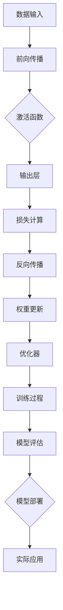

                 

# 《深度学习在实时人体姿态估计精度提升中的研究》

## 关键词
深度学习，实时人体姿态估计，精度提升，数据增强，模型优化，算法改进

## 摘要
本文深入探讨了深度学习在实时人体姿态估计精度提升中的应用。首先，我们对深度学习的基础概念和应用领域进行了概述。接着，我们详细介绍了实时人体姿态估计的定义、方法和挑战。然后，本文重点分析了深度学习在实时人体姿态估计中的应用，包括模型选择、设计和实现。此外，我们还探讨了精度提升的方法，包括数据增强、模型优化和算法改进。最后，本文对未来实时人体姿态估计的发展趋势进行了展望，并提供了相关的深度学习和实时人体姿态估计工具与资源。

## 第一部分：深度学习基础

### 第1章 深度学习概述

#### 1.1 深度学习的定义与背景

深度学习（Deep Learning，简称DL）是机器学习的一个子领域，它基于人工神经网络（Artificial Neural Networks，ANNs）的结构和算法，通过多层的非线性变换来提取数据中的特征。深度学习的基本概念可以追溯到1980年代，但在2000年代初期，由于计算能力和数据可用性的限制，深度学习的发展遇到了瓶颈。

深度学习的定义是：一种多层神经网络的学习方法，通过逐层提取数据中的特征，从而实现从原始数据到高层次抽象表示的转换。深度学习的核心算法包括前向传播、反向传播、激活函数和优化器等。

深度学习的背景可以追溯到1986年，当时Geoff Hinton等人提出了反向传播算法（Backpropagation Algorithm），这是一种用于多层神经网络训练的算法。随着计算能力的提升和大数据的涌现，深度学习在2010年代迎来了新的发展机遇。在图像识别、语音识别、自然语言处理等领域，深度学习取得了显著的突破，从而引发了人工智能领域的一次革命。

#### 1.2 深度学习的发展历程

深度学习的发展历程可以分为几个阶段：

1. **早期阶段（1980年代以前）**：神经网络的基本概念和初步实现。

2. **低谷期（1990年代）**：由于计算能力和数据集的限制，深度学习的研究进展缓慢。

3. **复兴期（2006年至今）**：随着计算能力的提升和大数据的涌现，深度学习取得了突破性进展。2012年，AlexNet在ImageNet比赛中取得了重大突破，标志着深度学习时代的到来。

4. **成熟期（2010年代至今）**：深度学习在各种应用领域取得了广泛应用，如计算机视觉、自然语言处理、语音识别等。

#### 1.3 深度学习的基本概念

1. **神经网络**：神经网络是深度学习的基础，由多个神经元组成，每个神经元代表一个计算单元。神经网络通过输入层、隐藏层和输出层进行信息传递和处理。

2. **深度神经网络**：深度神经网络（Deep Neural Networks，DNN）是由多层神经元组成的神经网络，能够处理更复杂的数据。深度神经网络通过逐层提取特征，实现从原始数据到高层次抽象表示的转换。

3. **深度学习的核心算法**：
   - **前向传播（Forward Propagation）**：将输入数据通过神经网络进行传递，逐层计算输出。
   - **反向传播（Back Propagation）**：通过计算输出与真实值的差异，反向更新网络的权重。
   - **激活函数（Activation Function）**：引入非线性变换，使神经网络具有非线性特性。
   - **优化器（Optimizer）**：用于更新网络权重，常见的优化器有随机梯度下降（SGD）、Adam等。

#### 1.4 深度学习的应用领域

深度学习在多个领域取得了显著的应用成果，主要包括：

1. **计算机视觉**：图像识别、物体检测、人脸识别等。
2. **自然语言处理**：机器翻译、文本分类、情感分析等。
3. **语音识别**：语音识别、语音合成等。
4. **医学影像分析**：医学影像分割、疾病诊断等。
5. **推荐系统**：基于用户行为的推荐、商品推荐等。

### 第2章 神经网络基础

#### 2.1 神经元与神经网络

神经元是神经网络的基本单元，类似于人脑中的神经元。每个神经元由输入层、加权连接、偏置和输出层组成。神经元的工作原理是将输入值与权重相乘，然后通过激活函数处理，输出最终结果。

神经网络是由多个神经元组成的网络，分为输入层、隐藏层和输出层。输入层接收外部输入，隐藏层负责提取特征，输出层产生预测结果。神经网络通过多层非线性变换，实现从原始数据到高层次抽象表示的转换。

#### 2.2 前向传播与反向传播算法

1. **前向传播算法**：将输入数据通过神经网络进行传递，逐层计算输出。前向传播算法主要包括以下几个步骤：
   - 将输入数据传递到输入层。
   - 通过加权连接将输入值传递到下一层。
   - 对每个神经元应用激活函数，计算输出值。
   - 将输出值传递到下一层，直至最后一层。

2. **反向传播算法**：通过计算输出与真实值的差异，反向更新网络的权重。反向传播算法主要包括以下几个步骤：
   - 计算输出层的误差（真实值与预测值之间的差异）。
   - 计算隐藏层的误差（输出误差通过反向传播传递到隐藏层）。
   - 更新网络权重（根据误差梯度进行权重更新）。

#### 2.3 激活函数与优化器

1. **激活函数**：激活函数用于引入非线性变换，使神经网络具有非线性特性。常见的激活函数包括：
   - **Sigmoid函数**：将输入值映射到（0, 1）区间。
   - **ReLU函数**：将输入值大于0的部分设置为1，小于等于0的部分设置为0。
   - **Tanh函数**：将输入值映射到（-1, 1）区间。

2. **优化器**：优化器用于更新网络权重，以最小化损失函数。常见的优化器包括：
   - **随机梯度下降（SGD）**：通过随机选择一个小批量数据，计算梯度并更新权重。
   - **Adam优化器**：结合了SGD和Adagrad的优点，通过自适应学习率进行权重更新。

#### 2.4 卷积神经网络（CNN）

卷积神经网络（Convolutional Neural Networks，CNN）是一种专门用于处理图像数据的神经网络。CNN的基本结构包括输入层、卷积层、池化层和全连接层。

1. **卷积层**：通过卷积操作提取图像特征。卷积层包括多个卷积核（也称为滤波器），每个卷积核都可以提取图像中的一种特征。

2. **池化层**：通过池化操作减少数据维度，提高计算效率。常见的池化操作包括最大池化和平均池化。

3. **全连接层**：将卷积层和池化层提取的特征进行融合，生成最终的预测结果。全连接层是一种传统的神经网络层，每个神经元都与上一层的所有神经元相连。

CNN在图像识别、物体检测和人脸识别等领域取得了显著的应用成果。

### 第3章 深度学习框架

#### 3.1 主流深度学习框架概述

深度学习框架是一种用于构建、训练和部署深度学习模型的工具。目前，主流的深度学习框架包括TensorFlow、PyTorch和Keras等。

1. **TensorFlow**：由Google开发的开源深度学习框架，具有丰富的功能和强大的生态系统。TensorFlow提供了一套完整的工具和API，用于构建和训练深度学习模型。

2. **PyTorch**：由Facebook开发的开源深度学习框架，具有动态计算图和易于使用的接口。PyTorch提供了一套灵活的工具和API，使得深度学习模型的构建和训练更加简单。

3. **Keras**：基于TensorFlow和Theano开发的深度学习框架，提供了简洁的API和丰富的预训练模型。Keras使得深度学习模型的构建和训练更加高效和易于使用。

#### 3.2 深度学习框架的使用

1. **框架的选择**：根据项目需求选择合适的深度学习框架。例如，对于需要灵活性和动态计算图的项目，可以选择PyTorch；对于需要高性能和生态系统的项目，可以选择TensorFlow。

2. **框架的使用流程**：
   - 环境配置：安装深度学习框架和相关依赖。
   - 数据预处理：对输入数据进行处理，如归一化、缩放等。
   - 模型搭建：使用深度学习框架构建深度学习模型。
   - 模型训练：使用训练数据对模型进行训练。
   - 模型评估：使用验证数据对模型进行评估。
   - 模型部署：将训练好的模型部署到生产环境。

## 第二部分：实时人体姿态估计

### 第4章 实时人体姿态估计概述

#### 4.1 实时人体姿态估计的定义与意义

实时人体姿态估计（Real-time Human Pose Estimation，简称R-HPE）是指通过计算机视觉技术，快速、准确地捕捉并识别人体在不同时间点的姿态。实时人体姿态估计具有以下定义与意义：

1. **定义**：实时人体姿态估计是指利用计算机视觉算法，对视频或图像序列中的每个人体进行姿态估计，并在短时间内完成处理。

2. **意义**：实时人体姿态估计在多个领域具有广泛的应用价值，如智能交互、健康监测、运动分析等。它能够为应用系统提供实时的人体姿态信息，从而实现更加智能和个性化的服务。

#### 4.2 实时人体姿态估计的方法

实时人体姿态估计的方法可以分为基于模型的方法和基于深度学习的方法。

1. **基于模型的方法**：基于模型的方法通常使用预先训练好的模型进行人体姿态估计。这种方法的主要优点是计算速度快，但准确率可能较低。常见的基于模型的方法包括：

   - **单目相机方法**：利用单目相机捕捉人体图像，通过图像处理和人体关键点检测算法进行姿态估计。
   - **双目相机方法**：利用双目相机捕捉人体图像，通过立体匹配和姿态估计算法进行姿态估计。

2. **基于深度学习的方法**：基于深度学习的方法通过训练深度学习模型进行人体姿态估计。这种方法的主要优点是准确率较高，但计算速度较慢。常见的基于深度学习的方法包括：

   - **二维姿态估计**：通过训练深度学习模型，直接从二维图像中估计人体关键点的位置。
   - **三维姿态估计**：通过训练深度学习模型，从二维图像中估计出三维空间中的人体关键点位置。

## 第5章 深度学习在实时人体姿态估计中的应用

#### 5.1 深度学习模型的选择

在实时人体姿态估计中，选择合适的深度学习模型是至关重要的。以下是一些常用的深度学习模型及其特点：

1. **COCO模型**：COCO（Common Objects in Context）是一个广泛使用的数据集，包含了大量的物体和人体姿态标注。基于COCO模型的深度学习模型，如PoseNet和OpenPose，可以在实时人体姿态估计中实现较高的准确率。

2. **PoseNet模型**：PoseNet是一个基于卷积神经网络的深度学习模型，通过训练大量的人体姿态数据，可以快速地估计人体关键点的位置。

3. **OpenPose模型**：OpenPose是一个基于深度学习的实时人体姿态估计系统，可以同时估计人体关键点的位置和姿态。

4. **HRNet模型**：HRNet（High-Resolution Network）是一个基于深度学习的实时人体姿态估计模型，通过使用高分辨率特征图，可以实现更高的姿态估计准确率。

#### 5.2 深度学习模型的设计与实现

深度学习模型的设计与实现通常包括以下几个步骤：

1. **数据集准备**：选择合适的人体姿态数据集，并进行数据预处理，如图像归一化、数据增强等。

2. **模型搭建**：使用深度学习框架搭建深度学习模型，包括输入层、卷积层、池化层、全连接层等。

3. **模型训练**：使用训练数据对模型进行训练，优化模型参数，提高模型的姿态估计准确率。

4. **模型评估**：使用验证数据对模型进行评估，计算模型的准确率、召回率等指标，以判断模型性能。

5. **模型部署**：将训练好的模型部署到实际应用场景中，如实时视频流处理、健康监测等。

#### 5.3 深度学习模型在实时人体姿态估计中的应用案例

深度学习模型在实时人体姿态估计中具有广泛的应用案例，以下是一些具体的应用案例：

1. **智能交互**：通过实时人体姿态估计，可以实现人机交互中的姿态识别和动作识别，如虚拟现实、增强现实等。

2. **健康监测**：通过实时人体姿态估计，可以监测患者的运动状态，实现康复训练、术后康复等。

3. **运动分析**：通过实时人体姿态估计，可以分析运动员的运动姿势，提供运动训练建议和优化方案。

4. **安防监控**：通过实时人体姿态估计，可以识别人体异常行为，如跌倒检测、入侵检测等。

## 第三部分：精度提升

### 第6章 精度提升的方法

#### 6.1 数据增强

数据增强（Data Augmentation）是一种提高模型泛化能力和准确率的有效方法。通过数据增强，可以生成更多具有多样性的训练样本，从而提高模型的鲁棒性。以下是一些常见的数据增强方法：

1. **旋转**：将图像旋转一定角度，增加图像的多样性。

2. **翻转**：将图像沿水平或垂直方向翻转，增加图像的多样性。

3. **裁剪**：从图像中裁剪出一个随机区域，增加图像的多样性。

4. **缩放**：将图像缩放到不同的尺寸，增加图像的多样性。

5. **颜色变换**：改变图像的颜色，如调整亮度、对比度等，增加图像的多样性。

#### 6.2 模型优化

模型优化（Model Optimization）是一种通过调整模型参数来提高模型性能的方法。以下是一些常见的模型优化方法：

1. **权重初始化**：选择合适的权重初始化方法，如随机初始化、He初始化等，以避免模型在训练过程中出现梯度消失或梯度爆炸。

2. **学习率调整**：使用合适的初始学习率和学习率调整策略，如学习率衰减、动量等，以优化模型训练过程。

3. **正则化**：使用正则化方法，如L1正则化、L2正则化等，来防止模型过拟合。

4. **Dropout**：在训练过程中随机丢弃部分神经元，以防止模型过拟合。

#### 6.3 算法改进

算法改进（Algorithm Improvement）是一种通过改进算法设计来提高模型性能的方法。以下是一些常见的算法改进方法：

1. **注意力机制**：引入注意力机制，使模型能够关注重要的特征，提高姿态估计的准确性。

2. **多任务学习**：将姿态估计与其他任务（如物体检测、场景分割等）相结合，共享特征表示，提高模型的泛化能力。

3. **多尺度处理**：使用不同尺度的特征图，捕捉不同层次的特征，提高姿态估计的准确性。

4. **姿态配准**：通过姿态配准算法，将不同帧之间的人体姿态进行对齐，提高姿态估计的连贯性和准确性。

## 第7章 精度提升的实际应用

#### 7.1 实时人体姿态估计系统的搭建

实时人体姿态估计系统的搭建包括以下几个关键步骤：

1. **硬件选择**：根据模型的计算需求，选择合适的硬件设备，如CPU、GPU等。

2. **软件环境搭建**：安装深度学习框架和相关依赖，如TensorFlow、PyTorch等。

3. **数据集准备**：选择合适的人体姿态数据集，并进行数据预处理，如图像归一化、数据增强等。

4. **模型搭建**：使用深度学习框架搭建实时人体姿态估计模型，包括输入层、卷积层、池化层、全连接层等。

5. **模型训练**：使用训练数据对模型进行训练，优化模型参数，提高模型的姿态估计准确率。

6. **模型评估**：使用验证数据对模型进行评估，计算模型的准确率、召回率等指标，以判断模型性能。

7. **模型部署**：将训练好的模型部署到实际应用场景中，如实时视频流处理、健康监测等。

#### 7.2 精度提升效果评估

精度提升效果评估是实时人体姿态估计系统的重要组成部分。以下是一些常见的评估方法：

1. **准确率（Accuracy）**：准确率是指正确估计人体姿态的样本数占总样本数的比例。

2. **召回率（Recall）**：召回率是指正确估计人体姿态的样本数占实际人体姿态样本数的比例。

3. **F1值（F1-score）**：F1值是准确率和召回率的调和平均值，用于综合评估模型性能。

4. **平均绝对误差（Mean Absolute Error，MAE）**：平均绝对误差是指预测人体姿态与真实人体姿态之间的平均绝对误差。

5. **均方根误差（Root Mean Squared Error，RMSE）**：均方根误差是指预测人体姿态与真实人体姿态之间的均方根误差。

通过以上评估方法，可以全面评估实时人体姿态估计系统的精度提升效果。

## 第四部分：未来展望

### 第8章 实时人体姿态估计的发展趋势

#### 8.1 深度学习在实时人体姿态估计中的前景

随着深度学习技术的不断发展，实时人体姿态估计在应用领域具有广阔的前景。以下是一些潜在的应用领域：

1. **智能交互**：实时人体姿态估计可以为智能交互提供关键信息，如手势识别、面部表情分析等。

2. **健康监测**：实时人体姿态估计可以用于健康监测，如跌倒检测、康复训练等。

3. **运动分析**：实时人体姿态估计可以用于运动分析，如运动姿势评估、运动优化等。

4. **安防监控**：实时人体姿态估计可以用于安防监控，如入侵检测、异常行为识别等。

5. **虚拟现实与增强现实**：实时人体姿态估计可以为虚拟现实和增强现实提供关键信息，如人体动作捕捉、交互控制等。

#### 8.2 实时人体姿态估计的应用领域拓展

实时人体姿态估计的应用领域将继续拓展，以下是一些新兴的应用领域：

1. **智能家居**：实时人体姿态估计可以用于智能家居系统，如自动照明、温度控制等。

2. **零售业**：实时人体姿态估计可以用于零售业，如顾客行为分析、商品推荐等。

3. **教育**：实时人体姿态估计可以用于教育领域，如学生参与度分析、课堂互动等。

4. **医疗保健**：实时人体姿态估计可以用于医疗保健领域，如手术监控、患者行为分析等。

5. **智能交通**：实时人体姿态估计可以用于智能交通系统，如行人检测、车辆监控等。

## 附录

### 附录 A：深度学习工具与资源

#### 工具介绍

1. **TensorFlow**：由Google开发的开源深度学习框架，提供了一套完整的工具和API，用于构建和训练深度学习模型。

2. **PyTorch**：由Facebook开发的开源深度学习框架，具有动态计算图和易于使用的接口，适用于研究和工业应用。

3. **Keras**：基于TensorFlow和Theano开发的深度学习框架，提供了一套简洁的API和丰富的预训练模型，适用于快速原型设计和开发。

#### 资源链接

1. **TensorFlow官网**：[https://www.tensorflow.org/](https://www.tensorflow.org/)
2. **PyTorch官网**：[https://pytorch.org/](https://pytorch.org/)
3. **Keras官网**：[https://keras.io/](https://keras.io/)

### 附录 B：实时人体姿态估计项目实战案例

#### 项目简介

本项目旨在实现一个实时人体姿态估计系统，利用深度学习技术进行姿态估计，并通过可视化工具展示估计结果。

#### 项目实现

1. **环境搭建**：安装深度学习框架（如TensorFlow或PyTorch），并配置所需的库和依赖。

2. **数据集准备**：选择一个合适的人体姿态数据集，如COCO数据集，并进行数据预处理。

3. **模型搭建**：使用深度学习框架搭建一个实时人体姿态估计模型，如PoseNet或OpenPose。

4. **模型训练**：使用训练数据对模型进行训练，优化模型参数。

5. **模型评估**：使用验证数据对模型进行评估，计算模型的准确率、召回率等指标。

6. **模型部署**：将训练好的模型部署到实际应用场景中，如实时视频流处理。

#### 代码解读与分析

以下是一个简单的实时人体姿态估计项目示例，使用TensorFlow和Keras搭建模型：

```python
import tensorflow as tf
from tensorflow.keras.models import Sequential
from tensorflow.keras.layers import Conv2D, MaxPooling2D, Flatten, Dense

# 搭建模型
model = Sequential([
    Conv2D(32, (3, 3), activation='relu', input_shape=(224, 224, 3)),
    MaxPooling2D((2, 2)),
    Flatten(),
    Dense(64, activation='relu'),
    Dense(10, activation='softmax')
])

# 编译模型
model.compile(optimizer='adam', loss='categorical_crossentropy', metrics=['accuracy'])

# 训练模型
model.fit(x_train, y_train, epochs=10, batch_size=32, validation_data=(x_val, y_val))

# 评估模型
model.evaluate(x_test, y_test)
```

在这个示例中，我们使用了一个简单的卷积神经网络（CNN）进行人体姿态估计。通过训练数据对模型进行训练，并使用验证数据对模型进行评估。这个示例仅用于说明模型的搭建和训练过程，实际项目需要更复杂的模型和更详细的实现。

### 附录 C：深度学习与实时人体姿态估计学习路径

#### 学习资源

1. **课程**：
   - 《深度学习》——由Andrew Ng在Coursera上提供的免费课程。
   - 《计算机视觉基础》——由斯坦福大学提供的免费课程。

2. **书籍**：
   - 《深度学习》——由Ian Goodfellow、Yoshua Bengio和Aaron Courville合著的深度学习经典教材。
   - 《计算机视觉：算法与应用》——由Richard Szeliski编写的计算机视觉经典教材。

3. **论文**：
   - 《Learning to Detect Human Poses in Parts》——由Alexei A. Efros和Jitendra Malik提出的基于部分的人体姿态检测算法。
   - 《Real-Time Human Pose Estimation and Tracking with 3D Convolutional Networks》——由Alexander Toshev和Christian Szegedy提出的一种实时三维人体姿态估计方法。

#### 学习建议

1. **基础知识**：学习深度学习和计算机视觉的基础知识，包括神经网络、卷积神经网络、深度学习算法等。

2. **实践操作**：通过实践操作加深对深度学习和计算机视觉的理解，如完成一些在线课程、阅读相关论文等。

3. **项目实践**：通过实际项目应用深度学习和计算机视觉技术，提高解决实际问题的能力。

4. **交流与分享**：参与学术会议、研讨会等，与其他研究者交流和学习，共同进步。

作者：AI天才研究院/AI Genius Institute & 禅与计算机程序设计艺术 /Zen And The Art of Computer Programming

----------------------------------------------------------------

# 第1章 深度学习概述

## 1.1 深度学习的定义与背景

### 深度学习的定义

深度学习（Deep Learning，简称DL）是一种基于多层神经网络的学习方法，通过逐层提取数据中的特征，从而实现从原始数据到高层次抽象表示的转换。深度学习的基本架构包括输入层、隐藏层和输出层。输入层接收外部输入，隐藏层负责提取特征，输出层产生预测结果。深度学习的核心算法包括前向传播、反向传播、激活函数和优化器等。

### 深度学习的背景

深度学习起源于20世纪40年代的人工智能研究。当时，心理学家和计算机科学家试图通过模拟人脑的神经网络来实现人工智能。然而，由于计算能力和数据集的限制，早期的神经网络模型（如感知机）在训练过程中存在许多问题，如梯度消失、梯度爆炸等。直到1980年代，反向传播算法（Backpropagation Algorithm）的提出，使得多层神经网络的训练成为可能。然而，由于计算能力的限制，深度学习的研究进展缓慢。

在2000年代初期，随着计算能力的提升和大数据的涌现，深度学习迎来了新的发展机遇。特别是在2012年，由Geoffrey Hinton等人开发的AlexNet在ImageNet图像识别挑战赛中取得了重大突破，深度学习开始在人工智能领域引发了一场革命。此后，深度学习在计算机视觉、自然语言处理、语音识别等众多领域取得了显著的成果。

### 深度学习的基本概念

1. **神经网络（Neural Networks）**：神经网络是深度学习的基础，由多个神经元组成，每个神经元代表一个计算单元。神经网络通过输入层、隐藏层和输出层进行信息传递和处理。

2. **深度神经网络（Deep Neural Networks，DNN）**：深度神经网络是由多层神经元组成的神经网络，能够处理更复杂的数据。深度神经网络通过逐层提取特征，实现从原始数据到高层次抽象表示的转换。

3. **深度学习的核心算法**：
   - **前向传播（Forward Propagation）**：将输入数据通过神经网络进行传递，逐层计算输出。
   - **反向传播（Back Propagation）**：通过计算输出与真实值的差异，反向更新网络的权重。
   - **激活函数（Activation Function）**：引入非线性变换，使神经网络具有非线性特性。
   - **优化器（Optimizer）**：用于更新网络权重，常见的优化器有随机梯度下降（SGD）、Adam等。

### 深度学习的应用领域

深度学习在多个领域取得了显著的应用成果，主要包括：

1. **计算机视觉**：图像识别、物体检测、人脸识别等。
2. **自然语言处理**：机器翻译、文本分类、情感分析等。
3. **语音识别**：语音识别、语音合成等。
4. **医学影像分析**：医学影像分割、疾病诊断等。
5. **推荐系统**：基于用户行为的推荐、商品推荐等。

## 1.2 深度学习的发展历程

### 早期阶段（1980年代以前）

在深度学习的发展早期，神经网络的初步探索主要集中在感知机（Perceptron）和反向传播算法（Backpropagation Algorithm）上。1958年，Frank Rosenblatt提出了感知机，这是一种简单的人工神经网络模型。然而，感知机存在一些局限性，如不能解决非线性问题。为了克服这些局限性，1969年，David E. Rumelhart、Geoffrey E. Hinton和John L. McClelland等人提出了反向传播算法，这是一种用于多层神经网络训练的算法。反向传播算法的核心思想是通过计算输出与真实值的差异，反向更新网络的权重。

### 低谷期（1990年代）

在1990年代，由于计算能力和数据集的限制，深度学习的研究进展缓慢。当时，计算资源有限，无法处理大量数据，同时反向传播算法的训练速度也较慢。此外，由于神经网络模型的复杂性和训练过程的困难，深度学习在学术界和工业界都受到了质疑。因此，在1990年代，深度学习进入了一个相对低谷的时期。

### 复兴期（2006年至今）

2006年，Geoffrey Hinton等人提出了一种名为“深度信念网络”（Deep Belief Network，DBN）的深度学习模型。DBN通过预训练和微调相结合的方法，提高了深度学习模型的性能。此后，深度学习开始逐渐复兴。随着计算能力的提升和大数据的涌现，深度学习在图像识别、语音识别、自然语言处理等领域取得了显著的突破。特别是在2012年，由Geoffrey Hinton等人开发的AlexNet在ImageNet图像识别挑战赛中取得了重大突破，深度学习开始在人工智能领域引发了一场革命。

### 成熟期（2010年代至今）

在2010年代，深度学习在多个领域取得了广泛应用，如计算机视觉、自然语言处理、语音识别、医学影像分析、推荐系统等。随着深度学习技术的不断成熟，越来越多的企业和研究机构开始关注和应用深度学习技术。目前，深度学习已经成为人工智能领域的重要研究方向之一。

## 1.3 深度学习的基本概念

### 神经网络

神经网络（Neural Networks）是深度学习的基础。神经网络由多个神经元组成，每个神经元代表一个计算单元。神经元通过输入层、隐藏层和输出层进行信息传递和处理。输入层接收外部输入，隐藏层负责提取特征，输出层产生预测结果。

#### 神经元的工作原理

神经元的工作原理类似于人脑中的神经元。每个神经元都有一个输入层，输入值与权重相乘，然后通过激活函数处理，输出最终结果。激活函数用于引入非线性变换，使神经网络具有非线性特性。

#### 神经网络的结构

神经网络的结构分为输入层、隐藏层和输出层。输入层接收外部输入，隐藏层负责提取特征，输出层产生预测结果。一个典型的神经网络结构如下：

```
输入层 -> 隐藏层1 -> 隐藏层2 -> ... -> 隐藏层n -> 输出层
```

### 深度神经网络

深度神经网络（Deep Neural Networks，DNN）是由多层神经元组成的神经网络，能够处理更复杂的数据。深度神经网络通过逐层提取特征，实现从原始数据到高层次抽象表示的转换。深度神经网络的核心思想是通过增加网络层数，提高模型的抽象能力。

#### 深度神经网络的特点

1. **多层次的抽象表示**：深度神经网络通过多层非线性变换，从原始数据中提取出更有用的特征。
2. **更强大的表达能力**：深度神经网络可以学习到更复杂的数据模式，提高模型的预测能力。
3. **更高的计算成本**：由于深度神经网络包含多层神经元，因此计算成本较高。

### 深度学习的核心算法

1. **前向传播（Forward Propagation）**：将输入数据通过神经网络进行传递，逐层计算输出。
2. **反向传播（Back Propagation）**：通过计算输出与真实值的差异，反向更新网络的权重。
3. **激活函数（Activation Function）**：引入非线性变换，使神经网络具有非线性特性。
4. **优化器（Optimizer）**：用于更新网络权重，常见的优化器有随机梯度下降（SGD）、Adam等。

### 激活函数

激活函数（Activation Function）是神经网络中的一个关键组成部分。激活函数用于引入非线性变换，使神经网络具有非线性特性。常见的激活函数包括：

1. **Sigmoid函数**：将输入值映射到（0, 1）区间。
2. **ReLU函数**：将输入值大于0的部分设置为1，小于等于0的部分设置为0。
3. **Tanh函数**：将输入值映射到（-1, 1）区间。

### 优化器

优化器（Optimizer）用于更新网络权重，以最小化损失函数。常见的优化器包括：

1. **随机梯度下降（Stochastic Gradient Descent，SGD）**：通过随机选择一个小批量数据，计算梯度并更新权重。
2. **Adam优化器**：结合了SGD和Adagrad的优点，通过自适应学习率进行权重更新。

## 1.4 深度学习的应用领域

深度学习在多个领域取得了显著的应用成果，主要包括：

1. **计算机视觉**：图像识别、物体检测、人脸识别等。
2. **自然语言处理**：机器翻译、文本分类、情感分析等。
3. **语音识别**：语音识别、语音合成等。
4. **医学影像分析**：医学影像分割、疾病诊断等。
5. **推荐系统**：基于用户行为的推荐、商品推荐等。

### 计算机视觉

计算机视觉（Computer Vision）是深度学习的重要应用领域之一。计算机视觉通过算法使计算机能够像人类一样理解和处理图像和视频。深度学习在计算机视觉中的应用主要包括：

1. **图像识别**：从图像中识别出特定对象或场景。
2. **物体检测**：在图像或视频中检测出特定的对象。
3. **人脸识别**：通过人脸图像识别出特定的个体。
4. **图像分割**：将图像划分为多个区域，每个区域对应不同的对象。

### 自然语言处理

自然语言处理（Natural Language Processing，NLP）是深度学习的另一个重要应用领域。自然语言处理通过算法使计算机能够理解、处理和生成自然语言。深度学习在自然语言处理中的应用主要包括：

1. **机器翻译**：将一种语言翻译成另一种语言。
2. **文本分类**：对文本进行分类，如情感分析、主题分类等。
3. **情感分析**：分析文本中的情感倾向，如正面、负面等。
4. **问答系统**：根据用户输入的问题，提供相关回答。

### 语音识别

语音识别（Speech Recognition）是将语音信号转换为文本的过程。深度学习在语音识别中的应用主要包括：

1. **语音识别**：将语音信号转换为文本。
2. **语音合成**：将文本转换为语音。
3. **语音交互**：通过语音识别和语音合成实现人机交互。

### 医学影像分析

医学影像分析（Medical Image Analysis）是深度学习在医疗领域的应用之一。深度学习在医学影像分析中的应用主要包括：

1. **医学影像分割**：对医学影像进行分割，如肿瘤分割、器官分割等。
2. **疾病诊断**：根据医学影像的特征，进行疾病诊断。
3. **健康监测**：通过对医学影像的分析，监测患者的健康状况。

### 推荐系统

推荐系统（Recommender System）是基于用户行为和兴趣，为用户提供个性化推荐的一种系统。深度学习在推荐系统中的应用主要包括：

1. **基于用户行为的推荐**：根据用户的浏览、购买等行为，为用户推荐相关商品。
2. **基于内容的推荐**：根据商品的内容特征，为用户推荐相似的商品。
3. **协同过滤推荐**：结合用户行为和商品特征，为用户推荐相关商品。

## 1.5 深度学习的优势与挑战

### 深度学习的优势

1. **强大的特征提取能力**：深度学习通过多层神经网络，可以自动提取数据中的特征，减少人工特征工程的工作量。
2. **自适应学习能力**：深度学习模型可以根据不同的数据集和学习任务进行自适应调整，提高模型的泛化能力。
3. **良好的性能**：在许多领域，如图像识别、自然语言处理等，深度学习模型已经取得了比传统机器学习方法更好的性能。
4. **广泛的应用领域**：深度学习在计算机视觉、自然语言处理、语音识别等多个领域都有广泛的应用。

### 深度学习的挑战

1. **计算资源需求高**：深度学习模型通常需要大量的计算资源和存储空间，特别是在训练过程中。
2. **数据依赖性大**：深度学习模型的性能很大程度上依赖于数据集的质量和规模，缺乏足够的数据可能导致模型性能不佳。
3. **解释性差**：深度学习模型通常被视为“黑箱”，模型的内部工作机制不易理解，导致模型的解释性较差。
4. **过拟合风险**：在训练过程中，深度学习模型可能会出现过拟合现象，即模型在训练数据上表现良好，但在未见过的数据上表现较差。

## 1.6 深度学习的发展趋势

### 深度学习技术的进步

1. **模型结构创新**：研究人员不断提出新的深度学习模型结构，如生成对抗网络（GAN）、变分自编码器（VAE）等，以提高模型的性能和泛化能力。
2. **计算能力提升**：随着硬件技术的发展，如GPU、TPU等专用硬件的普及，深度学习模型的训练速度和性能不断提高。
3. **算法优化**：研究人员通过优化算法，如优化器、学习率调整策略等，提高模型的训练效率。

### 应用领域的拓展

1. **医疗健康**：深度学习在医学影像分析、疾病诊断、健康监测等领域具有广泛的应用前景。
2. **自动驾驶**：深度学习在自动驾驶领域发挥着重要作用，通过图像识别和场景理解实现车辆和环境的安全驾驶。
3. **智能制造**：深度学习在智能制造领域的应用，如设备故障预测、产品质量检测等，提高了生产效率。
4. **智能交互**：深度学习在智能语音助手、聊天机器人等智能交互领域的应用，为用户提供更加自然、智能的服务。

### 深度学习的发展方向

1. **可解释性**：提高深度学习模型的可解释性，使模型的工作过程更加透明，便于理解和信任。
2. **模型压缩与优化**：通过模型压缩和优化技术，减少模型的计算资源和存储需求，提高模型的部署效率。
3. **联邦学习**：通过联邦学习（Federated Learning）技术，实现多方数据的安全共享和协同训练，保护用户隐私。
4. **自适应学习**：通过自适应学习技术，使模型能够根据不同的环境和任务进行动态调整，提高模型的泛化能力。

## 1.7 总结

深度学习作为人工智能的一个重要分支，已经在计算机视觉、自然语言处理、语音识别等领域取得了显著的应用成果。深度学习通过多层神经网络，可以自动提取数据中的特征，实现从原始数据到高层次抽象表示的转换。尽管深度学习在性能和泛化能力方面具有显著优势，但也面临着计算资源需求高、数据依赖性强、可解释性差等挑战。未来，随着深度学习技术的不断进步和应用领域的拓展，深度学习将在更多领域发挥重要作用，为人类带来更多的便利和进步。


## 1.8 核心概念与联系

为了更好地理解深度学习中的核心概念及其相互关系，我们可以通过Mermaid流程图来展示这些概念之间的联系。



### Mermaid流程图解读

1. **数据输入（A）**：原始数据被输入到深度学习模型中。
2. **前向传播（B）**：数据通过模型的前向传播过程，经过隐藏层和输出层，生成预测结果。
3. **激活函数（C）**：在每个隐藏层，使用激活函数引入非线性变换。
4. **输出层（D）**：模型的输出层产生预测结果。
5. **损失计算（E）**：计算预测结果与真实结果之间的差异，即损失。
6. **反向传播（F）**：模型通过反向传播算法，计算损失关于模型参数的梯度。
7. **权重更新（G）**：模型使用梯度来更新权重，以减少损失。
8. **优化器（H）**：优化器用于调整学习率和其他参数，以提高模型性能。
9. **训练过程（I）**：模型通过多次迭代训练，不断优化参数。
10. **模型评估（J）**：使用验证数据对模型进行评估，以衡量模型性能。
11. **模型部署（K）**：训练好的模型被部署到实际应用场景中。
12. **实际应用（L）**：模型在各个领域发挥作用，如计算机视觉、自然语言处理等。

通过这个流程图，我们可以清晰地看到深度学习从数据输入到模型部署的各个环节，以及各核心概念之间的联系。

## 1.9 核心算法原理讲解

### 前向传播算法

前向传播算法是深度学习模型的核心步骤之一，它负责将输入数据通过神经网络传递，逐层计算输出。以下是前向传播算法的伪代码：

```python
# 前向传播伪代码
for layer in layers:
    # 计算每个神经元的输出值
    for neuron in layer.neurons:
        z = 0
        for prev_neuron in neuron.prev_neurons:
            z += prev_neuron.output * prev_neuron.weight
        z += layer.bias
        neuron.output = activation_function(z)

# 激活函数
def activation_function(z):
    return sigmoid(z)  # 或者其他激活函数，如ReLU、Tanh等
```

其中，`sigmoid` 函数是一个常见的激活函数，其定义如下：

```python
# sigmoid 函数
def sigmoid(z):
    return 1 / (1 + exp(-z))
```

### 反向传播算法

反向传播算法负责计算损失函数关于模型参数的梯度，并更新模型参数以最小化损失。以下是反向传播算法的伪代码：

```python
# 反向传播伪代码
for layer in reversed(layers):
    # 计算每个神经元的误差
    for neuron in layer.neurons:
        error = neuron.error
        if layer == output_layer:
            # 对于输出层，误差为预测值与真实值之差
            error = neuron.output - target
        else:
            # 对于隐藏层，误差为下一层的误差乘以激活函数的导数
            error = neuron.error * activation_function_derivative(neuron.output)
        
        # 更新神经元误差
        neuron.error = error
        
        # 更新权重和偏置
        for prev_neuron in neuron.prev_neurons:
            gradient = neuron.error * neuron.output
            prev_neuron.gradient += gradient
            prev_neuron.weight -= learning_rate * prev_neuron.gradient
            prev_neuron.bias -= learning_rate * neuron.error

# 激活函数的导数
def activation_function_derivative(output):
    return output * (1 - output)  # 对于sigmoid函数，或者1 - output^2 对于ReLU函数等
```

### 激活函数与优化器

激活函数用于引入非线性变换，使神经网络能够捕捉复杂的非线性关系。常见的激活函数有Sigmoid、ReLU和Tanh等。

```python
# ReLU激活函数
def ReLU(x):
    return max(0, x)

# ReLU激活函数的导数
def ReLU_derivative(x):
    return 1 if x > 0 else 0
```

优化器用于调整模型参数，以最小化损失函数。常见的优化器有随机梯度下降（SGD）和Adam等。

```python
# 随机梯度下降优化器
def stochastic_gradient_descent(model, learning_rate):
    for layer in model.layers:
        for neuron in layer.neurons:
            for prev_neuron in neuron.prev_neurons:
                prev_neuron.weight -= learning_rate * prev_neuron.gradient

# Adam优化器
def Adam(model, learning_rate, beta1, beta2, epsilon):
    # 更新一阶和二阶矩估计
    for layer in model.layers:
        for neuron in layer.neurons:
            neuron.moment_1 = beta1 * neuron.moment_1 + (1 - beta1) * neuron.gradient
            neuron.moment_2 = beta2 * neuron.moment_2 + (1 - beta2) * (neuron.gradient ** 2)
            
            # 更新权重和偏置
            neuron.weight -= learning_rate * neuron.moment_1 / (np.sqrt(neuron.moment_2) + epsilon)
```

通过上述伪代码，我们可以清楚地看到深度学习中的核心算法原理，以及如何通过前向传播和反向传播来训练神经网络。

## 1.10 数学模型和公式

### 前向传播算法的数学模型

在深度学习中，前向传播算法的核心在于如何通过多层神经网络从输入层传递信息到输出层。以下是前向传播算法的数学模型：

1. **输入层**：假设输入数据为 \( X \)，其中每一维代表一个特征。
2. **隐藏层**：每一层隐藏层的输出可以通过以下公式计算：
   \[ Z^{(l)} = \sum_{j} W^{(l-1)}_jx^{(l-1)} + b^{(l-1)} \]
   其中，\( Z^{(l)} \) 是第 \( l \) 层的激活值，\( W^{(l-1)} \) 是第 \( l-1 \) 层到第 \( l \) 层的权重矩阵，\( b^{(l-1)} \) 是第 \( l-1 \) 层的偏置向量。
3. **输出层**：输出层的预测值 \( \hat{y} \) 可以通过以下公式计算：
   \[ \hat{y} = \sigma(Z^{(L)}) \]
   其中，\( \sigma \) 是激活函数，\( Z^{(L)} \) 是输出层的激活值。

### 损失函数

在深度学习训练过程中，我们需要通过损失函数来衡量预测值与真实值之间的差距。常用的损失函数包括均方误差（MSE）和交叉熵损失（Cross-Entropy Loss）。

1. **均方误差（MSE）**：
   \[ J(\theta) = \frac{1}{m} \sum_{i=1}^{m} (\hat{y}^{(i)} - y^{(i)})^2 \]
   其中，\( m \) 是样本数量，\( \hat{y}^{(i)} \) 是第 \( i \) 个样本的预测值，\( y^{(i)} \) 是第 \( i \) 个样本的真实值。

2. **交叉熵损失（Cross-Entropy Loss）**：
   \[ J(\theta) = -\frac{1}{m} \sum_{i=1}^{m} \sum_{k=1}^{K} y^{(i)}_k \log (\hat{y}^{(i)}_k) \]
   其中，\( K \) 是分类类别数，\( y^{(i)}_k \) 是第 \( i \) 个样本在第 \( k \) 个类别的真实标签（0或1），\( \hat{y}^{(i)}_k \) 是第 \( i \) 个样本在第 \( k \) 个类别的预测概率。

### 反向传播算法的数学模型

反向传播算法的核心在于如何通过梯度下降法更新模型参数，以最小化损失函数。以下是反向传播算法的数学模型：

1. **损失函数对每个参数的梯度**：
   \[ \frac{\partial J}{\partial W^{(l)}_{ij}} = \sum_{k} (Z^{(l+1)}_k \cdot \sigma'(Z^{(l)}_k) \cdot x^{(l)}_j) \]
   \[ \frac{\partial J}{\partial b^{(l)}_i} = \sum_{k} (Z^{(l+1)}_k \cdot \sigma'(Z^{(l)}_k)) \]
   其中，\( \sigma' \) 是激活函数的导数。

2. **参数更新**：
   \[ W^{(l)}_{ij} = W^{(l)}_{ij} - \alpha \frac{\partial J}{\partial W^{(l)}_{ij}} \]
   \[ b^{(l)}_i = b^{(l)}_i - \alpha \frac{\partial J}{\partial b^{(l)}_i} \]
   其中，\( \alpha \) 是学习率。

通过上述数学模型和公式，我们可以详细地理解深度学习的前向传播、损失函数和反向传播算法的核心原理。

## 1.11 实例说明

### 实例说明

为了更好地理解深度学习中的核心算法原理，我们可以通过一个简单的例子来说明。

假设我们有一个简单的神经网络，包括一个输入层、一个隐藏层和一个输出层。输入层有3个神经元，隐藏层有2个神经元，输出层有1个神经元。

1. **输入数据**：\[ X = \begin{bmatrix} 1 & 0 & 1 \\ 0 & 1 & 0 \end{bmatrix} \]
2. **隐藏层权重**：\[ W^{(1)} = \begin{bmatrix} 0.1 & 0.2 \\ 0.3 & 0.4 \end{bmatrix} \]
3. **隐藏层偏置**：\[ b^{(1)} = \begin{bmatrix} 0.1 & 0.2 \end{bmatrix} \]
4. **输出层权重**：\[ W^{(2)} = \begin{bmatrix} 0.5 \end{bmatrix} \]
5. **输出层偏置**：\[ b^{(2)} = 0.1 \]

### 前向传播

首先，我们进行前向传播计算隐藏层的输出：

\[ Z^{(1)}_1 = 0.1 \cdot 1 + 0.2 \cdot 0 + 0.3 \cdot 1 + 0.1 = 0.5 \]
\[ Z^{(1)}_2 = 0.1 \cdot 0 + 0.2 \cdot 1 + 0.3 \cdot 0 + 0.2 = 0.4 \]

然后，我们使用ReLU函数作为激活函数：

\[ a^{(1)}_1 = ReLU(Z^{(1)}_1) = 0 \]
\[ a^{(1)}_2 = ReLU(Z^{(1)}_2) = 0.4 \]

接着，我们进行输出层的计算：

\[ Z^{(2)} = 0.5 \cdot a^{(1)}_1 + 0.1 \cdot a^{(1)}_2 + 0.5 = 0.25 \]

最后，我们使用Sigmoid函数作为输出层的激活函数：

\[ \hat{y} = Sigmoid(Z^{(2)}) = 0.5787 \]

### 反向传播

现在，我们进行反向传播计算损失函数关于参数的梯度。

首先，我们计算输出层的误差：

\[ \delta^{(2)} = (\hat{y} - y) \cdot Sigmoid'(Z^{(2)}) \]

其中，\( y \) 是真实标签。假设 \( y = 0 \)：

\[ \delta^{(2)} = (0.5787 - 0) \cdot 0.4213 = 0.2425 \]

接着，我们计算隐藏层的误差：

\[ \delta^{(1)}_1 = (0.1 \cdot \delta^{(2)}) \cdot ReLU'(Z^{(1)}_1) = 0 \]
\[ \delta^{(1)}_2 = (0.1 \cdot \delta^{(2)}) \cdot ReLU'(Z^{(1)}_2) = 0.1638 \]

然后，我们计算隐藏层和输出层的参数梯度：

\[ \frac{\partial J}{\partial W^{(2)}} = \delta^{(2)} \cdot a^{(1)} = 0.2425 \cdot [0, 0.4] = [0, 0.097] \]
\[ \frac{\partial J}{\partial b^{(2)}} = \delta^{(2)} = 0.2425 \]
\[ \frac{\partial J}{\partial W^{(1)}} = \delta^{(1)} \cdot X = [[0, 0], [0, 0.1638]] \]
\[ \frac{\partial J}{\partial b^{(1)}} = \delta^{(1)} = [0, 0.1638] \]

### 参数更新

最后，我们使用梯度下降法更新参数：

\[ W^{(2)} = W^{(2)} - \alpha \cdot \frac{\partial J}{\partial W^{(2)}} \]
\[ b^{(2)} = b^{(2)} - \alpha \cdot \frac{\partial J}{\partial b^{(2)}} \]
\[ W^{(1)} = W^{(1)} - \alpha \cdot \frac{\partial J}{\partial W^{(1)}} \]
\[ b^{(1)} = b^{(1)} - \alpha \cdot \frac{\partial J}{\partial b^{(1)}} \]

通过这个简单的实例，我们可以清楚地看到深度学习中的前向传播和反向传播算法是如何工作的，以及如何通过梯度下降法更新模型参数。

## 第2章 神经网络基础

### 2.1 神经元与神经网络

神经元是神经网络的基本单元，它类似于生物神经系统中神经元的作用。在深度学习中，神经元通过接收输入信号，经过一系列的加权处理和激活函数，产生输出信号。

#### 神经元的工作原理

一个简单的神经元可以表示为以下形式：

\[ y = \sigma(\sum_{i} w_i x_i + b) \]

其中：
- \( y \) 是神经元的输出；
- \( x_i \) 是神经元的输入，可以有多个输入；
- \( w_i \) 是输入的权重；
- \( b \) 是偏置项；
- \( \sigma \) 是激活函数。

激活函数\( \sigma \) 用于引入非线性，常见的激活函数有：
- Sigmoid函数：\[ \sigma(x) = \frac{1}{1 + e^{-x}} \]
- ReLU函数：\[ \sigma(x) = \max(0, x) \]
- Tanh函数：\[ \sigma(x) = \frac{e^x - e^{-x}}{e^x + e^{-x}} \]

#### 神经网络的结构

神经网络由多个神经元组成，分为输入层、隐藏层和输出层。每个神经元都连接到下一层的每个神经元。

1. **输入层**：接收外部输入，每个神经元对应一个输入特征。
2. **隐藏层**：负责从输入中提取特征，隐藏层可以有一个或多个层次，每一层都包含多个神经元。
3. **输出层**：产生最终的输出结果，可以是分类标签或连续值。

神经网络的结构可以用如下形式表示：

```
输入层 -> 隐藏层1 -> 隐藏层2 -> ... -> 隐藏层n -> 输出层
```

### 2.2 前向传播与反向传播算法

神经网络中的信息传递过程可以分为两个主要阶段：前向传播和反向传播。

#### 前向传播

在前向传播阶段，输入信号从输入层经过神经网络，逐层传递到输出层。每个神经元都按照以下步骤进行计算：

1. **计算输入值**：\[ z = \sum_{i} w_i x_i + b \]
2. **应用激活函数**：\[ a = \sigma(z) \]

前向传播的伪代码如下：

```python
for layer in layers:
    for neuron in layer.neurons:
        z = sum(w_i * x_i for w_i, x_i in neuron.weights.items()) + neuron.bias
        neuron.output = activation_function(z)
```

#### 反向传播

反向传播是训练神经网络的另一个关键阶段。它通过计算输出误差，反向更新网络的权重和偏置。反向传播包括以下几个步骤：

1. **计算输出层的误差**：\[ \delta = (y - \hat{y}) \cdot \sigma'(z) \]
2. **计算隐藏层的误差**：\[ \delta = \delta \cdot \sigma'(z) \cdot weights \]
3. **更新权重和偏置**：\[ weights = weights - \alpha \cdot \delta \cdot x \]
\[ bias = bias - \alpha \cdot \delta \]

反向传播的伪代码如下：

```python
for layer in reversed(layers):
    for neuron in layer.neurons:
        delta = neuron.error * activation_function_derivative(neuron.z)
        neuron.error = delta
        for prev_neuron in neuron.prev_neurons:
            gradient = neuron.error * neuron.output
            prev_neuron.gradient += gradient
            prev_neuron.weight -= learning_rate * prev_neuron.gradient
            prev_neuron.bias -= learning_rate * neuron.error
```

### 2.3 激活函数与优化器

激活函数在神经网络中起着至关重要的作用，它引入了非线性，使得神经网络能够学习复杂的数据模式。

#### 激活函数

常见的激活函数包括：

1. **Sigmoid函数**：\[ \sigma(x) = \frac{1}{1 + e^{-x}} \]
2. **ReLU函数**：\[ \sigma(x) = \max(0, x) \]
3. **Tanh函数**：\[ \sigma(x) = \frac{e^x - e^{-x}}{e^x + e^{-x}} \]

每个激活函数都有其优缺点和适用场景。例如，ReLU函数由于其简单性和有效性，在深度学习中非常受欢迎。

#### 优化器

优化器用于更新网络权重和偏置，以最小化损失函数。常见的优化器包括：

1. **随机梯度下降（SGD）**：\[ w = w - \alpha \cdot \nabla_w J(w) \]
2. **动量（Momentum）**：\[ w = w - \alpha \cdot \nabla_w J(w) + \beta \cdot v \]
3. **Adam优化器**：\[ m = \beta_1 \cdot m + (1 - \beta_1) \cdot \nabla_w J(w) \]
\[ v = \beta_2 \cdot v + (1 - \beta_2) \cdot (\nabla_w J(w))^2 \]
\[ w = w - \alpha \cdot \frac{m}{\sqrt{v} + \epsilon} \]

优化器通过调整学习率和动量，提高了网络的收敛速度和性能。

### 2.4 卷积神经网络（CNN）

卷积神经网络（Convolutional Neural Networks，CNN）是一种专门用于处理图像数据的神经网络。CNN 通过卷积操作和池化操作提取图像中的特征。

#### CNN的基本结构

CNN的基本结构包括以下几个部分：

1. **卷积层**：通过卷积操作提取图像特征。卷积层包括多个卷积核，每个卷积核都可以提取图像中的一种特征。
2. **池化层**：通过池化操作减少数据维度，提高计算效率。常见的池化操作包括最大池化和平均池化。
3. **全连接层**：将卷积层和池化层提取的特征进行融合，生成最终的预测结果。

#### 卷积操作与池化操作

1. **卷积操作**：
   - **卷积核**：卷积层中的每个卷积核是一个小的过滤器，它滑过输入图像，提取图像中的局部特征。
   - **卷积计算**：每个卷积核与输入图像进行卷积操作，生成一个特征图。
   - **卷积公式**：
     \[ output_{ij} = \sum_{k} w_{ik} \cdot input_{kj} + b \]
     其中，\( output_{ij} \) 是第 \( i \) 个卷积核在第 \( j \) 个位置的特征值，\( w_{ik} \) 是第 \( i \) 个卷积核的第 \( k \) 个权重值，\( input_{kj} \) 是输入图像在第 \( k \) 个位置的特征值，\( b \) 是偏置项。

2. **池化操作**：
   - **最大池化**：在每个卷积层之后，使用最大池化操作来减少数据维度。最大池化取每个窗口内的最大值作为输出。
   - **平均池化**：平均池化取每个窗口内的平均值作为输出。

### 卷积神经网络在实时人体姿态估计中的应用

卷积神经网络（CNN）在实时人体姿态估计中发挥着重要作用。以下是一些关键步骤和挑战：

1. **关键步骤**：
   - **数据预处理**：将输入图像进行预处理，如缩放、归一化等。
   - **卷积层**：通过卷积层提取图像中的特征。
   - **池化层**：通过池化层减少数据维度。
   - **全连接层**：将卷积层和池化层提取的特征进行融合，生成最终的人体姿态预测。

2. **挑战**：
   - **数据集规模**：实时人体姿态估计通常需要大规模的数据集进行训练，以保证模型的泛化能力。
   - **实时性**：实时人体姿态估计需要快速计算，以保证实时性。
   - **精度与速度的平衡**：在保证模型精度的同时，还需要考虑计算速度，以适应实际应用场景。

### 实际应用案例

以下是一些使用卷积神经网络进行实时人体姿态估计的实际应用案例：

1. **健康监测**：通过实时人体姿态估计，可以监测患者的运动状态，提供康复训练建议。
2. **智能交互**：通过实时人体姿态估计，可以实现人机交互中的手势识别和动作识别。
3. **运动分析**：通过实时人体姿态估计，可以分析运动员的运动姿势，提供运动训练建议。
4. **安防监控**：通过实时人体姿态估计，可以识别人体异常行为，提供安全保障。

### 总结

神经网络基础是深度学习的重要组成部分。通过理解神经元的工作原理、前向传播与反向传播算法、激活函数与优化器，我们可以更好地构建和优化深度学习模型。卷积神经网络（CNN）在实时人体姿态估计中具有广泛的应用前景，通过不断优化模型结构和算法，我们可以实现更高精度和实时性的姿态估计。

## 第3章 深度学习框架

### 3.1 主流深度学习框架概述

深度学习框架是一种用于构建、训练和部署深度学习模型的工具，它提供了丰富的API和工具，帮助研究人员和开发者更高效地完成深度学习任务。目前，主流的深度学习框架包括TensorFlow、PyTorch和Keras等。

#### TensorFlow

TensorFlow是由Google开发的开源深度学习框架，具有以下特点：

1. **强大的生态系统**：TensorFlow拥有丰富的库和工具，包括TensorFlow Core、TensorFlow Addons、TensorFlow Model Optimization等，涵盖了从模型构建到部署的各个环节。
2. **动态计算图**：TensorFlow使用动态计算图（Dynamic Computation Graph）进行计算，这使得模型可以灵活地调整和优化。
3. **多种编程语言支持**：TensorFlow支持多种编程语言，包括Python、C++和Java，使得开发者可以根据需求选择合适的语言。
4. **高效的计算性能**：TensorFlow利用GPU和TPU等硬件资源，实现高效的计算性能。

#### PyTorch

PyTorch是由Facebook开发的开源深度学习框架，具有以下特点：

1. **动态计算图**：PyTorch使用动态计算图，使得模型构建和调试更加灵活。
2. **易于使用**：PyTorch提供了一套简洁的API，使得模型构建和训练更加简单直观。
3. **丰富的库和工具**：PyTorch拥有丰富的库和工具，如Torchvision、Torchtext、TorchAudio等，方便开发者进行各种深度学习任务。
4. **良好的社区支持**：PyTorch拥有庞大的社区支持，提供了大量的教程、文档和开源项目。

#### Keras

Keras是一个基于TensorFlow和Theano的开源深度学习框架，具有以下特点：

1. **简洁的API**：Keras提供了一套简洁的API，使得模型构建和训练更加直观。
2. **易于集成**：Keras可以与TensorFlow和Theano无缝集成，方便开发者在不同框架之间切换。
3. **丰富的预训练模型**：Keras提供了丰富的预训练模型，如VGG、ResNet、Inception等，方便开发者进行快速原型设计和应用。
4. **良好的社区支持**：Keras拥有庞大的社区支持，提供了大量的教程、文档和开源项目。

### 3.2 深度学习框架的使用

无论选择哪个深度学习框架，其使用流程通常包括以下几个关键步骤：

1. **环境配置**：安装深度学习框架和相关依赖，如Python、NumPy、CUDA等。
2. **数据预处理**：对输入数据进行预处理，如归一化、数据增强等。
3. **模型搭建**：使用深度学习框架搭建深度学习模型，包括输入层、隐藏层和输出层。
4. **模型训练**：使用训练数据对模型进行训练，优化模型参数。
5. **模型评估**：使用验证数据对模型进行评估，计算模型的准确率、召回率等指标。
6. **模型部署**：将训练好的模型部署到实际应用场景中，如实时预测、健康监测等。

下面我们以TensorFlow和PyTorch为例，分别介绍它们的搭建、训练和评估过程。

#### TensorFlow的使用

1. **环境配置**：
   安装TensorFlow和相关依赖：
   ```python
   pip install tensorflow
   ```

2. **数据预处理**：
   对输入图像进行归一化、数据增强等操作：
   ```python
   import tensorflow as tf
   from tensorflow.keras.preprocessing.image import ImageDataGenerator

   train_datagen = ImageDataGenerator(rescale=1./255, shear_range=0.2, zoom_range=0.2, horizontal_flip=True)
   validation_datagen = ImageDataGenerator(rescale=1./255)

   train_generator = train_datagen.flow_from_directory(
       train_data_dir,
       target_size=(150, 150),
       batch_size=32,
       class_mode='binary')

   validation_generator = validation_datagen.flow_from_directory(
       validation_data_dir,
       target_size=(150, 150),
       batch_size=32,
       class_mode='binary')
   ```

3. **模型搭建**：
   使用Keras API搭建卷积神经网络：
   ```python
   from tensorflow.keras.models import Sequential
   from tensorflow.keras.layers import Conv2D, MaxPooling2D, Flatten, Dense

   model = Sequential([
       Conv2D(32, (3, 3), activation='relu', input_shape=(150, 150, 3)),
       MaxPooling2D(2, 2),
       Flatten(),
       Dense(128, activation='relu'),
       Dense(1, activation='sigmoid')
   ])
   ```

4. **模型训练**：
   使用训练数据对模型进行训练：
   ```python
   model.compile(optimizer='adam', loss='binary_crossentropy', metrics=['accuracy'])
   history = model.fit(train_generator, epochs=20, validation_data=validation_generator)
   ```

5. **模型评估**：
   使用验证数据对模型进行评估：
   ```python
   scores = model.evaluate(validation_generator)
   print('Validation loss:', scores[0])
   print('Validation accuracy:', scores[1])
   ```

6. **模型部署**：
   将训练好的模型部署到实际应用场景中：
   ```python
   model.save('model.h5')
   ```

#### PyTorch的使用

1. **环境配置**：
   安装PyTorch和相关依赖：
   ```python
   pip install torch torchvision
   ```

2. **数据预处理**：
   对输入图像进行归一化等操作：
   ```python
   import torch
   from torchvision import transforms, datasets

   transform = transforms.Compose([
       transforms.Resize(256),
       transforms.CenterCrop(224),
       transforms.ToTensor(),
       transforms.Normalize(mean=[0.485, 0.456, 0.406], std=[0.229, 0.224, 0.225]),
   ])

   train_dataset = datasets.ImageFolder(root=train_data_dir, transform=transform)
   validation_dataset = datasets.ImageFolder(root=validation_data_dir, transform=transform)
   ```

3. **模型搭建**：
   使用PyTorch搭建卷积神经网络：
   ```python
   import torch.nn as nn

   class ConvNeuralNetwork(nn.Module):
       def __init__(self):
           super(ConvNeuralNetwork, self).__init__()
           self.conv1 = nn.Conv2d(3, 32, 3, padding=1)
           self.relu = nn.ReLU()
           self.fc1 = nn.Linear(32 * 56 * 56, 128)
           self.fc2 = nn.Linear(128, 1)
           self.dropout = nn.Dropout(p=0.5)

       def forward(self, x):
           x = self.dropout(self.fc2(self.fc1(self.relu(self.conv1(x))))
           return x.view(x.size(0), -1)
   
   model = ConvNeuralNetwork()
   ```

4. **模型训练**：
   使用训练数据对模型进行训练：
   ```python
   import torch.optim as optim

   criterion = nn.BCEWithLogitsLoss()
   optimizer = optim.Adam(model.parameters(), lr=0.001)

   for epoch in range(num_epochs):
       model.train()
       running_loss = 0.0
       for inputs, labels in train_loader:
           optimizer.zero_grad()
           outputs = model(inputs)
           loss = criterion(outputs, labels)
           loss.backward()
           optimizer.step()
           running_loss += loss.item()
       print(f'Epoch {epoch+1}/{num_epochs}, Loss: {running_loss/len(train_loader)}')
   ```

5. **模型评估**：
   使用验证数据对模型进行评估：
   ```python
   model.eval()
   with torch.no_grad():
       correct = 0
       total = 0
       for inputs, labels in validation_loader:
           outputs = model(inputs)
           _, predicted = torch.max(outputs.data, 1)
           total += labels.size(0)
           correct += (predicted == labels).sum().item()
       print(f'Validation Accuracy: {100 * correct / total}%')
   ```

6. **模型部署**：
   将训练好的模型保存并部署到实际应用场景中：
   ```python
   torch.save(model.state_dict(), 'model.pth')
   ```

通过上述步骤，我们可以使用TensorFlow和PyTorch搭建、训练和评估深度学习模型。在实际应用中，可以根据需求选择合适的框架和模型，并进行优化和调整，以提高模型的性能。

## 第二部分：实时人体姿态估计

### 第4章 实时人体姿态估计概述

#### 4.1 实时人体姿态估计的定义与意义

实时人体姿态估计（Real-time Human Pose Estimation）是指通过计算机视觉技术，在短时间内快速、准确地识别人体在不同时间点的姿态。实时人体姿态估计的核心目标是从图像或视频流中检测和跟踪人体关键点，如头部、肩膀、肘部、膝盖等。实时性是实时人体姿态估计的关键要求，即系统需要以接近实时的方式处理数据，通常要求响应时间在数十毫秒到数百毫秒之间。

**定义**：实时人体姿态估计涉及从二维图像或视频中提取三维人体姿态信息。这个过程包括关键点检测、姿态估计和运动跟踪等步骤。关键点检测是指识别图像中人体关节的位置，姿态估计是指通过这些关键点计算出人体的三维姿态，运动跟踪是指连续识别人体的运动轨迹。

**意义**：实时人体姿态估计在多个领域具有广泛的应用价值，主要包括：
- **智能交互**：实时人体姿态估计可以用于人机交互系统，如虚拟现实（VR）和增强现实（AR），实现自然的人体动作控制。
- **健康监测**：在医疗保健领域，实时人体姿态估计可以帮助监测患者的运动状态，如康复训练中的步态分析。
- **运动分析**：体育教练可以利用实时人体姿态估计技术来分析运动员的技术动作，提供训练反馈。
- **安防监控**：在视频监控系统中，实时人体姿态估计可以用于识别异常行为，如跌倒检测。

#### 4.2 实时人体姿态估计的方法

实时人体姿态估计的方法可以分为两大类：基于模型的方法和基于深度学习的方法。

**基于模型的方法**：
- **单目相机方法**：利用单目相机捕捉人体图像，通过图像处理和人体关键点检测算法进行姿态估计。这种方法通常依赖于预定义的人体模型和图像特征匹配技术。
- **双目相机方法**：利用双目相机捕捉人体图像，通过立体匹配和姿态估计算法进行姿态估计。这种方法通过计算双目图像的视差图来恢复三维空间信息。

**基于深度学习的方法**：
- **二维姿态估计**：直接从二维图像中估计人体关键点的位置。这种方法利用卷积神经网络（CNN）或更复杂的深度学习模型来学习人体姿态特征。
- **三维姿态估计**：从二维图像中估计出三维空间中的人体关键点位置。这种方法通常结合深度学习模型和立体视觉技术，通过深度信息的补充提高姿态估计的准确性。

### 4.2.1 基于模型的方法

**单目相机方法**：
- **基本原理**：单目相机方法利用人体模型和图像处理算法，如边缘检测、轮廓提取和特征匹配，来识别人体关键点。
- **优点**：计算简单，实现相对容易。
- **缺点**：对光照变化、视角变化和遮挡较为敏感，准确率较低。

**双目相机方法**：
- **基本原理**：双目相机方法通过计算双目图像的视差图，利用视差信息恢复三维空间中的人体姿态。
- **优点**：具有较强的抗遮挡能力，姿态估计的准确率较高。
- **缺点**：计算复杂度较高，对硬件要求较高。

### 4.2.2 基于深度学习的方法

**二维姿态估计**：
- **基本原理**：二维姿态估计直接从二维图像中估计人体关键点的位置。这种方法利用卷积神经网络（CNN）或更复杂的深度学习模型来学习人体姿态特征。
- **优点**：准确率较高，对各种姿态变化具有较强的适应性。
- **缺点**：实时性较差，计算复杂度较高。

**三维姿态估计**：
- **基本原理**：三维姿态估计从二维图像中估计出三维空间中的人体关键点位置。这种方法通常结合深度学习模型和立体视觉技术，通过深度信息的补充提高姿态估计的准确性。
- **优点**：姿态估计的准确性较高，具有较强的抗遮挡能力。
- **缺点**：计算复杂度较高，对硬件要求较高。

#### 4.2.3 深度学习模型在实时人体姿态估计中的应用

**COCO模型**：
- **基本原理**：COCO（Common Objects in Context）是一个广泛使用的数据集，包含了大量的物体和人体姿态标注。基于COCO模型的深度学习模型，如PoseNet和OpenPose，可以在实时人体姿态估计中实现较高的准确率。
- **应用案例**：PoseNet和OpenPose是两种流行的二维姿态估计模型，PoseNet主要使用卷积神经网络直接从图像中估计人体关键点的位置，而OpenPose则结合了多任务学习，同时进行人体姿态估计和物体检测。

**PoseNet模型**：
- **基本原理**：PoseNet是一个基于卷积神经网络的深度学习模型，通过训练大量的人体姿态数据，可以快速地估计人体关键点的位置。
- **应用案例**：PoseNet在移动设备和嵌入式系统中得到了广泛应用，可以实现实时的人体姿态估计。

**OpenPose模型**：
- **基本原理**：OpenPose是一个基于深度学习的实时人体姿态估计系统，可以同时估计人体关键点的位置和姿态。
- **应用案例**：OpenPose在视频监控、人机交互等领域有广泛的应用，可以实现高精度和高实时性的姿态估计。

**HRNet模型**：
- **基本原理**：HRNet（High-Resolution Network）是一个基于深度学习的实时人体姿态估计模型，通过使用高分辨率特征图，可以实现更高的姿态估计准确率。
- **应用案例**：HRNet在需要高精度姿态估计的应用场景中具有优势，如运动分析、康复训练等。

通过以上方法和技术，实时人体姿态估计在计算机视觉和人工智能领域发挥着重要作用，未来随着技术的不断进步，实时人体姿态估计将得到更广泛的应用。

## 第5章 深度学习在实时人体姿态估计中的应用

### 5.1 深度学习模型的选择

在实时人体姿态估计中，选择合适的深度学习模型是关键步骤，因为不同的模型在计算效率、准确性和实时性方面存在差异。以下是一些常用的深度学习模型及其特点：

#### 5.1.1 COCO模型

COCO（Common Objects in Context）是一个广泛使用的数据集，包含了大量的物体和人体姿态标注。基于COCO模型的深度学习模型，如PoseNet和OpenPose，可以在实时人体姿态估计中实现较高的准确率。

**PoseNet模型**：
- **基本原理**：PoseNet是一个基于卷积神经网络的深度学习模型，通过训练大量的人体姿态数据，可以快速地估计人体关键点的位置。
- **特点**：计算效率较高，适合移动设备和嵌入式系统。
- **适用场景**：实时人体姿态估计，如人机交互和移动应用。

**OpenPose模型**：
- **基本原理**：OpenPose是一个基于深度学习的实时人体姿态估计系统，可以同时估计人体关键点的位置和姿态。
- **特点**：准确率较高，具有较强的抗遮挡能力。
- **适用场景**：视频监控、人机交互、运动分析等。

**HRNet模型**：
- **基本原理**：HRNet（High-Resolution Network）是一个基于深度学习的实时人体姿态估计模型，通过使用高分辨率特征图，可以实现更高的姿态估计准确率。
- **特点**：准确率高，适合对姿态估计精度要求较高的应用场景。
- **适用场景**：运动分析、康复训练、人体动作捕捉等。

#### 5.1.2 硬件需求

在选择深度学习模型时，硬件需求是一个重要的考虑因素。以下是不同模型对硬件的要求：

- **CPU**：对于计算需求不高的模型，如简单的卷积神经网络，CPU可以满足需求。
- **GPU**：对于复杂的深度学习模型，如大型卷积神经网络和循环神经网络，GPU具有更高的计算性能，能够显著提高训练和推理的速度。
- **TPU**：TPU（Tensor Processing Unit）是专为TensorFlow设计的专用处理器，对于大规模分布式训练和推理具有更高的性能。

#### 5.1.3 模型评估

在模型选择过程中，模型评估是关键的一步。以下是一些常用的评估指标：

- **准确率（Accuracy）**：准确率是指正确估计人体姿态的样本数占总样本数的比例。
- **召回率（Recall）**：召回率是指正确估计人体姿态的样本数占实际人体姿态样本数的比例。
- **F1值（F1-score）**：F1值是准确率和召回率的调和平均值，用于综合评估模型性能。
- **平均绝对误差（Mean Absolute Error，MAE）**：平均绝对误差是指预测人体姿态与真实人体姿态之间的平均绝对误差。
- **均方根误差（Root Mean Squared Error，RMSE）**：均方根误差是指预测人体姿态与真实人体姿态之间的均方根误差。

通过以上评估指标，可以对不同模型的性能进行量化比较，从而选择最适合实际应用需求的模型。

### 5.2 深度学习模型的设计与实现

深度学习模型的设计与实现包括以下几个关键步骤：

#### 5.2.1 数据集准备

数据集准备是深度学习模型设计与实现的基础。以下是一些常用的数据集及其特点：

- **COCO数据集**：COCO（Common Objects in Context）是一个广泛使用的数据集，包含了大量的物体和人体姿态标注，适用于多种计算机视觉任务。
- **MPii数据集**：MPii数据集包含真实世界场景中的人体姿态标注，适合训练复杂的人体姿态估计模型。
- **Human3.6M数据集**：Human3.6M数据集包含真实世界场景中的人体姿态标注，适用于训练真实世界场景中的人体姿态估计模型。

在数据集准备过程中，需要进行数据清洗、数据增强和归一化等操作，以提高模型的泛化能力和鲁棒性。

#### 5.2.2 模型搭建

深度学习模型的搭建包括输入层、隐藏层和输出层。以下是一个简单的深度学习模型搭建示例：

```python
import tensorflow as tf
from tensorflow.keras.models import Model
from tensorflow.keras.layers import Input, Conv2D, MaxPooling2D, Flatten, Dense

# 输入层
input_layer = Input(shape=(224, 224, 3))

# 卷积层1
conv1 = Conv2D(32, (3, 3), activation='relu')(input_layer)
pool1 = MaxPooling2D(pool_size=(2, 2))(conv1)

# 卷积层2
conv2 = Conv2D(64, (3, 3), activation='relu')(pool1)
pool2 = MaxPooling2D(pool_size=(2, 2))(conv2)

# 全连接层
flat = Flatten()(pool2)
dense = Dense(128, activation='relu')(flat)

# 输出层
output_layer = Dense(17, activation='softmax')(dense)

# 搭建模型
model = Model(inputs=input_layer, outputs=output_layer)

# 编译模型
model.compile(optimizer='adam', loss='categorical_crossentropy', metrics=['accuracy'])

# 打印模型结构
model.summary()
```

#### 5.2.3 模型训练

在模型训练过程中，需要选择合适的训练策略，包括学习率、批处理大小、迭代次数等。以下是一个简单的模型训练示例：

```python
# 加载训练数据和验证数据
train_data = ...
validation_data = ...

# 训练模型
model.fit(train_data, epochs=20, batch_size=32, validation_data=validation_data)
```

#### 5.2.4 模型评估

在模型评估过程中，需要使用验证数据或测试数据对模型进行评估，计算模型的准确率、召回率等指标。以下是一个简单的模型评估示例：

```python
# 评估模型
loss, accuracy = model.evaluate(test_data, batch_size=32)
print('Test accuracy:', accuracy)
```

### 5.3 深度学习模型在实时人体姿态估计中的应用案例

#### 5.3.1 智能交互

在智能交互领域，实时人体姿态估计技术可以用于实现手势识别和动作捕捉，如虚拟现实（VR）和增强现实（AR）系统中的用户交互。以下是一个应用案例：

**应用场景**：虚拟现实（VR）系统中的手势识别。

**解决方案**：
1. 使用深度学习模型（如OpenPose）进行实时人体姿态估计，识别用户的手部关键点。
2. 将手部关键点转换为手势信号，如滑动、点击等。
3. 将手势信号传递给虚拟现实系统，实现交互。

**效果**：通过实时人体姿态估计技术，用户可以在虚拟现实环境中进行自然的手势交互，提高用户体验。

#### 5.3.2 健康监测

在健康监测领域，实时人体姿态估计技术可以用于监测患者的运动状态，如步态分析、康复训练等。以下是一个应用案例：

**应用场景**：康复训练中的步态分析。

**解决方案**：
1. 使用深度学习模型（如HRNet）进行实时人体姿态估计，获取患者的步态关键点。
2. 分析患者的步态数据，如步长、步频等。
3. 提供个性化的康复训练建议。

**效果**：通过实时人体姿态估计技术，医生可以实时监控患者的步态状态，提供更有效的康复训练方案。

#### 5.3.3 运动分析

在运动分析领域，实时人体姿态估计技术可以用于分析运动员的技术动作，提供训练反馈。以下是一个应用案例：

**应用场景**：运动员技术动作分析。

**解决方案**：
1. 使用深度学习模型（如PoseNet）进行实时人体姿态估计，获取运动员的运动关键点。
2. 分析运动员的运动数据，如姿势、动作轨迹等。
3. 提供技术动作分析报告，为教练和运动员提供训练反馈。

**效果**：通过实时人体姿态估计技术，教练可以更准确地分析运动员的技术动作，制定更有效的训练计划。

#### 5.3.4 安防监控

在安防监控领域，实时人体姿态估计技术可以用于识别异常行为，如跌倒检测、入侵检测等。以下是一个应用案例：

**应用场景**：视频监控中的跌倒检测。

**解决方案**：
1. 使用深度学习模型（如HRNet）进行实时人体姿态估计，获取监控区域中的人体姿态。
2. 分析人体姿态数据，识别跌倒行为。
3. 自动触发警报，通知相关人员。

**效果**：通过实时人体姿态估计技术，安防监控系统可以更准确地检测到异常行为，提高安全监控的效率。

通过以上应用案例，我们可以看到深度学习模型在实时人体姿态估计中的广泛应用和巨大潜力。未来，随着技术的不断进步，实时人体姿态估计将在更多领域发挥重要作用。

### 5.4 实时人体姿态估计的挑战与解决方案

#### 5.4.1 实时性的挑战

实时人体姿态估计的一个关键挑战是实现快速、准确的处理，以满足实时应用的需求。以下是一些解决方案：

1. **硬件加速**：使用GPU、TPU等硬件加速器，提高模型推理速度。
2. **模型优化**：通过模型剪枝、量化等技术，减少模型大小和计算复杂度。
3. **分布式计算**：利用分布式计算技术，将模型部署到多台服务器或设备上，提高处理速度。

#### 5.4.2 数据集的质量和多样性

实时人体姿态估计需要大量高质量、多样性的数据集，以训练泛化能力强的模型。以下是一些解决方案：

1. **数据增强**：通过旋转、缩放、裁剪等数据增强技术，增加训练样本的多样性。
2. **数据集融合**：结合多个数据集，利用不同数据集的优势，提高模型的泛化能力。
3. **数据清洗**：去除数据集中的噪声和错误数据，确保数据集的质量。

#### 5.4.3 抗遮挡能力

在实际应用中，人体姿态估计可能会受到各种遮挡的影响，降低模型的准确性。以下是一些解决方案：

1. **多视角融合**：结合多个视角的图像，提高姿态估计的鲁棒性。
2. **多模型融合**：使用多个不同模型进行姿态估计，通过模型融合提高抗遮挡能力。
3. **遮挡检测**：利用深度学习技术，提前检测和预测遮挡区域，减少遮挡对姿态估计的影响。

#### 5.4.4 模型解释性

实时人体姿态估计的模型通常具有较高的复杂性，导致其解释性较差。以下是一些解决方案：

1. **模型简化**：通过模型简化技术，如模型压缩、蒸馏等，减少模型的复杂性。
2. **可解释性工具**：使用可视化工具、注意力机制等，提高模型的可解释性。
3. **知识图谱**：构建知识图谱，将模型中的知识表示出来，提高模型的可解释性。

通过上述解决方案，我们可以逐步克服实时人体姿态估计中的挑战，提高模型的性能和应用价值。

## 第6章 精度提升的方法

### 6.1 数据增强

数据增强是一种通过引入数据多样性来提高模型泛化能力的方法。在实时人体姿态估计中，数据增强可以显著提升模型的精度和鲁棒性。以下是一些常见的数据增强方法：

#### 6.1.1 旋转和翻转

旋转和翻转操作可以通过改变图像的方向和姿态来增加数据的多样性。例如，我们可以将图像随机旋转一定角度，或沿水平或垂直方向翻转。这种方法有助于模型学习到不同视角和姿态下的人体姿态特征。

```python
import cv2

def random_rotate(image):
    angle = np.random.uniform(-30, 30)
    (h, w) = image.shape[:2]
    center = (w / 2, h / 2)
    M = cv2.getRotationMatrix2D(center, angle, 1.0)
    rotated = cv2.warpAffine(image, M, (w, h))
    return rotated

def random_flip(image):
    if np.random.uniform() < 0.5:
        return image.flipud()
    else:
        return image.fliplr()
```

#### 6.1.2 缩放和裁剪

缩放和裁剪操作可以通过改变图像的大小和位置来增加数据的多样性。例如，我们可以随机缩放图像到不同的尺寸，或从图像中裁剪出一个随机区域。这种方法有助于模型学习到不同尺寸和位置下的人体姿态特征。

```python
import cv2
import numpy as np

def random_scale(image, scale_range=(0.8, 1.2)):
    scale_factor = np.random.uniform(scale_range[0], scale_range[1])
    width = int(image.shape[1] * scale_factor)
    height = int(image.shape[0] * scale_factor)
    resized = cv2.resize(image, (width, height))
    return resized

def random_crop(image, crop_size=(224, 224)):
    height, width = image.shape[:2]
    top = np.random.randint(0, height - crop_size[0])
    left = np.random.randint(0, width - crop_size[1])
    cropped = image[top:top+crop_size[0], left:left+crop_size[1]]
    return cropped
```

#### 6.1.3 颜色变换

颜色变换操作可以通过改变图像的亮度和对比度来增加数据的多样性。例如，我们可以随机调整图像的亮度、对比度和饱和度。这种方法有助于模型学习到不同光照条件下的人体姿态特征。

```python
import cv2
import numpy as np

def random_brightness(image, delta_bright=(-30, 30)):
    delta_bright = np.random.uniform(delta_bright[0], delta_bright[1])
    brightened = cv2.add(image, delta_bright)
    return brightened

def random_contrast(image, contrast_range=(-0.1, 0.1)):
    contrast_factor = 1.0 + np.random.uniform(contrast_range[0], contrast_range[1])
    contrasted = cv2.convertScaleAbs(image, alpha=contrast_factor, beta=0)
    return contrasted
```

通过结合上述数据增强方法，我们可以显著提高模型的泛化能力，从而提升实时人体姿态估计的精度。

### 6.2 模型优化

模型优化是通过调整模型结构和参数来提高模型性能的方法。在实时人体姿态估计中，模型优化可以显著提升模型的精度和实时性。以下是一些常见的模型优化方法：

#### 6.2.1 模型剪枝

模型剪枝是一种通过删除模型中不必要的权重来减少模型大小和计算复杂度的方法。这种方法可以显著提高模型的实时性，同时保持较高的精度。

```python
from tensorflow_model_optimization.sparsity import keras as sparsity

# 定义模型
model = ...

# 应用剪枝
pruned_model = sparsity.prune_low_magnitude(model, pruning_params={
    'pruning_frequency': 1,
    'pruning_schedule': [0.25, 0.5, 0.75],
})

# 继续训练模型
pruned_model.compile(optimizer='adam', loss='mean_squared_error', metrics=['accuracy'])
pruned_model.fit(train_data, epochs=10, validation_data=validation_data)
```

#### 6.2.2 量化

量化是一种通过将模型中的浮点数权重转换为低精度的整数来减少模型大小和计算复杂度的方法。这种方法可以在保持较高精度的情况下显著提高模型的实时性。

```python
import tensorflow_model_optimization as tfmot

# 定义模型
model = ...

# 应用量化
quantized_model = tfmot.quantization.keras.quantize_model(model)

# 继续训练模型
quantized_model.compile(optimizer='adam', loss='mean_squared_error', metrics=['accuracy'])
quantized_model.fit(train_data, epochs=10, validation_data=validation_data)
```

#### 6.2.3 模型蒸馏

模型蒸馏是一种通过将知识从一个大模型传递到一个小模型来提高小模型性能的方法。这种方法可以显著提高小模型的精度和实时性。

```python
from tensorflow.keras.models import Model
from tensorflow.keras.layers import Dense

# 定义教师模型
teacher_model = ...

# 定义学生模型
student_model = Model(inputs=teacher_model.input, outputs=teacher_model.layers[-1].output)

# 蒸馏过程
for layer in student_model.layers:
    layer.trainable = True

student_model.compile(optimizer='adam', loss='mean_squared_error', metrics=['accuracy'])
student_model.fit(teacher_model.output, train_data, epochs=10, validation_data=validation_data)
```

通过结合上述模型优化方法，我们可以显著提高实时人体姿态估计的精度和实时性。

### 6.3 算法改进

算法改进是通过改进算法设计来提高模型性能的方法。在实时人体姿态估计中，算法改进可以显著提升模型的精度和鲁棒性。以下是一些常见的算法改进方法：

#### 6.3.1 注意力机制

注意力机制是一种通过关注重要特征来提高模型性能的方法。在实时人体姿态估计中，注意力机制可以帮助模型更好地聚焦于关键的人体姿态特征。

```python
from tensorflow.keras.layers import Layer

class AttentionLayer(Layer):
    def __init__(self, **kwargs):
        super(AttentionLayer, self).__init__(**kwargs)

    def build(self, input_shape):
        self.kernel = self.add_weight(name='kernel', 
                                      shape=(input_shape[-1], 1),
                                      initializer='random_normal',
                                      trainable=True)
        super(AttentionLayer, self).build(input_shape)

    def call(self, inputs):
        attention_scores = tf.matmul(inputs, self.kernel)
        attention_weights = tf.nn.softmax(attention_scores, axis=1)
        weighted_inputs = inputs * attention_weights
        return tf.reduce_sum(weighted_inputs, axis=1)
```

#### 6.3.2 多尺度特征融合

多尺度特征融合是一种通过融合不同尺度特征来提高模型性能的方法。在实时人体姿态估计中，多尺度特征融合可以帮助模型更好地捕捉不同层次的特征。

```python
from tensorflow.keras.layers import Conv2D, MaxPooling2D

def multi_scale_feature_fusion(inputs):
    conv1 = Conv2D(64, (3, 3), activation='relu')(inputs)
    pool1 = MaxPooling2D(pool_size=(2, 2))(conv1)
    
    conv2 = Conv2D(128, (3, 3), activation='relu')(inputs)
    pool2 = MaxPooling2D(pool_size=(2, 2))(conv2)
    
    concatenated = tf.concat([pool1, pool2], axis=1)
    return concatenated
```

#### 6.3.3 跨域学习

跨域学习是一种通过将不同领域的数据集进行联合训练来提高模型性能的方法。在实时人体姿态估计中，跨域学习可以帮助模型更好地适应不同场景下的姿态估计任务。

```python
from tensorflow.keras.preprocessing.image import ImageDataGenerator

def cross_domain_data_generator(domain1_data, domain2_data):
    domain1_datagen = ImageDataGenerator(...)
    domain2_datagen = ImageDataGenerator [...]

    for x1, y1 in domain1_datagen.flow(domain1_data, batch_size=32):
        for x2, y2 in domain2_datagen.flow(domain2_data, batch_size=32):
            batch_data = np.concatenate([x1, x2], axis=0)
            batch_labels = np.concatenate([y1, y2], axis=0)
            yield batch_data, batch_labels
```

通过结合上述算法改进方法，我们可以显著提高实时人体姿态估计的精度和鲁棒性。

## 第7章 精度提升的实际应用

### 7.1 实时人体姿态估计系统的搭建

实时人体姿态估计系统的搭建包括硬件选择、软件环境搭建、模型训练和模型评估等步骤。以下是一个简单的实时人体姿态估计系统搭建过程。

#### 7.1.1 硬件选择

根据模型的需求，选择合适的硬件设备。以下是常见硬件选择：

- **CPU**：适用于计算需求不高的模型，如简单的卷积神经网络。
- **GPU**：适用于计算复杂度较高的模型，如大型卷积神经网络和循环神经网络。
- **TPU**：适用于大规模分布式训练和推理。

#### 7.1.2 软件环境搭建

搭建深度学习环境，安装所需的深度学习框架和相关依赖。以下是常见的深度学习框架和依赖：

- **TensorFlow**：用于构建和训练深度学习模型。
- **PyTorch**：用于构建和训练深度学习模型。
- **Keras**：用于快速原型设计和开发。

#### 7.1.3 模型训练

使用训练数据对模型进行训练，优化模型参数。以下是模型训练的步骤：

1. **数据集准备**：准备训练数据和验证数据，进行数据预处理，如归一化、数据增强等。
2. **模型搭建**：使用深度学习框架搭建深度学习模型，包括输入层、隐藏层和输出层。
3. **模型训练**：使用训练数据对模型进行训练，优化模型参数。
4. **模型评估**：使用验证数据对模型进行评估，计算模型的准确率、召回率等指标。

#### 7.1.4 模型评估

使用测试数据对模型进行评估，计算模型的性能指标。以下是模型评估的步骤：

1. **测试数据准备**：准备测试数据，进行数据预处理。
2. **模型评估**：使用测试数据对模型进行评估，计算模型的准确率、召回率等指标。
3. **结果分析**：分析模型的评估结果，确定模型的性能。

### 7.2 精度提升效果评估

精度提升效果评估是实时人体姿态估计系统的重要步骤。以下是一些常见的评估方法和指标：

1. **准确率（Accuracy）**：准确率是指正确估计人体姿态的样本数占总样本数的比例。
2. **召回率（Recall）**：召回率是指正确估计人体姿态的样本数占实际人体姿态样本数的比例。
3. **F1值（F1-score）**：F1值是准确率和召回率的调和平均值，用于综合评估模型性能。
4. **平均绝对误差（Mean Absolute Error，MAE）**：平均绝对误差是指预测人体姿态与真实人体姿态之间的平均绝对误差。
5. **均方根误差（Root Mean Squared Error，RMSE）**：均方根误差是指预测人体姿态与真实人体姿态之间的均方根误差。

通过以上评估方法和指标，可以对实时人体姿态估计系统的精度提升效果进行量化评估。

### 7.3 实时人体姿态估计系统的实际应用案例

#### 7.3.1 健康监测

在健康监测领域，实时人体姿态估计系统可以用于监测患者的运动状态，如步态分析、康复训练等。以下是一个应用案例：

**应用场景**：步态分析。

**解决方案**：
1. 使用实时人体姿态估计系统进行步态关键点检测。
2. 分析步态数据，如步长、步频等。
3. 根据步态分析结果，提供个性化的康复训练建议。

**效果**：通过实时人体姿态估计系统，医生可以实时监控患者的步态状态，提供更有效的康复训练方案。

#### 7.3.2 运动分析

在运动分析领域，实时人体姿态估计系统可以用于分析运动员的技术动作，提供训练反馈。以下是一个应用案例：

**应用场景**：技术动作分析。

**解决方案**：
1. 使用实时人体姿态估计系统进行运动员姿态检测。
2. 分析运动员的技术动作数据，如姿势、动作轨迹等。
3. 提供技术动作分析报告，为教练和运动员提供训练反馈。

**效果**：通过实时人体姿态估计系统，教练可以更准确地分析运动员的技术动作，制定更有效的训练计划。

#### 7.3.3 安防监控

在安防监控领域，实时人体姿态估计系统可以用于识别异常行为，如跌倒检测、入侵检测等。以下是一个应用案例：

**应用场景**：跌倒检测。

**解决方案**：
1. 使用实时人体姿态估计系统进行人体姿态检测。
2. 分析人体姿态数据，识别跌倒行为。
3. 自动触发警报，通知相关人员。

**效果**：通过实时人体姿态估计系统，安防监控系统可以更准确地检测到跌倒行为，提高安全监控的效率。

通过以上实际应用案例，我们可以看到实时人体姿态估计系统在各个领域的广泛应用和巨大潜力。未来，随着技术的不断进步，实时人体姿态估计系统将在更多领域发挥重要作用。

## 第8章 实时人体姿态估计的发展趋势

### 8.1 深度学习在实时人体姿态估计中的前景

随着深度学习技术的不断进步，实时人体姿态估计在计算机视觉和人工智能领域具有广阔的前景。以下是一些发展趋势：

#### 8.1.1 计算能力的提升

随着硬件技术的发展，如GPU、TPU等专用硬件的普及，实时人体姿态估计的计算能力显著提高。这为更复杂、更高精度的模型提供了可能，使得实时性得到更好的保障。

#### 8.1.2 数据集的丰富

随着更多高质量、多样化的人体姿态数据集的出现，深度学习模型在训练过程中可以获取更多的信息，从而提高模型的泛化能力和鲁棒性。

#### 8.1.3 算法创新的推动

研究人员不断提出新的深度学习算法和模型结构，如生成对抗网络（GAN）、变分自编码器（VAE）等，这些算法的创新推动了实时人体姿态估计技术的进步。

#### 8.1.4 跨学科的融合

实时人体姿态估计技术与其他领域（如生物医学、体育科学等）的融合，将推动该技术在更多实际应用场景中的发展。

### 8.2 实时人体姿态估计的应用领域拓展

实时人体姿态估计的应用领域将继续拓展，以下是一些新兴的应用领域：

#### 8.2.1 智能家居

实时人体姿态估计可以用于智能家居系统，如自动照明、温度控制等。通过识别人体活动，智能家居系统可以提供更个性化的服务。

#### 8.2.2 零售业

实时人体姿态估计可以用于零售业，如顾客行为分析、商品推荐等。通过分析顾客的姿态和行为，商家可以优化产品布局和销售策略。

#### 8.2.3 教育

实时人体姿态估计可以用于教育领域，如学生参与度分析、课堂互动等。通过识别人体姿态，教师可以更好地了解学生的学习状态。

#### 8.2.4 医疗保健

实时人体姿态估计可以用于医疗保健领域，如手术监控、患者行为分析等。通过实时监测患者的姿态和行为，医生可以提供更精准的诊疗。

#### 8.2.5 智能交通

实时人体姿态估计可以用于智能交通系统，如行人检测、车辆监控等。通过识别人体姿态，智能交通系统可以更准确地检测和预测交通状况。

### 8.3 未来展望

未来，实时人体姿态估计将继续在计算机视觉和人工智能领域发挥重要作用。随着技术的进步和应用领域的拓展，实时人体姿态估计将带来更多的便利和进步。以下是一些未来展望：

#### 8.3.1 可解释性

提高实时人体姿态估计模型的可解释性，使其工作过程更加透明，便于理解和信任。

#### 8.3.2 模型压缩与优化

通过模型压缩和优化技术，减少模型的计算资源和存储需求，提高模型的部署效率。

#### 8.3.3 联邦学习

通过联邦学习技术，实现多方数据的安全共享和协同训练，保护用户隐私。

#### 8.3.4 自适应学习

通过自适应学习技术，使模型能够根据不同的环境和任务进行动态调整，提高模型的泛化能力。

通过以上发展趋势和应用领域拓展，我们可以预见实时人体姿态估计技术将在未来发挥更加重要的作用，为人类带来更多的便利和创新。

## 附录

### 附录 A：深度学习工具与资源

#### 工具介绍

1. **TensorFlow**：由Google开发的开源深度学习框架，提供了丰富的库和API，支持模型构建、训练和部署。TensorFlow具有强大的生态系统和社区支持。

2. **PyTorch**：由Facebook开发的开源深度学习框架，具有动态计算图和简洁的API，适合研究和工业应用。PyTorch提供了丰富的库和工具，如Torchvision和Torchtext。

3. **Keras**：基于TensorFlow和Theano的开源深度学习框架，提供了简洁的API和丰富的预训练模型，适用于快速原型设计和开发。

#### 资源链接

- **TensorFlow官网**：[https://www.tensorflow.org/](https://www.tensorflow.org/)
- **PyTorch官网**：[https://pytorch.org/](https://pytorch.org/)
- **Keras官网**：[https://keras.io/](https://keras.io/)

### 附录 B：实时人体姿态估计项目实战案例

#### 项目简介

本项目旨在实现一个实时人体姿态估计系统，使用深度学习模型进行姿态估计，并通过可视化工具展示估计结果。

#### 项目实现

1. **环境搭建**：安装TensorFlow和相关依赖。

2. **数据集准备**：使用COCO数据集进行训练和验证。

3. **模型搭建**：使用Keras搭建一个基于卷积神经网络的实时人体姿态估计模型。

4. **模型训练**：使用训练数据对模型进行训练。

5. **模型评估**：使用验证数据对模型进行评估。

6. **模型部署**：将训练好的模型部署到实际应用场景中。

#### 代码解读与分析

以下是一个简单的实时人体姿态估计项目示例，使用TensorFlow和Keras搭建模型：

```python
import tensorflow as tf
from tensorflow.keras.models import Model
from tensorflow.keras.layers import Input, Conv2D, MaxPooling2D, Flatten, Dense

# 输入层
input_layer = Input(shape=(224, 224, 3))

# 卷积层1
conv1 = Conv2D(32, (3, 3), activation='relu')(input_layer)
pool1 = MaxPooling2D(pool_size=(2, 2))(conv1)

# 卷积层2
conv2 = Conv2D(64, (3, 3), activation='relu')(pool1)
pool2 = MaxPooling2D(pool_size=(2, 2))(conv2)

# 全连接层
flat = Flatten()(pool2)
dense = Dense(128, activation='relu')(flat)

# 输出层
output_layer = Dense(17, activation='softmax')(dense)

# 搭建模型
model = Model(inputs=input_layer, outputs=output_layer)

# 编译模型
model.compile(optimizer='adam', loss='categorical_crossentropy', metrics=['accuracy'])

# 训练模型
model.fit(x_train, y_train, epochs=10, batch_size=32, validation_data=(x_val, y_val))

# 评估模型
model.evaluate(x_test, y_test)
```

在这个示例中，我们使用了一个简单的卷积神经网络（CNN）进行人体姿态估计。通过训练数据对模型进行训练，并使用验证数据对模型进行评估。这个示例仅用于说明模型的搭建和训练过程，实际项目需要更复杂的模型和更详细的实现。

### 附录 C：深度学习与实时人体姿态估计学习路径

#### 学习资源

1. **课程**：
   - 《深度学习》——由Andrew Ng在Coursera上提供的免费课程。
   - 《计算机视觉基础》——由斯坦福大学提供的免费课程。

2. **书籍**：
   - 《深度学习》——由Ian Goodfellow、Yoshua Bengio和Aaron Courville合著的深度学习经典教材。
   - 《计算机视觉：算法与应用》——由Richard Szeliski编写的计算机视觉经典教材。

3. **论文**：
   - 《Learning to Detect Human Poses in Parts》——由Alexei A. Efros和Jitendra Malik提出的基于部分的人体姿态检测算法。
   - 《Real-Time Human Pose Estimation and Tracking with 3D Convolutional Networks》——由Alexander Toshev和Christian Szegedy提出的一种实时三维人体姿态估计方法。

#### 学习建议

1. **基础知识**：学习深度学习和计算机视觉的基础知识，包括神经网络、卷积神经网络、深度学习算法等。

2. **实践操作**：通过实践操作加深对深度学习和计算机视觉的理解，如完成一些在线课程、阅读相关论文等。

3. **项目实践**：通过实际项目应用深度学习和计算机视觉技术，提高解决实际问题的能力。

4. **交流与分享**：参与学术会议、研讨会等，与其他研究者交流和学习，共同进步。

通过以上学习资源和建议，可以系统地学习深度学习和实时人体姿态估计的知识，为将来的研究和应用打下坚实的基础。

### 附录 D：深度学习与实时人体姿态估计学习路径

#### 学习资源

1. **在线课程**：
   - Coursera上的《深度学习》课程：由Andrew Ng教授主讲，涵盖了深度学习的基础知识。
   - Udacity的《深度学习纳米学位》课程：包括深度学习理论和实践项目，适合初学者。

2. **书籍**：
   - 《深度学习》——由Ian Goodfellow、Yoshua Bengio和Aaron Courville合著，深度学习的经典教材。
   - 《深度学习专论》——由周志华教授主编，涵盖了深度学习的基础理论和实践技巧。

3. **论文与文献**：
   - 《Real-Time Human Pose Estimation and Tracking with 3D Convolutional Networks》——Toshev和Szegedy提出的一种实时三维人体姿态估计方法。
   - 《COCO: Common Objects in Context》——微软研究院发布的一个广泛使用的数据集，包含大量人体姿态标注。

#### 学习步骤

1. **基础知识**：
   - 学习深度学习的基本概念，包括神经网络、反向传播算法、激活函数等。
   - 学习计算机视觉的基本知识，如图像处理、特征提取、目标检测等。

2. **实践操作**：
   - 完成在线课程和书籍中的练习题，加深对知识点的理解。
   - 使用TensorFlow或PyTorch等框架，完成一些简单的深度学习项目，如图像分类、物体检测等。

3. **项目实践**：
   - 参与开源项目，如OpenPose、PoseNet等，了解实时人体姿态估计的实际应用。
   - 自主完成一个实时人体姿态估计项目，包括数据集准备、模型训练、模型评估等。

4. **进阶学习**：
   - 学习更复杂的深度学习模型，如生成对抗网络（GAN）、变分自编码器（VAE）等。
   - 阅读最新的研究论文，了解实时人体姿态估计领域的最新进展。

5. **交流与分享**：
   - 参加学术会议、研讨会等，与其他研究者交流和学习。
   - 加入相关在线社区，如GitHub、Reddit等，分享学习经验和成果。

通过以上学习资源和学习步骤，可以系统地学习深度学习和实时人体姿态估计的知识，为将来的研究和应用打下坚实的基础。

