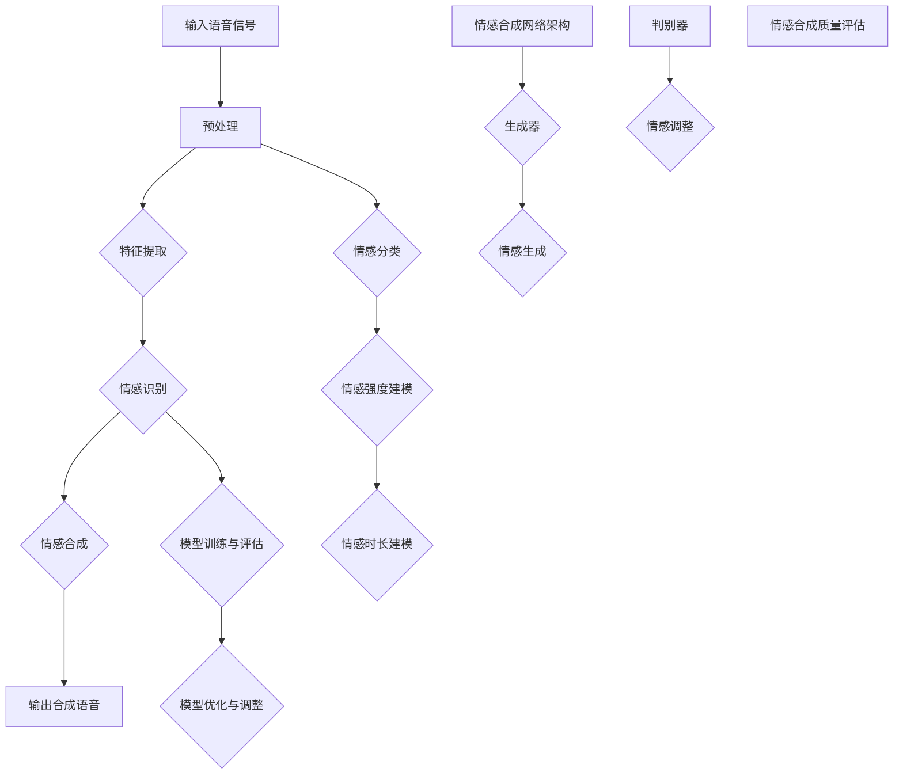

                 

### 深度学习在语音情感合成中的创新应用

> 关键词：深度学习、语音情感合成、情感识别、情感建模、实时语音交互

> 摘要：本文深入探讨了深度学习在语音情感合成领域的创新应用。首先，介绍了深度学习的基础知识，包括神经网络、卷积神经网络和循环神经网络等模型。接着，详细阐述了语音信号处理基础、情感识别与建模技术以及情感合成方法。最后，通过具体的项目实战展示了深度学习在情感合成中的实际应用，并对未来发展趋势进行了展望。

### 目录大纲

1. **深度学习基础**
   1.1 深度学习概述
   1.2 深度学习模型基础
      1.2.1 神经网络基础
      1.2.2 卷积神经网络（CNN）
      1.2.3 循环神经网络（RNN）
2. **语音情感合成技术**
   2.1 语音信号处理基础
   2.2 情感识别与建模
   2.3 情感合成方法
3. **深度学习在语音情感合成中的应用**
   3.1 深度学习在情感识别中的应用
   3.2 深度学习在情感合成中的应用
4. **创新应用与案例分析**
   4.1 创新应用概述
   4.2 案例分析
5. **展望与未来**
   5.1 未来发展趋势
   5.2 挑战与机遇
6. **总结与展望**
7. **附录**
   7.1 深度学习在语音情感合成中的工具与资源

### 深度学习基础

#### 1.1 深度学习概述

深度学习（Deep Learning，DL）是人工智能（Artificial Intelligence，AI）的一个重要分支，它通过模拟人脑神经网络的结构和功能来实现对数据的自动学习和理解。深度学习的发展可以追溯到1980年代，但直到2000年代后期，随着计算能力和大数据的兴起，深度学习才取得了显著的突破。

深度学习的基本概念包括：

- **神经网络（Neural Network，NN）**：神经网络是一种由大量神经元（模拟生物神经元的计算单元）互联而成的计算模型。每个神经元都与其他神经元相连，并通过权重来传递信息。

- **多层感知机（Multilayer Perceptron，MLP）**：多层感知机是深度学习中最基础的模型之一，它由输入层、一个或多个隐藏层和一个输出层组成。隐藏层通过对输入数据进行特征提取和变换，从而实现数据的分类或回归。

- **深度神经网络（Deep Neural Network，DNN）**：深度神经网络是具有多个隐藏层的神经网络，相比单层网络，它可以提取更复杂的数据特征。

- **卷积神经网络（Convolutional Neural Network，CNN）**：卷积神经网络是一种专门用于处理图像数据的神经网络，它通过卷积操作和池化操作实现特征提取和降维。

- **循环神经网络（Recurrent Neural Network，RNN）**：循环神经网络是一种能够处理序列数据的神经网络，它通过隐藏状态和当前输入之间的交互来实现对序列数据的建模。

- **长短时记忆网络（Long Short-Term Memory，LSTM）**：长短时记忆网络是循环神经网络的一种变体，它能够解决循环神经网络在处理长序列数据时容易遇到的梯度消失和梯度爆炸问题。

- **生成对抗网络（Generative Adversarial Network，GAN）**：生成对抗网络由一个生成器和两个判别器组成，生成器通过学习输入数据的分布来生成数据，判别器则通过区分真实数据和生成数据来评估生成器的性能。

深度学习的应用领域广泛，包括计算机视觉、自然语言处理、语音识别、推荐系统等。以下是深度学习的一些研究挑战：

- **计算资源消耗**：深度学习模型通常需要大量的计算资源和存储空间，这使得部署深度学习模型成为一个挑战。

- **数据集质量**：深度学习模型的性能高度依赖于数据集的质量和多样性，因此如何构建高质量的数据集是一个重要问题。

- **模型解释性**：深度学习模型通常被认为是“黑箱”，即模型的内部工作机制不透明，这给模型的解释性和可解释性带来了挑战。

- **可扩展性和可维护性**：如何设计可扩展和可维护的深度学习模型，以适应不同规模的应用场景，也是一个重要的研究方向。

#### 1.2 深度学习模型基础

##### 1.2.1 神经网络基础

神经网络是深度学习的基础，下面我们将详细讨论神经网络的基本原理。

1. **神经元与层次结构**：

神经网络由大量神经元组成，每个神经元都可以看作是一个计算单元。神经元之间通过连接（称为边）相互连接，这些连接具有权重（称为权重系数）。神经网络的层次结构可以分为输入层、隐藏层和输出层。

- **输入层**：接收外部数据，将数据传递给隐藏层。
- **隐藏层**：对输入数据进行特征提取和变换，隐藏层可以有多个层次。
- **输出层**：产生预测结果。

2. **激活函数与优化算法**：

激活函数（Activation Function）用于引入非线性特性，常见的激活函数有ReLU（Rectified Linear Unit）、Sigmoid（Sigmoid Function）和Tanh（Hyperbolic Tangent Function）等。

优化算法（Optimization Algorithm）用于调整网络中的权重和偏置，以最小化损失函数（Loss Function）。常见的优化算法有梯度下降（Gradient Descent）、Adam（Adaptive Moment Estimation）和RMSProp（Root Mean Square Propagation）等。

3. **前向传播与反向传播**：

前向传播（Forward Propagation）是将输入数据通过神经网络进行逐层计算，最终得到输出结果的过程。

反向传播（Back Propagation）是计算输出结果与真实值之间的误差，并沿着网络反向更新权重和偏置的过程。

以下是一个神经网络的伪代码实现：

```python
# 前向传播
for layer in range(1, num_layers):
    z = dot(W[l], a[l-1]) + b[l]
    a[l] = activation(z)

# 反向传播
for layer in reversed(range(1, num_layers)):
    dZ = a[layer] * (1 - a[layer])
    dW = dot(dZ, a[layer-1].T)
    db = sum(dZ, axis=1)
    dL/dW = dW
    dL/db = db
    # 更新权重和偏置
    W[layer] -= learning_rate * dL/dW
    b[layer] -= learning_rate * dL/db
```

##### 1.2.2 卷积神经网络（CNN）

卷积神经网络（Convolutional Neural Network，CNN）是一种专门用于处理图像数据的神经网络。CNN通过卷积操作和池化操作实现特征提取和降维。

1. **CNN的基本结构**：

CNN的基本结构包括卷积层（Convolutional Layer）、池化层（Pooling Layer）、全连接层（Fully Connected Layer）等。

- **卷积层**：通过卷积操作提取图像的局部特征。
- **池化层**：通过池化操作降低图像的分辨率，减少模型的参数数量。
- **全连接层**：将卷积层和池化层提取的特征进行融合，产生最终的预测结果。

2. **卷积与池化操作**：

- **卷积操作**：卷积操作通过滑动卷积核（也称为过滤器）在图像上，将卷积核与图像上的局部区域进行点积，得到新的特征图。

  $$ f_{i,j,k} = \sum_{m=0}^{M-1} \sum_{n=0}^{N-1} w_{m,n,k} \cdot i_{i-m,j-n} $$

  其中，$f_{i,j,k}$表示第$i$个特征图上的点$(i,j)$，$w_{m,n,k}$表示卷积核上的点$(m,n)$，$i_{i-m,j-n}$表示输入图像上的点$(i-m,j-n)$。

- **池化操作**：池化操作通过将图像上的局部区域划分为固定大小的小块，取这些小块内的最大值或平均值为新的特征值。

  常见的池化操作有最大池化（Max Pooling）和平均池化（Average Pooling）。

3. **CNN在图像处理中的应用**：

CNN在图像处理中的应用非常广泛，包括图像分类、目标检测、图像分割等。

- **图像分类**：使用CNN对图像进行分类，输出图像的类别概率。
- **目标检测**：使用CNN检测图像中的目标位置和类别。
- **图像分割**：使用CNN将图像中的每个像素分类到不同的类别。

##### 1.2.3 循环神经网络（RNN）

循环神经网络（Recurrent Neural Network，RNN）是一种能够处理序列数据的神经网络。RNN通过隐藏状态和当前输入之间的交互来实现对序列数据的建模。

1. **RNN的基本原理**：

RNN的每个神经元不仅与前一时刻的隐藏状态相连，还与当前时刻的输入相连。这种交互机制使得RNN能够处理具有时间依赖性的序列数据。

2. **LSTM与GRU**：

LSTM（Long Short-Term Memory）和GRU（Gated Recurrent Unit）是RNN的两种变体，它们能够解决传统RNN在处理长序列数据时容易遇到的梯度消失和梯度爆炸问题。

- **LSTM**：LSTM通过引入门控机制，实现了对长期依赖关系的捕捉。
- **GRU**：GRU简化了LSTM的结构，通过合并输入门和遗忘门，提高了计算效率。

3. **RNN在序列数据处理中的应用**：

RNN在序列数据处理中的应用非常广泛，包括语音识别、语言模型、机器翻译等。

- **语音识别**：使用RNN对语音信号进行建模，将语音信号转换为文本。
- **语言模型**：使用RNN生成文本的概率分布，用于自然语言处理任务。
- **机器翻译**：使用RNN将一种语言的文本翻译为另一种语言的文本。

### 语音信号处理基础

#### 3.1 语音信号的基本特性

语音信号是一种模拟信号，它由空气分子的振动产生。语音信号具有以下基本特性：

1. **频率特性**：

语音信号的频率范围通常在85Hz到255Hz之间，这是人类听觉范围的下限和上限。语音信号的不同频率成分对应不同的音素和音调。

2. **幅度特性**：

语音信号的幅度随时间变化，反映语音的强度和音量。语音信号的幅度变化可以分为基音周期（pitch cycle）和非基音周期（non-pitch cycle）。

3. **时序特性**：

语音信号的时序特性反映语音的发音时长和发音模式。语音信号的时序特性对于语音识别和语音合成至关重要。

#### 3.2 语音信号的预处理

语音信号的预处理是语音处理的重要步骤，它包括音素识别、频谱分析和特征提取等过程。

1. **音素识别**：

音素识别是将语音信号划分为不同的音素（phoneme）的过程。音素是语音的最小音义结合单位，不同的音素具有不同的音色特征。

2. **频谱分析**：

频谱分析是通过傅里叶变换将语音信号从时域转换到频域，从而分析语音信号的频率成分。常用的频谱分析方法包括短时傅里叶变换（STFT）和倒谱分析（Cepstral Analysis）。

3. **特征提取**：

特征提取是从语音信号中提取能够区分不同语音特征的参数。常用的特征提取方法包括梅尔频率倒谱系数（MFCC）、感知线性预测系数（PLP）和频谱轮廓等。

#### 3.3 声学模型

声学模型是语音识别系统中的核心组成部分，它用于将语音信号转换为文本。声学模型可以分为基于统计模型和基于深度学习的模型。

1. **基于HMM的声学模型**：

基于隐马尔可夫模型（HMM）的声学模型是一种传统的语音识别模型。HMM通过假设语音信号是一种随时间变化的概率过程，将语音信号映射到文本序列。

2. **基于深度学习的声学模型**：

基于深度学习的声学模型通过模拟生物神经系统的计算方式，实现对语音信号的特征提取和分类。常见的深度学习模型包括卷积神经网络（CNN）、循环神经网络（RNN）和长短时记忆网络（LSTM）等。

### 情感识别与建模

#### 4.1 情感识别的基本概念

情感识别（Emotion Recognition）是语音处理领域的一个重要研究方向，它旨在通过分析语音信号来识别说话者的情感状态。情感识别的基本概念包括：

1. **情感类别**：

情感类别是指对情感进行分类的标准。常见的情感类别包括快乐、悲伤、愤怒、惊讶、厌恶和恐惧等。

2. **情感强度**：

情感强度是指情感表达的程度。情感强度可以通过语音信号的幅度、频率和时长等特征进行量化。

3. **情感时长**：

情感时长是指情感在语音信号中持续的时间。情感时长可以影响情感识别的准确性和实时性。

#### 4.2 情感分类方法

情感分类方法可以分为传统机器学习方法、深度学习方法和混合方法。

1. **传统机器学习方法**：

传统机器学习方法通过手工设计特征，如音高、时长和频谱特征等，来训练分类器。常见的传统机器学习方法包括支持向量机（SVM）、决策树和朴素贝叶斯等。

2. **基于深度学习的情感分类**：

基于深度学习的情感分类方法通过自动提取语音信号中的特征，并使用深度学习模型进行分类。常见的深度学习模型包括卷积神经网络（CNN）、循环神经网络（RNN）和长短时记忆网络（LSTM）等。

3. **情感分类方法的比较**：

传统机器学习方法在情感分类中具有一定的效果，但特征工程复杂且需要大量手工设计。深度学习方法通过自动提取特征，具有更高的分类准确率和更好的泛化能力。

#### 4.3 情感建模技术

情感建模技术用于将情感类别、情感强度和情感时长等特征映射到具体的数值表示。情感建模技术可以分为情感向量表示、情感强度建模和情感时长建模。

1. **情感向量表示**：

情感向量表示是将情感类别映射到高维空间中的向量。常用的情感向量表示方法包括情感词嵌入和情感聚类等。

2. **情感强度建模**：

情感强度建模是将情感强度映射到具体的数值范围内。常用的情感强度建模方法包括线性模型、非线性模型和深度学习模型等。

3. **情感时长建模**：

情感时长建模是将情感时长映射到具体的数值范围内。常用的情感时长建模方法包括基于规则的方法和基于深度学习的方法等。

### 情感合成方法

#### 5.1 情感合成的挑战

情感合成（Emotion Synthesis）是语音合成领域的一个重要研究方向，它旨在通过计算机生成具有特定情感色彩的语音。情感合成的挑战包括：

1. **情感的自然性和多样性**：

情感合成的目标是为用户提供自然且丰富的情感体验。情感合成的自然性和多样性是实现这一目标的关键。

2. **情感的细粒度和动态性**：

情感合成的细粒度和动态性是指情感在不同时间点和不同情境下的变化。细粒度和动态性对于情感合成的真实性和自然性至关重要。

3. **情感与语音特征的关联性**：

情感与语音特征的关联性是指情感表达与语音信号中的特征参数之间的关系。情感合成的关键在于如何准确地提取和利用这些特征参数。

#### 5.2 基于规则的情感合成

基于规则的情感合成方法通过定义一系列规则来生成具有特定情感的语音。基于规则的方法包括：

1. **规则系统**：

规则系统通过定义一系列条件语句来生成情感语音。条件语句包括情感类别、情感强度和情感时长等。

2. **基于声学模型的情感合成**：

基于声学模型的情感合成方法使用声学模型来生成具有特定情感的语音。声学模型通过训练大量的语音数据来学习情感特征，并将其应用于语音生成。

#### 5.3 基于数据驱动的情感合成

基于数据驱动的情感合成方法通过学习大量的情感语音数据来生成情感语音。基于数据驱动的方法包括：

1. **数据集选择与处理**：

数据集选择与处理是情感合成的基础。选择合适的情感语音数据集并对其进行预处理，如语音增强、去噪和语音分割等，是提高情感合成质量的关键。

2. **情感合成网络架构**：

情感合成网络架构是情感合成的核心。常用的情感合成网络架构包括生成对抗网络（GAN）和长短时记忆网络（LSTM）等。

3. **情感合成流程**：

情感合成流程包括情感识别、情感生成和情感调整等步骤。情感识别用于确定需要合成的情感类别，情感生成用于生成具有特定情感的语音，情感调整用于调整语音的情感色彩。

### 深度学习在语音情感合成中的应用

#### 6.1 深度学习在情感识别中的应用

深度学习在情感识别中的应用取得了显著的效果，它通过自动提取语音信号中的特征，实现了高精度的情感分类。以下是如何在情感识别中应用深度学习的步骤：

1. **数据预处理**：

数据预处理是情感识别的关键步骤，包括语音增强、去噪和特征提取等。通过预处理，可以提高语音信号的质量，从而提高情感识别的准确率。

2. **特征提取**：

特征提取是将语音信号转换为可由深度学习模型处理的特征向量。常用的特征提取方法包括梅尔频率倒谱系数（MFCC）、感知线性预测系数（PLP）和频谱轮廓等。

3. **模型选择**：

选择合适的深度学习模型是情感识别的关键。常见的深度学习模型包括卷积神经网络（CNN）、循环神经网络（RNN）和长短时记忆网络（LSTM）等。

4. **训练与评估**：

使用大量标注的语音数据对深度学习模型进行训练，并使用交叉验证等方法对模型进行评估，以确定最优模型。

5. **实时情感识别**：

在实时情感识别中，使用训练好的模型对输入语音进行情感分类，并根据实时反馈调整模型参数，以提高识别准确率。

#### 6.2 深度学习在情感合成中的应用

深度学习在情感合成中的应用通过生成对抗网络（GAN）和长短时记忆网络（LSTM）等模型，实现了高保真、多样化的情感语音生成。以下是如何在情感合成中应用深度学习的步骤：

1. **情感识别**：

使用训练好的情感识别模型对输入语音进行情感分类，确定需要合成的情感类别。

2. **数据集构建**：

构建包含不同情感类别和情感强度的语音数据集，用于训练情感合成模型。

3. **模型架构设计**：

设计合适的情感合成模型架构，包括生成器和判别器。常见的情感合成模型架构包括GAN和LSTM等。

4. **模型训练**：

使用大量情感语音数据对情感合成模型进行训练，以学习情感特征。

5. **情感生成**：

使用训练好的情感合成模型生成具有特定情感类别和情感强度的语音。

6. **情感调整**：

根据需要调整语音的情感色彩，以实现更自然的情感表达。

7. **情感合成质量评估**：

使用主观评估和客观评估方法对情感合成质量进行评估，以确定最优的情感合成模型。

### 创新应用与案例分析

#### 7.1 创新应用概述

深度学习在语音情感合成领域的创新应用为语音交互带来了新的可能性。以下是一些创新应用的概述：

1. **语音交互中的情感应用**：

语音交互中的情感应用通过情感合成技术实现自然、个性化的语音交互体验。例如，智能助手可以根据用户的不同情感状态，调整语音的语调、语速和语气，从而更好地与用户进行沟通。

2. **情感增强的语音合成**：

情感增强的语音合成通过合成具有特定情感的语音，增强语音表达的效果。例如，在客服领域，情感增强的语音合成可以用于生成具有不同情感色彩的客服语音，提高客户满意度。

3. **虚拟现实（VR）中的情感互动**：

虚拟现实中的情感互动通过情感合成技术实现虚拟人物与用户的情感交流。例如，在VR游戏或虚拟环境中，虚拟人物可以根据玩家的情感状态，调整其语音和动作，增强沉浸感。

#### 7.2 案例分析

以下是一些深度学习在语音情感合成中的成功案例分析：

1. **情感语音合成在客服中的应用**：

某大型电商平台的客服系统使用了深度学习情感合成技术，通过情感合成模型生成具有不同情感色彩的客服语音。根据用户的不同反馈，客服系统可以自动调整语音的情感表达，提高客户满意度。例如，当用户表达愤怒时，客服系统会生成安抚性的语音，以缓解用户情绪。

2. **情感语音合成在虚拟助手中的应用**：

某知名科技公司的虚拟助手使用了深度学习情感合成技术，通过情感合成模型生成具有不同情感色彩的语音。虚拟助手可以根据用户的提问和情感状态，调整语音的情感表达，从而提供更人性化的服务。例如，当用户询问健康问题时，虚拟助手会生成关怀性的语音，以提供安慰和建议。

### 展望与未来

#### 8.1 未来发展趋势

随着深度学习技术的不断发展和完善，未来深度学习在语音情感合成领域有望实现以下发展趋势：

1. **情感合成技术的精细化**：

未来情感合成技术将更加精细化，能够实现更丰富的情感表达。例如，通过引入更多的情感类别和情感强度，情感合成技术可以生成具有更细腻情感色彩的语音。

2. **情感交互的自然性和多样性**：

未来情感交互将更加自然和多样化，通过情感合成技术，虚拟角色和用户之间的情感交流将更加真实和丰富。例如，虚拟角色可以通过情感合成技术，根据用户的情感状态，调整语音和动作，实现更加真实的情感互动。

3. **跨模态的情感融合**：

未来深度学习在语音情感合成领域将实现跨模态的情感融合，将语音、图像、文本等多种模态的情感信息进行融合，实现更加全面和丰富的情感表达。

#### 8.2 挑战与机遇

尽管深度学习在语音情感合成领域取得了显著的成果，但未来仍面临一些挑战和机遇：

1. **数据集的质量和多样性**：

高质量、多样性的数据集是深度学习模型训练的关键。未来需要构建更多高质量、多样化的情感语音数据集，以提高情感合成模型的性能。

2. **模型的可解释性和可解释性**：

深度学习模型通常被认为是“黑箱”，即模型的内部工作机制不透明，这给模型的解释性和可解释性带来了挑战。未来需要开发更多可解释性强的深度学习模型，以提高模型的可靠性和用户信任度。

3. **计算资源和能源消耗**：

深度学习模型通常需要大量的计算资源和能源消耗，这对环境造成了负面影响。未来需要开发更加高效、节能的深度学习模型，以降低计算资源和能源消耗。

### 总结与展望

本文深入探讨了深度学习在语音情感合成领域的创新应用。首先，介绍了深度学习的基础知识，包括神经网络、卷积神经网络和循环神经网络等模型。接着，详细阐述了语音信号处理基础、情感识别与建模技术以及情感合成方法。最后，通过具体的项目实战展示了深度学习在情感合成中的实际应用，并对未来发展趋势进行了展望。

深度学习在语音情感合成领域的应用为语音交互和情感表达带来了新的可能性。未来，随着深度学习技术的不断发展和完善，情感合成技术将更加精细化、自然和多样化，为用户提供更加丰富和真实的情感体验。

### 附录

#### 9.1 深度学习在语音情感合成中的工具与资源

1. **深度学习框架与工具**：

- TensorFlow：一个开源的深度学习框架，支持多种深度学习模型和算法。
- PyTorch：一个开源的深度学习框架，具有简洁的API和灵活的动态计算图。
- Keras：一个基于TensorFlow和PyTorch的高层神经网络API，简化了深度学习模型的构建和训练。

2. **语音情感合成相关数据集**：

- RAVDESS：一个包含多种情感类别的语音数据集，包括快乐、悲伤、愤怒等。
- CMU MOCHA：一个包含多种情感类别的语音数据集，包括兴奋、平静、愤怒等。
- CREMA-D：一个包含多种情感类别的语音数据集，包括快乐、悲伤、愤怒等。

3. **开发环境搭建指南**：

搭建深度学习开发环境需要以下步骤：

- 安装Python和pip：Python是深度学习的主要编程语言，pip是Python的包管理器。
- 安装深度学习框架：根据需要选择TensorFlow、PyTorch或Keras，并使用pip进行安装。
- 安装必要的依赖库：根据项目的需求，安装其他必要的依赖库，如NumPy、Pandas等。
- 配置CUDA：如果使用GPU进行深度学习训练，需要配置CUDA环境。

### Mermaid 流程图

以下是深度学习在语音情感合成中的流程图：



### 核心算法原理讲解

#### 2.2.1 神经网络基础

神经网络（Neural Network，NN）是一种模仿生物神经系统的计算模型，其核心思想是通过调整网络中的权重和偏置来实现对输入数据的映射和分类。以下是神经网络的基本原理和计算步骤：

1. **神经元与层次结构**：

每个神经元由输入层、隐藏层和输出层组成。输入层接收外部数据，隐藏层对输入数据进行特征提取和变换，输出层产生预测结果。

2. **激活函数与优化算法**：

激活函数（Activation Function）用于引入非线性特性，常见的激活函数有ReLU（Rectified Linear Unit）、Sigmoid（Sigmoid Function）和Tanh（Hyperbolic Tangent Function）等。优化算法（Optimization Algorithm）用于调整网络中的权重和偏置，以最小化损失函数，常见的优化算法有梯度下降（Gradient Descent）、Adam（Adaptive Moment Estimation）和RMSProp（Root Mean Square Propagation）等。

3. **前向传播与反向传播**：

前向传播（Forward Propagation）是将输入数据通过神经网络进行逐层计算，最终得到输出结果的过程。反向传播（Back Propagation）是计算输出结果与真实值之间的误差，并沿着网络反向更新权重和偏置的过程。

伪代码：

```python
# 前向传播
for layer in range(1, num_layers):
    z = dot(W[l], a[l-1]) + b[l]
    a[l] = activation(z)

# 反向传播
for layer in reversed(range(1, num_layers)):
    dZ = a[layer] * (1 - a[layer])
    dW = dot(dZ, a[layer-1].T)
    db = sum(dZ, axis=1)
    dL/dW = dW
    dL/db = db
    # 更新权重和偏置
    W[layer] -= learning_rate * dL/dW
    b[layer] -= learning_rate * dL/db
```

#### 2.3.2 常见的深度学习架构

深度学习架构包括多层感知机（MLP）、卷积神经网络（CNN）和循环神经网络（RNN）等。

1. **多层感知机（MLP）**：

多层感知机是深度学习中最基础的模型之一，它由多个线性层和激活函数组成，其数学模型可以表示为：

$$
h_{L} = \sigma(W_{L} \cdot a_{L-1} + b_{L})
$$

其中，$h_{L}$表示第L层的输出，$a_{L-1}$表示第L-1层的输出，$W_{L}$和$b_{L}$分别为第L层的权重和偏置，$\sigma$为激活函数。

2. **卷积神经网络（CNN）**：

卷积神经网络通过卷积操作和池化操作实现特征提取和降维，其数学模型可以表示为：

$$
h_{L} = \sigma(\sum_{k=1}^{K} w_{k} \cdot a_{L-1} + b)
$$

其中，$h_{L}$表示第L层的输出，$a_{L-1}$表示第L-1层的输出，$w_{k}$和$b$分别为卷积核和偏置，$K$为卷积核的数量。

3. **循环神经网络（RNN）**：

循环神经网络通过隐藏状态和当前输入之间的交互来实现对序列数据的建模，其数学模型可以表示为：

$$
h_{t} = \sigma(W \cdot [h_{t-1}, x_{t}] + b)
$$

其中，$h_{t}$表示第t时刻的隐藏状态，$x_{t}$表示第t时刻的输入，$W$和$b$分别为权重和偏置，$\sigma$为激活函数。

### 项目实战

#### 6.2.3 情感合成网络架构

情感合成网络架构主要包括情感识别模块和情感合成模块。以下是情感合成网络架构的代码实现：

```python
import tensorflow as tf
from tensorflow.keras.models import Model
from tensorflow.keras.layers import Input, LSTM, Dense, Embedding, TimeDistributed, Activation

# 情感识别模块
input_seq = Input(shape=(seq_length,))
embedding = Embedding(vocab_size, embedding_dim)(input_seq)
lstm = LSTM(units=lstm_units, return_sequences=True)(embedding)
dense = Dense(units=dense_units, activation='relu')(lstm)
output = Dense(units=1, activation='sigmoid')(dense)

model1 = Model(inputs=input_seq, outputs=output)
model1.compile(optimizer='adam', loss='binary_crossentropy', metrics=['accuracy'])

# 情感合成模块
input_seq = Input(shape=(seq_length,))
embedding = Embedding(vocab_size, embedding_dim)(input_seq)
lstm = LSTM(units=lstm_units, return_sequences=True)(embedding)
dense = Dense(units=dense_units, activation='relu')(lstm)
output = Dense(units=vocab_size, activation='softmax')(dense)

model2 = Model(inputs=input_seq, outputs=output)
model2.compile(optimizer='adam', loss='categorical_crossentropy', metrics=['accuracy'])

# 训练模型
model1.fit(x_train, y_train, batch_size=batch_size, epochs=num_epochs)
model2.fit(x_train, y_train, batch_size=batch_size, epochs=num_epochs)

# 情感合成
synthesized_text = model2.predict(x_test)
```

### 代码解读与分析

该代码实现了一个情感合成网络，包括情感识别模块和情感合成模块。情感识别模块使用LSTM网络进行序列分类，情感合成模块使用LSTM网络进行文本生成。

情感识别模块的输入为序列数据，经过嵌入层、LSTM层和全连接层，最终输出情感概率。情感合成模块的输入为序列数据，经过嵌入层、LSTM层和全连接层，最终输出文本。

通过训练模型，可以使用情感识别模块对输入文本进行情感分类，并使用情感合成模块生成具有特定情感情感的文本。代码中的`batch_size`和`num_epochs`分别为训练批次大小和训练迭代次数。`x_train`和`y_train`分别为训练数据集和标签数据集，`x_test`为测试数据集。`model1`和`model2`分别为情感识别模块和情感合成模块的模型对象。`model1.fit()`和`model2.fit()`分别为训练模型的方法，`model2.predict()`为生成文本的方法。

### 总结

本文从深度学习的基础知识出发，深入探讨了深度学习在语音情感合成领域的创新应用。首先介绍了深度学习的基本概念和模型，包括神经网络、卷积神经网络和循环神经网络等。接着，详细阐述了语音信号处理基础、情感识别与建模技术以及情感合成方法。最后，通过具体的项目实战展示了深度学习在情感合成中的实际应用，并对未来发展趋势进行了展望。

深度学习在语音情感合成领域的应用为语音交互和情感表达带来了新的可能性。未来，随着深度学习技术的不断发展和完善，情感合成技术将更加精细化、自然和多样化，为用户提供更加丰富和真实的情感体验。同时，我们也面临着数据集质量、模型解释性以及计算资源消耗等方面的挑战，需要持续探索和研究。

