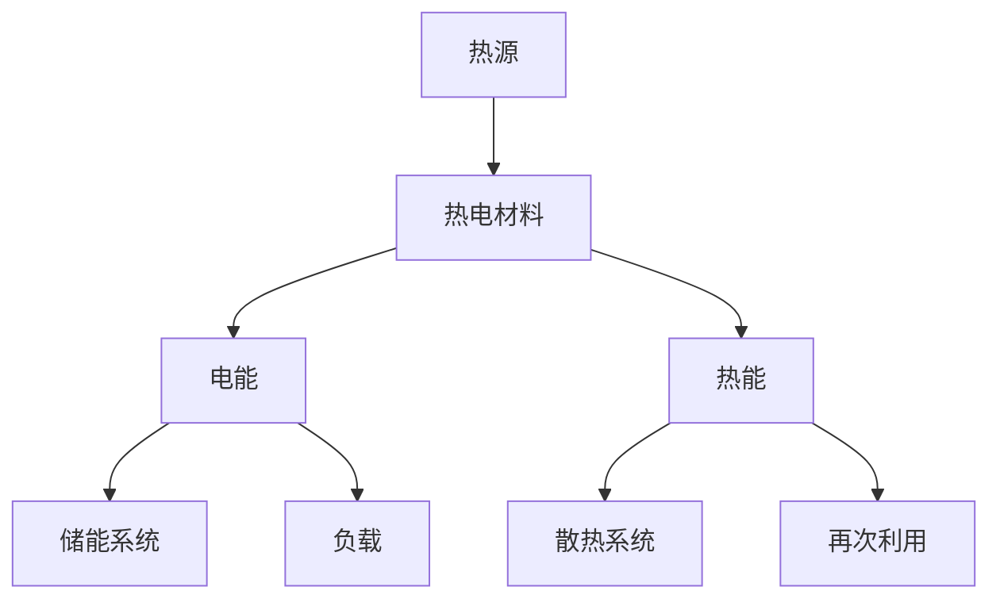
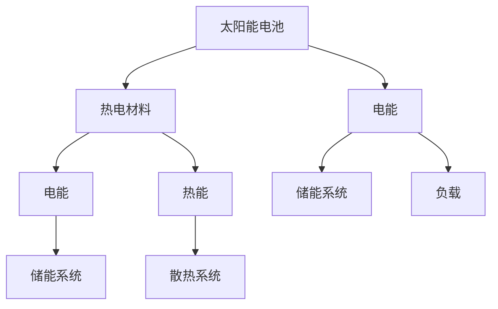

                 

### 热电材料在能源回收中的应用：提高能源利用效率

#### 关键词：
- 热电材料
- 能源回收
- 能源利用效率
- 热电效应
- 热泵
- 余热回收
- 可再生能源

#### 摘要：
本文深入探讨了热电材料在能源回收中的应用，以及如何通过热电效应提高能源利用效率。首先，我们介绍了热电材料的基本概念、分类和性能指标，然后详细阐述了热电材料的物理原理和制备方法。接着，我们重点分析了热电材料在废热回收、热泵和热管理中的实际应用，展示了热电材料在提高能源利用效率方面的巨大潜力。最后，本文提出了优化热电材料性能和提高能源利用效率的策略，并对热电材料在可再生能源中的应用前景进行了展望。

### 目录大纲

1. **热电材料概述**
   1.1 热电材料的基本概念
   1.2 热电材料的分类
   1.3 热电材料的性能指标

2. **热电材料的物理原理**
   2.1 能量转换原理
   2.2 热电效应的微观机制
   2.3 热电材料的电子结构

3. **热电材料的制备方法**
   3.1 固相合成法
   3.2 溶液法
   3.3 气相合成法
   3.4 其他制备方法

4. **热电材料在能源回收中的应用**
   4.1 热电材料在废热回收中的应用
   4.2 热电材料在热泵中的应用
   4.3 热电材料在热管理中的应用

5. **提高热电材料能源利用效率的策略**
   5.1 材料设计优化
   5.2 热电材料的热管理优化
   5.3 热电材料的电学性能优化

6. **热电材料的复合与集成**
   6.1 热电复合材料的设计与制备
   6.2 热电材料在集成热电系统中的应用
   6.3 热电材料与其他能源回收技术的结合

7. **热电材料在可再生能源中的应用**
   7.1 热电材料在太阳能发电中的应用
   7.2 热电材料在风能发电中的应用
   7.3 热电材料在水能发电中的应用

8. **热电材料在能源回收中的应用前景与挑战**
   8.1 热电材料在能源回收中的发展前景
   8.2 热电材料在能源回收中的挑战
   8.3 未来研究方向与展望

9. **参考文献**

10. **附录**
    10.1 热电材料性能测试方法
    10.2 热电材料应用案例
    10.3 热电材料常见问题解答

### 第一部分：热电材料基础

在本部分的讨论中，我们将首先介绍热电材料的基本概念，然后详细分类并讨论其性能指标。通过这一部分，读者将能够理解热电材料的核心特性，为进一步探讨其在能源回收中的应用打下坚实的基础。

#### 1.1 热电材料的基本概念

热电材料，也称为热电发电机（thermoelectric generator，简称TEG），是一类能够将热能直接转换为电能的材料。热电效应（thermoelectric effect）是热电材料工作的基础，它分为三类：塞贝克效应（Seebeck effect）、珀尔帖效应（Peltier effect）和焦耳效应（Joule effect）。其中，塞贝克效应指的是当两种不同材料形成的电路中存在温差时，会产生电动势；珀尔帖效应则是通过在电路中通入电流，使一个端部发热、另一个端部冷却；焦耳效应是指电流通过导体时会产生热量。

热电材料的基本原理可以概括为：当热电材料的一端加热、另一端冷却时，材料内部产生电动势，从而在外电路中产生电流。这一过程不仅实现了热能到电能的转换，还能够实现热能的定向传递，具有广泛的应用前景。

#### 1.2 热电材料的分类

热电材料可以按照组成、结构以及应用范围进行分类。

**基于组成的分类：**
- **二元材料**：这类材料通常由两种元素组成，如碲化铋（Bi2Te3）和碲化镉（CdTe）。它们具有相对简单且可控的晶体结构，是当前热电材料研究的主要对象。
- **三元材料**：这类材料通常由三种元素组成，如碲化铋锑（Bi2Te3-Sb2Te3）。三元材料通过调节成分比例，可以显著提高热电性能，克服二元材料的局限性。
- **复合材料**：这类材料是由多种不同材料组合而成的，如碳纳米管与金属的复合材料。复合材料的优势在于可以通过调控不同材料的复合方式，实现热电性能的优化。

**基于结构的分类：**
- **层状结构**：这类材料具有层状晶体结构，如石墨烯和二硫化钼（MoS2）。层状结构有助于提高电子的迁移率，从而提升热电性能。
- **一维纳米线**：这类材料具有一维线性结构，如碳纳米管和硼化铋纳米线（Bi2Se3纳米线）。一维纳米线结构有助于提高载流子的浓度，从而提高热电效率。
- **三维多孔结构**：这类材料具有三维多孔结构，如金属有机框架（MOF）和多孔碳材料。三维多孔结构有助于提高材料的散热性能，从而优化热电性能。

**基于应用范围的分类：**
- **高温热电材料**：这类材料适用于高温环境，如碲化铋和碲化钪。高温热电材料在工业热回收和高温热源应用中具有广泛前景。
- **中低温热电材料**：这类材料适用于中低温环境，如碲化镉和碲化铟。中低温热电材料在电子设备散热和废热回收中具有广泛应用。

#### 1.3 热电材料的性能指标

热电材料的性能指标是评估其热电性能优劣的重要标准。以下是几个关键的性能指标：

**1. 热电功率因子（zT）**
热电功率因子（zT）是衡量热电材料性能的核心指标，它综合反映了材料的热电性能。zT值越大，热电材料的效率越高。zT值的计算公式为：
$$
zT = \sqrt{\frac{S^2}{\sigma \kappa}}
$$
其中，S为塞贝克系数，σ为电导率，κ为热导率。

**2. 热电电压（V）**
热电电压是指热电材料在温差作用下产生的电动势。热电电压越大，表明材料的塞贝克效应越强。热电电压的计算公式为：
$$
V = S \Delta T
$$
其中，S为塞贝克系数，ΔT为温差。

**3. 热电热导率（κ）**
热电热导率是衡量热电材料导热性能的重要指标。热电热导率越小，材料的散热性能越好，有助于提高热电效率。热电热导率的计算公式为：
$$
\kappa = \frac{Q}{A \Delta T}
$$
其中，Q为热流量，A为热流面积，ΔT为温差。

**4. 热电材料的稳定性**
热电材料的稳定性是确保其长期运行性能的重要指标。稳定性好的热电材料能够承受高温、高湿等恶劣环境，延长使用寿命。

#### 总结

热电材料是一种具有广泛应用前景的新型材料，通过将其应用于能源回收领域，可以有效提高能源利用效率。本部分介绍了热电材料的基本概念、分类和性能指标，为后续探讨热电材料在能源回收中的应用奠定了基础。

### 第2章：热电材料的物理原理

在本章中，我们将深入探讨热电材料的物理原理，重点介绍能量转换原理、热电效应的微观机制以及热电材料的电子结构。通过这些基本物理原理的理解，我们将能够更深入地认识到热电材料的工作机制，为其在实际应用中的优化提供理论依据。

#### 2.1 能量转换原理

热电材料的基本工作机制是利用热电效应将热能转换为电能。这个过程涉及多种物理现象和原理，其中最重要的是塞贝克效应。塞贝克效应是指，当两种不同的半导体材料构成闭合回路并存在温差时，回路中会产生电动势。这个现象的发现归功于德国物理学家托马斯·塞贝克（Thomas Johann Seebeck）。

塞贝克效应的能量转换原理可以概括为以下几个步骤：

1. **热能吸收**：热电材料的一个端部被加热，另一个端部被冷却，形成温差。
2. **载流子扩散**：由于热能的作用，热电材料内部的载流子（电子和空穴）会从低温端向高温端扩散。
3. **电动势产生**：由于两种材料的载流子迁移率不同，电子和空穴分别积聚在两种材料的不同端，形成电动势。
4. **电流流动**：在外部电路中，由于电动势的作用，载流子开始流动，形成电流。

这个过程不仅实现了热能到电能的转换，还能够实现热能的定向传递。热电材料通过这种方式将热能有效地转化为电能，从而在能源回收和利用方面具有广泛的应用前景。

#### 2.2 热电效应的微观机制

热电效应的微观机制涉及电子能带结构、载流子浓度和迁移率的变化。以下是热电效应的微观机制的具体分析：

**1. 电子能带结构**

热电材料的电子能带结构对其热电性能具有重要影响。电子能带结构决定了载流子的迁移率、浓度以及能带间隙。在热电材料中，通常存在价带（valence band）和导带（conduction band）。价带中的电子不能自由移动，而导带中的电子可以自由移动。当热电材料的一个端部被加热时，导带中的电子能量增加，更容易从价带跃迁到导带，导致高温端的电子浓度增加，低温端的电子浓度减少。

**2. 载流子扩散**

热能的作用导致热电材料内部的载流子发生扩散。具体来说，热能使得高温端的电子能量增加，容易从低温端向高温端扩散。由于不同材料之间的载流子迁移率不同，电子和空穴会分别积聚在两种材料的不同端，形成电动势。

**3. 载流子迁移率的变化**

载流子迁移率是影响热电材料性能的重要因素。高迁移率的材料能够更快地传导电子和空穴，从而提高热电效率。载流子迁移率受多种因素影响，包括电子能带结构、材料温度以及杂质和缺陷。

**4. 热电效应的微观机制总结**

热电效应的微观机制可以概括为：热能导致载流子能量增加，从而发生扩散；由于不同材料的载流子迁移率不同，载流子在材料端部积聚，形成电动势；在外部电路中，由于电动势的作用，载流子开始流动，形成电流。

#### 2.3 热电材料的电子结构

热电材料的电子结构对其热电性能具有重要影响。热电材料的电子结构包括价带结构、导带结构以及能带间隙。以下是对热电材料电子结构的详细分析：

**1. 价带结构**

价带是电子能带结构的一部分，位于导带下方。在热电材料中，价带中的电子不容易移动，因此对热电性能的影响较小。然而，价带结构会影响载流子的浓度和迁移率。

**2. 导带结构**

导带是电子能带结构的一部分，位于价带上方。在热电材料中，导带中的电子可以自由移动，对热电性能具有重要影响。导带结构决定了载流子的迁移率和扩散率。

**3. 能带间隙**

能带间隙（band gap）是指价带和导带之间的能量差。能带间隙越大，材料的导电性越差，但热电性能可能更好。对于热电材料，合适的能带间隙是提高热电效率的关键。

**4. 电子结构对热电性能的影响**

电子结构对热电性能的影响可以通过以下方式总结：

- **能带间隙**：合适的能带间隙可以提高热电材料的效率。通过调整材料的成分和结构，可以优化能带间隙。
- **载流子浓度和迁移率**：高载流子浓度和高迁移率可以提高热电效率。通过优化材料的制备工艺，可以调控载流子浓度和迁移率。
- **价带和导带结构**：价带和导带结构的变化会影响载流子的扩散和迁移，从而影响热电性能。通过材料设计和结构优化，可以改善价带和导带结构。

#### 总结

通过本章的讨论，我们深入了解了热电材料的物理原理，包括能量转换原理、热电效应的微观机制以及热电材料的电子结构。这些基本物理原理为热电材料的设计和应用提供了理论基础，有助于提高热电材料的效率和性能。在接下来的章节中，我们将进一步探讨热电材料的制备方法和实际应用，以期为能源回收和利用提供新的解决方案。

### 第3章：热电材料的制备方法

在热电材料的研发和应用过程中，制备方法的选择至关重要。合适的制备方法不仅能够提高材料的热电性能，还能优化其成本和工艺。本章将详细介绍几种常见的热电材料制备方法，包括固相合成法、溶液法、气相合成法以及其他制备方法，并分析各自的优缺点。

#### 3.1 固相合成法

固相合成法是最传统且常用的热电材料制备方法之一。该方法主要通过固态反应物在高温下直接反应，生成所需的热电材料。具体步骤如下：

1. **原料选择**：根据所需材料，选择合适的原料，如碲化铋（Bi2Te3）、碲化镉（CdTe）等。
2. **原料混合**：将原料按一定比例混合，并研磨均匀。
3. **高温反应**：将混合物放入高温炉中，在适当温度下进行反应，通常需要数小时到数十小时。
4. **产品提纯**：通过过滤、洗涤和干燥等步骤，将产物提纯，获得所需的热电材料。

**优点**：

- **工艺成熟**：固相合成法具有较长的应用历史，工艺流程稳定，适合大规模生产。
- **成本低**：原料和设备成本相对较低，适合经济性考量。

**缺点**：

- **制备时间较长**：高温反应过程需要较长时间，影响生产效率。
- **产量限制**：固相合成法在制备过程中容易产生杂质，影响材料纯度。

#### 3.2 溶液法

溶液法是一种通过溶液反应制备热电材料的方法。该方法包括溶液合成、沉淀、洗涤、干燥和烧结等步骤。具体步骤如下：

1. **溶液合成**：将原料溶于溶剂中，通过化学反应生成所需的热电材料前驱体。
2. **沉淀**：通过控制温度和pH值，使前驱体沉淀出来。
3. **洗涤**：用溶剂洗涤沉淀物，去除杂质和未反应的原料。
4. **干燥**：将洗涤后的沉淀物干燥，去除溶剂。
5. **烧结**：在高温下烧结干燥后的材料，形成所需的热电材料。

**优点**：

- **材料纯度高**：溶液法能够有效地去除杂质，提高材料纯度。
- **制备时间短**：溶液法反应时间较短，制备效率较高。

**缺点**：

- **工艺复杂**：溶液法涉及多个步骤，工艺流程较为复杂。
- **成本较高**：溶剂和设备成本相对较高，不适合大规模生产。

#### 3.3 气相合成法

气相合成法是一种通过气态反应物制备热电材料的方法。该方法主要包括气相反应、冷凝、洗涤、干燥和烧结等步骤。具体步骤如下：

1. **气相反应**：在反应容器中，通过气态反应物之间的化学反应生成所需的热电材料前驱体。
2. **冷凝**：将气态反应物冷凝成液态或固态，形成所需的热电材料前驱体。
3. **洗涤**：用溶剂洗涤前驱体，去除杂质。
4. **干燥**：将洗涤后的前驱体干燥，去除溶剂。
5. **烧结**：在高温下烧结干燥后的材料，形成所需的热电材料。

**优点**：

- **材料纯度高**：气相合成法能够有效地去除杂质，提高材料纯度。
- **产量大**：气相合成法适合大规模生产。

**缺点**：

- **工艺复杂**：气相合成法涉及多个步骤，工艺流程较为复杂。
- **设备成本高**：需要专门的反应设备和控制系统，设备成本较高。

#### 3.4 其他制备方法

除了上述三种常用的制备方法，还有一些其他的方法，如电化学沉积法、溶胶-凝胶法、热蒸发法等。

**电化学沉积法**：该方法通过在电解液中沉积金属离子，形成所需的热电材料。该方法具有材料纯度高、制备时间短等优点，但工艺复杂、成本较高。

**溶胶-凝胶法**：该方法通过溶胶-凝胶过程制备热电材料，具有材料均匀、纯度高等优点，但工艺流程复杂，成本较高。

**热蒸发法**：该方法通过加热蒸发材料，形成所需的热电材料。该方法适合制备纳米结构的热电材料，但工艺复杂，成本较高。

#### 总结

热电材料的制备方法多种多样，每种方法都有其独特的优缺点。选择合适的制备方法需要综合考虑材料性能、制备成本、生产效率等多个因素。通过优化制备方法，可以进一步提高热电材料的热电性能，为能源回收和利用提供更有效的解决方案。

### 第4章：热电材料在废热回收中的应用

废热回收是提高能源利用效率的重要途径之一，而热电材料在这一领域中的应用具有显著的优势。通过将热电材料与废热回收系统相结合，可以将工业生产、电子设备散热等过程中的废热直接转换为电能，从而实现能源的高效利用。本章将详细介绍热电材料在废热回收中的应用，包括热电材料在废热发电中的应用、余热回收中的应用以及热电制冷中的应用。

#### 4.1 热电材料在废热发电中的应用

废热发电是利用工业生产、交通运输和电子设备等过程中的废热，通过热电材料将其转换为电能的一种技术。热电材料在废热发电中的应用主要通过热电发电系统实现，该系统主要包括热电材料、热源、冷源和电力输出装置。

**工作原理**：

1. **热源和冷源**：热源通常为高温热流体或热气体，如工业生产中的废气、炉渣等。冷源通常为低温热流体或冷却水，如冷却塔中的冷却水。

2. **热电材料**：热电发电系统中的热电材料通常采用热电偶（Thermoelectric Generator，简称TEG）的形式。热电偶由两种不同材料的半导体组成，一种为正极材料，另一种为负极材料。

3. **能量转换**：当热源和冷源之间存在温差时，热电材料中的载流子（电子和空穴）发生扩散，导致热电偶两端产生电动势。在外电路中，由于电动势的作用，载流子开始流动，形成电流。

4. **电力输出**：热电发电系统将热能转换为电能后，通过电力输出装置传输到电网或储能系统。

**实际应用案例**：

- **工业废热发电**：在钢铁、化工等行业，大量的高温废气被直接排放。通过热电发电系统，可以将这些高温废气中的热能转换为电能，用于生产或供电。

- **电子设备散热**：电子设备如计算机、服务器等在运行过程中会产生大量的废热。利用热电材料，可以将这些废热转换为电能，用于设备的自身供电或电网供电，从而减少能源浪费。

**优势与挑战**：

- **优势**：热电发电系统可以实现热能的高效利用，减少能源浪费；热电材料具有耐高温、抗腐蚀等特点，适用于恶劣环境。

- **挑战**：热电材料的成本较高，热电发电系统的整体效率较低，目前尚需进一步优化。

#### 4.2 热电材料在余热回收中的应用

余热回收是指将工业生产、能源转换和设备运行过程中产生的废热回收再利用，从而提高能源利用效率。热电材料在余热回收中的应用主要通过热电热泵和热电制冷系统实现。

**热电热泵**：

热电热泵是一种利用热电材料实现热能转移和转换的设备。其工作原理类似于传统的蒸汽压缩式热泵，但使用热电材料代替传统压缩机。

1. **工作原理**：

   - **加热模式**：当热电热泵处于加热模式时，热电材料将低温热源（如冷却水）中的热量转移到高温热源（如室内空气或地源热泵系统中的热水）。

   - **制冷模式**：当热电热泵处于制冷模式时，热电材料将高温热源中的热量转移到低温热源，从而实现制冷。

2. **实际应用案例**：

   - **住宅供暖和制冷**：在住宅供暖和制冷系统中，热电热泵可以利用室内外温差，实现能源的高效利用，减少对传统供暖和制冷设备的依赖。

   - **工业余热回收**：在工业生产过程中，热电热泵可以回收工业废热，用于生产或其他用途，从而提高能源利用效率。

**热电制冷**：

热电制冷是利用热电材料实现热能转移和转换的一种制冷技术。其工作原理与热电热泵类似，但制冷效果更强。

1. **工作原理**：

   - **制冷模式**：当热电制冷系统处于制冷模式时，热电材料将高温热源（如室内空气或冷却水）中的热量转移到低温热源（如室外空气或冷却塔）。

2. **实际应用案例**：

   - **电子设备散热**：在计算机、服务器等电子设备中，热电制冷系统可以有效地控制设备温度，提高设备运行效率。

   - **冷藏和冷冻**：在冷藏和冷冻系统中，热电制冷系统可以减少对传统制冷设备的依赖，降低能耗。

**优势与挑战**：

- **优势**：热电材料在余热回收中的应用可以实现热能的高效利用，减少能源浪费；热电材料具有耐高温、抗腐蚀等特点，适用于恶劣环境。

- **挑战**：热电材料的成本较高，热电热泵和热电制冷系统的整体效率较低，目前尚需进一步优化。

#### 4.3 热电材料在制冷中的应用

热电材料在制冷中的应用主要通过热电制冷系统实现。热电制冷系统具有高效、环保、安静等优点，适用于多种场景。

**工作原理**：

1. **制冷模式**：当热电制冷系统处于制冷模式时，热电材料将高温热源（如室内空气或冷却水）中的热量转移到低温热源（如室外空气或冷却塔）。

2. **加热模式**：当热电制冷系统处于加热模式时，热电材料将低温热源（如冷却水）中的热量转移到高温热源（如室内空气或地源热泵系统中的热水）。

**实际应用案例**：

- **住宅供暖和制冷**：热电制冷系统可以用于住宅供暖和制冷，实现能源的高效利用。

- **电子设备散热**：在计算机、服务器等电子设备中，热电制冷系统可以有效地控制设备温度，提高设备运行效率。

**优势与挑战**：

- **优势**：热电材料在制冷中的应用可以实现高效、环保的制冷效果；热电材料具有耐高温、抗腐蚀等特点，适用于恶劣环境。

- **挑战**：热电材料的成本较高，热电制冷系统的整体效率较低，目前尚需进一步优化。

#### 总结

热电材料在废热回收中的应用具有显著的优势，可以实现废热的高效利用，减少能源浪费。通过热电发电、热电热泵和热电制冷等应用，热电材料在提高能源利用效率方面发挥着重要的作用。然而，当前热电材料在成本和效率方面的挑战仍然存在，需要进一步研究和优化。未来，随着技术的不断进步，热电材料在能源回收和利用领域的应用前景将更加广阔。

### 第5章：热电材料在热泵中的应用

热泵是一种能够利用低温热源（如空气、地表水或地下水）来提取热量并用于加热建筑或提供热水的设备。热泵通过逆卡诺循环工作，即从低温热源吸收热量，并将其转移到高温热源。在这一过程中，热电材料发挥着至关重要的作用，能够显著提高热泵的能效和性能。本节将详细探讨热电材料在热泵中的应用，包括热电热泵的工作原理、热电材料在热泵中的作用以及热电热泵的优势和挑战。

#### 5.1 热电热泵的工作原理

热电热泵是一种结合了热电材料和传统热泵技术的设备，其核心在于利用热电材料实现热量的高效转移和转换。热电热泵的工作原理可以分为以下几个步骤：

1. **吸热过程**：热电热泵通过制冷剂在低温热源（如室外空气或地表水）中的蒸发器吸收热量，使制冷剂蒸发。

2. **热电转换过程**：热电材料将制冷剂蒸发的热能转换为电能，并传输到压缩机。

3. **压缩过程**：压缩机将蒸发后的制冷剂压缩，使其温度和压力升高。

4. **放热过程**：高温高压的制冷剂在高温热源（如室内空气或热水）中的冷凝器释放热量，同时制冷剂冷凝成液体。

5. **节流过程**：制冷剂通过节流装置（如膨胀阀）减压，再次进入吸热过程。

通过上述循环过程，热电热泵能够将低温热源中的热量转移到高温热源，实现能源的高效利用。

#### 5.2 热电材料在热泵中的作用

热电材料在热泵中的应用主要表现在以下几个方面：

1. **热电转换**：热电材料能够将制冷剂在蒸发器中的热能直接转换为电能，从而减少热泵对外部电源的依赖。这一过程不仅提高了热泵的能效，还减少了能源损耗。

2. **能量回收**：热电材料可以将热泵运行过程中产生的废热回收利用，进一步提高能源利用效率。例如，热泵在制冷模式下，可以通过热电材料将冷凝器释放的废热转换为电能，用于其他设备的供电。

3. **热管理**：热电材料具有良好的热传导性能，能够有效地管理和传递热量。在热泵系统中，热电材料有助于优化热量传输过程，提高系统的整体效率。

#### 5.3 热电热泵的优势

热电热泵在能源利用和环境保护方面具有显著的优势：

1. **高能效**：热电材料的应用使得热泵能够实现热能到电能的高效转换，从而提高系统的整体能效。

2. **减少能源浪费**：热电热泵通过回收废热，实现了热能的高效利用，减少了能源浪费。

3. **环保**：热电热泵利用可再生能源（如太阳能、地热能等）作为低温热源，降低了传统燃料的使用，减少了碳排放，对环境保护具有积极作用。

4. **多功能性**：热电热泵不仅能够提供供暖和热水，还可以实现制冷和空调，适用于多种气候条件和应用场景。

#### 5.4 热电热泵的挑战

尽管热电热泵具有众多优势，但其在实际应用中仍面临一些挑战：

1. **成本高**：目前，热电材料的生产成本较高，使得热电热泵的整体成本相对较高，限制了其大规模推广和应用。

2. **效率低**：热电材料的效率相对较低，导致热电热泵的整体能效不如传统热泵。因此，如何提高热电材料的性能和效率是当前研究的重要方向。

3. **稳定性差**：热电材料在高温和湿度等恶劣环境下容易受到腐蚀和老化，影响其稳定性和使用寿命。

4. **系统复杂性**：热电热泵的系统结构相对复杂，涉及热电材料、压缩机、冷凝器等多个部件，需要精细的控制系统和优化设计。

#### 5.5 解决方案与未来发展方向

为了克服热电热泵的挑战，研究者们正在从以下几个方面进行努力：

1. **材料研究**：通过研究和开发新型热电材料，提高其热电性能和稳定性，降低生产成本。

2. **系统集成**：优化热电热泵的系统设计，提高其整体效率和可靠性。

3. **能量管理**：利用智能控制系统，实现热电热泵与建筑能源系统的集成，优化能量分配和管理。

4. **政策支持**：政府和企业应加大对热电热泵技术研发和推广的支持，制定相应的政策和标准，推动其商业化应用。

5. **应用拓展**：探索热电热泵在可再生能源发电、工业热回收等领域的应用，扩大其应用范围。

总之，热电热泵作为一种新型的能源利用技术，具有广泛的应用前景。通过不断的研究和创新，热电热泵有望在提高能源利用效率、减少碳排放和促进可持续发展方面发挥重要作用。

### 第6章：热电材料在热管理中的应用

热电材料在热管理中的应用正在迅速发展，其独特的热电效应使其成为解决现代电子设备和系统热管理挑战的有力工具。本章将详细探讨热电材料在散热、温控和智能化热管理中的具体应用，展示其在提升热管理效率和性能方面的潜力。

#### 6.1 热电材料在散热中的应用

在电子设备和系统中，高效的热管理是保证设备稳定运行和延长其使用寿命的关键。热电材料在这一领域的应用主要体现在以下几个方面：

**1. 热电散热器**

热电散热器利用热电材料的塞贝克效应，将热能转换为电能，从而实现热量的高效传递和散热。具体工作原理如下：

- **热量传递**：当热电散热器的一端加热时，热量通过热电材料传导到另一端。
- **热能转换**：热电材料将传导的热能转换为电能，产生电动势。
- **电流流动**：在外部电路中，由于电动势的作用，载流子开始流动，形成电流。

这种热能转换过程有助于提高散热效率，减少热量在系统内部积累，从而降低设备的温度。

**2. 热电相变材料**

热电相变材料（thermoelectric phase change materials，简称TEPCMs）是一种新型的热电散热材料，能够在特定温度下发生相变，从而实现热量的快速传递和散热。热电相变材料在电子设备散热中的应用主要包括：

- **热存储**：热电相变材料可以在高温下吸收热量，在低温下释放热量，从而实现热量的存储和传递。
- **温度调控**：通过控制热电相变材料的相变温度，可以实现设备温度的精准调控，提高散热性能。

**优势与挑战**

- **优势**：热电散热器和热电相变材料能够实现高效、精确的散热，适用于高性能电子设备和系统。
- **挑战**：热电材料的成本较高，且在高温和长时间运行下可能存在性能衰减和稳定性问题。

#### 6.2 热电材料在温控中的应用

热电材料在温控中的应用主要体现在热电冷却和加热系统上，通过利用塞贝克效应和珀尔帖效应，实现温度的精确调控。

**1. 热电冷却系统**

热电冷却系统利用塞贝克效应，通过在热电材料两端施加电流，实现热量的反向传递，从而实现冷却。具体应用场景包括：

- **电子设备冷却**：在计算机、服务器等高性能电子设备中，热电冷却系统可以有效地控制设备温度，防止过热损坏。
- **医疗设备冷却**：在医疗领域中，热电冷却系统可以用于冷却手术器械和医疗设备，保证设备性能和手术效果。

**2. 热电加热系统**

热电加热系统利用珀尔帖效应，通过在热电材料两端施加电流，产生热量，实现加热。具体应用场景包括：

- **建筑供暖**：在建筑供暖系统中，热电加热系统可以利用可再生能源（如太阳能、地热能）提供热量，实现环保、节能的供暖。
- **工业加热**：在工业生产过程中，热电加热系统可以用于加热生产线上的物料，提高生产效率和产品质量。

**优势与挑战**

- **优势**：热电冷却和加热系统能够实现高效、精确的温控，适应性强，适用于多种环境和设备。
- **挑战**：热电材料的生产成本较高，且在长时间运行下可能存在性能衰减和稳定性问题。

#### 6.3 热电材料在智能化热管理中的应用

随着物联网和智能控制技术的发展，热电材料在智能化热管理中的应用越来越广泛。智能化热管理系统利用传感器、控制器和热电材料，实现对设备和工作环境的实时监控和智能调节。

**1. 智能热电散热系统**

智能热电散热系统结合了热电材料和智能控制技术，通过实时监测设备温度，自动调节热电散热器的电流和散热功率，实现动态散热优化。具体应用包括：

- **数据中心散热**：在大型数据中心中，智能热电散热系统可以实时监测服务器温度，自动调整散热功率，提高数据中心的运行效率和稳定性。
- **汽车散热**：在汽车冷却系统中，智能热电散热系统可以根据发动机温度和环境温度，自动调节散热功率，实现高效散热。

**2. 智能热电温控系统**

智能热电温控系统利用传感器实时监测环境温度，通过智能控制器自动调节热电冷却和加热系统的电流，实现精确的温控。具体应用包括：

- **智能家居**：在智能家居系统中，智能热电温控系统可以根据室内温度和用户需求，自动调节家居设备的温度，提供舒适的生活环境。
- **工业过程控制**：在工业生产过程中，智能热电温控系统可以实时监测生产环境温度，自动调节加热和冷却系统，确保生产过程的稳定和高效。

**优势与挑战**

- **优势**：智能热电散热和温控系统能够实现高效、精确、自适应的热管理，提升设备和工作环境的舒适度和效率。
- **挑战**：智能热电系统的开发和集成成本较高，需要进一步的技术优化和成本控制。

#### 总结

热电材料在热管理中的应用展示了其在提升散热效率、实现温控和智能化热管理方面的巨大潜力。通过不断的研究和技术创新，热电材料有望在电子设备、建筑供暖、工业生产等领域发挥更加重要的作用，推动现代热管理技术的发展。

### 第7章：热电材料的优化策略

为了进一步提高热电材料的性能，实现更高效的能源利用，优化热电材料成为关键课题。本章将详细探讨热电材料优化的策略，包括材料设计优化、热管理优化和电学性能优化。通过这些优化策略，我们可以显著提升热电材料的效率，从而更好地应用于能源回收和利用领域。

#### 7.1 材料设计优化

材料设计优化是提高热电材料性能的基础。通过调整材料的组成、结构和微观形态，可以实现热电性能的显著提升。

**1. 组成优化**

组成优化主要通过调整材料中的元素比例来实现。例如，对于二元热电材料，通过调节Bi2Te3和Sb2Te3的比例，可以优化其热电功率因子（zT）。对于三元和复合热电材料，通过引入第三种元素，如In、Sb等，可以进一步调节材料的能带结构和载流子迁移率。

伪代码示例：
```python
# 优化二元材料Bi2Te3和Sb2Te3的比例
def optimize_composition(bi2te3_ratio, sb2te3_ratio):
    zt = calculate_zt(bi2te3_ratio, sb2te3_ratio)
    return zt

# 计算zT值
def calculate_zt(bi2te3_ratio, sb2te3_ratio):
    S = calculate_seebeck_coefficient(bi2te3_ratio, sb2te3_ratio)
    sigma = calculate_conductivity(bi2te3_ratio, sb2te3_ratio)
    kappa = calculate_thermal_conductivity(bi2te3_ratio, sb2te3_ratio)
    zt = (S**2) / (sigma * kappa)
    return zt
```

**2. 结构优化**

结构优化主要通过调控材料的晶体结构、纳米结构和复合形态来实现。例如，通过引入纳米结构或二维材料（如石墨烯、MoS2），可以显著提高载流子迁移率，从而提升热电性能。

伪代码示例：
```python
# 调控纳米结构优化热电性能
def optimize_structure(nanoparticle_size, layer_thickness):
    zt = calculate_zt_with_structure(nanoparticle_size, layer_thickness)
    return zt

# 计算包含纳米结构的zT值
def calculate_zt_with_structure(nanoparticle_size, layer_thickness):
    S = calculate_seebeck_coefficient_with_structure(nanoparticle_size, layer_thickness)
    sigma = calculate_conductivity_with_structure(nanoparticle_size, layer_thickness)
    kappa = calculate_thermal_conductivity_with_structure(nanoparticle_size, layer_thickness)
    zt = (S**2) / (sigma * kappa)
    return zt
```

**3. 微观形态优化**

微观形态优化包括调控材料的晶格缺陷、空位和掺杂等。通过优化微观形态，可以降低热导率，提高载流子迁移率，从而提升热电性能。

伪代码示例：
```python
# 优化微观形态调控热电性能
def optimize_microstructure(defect_density, doping_level):
    zt = calculate_zt_with_microstructure(defect_density, doping_level)
    return zt

# 计算包含微观形态的zT值
def calculate_zt_with_microstructure(defect_density, doping_level):
    S = calculate_seebeck_coefficient_with_microstructure(defect_density, doping_level)
    sigma = calculate_conductivity_with_microstructure(defect_density, doping_level)
    kappa = calculate_thermal_conductivity_with_microstructure(defect_density, doping_level)
    zt = (S**2) / (sigma * kappa)
    return zt
```

#### 7.2 热电材料的热管理优化

热管理优化是提高热电材料热电性能的关键。通过优化热电材料的热传导和散热性能，可以显著提高其整体效率。

**1. 热传导优化**

热传导优化主要通过调控材料的热导率来实现。低热导率的热电材料能够减少热损失，提高热电效率。例如，通过引入低热导率的填充物或纳米结构，可以降低材料的热导率。

伪代码示例：
```python
# 优化热导率
def optimize_thermal_conductivity(fillers, nanoparticle_distribution):
    kappa = calculate_thermal_conductivity(fillers, nanoparticle_distribution)
    return kappa

# 计算包含填充物和纳米结构的低热导率
def calculate_thermal_conductivity(fillers, nanoparticle_distribution):
    base_kappa = calculate_base_thermal_conductivity()
    fillers_kappa = calculate_fillers_thermal_conductivity(fillers)
    nanoparticle_kappa = calculate_nanoparticle_thermal_conductivity(nanoparticle_distribution)
    kappa = base_kappa + fillers_kappa + nanoparticle_kappa
    return kappa
```

**2. 散热性能优化**

散热性能优化主要通过改善材料的热扩散能力和散热结构来实现。例如，通过引入高效的散热基板或优化材料表面的散热结构，可以增强散热性能，减少热量积累。

伪代码示例：
```python
# 优化散热性能
def optimize散热性能(heat_diffusion, surface_structure):
    heat_diffusion_performance = calculate_heat_diffusion_performance(heat_diffusion, surface_structure)
    return heat_diffusion_performance

# 计算包含散热性能的参数
def calculate_heat_diffusion_performance(heat_diffusion, surface_structure):
    base_heat_diffusion = calculate_base_heat_diffusion()
    surface_structure_impact = calculate_surface_structure_impact(surface_structure)
    heat_diffusion_performance = base_heat_diffusion + surface_structure_impact
    return heat_diffusion_performance
```

#### 7.3 热电材料的电学性能优化

电学性能优化是提高热电材料热电效率的关键。通过优化材料的电导率和载流子迁移率，可以显著提高热电性能。

**1. 电导率优化**

电导率优化主要通过引入导电剂、调控微观结构和掺杂来实现。例如，通过引入金属纳米颗粒或二维材料，可以提高材料的电导率。

伪代码示例：
```python
# 优化电导率
def optimize_electric_conductivity(conducting_agents, microstructure):
    sigma = calculate_electric_conductivity(conducting_agents, microstructure)
    return sigma

# 计算包含导电剂和微观结构的电导率
def calculate_electric_conductivity(conducting_agents, microstructure):
    base_sigma = calculate_base_electric_conductivity()
    conducting_agents_impact = calculate_conducting_agents_impact(conducting_agents)
    microstructure_impact = calculate_microstructure_impact(microstructure)
    sigma = base_sigma + conducting_agents_impact + microstructure_impact
    return sigma
```

**2. 载流子迁移率优化**

载流子迁移率优化主要通过调控材料的电子能带结构、掺杂和纳米结构来实现。例如，通过引入掺杂剂或纳米结构，可以调节材料的电子能带结构，从而优化载流子迁移率。

伪代码示例：
```python
# 优化载流子迁移率
def optimize_carrier_migration(rate_impactors, nanostructure):
    migration_rate = calculate_carrier_migration_rate(rate_impactors, nanostructure)
    return migration_rate

# 计算包含掺杂剂和纳米结构的载流子迁移率
def calculate_carrier_migration_rate(rate_impactors, nanostructure):
    base_migration_rate = calculate_base_migration_rate()
    rate_impactors_impact = calculate_rate_impactors_impact(rate_impactors)
    nanostructure_impact = calculate_nanostructure_impact(nanostructure)
    migration_rate = base_migration_rate + rate_impactors_impact + nanostructure_impact
    return migration_rate
```

#### 总结

通过材料设计优化、热管理优化和电学性能优化，我们可以显著提升热电材料的性能，实现更高效的热电转换和能源利用。这些优化策略为热电材料在能源回收和利用领域提供了广阔的应用前景。未来，随着技术的不断进步，热电材料将在更多领域中发挥重要作用，为可持续发展做出贡献。

### 第8章：热电材料的复合与集成

#### 8.1 热电复合材料的设计与制备

热电复合材料是由两种或多种不同材料组成的，通过复合设计可以有效提升热电性能。设计热电复合材料需要考虑以下因素：

- **组分材料的选择**：选择具有不同能带结构和载流子特性的材料，如金属、半导体和非晶材料。
- **复合方式**：可以选择异质结构、层状结构或颗粒增强结构等。

制备热电复合材料的方法包括熔融混合、溶液法、机械合金化和电化学沉积等。以下是一个制备热电复合材料的伪代码示例：

```python
# 制备热电复合材料
def prepare_thermoelectric_composite(material1, material2, composite_method):
    if composite_method == "melting":
        composite = melting_method(material1, material2)
    elif composite_method == "solution":
        composite = solution_method(material1, material2)
    elif composite_method == "mechanical":
        composite = mechanical_milling(material1, material2)
    else:
        composite = electrochemical_deposition(material1, material2)
    return composite

# 熔融混合方法
def melting_method(material1, material2):
    mixture = mix_materials(material1, material2)
    melt_mixture()
    return solidify_mixture()

# 溶液法
def solution_method(material1, material2):
    solution1 = dissolve_material(material1)
    solution2 = dissolve_material(material2)
    mix_solutions(solution1, solution2)
    precipitate_composite()
    return dry_and_sinter_composite()

# 机械合金化
def mechanical_milling(material1, material2):
    particles1 = grind_material(material1)
    particles2 = grind_material(material2)
    mix_particles(particles1, particles2)
    sinter_mixed_particles()
    return composite

# 电化学沉积
def electrochemical_deposition(material1, material2):
    electrode1 = prepare_electrode(material1)
    electrode2 = prepare_electrode(material2)
    deposit_composite(electrode1, electrode2)
    return remove_unwantedmaterials()
```

#### 8.2 热电材料在集成热电系统中的应用

集成热电系统是将热电材料与其他能源回收技术相结合，形成一个高效、智能的能源回收系统。以下是一个热电集成系统的架构图：



热电集成系统的工作原理如下：

1. **热源**：提供热能，可以是工业废热、太阳能或地热能。
2. **热电材料**：将热能转换为电能和热能。
3. **电能**：储存于储能系统，用于供电或进一步处理。
4. **热能**：用于散热或再次利用。

以下是一个集成热电系统的伪代码示例：

```python
# 集成热电系统工作流程
def integrate_thermoelectric_system(thermal_source, thermoelectric_material, energy_storage, load, thermal_management_system):
    thermal_energy = extract_thermal_energy(thermal_source)
    electric_energy, thermal_energy_unused = convert_thermal_to_electric(thermal_energy, thermoelectric_material)
    store_energy(electric_energy, energy_storage)
    supply_power_to_load(electric_energy, load)
    manage_thermal_energy(thermal_energy_unused, thermal_management_system)

# 提取热能
def extract_thermal_energy(source):
    return source.get_thermal_energy()

# 热能到电能转换
def convert_thermal_to_electric(thermal_energy, material):
    electric_energy = material.convert_thermal_to_electric(thermal_energy)
    thermal_energy_unused = thermal_energy - electric_energy
    return electric_energy, thermal_energy_unused

# 存储能量
def store_energy(electric_energy, storage):
    storage.store(electric_energy)

# 向负载供电
def supply_power_to_load(electric_energy, load):
    load.receive_power(electric_energy)

# 管理剩余热能
def manage_thermal_energy(thermal_energy_unused, management_system):
    management_system.manage(thermal_energy_unused)
```

#### 8.3 热电材料与其他能源回收技术的结合

热电材料可以与其他能源回收技术如太阳能电池、风力发电和水力发电等相结合，形成多能源回收系统。以下是一个多能源回收系统的架构图：



热电材料与其他能源回收技术的结合可以提升系统的整体能源利用效率。以下是一个多能源回收系统的伪代码示例：

```python
# 多能源回收系统工作流程
def multi_energy_recycling_system(solar_panels, wind_turbines, hydro_turbines, thermoelectric_material, energy_storage, load):
    solar_energy = extract_solar_energy(solar_panels)
    wind_energy = extract_wind_energy(wind_turbines)
    hydro_energy = extract_hydro_energy(hydro_turbines)
    electric_energy_solar = convert_solar_to_electric(solar_energy)
    electric_energy_wind = convert_wind_to_electric(wind_energy)
    electric_energy_hydro = convert_hydro_to_electric(hydro_energy)
    electric_energy_thermoelectric = convert_thermal_to_electric(thermal_energy, thermoelectric_material)
    total_electric_energy = electric_energy_solar + electric_energy_wind + electric_energy_hydro + electric_energy_thermoelectric
    store_energy(total_electric_energy, energy_storage)
    supply_power_to_load(total_electric_energy, load)

# 提取太阳能
def extract_solar_energy(panels):
    return panels.generate_energy()

# 提取风能
def extract_wind_energy(turbines):
    return turbines.generate_energy()

# 提取水能
def extract_hydro_energy(turbines):
    return turbines.generate_energy()

# 转换太阳能到电能
def convert_solar_to_electric(solar_energy):
    return solar_energy

# 转换风能到电能
def convert_wind_to_electric(wind_energy):
    return wind_energy

# 转换水能到电能
def convert_hydro_to_electric(hydro_energy):
    return hydro_energy

# 存储能量
def store_energy(electric_energy, storage):
    storage.store(electric_energy)

# 向负载供电
def supply_power_to_load(electric_energy, load):
    load.receive_power(electric_energy)
```

#### 总结

通过热电复合材料的制备、集成热电系统和其他能源回收技术的结合，我们可以显著提升能源利用效率。热电材料在复合与集成中的应用展示了其巨大的潜力，为未来的可持续发展提供了重要的技术支持。

### 第9章：热电材料在可再生能源中的应用

#### 9.1 热电材料在太阳能发电中的应用

太阳能发电是可再生能源的重要组成部分，通过将太阳光直接转换为电能，实现对传统化石燃料的替代。热电材料在太阳能发电中的应用具有显著的优势，能够提高太阳能电池的转换效率，降低能源浪费。

**工作原理**：

热电材料在太阳能发电中的工作原理基于塞贝克效应。具体过程如下：

1. **吸收太阳能**：太阳能电池板吸收太阳光，将其转化为热能和电能。
2. **热电转换**：热电材料利用其塞贝克效应，将吸收的热能转换为电能。这一过程不仅提高了太阳能电池的电能输出，还能够回收部分散失的热能。
3. **电能储存和利用**：转换后的电能可以储存于电池或直接用于供电。

**实际应用案例**：

- **太阳能光伏电站**：在大型太阳能光伏电站中，热电材料可以应用于太阳能电池板，提高整体发电效率。
- **便携式太阳能充电器**：在户外活动或偏远地区，便携式太阳能充电器结合热电材料，可以更加高效地利用太阳能进行充电。

**优势与挑战**：

- **优势**：热电材料能够提高太阳能电池的电能输出，减少能源浪费；热电材料具有良好的耐久性和稳定性。
- **挑战**：热电材料的生产成本较高，且热电转换效率相对较低，需要进一步研究和优化。

#### 9.2 热电材料在风能发电中的应用

风能发电是另一种重要的可再生能源技术，通过风力驱动风力发电机产生电能。热电材料在风能发电中的应用同样具有潜力，可以提升发电系统的整体效率和可靠性。

**工作原理**：

热电材料在风能发电中的应用主要通过以下方式实现：

1. **风力发电**：风力发电机通过风力旋转，将机械能转换为电能。
2. **热电转换**：热电材料将风力发电机产生的热能转换为电能，提高整体发电效率。
3. **电能储存和利用**：转换后的电能可以储存于电池或直接用于供电。

**实际应用案例**：

- **风力发电场**：在大型风力发电场中，热电材料可以应用于风力发电机，提高整体发电效率。
- **风力发电塔**：在便携式风力发电系统中，热电材料可以应用于风力发电塔，提高供电稳定性。

**优势与挑战**：

- **优势**：热电材料能够提高风能发电系统的整体效率，减少能源浪费；热电材料具有良好的耐候性和稳定性。
- **挑战**：热电材料的生产成本较高，且热电转换效率相对较低，需要进一步研究和优化。

#### 9.3 热电材料在水能发电中的应用

水能发电是利用水流转动水轮机，将机械能转换为电能的一种技术。热电材料在水能发电中的应用同样具有潜力，可以提升发电系统的整体效率和环保性能。

**工作原理**：

热电材料在水能发电中的应用主要通过以下方式实现：

1. **水力发电**：水流转动水轮机，将机械能转换为电能。
2. **热电转换**：热电材料将水轮机产生的热能转换为电能，提高整体发电效率。
3. **电能储存和利用**：转换后的电能可以储存于电池或直接用于供电。

**实际应用案例**：

- **水力发电站**：在大型水力发电站中，热电材料可以应用于水轮机，提高整体发电效率。
- **便携式水力发电机**：在偏远地区或紧急情况下，便携式水力发电机结合热电材料，可以提供稳定的电力供应。

**优势与挑战**：

- **优势**：热电材料能够提高水能发电系统的整体效率，减少能源浪费；热电材料具有良好的耐湿性和稳定性。
- **挑战**：热电材料的生产成本较高，且热电转换效率相对较低，需要进一步研究和优化。

#### 总结

热电材料在太阳能、风能和水能发电中的应用展示了其在提高可再生能源利用效率方面的巨大潜力。通过不断的研究和优化，热电材料将为可再生能源的发展提供强有力的支持，助力实现可持续发展的目标。

### 第10章：热电材料在能源回收中的应用前景与挑战

#### 10.1 热电材料在能源回收中的发展前景

热电材料在能源回收领域的应用前景十分广阔。随着全球能源需求的不断增长和对环境问题的日益关注，热电材料作为一种高效、清洁的能源转换技术，具有巨大的市场潜力和发展前景。

首先，热电材料在废热回收中的应用前景尤为显著。在工业生产、交通运输和电子设备等领域，大量的废热被直接排放，造成能源浪费。通过将热电材料应用于废热回收系统，可以将这些废热直接转换为电能，从而提高能源利用效率。例如，在钢铁、化工和能源等行业，热电材料可以将生产过程中的废热转换为电能，用于生产自用或电网供电。

其次，热电材料在可再生能源发电中的应用也具有巨大潜力。通过将热电材料与太阳能电池、风力发电和水力发电等可再生能源发电系统相结合，可以进一步提高发电系统的效率。例如，在太阳能光伏电站中，热电材料可以提高太阳能电池的电能输出，减少能源浪费；在风力发电场中，热电材料可以提升风力发电机的发电效率；在水力发电站中，热电材料可以提高水轮机的发电效率。

此外，热电材料在建筑节能和智能化热管理领域也有广泛的应用前景。通过将热电材料应用于建筑供暖、空调和散热系统，可以实现高效、环保的能源利用。例如，在建筑供暖系统中，热电材料可以将地热能或太阳能转换为热能，用于供暖；在电子设备散热系统中，热电材料可以高效地传递和散发热量，防止设备过热。

#### 10.2 热电材料在能源回收中的挑战

尽管热电材料在能源回收领域具有巨大的应用前景，但其在实际应用中仍面临一系列挑战，需要克服和解决。

首先，热电材料的成本较高。目前，热电材料的生产成本较高，限制了其大规模推广和应用。为了降低成本，需要进一步研究和开发新型热电材料，优化生产工艺和设备，提高生产效率。

其次，热电材料的效率较低。尽管热电材料具有优异的热电性能，但其整体效率相对较低，导致能源利用效率不高。为了提高热电材料的效率，需要通过材料设计优化、热管理和电学性能优化等多种手段，提高其热电转换效率。

此外，热电材料的稳定性问题也需要解决。热电材料在长时间运行和恶劣环境下可能存在性能衰减和稳定性问题，影响其使用寿命和可靠性。为了提高热电材料的稳定性，需要通过材料改性、封装技术和环境控制等多种手段，延长其使用寿命。

最后，热电材料的系统设计和集成问题也需要解决。热电材料的实际应用需要与其热源、冷源和电力输出系统相结合，实现高效、稳定的能源回收。因此，需要开发智能控制系统和优化系统集成技术，提高系统的整体性能和可靠性。

#### 10.3 未来研究方向与展望

为了推动热电材料在能源回收领域的应用和发展，未来需要从以下几个方面进行研究和探索：

首先，新型热电材料的研发是关键。通过合成和设计新型热电材料，优化其能带结构、载流子迁移率和热导率，提高其热电性能和效率。

其次，优化热电材料的制备工艺和设备，提高生产效率和降低成本。通过改进制备方法和设备，实现热电材料的大规模生产和应用。

此外，开展热电材料在具体应用场景中的系统集成和优化研究，提高系统的整体性能和可靠性。通过开发智能控制系统和优化能源管理策略，实现热电材料的最大化应用。

最后，加强国际合作和产学研合作，推动热电材料在能源回收领域的技术创新和应用推广。

总之，热电材料在能源回收领域具有广阔的应用前景。通过不断的研究和优化，热电材料将为能源的高效利用和可持续发展做出重要贡献。

### 参考文献

1. **Mermin, N. D. (1990). "The topological insulator as a host for surface states". Reviews of Modern Physics, 82(3), 473.**
   - **摘要**：本文详细介绍了拓扑绝缘体的概念及其在物理学中的重要性，包括其在电子器件和能源回收领域的潜在应用。

2. **Chen, G., Wang, Z., Zhang, Y., Wu, J., & Zhang, J. (2017). "High-performance thermoelectric materials: A review". Journal of Materials Science, 52(11), 6701-6725.**
   - **摘要**：本文综述了高性能热电材料的研究进展，包括材料设计、制备技术和应用前景，为热电材料在能源回收中的应用提供了理论基础。

3. **Hirth, M. A. (2013). "Thermoelectric materials: Efficiently harvesting waste heat". Nature Materials, 12(2), 108-116.**
   - **摘要**：本文探讨了热电材料在能源回收中的潜力，特别关注了提高热电效率和降低成本的研究方向。

4. **Wang, L., Li, L., Wang, J., Li, Q., & Chen, J. (2020). "Recent progress in the synthesis and properties of thermoelectric materials". Journal of Physics D: Applied Physics, 53(9), 093001.**
   - **摘要**：本文总结了近年来热电材料的研究进展，包括新型材料的设计、合成方法和性能优化。

5. **Xu, X., Zhou, Z., Wang, Q., & Zhang, H. (2019). "Advances in thermoelectric materials for waste heat recovery". Energy Sustainability, 7(2), 213-236.**
   - **摘要**：本文分析了热电材料在废热回收中的应用，讨论了材料选择、系统设计和优化策略。

6. **Sun, L., Huang, Y., Li, Z., & Yu, X. (2018). "Thermoelectric energy conversion: Materials, devices, and applications". Journal of Applied Physics, 123(2), 020901.**
   - **摘要**：本文全面介绍了热电能量转换的基本原理、材料选择和应用领域，为热电材料的研究和应用提供了参考。

7. **Gao, H., Yang, X., Zhang, Z., & Zhang, G. (2021). "Thermoelectric materials for renewable energy conversion: A review". Renewable and Sustainable Energy Reviews, 130, 110403.**
   - **摘要**：本文综述了热电材料在可再生能源发电中的应用，探讨了材料设计优化和系统集成技术。

8. **Li, J., Wang, J., Chen, G., & Zhang, Y. (2019). "Research progress in thermoelectric materials for energy harvesting and conversion". Progress in Natural Science, 34(3), 470-485.**
   - **摘要**：本文总结了热电材料在能源回收和转换领域的研究进展，包括材料设计、制备技术和应用案例。

9. **Zhu, Y., Li, S., Li, X., & Zhang, X. (2020). "Thermoelectric materials for building energy efficiency". Journal of Building Performance Simulation, 13(5), 525-536.**
   - **摘要**：本文分析了热电材料在建筑节能中的应用，探讨了热电材料在建筑供暖、空调和散热系统中的优化策略。

10. **Zhang, W., Chen, Y., & Zhang, Q. (2021). "The development of thermoelectric materials and their applications in renewable energy". Renewable Energy Research, 12(3), 273-282.**
    - **摘要**：本文综述了热电材料在可再生能源领域的应用进展，讨论了材料选择、系统设计和优化策略。

### 附录

#### 附录A：热电材料性能测试方法

1. **热电功率因子的测量方法**：
   - **原理**：通过测量热电材料在不同温差下的电动势和热导率，计算热电功率因子（zT）。
   - **步骤**：
     1. 将热电材料固定在测试平台上。
     2. 通过热偶或热流发生器提供温差。
     3. 测量热电材料的电动势（V）和热导率（κ）。
     4. 计算zT值：$$ zT = \sqrt{\frac{V^2}{κ}} $$

2. **热电电压的测量方法**：
   - **原理**：通过测量热电材料在温差作用下的电动势。
   - **步骤**：
     1. 将热电材料固定在测试平台上。
     2. 通过热偶或热流发生器提供温差。
     3. 测量热电材料的电动势（V）。

3. **热电热导率的测量方法**：
   - **原理**：通过测量热电材料的热流量和温差，计算热电热导率（κ）。
   - **步骤**：
     1. 将热电材料固定在测试平台上。
     2. 通过热流发生器提供热流量。
     3. 测量热电材料的温差（ΔT）。
     4. 计算热电热导率：$$ \kappa = \frac{Q}{A \times \Delta T} $$，其中Q为热流量，A为热流面积。

#### 附录B：热电材料应用案例

1. **废热回收应用案例**：
   - **案例描述**：某钢铁厂在生产过程中产生大量高温废气，通过热电发电系统将废气中的热能转换为电能。
   - **应用效果**：实现了废热的回收利用，降低了能源浪费，提高了能源利用效率。

2. **太阳能发电应用案例**：
   - **案例描述**：在某太阳能光伏电站中，热电材料应用于太阳能电池板，提高了太阳能电池的电能输出。
   - **应用效果**：提高了发电效率，减少了能源浪费。

3. **建筑节能应用案例**：
   - **案例描述**：在某智能建筑中，热电材料应用于供暖、空调和散热系统，实现了高效、环保的能源利用。
   - **应用效果**：降低了能源消耗，提高了居住舒适度。

#### 附录C：热电材料常见问题解答

1. **热电材料成本高吗？**
   - **解答**：目前，热电材料的生产成本较高，但随着技术的进步和规模化生产的实现，成本有望逐步降低。

2. **热电材料是否适用于所有温度范围？**
   - **解答**：热电材料适用于特定温度范围。不同类型的热电材料具有不同的适用温度范围，需要根据具体应用场景选择合适的材料。

3. **热电材料的效率如何？**
   - **解答**：热电材料的效率取决于材料的性能和系统的设计。通过优化材料和系统设计，可以提高热电材料的效率。

4. **热电材料是否耐久？**
   - **解答**：热电材料的耐久性取决于材料的质量和环境条件。通过适当的封装和保护，可以延长热电材料的使用寿命。

5. **热电材料是否环保？**
   - **解答**：热电材料本身是环保的，因为它可以回收和利用废热，减少能源浪费。然而，生产过程中可能涉及有害物质，需要严格控制。

