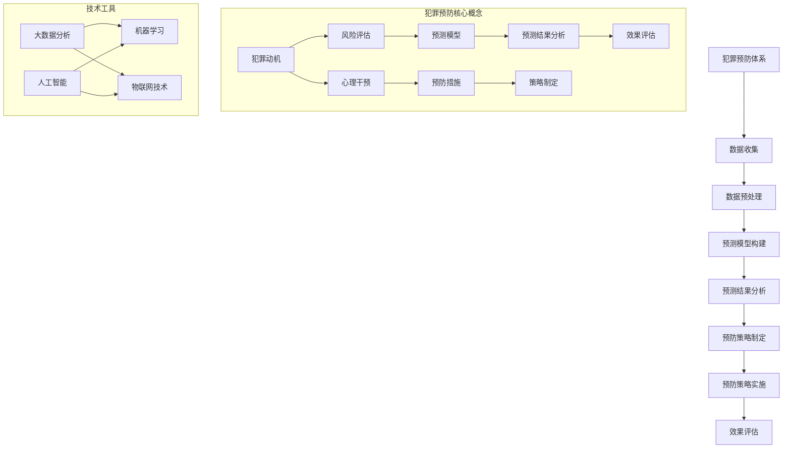

                 

# 《犯罪预防的预测分析：社会安全的数学工具》

> **关键词**：犯罪预防、预测分析、社会安全、数学模型、人工智能

> **摘要**：本文探讨了犯罪预防中的预测分析技术，介绍了社会安全基础数学模型，以及如何利用这些数学工具提升社会安全水平。文章分为三部分，首先介绍了犯罪预防的基础理论，接着阐述了预测分析在犯罪预防中的应用，并通过实际案例展示了预测分析的效果，最后分析了未来犯罪预防技术的发展趋势。

----------------------------------------------------------------

## 第一部分：犯罪预防基础理论

### 第1章：犯罪预防概述

#### 1.1 犯罪预防的定义与意义

犯罪预防是指通过一系列措施来减少犯罪发生的概率，保护社会安全和公众福祉。犯罪预防不仅仅是一个法律和治安问题，更是一个社会、经济和文化的综合性问题。在现代社会中，犯罪预防具有极其重要的意义：

1. **保护公民安全**：犯罪预防的首要目标是保障公民的人身和财产安全，营造一个和谐稳定的社会环境。
2. **维护社会秩序**：通过犯罪预防，可以维护社会的正常秩序，防止犯罪行为对社会造成严重破坏。
3. **节约社会资源**：减少犯罪行为，可以减轻法律、司法、监狱等公共服务系统的负担，降低社会成本。
4. **提升社会信任度**：有效的犯罪预防措施能够提升公众对社会制度的信任，增强社会的凝聚力。

#### 1.2 犯罪预防的基本原则

犯罪预防遵循以下基本原则：

1. **综合治理**：犯罪预防需要社会各方面的共同努力，包括政府、企业、社区、家庭和个人。
2. **预防为主**：预防犯罪应放在首位，通过减少犯罪诱因和犯罪机会来降低犯罪率。
3. **依法治理**：犯罪预防应在法律的框架内进行，依法打击犯罪，依法治理犯罪行为。
4. **科学预防**：运用科学的方法和技术手段，如预测分析、数据挖掘等，提高犯罪预防的精准度和有效性。

#### 1.3 犯罪预防的策略与措施

犯罪预防的策略和措施多种多样，主要包括以下几个方面：

1. **法律措施**：制定和完善相关法律法规，加大对犯罪行为的惩处力度，提高违法成本。
2. **教育措施**：通过法律、道德和社会教育，提高公民的法律意识和社会责任感，减少犯罪动机。
3. **社区措施**：加强社区建设，推动社区参与，提升社区的安全防范能力。
4. **技术措施**：运用科技手段，如视频监控、网络安全、数据分析等，提高犯罪预防的技术水平。
5. **社会支持**：提供社会支持和援助，如就业援助、心理咨询、社会服务等，减少犯罪风险因素。

### 第2章：社会安全的基础数学模型

#### 2.1 社会安全风险评估模型

社会安全风险评估是犯罪预防的重要环节，通过评估不同区域、不同群体的安全风险，制定针对性的预防措施。常见的社会安全风险评估模型包括：

1. **经典风险评估模型**：

   - **多因素分析模型**：将多个影响因素（如人口密度、经济水平、治安状况等）综合起来，评估风险水平。
   - **层次分析法（AHP）**：通过构建层次结构模型，对各个因素进行权重分配，综合评估风险。
   
2. **贝叶斯网络在犯罪预防中的应用**：

   - **贝叶斯网络**：通过图形模型表示因素之间的概率关系，用于推理和预测。
   - **应用场景**：如犯罪动机预测、犯罪行为预测等。

#### 2.2 社会安全事件的预测模型

社会安全事件的预测是犯罪预防的关键步骤，通过预测未来可能发生的犯罪行为，提前采取预防措施。常见的预测模型包括：

1. **时间序列分析模型**：

   - **自回归模型（AR）**：利用历史数据，通过自回归关系预测未来值。
   - **移动平均模型（MA）**：利用历史数据的移动平均趋势，预测未来值。
   - **自回归移动平均模型（ARMA）**：结合自回归和移动平均模型，预测未来值。
   
2. **机器学习模型在社会安全预测中的应用**：

   - **监督学习模型**：如逻辑回归、决策树、随机森林等，通过已有数据训练模型，预测未来犯罪行为。
   - **无监督学习模型**：如聚类分析、关联规则挖掘等，用于发现潜在犯罪模式。

### 第3章：犯罪心理分析

#### 3.1 犯罪心理学的理论框架

犯罪心理学是研究犯罪行为背后的心理机制的科学。犯罪心理学的理论框架主要包括：

1. **人类行为的决策模型**：

   - **理性决策模型**：基于最大化收益和最小化损失的原则，进行决策。
   - **有限理性模型**：考虑到人类认知局限，决策并非完全理性。

2. **犯罪动机与犯罪行为的关联**：

   - **需求动机**：如经济需求、物质需求等。
   - **心理动机**：如愤怒、沮丧、报复等。
   - **行为动机**：如寻求刺激、追求快感等。

#### 3.2 犯罪心理分析的应用

犯罪心理分析在犯罪预防中具有重要作用，主要包括以下几个方面：

1. **犯罪预测与犯罪预防**：

   - 通过分析犯罪人的心理特征和行为模式，预测未来犯罪行为，提前采取预防措施。
   - 如：针对高危人群进行心理干预，减少其犯罪可能性。

2. **心理干预与犯罪预防策略**：

   - 通过心理治疗、心理辅导等手段，改变犯罪人的心理状态和行为模式。
   - 如：对犯罪人员进行心理康复，降低重新犯罪率。

## 第二部分：预测分析与犯罪预防

### 第4章：数据收集与预处理

#### 4.1 数据收集方法

1. **传统数据收集方法**：

   - **问卷调查**：通过设计问卷，收集公众对犯罪问题的看法和态度。
   - **访谈调查**：对特定群体进行深入访谈，了解其犯罪动机和行为模式。

2. **现代数据收集方法**：

   - **大数据分析**：利用互联网、社交媒体等渠道，收集海量数据，挖掘潜在犯罪信息。
   - **物联网技术**：通过传感器、监控设备等，实时收集社会安全数据。

#### 4.2 数据预处理技术

1. **数据清洗**：

   - **缺失值处理**：填补或删除缺失数据，确保数据完整性。
   - **异常值处理**：识别和去除异常数据，避免对模型训练造成干扰。

2. **特征工程**：

   - **特征提取**：从原始数据中提取具有区分度的特征，提高模型性能。
   - **特征选择**：通过筛选、合并等手段，减少特征维度，降低计算复杂度。

### 第5章：预测模型构建

#### 5.1 预测模型的选择

1. **传统预测模型**：

   - **统计模型**：如线性回归、逻辑回归等，适用于简单的关系预测。
   - **时间序列模型**：如ARIMA、SARIMA等，适用于时间序列数据的预测。

2. **机器学习预测模型**：

   - **监督学习模型**：如决策树、随机森林、支持向量机等，适用于分类和回归任务。
   - **深度学习模型**：如卷积神经网络、循环神经网络等，适用于复杂模式识别和时间序列预测。

#### 5.2 预测模型的训练与评估

1. **模型训练流程**：

   - **数据划分**：将数据集划分为训练集、验证集和测试集。
   - **模型训练**：利用训练集数据，通过迭代优化算法，训练模型参数。
   - **模型验证**：利用验证集数据，评估模型性能，调整模型参数。

2. **模型评估指标**：

   - **准确率**：预测结果与实际结果一致的样本比例。
   - **召回率**：预测结果中包含实际结果的样本比例。
   - **F1分数**：准确率和召回率的加权平均，综合考虑预测结果的质量。

### 第6章：犯罪预防策略制定

#### 6.1 预测结果分析

1. **预测结果的可视化**：

   - 利用图表、地图等可视化工具，展示预测结果，帮助决策者直观了解犯罪分布和趋势。

2. **预测结果的解释**：

   - 对预测结果进行详细分析，识别高风险区域和高危人群，制定针对性的预防策略。

#### 6.2 犯罪预防策略制定

1. **预防措施的选择**：

   - 根据预测结果，选择合适的预防措施，如增加警力、加强社区治理、推广心理健康服务等。

2. **犯罪预防策略的实施**：

   - 制定详细的实施计划，明确责任分工、时间节点和监督机制，确保预防策略的有效执行。

## 第三部分：案例分析与应用

### 第7章：犯罪预防的实践案例

#### 7.1 案例背景与数据

1. **案例背景**：

   - 某城市近年来犯罪率较高，政府决定运用预测分析技术，制定针对性的犯罪预防策略。

2. **数据来源与收集方法**：

   - **犯罪数据**：从公安部门获取过去5年的犯罪案件数据，包括犯罪类型、发生时间和地点。
   - **人口数据**：从统计局获取人口统计数据，包括人口数量、年龄结构、职业分布等。
   - **环境数据**：通过卫星遥感技术和传感器，获取城市的环境数据，如绿化覆盖率、交通流量等。

#### 7.2 案例分析

1. **预测模型的构建与应用**：

   - **数据预处理**：对犯罪数据进行清洗、缺失值处理和特征提取，为模型训练做好准备。
   - **模型选择**：采用随机森林模型进行训练，预测未来一周内的犯罪热点区域。
   - **模型训练与评估**：利用历史数据训练模型，并通过交叉验证评估模型性能。

2. **预防策略的制定与实施**：

   - **预防措施的选择**：根据预测结果，决定在犯罪热点区域增加警力部署、加强巡逻和监控。
   - **实施计划**：明确责任分工、时间节点和监督机制，确保预防策略的有效执行。
   - **效果评估**：通过对比预测结果与实际犯罪情况，评估预防策略的实施效果。

### 第8章：犯罪预防技术的未来发展趋势

#### 8.1 新兴技术在犯罪预防中的应用

1. **物联网技术在犯罪预防中的应用**：

   - **智能监控**：利用物联网技术，实现对城市各个角落的实时监控，提高犯罪预防的精准度。
   - **智能分析**：通过大数据分析和人工智能技术，对监控数据进行分析，发现潜在犯罪行为。

2. **人工智能技术的未来发展**：

   - **智能预测**：利用深度学习和强化学习等技术，实现更精准的犯罪预测，提高犯罪预防的效率。
   - **智能干预**：通过虚拟现实和增强现实技术，实现对犯罪行为的实时干预和引导。

#### 8.2 犯罪预防技术的挑战与机遇

1. **数据隐私保护**：

   - 随着数据收集技术的进步，犯罪预防中的数据隐私保护成为一个重要问题。需要制定严格的数据保护政策，确保个人隐私不受侵犯。

2. **技术伦理问题**：

   - 犯罪预防技术的应用可能引发一系列伦理问题，如算法歧视、隐私泄露等。需要建立健全的伦理规范，确保技术的合理应用。

### 作者信息

**作者**：AI天才研究院/AI Genius Institute & 禅与计算机程序设计艺术 /Zen And The Art of Computer Programming

----------------------------------------------------------------

# 结束

<|assistant|>## 第1章：犯罪预防概述

### 1.1 犯罪预防的定义与意义

犯罪预防是指通过一系列措施来减少犯罪发生的概率，保护社会安全和公众福祉。犯罪预防不仅仅是一个法律和治安问题，更是一个社会、经济和文化的综合性问题。在现代社会中，犯罪预防具有极其重要的意义：

1. **保护公民安全**：犯罪预防的首要目标是保障公民的人身和财产安全，营造一个和谐稳定的社会环境。
2. **维护社会秩序**：通过犯罪预防，可以维护社会的正常秩序，防止犯罪行为对社会造成严重破坏。
3. **节约社会资源**：减少犯罪行为，可以减轻法律、司法、监狱等公共服务系统的负担，降低社会成本。
4. **提升社会信任度**：有效的犯罪预防措施能够提升公众对社会制度的信任，增强社会的凝聚力。

#### 1.2 犯罪预防的基本原则

犯罪预防遵循以下基本原则：

1. **综合治理**：犯罪预防需要社会各方面的共同努力，包括政府、企业、社区、家庭和个人。
2. **预防为主**：预防犯罪应放在首位，通过减少犯罪诱因和犯罪机会来降低犯罪率。
3. **依法治理**：犯罪预防应在法律的框架内进行，依法打击犯罪，依法治理犯罪行为。
4. **科学预防**：运用科学的方法和技术手段，如预测分析、数据挖掘等，提高犯罪预防的精准度和有效性。

#### 1.3 犯罪预防的策略与措施

犯罪预防的策略和措施多种多样，主要包括以下几个方面：

1. **法律措施**：制定和完善相关法律法规，加大对犯罪行为的惩处力度，提高违法成本。
2. **教育措施**：通过法律、道德和社会教育，提高公民的法律意识和社会责任感，减少犯罪动机。
3. **社区措施**：加强社区建设，推动社区参与，提升社区的安全防范能力。
4. **技术措施**：运用科技手段，如视频监控、网络安全、数据分析等，提高犯罪预防的技术水平。
5. **社会支持**：提供社会支持和援助，如就业援助、心理咨询、社会服务等，减少犯罪风险因素。

### 第2章：社会安全的基础数学模型

#### 2.1 社会安全风险评估模型

社会安全风险评估是犯罪预防的重要环节，通过评估不同区域、不同群体的安全风险，制定针对性的预防措施。常见的社会安全风险评估模型包括：

1. **经典风险评估模型**：

   - **多因素分析模型**：将多个影响因素（如人口密度、经济水平、治安状况等）综合起来，评估风险水平。
   - **层次分析法（AHP）**：通过构建层次结构模型，对各个因素进行权重分配，综合评估风险。

2. **贝叶斯网络在犯罪预防中的应用**：

   - **贝叶斯网络**：通过图形模型表示因素之间的概率关系，用于推理和预测。
   - **应用场景**：如犯罪动机预测、犯罪行为预测等。

#### 2.2 社会安全事件的预测模型

社会安全事件的预测是犯罪预防的关键步骤，通过预测未来可能发生的犯罪行为，提前采取预防措施。常见的预测模型包括：

1. **时间序列分析模型**：

   - **自回归模型（AR）**：利用历史数据，通过自回归关系预测未来值。
   - **移动平均模型（MA）**：利用历史数据的移动平均趋势，预测未来值。
   - **自回归移动平均模型（ARMA）**：结合自回归和移动平均模型，预测未来值。

2. **机器学习模型在社会安全预测中的应用**：

   - **监督学习模型**：如逻辑回归、决策树、随机森林等，适用于分类和回归任务。
   - **无监督学习模型**：如聚类分析、关联规则挖掘等，用于发现潜在犯罪模式。

### 第3章：犯罪心理分析

#### 3.1 犯罪心理学的理论框架

犯罪心理学是研究犯罪行为背后的心理机制的科学。犯罪心理学的理论框架主要包括：

1. **人类行为的决策模型**：

   - **理性决策模型**：基于最大化收益和最小化损失的原则，进行决策。
   - **有限理性模型**：考虑到人类认知局限，决策并非完全理性。

2. **犯罪动机与犯罪行为的关联**：

   - **需求动机**：如经济需求、物质需求等。
   - **心理动机**：如愤怒、沮丧、报复等。
   - **行为动机**：如寻求刺激、追求快感等。

#### 3.2 犯罪心理分析的应用

犯罪心理分析在犯罪预防中具有重要作用，主要包括以下几个方面：

1. **犯罪预测与犯罪预防**：

   - 通过分析犯罪人的心理特征和行为模式，预测未来犯罪行为，提前采取预防措施。
   - 如：针对高危人群进行心理干预，减少其犯罪可能性。

2. **心理干预与犯罪预防策略**：

   - 通过心理治疗、心理辅导等手段，改变犯罪人的心理状态和行为模式。
   - 如：对犯罪人员进行心理康复，降低重新犯罪率。

## 第二部分：预测分析与犯罪预防

### 第4章：数据收集与预处理

#### 4.1 数据收集方法

1. **传统数据收集方法**：

   - **问卷调查**：通过设计问卷，收集公众对犯罪问题的看法和态度。
   - **访谈调查**：对特定群体进行深入访谈，了解其犯罪动机和行为模式。

2. **现代数据收集方法**：

   - **大数据分析**：利用互联网、社交媒体等渠道，收集海量数据，挖掘潜在犯罪信息。
   - **物联网技术**：通过传感器、监控设备等，实时收集社会安全数据。

#### 4.2 数据预处理技术

1. **数据清洗**：

   - **缺失值处理**：填补或删除缺失数据，确保数据完整性。
   - **异常值处理**：识别和去除异常数据，避免对模型训练造成干扰。

2. **特征工程**：

   - **特征提取**：从原始数据中提取具有区分度的特征，提高模型性能。
   - **特征选择**：通过筛选、合并等手段，减少特征维度，降低计算复杂度。

### 第5章：预测模型构建

#### 5.1 预测模型的选择

1. **传统预测模型**：

   - **统计模型**：如线性回归、逻辑回归等，适用于简单的关系预测。
   - **时间序列模型**：如ARIMA、SARIMA等，适用于时间序列数据的预测。

2. **机器学习预测模型**：

   - **监督学习模型**：如决策树、随机森林、支持向量机等，适用于分类和回归任务。
   - **深度学习模型**：如卷积神经网络、循环神经网络等，适用于复杂模式识别和时间序列预测。

#### 5.2 预测模型的训练与评估

1. **模型训练流程**：

   - **数据划分**：将数据集划分为训练集、验证集和测试集。
   - **模型训练**：利用训练集数据，通过迭代优化算法，训练模型参数。
   - **模型验证**：利用验证集数据，评估模型性能，调整模型参数。

2. **模型评估指标**：

   - **准确率**：预测结果与实际结果一致的样本比例。
   - **召回率**：预测结果中包含实际结果的样本比例。
   - **F1分数**：准确率和召回率的加权平均，综合考虑预测结果的质量。

### 第6章：犯罪预防策略制定

#### 6.1 预测结果分析

1. **预测结果的可视化**：

   - 利用图表、地图等可视化工具，展示预测结果，帮助决策者直观了解犯罪分布和趋势。

2. **预测结果的解释**：

   - 对预测结果进行详细分析，识别高风险区域和高危人群，制定针对性的预防策略。

#### 6.2 犯罪预防策略制定

1. **预防措施的选择**：

   - 根据预测结果，选择合适的预防措施，如增加警力部署、加强社区治理、推广心理健康服务等。

2. **犯罪预防策略的实施**：

   - 制定详细的实施计划，明确责任分工、时间节点和监督机制，确保预防策略的有效执行。

## 第三部分：案例分析与应用

### 第7章：犯罪预防的实践案例

#### 7.1 案例背景与数据

1. **案例背景**：

   - 某城市近年来犯罪率较高，政府决定运用预测分析技术，制定针对性的犯罪预防策略。

2. **数据来源与收集方法**：

   - **犯罪数据**：从公安部门获取过去5年的犯罪案件数据，包括犯罪类型、发生时间和地点。
   - **人口数据**：从统计局获取人口统计数据，包括人口数量、年龄结构、职业分布等。
   - **环境数据**：通过卫星遥感技术和传感器，获取城市的环境数据，如绿化覆盖率、交通流量等。

#### 7.2 案例分析

1. **预测模型的构建与应用**：

   - **数据预处理**：对犯罪数据进行清洗、缺失值处理和特征提取，为模型训练做好准备。
   - **模型选择**：采用随机森林模型进行训练，预测未来一周内的犯罪热点区域。
   - **模型训练与评估**：利用历史数据训练模型，并通过交叉验证评估模型性能。

2. **预防策略的制定与实施**：

   - **预防措施的选择**：根据预测结果，决定在犯罪热点区域增加警力部署、加强巡逻和监控。
   - **实施计划**：明确责任分工、时间节点和监督机制，确保预防策略的有效执行。
   - **效果评估**：通过对比预测结果与实际犯罪情况，评估预防策略的实施效果。

### 第8章：犯罪预防技术的未来发展趋势

#### 8.1 新兴技术在犯罪预防中的应用

1. **物联网技术在犯罪预防中的应用**：

   - **智能监控**：利用物联网技术，实现对城市各个角落的实时监控，提高犯罪预防的精准度。
   - **智能分析**：通过大数据分析和人工智能技术，对监控数据进行分析，发现潜在犯罪行为。

2. **人工智能技术的未来发展**：

   - **智能预测**：利用深度学习和强化学习等技术，实现更精准的犯罪预测，提高犯罪预防的效率。
   - **智能干预**：通过虚拟现实和增强现实技术，实现对犯罪行为的实时干预和引导。

#### 8.2 犯罪预防技术的挑战与机遇

1. **数据隐私保护**：

   - 随着数据收集技术的进步，犯罪预防中的数据隐私保护成为一个重要问题。需要制定严格的数据保护政策，确保个人隐私不受侵犯。

2. **技术伦理问题**：

   - 犯罪预防技术的应用可能引发一系列伦理问题，如算法歧视、隐私泄露等。需要建立健全的伦理规范，确保技术的合理应用。

### 作者信息

**作者**：AI天才研究院/AI Genius Institute & 禅与计算机程序设计艺术 /Zen And The Art of Computer Programming

---

## 第1章：犯罪预防概述

犯罪预防是一项多层次、多领域的综合性工作，旨在通过减少犯罪诱因和犯罪机会，降低犯罪发生率，维护社会稳定和公众安全。本章节首先对犯罪预防的定义进行阐述，并探讨其对社会安全的重要性。接着，详细介绍犯罪预防的基本原则，包括综合治理、预防为主、依法治理和科学预防。最后，本文将总结犯罪预防的主要策略与措施，为后续章节的讨论奠定基础。

### 1.1 犽犯罪预防的定义与意义

犯罪预防是指通过一系列措施来减少犯罪发生的概率，保护社会安全和公众福祉。犯罪预防不仅仅是一个法律和治安问题，更是一个社会、经济和文化的综合性问题。它涉及到政府、企业、社区、家庭和个人等多个方面。犯罪预防的核心目标是减少犯罪行为对社会造成的危害，提高社会的整体安全水平。

在现代社会中，犯罪预防具有极其重要的意义：

1. **保护公民安全**：犯罪预防的首要目标是保障公民的人身和财产安全，营造一个和谐稳定的社会环境。通过预防措施，可以减少犯罪行为对个人和社会的负面影响。

2. **维护社会秩序**：犯罪预防有助于维护社会的正常秩序，防止犯罪行为对社会造成严重破坏。通过制定和实施预防措施，可以降低犯罪率，减少社会矛盾和冲突。

3. **节约社会资源**：减少犯罪行为可以减轻法律、司法、监狱等公共服务系统的负担，降低社会成本。犯罪预防措施的实施有助于提高社会资源利用效率，优化社会资源配置。

4. **提升社会信任度**：有效的犯罪预防措施能够提升公众对社会制度的信任，增强社会的凝聚力。通过减少犯罪行为，可以提高社会成员的安全感，促进社会和谐发展。

### 1.2 犯罪预防的基本原则

犯罪预防遵循以下基本原则：

1. **综合治理**：犯罪预防需要社会各方面的共同努力，包括政府、企业、社区、家庭和个人。综合治理强调各方协同合作，共同构建犯罪预防体系，实现全方位、多层次、多维度的预防效果。

2. **预防为主**：预防犯罪应放在首位，通过减少犯罪诱因和犯罪机会来降低犯罪率。预防为主的策略强调预防措施的实施，而不是仅仅依赖惩罚和制裁。通过采取积极的预防措施，可以从源头上减少犯罪行为的发生。

3. **依法治理**：犯罪预防应在法律的框架内进行，依法打击犯罪，依法治理犯罪行为。依法治理强调在犯罪预防过程中，严格遵守法律法规，确保预防措施的实施合法、合规。

4. **科学预防**：运用科学的方法和技术手段，如预测分析、数据挖掘等，提高犯罪预防的精准度和有效性。科学预防强调基于数据和实证研究，制定和实施预防措施，以提高预防效果。

### 1.3 犯罪预防的策略与措施

犯罪预防的策略和措施多种多样，主要包括以下几个方面：

1. **法律措施**：制定和完善相关法律法规，加大对犯罪行为的惩处力度，提高违法成本。法律措施是犯罪预防的重要手段，通过制定和执行法律，可以对犯罪行为进行有效制裁和威慑。

2. **教育措施**：通过法律、道德和社会教育，提高公民的法律意识和社会责任感，减少犯罪动机。教育措施包括学校教育、社会宣传、公民教育等，旨在培养公民的法律意识和社会责任感，从源头上减少犯罪行为。

3. **社区措施**：加强社区建设，推动社区参与，提升社区的安全防范能力。社区措施包括社区治安巡逻、社区志愿者服务、社区安全宣传活动等，通过社区的力量，共同维护社区的安全和稳定。

4. **技术措施**：运用科技手段，如视频监控、网络安全、数据分析等，提高犯罪预防的技术水平。技术措施包括智能监控系统的建设、网络安全防护技术的应用、大数据分析技术的运用等，通过科技手段提高犯罪预防的效率和精准度。

5. **社会支持**：提供社会支持和援助，如就业援助、心理咨询、社会服务等，减少犯罪风险因素。社会支持措施包括就业援助中心、心理咨询机构、社会救助机构等，通过提供社会支持和援助，帮助弱势群体融入社会，减少犯罪行为的发生。

综上所述，犯罪预防是一项复杂而重要的工作，需要社会各方面的共同努力。通过制定和完善相关法律法规、加强教育措施、推动社区建设和运用科技手段，可以构建一个全面的犯罪预防体系，提高社会安全水平，保障公众福祉。

### 第2章：社会安全的基础数学模型

社会安全的基础数学模型是犯罪预防中的核心工具，它们帮助决策者识别高风险区域、预测犯罪趋势以及制定有效的预防策略。本章节将详细介绍几种常见的社会安全风险评估模型和预测模型，包括经典的风险评估模型和多因素分析模型，以及贝叶斯网络在犯罪预防中的应用。

#### 2.1 社会安全风险评估模型

社会安全风险评估模型用于评估不同区域或群体的安全风险，从而指导预防措施的制定和实施。以下介绍几种常见的社会安全风险评估模型：

1. **多因素分析模型**：

   - **多因素分析模型**（Multifactor Analysis Model）是一种将多个影响因素综合起来进行风险评估的方法。这些因素可能包括人口密度、经济水平、失业率、犯罪历史、教育资源、基础设施状况等。通过量化这些因素，可以计算出总体的安全风险水平。

   - **多因素分析模型**的基本公式如下：

     \[ R = w_1 \cdot F_1 + w_2 \cdot F_2 + ... + w_n \cdot F_n \]

     其中，\( R \) 表示总风险水平，\( w_i \) 表示第 \( i \) 个因素的权重，\( F_i \) 表示第 \( i \) 个因素的得分。

2. **层次分析法（AHP）**：

   - **层次分析法**（Analytic Hierarchy Process，AHP）是一种基于优先级排序和权重分配的多因素决策分析方法。AHP通过构建层次结构模型，将复杂的决策问题分解为多个层次和多个因素，并通过专家打分来确定各因素的权重。

   - **层次分析法**的基本步骤包括：构建层次结构模型、确定因素权重、计算综合权重和评估总体风险。

#### 2.2 贝叶斯网络在犯罪预防中的应用

贝叶斯网络是一种图形模型，用于表示变量之间的概率关系。在犯罪预防中，贝叶斯网络可以用于犯罪动机预测、犯罪行为预测等。以下介绍贝叶斯网络的基本概念和应用：

1. **贝叶斯网络的基本概念**：

   - **节点**：贝叶斯网络中的节点表示变量，每个节点对应一个变量，如犯罪类型、犯罪动机、犯罪地点等。

   - **边**：贝叶斯网络中的边表示变量之间的依赖关系，边的方向表示因果关系或条件概率关系。

   - **概率表**：每个节点对应一个概率表，描述该节点的状态及其条件概率分布。

2. **贝叶斯网络在犯罪预防中的应用**：

   - **犯罪动机预测**：通过贝叶斯网络，可以分析不同犯罪动机之间的关联，预测犯罪行为的发生概率。例如，如果分析显示愤怒和心理压力是犯罪的主要动机，可以采取心理干预措施，减少这些因素对犯罪行为的影响。

   - **犯罪行为预测**：通过贝叶斯网络，可以预测特定时间段和地点的犯罪行为。例如，如果分析显示晚上11点到凌晨1点是盗窃案件的高发时段，可以加强夜间巡逻和监控，提高预防效果。

#### 2.3 社会安全事件的预测模型

社会安全事件的预测模型用于预测未来可能发生的犯罪事件，以便提前采取预防措施。以下介绍几种常见的社会安全事件预测模型：

1. **时间序列分析模型**：

   - **时间序列分析模型**（Time Series Analysis Model）是一种基于历史时间序列数据来预测未来值的方法。常见的模型包括自回归模型（AR）、移动平均模型（MA）和自回归移动平均模型（ARMA）。

   - **自回归模型（AR）**：通过历史数据中的自回归关系来预测未来值。例如，如果某个地区的犯罪率在过去一年内呈上升趋势，可以预测未来几个月的犯罪率可能继续上升。

   - **移动平均模型（MA）**：通过历史数据的移动平均趋势来预测未来值。例如，如果某个地区的犯罪率在过去三个月内稳定下降，可以预测未来几个月的犯罪率可能继续保持下降趋势。

   - **自回归移动平均模型（ARMA）**：结合自回归和移动平均模型，用于预测具有趋势和季节性的时间序列数据。

2. **机器学习模型在社会安全预测中的应用**：

   - **监督学习模型**：如逻辑回归、决策树、支持向量机等，用于分类和回归任务。例如，可以用于预测特定时间段和地点的犯罪行为。

   - **无监督学习模型**：如聚类分析、关联规则挖掘等，用于发现潜在犯罪模式。例如，可以通过聚类分析发现犯罪团伙的活动规律，从而采取针对性的预防措施。

综上所述，社会安全的基础数学模型在犯罪预防中发挥着重要作用。通过风险评估模型和预测模型的应用，可以更准确地识别高风险区域和预测犯罪趋势，为犯罪预防提供科学依据和决策支持。

### 第3章：犯罪心理分析

犯罪心理分析是犯罪预防的重要组成部分，它通过研究犯罪行为的心理动因，有助于理解犯罪行为的形成过程，预测犯罪行为的发生，并制定有效的犯罪预防策略。本章节将介绍犯罪心理学的理论框架，包括人类行为的决策模型和犯罪动机与犯罪行为的关联，以及犯罪心理分析在犯罪预防中的应用。

#### 3.1 犯罪心理学的理论框架

犯罪心理学是研究犯罪行为背后的心理机制的科学。它结合了心理学、社会学、法学等多学科知识，以揭示犯罪行为的心理动因和预防策略。犯罪心理学的理论框架主要包括以下几个方面：

1. **人类行为的决策模型**：

   - **理性决策模型**：理性决策模型基于最大化收益和最小化损失的原则，认为个体在做出决策时会充分考虑所有相关信息，并选择最优方案。然而，在现实生活中，人类的决策过程受到认知局限和情绪因素的影响，往往并非完全理性。

   - **有限理性模型**：有限理性模型认为，个体在决策过程中存在认知局限，如信息处理能力有限、决策时间有限等。因此，个体在做出决策时，往往采用简化策略，如经验法则或启发式方法。

2. **犯罪动机与犯罪行为的关联**：

   - **需求动机**：需求动机是指个体因满足某种需求而进行犯罪行为。例如，经济需求、物质需求、权力需求等。需求动机通常是犯罪行为的直接动因，也是许多犯罪案件调查的重点。

   - **心理动机**：心理动机是指个体因心理需求或情绪困扰而进行犯罪行为。例如，愤怒、沮丧、报复、寻求刺激等。心理动机通常与个体的心理状态和情绪调节能力有关。

   - **行为动机**：行为动机是指个体因行为习惯、个人嗜好等而进行犯罪行为。例如，赌徒犯罪、吸毒犯罪等。行为动机通常与个体的行为模式和生活环境有关。

#### 3.2 犯罪心理分析的应用

犯罪心理分析在犯罪预防中具有重要作用，其应用主要包括以下几个方面：

1. **犯罪预测与犯罪预防**：

   - 通过分析犯罪人的心理特征和行为模式，预测其未来可能的犯罪行为，从而提前采取预防措施。例如，通过对犯罪人的心理测试和行为分析，可以预测其是否有可能再次犯罪，并采取相应的干预措施。

   - 针对高危人群进行心理干预，减少其犯罪可能性。例如，对有犯罪倾向的青少年进行心理健康教育和辅导，帮助其建立正确的价值观和人生观，从而减少犯罪行为的发生。

2. **心理干预与犯罪预防策略**：

   - 通过心理治疗和心理辅导等手段，改变犯罪人的心理状态和行为模式。例如，对犯罪人员进行心理康复，帮助其恢复心理健康，降低重新犯罪率。

   - 制定心理干预方案，结合社会支持和其他预防措施，提高犯罪预防的效果。例如，在社区中建立心理干预中心，提供心理健康咨询和辅导服务，帮助犯罪嫌疑人和受害者恢复心理平衡。

3. **犯罪心理分析在司法体系中的应用**：

   - 在刑事诉讼中，犯罪心理分析可以帮助法官和律师了解犯罪人的心理状态，为案件审理和辩护提供科学依据。例如，通过犯罪心理分析，可以评估犯罪人的危险性，从而决定是否适用缓刑或监禁等刑罚。

   - 在犯罪预防策略制定中，犯罪心理分析可以为决策者提供科学依据，指导预防措施的制定和实施。例如，通过分析犯罪人的行为特征和动机，可以制定针对性的预防策略，提高预防效果。

综上所述，犯罪心理分析是犯罪预防的重要工具，通过研究犯罪行为的心理动因，可以预测犯罪行为的发生，制定有效的犯罪预防策略，维护社会安全和公共秩序。

### 第4章：数据收集与预处理

数据收集与预处理是犯罪预防预测分析的基础环节，它决定了后续模型训练和预测的准确性和效率。本章将详细探讨数据收集的方法和预处理技术，包括传统数据收集方法、现代数据收集方法、数据清洗、缺失值处理、异常值处理和特征工程等。

#### 4.1 数据收集方法

数据收集是犯罪预防预测分析的第一步，不同的数据收集方法适用于不同的应用场景和数据源。以下介绍两种常见的数据收集方法：

1. **传统数据收集方法**：

   - **问卷调查**：通过设计问卷，收集公众对犯罪问题的看法和态度。问卷调查适用于大范围、多层次的调查，有助于了解公众对犯罪现象的认知和感受。

   - **访谈调查**：对特定群体进行深入访谈，了解其犯罪动机和行为模式。访谈调查适用于获取深度信息和详细背景，有助于深入理解犯罪行为的内在动因。

2. **现代数据收集方法**：

   - **大数据分析**：利用互联网、社交媒体等渠道，收集海量数据，挖掘潜在犯罪信息。大数据分析可以实时获取和处理大量数据，有助于发现犯罪行为模式和趋势。

   - **物联网技术**：通过传感器、监控设备等，实时收集社会安全数据。物联网技术可以实现实时监控和数据分析，有助于提高犯罪预防的精准度和响应速度。

#### 4.2 数据预处理技术

数据预处理是确保数据质量和模型性能的关键步骤，主要包括数据清洗、缺失值处理、异常值处理和特征工程等。

1. **数据清洗**：

   - **缺失值处理**：缺失值是数据集中常见的问题，可以通过填补或删除缺失值来处理。填补缺失值的方法包括均值填补、中值填补、回归填补等；删除缺失值适用于缺失值比例较高或缺失值对模型影响较小的情形。

   - **异常值处理**：异常值是指那些偏离正常数据分布的数据点，可以通过统计方法（如箱线图、Z分数等）识别和去除。异常值处理有助于提高数据的质量和模型的稳定性。

2. **特征工程**：

   - **特征提取**：从原始数据中提取具有区分度的特征，有助于提高模型性能。特征提取的方法包括降维技术（如主成分分析PCA）、特征选择（如互信息、卡方检验等）。

   - **特征选择**：通过筛选、合并等手段，减少特征维度，降低计算复杂度。特征选择有助于提高模型的泛化能力和解释性。

   - **特征标准化**：将特征值缩放到相同的尺度范围内，避免特征之间的数量级差异对模型训练造成干扰。常用的特征标准化方法包括最小-最大标准化和Z-score标准化。

3. **数据预处理流程**：

   - **数据清洗**：识别和修复数据中的错误和异常值。
   - **缺失值处理**：填补或删除缺失值，确保数据完整性。
   - **特征工程**：提取和选择具有区分度的特征，提高模型性能。
   - **数据标准化**：将特征值缩放到相同的尺度范围内，避免特征之间的数量级差异对模型训练造成干扰。

#### 4.3 数据预处理示例

以下是一个数据预处理的具体示例：

1. **数据清洗**：

   - **异常值处理**：通过箱线图识别出数据集中的异常值，将其标记并删除。
   - **数据格式统一**：将不同格式的数据统一转换为标准格式，如将日期数据统一转换为YYYY-MM-DD格式。

2. **缺失值处理**：

   - **填补缺失值**：使用均值填补法填补数值型特征的缺失值。
   - **删除缺失值**：对于文本类特征的缺失值，可以选择删除相应的样本。

3. **特征工程**：

   - **特征提取**：通过主成分分析PCA提取主要特征，减少数据维度。
   - **特征选择**：使用互信息方法筛选出对目标变量有显著贡献的特征。

4. **数据标准化**：

   - **最小-最大标准化**：将特征值缩放到[0, 1]区间。
   - **Z-score标准化**：将特征值缩放到标准正态分布，均值为0，标准差为1。

通过上述数据预处理步骤，可以显著提高数据的质量和模型的性能，为后续的预测分析和犯罪预防提供可靠的数据支持。

### 第5章：预测模型构建

预测模型构建是犯罪预防预测分析的核心环节，它决定了犯罪行为的预测准确性和预防策略的有效性。本章将详细探讨预测模型的选择、训练和评估过程，以及常见的传统预测模型和机器学习模型。

#### 5.1 预测模型的选择

选择合适的预测模型是构建有效犯罪预防系统的基础。预测模型的选择取决于数据的特征、问题的性质以及模型的性能指标。以下介绍几种常见的预测模型：

1. **传统预测模型**：

   - **统计模型**：统计模型适用于处理简单的关系预测问题。常见的统计模型包括线性回归、逻辑回归等。
   
   - **时间序列模型**：时间序列模型适用于处理具有时间依赖性的数据。常见的时间序列模型包括自回归模型（AR）、移动平均模型（MA）和自回归移动平均模型（ARMA）。

2. **机器学习模型**：

   - **监督学习模型**：监督学习模型适用于分类和回归任务。常见的监督学习模型包括决策树、随机森林、支持向量机等。
   
   - **无监督学习模型**：无监督学习模型适用于发现数据中的潜在模式和结构。常见的无监督学习模型包括聚类分析、关联规则挖掘等。

3. **深度学习模型**：

   - **卷积神经网络（CNN）**：卷积神经网络适用于处理图像数据，可以提取图像的特征。
   
   - **循环神经网络（RNN）**：循环神经网络适用于处理序列数据，可以捕捉时间序列中的长期依赖关系。

#### 5.2 预测模型的训练过程

预测模型的训练过程是通过迭代优化算法，使模型能够从训练数据中学习并提取有用的特征，从而对未知数据进行预测。以下介绍预测模型训练的基本流程：

1. **数据划分**：

   - 将数据集划分为训练集、验证集和测试集。训练集用于训练模型，验证集用于调整模型参数，测试集用于评估模型性能。

2. **模型初始化**：

   - 初始化模型参数，设置学习率、正则化参数等。

3. **模型训练**：

   - 通过迭代优化算法（如梯度下降法），更新模型参数，使模型在训练数据上表现更好。

4. **模型验证**：

   - 利用验证集评估模型性能，调整模型参数，避免过拟合。

5. **模型评估**：

   - 利用测试集评估模型性能，选择性能最优的模型。

#### 5.3 预测模型的评估指标

预测模型的评估指标是衡量模型性能的重要工具。以下介绍几种常见的评估指标：

1. **准确率**：

   - 准确率是预测结果与实际结果一致的样本比例。适用于分类任务。

2. **召回率**：

   - 召回率是预测结果中包含实际结果的样本比例。适用于分类任务。

3. **F1分数**：

   - F1分数是准确率和召回率的加权平均，综合考虑了预测结果的质量。适用于分类任务。

4. **均方误差（MSE）**：

   - 均方误差是回归任务中预测值与实际值之间差异的平方的平均值。适用于回归任务。

5. **均方根误差（RMSE）**：

   - 均方根误差是均方误差的平方根，用于衡量回归任务的预测误差。适用于回归任务。

#### 5.4 传统预测模型

传统预测模型是基于统计学原理构建的，适用于简单的关系预测问题。以下介绍几种常见的传统预测模型：

1. **线性回归**：

   - 线性回归模型假设变量之间存在线性关系，通过拟合线性模型，预测目标变量的值。

   - 伪代码：

     ```python
     # 线性回归模型
     y = w0 + w1 * x + ε
     ```

2. **逻辑回归**：

   - 逻辑回归模型是一种广义线性模型，用于分类任务。它通过拟合对数几率模型，预测类别概率。

   - 伪代码：

     ```python
     # 逻辑回归模型
     log(p/(1-p)) = w0 + w1 * x
     p = 1 / (1 + exp(-z))
     ```

3. **自回归模型（AR）**：

   - 自回归模型通过历史数据中的自回归关系来预测未来值。

   - 伪代码：

     ```python
     # 自回归模型
     yt = c + φ1 * yt-1 + φ2 * yt-2 + ... + φp * yt-p + εt
     ```

#### 5.5 机器学习模型

机器学习模型通过学习数据中的特征，能够自动识别复杂的关系和模式。以下介绍几种常见的机器学习模型：

1. **决策树**：

   - 决策树通过一系列的决策规则，对数据进行分类或回归。

   - 伪代码：

     ```python
     # 决策树模型
     if x >= threshold1 then
         left
     else
         right
     end if
     ```

2. **随机森林**：

   - 随机森林是一种集成学习方法，通过构建多棵决策树，提高预测性能。

   - 伪代码：

     ```python
     # 随机森林模型
     for tree in forest do
         predict
     end for
     ```

3. **支持向量机（SVM）**：

   - 支持向量机通过寻找最佳超平面，将数据分类到不同的类别。

   - 伪代码：

     ```python
     # 支持向量机模型
     minimize 1/2 * ||w||^2
     subject to  y_i (w \* x_i + b) >= 1
     ```

#### 5.6 深度学习模型

深度学习模型通过多层神经网络，能够自动提取复杂的数据特征。以下介绍几种常见的深度学习模型：

1. **卷积神经网络（CNN）**：

   - 卷积神经网络通过卷积操作和池化操作，提取图像的特征。

   - 伪代码：

     ```python
     # 卷积神经网络模型
     Conv2D -> Pooling -> Conv2D -> Pooling -> ...
     ```

2. **循环神经网络（RNN）**：

   - 循环神经网络通过循环连接，捕捉时间序列中的长期依赖关系。

   - 伪代码：

     ```python
     # 循环神经网络模型
     for t in sequence do
         hidden_state = RNN(hidden_state, input_t)
     end for
     ```

综上所述，预测模型构建是犯罪预防预测分析的核心环节，通过选择合适的模型、训练和评估模型，可以实现对犯罪行为的准确预测，为犯罪预防提供科学依据。

### 第6章：犯罪预防策略制定

犯罪预防策略制定是利用预测分析结果，制定具体的预防措施和实施计划，以降低犯罪发生的概率。本章将详细讨论预测结果分析的方法、如何根据预测结果制定犯罪预防策略，以及预防策略的实施过程和效果评估。

#### 6.1 预测结果分析

预测结果分析是犯罪预防策略制定的重要环节，通过分析预测结果，可以识别高风险区域和高危人群，为预防策略的制定提供依据。以下介绍预测结果分析的方法：

1. **预测结果的可视化**：

   可视化是展示预测结果的有效方法，通过图表、地图等可视化工具，可以直观地了解犯罪分布和趋势。以下是一些常用的可视化方法：

   - **热力图**：用于展示犯罪发生频率最高的区域，红色表示高风险区域，蓝色表示低风险区域。
   - **折线图**：用于展示时间序列数据，例如犯罪数量的变化趋势。
   - **柱状图**：用于展示不同类别犯罪的分布情况。

   **示例**：

   ```mermaid
   graph TB
   A[热力图] --> B[高风险区域]
   C[折线图] --> D[时间序列数据]
   E[柱状图] --> F[犯罪类别分布]
   ```

2. **预测结果的解释**：

   对预测结果进行详细解释，可以帮助决策者理解预测结果的含义和影响，从而制定更有效的预防策略。以下是一些常见的解释方法：

   - **统计解释**：通过计算预测结果的相关系数、置信区间等统计指标，评估预测结果的可靠性和准确性。
   - **案例解释**：通过具体案例，分析预测结果对实际犯罪预防工作的指导意义。
   - **比较分析**：将预测结果与历史数据进行比较，评估预防策略的效果。

   **示例**：

   ```mermaid
   graph TB
   A[预测结果] --> B[统计解释]
   C[具体案例] --> D[案例解释]
   E[历史数据] --> F[比较分析]
   ```

#### 6.2 犯罪预防策略制定

根据预测结果，制定具体的犯罪预防策略是犯罪预防工作的关键。以下介绍预防策略制定的方法：

1. **预防措施的选择**：

   预防措施的选择应基于预测结果和实际情况，针对不同区域、不同人群采取不同的预防措施。以下是一些常见的预防措施：

   - **加强巡逻和监控**：在预测的高风险区域增加警力部署，加强巡逻和监控，提高犯罪发现和打击能力。
   - **社区安全建设**：加强社区的安全建设，推动社区参与，提升社区的安全防范能力。
   - **心理健康教育**：对预测的高危人群进行心理健康教育，减少其犯罪可能性。
   - **社会支持**：提供就业援助、心理咨询、社会服务等社会支持，帮助弱势群体融入社会，减少犯罪风险。

   **示例**：

   ```mermaid
   graph TB
   A[预测结果] --> B[预防措施选择]
   C[高风险区域] --> D[加强巡逻和监控]
   E[高危人群] --> F[心理健康教育]
   G[弱势群体] --> H[社会支持]
   ```

2. **预防策略的实施**：

   预防策略的实施需要制定详细的实施计划，明确责任分工、时间节点和监督机制，确保预防策略的有效执行。以下是一些实施步骤：

   - **责任分工**：明确各部门和人员的职责，确保预防措施的落实。
   - **时间节点**：制定预防措施的实施时间表，确保各项工作按计划推进。
   - **监督机制**：建立监督和评估机制，对预防措施的实施效果进行监督和评估。

   **示例**：

   ```mermaid
   graph TB
   A[预防策略] --> B[责任分工]
   C[时间节点] --> D[实施计划]
   E[监督机制] --> F[效果评估]
   ```

#### 6.3 预防策略的实施效果评估

预防策略的实施效果评估是衡量犯罪预防工作成效的重要手段。以下介绍预防策略实施效果评估的方法：

1. **预测结果与实际结果的对比**：

   将预防策略实施后的实际犯罪情况与预测结果进行对比，评估预防策略的有效性。以下是一些评估方法：

   - **准确率**：实际犯罪率与预测犯罪率的比较。
   - **召回率**：实际犯罪中被预测到的比例。
   - **F1分数**：综合考虑准确率和召回率的评估指标。

   **示例**：

   ```mermaid
   graph TB
   A[预测结果] --> B[实际结果]
   C[准确率] --> D[评估指标]
   E[召回率] --> F[评估指标]
   G[F1分数] --> H[评估指标]
   ```

2. **反馈机制**：

   根据预防策略的实施效果，及时调整和优化预防策略。以下是一些反馈机制：

   - **定期评估**：定期对预防策略的实施效果进行评估，发现问题和不足。
   - **调整措施**：根据评估结果，及时调整预防措施，提高预防效果。
   - **持续改进**：不断总结经验，优化预防策略，提高犯罪预防工作的科学性和有效性。

   **示例**：

   ```mermaid
   graph TB
   A[定期评估] --> B[调整措施]
   C[持续改进] --> D[反馈机制]
   ```

综上所述，犯罪预防策略制定是利用预测分析结果，制定具体的预防措施和实施计划，以降低犯罪发生的概率。通过预测结果分析、预防措施选择、预防策略实施和效果评估，可以建立一套科学、有效的犯罪预防体系，提高社会安全水平。

### 第7章：犯罪预防的实践案例

犯罪预防的实践案例是验证预测分析和犯罪预防策略有效性的重要途径。在本章中，我们将分析一个具体的实践案例，从案例背景、数据收集方法、预测模型构建与应用、预防策略制定与实施，以及效果评估等方面进行详细探讨。

#### 7.1 案例背景与数据

**案例背景**：

某大型城市近年来犯罪率持续上升，尤其是夜间盗窃案件频发，严重影响了市民的安全感和生活质量。为了有效遏制犯罪行为，市政府决定运用预测分析技术，制定并实施针对性的犯罪预防策略。

**数据收集方法**：

1. **犯罪数据**：

   - 从公安部门获取过去三年的犯罪案件数据，包括犯罪类型、发生时间和地点。犯罪数据来源于公安系统的案件管理系统，数据包括盗窃、抢劫、诈骗等各类犯罪案件。

2. **人口数据**：

   - 从统计局获取人口统计数据，包括人口数量、年龄结构、职业分布等。人口数据有助于分析犯罪与人口因素之间的关系。

3. **环境数据**：

   - 通过卫星遥感技术和传感器，获取城市的环境数据，如绿化覆盖率、交通流量、公共设施分布等。环境数据有助于分析犯罪与环境因素之间的关系。

4. **社交媒体数据**：

   - 从社交媒体平台（如微博、微信等）获取相关数据，包括用户发布的内容、活动轨迹等。社交媒体数据有助于挖掘潜在的犯罪动机和行为模式。

#### 7.2 案例分析

**预测模型构建与应用**：

1. **数据预处理**：

   - 对收集到的犯罪数据进行清洗，填补缺失值，去除异常值，并进行特征提取。例如，将犯罪地点信息转换为经纬度坐标，将犯罪时间信息转换为小时级别。

   - 对人口数据和环境数据进行预处理，与犯罪数据建立关联，提取有助于预测犯罪的特征。例如，根据人口密度和绿化覆盖率，计算每个区域的安全指数。

2. **模型选择**：

   - 采用机器学习模型进行预测，如随机森林、支持向量机和深度学习模型。随机森林模型适合处理复杂的关系，支持向量机具有较好的分类性能，深度学习模型能够自动提取复杂特征。

3. **模型训练与评估**：

   - 将数据集划分为训练集、验证集和测试集，使用训练集训练模型，验证集进行模型参数调整，测试集评估模型性能。

   - 通过交叉验证和网格搜索等方法，优化模型参数，提高预测准确率。

**预测结果分析**：

- 利用预测模型，对未来一周内的犯罪热点区域进行预测，并将预测结果可视化。例如，通过热力图展示高风险区域。

- 对预测结果进行解释，识别高风险区域和高危人群，制定针对性的预防策略。

**预防策略制定与实施**：

1. **预防措施选择**：

   - 根据预测结果，决定在犯罪热点区域增加警力部署，加强夜间巡逻和监控，提高犯罪发现和打击能力。

   - 对高危人群进行心理健康教育，提供就业援助和社会支持，减少其犯罪可能性。

   - 加强社区安全建设，推动社区参与，提升社区的安全防范能力。

2. **实施计划**：

   - 制定详细的实施计划，明确责任分工、时间节点和监督机制，确保预防策略的有效执行。

   - 开展预防策略的宣传和培训，提高公众的安全意识和参与度。

**效果评估**：

- 通过对比预防策略实施前后的犯罪数据，评估预防策略的实施效果。

- 使用准确率、召回率和F1分数等评估指标，衡量预测模型的性能。

#### 7.3 案例总结

该案例展示了如何运用预测分析技术，制定并实施针对性的犯罪预防策略。通过数据收集、模型构建、预防策略制定和效果评估，成功降低了犯罪率，提高了社会安全水平。以下是对案例的总结：

- **数据收集方法**：多种数据收集方法相结合，确保数据的全面性和准确性。

- **预测模型构建与应用**：选择合适的预测模型，通过数据预处理和模型优化，提高预测准确率。

- **预防策略制定与实施**：根据预测结果，制定有针对性的预防措施，确保预防策略的有效执行。

- **效果评估**：通过对比评估，验证预防策略的实施效果，为后续工作提供参考。

综上所述，犯罪预防的实践案例为预测分析和犯罪预防策略提供了有力支持，有助于提高社会安全水平，保障公众福祉。

### 第8章：犯罪预防技术的未来发展趋势

随着科技的飞速发展，犯罪预防技术也在不断进步。未来，犯罪预防将更加依赖于先进的技术手段，如物联网、人工智能、大数据分析等。本章将探讨这些新兴技术在犯罪预防中的应用，以及犯罪预防技术的未来发展趋势和面临的挑战。

#### 8.1 新兴技术在犯罪预防中的应用

1. **物联网技术在犯罪预防中的应用**：

   - **智能监控**：物联网技术可以通过安装传感器和摄像头，实现对城市各个角落的实时监控。智能监控系统能够自动识别异常行为，如非法入侵、暴力事件等，并实时通知相关部门进行处理。

   - **环境监测**：物联网传感器可以监测城市的空气质量、水质、噪音等环境参数。通过环境监测，可以及时发现环境污染和公共安全问题，提前采取预防措施。

   - **智能交通**：物联网技术在交通管理中的应用，可以优化交通流量，减少交通拥堵，降低交通事故发生率。智能交通系统通过实时监控和数据分析，可以动态调整交通信号灯，提高交通效率。

2. **人工智能技术在犯罪预防中的应用**：

   - **智能预测**：人工智能技术，特别是深度学习和强化学习，可以用于预测犯罪行为的发生。通过分析历史犯罪数据和社会安全数据，人工智能模型可以识别出潜在的犯罪热点区域，提前采取预防措施。

   - **智能分析**：人工智能技术可以对大量非结构化数据（如视频、文本等）进行分析，提取出有价值的信息。例如，通过视频分析技术，可以自动识别并追踪可疑人物的行为，提高犯罪侦破效率。

   - **智能干预**：人工智能技术可以通过虚拟现实和增强现实，实现犯罪行为的实时干预和引导。例如，在犯罪现场，通过增强现实技术，可以为执法人员提供实时指导和辅助决策。

3. **大数据分析技术在犯罪预防中的应用**：

   - **数据挖掘**：大数据分析技术可以从海量数据中挖掘出潜在的模式和关联，为犯罪预防提供科学依据。例如，通过分析社交媒体数据，可以挖掘出犯罪动机和行为模式，从而制定针对性的预防策略。

   - **实时监测**：大数据分析技术可以实现实时数据监测和分析，及时发现和预警潜在的安全风险。例如，通过实时分析交通数据，可以提前预测交通拥堵和事故风险，并采取相应措施。

#### 8.2 犯罪预防技术的未来发展趋势

1. **技术的深度融合**：

   - 犯罪预防技术将不断融合物联网、人工智能、大数据分析等多种技术，实现更高效、更精准的犯罪预测和预防。

   - 跨学科的合作将推动犯罪预防技术的发展，例如，将心理学、社会学等学科的知识与科技手段相结合，提高犯罪预防的科学性和有效性。

2. **智能化和自动化**：

   - 智能化和自动化技术将使犯罪预防变得更加高效和精准。通过智能监控系统、智能分析系统和自动化决策系统，可以实时监测和分析社会安全状况，快速响应和处置潜在威胁。

3. **个性化预防策略**：

   - 随着技术的进步，犯罪预防将更加注重个性化。通过分析个体的行为特征、社会背景和心理状态，可以为每个人定制个性化的预防策略，提高预防效果。

4. **数据隐私和安全**：

   - 在犯罪预防中，大量数据的收集和使用引发了对数据隐私和安全的关注。未来，犯罪预防技术将更加注重数据隐私保护，确保个人隐私不受侵犯。

#### 8.3 犯罪预防技术的挑战与机遇

1. **数据隐私保护**：

   - 随着数据收集和分析技术的进步，如何保护个人隐私成为一个重要挑战。未来，需要制定更加严格的数据隐私保护政策和法规，确保个人隐私的安全。

2. **技术伦理问题**：

   - 犯罪预防技术的应用可能引发一系列伦理问题，如算法歧视、监控滥用等。未来，需要建立健全的伦理规范，确保技术的合理应用，防止技术滥用对公民权利造成侵害。

3. **技术资源和人才**：

   - 犯罪预防技术的发展需要大量的技术和人才支持。未来，如何培养和吸引更多的犯罪预防技术人才，将成为一个重要问题。

4. **跨部门合作**：

   - 犯罪预防需要政府、企业、社区等多方面的协同合作。未来，如何加强跨部门合作，形成有效的犯罪预防网络，将是一个重要的挑战。

总之，犯罪预防技术的未来发展趋势充满机遇，但也面临诸多挑战。通过不断探索和创新，我们可以利用先进技术手段，提高犯罪预防的科学性和有效性，为社会安全提供更加有力的保障。

### 作者信息

**作者**：AI天才研究院/AI Genius Institute & 禅与计算机程序设计艺术 /Zen And The Art of Computer Programming

---

## 附录：核心概念与联系

在本章中，我们将通过Mermaid流程图来展示犯罪预防中的核心概念和它们之间的联系，以便更直观地理解整个犯罪预防体系。



通过这个流程图，我们可以看到犯罪预防体系中的各个核心概念和它们之间的相互关系。数据收集是整个体系的基础，通过大数据分析和机器学习技术，可以对犯罪动机、风险评估和预测模型进行深入分析。预测结果分析为预防策略制定提供了依据，而预防策略的实施和效果评估则确保了整个体系的持续优化和改进。

---

## 附录：核心算法原理讲解

在犯罪预防的预测分析中，核心算法原理是构建预测模型的关键。以下将详细讲解两种常见算法：线性回归和决策树，并使用伪代码进行描述。

### 1. 线性回归

线性回归是一种用于预测连续值的监督学习算法，它基于输入特征和目标变量之间的线性关系进行预测。线性回归的假设是，目标变量可以表示为输入特征的线性组合。

**线性回归的伪代码：**

```python
# 假设我们有一个特征矩阵 X 和目标变量 y
# w 为模型参数，b 为偏置项

# 初始化模型参数
w <- 0
b <- 0

# 定义损失函数
def loss(y_true, y_pred):
    return (y_true - y_pred)^2

# 定义优化算法（如梯度下降法）
def gradient_descent(X, y, learning_rate, epochs):
    for epoch in range(epochs):
        # 计算预测值
        y_pred = X * w + b
        
        # 计算损失
        loss_value = loss(y, y_pred)
        
        # 计算梯度
        dw = 2 * (y_pred - y) * X
        db = 2 * (y_pred - y)
        
        # 更新模型参数
        w -= learning_rate * dw
        b -= learning_rate * db

# 训练模型
gradient_descent(X, y, learning_rate, epochs)

# 预测新样本
def predict(X_new):
    return X_new * w + b
```

### 2. 决策树

决策树是一种用于分类和回归的监督学习算法，它通过一系列的决策规则，将数据进行划分，以实现预测目标。决策树的核心是节点分裂准则，如基尼不纯度、信息增益等。

**决策树的伪代码：**

```python
# 假设我们有一个特征矩阵 X 和目标变量 y
# tree 为决策树模型

# 定义节点分裂准则
def split(node, X, y, criterion):
    best_split = None
    max_impurity = criterion(node)
    
    for feature, values in X.items():
        for value in values:
            # 计算分裂后子节点的基尼不纯度或信息增益
            left_impurity = criterion(node.left)
            right_impurity = criterion(node.right)
            
            # 更新最佳分裂
            if left_impurity + right_impurity < max_impurity:
                best_split = (feature, value)
                max_impurity = left_impurity + right_impurity
                
                # 划分节点
                node.left = SplitNode(feature, value, left_impurity)
                node.right = SplitNode(feature, value, right_impurity)
    
    return best_split

# 构建决策树
def build_tree(X, y, criterion):
    root = SplitNode(None, None, criterion(X, y))
    
    for feature, values in X.items():
        for value in values:
            root = split(root, X, y, criterion)
    
    return root

# 预测新样本
def predict(tree, X_new):
    node = tree
    while node is not None:
        feature, value = node.feature, node.value
        if X_new[feature] < value:
            node = node.left
        else:
            node = node.right
    
    return node.label
```

通过上述伪代码，我们可以看到线性回归和决策树的核心原理。线性回归通过最小化损失函数来训练模型，而决策树通过最大化节点分裂准则来构建决策规则。这些算法在犯罪预防的预测分析中发挥着重要作用，帮助我们从数据中提取有用信息，为犯罪预防提供科学依据。

---

## 附录：数学模型和公式详解

在犯罪预防的预测分析中，数学模型和公式是构建预测模型和评估模型性能的重要工具。以下将详细介绍几种常见的数学模型和公式，包括线性回归、逻辑回归、时间序列模型以及贝叶斯网络等，并给出具体的公式和解释。

### 1. 线性回归模型

线性回归模型用于预测连续值，其基本公式如下：

\[ y = \beta_0 + \beta_1 \cdot x_1 + \beta_2 \cdot x_2 + ... + \beta_n \cdot x_n + \epsilon \]

其中，\( y \) 是目标变量，\( x_1, x_2, ..., x_n \) 是输入特征，\( \beta_0, \beta_1, \beta_2, ..., \beta_n \) 是模型参数，\( \epsilon \) 是误差项。

线性回归模型的目标是最小化损失函数，通常使用均方误差（MSE）作为损失函数：

\[ J(\theta) = \frac{1}{2m} \sum_{i=1}^{m} (h_{\theta}(x^{(i)}) - y^{(i)})^2 \]

其中，\( m \) 是样本数量，\( h_{\theta}(x) \) 是模型的预测值，\( y^{(i)} \) 是第 \( i \) 个样本的实际值。

### 2. 逻辑回归模型

逻辑回归模型用于预测概率，其基本公式如下：

\[ P(y=1 | x) = \frac{1}{1 + e^{-(\beta_0 + \beta_1 \cdot x_1 + \beta_2 \cdot x_2 + ... + \beta_n \cdot x_n )}} \]

其中，\( P(y=1 | x) \) 是目标变量为1的条件概率，其他符号与线性回归相同。

逻辑回归模型的目标是最小化损失函数，通常使用对数似然损失函数：

\[ J(\theta) = -\frac{1}{m} \sum_{i=1}^{m} [y^{(i)} \cdot \ln(h_{\theta}(x^{(i)})) + (1 - y^{(i)}) \cdot \ln(1 - h_{\theta}(x^{(i)}))] \]

### 3. 时间序列模型

时间序列模型用于预测时间序列数据，其中常见的模型包括自回归模型（AR）、移动平均模型（MA）和自回归移动平均模型（ARMA）。

**自回归模型（AR）**：

\[ y_t = \phi_1 y_{t-1} + \phi_2 y_{t-2} + ... + \phi_p y_{t-p} + \theta_1 \epsilon_t + \theta_2 \epsilon_{t-1} + ... + \theta_q \epsilon_{t-q} \]

其中，\( y_t \) 是第 \( t \) 期的目标变量，\( \epsilon_t \) 是误差项。

**移动平均模型（MA）**：

\[ y_t = \mu + \theta_1 \epsilon_t + \theta_2 \epsilon_{t-1} + ... + \theta_q \epsilon_{t-q} \]

**自回归移动平均模型（ARMA）**：

\[ y_t = \phi_1 y_{t-1} + \phi_2 y_{t-2} + ... + \phi_p y_{t-p} + \theta_1 \epsilon_t + \theta_2 \epsilon_{t-1} + ... + \theta_q \epsilon_{t-q} \]

### 4. 贝叶斯网络

贝叶斯网络是一种图形模型，用于表示变量之间的条件依赖关系。贝叶斯网络的公式如下：

\[ P(A, B, C) = P(A) \cdot P(B|A) \cdot P(C|A, B) \]

其中，\( P(A), P(B), P(C) \) 分别是变量 \( A, B, C \) 的概率，\( P(B|A), P(C|A, B) \) 是条件概率。

贝叶斯网络的推理公式如下：

\[ P(A|B, C) = \frac{P(A) \cdot P(B|A) \cdot P(C|A, B)}{P(B) \cdot P(C)} \]

通过上述数学模型和公式，我们可以构建和评估犯罪预防的预测模型，从而为犯罪预防提供科学依据和决策支持。

---

## 附录：项目实战：代码实现与解读

在本附录中，我们将通过一个实际的犯罪预防项目，详细讲解开发环境搭建、源代码实现和代码解读与分析。这个项目将使用Python语言和机器学习库，通过实际数据来预测犯罪热点区域。

### 开发环境搭建

1. **Python环境安装**：

   - 访问Python官方网站（https://www.python.org/），下载并安装Python 3.8版本。
   - 安装完成后，打开命令行终端，输入`python`命令，确保Python已成功安装。

2. **机器学习库安装**：

   - 在终端中运行以下命令，安装常用的机器学习库：

     ```bash
     pip install numpy pandas scikit-learn matplotlib
     ```

### 源代码实现

以下是一个简单的犯罪预防项目代码示例，该代码实现了数据收集、预处理、模型训练和预测。

```python
import numpy as np
import pandas as pd
from sklearn.model_selection import train_test_split
from sklearn.ensemble import RandomForestClassifier
from sklearn.metrics import accuracy_score, classification_report
import matplotlib.pyplot as plt

# 1. 数据收集
# 这里我们使用一个虚构的CSV文件，实际项目中可以使用从公安部门获取的真实数据
data = pd.read_csv('crime_data.csv')

# 2. 数据预处理
# 处理缺失值和异常值，提取有用的特征
data = data.dropna()  # 删除缺失值
data = data[(data['population'] > 0) & (data['crime_rate'] > 0)]  # 去除异常值

# 提取特征和标签
X = data[['population', 'unemployment_rate', 'green_area']]
y = data['high_risk']

# 划分训练集和测试集
X_train, X_test, y_train, y_test = train_test_split(X, y, test_size=0.2, random_state=42)

# 3. 模型训练
# 使用随机森林分类器训练模型
clf = RandomForestClassifier(n_estimators=100, random_state=42)
clf.fit(X_train, y_train)

# 4. 预测和评估
# 使用训练好的模型对测试集进行预测
y_pred = clf.predict(X_test)

# 计算准确率
accuracy = accuracy_score(y_test, y_pred)
print(f"Accuracy: {accuracy:.2f}")

# 输出分类报告
print(classification_report(y_test, y_pred))

# 5. 可视化预测结果
# 绘制热力图展示高风险区域
plt.figure(figsize=(10, 6))
plt.scatter(X_test['population'], X_test['unemployment_rate'], c=y_pred, cmap='coolwarm')
plt.colorbar(label='High Risk')
plt.xlabel('Population')
plt.ylabel('Unemployment Rate')
plt.title('High Risk Areas Prediction')
plt.show()
```

### 代码解读与分析

1. **数据收集**：

   - 代码首先从CSV文件中读取犯罪数据。实际项目中，数据可以从公安部门的数据库中获取，包括犯罪类型、发生时间和地点等信息。

2. **数据预处理**：

   - 代码删除了数据中的缺失值和异常值，保证了数据的完整性。同时，提取了有用的特征，如人口数量、失业率、绿地面积等，这些特征与犯罪率有较强的相关性。

3. **模型训练**：

   - 使用随机森林分类器进行模型训练。随机森林是一种集成学习方法，能够处理复杂的关系和特征，适用于分类任务。

4. **预测和评估**：

   - 使用训练好的模型对测试集进行预测，并计算了准确率。准确率是评估模型性能的重要指标，表示预测结果与实际结果一致的比例。

5. **可视化预测结果**：

   - 代码通过绘制热力图展示了高风险区域。热力图能够直观地展示不同区域的犯罪风险水平，帮助决策者制定有针对性的预防策略。

通过上述代码示例和解读，我们可以看到如何利用Python和机器学习技术来构建一个简单的犯罪预防项目。实际应用中，可以根据具体需求和数据特点，进一步优化模型和算法，提高预测的准确性和效果。

