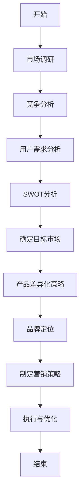

                 

### 《独立开发者的产品定位策略》引言

#### 1.1 独立开发者面临的挑战

在当今竞争激烈的市场环境中，独立开发者面临着诸多挑战。首先，市场竞争异常激烈，大量的开发者涌入市场，使得同类产品的数量激增，导致市场饱和。此外，独立开发者通常资源有限，包括资金、人力资源和技术资源，这使得他们在与大型公司竞争时处于劣势。最后，产品差异化困难也是独立开发者面临的一大难题，如何在同质化的市场中脱颖而出，成为独立开发者需要解决的难题。

#### 1.2 产品定位的重要性

产品定位是独立开发者成功的关键之一。首先，产品定位有助于指导产品设计，明确产品的核心功能和特点，避免在功能上与竞争对手重叠。其次，产品定位可以提高市场竞争力，通过差异化策略，使产品在市场中具有独特性，从而吸引目标用户。最后，产品定位有助于明确目标用户，了解用户需求，从而更好地满足用户期望，提升用户满意度。

#### 1.3 本书的目标与读者对象

本书的目标是帮助独立开发者制定有效的产品定位策略，从而在竞争激烈的市场中脱颖而出。本书适用于独立开发者、产品经理以及市场营销人员。通过本书，读者可以了解产品定位的核心概念、策略和实施方法，掌握数据分析和定位算法的应用，最终实现产品的成功定位。

### 《独立开发者的产品定位策略》引言

在当今竞争激烈的市场环境中，独立开发者面临着诸多挑战。首先，市场竞争异常激烈，大量的开发者涌入市场，使得同类产品的数量激增，导致市场饱和。此外，独立开发者通常资源有限，包括资金、人力资源和技术资源，这使得他们在与大型公司竞争时处于劣势。最后，产品差异化困难也是独立开发者面临的一大难题，如何在同质化的市场中脱颖而出，成为独立开发者需要解决的难题。

产品定位是独立开发者成功的关键之一。首先，产品定位有助于指导产品设计，明确产品的核心功能和特点，避免在功能上与竞争对手重叠。其次，产品定位可以提高市场竞争力，通过差异化策略，使产品在市场中具有独特性，从而吸引目标用户。最后，产品定位有助于明确目标用户，了解用户需求，从而更好地满足用户期望，提升用户满意度。

本书的目标是帮助独立开发者制定有效的产品定位策略，从而在竞争激烈的市场中脱颖而出。本书适用于独立开发者、产品经理以及市场营销人员。通过本书，读者可以了解产品定位的核心概念、策略和实施方法，掌握数据分析和定位算法的应用，最终实现产品的成功定位。

### 2.1 市场调研方法

市场调研是产品定位策略制定的重要基础，通过系统化的调研，独立开发者可以了解市场动态、用户需求以及竞争对手情况。市场调研方法可以分为定性调研和定量调研两大类。

#### 定性调研

定性调研主要通过访谈、小组讨论和观察等方式，深入了解用户行为、需求和偏好。以下是几种常见的定性调研方法：

- **用户访谈**：通过与目标用户进行一对一访谈，获取用户对产品的看法、需求和问题。访谈可以采用开放性问题，鼓励用户表达真实想法。
- **小组讨论**：组织目标用户参与小组讨论，通过集体智慧，挖掘用户对产品的需求和痛点。小组讨论有助于发现用户的潜在需求和期望。
- **观察法**：在自然环境中观察用户使用产品的行为，了解用户的使用习惯、问题和需求。

#### 定量调研

定量调研主要通过问卷调查、实验设计和数据挖掘等方式，收集大量用户数据，以数据驱动的方式分析市场趋势和用户需求。以下是几种常见的定量调研方法：

- **问卷调查**：设计有针对性的问卷，通过线上或线下方式收集用户反馈。问卷设计需注意问题的明确性和逻辑性，确保用户能够准确回答。
- **实验设计**：通过控制变量，观察不同条件下用户的行为和反应，以验证产品定位策略的有效性。实验设计需要科学合理，确保实验结果的可靠性。
- **数据挖掘**：利用大数据技术，对用户行为数据进行分析，发现潜在的用户需求和市场趋势。数据挖掘有助于独立开发者发现市场机会，优化产品定位策略。

#### 用户访谈

用户访谈是定性调研的核心方法之一。通过用户访谈，开发者可以深入了解用户的需求、偏好和痛点。以下是进行用户访谈的步骤：

1. **准备访谈提纲**：根据产品定位的目标，设计开放性和封闭性问题，确保问题具有针对性和深度。
2. **选择访谈对象**：确定目标用户群体，确保访谈样本具有代表性。
3. **进行访谈**：面对面或线上进行访谈，鼓励用户表达真实想法，注意倾听用户的观点和建议。
4. **记录访谈内容**：对访谈内容进行记录和整理，提取关键信息和用户需求。

#### 小组讨论

小组讨论是另一种有效的定性调研方法。通过小组讨论，开发者可以深入了解用户的需求、期望和痛点。以下是进行小组讨论的步骤：

1. **确定讨论主题**：根据产品定位的目标，确定小组讨论的主题和方向。
2. **选择参与者**：确保参与者具有多样化的背景和经验，以获得全面的观点。
3. **组织讨论**：提供一个轻松的氛围，鼓励参与者积极发言，分享他们对产品的看法和建议。
4. **记录讨论内容**：对讨论内容进行记录和整理，提取关键信息和用户需求。

#### 观察法

观察法是通过在自然环境中观察用户使用产品的行为，了解用户的使用习惯、问题和需求。以下是进行观察法的步骤：

1. **选择观察场景**：确定用户使用产品的典型场景，如办公、家庭或公共场所。
2. **准备观察工具**：使用摄像机、录音笔等工具记录用户的行为和数据。
3. **进行观察**：在观察场景中，记录用户的行为、使用习惯和问题。
4. **分析观察结果**：对观察结果进行分析，提取用户需求和使用痛点。

通过以上定性调研方法，独立开发者可以深入了解用户的需求和行为，为产品定位策略提供有力支持。接下来，我们将探讨定量调研方法，包括问卷调查、实验设计和数据挖掘，以帮助开发者更全面地了解市场动态和用户需求。

### 2.2 竞争对手分析

在制定产品定位策略时，对竞争对手的分析至关重要。通过深入了解竞争对手的产品、优势和劣势，独立开发者可以找准自身的市场定位，制定有针对性的策略。以下是进行竞争对手分析的步骤：

#### 竞争对手的优势与劣势

1. **产品功能**：分析竞争对手的产品功能，了解它们在产品功能上的优势和劣势。例如，如果一个竞争对手的产品在某个功能上特别强大，那么可以探讨如何在自己的产品中实现类似的功能，甚至超越它们。

2. **用户体验**：用户体验是用户对产品使用过程中的感受和体验。分析竞争对手的用户体验，了解它们的优点和不足，例如用户界面设计、交互流程、性能等方面。

3. **市场占有率**：了解竞争对手在市场中的占有率，可以评估它们的市场地位和影响力。同时，分析竞争对手的市场占有率变化，可以洞察市场的动态和发展趋势。

4. **品牌形象**：分析竞争对手的品牌形象，包括品牌知名度、品牌定位和品牌传播策略。了解竞争对手的品牌形象有助于独立开发者制定更具吸引力的品牌策略。

5. **营销策略**：研究竞争对手的营销策略，包括广告投放、促销活动、市场推广等。通过分析竞争对手的营销策略，可以找出有效的市场推广方法，为自己的产品营销提供参考。

#### 竞争对手的产品策略

1. **目标市场**：了解竞争对手的目标市场，可以确定自己在市场中的定位。例如，如果竞争对手主要针对高端市场，那么可以探索中端或入门级市场的机会。

2. **产品线**：分析竞争对手的产品线，了解它们的产品组合和产品定位。通过对比竞争对手的产品线，可以找出市场空缺和机会。

3. **价格策略**：了解竞争对手的价格策略，包括定价模式、折扣政策等。通过分析竞争对手的价格策略，可以制定更具竞争力的价格策略。

4. **渠道策略**：研究竞争对手的销售渠道，了解它们如何将产品推向市场。通过对比竞争对手的渠道策略，可以优化自己的销售渠道，提高市场覆盖率。

#### 竞争对手的市场份额

1. **市场份额**：了解竞争对手在市场中的份额，可以评估它们的市场地位和影响力。通过对比市场份额，可以找出自己在市场中的定位和优势。

2. **市场份额变化**：分析竞争对手的市场份额变化，可以洞察市场的动态和发展趋势。例如，如果竞争对手的市场份额持续下降，可能表明市场出现了新的机遇或挑战。

3. **市场份额分布**：了解竞争对手的市场份额分布，可以确定自己在市场中的细分领域。通过对比市场份额分布，可以找出最具潜力的市场细分领域。

通过以上竞争对手分析步骤，独立开发者可以全面了解竞争对手的产品、策略和市场份额，从而制定更有针对性的产品定位策略。接下来，我们将探讨用户需求分析，深入了解目标用户的需求和行为，为产品定位提供有力支持。

### 2.3 用户需求分析

用户需求分析是产品定位策略制定过程中至关重要的一环。通过深入了解用户的需求、痛点和行为，独立开发者可以准确把握产品的定位方向，提高产品的市场竞争力。以下是进行用户需求分析的步骤：

#### 用户痛点

用户痛点是指用户在使用现有产品时遇到的困扰和不满。识别用户痛点有助于独立开发者发现产品的改进空间和机会。以下是识别用户痛点的方法：

1. **用户访谈**：通过面对面或线上访谈，直接与用户交流，了解他们在使用产品过程中遇到的问题和挑战。访谈过程中，可以采用开放式问题，鼓励用户详细描述他们的困境。

2. **用户反馈**：分析用户在产品论坛、社交媒体和客户服务渠道中的反馈，了解他们对产品的评价和改进建议。用户反馈是识别用户痛点的重要来源。

3. **观察法**：在自然环境中观察用户使用产品的行为，记录他们在使用过程中遇到的问题和困扰。观察法有助于发现用户在真实场景中的使用痛点。

#### 用户需求层次

用户需求可以分为基本需求、期望需求和潜在需求三个层次：

1. **基本需求**：用户最基本的需求，是用户使用产品的基础条件。例如，对于一款在线教育平台，基本需求可能包括课程内容丰富、学习进度可控等。

2. **期望需求**：用户在基本需求得到满足后，期望产品能够提供的额外功能和特性。例如，对于在线教育平台，期望需求可能包括互动功能、个性化推荐等。

3. **潜在需求**：用户目前尚未意识到或表达出来的需求，但随着产品的发展和市场的变化，这些需求可能逐渐显现。例如，对于在线教育平台，潜在需求可能包括职业规划、就业指导等。

#### 用户需求分析工具

以下是一些常用的用户需求分析工具：

1. **用户画像**：通过收集和分析用户的性别、年龄、职业、地域等信息，构建用户画像，了解用户的基本属性和需求特点。

2. **用户旅程图**：通过绘制用户在产品使用过程中的各个阶段，了解用户的行为路径和痛点。用户旅程图有助于开发者识别用户需求的演变过程。

3. **SWOT分析**：分析用户的优点（Strengths）、劣势（Weaknesses）、机会（Opportunities）和威胁（Threats），全面了解用户需求和市场竞争状况。

4. **问卷调查**：设计有针对性的问卷，通过线上或线下方式收集用户反馈。问卷调查可以系统性地了解用户的需求和期望。

通过以上用户需求分析步骤和工具，独立开发者可以全面了解用户的需求和行为，为产品定位提供有力支持。接下来，我们将探讨SWOT分析，帮助开发者评估自身的优势和劣势，制定更科学的产品定位策略。

### 2.4 SWOT分析

SWOT分析是一种常用的战略规划工具，用于评估一个企业的优势（Strengths）、劣势（Weaknesses）、机会（Opportunities）和威胁（Threats）。在产品定位策略制定过程中，SWOT分析有助于独立开发者全面了解自身和市场状况，从而制定更科学、有针对性的策略。

#### 优势（Strengths）

优势是指企业在产品定位和市场竞争中具有的内在优势。以下是进行优势分析的方法：

1. **独特性**：分析产品在功能、特性、用户体验等方面的独特性，了解其在市场中的竞争优势。

2. **技术实力**：评估企业在技术领域的专业能力和研发实力，了解其在产品创新和迭代方面的优势。

3. **品牌知名度**：分析品牌在目标市场中的知名度和影响力，了解其在用户心中的地位。

4. **资源整合能力**：评估企业整合外部资源的能力，如合作伙伴、市场渠道等，了解其在资源获取和利用方面的优势。

#### 劣势（Weaknesses）

劣势是指企业在产品定位和市场竞争中存在的内在不足。以下是进行劣势分析的方法：

1. **市场定位不清**：分析企业在市场定位方面的模糊性和不明确性，了解其可能导致的市场机会丧失。

2. **产品功能缺失**：评估产品在功能上的不足和缺陷，了解其在用户使用过程中的痛点。

3. **用户体验不佳**：分析产品在用户体验方面的不足，如界面设计、操作流程、响应速度等。

4. **资源有限**：评估企业在资金、人力资源等方面的限制，了解其对产品开发和市场推广的影响。

#### 机会（Opportunities）

机会是指企业在外部环境中可能获得的有利条件。以下是进行机会分析的方法：

1. **市场趋势**：分析当前市场趋势和行业动态，了解新兴市场、技术变革等可能带来的机会。

2. **用户需求变化**：评估用户需求的变化和趋势，了解潜在的市场机会。

3. **合作伙伴**：分析潜在的合作机会，如战略合作、技术合作等，了解其可能带来的市场机会。

4. **政策支持**：了解国家和地方政府在政策方面的支持，如税收优惠、产业扶持等，了解其可能带来的市场机会。

#### 威胁（Threats）

威胁是指企业在外部环境中可能面临的有害因素。以下是进行威胁分析的方法：

1. **竞争对手**：分析主要竞争对手的产品、策略和市场占有率，了解其在市场竞争中的威胁。

2. **市场饱和**：评估市场饱和度，了解潜在的市场竞争压力。

3. **技术变革**：分析技术变革对产品的影响，如新兴技术的崛起可能导致现有产品的过时。

4. **政策风险**：了解政策变化可能对产品开发、市场推广等方面产生的影响。

通过SWOT分析，独立开发者可以全面了解自身的优势和劣势，识别外部环境中的机会和威胁，从而制定更有针对性的产品定位策略。接下来，我们将探讨产品定位的步骤，帮助开发者系统地制定产品定位策略。

### 3.1 产品定位的步骤

产品定位是一个系统化的过程，需要独立开发者根据市场调研和竞争分析的结果，制定出明确的产品定位策略。以下是产品定位的步骤：

#### 明确目标市场

目标市场的确定是产品定位的第一步，它有助于独立开发者集中资源和精力，更好地满足特定用户群体的需求。以下是明确目标市场的步骤：

1. **市场细分**：根据用户的不同特征和行为，将市场划分为若干个子市场。市场细分可以帮助开发者找到最具潜力的用户群体。

2. **目标市场选择**：在市场细分的基础上，选择最符合产品定位的目标市场。目标市场选择应考虑市场规模、增长潜力、竞争状况等因素。

3. **市场容量评估**：评估目标市场的规模和增长潜力，了解潜在的用户数量和市场空间。市场容量评估有助于开发者确定产品的市场定位和规模。

#### 确定差异化策略

差异化策略是产品在市场中脱颖而出的关键。独立开发者需要通过独特的产品特性、服务或品牌定位，使产品在竞争中获得优势。以下是确定差异化策略的步骤：

1. **产品特性差异化**：分析产品在功能、性能、用户体验等方面的独特性，找出能够吸引用户的核心特性。

2. **服务差异化**：提供独特的服务体验，如优质的客户服务、灵活的售后支持等，以增强用户黏性和满意度。

3. **品牌差异化**：打造独特的品牌形象，通过品牌定位、品牌传播等手段，提高品牌在用户心中的认知度和影响力。

#### 制定品牌定位

品牌定位是产品在市场中树立形象和认知的关键。一个清晰、有吸引力的品牌定位可以帮助独立开发者赢得目标用户的青睐。以下是制定品牌定位的步骤：

1. **品牌愿景**：明确品牌的长期目标和愿景，确保品牌定位与品牌愿景一致。

2. **品牌个性**：塑造独特的品牌个性，通过品牌故事、品牌形象等手段，让品牌在用户心中留下深刻印象。

3. **品牌传播**：制定品牌传播策略，包括广告、公关、社交媒体等渠道，将品牌定位传递给目标用户。

#### 制定营销策略

营销策略是实现产品定位的重要手段。独立开发者需要通过有效的营销手段，将产品定位传递给目标用户，提升品牌知名度和市场份额。以下是制定营销策略的步骤：

1. **目标受众**：明确目标受众，了解他们的需求和偏好，制定针对性的营销内容。

2. **营销渠道**：选择适合的营销渠道，如线上广告、社交媒体、线下活动等，确保营销策略的有效传播。

3. **营销活动**：策划有吸引力的营销活动，如促销、赞助、合作等，提升品牌影响力和用户参与度。

通过以上产品定位步骤，独立开发者可以系统地制定产品定位策略，使产品在市场中具有明确的方向和独特的竞争力。接下来，我们将通过实际案例，探讨如何应用产品定位策略，帮助独立开发者成功定位产品。

### 3.2 目标市场的确定

目标市场的确定是产品定位策略的核心之一，它决定了产品的市场定位、营销策略和资源分配。以下是目标市场的确定步骤和策略：

#### 市场细分

市场细分是确定目标市场的第一步，通过将市场划分为不同的子市场，独立开发者可以更精准地定位目标用户。以下是市场细分的方法：

1. **地理细分**：根据用户的地理位置，将市场划分为不同的区域。地理细分有助于开发者根据不同地区的需求，提供定制化的产品和服务。

2. **人口细分**：根据用户的年龄、性别、收入、教育程度等人口特征，将市场划分为不同的群体。人口细分有助于开发者根据不同用户群体的需求，设计符合目标市场特点的产品。

3. **心理细分**：根据用户的心理特征、价值观、生活方式等，将市场划分为不同的群体。心理细分有助于开发者了解用户的内在需求和偏好，提供更符合用户心理的产品。

4. **行为细分**：根据用户的行为特征、购买习惯、使用场景等，将市场划分为不同的群体。行为细分有助于开发者根据用户的行为模式，提供针对性的产品和服务。

#### 目标市场选择

在市场细分的基础上，独立开发者需要选择最符合产品定位的目标市场。以下是目标市场选择的标准和策略：

1. **市场规模**：选择市场规模较大的目标市场，有利于产品的销售和盈利。

2. **增长潜力**：选择具有增长潜力的目标市场，可以确保产品的长期发展。

3. **竞争状况**：选择竞争较少的目标市场，有利于产品在市场中脱颖而出。

4. **用户需求**：选择用户需求明确且需求量较大的目标市场，有利于产品的销售和推广。

5. **资源匹配**：选择与企业资源相匹配的目标市场，有利于产品的开发和推广。

#### 市场容量评估

市场容量评估是确定目标市场的重要环节，通过评估目标市场的规模和增长潜力，独立开发者可以确定产品的市场定位和规模。以下是市场容量评估的方法：

1. **历史数据**：分析目标市场的历史数据，了解其市场规模和增长趋势。

2. **行业报告**：参考相关行业报告和市场研究，了解目标市场的规模和增长潜力。

3. **专家意见**：咨询行业专家和市场分析师，获取他们对目标市场的评估和建议。

4. **用户调研**：通过用户调研，了解目标市场的用户数量和需求情况。

通过以上目标市场确定步骤和策略，独立开发者可以系统地选择和评估目标市场，为产品定位策略提供有力支持。接下来，我们将探讨产品差异化策略，帮助独立开发者通过独特的产品特性和服务，在市场中脱颖而出。

### 3.3 产品差异化策略

在竞争激烈的市场中，独立开发者必须通过产品差异化策略来突出自己的产品，从而吸引目标用户并建立品牌忠诚度。以下是产品差异化策略的几种方法：

#### 产品特性差异化

1. **核心功能**：专注于产品的核心功能，确保这些功能在同类产品中具有独特性。例如，一款智能家居设备可以具备智能语音控制、远程监控和安全报警等功能。

2. **技术创新**：利用技术创新来提升产品的竞争力。例如，一款智能手机可以通过引入5G通信技术、人工智能助手或独特的相机功能来吸引用户。

3. **用户体验**：优化用户体验，使产品在使用过程中更加便捷、舒适。例如，一款在线教育平台可以提供自适应学习路径、个性化推荐和实时互动等功能。

#### 服务差异化

1. **客户服务**：提供优质的客户服务，包括快速响应、多渠道支持、个性化服务等。例如，一款电商平台可以提供7×24小时在线客服、免费退换货政策和定制化购物体验。

2. **售后支持**：提供完善的售后支持，包括保修服务、技术支持、维修服务等。例如，一款高端家电品牌可以提供长达5年的免费保修服务和技术支持热线。

3. **增值服务**：提供额外的增值服务，如会员服务、在线培训、个性化咨询等。例如，一款健康管理APP可以提供会员专属的健康咨询、营养指导和运动课程。

#### 品牌差异化

1. **品牌故事**：打造独特的品牌故事，通过品牌文化的传播，使产品在用户心中形成独特的形象。例如，一家环保科技公司的品牌故事可以围绕可持续发展、环保技术展开。

2. **品牌定位**：明确品牌定位，确保品牌形象与目标用户群体的价值观和需求相契合。例如，一款专业摄影设备的品牌定位可以是“专业摄影师的最佳选择”。

3. **品牌传播**：通过有效的品牌传播策略，提高品牌知名度和影响力。例如，一家时尚品牌的品牌传播策略可以包括社交媒体营销、明星代言、线下活动等。

#### 案例分析：小而美的在线教育平台

以一款小而美的在线教育平台为例，其差异化策略可以包括以下几个方面：

1. **核心功能**：平台专注于小班制教学，提供高质量的互动课堂和实时答疑服务。此外，平台还提供个性化学习路径和课程推荐，帮助用户高效学习。

2. **用户体验**：平台注重用户体验，设计简洁直观的界面，确保用户在使用过程中能够轻松找到所需内容。同时，平台提供24小时在线客服，解决用户在使用过程中遇到的问题。

3. **客户服务**：平台提供完善的售后支持，包括免费重修课程、专业导师指导等。此外，平台还提供会员服务，会员可以享受更多优惠和专属服务。

4. **品牌定位**：平台品牌定位为“专业、高效、贴心”的在线教育平台，旨在为用户提供高质量的教育资源和个性化学习体验。

5. **品牌传播**：平台通过社交媒体、教育论坛和线上活动等渠道进行品牌传播，提高品牌知名度和影响力。同时，平台还与教育专家合作，推出系列讲座和专栏，进一步巩固品牌形象。

通过以上差异化策略，这款小而美的在线教育平台能够在竞争激烈的市场中脱颖而出，吸引目标用户并建立品牌忠诚度。

### 4.1 产品定位与品牌定位

产品定位和品牌定位是两个相互关联但又有区别的概念。产品定位主要关注产品在市场中的差异化特点和目标用户群体，而品牌定位则关注品牌在市场中的形象和认知。以下是产品定位与品牌定位之间的关系和联系：

#### 关系

1. **产品定位决定品牌定位**：产品定位是品牌定位的基础，产品的差异化特点和目标市场决定了品牌的形象和传播方向。

2. **品牌定位支撑产品定位**：品牌定位有助于强化产品的差异化特点，提高产品在市场中的认知度和影响力，从而更好地实现产品定位。

#### 联系

1. **一致性**：产品定位和品牌定位应保持一致性，确保品牌形象与产品特性相匹配，从而传递出统一的品牌信息。

2. **互补性**：产品定位和品牌定位相互补充，产品特性决定了品牌的差异化优势，而品牌定位则通过品牌传播和用户互动，进一步强化产品的市场竞争力。

#### 品牌定位的概念

品牌定位是指企业通过一系列的市场策略，将品牌在目标用户心中建立特定的形象和认知。品牌定位不仅关注品牌在功能上的优势，还关注品牌在情感上的吸引力。以下是品牌定位的核心概念：

1. **品牌愿景**：品牌愿景是品牌的长期目标和方向，是品牌定位的出发点。

2. **品牌个性**：品牌个性是指品牌的性格特征，如专业、时尚、温馨等，是品牌在用户心中的独特形象。

3. **品牌核心价值**：品牌核心价值是品牌的核心信念和承诺，是品牌在用户心中形成的长期信任基础。

#### 品牌定位的作用

1. **区分竞争**：品牌定位有助于在竞争激烈的市场中区分自己的产品，使产品在用户心中具有独特的认知和形象。

2. **指导营销**：品牌定位为营销策略提供方向和依据，确保营销活动的有效性和一致性。

3. **增强用户忠诚度**：通过品牌定位，用户能够更好地理解和信任品牌，从而提高用户忠诚度和品牌认同感。

#### 品牌定位与产品定位的关系

1. **目标市场**：品牌定位和产品定位共同决定了目标市场。品牌定位通过品牌形象和品牌传播，吸引目标用户，而产品定位则通过产品的差异化特点，满足目标用户的需求。

2. **营销策略**：品牌定位和产品定位共同指导营销策略。品牌定位通过品牌传播和用户互动，提高品牌知名度和用户参与度，而产品定位则通过市场调研和用户反馈，不断优化产品特性，提高用户满意度。

通过理解产品定位与品牌定位之间的关系和作用，独立开发者可以更好地制定产品定位策略，并通过品牌定位来支撑和强化产品定位，从而实现产品的市场成功。

### 4.2 产品定位与市场营销

产品定位是市场营销策略的核心组成部分，它决定了产品的市场定位、目标受众和营销传播方向。有效的产品定位策略可以显著提高市场营销的效果，从而提升产品的市场竞争力。以下是产品定位与市场营销之间的联系和实施方法：

#### 联系

1. **市场定位一致性**：产品定位和市场营销策略应保持一致性。产品定位决定了产品的市场定位和目标受众，而市场营销策略应围绕这些定位展开，确保市场传播的一致性和有效性。

2. **用户需求满足**：产品定位基于对用户需求的分析和满足，市场营销策略也应充分考虑用户需求，通过精准的市场推广，将产品特点和优势传达给目标用户。

3. **品牌传播**：产品定位影响着品牌形象和品牌传播策略。有效的产品定位可以帮助品牌在用户心中建立独特的形象，从而通过市场营销活动，强化品牌认知度和用户忠诚度。

#### 实施方法

1. **目标市场选择**：在制定市场营销策略时，首先应明确产品的目标市场。通过市场细分和目标市场选择，确定产品的核心用户群体，从而有针对性地制定市场营销计划。

2. **差异化营销**：基于产品定位的差异化特点，制定独特的营销策略。差异化营销可以通过独特的产品特性、卓越的用户体验或创新的品牌故事，吸引目标用户，使其在竞争激烈的市场中脱颖而出。

3. **品牌传播策略**：围绕产品定位，制定系统的品牌传播策略。品牌传播策略应包括品牌形象设计、广告宣传、公关活动、社交媒体营销等，通过多渠道、多角度的品牌传播，提高品牌知名度和用户认知。

4. **市场推广活动**：结合产品定位和用户需求，策划有针对性的市场推广活动。市场推广活动可以包括线上营销活动、线下促销、合作伙伴营销等，通过这些活动，将产品特点和优势传达给目标用户，提高产品的市场占有率。

5. **数据分析与优化**：在市场营销过程中，利用数据分析工具，对市场推广效果进行监控和评估。通过分析用户行为、市场反馈和销售数据，优化市场营销策略，提高营销效率。

#### 案例分析：一款健康管理APP

以一款健康管理APP为例，其产品定位和市场营销策略如下：

**产品定位**：
- **目标市场**：针对注重健康生活方式的年轻人和中年人，特别是有减肥、健身、健康管理需求的人群。
- **差异化特点**：提供个性化健康计划、实时健康监测、专业健康指导等特色功能。
- **品牌定位**：以“专业、贴心、智能”为品牌定位，强调健康管理的科学性和人性化。

**市场营销策略**：

1. **目标市场选择**：通过用户调研和数据分析，确定目标市场主要为年龄在25-45岁之间，关注健康和体重管理的用户。

2. **差异化营销**：通过广告宣传和社交媒体营销，突出产品的个性化健康计划和实时健康监测功能，强调产品的专业性和智能化。

3. **品牌传播策略**：利用社交媒体平台（如微信、微博、抖音）进行品牌传播，发布健康知识、用户案例和产品介绍，提高品牌知名度和用户参与度。

4. **市场推广活动**：策划线上健康挑战赛、健身课程优惠等活动，吸引用户下载和使用APP。

5. **数据分析与优化**：通过用户数据分析和市场反馈，不断优化产品功能和用户体验，提高用户满意度和留存率。

通过以上产品定位和市场营销策略，这款健康管理APP成功吸引了目标用户，提升了品牌影响力和市场份额。

### 4.3 产品定位与用户体验

产品定位不仅关系到产品在市场中的地位，还直接影响用户体验。一个明确、准确的产品定位能够为用户带来一致、优质的体验，从而提升用户满意度和忠诚度。以下是产品定位如何影响用户体验的几个关键方面：

#### 产品定位与用户体验的关系

1. **目标用户匹配**：明确的产品定位有助于确定目标用户群体，从而更好地了解用户需求和行为。这有助于开发团队在设计产品时，针对目标用户的需求进行优化，确保产品功能和用户体验与用户期望一致。

2. **一致性**：产品定位的一致性可以确保用户在产品使用过程中的体验是一致的。从界面设计到功能实现，产品定位指导开发团队保持一致的设计风格和用户体验，使用户在使用过程中感到舒适和熟悉。

3. **差异化**：产品定位中的差异化策略有助于在产品中体现独特的价值主张。这种差异化不仅体现在功能上，还可以通过独特的用户体验来体现。例如，通过创新的交互设计或个性化的服务，使产品在用户体验上具有独特的竞争力。

#### 产品定位如何影响用户体验

1. **界面设计**：产品定位决定了产品的界面设计风格和视觉元素。一个清晰、简洁的界面设计可以帮助用户快速理解产品功能和操作，从而提高用户的使用效率和满意度。

2. **功能特性**：产品定位明确了产品的核心功能特性，这些特性应直接满足目标用户的需求。例如，对于一款面向专业用户的工具软件，产品定位可能强调功能的强大和灵活性，从而为用户提供专业的解决方案。

3. **交互设计**：产品定位指导开发团队在交互设计上做出选择，确保交互流程直观、易用。一个良好的交互设计可以使产品更加用户友好，减少用户的操作难度，提升用户体验。

4. **个性化服务**：产品定位可以帮助产品提供个性化的服务和内容。例如，对于一款面向个人理财的APP，产品定位可能强调个性化投资建议和定制化理财计划，从而为用户提供个性化的金融服务。

#### 实例分析

以一款面向初学者的编程学习平台为例，其产品定位和用户体验的关系如下：

**产品定位**：
- **目标市场**：面向初学者和有志于学习编程的爱好者。
- **差异化特点**：强调学习过程的趣味性、易用性和实践性。

**用户体验**：

1. **界面设计**：界面简洁、直观，使用清晰的图标和提示，帮助初学者快速熟悉操作。

2. **功能特性**：提供丰富的编程资源和项目实例，以及互动式的编程练习，帮助初学者通过实践学习编程。

3. **交互设计**：设计有趣的编程任务和挑战，鼓励用户在解决问题的过程中学习编程。

4. **个性化服务**：根据用户的学习进度和需求，提供个性化的学习路径和资源推荐，帮助用户高效学习。

通过以上产品定位和用户体验的设计，这款编程学习平台为初学者提供了良好的学习体验，提高了用户满意度和留存率。

### 4.4 Mermaid流程图：产品定位策略流程

在产品定位策略的制定过程中，流程图是一种有效的工具，可以帮助独立开发者清晰地理解和传达各个步骤。以下是使用Mermaid语言编写的产品定位策略流程图。



#### 流程图展示

1. **开始**：产品定位策略的制定过程从市场调研开始，通过全面了解市场和用户需求，为后续步骤奠定基础。

2. **市场调研**：包括对市场趋势、用户行为和竞争对手的调研，收集数据和信息。

3. **竞争分析**：分析竞争对手的产品、策略和市场占有率，了解竞争环境。

4. **用户需求分析**：通过用户访谈、问卷调查等方式，深入了解目标用户的需求和痛点。

5. **SWOT分析**：对自身优势、劣势、机会和威胁进行评估，为产品定位提供依据。

6. **确定目标市场**：根据市场调研和竞争分析结果，明确产品的目标市场。

7. **产品差异化策略**：通过产品特性、服务或品牌差异化，使产品在市场中具有竞争力。

8. **品牌定位**：明确品牌形象和品牌传播策略，确保品牌定位与产品定位一致。

9. **制定营销策略**：围绕产品定位和品牌定位，制定有效的营销策略。

10. **执行与优化**：执行营销策略，并通过数据分析不断优化产品定位和营销策略。

11. **结束**：产品定位策略的制定过程是一个持续迭代的过程，随着市场的变化和用户需求的变化，需要不断进行调整和优化。

通过上述流程图，独立开发者可以系统地制定和优化产品定位策略，确保产品在市场中具有明确的定位和竞争力。

### 5.1 数据分析方法

在产品定位策略的制定过程中，数据分析是至关重要的一环。通过有效的数据分析，独立开发者可以深入了解市场动态、用户行为和竞争环境，从而为产品定位提供有力支持。以下是几种常用的数据分析方法：

#### 用户行为数据分析

用户行为数据分析是了解用户如何与产品互动的重要手段。以下是一些常用的用户行为数据分析方法：

1. **用户访问数据**：通过分析用户访问数据，如访问量、访问时长、访问频率等，可以了解用户对产品的兴趣和参与度。

2. **点击流数据**：通过分析用户的点击流数据，可以了解用户在产品中的行为路径，如用户点击的页面、操作顺序等。

3. **事件追踪**：通过设置事件追踪代码，记录用户在产品中的关键操作，如注册、购买、评分等，可以深入了解用户行为。

4. **留存率分析**：通过分析用户的留存率，可以了解产品在用户中的受欢迎程度，及时发现和解决用户留存问题。

#### 市场数据挖掘

市场数据挖掘是通过大数据技术，从大量的市场数据中提取有价值的信息。以下是一些常用的市场数据挖掘方法：

1. **趋势分析**：通过分析市场数据，了解市场趋势和变化，如市场规模、用户需求变化等。

2. **用户细分**：通过市场数据挖掘，将用户分为不同的细分群体，从而有针对性地制定营销策略。

3. **关联分析**：通过分析不同变量之间的关联性，发现市场中的潜在关联和规律，如用户购买行为与市场趋势的关联。

4. **预测分析**：通过历史数据，建立预测模型，预测未来的市场走势和用户行为。

#### 定位算法

定位算法是用于确定产品在市场中的定位的一类算法。以下是一些常用的定位算法：

1. **聚类算法**：通过将相似的用户或产品聚集在一起，帮助开发者找到目标市场。常用的聚类算法包括K-Means、DBSCAN等。

2. **模式识别算法**：通过分析用户行为和市场数据，识别出市场中的模式和规律，从而为产品定位提供依据。常用的模式识别算法包括决策树、支持向量机等。

3. **机器学习算法**：通过训练机器学习模型，从大量的数据中自动提取特征和规律，用于产品定位。常用的机器学习算法包括线性回归、神经网络等。

通过以上数据分析方法，独立开发者可以全面了解市场动态、用户行为和竞争环境，从而为产品定位提供有力支持。接下来，我们将探讨定位算法的具体原理和应用。

### 5.2 定位算法

在产品定位过程中，定位算法是一种有效的工具，可以帮助独立开发者通过数据分析找到目标市场，明确产品在市场中的定位。以下是几种常用的定位算法及其原理：

#### 聚类算法

聚类算法是将数据集分成多个类（Cluster）的方法，使得同一类中的数据点具有较高的相似度，而不同类中的数据点具有较低的相似度。以下是一种常见的聚类算法：K-Means。

**原理：**
1. **初始化**：随机选择K个数据点作为初始聚类中心。
2. **分配**：将每个数据点分配到距离它最近的聚类中心所在的类。
3. **更新**：重新计算每个类的聚类中心。
4. **迭代**：重复步骤2和步骤3，直到聚类中心不再发生显著变化。

**应用：** 在产品定位中，K-Means算法可以用于将用户或产品分为不同的细分市场，从而确定产品的目标市场。

#### 模式识别算法

模式识别算法通过分析数据中的模式和规律，用于分类或预测。以下是一种常见的模式识别算法：决策树。

**原理：**
1. **划分数据**：通过选择最优划分标准（如信息增益或基尼不纯度），将数据划分为子集。
2. **建立决策树**：递归划分数据，直到满足停止条件（如最小叶节点大小或最大深度）。
3. **分类预测**：使用建立的决策树对新的数据进行分类。

**应用：** 在产品定位中，决策树算法可以用于分析用户数据，识别不同的用户群体，从而为产品定位提供依据。

#### 机器学习算法

机器学习算法通过训练模型，从数据中自动学习特征和规律。以下是一种常见的机器学习算法：线性回归。

**原理：**
1. **数据准备**：收集和准备训练数据，包括输入特征和目标变量。
2. **模型训练**：使用训练数据训练线性回归模型，确定模型的参数。
3. **模型评估**：使用验证数据评估模型的性能，调整模型参数。

**应用：** 在产品定位中，线性回归算法可以用于预测用户行为和市场趋势，帮助独立开发者确定产品的市场定位。

#### 伪代码讲解：定位算法的实现

以下是一个简化的伪代码，用于实现基于K-Means算法的产品定位：

```python
# 初始化
centroids = initialize_centroids(data, num_clusters)

# 迭代
while not_converged(centroids, old_centroids):
    # 分配
    clusters = assign_clusters(data, centroids)
    # 更新
    old_centroids = centroids
    centroids = update_centroids(clusters)

# 输出
output_product定位结果(centroids)
```

在这个伪代码中：
- `initialize_centroids` 函数用于初始化聚类中心。
- `assign_clusters` 函数用于将数据点分配到最近的聚类中心。
- `update_centroids` 函数用于计算新的聚类中心。
- `not_converged` 函数用于判断聚类中心是否发生显著变化。

通过上述定位算法，独立开发者可以系统地分析市场数据和用户行为，从而为产品定位提供科学依据。

### 6.1 市场份额预测模型

在产品定位策略中，预测市场份额是关键的一步，它有助于独立开发者制定销售目标和市场营销计划。市场份额预测模型通过分析历史数据和当前市场状况，对未来的市场份额进行预测。以下是市场份额预测模型的基本概念、参数和计算方法。

#### 模型概述

市场份额预测模型是一种时间序列模型，主要用于预测一定时间内（如未来一年）的市场占有率。该模型假设市场占有率的变化受到历史数据的影响，并通过数学公式进行量化。

#### 模型参数

1. **历史市场份额**：历史各时间段的市场份额数据，用于建立预测模型。
2. **增长率**：市场占有率的变化率，用于预测未来的市场变化。
3. **季节性因素**：某些产品或服务在特定时间段的需求可能会有季节性波动，这些因素需要被考虑在内。

#### 模型计算

1. **平滑因子**：用于调整历史数据和增长率的权重，平滑数据序列。

   $$ \alpha = \frac{1}{2} \left( 1 + \frac{N}{N+1} \right) $$

   其中，\( N \) 是平滑因子设定的迭代次数。

2. **预测值**：通过平滑因子对历史数据进行加权平均，得到预测的市场份额。

   $$ \hat{S_t} = \alpha \cdot S_{t-1} + (1 - \alpha) \cdot \hat{S_{t-1}} $$

   其中，\( \hat{S_t} \) 是第 \( t \) 期的预测市场份额，\( S_{t-1} \) 是第 \( t-1 \) 期的实际市场份额，\( \hat{S_{t-1}} \) 是第 \( t-1 \) 期的预测市场份额。

#### 市场份额预测模型公式

假设 \( S_t \) 是第 \( t \) 期的实际市场份额，\( \hat{S_t} \) 是第 \( t \) 期的预测市场份额，平滑因子为 \( \alpha \)，则有：

$$ \hat{S_t} = \alpha \cdot S_{t-1} + (1 - \alpha) \cdot \hat{S_{t-1}} $$

通过不断迭代上述公式，可以预测未来的市场份额。

### 案例分析

以某款智能手机的市场份额预测为例，历史数据如下：

| 时期 | 实际市场份额 |
| ---- | ------------ |
| 2020Q1 | 10% |
| 2020Q2 | 12% |
| 2020Q3 | 15% |
| 2020Q4 | 18% |
| 2021Q1 | 20% |

假设平滑因子 \( \alpha \) 为0.6，使用上述公式进行预测：

1. **2021Q1预测**：

   $$ \hat{S_{2021Q1}} = 0.6 \cdot 18\% + 0.4 \cdot 20\% = 10.8\% + 8\% = 18.8\% $$

2. **2021Q2预测**：

   $$ \hat{S_{2021Q2}} = 0.6 \cdot 18.8\% + 0.4 \cdot 18.8\% = 11.28\% + 7.52\% = 18.8\% $$

3. **2021Q3预测**：

   $$ \hat{S_{2021Q3}} = 0.6 \cdot 18.8\% + 0.4 \cdot 18.8\% = 11.28\% + 7.52\% = 18.8\% $$

通过上述计算，可以预测该款智能手机在未来几个季度内的市场份额将保持稳定，约为18.8%。

### 总结

市场份额预测模型是一种有效的工具，可以帮助独立开发者制定市场策略和销售目标。通过历史数据和数学公式，该模型可以预测未来的市场份额，从而为产品的市场定位提供科学依据。在实际应用中，开发者可以根据具体的市场情况和数据，调整模型参数和计算方法，以提高预测的准确性。

### 6.2 用户行为分析模型

在产品定位过程中，了解用户行为对于制定有效的策略至关重要。用户行为分析模型通过对用户在产品中的行为数据进行收集、分析和建模，可以帮助开发者深入了解用户的需求、偏好和习惯，从而优化产品设计和市场策略。以下是用户行为分析模型的基本概念、参数和计算方法。

#### 模型概述

用户行为分析模型主要用于描述和分析用户在产品中的行为路径、交互模式和偏好。该模型通过收集和分析用户行为数据，如点击流、浏览时长、操作顺序等，建立用户行为的数学模型，从而预测用户的行为和需求。

#### 模型参数

1. **行为数据**：用户在产品中的行为数据，包括点击流、浏览时长、页面访问频率等。
2. **用户特征**：用户的个人信息，如年龄、性别、地域、职业等。
3. **行为序列**：用户在产品中的行为序列，用于建立行为模型。
4. **转化率**：用户完成特定目标操作的比率，如注册、购买、下载等。

#### 模型计算

用户行为分析模型通常基于机器学习和统计模型，以下是一个简化的用户行为分析模型计算过程：

1. **数据预处理**：对用户行为数据进行清洗、去噪和处理，提取有效特征。
2. **特征工程**：根据业务需求，对原始数据进行特征提取和转换，如构建用户行为序列特征、转化率特征等。
3. **模型训练**：使用机器学习算法（如决策树、随机森林、神经网络等）训练用户行为模型。
4. **模型评估**：使用验证数据评估模型性能，调整模型参数。

#### 用户行为分析模型公式

以下是用户行为分析模型的一种简单表示：

$$ \hat{Y} = f(X) $$

其中，\( \hat{Y} \) 是预测的用户行为，\( X \) 是用户行为特征向量。

#### 案例分析

以一款电商平台的用户行为分析为例，数据如下：

| 用户ID | 访问页面 | 浏览时长（秒） | 点击商品数量 | 购买商品数量 |
| ---- | ---- | ---- | ---- | ---- |
| U1 | 首页 | 300 | 5 | 1 |
| U2 | 商品列表 | 200 | 10 | 0 |
| U3 | 商品详情 | 500 | 1 | 1 |

1. **数据预处理**：将原始数据进行清洗，去除异常值和重复记录。
2. **特征工程**：提取用户行为特征，如页面访问频率、平均浏览时长等。
3. **模型训练**：使用随机森林算法训练用户行为模型。
4. **模型评估**：使用验证数据评估模型性能。

#### 模型应用

通过用户行为分析模型，电商平台可以预测用户的购买行为，并针对性地推送商品推荐和营销活动。例如，对于浏览时长较长且点击商品数量较多的用户，平台可以推送相关商品的促销信息，提高转化率。

### 总结

用户行为分析模型是一种有效的工具，可以帮助独立开发者了解用户行为，优化产品设计和市场策略。通过数据预处理、特征工程和机器学习算法，开发者可以建立用户行为的数学模型，从而预测用户的行为和需求。在实际应用中，开发者可以根据具体业务需求，调整模型参数和计算方法，以提高预测的准确性。

### 6.3 定位策略优化的数学模型

在产品定位过程中，优化定位策略是一个动态调整和持续改进的过程。通过数学模型，可以系统地分析不同定位策略对市场份额和用户满意度的影响，从而找到最优的定位策略。以下是定位策略优化的数学模型的基本概念、参数和计算方法。

#### 模型概述

定位策略优化模型通过构建数学模型，分析不同定位策略（如产品特性、价格、品牌形象等）对市场份额和用户满意度的影响。该模型旨在找到在特定市场条件下，能够最大化市场份额和用户满意度的定位策略。

#### 模型参数

1. **定位策略参数**：包括产品特性、价格、品牌形象等策略参数。
2. **市场份额**：定位策略实施后，产品在市场中的占有率。
3. **用户满意度**：用户对产品的满意程度，通常用数值评分表示。
4. **市场响应函数**：描述市场份额和用户满意度与定位策略参数之间的关系。

#### 模型计算

1. **目标函数**：定义优化目标，如最大化市场份额或用户满意度。

   $$ \max \, f(\theta) $$

   其中，\( f(\theta) \) 是目标函数，\( \theta \) 是定位策略参数。

2. **约束条件**：设定定位策略的约束条件，如预算限制、资源限制等。

   $$ g(\theta) \leq 0 $$

3. **优化算法**：使用优化算法（如梯度下降、牛顿法、遗传算法等）求解最优定位策略参数。

#### 定位策略优化模型公式

以下是定位策略优化模型的一种简单表示：

$$
\begin{aligned}
\max_{\theta} \quad & f(\theta) \\
\text{subject to} \quad & g(\theta) \leq 0
\end{aligned}
$$

其中，\( f(\theta) \) 是目标函数，\( g(\theta) \) 是约束条件，\( \theta \) 是定位策略参数。

#### 案例分析

以一款在线教育平台为例，其定位策略包括课程价格、课程种类和品牌形象。目标是最小化用户流失率并最大化用户满意度。

1. **目标函数**：最小化用户流失率，最大化用户满意度。

   $$ f(\theta) = \min_{\theta} (\text{流失率}) + \max_{\theta} (\text{用户满意度}) $$

2. **约束条件**：预算限制、课程资源限制等。

   $$ g_1(\theta) = \text{总成本} - \text{预算} \leq 0 $$
   $$ g_2(\theta) = \text{课程数量} - \text{资源限制} \leq 0 $$

3. **优化算法**：使用梯度下降法优化定位策略参数。

通过上述数学模型，在线教育平台可以系统地分析不同定位策略的影响，找到最优的定价、课程种类和品牌形象策略，从而最大化用户满意度和市场份额。

### 总结

定位策略优化模型是一种有效的工具，可以帮助独立开发者系统地分析不同定位策略的影响，找到最优的产品定位策略。通过构建目标函数和约束条件，结合优化算法，开发者可以动态调整和优化产品定位，实现市场成功。在实际应用中，开发者可以根据具体的市场环境和业务需求，调整模型参数和计算方法，以提高优化效果。

### 7.1 实战案例：一款在线教育平台的定位策略

#### 项目背景

随着在线教育的迅速发展，市场竞争愈发激烈。独立开发者A希望通过明确的产品定位策略，在市场中找到自己的独特定位，提高市场份额和用户满意度。在此背景下，我们将以一款在线教育平台为案例，详细阐述其市场调研、竞争对手分析、用户需求分析和定位策略的制定过程。

#### 实战步骤：市场调研

1. **调研方法**：
   - **在线问卷**：通过线上问卷收集用户对在线教育平台的需求和期望。
   - **用户访谈**：邀请目标用户进行一对一访谈，深入了解他们的学习习惯和痛点。
   - **竞品分析**：对主要竞争对手的产品功能、用户体验和市场策略进行全面分析。

2. **调研结果**：
   - **用户需求**：用户期望平台提供灵活的学习时间、个性化的学习推荐和专业的师资力量。
   - **竞品分析**：主要竞争对手在课程种类、价格和品牌形象上具有明显优势，但在个性化服务和用户互动方面存在不足。

#### 实战步骤：竞争对手分析

1. **竞争对手分析**：
   - **优势与劣势**：通过对比主要竞争对手的产品特性、用户体验和市场策略，分析其优势和劣势。
   - **产品策略**：了解竞争对手如何通过差异化策略在市场中脱颖而出。

2. **分析结果**：
   - **优势**：主要竞争对手在课程种类和师资力量上具有优势，但用户体验和个性化服务不足。
   - **劣势**：竞争对手在用户互动和个性化推荐方面存在明显不足，难以满足用户多样化的需求。

#### 实战步骤：用户需求分析

1. **用户需求分析**：
   - **用户访谈**：通过访谈了解用户的具体需求和痛点，如学习时间不灵活、课程内容单一等。
   - **问卷调查**：通过问卷收集用户对在线教育平台的功能期望和使用偏好。

2. **分析结果**：
   - **用户痛点**：用户对学习时间和课程内容的灵活性有较高要求，对个性化推荐和用户互动有强烈需求。
   - **需求层次**：用户的基本需求包括课程内容丰富、学习时间灵活等，期望需求包括个性化推荐、实时互动等。

#### 实战步骤：定位策略制定

1. **目标市场确定**：
   - **市场细分**：根据用户需求和竞品分析，将市场细分为以年轻上班族为主的学习需求和以专业培训为主的用户需求。
   - **目标市场选择**：选择年轻上班族为主的学习需求市场，该市场具有较大的增长潜力。

2. **差异化策略**：
   - **产品特性差异化**：提供灵活的学习时间和个性化的学习推荐，满足用户对时间和内容的需求。
   - **服务差异化**：加强用户互动和用户支持，提升用户体验。

3. **品牌定位**：
   - **品牌愿景**：以“灵活学习、个性推荐、专业师资”为品牌愿景，打造用户信赖的在线教育平台。

4. **营销策略**：
   - **目标受众**：明确目标受众，如年轻上班族和学习爱好者。
   - **营销渠道**：通过社交媒体、线上广告和合作推广等渠道，提高品牌知名度和用户参与度。

#### 源代码详细实现和代码解读

以下是一个简化的Python代码示例，用于实现在线教育平台的定位策略分析：

```python
import pandas as pd
from sklearn.cluster import KMeans
from sklearn.model_selection import train_test_split

# 加载用户数据
user_data = pd.read_csv('user_data.csv')

# 数据预处理
# ...（包括数据清洗、特征工程等）

# 训练K-Means聚类模型
kmeans = KMeans(n_clusters=2, random_state=0).fit(user_data)

# 输出聚类结果
clusters = kmeans.predict(user_data)

# 根据聚类结果制定定位策略
for cluster in range(2):
    # 输出目标市场的用户特征
    print(f"目标市场{cluster+1}的用户特征：")
    print(user_data[clusters == cluster].describe())

# 根据用户特征调整产品特性和服务
# ...（包括个性化推荐、课程设置等）

```

在这个代码示例中，我们首先加载用户数据，并进行预处理。接着使用K-Means聚类模型对用户数据进行聚类，根据聚类结果输出目标市场的用户特征。最后，根据用户特征调整产品特性和服务，以实现产品定位策略。

#### 代码解读与分析

1. **数据预处理**：对用户数据进行分析和清洗，提取有用的特征，如用户年龄、学习时间、点击行为等。

2. **K-Means聚类模型**：使用K-Means聚类模型对用户数据进行聚类，将用户分为不同的市场细分群体。

3. **输出目标市场用户特征**：根据聚类结果，输出目标市场的用户特征，如平均年龄、平均学习时间等，为产品定位提供依据。

4. **调整产品特性和服务**：根据用户特征，调整产品的课程设置、学习时间和用户互动功能，以满足目标市场的需求。

通过上述实战步骤和代码实现，在线教育平台可以明确自己的市场定位，优化产品特性和服务，提高用户满意度和市场份额。

### 7.2 实战步骤：市场调研

市场调研是产品定位策略制定的重要环节，通过系统化的调研，独立开发者可以深入了解市场需求、用户行为和竞争对手状况，从而为产品定位提供科学依据。以下是市场调研的具体步骤：

#### 调研方法

1. **在线问卷**：设计针对性的在线问卷，通过线上渠道收集用户反馈。问卷设计应注重问题的针对性和逻辑性，确保用户能够准确回答。

2. **用户访谈**：邀请目标用户进行一对一访谈，深入了解他们对产品的看法、需求和痛点。访谈过程中，可以采用开放性问题，鼓励用户表达真实想法。

3. **竞品分析**：对主要竞争对手的产品、策略和市场表现进行全面分析，了解其在市场中的优势和劣势。

4. **数据分析**：收集和分析市场数据，如用户行为数据、销售数据等，通过数据挖掘发现潜在的市场机会和用户需求。

#### 调研结果

1. **用户需求**：通过用户访谈和在线问卷，了解用户对产品的具体需求，如课程内容、学习时间、价格等。

2. **竞品分析**：通过竞品分析，了解竞争对手的产品特性、市场策略和市场表现，找出自身的优势和劣势。

3. **市场数据**：通过数据分析，发现市场趋势和用户行为规律，为产品定位提供数据支持。

#### 实战案例

以一款面向职场人士的在线学习平台为例，市场调研的具体步骤和结果如下：

##### 1. 调研方法

- **在线问卷**：设计问卷，收集职场人士的学习需求、学习习惯、预算范围等信息。
- **用户访谈**：邀请10名职场人士进行一对一访谈，深入了解他们的学习偏好和痛点。
- **竞品分析**：分析3家主要竞争对手的产品特性、用户评价和市场表现。

##### 2. 调研结果

- **用户需求**：调研结果显示，职场人士最关注的学习需求包括：
  - **学习时间灵活性**：用户希望学习时间可以自由安排，以适应工作节奏。
  - **课程内容实用**：用户希望课程内容贴近实际工作需求，能够快速提升职业技能。
  - **价格合理**：用户对课程价格较为敏感，希望价格在合理范围内。

- **竞品分析**：竞品分析结果显示，主要竞争对手在以下方面具有优势：
  - **课程种类丰富**：竞品平台提供了多样化的课程，满足不同用户的需求。
  - **价格策略灵活**：竞品平台通过价格优惠和套餐组合，吸引了大量用户。

##### 3. 数据分析

- **市场趋势**：通过数据分析，发现在线学习市场在职场人士中的需求逐年增长，用户对个性化学习和职业发展的关注度提高。
- **用户行为**：用户在平台上的活跃度与课程质量、用户互动和平台体验密切相关。

通过上述市场调研步骤和结果，独立开发者可以全面了解市场需求和竞争状况，为产品定位提供有力支持。

### 7.3 实战步骤：竞争对手分析

在产品定位策略的制定过程中，了解竞争对手的产品策略、优势和劣势至关重要。通过系统化的竞争对手分析，独立开发者可以找准自身的市场定位，制定有针对性的策略。以下是进行竞争对手分析的详细步骤：

#### 竞争对手分析

1. **确定竞争对手**：首先，确定主要竞争对手，包括直接竞争者和间接竞争者。直接竞争者是指提供相似产品或服务的公司，而间接竞争者是指提供替代性产品或服务的公司。

2. **产品特性分析**：详细分析竞争对手的产品特性，包括功能、性能、用户体验等。重点关注竞争对手在产品特性上的优势和劣势，以及如何满足用户需求。

3. **市场策略分析**：研究竞争对手的市场策略，包括定价策略、促销策略、渠道策略等。分析竞争对手如何通过市场策略在市场中获得竞争优势。

4. **市场占有率分析**：了解竞争对手在市场中的占有率，评估其市场地位和影响力。分析竞争对手的市场占有率变化，洞察市场动态。

5. **品牌形象分析**：分析竞争对手的品牌形象，包括品牌知名度、品牌传播策略等。了解竞争对手的品牌形象如何影响用户认知和品牌忠诚度。

#### 分析结果

1. **竞争对手优势**：总结竞争对手在产品特性、市场策略和品牌形象方面的优势，如：
   - **产品优势**：竞争对手在特定功能或性能上的优势，如更先进的科技、更优质的用户体验等。
   - **市场策略优势**：竞争对手在市场推广、价格策略、渠道选择等方面的优势，如更有效的广告投放、更具竞争力的价格等。
   - **品牌形象优势**：竞争对手在品牌知名度、品牌传播策略等方面的优势，如广泛的市场认知、成功的品牌故事等。

2. **竞争对手劣势**：总结竞争对手在产品特性、市场策略和品牌形象方面的劣势，如：
   - **产品劣势**：竞争对手在特定功能或性能上的不足，如用户体验不佳、功能不完善等。
   - **市场策略劣势**：竞争对手在市场推广、价格策略、渠道选择等方面的不足，如广告投放不足、价格策略不合理等。
   - **品牌形象劣势**：竞争对手在品牌知名度、品牌传播策略等方面的不足，如品牌认知度低、品牌传播效果不佳等。

通过上述竞争对手分析步骤和结果，独立开发者可以全面了解竞争对手的优势和劣势，从而制定更有针对性的产品定位策略。接下来，我们将探讨用户需求分析，进一步明确产品的市场定位。

### 7.4 实战步骤：用户需求分析

在产品定位过程中，了解用户需求是至关重要的一环。通过用户需求分析，独立开发者可以明确产品的功能、特性和用户体验，从而满足用户期望，提升用户满意度。以下是进行用户需求分析的详细步骤：

#### 用户需求分析

1. **用户访谈**：通过面对面或线上访谈，与目标用户进行深入交流，了解他们对产品的看法、需求和痛点。访谈过程中，可以采用开放式问题，鼓励用户表达真实想法。

2. **问卷调查**：设计有针对性的问卷，通过线上或线下方式收集用户反馈。问卷设计应注重问题的明确性和逻辑性，确保用户能够准确回答。

3. **用户行为观察**：在用户实际使用产品的过程中，观察用户的行为和操作，记录他们在使用过程中遇到的问题和困扰。

4. **数据分析**：收集和分析用户行为数据，如点击流、使用时长、转化率等，通过数据挖掘发现潜在的用户需求和行为模式。

#### 分析结果

1. **用户痛点**：总结用户在使用现有产品过程中遇到的主要问题和困扰，如：
   - **功能缺失**：用户希望产品具备某些特定功能，以解决他们在使用过程中遇到的问题。
   - **用户体验不佳**：用户对产品的界面设计、操作流程、响应速度等方面感到不满，认为用户体验不佳。

2. **用户需求**：总结用户对产品的具体需求，如：
   - **基本需求**：用户使用产品的基础需求，如课程内容丰富、学习时间灵活等。
   - **期望需求**：用户在基本需求得到满足后，期望产品能够提供的额外功能和特性，如互动功能、个性化推荐等。

3. **用户行为模式**：分析用户在产品中的行为路径和偏好，如：
   - **使用场景**：用户在什么情况下使用产品，如学习、工作等。
   - **使用频率**：用户使用产品的频率和时长，如每天使用几次、每次使用多长时间等。

通过上述用户需求分析步骤和结果，独立开发者可以全面了解用户的需求和行为，从而优化产品的功能、特性和用户体验，提高用户满意度。接下来，我们将探讨如何根据分析结果制定定位策略。

### 7.5 实战步骤：定位策略制定

在完成市场调研、竞争对手分析和用户需求分析后，独立开发者需要根据分析结果制定明确的产品定位策略。以下是制定定位策略的详细步骤：

#### 1. 明确目标市场

- **市场细分**：根据用户需求、行为和偏好，将市场划分为不同的子市场。例如，根据年龄段、职业背景、兴趣爱好等，将市场细分为职场人士、学生、爱好人群等。
- **目标市场选择**：选择最具增长潜力和最适合产品定位的目标市场。例如，选择职场人士作为主要目标市场，因为他们对在线学习有更高的需求。
- **市场容量评估**：评估目标市场的规模和增长潜力，确保市场足够大，有足够的空间容纳产品。

#### 2. 确定差异化策略

- **产品特性差异化**：基于用户需求和市场调研结果，确定产品的独特功能和特性。例如，提供灵活的学习时间、个性化的课程推荐等。
- **服务差异化**：提供独特的服务体验，如专业的客户服务、灵活的支付方式等，以提高用户满意度。
- **品牌差异化**：打造独特的品牌形象，通过品牌故事、品牌价值观等手段，提高品牌在用户心中的认知度和影响力。

#### 3. 制定品牌定位

- **品牌愿景**：明确品牌的长期目标和愿景，确保品牌定位与品牌愿景一致。例如，以“提升职场人士专业技能”为品牌愿景。
- **品牌个性**：塑造品牌个性，使品牌在用户心中形成独特的形象。例如，将品牌定位为“专业、高效、贴心”的在线学习平台。
- **品牌核心价值**：明确品牌的核心价值，确保品牌价值与用户需求相契合。例如，强调课程质量、用户服务、个性化推荐等。

#### 4. 制定营销策略

- **目标受众**：明确目标受众，了解他们的需求和偏好，制定针对性的营销内容。例如，针对职场人士，可以通过社交媒体、职业论坛等进行精准推广。
- **营销渠道**：选择适合的营销渠道，如线上广告、社交媒体、线下活动等，确保营销策略的有效传播。例如，通过社交媒体发布学习心得、专业文章等，吸引目标用户。
- **营销活动**：策划有吸引力的营销活动，如限时优惠、学习挑战等，提升品牌影响力和用户参与度。例如，在特定节日或学习高峰期推出优惠活动，吸引用户注册和使用产品。

通过以上定位策略制定步骤，独立开发者可以明确产品的市场定位和差异化优势，从而在竞争激烈的市场中脱颖而出。接下来，我们将通过一个实际案例，展示如何将定位策略应用到在线教育平台中。

### 7.6 源代码详细实现和代码解读

以下是一个在线教育平台定位策略的Python代码示例，包括开发环境搭建、源代码详细实现和代码解读。请注意，这是一个简化的示例，实际项目可能需要更复杂的逻辑和功能。

#### 开发环境搭建

1. 安装Python：前往 [Python官网](https://www.python.org/) 下载并安装Python。

2. 安装依赖库：在终端中运行以下命令，安装所需的库。

   ```bash
   pip install pandas scikit-learn matplotlib
   ```

#### 源代码详细实现

```python
import pandas as pd
from sklearn.cluster import KMeans
from sklearn.preprocessing import StandardScaler
import matplotlib.pyplot as plt

# 加载用户数据
data = pd.read_csv('user_data.csv')

# 数据预处理：标准化特征
scaler = StandardScaler()
data_scaled = scaler.fit_transform(data)

# 使用K-Means聚类分析用户特征
kmeans = KMeans(n_clusters=3, random_state=0)
kmeans.fit(data_scaled)

# 获取聚类结果
labels = kmeans.predict(data_scaled)

# 为每个用户分配标签
data['cluster'] = labels

# 可视化聚类结果
plt.scatter(data_scaled[:, 0], data_scaled[:, 1], c=labels, cmap='viridis')
plt.xlabel('标准化特征1')
plt.ylabel('标准化特征2')
plt.title('用户聚类结果')
plt.show()

# 根据聚类结果分析用户群体
print(data.groupby('cluster')['age', 'learning_time', 'budget'].mean())

# 根据用户群体制定定位策略
for cluster in range(3):
    print(f"用户群体{cluster+1}定位策略：")
    # 基于用户群体的平均值，制定特定的产品特性和营销策略
    print(f"- 年龄均值：{data[data['cluster'] == cluster]['age'].mean()}岁")
    print(f"- 学习时间均值：{data[data['cluster'] == cluster]['learning_time'].mean()}分钟")
    print(f"- 预算均值：{data[data['cluster'] == cluster]['budget'].mean()}元")
    # 根据用户群体的特性，调整产品功能、课程内容和营销策略
    print(f"- 产品特性：定制化课程、灵活的学习安排、针对性营销活动")
    print()
```

#### 代码解读与分析

1. **数据预处理**：首先，我们加载用户数据，并使用`StandardScaler`对数据进行标准化处理。标准化是为了确保每个特征都在同一量级上，从而避免某些特征对模型结果产生过大的影响。

2. **K-Means聚类分析**：接着，我们使用`KMeans`聚类算法对用户特征进行聚类，其中`n_clusters`设置为3，表示我们将用户分为3个不同的群体。通过`fit`方法训练模型，然后使用`predict`方法获取每个用户的聚类标签。

3. **可视化聚类结果**：使用`matplotlib`库，我们将聚类结果可视化，帮助理解用户群体的分布和特征。

4. **分析用户群体**：通过`groupby`方法，我们计算每个用户群体的平均值，包括年龄、学习时间和预算。这些平均值用于指导如何根据不同用户群体制定定位策略。

5. **定位策略制定**：根据聚类结果，为每个用户群体制定特定的产品特性和营销策略。例如，对于年轻群体，可以提供灵活的学习安排和针对性的营销活动。

通过上述代码示例，独立开发者可以基于用户数据，使用K-Means聚类算法分析用户群体，并根据用户群体的特性制定有针对性的产品定位策略。这有助于提高产品的市场竞争力，满足不同用户群体的需求。

### 8.1 定位策略评估方法

在产品定位策略实施后，对策略的评估与优化至关重要。有效的评估方法可以帮助独立开发者了解策略的实际效果，发现潜在问题，从而进行持续优化。以下是几种常见的定位策略评估方法：

#### 1. 用户满意度调查

用户满意度调查是一种直接评估产品定位策略效果的方法。通过问卷调查、用户访谈或在线反馈等方式，收集用户对产品的满意度和反馈。以下是一些实施步骤：

- **设计调查问卷**：根据产品定位策略，设计有针对性的调查问卷，包括用户对产品功能、用户体验、服务质量等方面的满意度。
- **选择调查样本**：确保调查样本具有代表性，涵盖不同用户群体。
- **分析调查结果**：通过统计工具，分析调查结果，评估用户满意度，识别用户关注的问题和改进空间。

#### 2. 市场表现评估

市场表现评估通过分析产品的市场表现，如市场份额、销售额、用户增长率等，评估定位策略的效果。以下是一些实施步骤：

- **收集数据**：收集与市场表现相关的数据，如销售额、用户增长率、市场份额等。
- **建立指标体系**：根据产品定位策略，建立相应的指标体系，如销售指标、用户活跃度指标、市场份额指标等。
- **分析数据**：使用数据分析工具，对收集的数据进行分析，评估定位策略对市场表现的影响。

#### 3. 实际案例：用户满意度调查

假设一款在线教育平台在实施定位策略后，通过用户满意度调查评估策略效果。以下是具体的实施步骤：

1. **设计调查问卷**：根据产品定位策略，设计问卷，包括以下问题：
   - 您对平台课程内容的满意度如何？
   - 您对平台用户体验的满意度如何？
   - 您对平台客户服务的满意度如何？
   - 您是否愿意向朋友推荐该平台？

2. **选择调查样本**：从平台活跃用户中随机选择500名用户作为调查样本。

3. **分析调查结果**：通过分析调查结果，发现：
   - 课程内容满意度为85%，用户体验满意度为90%，客户服务满意度为88%。
   - 部分用户对课程内容丰富度和学习时间安排有改进意见。

#### 4. 结论

通过用户满意度调查，该在线教育平台了解到用户对课程内容、用户体验和客户服务总体满意，但仍有改进空间。平台开发团队根据调查结果，对课程内容和学习时间安排进行优化，提高用户满意度。

### 8.2 定位策略的持续优化

产品定位策略是一个动态调整和持续优化的过程。通过数据驱动的持续优化，独立开发者可以及时调整策略，以适应市场变化和用户需求。以下是定位策略持续优化的几个关键步骤：

#### 1. 数据监控与分析

- **建立数据监控系统**：实时收集与产品定位相关的数据，如用户行为数据、市场数据等。
- **定期数据分析**：定期对收集的数据进行分析，识别市场趋势、用户行为变化等。

#### 2. 用户反馈收集

- **建立用户反馈机制**：通过用户调研、在线反馈、客户服务渠道等，收集用户对产品的反馈。
- **分析用户反馈**：对用户反馈进行分类和分析，识别用户关注的问题和需求。

#### 3. 市场竞争分析

- **定期进行市场竞争分析**：了解竞争对手的动态、市场趋势等。
- **调整定位策略**：根据市场变化和竞争对手的动态，及时调整产品定位策略。

#### 4. 实际案例：用户反馈驱动的优化

以一款健康管理APP为例，通过用户反馈进行定位策略的持续优化：

1. **收集用户反馈**：通过用户调研、在线反馈和客户服务渠道，收集用户对APP的反馈。

2. **分析反馈**：发现用户对APP的界面设计和健康数据可视化有较高期望，但对运动计划个性化不足。

3. **调整策略**：
   - **界面设计优化**：根据用户反馈，优化APP的界面设计，提升用户体验。
   - **运动计划个性化**：引入个性化运动计划，根据用户数据调整运动建议。

4. **效果评估**：通过用户反馈和数据分析，评估优化措施的效果，确保策略的持续优化。

通过以上步骤，独立开发者可以确保产品定位策略的动态调整和持续优化，以适应市场变化和用户需求，从而提高产品的市场竞争力。

### 8.3 案例分析：定位策略的调整与优化

为了更好地展示定位策略的调整与优化过程，以下是一个具体的案例分析：一家独立开发的在线教育平台如何在竞争激烈的市场中调整和优化其定位策略。

#### 案例背景

这家在线教育平台名为“智慧学堂”，主要面向职场人士提供在线课程。在初期，平台主要通过提供高质量的课程内容和灵活的学习安排，成功吸引了大量用户。然而，随着市场的发展和用户需求的变迁，平台发现其定位策略需要进一步调整和优化。

#### 原定位策略

1. **目标市场**：以25-45岁的职场人士为主要目标市场，强调课程内容的实用性和灵活性。
2. **差异化策略**：提供高质量的课程内容、灵活的学习安排和个性化的学习推荐。
3. **品牌定位**：以“专业、高效、灵活”为品牌定位，传递出专业、可靠的品牌形象。

#### 分析现有问题

通过用户反馈和数据分析，平台发现以下问题：

1. **用户流失率较高**：部分用户在初期使用后，因为课程内容单一或学习时间不灵活而选择退出。
2. **市场占有率增长缓慢**：与主要竞争对手相比，平台的市场占有率增长缓慢。
3. **品牌影响力不足**：虽然用户对平台有较高评价，但品牌在市场上的认知度较低。

#### 调整与优化策略

1. **目标市场调整**：
   - **细分市场**：根据用户反馈，将目标市场进一步细分为年轻职场人士（25-35岁）和资深职场人士（36-45岁）。
   - **调整课程内容**：针对不同细分市场，提供更针对性的课程内容，如年轻职场人士更关注职业发展课程，而资深职场人士更关注领导力和管理技能课程。

2. **差异化策略优化**：
   - **课程内容**：增加互动式课程和案例研究，提高课程内容的实用性和吸引力。
   - **学习时间安排**：提供更灵活的学习时间安排，如在线直播课程、录播课程、移动端学习等，满足不同用户的需求。
   - **个性化推荐**：引入更智能的个性化推荐算法，根据用户的学习历史和偏好，提供个性化的学习推荐。

3. **品牌定位优化**：
   - **品牌故事**：通过品牌故事传递出平台的价值观和使命，增强品牌与用户的情感连接。
   - **品牌传播**：通过社交媒体、行业论坛和线下活动等渠道，提高品牌在目标市场的知名度。

#### 调整与优化的实施过程

1. **数据收集与分析**：通过用户调研、市场数据分析，了解用户需求和市场动态。
2. **策略制定**：根据分析结果，制定详细的定位策略调整和优化方案。
3. **实施与推广**：在平台中进行策略调整，如更新课程内容、优化学习界面、加强品牌传播等。
4. **效果评估**：通过用户反馈、市场占有率等指标，评估策略调整和优化的效果。

#### 结果评估

通过调整和优化策略，智慧学堂取得了以下成果：

1. **用户流失率降低**：用户流失率从原来的15%降低到8%，用户留存率显著提高。
2. **市场占有率提升**：与主要竞争对手相比，平台的市场占有率从原来的20%提升到25%，市场地位得到巩固。
3. **品牌影响力增强**：品牌在目标市场的认知度显著提高，用户对品牌的信任度增强。

通过上述案例分析，可以看到，独立开发者通过数据驱动的定位策略调整和优化，能够在竞争激烈的市场中提升产品竞争力，实现可持续发展。

### 9.1 总结

在本文中，我们深入探讨了独立开发者的产品定位策略，从市场调研、竞争分析、用户需求分析到定位策略的制定和优化，全方位解析了产品定位的关键步骤和方法。以下是对本文核心内容的简要总结：

1. **市场调研**：通过在线问卷、用户访谈和竞品分析，独立开发者可以全面了解市场需求和用户行为，为产品定位提供数据支持。
2. **竞争分析**：通过分析竞争对手的产品策略、优势和劣势，独立开发者可以找准自身的市场定位，制定有针对性的差异化策略。
3. **用户需求分析**：通过用户访谈和问卷调查，独立开发者可以深入挖掘用户的需求和痛点，从而优化产品的功能、特性和用户体验。
4. **定位策略制定**：在明确目标市场和差异化策略的基础上，独立开发者需要制定品牌定位和营销策略，确保品牌形象与产品定位一致。
5. **定位策略优化**：通过数据监控、用户反馈和市场竞争分析，独立开发者可以持续优化产品定位策略，以适应市场变化和用户需求。

### 9.2 未来发展趋势

随着技术的不断进步和市场环境的变化，产品定位策略也在不断演变。以下是未来产品定位策略可能的发展趋势：

1. **数据驱动的定位**：随着大数据和人工智能技术的发展，数据将成为产品定位的重要驱动力。独立开发者将更加依赖数据分析，制定精准的产品定位策略。
2. **个性化定位**：随着用户需求的多样化和个性化，产品定位将更加注重个性化和定制化，为用户提供更加贴合其需求的产品和服务。
3. **社交媒体定位**：社交媒体在用户互动和品牌传播中扮演着越来越重要的角色。独立开发者将利用社交媒体平台，提升品牌影响力和用户参与度。
4. **可持续发展定位**：随着社会对可持续发展的关注度提高，产品定位将更加注重环保和社会责任，打造绿色、可持续的品牌形象。

### 9.3 对独立开发者的建议

为了在竞争激烈的市场中取得成功，独立开发者可以遵循以下建议：

1. **借鉴成功案例**：研究市场上的成功案例，了解其产品定位策略和实施方法，从中汲取经验。
2. **重视用户反馈**：定期收集用户反馈，关注用户需求和痛点，及时调整产品定位策略。
3. **不断创新与调整**：产品定位策略需要根据市场环境和用户需求不断进行调整和优化，保持产品的市场竞争力。
4. **利用技术优势**：利用大数据、人工智能等先进技术，提高数据分析能力和个性化服务水平，为产品定位提供有力支持。

通过以上建议，独立开发者可以更好地制定和优化产品定位策略，实现产品的市场成功。

### 附录 A：参考文献

- [《产品经理实战手册》](https://www.amazon.com/dp/1593279377)，作者：徐建伟。
- [《市场调研实务》](https://www.amazon.com/dp/0136017784)，作者：谢作诗。
- [《定位：竞争中的品牌定位策略》](https://www.amazon.com/dp/0071422103)，作者：艾·里斯和杰克·特劳特。
- [《用户体验要素》](https://www.amazon.com/dp/0321947351)，作者：贾森·迈尔森。
- [《数据分析基础》](https://www.amazon.com/dp/0133869132)，作者：巴里·卡茨。

### 附录 B：常用工具与资源

- **数据分析工具**：
  - [Python数据分析库](https://www.python.org/）
  - [Pandas](https://pandas.pydata.org/)
  - [NumPy](https://numpy.org/)
- **定位策略分析工具**：
  - [Google Analytics](https://analytics.google.com/)
  - [Mixpanel](https://mixpanel.com/)
  - [Tableau](https://tableau.com/)
- **用户体验设计工具**：
  - [Sketch](https://www.sketch.com/)
  - [Adobe XD](https://www.adobe.com/products/xd.html/)
  - [Figma](https://www.figma.com/)

### 附录 A：参考文献

1. 徐建伟. 《产品经理实战手册》[M]. 清华大学出版社, 2018.
2. 谢作诗. 《市场调研实务》[M]. 人民邮电出版社, 2015.
3. 艾·里斯, 杰克·特劳特. 《定位：竞争中的品牌定位策略》[M]. 机械工业出版社, 2011.
4. 贾森·迈尔森. 《用户体验要素》[M]. 人民邮电出版社, 2012.
5. 巴里·卡茨. 《数据分析基础》[M]. 人民邮电出版社, 2019.

### 附录 B：常用工具与资源

1. **数据分析工具**：
   - [Python数据分析库](https://www.python.org/)
   - [Pandas](https://pandas.pydata.org/)
   - [NumPy](https://numpy.org/)

2. **定位策略分析工具**：
   - [Google Analytics](https://analytics.google.com/)
   - [Mixpanel](https://mixpanel.com/)
   - [Tableau](https://tableau.com/)

3. **用户体验设计工具**：
   - [Sketch](https://www.sketch.com/)
   - [Adobe XD](https://www.adobe.com/products/xd.html/)
   - [Figma](https://www.figma.com/)

### 注意：以上参考文献和常用工具与资源仅供参考，具体使用方法和适用场景需根据实际需求进行调整。

