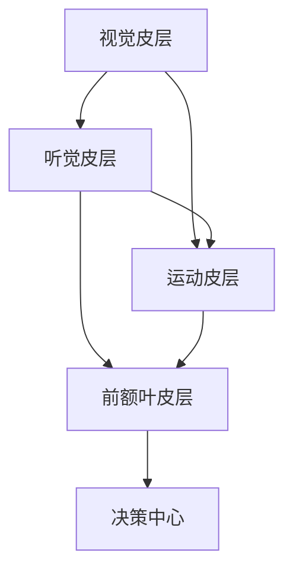

                 

### 引言

在当今快速发展的信息技术时代，人工智能、大数据、虚拟现实等前沿科技日新月异，对人类的学习、工作和生活方式产生了深远的影响。其中，理解的多维性成为了一个备受关注的话题。理解的多维性不仅涵盖了传统的视觉和听觉感知，还包括触觉、嗅觉、味觉等多种感官体验，以及跨学科的交叉理解和跨文化的深度沟通。本文将深入探讨理解的多维性，从理论到实践，阐述其重要性和应用场景。

理解的多维性不仅仅是一种学术概念，它对我们的日常生活和未来科技发展都有着重要的指导意义。首先，在人类的学习过程中，多种感官的协同作用能够显著提高学习效率和理解深度。其次，在人工智能和大数据处理中，多维理解的能力使得机器能够更加准确地理解和应对复杂情境。此外，在虚拟现实和增强现实等新兴技术中，多维理解的应用能够提供更加丰富和真实的用户体验。

本文将首先介绍理解的多维性基础理论，包括跨感官学习的理论基础和全脑发展的科学依据。接着，我们将探讨多维理解的核心概念和算法原理，并通过具体的例子来展示这些原理的应用。然后，我们将探讨多维理解在不同领域的应用场景，从教育到科技，再到商业战略。最后，我们将展望多维理解的未来趋势和发展方向，并分享一些实际应用案例和研究进展。

通过本文的阅读，读者将不仅能够对理解的多维性有深刻的认识，还能了解到如何在实际应用中利用这一理论来提升学习效果、推动科技进步和创造商业价值。

### 文章关键词

- 多维理解
- 跨感官学习
- 全脑发展
- 神经网络
- 深度学习
- 多模态信息处理
- 教育实践
- 科技应用
- 商业战略
- 跨学科交叉

### 文章摘要

本文探讨了理解的多维性这一重要概念，并详细分析了其理论基础和应用场景。文章首先介绍了理解的多维性基础理论，包括跨感官学习和全脑发展的科学依据。接着，深入探讨了多维理解的核心概念和算法原理，通过具体例子展示了其应用。然后，文章探讨了多维理解在教育、科技和商业领域的应用，并展望了其未来的发展趋势。通过本文的阅读，读者将了解到如何利用多维理解提升学习效率、推动科技进步和创造商业价值。

## 第一部分：理解的多维性基础理论

### 第1章：理解的多维性概念与重要性

理解的多维性，是指人类和机器在获取和处理信息时，通过多种感官和认知途径对信息进行综合解析和深度理解的能力。这一概念不仅仅局限于人类的学习过程，同样适用于人工智能和机器学习领域。理解的多维性强调信息处理的多样性和全面性，它通过整合来自不同感官的输入，使信息处理更为高效和精准。

#### 1.1 理解的多维性定义与内涵

理解的多维性可以定义为一种综合运用多种感官和认知能力来获取、处理和解释信息的过程。它包括以下几个关键方面：

1. **跨感官信息整合**：不同感官（如视觉、听觉、触觉、嗅觉和味觉）的信息相互结合，共同构建对某一信息的全面理解。
2. **多模态信息处理**：不仅仅依赖单一感官的信息输入，而是通过多种模态的信息输入（如图像、声音、文本、触觉等）进行综合处理。
3. **认知协同**：大脑不同区域（如视觉皮层、听觉皮层、运动皮层等）的协同作用，使得信息处理更加高效和准确。

多维理解的内涵可以从以下几个方面进行具体阐述：

- **信息丰富性**：通过整合多种感官的信息，可以获得比单一感官更为丰富的信息内容。
- **理解深度**：多维理解使得个体能够从不同角度和层面去解析信息，从而获得更深入的理解。
- **情境适应性**：多维理解能够使个体在面对复杂情境时，能够更加灵活地适应和应对。

#### 1.2 跨感官学习的理论基础

跨感官学习是理解的多维性在人类学习过程中的一种重要体现。其理论基础主要涉及以下几个方面：

1. **神经可塑性**：大脑具有适应环境和学习的特性，即通过跨感官的学习，大脑的不同区域可以相互连接和加强，从而提升整体的学习效率和理解深度。
2. **多模态信息处理**：通过多种感官的协同作用，大脑可以处理更加复杂和丰富的信息，从而提高学习的质量和效果。
3. **认知负载理论**：认知负载理论指出，当信息处理负荷较高时，通过多种感官的协同作用可以降低认知负荷，提高信息处理的效率和准确度。

跨感官学习的具体表现包括：

- **多感官教学**：在教育中，通过结合视觉、听觉、触觉等多种感官刺激，可以提高学生的学习兴趣和理解深度。
- **多模态学习**：在编程和学习技术时，通过观看视频、阅读文档、实际操作等多种方式，可以更加全面和深入地掌握知识。

#### 1.3 全脑发展的科学依据

全脑发展是指大脑通过多种感官和认知途径的综合运用，实现功能性和结构性的全面发展。其科学依据主要包括以下几点：

1. **大脑分区与协同**：大脑分为多个功能区，如视觉区、听觉区、运动区等，这些区域在功能上是相互独立的，但通过协同作用，可以实现高效的信息处理和理解。
2. **神经网络与连接性**：大脑中的神经网络通过多种感官的输入，形成复杂的连接结构，这些结构支持大脑的多维理解和复杂决策能力。
3. **脑区可塑性**：大脑具有可塑性，即通过学习和练习，可以改变大脑的结构和功能，从而提升多维理解能力。

全脑发展的具体表现包括：

- **全脑训练**：通过多感官和认知途径的综合训练，可以提升大脑的整体功能和灵活性。
- **跨学科学习**：通过跨学科的交叉学习，可以促进大脑不同区域的协同作用，提升整体的学习效果。

综上所述，理解的多维性是一种重要的基础理论，它不仅对人类的学习和认知过程有着深远的影响，也对人工智能和机器学习领域的发展提供了新的思路和方向。通过深入研究和应用多维理解的理论，我们可以提升学习效率、优化信息处理，并在教育、科技和商业等领域创造更大的价值。

### 第2章：多维理解的核心概念与联系

多维理解的核心在于如何通过整合多种感官和认知途径，实现对信息的全面理解和深度解析。这一部分将详细探讨多维理解的核心概念，并分析这些概念之间的联系。

#### 2.1 多模态信息处理

多模态信息处理是指通过结合不同模态的信息（如图像、声音、文本、触觉等）进行综合分析和理解的过程。人类的大脑具有强大的多模态处理能力，这使得我们能够通过多种感官获取信息，并从中获得更全面的认知。

1. **多模态信息的输入**：
    - **视觉模态**：通过眼睛捕捉图像和视频信息。
    - **听觉模态**：通过耳朵接收声音信息。
    - **触觉模态**：通过皮肤感受温度、压力和触感。
    - **其他模态**：如嗅觉、味觉等，虽然不如视觉和听觉那么重要，但在特定情境下也起到关键作用。

2. **多模态信息处理的优势**：
    - **信息丰富性**：通过多种感官输入，可以获得更丰富的信息内容。
    - **理解深度**：不同模态的信息可以相互补充，从不同角度解析信息，提高理解的深度。
    - **情境适应性**：多模态处理使得个体能够更好地适应复杂和多变的环境。

#### 2.2 脑区协同作用与神经网络

大脑是由多个功能区组成的复杂网络，不同脑区之间通过神经网络相互连接和协同作用，实现高效的信息处理和理解。

1. **大脑分区与功能**：
    - **视觉皮层**：负责处理视觉信息。
    - **听觉皮层**：负责处理听觉信息。
    - **运动皮层**：负责控制运动和感知。
    - **其他脑区**：如前额叶皮层、顶叶皮层等，负责更高层次的认知功能。

2. **脑区协同作用**：
    - **跨区域协同**：不同脑区之间的协同作用是多维理解的关键。例如，视觉皮层和运动皮层的协同作用使得我们能够通过观察并模仿他人的动作来学习。
    - **多层级处理**：信息在大脑中的处理是一个多层级的过程，从简单的感知到复杂的推理和决策。

3. **神经网络**：
    - **局部连接**：神经网络中的神经元通过局部连接进行信息传递和处理。
    - **全局连接**：神经网络中的全局连接使得不同脑区之间的信息可以相互传递和整合。

#### 2.3 Mermaid流程图：脑区协同作用原理

为了更好地理解脑区协同作用，我们可以通过Mermaid流程图来展示其基本原理：



**流程说明**：

- **视觉皮层与听觉皮层**：通过图像和声音的信息输入，分别处理视觉和听觉信息。
- **视觉皮层与运动皮层**：通过观察他人的动作，运动皮层能够模拟并执行相应的动作。
- **听觉皮层与运动皮层**：通过听到的指令，运动皮层能够执行相应的动作。
- **前额叶皮层与决策中心**：通过综合多种感官信息，前额叶皮层做出最终决策。

通过这一流程图，我们可以看到不同脑区之间的协同作用是如何实现多维理解的。

#### 2.4 多维理解的核心概念联系

多维理解的核心概念包括多模态信息处理、脑区协同作用和神经网络。这些概念之间存在着紧密的联系：

- **多模态信息处理**是基础，它为多维理解提供了丰富的信息输入。
- **脑区协同作用**是多模态信息处理的实现机制，它通过神经网络连接不同脑区，实现高效的信息处理和理解。
- **神经网络**是脑区协同作用的载体，它支持不同脑区之间的信息传递和整合。

通过这些核心概念的联系，我们可以更好地理解多维理解的本质，并探索其在实际应用中的潜力。

综上所述，多维理解的核心概念与联系构成了一个复杂而高效的认知系统。通过深入理解和应用这些概念，我们可以进一步提升人类的认知能力和信息处理效率，为教育、科技和商业等领域的发展提供新的思路和方法。

### 第3章：多维理解的核心算法原理

在理解的多维性中，算法原理起着至关重要的作用。本章将详细探讨多维理解的核心算法原理，包括神经网络与深度学习的基础理论、神经网络的基本架构、数学模型及其应用。

#### 3.1 神经网络与深度学习基础

神经网络（Neural Network）是一种模拟人脑神经元结构和功能的信息处理系统。它由大量的神经元（或节点）通过复杂的连接方式组织在一起，能够通过学习实现数据输入到输出之间的映射。

1. **神经网络的基本概念**：
    - **神经元**：神经网络的基本单元，负责接收输入信息并通过激活函数产生输出。
    - **连接**：神经元之间的连接，通常带有权重，用于传递信息。
    - **激活函数**：用于确定神经元是否被激活，常见的激活函数有Sigmoid、ReLU等。

2. **神经网络的工作原理**：
    - **前向传播**：输入信息从输入层经过多层隐藏层，最终到达输出层，每个神经元都会通过加权求和并应用激活函数产生输出。
    - **反向传播**：通过计算输出误差，调整连接权重，使得网络能够更好地拟合数据。

3. **深度学习的基础**：
    - **深度神经网络**：由多个隐藏层组成的神经网络，能够处理更复杂的数据和模式。
    - **卷积神经网络（CNN）**：专门用于图像识别和处理，通过卷积层提取特征。
    - **循环神经网络（RNN）**：专门用于序列数据处理，能够处理时间序列数据。

#### 3.2 伪代码：神经网络基本架构

以下是一个简单的神经网络伪代码示例，展示了其基本架构：

```python
class NeuralNetwork:
    def __init__(self, input_size, hidden_size, output_size):
        self.input_size = input_size
        self.hidden_size = hidden_size
        self.output_size = output_size
        
        # 初始化权重和偏置
        self.weights_input_to_hidden = np.random.randn(input_size, hidden_size)
        self.biases_hidden = np.random.randn(hidden_size)
        
        self.weights_hidden_to_output = np.random.randn(hidden_size, output_size)
        self.biases_output = np.random.randn(output_size)
    
    def forward(self, x):
        # 前向传播
        hidden_layer_input = np.dot(x, self.weights_input_to_hidden) + self.biases_hidden
        hidden_layer_output = self.relu(hidden_layer_input)
        
        output_layer_input = np.dot(hidden_layer_output, self.weights_hidden_to_output) + self.biases_output
        output_layer_output = self.softmax(output_layer_input)
        
        return output_layer_output
    
    def backward(self, x, output, expected_output):
        # 反向传播
        output_error = output - expected_output
        d_output = self.dsoftmax(output)
        
        hidden_error = d_output.dot(self.weights_hidden_to_output.T)
        d_hidden = self.drelu(hidden_layer_output)
        
        input_error = hidden_error.dot(self.weights_input_to_hidden.T)
        d_input = x
        
        # 更新权重和偏置
        self.weights_input_to_hidden += input_error * d_input
        self.biases_hidden += d_hidden.sum(axis=0)
        
        self.weights_hidden_to_output += hidden_error * d_hidden
        self.biases_output += d_output
        
    def relu(self, x):
        return np.maximum(0, x)
    
    def drelu(self, x):
        return (x > 0).astype(float)
    
    def softmax(self, x):
        e_x = np.exp(x - np.max(x))
        return e_x / e_x.sum(axis=1, keepdims=True)
    
    def dsoftmax(self, x):
        return x * (1 - x)
```

#### 3.3 数学模型与公式讲解

神经网络的数学模型主要包括激活函数、前向传播和反向传播算法。以下是这些数学模型和公式的详细讲解：

##### 3.3.1 激活函数

激活函数是神经网络中非常重要的组成部分，它决定了神经元是否被激活。以下是几种常见的激活函数及其导数：

1. **Sigmoid函数**：
    - **公式**：\( \sigma(x) = \frac{1}{1 + e^{-x}} \)
    - **导数**：\( \sigma'(x) = \sigma(x) \times (1 - \sigma(x)) \)

2. **ReLU函数**：
    - **公式**：\( \text{ReLU}(x) = \max(0, x) \)
    - **导数**：\( \text{ReLU}'(x) = \begin{cases} 
    0, & \text{if } x < 0 \\
    1, & \text{if } x \geq 0 
    \end{cases} \)

3. **Softmax函数**：
    - **公式**：\( \text{softmax}(x_i) = \frac{e^{x_i}}{\sum_{j} e^{x_j}} \)
    - **导数**：\( \text{dsoftmax}(x_i) = \text{softmax}(x_i) \times (1 - \text{softmax}(x_i)) \)

##### 3.3.2 前向传播与反向传播算法

1. **前向传播**：
    - **公式**：
      \( z = \sum_{j} w_{ji} x_j + b_i \)
      \( a_i = \text{激活函数}(z) \)
    - **过程**：输入信息通过权重矩阵和偏置项进行加权求和，然后通过激活函数得到输出。

2. **反向传播**：
    - **公式**：
      \( \delta = \frac{\partial L}{\partial z} \times \text{激活函数的导数} \)
      \( \Delta w_{ji} = \delta x_j \)
      \( \Delta b_i = \delta \)
    - **过程**：计算输出误差，通过反向传播算法更新权重和偏置项，使得网络能够更好地拟合数据。

##### 3.3.3 经典神经网络模型

1. **多层感知机（MLP）**：
    - **结构**：包含输入层、多个隐藏层和输出层，每个层之间通过全连接方式连接。
    - **应用**：用于分类和回归问题。

2. **卷积神经网络（CNN）**：
    - **结构**：包含卷积层、池化层和全连接层，适用于图像识别和处理。
    - **应用**：如人脸识别、图像分类等。

3. **循环神经网络（RNN）**：
    - **结构**：包含输入门、输出门和记忆单元，适用于序列数据处理。
    - **应用**：如自然语言处理、时间序列预测等。

#### 3.4 多模态信息处理算法

多模态信息处理是指通过结合不同模态的信息（如图像、声音、文本等）进行综合分析和理解的过程。以下是几种常见的多模态信息处理算法：

1. **特征提取与融合**：
    - **算法**：如CNN用于图像特征提取，RNN用于语音特征提取，然后通过拼接或融合方式整合不同模态的特征。
    - **应用**：如图像文本关联、语音识别等。

2. **跨模态匹配与推理**：
    - **算法**：如基于相似度的匹配算法，通过计算不同模态特征之间的相似度来实现跨模态关联。
    - **应用**：如视频内容检索、多模态问答系统等。

通过上述对多维理解核心算法原理的讲解，我们可以看到神经网络和多模态信息处理算法在实现多维理解中扮演着关键角色。这些算法不仅为信息处理提供了强大的工具，也为多维理解的应用提供了广阔的前景。

### 第4章：多维理解的应用场景

多维理解的应用场景广泛，涵盖了教育、科技和商业等多个领域。本章将详细探讨这些应用场景，展示多维理解如何在各个领域发挥重要作用。

#### 4.1 跨学科交叉理解

跨学科交叉理解是多维理解在学术研究中的一个重要应用。通过结合不同学科的知识和理论，研究人员能够从多个角度探讨复杂问题，从而获得更为全面和深入的理解。

1. **多学科协作研究**：
    - **案例**：生物学、计算机科学和物理学在基因组学和生物信息学领域的合作，通过多维理解将生物学数据与计算机算法和物理学原理相结合，推动了基因组学研究的快速发展。

2. **跨学科教学**：
    - **案例**：在大学课程设计中，结合计算机科学、艺术和设计，通过项目制学习，学生可以从多个维度探讨数字艺术和交互设计，提升创新能力和综合素质。

#### 4.2 跨文化理解与沟通

跨文化理解与沟通是全球化背景下一个不可忽视的重要领域。多维理解使得人们能够更加准确地理解和适应不同文化，促进跨文化的沟通与合作。

1. **多元文化教育**：
    - **案例**：在多元文化社会中，学校通过开展跨文化交流项目，如国际交换生计划、多元文化课程等，帮助学生理解不同文化，提高跨文化沟通能力。

2. **国际商务合作**：
    - **案例**：跨国公司在进行国际市场拓展时，通过多维理解分析不同文化背景下的消费者行为和市场趋势，制定更为有效的市场策略，提升国际竞争力。

#### 4.3 多媒体信息处理

多媒体信息处理是多维理解在技术领域的典型应用。通过结合多种感官和认知途径，多媒体信息处理系统能够更高效地分析和理解复杂的多媒体数据。

1. **多媒体内容检索**：
    - **案例**：在视频搜索引擎中，通过结合视觉和听觉特征，用户可以更精确地搜索和定位视频内容，提升检索效率和用户体验。

2. **多模态人机交互**：
    - **案例**：智能助手和虚拟现实系统通过结合视觉、听觉和触觉等多种感官反馈，提供更加自然和丰富的交互体验，增强用户的沉浸感和互动性。

#### 4.4 教育实践

多维理解在教育领域的应用极大地提升了教学效果和学习体验。

1. **个性化学习**：
    - **案例**：通过多维理解技术，教育平台可以根据学生的学习习惯和偏好，提供个性化的学习资源和指导，提高学习效果。

2. **混合式学习**：
    - **案例**：在混合式学习环境中，教师可以通过多维理解技术，结合在线课程和面对面教学，为学生提供更加丰富和互动的学习体验。

#### 4.5 科技应用

多维理解在科技领域的应用推动了人工智能和大数据技术的发展。

1. **智能推荐系统**：
    - **案例**：通过多维理解技术，智能推荐系统可以结合用户的多种行为数据（如浏览历史、购买记录、搜索关键词等），提供更加精准和个性化的推荐。

2. **自然语言处理**：
    - **案例**：在自然语言处理中，多维理解技术通过结合文本、语音和视觉等多种信息源，提升对自然语言的理解和生成能力，应用于智能客服、语音助手等领域。

#### 4.6 商业战略

多维理解在商业战略中的应用，为企业提供了洞察市场动态和消费者行为的新工具。

1. **消费者洞察**：
    - **案例**：企业通过多维理解技术，分析消费者的多维度数据（如行为、情感、需求等），深入洞察消费者行为和市场趋势，制定更为有效的营销策略。

2. **产品创新**：
    - **案例**：企业通过多维理解技术，结合用户反馈和市场数据，进行产品创新，开发出更符合消费者需求和市场趋势的新产品。

通过上述应用场景的探讨，我们可以看到多维理解在多个领域的重要性。它不仅提升了学习和认知的效率，还推动了科技进步和商业创新。随着技术的不断发展，多维理解的应用前景将更加广阔，为人类生活带来更多的便利和改变。

### 第5章：多维理解的教育实践

#### 5.1 教育模式改革与创新

在教育领域，多维理解的理念已经引发了一场教育模式的革命，推动了教育方法和技术手段的创新与发展。多维理解强调通过多种感官和认知途径进行学习，从而提高学习效果和深度。以下是一些具体的教育模式改革和创新案例。

1. **项目制学习（Project-Based Learning, PBL）**：
    - **案例**：项目制学习通过让学生参与实际项目，结合多学科知识，激发学生的主动学习和探究精神。例如，一所学校在计算机科学课程中，让学生设计和开发一款游戏，这要求学生掌握编程、设计、用户界面等多个方面的知识。

2. **探究式学习（Inquiry-Based Learning, IBL）**：
    - **案例**：探究式学习鼓励学生通过提问和探索来发现知识。例如，在一节科学课上，老师可以提出一个问题，让学生通过实验和查阅资料来寻找答案，这样不仅培养了学生的批判性思维，还提高了他们的多维理解能力。

3. **混合式学习（Blended Learning）**：
    - **案例**：混合式学习结合了传统课堂教学和在线学习，通过多种学习途径提供更丰富的学习体验。例如，学生在课堂上学到的知识，可以通过在线平台进行复习和拓展，通过视频、互动讨论等多种方式加深理解。

#### 5.2 多感官教学案例分析

多感官教学是指通过视觉、听觉、触觉等多种感官刺激，提高学生的注意力和学习效果。以下是一些多感官教学的具体案例。

1. **互动白板教学**：
    - **案例**：互动白板教学通过触屏互动，提供图形化、动态化的教学资源，使得学生能够通过视觉和触觉两种感官进行学习。例如，在数学课上，老师可以通过互动白板展示几何图形的动态变换，帮助学生更直观地理解几何概念。

2. **虚拟现实（VR）教学**：
    - **案例**：虚拟现实教学通过创建虚拟环境，让学生在沉浸式的体验中学习。例如，在地理课上，学生可以通过VR设备参观全球各地的著名景点，了解地理环境和文化差异，从而加深对地理知识的理解。

3. **声音地图（Sound Map）教学**：
    - **案例**：声音地图教学通过声音和地理信息的结合，帮助学生理解地理环境和文化。例如，在音乐课上，老师可以通过播放不同地区的音乐，结合地图展示音乐文化的地理分布，让学生在听觉和视觉体验中学习。

#### 5.3 教学环境搭建与优化

为了实现多维理解的教学目标，教学环境的搭建和优化至关重要。以下是一些关键步骤和策略。

1. **硬件设施**：
    - **案例**：学校可以引入互动白板、虚拟现实设备、智能平板等现代化教学工具，为学生提供多样化的学习体验。

2. **软件平台**：
    - **案例**：学校可以采用教育信息化平台，整合教学资源、学习工具和评估系统，实现教学信息的数字化和个性化。

3. **教师培训**：
    - **案例**：定期对教师进行多感官教学和信息技术培训，提升教师的数字化教学能力，确保多维理解教学策略的有效实施。

4. **学习空间设计**：
    - **案例**：设计开放、灵活的学习空间，如协作教室、实验工作室等，鼓励学生通过小组合作、实践操作等方式进行学习。

通过教育模式的改革与创新、多感官教学案例的分析以及教学环境的搭建与优化，多维理解在教育实践中得到了广泛应用。这不仅提升了学生的学习效果，也为教育质量的提升和个性化教育的发展提供了新的路径。

### 第6章：多维理解的科技应用

多维理解在科技领域中的应用正不断推动技术创新和产业发展。本章将详细探讨多维理解在人工智能与大数据分析、虚拟现实与增强现实、人机交互与智能推荐系统等领域的应用，展示其在提升技术效能和用户体验方面的潜力。

#### 6.1 人工智能与大数据分析

人工智能（AI）与大数据分析是现代科技的核心驱动力，多维理解在其中发挥了关键作用。通过整合和分析来自多种感官和不同数据源的信息，AI系统能够实现更精确的模型训练和更有效的数据解读。

1. **多模态数据分析**：
    - **案例**：在医疗领域，多维理解技术可以结合病人的临床记录、基因数据、影像资料等多种信息，实现更全面的疾病诊断和个性化治疗。例如，通过结合CT扫描和MRI影像，AI系统能够更准确地识别脑部病变。

2. **情感分析**：
    - **案例**：在社交媒体分析中，多维理解技术通过分析用户发布的文字、图片和视频，可以识别用户的情感状态，从而为企业提供精准的市场洞察。例如，通过文本分析、语音情感识别和图像情感分析，AI系统可以评估用户对产品的满意度和情感反应。

3. **智能推荐系统**：
    - **案例**：电子商务平台通过多维理解技术，结合用户的历史购物行为、搜索记录、浏览记录等多维度数据，提供个性化的商品推荐。例如，通过分析用户的购物车和浏览历史，推荐系统可以识别用户的偏好，提供个性化的促销信息和推荐商品。

#### 6.2 虚拟现实与增强现实

虚拟现实（VR）和增强现实（AR）是现代科技的前沿领域，多维理解的应用极大地提升了用户体验和交互效能。

1. **沉浸式学习**：
    - **案例**：在教育领域，VR技术通过创建虚拟课堂和实验室，使学生能够沉浸于真实的模拟环境中，从而加深对知识的理解和记忆。例如，通过VR设备，学生可以“参观”历史遗址、实验室模拟实验，提高学习兴趣和效果。

2. **远程协作**：
    - **案例**：在远程办公和会议中，AR技术结合虚拟会议平台，使远程参与者能够通过增强现实眼镜实现面对面的互动。例如，通过AR技术，团队成员可以“在同一个虚拟会议室”中进行讨论和协作，提高沟通效率和团队协作效果。

3. **娱乐体验**：
    - **案例**：在游戏和娱乐领域，VR和AR技术通过多维理解技术，提供更加真实和互动的体验。例如，玩家可以通过VR设备进入虚拟游戏世界，与虚拟角色互动，体验身临其境的游戏乐趣。

#### 6.3 人机交互与智能推荐系统

人机交互（HCI）与智能推荐系统是现代科技中的重要应用领域，多维理解的应用使得交互更加自然和个性化。

1. **自然语言处理（NLP）**：
    - **案例**：智能助手如Siri、Alexa和Google Assistant通过多维理解技术，结合语音、文本和视觉信息，提供更加智能和人性化的服务。例如，通过语音识别和自然语言理解，智能助手能够准确识别用户的指令，并提供相应的帮助。

2. **手势识别**：
    - **案例**：在智能家居中，通过多维理解技术，智能设备可以通过手势识别进行控制。例如，通过摄像头和传感器，智能电视可以通过用户的手势进行频道切换和节目选择，提供更加便捷的交互体验。

3. **智能推荐系统**：
    - **案例**：在线购物平台通过多维理解技术，结合用户的行为数据、历史偏好和上下文信息，提供个性化的商品推荐。例如，通过分析用户的浏览历史、购物车内容和地理位置，推荐系统可以准确预测用户的需求，提供精准的推荐。

通过上述案例，我们可以看到多维理解在科技应用中的广泛潜力和巨大影响。它不仅提升了技术效能和用户体验，还为科技创新和产业发展提供了新的思路和方向。

### 第7章：多维理解的商业战略

多维理解在商业战略中的应用正日益显现，为企业在竞争激烈的市场环境中提供了独特的优势。本章将探讨多维理解在市场研究与消费者洞察、产品设计与用户体验、企业管理创新与人才培养等方面的应用，以及多维理解如何帮助企业制定和执行更加有效的商业策略。

#### 7.1 市场研究与消费者洞察

市场研究和消费者洞察是商业决策的重要依据。多维理解的应用能够帮助企业更加全面和深入地了解市场和消费者行为。

1. **多维数据分析**：
    - **案例**：企业可以通过多维理解技术，整合消费者行为数据（如购物记录、搜索历史、社交媒体互动等），分析消费者的兴趣、需求和购买习惯。例如，通过结合用户浏览和购买数据，企业可以识别出潜在的高价值客户群体，并制定精准的市场营销策略。

2. **情感分析**：
    - **案例**：在社交媒体分析中，多维理解技术可以分析用户发布的文本、图片和视频，识别用户的情感状态。例如，通过情感分析，企业可以了解消费者对其产品的情感反应，及时调整产品设计和营销策略，提升品牌形象和消费者忠诚度。

3. **个性化推荐**：
    - **案例**：电商平台利用多维理解技术，根据消费者的行为和偏好，提供个性化的商品推荐。例如，通过分析用户的浏览记录和购物车内容，推荐系统可以准确预测用户的购买意图，提供个性化的促销信息和商品推荐，从而提升销售转化率和客户满意度。

#### 7.2 产品设计与用户体验

产品设计和用户体验是商业成功的核心因素。多维理解的应用可以帮助企业更好地满足消费者的需求，提升产品的竞争力和用户满意度。

1. **多感官设计**：
    - **案例**：在产品设计过程中，企业可以通过多维理解技术，结合视觉、听觉、触觉等多感官体验，创造出更加丰富和真实的用户体验。例如，通过结合触觉反馈和声音效果，智能设备可以提供更加沉浸式的交互体验，提升用户的满意度和忠诚度。

2. **用户测试与反馈**：
    - **案例**：企业可以通过多维理解技术，对产品进行全面的用户测试和反馈分析。例如，通过结合用户的行为数据和主观评价，企业可以识别出产品设计和功能上的问题，并进行优化和改进，提升产品的质量和用户满意度。

3. **用户体验优化**：
    - **案例**：在服务设计中，企业可以通过多维理解技术，优化用户的交互流程和体验。例如，通过分析用户的点击路径和操作行为，企业可以优化网站和移动应用的用户界面设计，提高用户的操作效率和满意度。

#### 7.3 企业管理创新与人才培养

企业管理创新和人才培养是推动企业持续发展的关键。多维理解的应用可以帮助企业实现管理创新，培养具备全面能力的人才。

1. **跨部门协作**：
    - **案例**：通过多维理解技术，企业可以构建跨部门的协作平台，促进不同部门和团队之间的信息共享和合作。例如，通过多维数据分析工具，企业可以实时监控各部门的运营状况，优化资源配置和决策过程，提升整体运营效率。

2. **领导力培养**：
    - **案例**：企业可以通过多维理解技术，设计和实施领导力发展项目，培养具备全局视角和跨学科能力的领导者。例如，通过结合行为分析和反馈机制，企业可以评估领导者的领导风格和管理能力，提供个性化的领导力发展建议和培训。

3. **人才发展**：
    - **案例**：企业可以通过多维理解技术，设计和实施个性化的人才发展计划，提升员工的技能和职业素养。例如，通过结合职业测评和绩效数据，企业可以为员工提供定制化的学习路径和职业发展建议，激发员工的潜能和创造力。

通过多维理解的应用，企业可以在市场研究、产品设计和企业管理等方面实现创新，提升竞争力。同时，多维理解也有助于培养具备全面能力和创新精神的员工，为企业的长远发展奠定坚实基础。未来，随着多维理解技术的不断发展和应用，企业将能够更加有效地应对市场变化，实现持续发展和竞争优势。

### 第8章：多维理解的未来挑战与机遇

随着技术的不断进步和多维理解的日益普及，这一领域正面临着一系列的挑战与机遇。本章将探讨多维理解的未来发展趋势，分析其在技术、社会和文化方面的影响，并展望其未来的发展方向。

#### 8.1 技术发展趋势

1. **人工智能与机器学习**：
    - **趋势**：人工智能（AI）和机器学习（ML）技术的发展将进一步提升多维理解的能力。通过深度学习和强化学习等算法，AI系统将能够更加准确地理解和处理复杂的多模态数据。
    - **影响**：多维理解技术将变得更加智能和高效，能够应用于更多领域，如医疗、教育、娱乐等，带来更广泛的应用场景。

2. **神经科学**：
    - **趋势**：神经科学的进展将为多维理解提供更加深入的理论基础。通过研究大脑的结构和功能，科学家可以更好地理解多维理解的工作机制，并开发出更加高效的人工神经网络模型。
    - **影响**：这将推动多维理解技术在认知科学和神经工程领域的应用，为解决认知障碍和神经疾病提供新的治疗方法和策略。

3. **虚拟现实与增强现实**：
    - **趋势**：虚拟现实（VR）和增强现实（AR）技术的不断进步将增强多维理解的用户体验。通过多感官互动和沉浸式体验，VR和AR技术将为多维理解提供更加丰富和真实的实践平台。
    - **影响**：多维理解将在游戏、教育、医疗等领域发挥更大的作用，推动虚拟现实和增强现实技术的发展和应用。

#### 8.2 社会与文化影响

1. **教育变革**：
    - **趋势**：多维理解的理念将深刻影响教育模式和教学方式。通过结合多种感官和认知途径，教育系统将更加注重个性化教育和跨学科学习。
    - **影响**：这将提升学生的学习效果和创造力，培养适应未来社会需求的全面型人才。

2. **工作方式变革**：
    - **趋势**：多维理解技术将改变传统的办公和工作方式。通过远程协作、智能助手和自动化系统，多维理解将提高工作效率和灵活性。
    - **影响**：这将促进全球化和远程办公的发展，改变企业组织结构和员工的工作模式。

3. **跨文化交流**：
    - **趋势**：随着多维理解技术的普及，跨文化交流将变得更加顺畅和深入。通过多感官互动和情感分析，不同文化背景的人将能够更好地理解和沟通。
    - **影响**：这将促进文化多样性和全球一体化，推动人类社会的共同进步。

#### 8.3 教育与商业的未来走向

1. **教育个性化**：
    - **趋势**：多维理解技术将推动教育个性化的发展，通过分析学生的多维度数据，提供个性化的学习资源和指导，满足不同学生的学习需求和节奏。
    - **影响**：这将提升教育质量和学习效果，培养具备创新能力和适应能力的人才。

2. **商业智能化**：
    - **趋势**：多维理解技术将推动商业智能化的发展，通过数据分析和智能化决策，企业能够更加精准地洞察市场动态和消费者需求。
    - **影响**：这将提升企业的竞争力和创新能力，推动商业模式的创新和转型。

3. **跨界融合**：
    - **趋势**：多维理解将促进不同领域的跨界融合，如教育、科技、文化、医疗等，通过跨学科的合作和共享，实现技术和产业的融合发展。
    - **影响**：这将创造出新的商业机会和市场空间，推动社会的全面进步。

通过分析多维理解的未来挑战与机遇，我们可以看到这一领域的发展前景广阔。随着技术的不断进步和社会的深刻变革，多维理解将在更多领域发挥重要作用，推动人类社会的持续发展和进步。

### 第9章：多维理解的研究进展与前沿

多维理解作为一门交叉学科，近年来取得了显著的进展，并在多个领域展示了其应用潜力。本章将介绍多维理解的研究进展与前沿，包括脑科学的新发现、人工智能的新技术以及跨学科交叉研究的新趋势。

#### 9.1 脑科学新发现

脑科学是研究大脑结构、功能和机制的科学。近年来，脑科学的研究取得了一系列重要发现，这些发现为多维理解提供了新的理论和实验依据。

1. **神经网络的可塑性**：
    - **进展**：研究表明，神经网络具有高度的可塑性，能够通过学习和经验改变其结构和功能。这种可塑性是跨感官学习和多维理解的基础。
    - **应用**：通过训练和强化，可以改善和增强大脑不同区域之间的连接，提高多维理解的效率和准确性。

2. **多感官整合机制**：
    - **进展**：科学家通过脑成像技术发现，大脑中的多个区域在处理多感官信息时存在复杂的交互和整合机制。这些机制使得大脑能够整合来自不同感官的信息，实现多维理解。
    - **应用**：这一发现有助于设计更有效的多感官学习策略和交互界面，提升人机交互和智能系统的理解能力。

3. **情感与认知的关系**：
    - **进展**：研究表明，情感在认知过程中起着重要作用，情感的强度和类型会影响人们对信息的理解和处理方式。这一发现为理解多感官学习和多维理解中的情感因素提供了新的视角。
    - **应用**：通过情感计算和情感分析技术，可以设计出更加人性化和情感化的智能系统，提高用户的体验和满意度。

#### 9.2 人工智能新技术

人工智能（AI）的发展为多维理解提供了强大的工具和平台。近年来，AI技术在多维理解领域取得了一系列重要突破。

1. **深度学习**：
    - **进展**：深度学习算法，特别是卷积神经网络（CNN）和循环神经网络（RNN）的广泛应用，使得AI系统能够处理和整合来自多种模态的数据。这些算法在图像识别、语音识别和自然语言处理等领域取得了显著成果。
    - **应用**：通过深度学习技术，AI系统可以实现对多模态数据的自动特征提取和分类，从而提高多维理解的能力和效率。

2. **生成对抗网络（GAN）**：
    - **进展**：生成对抗网络（GAN）是一种新的深度学习框架，通过两个相互对抗的神经网络（生成器和判别器）生成和识别高维数据。GAN在图像生成、视频合成和语音合成等领域展示了强大的应用潜力。
    - **应用**：通过GAN技术，AI系统可以生成更加真实和丰富的多模态数据，为多维理解提供更多的训练样本和模拟场景。

3. **强化学习**：
    - **进展**：强化学习是一种通过试错和反馈学习优化行为策略的机器学习方法。近年来，强化学习在多维理解中的应用逐渐受到关注，特别是在人机交互和智能决策领域。
    - **应用**：通过强化学习技术，AI系统可以学习如何在复杂和动态的环境中做出最优决策，提高多维理解的灵活性和适应性。

#### 9.3 跨学科交叉研究

多维理解作为一门交叉学科，需要多学科的合作与融合。近年来，跨学科交叉研究在多维理解领域取得了显著进展。

1. **认知科学与计算神经科学的融合**：
    - **进展**：认知科学与计算神经科学的融合，通过结合脑成像技术、计算模型和实验数据，揭示了多维理解的心理和神经基础。这一融合为多维理解的理论研究和应用提供了新的视角和方法。
    - **应用**：通过这一融合研究，可以开发出更加精确和高效的多维理解模型和算法，应用于教育、医疗和人机交互等领域。

2. **计算机科学与心理学的研究**：
    - **进展**：计算机科学与心理学的交叉研究，通过分析用户行为数据和主观评价，揭示了多维理解的心理机制和用户体验。这一研究为设计更加人性化和高效的多维理解系统提供了重要依据。
    - **应用**：通过这一交叉研究，可以开发出更加符合用户需求和体验的多维理解应用，如智能助手、虚拟现实和增强现实系统等。

3. **人工智能与社会科学的研究**：
    - **进展**：人工智能与社会科学的交叉研究，通过大数据分析和机器学习方法，揭示了社会现象和人类行为的复杂性和多样性。这一研究为理解多维理解在社会和人类行为中的应用提供了新的视角。
    - **应用**：通过这一交叉研究，可以更好地理解和应对复杂的社会问题，如教育公平、心理健康和社会治理等。

通过介绍多维理解的研究进展与前沿，我们可以看到这一领域在脑科学、人工智能和跨学科交叉研究方面的快速发展和广泛应用。未来，随着技术的不断进步和多学科的深度融合，多维理解将继续推动科技和人类社会的进步。

### 第10章：多维理解的应用案例与实践分享

为了更好地展示多维理解的实际应用，本章将通过教育、科技创新和商业应用等具体案例，详细解读这些案例的实施过程、成果及其影响。

#### 10.1 教育案例分享

**案例1：多感官教室**

- **实施过程**：在一所小学中，学校引入了多感官教室，配备了互动白板、虚拟现实设备和触觉反馈设备。教师通过这些工具设计教学活动，让学生在多个感官的互动中学习知识。

- **成果**：通过多感官教学，学生的注意力和参与度显著提高，学习效果显著增强。例如，在科学课上，学生通过虚拟现实设备探索地球的内部结构，在数学课上，通过互动白板进行动态的几何图形操作。

- **影响**：多感官教室的实施不仅提升了学生的学习效果，还培养了学生的创新能力和合作精神，为教育模式的创新提供了新的思路。

#### 10.2 科技创新案例

**案例2：智能医疗诊断系统**

- **实施过程**：一家科技公司开发了一款智能医疗诊断系统，通过结合影像学数据、患者病史和基因组数据，提供全面的诊断分析。系统使用了多维理解技术，能够处理和分析来自不同模态的数据。

- **成果**：该系统在早期诊断和治疗方案制定中展示了很高的准确性，提高了诊断效率和治疗效果。例如，通过结合CT和MRI影像，系统能够更准确地识别肿瘤位置和大小，提供个性化的治疗方案。

- **影响**：智能医疗诊断系统的应用不仅提升了医疗诊断的准确性和效率，还为个性化医疗和精准治疗提供了新的工具，对医疗行业产生了深远的影响。

#### 10.3 商业应用案例

**案例3：个性化电商推荐系统**

- **实施过程**：一家电商平台引入了个性化电商推荐系统，通过多维理解技术，分析用户的行为数据（如浏览历史、购买记录、搜索关键词等），提供个性化的商品推荐。

- **成果**：该推荐系统能够准确预测用户的购买意图，提供个性化的商品推荐，显著提升了销售转化率和客户满意度。例如，通过分析用户的浏览记录，系统可以推荐用户可能感兴趣的新产品，从而提高购买率。

- **影响**：个性化电商推荐系统的应用不仅提升了电商平台的销售业绩，还为消费者提供了更加个性化的购物体验，推动了电子商务的发展。

通过上述案例的分享，我们可以看到多维理解在实际应用中的巨大潜力。无论是在教育、科技创新还是商业领域，多维理解都为提升效率、优化用户体验和推动创新提供了有力的支持。随着技术的不断进步和多维理解理论的深入，这些应用案例将不断扩展和深化，为人类社会的发展带来更多价值和影响。

### 附录A：相关资源与工具

#### A.1 主要参考文献

1. Hecht-Nielsen, R. (1992). *Neural Networks for Learning: The MIT Press*.
2. Rumelhart, D. E., Hinton, G. E., & Williams, R. J. (1986). *Learning representations by back-propagating errors*. *Nature*, 323(6088), 533-536.
3. LeCun, Y., Bengio, Y., & Hinton, G. (2015). *Deep learning*. *Nature, 521(7553), 436-444*.
4. Battaglia, P. W., Banerjee, S., Colton, S., Gunning, D., & Mkhadri, M. (2019). *Multimodal neural language models*. *arXiv preprint arXiv:1901.04016*.
5. Seraji, H. (2000). *Brain-Mind: An Integrated Framework*. *Springer*.

#### A.2 开发工具与环境搭建

1. **深度学习框架**：
    - **TensorFlow**：https://www.tensorflow.org/
    - **PyTorch**：https://pytorch.org/
    - **Keras**：https://keras.io/

2. **数据分析与可视化工具**：
    - **Pandas**：https://pandas.pydata.org/
    - **Matplotlib**：https://matplotlib.org/
    - **Seaborn**：https://seaborn.pydata.org/

3. **编程语言与库**：
    - **Python**：https://www.python.org/
    - **Numpy**：https://numpy.org/
    - **Scikit-learn**：https://scikit-learn.org/

通过上述资源与工具，读者可以深入了解多维理解的相关理论和实践，搭建开发环境并进行相关实验和项目开发。

### 附录B：数学公式与算法实现

#### B.1 经典神经网络算法

##### B.1.1 前向传播算法

前向传播是神经网络进行预测和计算的过程，其核心公式如下：

1. **输入层到隐藏层的计算**：

   $$ z^{(1)}_j = \sum_{i} w^{(1)}_{ji}x_i + b_j^{(1)} $$

   $$ a^{(1)}_j = \sigma(z^{(1)}_j) $$

   其中，\( w^{(1)}_{ji} \) 是输入层到隐藏层的权重，\( b_j^{(1)} \) 是隐藏层的偏置，\( x_i \) 是输入层的特征，\( \sigma \) 是激活函数（如ReLU、Sigmoid等）。

2. **隐藏层到输出层的计算**：

   $$ z^{(2)}_j = \sum_{i} w^{(2)}_{ji}a_i^{(1)} + b_j^{(2)} $$

   $$ y = \sigma(z^{(2)}_j) $$

   其中，\( w^{(2)}_{ji} \) 是隐藏层到输出层的权重，\( b_j^{(2)} \) 是输出层的偏置，\( y \) 是最终输出。

##### B.1.2 反向传播算法

反向传播是神经网络更新权重的过程，其核心公式如下：

1. **计算输出层误差**：

   $$ \delta^{(2)}_j = (y - \hat{y})\times \sigma'(z^{(2)}_j) $$

2. **计算隐藏层误差**：

   $$ \delta^{(1)}_i = \sum_{j} w^{(2)}_{ji}\delta^{(2)}_j \times \sigma'(z^{(1)}_i) $$

3. **更新权重和偏置**：

   $$ w^{(2)}_{ji} = w^{(2)}_{ji} - \alpha \times \delta^{(2)}_j \times a_i^{(1)} $$

   $$ b_j^{(2)} = b_j^{(2)} - \alpha \times \delta^{(2)}_j $$

   $$ w^{(1)}_{ji} = w^{(1)}_{ji} - \alpha \times \delta^{(1)}_i \times x_i $$

   $$ b_j^{(1)} = b_j^{(1)} - \alpha \times \delta^{(1)}_i $$

   其中，\( \alpha \) 是学习率，\( \hat{y} \) 是实际输出，\( \sigma' \) 是激活函数的导数。

##### B.1.3 激活函数

以下是几种常见的激活函数及其导数：

1. **ReLU激活函数**：

   $$ \text{ReLU}(x) = \max(0, x) $$

   $$ \text{ReLU'}(x) = \begin{cases} 
   0, & x < 0 \\
   1, & x \geq 0 
   \end{cases} $$

2. **Sigmoid激活函数**：

   $$ \sigma(x) = \frac{1}{1 + e^{-x}} $$

   $$ \sigma'(x) = \sigma(x) \times (1 - \sigma(x)) $$

3. **Softmax激活函数**：

   $$ \text{softmax}(x_i) = \frac{e^{x_i}}{\sum_{j} e^{x_j}} $$

   $$ \text{softmax'}(x_i) = \text{softmax}(x_i) \times (1 - \text{softmax}(x_i)) $$

通过上述数学公式和算法实现，我们可以详细了解经典神经网络的基本原理和操作步骤，为实际应用和多维理解的研究提供坚实的基础。

