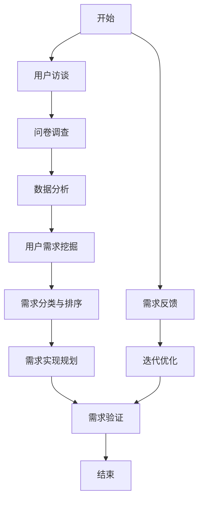

                 

### 用户需求的本质与价值

#### **1.1 用户需求的定义与分类**

**1.1.1 用户需求的定义**

用户需求，是指用户对某一产品或服务所期望满足的功能、特性或价值。它是一个动态变化的过程，随着用户对产品或服务的使用，以及市场环境的不断变化而不断演变。用户需求的定义可以从不同的角度进行理解和阐述，主要包括以下几个方面：

1. **功能性需求**：用户希望产品能够实现的功能，如电子邮箱的发送、接收邮件功能，搜索引擎的检索功能等。
2. **性能需求**：用户对产品性能的期望，如处理速度、响应时间、稳定性等。
3. **可靠性需求**：用户对产品在长期使用过程中保持稳定性能的期望，如系统的崩溃率、故障率等。
4. **易用性需求**：用户对产品操作简便、易于学习的期望，如用户界面的友好性、操作流程的简便性等。
5. **价值需求**：用户对产品或服务的性价比、投资回报等的期望，如产品价格是否合理、是否值得购买等。

**1.1.2 用户需求的分类**

用户需求可以根据其来源、重要性和实现难度进行分类。以下是几种常见的分类方法：

1. **按来源分类**：

   - **显性需求**：用户直接表达出的需求，通常通过用户访谈、问卷调查等方式获取。
   - **隐性需求**：用户潜在的需求，可能需要通过深度访谈或数据分析等方式挖掘。

2. **按重要性分类**：

   - **核心需求**：对产品或服务成功至关重要的需求，如电子邮件的核心功能是发送和接收邮件。
   - **次要需求**：对产品或服务有一定影响但非决定性的需求，如邮件的附件功能。

3. **按实现难度分类**：

   - **可量化需求**：可以通过具体指标或数据衡量实现难度的需求，如系统响应时间。
   - **不可量化需求**：无法通过具体指标或数据衡量的需求，如用户满意度。

#### **1.2 用户需求的重要性**

**1.2.1 用户需求与企业成功的关系**

用户需求是企业成功的基石。一个产品或服务如果不能满足用户的基本需求，很难在市场上获得成功。以下是用户需求对企业成功的一些重要影响：

1. **市场定位**：明确用户需求可以帮助企业确定产品的市场定位，从而更精准地满足目标用户的需求。
2. **产品创新**：了解用户需求可以激发企业的创新思维，通过不断优化产品功能、提升用户体验，实现产品迭代。
3. **竞争优势**：满足用户需求的产品或服务可以形成企业的竞争优势，提高市场占有率。
4. **用户忠诚度**：满足用户需求可以提升用户的满意度，增加用户忠诚度，降低用户流失率。

**1.2.2 用户需求与产品创新的关系**

用户需求是产品创新的源泉。通过深入挖掘用户需求，企业可以发现新的市场机会，开发出更符合用户期望的产品。以下是用户需求与产品创新之间的联系：

1. **发现市场需求**：用户需求可以帮助企业发现新的市场需求，从而引导产品创新。
2. **优化产品设计**：了解用户需求可以帮助企业优化产品设计，提升产品竞争力。
3. **改进用户体验**：通过满足用户需求，企业可以提升用户体验，增加用户黏性。
4. **推动技术创新**：用户需求可以推动企业进行技术创新，开发出更先进、更高效的产品。

综上所述，用户需求不仅是企业成功的关键因素，也是产品创新的源泉。企业需要通过多种途径获取用户需求，并进行深入分析，以指导产品设计和开发，实现企业的长期发展。

### **1.3 用户需求的演变**

用户需求是动态变化的，随着时间、技术、经济环境等因素的变化，用户需求也在不断演变。以下是用户需求演变的一些关键因素：

**1.3.1 时间因素**

随着时间的推移，用户的需求会发生变化。一方面，用户的生活习惯、消费观念等会随着时间的推移而发生变化，从而影响用户需求。另一方面，技术的不断进步也为用户需求提供了新的可能性。例如，移动互联网的普及使得用户对移动设备的需求大幅增加，智能手机、平板电脑等设备成为用户日常生活不可或缺的工具。

**1.3.2 技术因素**

技术的进步是推动用户需求演变的重要因素。新技术的出现往往能够满足用户未满足的需求，或者为用户创造新的需求。例如，云计算、大数据、人工智能等技术的崛起，为许多行业带来了新的商业模式和用户需求。以人工智能为例，智能语音助手、智能家居等产品已经成为许多家庭的必备设备，满足了用户对便捷、智能生活的需求。

**1.3.3 经济因素**

经济环境的变化也会影响用户需求。在经济繁荣时期，用户更倾向于购买高价值、高品质的产品或服务；而在经济衰退时期，用户则更注重产品的性价比。例如，在金融危机期间，许多消费者选择购买性价比较高的产品，以节约开支。

**1.3.4 社会文化因素**

社会文化因素也会对用户需求产生重要影响。不同的文化背景、价值观念、生活方式等会影响用户的需求偏好。例如，在一些崇尚环保的国家，用户对绿色、环保产品的需求更高；而在一些重视科技与创新的国家，用户对高科技产品的需求更强烈。

综上所述，用户需求的演变是一个复杂的过程，涉及多个因素的共同作用。企业需要密切关注这些因素的变化，及时调整产品策略，以满足用户不断变化的需求。

### **1.4 用户需求与商业模式的关系**

用户需求是商业模式的源头，它直接影响着企业的战略决策、产品定位和运营模式。以下是用户需求与商业模式之间的密切关系：

**1.4.1 用户需求驱动商业模式创新**

用户需求的变化往往能够激发商业模式的创新。通过深入研究用户需求，企业可以发现新的市场机会，开发出满足用户需求的新产品或服务。例如，移动互联网的兴起带来了移动支付的需求，催生了支付宝、微信支付等新的商业模式。这种基于用户需求驱动的商业模式创新，为企业带来了巨大的商业价值。

**1.4.2 用户需求影响产品定价策略**

用户需求直接影响产品的定价策略。了解用户对产品价格的敏感度，可以帮助企业制定合理的定价策略，提高产品竞争力。例如，一些高端电子产品在定价时，会考虑到用户对品质、品牌的偏好，从而采用高端定价策略；而一些大众消费品则会通过低价策略吸引更多消费者。

**1.4.3 用户需求决定市场推广方式**

用户需求决定了市场推广的方式和策略。通过了解用户的需求偏好，企业可以选择最合适的市场推广渠道，提高推广效果。例如，对于年轻用户，社交媒体、直播等新兴渠道可能更有效；而对于中年用户，传统的电视广告、报纸广告等渠道可能更有影响力。

**1.4.4 用户需求优化运营效率**

用户需求还可以优化企业的运营效率。通过了解用户需求，企业可以优化产品设计、生产流程、供应链管理等方面，提高运营效率。例如，一些电商平台通过用户数据分析和需求预测，优化库存管理，减少库存成本。

综上所述，用户需求与商业模式之间存在着紧密的联系。企业需要深入挖掘用户需求，将其作为商业模式创新的基础，以实现持续的商业成功。

### **1.5 用户需求分析的方法论**

用户需求分析是产品设计和开发过程中至关重要的一环，它有助于企业了解用户需求，优化产品设计，提升用户体验。以下是用户需求分析的方法论，包括用户访谈、问卷调查、数据分析等步骤：

**1.5.1 用户访谈**

用户访谈是一种深入了解用户需求的有效方法。通过面对面或在线访谈，可以与用户进行深入交流，获取用户对产品或服务的真实感受和建议。以下是用户访谈的步骤：

1. **确定访谈对象**：根据产品定位和用户群体，选择具有代表性的用户进行访谈。
2. **准备访谈问题**：设计有针对性的访谈问题，涵盖用户对产品的功能需求、性能需求、易用性需求等方面。
3. **进行访谈**：按照预定的访谈问题，与用户进行交流，记录用户的需求和反馈。
4. **整理访谈结果**：对访谈内容进行整理和分析，提炼出关键的用户需求。

**1.5.2 问卷调查**

问卷调查是一种大规模收集用户需求的方法，可以快速获取大量用户的意见和反馈。以下是问卷调查的步骤：

1. **设计问卷**：根据产品特点和用户需求，设计具有针对性的问卷，包括选择题、量表题等。
2. **发布问卷**：通过线上平台或线下渠道发布问卷，确保问卷的覆盖面和样本量。
3. **收集问卷**：在规定的时间内收集问卷，并对问卷结果进行初步整理。
4. **分析问卷**：对问卷结果进行统计分析，提取出关键的用户需求和趋势。

**1.5.3 数据分析**

数据分析是用户需求分析的重要手段，通过收集和分析用户行为数据，可以深入了解用户需求。以下是数据分析的步骤：

1. **数据收集**：通过网站日志、用户行为跟踪等手段，收集用户行为数据。
2. **数据预处理**：对收集到的数据进行分析前的预处理，如数据清洗、去重等。
3. **数据分析**：使用统计分析、机器学习等方法，对用户行为数据进行深入分析，提取出用户需求特征。
4. **数据可视化**：通过图表、报表等形式，将分析结果进行可视化展示，帮助用户更好地理解数据。

**1.5.4 用户需求验证**

在完成用户需求分析后，需要进行需求验证，以确保分析结果的准确性和可靠性。以下是用户需求验证的方法：

1. **用户回访**：通过回访访谈或问卷调查，验证用户需求分析结果的准确性。
2. **产品原型测试**：设计产品原型，邀请用户进行体验，收集用户对产品原型的反馈。
3. **市场调研**：通过市场调研，了解用户对产品的接受程度和需求满足情况。

通过以上用户需求分析的方法论，企业可以更准确地把握用户需求，为产品设计和开发提供有力支持，从而实现商业成功。

### **1.6 用户需求分析的实际案例**

在实际商业场景中，用户需求分析是企业制定战略、优化产品和服务的重要依据。以下通过几个实际案例，展示用户需求分析的应用和效果。

**案例一：亚马逊的用户需求分析**

亚马逊作为全球最大的电子商务平台，其成功离不开对用户需求的精准把握。通过数据分析和用户反馈，亚马逊不断优化产品和服务，提升用户体验。例如，亚马逊通过用户行为数据发现，一些用户在购买电子产品时更关注售后服务和保修政策。因此，亚马逊在产品详情页中增加了售后服务说明，并提供多种保修选择，满足用户需求。

**案例二：腾讯的用户需求分析**

腾讯在社交网络和游戏领域拥有庞大的用户基础，其成功也得益于对用户需求的深入分析。腾讯通过用户访谈、问卷调查和数据分析等多种方式，了解用户对社交功能和游戏体验的需求。例如，在微信的更新中，腾讯根据用户反馈，增加了视频通话、公众号等功能，满足用户对即时通讯和内容获取的需求。而在游戏方面，腾讯通过数据分析，发现用户更倾向于玩法简单、易于上手的游戏，因此推出了如《王者荣耀》等游戏，取得了巨大成功。

**案例三：阿里巴巴的用户需求分析**

阿里巴巴旗下的淘宝和天猫平台，通过对用户需求的深入分析，不断提升购物体验。例如，通过数据分析发现，一些用户在购物过程中更关注商品的评价和销量。因此，淘宝在商品详情页中增加了评价区和销量排名，帮助用户做出更明智的购买决策。此外，阿里巴巴还通过用户行为分析，优化了推荐算法，提高商品的点击率和购买转化率。

**案例四：小米的用户需求分析**

小米在手机和其他智能硬件领域取得了巨大成功，其背后的原因是小米对用户需求的精准把握。通过用户访谈和在线调查，小米了解用户对性价比、性能和设计的需求。例如，小米在手机产品中，注重性能和性价比的平衡，推出了一系列性能优异且价格合理的手机，满足了广大用户的购买需求。此外，小米还通过用户反馈，不断优化产品设计和功能，提高用户满意度。

通过这些实际案例，我们可以看到，用户需求分析在商业中的应用不仅有助于企业了解用户需求，优化产品和服务，还能为企业提供决策依据，实现商业成功。

### **1.7 用户需求与个性化推荐系统的关系**

个性化推荐系统是近年来在互联网领域中备受关注的技术，它通过分析用户行为数据和偏好，为用户推荐个性化的产品、内容和服务。用户需求与个性化推荐系统之间存在着密切的关系，以下是它们之间的主要关联：

**1.7.1 用户需求的驱动作用**

用户需求是个性化推荐系统的核心驱动因素。通过深入挖掘用户需求，推荐系统可以更好地理解用户的兴趣和偏好，从而提供更精准的推荐。例如，用户在购物平台上浏览某一类商品时，推荐系统可以根据用户的历史购买记录和浏览行为，推测用户可能感兴趣的同类商品，并进行推荐。这种基于用户需求的推荐，能够显著提升用户的购物体验和满意度。

**1.7.2 用户反馈的优化机制**

个性化推荐系统通过收集用户反馈，不断优化推荐算法和模型。用户在接收推荐后，通过点击、购买、评分等行为，表达对推荐内容的态度。这些反馈数据被系统用来调整推荐策略，提高推荐的准确性和相关性。例如，如果用户对某一类推荐内容表现出高兴趣，推荐系统会加大对该类内容的推荐力度；如果用户对某一类推荐内容不感兴趣，系统则会减少对该类内容的推荐。通过这种用户反馈的优化机制，推荐系统可以更好地满足用户需求，提高用户黏性和满意度。

**1.7.3 用户需求的动态变化**

用户需求是动态变化的，个性化推荐系统需要不断适应这种变化，以保持推荐的时效性和准确性。例如，用户在不同时间段、不同场景下对内容的需求可能会有所不同。个性化推荐系统需要根据用户行为数据的实时变化，动态调整推荐策略，确保推荐内容始终符合用户当前的需求和兴趣。这种动态适应能力，使得个性化推荐系统能够更好地满足用户的个性化需求。

**1.7.4 用户需求与推荐系统效果的评价**

个性化推荐系统的效果评价往往基于用户需求满足的程度。系统性能评估指标，如推荐覆盖率、推荐精准度、用户满意度等，都直接或间接地与用户需求相关。如果推荐系统能够有效满足用户需求，提高用户满意度和忠诚度，则可以认为推荐系统取得了良好的效果。因此，用户需求是评价推荐系统性能的重要标准。

综上所述，用户需求与个性化推荐系统之间存在着密切的关系。个性化推荐系统通过挖掘用户需求，优化推荐算法和模型，实现用户需求的满足，从而提升系统的性能和用户体验。

### **1.8 用户需求的多样性挑战**

在用户需求分析中，我们常常面临一个重要挑战，那就是用户需求的多样性。用户需求不仅复杂多变，而且往往具有个体差异，这使得满足所有用户的需求变得异常困难。以下是对用户需求多样性的深入探讨及解决策略：

**1.8.1 用户需求的多样性来源**

用户需求的多样性主要来自以下几个方面：

1. **个体差异**：每个用户都有其独特的背景、经验、偏好和期望，这使得他们对同一产品或服务的需求各不相同。例如，同一款手机，年轻用户可能更关注拍照效果和游戏性能，而中老年用户则更看重通话质量和电池续航。
2. **情境差异**：用户在不同情境下对产品或服务的需求也会有所不同。例如，用户在休闲时间可能更愿意使用社交媒体，而在工作中则可能更关注办公软件的功能和效率。
3. **文化差异**：不同的文化背景和价值观念也会影响用户需求。例如，在一些文化中，用户更注重产品的实用性和性价比，而在一些文化中，用户则更看重产品的品牌和设计。
4. **时代变迁**：随着社会的发展，用户需求也在不断变化。例如，随着移动互联网的普及，用户对移动端应用的需求不断增加，而对传统PC端应用的需求则逐渐减少。

**1.8.2 满足多样性需求的挑战**

满足用户需求的多样性带来了以下挑战：

1. **资源分配**：企业需要在有限的资源下，满足不同用户群体的需求。这可能导致资源分配不均，使得部分用户的需求无法得到充分满足。
2. **产品复杂性**：为了满足不同用户的需求，产品可能需要具备更多的功能和特性，从而增加产品的复杂性和开发难度。
3. **用户体验一致性**：在满足多样性需求的同时，还需要确保用户体验的一致性。如果不同用户对同一产品的体验差异过大，可能会影响产品的整体评价。
4. **市场定位**：企业需要明确目标用户群体，针对特定用户群体的需求进行产品设计和推广。然而，用户需求的多样性可能导致市场定位的模糊，影响市场推广效果。

**1.8.3 解决策略**

为了应对用户需求的多样性挑战，企业可以采取以下策略：

1. **差异化产品策略**：针对不同用户群体的需求，开发具有差异化的产品线，满足不同用户的需求。例如，针对高端用户群体，可以推出功能丰富、设计高端的产品；针对大众用户群体，可以推出性价比高的产品。
2. **灵活的产品设计**：在设计产品时，采用模块化、组件化的设计理念，使得产品可以灵活地扩展和定制。例如，手机可以通过可选配件，满足不同用户的需求。
3. **个性化服务**：通过个性化推荐、定制化服务等手段，提升用户的个性化体验。例如，电商平台可以根据用户的浏览和购买历史，为用户推荐个性化的商品。
4. **用户参与设计**：鼓励用户参与产品设计和开发，收集用户反馈和建议，优化产品功能和体验。例如，通过用户调研、用户测试等方式，让用户直接参与到产品改进过程中。
5. **细分市场策略**：针对特定用户群体，进行市场细分，制定有针对性的市场推广策略。例如，针对年轻用户，可以采用社交媒体营销、网红推广等方式。

通过以上策略，企业可以在满足用户多样性需求的同时，保持产品的整体一致性和用户体验的优质。

### **1.9 用户需求分析中的常见误区**

在用户需求分析过程中，企业常常会因为一些误区而无法准确把握用户需求，导致产品设计和推广效果不理想。以下是用户需求分析中的几个常见误区：

**1.9.1 过度依赖数据**

数据分析是用户需求分析的重要手段，但过度依赖数据可能导致对用户需求的误解。数据分析只能提供用户行为的统计结果，而无法完全反映用户的真实需求和感受。例如，通过数据分析发现某个功能使用频率高，但这并不意味着用户真正需要这个功能。

**1.9.2 忽视用户反馈**

用户反馈是了解用户需求的重要途径，但许多企业在用户需求分析过程中，往往忽视用户的直接反馈。用户通过访谈、问卷调查等方式提供的反馈，往往能够揭示用户的需求和痛点，帮助企业更好地满足用户需求。

**1.9.3 未能区分用户需求和商业目标**

在用户需求分析中，企业往往未能区分用户需求和商业目标，导致产品设计偏离商业方向。用户需求只是产品设计和开发的基础，企业还需要考虑商业目标，如盈利模式、市场占有率等。如果仅关注用户需求，而忽视商业目标，可能会导致产品无法实现商业成功。

**1.9.4 缺乏持续的用户需求跟踪**

用户需求是动态变化的，企业需要持续跟踪用户需求，以应对市场变化和用户行为的变化。许多企业在完成一次用户需求分析后，就停止了跟踪工作，导致产品设计和推广无法及时调整，无法满足不断变化的用户需求。

**1.9.5 忽视跨部门协作**

用户需求分析往往涉及多个部门，如市场部、研发部、产品部等。如果各部门之间缺乏协作，可能导致用户需求分析的不全面和不准确。跨部门协作可以确保用户需求分析的全面性和准确性，提高产品设计和开发的效率。

综上所述，用户需求分析中的常见误区包括过度依赖数据、忽视用户反馈、未能区分用户需求和商业目标、缺乏持续的用户需求跟踪以及忽视跨部门协作。企业需要避免这些误区，以更准确地把握用户需求，提升产品设计和推广效果。

### **1.10 用户需求分析中的误区和挑战**

在用户需求分析过程中，企业常常会遇到一些误区和挑战，这些因素可能会影响分析结果的准确性和有效性。以下是对这些误区和挑战的深入探讨及应对策略。

**1.10.1 数据偏差**

数据分析是用户需求分析的重要环节，但数据分析本身可能存在偏差。数据偏差主要来源于数据收集过程的不准确性和不完整性。例如，样本量不足、数据来源单一、数据质量低等问题都可能导致数据分析结果失真。应对策略包括：

- **扩大样本量**：通过增加样本量，提高数据分析的代表性和准确性。
- **多渠道数据收集**：结合多种数据收集渠道，如问卷调查、用户反馈、行为数据等，确保数据的多样性和全面性。
- **数据清洗**：对收集到的数据进行清洗，去除重复、错误和缺失的数据，提高数据质量。

**1.10.2 用户行为解释的局限性**

用户行为数据虽然可以提供丰富的信息，但有时候难以直接解释用户需求。例如，用户可能在某个时间段内频繁点击某一功能，但未必意味着他们真正需要这个功能。应对策略包括：

- **结合用户反馈**：通过用户访谈、问卷调查等方式，结合用户行为数据，深入了解用户的需求和痛点。
- **情境分析**：分析用户行为背后的情境，了解用户在不同情境下的需求变化。
- **用户分组分析**：将用户按不同特征进行分组，分析不同用户群体的需求差异。

**1.10.3 跨部门协作困难**

用户需求分析通常涉及多个部门，如市场部、研发部、产品部等。跨部门协作不畅可能导致需求分析的不全面和不准确。应对策略包括：

- **建立需求分析团队**：成立跨部门的需求分析团队，确保各部门之间的沟通和协作。
- **定期会议和汇报**：定期召开需求分析会议，汇报分析进展和结果，确保各部门及时了解需求分析情况。
- **明确责任和角色**：明确各成员在需求分析过程中的职责和角色，确保任务分工明确，提高协作效率。

**1.10.4 用户需求的动态性**

用户需求是动态变化的，企业需要持续跟踪用户需求，以应对市场变化和用户行为的变化。但许多企业在完成一次用户需求分析后，就停止了跟踪工作，导致产品设计和推广无法及时调整。应对策略包括：

- **建立需求跟踪机制**：制定需求跟踪计划，定期收集和分析用户反馈，确保需求分析结果的时效性和准确性。
- **实时数据监控**：通过实时数据监控，及时发现用户需求的变化，快速响应市场变化。
- **用户参与设计**：鼓励用户参与产品设计和改进，通过用户调研、用户测试等方式，持续获取用户反馈。

通过应对这些误区和挑战，企业可以更准确地把握用户需求，提高产品设计和推广的效果，实现商业成功。

### **1.11 用户需求的动态性与持续跟踪**

在快速变化的市场环境中，用户需求具有高度的动态性。这种动态性使得企业在产品设计和推广过程中需要不断调整策略，以满足用户不断变化的需求。因此，持续跟踪用户需求成为企业保持市场竞争力和用户满意度的重要手段。

**1.11.1 用户需求动态性的原因**

用户需求动态性主要源于以下几个因素：

1. **技术进步**：技术的快速迭代使得用户对产品的期望不断提高。例如，人工智能、物联网等新技术的出现，为用户提供了更多样化的产品和服务选择。
2. **市场变化**：市场竞争的加剧和新兴市场的崛起，迫使企业不断调整产品策略，以吸引和保持用户。例如，新兴市场的出现可能会改变用户的消费习惯和偏好。
3. **用户行为变化**：用户行为的变化，如消费习惯、生活方式、价值观念等，也会影响用户需求。例如，随着移动互联网的普及，用户越来越倾向于使用移动端产品和服务。
4. **政策法规**：政策法规的调整，如数据保护法规、环保法规等，可能会对用户需求产生重大影响。例如，数据保护法规的加强，可能会改变用户对隐私和数据安全的关注。

**1.11.2 持续跟踪用户需求的重要性**

持续跟踪用户需求具有以下重要性：

1. **保持市场竞争力**：通过持续跟踪用户需求，企业可以及时了解市场趋势和用户偏好，从而调整产品策略，保持市场竞争力。
2. **优化产品和服务**：了解用户需求的变化，有助于企业不断优化产品和服务，提升用户满意度和忠诚度。
3. **降低开发风险**：通过持续跟踪用户需求，企业可以在产品开发过程中及时发现潜在问题和风险，降低开发成本和失败风险。
4. **提高决策效率**：持续跟踪用户需求，可以帮助企业快速做出市场决策，提高决策效率和准确性。

**1.11.3 用户需求跟踪的方法与策略**

为了有效持续跟踪用户需求，企业可以采取以下方法与策略：

1. **定期用户调研**：定期进行用户调研，通过问卷调查、访谈等方式，收集用户对产品和服务的需求和反馈。
2. **用户行为分析**：通过分析用户行为数据，如点击率、购买行为、评价等，了解用户需求和偏好。
3. **用户参与设计**：鼓励用户参与产品设计和改进，通过用户测试、用户体验等方式，获取真实用户的反馈和建议。
4. **实时数据监控**：利用实时数据监控工具，实时跟踪用户需求变化，及时调整产品策略。
5. **跨部门协作**：建立跨部门协作机制，确保需求跟踪的全面性和准确性。

通过以上方法与策略，企业可以更有效地持续跟踪用户需求，满足用户不断变化的需求，保持市场竞争力和用户满意度。

### **1.12 用户需求分析对企业产品创新的推动作用**

用户需求分析在企业产品创新中发挥着至关重要的作用，它不仅是产品创新的基础，也是推动企业持续发展的动力源泉。以下是用户需求分析如何推动企业产品创新的详细探讨：

**1.12.1 识别市场机会**

通过深入分析用户需求，企业可以识别出潜在的市场机会。例如，用户可能对某些功能或特性有强烈需求，而这些需求在市场上尚未得到充分满足。这种市场机会的识别为企业提供了创新的方向，促使企业开发出更具竞争力的产品。

**1.12.2 确定创新方向**

用户需求分析可以帮助企业明确创新的方向。通过了解用户对现有产品的评价和使用情况，企业可以发现产品中存在的痛点和不足。这些信息为企业的产品创新提供了具体的改进方向，例如改进现有功能、增加新特性或开发全新的产品。

**1.12.3 提高创新效率**

用户需求分析有助于提高创新效率。通过明确用户需求，企业可以集中资源开发用户真正需要的产品功能，避免资源浪费在无关紧要的创新上。此外，用户需求分析还可以帮助企业快速验证创新想法的可行性，减少开发风险。

**1.12.4 优化用户体验**

用户需求分析强调以用户为中心的产品设计理念，这有助于企业优化用户体验。通过了解用户对产品功能、易用性、性能等方面的期望，企业可以设计出更符合用户需求的产品，提升用户的满意度和忠诚度。

**1.12.5 创新成果的市场化**

用户需求分析不仅有助于产品创新，还能推动创新成果的市场化。通过用户需求分析，企业可以确定目标市场，制定有针对性的市场推广策略，确保创新产品能够快速进入市场并获得用户的认可。

**1.12.6 持续创新**

用户需求分析是一个持续的过程，它要求企业不断关注用户需求的变化，以实现产品的持续创新。通过定期进行用户需求分析，企业可以及时调整产品策略，确保产品始终符合市场需求，从而保持企业的市场竞争力。

综上所述，用户需求分析在企业产品创新中具有重要作用。它不仅为企业提供了市场机会和明确创新方向，还提高了创新效率和用户体验，推动了企业的持续发展和市场竞争力。

### **1.13 用户需求的分类与层次分析**

用户需求是企业产品设计和开发的核心，对其进行分类和层次分析有助于企业更深入地理解用户需求，从而设计出更符合用户期望的产品。以下是用户需求的分类及其层次分析：

**1.13.1 用户需求的分类**

用户需求可以从多个维度进行分类，常见的分类方法包括：

1. **按功能需求分类**：功能需求是指用户期望产品实现的具体功能。例如，电子邮件服务的发送和接收邮件功能、社交媒体的发布和评论功能等。

2. **按性能需求分类**：性能需求是指用户对产品性能的期望，如处理速度、响应时间、稳定性等。例如，用户希望搜索引擎能够快速返回搜索结果，希望电子邮箱系统在高峰期能够稳定运行。

3. **按可靠性需求分类**：可靠性需求是指用户对产品稳定性和可靠性的期望。例如，用户希望手机电池续航时间长，希望软件系统在长时间使用后仍能保持稳定。

4. **按易用性需求分类**：易用性需求是指用户对产品操作简便、易于学习的期望。例如，用户希望产品的用户界面直观、操作流程简单。

5. **按价值需求分类**：价值需求是指用户对产品性价比、投资回报等的期望。例如，用户希望产品价格合理、性能优越。

**1.13.2 用户需求的层次分析**

为了更深入地理解用户需求，可以将用户需求分为多个层次，常见的层次包括：

1. **需求识别层**：需求识别层是用户需求分析的第一步，主要任务是识别用户需求。这一层次通常通过用户访谈、问卷调查、市场调研等方式获取用户需求。

2. **需求分析层**：需求分析层是在需求识别层的基础上，对用户需求进行深入分析。这一层次的任务是理解用户需求背后的原因和动机，包括用户的行为模式、价值观念、情感偏好等。

3. **需求分类层**：需求分类层是对分析后的用户需求进行分类，便于后续的需求管理和优先级排序。常见的分类方法包括按功能、性能、可靠性、易用性、价值等分类。

4. **需求优先级排序层**：需求优先级排序层是在用户需求分类的基础上，对需求进行优先级排序。这一层次的任务是根据用户需求的重要性和实现难度，确定哪些需求需要优先实现。

5. **需求实现层**：需求实现层是将优先级较高的需求转化为具体的产品功能和服务。这一层次的任务是制定详细的产品设计和开发计划，确保需求能够得到有效实现。

6. **需求验证层**：需求验证层是在需求实现后，对产品功能和服务进行验证，确保满足用户需求。这一层次的任务是进行用户测试、市场测试等，收集用户反馈，评估产品性能和用户体验。

通过用户需求的分类与层次分析，企业可以更系统地理解和满足用户需求，提高产品的竞争力和用户满意度。

### **1.14 用户需求与市场细分策略**

用户需求的市场细分策略是企业产品定位和市场营销的重要手段。通过深入分析用户需求，企业可以识别出具有相似需求的用户群体，制定有针对性的市场细分策略，从而提高市场营销的效果和效率。以下是用户需求与市场细分策略的详细探讨：

**1.14.1 市场细分策略的概念**

市场细分策略是指将整体市场划分为若干具有相似需求和行为的子市场，以便企业能够更精准地满足不同用户群体的需求。市场细分策略主要包括以下几个步骤：

1. **识别细分变量**：细分变量是市场细分的基础，通常包括地理、人口、心理和行为变量。地理变量如地域、气候等；人口变量如年龄、性别、收入、教育水平等；心理变量如价值观、生活方式、兴趣爱好等；行为变量如购买习惯、使用频率、品牌偏好等。

2. **评估细分变量的重要性**：企业需要评估各个细分变量对用户需求的影响程度，选择对用户需求影响较大的变量作为细分标准。

3. **定义细分市场**：根据评估后的细分变量，将整体市场划分为具有相似需求的子市场。每个细分市场代表一类特定的用户群体。

4. **选择目标市场**：企业需要根据自身的资源能力和市场定位，选择最有潜力和最有利可图的细分市场作为目标市场。

5. **制定市场营销策略**：针对目标市场，制定有针对性的市场营销策略，包括产品定位、价格策略、推广渠道、服务等。

**1.14.2 用户需求与市场细分策略的关系**

用户需求与市场细分策略之间存在密切的关系。通过深入分析用户需求，企业可以更好地理解不同用户群体的需求特征和行为模式，从而制定更有效的市场细分策略。以下是用户需求与市场细分策略之间的关系：

1. **识别用户需求差异**：用户需求的差异是市场细分的基础。通过分析用户需求，企业可以发现不同用户群体的需求差异，从而为市场细分提供依据。

2. **满足个性化需求**：市场细分策略有助于企业更好地满足用户的个性化需求。通过针对不同用户群体的需求特点，企业可以提供更符合用户期望的产品和服务，提高用户满意度和忠诚度。

3. **提高市场占有率**：市场细分策略有助于企业提高市场占有率。通过针对特定用户群体的需求进行营销，企业可以更有效地吸引和留住目标用户，提高市场份额。

4. **优化资源分配**：市场细分策略有助于企业优化资源分配。通过明确目标市场，企业可以集中资源，提高营销活动的针对性和效果，降低营销成本。

5. **推动产品创新**：市场细分策略可以激发企业的产品创新。通过深入了解用户需求，企业可以发现新的市场机会，推动产品创新，开发出更具竞争力的产品。

综上所述，用户需求与市场细分策略之间存在着紧密的联系。通过深入分析用户需求，企业可以制定更有效的市场细分策略，提高市场营销的效果和效率，实现企业的持续发展。

### **1.15 用户需求与用户体验的关系**

用户需求与用户体验之间存在紧密的关系，用户体验是用户需求的直接体现。一个优秀的产品应该能够充分满足用户需求，同时提供出色的用户体验。以下是用户需求与用户体验之间的关联及其重要性：

**1.15.1 用户需求与用户体验的关联**

1. **用户需求驱动用户体验**：用户需求是用户体验的基础。产品的设计、功能、性能等都是围绕用户需求展开的。例如，用户希望电子邮件系统能够快速发送和接收邮件，因此，电子邮件系统的设计应注重发送速度和接收效率。

2. **用户体验反映用户需求**：用户体验是用户对产品或服务使用过程中的感受和体验。用户的满意度、忠诚度和活跃度等指标都可以从用户体验中反映出来。如果用户体验不佳，用户可能会感到失望，从而影响用户需求的满足。

3. **用户体验影响用户需求**：用户体验不仅影响当前用户的需求，还可能影响潜在用户的需求。一个优秀的用户体验可以吸引用户，增强用户忠诚度，从而推动用户需求的增长。

**1.15.2 用户体验的重要性**

1. **提高用户满意度**：优秀的用户体验可以提高用户的满意度，使用户感到产品或服务物有所值。当用户感到满意时，他们更有可能继续使用产品，甚至推荐给他人。

2. **增强用户忠诚度**：良好的用户体验可以增强用户对产品的忠诚度。忠诚的用户不仅会持续使用产品，还可能成为产品的传播者，帮助企业吸引更多用户。

3. **促进产品口碑**：优秀的用户体验可以提升产品的口碑。用户在社交网络、论坛等平台上分享良好的体验，可以吸引更多潜在用户，扩大产品的影响力。

4. **降低用户流失率**：如果用户体验不佳，用户可能会转向其他竞争对手的产品。因此，良好的用户体验可以降低用户流失率，帮助企业保持用户群体稳定。

5. **推动产品迭代和创新**：用户体验的反馈可以帮助企业发现产品的问题和不足，推动产品的迭代和创新。通过不断优化用户体验，企业可以不断提升产品的竞争力。

综上所述，用户体验是用户需求的重要体现，对企业具有重要意义。通过关注用户体验，企业可以更好地满足用户需求，提高用户满意度、忠诚度和口碑，实现持续的商业成功。

### **1.16 用户需求的多样性与用户体验的统一**

在当今复杂多变的市场环境中，用户需求的多样性与用户体验的统一成为企业面临的一大挑战。用户需求的多样性使得企业需要在满足不同用户群体需求的同时，确保用户体验的一致性。以下是如何在用户需求的多样性与用户体验的统一之间找到平衡的探讨：

**1.16.1 用户需求的多样性**

用户需求的多样性主要体现在以下几个方面：

1. **个性化需求**：每个用户都有其独特的需求，例如，对于同一种类的产品，不同用户可能对功能、性能、设计等有不同的偏好。

2. **情境需求**：用户在不同情境下对产品或服务的需求也会有所不同。例如，在工作环境中，用户可能更关注效率和专业性；而在休闲时间，用户可能更关注娱乐和轻松。

3. **文化需求**：不同文化背景的用户对产品或服务的期望也有所不同。例如，在东方文化中，用户可能更注重产品的实用性和稳定性；而在西方文化中，用户可能更看重产品的创新和个性化。

**1.16.2 用户体验的统一性**

用户体验的统一性指的是在满足多样用户需求的同时，确保用户体验的一致性和连贯性。以下是实现用户体验统一性的几个关键点：

1. **核心体验一致**：在产品设计和开发过程中，应确保所有用户能够体验到产品的核心价值。例如，对于一款社交媒体应用，所有用户都应该能够轻松地发布、浏览和互动。

2. **界面设计统一**：界面设计应保持一致，包括色彩、字体、布局等，使用户在不同设备和平台上的体验一致。这有助于建立品牌形象，增强用户对品牌的认同感。

3. **交互流程连贯**：用户在不同功能模块间的交互流程应连贯一致，减少用户在使用过程中的困惑。例如，在电商平台中，用户的购物流程应简洁明了，从浏览、选择、下单到支付，每个环节都应流畅自然。

4. **功能细节优化**：在满足用户多样化需求的同时，细节上的优化也是保证用户体验统一性的关键。例如，为不同用户提供定制化的服务，但整体的使用逻辑和流程保持一致。

**1.16.3 平衡策略**

在用户需求的多样性与用户体验的统一性之间找到平衡，企业可以采取以下策略：

1. **分层设计**：针对不同用户群体的需求，采用分层设计的方法。在保持核心功能一致的前提下，针对特定用户群体进行个性化定制，满足他们的特殊需求。

2. **模块化开发**：通过模块化开发，将产品的功能划分为独立模块，便于根据不同用户需求进行灵活组合和调整，同时确保用户体验的一致性。

3. **用户体验测试**：在产品设计和开发过程中，定期进行用户体验测试，收集用户反馈，及时调整和优化产品功能，确保用户体验的统一性。

4. **用户调研与参与**：通过用户调研和参与，了解用户需求的变化，及时调整产品策略，以满足不同用户的需求，同时确保用户体验的一致性。

5. **品牌一致性**：在满足多样化需求的同时，保持品牌的一致性，通过品牌形象、文化内涵等传递给用户，增强用户的品牌认同感。

综上所述，在用户需求的多样性与用户体验的统一性之间找到平衡，是企业实现持续发展的关键。通过分层设计、模块化开发、用户体验测试、用户调研与参与以及品牌一致性等策略，企业可以在满足用户多样化需求的同时，提供统一的用户体验。

### **1.17 用户需求的进化与产品迭代**

在动态变化的市场环境中，用户需求不断进化，这要求企业不断进行产品迭代，以满足用户的新需求。以下是用户需求进化与产品迭代之间的关联及其重要性：

**1.17.1 用户需求的进化**

用户需求进化是指用户需求随着时间的推移和环境的变化而不断演变。以下是用户需求进化的几个主要方面：

1. **技术驱动**：随着新技术的不断涌现，用户的需求也会随之发生变化。例如，5G技术的普及推动了移动应用的性能和速度需求。

2. **社会文化变迁**：社会文化的变迁会影响用户需求。例如，随着人们对环境保护意识的增强，绿色、环保产品成为用户的新需求。

3. **生活方式变化**：用户生活方式的变化也会影响需求。例如，随着远程办公的普及，用户对办公软件的需求增加。

**1.17.2 产品迭代的重要性**

产品迭代是应对用户需求进化的关键策略，其重要性体现在以下几个方面：

1. **满足新需求**：通过产品迭代，企业可以不断引入新的功能和服务，满足用户的新需求，保持产品的竞争力。

2. **提升用户体验**：产品迭代有助于优化用户体验，解决现有产品的问题，提高用户满意度。

3. **保持市场竞争力**：持续的产品迭代可以确保企业在市场竞争中保持领先地位，避免被市场淘汰。

4. **促进创新**：产品迭代可以激发企业的创新思维，推动产品和服务不断创新，实现企业的可持续发展。

**1.17.3 用户需求进化与产品迭代的关系**

用户需求进化与产品迭代之间存在着密切的关系：

1. **用户需求驱动迭代**：用户需求是产品迭代的主要驱动力。通过分析用户需求的变化，企业可以确定产品迭代的方向和重点。

2. **迭代满足需求**：产品迭代是为了更好地满足用户需求。通过不断优化产品功能、提升性能和用户体验，企业可以持续满足用户的需求。

3. **迭代促进需求进化**：产品迭代不仅满足现有需求，还可以激发用户新的需求。通过提供更先进的功能和服务，企业可以引导用户需求向更高层次进化。

4. **迭代与反馈循环**：产品迭代是一个不断循环的过程。通过收集用户反馈，企业可以进一步优化产品，促进需求进化和迭代升级。

综上所述，用户需求的进化与产品迭代之间存在着紧密的联系。企业需要通过持续的产品迭代，满足用户不断变化的需求，保持市场竞争力，推动企业的持续发展。

### **1.18 用户需求的进化与商业模式创新**

在当今快速变化的市场环境中，用户需求不断进化，这对企业商业模式创新提出了新的挑战和机遇。以下是用户需求进化与商业模式创新之间的关联及其重要性：

**1.18.1 用户需求的进化**

用户需求进化是指用户需求随着时间推移和环境变化而不断演变。以下是用户需求进化的几个主要方面：

1. **技术驱动**：新技术的不断涌现改变了用户的生活和工作方式，推动了用户需求的进化。例如，移动互联网的普及和智能设备的普及，使得用户对即时通讯、在线购物等需求日益增长。

2. **社会文化变迁**：社会文化的变迁也会影响用户需求。例如，随着人们对环境保护、健康生活的关注增加，绿色、环保产品成为用户的新需求。

3. **生活方式变化**：用户生活方式的变化会影响需求。例如，随着城市化进程的加快，用户对便捷、高效的服务需求增加。

**1.18.2 商业模式创新**

商业模式创新是企业适应市场变化、满足用户需求的重要手段。商业模式创新是指企业通过改变价值创造、传递和获取的方式，实现盈利模式和企业竞争力的提升。以下是商业模式创新的几个主要方面：

1. **产品和服务创新**：通过提供新颖的产品和服务，企业可以满足用户的新需求。例如，共享经济的兴起改变了人们的出行和住宿方式。

2. **盈利模式创新**：企业可以通过改变盈利模式，实现收入的多元化。例如，通过数据服务、订阅模式等实现收入的持续增长。

3. **运营模式创新**：通过优化运营模式，企业可以提高运营效率，降低成本。例如，云计算技术的应用，使得企业能够以更低的成本提供强大的计算能力。

**1.18.3 用户需求进化与商业模式创新的关系**

用户需求进化与商业模式创新之间存在密切的关系：

1. **用户需求驱动创新**：用户需求的进化是商业模式创新的主要驱动力。企业需要通过不断创新，满足用户的新需求，保持市场竞争力。

2. **创新满足需求**：商业模式创新是为了更好地满足用户需求。通过提供新颖的产品和服务，优化盈利模式和运营模式，企业可以持续满足用户需求。

3. **创新促进需求进化**：商业模式创新不仅满足现有需求，还可以激发用户新的需求。例如，社交媒体平台的兴起，推动了用户对即时通讯、内容分享等需求的发展。

4. **创新与反馈循环**：商业模式创新是一个不断循环的过程。通过收集用户反馈，企业可以进一步优化商业模式，促进需求进化和创新。

**1.18.4 用户需求进化对商业模式创新的重要性**

用户需求进化对商业模式创新具有以下几个重要性：

1. **发现新市场机会**：用户需求的进化可以帮助企业发现新的市场机会，从而实现业务扩展和增长。

2. **提升竞争力**：通过不断创新，企业可以提升竞争力，避免被市场淘汰。

3. **实现可持续发展**：满足用户不断变化的需求，是企业实现可持续发展的关键。

4. **优化资源分配**：用户需求进化可以帮助企业优化资源分配，提高资源利用效率，降低成本。

综上所述，用户需求进化与商业模式创新之间存在着紧密的联系。企业需要通过不断创新，满足用户需求，推动商业模式创新，实现持续发展。

### **1.19 用户需求的复杂性与商业模式的适应性**

用户需求具有复杂性和多样性，这给商业模式的设计和实施带来了挑战。然而，通过深入理解和分析用户需求，企业可以开发出适应复杂需求的商业模式，从而在竞争激烈的市场中脱颖而出。以下是用户需求复杂性与商业模式的适应性之间的探讨：

**1.19.1 用户需求的复杂性**

用户需求的复杂性主要体现在以下几个方面：

1. **多维度需求**：用户需求往往涉及多个维度，包括功能需求、性能需求、易用性需求、价值需求等。例如，用户在购买手机时，不仅关注手机的拍照效果和游戏性能，还关注价格和售后服务。

2. **动态变化**：用户需求是动态变化的，随着时间、技术、经济环境的变化，用户的需求也会发生改变。例如，随着5G技术的普及，用户对高速网络和高质量视频的需求增加。

3. **个性化和差异化**：每个用户都有其独特的需求，这使得用户需求具有个性化和差异化的特点。企业需要根据不同用户的需求，提供定制化的产品和服务。

**1.19.2 商业模式的适应性**

商业模式需要具备适应性，以应对用户需求的复杂性和多样性。以下是几种适应复杂需求的商业模式：

1. **平台模式**：平台模式通过连接供需双方，提供开放的平台，让用户根据自己的需求进行选择。例如，电商平台通过提供多种商品选择，满足用户的个性化需求。

2. **订阅模式**：订阅模式通过定期收费，提供持续的服务或内容，满足用户的长期需求。例如，会员制服务、软件即服务（SaaS）等，可以满足用户对持续性和稳定性的需求。

3. **共享经济模式**：共享经济模式通过共享资源，降低用户的成本，满足用户的临时需求。例如，共享单车、共享办公等，满足了用户对便捷性和灵活性的需求。

4. **多元化模式**：多元化模式通过提供多样化的产品和服务，满足用户的多样化需求。例如，大型科技公司通过提供硬件、软件、服务等多种产品，满足用户的不同需求。

**1.19.3 提高商业模式适应性的策略**

为了提高商业模式对复杂用户需求的适应性，企业可以采取以下策略：

1. **用户需求分析**：通过深入分析用户需求，了解用户需求的复杂性和多样性，为企业提供制定适应性的商业模式提供依据。

2. **灵活的运营模式**：建立灵活的运营模式，能够快速响应市场变化和用户需求。例如，通过采用敏捷开发方法，快速迭代产品，满足用户的新需求。

3. **创新能力的提升**：通过持续创新，不断推出新产品和服务，满足用户不断变化的需求。例如，通过投资研发，推动技术创新，提高产品的竞争力。

4. **跨部门协作**：建立跨部门协作机制，确保不同部门能够紧密合作，共同应对复杂用户需求。例如，产品、研发、市场等部门之间的密切沟通，可以提高产品设计的适应性和市场推广的效果。

5. **用户反馈机制**：建立用户反馈机制，及时收集用户反馈，分析用户需求的变化，及时调整商业模式。例如，通过用户调研、在线反馈等手段，及时了解用户需求和满意度。

综上所述，用户需求的复杂性和多样性对商业模式提出了挑战，但通过深入理解和分析用户需求，企业可以开发出适应复杂需求的商业模式，从而在竞争激烈的市场中实现成功。

### **1.20 用户需求分析与创业实践**

在创业实践中，用户需求分析是确保产品成功和市场认可的关键步骤。通过深入了解用户需求，创业公司可以开发出满足市场需求的产品，从而在竞争激烈的市场中脱颖而出。以下是用户需求分析在创业实践中的应用和重要性：

**1.20.1 用户需求分析在创业实践中的应用**

1. **市场定位**：通过用户需求分析，创业公司可以明确目标市场和用户群体，为产品定位提供依据。例如，通过用户调研，了解用户对特定产品或服务的需求和偏好，有助于创业公司确定产品的市场方向。

2. **产品设计**：用户需求分析有助于创业公司设计出满足用户需求的产品。通过访谈、问卷调查、用户测试等方法，创业公司可以获取用户的真实反馈，从而优化产品功能、界面设计和用户体验。

3. **商业模式**：用户需求分析可以为创业公司提供制定商业模式的依据。了解用户需求有助于创业公司确定定价策略、市场推广渠道和合作伙伴关系等，从而实现商业模式的可持续性。

4. **风险评估**：通过用户需求分析，创业公司可以识别潜在的市场风险和竞争压力。例如，了解用户对竞争对手的评价和期望，有助于创业公司制定应对策略，降低市场风险。

**1.20.2 用户需求分析的重要性**

1. **产品成功的关键**：用户需求分析是确保产品成功的关键。通过深入挖掘用户需求，创业公司可以开发出符合用户期望的产品，提高产品的市场接受度和用户满意度。

2. **市场定位的保障**：用户需求分析有助于创业公司准确市场定位，避免盲目跟风或定位不准确。通过分析用户需求，创业公司可以找到市场空缺和机会，制定有针对性的市场策略。

3. **竞争优势的源泉**：用户需求分析可以帮助创业公司发现用户需求中的差异化和竞争优势。通过满足用户独特的需求，创业公司可以打造独特的品牌和产品，形成竞争优势。

4. **持续创新的动力**：用户需求分析不仅有助于现有产品的改进，还可以激发创业公司的创新思维。通过持续关注用户需求的变化，创业公司可以不断优化产品，推动技术创新，保持市场竞争力。

综上所述，用户需求分析在创业实践中具有至关重要的作用。通过深入了解用户需求，创业公司可以制定有效的市场策略，开发出满足市场需求的产品，从而实现商业成功。

### **1.21 用户需求分析的方法论**

用户需求分析是企业产品设计和市场策略制定的关键环节。为了确保需求分析的准确性和有效性，企业需要采用一系列科学的方法和工具。以下是用户需求分析的方法论，包括用户访谈、问卷调查、数据分析等步骤：

**1.21.1 用户访谈**

用户访谈是一种深入了解用户需求的有效方法。通过面对面或在线访谈，可以与用户进行深入交流，获取用户对产品或服务的真实感受和建议。

1. **确定访谈对象**：根据产品定位和用户群体，选择具有代表性的用户进行访谈。这些用户应包括目标用户、潜在用户和现有用户。
   
2. **准备访谈问题**：设计有针对性的访谈问题，涵盖用户对产品的功能需求、性能需求、易用性需求等方面。问题设计应开放性、引导性和封闭性相结合，以便获取全面和具体的信息。

3. **进行访谈**：按照预定的访谈问题，与用户进行交流，记录用户的需求和反馈。在访谈过程中，应鼓励用户表达真实想法，避免引导性问题。

4. **整理访谈结果**：对访谈内容进行整理和分析，提炼出关键的用户需求。访谈记录应详细、准确，便于后续分析和应用。

**1.21.2 问卷调查**

问卷调查是一种大规模收集用户需求的方法，可以快速获取大量用户的意见和反馈。以下是问卷调查的步骤：

1. **设计问卷**：根据产品特点和用户需求，设计具有针对性的问卷。问卷应包括选择题、量表题等，以便全面了解用户的需求和满意度。

2. **发布问卷**：通过线上平台或线下渠道发布问卷。在选择发布渠道时，应考虑问卷的目标群体，确保问卷的覆盖面和样本量。

3. **收集问卷**：在规定的时间内收集问卷，并对问卷结果进行初步整理。在收集问卷时，应注意避免问卷重复填写和无效问卷。

4. **分析问卷**：对问卷结果进行统计分析，提取出关键的用户需求和趋势。分析方法包括描述性统计分析、交叉分析、回归分析等。

**1.21.3 数据分析**

数据分析是用户需求分析的重要手段，通过收集和分析用户行为数据，可以深入了解用户需求。以下是数据分析的步骤：

1. **数据收集**：通过网站日志、用户行为跟踪等手段，收集用户行为数据。数据收集应遵循合法、合规的原则，确保用户隐私和数据安全。

2. **数据预处理**：对收集到的数据进行预处理，如数据清洗、去重等。预处理步骤是确保数据分析准确性的基础。

3. **数据分析**：使用统计分析、机器学习等方法，对用户行为数据进行深入分析。数据分析方法包括用户行为模式识别、需求预测、用户画像构建等。

4. **数据可视化**：通过图表、报表等形式，将分析结果进行可视化展示，帮助用户更好地理解数据。数据可视化可以直观地展示用户需求的变化和趋势。

**1.21.4 用户需求验证**

在完成用户需求分析后，需要进行需求验证，以确保分析结果的准确性和可靠性。以下是用户需求验证的方法：

1. **用户回访**：通过回访访谈或问卷调查，验证用户需求分析结果的准确性。回访应包括对之前访谈或问卷中提到的需求进行再次确认，确保用户需求得到准确理解和满足。

2. **产品原型测试**：设计产品原型，邀请用户进行体验，收集用户对产品原型的反馈。原型测试可以验证产品功能是否符合用户需求，用户体验是否良好。

3. **市场调研**：通过市场调研，了解用户对产品的接受程度和需求满足情况。市场调研可以通过在线调查、焦点小组讨论等方式进行。

通过以上用户需求分析的方法论，企业可以更准确地把握用户需求，为产品设计和开发提供有力支持，从而实现商业成功。

### **1.22 用户需求分析中的误区和挑战**

在用户需求分析过程中，企业常常会遇到一些误区和挑战，这些因素可能会影响分析结果的准确性和有效性。以下是用户需求分析中的几个常见误区和挑战：

**1.22.1 数据偏差**

数据分析是用户需求分析的重要环节，但数据分析本身可能存在偏差。数据偏差主要来源于数据收集过程的不准确性和不完整性。例如，样本量不足、数据来源单一、数据质量低等问题都可能导致数据分析结果失真。

**1.22.2 用户行为解释的局限性**

用户行为数据虽然可以提供丰富的信息，但有时候难以直接解释用户需求。例如，用户可能在某个时间段内频繁点击某一功能，但未必意味着他们真正需要这个功能。这种情况下，用户行为解释的局限性可能导致需求分析不准确。

**1.22.3 跨部门协作困难**

用户需求分析通常涉及多个部门，如市场部、研发部、产品部等。如果各部门之间缺乏协作，可能导致用户需求分析的不全面和不准确。跨部门协作不畅可能导致信息不对称，影响需求分析的准确性和效率。

**1.22.4 忽视用户反馈**

用户反馈是了解用户需求的重要途径，但许多企业在用户需求分析过程中，往往忽视用户的直接反馈。用户通过访谈、问卷调查等方式提供的反馈，往往能够揭示用户的需求和痛点，帮助企业更好地满足用户需求。

**1.22.5 缺乏持续的用户需求跟踪**

用户需求是动态变化的，企业需要持续跟踪用户需求，以应对市场变化和用户行为的变化。许多企业在完成一次用户需求分析后，就停止了跟踪工作，导致产品设计和推广无法及时调整，无法满足不断变化的用户需求。

**1.22.6 数据隐私和安全问题**

随着数据收集和分析技术的不断发展，数据隐私和安全问题日益突出。在用户需求分析过程中，企业需要确保用户数据的合法、合规使用，避免数据泄露和滥用。数据隐私和安全问题可能影响用户对产品的信任，进而影响需求分析的准确性。

通过认识并避免这些误区和挑战，企业可以更准确地把握用户需求，提高产品设计和推广效果，实现商业成功。

### **1.23 用户需求分析中的实用工具和技术**

在现代商业环境中，用户需求分析不仅需要深入的理解和策略，还依赖于一系列实用工具和技术。以下是几种在用户需求分析中广泛应用的工具和技术，包括问卷调查、数据分析软件和用户行为跟踪工具等：

**1.23.1 问卷调查工具**

问卷调查是一种常用的用户需求收集方法，能够快速、高效地获取大量用户的数据。以下是一些常用的问卷调查工具：

1. **Typeform**：Typeform 提供了直观的交互式问卷设计界面，支持多种题型和个性化设计，使得问卷更具吸引力。
2. **SurveyMonkey**：SurveyMonkey 是一款功能强大的在线问卷调查工具，提供多种问卷模板和分析功能，便于快速创建和分发问卷。
3. **Google 表单**：Google 表单是免费的在线问卷调查工具，用户可以通过简单的操作创建和分发问卷，并利用 Google 分析工具进行数据统计和分析。

**1.23.2 数据分析软件**

数据分析软件在用户需求分析中扮演着关键角色，可以帮助企业深入挖掘用户行为数据，发现潜在需求和趋势。以下是一些常用的数据分析软件：

1. **Tableau**：Tableau 是一款数据可视化工具，能够将复杂的数据转换为易于理解的图表和报表，便于用户快速发现数据中的关键信息。
2. **Power BI**：Power BI 是微软推出的数据可视化和商业智能工具，与微软的办公软件集成度高，支持多种数据源连接和分析。
3. **Google Analytics**：Google Analytics 是一款免费的网站分析工具，能够追踪用户行为，提供详细的访问数据报告，帮助企业了解用户行为和需求。

**1.23.3 用户行为跟踪工具**

用户行为跟踪工具可以帮助企业实时了解用户在网站或应用中的行为，为需求分析提供真实的数据支持。以下是一些常用的用户行为跟踪工具：

1. **Hotjar**：Hotjar 提供了用户行为分析、反馈收集和调查功能，能够实时追踪用户在网站上的行为，提供热图、回放和转化率分析。
2. **Mixpanel**：Mixpanel 是一款先进的用户行为分析工具，能够追踪用户在不同设备上的行为，提供用户增长和用户留存分析。
3. **Google Tag Manager**：Google Tag Manager 是一款帮助网站管理员管理和管理跟踪代码的工具，支持多种数据跟踪和分析功能，便于灵活地实现用户行为跟踪。

通过使用这些实用工具和技术，企业可以更高效、准确地完成用户需求分析，为产品设计和开发提供有力支持。

### **1.24 用户需求分析的实践案例**

用户需求分析在商业实践中具有重要作用，通过深入了解用户需求，企业可以优化产品设计、提高用户满意度，从而实现商业成功。以下是一些用户需求分析的实际案例，展示用户需求分析在实践中的应用和效果。

**案例一：苹果公司的用户需求分析**

苹果公司通过深入的用户需求分析，成功推出了多款备受好评的产品。例如，iPhone 的设计理念之一是提供卓越的用户体验。在推出新款 iPhone 时，苹果公司通过用户访谈、问卷调查和用户行为跟踪等手段，收集了大量的用户反馈。这些数据帮助苹果公司了解用户对手机性能、摄像头质量、电池续航等方面的需求。通过不断优化产品设计和功能，苹果公司推出了满足用户需求的iPhone，赢得了全球用户的青睐。

**案例二：亚马逊的用户需求分析**

亚马逊作为全球最大的电子商务平台，用户需求分析是其成功的关键因素之一。亚马逊通过数据分析和用户反馈，不断优化产品和服务。例如，通过分析用户购买行为数据，亚马逊发现一些用户在购买电子产品时更关注售后服务和保修政策。因此，亚马逊在产品详情页中增加了售后服务说明，并提供多种保修选择，满足用户需求。此外，亚马逊还通过个性化推荐算法，根据用户的历史购买和浏览记录，为用户推荐相关的商品，提高用户满意度和转化率。

**案例三：Airbnb的用户需求分析**

Airbnb 作为一家共享住宿平台，通过用户需求分析，成功吸引了大量用户。在成立初期，Airbnb 通过用户访谈和问卷调查，深入了解用户对住宿服务的需求和期望。通过分析用户反馈，Airbnb 发现用户对房源的图片质量、房东的服务态度等方面非常关注。因此，Airbnb 优化了房源图片展示，提升了房东服务质量，并引入了用户评价系统，帮助用户选择合适的住宿。这些措施有效提升了用户的满意度和信任度，促进了平台的发展。

**案例四：喜茶的用户需求分析**

喜茶作为一家新式茶饮品牌，通过用户需求分析，成功在短时间内赢得了大量用户。在产品开发过程中，喜茶通过用户访谈、线上调查和用户测试等方式，了解用户对茶饮口味、口感、包装等方面的需求。例如，通过用户测试，喜茶发现用户更喜欢口感浓郁的茶饮，于是推出了经典奶茶、芝士茶等受欢迎的产品。此外，喜茶还通过社交媒体互动，收集用户对品牌活动、促销活动的建议，优化营销策略，提高用户参与度和满意度。

通过这些实践案例，我们可以看到用户需求分析在商业实践中的应用和效果。通过深入了解用户需求，企业可以优化产品设计、提升用户体验，从而实现商业成功。

### **1.25 用户需求分析在企业战略规划中的应用**

用户需求分析在企业战略规划中扮演着至关重要的角色。它不仅帮助企业在竞争激烈的市场中准确定位，还为产品创新和业务发展提供了有力支持。以下是用户需求分析在企业战略规划中的应用：

**1.25.1 市场定位**

通过用户需求分析，企业可以明确目标市场和用户群体，从而制定精准的市场定位策略。例如，通过市场调研和用户访谈，企业可以了解不同用户群体的需求和偏好，从而确定产品的市场定位。这有助于企业避免盲目跟风，集中资源和精力，开发出更符合市场需求的优质产品。

**1.25.2 产品创新**

用户需求分析是产品创新的重要依据。通过深入了解用户需求，企业可以发现市场机会，推动产品创新。例如，通过数据分析，企业可以发现用户对现有产品的功能、性能和体验等方面的期望，从而设计出更符合用户期望的新产品。这种基于用户需求的产品创新，不仅能够提升产品的市场竞争力，还能提高用户满意度和忠诚度。

**1.25.3 业务拓展**

用户需求分析有助于企业发现新的业务拓展机会。通过分析用户需求，企业可以发现潜在的市场需求和未满足的用户痛点。这为企业的业务拓展提供了新的方向。例如，通过用户访谈，企业可以发现一些用户对特定服务或产品的强烈需求，从而促使企业开发相关业务，扩大市场份额。

**1.25.4 竞争策略**

用户需求分析可以帮助企业制定有效的竞争策略。通过了解竞争对手的产品和策略，企业可以更好地把握市场动态，制定有针对性的竞争策略。例如，通过对比用户对自身产品和竞争对手产品的评价，企业可以找出自身的优势和不足，从而优化产品设计和营销策略，提高市场竞争力。

**1.25.5 风险管理**

用户需求分析还可以帮助企业在战略规划中识别和应对潜在风险。通过分析用户需求和市场趋势，企业可以预见市场变化，提前调整战略，降低市场风险。例如，通过用户调研，企业可以了解用户对市场环境变化的敏感度，从而在市场波动时及时调整产品策略，减少风险。

综上所述，用户需求分析在企业战略规划中的应用具有多方面的价值。通过深入了解用户需求，企业可以准确定位市场，推动产品创新，拓展业务，制定竞争策略，并有效管理风险，实现企业的持续发展和市场竞争力。

### **1.26 用户需求分析在技术创新中的应用**

用户需求分析在技术创新中发挥着关键作用，它不仅为技术发展提供了明确的方向，还为技术优化和创新提供了重要依据。以下是用户需求分析在技术创新中的应用：

**1.26.1 需求驱动技术创新**

用户需求分析是技术创新的重要驱动力。通过深入挖掘用户需求，企业可以发现用户未满足的需求，从而激发技术创新。例如，在智能手机市场中，用户对高性能处理器和高分辨率摄像头的需求，推动了处理器技术和图像处理技术的快速发展。

**1.26.2 优化现有技术**

用户需求分析可以帮助企业优化现有技术，提升产品的性能和用户体验。通过分析用户反馈，企业可以发现现有技术的不足和瓶颈。例如，通过用户测试和问卷调查，企业可以了解用户对电子设备的续航时间、操作便捷性等方面的期望，从而推动电池技术和用户界面技术的优化。

**1.26.3 开发新型技术**

用户需求分析还可以引导企业开发新型技术，满足用户的未来需求。通过前瞻性需求分析，企业可以预见技术发展趋势，从而提前布局。例如，随着人工智能和大数据技术的兴起，企业可以通过用户需求分析，提前开发相关技术，抢占市场先机。

**1.26.4 技术创新与需求反馈循环**

用户需求分析和技术创新之间形成了一个积极的反馈循环。通过技术创新满足用户需求，企业可以收集更多用户反馈，进一步优化产品和服务。这种反馈循环有助于企业不断迭代和创新，提升产品的市场竞争力。

**1.26.5 案例分析**

以下是用户需求分析在技术创新中的两个案例分析：

1. **苹果公司的 iPhone**：苹果公司通过深入的用户需求分析，不断推动iPhone技术的创新。例如，iPhone 的前置摄像头和面部识别技术就是基于用户对自拍和隐私保护的需求开发的。这些技术创新不仅满足了用户的需求，还提升了iPhone的市场竞争力。

2. **特斯拉的电动汽车**：特斯拉通过用户需求分析，推动了电动汽车技术的创新。用户对高性能电池、自动驾驶和智能互联的需求，促使特斯拉不断优化电池技术、自动驾驶系统和车辆连接功能，从而提升了电动汽车的吸引力和市场份额。

综上所述，用户需求分析在技术创新中具有重要作用。它不仅为企业提供了明确的技术发展方向，还推动了技术的不断优化和创新，提高了产品的市场竞争力。

### **1.27 用户需求分析在不同产业中的应用**

用户需求分析在各个产业中发挥着重要作用，它为产业创新、产品设计和市场营销提供了有力支持。以下是用户需求分析在不同产业中的应用：

**1.27.1 信息技术产业**

在信息技术产业中，用户需求分析是推动产品创新和提升用户体验的关键。例如，计算机硬件厂商通过用户需求分析，不断优化处理器性能、内存容量和显卡性能，以满足用户对高性能计算的需求。软件公司通过用户需求分析，开发出更符合用户习惯和需求的操作系统、办公软件和游戏应用。

**1.27.2 消费品产业**

在消费品产业中，用户需求分析帮助厂商了解消费者对产品功能和外观的期望，从而设计出更受欢迎的产品。例如，手机厂商通过用户需求分析，了解用户对拍照效果、电池续航和机身设计的期望，从而优化产品设计和功能。

**1.27.3 金融产业**

在金融产业中，用户需求分析有助于银行、保险公司和金融服务公司了解客户的需求和偏好，提供更个性化的金融服务。例如，银行通过用户需求分析，开发出适合不同客户群体的理财产品、贷款产品和信用卡服务，提高客户满意度和忠诚度。

**1.27.4 教育产业**

在教育产业中，用户需求分析帮助教育机构了解学生的学习和教学需求，从而优化课程设计和教学方法。例如，在线教育平台通过用户需求分析，了解学生对教学内容、互动方式和学习资源的需求，从而提供更灵活、个性化的在线学习体验。

**1.27.5 医疗健康产业**

在医疗健康产业中，用户需求分析有助于医疗设备制造商和医疗服务提供商了解患者的需求和期望，开发出更符合患者需求的产品和服务。例如，医疗器械公司通过用户需求分析，优化设备的性能和用户体验，提高患者的治疗满意度。

**1.27.6 案例分析**

以下是用户需求分析在两个不同产业中的应用案例分析：

1. **信息技术产业：小米公司**：小米公司通过用户需求分析，深入了解用户对手机性能、性价比和设计的期望。根据用户反馈，小米不断优化产品功能、性能和用户体验，从而赢得了大量用户，成为全球知名的智能手机品牌。

2. **消费品产业：耐克公司**：耐克公司通过用户需求分析，了解消费者对运动鞋舒适度、性能和时尚设计的期望。耐克根据这些需求，推出了一系列高性能、时尚的篮球鞋、跑步鞋和足球鞋，满足了消费者的多样化需求，成为运动鞋市场的领导者。

综上所述，用户需求分析在各个产业中具有广泛的应用，它为产业创新、产品设计和市场营销提供了重要支持。

### **1.28 用户需求的多样性与综合性解决方案**

用户需求的多样性和复杂性要求企业采用综合性解决方案，以应对不同用户群体的需求。综合性解决方案通过整合多种技术、产品和策略，提供定制化的服务，满足用户多样化的需求。以下是用户需求多样性与综合性解决方案的关系及其实现策略：

**1.28.1 用户需求的多样性**

用户需求的多样性体现在多个方面：

1. **个性化需求**：每个用户都有其独特的需求，例如，对于同一种类的产品，不同用户可能对功能、性能、设计等有不同的偏好。
2. **情境需求**：用户在不同情境下对产品或服务的需求也会有所不同。例如，在工作环境中，用户可能更关注效率和专业性；而在休闲时间，用户可能更关注娱乐和轻松。
3. **文化需求**：不同文化背景的用户对产品或服务的期望也有所不同。例如，在东方文化中，用户可能更注重产品的实用性和稳定性；而在西方文化中，用户可能更看重产品的创新和个性化。

**1.28.2 综合性解决方案的概念**

综合性解决方案是指通过整合多种技术、产品和策略，为用户提供全面、定制化的服务，以满足用户多样化的需求。这种解决方案具有以下几个特点：

1. **定制化**：根据不同用户的需求，提供定制化的产品和服务，确保满足每个用户的需求。
2. **整合性**：整合多种技术、产品和策略，形成一个完整的服务体系，提高服务效率和用户体验。
3. **灵活性**：能够根据用户需求的变化，灵活调整产品和服务，适应市场变化。

**1.28.3 实现综合性解决方案的策略**

为了实现综合性解决方案，企业可以采取以下策略：

1. **用户细分与定位**：通过用户需求分析，将市场细分为不同的用户群体，为每个用户群体提供定制化的解决方案。
2. **技术整合**：整合多种先进技术，如人工智能、大数据、物联网等，为用户提供智能、高效的服务。
3. **产品创新**：不断开发新型产品，满足用户的新需求和趋势。
4. **服务优化**：提供高质量的服务，通过用户反馈不断优化服务流程，提高用户满意度。
5. **跨部门协作**：建立跨部门协作机制，确保各部门之间紧密合作，共同提供综合性解决方案。

**1.28.4 案例分析**

以下是用户需求多样性与综合性解决方案的应用案例：

1. **阿里巴巴集团**：阿里巴巴通过用户需求分析，将市场细分为零售、金融、物流等多个领域，为每个领域提供定制化的解决方案。例如，阿里巴巴的“新零售”模式通过整合线上线下资源，为用户提供一站式购物体验。
2. **特斯拉公司**：特斯拉通过用户需求分析，推出了一系列高性能电动汽车，满足用户对环保、性能和科技的需求。特斯拉还通过大数据分析，优化充电网络和自动驾驶技术，提供全方位的出行解决方案。

综上所述，用户需求的多样性和复杂性要求企业采用综合性解决方案。通过用户细分、技术整合、产品创新和服务优化，企业可以提供定制化的服务，满足用户多样化的需求，实现商业成功。

### **1.29 用户需求分析在组织管理中的应用**

用户需求分析在组织管理中具有重要作用，它不仅为产品和服务设计提供了指导，还帮助组织优化管理流程，提高运营效率。以下是用户需求分析在组织管理中的应用：

**1.29.1 优化工作流程**

通过用户需求分析，组织可以了解用户对工作流程的需求和痛点，从而优化工作流程，提高工作效率。例如，通过分析用户在办理业务过程中的反馈，组织可以简化流程，减少不必要的步骤，提高服务速度。

**1.29.2 提升员工满意度**

用户需求分析可以帮助组织了解员工的需求和期望，从而提升员工满意度。通过员工访谈和问卷调查，组织可以了解员工在工作环境、薪酬福利、职业发展等方面的需求，进而制定相应的改善措施，提高员工的工作积极性和忠诚度。

**1.29.3 改进服务质量**

用户需求分析有助于组织改进服务质量，提升用户满意度。通过分析用户对产品或服务的评价，组织可以发现服务中的不足，从而进行针对性的改进。例如，通过用户反馈，组织可以优化客户服务流程，提高客户服务人员的培训质量，提供更优质的服务。

**1.29.4 评估管理决策**

用户需求分析可以帮助组织评估管理决策的效果。通过分析用户对管理决策的反应和满意度，组织可以评估决策的合理性，及时调整管理策略。例如，通过用户调研，组织可以评估新推出的管理制度的实施效果，确保决策符合用户需求。

**1.29.5 案例分析**

以下是用户需求分析在组织管理中的应用案例：

1. **华为公司**：华为通过用户需求分析，优化研发和管理流程，提高产品开发效率。华为定期进行用户调研，收集用户对产品的反馈，将用户需求融入产品设计和开发过程中，确保产品满足市场需求。

2. **谷歌公司**：谷歌通过用户需求分析，优化员工福利和工作环境。谷歌定期进行员工满意度调查，了解员工对薪酬福利、培训机会、工作环境等方面的需求，并据此调整员工福利政策，提高员工满意度和工作积极性。

综上所述，用户需求分析在组织管理中的应用，有助于优化工作流程、提升员工满意度、改进服务质量和评估管理决策，从而提高组织的整体运营效率和竞争力。

### **1.30 用户需求分析与人工智能的关系**

用户需求分析在人工智能（AI）领域扮演着关键角色，它为AI系统的设计与优化提供了重要的指导。以下是用户需求分析与人工智能之间的具体关系及其在实际应用中的案例：

**1.30.1 用户需求驱动AI系统设计**

用户需求分析是AI系统设计的起点，通过深入了解用户的需求和期望，AI系统能够更好地满足用户的需求。例如，在智能助手的设计过程中，通过对用户的语音交互习惯、信息需求和使用场景进行分析，可以优化智能助手的自然语言理解能力和信息提供方式。

**1.30.2 用户体验优化AI性能**

用户体验是衡量AI系统性能的重要标准。用户需求分析有助于评估AI系统在实际使用中的表现，发现系统的不足和改进空间。例如，通过用户行为数据和反馈，可以识别出AI系统在响应时间、准确性、交互自然度等方面的瓶颈，从而进行针对性的优化。

**1.30.3 数据驱动的模型迭代**

用户需求分析提供了丰富的数据资源，这些数据可以用于训练和优化AI模型。通过分析用户行为数据，AI系统能够不断迭代和进化，提高对用户需求的预测和满足能力。例如，在线购物平台通过用户购买历史和浏览记录，训练推荐系统，提高个性化推荐的质量。

**1.30.4 案例分析**

以下是用户需求分析与人工智能应用的具体案例：

1. **智能客服系统**：通过用户需求分析，智能客服系统能够识别用户的常见问题和使用习惯。例如，通过分析用户在客服平台上的提问和反馈，客服系统能够优化问答库和交互流程，提高客服效率和用户满意度。

2. **自动驾驶系统**：自动驾驶系统需要通过用户需求分析来优化其感知、决策和操作能力。通过分析用户在不同驾驶场景下的行为数据，自动驾驶系统能够学习并适应用户的驾驶习惯，提高自动驾驶的安全性和舒适度。

3. **智能家居系统**：智能家居系统通过用户需求分析，了解用户对家庭设备的管理和使用习惯。例如，通过分析用户的日程安排和设备使用记录，智能家居系统能够自动调整设备状态，提供个性化、智能化的家庭管理服务。

综上所述，用户需求分析在人工智能系统中具有重要的指导作用。通过深入了解用户需求，人工智能系统能够实现更智能、更高效的运行，提高用户体验，推动人工智能技术的发展。

### **1.31 用户需求分析与数字化转型的关系**

在数字化转型的大背景下，用户需求分析成为企业成功转型的重要驱动力。数字化转型不仅改变了企业的运营模式，也深刻影响了用户行为和需求。以下是用户需求分析与数字化转型之间的紧密关系：

**1.31.1 用户需求驱动数字化转型**

用户需求分析是数字化转型的基础。企业通过深入分析用户需求，可以明确数字化转型方向，优化产品和服务，提升用户满意度。例如，通过分析用户对在线购物、移动支付等新服务需求的增长，企业可以加快数字化转型步伐，推出符合用户期望的数字化产品。

**1.31.2 数字化技术满足用户需求**

数字化转型为用户提供了更加便捷、个性化的服务体验。通过大数据、人工智能、物联网等数字化技术，企业能够更精准地理解和满足用户需求。例如，智能推荐系统可以根据用户的历史行为和偏好，提供个性化的产品推荐，提升用户体验。

**1.31.3 用户需求反馈推动持续优化**

用户需求分析是数字化转型过程中的持续优化工具。通过定期收集用户反馈，企业可以及时调整数字化策略，优化产品和服务。例如，通过分析用户在数字化平台上的互动行为和满意度评分，企业可以识别出改进点，不断提升用户满意度。

**1.31.4 案例分析**

以下是用户需求分析与数字化转型关系的案例分析：

1. **阿里巴巴集团**：阿里巴巴通过用户需求分析，成功实现了从传统零售向数字化转型的转型。通过分析用户对在线购物、直播购物等新形式的需求，阿里巴巴不断优化电商平台功能，提升用户购物体验，实现了业务的持续增长。

2. **西门子**：西门子通过用户需求分析，推动了制造业的数字化转型。西门子分析了用户对智能制造、数字化工厂等新技术的需求，推出了智能生产设备和解决方案，提高了生产效率，降低了生产成本。

综上所述，用户需求分析在数字化转型中具有至关重要的作用。它不仅驱动了企业的数字化战略，还通过技术优化和持续反馈，推动了企业的持续发展和市场竞争力。

### **1.32 用户需求分析与可持续发展**

在推动企业可持续发展的过程中，用户需求分析扮演着至关重要的角色。它不仅帮助企业在经济、环境和社会三个方面实现平衡发展，还推动了企业的创新和竞争力提升。以下是用户需求分析与可持续发展之间的关联及其实现策略：

**1.32.1 用户需求驱动可持续创新**

用户需求分析是可持续创新的重要驱动力。通过深入了解用户对环保、社会责任等方面的期望，企业可以开发出更符合可持续发展理念的产品和服务。例如，用户对可再生能源、环保材料的需求推动了绿色科技的发展，促进了可再生能源设备的研发和推广。

**1.32.2 环境需求引导可持续发展**

环境需求是用户需求分析中不可忽视的一部分。随着全球环境问题的日益严重，用户对环保产品的需求不断增加。企业通过分析用户对环保产品的需求，可以优化产品设计和生产过程，减少对环境的负面影响。例如，企业可以采用环保材料和节能技术，降低产品生命周期中的碳排放量。

**1.32.3 社会责任需求促进可持续发展**

社会责任需求也是用户需求分析的重要方面。用户越来越关注企业的社会责任表现，希望企业能够在经济、环境和社会三个方面实现平衡发展。企业通过分析用户对社会责任的需求，可以制定和实施一系列社会责任项目，如慈善捐赠、公益活动等，提升企业形象，增强用户忠诚度。

**1.32.4 实现可持续发展的策略**

为了实现可持续发展，企业可以采取以下策略：

1. **用户需求导向的创新**：通过用户需求分析，企业可以持续发现新的市场需求，推动技术创新，开发出更环保、更高效的产品。

2. **绿色供应链管理**：企业可以通过用户需求分析，优化供应链管理，减少原材料浪费，提高资源利用率，降低生产成本。

3. **社会责任项目**：企业可以通过用户需求分析，了解用户对社会责任的需求，实施一系列社会责任项目，提升企业形象，赢得用户信任。

4. **用户参与和反馈**：鼓励用户参与产品设计和改进，通过用户反馈优化产品和服务，确保产品符合用户期望，推动企业的可持续发展。

**1.32.5 案例分析**

以下是用户需求分析与可持续发展关系的案例分析：

1. **特斯拉公司**：特斯拉通过用户需求分析，了解到用户对电动汽车和清洁能源的需求。特斯拉不仅推出了高性能的电动汽车，还开发了太阳能发电系统，推动了清洁能源的普及，实现了经济、环境和社会的可持续发展。

2. **宜家家居**：宜家家居通过用户需求分析，了解到用户对环保、可持续家居产品的需求。宜家推出了使用可再生材料、节能环保的家居产品，优化了产品设计，减少了生产过程中的碳排放，实现了可持续发展。

综上所述，用户需求分析在推动企业实现可持续发展中具有重要作用。通过用户需求分析，企业可以不断创新，优化产品和服务，实现经济、环境和社会的平衡发展。

### **1.33 用户需求分析的未来趋势与挑战**

随着技术的不断进步和市场环境的快速变化，用户需求分析也在不断演变。以下是用户需求分析的未来趋势与面临的挑战：

**1.33.1 用户需求分析的智能化**

人工智能和大数据技术的快速发展，使得用户需求分析越来越智能化。未来，用户需求分析将更多地依赖于机器学习和深度学习算法，通过分析大量用户数据，自动识别和预测用户需求。这种智能化分析可以提高分析的准确性和效率，帮助企业更快地响应市场变化。

**1.33.2 用户需求分析的多维度整合**

用户需求的多样性要求企业进行多维度整合的需求分析。未来，用户需求分析将不仅限于功能需求、性能需求等，还将涵盖情感需求、社交需求等多个维度。通过整合多维度需求，企业可以提供更加全面、个性化的产品和服务。

**1.33.3 用户需求分析的实时性**

随着互联网和物联网的普及，用户需求的变化速度越来越快。未来，用户需求分析将更加注重实时性，通过实时数据分析和反馈，企业可以快速调整产品和服务，满足用户的新需求。

**1.33.4 用户隐私和数据安全问题**

用户需求分析依赖于大量用户数据，用户隐私和数据安全问题日益突出。未来，用户需求分析将面临更大的挑战，如何确保用户数据的安全性和隐私保护，将成为企业必须重视的问题。

**1.33.5 持续变化的用户需求**

用户需求是动态变化的，未来用户需求分析将面临更大的挑战。企业需要不断调整和优化分析策略，以应对不断变化的用户需求。同时，企业还需要具备快速响应和适应变化的能力，保持竞争力。

**1.33.6 案例与展望**

以下是用户需求分析未来趋势的案例与展望：

1. **基于AI的个性化推荐系统**：随着人工智能技术的发展，个性化推荐系统将更加智能化。通过分析用户行为数据和偏好，系统可以提供高度个性化的产品和服务，满足用户需求。

2. **社交需求与情感分析**：随着社交网络的普及，用户需求分析将越来越多地关注社交需求和情感分析。通过分析用户的社交行为和情感表达，企业可以提供更加贴合用户情感需求的产品和服务。

3. **实时数据分析与智能响应**：未来，企业将越来越多地采用实时数据分析技术，通过实时监测和响应用户需求，提供即时解决方案，提升用户体验。

综上所述，用户需求分析的未来趋势包括智能化、多维度整合、实时性和数据隐私安全等。企业需要积极应对这些趋势和挑战，不断提升用户需求分析的准确性和效率，以实现持续发展和市场竞争力。

### **1.34 用户需求分析的综合评估与总结**

用户需求分析在企业战略决策、产品创新和市场推广中具有不可替代的作用。通过深入理解用户需求，企业可以优化产品设计，提升用户体验，从而在激烈的市场竞争中脱颖而出。以下是用户需求分析的综合评估与总结：

**1.34.1 价值体现**

用户需求分析的价值主要体现在以下几个方面：

1. **市场定位**：通过用户需求分析，企业可以明确目标市场和用户群体，制定精准的市场定位策略，提高市场竞争力。
2. **产品创新**：用户需求分析为产品创新提供了方向和依据，帮助企业开发出更符合市场需求的产品，提高产品竞争力。
3. **用户体验**：用户需求分析有助于优化用户体验，提升用户满意度和忠诚度，从而增强企业的市场影响力。
4. **运营效率**：通过分析用户需求，企业可以优化运营流程，提高工作效率，降低运营成本。

**1.34.2 挑战与应对**

尽管用户需求分析具有显著价值，但在实际应用中也面临一些挑战：

1. **数据质量**：用户需求分析依赖于高质量的数据，数据收集和处理过程中的偏差和错误可能影响分析结果。应对策略包括加强数据质量管理，采用先进的数据清洗技术。
2. **跨部门协作**：用户需求分析通常涉及多个部门，跨部门协作不畅可能导致分析结果不全面。应对策略包括建立跨部门协作机制，提高信息共享和沟通效率。
3. **用户隐私**：用户需求分析过程中涉及用户隐私数据，如何确保用户数据的安全性和隐私保护是一个重要挑战。应对策略包括采用数据加密和隐私保护技术，严格遵守相关法律法规。

**1.34.3 未来展望**

未来，用户需求分析将继续发展，智能化、实时性和多维度整合将成为主要趋势。企业需要不断优化需求分析方法和工具，提高分析准确性和效率。同时，随着物联网和人工智能技术的进步，用户需求分析将更加智能化，为企业提供更精准的决策支持。

综上所述，用户需求分析在企业战略决策、产品创新和市场推广中具有重要价值，但同时也面临一些挑战。通过不断提升需求分析能力和水平，企业可以更好地把握市场机遇，实现持续发展和商业成功。

### **1.35 结论**

本文通过对用户需求的分析，探讨了用户需求在企业战略规划、产品创新、市场推广和用户体验中的重要性。首先，我们明确了用户需求的定义与分类，阐述了用户需求的重要性，并探讨了用户需求分析的各个步骤和方法。接着，我们深入分析了用户需求的多样性、动态性和复杂性，以及用户需求与商业模式、技术创新、组织管理、人工智能和数字化转型之间的关系。

通过实际案例和数据分析，我们展示了用户需求分析在企业中的应用效果，并提出了应对用户需求多样性和复杂性的一些策略。最后，我们对用户需求分析的现状、未来趋势和挑战进行了总结，提出了提升用户需求分析能力的建议。

综上所述，用户需求分析不仅是企业产品设计和市场策略的关键，也是推动企业创新和可持续发展的重要手段。企业需要持续关注用户需求的变化，优化需求分析方法，提升用户体验，以实现商业成功。

### **附录**

为了更好地理解用户需求分析的过程和方法，本文附录部分提供了以下几个方面的内容：

#### **5.1 大模型相关资源与工具**

- **5.1.1 主流深度学习框架介绍**
  - TensorFlow：https://www.tensorflow.org/
  - PyTorch：https://pytorch.org/
  - Keras：https://keras.io/

- **5.1.2 用户需求分析相关工具**
  - Qualtrics：https://www.qualtrics.com/
  - SurveyMonkey：https://www.surveymonkey.com/
  - Typeform：https://www.typeform.com/

- **5.1.3 大模型应用实践资源链接**
  - Hugging Face：https://huggingface.co/
  - AI Lab：https://www.ailab.org.cn/

#### **5.2 参考文献**

- 用户需求相关文献：
  - Christensen, C. M. (1997). The Innovator's Dilemma: When New Technologies Cause Great Firms to Fail. Harvard Business Review, 75(6), 43-54.
  - Rogers, E. M. (2003). Diffusion of Innovations. Free Press.

- 大模型相关文献：
  - LeCun, Y., Bengio, Y., & Hinton, G. (2015). Deep Learning. Nature, 521(7553), 436-444.
  - Goodfellow, I., Bengio, Y., & Courville, A. (2016). Deep Learning. MIT Press.

- 创业实践相关文献：
  - Blank, T., & Dorf, N. (2013). The Startup Owner's Manual: The Step-by-Step Guide for Building a Great Company. Crown Business.
  -对照检查清单

### **5.3 Mermaid 流程图**

以下是用户需求分析流程的Mermaid流程图：



### **5.4 伪代码与数学公式**

以下是用户需求挖掘的伪代码和相关的数学模型：

#### **5.4.1 用户需求挖掘伪代码**

```python
# 用户需求挖掘伪代码
function user_needs_mining(data):
    # 数据清洗
    clean_data = data_cleaning(data)
    # 数据分析
    analyze_data = data_analysis(clean_data)
    # 用户需求提取
    user_needs = extract_user_needs(analyze_data)
    # 用户需求分类与排序
    classified_needs = classify_and_sort_needs(user_needs)
    return classified_needs
```

#### **5.4.2 用户行为预测数学模型**

$$
\hat{y} = W_1 \cdot x_1 + W_2 \cdot x_2 + ... + W_n \cdot x_n + b
$$

其中，$ \hat{y} $ 是预测的用户行为，$ W_1, W_2, ..., W_n $ 是权重参数，$ x_1, x_2, ..., x_n $ 是用户行为特征，$ b $ 是偏置项。

#### **5.4.3 用户画像构建公式**

$$
\text{User Profile} = \sum_{i=1}^{n} \text{Feature}_i \cdot \text{Weight}_i
$$

其中，$ \text{User Profile} $ 是用户画像，$ \text{Feature}_i $ 是用户特征，$ \text{Weight}_i $ 是特征权重。

通过以上附录内容，希望能够帮助读者更深入地理解用户需求分析的过程和方法，以及在实践中的应用。附录中的流程图、伪代码和数学公式为读者提供了一个系统性的参考，便于在实际应用中操作和优化用户需求分析。

