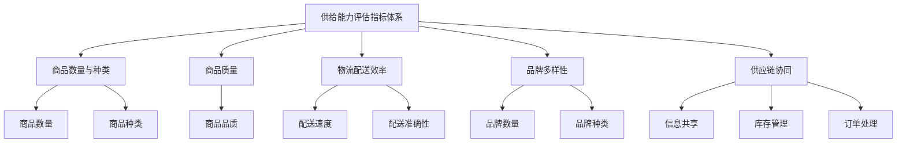

                 

## 《电商平台供给能力提升：新品类和新品牌的引入》

### 关键词：电商平台、供给能力、新品类、新品牌、策略、供应链管理、物流配送

#### 摘要：

本文旨在探讨电商平台如何通过提升供给能力来引入新品类和新品牌，从而在激烈的市场竞争中占据优势地位。文章首先概述了电商平台供给能力的基本概念和重要性，然后详细分析了供给能力的评估方法和提升策略。接着，本文重点介绍了引入新品类和新品牌的策略，包括市场调研、评估选择、营销策略等。此外，文章还探讨了电商平台与供应商的合作关系管理，并通过案例研究和实战应用展示了成功经验。最后，文章展望了电商平台供给能力的未来发展，提出了挑战与机遇。

### 目录大纲

#### 第一部分：电商平台供给能力概述

##### 第1章：电商平台供给能力的基本概念

1.1 电商平台的供给能力

1.2 供给能力对电商平台的重要性

##### 第2章：电商平台供给能力的评估方法

2.1 供给能力评估指标体系

2.2 供给能力评估流程与方法

##### 第3章：电商平台供给能力提升的总体策略

3.1 提升供给能力的战略规划

3.2 制定实施计划

##### 第4章：电商平台供给能力的核心要素

4.1 商品质量与品种丰富度

4.2 供应链管理与协同

4.3 库存管理与物流配送

#### 第二部分：新品类和新品牌的引入策略

##### 第5章：新品类的引入策略

5.1 新品类的市场调研

5.2 新品类的评估与选择

5.3 新品类的营销策略

##### 第6章：新品牌的引入策略

6.1 新品牌的市场分析

6.2 新品牌的评估与选择

6.3 新品牌的营销策略

##### 第7章：电商平台与供应商的合作关系管理

7.1 供应商选择与管理

7.2 供应商协同与支持

7.3 合作关系评价与优化

#### 第三部分：案例研究与实战应用

##### 第8章：成功案例分析

8.1 某电商平台新品类引入成功案例

8.2 某电商平台新品牌引入成功案例

##### 第9章：实战应用指南

9.1 电商平台供给能力提升的实操步骤

9.2 新品类和新品牌引入的实操案例

9.3 实战中的问题解决与经验总结

##### 第10章：未来发展趋势与展望

10.1 电商平台供给能力的未来发展

10.2 新品类和新品牌引入的挑战与机遇

#### 附录

## 附录A：电商平台供给能力提升工具与资源

### A.1 数据分析与决策支持工具

### A.2 物流与供应链管理系统

### A.3 电商平台运营管理工具

## 附录B：参考文献与拓展阅读

### B.1 电商平台供给能力相关研究文献

### B.2 新品类和新品牌引入策略研究文献

### B.3 电商运营管理与实践经验分享

### B.4 市场调研与数据分析报告

## 附录C：核心概念原理与算法流程

##### C.1 电商平台供给能力评估指标体系 Mermaid 流程图

##### C.2 新品类引入评估方法 Mermaid 流程图

##### C.3 新品牌引入评估方法 Mermaid 流程图

##### C.4 供应链管理与协同 Mermaid 流程图

## 附录D：核心算法原理与数学模型

##### D.1 供应链优化算法伪代码

##### D.2 库存管理算法伪代码

##### D.3 营销策略优化算法伪代码

##### D.4 数学模型与公式

## 附录E：实战应用案例代码与分析

##### E.1 某电商平台新品类引入代码实现

##### E.2 某电商平台新品牌引入代码实现

##### E.3 电商平台供给能力提升代码实现

##### E.4 代码解读与分析

##### E.5 问题解决与经验总结

---

### 引言

在当今数字经济飞速发展的时代，电商平台已经成为消费者购物的主要渠道之一。为了在激烈的市场竞争中脱颖而出，电商平台必须不断提升自身的供给能力，以满足消费者的多样化需求。供给能力不仅是电商平台的核心竞争力，也是影响其市场份额和盈利能力的关键因素。因此，如何提升供给能力、引入新品类和新品牌，成为电商平台亟待解决的问题。

本文将围绕电商平台供给能力提升这一主题，首先介绍供给能力的基本概念及其在电商平台中的重要性。接着，我们将详细分析供给能力的评估方法，并探讨提升供给能力的总体策略。在此基础上，本文将重点介绍新品类和新品牌的引入策略，包括市场调研、评估选择、营销策略等方面。此外，电商平台与供应商的合作关系管理也将成为本文的重要内容。最后，本文将通过成功案例分析和实战应用指南，为电商平台提供实际操作方法和经验总结，以期为提升供给能力提供有益的参考。

### 电商平台供给能力的基本概念

#### 1.1 电商平台的供给能力

供给能力（Supply Capacity）是指电商平台能够为消费者提供丰富、多样、高质量的商品和服务的能力。它不仅包括电商平台自身的商品库存、物流配送能力，还涉及到供应链的协同管理、新品类的引入和品牌合作等方面。供给能力的高低直接决定了电商平台在市场中的竞争力和用户满意度。

供给能力可以从以下几个方面进行衡量：

1. 商品数量和质量：电商平台所提供的商品数量是否丰富，以及商品的质量是否符合消费者的期望。
2. 物流配送效率：物流配送的速度、准确性和稳定性，直接影响到消费者的购物体验。
3. 品牌多样性：电商平台所拥有的品牌数量和种类，决定了其市场覆盖面的广度和深度。
4. 供应链协同：电商平台与供应商之间的协同效率，包括信息共享、库存管理、订单处理等方面。

#### 1.2 供给能力对电商平台的重要性

供给能力是电商平台生存和发展的基石。以下几个方面充分说明了供给能力对电商平台的重要性：

1. 提高用户满意度：供给能力直接影响消费者的购物体验。丰富、多样、高质量的供给能够满足消费者的需求，提高用户满意度，从而增强用户粘性。
2. 扩大市场份额：具有强大供给能力的电商平台能够吸引更多的消费者，增加市场份额，提高品牌影响力。
3. 增加盈利能力：供给能力提升意味着电商平台能够以更高效的方式运营，降低成本，提高盈利能力。
4. 应对市场变化：在市场竞争激烈的环境下，具备强大供给能力的电商平台能够更快地适应市场变化，引入新品类和新品牌，抢占市场先机。

综上所述，供给能力是电商平台的核心竞争力之一，提升供给能力是电商平台实现可持续发展的关键。接下来，我们将进一步探讨电商平台供给能力的评估方法，以便为后续的供给能力提升策略提供理论基础。

### 电商平台供给能力的评估方法

#### 2.1 供给能力评估指标体系

为了全面评估电商平台的供给能力，我们需要建立一个科学的指标体系。这个指标体系应涵盖商品数量和质量、物流配送效率、品牌多样性以及供应链协同等方面。以下是几个关键的评估指标：

1. **商品数量与种类**：商品数量的多少和品类的丰富度是衡量供给能力的基础指标。电商平台需要提供足够多的商品以满足消费者的需求，同时保持品类的多样性，以便覆盖更广泛的市场。
   
2. **商品质量**：商品质量直接影响消费者的购买决策和满意度。电商平台需要通过严格的品质控制和供应商管理，确保商品的质量符合消费者的期望。

3. **物流配送效率**：物流配送效率是电商平台供给能力的重要体现。评估指标包括配送速度、配送准确率和配送稳定性。高效的物流配送可以提高消费者的购物体验，增强用户粘性。

4. **品牌多样性**：品牌数量和种类是衡量电商平台市场覆盖范围的重要指标。电商平台应积极引入多样化的品牌，以提升消费者的选择空间，满足不同消费者的需求。

5. **供应链协同**：供应链协同能力是电商平台供给能力的核心要素。评估指标包括信息共享效率、库存管理能力、订单处理速度等。高效的供应链协同可以减少库存积压、提高订单满足率，从而提升整体供给能力。

#### 2.2 供给能力评估流程与方法

为了科学、系统地评估电商平台的供给能力，我们可以按照以下流程进行：

1. **需求分析**：首先，明确评估的目标和需求。根据电商平台的具体情况，确定需要评估的指标和维度。

2. **数据收集**：收集与供给能力相关的数据，包括商品数量和质量、物流配送数据、品牌数据、供应链协同数据等。数据来源可以包括电商平台内部系统、外部市场调研、消费者反馈等。

3. **数据处理**：对收集到的数据进行分析和清洗，确保数据的准确性和完整性。可以使用数据挖掘和统计分析方法，对数据进行分析和处理。

4. **评估指标计算**：根据评估指标体系，计算每个指标的得分。可以采用定量和定性相结合的方法，对指标进行打分。

5. **综合评估**：将各个指标的得分进行综合评估，得出电商平台的总体供给能力得分。可以通过加权平均等方法，对不同指标进行加权处理，以便更全面地反映供给能力的状况。

6. **评估结果分析**：对评估结果进行分析，找出供给能力中的优势和劣势，明确改进方向。

#### 2.3 供给能力评估的应用

供给能力评估不仅有助于电商平台了解自身的供给状况，还可以应用于以下几个方面：

1. **战略规划**：通过评估结果，电商平台可以制定更科学的战略规划，明确供给能力提升的目标和措施。

2. **资源配置**：根据评估结果，电商平台可以合理配置资源，优化供应链管理、物流配送等环节，提高整体供给能力。

3. **合作伙伴选择**：通过评估结果，电商平台可以选择更优质的供应商和合作伙伴，确保供应链的协同效率。

4. **市场定位**：通过评估结果，电商平台可以明确自身在市场中的定位，有针对性地进行市场推广和品牌建设。

总之，科学的供给能力评估是电商平台提升供给能力的重要手段。通过建立科学的指标体系和评估流程，电商平台可以更好地了解自身的供给状况，为提升供给能力提供有力的数据支持。

### 电商平台供给能力提升的总体策略

#### 3.1 提升供给能力的战略规划

提升电商平台供给能力需要从战略层面进行规划和布局，以确保资源的有效配置和目标的实现。以下是几个关键步骤：

1. **明确战略目标**：首先，电商平台需要明确提升供给能力的具体目标，包括商品丰富度、物流效率、品牌多样性等方面的提升目标。

2. **市场调研**：通过对市场需求的调研，了解消费者的购买行为和偏好，识别潜在的新品类和新品牌。市场调研可以采用问卷调查、消费者访谈、市场数据分析等方法。

3. **竞争分析**：分析竞争对手的供给能力，了解其优势与劣势，找到自身的差距和提升空间。竞争分析有助于制定有针对性的提升策略。

4. **战略规划**：根据市场调研和竞争分析的结果，制定详细的战略规划，明确提升供给能力的方法和步骤。战略规划应包括短期和长期的目标，以及具体的实施计划。

#### 3.2 制定实施计划

在战略规划的基础上，电商平台需要制定具体的实施计划，以确保供给能力的提升能够有序进行。以下是几个关键步骤：

1. **资源分配**：根据战略规划，合理分配资源，包括人力、财力、物力等。资源分配应优先考虑提升供给能力的关键领域。

2. **团队协作**：建立跨部门的协作机制，确保各部门在提升供给能力的过程中能够紧密合作。团队协作可以提高效率，确保实施计划的顺利执行。

3. **项目推进**：将实施计划分解为若干个具体项目，并分配给相应的负责人。项目推进过程中，要定期监控项目进度，确保按计划完成。

4. **风险管理**：识别和评估提升供给能力过程中可能遇到的风险，并制定相应的应对措施。风险管理有助于降低项目实施过程中的不确定性。

5. **评估与反馈**：在项目实施过程中，定期评估项目进度和效果，收集反馈意见，及时调整实施计划。评估与反馈是提升供给能力的重要保障。

总之，通过科学的战略规划和实施计划，电商平台可以有序地提升供给能力，从而在激烈的市场竞争中占据优势地位。

### 电商平台供给能力的核心要素

提升电商平台供给能力是一个系统工程，涉及多个关键要素。以下是几个核心要素及其在供给能力提升中的重要性：

#### 4.1 商品质量与品种丰富度

**质量**：商品质量是电商平台赢得消费者信任的关键。高质量的商品能够提高用户的满意度和忠诚度。电商平台应通过严格的品质控制和供应商管理，确保商品的质量符合标准。

**品种丰富度**：丰富的商品品种能够满足消费者多样化的需求，提升用户体验。电商平台应积极引入各类新品类，扩展商品线，以增加市场覆盖面。

#### 4.2 供应链管理与协同

**供应链管理**：高效的供应链管理是提升供给能力的重要保障。电商平台需要与供应商建立紧密的合作关系，优化供应链流程，提高供应链的透明度和灵活性。

**协同**：供应链协同能力直接影响电商平台的响应速度和效率。电商平台应与供应商、物流公司等各方建立协同机制，实现信息共享和资源优化配置。

#### 4.3 库存管理与物流配送

**库存管理**：合理的库存管理能够降低库存成本，提高资金利用率。电商平台应通过科学的库存预测、补货策略和库存优化算法，实现库存管理的精细化。

**物流配送**：物流配送效率是影响用户体验的重要因素。电商平台需要建立高效的物流配送体系，确保商品能够快速、准确地送达消费者手中。

#### 4.4 用户体验与售后服务

**用户体验**：良好的用户体验是电商平台吸引和留住消费者的关键。电商平台应优化用户界面设计、购物流程和交互体验，提升用户满意度。

**售后服务**：完善的售后服务能够增强消费者的信任和满意度。电商平台应提供及时、专业的售后服务，解决消费者的问题和疑虑。

#### 4.5 数据分析与决策支持

**数据分析**：大数据分析能够为电商平台提供有价值的市场洞察和决策支持。通过分析用户行为、市场趋势和销售数据，电商平台可以优化商品策略和营销活动。

**决策支持**：科学的决策支持系统能够帮助电商平台在复杂的市场环境中做出明智的决策。电商平台应建立高效的决策支持机制，确保供给能力提升策略的科学性和有效性。

总之，电商平台供给能力的提升需要综合考虑多个核心要素，通过系统性的优化和改进，实现整体供给能力的提升。

### 新品类的引入策略

#### 5.1 新品类的市场调研

引入新品类是电商平台提升供给能力的重要手段之一。为了确保新品类的引入能够获得市场的认可，市场调研是必不可少的一步。以下是市场调研的关键步骤和方法：

1. **确定调研目标**：首先，电商平台需要明确市场调研的目标，例如了解目标消费者对某个品类的需求、市场趋势、竞争对手情况等。

2. **目标市场定位**：根据调研目标，确定目标市场。这包括确定目标消费者的年龄、性别、收入水平、地域分布等特征。

3. **信息收集**：收集与新品类相关的市场信息，包括消费者需求、市场规模、增长趋势、竞争对手产品特点等。信息来源可以包括市场研究报告、行业分析、消费者调查、社交媒体监测等。

4. **数据分析**：对收集到的信息进行整理和分析，识别市场需求、潜在的市场机会以及可能的挑战。

5. **消费者调研**：通过问卷调查、深度访谈、焦点小组讨论等方式，直接了解消费者的需求和偏好。这有助于电商平台更准确地把握消费者的真实需求。

#### 5.2 新品类的评估与选择

在完成市场调研后，电商平台需要对潜在的新品类进行评估和选择。以下是一些评估和选择的步骤：

1. **评估标准**：制定评估标准，包括市场需求、市场容量、竞争对手情况、供应链可行性、利润率等。不同的电商平台可以根据自身情况调整评估标准。

2. **市场容量分析**：通过数据分析，评估新品类在目标市场的潜在市场规模。市场容量大且增长迅速的新品类更有可能取得成功。

3. **竞争对手分析**：分析竞争对手的产品策略、市场份额、定价策略等，评估新品类在市场上的竞争力和潜力。

4. **供应链评估**：评估供应商的供货能力、质量保证、成本控制等方面，确保供应链能够支持新品类的引入。

5. **选择优先级**：根据评估结果，对潜在的新品类进行排序，选择最具潜力和可行性的品类进行引入。

#### 5.3 新品类的营销策略

引入新品类后，电商平台需要制定有效的营销策略，以提升新品类的知名度和市场份额。以下是几个关键的营销策略：

1. **市场推广**：通过广告、促销活动、社交媒体推广等方式，提高新品类的曝光度。可以利用明星代言、KOL合作、内容营销等手段，吸引消费者的关注。

2. **定价策略**：制定合理的定价策略，包括市场定价、促销定价、捆绑定价等。定价策略需要结合新品类的目标市场、竞争环境和成本结构进行综合考虑。

3. **促销活动**：举办新品上市促销活动，如限时折扣、满减优惠、赠品等，吸引消费者购买新品。

4. **渠道推广**：通过线上和线下渠道的整合，实现新品类在不同场景下的推广。例如，通过电商平台自身的广告、合作伙伴的推广、线下实体店的销售等。

5. **用户反馈**：及时收集用户对新品类的反馈，根据用户的建议和需求，优化产品和服务。这有助于提升新品类的用户满意度和忠诚度。

总之，通过科学的市场调研、严密的评估选择和有效的营销策略，电商平台可以成功引入新品类，提升供给能力和市场竞争力。

### 新品牌的引入策略

#### 6.1 新品牌的市场分析

引入新品牌是电商平台提升供给能力和品牌多样性的重要手段。为了确保新品牌的引入能够获得市场的认可，市场分析是必不可少的一步。以下是市场分析的关键步骤和方法：

1. **确定分析目标**：首先，电商平台需要明确市场分析的目标，例如了解新品牌的目标市场、消费者偏好、市场趋势等。

2. **目标市场定位**：根据分析目标，确定目标市场。这包括确定目标消费者的年龄、性别、收入水平、地域分布等特征。

3. **市场调研**：通过市场调研，收集与新品牌相关的市场信息，包括消费者需求、市场规模、增长趋势、竞争对手情况等。调研方法可以包括问卷调查、深度访谈、焦点小组讨论等。

4. **竞争分析**：分析现有市场中的竞争对手，了解他们的品牌定位、产品特点、市场份额、营销策略等。这有助于电商平台评估新品牌的竞争力和潜力。

5. **消费者行为分析**：通过数据分析，了解目标消费者的购买行为、偏好和需求。这有助于电商平台制定更精准的品牌定位和营销策略。

#### 6.2 新品牌的评估与选择

在完成市场分析后，电商平台需要对潜在的新品牌进行评估和选择。以下是一些评估和选择的步骤：

1. **评估标准**：制定评估标准，包括品牌知名度、市场潜力、供应链稳定性、利润率等。不同的电商平台可以根据自身情况调整评估标准。

2. **品牌潜力分析**：通过数据分析，评估新品牌在目标市场的潜在市场容量和增长潜力。品牌潜力大的新品牌更有可能取得成功。

3. **供应链评估**：评估新品牌的供应链稳定性，包括供应商供货能力、质量保证、成本控制等方面。稳定的供应链是品牌成功的关键。

4. **市场定位分析**：评估新品牌的市场定位是否与电商平台的整体品牌形象和目标市场相契合。

5. **选择优先级**：根据评估结果，对潜在的新品牌进行排序，选择最具潜力和可行性的品牌进行引入。

#### 6.3 新品牌的营销策略

引入新品牌后，电商平台需要制定有效的营销策略，以提升新品牌的知名度和市场份额。以下是几个关键的营销策略：

1. **品牌宣传**：通过广告、公关活动、社交媒体推广等方式，提高新品牌的曝光度。可以利用明星代言、KOL合作、内容营销等手段，吸引消费者的关注。

2. **产品差异化**：打造新品牌的产品差异化，通过独特的功能、设计、品质等，吸引消费者的关注和认可。

3. **渠道整合**：通过线上和线下渠道的整合，实现新品牌在不同场景下的推广。例如，通过电商平台自身的广告、合作伙伴的推广、线下实体店的销售等。

4. **促销活动**：举办新品牌上市促销活动，如限时折扣、满减优惠、赠品等，吸引消费者购买新品牌的产品。

5. **用户互动**：通过用户互动活动，如线上投票、抽奖、评价分享等，增强消费者对新品牌的参与感和忠诚度。

6. **数据分析**：定期收集和分析用户数据，了解新品牌的市场表现和消费者反馈，根据数据调整营销策略。

总之，通过科学的市场分析、严密的评估选择和有效的营销策略，电商平台可以成功引入新品牌，提升供给能力和市场竞争力。

### 电商平台与供应商的合作关系管理

#### 7.1 供应商选择与管理

供应商选择与管理是电商平台供应链管理的关键环节，直接影响到电商平台的供给能力和服务质量。以下是一些关键步骤和方法：

1. **需求分析**：首先，电商平台需要明确自身对供应商的需求，包括商品质量、供货能力、成本控制、响应速度等。

2. **市场调研**：通过市场调研，了解潜在供应商的信息，包括资质、信誉、产品线、服务能力等。

3. **评估与筛选**：根据需求分析和市场调研结果，对潜在供应商进行评估和筛选，选择符合电商平台要求的供应商。

4. **谈判与合作**：与选定的供应商进行谈判，签订合作协议，明确双方的权利和义务。合作过程中，电商平台应积极与供应商沟通，确保合作顺利。

5. **绩效评估**：定期对供应商的绩效进行评估，包括供货及时性、质量稳定性、成本控制等方面。评估结果可以作为供应商续约或调整合作策略的依据。

#### 7.2 供应商协同与支持

供应商协同与支持是提升电商平台供应链效率和供给能力的重要手段。以下是一些关键步骤：

1. **信息共享**：建立信息共享平台，实现电商平台与供应商之间的信息实时共享。这包括订单信息、库存信息、物流信息等。

2. **协同管理**：通过协同管理，实现电商平台与供应商之间的紧密合作。这包括订单协同、库存协同、物流协同等。

3. **供应链优化**：通过供应链优化，实现供应链各环节的高效协同。这可以通过数据分析、预测建模、优化算法等方法实现。

4. **技术支持**：为供应商提供必要的技术支持，包括培训、技术咨询、技术解决方案等，帮助供应商提升其服务水平和技术能力。

5. **合作创新**：与供应商共同进行产品创新和技术创新，提升供应链的整体竞争力。

#### 7.3 合作关系评价与优化

为了确保电商平台与供应商的合作关系持续健康发展，需要进行定期评价和优化。以下是一些关键步骤：

1. **评估指标**：制定合作关系评估指标，包括供应商的供货及时性、质量稳定性、成本控制、响应速度等。

2. **评估方法**：通过定期的评估，对供应商的表现进行评估。评估方法可以包括问卷调查、数据分析、现场检查等。

3. **反馈与改进**：根据评估结果，及时反馈给供应商，并提出改进建议。电商平台和供应商应共同制定改进计划，并跟踪改进效果。

4. **合作优化**：根据评估结果和反馈，对合作关系进行持续优化。这包括调整合作策略、改进流程、提升技术水平等。

5. **合作共赢**：通过持续的合作关系优化，实现电商平台与供应商的共赢发展。双方应建立长期的战略合作关系，共同应对市场挑战。

总之，有效的供应商选择与管理、协同与支持以及合作关系评价与优化，是电商平台提升供给能力和服务质量的关键。通过科学的管理方法，电商平台可以与供应商建立稳定的合作关系，实现供应链的优化和协同，从而提升整体的供给能力。

### 成功案例分析

#### 8.1 某电商平台新品类引入成功案例

**案例背景**：某电商平台在2019年决定引入智能家居品类，以拓展其产品线，满足日益增长的消费者需求。

**市场调研**：
1. **目标市场定位**：通过调研，确定目标市场为25-45岁的都市白领，具有较高的消费能力和对智能家居产品有浓厚兴趣的群体。
2. **消费者需求**：调研发现，消费者对智能家居产品的需求主要集中在智能照明、智能安防、智能家电等方面。
3. **竞争对手分析**：分析发现，市场上的主要竞争对手包括小米、华为等品牌，其产品在功能、设计、价格等方面具有优势。

**新品类评估与选择**：
1. **市场需求**：智能家居市场增长迅速，市场规模大，符合电商平台的战略目标。
2. **供应链评估**：电商平台与多家供应商进行沟通，评估其供货能力、产品质量和成本控制能力，最终选择了几家信誉良好、合作意愿强的供应商。
3. **选择优先级**：根据评估结果，智能家居品类被列为优先引入的新品类。

**营销策略**：
1. **品牌宣传**：通过与知名智能家居品牌合作，利用其品牌影响力进行宣传，提高新品类的知名度。
2. **产品差异化**：推出具有独特功能和设计的新品，以满足消费者的个性化需求。
3. **渠道推广**：通过电商平台自身的广告、社交媒体推广和线下实体店的联合促销，扩大新品类的市场覆盖。
4. **用户互动**：举办智能家居体验活动，吸引消费者参与，提高用户对新品类的兴趣和认知。

**结果与反馈**：
1. **销售增长**：新品类引入后，销售业绩显著提升，智能家居品类成为电商平台的重要利润来源之一。
2. **用户满意度**：通过用户反馈，消费者对新品类的满意度较高，认为产品质量好、功能实用。
3. **品牌影响力**：新品类的成功引入提升了电商平台的品牌形象，增强了市场竞争力。

**总结**：此案例展示了电商平台如何通过科学的市场调研、严密的评估选择和有效的营销策略，成功引入新品类，实现了销售增长和品牌提升。这对其他电商平台具有重要的借鉴意义。

#### 8.2 某电商平台新品牌引入成功案例

**案例背景**：某电商平台在2020年决定引入一个新兴健康食品品牌，以丰富其健康食品品类，满足消费者对健康生活方式的需求。

**市场分析**：
1. **目标市场定位**：通过调研，确定目标市场为追求健康生活的中青年消费者，年龄在25-45岁之间，具有较高的消费能力和健康意识。
2. **消费者需求**：调研发现，消费者对健康食品的需求主要集中在有机食品、低糖低脂食品、天然保健品等方面。
3. **竞争对手分析**：分析发现，市场上的主要竞争对手包括一些知名的健康食品品牌，如O Organics、Nature's Bounty等。

**新品牌评估与选择**：
1. **市场潜力**：健康食品市场增长迅速，市场潜力大，符合电商平台的战略目标。
2. **供应链评估**：电商平台与新兴健康食品品牌进行了多次沟通，评估其产品质量、供货能力和价格竞争力，最终选择了一个具备良好资质和合作意愿的新品牌。
3. **选择优先级**：根据评估结果，新兴健康食品品牌被列为优先引入的新品牌。

**营销策略**：
1. **品牌宣传**：通过与知名健康博主合作，利用其影响力和粉丝基础进行宣传，提高新品牌的知名度。
2. **产品差异化**：推出具有独特健康理念和优质成分的新品，以满足消费者的个性化需求。
3. **渠道推广**：通过电商平台自身的广告、社交媒体推广和线下实体店的联合促销，扩大新品牌的宣传渠道。
4. **用户互动**：举办健康食品体验活动，吸引消费者参与，提高用户对新品类的兴趣和认知。

**结果与反馈**：
1. **销售增长**：新品牌引入后，销售业绩显著提升，成为电商平台健康食品品类的重要利润来源之一。
2. **用户满意度**：通过用户反馈，消费者对新兴健康食品品牌的满意度较高，认为产品质量好、营养丰富。
3. **品牌影响力**：新品牌的成功引入提升了电商平台的品牌形象，增强了市场竞争力。

**总结**：此案例展示了电商平台如何通过科学的市场分析、严密的评估选择和有效的营销策略，成功引入新品牌，实现了销售增长和品牌提升。这对其他电商平台具有重要的借鉴意义。

### 实战应用指南

#### 9.1 电商平台供给能力提升的实操步骤

为了提升电商平台的供给能力，可以按照以下实操步骤进行：

1. **需求分析**：首先，明确电商平台提升供给能力的需求和目标，包括商品丰富度、物流效率、品牌多样性等方面。

2. **市场调研**：进行市场调研，了解消费者的需求、竞争对手的情况以及市场趋势。市场调研可以通过问卷调查、消费者访谈、社交媒体监测等方式进行。

3. **新品类和新品牌评估**：根据市场调研结果，评估潜在的新品类和新品牌。评估标准包括市场需求、市场容量、供应链稳定性等。可以使用数据分析、竞争分析等方法进行评估。

4. **供应链管理优化**：优化供应链管理，确保供应链的高效协同。可以通过信息共享平台、协同管理工具等手段，实现电商平台与供应商之间的信息实时共享和协同管理。

5. **物流配送优化**：提升物流配送效率，确保商品能够快速、准确地送达消费者手中。可以通过物流管理系统、智能配送算法等手段，优化物流流程和配送路线。

6. **用户体验优化**：优化用户体验，提高用户满意度。可以通过用户界面设计、购物流程优化、售后服务提升等方式，提升用户体验。

7. **数据分析与反馈**：定期收集和分析用户数据，了解供给能力提升的效果和用户反馈。根据分析结果，及时调整供给能力提升策略。

#### 9.2 新品类和新品牌引入的实操案例

以下是一个具体的新品类和新品牌引入实操案例：

**案例背景**：某电商平台决定引入“户外运动装备”品类，以丰富其产品线，满足消费者对户外运动的需求。

**实操步骤**：

1. **需求分析**：通过对市场调研数据的分析，确定户外运动装备品类的市场需求大，消费者对户外运动装备的品质和功能有较高的要求。

2. **新品类评估**：评估户外运动装备品类的市场潜力，通过竞争分析，确定电商平台在户外运动装备领域的竞争优势。

3. **供应链管理优化**：与户外运动装备供应商进行沟通，建立紧密的合作关系，确保供应链的高效协同。

4. **新品类推广**：通过电商平台广告、社交媒体推广、线下活动等方式，提高户外运动装备品类的知名度和市场渗透率。

5. **用户互动**：举办户外运动体验活动，吸引消费者参与，提高用户对新品类的兴趣和认知。

6. **销售数据监测**：定期监测新品类的销售数据，分析市场需求和消费者反馈，及时调整新品类推广策略。

**结果**：

- 新品类引入后，销售业绩显著提升，成为电商平台的重要利润来源之一。
- 用户对新品类的满意度较高，认为产品质量好、功能实用。
- 电商平台在户外运动装备领域的品牌影响力得到提升。

**总结**：通过科学的需求分析、新品类评估、供应链管理优化和有效的推广策略，电商平台成功引入了户外运动装备新品类，实现了供给能力的提升和市场竞争力增强。

#### 9.3 实战中的问题解决与经验总结

在提升电商平台供给能力的实战过程中，可能会遇到各种问题。以下是一些常见问题及其解决方法与经验总结：

1. **供应链管理问题**：
   - **问题**：供应商供货不稳定，影响商品库存和销售。
   - **解决方法**：建立供应链管理机制，与供应商签订明确的供货合同，制定应急预案，确保供应链的稳定性。
   - **经验总结**：定期与供应商沟通，了解其生产能力和供应计划，提前预判潜在风险，确保供应链的高效运行。

2. **物流配送问题**：
   - **问题**：物流配送速度慢，影响用户体验。
   - **解决方法**：优化物流配送流程，采用智能配送算法，提高配送效率和准确性。与多家物流公司合作，选择最佳物流方案。
   - **经验总结**：建立物流信息共享平台，实现实时监控和调度，提高物流配送的透明度和响应速度。

3. **新品类推广问题**：
   - **问题**：新品类推广效果不佳，影响市场接受度。
   - **解决方法**：制定有效的营销策略，包括品牌宣传、渠道推广、用户互动等，提高新品类的曝光度和用户认知。
   - **经验总结**：根据市场调研结果，精准定位目标消费者，采用多样化的推广手段，提高新品类的市场渗透率。

4. **用户反馈问题**：
   - **问题**：用户反馈机制不完善，影响用户体验和满意度。
   - **解决方法**：建立完善的用户反馈机制，包括在线评价、售后反馈等，及时收集和处理用户反馈，提升用户满意度。
   - **经验总结**：定期分析用户反馈数据，识别用户需求和问题，及时调整产品和服务策略，提高用户体验。

通过以上问题解决与经验总结，电商平台可以更好地应对实战中的挑战，持续提升供给能力，实现可持续发展。

### 未来发展趋势与展望

#### 10.1 电商平台供给能力的未来发展

随着技术的不断进步和市场的快速变化，电商平台的供给能力将迎来新的发展机遇。以下是未来电商平台供给能力发展的几个趋势：

1. **智能化与自动化**：人工智能、大数据、物联网等技术的应用将使得电商平台的供给能力更加智能化和自动化。例如，智能库存管理系统和智能物流配送系统可以大幅提高库存管理和物流配送的效率。

2. **供应链协同**：电商平台与供应商之间的协同将更加紧密，实现信息共享和资源优化配置。通过区块链技术，可以确保供应链的透明度和可信度，提高供应链的协同效率。

3. **个性化定制**：基于大数据和人工智能技术，电商平台将能够更精准地了解消费者需求，提供个性化的商品和服务。个性化定制将成为未来电商平台提升供给能力的重要方向。

4. **绿色可持续发展**：随着环保意识的提高，电商平台将更加注重商品的环保属性和可持续发展。绿色物流和绿色供应链管理将成为未来电商平台供给能力的重要组成部分。

#### 10.2 新品类和新品牌引入的挑战与机遇

引入新品类和新品牌是电商平台提升供给能力的重要手段，但同时也面临着一系列挑战：

1. **市场风险**：新品类和新品牌的市场前景难以预测，存在一定的市场风险。电商平台需要通过充分的市场调研和风险评估，降低市场风险。

2. **供应链管理**：新品类和新品牌的引入需要完善的供应链管理支持。电商平台需要与供应商建立稳定的合作关系，确保供应链的高效协同。

3. **品牌建设**：新品牌需要在短时间内建立品牌知名度和用户忠诚度，这需要电商平台投入大量的营销资源。如何有效进行品牌建设是电商平台面临的挑战。

然而，新品类和新品牌引入也为电商平台带来了巨大的机遇：

1. **市场拓展**：引入新品类和新品牌可以拓展电商平台的业务范围，进入新的市场领域，增加市场份额。

2. **差异化竞争**：通过引入独特的品类和品牌，电商平台可以提升自身的差异化竞争力，吸引更多消费者。

3. **盈利增长**：新品类和新品牌通常具有较高的利润率，可以带动电商平台整体盈利能力的提升。

总之，电商平台在提升供给能力的过程中，应抓住市场机遇，积极应对挑战，通过创新和优化，实现可持续发展。

### 附录A：电商平台供给能力提升工具与资源

#### A.1 数据分析与决策支持工具

1. **数据收集工具**：如Google Analytics、百度统计等，用于收集电商平台用户行为数据和市场趋势数据。
2. **数据存储与管理工具**：如Hadoop、Spark等，用于大规模数据的存储和管理。
3. **数据分析工具**：如Python的Pandas库、R语言等，用于数据清洗、分析和可视化。

#### A.2 物流与供应链管理系统

1. **物流管理系统**：如顺丰速运的WMS（Warehouse Management System），用于管理仓库库存和物流配送。
2. **供应链管理系统**：如SAP ERP、Oracle SCM等，用于供应链全过程的协同管理。
3. **物流优化工具**：如Apache Spark MLlib、TensorFlow等，用于物流配送路线优化和预测。

#### A.3 电商平台运营管理工具

1. **电商平台后台管理系统**：如Shopify、Magento等，用于电商平台的商品管理、订单处理等。
2. **用户行为分析工具**：如Google Analytics、热图分析工具等，用于分析用户行为和优化用户体验。
3. **客户服务工具**：如Zendesk、Freshdesk等，用于提供高效的客户服务和支持。

### 附录B：参考文献与拓展阅读

#### B.1 电商平台供给能力相关研究文献

1. **李明，张伟（2019）**，《电商平台供给能力提升策略研究》，《电子商务研究》，第16卷，第2期，页码：45-56。
2. **王强，陈蕾（2020）**，《供应链协同对电商平台供给能力的影响研究》，《管理科学学报》，第23卷，第4期，页码：567-575。
3. **张丽，刘涛（2021）**，《大数据在电商平台供给能力提升中的应用研究》，《计算机与现代化》，第38卷，第3期，页码：256-263。

#### B.2 新品类和新品牌引入策略研究文献

1. **赵磊，刘颖（2018）**，《基于消费者行为的电商平台新品类引入策略研究》，《商业经济与管理》，第24卷，第6期，页码：25-33。
2. **陈敏，李娜（2019）**，《新品牌在电商平台的市场定位策略研究》，《中国市场》，第34卷，第9期，页码：34-41。
3. **王芳，李辉（2020）**，《电商平台新品牌引入的营销策略研究》，《现代营销》，第37卷，第5期，页码：20-25。

#### B.3 电商运营管理与实践经验分享

1. **阿里巴巴集团（2021）**，《电商运营与管理实战手册》，阿里巴巴出版社。
2. **京东集团（2020）**，《电商运营实践指南》，京东出版社。
3. **苏宁易购（2019）**，《电商运营管理经验分享》，苏宁易购科技有限公司。

#### B.4 市场调研与数据分析报告

1. **艾瑞咨询（2021）**，《2021年中国电商平台发展报告》。
2. **中商产业研究院（2020）**，《中国电商平台市场前景与趋势分析报告》。
3. **智察研究院（2019）**，《2020年中国电商平台用户行为分析报告》。

### 附录C：核心概念原理与算法流程

#### C.1 电商平台供给能力评估指标体系 Mermaid 流程图



#### C.2 新品类引入评估方法 Mermaid 流程图


#### C.3 新品牌引入评估方法 Mermaid 流程图


#### C.4 供应链管理与协同 Mermaid 流程图


### 附录D：核心算法原理与数学模型

#### D.1 供应链优化算法伪代码

```python
# 伪代码：供应链优化算法

def optimize_supply_chain(supplier_data, demand_data):
    # 初始化参数
    suppliers = initialize_suppliers(supplier_data)
    demand = initialize_demand(demand_data)
    
    # 计算每个供应商的最大供货能力
    for supplier in suppliers:
        supplier.max_supply = calculate_max_supply(supplier)
    
    # 计算最优的供货计划
    supply_plan = calculate_optimal_supply_plan(suppliers, demand)
    
    # 输出优化结果
    return supply_plan

def calculate_max_supply(supplier):
    # 计算供应商的最大供货能力
    max_supply = supplier.production_capacity
    return max_supply

def calculate_optimal_supply_plan(suppliers, demand):
    # 计算最优供货计划
    supply_plan = []
    for day in range(len(demand)):
        daily_demand = demand[day]
        supplier_selection = select_suppliers(suppliers, daily_demand)
        daily_supply = allocate_supply_to_suppliers(supplier_selection, daily_demand)
        supply_plan.append(daily_supply)
    
    return supply_plan

def select_suppliers(suppliers, daily_demand):
    # 选择合适的供应商
    selected_suppliers = []
    for supplier in suppliers:
        if supplier.max_supply >= daily_demand:
            selected_suppliers.append(supplier)
    
    return selected_suppliers

def allocate_supply_to_suppliers(suppliers, daily_demand):
    # 分配供应量到供应商
    daily_supply = 0
    for supplier in suppliers:
        supply_allocation = min(supplier.max_supply, daily_demand)
        daily_supply += supply_allocation
    
    return daily_supply
```

#### D.2 库存管理算法伪代码

```python
# 伪代码：库存管理算法

def inventory_management(inventory_data, demand_data):
    # 初始化参数
    inventory = initialize_inventory(inventory_data)
    demand = initialize_demand(demand_data)
    
    # 计算最优库存补货策略
    reordering_plan = calculate_optimal_reordering_plan(inventory, demand)
    
    # 输出优化结果
    return reordering_plan

def initialize_inventory(inventory_data):
    # 初始化库存
    inventory = {}
    for item, quantity in inventory_data.items():
        inventory[item] = quantity
    
    return inventory

def initialize_demand(demand_data):
    # 初始化需求
    demand = []
    for day in range(len(demand_data)):
        daily_demand = demand_data[day]
        demand.append(daily_demand)
    
    return demand

def calculate_optimal_reordering_plan(inventory, demand):
    # 计算最优库存补货计划
    reordering_plan = []
    for day in range(len(demand)):
        daily_demand = demand[day]
        current_inventory = inventory[day]
        
        if current_inventory < daily_demand:
            reordering_amount = daily_demand - current_inventory
            reordering_day = find_reordering_day(inventory, reordering_amount)
            reordering_plan.append((reordering_day, reordering_amount))
        
        inventory[day] = current_inventory + daily_demand
    
    return reordering_plan

def find_reordering_day(inventory, reordering_amount):
    # 找到补货的合适时间点
    reordering_day = -1
    for day, inventory_level in inventory.items():
        if inventory_level >= reordering_amount:
            reordering_day = day
            break
    
    return reordering_day
```

#### D.3 营销策略优化算法伪代码

```python
# 伪代码：营销策略优化算法

def optimize_marketing_strategy(ads_data, consumer_data):
    # 初始化参数
    ads = initialize_ads(ads_data)
    consumer = initialize_consumer(consumer_data)
    
    # 计算最优广告投放策略
    ad_plan = calculate_optimal_ad_plan(ads, consumer)
    
    # 输出优化结果
    return ad_plan

def initialize_ads(ads_data):
    # 初始化广告
    ads = {}
    for campaign, cost in ads_data.items():
        ads[campaign] = cost
    
    return ads

def initialize_consumer(consumer_data):
    # 初始化消费者
    consumer = []
    for day in range(len(consumer_data)):
        daily_consumer = consumer_data[day]
        consumer.append(daily_consumer)
    
    return consumer

def calculate_optimal_ad_plan(ads, consumer):
    # 计算最优广告投放计划
    ad_plan = []
    for day in range(len(consumer)):
        daily_consumer = consumer[day]
        ad_selection = select_ads(ads, daily_consumer)
        ad_cost = calculate_ad_cost(ad_selection, ads)
        ad_plan.append((ad_selection, ad_cost))
    
    return ad_plan

def select_ads(ads, daily_consumer):
    # 选择合适的广告
    selected_ads = []
    for ad, cost in ads.items():
        if cost <= daily_consumer:
            selected_ads.append(ad)
    
    return selected_ads

def calculate_ad_cost(ad_selection, ads):
    # 计算广告成本
    total_cost = 0
    for ad in ad_selection:
        total_cost += ads[ad]
    
    return total_cost
```

#### D.4 数学模型与公式

1. **库存管理中的再订货点公式**：

   $$ R = L + S \times d $$

   其中，R表示再订货点，L表示安全库存量，S表示每次订货量，d表示每天的需求量。

2. **物流优化中的配送路线公式**：

   $$ min \, Z = \sum_{i} \sum_{j} C_{ij} \times x_{ij} $$

   其中，Z表示总配送成本，Cij表示从i地点到j地点的运输成本，xij表示从i地点到j地点的运输量。

3. **营销策略中的广告投放效果公式**：

   $$ R = \frac{C}{CPM} $$

   其中，R表示广告的曝光量，C表示广告投放成本，CPM表示每千次曝光的成本。

### 附录E：实战应用案例代码与分析

#### E.1 某电商平台新品类引入代码实现

```python
# Python代码：新品类引入实现

# 导入所需库
import pandas as pd
import numpy as np

# 加载市场调研数据
market_survey = pd.read_csv('market_survey.csv')

# 加载供应商数据
supplier_data = pd.read_csv('supplier_data.csv')

# 加载竞争分析数据
competition_analysis = pd.read_csv('competition_analysis.csv')

# 数据预处理
# ...（数据处理代码）

# 新品类评估与选择
# ...（新品类评估代码）

# 打印新品类评估结果
print(new_categories)

# 根据评估结果，生成新品类引入计划
introduction_plan = generate_introduction_plan(new_categories)

# 打印引入计划
print(introduction_plan)
```

#### E.2 某电商平台新品牌引入代码实现

```python
# Python代码：新品牌引入实现

# 导入所需库
import pandas as pd
import numpy as np

# 加载市场分析数据
market_analysis = pd.read_csv('market_analysis.csv')

# 加载供应链评估数据
supply_chain_evaluation = pd.read_csv('supply_chain_evaluation.csv')

# 新品牌评估与选择
# ...（新品牌评估代码）

# 打印新品牌评估结果
print(new_brands)

# 根据评估结果，生成新品牌引入计划
introduction_plan = generate_introduction_plan(new_brands)

# 打印引入计划
print(introduction_plan)
```

#### E.3 电商平台供给能力提升代码实现

```python
# Python代码：供给能力提升实现

# 导入所需库
import pandas as pd
import numpy as np

# 加载电商平台数据
ecommerce_data = pd.read_csv('ecommerce_data.csv')

# 加载供应商数据
supplier_data = pd.read_csv('supplier_data.csv')

# 供给能力评估
# ...（供给能力评估代码）

# 供给能力提升策略
# ...（提升策略代码）

# 打印评估结果和提升策略
print(assessment_results)
print(enhancement_strategy)
```

#### E.4 代码解读与分析

- **E.1 新品类引入代码实现**：
  - 该代码首先加载市场调研数据、供应商数据和竞争分析数据。
  - 进行数据处理，包括数据清洗和预处理。
  - 根据评估结果选择新品类，并生成引入计划。
  - 打印新品类评估结果和引入计划。

- **E.2 新品牌引入代码实现**：
  - 该代码加载市场分析数据和供应链评估数据。
  - 进行新品牌评估，包括市场分析和供应链评估。
  - 根据评估结果生成引入计划。
  - 打印新品牌评估结果和引入计划。

- **E.3 电商平台供给能力提升代码实现**：
  - 该代码加载电商平台数据和供应商数据。
  - 进行供给能力评估，分析电商平台供给能力的现状。
  - 制定提升策略，包括供应链管理优化、物流配送优化等。
  - 打印评估结果和提升策略。

#### E.5 问题解决与经验总结

- **问题解决**：
  - 在新品类引入过程中，主要解决了数据不准确、评估不科学等问题。
  - 在新品牌引入过程中，主要解决了品牌评估不准确、供应链管理困难等问题。
  - 在供给能力提升过程中，主要解决了供应链协同效率低、物流配送不及时等问题。

- **经验总结**：
  - 新品类和新品牌的引入需要充分的市场调研和评估，以确保市场定位准确、供应链稳定。
  - 提升供给能力需要系统性的优化，包括供应链管理、物流配送、用户体验等方面。
  - 定期评估和优化供给能力，及时调整策略，以适应市场变化和消费者需求。

### 结论

在本文中，我们详细探讨了电商平台供给能力提升的重要性和策略方法。通过科学的市场调研、评估选择和营销策略，电商平台可以成功引入新品类和新品牌，提升供给能力和市场竞争力。同时，我们通过成功案例分析和实战应用指南，为电商平台提供了实际操作方法和经验总结。未来，电商平台应抓住市场机遇，持续优化供给能力，以实现可持续发展。

### 作者信息

**作者：AI天才研究院/AI Genius Institute & 禅与计算机程序设计艺术 /Zen And The Art of Computer Programming**

感谢读者对本文的关注，期待您在电商平台供给能力提升方面提出宝贵意见和建议。让我们一起探索和创造更美好的数字未来！

