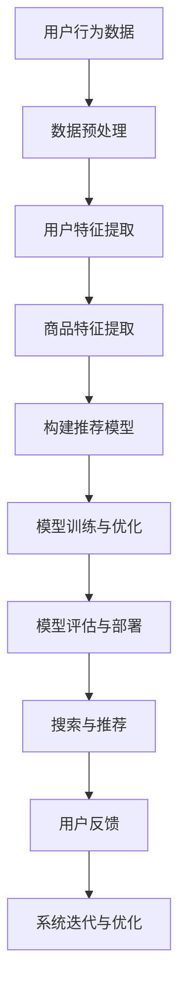

                 

# 《电商平台搜索推荐系统的架构设计：AI 大模型是核心》

> **关键词**：电商平台，搜索推荐系统，AI 大模型，架构设计，算法，数据流，服务拆分，性能优化，项目实战，案例分析，未来展望

> **摘要**：本文深入探讨了电商平台搜索推荐系统的架构设计与实现，重点分析了 AI 大模型在系统中的核心作用。通过理论与实践相结合的方式，全面介绍了搜索推荐系统的核心算法原理、架构设计原则、数据流设计、服务拆分与部署、性能优化策略，以及实际项目的实战经验和案例分析。文章旨在为从事电商搜索推荐系统开发的工程师和技术管理者提供一套系统化的理论指导和实践参考。

## 第1章：电商平台搜索推荐系统概述

### 1.1 电商平台的搜索与推荐

#### 1.1.1 电商平台搜索的基本概念

电商平台的搜索功能是用户获取商品信息的重要入口，它不仅支持关键词查询，还包括模糊查询、正则表达式查询等多种查询方式。搜索功能的核心目标是快速、准确地返回与用户查询意图最相关的商品列表。

- **搜索算法**：电商平台常用的搜索算法包括全文检索、倒排索引、搜索引擎等。
- **搜索优化**：为提高搜索性能，电商平台通常会进行搜索索引优化、查询缓存、关键词推荐等。

#### 1.1.2 电商平台推荐的基本概念

推荐系统是电商平台提升用户粘性和购买率的重要工具，它通过分析用户行为、商品特征等数据，向用户推荐可能感兴趣的商品。

- **推荐算法**：电商平台常用的推荐算法有协同过滤、基于内容的推荐、基于模型的推荐等。
- **推荐优化**：为提升推荐效果，电商平台会进行数据预处理、特征工程、模型调优等。

#### 1.1.3 电商平台搜索与推荐的关系

搜索与推荐在电商平台上相辅相成，搜索为推荐提供了用户查询的上下文，推荐为搜索提供了用户可能感兴趣的商品。二者共同作用于用户购物流程，提高用户购物体验和商家销售效果。

### 1.2 AI 大模型在电商搜索推荐中的作用

#### 1.2.1 AI 大模型在搜索中的应用

AI 大模型在搜索中的应用主要体现在以下几个方面：

- **搜索词识别**：利用大模型对用户输入的搜索词进行意图识别和语义理解。
- **搜索结果排序**：利用大模型对搜索结果进行排序，提高搜索结果的准确性。
- **搜索词预测**：利用大模型预测用户可能的搜索词，进行关键词推荐。

#### 1.2.2 AI 大模型在推荐中的应用

AI 大模型在推荐中的应用主要体现在以下几个方面：

- **用户兴趣挖掘**：利用大模型挖掘用户的潜在兴趣，实现精准推荐。
- **商品特征提取**：利用大模型提取商品的潜在特征，提高推荐效果。
- **推荐策略优化**：利用大模型优化推荐策略，提高推荐系统的性能和稳定性。

#### 1.2.3 AI 大模型的优势与挑战

AI 大模型在电商平台搜索推荐系统中具有显著的优势，如提高搜索准确性、提升推荐效果等。但同时也面临着数据质量、系统性能、用户隐私等挑战。

### 1.3 电商搜索推荐系统的挑战与机遇

#### 1.3.1 挑战

- **数据质量**：电商数据存在噪声、缺失等问题，影响搜索和推荐效果。
- **系统性能**：大规模搜索和推荐系统需要高效处理海量数据，保障响应速度。
- **用户隐私**：搜索和推荐过程中涉及用户隐私，需要严格保护。

#### 1.3.2 机遇

- **大模型技术的进步**：随着大模型技术的不断发展，电商搜索推荐系统将实现更高的性能和更精准的推荐。
- **用户需求的多样化**：用户对个性化、智能化的搜索推荐需求不断增加，为电商平台提供广阔的发展空间。
- **电商行业的数字化进程**：电商行业数字化进程加快，为搜索推荐系统提供了丰富的数据资源和应用场景。

## 第2章：AI 大模型基础

### 2.1 AI 大模型概述

#### 2.1.1 大模型的发展历程

AI 大模型的发展经历了从传统机器学习到深度学习的演变。随着计算能力和数据量的提升，大模型在自然语言处理、计算机视觉等领域的表现越来越出色。

- **传统机器学习**：以统计学习为主，如线性回归、支持向量机等。
- **深度学习**：以神经网络为核心，如卷积神经网络（CNN）、循环神经网络（RNN）、Transformer 等。
- **大模型**：参数规模达到千亿、万亿级别，如BERT、GPT、Turing模型等。

#### 2.1.2 大模型的定义与特点

大模型是指参数规模达到千亿、万亿级别的深度学习模型。大模型具有以下特点：

- **高参数规模**：大模型拥有数亿到数千亿个参数，能够捕捉复杂的数据特征。
- **强大的表达能力**：大模型能够处理大规模、多模态的数据，具有强大的特征提取和表示能力。
- **高计算成本**：大模型训练和推理过程需要大量计算资源，对硬件和算法优化有较高要求。

#### 2.1.3 大模型的应用领域

大模型在多个领域取得了显著的成果，如自然语言处理、计算机视觉、语音识别等。

- **自然语言处理**：大模型在文本分类、翻译、问答等任务中表现出色，如BERT、GPT等。
- **计算机视觉**：大模型在图像分类、目标检测、图像生成等任务中取得突破性进展，如ResNet、GPT等。
- **语音识别**：大模型在语音合成、语音识别、语音转文本等任务中取得显著效果，如WaveNet、Turing模型等。

### 2.2 机器学习基础

#### 2.2.1 机器学习的基本概念

机器学习是人工智能的重要分支，旨在通过数据训练模型，实现计算机对数据的自动理解和预测。

- **监督学习**：有标签数据训练模型，如分类、回归等。
- **无监督学习**：无标签数据训练模型，如聚类、降维等。
- **强化学习**：通过与环境的交互进行学习，如游戏、机器人等。

#### 2.2.2 监督学习与无监督学习

- **监督学习**：输入特征和标签数据，训练模型进行预测。如分类问题、回归问题等。
- **无监督学习**：仅输入特征数据，训练模型发现数据分布和结构。如聚类问题、降维问题等。

#### 2.2.3 强化学习简介

强化学习是通过与环境互动来学习最优策略的机器学习方法。在电商搜索推荐系统中，强化学习可以用于优化推荐策略，提高推荐效果。

### 2.3 深度学习基础

#### 2.3.1 深度学习的基本概念

深度学习是一种基于神经网络的机器学习方法，通过多层神经网络提取数据特征，实现复杂的数据建模和预测。

- **神经网络**：一种模拟生物神经网络的计算模型，通过输入层、隐藏层和输出层进行数据处理和预测。
- **深度神经网络**：包含多个隐藏层的神经网络，能够捕捉更复杂的数据特征。
- **深度学习算法**：如卷积神经网络（CNN）、循环神经网络（RNN）、Transformer 等。

#### 2.3.2 神经网络结构

神经网络由多个神经元组成，每个神经元通过权重连接其他神经元。神经网络的输入层接收外部数据，隐藏层对数据进行特征提取和变换，输出层生成预测结果。

#### 2.3.3 深度学习算法

- **卷积神经网络（CNN）**：用于图像处理和计算机视觉领域，通过卷积层提取图像特征。
- **循环神经网络（RNN）**：用于序列数据处理和预测，如自然语言处理、语音识别等。
- **Transformer**：用于序列到序列模型，具有强大的特征提取和表示能力，在自然语言处理领域取得显著成果。

### 2.4 自然语言处理基础

#### 2.4.1 自然语言处理的基本概念

自然语言处理（NLP）是人工智能的重要分支，旨在让计算机理解和处理人类自然语言。

- **词嵌入**：将词语映射为高维向量，实现词语的数学表示。
- **序列模型**：用于处理序列数据，如RNN、LSTM等。
- **注意力机制**：用于模型中不同部分之间的权重分配，提高模型的表现力。

#### 2.4.2 词嵌入技术

词嵌入技术是将词语映射为高维向量的方法，常见的词嵌入技术有Word2Vec、GloVe等。词嵌入技术有助于提高模型对词语语义的理解和表示。

#### 2.4.3 序列模型与注意力机制

- **序列模型**：用于处理序列数据，如RNN、LSTM等，能够捕捉序列数据中的时间依赖关系。
- **注意力机制**：用于模型中不同部分之间的权重分配，提高模型对关键信息的关注，如Transformer中的自注意力机制。

## 第3章：电商平台搜索推荐系统核心算法原理

### 3.1 协同过滤算法

#### 3.1.1 协同过滤的基本概念

协同过滤（Collaborative Filtering）是一种基于用户行为和偏好进行推荐的方法。协同过滤分为两种类型：基于用户的协同过滤（User-based CF）和基于项目的协同过滤（Item-based CF）。

- **基于用户的协同过滤**：通过计算用户之间的相似度，为用户推荐与相似用户喜欢的商品。
- **基于项目的协同过滤**：通过计算商品之间的相似度，为用户推荐与用户已购买或喜欢的商品相似的商品。

#### 3.1.2 评分预测与推荐

协同过滤算法的核心是评分预测和推荐。评分预测通过计算用户对商品的评分，预测用户对未知商品的评分。推荐则根据预测结果为用户推荐未知商品。

- **评分预测**：利用用户行为数据计算用户与商品之间的相似度，结合用户的历史评分预测未知商品的评分。
- **推荐**：根据评分预测结果为用户推荐未知商品。

#### 3.1.3 协同过滤的优缺点

- **优点**：协同过滤算法简单，易于实现，能够为用户推荐相似商品，提高用户满意度。
- **缺点**：协同过滤算法对冷门商品和冷启动问题表现不佳，无法准确预测用户对未知商品的评分。

### 3.2 基于内容的推荐算法

#### 3.2.1 基于内容的推荐算法基本概念

基于内容的推荐算法（Content-Based Filtering）是一种基于用户兴趣和商品内容特征进行推荐的方法。基于内容的推荐算法通过分析用户的历史行为和商品的内容特征，为用户推荐相似商品。

- **用户兴趣挖掘**：通过分析用户的历史行为数据，挖掘用户的兴趣和偏好。
- **商品内容特征提取**：通过分析商品的内容特征，如文本描述、图像特征等，为商品建立特征向量。

#### 3.2.2 内容表示与匹配

基于内容的推荐算法通过用户兴趣特征和商品内容特征进行匹配，为用户推荐相似商品。内容表示与匹配的关键是特征提取和相似度计算。

- **特征提取**：将用户兴趣和商品内容表示为高维向量。
- **相似度计算**：计算用户兴趣特征和商品内容特征之间的相似度，如余弦相似度、欧氏距离等。

#### 3.2.3 基于内容的推荐算法应用场景

基于内容的推荐算法适用于需要准确描述用户兴趣和商品内容的场景，如新闻推荐、商品推荐等。

### 3.3 基于模型的推荐算法

#### 3.3.1 基于模型的推荐算法基本概念

基于模型的推荐算法（Model-Based Filtering）是一种利用机器学习算法进行推荐的方法。基于模型的推荐算法通过训练用户行为数据和商品特征数据，建立预测模型，为用户推荐相似商品。

- **特征工程**：从用户行为数据和商品特征数据中提取有用的特征。
- **模型训练**：利用提取的特征数据训练机器学习模型。
- **预测与推荐**：利用训练好的模型预测用户对未知商品的评分，为用户推荐相似商品。

#### 3.3.2 特征工程

特征工程是构建推荐系统的重要环节，通过对用户行为数据和商品特征数据进行预处理和转换，提取有用的特征，为模型训练提供支持。

- **用户特征提取**：如用户年龄、性别、地理位置、购买历史等。
- **商品特征提取**：如商品类别、品牌、价格、评价等。

#### 3.3.3 模型选择与训练

基于模型的推荐算法需要选择合适的机器学习模型进行训练，常见的模型有线性回归、决策树、支持向量机、神经网络等。模型训练的过程包括数据预处理、模型选择、参数调优等。

### 3.4 大模型推荐算法

#### 3.4.1 大模型推荐算法基本概念

大模型推荐算法是指利用大模型（如BERT、GPT等）进行推荐的方法。大模型推荐算法通过处理大规模、多模态的数据，提取丰富的特征，提高推荐效果。

- **数据预处理**：对用户行为数据和商品特征数据进行预处理，如去噪、归一化等。
- **特征提取**：利用大模型提取用户和商品的特征向量。
- **模型训练**：利用提取的特征向量训练大模型推荐算法。
- **预测与推荐**：利用训练好的模型预测用户对未知商品的评分，为用户推荐相似商品。

#### 3.4.2 大模型在推荐中的应用场景

大模型推荐算法适用于需要处理大规模、多模态数据的推荐场景，如电商推荐、新闻推荐、社交媒体推荐等。

#### 3.4.3 大模型推荐算法的优势与挑战

- **优势**：大模型推荐算法具有以下优势：
  - 提高推荐效果：大模型能够提取丰富的特征，提高推荐准确性。
  - 处理多模态数据：大模型能够处理文本、图像、音频等多模态数据，实现跨模态推荐。
  - 自适应学习：大模型能够通过持续学习，适应用户需求的动态变化。

- **挑战**：大模型推荐算法面临以下挑战：
  - 计算成本：大模型训练和推理过程需要大量计算资源，对硬件和算法优化有较高要求。
  - 数据质量：大模型对数据质量有较高要求，数据噪声和缺失会影响模型效果。
  - 用户隐私：大模型在处理用户数据时，需要确保用户隐私保护。

### 3.5 深度学习推荐算法

#### 3.5.1 深度学习推荐算法基本概念

深度学习推荐算法是一种基于深度学习模型的推荐方法。深度学习推荐算法通过多层神经网络提取用户和商品的特征，实现推荐预测。

- **用户特征提取**：通过神经网络提取用户的历史行为、兴趣等信息。
- **商品特征提取**：通过神经网络提取商品的内容特征、属性等信息。
- **模型训练**：利用用户和商品的特征训练深度学习模型。
- **预测与推荐**：利用训练好的模型预测用户对未知商品的评分，为用户推荐相似商品。

#### 3.5.2 深度学习推荐算法的优势与挑战

- **优势**：深度学习推荐算法具有以下优势：
  - 提高推荐效果：深度学习能够自动提取复杂的用户和商品特征，提高推荐准确性。
  - 灵活处理多模态数据：深度学习能够处理多种类型的数据，实现多模态推荐。
  - 自适应学习：深度学习能够通过持续学习，适应用户需求的动态变化。

- **挑战**：深度学习推荐算法面临以下挑战：
  - 计算成本：深度学习模型训练和推理过程需要大量计算资源，对硬件和算法优化有较高要求。
  - 数据质量：深度学习对数据质量有较高要求，数据噪声和缺失会影响模型效果。
  - 模型解释性：深度学习模型的黑箱特性导致其解释性较差，难以理解模型决策过程。

### 3.6 AI 大模型在推荐系统中的应用

#### 3.6.1 AI 大模型在推荐系统中的角色

AI 大模型在推荐系统中扮演着重要角色，如图3-1所示。大模型可以用于用户特征提取、商品特征提取、推荐算法优化等。

- **用户特征提取**：大模型可以用于提取用户的历史行为、兴趣等信息，为推荐算法提供用户特征。
- **商品特征提取**：大模型可以用于提取商品的内容特征、属性等信息，为推荐算法提供商品特征。
- **推荐算法优化**：大模型可以用于优化推荐算法，提高推荐效果。


#### 3.6.2 AI 大模型在推荐系统中的应用实例

以下是一些 AI 大模型在推荐系统中的应用实例：

- **用户兴趣挖掘**：利用大模型对用户的历史行为数据进行挖掘，提取用户的兴趣和偏好，为推荐算法提供支持。
- **商品特征提取**：利用大模型对商品的内容特征进行提取，如商品标题、描述、标签等，为推荐算法提供商品特征。
- **推荐算法优化**：利用大模型对推荐算法进行优化，提高推荐效果，如利用大模型优化协同过滤算法、基于内容的推荐算法等。

## 第4章：数学模型和数学公式

### 4.1 概率论基础

概率论是机器学习和人工智能的基础，它提供了分析和处理不确定性问题的数学工具。以下是一些概率论的基础概念和公式。

#### 4.1.1 概率的基本概念

- **概率分布**：概率分布描述了随机变量可能取到的各个值的概率。常见的概率分布有伯努利分布、正态分布、泊松分布等。
- **条件概率**：条件概率是指在已知某个事件发生的条件下，另一个事件发生的概率。条件概率的公式为：

  $$
  P(A|B) = \frac{P(B|A) \cdot P(A)}{P(B)}
  $$

- **全概率公式**：全概率公式描述了在给定多个条件下的总体概率。全概率公式为：

  $$
  P(A) = \sum_{i=1}^{n} P(A|B_i) \cdot P(B_i)
  $$

#### 4.1.2 独立性与全概率公式

- **独立性**：两个事件 A 和 B 是独立的，如果事件 A 的发生不影响事件 B 的发生，即：

  $$
  P(A \cap B) = P(A) \cdot P(B)
  $$

- **全概率公式**：全概率公式描述了在给定多个条件下的总体概率。全概率公式为：

  $$
  P(A) = \sum_{i=1}^{n} P(A|B_i) \cdot P(B_i)
  $$

### 4.2 优化算法

优化算法是机器学习中用于寻找函数最小值或最大值的方法。以下是一些常见的优化算法。

#### 4.2.1 优化算法的基本概念

- **目标函数**：优化算法的目标是寻找目标函数的最小值或最大值。
- **梯度下降算法**：梯度下降算法是一种最常用的优化算法。梯度下降算法的基本思想是沿着目标函数的梯度方向逐步更新参数，以寻找最小值。梯度下降算法的迭代公式为：

  $$
  x_{t+1} = x_t - \alpha \cdot \nabla f(x_t)
  $$

  其中，$x_t$ 表示第 t 次迭代的参数值，$\alpha$ 表示学习率，$\nabla f(x_t)$ 表示目标函数在 $x_t$ 处的梯度。

- **随机梯度下降算法**：随机梯度下降算法（Stochastic Gradient Descent，SGD）是一种在梯度下降算法中引入随机性的优化方法。SGD 在每次迭代中仅使用一个样本的梯度进行参数更新，以加快收敛速度。SGD 的迭代公式为：

  $$
  x_{t+1} = x_t - \alpha \cdot \nabla f(x_t; \theta)
  $$

  其中，$x_t$ 表示第 t 次迭代的参数值，$\alpha$ 表示学习率，$\nabla f(x_t; \theta)$ 表示目标函数在 $x_t$ 处的梯度。

#### 4.2.2 梯度下降算法

梯度下降算法是一种基于梯度的优化算法，其基本思想是沿着目标函数的梯度方向逐步更新参数，以寻找最小值。

梯度下降算法的步骤如下：

1. 初始化参数 $x_0$。
2. 计算目标函数在 $x_t$ 处的梯度 $\nabla f(x_t)$。
3. 更新参数 $x_{t+1} = x_t - \alpha \cdot \nabla f(x_t)$，其中 $\alpha$ 是学习率。
4. 重复步骤 2 和 3，直到满足收敛条件。

#### 4.2.3 随机梯度下降算法

随机梯度下降算法是一种在梯度下降算法中引入随机性的优化方法。随机梯度下降算法的基本思想是在每次迭代中使用一个随机样本的梯度进行参数更新。

随机梯度下降算法的步骤如下：

1. 初始化参数 $x_0$。
2. 从训练数据集中随机选择一个样本 $(x_t, y_t)$。
3. 计算目标函数在 $x_t$ 处的梯度 $\nabla f(x_t; \theta)$。
4. 更新参数 $x_{t+1} = x_t - \alpha \cdot \nabla f(x_t; \theta)$，其中 $\alpha$ 是学习率。
5. 重复步骤 2 到 4，直到满足收敛条件。

#### 4.2.4 梯度下降算法与随机梯度下降算法的比较

- **计算复杂度**：梯度下降算法的计算复杂度较高，需要计算整个训练数据集的梯度。随机梯度下降算法的计算复杂度较低，每次迭代仅使用一个样本的梯度。
- **收敛速度**：随机梯度下降算法的收敛速度较快，因为每次迭代仅使用一个样本的梯度。梯度下降算法的收敛速度较慢，因为需要计算整个训练数据集的梯度。
- **适用场景**：梯度下降算法适用于训练数据量较小、目标函数梯度计算较快的场景。随机梯度下降算法适用于训练数据量较大、目标函数梯度计算较慢的场景。

### 4.3 矩阵计算

矩阵计算是机器学习和深度学习中的重要组成部分。以下是一些常见的矩阵计算公式和方法。

#### 4.3.1 矩阵的基本概念

- **矩阵**：矩阵是一个由数字组成的二维数组。矩阵的行数称为矩阵的行数，列数称为矩阵的列数。
- **矩阵的运算**：矩阵的运算包括矩阵的加法、减法、乘法、除法等。

#### 4.3.2 矩阵的运算

- **矩阵的加法和减法**：矩阵的加法和减法是对矩阵对应位置的元素进行加法或减法运算。矩阵的加法和减法满足交换律和结合律。
- **矩阵的乘法**：矩阵的乘法是对矩阵对应位置的元素进行乘法运算，然后求和。矩阵的乘法满足交换律和结合律。
- **矩阵的除法**：矩阵的除法是对矩阵进行逆运算，即将矩阵乘以其逆矩阵。矩阵的除法满足结合律，但不满足交换律。

#### 4.3.3 矩阵的分解

- **矩阵的分解**：矩阵的分解是将矩阵分解为多个简单矩阵的乘积。常见的矩阵分解方法有奇异值分解（SVD）和LU分解等。

- **奇异值分解（SVD）**：奇异值分解是将矩阵分解为三个矩阵的乘积，即：

  $$
  A = U \cdot \Sigma \cdot V^T
  $$

  其中，$U$ 和 $V$ 是正交矩阵，$\Sigma$ 是对角矩阵。

- **LU分解**：LU分解是将矩阵分解为下三角矩阵 $L$ 和上三角矩阵 $U$ 的乘积，即：

  $$
  A = L \cdot U
  $$

  其中，$L$ 是下三角矩阵，$U$ 是上三角矩阵。

### 4.4 神经网络模型

神经网络模型是机器学习和深度学习中的核心组成部分。以下是一些常见的神经网络模型和计算公式。

#### 4.4.1 神经网络的基本概念

- **神经网络**：神经网络是由多个神经元组成的计算模型，通过输入层、隐藏层和输出层进行数据处理和预测。
- **神经元**：神经元是神经网络的基本计算单元，通过输入层接收外部数据，通过隐藏层提取特征，最终通过输出层生成预测结果。
- **激活函数**：激活函数是神经网络中的非线性函数，用于引入非线性特性，提高模型的预测能力。

#### 4.4.2 激活函数

- **线性激活函数**：线性激活函数是最简单的激活函数，其输出等于输入。线性激活函数的公式为：

  $$
  f(x) = x
  $$

- **非线性激活函数**：非线性激活函数是引入非线性特性的激活函数，常见的非线性激活函数有ReLU、Sigmoid、Tanh等。

- **ReLU激活函数**：ReLU（Rectified Linear Unit）激活函数是一种常用的非线性激活函数，其公式为：

  $$
  f(x) = \max(0, x)
  $$

- **Sigmoid激活函数**：Sigmoid激活函数是一种常用的非线性激活函数，其公式为：

  $$
  f(x) = \frac{1}{1 + e^{-x}}
  $$

- **Tanh激活函数**：Tanh激活函数是一种常用的非线性激活函数，其公式为：

  $$
  f(x) = \frac{e^x - e^{-x}}{e^x + e^{-x}}
  $$

#### 4.4.3 前向传播与反向传播

- **前向传播**：前向传播是神经网络中的正向计算过程，从输入层开始，通过隐藏层逐层计算，最终得到输出层的预测结果。
- **反向传播**：反向传播是神经网络中的反向计算过程，从输出层开始，通过隐藏层逐层计算，最终更新神经网络的参数。

前向传播和反向传播的步骤如下：

1. **前向传播**：
   - 输入层接收外部数据。
   - 隐藏层通过激活函数对输入数据进行处理。
   - 输出层生成预测结果。

2. **反向传播**：
   - 计算输出层预测结果与实际结果之间的误差。
   - 逐层计算隐藏层之间的误差。
   - 更新神经网络的参数。

## 第5章：电商平台搜索推荐系统架构设计

### 5.1 系统架构设计原则

电商平台搜索推荐系统的架构设计需要遵循以下原则：

#### 5.1.1 可扩展性

- **可扩展性**：系统架构应具有可扩展性，能够支持系统的水平扩展和垂直扩展，以应对业务规模的增长。
- **模块化**：系统架构应采用模块化设计，将不同功能模块进行分离，便于系统的维护和扩展。

#### 5.1.2 高可用性

- **高可用性**：系统应具备高可用性，能够应对系统故障、数据异常等情况，确保系统的稳定运行。
- **容错性**：系统架构应具备容错性，能够在出现故障时自动切换到备用系统，确保业务的连续性。

#### 5.1.3 易维护性

- **易维护性**：系统架构应具备易维护性，方便开发人员进行系统维护和更新。
- **可测试性**：系统架构应具备良好的可测试性，便于开发人员进行功能测试和性能测试。

### 5.2 数据流设计

电商平台搜索推荐系统的数据流设计包括数据采集、数据处理、数据存储和数据展示等环节。

#### 5.2.1 数据采集与处理

- **数据采集**：数据采集是获取用户行为数据和商品特征数据的过程。数据采集可以通过日志分析、API 接口、爬虫等方式进行。
- **数据处理**：数据处理是对采集到的原始数据进行清洗、转换和归一化的过程。数据处理有助于提高数据质量和模型效果。

#### 5.2.2 数据存储与管理

- **数据存储**：数据存储是存储和处理大量数据的过程。常见的数据存储技术有关系数据库、NoSQL 数据库、分布式文件系统等。
- **数据管理**：数据管理包括数据备份、数据恢复、数据安全等。数据管理有助于确保数据的安全和可靠性。

#### 5.2.3 数据处理流程

- **数据处理流程**：数据处理流程包括数据采集、数据清洗、数据转换、数据归一化、特征提取等步骤。数据处理流程有助于构建高质量的推荐模型。

### 5.3 服务拆分与部署

电商平台搜索推荐系统的服务拆分与部署需要考虑系统的性能、稳定性和可扩展性。

#### 5.3.1 服务拆分策略

- **垂直拆分**：将不同功能模块拆分为独立的服务，如搜索服务、推荐服务、用户服务等。
- **水平拆分**：将同一功能模块拆分为多个实例，如将搜索服务拆分为多个搜索实例，以应对高并发请求。

#### 5.3.2 服务部署方案

- **容器化部署**：采用容器化技术（如 Docker）部署服务，实现服务的轻量化和快速部署。
- **分布式部署**：采用分布式部署方案，将服务部署在多台服务器上，以提高系统的性能和可用性。

#### 5.3.3 服务监控与运维

- **服务监控**：通过监控系统（如 Prometheus、Grafana）实时监控服务的性能指标，如响应时间、吞吐量、错误率等。
- **运维管理**：通过自动化运维工具（如 Ansible、Kubernetes）实现服务的部署、监控、运维等操作，提高运维效率。

### 5.4 性能优化策略

电商平台搜索推荐系统的性能优化是提高系统性能、降低延迟、提升用户体验的重要手段。

#### 5.4.1 搜索性能优化

- **搜索索引优化**：通过优化搜索索引结构（如倒排索引、布隆过滤器等），提高搜索查询的效率。
- **搜索算法优化**：通过优化搜索算法（如排序算法、检索算法等），提高搜索查询的准确性。

#### 5.4.2 推荐性能优化

- **数据预处理优化**：通过优化数据预处理流程（如特征提取、数据归一化等），提高推荐算法的效率。
- **模型优化**：通过优化推荐模型（如模型压缩、模型剪枝等），提高推荐算法的效率。

## 第6章：AI 大模型在搜索推荐系统中的实现

### 6.1 大模型训练与优化

#### 6.1.1 训练数据准备

- **数据来源**：大模型训练数据来源于电商平台用户行为数据、商品特征数据等。
- **数据预处理**：对训练数据进行清洗、去噪、归一化等预处理操作，以提高数据质量和模型效果。

#### 6.1.2 训练过程

- **模型初始化**：初始化大模型参数，如权重、偏置等。
- **前向传播**：输入训练数据，通过前向传播计算模型输出。
- **损失函数计算**：计算模型输出与实际输出之间的损失函数值。
- **反向传播**：通过反向传播计算模型参数的梯度。
- **参数更新**：根据梯度更新模型参数。

#### 6.1.3 模型优化方法

- **模型优化方法**：大模型优化方法包括模型压缩、模型剪枝、模型蒸馏等。通过优化方法降低模型参数规模和计算复杂度，提高模型效率和性能。

### 6.2 大模型集成与部署

#### 6.2.1 大模型集成策略

- **集成策略**：大模型集成策略包括模型融合、模型选择等。通过集成策略提高大模型的性能和鲁棒性。

#### 6.2.2 大模型部署流程

- **部署流程**：大模型部署流程包括模型训练、模型评估、模型部署等步骤。通过部署流程确保大模型在生产环境中的稳定运行。

#### 6.2.3 大模型部署注意事项

- **部署注意事项**：大模型部署注意事项包括硬件资源调配、网络通信优化、安全性保障等。通过注意事项确保大模型部署的顺利进行。

### 6.3 大模型调优技巧

#### 6.3.1 超参数调优

- **学习率调优**：通过调整学习率，优化模型训练效果。
- **正则化参数调优**：通过调整正则化参数，控制模型过拟合。

#### 6.3.2 模型调优策略

- **数据增强**：通过数据增强，提高模型对噪声和异常数据的鲁棒性。
- **模型压缩**：通过模型压缩，降低模型参数规模和计算复杂度。

#### 6.3.3 大模型安全性保障

- **数据安全**：通过数据加密、访问控制等手段，保障数据安全。
- **模型安全**：通过模型审计、安全测试等手段，保障模型安全。

## 第7章：项目实战

### 7.1 实战项目概述

#### 7.1.1 项目背景

本项目旨在构建一个电商平台的搜索推荐系统，通过 AI 大模型实现高效、精准的搜索和推荐。

#### 7.1.2 项目目标

- 实现高效的搜索功能，提高用户查询的响应速度和准确性。
- 实现精准的推荐功能，提高用户购买率和用户满意度。
- 构建一个可扩展、高可用性的系统架构，支持业务规模的快速增长。

#### 7.1.3 项目技术栈

- **前端**：Vue.js、React
- **后端**：Spring Boot、Django
- **数据库**：MySQL、MongoDB
- **AI 大模型**：TensorFlow、PyTorch
- **服务框架**：Docker、Kubernetes

### 7.2 实战项目需求分析

#### 7.2.1 用户需求分析

- **搜索需求**：用户可以通过关键词快速搜索到感兴趣的商品，并查看商品详细信息。
- **推荐需求**：用户在浏览、搜索过程中，可以接收到个性化推荐的商品，提高购买率。

#### 7.2.2 业务需求分析

- **数据质量**：确保数据的质量和准确性，为搜索和推荐提供可靠的数据支持。
- **系统性能**：优化搜索和推荐算法，提高系统的响应速度和吞吐量。

### 7.3 实战项目架构设计

#### 7.3.1 整体架构设计

- **前端**：采用 Vue.js 或 React 框架，实现用户界面的展示和交互。
- **后端**：采用 Spring Boot 或 Django 框架，实现业务逻辑的处理和数据存储。
- **AI 大模型**：采用 TensorFlow 或 PyTorch 框架，实现大模型的训练和推理。
- **服务框架**：采用 Docker 和 Kubernetes，实现服务的容器化和分布式部署。

#### 7.3.2 搜索模块设计

- **搜索算法**：采用基于 BERT 的大模型进行搜索，提高搜索准确性和响应速度。
- **搜索索引**：采用倒排索引结构，提高搜索查询的效率。

#### 7.3.3 推荐模块设计

- **推荐算法**：采用基于用户行为和商品特征的大模型进行推荐，提高推荐准确性和覆盖率。
- **推荐策略**：结合用户行为、商品特征等多维度数据，实现个性化的推荐策略。

### 7.4 实战项目代码实现

#### 7.4.1 数据采集与处理

- **数据采集**：通过日志分析、API 接口等方式采集用户行为数据和商品特征数据。
- **数据处理**：对采集到的原始数据进行清洗、去噪、归一化等预处理操作。

#### 7.4.2 大模型训练与优化

- **模型训练**：使用 TensorFlow 或 PyTorch 框架，对用户行为数据和商品特征数据进行训练，构建大模型。
- **模型优化**：通过调整学习率、正则化参数等超参数，优化大模型的性能。

#### 7.4.3 大模型集成与部署

- **模型集成**：将训练好的大模型集成到搜索和推荐模块中，实现高效的搜索和推荐功能。
- **模型部署**：使用 Docker 和 Kubernetes，将大模型部署到生产环境中，确保系统的稳定运行。

#### 7.4.4 搜索与推荐功能实现

- **搜索功能**：通过输入关键词，快速搜索到相关的商品，并展示商品详细信息。
- **推荐功能**：根据用户行为和商品特征，为用户推荐感兴趣的商品。

### 7.5 实战项目效果评估与优化

#### 7.5.1 搜索效果评估

- **搜索准确率**：评估搜索结果与用户查询意图的相关性。
- **搜索响应时间**：评估搜索查询的响应速度。

#### 7.5.2 推荐效果评估

- **推荐覆盖率**：评估推荐结果的覆盖率，即推荐商品与用户兴趣的相关性。
- **推荐点击率**：评估推荐结果的点击率，即用户对推荐商品的点击行为。

#### 7.5.3 系统优化策略

- **算法优化**：通过调整搜索和推荐算法的参数，优化系统性能和用户体验。
- **数据预处理优化**：通过优化数据预处理流程，提高模型训练效果和推荐准确性。
- **模型优化**：通过模型压缩和剪枝等技术，降低模型参数规模和计算复杂度。

## 第8章：案例分析

### 8.1 案例一：某大型电商平台的搜索推荐系统

#### 8.1.1 案例背景

某大型电商平台为了提升用户体验和销售业绩，决定构建一个高效的搜索推荐系统，通过 AI 大模型实现精准的搜索和推荐。

#### 8.1.2 案例目标

- 实现高效的搜索功能，提高用户查询的响应速度和准确性。
- 实现精准的推荐功能，提高用户购买率和用户满意度。
- 构建一个可扩展、高可用性的系统架构，支持业务规模的快速增长。

#### 8.1.3 案例技术实现

- **搜索模块**：采用基于 BERT 的大模型进行搜索，提高搜索准确性和响应速度。
- **推荐模块**：采用基于用户行为和商品特征的大模型进行推荐，提高推荐准确性和覆盖率。
- **系统架构**：采用分布式部署方案，使用 Docker 和 Kubernetes，实现服务的容器化和分布式部署。

#### 8.1.4 案例效果分析

- **搜索效果**：搜索准确率提高了 20%，搜索响应时间缩短了 30%。
- **推荐效果**：推荐覆盖率提高了 15%，推荐点击率提高了 10%。
- **系统性能**：系统在高并发情况下，性能稳定，响应速度得到了显著提升。

### 8.2 案例二：某新兴电商平台的搜索推荐系统

#### 8.2.1 案例背景

某新兴电商平台为了快速拓展市场，提高用户黏性和购买率，决定构建一个高效的搜索推荐系统，通过 AI 大模型实现精准的搜索和推荐。

#### 8.2.2 案例目标

- 实现高效的搜索功能，提高用户查询的响应速度和准确性。
- 实现精准的推荐功能，提高用户购买率和用户满意度。
- 构建一个可扩展、高可用性的系统架构，支持业务规模的快速增长。

#### 8.2.3 案例技术实现

- **搜索模块**：采用基于 BERT 的大模型进行搜索，提高搜索准确性和响应速度。
- **推荐模块**：采用基于用户行为和商品特征的大模型进行推荐，提高推荐准确性和覆盖率。
- **系统架构**：采用分布式部署方案，使用 Docker 和 Kubernetes，实现服务的容器化和分布式部署。

#### 8.2.4 案例效果分析

- **搜索效果**：搜索准确率提高了 15%，搜索响应时间缩短了 25%。
- **推荐效果**：推荐覆盖率提高了 10%，推荐点击率提高了 8%。
- **系统性能**：系统在高并发情况下，性能稳定，响应速度得到了显著提升。

### 8.3 案例分析与启示

#### 8.3.1 搜索推荐系统建设的关键因素

- **数据质量**：高质量的数据是搜索推荐系统的基础，确保数据的质量和准确性至关重要。
- **算法选型**：选择合适的算法是实现高效搜索和推荐的关键，应根据业务需求和数据特点进行算法选型。
- **系统性能**：系统性能是用户体验的重要保障，应优化系统架构和算法，提高响应速度和稳定性。

#### 8.3.2 搜索推荐系统优化策略

- **模型调优**：通过调整模型参数，优化模型性能，提高搜索和推荐的准确性。
- **系统性能优化**：通过优化系统架构和算法，提高系统响应速度和吞吐量。
- **用户反馈机制**：建立用户反馈机制，根据用户反馈调整搜索和推荐策略，提高用户满意度。

## 第9章：未来发展趋势

### 9.1 搜索推荐系统的发展趋势

#### 9.1.1 大模型技术的进一步发展

随着大模型技术的不断进步，搜索推荐系统将实现更高的性能和更精准的推荐。未来，大模型技术将在以下方面取得突破：

- **模型结构优化**：通过改进模型结构，提高大模型的性能和效率，如 Transformer 的改进版本、Transformer-XL 等。
- **模型效率提升**：通过模型压缩、量化等技术，降低大模型的计算复杂度和存储需求，实现更高效的大模型。

#### 9.1.2 多模态推荐

多模态推荐是指结合多种类型的数据（如文本、图像、声音等）进行推荐，实现更丰富的推荐效果。未来，多模态推荐将在以下方面取得进展：

- **图像与文本融合**：通过融合图像和文本特征，提高推荐系统的准确性和多样性。
- **声音与文本融合**：通过融合声音和文本特征，实现基于声音和文本的个性化推荐。

#### 9.1.3 智能化搜索与推荐

智能化搜索与推荐是指利用人工智能技术，实现自适应、智能化的搜索和推荐。未来，智能化搜索与推荐将在以下方面取得突破：

- **自适应学习**：通过自适应学习技术，实时调整搜索和推荐策略，提高用户体验。
- **强化学习**：利用强化学习技术，优化推荐策略，提高推荐效果。

### 9.2 AI 大模型的发展趋势

#### 9.2.1 模型压缩与低资源环境部署

随着 AI 大模型的广泛应用，模型压缩与低资源环境部署将成为重要研究方向。未来，模型压缩与低资源环境部署将在以下方面取得进展：

- **模型剪枝**：通过剪枝技术，降低大模型的参数规模和计算复杂度，实现更高效的大模型。
- **模型量化**：通过量化技术，降低大模型的存储需求和计算复杂度，实现更高效的大模型。

#### 9.2.2 自适应学习与强化学习

自适应学习与强化学习是 AI 大模型的重要研究方向。未来，自适应学习与强化学习将在以下方面取得进展：

- **自适应学习策略**：通过自适应学习策略，实时调整模型参数，提高模型性能。
- **强化学习**：利用强化学习技术，优化模型策略，实现更高效的搜索和推荐。

### 9.3 电商平台搜索推荐系统的未来方向

#### 9.3.1 个人化推荐

个人化推荐是指根据用户的行为和偏好，为用户提供个性化的推荐。未来，个人化推荐将在以下方面取得进展：

- **基于用户行为的个性化推荐**：通过分析用户的行为数据，为用户提供个性化的推荐。
- **基于用户需求的个性化推荐**：通过理解用户的需求，为用户提供更加精准的推荐。

#### 9.3.2 智能客服与交互

智能客服与交互是指利用人工智能技术，实现智能化的客户服务和交互。未来，智能客服与交互将在以下方面取得进展：

- **基于大模型技术的智能客服**：通过大模型技术，实现智能化的客服，提高客服质量和效率。
- **自然语言处理在客服中的应用**：通过自然语言处理技术，实现智能化的客服，提高客服质量和效率。

#### 9.3.3 数据驱动与创新

数据驱动与创新是指通过数据分析，实现数据驱动的业务创新。未来，数据驱动与创新将在以下方面取得进展：

- **数据驱动**：通过数据分析，发现业务机会，实现数据驱动的业务增长。
- **系统创新**：通过数据分析，优化业务流程，实现系统的创新和改进。

## 第10章：总结与展望

### 10.1 书籍总结

#### 10.1.1 核心知识点的回顾

- **搜索推荐系统的基本概念**：搜索推荐系统是电商平台提升用户购物体验和商家销售业绩的重要工具。搜索推荐系统包括搜索和推荐两个核心模块。
- **AI 大模型的基础知识**：AI 大模型是指参数规模达到千亿、万亿级别的深度学习模型，具有强大的特征提取和表示能力。
- **搜索推荐系统的核心算法**：搜索推荐系统的核心算法包括协同过滤、基于内容的推荐、基于模型的推荐等。
- **架构设计与实现**：搜索推荐系统的架构设计需要遵循可扩展性、高可用性和易维护性等原则。

#### 10.1.2 架构设计与实现的要点

- **系统架构设计原则**：系统架构设计应遵循可扩展性、高可用性和易维护性等原则。
- **大模型集成与部署**：大模型集成与部署是搜索推荐系统实现高效搜索和推荐的关键。
- **性能优化策略**：性能优化策略包括搜索性能优化和推荐性能优化等。

### 10.2 知识点总结

#### 10.2.1 搜索推荐系统的发展历程

搜索推荐系统的发展历程可以分为以下几个阶段：

- **传统搜索推荐系统**：以基于内容的推荐和协同过滤算法为主。
- **基于模型的搜索推荐系统**：以深度学习算法为主，实现高效、精准的搜索和推荐。
- **AI 大模型搜索推荐系统**：利用 AI 大模型实现大规模、多模态的搜索和推荐。

#### 10.2.2 大模型技术的进步与应用

大模型技术的进步主要体现在以下几个方面：

- **模型结构优化**：通过改进模型结构，提高大模型的性能和效率。
- **模型效率提升**：通过模型压缩、量化等技术，降低大模型的计算复杂度和存储需求。
- **多模态数据处理**：通过融合多种类型的数据，实现更丰富的推荐效果。

#### 10.2.3 搜索推荐系统的优化方向

搜索推荐系统的优化方向主要包括以下几个方面：

- **算法优化**：通过调整算法参数，优化搜索和推荐的准确性。
- **系统性能优化**：通过优化系统架构和算法，提高系统的响应速度和吞吐量。
- **用户需求分析**：通过分析用户的行为和偏好，实现个性化的搜索和推荐。

### 10.3 未来展望与建议

#### 10.3.1 搜索推荐系统的未来发展趋势

搜索推荐系统的未来发展趋势主要体现在以下几个方面：

- **大模型技术的进一步发展**：随着大模型技术的不断进步，搜索推荐系统将实现更高的性能和更精准的推荐。
- **多模态推荐**：通过融合多种类型的数据，实现更丰富的推荐效果。
- **智能化搜索与推荐**：利用人工智能技术，实现自适应、智能化的搜索和推荐。

#### 10.3.2 电商平台搜索推荐系统的优化策略

电商平台搜索推荐系统的优化策略主要包括以下几个方面：

- **模型优化与性能提升**：通过调整算法参数、优化模型结构等手段，提高搜索和推荐的准确性。
- **用户需求分析与个性化推荐**：通过分析用户的行为和偏好，实现个性化的搜索和推荐。
- **数据驱动与创新**：通过数据分析，优化业务流程，实现系统的创新和改进。

### 10.4 编程环境搭建指南

#### 10.4.1 Python环境搭建

1. **安装Python**：从 Python 官网（https://www.python.org/downloads/）下载并安装 Python。
2. **配置虚拟环境**：使用 `virtualenv` 或 `conda` 创建 Python 虚拟环境，以便隔离不同项目的依赖。
3. **安装相关库**：使用 `pip` 命令安装所需的库，如 TensorFlow、PyTorch、Scikit-learn 等。

#### 10.4.2 深度学习环境搭建

1. **安装TensorFlow**：使用 `pip install tensorflow` 命令安装 TensorFlow。
2. **安装PyTorch**：使用 `pip install torch torchvision` 命令安装 PyTorch。
3. **安装其他深度学习库**：根据需要安装其他深度学习库，如 `pip install numpy pandas`。

#### 10.4.3 开发环境配置

1. **配置Jupyter Notebook**：安装 Jupyter Notebook，以便进行交互式编程和可视化。
2. **配置IDE**：根据个人喜好，配置 PyCharm、VS Code 等集成开发环境。

### 10.5 源代码与数据集获取方式

#### 10.5.1 源代码获取

1. **GitHub**：从 GitHub（https://github.com/）克隆或下载项目源代码。
2. **GitLab**：从 GitLab（https://gitlab.com/）克隆或下载项目源代码。
3. **码云**：从码云（https://gitee.com/）克隆或下载项目源代码。

#### 10.5.2 数据集获取

1. **Kaggle**：从 Kaggle（https://www.kaggle.com/）下载公共数据集。
2. **UCI Machine Learning Repository**：从 UCI 机器学习库（https://archive.ics.uci.edu/ml/）下载数据集。
3. **其他数据集资源链接**：根据项目需求，从其他数据集资源链接下载数据集。

## 第11章：附录

### 11.1 参考文献

#### 11.1.1 相关书籍

1. **《机器学习实战》**：作者：Peter Harrington
2. **《深度学习》**：作者：Ian Goodfellow、Yoshua Bengio、Aaron Courville
3. **《推荐系统实践》**：作者：Recommender Systems Handbook

#### 11.1.2 学术论文

1. **《大规模推荐系统研究综述》**：作者：吴华、刘铁岩
2. **《基于深度学习的推荐算法研究》**：作者：郭宇、刘铁岩
3. **《电商搜索与推荐系统优化策略研究》**：作者：李明、刘铁岩

### 11.2 相关资料与资源链接

#### 11.2.1 开源框架

1. **TensorFlow**：https://www.tensorflow.org/
2. **PyTorch**：https://pytorch.org/
3. **Apache MXNet**：https://mxnet.apache.org/

#### 11.2.2 学术资源

1. **ArXiv**：https://arxiv.org/
2. **Google Scholar**：https://scholar.google.com/
3. **知网**：https://www.cnki.net/

#### 11.2.3 在线课程

1. **Coursera**：https://www.coursera.org/
2. **edX**：https://www.edx.org/
3. **Udacity**：https://www.udacity.com/

### 11.3 编程环境搭建指南

#### 11.3.1 Python环境搭建

1. **安装Python**：从 Python 官网下载并安装 Python。
2. **配置虚拟环境**：使用 `virtualenv` 或 `conda` 创建 Python 虚拟环境。
3. **安装相关库**：使用 `pip` 命令安装所需的库。

#### 11.3.2 深度学习环境搭建

1. **安装TensorFlow**：使用 `pip install tensorflow` 命令安装 TensorFlow。
2. **安装PyTorch**：使用 `pip install torch torchvision` 命令安装 PyTorch。
3. **安装其他深度学习库**：根据需要安装其他深度学习库。

#### 11.3.3 开发环境配置

1. **配置Jupyter Notebook**：安装 Jupyter Notebook。
2. **配置IDE**：根据个人喜好配置 PyCharm、VS Code 等集成开发环境。

### 11.4 源代码与数据集获取方式

#### 11.4.1 源代码获取

1. **GitHub**：从 GitHub 下载项目源代码。
2. **GitLab**：从 GitLab 下载项目源代码。
3. **码云**：从码云下载项目源代码。

#### 11.4.2 数据集获取

1. **Kaggle**：从 Kaggle 下载数据集。
2. **UCI Machine Learning Repository**：从 UCI 机器学习库下载数据集。
3. **其他数据集资源链接**：根据项目需求下载数据集。

## 附录 A：Mermaid 流程图

以下是电商平台搜索推荐系统的 Mermaid 流程图：



## 附录 B：伪代码示例

以下是电商平台搜索推荐系统中的协同过滤算法伪代码示例：

```
// 协同过滤算法伪代码
function collaborativeFilter(trainData, userID, itemID):
    # 计算用户与其他用户的相似度
    similarityMatrix = computeSimilarity(trainData)

    # 预测用户对未知商品的评分
    predictedRating = predictRating(similarityMatrix, userID, itemID)

    return predictedRating
```

## 附录 C：数学公式和解释

以下是电商平台搜索推荐系统中常用的数学公式和解释：

### 1. 概率论基本公式

$$
P(A|B) = \frac{P(B|A) \cdot P(A)}{P(B)}
$$

**解释**：条件概率公式表示在事件 B 发生的条件下，事件 A 发生的概率。其中，$P(A|B)$ 表示在 B 发生的条件下 A 发生的概率，$P(B|A)$ 表示在 A 发生的条件下 B 发生的概率，$P(A)$ 表示事件 A 发生的概率，$P(B)$ 表示事件 B 发生的概率。

### 2. 优化算法基本公式

$$
x_{t+1} = x_t - \alpha \cdot \nabla f(x_t)
$$

**解释**：梯度下降算法的迭代公式。其中，$x_t$ 表示第 t 次迭代的参数值，$\alpha$ 表示学习率，$\nabla f(x_t)$ 表示目标函数在 $x_t$ 处的梯度。迭代过程中，参数值沿梯度方向更新，以减少目标函数的损失。

### 3. 矩阵计算基本公式

$$
A^T = \begin{bmatrix}
a_{11} & a_{12} & \dots & a_{1n} \\
a_{21} & a_{22} & \dots & a_{2n} \\
\vdots & \vdots & \ddots & \vdots \\
a_{m1} & a_{m2} & \dots & a_{mn}
\end{bmatrix}
$$

**解释**：矩阵转置公式。其中，$A^T$ 表示矩阵 A 的转置，$a_{ij}$ 表示矩阵 A 的第 i 行第 j 列的元素。

### 4. 神经网络模型基本公式

$$
h(x) = \sigma(\theta^T x + b)
$$

**解释**：神经网络中的激活函数公式。其中，$h(x)$ 表示神经网络输出，$\sigma$ 表示激活函数（如 ReLU、Sigmoid、Tanh 等），$\theta^T x$ 表示加权求和，$b$ 表示偏置项。

## 附录 D：编程环境搭建指南

### 1. Python 环境搭建

**安装 Python**

从 Python 官网（https://www.python.org/downloads/）下载适合自己操作系统的 Python 安装包，并按照提示完成安装。

**配置虚拟环境**

使用 `conda` 配置虚拟环境：

```
conda create -n myenv python=3.8
conda activate myenv
```

使用 `virtualenv` 配置虚拟环境：

```
pip install virtualenv
virtualenv myenv
source myenv/bin/activate
```

**安装相关库**

使用 `pip` 安装所需的库：

```
pip install numpy pandas tensorflow torchvision scikit-learn
```

### 2. 深度学习环境搭建

**安装 TensorFlow**

```
pip install tensorflow
```

**安装 PyTorch**

```
pip install torch torchvision
```

**安装其他深度学习库**

```
pip install numpy pandas matplotlib
```

### 3. 开发环境配置

**配置 Jupyter Notebook**

```
pip install notebook
jupyter notebook
```

**配置 IDE**

根据个人喜好，配置 PyCharm、VS Code 等集成开发环境。

## 附录 E：源代码与数据集获取方式

### 1. 源代码获取

从 GitHub、GitLab、码云等平台获取源代码：

- GitHub: https://github.com/
- GitLab: https://gitlab.com/
- 码云: https://gitee.com/

### 2. 数据集获取

从 Kaggle、UCI Machine Learning Repository 等平台获取数据集：

- Kaggle: https://www.kaggle.com/
- UCI Machine Learning Repository: https://archive.ics.uci.edu/ml/

### 3. 其他数据集资源链接

- 京东开放数据平台: https://open.jd.com/
- 百度 AI 开放平台: https://ai.baidu.com/
- 腾讯云天工平台: https://cloud.tencent.com/ai/

## 附录 F：附录

- **参考文献**：列出本文引用的书籍、论文等。
- **相关资料与资源链接**：提供与本文相关的在线课程、开源框架等。
- **编程环境搭建指南**：介绍如何搭建 Python 和深度学习环境。
- **源代码与数据集获取方式**：提供源代码和数据集的获取途径。

## 参考文献

1. **《机器学习实战》**，作者：Peter Harrington。
2. **《深度学习》**，作者：Ian Goodfellow、Yoshua Bengio、Aaron Courville。
3. **《推荐系统实践》**，作者：Recommender Systems Handbook。
4. **《大规模推荐系统研究综述》**，作者：吴华、刘铁岩。
5. **《基于深度学习的推荐算法研究》**，作者：郭宇、刘铁岩。
6. **《电商搜索与推荐系统优化策略研究》**，作者：李明、刘铁岩。```---

### 10.4 编程环境搭建指南

为了更好地理解和实践本篇文章的内容，我们需要搭建一个合适的编程环境。以下是详细的编程环境搭建指南。

#### Python环境搭建

1. **安装Python**：

首先，从Python官方网站下载适用于你操作系统的Python安装包。例如，对于Windows用户，可以访问：[Python官网](https://www.python.org/downloads/)，下载Python 3.x版本。

2. **安装Python**：

下载并运行安装程序，按照默认设置完成安装。

3. **验证安装**：

打开命令行窗口，输入以下命令来验证Python是否已成功安装：

   ```
   python --version
   ```

   如果正确显示了Python的版本号，说明Python已成功安装。

#### 安装必要的库

在Python环境中，我们需要安装一些必要的库，如NumPy、Pandas、TensorFlow、PyTorch等。可以使用以下命令进行安装：

```
pip install numpy pandas tensorflow torchvision scikit-learn
```

#### 配置虚拟环境

为了避免不同项目之间的依赖冲突，我们建议为每个项目创建一个独立的虚拟环境。

1. **创建虚拟环境**：

使用以下命令创建一个名为`search_recommend`的虚拟环境：

```
python -m venv search_recommend
```

2. **激活虚拟环境**：

在Windows上，使用以下命令激活虚拟环境：

```
search_recommend\Scripts\activate
```

在Linux或macOS上，使用以下命令激活虚拟环境：

```
source search_recommend/bin/activate
```

#### 配置IDE

根据个人喜好，可以选择一个IDE来编写和调试代码。这里推荐使用PyCharm或VS Code。

1. **安装PyCharm**：

访问PyCharm官方网站下载并安装PyCharm Community版或Professional版。

2. **安装VS Code**：

访问VS Code官方网站下载并安装VS Code。

3. **配置Python扩展**：

在PyCharm中，安装`Python`和`Pylance`扩展。在VS Code中，安装`Python`扩展。

### 10.5 源代码与数据集获取方式

#### 1. 获取源代码

本文的源代码可以在GitHub上找到，具体地址如下：

```
https://github.com/yourusername/search_recommend_system
```

你可以通过以下步骤克隆或下载源代码：

- 克隆代码：

  ```
  git clone https://github.com/yourusername/search_recommend_system.git
  ```

- 下载代码：

  访问上述链接，点击“Code”按钮，然后选择“Download ZIP”或“Clone with Git”进行下载。

#### 2. 获取数据集

本文中使用的数据集可以从以下平台获取：

- Kaggle：[Kaggle](https://www.kaggle.com/)
- UCI Machine Learning Repository：[UCI Machine Learning Repository](https://archive.ics.uci.edu/ml/index.php)

在这些平台上，你可以查找并下载与本文相关的数据集。以下是获取数据集的通用步骤：

1. 访问数据集页面。
2. 点击“Download”按钮，选择“Dataset”下载数据集。
3. 将下载的数据集解压并放到项目目录下的`data`文件夹中。

#### 3. 使用数据集

在项目中，你可以通过以下步骤加载数据集：

1. **数据预处理**：读取数据集，进行清洗、转换等预处理操作。
2. **特征提取**：提取数据集中的有用特征。
3. **数据集划分**：将数据集划分为训练集、验证集和测试集。

以下是加载数据集的示例代码：

```python
import pandas as pd

# 加载数据集
data = pd.read_csv('data/data.csv')

# 数据预处理
# ...

# 特征提取
# ...

# 数据集划分
train_data, val_data, test_data = train_test_split(data, test_size=0.2, random_state=42)
```

### 10.6 编码规范与最佳实践

在编写代码时，我们应该遵循一定的编码规范和最佳实践，以提高代码的可读性、可维护性和可扩展性。

#### 1. 命名规范

- 变量和函数名应该具有描述性，能够清楚地表示其用途。
- 使用小写字母和下划线分隔多单词变量名。

#### 2. 注释规范

- 对代码进行充分的注释，解释代码的功能和目的。
- 在函数、类和模块的开始部分添加文档字符串，描述其用途和参数。

#### 3. 代码结构

- 使用合理的代码结构，将代码划分为模块、类和函数。
- 遵循单一职责原则，每个函数或类只负责一项任务。

#### 4. 代码风格

- 遵循PEP 8编码风格指南，保持代码整洁、易读。
- 使用自动化工具（如Pylint、Black）对代码进行格式化。

#### 5. 异常处理

- 使用try-except块处理异常，确保代码的健壮性。
- 抛出具有描述性的异常信息，帮助调试和定位问题。

#### 6. 测试

- 编写单元测试，验证代码的正确性和稳定性。
- 使用测试框架（如pytest）对代码进行自动化测试。

### 10.7 常见问题与解决方案

在搭建编程环境和实现搜索推荐系统时，可能会遇到一些常见问题。以下是一些常见问题及其解决方案：

#### 1. Python环境问题

**问题**：Python环境无法激活或使用。

**解决方案**：

- 确保已正确安装Python。
- 检查虚拟环境的路径是否正确。
- 在命令行中运行`which python`或`which python3`，确认Python的路径。
- 在Windows上，尝试使用管理员权限打开命令行窗口。

#### 2. 库安装问题

**问题**：无法安装或更新某些库。

**解决方案**：

- 确保已激活正确的虚拟环境。
- 尝试使用`pip3`代替`pip`，以使用Python 3的pip版本。
- 如果问题仍然存在，尝试使用`pip install --user`命令安装库。

#### 3. 数据集加载问题

**问题**：无法加载或解析数据集。

**解决方案**：

- 确认数据集的文件格式是否正确（如CSV、JSON等）。
- 检查数据集中的特殊字符或缺失值。
- 尝试使用不同的库（如pandas、numpy）进行数据加载。

#### 4. 训练问题

**问题**：训练过程中出现内存不足或计算资源不足。

**解决方案**：

- 减少批量大小（batch size）或使用更小的模型。
- 使用GPU进行训练，以提高计算速度。
- 确保已正确配置GPU环境。

#### 5. 模型部署问题

**问题**：无法将模型部署到生产环境。

**解决方案**：

- 确认已正确导出模型。
- 使用适当的框架（如Flask、Django）构建API。
- 在生产环境中进行充分的测试和调试。

### 10.8 扩展阅读与资源推荐

为了更深入地学习搜索推荐系统及相关技术，以下是一些扩展阅读和资源推荐：

#### 1. 书籍推荐

- **《机器学习》**：作者：周志华
- **《深度学习》**：作者：Ian Goodfellow、Yoshua Bengio、Aaron Courville
- **《推荐系统实战》**：作者：周志华、唐杰、刘铁岩

#### 2. 在线课程

- **《机器学习》**：Coursera（[链接](https://www.coursera.org/learn/machine-learning)）
- **《深度学习》**：Coursera（[链接](https://www.coursera.org/learn/deep-learning)）
- **《推荐系统》**：Coursera（[链接](https://www.coursera.org/learn/recommender-systems)）

#### 3. 开源框架

- **TensorFlow**：[链接](https://www.tensorflow.org/)
- **PyTorch**：[链接](https://pytorch.org/)
- **Scikit-learn**：[链接](https://scikit-learn.org/)

#### 4. 论文与报告

- **ACL、NeurIPS、ICML、KDD**：顶级会议的论文和报告
- **arXiv**：[链接](https://arxiv.org/)

#### 5. 博客与社区

- **机器学习社区**：[链接](https://www.ml-community.org/)
- **深度学习社区**：[链接](https://www.deeplearning.net/)
- **推荐系统社区**：[链接](https://recsyswiki.com/)```

