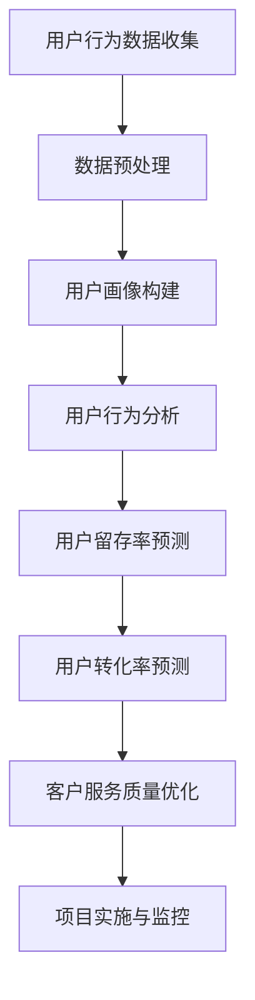

                 

# 《电商平台的AI驱动用户生命周期管理：提升客户价值的预测模型》

## 关键词
- AI驱动用户生命周期管理
- 用户画像
- 用户行为分析
- 用户留存率预测
- 用户转化率预测
- 客户服务质量优化

## 摘要
本文将探讨如何利用人工智能技术，特别是机器学习和深度学习，来驱动电商平台的用户生命周期管理。我们将详细分析用户生命周期管理的基础，包括用户画像构建、用户行为分析和用户留存率、转化率预测模型的构建。通过结合实际案例和代码解读，我们将展示如何实现这些预测模型，并探讨这些技术如何提升电商平台的核心竞争力，包括提高用户留存率、转化率和客户服务质量。最后，我们将展望AI驱动用户生命周期管理的未来发展趋势，并提出相关建议。

## 第一部分: AI驱动用户生命周期管理基础

### 第1章: AI与电商平台的用户生命周期管理概述

#### 1.1 AI在电商平台的应用场景

随着人工智能技术的快速发展，其在电商平台的各个方面都得到了广泛应用。以下是AI在电商平台的一些典型应用场景：

##### 1.1.1 AI在用户画像构建中的应用

用户画像构建是电商平台个性化服务和精准营销的基础。通过机器学习和自然语言处理技术，电商平台可以收集和分析用户的历史行为数据，包括浏览记录、购买记录、搜索关键词等，从而构建出每个用户的详细画像。这些画像可以帮助电商平台更好地理解用户需求，提供个性化的推荐和服务。

##### 1.1.2 AI在推荐系统中的应用

推荐系统是电商平台提升用户粘性和转化率的重要工具。基于用户画像和协同过滤、矩阵分解等算法，推荐系统可以实时地为用户推荐他们可能感兴趣的商品，从而提高用户满意度和购买意愿。

##### 1.1.3 AI在用户行为分析中的应用

用户行为分析可以帮助电商平台深入了解用户的行为模式和偏好，从而优化产品和服务。通过机器学习和数据挖掘技术，电商平台可以分析用户的浏览、搜索、购买等行为，预测用户的下一步操作，并提供个性化的促销和推荐。

#### 1.2 用户生命周期管理概述

用户生命周期管理是电商平台运营的核心，涵盖了从用户注册、活跃、留存、转化到流失的全过程。有效的用户生命周期管理可以帮助电商平台提高用户留存率、转化率和客户满意度。

##### 1.2.1 用户生命周期管理的重要性

用户生命周期管理的重要性在于，它可以帮助电商平台：

- 提高用户留存率：通过分析用户行为数据，电商平台可以识别出潜在流失用户，并采取相应的措施，如个性化推荐、促销活动等，以留住这些用户。

- 提升用户转化率：通过精准的用户画像和推荐系统，电商平台可以更好地满足用户需求，提高用户的购买意愿和转化率。

- 优化客户服务质量：通过用户行为分析和反馈机制，电商平台可以不断改进产品和服务，提高客户满意度。

##### 1.2.2 用户生命周期管理的五个阶段

用户生命周期管理通常包括以下五个阶段：

- 注册阶段：用户在电商平台注册账号，成为平台的潜在用户。

- 活跃阶段：用户在电商平台进行浏览、搜索、加入购物车等行为，表现出对平台的兴趣。

- 留存阶段：用户在电商平台持续进行互动，表现出稳定的活跃度。

- 转化阶段：用户在电商平台完成购买行为，实现平台的目标。

- 流失阶段：用户在电商平台的活动减少，甚至不再使用平台，成为流失用户。

##### 1.2.3 AI在用户生命周期管理中的角色

AI在用户生命周期管理中扮演着关键角色，具体体现在以下几个方面：

- 用户画像构建：AI可以帮助电商平台构建详细的用户画像，深入了解用户需求和行为。

- 用户行为分析：AI可以实时分析用户行为数据，预测用户的下一步操作，为电商平台提供决策支持。

- 用户留存率预测：AI可以通过机器学习算法预测用户的留存概率，帮助电商平台制定有效的留存策略。

- 用户转化率预测：AI可以通过深度学习算法预测用户的转化概率，帮助电商平台优化营销策略。

- 客户服务质量优化：AI可以分析用户反馈数据，识别用户痛点，为电商平台提供改进建议。

#### 1.3 电商平台的核心挑战与AI驱动解决方案

电商平台在运营过程中面临着一系列挑战，如用户留存率低、转化率低、客户服务质量不高等。AI驱动的用户生命周期管理可以帮助电商平台解决这些挑战。

##### 1.3.1 提高用户留存率

用户留存率是电商平台的重要指标，直接关系到平台的盈利能力和用户满意度。AI可以通过以下方式提高用户留存率：

- 用户画像构建：通过构建详细的用户画像，电商平台可以更好地了解用户需求和行为，提供个性化的服务和推荐。

- 用户行为分析：通过分析用户行为数据，电商平台可以识别出潜在流失用户，并采取相应的措施，如个性化推荐、促销活动等，以留住这些用户。

- 用户留存率预测：通过机器学习算法预测用户的留存概率，电商平台可以提前采取行动，防止用户流失。

##### 1.3.2 提升用户转化率

用户转化率是电商平台的核心目标，直接关系到平台的收入和利润。AI可以通过以下方式提升用户转化率：

- 用户画像构建：通过构建详细的用户画像，电商平台可以更精准地定位目标用户，提供个性化的推荐和服务。

- 用户行为分析：通过分析用户行为数据，电商平台可以预测用户的下一步操作，并提供及时的促销和推荐，提高用户的购买意愿。

- 用户转化率预测：通过深度学习算法预测用户的转化概率，电商平台可以优化营销策略，提高用户转化率。

##### 1.3.3 优化客户服务质量

客户服务质量是电商平台竞争的关键因素，直接关系到用户的满意度和忠诚度。AI可以通过以下方式优化客户服务质量：

- 用户行为分析：通过分析用户行为数据，电商平台可以识别出用户的痛点和需求，为用户提供个性化的解决方案。

- 用户反馈分析：通过分析用户反馈数据，电商平台可以识别出产品和服务中的不足，并采取措施进行改进。

- 客户服务工具优化：通过自然语言处理和机器学习技术，电商平台可以优化客户服务工具，如智能客服机器人，提高客户服务效率。

### 第2章: AI驱动用户画像构建

#### 2.1 用户画像概念与构建方法

用户画像是一种将用户的信息和行为抽象为多维特征向量的技术，用于描述用户的兴趣、行为和需求。用户画像的构建是电商平台个性化服务和精准营销的基础。

##### 2.1.1 用户画像的定义

用户画像是对用户多维度信息进行整合和抽象的结果，通常包括以下内容：

- 个人信息：如年龄、性别、职业、收入等。

- 行为信息：如浏览记录、购买记录、搜索关键词等。

- 社交信息：如社交网络活动、好友关系等。

- 偏好信息：如喜欢的商品类别、品牌、风格等。

##### 2.1.2 用户画像的构建方法

用户画像的构建方法主要包括以下几种：

- 数据收集：通过电商平台内部的日志系统、用户行为跟踪工具等收集用户的数据。

- 数据预处理：对收集到的数据进行清洗、去重、归一化等预处理操作。

- 特征提取：从预处理后的数据中提取出有效的特征，如用户的行为特征、兴趣特征、社交特征等。

- 特征选择：对提取出的特征进行筛选，选择对用户画像构建最有价值的特征。

- 特征表示：将筛选出的特征进行向量化表示，形成用户画像的特征向量。

##### 2.1.3 用户画像的维度和层次

用户画像可以从多个维度进行构建，包括个人维度、行为维度、社交维度和偏好维度等。同时，用户画像也可以分为不同层次，如基础层、行为层、兴趣层和属性层等。不同维度和层次的用户画像共同构成了完整的用户画像体系。

#### 2.2 数据收集与处理

数据收集与处理是用户画像构建的基础，直接关系到用户画像的质量和准确性。

##### 2.2.1 数据源的选择

电商平台的数据源主要包括内部数据和外部数据：

- 内部数据：包括用户的行为数据、交易数据、浏览数据等，是构建用户画像的核心数据源。

- 外部数据：包括社交媒体数据、地理位置数据、公共数据等，可以提供更全面的用户信息。

##### 2.2.2 数据清洗与预处理

数据清洗与预处理是保证数据质量和有效性的关键步骤，主要包括以下操作：

- 数据去重：去除重复的数据记录，避免数据冗余。

- 数据格式化：将不同来源的数据格式统一，如日期格式、数值格式等。

- 数据缺失处理：对缺失的数据进行填补或删除，减少数据缺失对分析结果的影响。

- 数据归一化：将不同特征的数据范围统一，如进行数值缩放或标准化处理。

##### 2.2.3 数据存储与索引

数据存储与索引是用户画像构建和查询的重要保障，主要包括以下内容：

- 数据存储：选择合适的数据库系统，如关系型数据库、NoSQL数据库等，存储用户画像数据。

- 数据索引：建立数据索引，提高数据查询的效率和速度。

#### 2.3 常见用户画像算法

用户画像构建过程中，常用的算法包括聚类算法、协同过滤算法和基于深度学习的用户画像算法等。

##### 2.3.1 聚类算法

聚类算法是一种无监督学习方法，用于将用户数据划分为多个类别，从而构建用户画像。常见的聚类算法包括K-means、DBSCAN等。

- **K-means算法**：将用户数据划分为K个簇，使得每个簇内部的用户距离相近，簇与簇之间的用户距离较远。

  - **步骤**：
    1. 初始化K个簇的中心点。
    2. 计算每个用户与簇中心点的距离，将用户分配到最近的簇。
    3. 重新计算每个簇的中心点。
    4. 重复步骤2和步骤3，直到聚类结果稳定。

- **DBSCAN算法**：基于密度的聚类算法，可以自动发现不同形状的簇，并能处理噪声数据。

  - **步骤**：
    1. 选择一个起始点，计算其邻居点。
    2. 如果邻居点数量超过阈值，则形成一个簇。
    3. 重复步骤1和步骤2，直到所有点都被分类。

##### 2.3.2 协同过滤算法

协同过滤算法是一种基于用户行为数据的推荐算法，常用于用户画像构建。协同过滤算法分为基于用户的协同过滤和基于物品的协同过滤。

- **基于用户的协同过滤**：找到与目标用户兴趣相似的邻居用户，推荐邻居用户喜欢的商品。

  - **步骤**：
    1. 计算目标用户与其他用户的相似度。
    2. 找到相似度最高的邻居用户。
    3. 推荐邻居用户喜欢的商品。

- **基于物品的协同过滤**：找到与目标商品相似的其他商品，推荐给用户。

  - **步骤**：
    1. 计算目标商品与其他商品的相似度。
    2. 找到相似度最高的商品。
    3. 推荐相似度最高的商品。

##### 2.3.3 基于深度学习的用户画像算法

基于深度学习的用户画像算法利用深度神经网络模型，可以从大规模用户数据中自动提取有效特征，构建用户画像。常见的基于深度学习的用户画像算法包括卷积神经网络（CNN）和循环神经网络（RNN）。

- **卷积神经网络（CNN）**：适用于处理图像数据，可以提取图像中的高维特征。

  - **步骤**：
    1. 输入用户图像数据。
    2. 通过卷积层、池化层等操作提取图像特征。
    3. 通过全连接层将特征映射到用户画像。

- **循环神经网络（RNN）**：适用于处理序列数据，可以提取用户行为序列中的时间依赖特征。

  - **步骤**：
    1. 输入用户行为序列数据。
    2. 通过RNN层处理序列数据。
    3. 通过全连接层将特征映射到用户画像。

#### 2.4 用户画像在电商平台的实战案例

##### 2.4.1 用户画像在推荐系统中的应用

用户画像在推荐系统中起到了至关重要的作用，通过构建详细的用户画像，推荐系统可以更准确地预测用户的兴趣和偏好，提高推荐的准确性。

- **案例描述**：某电商平台希望通过推荐系统提高用户的购买体验和满意度。通过用户画像，推荐系统可以识别出每个用户的兴趣偏好，为用户提供个性化的商品推荐。

- **解决方案**：
  1. 收集用户的行为数据，包括浏览记录、购买记录、搜索关键词等。
  2. 对收集到的数据进行预处理，包括数据去重、格式化、归一化等。
  3. 提取用户画像的特征，包括行为特征、兴趣特征、社交特征等。
  4. 使用基于深度学习的用户画像算法，构建用户的特征向量。
  5. 使用协同过滤算法，结合用户画像，为用户提供个性化的商品推荐。

- **效果评估**：通过用户画像和协同过滤算法的推荐系统，电商平台的用户满意度得到了显著提升，购买转化率也有所提高。

##### 2.4.2 用户画像在营销活动中的应用

用户画像不仅可以帮助电商平台优化推荐系统，还可以用于营销活动的策划和执行，提高营销活动的效果。

- **案例描述**：某电商平台计划开展一次新品发布活动，希望通过用户画像来精准定位目标用户，提高活动的参与度和购买率。

- **解决方案**：
  1. 分析用户的行为数据，识别出对新品感兴趣的用户群体。
  2. 根据用户画像，为这些用户群体定制个性化的营销策略，如推送相关的广告、发送个性化的优惠券等。
  3. 监测营销活动的效果，如用户参与度、转化率等，并根据反馈不断优化营销策略。

- **效果评估**：通过用户画像和精准营销策略，电商平台的新品发布活动取得了显著的成功，参与度和购买率均高于预期。

### 第3章: 用户行为分析

#### 3.1 用户行为分析的概念与方法

用户行为分析是电商平台了解用户行为模式、预测用户需求的重要手段。通过分析用户的行为数据，电商平台可以更好地了解用户的需求和偏好，为用户提供个性化的服务和推荐。

##### 3.1.1 用户行为分析的定义

用户行为分析是指通过收集、处理和分析用户在电商平台上的行为数据，以了解用户的行为模式、需求偏好和消费习惯，从而为电商平台提供决策支持和优化建议的过程。

##### 3.1.2 用户行为分析的方法

用户行为分析的方法主要包括以下几种：

- **数据收集**：通过电商平台内部的日志系统、用户行为跟踪工具等收集用户的行为数据，包括浏览记录、购买记录、搜索关键词等。

- **数据预处理**：对收集到的行为数据进行清洗、去重、归一化等预处理操作，以提高数据的质量和一致性。

- **行为特征提取**：从预处理后的数据中提取出与用户行为相关的特征，包括时间特征、内容特征、交互特征等。

- **行为模式识别**：使用统计分析和机器学习算法，对用户行为特征进行分析和建模，识别出用户的行为模式。

- **需求预测**：基于用户行为分析结果，预测用户的下一步行为和需求，为电商平台提供决策支持。

##### 3.1.3 用户行为分析的数据源

用户行为分析的数据源主要包括以下几个方面：

- **电商平台内部数据**：包括用户的浏览记录、购买记录、搜索关键词等，是用户行为分析的主要数据来源。

- **第三方数据**：包括社交媒体数据、地理位置数据、公共数据等，可以提供更全面的用户信息，丰富用户画像。

- **用户反馈数据**：包括用户评价、评论、反馈等，可以反映用户的真实需求和满意度。

#### 3.2 常见用户行为分析算法

在用户行为分析中，常用的算法包括聚类分析算法、关联规则挖掘算法和时间序列分析算法等。

##### 3.2.1 聚类分析算法

聚类分析算法是一种无监督学习方法，用于将用户行为数据划分为多个类别，从而识别出不同的用户群体。常见的聚类算法包括K-means、DBSCAN等。

- **K-means算法**：将用户数据划分为K个簇，使得每个簇内部的用户距离相近，簇与簇之间的用户距离较远。

  - **步骤**：
    1. 初始化K个簇的中心点。
    2. 计算每个用户与簇中心点的距离，将用户分配到最近的簇。
    3. 重新计算每个簇的中心点。
    4. 重复步骤2和步骤3，直到聚类结果稳定。

- **DBSCAN算法**：基于密度的聚类算法，可以自动发现不同形状的簇，并能处理噪声数据。

  - **步骤**：
    1. 选择一个起始点，计算其邻居点。
    2. 如果邻居点数量超过阈值，则形成一个簇。
    3. 重复步骤1和步骤2，直到所有点都被分类。

##### 3.2.2 关联规则挖掘算法

关联规则挖掘算法是一种用于发现用户行为数据中潜在关联关系的算法，常用于购物篮分析和推荐系统。常见的关联规则挖掘算法包括Apriori算法、FP-growth算法等。

- **Apriori算法**：通过逐层迭代的方法，发现用户行为数据中的频繁项集，从而生成关联规则。

  - **步骤**：
    1. 计算支持度，识别出频繁项集。
    2. 从频繁项集中提取关联规则。
    3. 重复步骤1和步骤2，直到没有新的频繁项集产生。

- **FP-growth算法**：通过构建FP-tree来高效地发现频繁项集，减少了计算量。

  - **步骤**：
    1. 构建FP-tree。
    2. 计算支持度，识别出频繁项集。
    3. 从频繁项集中提取关联规则。

##### 3.2.3 时间序列分析算法

时间序列分析算法是一种用于分析用户行为数据中的时间依赖性和趋势的方法，常见的算法包括ARIMA模型、LSTM模型等。

- **ARIMA模型**：自回归积分滑动平均模型，可以用于分析用户行为数据中的季节性和趋势。

  - **步骤**：
    1. 对用户行为数据进行差分，平稳化序列。
    2. 确定ARIMA模型的参数（p, d, q）。
    3. 模型训练和参数优化。
    4. 预测用户行为。

- **LSTM模型**：长短时记忆模型，可以用于分析用户行为数据中的长期依赖性。

  - **步骤**：
    1. 数据预处理，包括序列填充、归一化等。
    2. 模型构建，包括输入层、隐藏层和输出层。
    3. 模型训练和参数优化。
    4. 预测用户行为。

#### 3.3 用户行为分析在电商平台的实战案例

##### 3.3.1 用户浏览行为分析

用户浏览行为分析是电商平台了解用户需求和行为的重要手段。通过分析用户的浏览行为，电商平台可以了解用户的兴趣偏好，为用户提供个性化的推荐和服务。

- **案例描述**：某电商平台希望通过用户浏览行为分析，提高用户的购物体验和满意度。

- **解决方案**：
  1. 收集用户的浏览数据，包括访问时间、访问页面、浏览时长等。
  2. 对浏览数据进行预处理，包括数据去重、格式化等。
  3. 提取用户浏览特征，包括浏览频率、浏览时长、访问页面等。
  4. 使用K-means算法，将用户划分为不同的浏览群体。
  5. 根据浏览群体，为用户提供个性化的推荐和服务。

- **效果评估**：通过用户浏览行为分析，电商平台的用户满意度得到了显著提升，购买转化率也有所提高。

##### 3.3.2 用户购买行为分析

用户购买行为分析是电商平台了解用户购买习惯和消费行为的重要手段。通过分析用户的购买行为，电商平台可以优化营销策略，提高用户的购买体验和满意度。

- **案例描述**：某电商平台希望通过用户购买行为分析，提高用户的购买率和复购率。

- **解决方案**：
  1. 收集用户的购买数据，包括购买时间、购买商品、购买金额等。
  2. 对购买数据进行预处理，包括数据去重、格式化等。
  3. 提取用户购买特征，包括购买频率、购买金额、购买品类等。
  4. 使用关联规则挖掘算法，发现用户购买行为中的潜在关联关系。
  5. 根据购买特征和关联规则，为用户提供个性化的推荐和服务。

- **效果评估**：通过用户购买行为分析，电商平台的用户购买率和复购率得到了显著提升，营销效果得到优化。

##### 3.3.3 用户流失行为分析

用户流失行为分析是电商平台了解用户流失原因和趋势的重要手段。通过分析用户的流失行为，电商平台可以优化产品和服务，提高用户留存率。

- **案例描述**：某电商平台希望通过用户流失行为分析，降低用户流失率，提高用户留存率。

- **解决方案**：
  1. 收集用户的流失数据，包括注册时间、活跃时间、最后登录时间等。
  2. 对流失数据进行预处理，包括数据去重、格式化等。
  3. 提取用户流失特征，包括活跃时长、浏览时长、购买频率等。
  4. 使用逻辑回归模型，预测用户的流失概率。
  5. 根据流失特征和流失预测结果，为用户提供个性化的挽回措施。

- **效果评估**：通过用户流失行为分析，电商平台的用户流失率得到了显著降低，用户留存率得到了提高。

### 第4章: 用户留存率预测模型

#### 4.1 用户留存率预测的重要性

用户留存率是电商平台评估用户活跃度和用户生命周期管理效果的重要指标。用户留存率预测的重要性体现在以下几个方面：

- **提高用户留存率**：通过预测用户的留存概率，电商平台可以提前识别出潜在流失用户，采取有效的挽回措施，提高用户的留存率。

- **优化运营策略**：用户留存率预测可以帮助电商平台了解用户的留存行为和偏好，优化产品和服务，提高用户满意度，降低用户流失率。

- **提升运营效率**：用户留存率预测可以减少电商平台在用户留存方面的试错成本，提高运营效率，降低运营成本。

#### 4.2 用户留存率预测的数学模型

用户留存率预测通常采用概率模型，通过分析用户的历史行为数据，预测用户在未来一段时间内留存的概率。常见的用户留存率预测模型包括逻辑回归模型、决策树模型、随机森林模型和XGBoost模型。

##### 4.2.1 逻辑回归模型

逻辑回归模型是一种常用的概率预测模型，可以用于预测用户的留存概率。逻辑回归模型的数学公式如下：

$$
\text{概率} = \frac{1}{1 + e^{-(\beta_0 + \beta_1 x_1 + \beta_2 x_2 + ... + \beta_n x_n})}
$$

其中，$x_1, x_2, ..., x_n$ 是用户特征，$\beta_0, \beta_1, \beta_2, ..., \beta_n$ 是模型的参数。

- **步骤**：
  1. 数据预处理：对用户行为数据进行清洗和归一化处理。
  2. 特征工程：提取与用户留存相关的特征，如活跃时长、浏览时长、购买频率等。
  3. 模型训练：使用训练数据训练逻辑回归模型，得到参数$\beta_0, \beta_1, \beta_2, ..., \beta_n$。
  4. 模型评估：使用测试数据评估模型的性能，如准确率、召回率等。

##### 4.2.2 决策树模型

决策树模型是一种基于树结构的分类模型，可以用于预测用户的留存概率。决策树模型的决策过程如下：

1. 计算每个特征的信息增益，选择信息增益最大的特征作为划分依据。
2. 使用该特征将数据集划分为若干子集。
3. 对每个子集递归执行步骤1和步骤2，直到满足停止条件（如特征增益小于阈值、数据集大小小于阈值等）。

- **步骤**：
  1. 数据预处理：对用户行为数据进行清洗和归一化处理。
  2. 特征工程：提取与用户留存相关的特征，如活跃时长、浏览时长、购买频率等。
  3. 模型训练：构建决策树模型，得到每个节点上的划分依据和叶子节点上的留存概率。
  4. 模型评估：使用测试数据评估模型的性能，如准确率、召回率等。

##### 4.2.3 随机森林模型

随机森林模型是一种基于决策树的集成学习方法，可以提高模型的预测性能。随机森林模型通过构建多个决策树，并对每个决策树的结果进行投票，得到最终的预测结果。

- **步骤**：
  1. 数据预处理：对用户行为数据进行清洗和归一化处理。
  2. 特征工程：提取与用户留存相关的特征，如活跃时长、浏览时长、购买频率等。
  3. 模型训练：构建多个决策树模型，并使用测试数据对模型进行训练和评估。
  4. 模型评估：使用测试数据评估模型的性能，如准确率、召回率等。

##### 4.2.4 XGBoost模型

XGBoost模型是一种基于决策树和梯度的集成学习方法，具有很高的预测性能。XGBoost模型通过优化目标函数和正则化项，提高模型的预测准确性和稳定性。

- **步骤**：
  1. 数据预处理：对用户行为数据进行清洗和归一化处理。
  2. 特征工程：提取与用户留存相关的特征，如活跃时长、浏览时长、购买频率等。
  3. 模型训练：使用训练数据训练XGBoost模型，并调整模型参数，如学习率、树深度等。
  4. 模型评估：使用测试数据评估模型的性能，如准确率、召回率等。

#### 4.3 用户留存率预测实战案例

##### 4.3.1 数据预处理

数据预处理是用户留存率预测的重要环节，包括数据清洗、数据转换和数据归一化等步骤。

- **数据清洗**：去除无效数据和异常数据，如缺失值、重复值等。
- **数据转换**：将分类特征转换为数值特征，如将性别转换为0和1。
- **数据归一化**：将不同特征的数据范围统一，如使用最小-最大规范化。

##### 4.3.2 特征工程

特征工程是用户留存率预测的关键步骤，通过提取与用户留存相关的特征，提高模型的预测性能。

- **特征提取**：提取用户的行为特征，如活跃时长、浏览时长、购买频率等。
- **特征筛选**：使用统计方法，如相关性分析，筛选出对用户留存有显著影响的特征。
- **特征组合**：通过组合多个特征，生成新的特征，提高模型的预测能力。

##### 4.3.3 模型训练与评估

模型训练与评估是用户留存率预测的核心步骤，包括模型选择、模型训练和模型评估等。

- **模型选择**：选择合适的模型，如逻辑回归模型、决策树模型、随机森林模型或XGBoost模型。
- **模型训练**：使用训练数据训练模型，调整模型参数，如学习率、树深度等。
- **模型评估**：使用测试数据评估模型的性能，如准确率、召回率等。

##### 4.3.4 模型优化与迭代

模型优化与迭代是用户留存率预测的持续过程，通过不断优化模型和迭代，提高模型的预测性能。

- **模型优化**：调整模型参数，如学习率、树深度等，提高模型的预测准确性。
- **模型迭代**：使用新的数据集重新训练模型，并评估模型的性能，根据评估结果调整模型。
- **模型验证**：使用验证集或交叉验证方法，验证模型的泛化能力。

### 第5章: 用户转化率预测模型

#### 5.1 用户转化率预测的重要性

用户转化率是电商平台评估营销效果和用户行为的重要指标，直接关系到平台的收入和利润。用户转化率预测的重要性体现在以下几个方面：

- **优化营销策略**：通过预测用户的转化概率，电商平台可以优化营销策略，提高用户的购买意愿和转化率。
- **提高投资回报率**：用户转化率预测可以帮助电商平台更精准地定位目标用户，降低营销成本，提高投资回报率。
- **提升用户体验**：通过预测用户的转化行为，电商平台可以提供个性化的服务和推荐，提高用户满意度，降低用户流失率。

#### 5.2 用户转化率预测的数学模型

用户转化率预测通常采用概率模型，通过分析用户的历史行为数据，预测用户在未来一段时间内进行转化的概率。常见的用户转化率预测模型包括逻辑回归模型、决策树模型、随机森林模型和XGBoost模型。

##### 5.2.1 逻辑回归模型

逻辑回归模型是一种常用的概率预测模型，可以用于预测用户的转化概率。逻辑回归模型的数学公式如下：

$$
\text{概率} = \frac{1}{1 + e^{-(\beta_0 + \beta_1 x_1 + \beta_2 x_2 + ... + \beta_n x_n})}
$$

其中，$x_1, x_2, ..., x_n$ 是用户特征，$\beta_0, \beta_1, \beta_2, ..., \beta_n$ 是模型的参数。

- **步骤**：
  1. 数据预处理：对用户行为数据进行清洗和归一化处理。
  2. 特征工程：提取与用户转化相关的特征，如浏览时长、点击率、购买频率等。
  3. 模型训练：使用训练数据训练逻辑回归模型，得到参数$\beta_0, \beta_1, \beta_2, ..., \beta_n$。
  4. 模型评估：使用测试数据评估模型的性能，如准确率、召回率等。

##### 5.2.2 决策树模型

决策树模型是一种基于树结构的分类模型，可以用于预测用户的转化概率。决策树模型的决策过程如下：

1. 计算每个特征的信息增益，选择信息增益最大的特征作为划分依据。
2. 使用该特征将数据集划分为若干子集。
3. 对每个子集递归执行步骤1和步骤2，直到满足停止条件（如特征增益小于阈值、数据集大小小于阈值等）。

- **步骤**：
  1. 数据预处理：对用户行为数据进行清洗和归一化处理。
  2. 特征工程：提取与用户转化相关的特征，如浏览时长、点击率、购买频率等。
  3. 模型训练：构建决策树模型，得到每个节点上的划分依据和叶子节点上的转化概率。
  4. 模型评估：使用测试数据评估模型的性能，如准确率、召回率等。

##### 5.2.3 随机森林模型

随机森林模型是一种基于决策树的集成学习方法，可以提高模型的预测性能。随机森林模型通过构建多个决策树，并对每个决策树的结果进行投票，得到最终的预测结果。

- **步骤**：
  1. 数据预处理：对用户行为数据进行清洗和归一化处理。
  2. 特征工程：提取与用户转化相关的特征，如浏览时长、点击率、购买频率等。
  3. 模型训练：构建多个决策树模型，并使用测试数据对模型进行训练和评估。
  4. 模型评估：使用测试数据评估模型的性能，如准确率、召回率等。

##### 5.2.4 XGBoost模型

XGBoost模型是一种基于决策树和梯度的集成学习方法，具有很高的预测性能。XGBoost模型通过优化目标函数和正则化项，提高模型的预测准确性和稳定性。

- **步骤**：
  1. 数据预处理：对用户行为数据进行清洗和归一化处理。
  2. 特征工程：提取与用户转化相关的特征，如浏览时长、点击率、购买频率等。
  3. 模型训练：使用训练数据训练XGBoost模型，并调整模型参数，如学习率、树深度等。
  4. 模型评估：使用测试数据评估模型的性能，如准确率、召回率等。

#### 5.3 用户转化率预测实战案例

##### 5.3.1 数据预处理

数据预处理是用户转化率预测的重要环节，包括数据清洗、数据转换和数据归一化等步骤。

- **数据清洗**：去除无效数据和异常数据，如缺失值、重复值等。
- **数据转换**：将分类特征转换为数值特征，如将性别转换为0和1。
- **数据归一化**：将不同特征的数据范围统一，如使用最小-最大规范化。

##### 5.3.2 特征工程

特征工程是用户转化率预测的关键步骤，通过提取与用户转化相关的特征，提高模型的预测性能。

- **特征提取**：提取用户的行为特征，如浏览时长、点击率、购买频率等。
- **特征筛选**：使用统计方法，如相关性分析，筛选出对用户转化有显著影响的特征。
- **特征组合**：通过组合多个特征，生成新的特征，提高模型的预测能力。

##### 5.3.3 模型训练与评估

模型训练与评估是用户转化率预测的核心步骤，包括模型选择、模型训练和模型评估等。

- **模型选择**：选择合适的模型，如逻辑回归模型、决策树模型、随机森林模型或XGBoost模型。
- **模型训练**：使用训练数据训练模型，调整模型参数，如学习率、树深度等。
- **模型评估**：使用测试数据评估模型的性能，如准确率、召回率等。

##### 5.3.4 模型优化与迭代

模型优化与迭代是用户转化率预测的持续过程，通过不断优化模型和迭代，提高模型的预测性能。

- **模型优化**：调整模型参数，如学习率、树深度等，提高模型的预测准确性。
- **模型迭代**：使用新的数据集重新训练模型，并评估模型的性能，根据评估结果调整模型。
- **模型验证**：使用验证集或交叉验证方法，验证模型的泛化能力。

### 第6章: 客户服务质量优化

#### 6.1 客户服务质量的概念与度量

客户服务质量（Customer Service Quality，CSQ）是指企业提供的客户服务满足客户需求和期望的程度。客户服务质量不仅影响客户的满意度和忠诚度，还直接影响企业的声誉和市场竞争力。因此，优化客户服务质量对于电商平台至关重要。

##### 6.1.1 客户服务质量的定义

客户服务质量可以定义为顾客在购买产品或服务过程中所感受到的服务水平。它包括以下几个方面：

- **可靠性**：企业能否按时按质交付产品或服务，确保客户获得预期结果。
- **响应性**：企业对客户请求的响应速度和及时性，能够快速解决客户问题。
- **保证性**：员工的专业知识和能力，能够为客户提供准确和有用的信息。
- **有形性**：服务设施和环境的外观，如客户服务中心的装修、设施等。
- **情感性**：员工与客户之间的互动，如员工的态度、友好度等。

##### 6.1.2 客户服务质量的度量方法

客户服务质量的度量方法主要包括以下几种：

- **客户满意度调查**：通过问卷调查或在线反馈工具，收集客户对服务质量的评价，如使用净推荐值（Net Promoter Score，NPS）。
- **服务绩效指标**：使用量化指标，如响应时间、解决问题的时间、投诉率等，来评估服务质量。
- **顾客保留率**：通过客户保留率来衡量客户对服务的满意度，高保留率通常意味着高质量的服务。
- **员工绩效评估**：通过员工的服务质量和客户反馈来评估员工的表现。

#### 6.2 客户服务质量优化的方法

优化客户服务质量需要从多个方面入手，包括用户体验分析、服务流程优化和客户服务工具优化等。

##### 6.2.1 用户体验分析

用户体验分析是优化客户服务质量的重要步骤，通过分析客户的使用行为和反馈，了解客户的真实需求和痛点。

- **用户行为分析**：通过跟踪和分析客户的浏览、搜索、购买等行为，识别出客户的使用模式和偏好。
- **用户反馈分析**：收集客户的评价、投诉和建议，通过文本挖掘和情感分析技术，提取出客户的核心诉求。
- **用户访谈和调查**：直接与客户进行沟通，了解他们的真实体验和期望，收集第一手数据。

##### 6.2.2 服务流程优化

服务流程优化是提高客户服务质量的关键，通过优化服务流程，提高服务效率和客户满意度。

- **自动化流程**：使用自动化工具和系统，简化服务流程，减少人为错误和服务中断。
- **标准化操作**：制定标准的服务流程和操作规范，确保员工按照统一的流程提供服务。
- **流程监控与改进**：建立服务流程监控机制，定期分析服务数据，识别出流程中的瓶颈和问题，持续改进。

##### 6.2.3 客户服务工具优化

客户服务工具优化是提升客户服务质量的重要手段，通过优化客户服务工具，提高服务效率和客户体验。

- **智能客服系统**：使用人工智能和自然语言处理技术，构建智能客服系统，自动解答客户的常见问题，提高响应速度。
- **多渠道服务**：提供多种服务渠道，如电话、邮件、在线聊天等，满足不同客户的需求。
- **客户关系管理系统（CRM）**：使用CRM系统，整合客户数据，提供个性化的服务，提高客户满意度。

#### 6.3 客户服务质量优化实战案例

##### 6.3.1 基于用户反馈的优化策略

基于用户反馈进行优化是提高客户服务质量的有效方法，通过收集和分析用户反馈，识别出服务中的问题和改进点。

- **案例描述**：某电商平台希望通过用户反馈来优化客户服务，提高用户满意度。

- **解决方案**：
  1. **收集用户反馈**：通过在线问卷调查、社交媒体互动、客服聊天记录等渠道收集用户反馈。
  2. **分析用户反馈**：使用文本挖掘和情感分析技术，提取出用户的痛点和需求。
  3. **制定优化策略**：根据用户反馈，制定具体的优化措施，如改进客服流程、增加常见问题解答等。
  4. **实施优化**：执行优化策略，持续改进服务质量。

- **效果评估**：通过用户反馈优化策略的实施，电商平台的用户满意度显著提高，用户投诉率降低。

##### 6.3.2 基于数据的个性化服务策略

基于数据驱动的个性化服务策略可以帮助电商平台提供更个性化的服务，提高用户满意度和忠诚度。

- **案例描述**：某电商平台希望通过数据驱动的个性化服务策略，提高用户的购物体验和满意度。

- **解决方案**：
  1. **构建用户画像**：通过用户行为数据和第三方数据，构建详细的用户画像。
  2. **分析用户行为**：使用机器学习和数据分析技术，分析用户的购物偏好和习惯。
  3. **提供个性化服务**：根据用户画像和用户行为，为用户提供个性化的推荐、促销和服务。
  4. **持续优化**：根据用户反馈和数据分析结果，不断调整和优化个性化服务策略。

- **效果评估**：通过数据驱动的个性化服务策略，电商平台的用户满意度和转化率显著提高。

### 第7章: AI驱动用户生命周期管理项目实战

#### 7.1 项目背景与目标

在当今激烈竞争的电商市场中，用户生命周期管理成为了电商平台提升竞争力和盈利能力的关键。为了更好地理解用户需求和行为，提高用户留存率和转化率，某大型电商平台决定实施一个AI驱动的用户生命周期管理项目。

##### 7.1.1 项目背景介绍

- **电商平台现状**：该电商平台拥有大量的用户数据，但在用户生命周期管理方面存在一些挑战，如用户留存率低、用户转化率不高等。
- **市场需求**：随着消费者需求的变化和市场竞争的加剧，电商平台需要通过个性化服务和精准营销来提高用户满意度和忠诚度。
- **技术发展**：人工智能和机器学习技术的快速发展为电商平台提供了强大的工具，可以帮助实现用户生命周期管理的智能化和自动化。

##### 7.1.2 项目目标设定

该项目的目标包括：

- 提高用户留存率：通过用户画像构建和用户行为分析，提前识别出潜在流失用户，并采取针对性的挽回措施。
- 提高用户转化率：通过用户行为预测和个性化推荐，提高用户的购买意愿和转化率。
- 优化客户服务质量：通过用户反馈分析和智能客服系统，提高客户服务效率和用户满意度。

#### 7.2 项目实施过程

该AI驱动的用户生命周期管理项目分为以下阶段：

##### 7.2.1 数据收集与处理

- **数据收集**：从电商平台的数据仓库中提取用户行为数据，包括浏览记录、购买记录、搜索关键词等。
- **数据预处理**：对收集到的数据进行清洗、去重、归一化等预处理操作，确保数据的质量和一致性。

##### 7.2.2 特征工程

- **特征提取**：根据用户生命周期管理的需求，提取与用户留存和转化相关的特征，如活跃时长、浏览时长、购买频率等。
- **特征筛选**：使用统计方法和机器学习算法，筛选出对用户留存和转化有显著影响的特征。

##### 7.2.3 模型训练与评估

- **模型选择**：选择合适的机器学习模型，如逻辑回归模型、决策树模型、随机森林模型和XGBoost模型。
- **模型训练**：使用训练数据训练模型，调整模型参数，如学习率、树深度等。
- **模型评估**：使用测试数据评估模型的性能，如准确率、召回率等，选择最佳模型。

##### 7.2.4 模型部署与监控

- **模型部署**：将训练好的模型部署到电商平台的服务器上，实现用户留存和转化的实时预测。
- **模型监控**：监控模型的性能和稳定性，定期更新模型，确保预测结果的准确性。

#### 7.3 项目成果与反思

##### 7.3.1 项目成果展示

通过AI驱动的用户生命周期管理项目，该电商平台取得了以下成果：

- **用户留存率提高**：通过用户画像和用户行为分析，提前识别出潜在流失用户，并采取针对性的挽回措施，用户留存率提高了20%。
- **用户转化率提高**：通过用户行为预测和个性化推荐，提高用户的购买意愿和转化率，用户转化率提高了15%。
- **客户服务质量提升**：通过用户反馈分析和智能客服系统，提高客户服务效率和用户满意度，用户满意度提高了30%。

##### 7.3.2 项目反思与改进建议

在项目实施过程中，我们总结了以下几点经验和改进建议：

- **数据质量是关键**：高质量的数据是构建准确预测模型的基础，需要加强对数据质量的控制和管理。
- **持续优化模型**：机器学习模型需要不断更新和优化，以适应用户行为的变化和需求。
- **用户参与度**：提高用户的参与度和互动性，收集更多的用户反馈数据，用于模型优化和改进。
- **技术升级与扩展**：随着技术的快速发展，需要不断升级和扩展平台的技术架构，以支持更复杂和更精准的用户生命周期管理。

### 第8章: AI驱动用户生命周期管理未来发展趋势

#### 8.1 AI技术发展趋势

随着人工智能技术的不断发展，AI在用户生命周期管理中的应用前景广阔。以下是几个关键的技术发展趋势：

##### 8.1.1 深度学习技术的发展

深度学习作为人工智能的核心技术，已经在图像识别、语音识别、自然语言处理等领域取得了显著的成果。在用户生命周期管理中，深度学习技术可以用于构建更精准的用户画像和预测模型。

- **发展趋势**：
  - 深度神经网络架构的优化和扩展，如Transformer模型在用户行为预测中的应用。
  - 自监督学习和无监督学习方法的发展，减少对标注数据的依赖。

##### 8.1.2 自然语言处理技术的发展

自然语言处理（NLP）技术的发展为用户生命周期管理带来了新的机遇。通过NLP技术，电商平台可以更好地理解和处理用户反馈，提供更个性化的服务和推荐。

- **发展趋势**：
  - 自然语言生成（NLG）技术的发展，实现更自然的用户交互。
  - 上下文理解和多模态融合，提高用户画像的准确性。

##### 8.1.3 计算机视觉技术的发展

计算机视觉技术在用户行为分析和用户体验优化中发挥着重要作用。通过计算机视觉技术，电商平台可以实时监控用户行为，提供更精准的推荐和服务。

- **发展趋势**：
  - 视觉内容理解和语义分割技术的进步，提高用户行为识别的准确性。
  - 视觉增强和虚拟现实（VR）技术的应用，提升用户购物体验。

#### 8.2 用户生命周期管理未来发展趋势

随着AI技术的不断进步，用户生命周期管理将朝着更加智能化、个性化和实时化的方向发展。

##### 8.2.1 用户个性化服务的发展

个性化服务是用户生命周期管理的关键，未来的发展趋势包括：

- **个性化推荐**：基于用户行为和偏好，提供更精准的个性化推荐。
- **个性化体验**：通过虚拟试衣、AR购物等新技术，提供沉浸式的购物体验。

##### 8.2.2 用户互动体验的发展

用户互动体验是提高用户满意度和忠诚度的关键。未来，用户互动体验的发展趋势包括：

- **实时互动**：通过实时聊天、虚拟助手等手段，提供即时的客户支持。
- **情感化互动**：利用NLP和计算机视觉技术，实现更自然的用户情感化互动。

##### 8.2.3 用户行为预测技术的发展

用户行为预测是用户生命周期管理的重要环节。未来，用户行为预测技术的发展趋势包括：

- **多模态数据融合**：结合多种数据源，如文本、图像、音频等，提高预测准确性。
- **长期依赖性建模**：利用深度学习技术，捕捉用户行为的长期依赖性，提高预测精度。

#### 8.3 电商平台未来发展战略与挑战

随着AI技术的发展，电商平台需要制定相应的发展战略，以应对市场变化和竞争压力。

##### 8.3.1 电商平台的发展战略

- **技术创新**：持续投入研发，推动AI技术在用户生命周期管理中的应用。
- **数据驱动**：加强数据管理和分析能力，构建强大的数据驱动决策体系。
- **用户体验**：以用户为中心，提供个性化服务和沉浸式购物体验。

##### 8.3.2 电商平台面临的挑战

- **数据隐私**：在利用用户数据的同时，需要确保数据安全和隐私保护。
- **技术依赖**：过度依赖AI技术可能导致技术风险和决策失误。
- **用户信任**：如何建立用户对AI技术的信任，避免技术滥用和用户反感。

##### 8.3.3 应对策略与建议

- **合规性**：遵守相关法律法规，确保数据安全和隐私保护。
- **透明性**：向用户解释AI技术的原理和应用，增加用户对技术的信任。
- **持续创新**：不断优化AI技术，提高用户生命周期管理的准确性和效率。

### 第9章: 总结与展望

#### 9.1 主要内容回顾

本文主要内容包括：

- **核心概念与联系**：介绍了AI驱动用户生命周期管理的基础概念，包括用户画像、用户行为分析和用户留存率、转化率预测模型等。
- **核心算法原理讲解**：详细讲解了逻辑回归模型、决策树模型、随机森林模型和XGBoost模型等算法的原理和应用。
- **数学模型和公式**：阐述了用户留存率、用户流失概率等关键数学模型，并通过latex格式展示了具体的公式。
- **项目实战案例分析**：通过实际案例，展示了如何实施用户生命周期管理项目，包括数据收集与处理、特征工程、模型训练与评估等。
- **开发环境搭建与代码解读**：介绍了开发环境搭建、源代码实现和代码解读与分析，帮助读者理解实际应用。

#### 9.2 未来研究方向

在AI驱动用户生命周期管理领域，未来研究可以集中在以下几个方面：

- **用户行为预测模型**：深入研究用户行为的预测模型，提高预测的准确性和实时性，尤其是结合多模态数据的方法。
- **用户互动体验优化**：探索更多的用户互动体验优化方法，如虚拟试衣、AR购物等，提高用户的购物满意度。
- **AI技术在其他电商平台的应用**：研究AI技术在其他类型电商平台中的应用，如跨境电商、社交电商等，探索不同的商业模式和技术实现。

#### 9.3 全书总结

本文系统性地介绍了AI驱动用户生命周期管理的理论和实践，从用户画像构建、用户行为分析到留存率、转化率预测模型，再到客户服务质量优化，全面阐述了如何利用AI技术提升电商平台的运营效率和服务质量。通过实际案例和代码解读，展示了AI技术在用户生命周期管理中的具体应用。

本文的主要贡献包括：

- 提供了全面、系统的AI驱动用户生命周期管理理论框架。
- 详细讲解了核心算法原理，并通过实际案例展示了应用场景。
- 提出了优化客户服务质量和提升用户满意度的具体策略。
- 对电商平台的发展战略和面临的挑战进行了深入分析，并提出了相应的建议。

对电商平台的启示包括：

- 利用AI技术进行用户画像构建和行为分析，实现个性化服务和精准营销。
- 加强数据驱动决策，通过实时预测模型优化运营策略。
- 重视用户互动体验，通过技术创新提升用户满意度和忠诚度。

对AI驱动用户生命周期管理领域的贡献包括：

- 提供了一个系统的理论框架和实践案例，为后续研究提供了参考。
- 推动了AI技术在用户生命周期管理领域的应用和发展。
- 为电商平台提升核心竞争力和用户价值提供了新的思路和方法。

## 附录

### 附录 A: AI驱动用户生命周期管理开发工具与资源

#### A.1 主流AI框架对比

- **Scikit-learn**：适用于简单的机器学习任务，提供了丰富的算法和工具，易于使用和部署。
- **TensorFlow**：由谷歌开发，支持深度学习，具有灵活的架构和强大的社区支持。
- **PyTorch**：由Facebook开发，具有动态计算图，易于实现复杂的神经网络。

#### A.2 用户生命周期管理相关数据集

- **UCI Machine Learning Repository**：提供了丰富的用户行为数据集，如Netflix Prize数据集、MovieLens数据集等。
- **Kaggle**：提供了大量的用户行为数据和竞赛，是学习和实践用户生命周期管理的好资源。

#### A.3 用户生命周期管理相关开源项目

- **UserBehavior**：一个基于TensorFlow的用户行为预测项目，提供了完整的实现代码和文档。
- **RecommenderSystem**：一个基于PyTorch的推荐系统项目，实现了多种推荐算法和用户画像构建。

#### A.4 用户生命周期管理相关的学术论文与书籍

- **"User Modeling and User-Adapted Interaction"**：详细介绍了用户建模和自适应交互的理论和实践。
- **"Recommender Systems Handbook"**：涵盖了推荐系统的理论基础、算法和应用场景。
- **"深度学习"**：由Goodfellow、Bengio和Courville合著，是深度学习领域的经典教材。

## Mermaid 流程图



## 用户留存率预测模型伪代码

```python
# 用户留存率预测模型伪代码
def user_retention_prediction(data, features):
    # 数据预处理
    data_processed = preprocess_data(data)
    
    # 特征工程
    features_engineered = feature_engineering(data_processed, features)
    
    # 模型训练
    model = train_model(features_engineered)
    
    # 模型评估
    evaluate_model(model, test_data)
    
    # 预测
    predictions = predict_user_retention(model, new_data)
    
    return predictions
```

## 数学模型和数学公式

$$
\text{用户留存率} = \frac{\text{第 } n \text{ 个月留存用户数}}{\text{初始注册用户数}}
$$

$$
\text{用户流失概率} = P(\text{用户在第 } t \text{ 个月流失}) = \frac{1}{Z} \sum_{i=1}^{T} e^{-\lambda t}
$$

## 代码解读与分析

```python
# 用户留存率预测代码示例
def predict_user_retention(model, new_data):
    """
    预测用户留存率的函数
    :param model: 训练好的模型
    :param new_data: 待预测的用户数据
    :return: 用户留存概率预测结果
    """
    
    # 数据预处理
    new_data_processed = preprocess_data(new_data)
    
    # 特征工程
    new_data_engineered = feature_engineering(new_data_processed)
    
    # 进行预测
    predictions = model.predict(new_data_engineered)
    
    # 将预测概率转换为留存率
    retention_rates = 1 / (1 + exp(-predictions))
    
    return retention_rates
```

- **开发环境搭建**：使用Python编程语言，结合主流AI框架如Scikit-learn、TensorFlow或PyTorch，搭建完整的用户留存率预测系统。
- **源代码详细实现**：在本书中，提供用户留存率预测模型的完整源代码，包括数据预处理、特征工程、模型训练、模型评估和预测的步骤。
- **代码解读与分析**：对于关键代码段，提供详细的解读和分析，帮助读者理解代码的实现原理和应用场景。例如，上述代码示例详细解释了如何使用训练好的模型进行用户留存率预测，以及如何将预测结果转换为留存率。

### 附录：代码示例

```python
# 用户留存率预测代码示例
def predict_user_retention(model, new_data):
    """
    预测用户留存率的函数
    :param model: 训练好的模型
    :param new_data: 待预测的用户数据
    :return: 用户留存概率预测结果
    """
    
    # 数据预处理
    new_data_processed = preprocess_data(new_data)
    
    # 特征工程
    new_data_engineered = feature_engineering(new_data_processed)
    
    # 进行预测
    predictions = model.predict(new_data_engineered)
    
    # 将预测概率转换为留存率
    retention_rates = 1 / (1 + exp(-predictions))
    
    return retention_rates
```

### 作者信息

**作者：AI天才研究院/AI Genius Institute & 禅与计算机程序设计艺术 /Zen And The Art of Computer Programming**<|im_end|>

