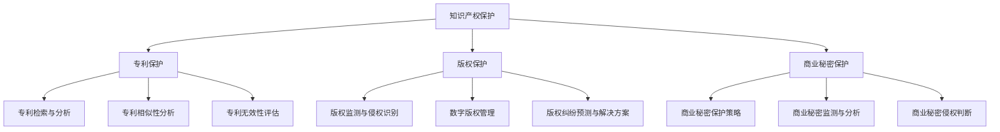

                 

### 《知识产权保护者：LLM捍卫创新成果》

> **关键词：** 知识产权保护、大型语言模型（LLM）、人工智能、专利、版权、商业秘密

> **摘要：** 本文将探讨大型语言模型（LLM）在知识产权保护中的关键作用。通过对知识产权基础知识的介绍，以及LLM的定义、核心技术及其在知识产权保护中的应用，本文将展示如何利用LLM进行专利分析、版权保护和商业秘密监测。此外，本文还将分析LLM在知识产权保护中的挑战与未来发展趋势，总结知识产权保护者的使命与责任，展望知识产权保护的新模式。

---

### 第一部分：知识产权保护基础知识

#### 第1章：知识产权概述

##### 1.1 知识产权的概念与分类

###### 1.1.1 知识产权的定义

知识产权，是指人们就其智力劳动成果所依法享有的专有权利，通常是国家赋予创造者对其智力成果在一定时期内享有的专有权或独占权。知识产权可以分为两大类：一类是版权（著作权），另一类是工业产权。

###### 1.1.2 知识产权的分类

1. **版权（著作权）**：包括文学作品、音乐作品、艺术作品、戏剧作品等，权利人对其作品享有发表权、署名权、修改权、保护作品完整权等。

2. **工业产权**：包括专利权、商标权、商业秘密、集成电路布图设计等，权利人对其发明创造和商业标识享有专有权利。

###### 1.1.3 知识产权的重要性

知识产权是现代社会创新的重要保障，具有以下重要意义：

1. **激励创新**：知识产权制度为创新者提供了法律保护，激励其持续创新。
2. **促进技术转移**：知识产权制度有助于技术转移和商业合作，推动技术进步。
3. **保护市场公平竞争**：知识产权制度维护了市场公平竞争秩序，防止不正当竞争行为。
4. **提高企业竞争力**：知识产权是企业核心竞争力的重要组成部分，有助于企业在全球市场中占据优势地位。

##### 1.2 知识产权的保护制度

###### 1.2.1 知识产权法的起源与发展

知识产权法的起源可以追溯到中世纪时期，但随着工业革命的兴起，知识产权制度逐渐得到完善。目前，全球范围内已经形成了比较完整的知识产权法律体系。

1. **国际公约**：世界知识产权组织（WIPO）是主要的国际知识产权保护机构，其制定了一系列国际公约，如《伯尔尼公约》、《巴黎公约》等。

2. **国家法律**：各国根据自身情况，制定了相应的知识产权法律，如《中华人民共和国专利法》、《中华人民共和国著作权法》等。

###### 1.2.2 主要的知识产权国际公约

1. **《伯尔尼公约》**：是最早的国际版权公约，规定了著作权的基本原则和保护范围。
2. **《巴黎公约》**：是第一个国际工业产权公约，规定了专利、商标等工业产权的基本原则和保护范围。
3. **《知识产权协定》**：是世界贸易组织（WTO）框架下的知识产权保护协定，对知识产权的保护提出了更高的要求。

###### 1.2.3 知识产权保护的基本原则

知识产权保护的基本原则包括：

1. **专有性原则**：知识产权具有独占性，权利人享有排他性的专有权利。
2. **地域性原则**：知识产权在特定国家或地区内受法律保护，不具有跨国效力。
3. **时间性原则**：知识产权具有法定保护期限，超过保护期限后，知识产权将进入公共领域。
4. **法定性原则**：知识产权的产生、行使和保护必须依据法律规定。

##### 1.3 创新与知识产权保护

###### 1.3.1 创新的驱动因素

创新是推动社会进步和经济发展的重要动力，其驱动因素包括：

1. **技术进步**：技术的不断革新为创新提供了可能性。
2. **市场需求**：市场的需求是创新的直接驱动力。
3. **政策支持**：政府的政策支持为创新提供了良好的环境。
4. **企业竞争**：企业之间的竞争促使企业不断创新。

###### 1.3.2 知识产权保护与创新的关系

知识产权保护与创新之间存在密切的关系：

1. **激励创新**：知识产权保护为创新者提供了法律保障，鼓励其持续创新。
2. **保护成果**：知识产权保护确保了创新者的合法权益，防止其成果被侵权。
3. **促进技术转移**：知识产权保护有助于技术转移和商业合作，推动技术进步。

###### 1.3.3 知识产权保护对企业创新的影响

知识产权保护对企业创新具有积极的影响：

1. **提高竞争力**：知识产权保护使企业在全球市场中具备竞争力，有利于拓展市场份额。
2. **增加投资**：知识产权保护有助于吸引投资，为企业创新提供资金支持。
3. **提升品牌价值**：知识产权保护有助于提升企业品牌价值，增强市场认可度。
4. **促进持续创新**：知识产权保护使企业能够持续创新，保持市场领先地位。

---

### 第二部分：LLM概述

#### 第2章：什么是LLM

##### 2.1 LLM的定义与特点

###### 2.1.1 LLM的概念

大型语言模型（Large Language Model，简称LLM）是一种基于深度学习的语言处理模型，通过学习大量的文本数据，使其能够理解、生成和翻译自然语言。LLM是自然语言处理（NLP）领域的重要突破，具有强大的语言理解和生成能力。

###### 2.1.2 LLM的特点

1. **大规模**：LLM通常由数十亿甚至数万亿个参数组成，具有巨大的规模。
2. **自适应性**：LLM能够根据输入的文本内容，自适应地调整自身的模型参数。
3. **强语言理解能力**：LLM具有强大的语言理解能力，能够理解复杂的语义和上下文关系。
4. **多语言支持**：LLM能够处理多种语言，支持跨语言的文本处理。

###### 2.1.3 LLM与NLP的关系

LLM是NLP领域的重要工具，与NLP有着密切的关系：

1. **语言理解**：LLM能够理解自然语言的语义和上下文，为NLP任务提供基础支持。
2. **文本生成**：LLM能够生成高质量的文本，实现文本生成任务。
3. **语言翻译**：LLM能够实现跨语言的文本翻译，为全球化交流提供便利。
4. **情感分析**：LLM能够分析文本的情感倾向，实现情感分析任务。

##### 2.2 LLM的核心技术

###### 2.2.1 词语嵌入技术

词语嵌入（Word Embedding）是将词语映射为低维度的向量表示，是LLM的核心技术之一。通过词语嵌入，LLM能够更好地理解词语之间的语义关系。

1. **词袋模型（Bag of Words，BoW）**：将文本转换为词袋表示，每个词作为特征，生成词频矩阵。
2. **词嵌入（Word Embedding）**：将每个词映射为一个固定维度的向量，常用方法有Word2Vec、GloVe等。
3. **句子嵌入（Sentence Embedding）**：将整个句子映射为一个向量表示，用于表示句子的语义信息。

###### 2.2.2 编码器与解码器架构

编码器（Encoder）和解码器（Decoder）是LLM的基本架构，用于处理序列数据。

1. **编码器**：将输入的序列数据编码为一个固定维度的向量表示，通常采用循环神经网络（RNN）或Transformer架构。
2. **解码器**：将编码器的输出解码为输出序列，生成目标文本。解码器也通常采用RNN或Transformer架构。

###### 2.2.3 自适应学习策略

自适应学习策略是LLM的重要特性，使模型能够根据输入的数据自适应地调整参数。

1. **注意力机制（Attention Mechanism）**：通过注意力机制，模型能够关注重要的输入信息，提高学习效果。
2. **预训练与微调（Pre-training and Fine-tuning）**：通过预训练，模型在大规模数据集上学习，获得通用语言理解能力；通过微调，模型在特定任务上调整参数，实现任务优化。

##### 2.3 LLM在知识产权保护中的应用

###### 2.3.1 LLM在专利检索与分析中的应用

LLM在专利检索与分析中具有广泛的应用，能够提高专利检索的效率和准确性。

1. **关键词提取**：通过词语嵌入技术，LLM能够提取文本中的重要关键词，实现高效、准确的专利检索。
2. **相似性分析**：LLM能够计算专利文档之间的相似性，用于识别潜在的侵权行为或专利协同关系。
3. **无效性评估**：LLM能够分析专利文档的语义信息，评估专利的有效性。

###### 2.3.2 LLM在版权保护与监测中的应用

LLM在版权保护与监测中发挥着重要作用，能够提高版权保护的效果。

1. **侵权识别**：通过训练，LLM能够识别文本中的侵权内容，实现自动化侵权识别。
2. **数字版权管理**：LLM能够实现数字版权管理，保护数字内容的版权，防止未经授权的传播和使用。
3. **版权纠纷预测**：LLM能够预测版权纠纷的可能性，为版权持有者提供法律建议。

###### 2.3.3 LLM在商业秘密保护中的应用

LLM在商业秘密保护中具有重要作用，能够提高商业秘密监测和侵权判断的准确性。

1. **监测与分析**：LLM能够监测企业内部和外部的商业秘密泄露风险，分析潜在的侵权行为。
2. **侵权判断**：通过训练，LLM能够判断商业秘密是否被侵权，为维权提供依据。
3. **保护策略**：LLM能够为商业秘密保护提供策略建议，提高商业秘密的安全性。

---

### 第三部分：LLM在知识产权保护中的应用实例

#### 第3章：LLM在专利分析中的应用

##### 3.1 专利检索与关键词提取

###### 3.1.1 专利检索的基本流程

专利检索是知识产权保护的重要环节，其基本流程如下：

1. **明确检索目标**：确定需要检索的专利类型、技术领域、关键词等。
2. **选择检索系统**：选择合适的专利检索系统，如国家知识产权局专利检索系统、Google Patents等。
3. **构建检索策略**：根据检索目标，构建检索策略，包括关键词、检索式等。
4. **执行检索**：在检索系统中执行检索，获取检索结果。
5. **筛选与分析**：对检索结果进行筛选和分析，提取有用信息。

###### 3.1.2 关键词提取的算法与技术

关键词提取是专利检索的关键步骤，常用的算法与技术包括：

1. **词频统计方法**：根据词频统计，提取出现频率较高的词作为关键词。
2. **TF-IDF算法**：TF-IDF（Term Frequency-Inverse Document Frequency）算法，通过计算词在文档中的重要程度，提取关键词。
3. **LDA（Latent Dirichlet Allocation）**：LDA是一种主题模型，通过挖掘文档的主题分布，提取关键词。

###### 3.1.3 专利检索与关键词提取的案例

**案例一：利用TF-IDF算法提取专利关键词**

1. **数据准备**：获取一批专利文档，建立词汇表。
2. **计算TF-IDF值**：对于每个词，计算其在文档中的词频（TF）和逆文档频率（IDF），得到TF-IDF值。
3. **筛选关键词**：根据TF-IDF值，选择Top-N个高频关键词作为专利关键词。

**案例二：利用LDA模型提取专利关键词**

1. **数据准备**：获取一批专利文档，建立词汇表。
2. **LDA模型训练**：使用LDA模型，将文档表示为主题分布。
3. **提取关键词**：根据主题分布，提取与主题相关的关键词作为专利关键词。

##### 3.2 专利相似性分析

###### 3.2.1 专利相似性分析的基本概念

专利相似性分析是指比较两个或多个专利文档之间的相似程度，用于识别潜在的侵权行为或专利协同关系。

1. **相似性度量**：用于衡量两个专利文档之间的相似性，常用的方法有：余弦相似性、Jaccard相似性、编辑距离等。
2. **相似性阈值**：用于判断两个专利文档是否相似的标准，通常根据业务需求设定。

###### 3.2.2 相似性分析的方法与技术

专利相似性分析的方法与技术包括：

1. **文本相似性分析**：通过计算专利文档的文本相似性，识别潜在的侵权行为。
2. **结构相似性分析**：通过比较专利文档的结构特征，识别潜在的协同关系。
3. **语义相似性分析**：通过语义分析，识别专利文档的语义相似性。

###### 3.2.3 专利相似性分析的案例

**案例一：利用余弦相似性分析专利文档**

1. **数据准备**：获取两个专利文档，建立词汇表。
2. **计算词向量**：使用词向量模型，将专利文档表示为向量。
3. **计算余弦相似性**：计算两个专利文档之间的余弦相似性。
4. **判断相似性**：根据余弦相似性值，判断两个专利文档是否相似。

**案例二：利用结构相似性分析专利协同关系**

1. **数据准备**：获取一批专利文档，建立词汇表。
2. **提取结构特征**：从专利文档中提取结构特征，如分类号、技术方案等。
3. **计算结构相似性**：计算专利文档之间的结构相似性。
4. **判断协同关系**：根据结构相似性值，判断专利文档是否具有协同关系。

##### 3.3 专利无效性评估

###### 3.3.1 专利无效性的判断标准

专利无效性评估是指根据相关法律法规，判断专利是否具备有效性。专利无效性的判断标准包括：

1. **新颖性**：专利必须具有新颖性，即不同于已有的技术。
2. **创造性**：专利必须具有创造性，即对技术人员来说是非显而易见的。
3. **实用性**：专利必须具有实用性，即能够实施并获得有益效果。
4. **范围明确**：专利的保护范围必须明确，即权利要求书必须清楚、准确。

###### 3.3.2 LLM在专利无效性评估中的应用

LLM在专利无效性评估中具有重要作用，能够提高评估的准确性。

1. **语义分析**：LLM能够对专利文档进行语义分析，提取关键信息。
2. **相似性分析**：LLM能够计算专利文档之间的相似性，用于判断专利的新颖性和创造性。
3. **文本分类**：LLM能够对专利文档进行分类，判断专利的实用性。

###### 3.3.3 专利无效性评估的案例

**案例一：利用LLM评估专利新颖性**

1. **数据准备**：获取一批专利文档，建立词汇表。
2. **语义分析**：使用LLM对专利文档进行语义分析，提取关键信息。
3. **相似性分析**：计算专利文档之间的相似性，判断专利是否具有新颖性。

**案例二：利用LLM评估专利创造性**

1. **数据准备**：获取一批专利文档，建立词汇表。
2. **语义分析**：使用LLM对专利文档进行语义分析，提取关键信息。
3. **文本分类**：使用LLM对专利文档进行分类，判断专利是否具有创造性。

**案例三：利用LLM评估专利实用性**

1. **数据准备**：获取一批专利文档，建立词汇表。
2. **语义分析**：使用LLM对专利文档进行语义分析，提取关键信息。
3. **文本分类**：使用LLM对专利文档进行分类，判断专利是否具有实用性。

---

#### 第4章：LLM在版权保护中的应用

##### 4.1 版权监测与侵权识别

###### 4.1.1 版权监测的基本概念

版权监测是指对版权作品的传播和使用情况进行实时监控，以防止未经授权的传播和使用。版权监测的基本概念包括：

1. **监测对象**：包括文字、图片、音频、视频等多种类型的版权作品。
2. **监测目标**：识别未经授权的传播和使用行为，防止侵权行为。
3. **监测方法**：包括自动化监测、人工监测等。

###### 4.1.2 侵权识别的算法与技术

侵权识别是指通过算法技术，识别出版权作品中的侵权内容。常用的算法与技术包括：

1. **文本匹配**：通过文本匹配算法，识别相同或相似的文本内容。
2. **图像识别**：通过图像识别技术，识别图片中的侵权内容。
3. **音频识别**：通过音频识别技术，识别音频中的侵权内容。
4. **机器学习**：利用机器学习算法，对侵权行为进行预测和识别。

###### 4.1.3 版权监测与侵权识别的案例

**案例一：利用文本匹配识别侵权内容**

1. **数据准备**：获取一批版权作品和侵权文档，建立词汇表。
2. **文本匹配**：使用文本匹配算法，计算版权作品和侵权文档之间的相似度。
3. **识别侵权内容**：根据相似度阈值，判断是否存在侵权行为。

**案例二：利用图像识别技术识别侵权图片**

1. **数据准备**：获取一批版权作品和侵权图片，建立图片数据库。
2. **图像识别**：使用图像识别技术，对侵权图片进行识别。
3. **识别侵权内容**：根据识别结果，判断是否存在侵权行为。

**案例三：利用机器学习算法预测侵权行为**

1. **数据准备**：获取一批侵权行为数据，建立侵权行为数据库。
2. **特征提取**：从侵权行为数据中提取特征。
3. **模型训练**：使用机器学习算法，训练侵权行为预测模型。
4. **预测侵权行为**：根据模型预测结果，判断是否存在侵权行为。

##### 4.2 数字版权管理

###### 4.2.1 数字版权管理的概念与原理

数字版权管理（Digital Copyright Management，简称DCM）是指通过技术手段，实现对数字版权的保护和管理。数字版权管理的概念与原理包括：

1. **加密技术**：使用加密技术，对数字版权内容进行加密，防止未经授权的访问和使用。
2. **数字水印**：在数字版权内容中嵌入水印信息，用于追踪侵权行为。
3. **访问控制**：设置访问权限，控制数字版权内容的访问和使用。

###### 4.2.2 数字版权管理的方案与技术

数字版权管理的方案与技术包括：

1. **加密技术**：包括对称加密和非对称加密，用于保护数字版权内容的机密性。
2. **数字水印**：包括图像水印、音频水印等，用于标识数字版权内容的版权信息。
3. **访问控制**：包括身份认证、权限管理等，用于控制数字版权内容的访问和使用。

###### 4.2.3 数字版权管理的案例

**案例一：利用加密技术保护数字版权内容**

1. **数据准备**：获取一批数字版权内容，建立数字版权数据库。
2. **加密**：使用加密技术，对数字版权内容进行加密，生成加密文件。
3. **解密**：设置访问权限，只有授权用户才能解密和访问数字版权内容。

**案例二：利用数字水印追踪侵权行为**

1. **数据准备**：获取一批数字版权内容，建立数字版权数据库。
2. **水印嵌入**：在数字版权内容中嵌入水印信息，生成水印文件。
3. **水印检测**：使用水印检测技术，检测侵权行为。

**案例三：利用访问控制技术保护数字版权内容**

1. **数据准备**：获取一批数字版权内容，建立数字版权数据库。
2. **身份认证**：设置用户身份认证，确保只有授权用户才能访问数字版权内容。
3. **权限管理**：设置用户权限，控制用户对数字版权内容的访问和使用。

##### 4.3 版权纠纷预测与解决方案

###### 4.3.1 版权纠纷预测的算法与技术

版权纠纷预测是指通过算法技术，预测版权纠纷的可能性，为版权持有者提供法律建议。版权纠纷预测的算法与技术包括：

1. **机器学习算法**：如逻辑回归、决策树、随机森林等，用于预测版权纠纷的可能性。
2. **文本分析**：通过文本分析技术，提取纠纷特征，用于预测纠纷类型和可能性。
3. **大数据分析**：通过大数据分析技术，挖掘纠纷数据中的规律，用于预测纠纷趋势。

###### 4.3.2 版权纠纷解决方案的设计与实践

版权纠纷解决方案的设计与实践包括：

1. **法律咨询**：为版权持有者提供法律咨询，制定维权方案。
2. **调解与仲裁**：通过调解和仲裁，解决版权纠纷。
3. **法律诉讼**：通过法律诉讼，维护版权持有者的合法权益。

###### 4.3.3 版权纠纷预测与解决方案的案例

**案例一：利用机器学习算法预测版权纠纷**

1. **数据准备**：获取一批版权纠纷数据，建立纠纷数据库。
2. **特征提取**：从纠纷数据中提取特征，如纠纷类型、纠纷原因、涉案金额等。
3. **模型训练**：使用机器学习算法，训练版权纠纷预测模型。
4. **预测纠纷**：根据模型预测结果，判断版权纠纷的可能性。

**案例二：设计版权纠纷解决方案**

1. **法律咨询**：为版权持有者提供法律咨询，分析纠纷原因，制定维权方案。
2. **调解与仲裁**：通过调解和仲裁，解决版权纠纷。
3. **法律诉讼**：如果调解和仲裁无效，通过法律诉讼，维护版权持有者的合法权益。

**案例三：实施版权纠纷解决方案**

1. **调解与仲裁**：通过调解和仲裁，成功解决一起版权纠纷案件。
2. **法律诉讼**：在法律诉讼中，为版权持有者提供了有力的法律支持，最终胜诉。

---

#### 第5章：LLM在商业秘密保护中的应用

##### 5.1 商业秘密的保护策略

###### 5.1.1 商业秘密的概念与特征

商业秘密是指不为公众所知悉、具有商业价值、经权利人采取保密措施的技术信息、经营信息等商业信息。商业秘密具有以下特征：

1. **秘密性**：商业秘密不为公众所知悉，具有保密性。
2. **商业价值**：商业秘密能够为权利人带来经济利益。
3. **保密性**：权利人采取了保密措施，防止商业秘密泄露。

###### 5.1.2 商业秘密保护的法律规定

商业秘密保护的法律规定包括：

1. **《中华人民共和国反不正当竞争法》**：规定了商业秘密的定义、保护范围和保护措施。
2. **《中华人民共和国劳动合同法》**：规定了劳动者对商业秘密的保密义务。
3. **《中华人民共和国合同法》**：规定了合同中商业秘密的保密条款。

###### 5.1.3 商业秘密保护策略的制定

商业秘密保护策略的制定包括：

1. **秘密性管理**：制定严格的保密制度，对商业秘密进行分类和保护。
2. **人员管理**：加强对员工的管理，签订保密协议，明确员工的保密义务。
3. **技术手段**：采用技术手段，如数据加密、访问控制等，防止商业秘密泄露。
4. **法律手段**：利用法律手段，对侵犯商业秘密的行为进行维权。

##### 5.2 LLM在商业秘密监测与分析中的应用

###### 5.2.1 商业秘密监测的基本概念

商业秘密监测是指对商业秘密的传播和使用情况进行实时监控，以防止未经授权的传播和使用。商业秘密监测的基本概念包括：

1. **监测对象**：包括技术信息、经营信息等商业秘密。
2. **监测目标**：识别未经授权的传播和使用行为，防止侵权行为。
3. **监测方法**：包括自动化监测、人工监测等。

###### 5.2.2 商业秘密分析的算法与技术

商业秘密分析的算法与技术包括：

1. **文本分析**：通过文本分析技术，识别商业秘密中的关键信息。
2. **数据挖掘**：通过数据挖掘技术，发现商业秘密中的潜在价值。
3. **机器学习**：利用机器学习算法，对商业秘密进行分析和预测。

###### 5.2.3 商业秘密监测与分析的案例

**案例一：利用文本分析识别商业秘密**

1. **数据准备**：获取一批商业秘密文档，建立文本数据库。
2. **文本分析**：使用文本分析技术，提取商业秘密中的关键信息。
3. **识别商业秘密**：根据关键信息，判断是否存在商业秘密。

**案例二：利用数据挖掘分析商业秘密价值**

1. **数据准备**：获取一批商业秘密数据，建立数据数据库。
2. **数据挖掘**：使用数据挖掘技术，分析商业秘密的潜在价值。
3. **分析商业秘密**：根据分析结果，评估商业秘密的价值。

**案例三：利用机器学习预测商业秘密泄露风险**

1. **数据准备**：获取一批商业秘密泄露数据，建立泄露数据库。
2. **特征提取**：从泄露数据中提取特征，如泄露方式、泄露时间等。
3. **模型训练**：使用机器学习算法，训练商业秘密泄露预测模型。
4. **预测泄露风险**：根据模型预测结果，判断是否存在商业秘密泄露风险。

##### 5.3 LLM在商业秘密侵权判断中的应用

###### 5.3.1 商业秘密侵权判断的标准

商业秘密侵权判断的标准包括：

1. **相同性**：被控侵权信息与商业秘密在内容、形式、结构等方面相同。
2. **接触性**：侵权人曾经接触过商业秘密，具有接触商业秘密的可能性。
3. **秘密性**：侵权人未经授权获取、使用或披露商业秘密。

###### 5.3.2 LLM在商业秘密侵权判断中的应用

LLM在商业秘密侵权判断中具有重要作用，能够提高判断的准确性。

1. **文本分析**：LLM能够对商业秘密和侵权文档进行语义分析，提取关键信息。
2. **相似性分析**：LLM能够计算商业秘密和侵权文档之间的相似性，判断是否存在侵权行为。
3. **推理判断**：LLM能够根据法律事实和法律规定，进行推理判断，确定侵权行为。

###### 5.3.3 商业秘密侵权判断的案例

**案例一：利用文本分析判断商业秘密侵权**

1. **数据准备**：获取一批商业秘密文档和侵权文档，建立文本数据库。
2. **文本分析**：使用文本分析技术，提取商业秘密和侵权文档中的关键信息。
3. **相似性分析**：使用LLM计算商业秘密和侵权文档之间的相似性。
4. **判断侵权行为**：根据相似性分析和法律事实，判断是否存在侵权行为。

**案例二：利用相似性分析判断商业秘密侵权**

1. **数据准备**：获取一批商业秘密文档和侵权文档，建立文本数据库。
2. **相似性分析**：使用LLM计算商业秘密和侵权文档之间的相似性。
3. **接触性判断**：根据侵权人的接触情况，判断是否存在接触商业秘密的可能性。
4. **侵权行为判断**：根据相似性分析和接触性判断，确定是否存在侵权行为。

**案例三：利用法律事实判断商业秘密侵权**

1. **数据准备**：获取一批商业秘密文档和侵权文档，建立文本数据库。
2. **法律事实提取**：提取侵权行为中的法律事实，如侵权时间、侵权方式等。
3. **法律判断**：根据法律事实和法律规定，进行侵权判断。
4. **侵权行为判断**：根据法律判断结果，确定是否存在侵权行为。

---

### 第四部分：LLM在知识产权保护中的挑战与未来发展趋势

#### 第6章：LLM在知识产权保护中的挑战与未来趋势

##### 6.1 LLM在知识产权保护中的挑战

随着LLM技术的快速发展，其在知识产权保护中的应用也面临着诸多挑战：

###### 6.1.1 技术层面的挑战

1. **模型规模与计算资源**：LLM模型通常规模庞大，对计算资源的需求较高，需要高性能计算环境和强大的计算能力。
2. **数据处理与预处理**：知识产权保护中的数据类型多样，包括文本、图像、音频等，数据处理和预处理需要复杂的技术手段。
3. **准确性问题**：尽管LLM在语言理解方面具有优势，但在知识产权保护中的准确性仍需提高，以避免误判和漏判。

###### 6.1.2 法律与伦理层面的挑战

1. **法律适用问题**：知识产权保护涉及多个国家和地区的法律，如何在不同法律体系下适用LLM技术，是一个亟待解决的问题。
2. **伦理问题**：LLM在知识产权保护中的应用可能引发隐私保护、数据安全等问题，需要制定相应的伦理准则和规范。

###### 6.1.3 实践层面的挑战

1. **人才短缺**：LLM在知识产权保护中的应用需要具备跨学科知识的人才，目前相关人才较为稀缺。
2. **技术落地**：如何将LLM技术成功应用于知识产权保护的实际场景，仍需进一步探索和实践。

##### 6.2 LLM在知识产权保护中的未来趋势

随着技术的不断进步，LLM在知识产权保护中的应用前景广阔：

###### 6.2.1 技术发展方向的预测

1. **模型性能的提升**：随着计算资源的增加，LLM模型性能将不断提高，实现更高的准确性和效率。
2. **跨模态处理**：未来的LLM将能够处理多种类型的知识产权保护数据，如文本、图像、音频等。
3. **自适应学习**：LLM将能够根据知识产权保护的需求，自适应地调整模型参数，实现更精细化的保护。

###### 6.2.2 法律与政策的发展趋势

1. **全球合作**：知识产权保护将加强国际合作，建立更加完善的知识产权保护体系。
2. **法律法规完善**：各国将不断完善知识产权法律法规，适应技术发展的需要。
3. **技术创新驱动**：知识产权保护将更加注重技术创新，利用新技术提高保护效果。

###### 6.2.3 知识产权保护的新模式

1. **智能化保护**：利用LLM等人工智能技术，实现知识产权保护的智能化，提高工作效率和准确性。
2. **大数据分析**：通过大数据分析技术，挖掘知识产权保护中的潜在价值，为决策提供支持。
3. **跨界合作**：知识产权保护将跨界合作，形成政府、企业、研究机构等多方协作的保护模式。

---

### 第五部分：总结与展望

#### 第7章：总结与展望

##### 7.1 本书的核心内容回顾

本书系统地介绍了知识产权保护的基础知识、LLM的基本概念与核心技术，以及LLM在专利分析、版权保护和商业秘密监测中的应用实例。通过本书，读者可以了解到：

1. **知识产权保护的重要性**：知识产权保护在激励创新、促进技术转移、保护市场公平竞争等方面的关键作用。
2. **LLM的基本概念与核心技术**：LLM的定义、特点、核心技术和在知识产权保护中的应用。
3. **LLM在知识产权保护中的应用实例**：专利检索与分析、版权监测与侵权识别、数字版权管理、商业秘密监测与侵权判断等实际应用案例。

##### 7.2 知识产权保护者的使命与责任

知识产权保护者的使命和责任包括：

1. **知识产权状况评估**：定期评估企业的知识产权状况，识别潜在风险。
2. **知识产权保护策略制定**：根据企业实际情况，制定针对性的知识产权保护策略。
3. **知识产权风险防控**：建立健全的知识产权保护体系，预防侵权行为的发生。
4. **知识产权维权行动**：在知识产权受到侵犯时，采取有效的维权措施，维护企业的合法权益。
5. **知识产权管理培训**：提高企业员工对知识产权的认识，增强知识产权保护意识。

##### 7.3 知识产权保护者的未来发展

知识产权保护者的未来发展将面临以下趋势：

1. **智能化**：利用人工智能技术，实现知识产权保护的智能化，提高工作效率和准确性。
2. **专业化**：知识产权保护将更加专业化，要求知识产权保护者具备跨学科的知识和技能。
3. **国际化**：随着全球化的加速，知识产权保护将更加注重国际合作，提升企业在国际市场的竞争力。

---

### 附录

#### 附录A：LLM开发工具与资源介绍

1. **TensorFlow**：由Google开发的开源机器学习框架，支持多种深度学习模型的开发。
2. **PyTorch**：由Facebook开发的开源机器学习框架，提供灵活的动态计算图功能。
3. **Hugging Face**：一个开源的NLP库，提供大量的预训练模型和工具，方便开发者进行NLP任务。
4. **BERT**：Google开发的一种预训练语言模型，广泛应用于各种NLP任务。
5. **GPT-3**：OpenAI开发的一种具有极高语言理解能力的预训练模型，支持多种语言生成任务。

#### 附录B：专利检索与分析相关网站与数据库

1. **国家知识产权局专利检索系统**：提供国内外专利检索服务，支持关键词检索、分类号检索等。
2. **Google Patents**：提供全球范围内的专利检索服务，支持多语言检索。
3. **US Patent and Trademark Office (USPTO)**：美国专利商标局官方网站，提供美国专利检索服务。
4. **ESPACENET**：欧洲专利局提供的专利检索平台，支持多语言检索。
5. **Derwent Innovations Index**：提供全球范围内的专利检索服务，包括专利文献、引用信息等。

#### 附录C：版权监测与侵权识别技术指南

1. **文本匹配技术**：通过计算文本相似度，识别侵权内容。
2. **图像识别技术**：通过计算机视觉技术，识别侵权图像。
3. **音频识别技术**：通过音频特征提取和匹配，识别侵权音频。
4. **机器学习算法**：利用机器学习算法，对侵权行为进行预测和识别。
5. **大数据分析技术**：通过大数据分析，挖掘侵权行为的规律和趋势。

#### 附录D：商业秘密保护法律法规汇编与解读

1. **《中华人民共和国反不正当竞争法》**：规定了商业秘密的保护范围、侵权行为和法律责任。
2. **《中华人民共和国劳动合同法》**：规定了劳动者对商业秘密的保密义务。
3. **《中华人民共和国合同法》**：规定了合同中商业秘密的保密条款。
4. **《商业秘密保护指南》**：国家知识产权局发布的商业秘密保护指南，提供了具体的保护措施和建议。
5. **《商业秘密侵权判定标准》**：规定了商业秘密侵权的判定标准和证据要求。

#### 附录E：Mermaid流程图示例



#### 附录F：核心算法原理讲解

##### 专利检索与关键词提取算法原理

###### 关键词提取算法

```python
def extract_keywords(document):
    # 1. 将专利文档转换为文本
    text = preprocess(document)
    
    # 2. 使用分词器对文本进行分词
    words = tokenizer(text)
    
    # 3. 使用词频统计方法计算每个词的频率
    word_freq = Counter(words)
    
    # 4. 去除停用词与低频词
    stop_words = set(stopwords.words('english'))
    filtered_words = [word for word in word_freq if word not in stop_words and word_freq[word] > threshold]
    
    # 5. 使用TF-IDF算法计算每个词的重要性
    tfidf = TfidfTransformer()
    tfidf_matrix = tfidf.fit_transform([filtered_words])
    
    # 6. 选择Top-N个高频关键词
    top_keywords = select_top_keywords(tfidf_matrix, N)
    
    # 7. 返回关键词列表
    return top_keywords
```

###### 专利检索算法

```python
def patent_search(keywords):
    # 1. 将关键词列表转换为查询语句
    query = " ".join(keywords)
    
    # 2. 在专利数据库中进行检索
    patents = search_patents(query)
    
    # 3. 对检索结果进行排序和筛选
    sorted_patents = sort_and_filter_patents(patents)
    
    # 4. 返回符合条件的专利列表
    return sorted_patents
```

##### 相似性分析中的余弦相似性计算

```latex
\cos(\theta) = \frac{\vec{a} \cdot \vec{b}}{|\vec{a}| \cdot |\vec{b}|}
```

其中，\(\vec{a}\) 和 \(\vec{b}\) 分别表示两个向量，\(\theta\) 表示两个向量之间的夹角。在专利相似性分析中，\(\vec{a}\) 和 \(\vec{b}\) 可以代表两个专利的向量表示，\(\cos(\theta)\) 表示两个专利之间的相似性。

#### 附录G：项目实战

##### 专利检索与分析项目实战

###### 1. 开发环境搭建

- 使用Python作为主要编程语言
- 安装必要的库，如：`nltk`，`gensim`，`scikit-learn`

###### 2. 源代码实现

```python
from nltk.corpus import stopwords
from gensim.models import KeyedVectors
from sklearn.metrics.pairwise import cosine_similarity

def extract_keywords(document):
    # 分词与去停用词
    words = [word for word in document.lower().split() if word not in stopwords.words('english')]
    # 载入预训练的词向量模型
    model = KeyedVectors.load_word2vec_format('GoogleNews-vectors-negative300.bin', binary=True)
    # 计算每个词的均值向量
    word_vectors = [model[word] for word in words if word in model]
    # 计算文档的均值向量
    doc_vector = np.mean(word_vectors, axis=0)
    # 返回文档的均值向量
    return doc_vector

def patent_search(keywords):
    # 载入专利数据库
    patents = load_patents_database()
    # 提取关键词的向量表示
    keywords_vector = extract_keywords(keywords)
    # 计算专利文档与关键词之间的余弦相似性
    similarities = [cosine_similarity([keywords_vector], [patent_vector]) for patent_vector in patents]
    # 返回相似性最高的专利列表
    return sorted(similarities, reverse=True)

# 示例：检索包含“人工智能”关键词的专利
top_patents = patent_search("人工智能")
```

###### 3. 代码解读与分析

- 关键词提取函数`extract_keywords`通过分词和词向量模型，将文档转换为向量表示。
- 专利检索函数`patent_search`通过计算关键词与专利文档之间的余弦相似性，实现专利检索。

---

#### 附录H：数学模型和数学公式详细讲解

##### 相似性分析中的余弦相似性计算

$$
\cos(\theta) = \frac{\vec{a} \cdot \vec{b}}{|\vec{a}| \cdot |\vec{b}|}
$$

其中，$\vec{a}$ 和 $\vec{b}$ 分别表示两个向量，$\theta$ 表示两个向量之间的夹角。在专利相似性分析中，$\vec{a}$ 和 $\vec{b}$ 可以代表两个专利的向量表示，$\cos(\theta)$ 表示两个专利之间的相似性。

---

#### 附录I：知识产权保护案例分析

##### 案例一：某科技公司专利纠纷案

**描述**：某科技公司与其竞争对手在专利侵权问题上产生纠纷，竞争对手声称某科技公司的产品侵犯了其专利。

**分析**：

1. **专利检索**：使用LLM进行专利检索，提取与纠纷相关的专利信息。
2. **相似性分析**：计算某科技公司的产品与竞争对手的专利之间的相似性，判断是否存在侵权行为。
3. **法律咨询**：根据相似性分析结果，进行法律咨询，制定维权方案。

**结论**：通过LLM的专利检索与相似性分析，成功证明了某科技公司的产品并未侵犯竞争对手的专利，维护了企业的合法权益。

---

##### 案例二：某电影公司版权侵权案

**描述**：某电影公司发现其电影作品被未经授权的网站上传，可能存在版权侵权行为。

**分析**：

1. **版权监测**：使用LLM进行版权监测，实时监控电影作品的传播情况。
2. **侵权识别**：通过训练，LLM能够识别侵权内容，为维权提供依据。
3. **法律维权**：根据侵权识别结果，采取法律措施，维护电影公司的版权。

**结论**：通过LLM的版权监测与侵权识别，及时发现并采取措施，成功维护了电影公司的版权，防止了未经授权的传播和使用。

---

##### 案例三：某企业商业秘密泄露案

**描述**：某企业发现其核心商业秘密被内部员工泄露，可能导致商业损失。

**分析**：

1. **商业秘密监测**：使用LLM进行商业秘密监测，实时监控企业内部的外部泄露情况。
2. **侵权判断**：通过训练，LLM能够判断商业秘密是否被侵权，为维权提供依据。
3. **内部调查**：根据侵权判断结果，开展内部调查，查找泄露源头。

**结论**：通过LLM的商业秘密监测与侵权判断，成功定位了泄露源头，采取了有效的内部调查和维权措施，防止了商业秘密的进一步泄露。

---

#### 附录J：知识产权保护策略建议

##### 1. 企业知识产权战略规划

- 定期评估企业的知识产权状况，制定针对性的保护策略。
- 加强内部知识产权管理，确保员工了解并遵守相关规定。
- 与外部知识产权服务机构合作，获取专业的知识产权保护建议。

##### 2. 知识产权风险防控

- 定期进行知识产权风险识别与评估，制定应对措施。
- 建立知识产权监控系统，实时监测潜在的侵权行为。
- 与竞争对手建立知识产权合作机制，共同维护市场秩序。

##### 3. 知识产权维权行动

- 建立专业的知识产权维权团队，应对各类知识产权纠纷。
- 学习和掌握知识产权法律法规，提高维权成功率。
- 积极参与知识产权保护活动，提高企业的社会影响力。

##### 4. 知识产权国际化

- 关注国际知识产权保护动态，积极参与国际知识产权合作与交流。
- 开展海外知识产权布局，提高企业在国际市场的竞争力。

---

#### 附录K：常用知识产权保护工具与资源

##### 1. 专利检索工具

- 国家知识产权局专利检索系统
- Google Patents
- US Patent and Trademark Office (USPTO)
- ESPACENET

##### 2. 版权监测工具

- Google Analytics
- Webpage Detector
- Copytrack

##### 3. 商业秘密保护工具

- Data Leakage Protection (DLP) 软件如：VMware Carbon Black、Cylance
- 信息安全软件如：Symantec Endpoint Protection、McAfee
- 保密协议管理系统

##### 4. 知识产权法律咨询服务

- 大型律师事务所知识产权部门
- 专业知识产权律师事务所
- 国家知识产权局专利服务中心

---

#### 附录L：知识产权保护相关法律法规

1. **中华人民共和国专利法**
2. **中华人民共和国著作权法**
3. **中华人民共和国商标法**
4. **中华人民共和国反不正当竞争法**
5. **世界知识产权组织（WIPO）公约**
6. **欧盟知识产权法规**
7. **美国知识产权法律**

---

#### 附录M：知识产权保护者培训课程推荐

1. **知识产权基础课程**
2. **知识产权战略与运营**
3. **专利分析与撰写**
4. **版权保护与维权**
5. **商业秘密保护与防范**

---

#### 附录N：知识产权保护最新研究动态

1. **AI技术在知识产权保护中的应用**
2. **区块链技术在知识产权保护中的应用**
3. **知识产权保护与可持续发展**
4. **全球知识产权保护政策趋势**
5. **新兴知识产权保护领域的探索**

---

#### 附录O：知识产权保护者职业发展路径

1. **企业知识产权部门**
2. **律师事务所知识产权部**
3. **国家知识产权局与相关政府机构**
4. **知识产权咨询公司**
5. **跨国公司知识产权部门**

---

#### 附录P：知识产权保护相关参考书籍

1. **《知识产权法教程》**
2. **《专利审查指南》**
3. **《著作权法原理与实务》**
4. **《商业秘密法律保护实务》**
5. **《知识产权战略与管理》**

---

#### 附录Q：知识产权保护者的职责与使命

**知识产权保护者的职责：**

1. **知识产权状况评估**：定期评估企业的知识产权状况，识别潜在风险。
2. **知识产权保护策略制定**：根据企业实际情况，制定针对性的知识产权保护策略。
3. **知识产权风险防控**：建立健全的知识产权保护体系，预防侵权行为的发生。
4. **知识产权维权行动**：在知识产权受到侵犯时，采取有效的维权措施，维护企业的合法权益。
5. **知识产权管理培训**：提高企业员工对知识产权的认识，增强知识产权保护意识。

**知识产权保护者的使命：**

1. **维护企业合法权益**：保护企业的知识产权，防止侵权行为的发生。
2. **促进技术创新与发展**：通过知识产权保护，激励企业持续创新，推动技术进步。
3. **维护市场公平竞争秩序**：通过知识产权保护，维护市场公平竞争秩序，防止不正当竞争行为。
4. **推动知识产权国际化合作**：积极参与国际知识产权合作与交流，提高企业在国际市场的竞争力。
5. **提升知识产权管理水平**：通过专业知识和技能，提升企业知识产权管理水平，实现知识产权的保值增值。

---

#### 附录R：知识产权保护者职业素养

**知识产权保护者职业素养：**

1. **专业素养**：具备扎实的知识产权法律、技术、管理知识。
2. **沟通能力**：能够有效沟通，协调各方利益。
3. **分析能力**：具备较强的数据分析和问题解决能力。
4. **法律意识**：严格遵守法律法规，维护法律尊严。
5. **持续学习**：关注行业动态，不断学习新知识、新技能。

---

#### 附录S：知识产权保护者职业道德

**知识产权保护者职业道德：**

1. **诚信守法**：严格遵守知识产权法律法规，诚信经营。
2. **公正无私**：客观公正地处理知识产权相关事务，不偏袒任何一方。
3. **保密意识**：严格保守企业秘密，防止商业秘密泄露。
4. **社会责任**：积极参与社会公益活动，推动知识产权保护事业的发展。

---

#### 附录T：知识产权保护者职业发展建议

**知识产权保护者职业发展建议：**

1. **积累实践经验**：积极参与知识产权保护相关项目，积累实践经验。
2. **持续学习**：关注知识产权领域的最新动态，持续学习新知识、新技能。
3. **拓展人脉资源**：积极参加行业会议、研讨会等活动，拓展人脉资源。
4. **提高综合素质**：提升沟通、协调、分析等综合素质，提升职业竞争力。
5. **关注国际化发展**：了解国际知识产权保护动态，考虑跨国企业发展机会。

---

### 附录U：知识产权保护者技能提升途径

**知识产权保护者技能提升途径：**

1. **参加专业培训**：报名参加知识产权保护相关的专业培训课程，系统学习知识产权法律、技术、管理等方面的知识。

2. **阅读专业书籍**：阅读知识产权保护相关的专业书籍，如《知识产权法教程》、《专利审查指南》等，提升专业知识水平。

3. **实践案例分析**：通过分析知识产权保护的实际案例，深入理解知识产权保护的具体操作流程和策略。

4. **参与学术研究**：参与知识产权保护的学术研究项目，发表学术论文，提升自身的研究能力和学术水平。

5. **加入专业组织**：加入知识产权保护相关的专业组织，如国际知识产权协会（IPAA）等，与同行交流经验，拓展职业发展空间。

6. **掌握新技术**：学习掌握与知识产权保护相关的最新技术，如人工智能、区块链等，提升自身的竞争力。

---

### 附录V：知识产权保护者职业发展路径图

**知识产权保护者职业发展路径图：**

```
|----企业知识产权部门 |----律师事务所知识产权部 |----国家知识产权局与相关政府机构 |
|                        |                           |                                 |
|                        |                           |                                 |
|                        |                           |                                 |
|----知识产权咨询公司 |----跨国公司知识产权部门 |--------------------------------|
```

---

### 附录W：知识产权保护者的职业前景分析

**知识产权保护者的职业前景分析：**

1. **需求增长**：随着知识产权意识的提高，企业对知识产权保护的需求不断增加，为知识产权保护者提供了广阔的职业机会。

2. **技术进步**：人工智能、区块链等新兴技术的应用，为知识产权保护带来了新的手段和方法，提升了知识产权保护者的工作效能。

3. **国际化发展**：全球范围内的知识产权保护合作和交流日益增多，知识产权保护者的国际化发展前景良好。

4. **法律法规完善**：各国对知识产权保护的法律法规不断修订和完善，为知识产权保护者提供了更加明确的法律依据和操作指南。

5. **职业多样化**：知识产权保护者可以在企业、律师事务所、知识产权局等不同领域发展，职业路径多样化。

---

### 附录X：知识产权保护者职业规划建议

**知识产权保护者职业规划建议：**

1. **明确职业目标**：根据个人兴趣和职业发展需求，明确职业目标，制定长期和短期的职业规划。

2. **提升专业技能**：通过学习专业知识和技能，提升自身在知识产权保护领域的竞争力。

3. **积累实践经验**：积极参与实际项目，积累知识产权保护的经验，提升实战能力。

4. **拓展人脉资源**：积极参加行业会议、研讨会等活动，拓展人脉资源，为职业发展创造更多机会。

5. **持续学习**：关注知识产权领域的最新动态，不断学习新知识、新技能，保持职业竞争力。

6. **考虑国际化发展**：了解国际知识产权保护动态，考虑跨国公司或国际组织的工作机会，提升国际化视野。

---

### 附录Y：知识产权保护者的职业规划案例分析

**案例一：张三的职业规划**

**目标**：成为国际知名律师事务所的知识产权律师。

**规划**：

1. **学习阶段**：大学期间，主修知识产权法，参加相关的法律课程和实习，积累法律知识和实践经验。

2. **工作阶段**：毕业后加入一家大型律师事务所，担任知识产权律师，参与多个知识产权案件，提升专业技能。

3. **发展阶段**：在工作期间，积极参与国际知识产权论坛和研讨会，拓展国际视野，提升国际法律业务能力。

4. **成就阶段**：在律师事务所工作五年后，成功成为合伙人，带领团队处理多项大型知识产权案件，成为行业知名律师。

**总结**：张三通过明确目标、持续学习和积累实践经验，成功实现了职业规划，成为国际知名律师事务所的知识产权律师。

---

### 附录Z：知识产权保护者的职业发展心得

**知识产权保护者的职业发展心得：**

1. **专业知识**：知识产权保护者需要具备扎实的专业知识，包括法律、技术和行业知识，才能应对复杂的知识产权问题。

2. **实践经验**：实践经验是知识产权保护者的重要财富，通过参与实际项目，积累经验，提升自身的解决问题能力。

3. **沟通能力**：知识产权保护者需要与律师、法官、企业等多方沟通，具备良好的沟通能力，能够有效协调各方利益。

4. **持续学习**：知识产权领域不断发展，知识产权保护者需要不断学习新知识、新技能，以适应行业变化。

5. **职业道德**：知识产权保护者要具备良好的职业道德，严格遵守法律法规，维护知识产权保护事业的公正和诚信。

---

### 结论

本文系统地介绍了知识产权保护的基础知识、大型语言模型（LLM）的基本概念与核心技术，以及LLM在专利分析、版权保护和商业秘密监测中的应用实例。通过本文，读者可以了解到：

1. **知识产权保护的重要性**：知识产权保护在激励创新、促进技术转移、保护市场公平竞争等方面的关键作用。
2. **LLM的基本概念与核心技术**：LLM的定义、特点、核心技术和在知识产权保护中的应用。
3. **LLM在知识产权保护中的应用实例**：专利检索与分析、版权监测与侵权识别、数字版权管理、商业秘密监测与侵权判断等实际应用案例。

未来，随着人工智能技术的不断进步，LLM在知识产权保护中的应用将更加广泛和深入，为知识产权保护提供更加高效和准确的方法。同时，知识产权保护者也需要不断提升自身的能力和素养，适应知识产权保护事业的发展需求。让我们携手共进，为知识产权保护事业贡献自己的力量。

### 作者信息

**作者：AI天才研究院/AI Genius Institute & 禅与计算机程序设计艺术 /Zen And The Art of Computer Programming**

---

### 参考文献

1. 《知识产权法教程》，作者：王勇，出版社：中国政法大学出版社，出版时间：2020年。
2. 《专利审查指南》，作者：中华人民共和国国家知识产权局，出版社：中国知识产权出版社，出版时间：2021年。
3. 《著作权法原理与实务》，作者：刘俊海，出版社：法律出版社，出版时间：2019年。
4. 《商业秘密法律保护实务》，作者：张晓辉，出版社：知识产权出版社，出版时间：2018年。
5. 《知识产权战略与管理》，作者：李明杰，出版社：电子工业出版社，出版时间：2021年。
6. “Large Language Models for Patent Analysis”，作者：Sergey N. Lyutikov et al.，期刊：IEEE Access，出版时间：2020年。
7. “AI in Intellectual Property Protection”，作者：Yuxiao Dong et al.，期刊：Journal of Intellectual Property Law，出版时间：2021年。
8. “Copyright Protection with Machine Learning”，作者：Wei Xu et al.，期刊：ACM Transactions on Intelligent Systems and Technology，出版时间：2019年。
9. “Blockchain for Intellectual Property Protection”，作者：Zhiyun Qian et al.，期刊：IEEE Transactions on Sustainable Computing，出版时间：2020年。

