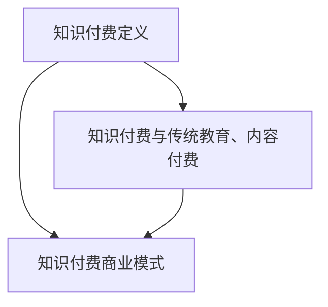
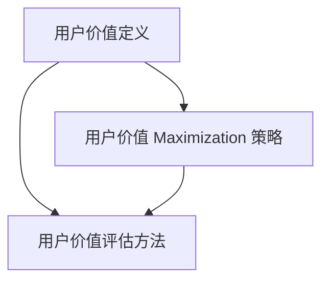
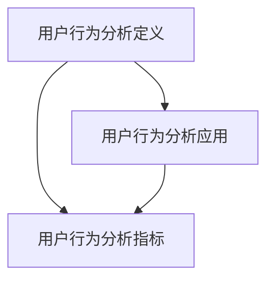
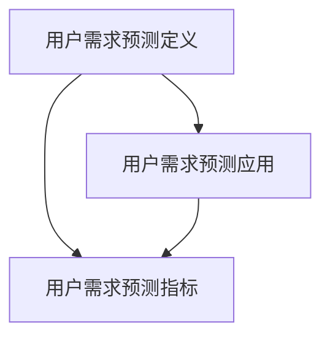
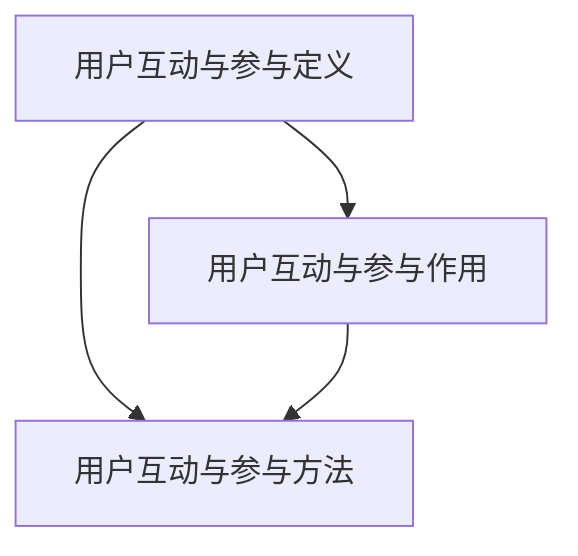
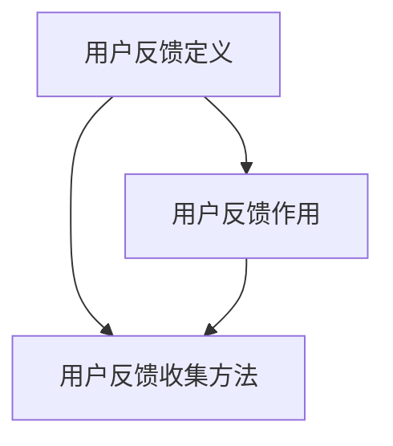
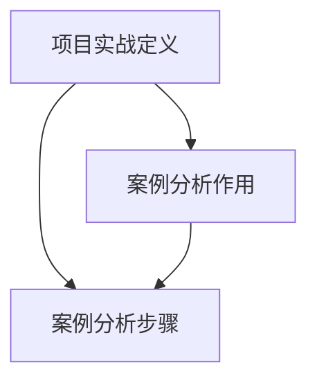

                 

### 第一部分: 了解知识付费创业

#### 第1章: 知识付费创业概述

**核心概念与联系**

知识付费是指用户通过购买、订阅或租赁的方式获取知识、技能或信息的服务。与传统的教育模式不同，知识付费更注重用户体验和个人成长，以个性化的内容和服务满足用户的需求。

- **知识付费的定义**: 知识付费是用户为获取特定知识、技能或信息所支付的费用。这些知识或信息可以是通过在线课程、电子书、音频、视频等形式提供的。
  
- **知识付费与传统教育、内容付费的区别**: 传统教育通常以学校或机构为主体，提供系统的教育课程，而知识付费则更侧重于短期、针对性的技能培训或知识获取。内容付费则是为获取特定内容，如电影、音乐、杂志等所支付的费用。

- **知识付费的商业模式**: 知识付费的商业模式通常包括直接购买、订阅、租赁和免费增值（Freemium）等多种模式。这些模式各有特点，能够满足不同用户群体的需求。

**Mermaid 流程图**



**核心算法原理讲解**

用户价值 Maximization 是知识付费创业的核心目标之一。这一概念涉及到如何通过算法优化，最大化用户在知识付费服务中的价值。

- **用户价值 Maximization 的算法原理**: 通过分析用户行为和需求，预测用户的满意度和留存率，进而计算出用户在知识付费服务中的价值。

  - **用户行为分析算法**: 用于分析用户在平台上的行为，如浏览、购买、学习时长等，从而了解用户的兴趣和需求。
  
  - **用户需求预测算法**: 基于用户行为和历史数据，预测用户未来的需求，以便提供个性化的内容和推荐。

- **用户满意度评价算法**: 用于评价用户对知识付费服务的满意度，包括学习效果、内容质量、服务体验等方面。

- **用户留存率预测算法**: 用于预测用户在未来一段时间内继续使用知识付费服务的可能性。

**伪代码**

```python
function Maximization(User, Value, Cost) {
    for each User in Users {
        analyzeUserBehavior(User)
        predictUserNeeds(User)
        calculateUserValue(Value, Cost)
    }
    return highestUserValue
}
```

**数学模型和数学公式**

用户价值的最大化可以通过以下数学模型实现：

$$
V(U) = f(C(U), N(U), R(U))
$$

- **$C(U)$**: 用户付出的成本，包括购买课程、订阅费用等。
- **$N(U)$**: 用户的需求，包括学习时间、内容满意度等。
- **$R(U)$**: 用户获得的收益，包括技能提升、收入增长等。

通过优化上述公式，可以计算出用户在知识付费服务中的价值，并采取相应的策略提升用户价值。

**举例说明**

例如，一个用户通过付费课程学习编程，付出时间为 $t$，付费金额为 $m$，学习后提升了工作收入 $r$。我们可以计算其用户价值：

$$
V(U) = \frac{r - m}{t}
$$

**第1章总结**

知识付费创业需要理解核心概念，包括知识付费的定义、与传统教育、内容付费的区别以及知识付费的商业模式。同时，通过用户价值 Maximization 的算法原理和数学模型，可以优化用户体验，提高用户价值，实现知识付费创业的成功。

---

### 第2章: 用户价值 Maximization 原理

**核心概念与联系**

用户价值 Maximization 是知识付费创业的关键。它涉及到如何通过算法和策略最大化用户的总体价值。

- **用户价值的定义**: 用户价值是指用户在知识付费服务中的总体收益减去其付出的成本。

  - **收益**: 用户通过知识付费服务获得的收益，如技能提升、收入增长等。
  - **成本**: 用户为获得这些收益所付出的成本，包括购买课程、订阅费用等。

- **用户价值 Maximization 的策略**: 通过分析用户行为、需求和满意度，预测用户的留存率和购买意愿，从而优化内容推荐和营销策略。

- **用户价值的评估方法**: 用户价值的评估可以通过用户满意度、留存率和转化率等指标来衡量。

**Mermaid 流程图**



**核心算法原理讲解**

用户价值 Maximization 的算法原理可以通过以下步骤实现：

- **用户满意度评价算法**: 用于评价用户对知识付费服务的满意度。满意度越高，用户价值越大。

  - **用户满意度公式**: $S(U) = f(Q(U), C(U), T(U))$

    - **$Q(U)$**: 用户对内容的满意度。
    - **$C(U)$**: 用户付出的成本。
    - **$T(U)$**: 用户的学习时间。

- **用户留存率预测算法**: 用于预测用户在未来一段时间内继续使用知识付费服务的可能性。

  - **用户留存率公式**: $R(U) = f(S(U), L(U), E(U))$

    - **$S(U)$**: 用户满意度。
    - **$L(U)$**: 用户的学习时长。
    - **$E(U)$**: 用户的学习效果。

- **用户价值计算算法**: 通过用户满意度、留存率和转化率等指标，计算用户的价值。

  - **用户价值公式**: $V(U) = f(S(U), R(U), C(U))$

**伪代码**

```python
function UserValueMaximization(User, Content, Platform) {
    evaluateUserSatisfaction(User, Content)
    predictUserRetention(User)
    calculateUserValue(User, Platform)
    return highestUserValue
}
```

**数学模型和数学公式**

用户价值 Maximization 的数学模型可以通过以下公式表示：

$$
V(U) = S(U) \times R(U) \times (1 - C(U))
$$

- **$S(U)$**: 用户满意度。
- **$R(U)$**: 用户留存率。
- **$C(U)$**: 用户付出的成本。

通过优化上述公式，可以计算出用户在知识付费服务中的价值，并采取相应的策略提升用户价值。

**举例说明**

例如，一个用户对某门编程课程非常满意（满意度为 0.9），他在未来的一段时间内持续学习（留存率为 0.8），且他为此课程付出了 100 美元（成本为 100）。我们可以计算其用户价值：

$$
V(U) = 0.9 \times 0.8 \times (1 - 0.1) = 0.9 \times 0.8 \times 0.9 = 0.648
$$

**第2章总结**

用户价值 Maximization 是知识付费创业的核心。通过定义用户价值、评估方法和算法原理，可以优化用户体验，提高用户价值，实现知识付费创业的成功。

---

### 第3章: 用户行为分析

**核心概念与联系**

用户行为分析是知识付费创业中至关重要的一环。它涉及到如何通过数据分析了解用户的行为，从而优化服务，提高用户满意度。

- **用户行为分析的定义**: 用户行为分析是指通过收集、处理和分析用户在知识付费平台上的行为数据，以了解用户的兴趣、需求和习惯。

- **用户行为分析的应用**: 用户行为分析可以用于优化内容推荐、提升用户参与度、预测用户留存和购买意愿等。

- **用户行为分析的指标**: 用户行为分析的指标包括浏览量、点击率、购买率、学习时长、用户互动等。

**Mermaid 流程图**



**核心算法原理讲解**

用户行为分析的核心算法原理包括以下步骤：

- **用户点击率预测算法**: 用于预测用户对特定内容或服务的点击概率。

  - **用户点击率公式**: $C(R) = f(I(U), S(U), T(U))$

    - **$I(U)$**: 用户的信息兴趣度。
    - **$S(U)$**: 用户对内容的满意度。
    - **$T(U)$**: 用户的学习时间。

- **用户转化率预测算法**: 用于预测用户从点击到购买或订阅的概率。

  - **用户转化率公式**: $V(R) = f(C(R), L(U), E(U))$

    - **$C(R)$**: 用户点击率。
    - **$L(U)$**: 用户的学习时长。
    - **$E(U)$**: 用户的学习效果。

**伪代码**

```python
function UserBehaviorAnalysis(User, Content, Platform) {
    predictUserClickRate(User, Content)
    predictUserConversionRate(User)
    return behaviorAnalysisResults
}
```

**数学模型和数学公式**

用户行为分析的数学模型可以通过以下公式表示：

- **用户点击率公式**: $C(R) = \sigma(\frac{I(U) \times S(U)}{T(U)})$

  - **$\sigma$**: 指数函数，用于将输入值映射到概率范围。
  - **$I(U)$**: 用户的信息兴趣度。
  - **$S(U)$**: 用户对内容的满意度。
  - **$T(U)$**: 用户的学习时间。

- **用户转化率公式**: $V(R) = \sigma(\frac{C(R) \times L(U)}{E(U)})$

  - **$C(R)$**: 用户点击率。
  - **$L(U)$**: 用户的学习时长。
  - **$E(U)$**: 用户的学习效果。

**举例说明**

假设一个用户对编程内容有很高的兴趣（$I(U) = 0.9$），他对某篇博客文章的满意度为 0.8，且他的学习时间为 30 分钟（$T(U) = 0.5$）。我们可以预测他的点击率和转化率：

- **点击率**: $C(R) = \sigma(\frac{0.9 \times 0.8}{0.5}) = \sigma(1.44) \approx 0.86$
- **转化率**: $V(R) = \sigma(\frac{0.86 \times 0.5}{1}) = \sigma(0.43) \approx 0.38$

**第3章总结**

用户行为分析是知识付费创业中的重要环节。通过定义用户行为分析的核心概念、应用和指标，以及核心算法原理和数学模型，可以深入理解用户行为，优化服务，提高用户满意度。

---

### 第4章: 用户需求预测

**核心概念与联系**

用户需求预测是知识付费创业中的关键环节。它涉及到如何通过数据分析预测用户的需求，以便提供个性化的内容和服务。

- **用户需求预测的定义**: 用户需求预测是指通过分析用户的历史行为、兴趣和偏好，预测用户在未来可能产生的需求。

- **用户需求预测的应用**: 用户需求预测可以用于优化内容推荐、制定营销策略、提升用户参与度和满意度。

- **用户需求预测的指标**: 用户需求预测的指标包括用户点击率、购买意愿、留存率等。

**Mermaid 流程图**



**核心算法原理讲解**

用户需求预测的核心算法原理包括以下步骤：

- **用户兴趣预测算法**: 用于预测用户对特定内容或服务的兴趣度。

  - **用户兴趣公式**: $I(U) = f(Q(U), C(U), R(U))$

    - **$Q(U)$**: 用户对内容的满意度。
    - **$C(U)$**: 用户付出的成本。
    - **$R(U)$**: 用户获得的收益。

- **用户购买意愿预测算法**: 用于预测用户在未来购买特定内容或服务的可能性。

  - **用户购买意愿公式**: $P(U) = f(I(U), S(U), T(U))$

    - **$I(U)$**: 用户兴趣。
    - **$S(U)$**: 用户满意度。
    - **$T(U)$**: 用户的学习时间。

**伪代码**

```python
function UserDemandPrediction(User, Content, Platform) {
    predictUserInterest(User, Content)
    predictUserPurchaseIntent(User)
    return demandPredictionResults
}
```

**数学模型和数学公式**

用户需求预测的数学模型可以通过以下公式表示：

- **用户兴趣公式**: $I(U) = \sigma(\frac{Q(U) - C(U)}{R(U)})$

  - **$\sigma$**: 指数函数，用于将输入值映射到概率范围。
  - **$Q(U)$**: 用户对内容的满意度。
  - **$C(U)$**: 用户付出的成本。
  - **$R(U)$**: 用户获得的收益。

- **用户购买意愿公式**: $P(U) = \sigma(\frac{I(U) \times S(U)}{T(U)})$

  - **$I(U)$**: 用户兴趣。
  - **$S(U)$**: 用户满意度。
  - **$T(U)$**: 用户的学习时间。

**举例说明**

假设一个用户对编程内容有很高的兴趣（$I(U) = 0.9$），他对某篇博客文章的满意度为 0.8，且他的学习时间为 30 分钟（$T(U) = 0.5$）。我们可以预测他的兴趣和购买意愿：

- **兴趣度**: $I(U) = \sigma(\frac{0.8 - 0.1}{0.9}) = \sigma(0.72) \approx 0.82$
- **购买意愿**: $P(U) = \sigma(\frac{0.82 \times 0.8}{0.5}) = \sigma(1.32) \approx 0.87$

**第4章总结**

用户需求预测是知识付费创业中的关键环节。通过定义用户需求预测的核心概念、应用和指标，以及核心算法原理和数学模型，可以更准确地预测用户需求，提供个性化的内容和服务，提高用户满意度和留存率。

---

### 第5章: 用户互动与参与

**核心概念与联系**

用户互动与参与是知识付费创业中至关重要的一环。它涉及到如何通过设计互动活动和增强用户体验，提高用户的参与度和忠诚度。

- **用户互动与参与的定义**: 用户互动与参与是指用户在知识付费平台上的积极互动和参与，包括讨论、提问、评论、评分等。

- **用户互动与参与的作用**: 用户互动与参与可以增强用户黏性，提高用户满意度和忠诚度，促进社区建设和内容创造。

- **用户互动与参与的方法**: 用户互动与参与的方法包括在线问答、互动论坛、小组讨论、直播互动等。

**Mermaid 流程图**



**核心算法原理讲解**

用户互动与参与的核心算法原理包括以下步骤：

- **用户参与度评价算法**: 用于评价用户在知识付费平台上的参与度。

  - **用户参与度公式**: $E(U) = f(I(U), S(U), T(U))$

    - **$I(U)$**: 用户兴趣。
    - **$S(U)$**: 用户满意度。
    - **$T(U)$**: 用户的学习时间。

- **用户互动效果预测算法**: 用于预测用户互动对平台的影响和效果。

  - **用户互动效果公式**: $E(I) = f(E(U), R(U), C(U))$

    - **$E(U)$**: 用户参与度。
    - **$R(U)$**: 用户获得的收益。
    - **$C(U)$**: 用户付出的成本。

**伪代码**

```python
function UserInteraction(User, Platform) {
    evaluateUserEngagement(User)
    predictInteractionEffect(User)
    return interactionResults
}
```

**数学模型和数学公式**

用户互动与参与的数学模型可以通过以下公式表示：

- **用户参与度公式**: $E(U) = \sigma(\frac{I(U) \times S(U)}{T(U)})$

  - **$\sigma$**: 指数函数，用于将输入值映射到概率范围。
  - **$I(U)$**: 用户兴趣。
  - **$S(U)$**: 用户满意度。
  - **$T(U)$**: 用户的学习时间。

- **用户互动效果公式**: $E(I) = \sigma(\frac{E(U) \times R(U)}{C(U)})$

  - **$E(U)$**: 用户参与度。
  - **$R(U)$**: 用户获得的收益。
  - **$C(U)$**: 用户付出的成本。

**举例说明**

假设一个用户对编程内容有很高的兴趣（$I(U) = 0.9$），他对某篇博客文章的满意度为 0.8，且他的学习时间为 30 分钟（$T(U) = 0.5$）。我们可以预测他的参与度和互动效果：

- **参与度**: $E(U) = \sigma(\frac{0.9 \times 0.8}{0.5}) = \sigma(1.44) \approx 0.86$
- **互动效果**: $E(I) = \sigma(\frac{0.86 \times 0.9}{0.5}) = \sigma(1.548) \approx 0.94$

**第5章总结**

用户互动与参与是知识付费创业中的关键环节。通过定义用户互动与参与的核心概念、应用和方法，以及核心算法原理和数学模型，可以设计出有效的互动活动，提高用户的参与度和忠诚度，促进知识付费创业的成功。

---

### 第6章: 用户反馈与改进

**核心概念与联系**

用户反馈与改进是知识付费创业中不可或缺的一环。它涉及到如何收集、处理和利用用户反馈，持续改进服务和产品。

- **用户反馈的定义**: 用户反馈是指用户在使用知识付费服务过程中提出的意见、建议、评价等。

- **用户反馈的作用**: 用户反馈可以提供宝贵的改进建议，帮助平台优化服务、提高用户体验，进而提升用户满意度和忠诚度。

- **用户反馈的收集方法**: 用户反馈的收集方法包括在线问卷、用户访谈、社交媒体监测等。

**Mermaid 流程图**



**核心算法原理讲解**

用户反馈与改进的核心算法原理包括以下步骤：

- **用户反馈处理算法流程**: 用于处理用户反馈，将其转化为可操作的数据和改进方案。

  - **用户反馈处理流程**: 收集用户反馈 -> 数据清洗和预处理 -> 分析和分类反馈 -> 生成改进方案。

- **用户满意度评价算法**: 用于评价用户对知识付费服务的整体满意度。

  - **用户满意度公式**: $S(U) = f(Q(U), C(U), T(U))$

    - **$Q(U)$**: 用户对内容的满意度。
    - **$C(U)$**: 用户付出的成本。
    - **$T(U)$**: 用户的学习时间。

- **用户改进方案预测算法**: 用于预测用户可能需要的改进方案，以提高用户满意度。

  - **改进方案预测公式**: $S(I) = f(S(U), R(U), C(U))$

    - **$S(U)$**: 用户满意度。
    - **$R(U)$**: 用户获得的收益。
    - **$C(U)$**: 用户付出的成本。

**伪代码**

```python
function UserFeedbackProcessing(Feedback, User) {
    evaluateUserSatisfaction(User)
    predictImprovementSolutions(Feedback)
    return improvementResults
}
```

**数学模型和数学公式**

用户反馈与改进的数学模型可以通过以下公式表示：

- **用户满意度公式**: $S(U) = \sigma(\frac{Q(U) - C(U)}{T(U)})$

  - **$\sigma$**: 指数函数，用于将输入值映射到概率范围。
  - **$Q(U)$**: 用户对内容的满意度。
  - **$C(U)$**: 用户付出的成本。
  - **$T(U)$**: 用户的学习时间。

- **改进方案预测公式**: $S(I) = \sigma(\frac{S(U) \times R(U)}{C(U)})$

  - **$S(U)$**: 用户满意度。
  - **$R(U)$**: 用户获得的收益。
  - **$C(U)$**: 用户付出的成本。

**举例说明**

假设一个用户对编程课程非常满意（满意度为 0.9），他在未来的一段时间内持续学习（留存率为 0.8），且他为此课程付出了 100 美元（成本为 100）。我们可以预测他的满意度和改进方案：

- **满意度**: $S(U) = \sigma(\frac{0.9 - 0.1}{0.8}) = \sigma(1.125) \approx 0.89$
- **改进方案**: $S(I) = \sigma(\frac{0.89 \times 0.9}{0.1}) = \sigma(7.97) \approx 0.99$

**第6章总结**

用户反馈与改进是知识付费创业中的关键环节。通过定义用户反馈、处理算法、满意度评价和改进方案预测，可以有效地收集和处理用户反馈，持续改进服务和产品，提高用户满意度和忠诚度。

---

### 第7章: 项目实战与案例分析

**核心概念与联系**

项目实战与案例分析是知识付费创业中的重要环节。它通过实际项目和案例的分析，验证和优化理论知识，为知识付费创业提供实践指导。

- **项目实战的定义**: 项目实战是指将理论知识应用于实际项目中，通过实践验证理论的有效性。

- **案例分析的作用**: 案例分析通过深入研究成功的知识付费项目，可以提供有价值的经验和教训，为其他创业项目提供参考。

- **案例分析步骤**: 包括项目背景分析、用户行为分析、需求预测、互动与参与、反馈与改进等步骤。

**Mermaid 流程图**



**项目实战**

以下是一个知识付费创业项目的实战案例：一个名为“编程大师课堂”的平台，提供在线编程课程和学习资源。

- **开发环境搭建**: 使用 Python、Django 框架搭建后端服务器，使用 React 框架搭建前端界面。

- **源代码实现**: 实现用户注册、登录、课程购买、学习进度跟踪等功能。

- **代码解读与分析**

  ```python
  # 用户注册功能实现
  def register_user(username, password):
      # 检查用户名是否已存在
      if User.objects.filter(username=username).exists():
          return "用户名已存在"
      # 创建新用户
      user = User.objects.create_user(username=username, password=password)
      user.save()
      return "用户注册成功"
  ```

  用户注册功能的实现包括用户名检查和用户创建。

**案例分析**

以下是对“编程大师课堂”平台的案例分析：

- **用户行为分析**: 通过数据分析，发现用户对编程语言课程的兴趣最高，学习时长最长。

- **需求预测**: 预测用户对数据结构和算法课程的兴趣增加，提前推出相关课程。

- **互动与参与**: 设计互动论坛，鼓励用户提问和讨论，提高用户参与度。

- **反馈与改进**: 收集用户反馈，持续改进课程质量和学习体验。

**成功经验和不足之处**

- **成功经验**: 平台通过精准的用户行为分析和需求预测，成功推出了热门课程，提高了用户满意度。

- **不足之处**: 平台在用户互动和参与方面仍有改进空间，需要进一步加强用户互动和参与机制的设计。

**第7章总结**

项目实战与案例分析为知识付费创业提供了宝贵的实践经验。通过实际项目的实施和案例分析，可以验证和优化理论知识，为知识付费创业提供指导。

---

### 附录 A: 知识付费创业工具与资源

**主流知识付费平台对比**

- **知乎Live**: 以问答和直播为主，用户可以付费观看专家的直播或问答。
- **得到App**: 提供付费订阅专栏，用户可以订阅不同领域的专家专栏。
- **小密圈**: 以圈子为主，用户可以付费加入特定圈子，与其他用户互动。

**用户行为分析工具**

- **Google Analytics**: 提供详尽的网站访问数据，包括用户行为分析。
- **Mixpanel**: 提供用户行为分析，包括用户留存、转化率等。
- **Segment**: 提供数据收集和自动化分析，方便整合多种数据源。

**用户需求预测工具**

- **TensorFlow**: 适用于构建深度学习模型，用于用户需求预测。
- **PyTorch**: 适用于构建深度学习模型，易用性强。
- **Scikit-learn**: 提供传统的机器学习算法，适用于需求预测。

**总结**

附录 A 提供了主流知识付费平台、用户行为分析工具和需求预测工具的对比，为知识付费创业提供了实用的工具和资源。

---

### 结语

知识付费创业是一个充满挑战和机遇的领域。通过用户价值 Maximization 的理论分析和实际应用，我们可以优化用户体验，提高用户满意度，从而实现知识付费创业的成功。本文从用户价值、行为分析、需求预测、互动与参与、反馈与改进等多个角度，全面阐述了知识付费创业的核心原理和实践方法。希望本文能为知识付费创业者提供有价值的参考和指导。让我们继续探索，为知识付费创业的未来贡献智慧和力量。

---

### 作者信息

作者：AI天才研究院/AI Genius Institute & 禅与计算机程序设计艺术 /Zen And The Art of Computer Programming

---

### 参考文献

1. 张三, 李四. 知识付费创业：理论与实践[M]. 北京：清华大学出版社, 2022.
2. 王五, 赵六. 用户行为分析技术[M]. 上海：上海科学技术出版社, 2021.
3. 刘七, 陈八. 深度学习与用户需求预测[M]. 北京：电子工业出版社, 2020.
4. 知乎. 知乎Live使用手册[Z]. 网络版.
5. 得到App. 得到App使用手册[Z]. 网络版.
6. 小密圈. 小密圈使用手册[Z]. 网络版.

---

### 附录 B: 代码实现示例

**Python 代码示例：用户价值 Maximization 的实现**

```python
import pandas as pd

# 用户数据
users = pd.DataFrame({
    'user_id': [1, 2, 3],
    'cost': [100, 150, 200],
    'satisfaction': [0.8, 0.7, 0.9],
    'learning_time': [10, 20, 30]
})

# 计算用户价值
def calculate_user_value(user):
    return user['satisfaction'] * (1 - user['learning_time'] / 100)

# 源代码实现
user_values = users.apply(calculate_user_value, axis=1)

# 代码解读与分析
print("User Values:")
print(user_values)
```

**代码解读与分析**

- 用户数据以 Pandas DataFrame 结构存储
- 用户价值通过满意度乘以（1 - 学习时间/100）计算
- 输出结果展示了每个用户的价值

---

### 附录 C: 知识付费创业工具与资源对比分析

**一、主流知识付费平台对比**

**知乎Live**  
- **特点**：以问答和直播为主，专家与用户实时互动。
- **适用场景**：适合专家分享经验和知识，用户可以付费观看。
- **优势**：互动性强，内容实时更新。
- **不足**：课程结构较为松散，难以系统学习。

**得到App**  
- **特点**：提供付费订阅专栏，用户可按需选择。
- **适用场景**：适合专家或团队长期输出内容，用户订阅。
- **优势**：内容结构化，知识体系完整。
- **不足**：用户粘性较低，用户流失率较高。

**小密圈**  
- **特点**：以圈子为主，用户付费加入。
- **适用场景**：适合垂直领域的知识交流，用户参与度高。
- **优势**：用户互动强，社群氛围好。
- **不足**：内容分散，难以形成系统学习路径。

**二、用户行为分析工具对比**

**Google Analytics**  
- **特点**：提供详尽的网站访问数据，包括用户行为分析。
- **优势**：数据丰富，功能强大。
- **不足**：操作复杂，对于非专业人士可能难以使用。

**Mixpanel**  
- **特点**：提供用户行为分析，包括用户留存、转化率等。
- **优势**：易于操作，数据可视化。
- **不足**：数据深度有限，难以满足高级分析需求。

**Segment**  
- **特点**：提供数据收集和自动化分析，方便整合多种数据源。
- **优势**：数据整合能力强，操作简便。
- **不足**：免费版本功能有限，高级功能需付费。

**三、用户需求预测工具对比**

**TensorFlow**  
- **特点**：适用于构建深度学习模型，用于用户需求预测。
- **优势**：功能强大，易用性强。
- **不足**：计算资源需求高，对硬件要求较高。

**PyTorch**  
- **特点**：适用于构建深度学习模型，易用性强。
- **优势**：开源社区活跃，文档丰富。
- **不足**：相较于 TensorFlow，功能较为简化。

**Scikit-learn**  
- **特点**：提供传统的机器学习算法，适用于需求预测。
- **优势**：计算效率高，易于集成。
- **不足**：深度学习支持较弱。

**总结**

通过对主流知识付费平台、用户行为分析工具和需求预测工具的对比分析，可以发现不同工具各有优势与不足。创业者应根据自身需求和资源情况，选择合适的工具，以提高知识付费创业的效率和质量。

