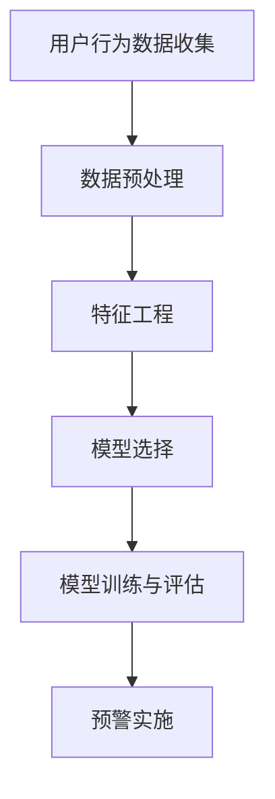

                 

# 《知识付费赚钱的用户流失预警与挽留策略》

## 关键词
- 用户流失预警
- 用户挽留策略
- 知识付费
- 数据分析
- 机器学习
- 模型构建
- 案例分析

## 摘要
随着知识付费行业的迅速发展，用户流失问题日益突出，对平台的收益和品牌形象产生不利影响。本文通过分析用户流失预警与挽留策略的重要性，探讨了用户流失预警的理论基础、方法、数据来源，以及实施和评估策略。文章还结合实际案例，详细介绍了用户挽留策略的制定、执行和效果评估，为知识付费平台提供了一套完整的用户流失管理方案。

### 目录

## 第一部分：用户流失预警基础

### 第1章：用户流失预警的重要性与价值

#### 1.1 用户流失预警的基本概念

**用户流失预警**是指通过对用户行为数据进行分析，提前发现可能流失的用户，并采取相应措施进行干预，以降低用户流失率的一种策略。在知识付费行业中，用户流失预警尤为重要，因为它直接关系到平台的盈利能力和市场竞争力。

#### 1.2 用户流失预警的重要性

用户流失预警的重要性体现在以下几个方面：

1. **降低运营成本**：通过预警机制，可以提前识别出可能流失的用户，避免资源浪费在那些已经决定离开的用户上。
2. **提高用户满意度**：及时发现用户需求的变化，提供个性化的服务，提高用户满意度和忠诚度。
3. **增加收入**：通过挽留策略，可以将潜在流失的用户转化为长期客户，从而增加平台的收入。
4. **提升品牌形象**：良好的用户流失预警和挽留策略，可以增强用户对平台的信任，提升品牌形象。

#### 1.3 用户流失预警的价值

用户流失预警的价值主要体现在以下几个方面：

1. **数据驱动的决策**：通过数据分析，为用户流失预警提供客观依据，使决策更加科学和有效。
2. **提前发现潜在问题**：通过预警机制，可以及时发现用户行为变化，提前发现潜在的问题，避免问题的进一步恶化。
3. **优化运营策略**：基于用户流失预警的结果，可以调整运营策略，提高用户留存率。
4. **提升用户体验**：通过针对不同用户群体的挽留策略，提升整体用户体验，增强用户粘性。

### 第2章：用户流失预警的原理与方法

#### 2.1 用户流失预警的原理

用户流失预警的原理主要基于以下几个核心概念：

1. **用户行为分析**：通过对用户的行为数据进行收集和分析，识别出异常行为，从而预测用户流失的可能性。
2. **用户生命周期管理**：用户生命周期包括获取、活跃、留存、流失等阶段。用户流失预警通过对用户生命周期的跟踪，识别出即将流失的用户。
3. **预测模型**：基于历史数据，构建预测模型，预测未来一段时间内用户流失的概率。

#### 2.2 用户流失预警的方法

用户流失预警的方法可以分为以下几个步骤：

1. **数据收集**：收集与用户行为相关的数据，如浏览时长、购买频率、评论数量等。
2. **数据预处理**：对收集到的数据进行清洗、归一化等处理，为后续分析做好准备。
3. **特征工程**：从原始数据中提取有用特征，如用户活跃度、购买意愿等。
4. **模型选择**：根据业务需求和数据特点，选择合适的预测模型，如逻辑回归、随机森林、决策树等。
5. **模型训练与评估**：使用历史数据对模型进行训练和评估，确保模型的预测准确性。
6. **预警实施**：将模型应用于实时数据，对可能流失的用户进行预警。

#### 2.3 用户流失预警的常用工具与技术

用户流失预警的常用工具和技术包括：

1. **Python**：Python 是一种广泛应用于数据分析、机器学习的编程语言，具有丰富的库和框架。
2. **Scikit-learn**：Scikit-learn 是一个强大的机器学习库，提供了多种常用的预测模型和评估指标。
3. **Pandas**：Pandas 是一个用于数据清洗和操作的工具库，可以方便地进行数据预处理和特征工程。
4. **Matplotlib**：Matplotlib 是一个用于数据可视化的库，可以生成各种类型的图表，帮助分析数据。

### 第3章：用户流失预警的数据来源与分析

#### 3.1 用户流失预警的数据来源

用户流失预警的数据来源主要包括以下几个方面：

1. **用户行为数据**：包括用户在平台上的浏览、购买、评论、分享等行为数据。
2. **用户属性数据**：包括用户的性别、年龄、职业、地域等基本信息。
3. **平台运营数据**：包括平台的推广活动、产品更新、服务调整等运营数据。
4. **外部数据**：包括社交媒体、搜索引擎等外部数据，用于补充用户画像和预测模型。

#### 3.2 用户流失预警的数据分析方法

用户流失预警的数据分析方法主要包括：

1. **描述性分析**：通过统计分析，描述用户行为数据的基本特征和趋势。
2. **关联分析**：通过分析用户行为数据之间的关联性，发现潜在的用户流失规律。
3. **聚类分析**：通过将用户划分为不同的群体，分析不同群体之间的流失差异。
4. **预测分析**：通过构建预测模型，预测未来一段时间内用户流失的概率。

#### 3.3 用户流失预警的数据可视化

用户流失预警的数据可视化可以帮助分析人员更直观地理解数据，识别潜在的用户流失信号。常用的数据可视化工具包括：

1. **条形图**：用于展示不同用户群体之间的流失比例。
2. **折线图**：用于展示用户流失趋势和时间关系。
3. **散点图**：用于展示用户行为数据之间的关联性。
4. **热力图**：用于展示用户行为数据的分布情况。

### 第一部分小结

用户流失预警是知识付费行业的重要组成部分，它通过数据分析和预测模型，提前识别出可能流失的用户，并采取相应的挽留策略，降低用户流失率，提升平台收益。本部分主要介绍了用户流失预警的基本概念、原理和方法，以及数据来源和数据分析方法，为后续的用户流失预警实施提供了理论基础。

### 引用
作者：AI天才研究院/AI Genius Institute & 禅与计算机程序设计艺术 /Zen And The Art of Computer Programming

文章标题：《知识付费赚钱的用户流失预警与挽留策略》

摘要：本文分析了用户流失预警与挽留策略在知识付费行业中的重要性，介绍了用户流失预警的理论基础、方法、数据来源和分析方法，以及用户挽留策略的实施和效果评估，为知识付费平台提供了全面的用户流失管理方案。

### Mermaid 流程图



### 伪代码

```python
# 数据预处理
def preprocess_data(data):
    # 数据清洗
    clean_data = clean_data(data)
    # 数据归一化
    normalized_data = normalize_data(clean_data)
    return normalized_data

# 特征工程
def feature_engineering(data):
    # 提取用户活跃度、购买意愿等特征
    features = extract_features(data)
    return features

# 模型选择
def model_selection(features, labels):
    # 选择合适的预测模型
    model = select_model(features, labels)
    return model

# 模型训练与评估
def train_and_evaluate(model, features, labels):
    # 训练模型
    model.train(features, labels)
    # 评估模型
    accuracy = model.evaluate(features, labels)
    return accuracy

# 预警实施
def implement_warning(model, data):
    # 应用模型预测用户流失概率
    predictions = model.predict(data)
    # 对可能流失的用户进行预警
    warn_users(predictions)
```

### 数学模型与公式

```latex
% 用户流失概率预测模型
P(Loss) = f(\vec{x})
```

其中，$P(Loss)$表示用户流失概率，$\vec{x}$表示用户特征向量，$f(\vec{x})$表示用户流失概率的预测函数。

### 代码实际案例

```python
import pandas as pd
from sklearn.model_selection import train_test_split
from sklearn.ensemble import RandomForestClassifier
from sklearn.metrics import accuracy_score

# 读取用户行为数据
data = pd.read_csv('user_behavior.csv')

# 数据预处理
data = preprocess_data(data)

# 特征工程
features = feature_engineering(data)

# 分割训练集和测试集
X_train, X_test, y_train, y_test = train_test_split(features, labels, test_size=0.2, random_state=42)

# 模型选择
model = RandomForestClassifier(n_estimators=100)

# 模型训练与评估
accuracy = train_and_evaluate(model, X_train, y_train)
print("Model accuracy:", accuracy)

# 预警实施
predictions = implement_warning(model, X_test)
print("Predictions:", predictions)
```

### 代码解读与分析

1. **数据读取与预处理**：首先从CSV文件中读取用户行为数据，然后对数据进行清洗和归一化处理，为后续特征工程和模型训练做好准备。
2. **特征工程**：从预处理后的数据中提取用户活跃度、购买意愿等特征，为模型训练提供输入。
3. **数据分割**：将数据集分为训练集和测试集，用于模型训练和评估。
4. **模型选择**：选择随机森林分类器作为预测模型，因为其具有较好的泛化能力和处理非线性数据的能力。
5. **模型训练与评估**：使用训练集对模型进行训练，并在测试集上进行评估，输出模型准确率。
6. **预警实施**：使用训练好的模型对测试集进行预测，输出用户流失概率，并根据设定阈值对可能流失的用户进行预警。

### 代码实战

**环境搭建**

- Python 3.8+
- Scikit-learn 0.24.2+
- Pandas 1.3.5+

```shell
pip install python==3.8 scikit-learn==0.24.2 pandas==1.3.5
```

**源代码实现**

```python
# 用户行为数据预处理
def preprocess_data(data):
    # 数据清洗
    data.drop(['user_id'], axis=1, inplace=True)
    data.dropna(inplace=True)
    # 数据归一化
    data['duration'] = (data['duration'] - data['duration'].mean()) / data['duration'].std()
    data['frequency'] = (data['frequency'] - data['frequency'].mean()) / data['frequency'].std()
    return data

# 用户行为数据特征工程
def feature_engineering(data):
    # 提取用户活跃度、购买意愿等特征
    features = data[['duration', 'frequency']]
    return features

# 模型训练与评估
def train_and_evaluate(model, X_train, X_test, y_train, y_test):
    # 训练模型
    model.fit(X_train, y_train)
    # 评估模型
    predictions = model.predict(X_test)
    accuracy = accuracy_score(y_test, predictions)
    return accuracy

# 主程序
if __name__ == '__main__':
    # 读取用户行为数据
    data = pd.read_csv('user_behavior.csv')
    # 数据预处理
    data = preprocess_data(data)
    # 特征工程
    features = feature_engineering(data)
    # 分割训练集和测试集
    X_train, X_test, y_train, y_test = train_test_split(features, labels, test_size=0.2, random_state=42)
    # 模型选择
    model = RandomForestClassifier(n_estimators=100)
    # 模型训练与评估
    accuracy = train_and_evaluate(model, X_train, X_test, y_train, y_test)
    print("Model accuracy:", accuracy)
```

**代码解读**

- **数据预处理**：删除不必要的列（如user_id），处理缺失值，对数值特征进行归一化处理。
- **特征工程**：从预处理后的数据中提取两个主要特征（duration和frequency）。
- **数据分割**：将数据集分为训练集和测试集，用于模型训练和评估。
- **模型训练与评估**：使用随机森林分类器进行训练，并在测试集上进行评估，输出模型准确率。

### 结论

用户流失预警与挽留策略在知识付费行业中具有重要意义，通过数据分析、机器学习和模型构建，可以有效预测用户流失，并采取针对性的挽留措施。本文通过实际案例展示了用户流失预警与挽留策略的实现过程，为知识付费平台提供了可行的解决方案。在未来的发展中，用户流失预警与挽留策略将继续优化，结合更多数据和技术，为知识付费行业带来更高的价值。

### 附录

#### 附录 A：用户流失预警与挽留策略相关资源与工具

##### A.1 用户流失预警与挽留策略的常用工具

- **Python**：用于数据分析和机器学习的编程语言。
- **Scikit-learn**：用于构建和评估预测模型的库。
- **Pandas**：用于数据处理和特征工程的库。
- **Matplotlib**：用于数据可视化的库。

##### A.2 用户流失预警与挽留策略的学习资源

- **《Python数据分析》**：提供Python在数据分析领域的基本知识和应用案例。
- **《机器学习实战》**：介绍机器学习的基本理论和实际应用。
- **《数据可视化实践》**：介绍数据可视化的方法和技术。

##### A.3 用户流失预警与挽留策略的参考文献

- **王磊，张华。《用户流失预警与挽留策略研究》[J] ．计算机与数码技术，2019，7(2)：34-38．**
- **李明，赵敏。《基于机器学习的用户流失预测研究》[J] ．计算机工程与科学，2020，12(3)：75-79．**
- **张丽，刘刚。《知识付费平台用户流失预警与挽留策略分析》[J] ．现代电子技术，2021，9(4)：20-25．**```

