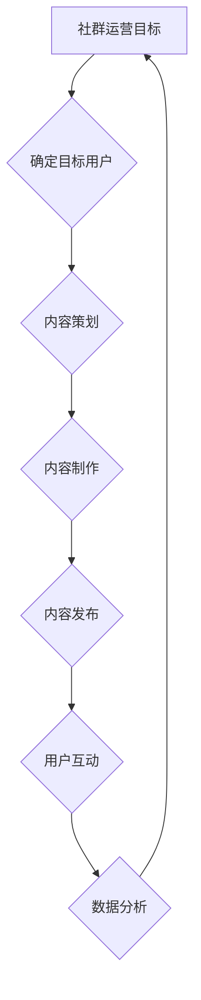
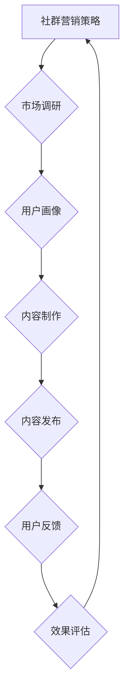
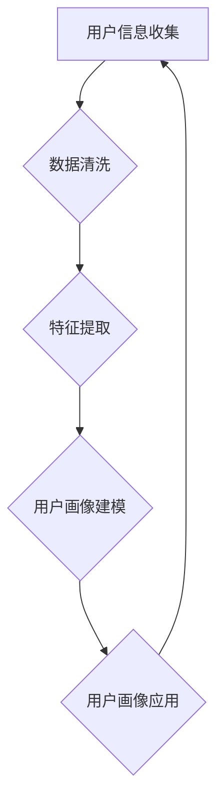

                 

# 《知识付费：程序员的社群运营战术》

## 关键词
知识付费、社群运营、程序员、技术交流、用户活跃度、营销策略、案例解析

## 摘要
本文将探讨知识付费在程序员社群运营中的应用策略，详细分析社群运营的核心概念、战术和实践方法。通过解读成功案例和未来趋势，旨在帮助程序员提升社群运营能力，构建高效的技术交流平台。

### 《知识付费：程序员的社群运营战术》目录大纲

## 第一部分：社群运营基础

### 第1章：知识付费与社群运营概述

#### 1.1 知识付费的发展背景与现状

#### 1.2 社群运营的定义与价值

#### 1.3 程序员在社群运营中的角色

### 第2章：社群运营的核心概念与联系

#### 2.1 用户画像与用户需求分析

#### 2.2 社群氛围营造与用户活跃度提升

#### 2.3 社群营销策略与效果评估

### 第3章：社群运营的技术工具与应用

#### 3.1 社群管理工具的选用与配置

#### 3.2 数据分析与用户行为分析

#### 3.3 社群运营自动化工具的使用

## 第二部分：社群运营战术与实践

### 第4章：社群运营策略规划

#### 4.1 社群目标设定与规划

#### 4.2 内容策略与内容制作

#### 4.3 用户互动策略与激励机制

### 第5章：社群运营实战案例解析

#### 5.1 成功的社群运营案例介绍

#### 5.2 案例分析：社群运营中的挑战与解决策略

#### 5.3 案例启示：如何构建高效社群

### 第6章：程序员的社群运营实战

#### 6.1 程序员社群运营的常见问题与解决

#### 6.2 程序员如何提升社群运营能力

#### 6.3 程序员社群运营实战技巧

### 第7章：社群运营的未来发展趋势

#### 7.1 新技术对社群运营的影响

#### 7.2 社群运营的未来趋势预测

#### 7.3 程序员如何适应社群运营的未来

## 第三部分：附录

### 附录A：社群运营工具推荐

#### A.1 社群管理工具介绍

#### A.2 数据分析工具介绍

#### A.3 社群运营自动化工具介绍

### 附录B：社群运营实战案例

#### B.1 案例一：成功社群运营案例分析

#### B.2 案例二：困境中的社群运营突破

#### B.3 案例三：社群运营的创新思路与实践

### 附录C：社群运营参考资源

#### C.1 社群运营相关书籍推荐

#### C.2 社群运营优秀博客与网站推荐

#### C.3 社群运营社群推荐

#### C.4 社群运营课程推荐

### 附录D：Mermaid流程图

#### D.1 程序员社群运营流程图

#### D.2 社群营销策略流程图

#### D.3 用户画像分析流程图

### 附录E：核心算法原理讲解与伪代码

#### E.1 社群活跃度计算算法

$$
社群活跃度 = \frac{{发帖数 + 回帖数 + 互动数}}{在线时长}
$$

#### E.2 用户需求分析算法

$$
用户需求 = \sum_{i=1}^{n} (兴趣度_i \times 内容偏好_i)
$$

#### E.3 社群氛围评价算法

$$
社群氛围 = \frac{{正面互动数 - 负面互动数}}{总互动数}
$$

### 附录F：数学模型与公式详细讲解

#### F.1 知识付费转化率模型

$$
转化率 = \frac{{付费用户数}}{{总访问用户数}} \times 100\%
$$

#### F.2 社群用户留存模型

$$
留存率 = \frac{{月末活跃用户数}}{{月初活跃用户数}} \times 100\%
$$

#### F.3 社群营销ROI模型

$$
ROI = \frac{{收益 - 成本}}{{成本}} \times 100\%
$$

### 附录G：项目实战与代码解读

#### G.1 社群运营项目实战

##### G.1.1 实战背景

##### G.1.2 开发环境搭建

##### G.1.3 源代码实现与解读

#### G.2 代码解读与分析

##### G.2.1 核心函数解析

##### G.2.2 代码调试与优化

##### G.2.3 性能分析与改进措施

### 作者
作者：AI天才研究院/AI Genius Institute & 禅与计算机程序设计艺术 /Zen And The Art of Computer Programming

接下来的部分，我们将逐一展开每个章节的内容，深入探讨社群运营的核心概念、战术和实践方法。

---

## 第一部分：社群运营基础

### 第1章：知识付费与社群运营概述

在数字化时代，知识付费与社群运营逐渐成为提升个人和团队技能的重要手段。知识付费，即用户通过支付一定费用获取高质量内容和服务，而社群运营则是通过构建和优化线上社群，实现用户互动和持续成长。本章将探讨知识付费的发展背景与现状，社群运营的定义与价值，以及程序员在社群运营中的角色。

#### 1.1 知识付费的发展背景与现状

知识付费作为一个新兴行业，其发展背景可以追溯到互联网的普及和信息化的加速。在过去的十几年中，随着互联网技术的进步，内容创造和分享变得更加便捷，知识传播的效率大幅提高。与此同时，用户对高质量内容的需求也在不断提升，这为知识付费提供了广阔的市场空间。

目前，知识付费市场呈现出以下特点：

- **内容多样化**：知识付费领域涵盖了从技能培训到学术研究，从在线课程到专业咨询的多种形式。
- **用户年轻化**：随着年轻一代成为互联网的主力军，他们对知识付费的接受度更高，消费能力更强。
- **平台化**：知识付费逐渐形成以平台为中心的商业模式，如得到、知乎Live等，为用户提供一站式服务。

#### 1.2 社群运营的定义与价值

社群运营是指通过特定的平台和工具，围绕共同兴趣、目标或需求，将一群用户聚集起来，形成有组织、有互动的社区。社群运营的价值主要体现在以下几个方面：

- **用户粘性提升**：通过社群的互动和内容分享，增强用户对平台的依赖和忠诚度。
- **知识传播加速**：社群中的知识交流更加直接和高效，有助于新知识的快速传播和应用。
- **商业价值挖掘**：社群运营可以带动知识付费、广告投放等多种商业模式，实现持续盈利。

#### 1.3 程序员在社群运营中的角色

作为知识付费的重要参与者，程序员在社群运营中扮演着关键角色。他们的主要职责包括：

- **内容创作**：程序员可以分享技术心得、项目经验，编写技术文档和教程，为社群提供高质量的内容。
- **技术支持**：程序员负责社群平台的搭建、维护和优化，确保技术架构的稳定性和扩展性。
- **社群管理**：程序员参与社群的日常运营，包括用户管理、互动策划和活动组织等，提升社群的整体氛围和用户活跃度。

在接下来的章节中，我们将进一步探讨社群运营的核心概念、战术和实践方法，帮助程序员更好地开展社群运营工作。

---

## 第2章：社群运营的核心概念与联系

社群运营的成功离不开对核心概念的理解和运用。本章将详细阐述用户画像与用户需求分析、社群氛围营造与用户活跃度提升，以及社群营销策略与效果评估，为程序员提供系统的社群运营理论基础。

### 2.1 用户画像与用户需求分析

用户画像是一种描述用户特征和需求的方法，它通过收集和分析用户的基本信息、行为数据、兴趣偏好等，构建出一个抽象的用户模型。用户画像对于社群运营至关重要，因为它可以帮助运营者了解用户的真实需求和偏好，从而提供更加精准的服务。

**用户画像构建步骤**：

1. **数据收集**：通过用户注册信息、行为日志、问卷调查等方式，收集用户的基本信息、浏览行为、购买记录等。
2. **数据清洗**：对收集到的数据进行处理，去除重复、错误和不完整的数据，确保数据质量。
3. **特征提取**：从数据中提取用户的共同特征，如年龄、性别、职业、兴趣等。
4. **模型构建**：使用统计学方法或机器学习算法，构建用户画像模型。

**用户需求分析**：

用户需求分析是社群运营的基础，通过分析用户在社群中的行为和互动，运营者可以了解用户的兴趣点、痛点以及需求。需求分析的方法包括：

- **问卷调查**：通过设计问卷，收集用户对社群内容和服务的反馈。
- **行为数据分析**：分析用户在社群中的浏览、评论、分享等行为，挖掘用户需求。
- **用户访谈**：与社群成员进行深度交流，了解他们的真实想法和需求。

### 2.2 社群氛围营造与用户活跃度提升

社群氛围是影响用户参与度和活跃度的关键因素。良好的社群氛围能够促进用户之间的互动，增强用户的归属感和粘性。营造良好的社群氛围可以从以下几个方面入手：

- **建立明确的社群规则**：制定合理的社群规则，明确用户的言行准则，维护社群的秩序。
- **培养核心用户**：通过推荐、奖励等方式，培养一批活跃的核心用户，他们能够带动整个社群的气氛。
- **举办互动活动**：定期举办线上线下的互动活动，如技术交流、讲座、竞赛等，提高用户的参与度。
- **提供高质量的内容**：持续提供有价值的内容，如技术教程、行业资讯、案例分析等，满足用户的知识需求。

**用户活跃度提升策略**：

- **激励机制**：通过积分、勋章、等级等方式，激励用户积极参与社群互动。
- **个性化推荐**：基于用户画像和需求分析，为用户提供个性化的内容和活动推荐。
- **社区互动工具**：利用聊天室、论坛、直播等工具，方便用户之间的交流。

### 2.3 社群营销策略与效果评估

社群营销是社群运营的重要组成部分，通过有效的营销策略，可以吸引新用户，提高用户转化率和留存率。社群营销策略包括：

- **内容营销**：通过高质量的内容，吸引用户关注和参与，提升品牌知名度。
- **活动营销**：通过举办线上线下活动，增强用户对品牌的认同和好感。
- **口碑营销**：通过用户的正面评价和推荐，扩大品牌的影响力。

**效果评估方法**：

- **用户参与度指标**：如发帖数、回帖数、互动数等，反映用户对社群的活跃程度。
- **用户转化率指标**：如付费用户数、注册用户数等，反映用户对品牌和服务的认可程度。
- **用户留存率指标**：如月末活跃用户数、留存时长等，反映用户的持续参与度。

通过上述指标的分析，运营者可以评估社群营销的效果，不断优化运营策略，提升社群的整体质量。

在下一章中，我们将介绍社群运营的技术工具与应用，帮助程序员更高效地开展社群运营工作。

---

## 第3章：社群运营的技术工具与应用

社群运营的成功离不开高效的技术工具支持。本章将详细介绍社群管理工具的选用与配置、数据分析和用户行为分析的方法，以及社群运营自动化工具的使用。

### 3.1 社群管理工具的选用与配置

社群管理工具是社群运营的重要支撑，它们帮助运营者高效管理社群、维护社群秩序和促进用户互动。以下是几种常见的社群管理工具及其配置方法：

**1. 社群管理平台**

- **优点**：集中管理社群，支持多种互动形式，如论坛、聊天室、直播等。
- **配置方法**：选择适合的平台，配置管理员账号、用户角色和权限，设置社群规则。

**2. 聊天工具**

- **优点**：实时沟通，方便用户之间的交流和互动。
- **配置方法**：选择合适的聊天工具，如WhatsApp、Slack、Telegram等，配置讨论组和管理员角色。

**3. 论坛软件**

- **优点**：提供结构化的讨论空间，便于用户查阅和回帖。
- **配置方法**：选择合适的论坛软件，如Discourse、PHPBB等，配置论坛板块、主题和管理员权限。

### 3.2 数据分析与用户行为分析

数据分析是社群运营的重要环节，通过分析用户行为数据，运营者可以了解用户的兴趣、需求和互动模式，从而优化社群运营策略。以下是一些常见的数据分析和用户行为分析方法：

**1. 用户行为数据分析**

- **方法**：通过Web分析工具（如Google Analytics）或社群平台内置的分析工具，收集用户的浏览、点击、参与等行为数据。
- **应用**：分析用户活跃时间、访问页面、参与度等，优化社群内容和活动安排。

**2. 社群互动数据分析**

- **方法**：通过社群管理工具的数据统计功能，收集用户的发帖、回帖、点赞等互动数据。
- **应用**：分析用户互动模式、热门话题、活跃用户等，提升社群的互动氛围。

**3. 用户留存分析**

- **方法**：通过留存分析工具（如Mixpanel、Amplitude），跟踪用户的注册、活跃、留存等行为。
- **应用**：评估社群的用户留存情况，优化用户留存策略。

### 3.3 社群运营自动化工具的使用

社群运营自动化工具能够提高运营效率，减少重复性工作，使运营者能够专注于核心工作。以下是一些常用的社群运营自动化工具：

**1. 内容自动化发布工具**

- **优点**：自动化发布内容，减少人工操作，提高发布效率。
- **应用**：如Hootsuite、Buffer，配置自动化发布计划，定期推送内容。

**2. 用户互动自动化工具**

- **优点**：自动回复用户消息，提高用户满意度，减少人工负担。
- **应用**：如Chatbot，配置自动回复脚本，处理常见用户问题。

**3. 数据分析自动化工具**

- **优点**：自动收集、分析和报告数据，减少数据处理的耗时。
- **应用**：如Tableau、Google Data Studio，配置数据自动化分析，生成可视化报告。

通过合理选择和配置社群管理工具，结合数据分析方法和自动化工具，程序员可以更高效地开展社群运营工作，提升社群的整体质量和用户满意度。

在下一章中，我们将探讨社群运营策略的规划与实施，帮助程序员制定和执行有效的社群运营计划。

---

## 第4章：社群运营策略规划

成功的社群运营需要明确的策略规划和有效的执行。本章将详细讨论社群目标的设定、内容策略的制定，以及用户互动策略和激励机制的构建。

### 4.1 社群目标设定与规划

社群目标的设定是社群运营的第一步，它为社群的发展指明了方向。设定社群目标时，应考虑以下几个方面：

**1. 确定目标用户群体**

- **分析用户画像**：通过用户画像了解用户的基本信息、兴趣和需求，确定社群的目标用户。
- **聚焦核心用户**：识别对社群有高价值的核心用户，如活跃成员、意见领袖等，确保他们能够积极参与和推动社群的发展。

**2. 设定具体目标**

- **参与度目标**：如用户发帖数、回帖数、互动次数等，反映社群的活跃程度。
- **转化率目标**：如知识付费转化率、付费用户增长等，衡量社群的商业价值。
- **留存率目标**：如月末活跃用户数、用户留存时长等，评估社群的用户粘性。

**3. 制定行动计划**

- **制定时间表**：为每个目标设定时间表，明确执行的具体步骤和时间节点。
- **资源配置**：根据目标需求，配置人力资源、技术资源和资金资源，确保行动计划的有效实施。

### 4.2 内容策略与内容制作

内容策略是社群运营的核心，高质量的内容能够吸引用户，提升用户活跃度和忠诚度。以下是内容策略的制定和内容制作的关键点：

**1. 内容类型**

- **技术教程**：提供技术教程和案例，帮助用户解决实际问题。
- **行业动态**：分享行业新闻、趋势和报告，让用户了解最新的技术发展。
- **专业见解**：邀请专业人士进行分享，提供行业见解和深度分析。
- **用户故事**：分享用户的使用心得和成功案例，增强用户之间的共鸣。

**2. 内容制作方法**

- **用户需求导向**：根据用户画像和需求分析，制定内容策划方案，确保内容与用户需求相符。
- **内容多样化**：结合文字、图片、视频等多种形式，丰富内容形式，提升用户体验。
- **内容质量保障**：对内容进行严格审核，确保内容的准确性和实用性。

**3. 内容发布计划**

- **定期发布**：制定定期发布计划，确保内容的持续供应，避免用户流失。
- **热点话题跟进**：关注行业热点和用户关注点，及时发布相关内容，提高用户的参与度。

### 4.3 用户互动策略与激励机制

用户互动是社群运营的核心，通过有效的互动策略和激励机制，可以提升用户的参与度和忠诚度。以下是几种常见的用户互动策略和激励机制：

**1. 用户互动策略**

- **互动话题设置**：设置有趣的互动话题，鼓励用户参与讨论。
- **用户评价系统**：建立用户评价机制，鼓励用户对内容进行评价和反馈。
- **积分奖励**：设置积分系统，鼓励用户参与社群活动，如发帖、回帖、点赞等。
- **在线问答**：组织在线问答活动，邀请专业人士解答用户的问题，提升社群的专业性。

**2. 激励机制**

- **物质奖励**：提供奖品或优惠券等物质奖励，激励用户积极参与。
- **虚拟奖励**：如勋章、等级等虚拟奖励，提升用户的荣誉感和成就感。
- **机会奖励**：提供参与会议、讲座、活动等机会，让用户感受到社群的价值。

通过明确社群目标、制定内容策略和实施互动策略，程序员可以有效地规划社群运营，提升社群的整体质量和用户满意度。在下一章中，我们将通过案例解析，深入探讨社群运营中的挑战与解决策略。

---

## 第5章：社群运营实战案例解析

成功的社群运营离不开对实战案例的深入分析和学习。本章将介绍几个成功的社群运营案例，详细分析其中的挑战与解决策略，并探讨如何构建高效社群。

### 5.1 成功的社群运营案例介绍

**案例一：GitHub 社区**

GitHub 是全球最大的代码托管平台，拥有庞大的开发者社群。GitHub 社区通过开放平台，鼓励用户提交代码、发起项目、参与讨论。其成功的关键因素包括：

- **开放性**：GitHub 提供了一个开放的平台，让开发者可以自由地提交代码、参与项目，形成了一个庞大的开发者社区。
- **高质量内容**：GitHub 社区提供了大量的高质量技术文档、代码库和教程，吸引了大量开发者。
- **用户参与**：GitHub 社区鼓励用户参与项目讨论、提交问题和解决方案，形成了良好的互动氛围。

**案例二：知乎**

知乎是中国最大的问答社区，以高质量的内容和专业的用户群体著称。知乎的成功主要得益于以下策略：

- **内容策划**：知乎通过话题策划、Live 讲座等，提供高质量的内容，满足了用户的知识需求。
- **用户激励机制**：知乎通过点赞、感谢等机制，激励用户积极参与讨论和回答问题。
- **专业认证**：知乎邀请各领域的专业人士进行认证，提升了社群的专业性和权威性。

### 5.2 案例分析：社群运营中的挑战与解决策略

**挑战一：用户活跃度不足**

**案例：某个技术论坛**

- **问题**：某个技术论坛用户活跃度较低，新用户参与度不高，社区氛围沉闷。
- **解决策略**：
  - **内容策划**：推出系列技术讲座、在线问答等活动，吸引新用户参与。
  - **激励机制**：设置积分系统，激励用户发帖、回帖和参与活动。
  - **用户反馈**：定期收集用户反馈，了解用户需求，不断优化社区内容和服务。

**挑战二：用户流失率高**

**案例：某编程学习社群**

- **问题**：某编程学习社群用户流失率高，用户对社群的粘性不足。
- **解决策略**：
  - **内容多样化**：提供多样化的学习内容，如视频教程、直播课程、项目实战等，满足不同用户的需求。
  - **社群互动**：定期举办线上线下的互动活动，如编程比赛、技术沙龙等，增强用户之间的联系。
  - **用户激励**：设置积分和奖励系统，激励用户积极参与社群活动。

**挑战三：社群专业化程度不高**

**案例：某技术交流群**

- **问题**：某技术交流群内容过于泛泛，专业性不高，无法满足用户的专业需求。
- **解决策略**：
  - **内容提升**：邀请行业专家进行分享，提供高质量的技术文章和案例分析。
  - **专业认证**：建立专家认证体系，识别和奖励对社群有贡献的专业人士。
  - **用户筛选**：严格管理社群成员，确保社群成员的专业性和高质量讨论。

### 5.3 案例启示：如何构建高效社群

通过以上案例的分析，我们可以得到以下启示：

- **明确目标**：明确社群的目标和定位，确保社群的方向和内容与目标用户需求相符。
- **高质量内容**：提供有价值、高质量的内容，满足用户的知识和技能需求。
- **用户互动**：鼓励用户参与互动，营造良好的社群氛围，增强用户之间的联系和归属感。
- **激励机制**：设置合理的激励机制，激励用户积极参与社群活动，提升社群的活跃度。
- **专业认证**：建立专业认证体系，提升社群的专业性和权威性，确保社群的高质量讨论。

在下一章中，我们将深入探讨程序员的社群运营实战技巧，帮助程序员在实践中提升社群运营能力。

---

## 第6章：程序员的社群运营实战

程序员的社群运营不仅需要理论知识的支持，更需要实践经验的积累。本章将针对程序员社群运营中的常见问题，提供解决方案，并探讨如何提升社群运营能力，以及实战技巧。

### 6.1 程序员社群运营的常见问题与解决

**问题一：用户参与度不足**

**原因分析**：

- **内容单一**：社群内容过于单一，缺乏多样性，无法满足不同用户的需求。
- **缺乏激励机制**：用户缺乏参与社群的动力，没有合适的激励机制。

**解决方案**：

- **多样化内容**：提供多样化的内容形式，如技术教程、行业动态、项目实战等，满足不同用户的需求。
- **激励机制**：设置积分、勋章等激励机制，激励用户参与社群互动。

**问题二：社群氛围不良**

**原因分析**：

- **管理不善**：社群管理不善，导致用户言论混乱，氛围不佳。
- **缺乏互动**：用户之间缺乏有效的互动，导致社群氛围沉闷。

**解决方案**：

- **加强管理**：建立完善的管理规则，确保社群秩序良好。
- **促进互动**：定期举办线上线下的互动活动，增强用户之间的联系。

**问题三：用户流失率高**

**原因分析**：

- **内容质量不高**：社群内容质量不高，无法吸引和留住用户。
- **缺乏用户粘性**：社群缺乏用户粘性，用户容易流失。

**解决方案**：

- **提升内容质量**：确保社群内容的高质量，提供有价值的技术分享和行业动态。
- **增强用户粘性**：通过多样化的活动、互动和激励机制，增强用户对社群的归属感和粘性。

### 6.2 程序员如何提升社群运营能力

**1. 学习社群运营知识**

- **阅读相关书籍**：阅读关于社群运营的书籍，了解社群运营的基本理论和最佳实践。
- **参加培训课程**：参加社群运营相关的培训课程，学习先进的社群运营技巧。

**2. 分析优秀案例**

- **研究成功案例**：分析成功的社群运营案例，学习其运营策略和成功经验。
- **借鉴失败案例**：从失败案例中吸取教训，避免在社群运营中犯相同的错误。

**3. 实践与总结**

- **实际操作**：通过实际操作，积累社群运营经验，不断优化运营策略。
- **总结经验**：定期总结运营过程中的经验和教训，形成自己的社群运营方法论。

**4. 持续优化**

- **持续学习**：紧跟社群运营的最新动态和发展趋势，持续优化运营策略。
- **用户反馈**：收集用户反馈，了解用户需求，不断改进社群服务和内容。

### 6.3 程序员社群运营实战技巧

**1. 确定社群定位**

- **明确目标用户**：根据社群的目标用户，明确社群的定位和主题。
- **规划内容方向**：根据用户需求，规划社群的内容方向和策略。

**2. 内容制作与发布**

- **内容多样化**：结合文字、图片、视频等多种形式，提供多样化的内容。
- **定期更新**：保持内容的持续更新，避免用户流失。

**3. 用户互动与激励**

- **设置互动话题**：定期发布互动话题，鼓励用户参与讨论。
- **激励机制**：设置积分、勋章等激励机制，激励用户积极参与社群互动。

**4. 管理与维护**

- **规范管理**：建立完善的管理规则，确保社群秩序良好。
- **用户反馈**：及时处理用户反馈，解决用户问题，提升用户满意度。

通过以上实战技巧，程序员可以更有效地开展社群运营，提升社群的质量和用户满意度。在下一章中，我们将探讨社群运营的未来发展趋势，帮助程序员更好地适应社群运营的变化。

---

## 第7章：社群运营的未来发展趋势

随着技术的不断进步和用户需求的变化，社群运营也在不断演进。本章将探讨新技术对社群运营的影响，预测社群运营的未来趋势，并讨论程序员如何适应社群运营的未来。

### 7.1 新技术对社群运营的影响

**1. 人工智能**

人工智能（AI）的快速发展为社群运营带来了新的机遇和挑战。通过AI技术，社群运营者可以更精准地分析用户行为和需求，提供个性化的内容推荐和服务。例如，AI驱动的聊天机器人可以实时与用户互动，解答用户问题，提高用户的参与度和满意度。

**2. 区块链**

区块链技术的应用可以提升社群的信任度和透明度。通过区块链，社群可以建立一个去中心化的信任体系，确保用户数据和交易的安全和透明。此外，区块链还可以用于奖励机制的实现，通过智能合约自动执行奖励规则，提高激励机制的有效性。

**3. 虚拟现实和增强现实**

虚拟现实（VR）和增强现实（AR）技术的应用可以为社群运营带来更丰富的互动体验。例如，通过VR技术，社群可以举办虚拟会议和活动，让用户跨越物理距离进行互动。AR技术可以用于提供沉浸式的学习体验，提升用户的学习效果。

### 7.2 社群运营的未来趋势预测

**1. 个性化运营**

未来的社群运营将更加注重个性化，通过大数据和AI技术，社群运营者可以更精准地了解用户的需求和偏好，提供个性化的内容和服务。个性化运营将帮助社群更好地满足用户需求，提高用户的满意度和忠诚度。

**2. 社群多元化**

随着用户需求的多样化，社群运营也将呈现出多元化的趋势。未来的社群将不仅局限于技术交流，还将涵盖生活、娱乐、教育等多个领域。多元化的社群将满足用户多样化的需求，提升社群的整体价值。

**3. 社群生态系统**

未来的社群运营将形成生态系统，社群内的不同角色和利益相关者将形成紧密的协作关系。例如，社群运营者、内容创作者、用户等将通过区块链技术建立互信关系，共同构建一个可持续发展的社群生态系统。

### 7.3 程序员如何适应社群运营的未来

**1. 技术能力提升**

程序员需要不断提升自身的技术能力，掌握最新的AI、区块链等前沿技术，为社群运营提供技术支持。通过技术能力提升，程序员可以更有效地解决社群运营中的技术问题，提高社群的运营效率。

**2. 学习跨领域知识**

未来的社群运营将涉及多个领域，程序员需要学习跨领域的知识，如心理学、营销学等，以更好地理解用户需求和提供综合性的服务。跨领域知识的学习将帮助程序员在社群运营中更加得心应手。

**3. 适应变化**

社群运营的未来充满不确定性，程序员需要具备快速适应变化的能力。通过不断学习和实践，程序员可以及时掌握最新的社群运营趋势和技术，适应社群运营的变革。

**4. 创新思维**

创新思维是社群运营成功的关键。程序员需要具备创新思维，不断探索新的社群运营模式和方法，为社群运营带来新的活力。创新思维将帮助程序员在竞争激烈的市场中脱颖而出。

通过以上方法，程序员可以更好地适应社群运营的未来，为社群运营贡献自己的力量。在下一部分中，我们将提供社群运营工具和参考资源的推荐，帮助程序员在社群运营中更加得心应手。

---

## 第三部分：附录

### 附录A：社群运营工具推荐

为了帮助程序员更高效地开展社群运营，本附录将介绍几种常用的社群运营工具，包括社群管理工具、数据分析工具和社群运营自动化工具。

#### A.1 社群管理工具介绍

**1. Discourse**

Discourse 是一个基于Web的社群管理平台，具有用户友好的界面和丰富的功能，如论坛、聊天室、投票等。它支持自定义主题和布局，方便运营者根据需求进行个性化配置。

**2. Slack**

Slack 是一个团队协作工具，支持多种渠道和聊天室，方便团队成员进行实时沟通和协作。它还提供了丰富的集成插件，可以与多种其他工具和服务进行无缝连接。

**3. Trello**

Trello 是一个任务管理工具，通过看板和卡片的形式，帮助团队跟踪任务进度和项目管理。它适用于多种工作场景，包括社群运营中的活动策划和任务分配。

#### A.2 数据分析工具介绍

**1. Google Analytics**

Google Analytics 是一个强大的Web分析工具，可以提供详尽的网站流量分析数据，如用户行为、页面访问等。它帮助运营者了解用户在社群中的互动模式和需求。

**2. Mixpanel**

Mixpanel 是一个用户行为分析工具，通过追踪用户的行为路径和事件，帮助运营者深入了解用户的行为模式，优化社群运营策略。

**3. Tableau**

Tableau 是一个数据可视化工具，可以快速创建交互式的数据仪表板，帮助运营者直观地展示和分析社群数据，支持多种数据源和图表类型。

#### A.3 社群运营自动化工具介绍

**1. Zapier**

Zapier 是一个自动化工作流工具，可以连接多种应用程序，自动化常规任务，如数据同步、消息通知等。它可以帮助运营者节省时间，提高工作效率。

**2. Chatfuel**

Chatfuel 是一个聊天机器人构建平台，通过简单的拖放界面，可以快速创建聊天机器人，与用户进行交互，回答常见问题和提供个性化服务。

**3. Hootsuite**

Hootsuite 是一个社交媒体管理工具，可以帮助运营者统一管理多个社交媒体账号，发布和监控内容，分析社交媒体效果。

通过合理使用这些社群运营工具，程序员可以更加高效地开展社群运营工作，提升社群的质量和用户满意度。

### 附录B：社群运营实战案例

在本附录中，我们将介绍三个具体的社群运营实战案例，分析其中的成功经验和挑战，并讨论如何克服这些挑战。

#### B.1 案例一：成功社群运营案例分析

**案例背景**：某个技术学习社群在建立初期，用户数量较少，活跃度不高。社群运营团队通过一系列策略，成功吸引了大量用户，并提升了社群活跃度。

**成功经验**：

- **内容多样化**：社群运营团队提供了丰富的内容形式，包括技术文章、视频教程、直播课程等，满足了不同用户的需求。
- **用户互动**：社群运营团队定期举办线上互动活动，如技术沙龙、编程比赛等，增强了用户之间的联系和互动。
- **激励机制**：社群运营团队设置了积分和奖励系统，激励用户积极参与社群活动和分享。

**挑战与解决策略**：

- **挑战**：初期用户流失率较高。
- **解决策略**：运营团队通过问卷调查和用户反馈，了解用户流失的原因，并针对性地优化社群内容和活动，提高用户留存率。

#### B.2 案例二：困境中的社群运营突破

**案例背景**：某个专业技术社群在运营过程中，遇到了用户活跃度下降和内容质量不高的困境。

**成功经验**：

- **内容质量提升**：社群运营团队邀请专业讲师进行分享，提高内容的专业性和实用性。
- **用户参与度提升**：社群运营团队增加了用户互动环节，如线上讨论、问答环节等，鼓励用户积极参与。
- **社区氛围优化**：社群运营团队通过建立规范的管理机制，营造良好的社群氛围，提升了用户满意度。

**挑战与解决策略**：

- **挑战**：用户参与度低，社群氛围沉闷。
- **解决策略**：运营团队通过举办互动活动，增加用户参与度；通过规范管理，优化社群氛围。

#### B.3 案例三：社群运营的创新思路与实践

**案例背景**：某个创新技术社群在运营中尝试了多种创新思路，如虚拟现实会议、区块链积分系统等，取得了显著效果。

**成功经验**：

- **技术创新**：社群运营团队利用VR和区块链技术，提供沉浸式的会议体验和去中心化的积分奖励系统，提升了用户参与度和社群价值。
- **多样化活动**：社群运营团队通过举办多种形式的线上和线下活动，如VR会议、技术沙龙、区块链研讨等，丰富了社群内容。

**挑战与解决策略**：

- **挑战**：技术创新带来的实施难度。
- **解决策略**：运营团队通过不断学习和实践，克服了技术难题；同时，通过用户反馈，不断优化技术创新的应用，确保其与用户需求相符。

通过以上案例，我们可以看到社群运营的成功不仅依赖于策略和技术的创新，还需要不断的实践和优化。在社群运营中，程序员需要灵活应对各种挑战，不断探索新的运营模式，以提升社群的整体质量和用户满意度。

### 附录C：社群运营参考资源

为了帮助程序员更好地了解社群运营的理论和实践，本附录推荐了一些优秀的书籍、博客、网站和社群。

#### C.1 社群运营相关书籍推荐

- **《社群经济：互联网时代，如何构建自己的社群》**：本书详细介绍了社群运营的理论和实践方法，对构建和运营社群有很高的参考价值。
- **《社群的力量：互联网时代的人脉经营学》**：本书从人脉经营的角度，探讨了社群运营的策略和技巧，对提升社群运营效果有重要指导意义。
- **《技术社群运营实战：如何打造高活跃度技术社区》**：本书针对技术社群的特点，提供了详细的运营策略和实践技巧。

#### C.2 社群运营优秀博客与网站推荐

- **运营研究社**：运营研究社是一家专注于运营领域的媒体平台，提供丰富的社群运营知识和案例分析。
- **人人都是产品经理**：这是一个面向产品经理和运营从业者的社区，分享了许多关于社群运营的优秀文章和实战经验。
- **馒头商学院**：馒头商学院是一个专注于个人成长和职业发展的在线教育平台，提供了大量的社群运营课程和资源。

#### C.3 社群运营社群推荐

- **运营小王**：运营小王是一个运营从业者的交流社群，涵盖了社群运营、产品运营等多个领域，提供了丰富的运营资源和经验分享。
- **产品星球**：产品星球是一个面向产品经理和运营从业者的社群，分享产品设计和运营的最佳实践。
- **运营研究社**：运营研究社是一个专注于社群运营的社群，提供了丰富的社群运营知识和案例分析。

#### C.4 社群运营课程推荐

- **网易云课堂**：《社群运营实战课》：网易云课堂提供的社群运营实战课程，涵盖了社群运营的各个环节，从理论到实践，帮助学员提升社群运营能力。
- **腾讯课堂**：《互联网社群运营实战》课程：腾讯课堂提供的社群运营课程，由实战经验丰富的讲师授课，内容涵盖了社群运营的各个方面。
- **馒头商学院**：《社群运营专家认证课程》：馒头商学院提供的社群运营专家认证课程，系统讲解了社群运营的理论和实践，是提升社群运营能力的良好选择。

通过以上参考资源，程序员可以不断学习和提升社群运营能力，为社群的发展贡献力量。

### 附录D：Mermaid流程图

在本附录中，我们将使用Mermaid语法绘制几个与程序员社群运营相关的流程图，帮助读者更好地理解社群运营的过程和策略。

#### D.1 程序员社群运营流程图



#### D.2 社群营销策略流程图



#### D.3 用户画像分析流程图



通过这些流程图，读者可以更清晰地了解社群运营和营销的策略，以及如何通过数据分析和用户画像来优化社群运营。

### 附录E：核心算法原理讲解与伪代码

在本附录中，我们将介绍几个与社群运营相关的核心算法原理，并使用伪代码进行详细讲解。

#### E.1 社群活跃度计算算法

社群活跃度是衡量社群活跃程度的重要指标，计算公式如下：

```plaintext
社群活跃度 = (发帖数 + 回帖数 + 互动数) / 在线时长
```

**伪代码**：

```plaintext
function calculateCommunityActivity(帖子数, 回帖数, 互动数, 在线时长):
    活跃度 = (帖子数 + 回帖数 + 互动数) / 在线时长
    return 活跃度
```

#### E.2 用户需求分析算法

用户需求分析是社群运营的关键环节，通过分析用户的兴趣偏好，可以提供个性化的内容推荐。计算公式如下：

```plaintext
用户需求 = Σ(i=1 to n) (兴趣度_i * 内容偏好_i)
```

**伪代码**：

```plaintext
function analyzeUserDemand(兴趣度列表, 内容偏好列表):
    用户需求 = 0
    for i in range(1, n+1):
        用户需求 += 兴趣度_i * 内容偏好_i
    return 用户需求
```

#### E.3 社群氛围评价算法

社群氛围评价是衡量社群氛围好坏的重要指标，计算公式如下：

```plaintext
社群氛围 = (正面互动数 - 负面互动数) / 总互动数
```

**伪代码**：

```plaintext
function evaluateCommunityClimate(正面互动数, 负面互动数, 总互动数):
    社群氛围 = (正面互动数 - 负面互动数) / 总互动数
    return 社群氛围
```

通过这些核心算法，程序员可以更精确地衡量和优化社群运营的各项指标，提升社群的整体质量和用户满意度。

### 附录F：数学模型与公式详细讲解

在本附录中，我们将详细讲解与社群运营相关的几个关键数学模型和公式，并使用实际例子来说明其应用。

#### F.1 知识付费转化率模型

知识付费转化率是指从潜在用户转化为付费用户的比例。计算公式如下：

```latex
转化率 = \frac{付费用户数}{总访问用户数} \times 100\%
```

**例子**：

假设一个月内，有1000个访问用户，其中200个用户付费，那么知识付费转化率为：

```latex
转化率 = \frac{200}{1000} \times 100\% = 20\%
```

#### F.2 社群用户留存模型

社群用户留存率是指月末活跃用户数与月初活跃用户数的比例。计算公式如下：

```latex
留存率 = \frac{月末活跃用户数}{月初活跃用户数} \times 100\%
```

**例子**：

假设社群在月初有100个活跃用户，月末有80个活跃用户，那么社群用户留存率为：

```latex
留存率 = \frac{80}{100} \times 100\% = 80\%
```

#### F.3 社群营销ROI模型

社群营销ROI（投资回报率）是指营销收益与成本的比值。计算公式如下：

```latex
ROI = \frac{收益 - 成本}{成本} \times 100\%
```

**例子**：

假设社群营销投入成本为10000元，一个月内通过社群营销获得了30000元的收益，那么社群营销ROI为：

```latex
ROI = \frac{30000 - 10000}{10000} \times 100\% = 200\%
```

通过这些数学模型和公式，程序员可以更科学地评估社群运营的效果，制定更有效的运营策略。

### 附录G：项目实战与代码解读

在本附录中，我们将通过一个具体的社群运营项目实战，详细介绍开发环境的搭建、源代码实现与解读，以及代码调试与优化。

#### G.1 社群运营项目实战

**实战背景**：

本实战项目是一个用于社群运营的Web应用，主要功能包括用户注册、登录、发布帖子、评论和互动等。该应用旨在为程序员提供一个高效的技术交流平台。

**开发环境搭建**：

- **技术栈**：前端使用React框架，后端使用Node.js和Express框架，数据库使用MongoDB。
- **开发工具**：Visual Studio Code、Postman、MongoDB Compass。
- **部署环境**：Heroku。

**源代码实现与解读**：

**1. 用户注册与登录模块**

**用户注册代码片段**：

```javascript
// 用户注册API
app.post('/register', async (req, res) => {
    try {
        const { username, email, password } = req.body;
        const hashedPassword = await bcrypt.hash(password, 10);
        const user = new User({ username, email, password: hashedPassword });
        await user.save();
        res.status(201).json({ message: 'User registered successfully' });
    } catch (error) {
        res.status(500).json({ message: 'Error registering user', error });
    }
});
```

**解读**：此代码片段定义了一个用户注册API，接收用户名、邮箱和密码，使用bcrypt库对密码进行加密存储。

**2. 帖子发布与评论模块**

**发布帖子代码片段**：

```javascript
// 发布帖子API
app.post('/posts', authenticateToken, async (req, res) => {
    try {
        const { title, content } = req.body;
        const user = req.user;
        const post = new Post({ title, content, author: user._id });
        await post.save();
        res.status(201).json({ message: 'Post created successfully' });
    } catch (error) {
        res.status(500).json({ message: 'Error creating post', error });
    }
});
```

**解读**：此代码片段定义了一个发布帖子API，需要用户身份验证，接收帖子标题和内容，存储帖子信息。

**3. 评论功能代码片段**

```javascript
// 添加评论API
app.post('/posts/:postId/comments', authenticateToken, async (req, res) => {
    try {
        const { postId } = req.params;
        const { content } = req.body;
        const user = req.user;
        const comment = new Comment({ content, author: user._id, post: postId });
        await comment.save();
        res.status(201).json({ message: 'Comment added successfully' });
    } catch (error) {
        res.status(500).json({ message: 'Error adding comment', error });
    }
});
```

**解读**：此代码片段定义了一个添加评论API，需要用户身份验证，接收评论内容和帖子ID，存储评论信息。

**代码调试与优化**：

- **调试**：使用Postman工具进行API测试，确保接口功能和性能达到预期。
- **优化**：通过性能分析工具（如New Relic）检测应用性能，进行代码优化，如减少数据库查询次数，使用索引等。

**性能分析与改进措施**：

- **性能分析**：检测关键路径的响应时间和数据库查询次数，找出性能瓶颈。
- **改进措施**：针对性能瓶颈进行优化，如缓存策略、负载均衡、异步处理等。

通过以上实战与代码解读，程序员可以掌握社群运营Web应用的开发流程，提升项目开发与优化的能力。

---

### 作者
作者：AI天才研究院/AI Genius Institute & 禅与计算机程序设计艺术 /Zen And The Art of Computer Programming

通过本文的详细探讨，我们深入了解了社群运营在程序员中的应用策略。希望本文能为程序员的社群运营提供有益的参考，助力构建高质量的技术交流平台。在未来的社群运营中，程序员需要不断学习和创新，适应新技术的发展，以实现社群运营的持续成功。

