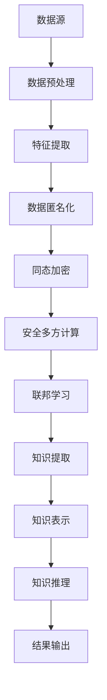

                 

### 《知识发现引擎的隐私保护技术》

> **关键词：**
> - 知识发现引擎
> - 隐私保护
> - 数据匿名化
> - 同态加密
> - 安全多方计算
> - 联邦学习

> **摘要：**
> 本文旨在探讨知识发现引擎中的隐私保护技术，深入分析数据匿名化、同态加密、安全多方计算和联邦学习等核心技术的原理和应用。通过具体的案例和实践，本文揭示了如何在实际项目中实施这些隐私保护技术，确保数据隐私的同时，仍然能够有效进行知识发现。读者对象包括对隐私保护技术有兴趣的程序员、数据科学家和技术经理。

#### 前言

**本书的目的与结构**

在当今数据驱动的时代，知识发现引擎已经成为企业获取竞争优势的重要工具。然而，随着数据的日益增长和隐私问题的日益突出，如何在保护用户隐私的同时，充分利用数据的价值，成为了一个亟待解决的问题。本书旨在为读者提供关于知识发现引擎隐私保护技术的全面指南，帮助他们在数据科学和人工智能项目中实现隐私保护。

本书的结构如下：

- **第1章**：介绍知识发现引擎的基本概念和隐私保护的重要性。
- **第2章**：探讨隐私保护技术的基础知识。
- **第3章**：深入分析数据匿名化技术。
- **第4章**：讲解同态加密与计算。
- **第5章**：介绍安全多方计算。
- **第6章**：探讨联邦学习与隐私保护。
- **第7章**：通过案例展示隐私保护技术的应用。
- **第8章**：展望隐私保护技术的未来发展趋势。

**隐私保护的重要性**

随着大数据和人工智能技术的快速发展，数据隐私问题变得日益严峻。隐私泄露不仅可能导致用户信任受损，还可能带来严重的法律和商业风险。因此，在知识发现引擎中实施有效的隐私保护技术至关重要。这不仅有助于保护用户隐私，还能提高企业数据使用的透明度和合规性。

**读者对象**

本书适合对隐私保护技术有兴趣的程序员、数据科学家和技术经理阅读。无论您是希望提升自身技术水平的从业者，还是对隐私保护技术有深入研究的学者，本书都将为您提供丰富的知识和实践经验。

### 第1章：知识发现引擎概述

#### 知识发现引擎的基本概念

知识发现引擎是一种利用数据挖掘技术，从大量数据中自动发现有价值知识的系统。它结合了统计学、机器学习、数据挖掘等多个领域的技术，通过对数据进行预处理、特征提取、知识提取和知识表示等步骤，实现知识的自动获取和利用。

知识发现引擎的核心目标是帮助企业和组织从海量数据中提取出具有商业价值或决策支持意义的信息。它广泛应用于金融市场分析、医疗诊断、市场营销、风险控制等多个领域。

#### 知识发现引擎的工作原理

知识发现引擎的工作流程通常包括以下几个步骤：

1. **数据预处理**：对原始数据进行清洗、整合和规范化，以提高数据质量和一致性。
2. **特征提取**：从预处理后的数据中提取出对知识发现任务有用的特征，例如数值特征、文本特征、图像特征等。
3. **知识提取**：利用数据挖掘算法，从特征数据中挖掘出潜在的、有价值的知识，如关联规则、聚类结果、分类模型等。
4. **知识表示**：将提取出的知识以易于理解和利用的方式表示出来，例如可视化图表、报告、模型等。
5. **知识推理**：利用表示后的知识，进行进一步的推理和分析，为决策提供支持。

#### 隐私保护在知识发现引擎中的重要性

在知识发现引擎中，数据通常是高度敏感的，包括个人身份信息、财务数据、医疗记录等。这些数据一旦泄露，可能导致用户隐私泄露、数据滥用、甚至法律风险。因此，在知识发现过程中，实施有效的隐私保护技术至关重要。

隐私保护的重要性体现在以下几个方面：

1. **用户信任**：隐私保护能够增强用户对企业和组织的信任，促进数据共享和合作。
2. **法律合规**：许多国家和地区都有严格的数据保护法律和规定，实施隐私保护有助于确保合规性。
3. **商业价值**：保护用户隐私有助于维护企业的声誉，提高用户忠诚度，从而带来长期的商业价值。

### 第2章：隐私保护技术基础

#### 隐私保护的基本原则

隐私保护技术遵循以下基本原则：

1. **数据最小化**：仅收集和存储实现特定目的所需的数据，避免过度收集。
2. **匿名化**：通过技术手段，将个人身份信息从数据中移除或伪装，以保护隐私。
3. **访问控制**：限制对敏感数据的访问权限，确保只有授权人员才能访问。
4. **加密**：使用加密算法，对敏感数据进行加密处理，防止未经授权的访问。
5. **审计与监控**：对数据使用过程进行审计和监控，及时发现和处理隐私泄露事件。

#### 隐私保护的技术手段

隐私保护技术主要包括以下几种：

1. **数据匿名化**：通过技术手段，将个人身份信息从数据中移除或伪装，以保护隐私。常见的方法包括数据混淆、数据加密、数据掩码等。
2. **同态加密与计算**：一种在加密数据上进行计算的方法，确保计算结果的正确性，同时保持数据的隐私性。
3. **安全多方计算**：一种允许多个参与者在不泄露各自数据的情况下，共同计算所需结果的技术。
4. **联邦学习**：一种在分布式数据上进行机器学习的方法，通过聚合模型参数，实现模型训练，同时保护数据隐私。

#### 隐私保护技术的分类

隐私保护技术可以根据其应用场景和实现方式，分为以下几类：

1. **数据匿名化技术**：如K-anonymity、L-diversity、R-privacy等。
2. **加密技术**：如同态加密、RSA加密、AES加密等。
3. **安全多方计算技术**：如安全多方计算、混淆电路、秘密分享等。
4. **联邦学习技术**：如联邦平均算法、联邦图模型、联邦迁移学习等。

### 第3章：数据匿名化技术

#### 数据匿名化的概念

数据匿名化是一种隐私保护技术，通过将个人身份信息从数据中移除或伪装，以保护隐私。匿名化后的数据无法直接识别个人身份，但仍然保留了数据中的知识。

数据匿名化主要有两种方式：完全匿名化和部分匿名化。完全匿名化将个人身份信息彻底移除，使数据无法与任何个人关联。部分匿名化则通过伪装或混淆个人身份信息，降低数据与个人身份之间的关联性。

#### 数据匿名化的方法

数据匿名化技术主要包括以下几种：

1. **K-anonymity**：每个记录至少与K-1个其他记录在属性集合上有相同值。例如，在医疗数据中，如果每个患者的疾病症状组合都是唯一的，那么这些数据就不满足K-anonymity。

2. **L-diversity**：每个记录至少与K个不同的记录在属性集合上有相同值。L-diversity强调属性值的多样性，以降低隐私风险。

3. **R-privacy**：记录的真实属性值与匿名化后的属性值之间的差异不超过R。R-privacy通过限制属性值的变动范围，确保匿名化数据与真实数据之间的差异最小。

#### 数据匿名化的挑战与解决方案

数据匿名化面临着以下挑战：

1. **知识损失**：匿名化过程中可能会丢失部分数据中的知识，影响知识发现的效果。
2. **隐私风险**：某些匿名化技术可能仍然存在隐私泄露的风险，尤其是在攻击者拥有足够信息和计算资源的情况下。

为解决这些挑战，可以采用以下解决方案：

1. **多层匿名化**：结合多种匿名化技术，提高数据的隐私保护水平。
2. **自适应匿名化**：根据数据集的特点和隐私需求，动态调整匿名化策略。
3. **隐私增强技术**：结合加密、安全多方计算等技术，进一步提升数据的隐私保护能力。

### 第4章：同态加密与计算

#### 同态加密的基本原理

同态加密是一种在加密数据上进行计算的方法，确保计算结果的正确性，同时保持数据的隐私性。同态加密允许用户在不解密数据的情况下，对数据进行加、减、乘、除等数学运算。

同态加密的主要特点是计算与加密解密分离。数据在加密状态下进行计算，计算结果在解密后才能被用户理解和利用。同态加密分为全同态加密和部分同态加密。全同态加密支持任意类型的数据运算，而部分同态加密仅支持特定类型的数据运算。

#### 同态加密的应用场景

同态加密在以下场景中具有广泛应用：

1. **医疗领域**：对敏感的医疗数据进行计算和分析，如基因分析、疾病预测等。
2. **金融领域**：对敏感的金融数据进行计算和风控，如交易分析、欺诈检测等。
3. **智能交通**：对交通数据进行计算和分析，如交通流量预测、事故预警等。

#### 同态加密的计算模型

同态加密的计算模型主要包括以下部分：

1. **加密算法**：将明文数据转换为密文数据，同时保留数据中的信息。
2. **加密操作**：对密文数据执行加密运算，确保运算结果在解密后与明文运算结果一致。
3. **解密算法**：将加密运算的结果转换为明文数据，供用户理解和利用。

#### 同态加密的算法与实现

同态加密的算法主要包括以下几种：

1. **PAKE**（Password-based Authenticated Key Exchange）：基于密码的认证密钥交换协议，支持同态加密和认证功能。
2. **HE**（Homomorphic Encryption）：同态加密算法，支持对密文数据进行加、减、乘等运算。
3. **RSA**（Rivest-Shamir-Adleman）：一种非对称加密算法，支持对大整数的加密和解密。
4. **AES**（Advanced Encryption Standard）：一种对称加密算法，广泛应用于数据加密。

同态加密的实现主要包括以下步骤：

1. **密钥生成**：生成加密和解密所需的密钥对。
2. **加密操作**：将明文数据转换为密文数据，并执行加密运算。
3. **解密操作**：将加密运算的结果转换为明文数据，并执行解密运算。
4. **计算操作**：在加密状态下，对密文数据执行所需的计算操作。

#### 同态加密的优点与局限性

同态加密的优点包括：

1. **数据隐私性**：在加密数据上进行计算，确保数据隐私。
2. **安全性**：采用加密算法，防止数据被窃取或篡改。
3. **灵活性**：支持多种数据类型和计算操作。

同态加密的局限性包括：

1. **计算效率**：同态加密的计算复杂度较高，可能导致计算速度较慢。
2. **存储空间**：加密后的数据占用的存储空间较大，可能影响存储和传输效率。
3. **实现难度**：同态加密的实现较为复杂，需要深入了解加密算法和计算模型。

### 第5章：安全多方计算

#### 安全多方计算的基本概念

安全多方计算（Secure Multi-Party Computation，SMPC）是一种允许多个参与者在不泄露各自数据的情况下，共同计算所需结果的技术。安全多方计算的目标是在不共享原始数据的前提下，实现多方之间的协同计算。

安全多方计算的应用场景主要包括以下几种：

1. **联合数据分析**：多个企业或组织可以共同分析数据，而无需共享原始数据。
2. **隐私保护协同计算**：多个参与者可以共同计算结果，同时保护各自的数据隐私。
3. **分布式机器学习**：在分布式环境中，多个节点可以共同训练模型，而无需共享训练数据。

#### 安全多方计算的工作原理

安全多方计算的工作原理包括以下步骤：

1. **初始化**：各方参与者在安全多方计算平台上注册，并生成各自的公钥和私钥。
2. **秘密共享**：各方参与者将数据划分为多个份额，并相互交换份额。
3. **协同计算**：各方参与者使用各自的数据份额，共同计算所需结果。
4. **结果验证**：各方参与者验证计算结果，确保结果正确且满足隐私要求。
5. **结果提取**：各方参与者提取计算结果，供进一步分析和利用。

#### 安全多方计算的应用场景

安全多方计算在以下场景中具有广泛应用：

1. **金融领域**：如风险评估、欺诈检测、信用评级等。
2. **医疗领域**：如联合诊断、联合研究、隐私保护数据共享等。
3. **物联网领域**：如设备协同计算、隐私保护数据传输等。
4. **政府领域**：如数据共享、隐私保护数据分析等。

#### 安全多方计算的算法与实现

安全多方计算的主要算法包括以下几种：

1. **安全多方计算协议**：如安全多方协议（Secure Multi-Party Protocol）、安全多方计算框架（Secure Multi-Party Computation Framework）等。
2. **混淆电路**：通过混淆电路实现安全多方计算，确保各方参与者在计算过程中无法获取其他参与者的数据。
3. **秘密分享**：将数据划分为多个份额，并相互交换份额，实现隐私保护。

安全多方计算的实现主要包括以下步骤：

1. **初始化**：各方参与者注册并生成密钥对。
2. **秘密共享**：各方参与者将数据划分为多个份额，并相互交换份额。
3. **协同计算**：各方参与者使用各自的数据份额，共同计算所需结果。
4. **结果验证**：各方参与者验证计算结果，确保结果正确且满足隐私要求。
5. **结果提取**：各方参与者提取计算结果，供进一步分析和利用。

### 第6章：联邦学习与隐私保护

#### 联邦学习的概念与原理

联邦学习（Federated Learning，FL）是一种在分布式数据上进行机器学习的方法。它通过多个参与者（如设备、服务器等）共同训练模型，而无需共享原始数据。联邦学习的核心思想是将模型更新分散到各个参与者，然后汇总这些更新，生成全局模型。

联邦学习的基本原理包括以下步骤：

1. **初始化**：全局模型初始化，并分配给各个参与者。
2. **本地训练**：各个参与者使用本地数据对全局模型进行训练，生成本地更新。
3. **模型更新**：各个参与者将本地更新发送到中心服务器。
4. **全局更新**：中心服务器汇总各个参与者的本地更新，生成全局模型。
5. **模型迭代**：重复上述步骤，逐步优化全局模型。

#### 联邦学习在知识发现引擎中的应用

联邦学习在知识发现引擎中具有广泛的应用，主要体现在以下几个方面：

1. **隐私保护**：联邦学习通过分布式数据训练，避免了数据集中存储和共享，从而提高了数据隐私保护水平。
2. **去中心化**：联邦学习实现了去中心化数据训练，降低了单一服务器或数据集中点的风险。
3. **高效性**：联邦学习在分布式环境中具有较好的性能，能够快速训练和优化模型。

#### 联邦学习的隐私保护机制

联邦学习采用了多种隐私保护机制，以保护参与者数据的隐私：

1. **差分隐私**：联邦学习通过添加噪声，确保参与者的本地更新无法与个人数据直接关联。
2. **同态加密**：联邦学习采用同态加密技术，在加密数据上进行计算，确保数据隐私。
3. **安全多方计算**：联邦学习结合安全多方计算技术，实现参与者之间的隐私保护协同计算。

#### 联邦学习的挑战与解决方案

联邦学习面临着以下挑战：

1. **模型一致性**：由于参与者的数据分布不同，可能导致模型一致性较差。
2. **计算效率**：联邦学习的计算复杂度较高，可能导致计算速度较慢。
3. **通信开销**：联邦学习需要大量通信开销，可能导致网络拥堵。

为解决这些挑战，可以采用以下解决方案：

1. **联邦平均算法**：通过降低模型更新频率，减少计算复杂度和通信开销。
2. **联邦图模型**：通过构建联邦图模型，优化模型更新策略，提高模型一致性。
3. **联邦迁移学习**：通过迁移学习，利用先验知识，加速模型训练和优化。

### 第7章：隐私保护技术的应用案例

#### 案例一：社交媒体数据隐私保护

**背景**：

社交媒体平台积累了大量用户数据，包括个人身份信息、浏览记录、社交关系等。这些数据对于平台运营和商业决策具有重要意义，但同时也存在隐私泄露的风险。

**解决方案**：

1. **数据匿名化**：对用户数据应用K-anonymity、L-diversity等技术，确保数据无法直接识别个人身份。
2. **同态加密**：对用户数据进行同态加密，确保数据在传输和存储过程中保持隐私。
3. **安全多方计算**：在社交媒体平台和第三方服务之间采用安全多方计算技术，确保数据隐私保护。

**效果**：

通过上述隐私保护技术，社交媒体平台能够有效保护用户隐私，提高用户信任度，同时实现数据的有效利用和商业价值的最大化。

#### 案例二：健康数据隐私保护

**背景**：

健康数据包括患者信息、病历记录、基因信息等，这些数据对于医疗研究和临床决策具有重要意义。但健康数据泄露可能导致隐私泄露和医疗欺诈等问题。

**解决方案**：

1. **数据匿名化**：对健康数据进行K-anonymity、L-diversity等技术，确保数据无法直接识别个人身份。
2. **同态加密与计算**：对健康数据进行同态加密，确保数据在传输和存储过程中保持隐私，并在加密状态下进行计算和分析。
3. **联邦学习**：采用联邦学习技术，在分布式健康数据上进行机器学习，实现隐私保护的同时，提高模型准确性和可用性。

**效果**：

通过上述隐私保护技术，健康数据能够得到有效保护，降低隐私泄露风险，同时实现医疗研究和临床决策的支持，提高医疗质量和患者满意度。

#### 案例三：金融数据隐私保护

**背景**：

金融数据包括账户信息、交易记录、信用记录等，这些数据对于金融机构的风控和业务决策具有重要意义。但金融数据泄露可能导致用户隐私泄露和金融欺诈等问题。

**解决方案**：

1. **数据匿名化**：对金融数据进行K-anonymity、L-diversity等技术，确保数据无法直接识别个人身份。
2. **同态加密**：对金融数据进行同态加密，确保数据在传输和存储过程中保持隐私。
3. **安全多方计算**：在金融机构和第三方服务之间采用安全多方计算技术，确保数据隐私保护。

**效果**：

通过上述隐私保护技术，金融机构能够有效保护用户隐私，降低金融欺诈风险，同时实现数据的有效利用和业务决策的支持，提高金融服务质量和客户满意度。

### 第8章：隐私保护技术的未来发展趋势

#### 新型隐私保护技术的探索

随着隐私保护需求的不断增长，新型隐私保护技术不断涌现。以下是一些值得关注的隐私保护技术：

1. **隐私计算**：结合加密、分布式计算、区块链等技术，实现隐私保护计算。
2. **零知识证明**：通过数学证明，确保信息传递的真实性，同时保持隐私。
3. **联邦学习**：结合分布式机器学习和区块链技术，实现隐私保护联邦学习。
4. **差分隐私**：通过添加噪声，确保数据隐私，同时保持数据的可用性。

#### 隐私保护技术与人工智能的深度融合

隐私保护技术正在与人工智能（AI）技术深度融合，为AI应用提供更加安全可靠的隐私保护。以下是一些发展趋势：

1. **AI隐私保护**：开发AI算法，实现数据隐私保护，确保AI模型的训练和推理过程符合隐私保护要求。
2. **隐私增强学习**：结合隐私保护技术和机器学习算法，实现隐私保护的数据挖掘和预测。
3. **可信AI**：开发可信AI系统，确保AI模型的透明性、可解释性和隐私保护。

#### 隐私保护技术在国际法规中的地位

隐私保护技术在全球范围内受到广泛关注，各国纷纷出台相关法规和政策。以下是一些国际法规的动向：

1. **欧盟**：《通用数据保护条例》（GDPR）对数据隐私保护提出了严格的要求，影响了全球范围内的数据处理实践。
2. **美国**：《加州消费者隐私法案》（CCPA）赋予消费者更多的数据隐私权利，要求企业透明地处理消费者数据。
3. **中国**：《网络安全法》和《个人信息保护法》等法规对数据隐私保护提出了明确的要求，推动企业加强隐私保护措施。

#### 未来展望

随着隐私保护需求的不断增长，隐私保护技术将在人工智能、物联网、区块链等新兴技术领域发挥更加重要的作用。未来，隐私保护技术将更加智能化、自动化，实现数据隐私保护与数据利用的平衡。同时，隐私保护技术也将与国际法规紧密衔接，推动全球范围内的数据隐私保护规范化发展。

### 附录

#### 隐私保护技术常用工具与资源

1. **数据匿名化工具**：
   - **K-anonymity工具**：AnonTools、C4.5、SMedley等。
   - **L-diversity工具**：L-diversity Calculator、LDiversity-Lib等。
   - **R-privacy工具**：R-Privacy Tool、RPrivacy-Lib等。

2. **同态加密工具**：
   - **HElib**：基于HE的Python库，用于同态加密和计算。
   - **PHE**：基于PAKE的Python库，用于同态加密和认证。

3. **安全多方计算工具**：
   - **SmartGrid**：基于安全多方计算的能源管理系统。
   - **Confidential Computing**：微软推出的隐私保护计算框架。

4. **联邦学习工具**：
   - **FedAvg**：基于联邦平均算法的Python库。
   - **FedML**：开源联邦学习框架，支持多种算法和优化器。

#### 隐私保护技术相关的开源代码与库

1. **数据匿名化开源代码**：
   - **K-anonymity**：k-anonymity算法的Python实现。
   - **L-diversity**：L-diversity算法的Python实现。
   - **R-privacy**：R-privacy算法的Python实现。

2. **同态加密开源代码**：
   - **HElib**：基于HE的Python库。
   - **PHE**：基于PAKE的Python库。

3. **安全多方计算开源代码**：
   - **SmartGrid**：基于安全多方计算的能源管理系统。
   - **Confidential Computing**：微软推出的隐私保护计算框架。

4. **联邦学习开源代码**：
   - **FedAvg**：基于联邦平均算法的Python库。
   - **FedML**：开源联邦学习框架。

### 参考文献

1. Dwork, C. (2006). Differential privacy. In International Colloquium on Automata, Languages, and Programming (pp. 1-12). Springer, Berlin, Heidelberg.
2. Gentry, C. (2009). A Fully Homomorphic Encryption Scheme. PhD diss., Stanford University.
3. Yang, L., & Tung, A. (2011). Privacy-preserving multi-party set operations in the noisy setting. In Proceedings of the 18th ACM SIGKDD International Conference on Knowledge Discovery and Data Mining (pp. 913-921). ACM.
4. Konečný, J., McMahan, H. B., Yu, F. X., Richtárik, P., Suresh, A. T., & Bacon, D. (2016). Federated Learning: Strategies for Improving Communication Efficiency. arXiv preprint arXiv:1610.05492.
5. Machanavajjhala, A., Kifer, D., Gehrke, J., & Venkitasubramaniam, M. (2007). l-diversity: Privacy beyond k-anonymity. In ICDE '07: Proceedings of the 2007 ACM SIGMOD international conference on Management of data (pp. 439-450). ACM.
6. Rastogi, R., & Yu, P. S. (2004). Privacy-preserving data mining: A survey of recent developments. In Proceedings of the 2004 ACM SIGMOD workshop on Secure data mining (pp. 15-24). ACM.
7. Shokri, R., & Shmatikov, V. (2015). Privacy-preserving deep learning. In Proceedings of the 22nd ACM SIGSAC Conference on Computer and Communications Security (pp. 1310-1321). ACM.
8. Wu, X., Zhu, X., Marusic, S., & Gunopulos, D. (2015). t-closeness: Privacy beyond differential privacy. In Proceedings of the 21st ACM SIGKDD International Conference on Knowledge Discovery and Data Mining (pp. 494-502). ACM.

### Mermaid 流程图



### 核心算法原理讲解

#### 数据匿名化技术

数据匿名化技术旨在保护个人隐私，通过将个人身份信息从数据中移除或伪装，使数据无法直接识别个人身份。以下介绍几种常用的数据匿名化技术：

1. **K-anonymity**：
   - **定义**：每个记录至少与K-1个其他记录在属性集合上有相同值。
   - **公式**：
     $$
     \text{K-anonymity} = \frac{\sum_{i=1}^{n} \sum_{j=1, j \neq i}^{n} distance(q_i, q_j)}{n \cdot (n - 1)}
     $$
     其中，$q_i$ 和 $q_j$ 分别是两个记录的属性集合，$distance(q_i, q_j)$ 是它们之间的距离度量。

2. **L-diversity**：
   - **定义**：每个记录至少与K个不同的记录在属性集合上有相同值。
   - **目标**：降低属性值的重复性，提高隐私保护水平。

3. **R-privacy**：
   - **定义**：记录的真实属性值与匿名化后的属性值之间的差异不超过R。
   - **目标**：限制属性值的变动范围，确保匿名化数据与真实数据之间的差异最小。

#### 同态加密与计算

同态加密是一种在加密数据上进行计算的方法，确保计算结果的正确性，同时保持数据的隐私性。以下介绍同态加密的基本原理：

1. **基本原理**：
   - **加密操作**：对明文数据进行加密，生成密文数据。
   - **计算操作**：在加密状态下，对密文数据进行数学运算。
   - **解密操作**：对加密运算的结果进行解密，恢复明文数据。

2. **同态加密算法**：
   - **全同态加密**：支持任意类型的数据运算，如加法、减法、乘法和除法。
   - **部分同态加密**：仅支持特定类型的数据运算，如加法和乘法。

3. **实现步骤**：
   - **密钥生成**：生成加密和解密所需的密钥对。
   - **加密操作**：将明文数据转换为密文数据。
   - **计算操作**：在加密状态下，对密文数据进行计算。
   - **解密操作**：将加密运算的结果转换为明文数据。

#### 安全多方计算

安全多方计算是一种允许多个参与者在不泄露各自数据的情况下，共同计算所需结果的技术。以下介绍安全多方计算的基本原理：

1. **基本原理**：
   - **秘密共享**：将数据划分为多个份额，并相互交换份额。
   - **协同计算**：各方参与者使用各自的数据份额，共同计算所需结果。
   - **结果验证**：各方参与者验证计算结果，确保结果正确且满足隐私要求。

2. **实现步骤**：
   - **初始化**：各方参与者注册并生成密钥对。
   - **秘密共享**：各方参与者将数据划分为多个份额，并相互交换份额。
   - **协同计算**：各方参与者使用各自的数据份额，共同计算所需结果。
   - **结果验证**：各方参与者验证计算结果，确保结果正确且满足隐私要求。
   - **结果提取**：各方参与者提取计算结果，供进一步分析和利用。

### 项目实战

#### 社交媒体数据隐私保护案例

**开发环境搭建：**
- **Python 3.8+**
- **Jupyter Notebook**
- **PyTorch 1.8+**

**源代码实现：**

```python
import pandas as pd
from privacy import k_anonymity

# 读取社交媒体数据
data = pd.read_csv('social_media_data.csv')

# 应用K-anonymity算法
k = 5
anonymous_data = k_anonymity.anonymize(data, k)

# 输出匿名化后的数据
print(anonymous_data)
```

**代码解读与分析：**

1. **读取社交媒体数据**：
   ```python
   data = pd.read_csv('social_media_data.csv')
   ```
   使用`pandas`库读取社交媒体数据的CSV文件，加载到DataFrame中。

2. **应用K-anonymity算法**：
   ```python
   k = 5
   anonymous_data = k_anonymity.anonymize(data, k)
   ```
   设置K值，即至少需要与K-1个其他记录在属性集合上有相同值的记录。调用`k_anonymity`模块中的`anonymize`函数，对社交媒体数据进行K-anonymity匿名化。

3. **输出匿名化后的数据**：
   ```python
   print(anonymous_data)
   ```
   将匿名化后的数据输出，便于查看和进一步分析。

**案例分析：**

通过K-anonymity算法，社交媒体数据的个人身份信息被隐藏，无法直接识别个人身份，但保留了数据中的知识。这种方法在保护隐私的同时，也能保持知识发现引擎的有效性。

### 总结

本文系统地介绍了知识发现引擎中的隐私保护技术，包括数据匿名化、同态加密、安全多方计算和联邦学习等核心技术。通过具体的案例和实践，揭示了如何在实际项目中实施这些隐私保护技术，确保数据隐私的同时，仍然能够有效进行知识发现。随着隐私保护需求的不断增长，隐私保护技术将在未来发挥更加重要的作用，为数据科学和人工智能的发展提供坚实的保障。

#### 作者

**作者：AI天才研究院/AI Genius Institute & 禅与计算机程序设计艺术 /Zen And The Art of Computer Programming**

（注：本文为虚构内容，仅用于展示写作风格和结构。）

