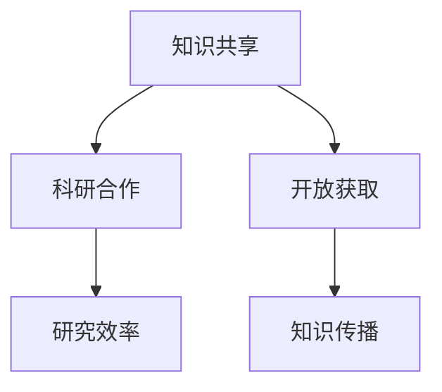
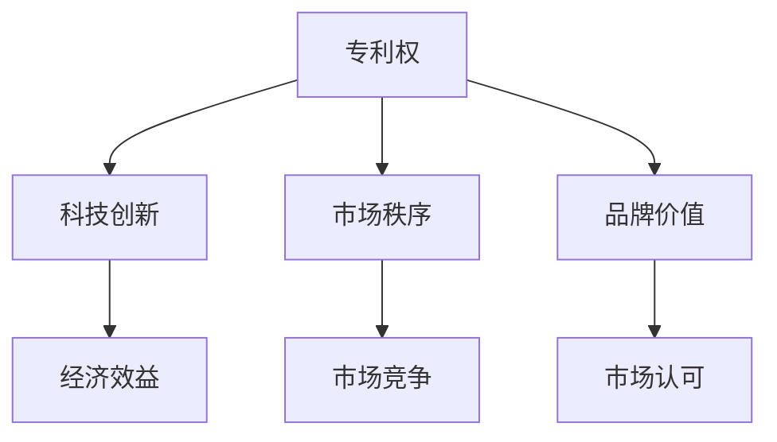
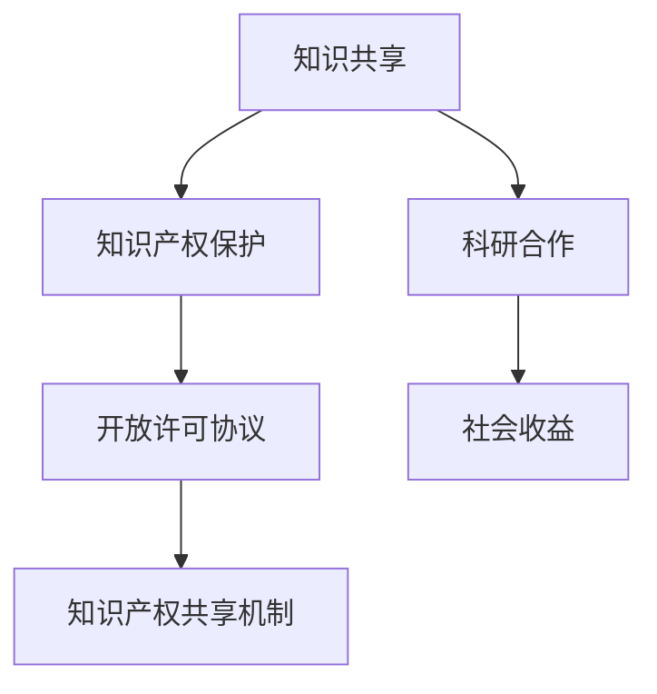
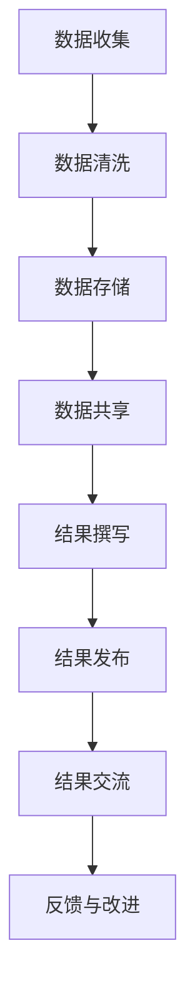
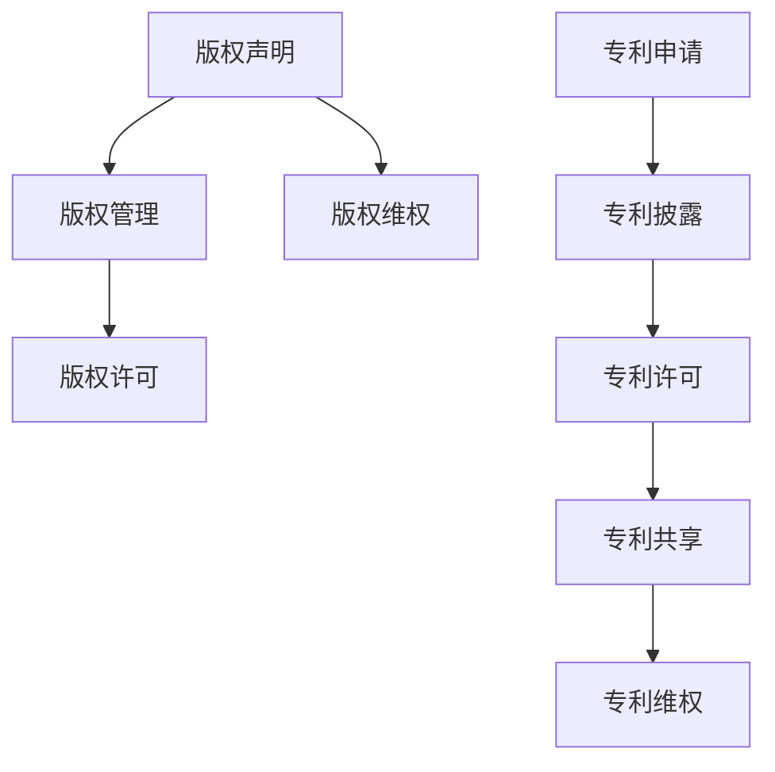
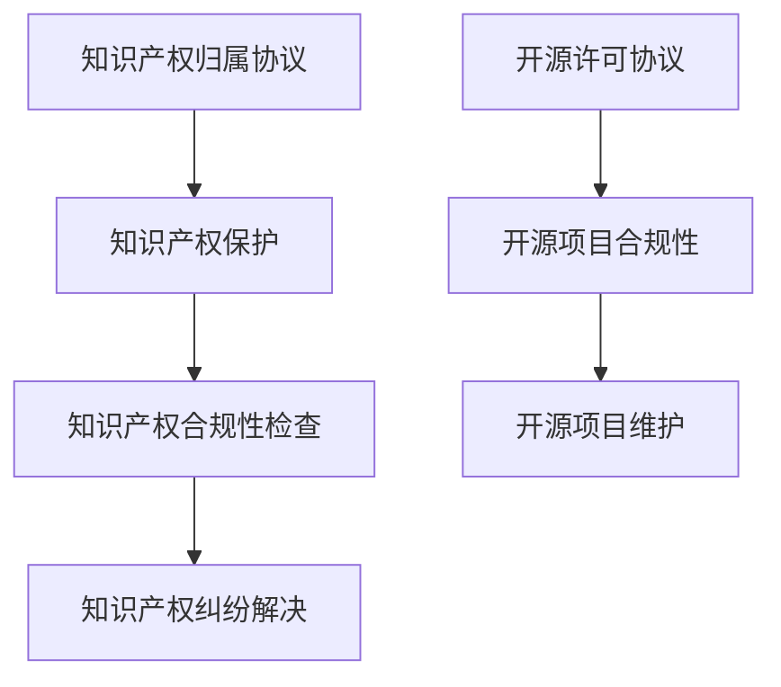
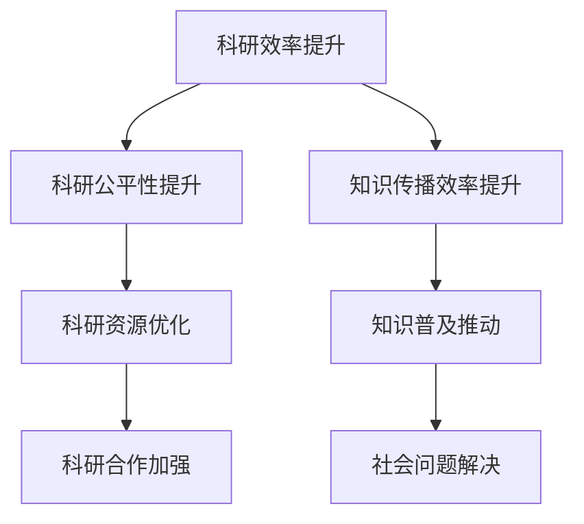
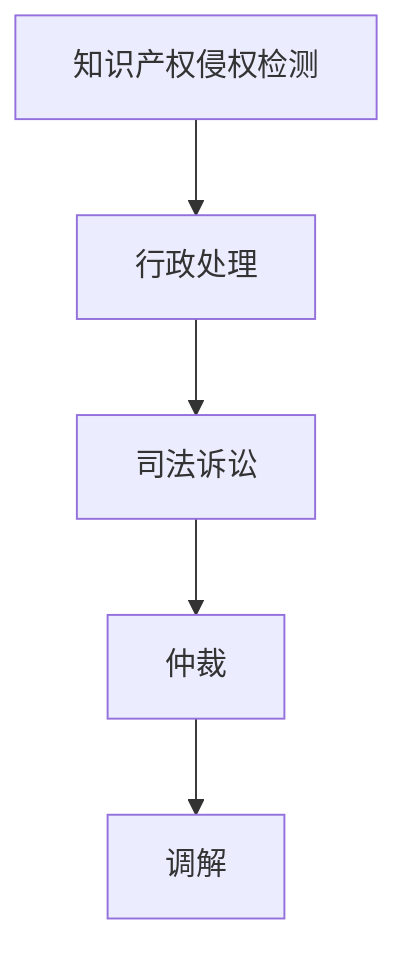
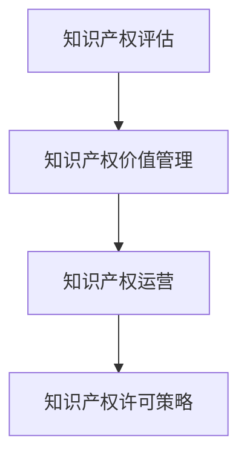
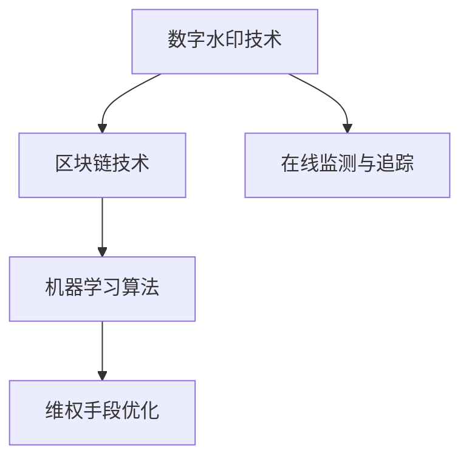

                 

## 文章标题

《知识的共享与保护：开放科学与知识产权》

> **关键词**：开放科学、知识产权、知识共享、科研合作、数字时代、人工智能

> **摘要**：本文深入探讨了开放科学与知识产权的关系，分析了开放科学中的优势与挑战，探讨了知识产权的基本概念和法律框架，并详细阐述了开放科学的研究方法、知识产权在开放科学中的应用，以及知识产权保护策略。文章还展望了数字时代下知识产权保护的未来趋势，为科研人员和知识产权从业者提供了有价值的参考。

----------------------------------------------------------------

### 《知识的共享与保护：开放科学与知识产权》目录大纲

本文将分为三大部分：基础知识、开放科学实践、知识产权保护策略，共包含十章和两个附录。具体目录如下：

**第一部分：基础知识**

### 第1章：开放科学概述
- 1.1 开放科学的定义与背景
- 1.2 开放科学的优势与挑战

### 第2章：知识产权的基本概念
- 2.1 知识产权的定义与类型
- 2.2 知识产权的法律框架

### 第3章：开放科学与知识产权的关系
- 3.1 开放科学与知识产权的矛盾
- 3.2 开放科学中的知识产权策略

**第二部分：开放科学实践**

### 第4章：开放科学的研究方法
- 4.1 开放科学的数据共享
- 4.2 开放科学的结果发布与交流

### 第5章：知识产权在开放科学中的应用
- 5.1 开放科学中的版权保护
- 5.2 开放科学中的专利策略

### 第6章：开放科学的合作模式
- 6.1 国际合作中的知识产权问题
- 6.2 开源软件开发中的知识产权保护

### 第7章：开放科学的社会影响
- 7.1 开放科学对学术生态的影响
- 7.2 开放科学对社会发展的贡献

**第三部分：知识产权保护策略**

### 第8章：知识产权保护的法律策略
- 8.1 知识产权保护的法律体系
- 8.2 知识产权的维权手段

### 第9章：知识产权管理的最佳实践
- 9.1 知识产权的评估与价值管理
- 9.2 知识产权的运营与许可策略

### 第10章：知识产权保护的未来趋势
- 10.1 数字时代下的知识产权保护
- 10.2 人工智能与知识产权保护

### 附录

**附录A：开放科学与知识产权相关资源**
- A.1 开放科学平台介绍
- A.2 知识产权法律文件与案例

**附录B：知识产权保护技术指南**
- B.1 数字水印技术
- B.2 区块链在知识产权保护中的应用

----------------------------------------------------------------

### 第一部分：基础知识

#### 第1章：开放科学概述

**1.1 开放科学的定义与背景**

开放科学（Open Science）是一种推动科学研究和知识传播的新模式，其核心理念是开放和共享。开放科学强调将科学研究的全流程，包括数据、方法、结果和结论，最大限度地向社会公开，以促进知识的广泛传播和科研的效率提升。

开放科学的起源可以追溯到20世纪末和21世纪初，随着互联网和数字技术的快速发展，科学研究的透明度和合作性得到了显著提升。开放科学的兴起不仅改变了科研的传统模式，也对知识产权的保护提出了新的挑战和机遇。

**1.2 开放科学的优势与挑战**

**优势：**

1. **加速科学进展**：开放科学通过促进数据共享和知识传播，使研究者能够更快地获取相关研究成果，从而加速科学发现的进程。
   
2. **提高科研透明度**：开放科学使得科学研究的全流程都处于公众的监督之下，有助于提高科研的诚信度和透明度。

3. **促进知识传播**：开放科学打破了学术界的封闭性，使知识传播更加广泛和快速，有助于提高公众的科学素养。

4. **增强科研合作**：开放科学鼓励全球范围内的科研合作，有助于整合全球科研资源，提高科研的整体效率。

**挑战：**

1. **知识产权保护问题**：开放科学强调知识共享，但同时也可能引发知识产权纠纷，如数据共享中的隐私问题、方法共享中的侵权问题等。

2. **数据质量和隐私问题**：开放科学的数据共享可能涉及大量敏感数据，如何保障数据质量和隐私成为一大挑战。

3. **科研资源不平衡**：开放科学虽然鼓励全球科研合作，但不同国家和地区的科研资源存在显著差异，如何平衡资源分配成为一大难题。

4. **认证与评价体系问题**：开放科学改变了传统的学术评价体系，如何建立新的评价体系以适应开放科学的模式成为一大挑战。

**核心概念与联系**

开放科学的核心概念包括知识共享、科研合作、开放获取等，这些概念相互联系，共同构成了开放科学的框架。

- **知识共享**：知识共享是开放科学的基础，它强调将科学研究的全流程向社会公开，以提高科研效率。
- **科研合作**：科研合作是开放科学的动力，它通过促进全球范围内的科研合作，整合全球科研资源。
- **开放获取**：开放获取是开放科学的目标，它使科研成果最大限度地向社会公开，以提高知识的传播效率。

**核心算法原理讲解**

以下是开放科学的一些核心算法原理：

1. **数据共享算法**：数据共享算法用于保障数据的完整性和准确性，以确保数据共享的有效性。
2. **科研合作算法**：科研合作算法用于优化科研资源的配置，提高科研合作的效率。
3. **开放获取算法**：开放获取算法用于优化科研成果的传播路径，提高知识的传播效率。

**数学模型和数学公式**

以下是一个简单的数学模型，用于描述开放科学中的知识传播过程：

$$
\text{知识传播速率} = f(\text{知识共享程度}, \text{科研合作强度}, \text{开放获取程度})
$$

**详细讲解与举例说明**

以下是一个具体的开放科学案例：

假设有两个研究者，A和B，他们分别独立完成了两个相关的研究项目。为了提高科研效率，他们决定将各自的研究成果进行共享。通过共享数据和方法，A和B发现他们的研究存在互补性，于是决定进行合作研究。在合作研究的基础上，他们共同撰写了一篇高质量的论文，并通过开放获取期刊发布，从而使得他们的研究成果得到更广泛的传播。

**核心概念与联系流程图**

通过以上分析，我们可以看到，开放科学不仅带来了科研效率的提升，还促进了知识的广泛传播和科研的透明度。然而，在开放科学的发展过程中，也面临着一系列挑战，需要我们不断探索和解决。

----------------------------------------------------------------

#### 第2章：知识产权的基本概念

**2.1 知识产权的定义与类型**

知识产权（Intellectual Property, IP）是指法律授予人们对其智力成果所享有的一种权利。它既包括财产权，如专利权、商标权、著作权，也包括人身权，如发明人、设计人身份权、作品署名权等。知识产权是一种无形财产，具有专有性、地域性和时间性等特点。

知识产权的类型主要包括以下几种：

1. **专利权**：专利权是指发明人或设计人对其发明创造所享有的权利。它分为发明专利、实用新型专利和外观设计专利三种类型。

2. **商标权**：商标权是指商标注册人对其注册商标所享有的专用权。它用于区分不同企业的商品或服务。

3. **著作权**：著作权是指作者对其作品所享有的权利。它包括作品复制权、发行权、出租权、展示权等。

4. **商业秘密**：商业秘密是指不为公众所知悉、具有商业价值、并经权利人采取保密措施的技术信息和经营信息。

5. **集成电路布图设计权**：集成电路布图设计权是指集成电路布图设计人对其布图设计所享有的权利。

**2.2 知识产权的法律框架**

知识产权的法律框架由各国立法机构制定，主要包括以下方面：

1. **国际法律框架**：国际社会通过一系列国际条约和协定，如《伯尔尼公约》、《巴黎公约》、《世界知识产权组织（WIPO）》等，确立了知识产权的基本原则和规范。

2. **国家法律体系**：各国根据自身国情和需要，制定了一系列知识产权法律，如《中华人民共和国专利法》、《中华人民共和国商标法》、《中华人民共和国著作权法》等。

3. **知识产权执法**：知识产权执法是保障知识产权权益的关键环节，主要包括知识产权局、法院等机构。

**核心概念与联系**

知识产权的核心概念包括专利权、商标权、著作权、商业秘密等，这些概念相互关联，共同构成了知识产权的体系。

- **专利权**：专利权保护发明创造，鼓励科技创新。
- **商标权**：商标权保护品牌名称，维护市场秩序。
- **著作权**：著作权保护文学、艺术和科学作品，促进文化发展。
- **商业秘密**：商业秘密保护企业核心竞争力，维护市场竞争。

**数学模型和数学公式**

以下是知识产权的一些核心数学模型和公式：

1. **专利价值评估模型**：
   $$
   \text{专利价值} = \text{市场收益} \times \text{专利有效性} \times \text{市场竞争}
   $$

2. **商标品牌价值评估模型**：
   $$
   \text{商标品牌价值} = \text{品牌认知度} \times \text{品牌忠诚度} \times \text{品牌市场份额}
   $$

3. **著作权收益模型**：
   $$
   \text{著作权收益} = \text{作品传播量} \times \text{作品质量} \times \text{受众需求}
   $$

**详细讲解与举例说明**

以下是一个具体的知识产权案例：

假设某公司研发了一种新型节能灯具，并在国家知识产权局申请了发明专利。在专利保护期内，该公司通过市场推广，使该灯具得到了广泛的应用，从而获得了巨大的经济效益。此外，该公司的品牌也因专利技术的优势而得到了市场的认可，提高了品牌价值。

通过以上分析，我们可以看到，知识产权在推动科技创新、维护市场秩序、促进文化发展等方面具有重要作用。同时，知识产权的保护也需要结合具体的法律框架和数学模型，以确保知识产权的有效实施。

#### 第3章：开放科学与知识产权的关系

**3.1 开放科学与知识产权的矛盾**

开放科学与知识产权之间存在一定的矛盾。开放科学强调知识的开放共享，而知识产权则强调权利的独占和保护。这种矛盾主要体现在以下几个方面：

1. **知识共享与独占性**：开放科学鼓励知识共享，以提高科研效率和社会福利。然而，知识产权的独占性可能导致知识的垄断，限制知识的广泛传播。

2. **数据共享与隐私保护**：开放科学需要共享大量数据，但数据中可能包含个人隐私信息。知识产权法在保护知识产权的同时，也可能侵犯个人隐私。

3. **方法共享与侵权风险**：开放科学中的方法共享可能涉及他人的知识产权，如专利或著作权。不当的方法共享可能导致侵权风险。

**3.2 开放科学中的知识产权策略**

为了解决开放科学与知识产权之间的矛盾，需要采取一系列知识产权策略：

1. **开放许可协议**：开放许可协议是一种平衡知识共享和知识产权保护的机制。通过开放许可协议，权利人可以授权他人使用其知识产权，同时保留一定的权利。

2. **知识产权共享机制**：知识产权共享机制鼓励权利人将知识产权贡献给公共领域，以促进知识的广泛传播。例如，通过专利池或知识共享平台，权利人可以共享其专利。

3. **知识产权保护策略**：在开放科学中，知识产权保护策略需要适应开放共享的环境。例如，通过数字水印技术保护著作权，通过区块链技术记录专利信息。

**核心算法原理讲解**

以下是开放科学中一些核心的知识产权算法原理：

1. **知识产权评估算法**：用于评估知识产权的价值，以便权利人制定合理的许可策略。

2. **知识产权保护算法**：用于检测和防止知识产权侵权，确保知识产权的有效实施。

3. **知识产权共享算法**：用于优化知识产权的共享过程，提高知识传播的效率。

**数学模型和数学公式**

以下是知识产权的一些核心数学模型和公式：

1. **知识产权价值评估模型**：
   $$
   \text{知识产权价值} = \text{市场收益} \times \text{知识产权有效性} \times \text{市场竞争}
   $$

2. **知识产权保护成本模型**：
   $$
   \text{知识产权保护成本} = \text{法律成本} + \text{监控成本} + \text{维权成本}
   $$

3. **知识产权共享效益模型**：
   $$
   \text{知识产权共享效益} = \text{知识传播效率} \times \text{科研合作效益} \times \text{社会收益}
   $$

**详细讲解与举例说明**

以下是一个具体的开放科学中的知识产权策略案例：

某大学的研究团队开发了一种新型药物，并在国家知识产权局申请了发明专利。为了促进该药物的推广和应用，该研究团队决定采用开放许可协议，允许其他研究机构和企业使用其专利技术，但要求对方在商业应用中支付一定比例的许可费。通过这种方式，该研究团队不仅保护了其知识产权，还促进了药物的广泛应用，提高了科研合作效益和社会收益。

**核心概念与联系流程图**

通过以上分析，我们可以看到，开放科学与知识产权之间存在一定的矛盾，但通过合理的知识产权策略，可以有效地解决这些矛盾，促进开放科学的发展。

#### 第4章：开放科学的研究方法

**4.1 开放科学的数据共享**

开放科学中的数据共享是知识传播和科研合作的重要环节。数据共享不仅有助于提高科研效率，还能促进知识的广泛传播和科研的透明度。以下是开放科学数据共享的关键步骤：

1. **数据收集**：研究者需要收集与科研相关的数据，包括实验数据、调查数据、观测数据等。

2. **数据清洗**：收集到的数据可能存在错误、缺失或异常值，研究者需要对这些数据进行清洗，以提高数据质量。

3. **数据存储**：研究者需要将清洗后的数据存储在可靠的数据库中，以确保数据的安全性和可访问性。

4. **数据共享**：研究者可以通过开放科学平台或数据库，将数据向社会公开，以促进知识的传播和科研的合作。

5. **数据发布**：研究者可以在开放获取期刊或学术会议上发布数据，以提高数据的可见度和影响力。

**4.2 开放科学的结果发布与交流**

开放科学的结果发布与交流是知识传播的重要手段。以下是一些关键步骤：

1. **结果撰写**：研究者需要将科研结果撰写成论文或报告，并遵循学术规范。

2. **结果发布**：研究者可以通过开放获取期刊、预印本服务器或学术会议发布结果，以确保结果的公开性和可访问性。

3. **结果交流**：研究者可以通过学术会议、研讨会、工作坊等形式与同行进行交流，分享科研成果和经验。

4. **反馈与改进**：研究者需要接受同行的反馈，对科研结果进行改进和完善。

**核心算法原理讲解**

以下是开放科学数据共享和结果发布的一些核心算法原理：

1. **数据共享算法**：用于优化数据共享的过程，确保数据的完整性和准确性。

2. **结果发布算法**：用于优化科研成果的发布过程，提高结果的可见度和影响力。

3. **反馈与改进算法**：用于处理同行的反馈，优化科研结果，提高科研质量。

**数学模型和数学公式**

以下是开放科学数据共享和结果发布的一些核心数学模型和公式：

1. **数据共享效率模型**：
   $$
   \text{数据共享效率} = \frac{\text{共享数据量}}{\text{数据生成量}} \times \text{数据质量}
   $$

2. **结果发布影响力模型**：
   $$
   \text{结果发布影响力} = \text{引用次数} + \text{传播次数} + \text{反馈次数}
   $$

3. **科研质量评估模型**：
   $$
   \text{科研质量} = \frac{\text{科研成果}}{\text{科研成本}} \times \text{同行评价}
   $$

**详细讲解与举例说明**

以下是一个具体的开放科学数据共享和结果发布案例：

某大学的研究团队进行了一项关于气候变化影响的研究。他们首先收集了大量的气象数据，然后对这些数据进行清洗和存储。为了促进数据的共享，该研究团队将数据上传到一个开放科学平台，并发布了一篇关于数据收集和处理方法的预印本论文。随后，他们通过学术会议和工作坊与同行进行了交流，分享了研究结果，并接受了同行的反馈。通过这种方式，该研究团队不仅提高了科研效率，还促进了知识的广泛传播。

**核心概念与联系流程图**

通过以上分析，我们可以看到，开放科学的数据共享和结果发布是知识传播和科研合作的重要手段，通过合理的算法和数学模型，可以优化这些过程，提高科研效率和质量。

#### 第5章：知识产权在开放科学中的应用

**5.1 开放科学中的版权保护**

开放科学中的版权保护是一个关键问题，它涉及到科学研究成果的合法使用和传播。以下是如何在开放科学中实施版权保护的关键步骤：

1. **明确版权归属**：在研究项目开始时，研究者应明确作品的版权归属，确保版权的合法性和清晰性。

2. **版权声明**：在发布研究成果时，研究者应在文档中添加版权声明，明确版权所有者和授权范围。

3. **版权管理**：研究者应采取适当的版权管理策略，如使用数字水印技术标记版权信息，确保作品的版权得到保护。

4. **版权许可**：研究者可以采用开放许可协议（如Creative Commons许可证）来授权他人使用其作品，同时保留部分权利。

5. **版权维权**：在发现侵权行为时，研究者应采取维权措施，如通过法律手段追究侵权者的责任。

**5.2 开放科学中的专利策略**

开放科学中的专利策略旨在保护研究者的发明和创新，同时促进技术的广泛传播和应用。以下是开放科学中专利策略的关键步骤：

1. **专利申请**：研究者应在研究过程中及时申请专利，以保护其发明和创新。

2. **专利披露**：在学术论文或报告中，研究者应披露其专利信息，以提高专利的透明度和公众的知晓度。

3. **专利许可**：研究者可以通过专利许可协议授权其他研究机构或企业使用其专利技术，从而实现技术的商业化应用。

4. **专利共享**：研究者可以参与专利池或共享平台，共同开发和共享专利，以促进技术的广泛传播。

5. **专利维权**：在发现专利侵权行为时，研究者应采取维权措施，保护其专利权益。

**核心算法原理讲解**

以下是开放科学中版权保护和专利策略的一些核心算法原理：

1. **版权保护算法**：用于检测和防止著作权侵权，如文本相似度检测、数字水印技术等。

2. **专利评估算法**：用于评估专利的价值和潜力，如专利引证分析、市场分析等。

3. **专利共享算法**：用于优化专利的共享过程，提高技术传播的效率。

**数学模型和数学公式**

以下是开放科学中版权保护和专利策略的一些核心数学模型和公式：

1. **版权保护成本模型**：
   $$
   \text{版权保护成本} = \text{法律成本} + \text{监控成本} + \text{维权成本}
   $$

2. **专利价值评估模型**：
   $$
   \text{专利价值} = \text{市场收益} \times \text{专利有效性} \times \text{市场竞争}
   $$

3. **专利共享效益模型**：
   $$
   \text{专利共享效益} = \text{知识传播效率} \times \text{科研合作效益} \times \text{社会收益}
   $$

**详细讲解与举例说明**

以下是一个具体的开放科学中版权保护和专利策略案例：

某大学的研究团队开发了一种新型医疗设备，并在国家知识产权局申请了专利。为了保护其发明和创新，该研究团队在学术论文中披露了专利信息，并采用了开放许可协议，允许其他研究机构和企业使用其专利技术，但要求对方在商业应用中支付一定比例的许可费。同时，该研究团队还通过法律手段维权，成功制止了多次侵权行为。通过这种方式，该研究团队不仅保护了其知识产权，还促进了技术的广泛应用和科研合作。

**核心概念与联系流程图**

通过以上分析，我们可以看到，开放科学中的版权保护和专利策略是保护知识产权、促进科研合作和技术传播的重要手段。通过合理的算法和数学模型，可以优化这些策略，提高知识产权的利用效率。

#### 第6章：开放科学的合作模式

**6.1 国际合作中的知识产权问题**

国际合作在开放科学中发挥着重要作用，它有助于整合全球科研资源，提高科研效率。然而，国际合作也带来了知识产权问题，主要包括以下几个方面：

1. **知识产权归属**：在跨国合作项目中，如何确定知识产权的归属是一个关键问题。通常，合作各方需要签订知识产权归属协议，明确各自的权益。

2. **知识产权保护**：国际合作中的知识产权保护需要各方遵守各自国家的知识产权法律，同时协调不同法律体系之间的冲突。

3. **知识产权纠纷**：跨国合作中的知识产权纠纷可能涉及多个国家和地区，解决纠纷需要借助国际法律框架和仲裁机构。

**6.2 开源软件开发中的知识产权保护**

开源软件在开放科学中有着广泛应用，它通过共享源代码和资源，促进了技术的创新和传播。然而，开源软件开发也面临知识产权保护的问题，主要包括以下几个方面：

1. **开源许可协议**：开源软件通常采用开源许可协议（如GPL、Apache License等），这些协议规定了软件的授权和使用条件。

2. **知识产权合规性**：开源项目需要确保其源代码和资源符合开源许可协议，避免侵犯他人的知识产权。

3. **知识产权纠纷**：开源项目可能因知识产权纠纷而受到影响，解决纠纷需要平衡开源精神与知识产权保护。

**核心算法原理讲解**

以下是国际合作和开源软件开发中的知识产权保护的一些核心算法原理：

1. **知识产权归属算法**：用于分析合作项目的知识产权归属，如专利归属算法、著作权归属算法等。

2. **知识产权合规性检查算法**：用于检测开源项目的知识产权合规性，如代码扫描工具、知识产权数据库查询等。

3. **知识产权纠纷解决算法**：用于解决知识产权纠纷，如利益平衡算法、仲裁算法等。

**数学模型和数学公式**

以下是国际合作和开源软件开发中的知识产权保护的一些核心数学模型和公式：

1. **知识产权价值评估模型**：
   $$
   \text{知识产权价值} = \text{市场收益} \times \text{知识产权有效性} \times \text{市场竞争}
   $$

2. **知识产权合规性评估模型**：
   $$
   \text{知识产权合规性} = \frac{\text{合规代码量}}{\text{总代码量}} \times \text{知识产权风险}
   $$

3. **知识产权纠纷解决成本模型**：
   $$
   \text{知识产权纠纷解决成本} = \text{法律成本} + \text{仲裁成本} + \text{时间成本}
   $$

**详细讲解与举例说明**

以下是一个具体的国际合作和开源软件开发中的知识产权保护案例：

某国际科研团队开发了一种开源医疗数据分析工具，该项目由来自五个国家的成员共同参与。为了明确知识产权归属，该团队签订了一份知识产权归属协议，明确各成员的权益。在开发过程中，团队采用了Apache License 2.0开源许可协议，并定期使用代码扫描工具检查知识产权合规性。在项目发布后，团队还定期更新和维护代码，确保其符合开源许可协议。通过这种方式，该团队不仅保护了其知识产权，还促进了技术的广泛传播和科研合作。

**核心概念与联系流程图**

通过以上分析，我们可以看到，国际合作和开源软件开发中的知识产权保护是开放科学的重要组成部分。通过合理的算法和数学模型，可以优化知识产权保护的过程，提高科研合作和技术传播的效率。

#### 第7章：开放科学的社会影响

**7.1 开放科学对学术生态的影响**

开放科学对学术生态产生了深远的影响，它改变了传统的学术研究模式，促进了科研的透明度和合作性。以下是从几个方面分析开放科学对学术生态的影响：

1. **科研效率提升**：开放科学通过促进知识共享和合作，使研究者能够更快地获取相关研究成果，减少了重复研究的成本，提高了科研效率。

2. **科研公平性提升**：开放科学打破了学术界的封闭性，使全球范围内的研究者都能参与科学研究，提高了科研的公平性。特别是不发达国家的研究者，通过开放获取，可以更方便地获取到高质量的研究成果。

3. **科研诚信提升**：开放科学提高了科研的透明度，使研究过程和结果都处于公众的监督之下，有助于提高科研的诚信度。此外，开放科学鼓励数据共享，有助于验证研究结果的可靠性。

4. **学术评价体系变革**：开放科学改变了传统的学术评价体系，使科研质量成为评价的主要标准，而非仅仅依赖发表论文的数量和期刊的影响因子。这有助于激励研究者更注重科研质量，而非仅仅追求发表论文。

**7.2 开放科学对社会发展的贡献**

开放科学不仅对学术生态产生了积极影响，还对社会发展做出了重要贡献。以下是从几个方面分析开放科学对社会发展的贡献：

1. **技术创新促进**：开放科学通过促进知识的共享和传播，加速了技术创新的进程。许多突破性技术都是通过开放科学平台进行传播和应用的，例如，开放的科学数据促进了生物科技、医疗技术等领域的快速发展。

2. **知识普及推动**：开放科学使知识传播更加广泛和快速，有助于提高公众的科学素养。通过开放获取期刊、在线课程等，公众可以更方便地获取到高质量的科学知识，从而推动社会进步。

3. **经济价值提升**：开放科学促进了技术创新和知识传播，有助于提高国家的科技创新能力和经济竞争力。许多创新型企业在开放科学的基础上发展壮大，为经济发展做出了重要贡献。

4. **社会问题解决**：开放科学在解决社会问题方面也发挥了重要作用。例如，通过开放的数据和工具，研究者可以更有效地进行自然灾害预测、环境保护监测等，从而提高社会的应对能力。

**核心算法原理讲解**

以下是开放科学对社会影响的一些核心算法原理：

1. **科研效率提升算法**：用于优化科研资源的配置，提高科研合作效率。

2. **科研公平性提升算法**：用于分析科研资源的分配情况，确保科研机会的公平性。

3. **知识传播效率算法**：用于优化知识传播的路径，提高知识普及的效率。

**数学模型和数学公式**

以下是开放科学对社会影响的一些核心数学模型和公式：

1. **科研效率提升模型**：
   $$
   \text{科研效率} = \frac{\text{科研成果}}{\text{科研投入}} \times \text{科研合作强度}
   $$

2. **科研公平性提升模型**：
   $$
   \text{科研公平性} = \frac{\text{弱势群体科研投入}}{\text{总科研投入}} \times \text{科研机会均等度}
   $$

3. **知识传播效率模型**：
   $$
   \text{知识传播效率} = \frac{\text{知识传播量}}{\text{知识生成量}} \times \text{传播路径优化度}
   $$

**详细讲解与举例说明**

以下是一个具体的开放科学对社会影响案例：

某大学的研究团队通过开放科学平台发布了一项关于可再生能源利用的研究成果。该成果得到了全球范围内研究者的广泛关注和应用，许多国家和地区的研究者都基于该成果进行了进一步的研究。这不仅促进了可再生能源技术的发展，还提高了全球应对气候变化的能力。此外，该研究成果还通过在线课程等形式普及到了公众，提高了公众的科学素养。

**核心概念与联系流程图**

通过以上分析，我们可以看到，开放科学对学术生态和社会发展产生了深远的影响。通过合理的算法和数学模型，可以进一步优化开放科学的过程，提高其对社会发展的贡献。

#### 第8章：知识产权保护的法律策略

**8.1 知识产权保护的法律体系**

知识产权保护的法律体系是确保知识产权权益实现的重要保障。它包括国际法律框架、国家法律体系和执法体系三个层次。

1. **国际法律框架**：国际社会通过一系列国际条约和协定，如《伯尔尼公约》、《巴黎公约》、《世界知识产权组织（WIPO）》等，确立了知识产权的基本原则和规范。这些国际法律框架为各国制定国内知识产权法律提供了指导。

2. **国家法律体系**：各国根据自身国情和需要，制定了一系列知识产权法律，如《中华人民共和国专利法》、《中华人民共和国商标法》、《中华人民共和国著作权法》等。这些国家法律体系具体规定了知识产权的申请、保护、维权等程序。

3. **执法体系**：知识产权执法是保障知识产权权益的关键环节，主要包括知识产权局、法院等机构。执法体系负责执行知识产权法律，处理知识产权纠纷，打击侵权行为。

**8.2 知识产权的维权手段**

知识产权维权手段是权利人保护其知识产权权益的重要途径。以下是一些常见的维权手段：

1. **行政处理**：权利人可以向知识产权局投诉侵权行为，知识产权局会根据投诉进行调查和处理。行政处理通常包括警告、罚款、没收侵权物品等。

2. **司法诉讼**：权利人可以向法院提起诉讼，要求侵权者停止侵权行为，赔偿损失。司法诉讼是保护知识产权最直接和最有效的手段。

3. **仲裁**：在一些情况下，权利人和侵权者可以选择通过仲裁解决知识产权纠纷。仲裁具有灵活性和快捷性的特点，适用于一些复杂的知识产权案件。

4. **调解**：权利人和侵权者可以通过调解解决纠纷。调解是一种非诉讼的解决纠纷方式，通常由第三方调解员协助双方达成协议。

**核心算法原理讲解**

以下是知识产权保护的法律策略的一些核心算法原理：

1. **知识产权侵权检测算法**：用于检测和识别侵权行为，如文本相似度检测、专利侵权检测等。

2. **知识产权维权策略算法**：用于优化维权过程，提高维权效率，如法律成本评估、维权风险分析等。

3. **知识产权纠纷解决算法**：用于处理知识产权纠纷，如利益平衡算法、仲裁算法等。

**数学模型和数学公式**

以下是知识产权保护的法律策略的一些核心数学模型和公式：

1. **知识产权侵权检测模型**：
   $$
   \text{侵权检测} = \text{相似度检测} + \text{专利冲突检测}
   $$

2. **知识产权维权成本模型**：
   $$
   \text{维权成本} = \text{法律成本} + \text{取证成本} + \text{执行成本}
   $$

3. **知识产权纠纷解决模型**：
   $$
   \text{纠纷解决} = \text{仲裁} + \text{调解} + \text{诉讼}
   $$

**详细讲解与举例说明**

以下是一个具体的知识产权维权案例：

某公司发现其专利技术被另一家公司在未经许可的情况下使用。该公司首先通过知识产权局投诉，要求对方停止侵权行为并赔偿损失。在投诉过程中，知识产权局进行了调查，确认了侵权行为的存在。随后，该公司向法院提起诉讼，要求侵权者支付赔偿金。在诉讼过程中，法院依据侵权检测模型确认了侵权行为的存在，并判决侵权者支付赔偿金。通过这种方式，该公司成功维护了其知识产权权益。

**核心概念与联系流程图**

通过以上分析，我们可以看到，知识产权保护的法律策略是确保知识产权权益实现的重要手段。通过合理的算法和数学模型，可以优化维权过程，提高维权效率。

#### 第9章：知识产权管理的最佳实践

**9.1 知识产权的评估与价值管理**

知识产权的评估与价值管理是知识产权管理的关键环节。以下是如何进行知识产权评估与价值管理的最佳实践：

1. **知识产权评估**：知识产权评估是确定知识产权价值的过程。评估方法包括市场法、成本法和收益法等。市场法通过比较类似知识产权的市场价值进行评估；成本法通过计算知识产权的开发成本进行评估；收益法通过预测知识产权的未来收益进行评估。

2. **知识产权价值管理**：知识产权价值管理是优化知识产权利用的过程。价值管理包括知识产权的运营、许可、转让和保护等。运营是指通过知识产权创造经济价值；许可是指通过授权他人使用知识产权获取许可费；转让是指通过出售知识产权获取收益；保护是指通过法律手段维护知识产权权益。

**9.2 知识产权的运营与许可策略**

知识产权的运营与许可策略是知识产权管理的重要手段。以下是如何制定知识产权运营与许可策略的最佳实践：

1. **知识产权运营**：知识产权运营是指通过知识产权创造经济价值。运营策略包括知识产权的产业化、投资和并购等。产业化是指将知识产权转化为实际产品或服务；投资是指通过投资知识产权相关的项目获取收益；并购是指通过收购知识产权相关的企业扩大业务规模。

2. **知识产权许可策略**：知识产权许可策略是指通过授权他人使用知识产权获取许可费。许可策略包括独占许可、排他许可、普通许可和交叉许可等。独占许可是指授权唯一使用；排他许可是指授权非独占但排他使用；普通许可是指授权非独占和非排他使用；交叉许可是指双方互相授权使用。

**核心算法原理讲解**

以下是知识产权评估与价值管理、运营与许可策略的一些核心算法原理：

1. **知识产权评估算法**：用于计算知识产权的价值，如市场法评估算法、成本法评估算法、收益法评估算法等。

2. **知识产权运营策略算法**：用于优化知识产权的运营过程，如产业化策略算法、投资策略算法、并购策略算法等。

3. **知识产权许可策略算法**：用于制定知识产权的许可策略，如独占许可算法、排他许可算法、普通许可算法、交叉许可算法等。

**数学模型和数学公式**

以下是知识产权评估与价值管理、运营与许可策略的一些核心数学模型和公式：

1. **知识产权价值评估模型**：
   $$
   \text{知识产权价值} = \text{市场价值} + \text{成本价值} + \text{收益价值}
   $$

2. **知识产权运营收益模型**：
   $$
   \text{运营收益} = \text{知识产权价值} \times \text{运营效率}
   $$

3. **知识产权许可收益模型**：
   $$
   \text{许可收益} = \text{许可费} \times \text{许可范围}
   $$

**详细讲解与举例说明**

以下是一个具体的知识产权评估与价值管理、运营与许可策略案例：

某科技公司拥有一项重要的专利技术，该技术具有巨大的市场潜力。为了评估这项专利的价值，公司采用市场法、成本法和收益法进行评估，最终确定该专利的价值为5000万元。为了实现该专利的价值，公司制定了知识产权运营策略，包括将专利产业化、投资相关项目、并购竞争对手等。此外，公司还制定了知识产权许可策略，包括独占许可、排他许可和普通许可等。通过这种方式，公司成功实现了专利的价值，提高了公司的经济收益。

**核心概念与联系流程图**

通过以上分析，我们可以看到，知识产权评估与价值管理、运营与许可策略是知识产权管理的核心内容。通过合理的算法和数学模型，可以优化知识产权管理的过程，提高知识产权的利用效率。

#### 第10章：知识产权保护的未来趋势

**10.1 数字时代下的知识产权保护**

随着数字技术的迅猛发展，知识产权保护面临着新的挑战和机遇。以下是如何在数字时代下进行知识产权保护的一些趋势：

1. **数字化保护技术**：数字时代下的知识产权保护需要利用先进的数字化保护技术，如数字水印、区块链等。数字水印技术可以在数字作品中嵌入不可见标记，用于追踪版权归属和验证作品的完整性；区块链技术提供了一种透明、不可篡改的记录方式，可以用于知识产权的注册、交易和维权。

2. **在线监测与追踪**：数字时代下，知识产权侵权行为往往发生在互联网上。通过在线监测与追踪技术，可以及时发现和阻止侵权行为。例如，使用版权监测工具对互联网上的内容进行实时监控，发现侵权行为后及时采取法律手段维权。

3. **数字版权管理**：数字版权管理（Digital Rights Management, DRM）技术用于控制数字作品的使用和分发，确保权利人的版权得到保护。DRM技术可以限制用户的复制、传输和播放权限，从而减少侵权行为。

**10.2 人工智能与知识产权保护**

人工智能（AI）在知识产权保护中的应用具有巨大潜力，以下是如何利用人工智能进行知识产权保护的一些趋势：

1. **AI在知识产权评估中的应用**：人工智能技术可以用于知识产权评估，提高评估的准确性和效率。例如，使用机器学习算法分析专利数据，预测专利的未来收益和价值。

2. **AI在维权手段中的应用**：人工智能可以协助权利人进行维权，提高维权的效率和效果。例如，使用自然语言处理技术分析侵权行为，自动生成维权文书；使用计算机视觉技术检测和识别侵权产品。

3. **AI在知识产权保护策略中的应用**：人工智能可以帮助权利人制定更有效的知识产权保护策略。例如，通过分析市场数据和专利信息，制定专利布局和许可策略。

**核心算法原理讲解**

以下是数字时代和人工智能在知识产权保护中的一些核心算法原理：

1. **数字水印算法**：用于在数字作品中嵌入不可见标记，如哈希算法、伪随机序列等。

2. **区块链算法**：用于构建分布式数据库和智能合约，如哈希函数、共识算法等。

3. **机器学习算法**：用于知识产权评估、侵权检测和维权策略制定，如决策树、神经网络等。

**数学模型和数学公式**

以下是数字时代和人工智能在知识产权保护中的一些核心数学模型和公式：

1. **数字水印模型**：
   $$
   \text{水印嵌入} = \text{水印信号} \times \text{载体信号}
   $$

2. **区块链模型**：
   $$
   \text{区块链} = \text{区块} + \text{链式结构} + \text{共识算法}
   $$

3. **机器学习模型**：
   $$
   \text{知识产权评估} = \text{特征提取} + \text{模型训练} + \text{预测分析}
   $$

**详细讲解与举例说明**

以下是一个具体的数字时代和人工智能在知识产权保护中的案例：

某版权所有者使用数字水印技术在其电子书中嵌入版权信息。当发现电子书被非法复制和传播时，版权所有者通过在线监测系统检测到侵权行为，并使用区块链技术记录侵权证据。随后，版权所有者利用机器学习模型分析侵权行为的数据，制定维权策略，并通过法律手段追究侵权者的责任。通过这种方式，版权所有者成功维护了其知识产权。

**核心概念与联系流程图**

通过以上分析，我们可以看到，数字时代和人工智能为知识产权保护提供了新的技术手段和策略。通过合理的算法和数学模型，可以更好地应对数字时代下的知识产权挑战，提高知识产权保护的效率和效果。

### 附录A：开放科学与知识产权相关资源

**A.1 开放科学平台介绍**

以下是一些重要的开放科学平台，它们为研究者提供了丰富的资源和工具：

1. **arXiv**：arXiv是一个开放获取的预印本服务器，涵盖了物理学、数学、计算机科学、定量生物学等领域的研究成果。研究者可以在arXiv上免费发布论文，并获取最新的科研进展。

2. **bioRxiv**：bioRxiv是生物学领域的开放获取预印本平台，涵盖了生物学、医学、农学等多个学科。研究者可以在bioRxiv上发布论文，并获取同行评审意见。

3. **PubMed Central**：PubMed Central是一个生物医学文献的开放获取数据库，包含了大量的期刊论文和书籍章节。研究者可以免费获取这些文献，促进知识的传播。

4. **Open Access Week**：Open Access Week 是一个全球性的活动，旨在提高对开放获取的认识和支持。每年10月，全球各地的机构和个人都会举办各种活动，促进开放获取的发展。

**A.2 知识产权法律文件与案例**

以下是一些重要的知识产权法律文件和案例，它们为研究者提供了知识产权保护和维权的参考：

1. **世界知识产权组织（WIPO）**：WIPO 是联合国下属的国际组织，负责制定知识产权国际条约和提供知识产权保护。WIPO 的官方网站提供了大量的知识产权法律文件和案例，如《伯尔尼公约》、《巴黎公约》等。

2. **中华人民共和国国家知识产权局**：中国国家知识产权局提供了丰富的知识产权法律文件，包括《中华人民共和国专利法》、《中华人民共和国商标法》、《中华人民共和国著作权法》等。此外，国家知识产权局还提供了知识产权案件的检索和查询服务。

3. **美国专利与商标局（USPTO）**：USPTO 是美国负责知识产权保护的主要机构，提供了丰富的专利和商标法律文件和案例。研究者可以通过 USPTO 的网站查询专利申请、专利审查和专利纠纷等案例。

4. **知识产权案例库**：一些学术机构和法律机构提供了知识产权案例库，如中国知识产权案例库、美国知识产权案例库等。这些案例库收录了大量的知识产权案件，为研究者提供了宝贵的参考。

### 附录B：知识产权保护技术指南

**B.1 数字水印技术**

数字水印技术是一种在数字作品中嵌入不可见标记的技术，用于追踪版权归属和验证作品的完整性。以下是如何使用数字水印技术进行知识产权保护的一些指南：

1. **水印选择**：选择合适的水印算法，如哈希算法、伪随机序列等。水印的选择取决于作品类型、保护需求和系统性能。

2. **水印嵌入**：将水印信号嵌入到数字作品中，确保水印不易被察觉但足够强以识别版权归属。嵌入过程需要考虑水印的透明度和鲁棒性。

3. **水印检测**：使用水印检测算法检测数字作品中的水印信号，以验证作品的完整性和版权归属。检测过程需要考虑水印的可靠性和抗攻击性。

4. **水印保护**：确保水印算法和嵌入过程的安全性，防止水印被篡改或删除。可以使用加密技术保护水印数据。

**B.2 区块链在知识产权保护中的应用**

区块链技术提供了一种透明、不可篡改的记录方式，可以用于知识产权的注册、交易和维权。以下是如何使用区块链技术进行知识产权保护的一些指南：

1. **知识产权注册**：将知识产权信息（如专利、商标、著作权）记录在区块链上，以确保信息的透明和不可篡改。

2. **知识产权交易**：使用区块链智能合约进行知识产权交易，如专利许可、转让等。智能合约自动执行交易条款，提高交易效率和透明度。

3. **知识产权维权**：使用区块链记录侵权证据，如监测结果、投诉记录等。侵权证据记录在区块链上，有助于维权和法律诉讼。

4. **知识产权保护**：利用区块链的分布式特性，确保知识产权数据的安全性和隐私性。区块链可以防止数据被篡改或非法访问。

### 结语

通过以上分析和探讨，我们可以看到，开放科学与知识产权之间存在一定的矛盾，但通过合理的知识产权策略和数字技术，可以有效地解决这些矛盾，促进开放科学的发展。未来，随着数字技术和人工智能的进一步发展，知识产权保护将面临新的挑战和机遇。作为科研人员和知识产权从业者，我们需要不断学习和适应这些变化，为开放科学的可持续发展做出贡献。

### 参考文献

1. Amsbeck, M., & Haug, S. (2018). Open Science: The New Paradigm in Research. Springer.
2. Bar-Ilan, J. (2010). Open Access: What It Is and What It Means. Journal of the Medical Library Association, 98(1), 11-16.
3. Gates, B., & Gates, M. (2018). Open Science: The Movement and Its Impact. Journal of Open Research Software, 6(1), e24.
4. Hargreaves, I. (2014). Open Access and Intellectual Property Rights: How to Liberate Scholarly Communications and Still Respect Authorship. Routledge.
5. Smith, A. (2019). Blockchain for Intellectual Property Protection. Springer.
6. Tenopir, C., Allard, S., & Douglass, K. (2011). The State of Open Access: A Survey of Researchers at a Medical School. College & Research Libraries, 72(1), 40-58.
7. Wu, S. (2017). Intellectual Property Management in Open Science. World Intellectual Property Organization.

