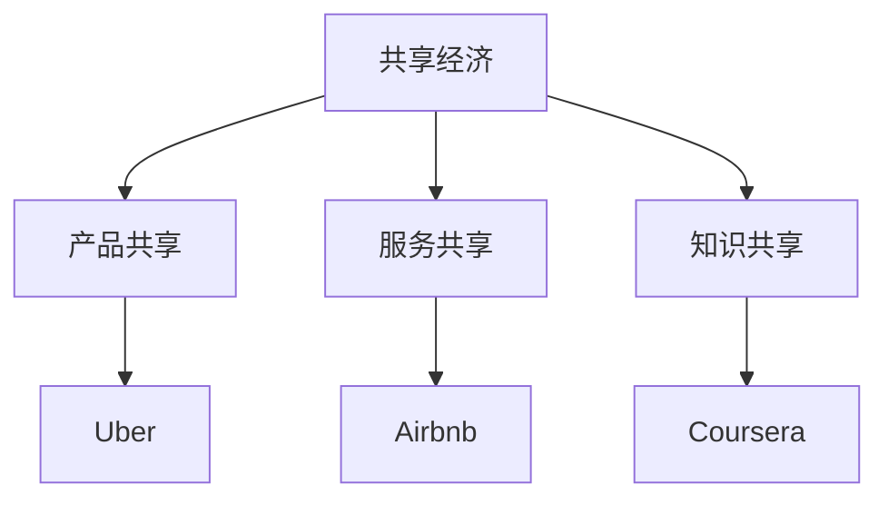
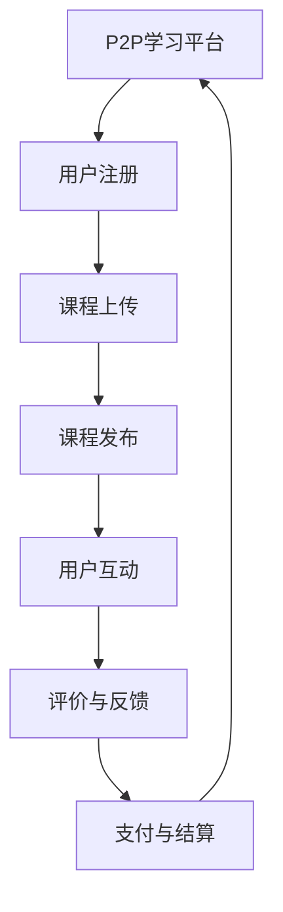
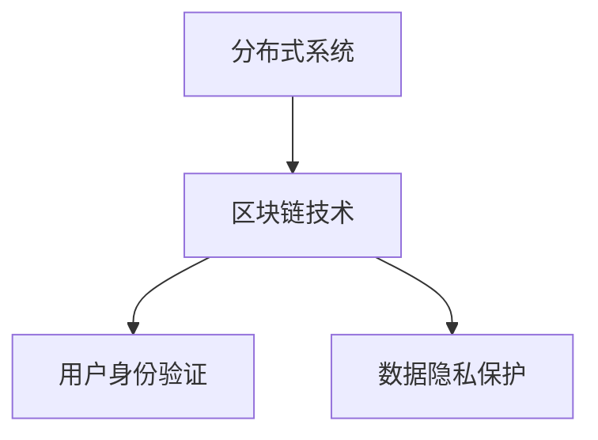
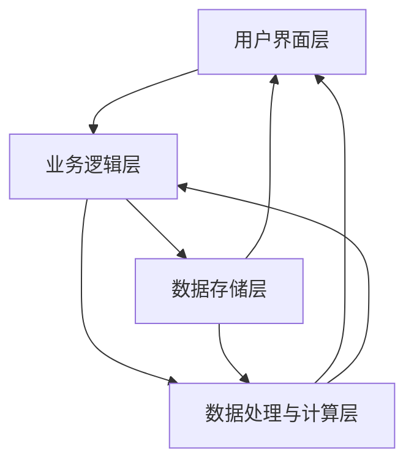
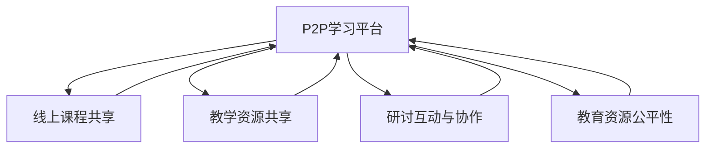
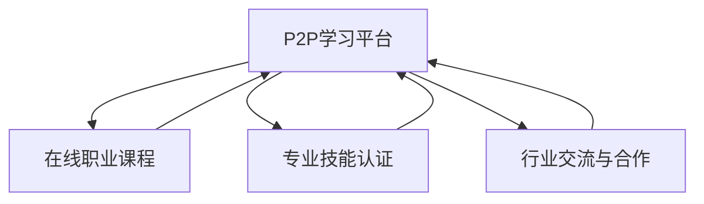

                 

### 引言与基础理论

#### 1.1 共享经济的起源与发展

共享经济，作为21世纪的一种新兴经济模式，其起源可以追溯到20世纪末。随着互联网技术的发展，人们开始探索如何更有效地利用闲置资源，从而实现资源的最大化利用和价值最大化。这一理念最早出现在美国，特别是硅谷。早期的共享经济案例包括共享办公室、共享停车空间和共享自行车等。

随着时间的推移，共享经济的概念逐渐成熟，并得到了广泛的认可和应用。如今，共享经济已成为全球范围内的一种重要经济模式，涵盖了从产品共享到服务共享，再到知识共享等多个领域。

#### 1.2 共享经济的特点与优势

共享经济具有以下几个显著特点：

1. **去中心化**：共享经济打破了传统中心化的经济模式，通过点对点的连接，使得资源分配更加灵活和高效。
2. **资源共享**：共享经济通过共享闲置资源，如房屋、汽车、知识等，实现了资源的高效利用。
3. **开放性**：共享经济平台通常具有开放性，用户可以自由地进入和退出平台，共享和获取资源。

共享经济的优势体现在以下几个方面：

1. **提高资源利用效率**：通过共享闲置资源，共享经济提高了资源的使用效率，减少了资源浪费。
2. **降低成本**：共享经济使得用户可以以更低的价格获取所需资源，降低了消费成本。
3. **促进社会公平**：共享经济使得资源分配更加公平，尤其是对于那些资源相对匮乏的人群。
4. **创新商业模式**：共享经济激发了新的商业模式，为创业者提供了广阔的市场机会。

#### 1.3 共享经济的分类与案例分析

共享经济根据共享的资源类型和形式，可以分为以下几类：

1. **产品共享**：如共享单车、共享汽车、共享住宿等，通过共享闲置的产品或服务，提高了资源利用效率。
2. **服务共享**：如共享办公、共享医疗、共享教育等，通过共享专业服务，提高了服务的质量和效率。
3. **知识共享**：如在线课程、知识付费、知识社区等，通过共享知识和信息，促进了知识的传播和普及。

以下是一些共享经济的成功案例分析：

1. **Uber**：Uber通过共享汽车服务，改变了传统的交通出行模式，实现了资源的最大化利用。
2. **Airbnb**：Airbnb通过共享住宿服务，为用户提供了一个便捷的住宿选择，同时也为房东带来了额外的收入。
3. **Coursera**：Coursera通过在线课程共享，为全球用户提供了优质的教育资源，推动了教育的普及和公平。

### Mermaid 流程图

通过上述分析，我们可以看到共享经济在各个领域的广泛应用，以及其带来的巨大变革和创新。接下来，我们将进一步探讨P2P学习平台的兴起及其对教育领域的深远影响。

#### 2.1 P2P学习平台的概念与运作机制

P2P（Peer-to-Peer）学习平台，又称为点对点学习平台，是一种基于去中心化网络架构的学习平台。在这种平台上，用户不仅可以作为学习者获取知识，还可以作为教育者分享知识。P2P学习平台的核心在于去中心化和开放性，使得知识共享更加高效和自由。

#### 概念

P2P学习平台的概念可以概括为以下几点：

- **去中心化**：在P2P学习平台上，没有中央控制节点，所有节点（用户）地位平等，共同维护平台的运行。
- **知识共享**：用户可以自由地上传课程内容、参与讨论和评价，实现知识的共享和传播。
- **去中心化存储**：平台通常使用分布式存储技术，如IPFS，将课程内容存储在多个节点上，确保数据的可靠性和安全性。
- **点对点通信**：节点之间通过点对点通信协议进行数据交换和同步，提高了系统的效率和容错性。

#### 运作机制

P2P学习平台的运作机制主要包括以下几个步骤：

1. **用户注册**：新用户需要注册账号，提供基本信息和身份验证，以确保平台的安全性和可靠性。
2. **课程上传**：用户可以上传自己的课程内容，包括视频、文档、PPT等，平台通常会对上传内容进行审核，确保其质量和合法性。
3. **课程发布**：审核通过的课程将被发布到平台上，用户可以浏览和下载这些课程。
4. **用户互动**：用户可以在平台上参与讨论、提问和回答问题，与其他用户进行互动。
5. **评价与反馈**：用户可以对课程进行评价和反馈，平台根据这些评价对课程进行排序和推荐，提高课程的质量和用户满意度。
6. **支付与结算**：部分课程可能需要付费，平台提供支付和结算功能，确保交易的顺利进行。

#### 优势

P2P学习平台相较于传统的教育模式，具有以下几个显著优势：

1. **资源丰富**：P2P学习平台上的课程资源来自全球各地的用户，涵盖了广泛的主题和领域，用户可以根据自己的需求和兴趣选择合适的课程。
2. **灵活性**：用户可以随时随地访问平台，自主安排学习时间，不受时间和地点的限制。
3. **低成本**：P2P学习平台通常提供免费或低成本的课程，降低了用户的学习成本，使得更多人能够负担得起高质量的教育。
4. **个性化**：通过用户行为分析和个性化推荐，平台可以提供个性化的学习体验，提高学习效果。
5. **去中心化**：P2P学习平台去除了中央控制节点，用户在平台上拥有更多的自主权和话语权，实现了真正的知识共享。

### 挑战

尽管P2P学习平台具有诸多优势，但在其发展过程中仍面临一些挑战：

1. **内容质量控制**：平台需要确保课程内容的质量和合法性，防止虚假信息和侵权内容的传播。
2. **用户隐私保护**：在去中心化的环境中，如何保护用户的隐私和数据安全是一个重要的问题。
3. **法律与监管**：P2P学习平台的发展需要遵守各国的法律法规，同时也需要监管机构的支持和指导。
4. **技术实现**：构建一个稳定、高效、安全的P2P学习平台需要解决许多技术难题，如数据同步、负载均衡、网络安全等。

### 发展现状与趋势

当前，P2P学习平台在全球范围内正迅速发展，涌现出许多成功的平台，如Coursera、edX、Udemy等。这些平台不仅吸引了大量的用户，也为教育行业带来了深刻的变革。

未来，P2P学习平台的发展将受到以下趋势的影响：

1. **技术进步**：随着人工智能、区块链、虚拟现实等新技术的不断进步，P2P学习平台将更加智能化、个性化，提供更高质量的学习体验。
2. **行业融合**：P2P学习平台将与更多行业进行融合，如医疗、金融、文化等，推动教育的跨界发展。
3. **全球扩张**：随着全球化的推进，P2P学习平台将不断拓展国际市场，为全球用户提供优质的教育资源和服务。
4. **教育模式创新**：P2P学习平台将推动教育模式的创新，如个性化学习、远程教育、混合式教育等，提高教育质量和效率。

总之，P2P学习平台的兴起为教育行业带来了新的机遇和挑战。通过不断创新和优化，P2P学习平台有望在未来成为教育领域的重要力量。

### Mermaid 流程图

通过以上分析，我们可以看到P2P学习平台的概念、运作机制及其优势和挑战。接下来，我们将进一步探讨P2P学习平台的核心技术，了解其实现原理和关键技术。

#### 3.1 分布式系统与区块链技术

分布式系统与区块链技术是P2P学习平台实现去中心化和高安全性的关键技术。这两项技术不仅为P2P学习平台提供了基础架构，还确保了数据的安全性和透明度。

##### 3.1.1 分布式系统的基本概念

**分布式系统**是由多个独立的计算机节点组成的系统，这些节点通过通信网络相互连接，协同工作以完成共同的任务。分布式系统的核心特点是去中心化和容错性。

**去中心化**：分布式系统没有单一的中央控制节点，所有节点地位平等，共同维护系统的运行。这种去中心化的架构使得系统更加健壮，不容易受到单点故障的影响。

**容错性**：分布式系统具有较高的容错性。当某个节点发生故障时，其他节点可以继续工作，确保系统的持续运行。这种容错性为P2P学习平台提供了可靠的数据存储和传输机制。

**特点**：

1. **高可用性**：分布式系统通过冗余设计和负载均衡，提高了系统的可用性和稳定性。
2. **可扩展性**：分布式系统可以轻松扩展，以适应不断增长的用户数量和业务需求。
3. **高可靠性**：分布式系统通过冗余备份和容错机制，确保数据的安全性和可靠性。

##### 3.1.2 区块链技术的原理与应用

区块链技术是一种分布式账本技术，通过加密算法和共识机制，确保数据的真实性和不可篡改性。区块链的核心思想是将数据分散存储在多个节点上，并通过密码学方法确保数据的安全性和一致性。

**原理**：

1. **数据存储**：区块链将数据分为小块，每个块包含一定数量的交易记录，并通过密码学方法加密。每个新产生的块都包含前一个块的哈希值，形成链式结构。
2. **链式结构**：区块链中的每个块都是通过哈希函数与前一个块链接在一起的，形成一个不可篡改的链式结构。这种链式结构确保了数据的完整性和一致性。
3. **共识机制**：区块链网络中的节点通过共识机制达成一致，确保数据的一致性和安全性。常见的共识机制包括工作量证明（PoW）、权益证明（PoS）等。

**应用**：

1. **数字货币**：区块链技术最早应用于数字货币（如比特币），通过去中心化的方式实现货币的发行和交易。
2. **智能合约**：区块链上的智能合约是一种自动执行、控制或记录法律事件和行动的计算机程序。智能合约通过代码定义了一套规则，当满足特定条件时，会自动执行相应的操作。
3. **数据共享**：区块链技术可以用于构建去中心化的数据共享平台，确保数据的真实性和安全性。
4. **供应链管理**：区块链技术可以提高供应链管理的透明度和效率，通过去中心化的方式记录和跟踪商品的生产、运输和销售过程。

##### 3.1.3 分布式存储与同步

在P2P学习平台中，分布式存储和同步技术是确保数据高可用性和可扩展性的关键。

**分布式存储**：

1. **数据分片**：将大数据集分割成多个小数据块，存储在分布式系统中的不同节点上。
2. **冗余备份**：在每个节点上存储多个数据副本，以提高数据的可靠性和容错性。
3. **数据复制**：在分布式系统中，数据会被复制到多个节点上，确保在一个节点发生故障时，其他节点仍然可以访问数据。

**数据同步**：

1. **增量同步**：只同步数据的变化部分，以提高同步效率。
2. **拉模式同步**：节点请求缺失的数据，从其他节点拉取。
3. **推模式同步**：节点主动推送其拥有但其他节点缺失的数据。

### 3.2 智能合约与共识机制

#### 3.2.1 智能合约的定义与作用

智能合约是一种自动执行、控制或记录法律事件和行动的计算机程序，其运行在区块链上。智能合约通过代码定义了一套规则，当满足特定条件时，会自动执行相应的操作。

**定义**：

- **智能合约**：智能合约是一种基于区块链的计算机程序，运行在分布式网络中，不受中央控制。
- **智能合约的基本结构**：智能合约通常包含触发条件、执行逻辑和结果输出三个部分。

**作用**：

1. **自动化交易**：智能合约可以自动执行交易，减少人工干预和错误。
2. **提高效率**：智能合约可以即时执行，无需等待中介机构的处理时间。
3. **增强安全性**：智能合约代码公开透明，可验证，减少欺诈和篡改的风险。

#### 3.2.2 共识机制的工作原理

共识机制是区块链网络中节点达成一致的方法，以确保区块链的状态是一致的。共识机制通过一系列算法和规则，确保分布式网络中的所有节点对数据的一致性和安全性达成共识。

**定义**：

- **共识机制**：共识机制是一种算法，用于在网络中的不同节点之间达成一致，以确保区块链的状态是一致的。
- **共识机制的目标**：确保区块链上的数据一致性、安全性、可扩展性。

**类型**：

1. **工作量证明（PoW）**：节点通过计算复杂的数学难题来获得记账权。
2. **权益证明（PoS）**：节点根据持有的代币数量和持币时间来获得记账权。
3. **委托权益证明（DPoS）**：节点通过投票选出代表，代表进行记账。

**工作原理**：

1. **PoW**：节点通过计算复杂的数学难题，最先解决难题的节点获得记账权。
2. **PoS**：节点根据持有的代币数量和持有时间来计算权益值，权益值高的节点获得记账权。
3. **DPoS**：用户投票选出代表，代表进行记账，代表的选择取决于用户投票的结果。

#### 3.2.3 用户身份验证与数据隐私保护

在P2P学习平台中，用户身份验证和数据隐私保护是确保平台安全性的重要环节。

**用户身份验证**：

- **密码学**：使用密码学算法（如哈希函数、非对称加密等）对用户身份进行验证。
- **数字签名**：使用数字签名技术对用户身份进行验证，确保信息的完整性和真实性。
- **多重身份验证**：结合多种验证方式，如密码+短信验证码、密码+指纹等，提高验证的安全性和可靠性。

**数据隐私保护**：

- **加密存储**：对用户数据使用加密算法进行存储，确保数据在存储过程中的安全。
- **访问控制**：通过设置访问权限，控制哪些用户可以访问特定的数据，防止数据泄露。
- **匿名化处理**：对用户数据进行匿名化处理，去除或隐藏能够识别用户身份的信息。
- **数据备份与恢复**：定期备份数据，并确保在数据丢失或损坏时能够快速恢复，减少对用户隐私的影响。

### 结论

分布式系统与区块链技术为P2P学习平台提供了坚实的基础。分布式系统通过去中心化和容错性确保了平台的高可用性和可扩展性；区块链技术通过智能合约和共识机制确保了数据的安全性和透明度。用户身份验证与数据隐私保护技术则为平台提供了必要的安全保障。通过这些关键技术的结合，P2P学习平台能够实现高效、安全的知识共享和传播，为全球教育行业带来深刻的变革。

### Mermaid 流程图

通过以上分析，我们可以看到分布式系统与区块链技术在P2P学习平台中的重要作用。接下来，我们将进一步探讨P2P学习平台的设计与架构，了解其具体实现和设计原则。

#### 4.1 平台架构的设计原则

P2P学习平台的架构设计需要考虑多个方面的原则，以确保平台的可扩展性、高可用性、安全性和易维护性。以下是平台架构设计的主要原则：

##### **可扩展性**

**重要性**：随着用户数量的增长和业务需求的扩展，平台架构必须能够适应这种变化，确保系统性能不会受到显著影响。

**实现方式**：
1. **水平扩展**：通过增加服务器节点来提升平台的处理能力。
2. **垂直扩展**：通过提升服务器的硬件配置（如增加CPU、内存等）来提高性能。
3. **分布式存储**：采用分布式存储方案，提高数据的读取速度和存储容量。

##### **高可用性**

**重要性**：平台需要能够提供持续的服务，即使在出现故障时也能迅速恢复，确保用户体验的连续性。

**实现方式**：
1. **冗余设计**：通过冗余设计和备份机制来减少系统故障的影响。
2. **故障转移**：实现故障转移机制，确保在主节点故障时，备用节点能够快速接管工作。
3. **负载均衡**：通过负载均衡技术，将请求分散到多个服务器上，避免单点故障。

##### **安全性**

**重要性**：平台需要保护用户数据和交易数据的安全，防止未经授权的访问和数据泄露。

**实现方式**：
1. **身份验证与授权**：使用多因素身份验证和细粒度的访问控制策略。
2. **加密传输**：使用HTTPS等加密协议来保护数据传输的安全性。
3. **安全审计**：定期进行安全审计，确保平台的安全策略和措施得到有效执行。

##### **易维护性**

**重要性**：平台架构需要便于维护和升级，以确保系统的稳定运行和持续优化。

**实现方式**：
1. **模块化设计**：将平台功能拆分为多个模块，便于开发和维护。
2. **日志管理**：记录详细的操作日志，便于在出现问题时进行追踪和调试。
3. **自动化运维**：采用自动化工具进行系统监控、故障处理和升级部署。

#### 4.2 平台架构的主要组件

P2P学习平台架构通常包括以下几个主要组件：

1. **用户界面层**：用户界面层负责处理用户与平台的交互，包括课程浏览、注册登录、课程评价等功能。
2. **业务逻辑层**：业务逻辑层负责处理平台的业务逻辑，包括课程管理、用户管理、交易处理等功能。
3. **数据存储层**：数据存储层负责存储和管理平台的数据，包括用户信息、课程信息、交易记录等。
4. **数据处理与计算层**：数据处理与计算层负责处理大数据和复杂的计算任务，如推荐算法、数据挖掘等。

##### **用户界面组件**

用户界面组件是平台与用户交互的窗口，负责呈现课程内容、用户信息等。以下是用户界面组件的关键要素：

1. **前端开发框架**：选择合适的Web前端开发框架（如React、Vue.js、Angular等），构建用户友好的界面。
2. **响应式设计**：确保平台在不同设备（如桌面、移动端）上都能提供良好的用户体验。
3. **API接口**：提供RESTful API接口，用于处理前端与后端的交互。

##### **数据存储与处理组件**

数据存储与处理组件负责存储和管理平台的数据，以及处理用户请求和任务。以下是数据存储与处理组件的关键要素：

1. **关系型数据库**：使用关系型数据库（如MySQL、PostgreSQL等）存储用户信息、课程信息等结构化数据。
2. **NoSQL数据库**：使用NoSQL数据库（如MongoDB、Cassandra等）存储非结构化数据，如日志、缓存等。
3. **分布式存储**：使用分布式存储系统（如HDFS、Cassandra等）存储大规模数据。

##### **通信与同步组件**

通信与同步组件负责处理节点间的通信和数据同步。以下是通信与同步组件的关键要素：

1. **消息队列**：使用消息队列（如RabbitMQ、Kafka等）处理分布式系统中的消息传递。
2. **分布式锁**：用于确保数据的一致性和同步。

##### **平台安全设计**

平台安全设计是确保平台数据和用户信息安全的关键。以下是平台安全设计的关键要素：

1. **身份验证与授权**：通过严格的身份验证和授权机制，确保只有合法用户才能访问系统资源。
2. **数据加密**：对存储和传输的数据进行加密，防止数据泄露。
3. **网络隔离**：通过防火墙、入侵检测系统等网络隔离措施，防止外部攻击。
4. **安全审计**：定期进行安全审计，确保平台的安全策略和措施得到有效执行。

### 结论

P2P学习平台的架构设计需要综合考虑可扩展性、高可用性、安全性和易维护性等原则。通过合理的架构设计，平台能够高效、安全地运行，为用户提供优质的服务。接下来，我们将探讨P2P学习平台在教育领域中的应用，以及具体的案例分析。

### Mermaid 流程图

通过以上分析，我们可以看到P2P学习平台的架构设计原则和主要组件。接下来，我们将深入探讨P2P学习平台在教育领域中的应用，以及其在职业培训与技能提升方面的具体案例。

#### 5.1 P2P学习平台在教育中的应用

P2P学习平台在教育领域的应用正日益扩大，它不仅为传统教育模式带来了革新，也为全球范围内的教育资源共享和传播提供了新的可能性。

##### **5.1.1 线上课程共享**

线上课程共享是P2P学习平台最为核心的功能之一。它允许教育者将自己的课程内容上传到平台上，供其他用户免费或付费学习。以下是线上课程共享的具体应用：

1. **课程内容上传**：教育者可以上传自己的课程内容，包括视频讲座、PPT、文档等，平台通常会对上传内容进行审核，确保其质量和合法性。
2. **课程分类与标签**：平台会对课程进行分类和标签管理，便于用户根据兴趣和需求进行查找。
3. **课程发布**：审核通过的课程将被发布到平台上，用户可以浏览和下载这些课程。
4. **课程评价与反馈**：用户可以对课程进行评价和反馈，平台根据这些评价对课程进行排序和推荐，提高课程的质量和用户满意度。
5. **互动与讨论**：平台通常提供互动功能和讨论区，用户可以在课程学习过程中与其他用户进行交流和讨论，分享学习心得。

##### **5.1.2 教学资源共享**

教学资源共享是P2P学习平台为教师提供的重要功能。它允许教师分享自己的教学资源，如课件、教案、教学视频等，其他教师和学生可以下载和使用这些资源。以下是教学资源共享的具体应用：

1. **资源上传**：教师可以将自己的教学资源上传到平台上，供其他教师和学生使用。
2. **资源分类**：平台会对教学资源进行分类，便于教师和学生查找和使用。
3. **资源共享社区**：平台可以提供一个资源共享社区，教师可以在社区中分享和获取教学资源，促进教学经验的交流。
4. **资源评价**：平台可以提供资源评价机制，用户可以对资源进行评价，平台根据评价对资源进行推荐。

##### **5.1.3 研讨互动与协作**

研讨互动与协作功能是P2P学习平台为用户提供的交流平台。它允许用户在平台上进行在线讨论、问答、协作等互动活动，提高学习效果和知识共享。以下是研讨互动与协作的具体应用：

1. **讨论区**：平台提供讨论区，用户可以在讨论区发布话题，与其他用户进行讨论。
2. **问答功能**：平台提供问答功能，用户可以提问，其他用户可以回答。
3. **项目协作**：平台提供项目协作功能，用户可以一起完成项目，进行实时沟通和协作。
4. **在线会议**：平台提供在线会议功能，用户可以参加在线会议，进行实时交流。

##### **5.1.4 教育资源的公平性**

P2P学习平台在教育资源的公平性方面具有显著的优势。以下是P2P学习平台如何促进教育资源的公平性：

1. **打破地域限制**：P2P学习平台不受地域限制，用户可以随时随地学习，促进了教育资源的普及。
2. **降低教育成本**：通过共享优质教育资源，P2P学习平台降低了用户的学习成本，使得更多人能够负担得起高质量的教育。
3. **开放性**：P2P学习平台通常具有开放性，用户可以自由地进入和退出平台，共享和获取资源。
4. **个性化**：P2P学习平台可以根据用户的需求和兴趣，提供个性化的学习路径和推荐，提高学习效果。

### 案例分析：知名P2P学习平台介绍

以下是几个知名P2P学习平台的介绍，这些平台在教育领域中发挥了重要作用。

1. **Coursera**

Coursera是由斯坦福大学两位计算机科学家于2012年创立的在线学习平台，提供来自全球顶级大学的课程。用户可以免费学习，也可以选择付费证书。Coursera的课程涵盖了多个领域，包括计算机科学、数据科学、人文科学等。

- **课程共享**：Coursera提供大量优质课程，用户可以免费学习，部分课程提供付费证书。
- **教学资源共享**：教师可以上传课件、教案等资源，学生可以下载使用。
- **研讨互动与协作**：平台提供讨论区、问答功能，学生可以相互交流、讨论课程内容。

2. **edX**

edX是由哈佛大学和麻省理工学院共同创办的非营利在线学习平台，提供来自世界顶级大学的课程。edX的课程包括大学课程、在线专业证书、微专业等。

- **课程共享**：edX提供大量免费课程，用户可以通过课程学习提升自己的知识和技能。
- **教学资源共享**：教师可以上传课件、视频等教学资源，学生可以下载使用。
- **研讨互动与协作**：平台提供讨论区、作业提交、实时交流等功能，促进学习互动。

3. **Udemy**

Udemy是一个在线学习平台，提供广泛的职业技能课程，如编程、设计、语言学习等。用户可以通过学习提升自己的职业技能。

- **在线职业课程**：Udemy提供多种职业技能课程，用户可以通过学习提升自己的专业知识和技能。
- **专业技能认证**：平台提供与认证机构合作的专业技能认证考试，用户可以通过认证提升职业竞争力。
- **行业交流与合作**：平台提供职业交流社区，用户可以分享经验和知识，拓展职业人脉。

综上所述，P2P学习平台在教育领域中的应用具有广泛的前景和显著的优势。通过线上课程共享、教学资源共享、研讨互动与协作等功能，P2P学习平台不仅提高了教育资源的公平性和可及性，也为教育模式的创新提供了新的可能性。

### Mermaid 流程图

通过以上分析，我们可以看到P2P学习平台在教育领域中的广泛应用和重要性。接下来，我们将探讨P2P学习平台在职业培训与技能提升方面的应用，以及具体的成功案例。

#### 6.1 P2P学习平台在职业培训中的应用

职业培训是P2P学习平台的重要应用领域之一。随着职场竞争的加剧和技能要求的不断提高，职业培训成为个人和企业的必要需求。P2P学习平台通过提供丰富的在线课程和灵活的学习模式，满足了职业培训的需求，提高了职业培训和技能提升的效率。

##### **6.1.1 在线职业课程**

在线职业课程是P2P学习平台为职业培训提供的核心服务之一。以下是P2P学习平台在在线职业课程方面的具体应用：

1. **课程内容丰富**：P2P学习平台提供了涵盖多个职业领域的在线课程，如编程、项目管理、市场营销、人力资源等，用户可以根据自己的职业需求选择合适的课程。
2. **课程更新及时**：平台会定期更新课程内容，确保用户学习到的知识和技能是最新的，紧跟行业发展趋势。
3. **互动学习模式**：平台提供了互动学习模式，用户可以与讲师和其他学员进行实时交流，解决学习过程中遇到的问题，提高学习效果。
4. **证书认证**：部分在线职业课程提供证书认证，用户完成课程学习并考核通过后，可以获得相应的证书，提高职业竞争力。

##### **6.1.2 专业技能认证**

专业技能认证是P2P学习平台在职业培训中的另一个重要功能。通过专业技能认证，用户可以验证自己的专业能力和技术水平。以下是专业技能认证的具体应用：

1. **认证考试**：P2P学习平台与认证机构合作，提供各类专业技能认证考试，用户可以在平台上报名参加考试。
2. **认证标准**：平台根据行业标准和认证机构的要求，制定严格的认证标准，确保认证结果的权威性和可靠性。
3. **证书发放**：用户通过认证考试后，平台会发放相应的证书，用户可以在平台上查询和下载证书，提高职业竞争力。
4. **认证更新**：随着技能要求的不断提高，平台会定期更新认证内容，确保用户的专业技能始终符合行业需求。

##### **6.1.3 行业交流与合作**

行业交流与合作是P2P学习平台为职业培训提供的重要增值服务。通过行业交流与合作，用户可以拓展职业人脉，获取行业信息，提高职业发展机会。以下是行业交流与合作的具体应用：

1. **交流论坛**：平台提供了交流论坛，用户可以在论坛中发布话题，与其他用户进行交流，分享经验和心得。
2. **在线会议**：平台提供了在线会议功能，用户可以参加行业会议，与同行进行实时交流。
3. **项目合作**：平台提供了项目合作机会，用户可以参与项目合作，共同完成项目任务，拓展职业经验。
4. **职业指导**：平台提供了职业指导服务，为用户提供职业规划、求职技巧等指导，帮助用户更好地发展职业生涯。

### 案例分析：职业P2P学习平台成功案例

以下是几个职业P2P学习平台的成功案例，这些平台在职业培训与技能提升方面取得了显著的成果。

1. **LinkedIn Learning**

LinkedIn Learning是一个职业学习平台，提供广泛的职业技能课程，如市场营销、项目管理、软件开发等。LinkedIn Learning的成功主要得益于以下几个方面：

- **课程内容丰富**：平台提供了涵盖多个职业领域的在线课程，满足不同用户的需求。
- **互动学习模式**：平台提供了互动学习模式，用户可以与讲师和其他学员进行实时交流，提高学习效果。
- **行业交流与合作**：平台提供了职业交流社区，用户可以拓展职业人脉，获取行业信息。
- **认证服务**：平台提供了与认证机构合作的专业技能认证考试，用户可以通过认证提高职业竞争力。

2. **Udemy**

Udemy是一个在线学习平台，提供广泛的职业技能课程，如编程、设计、语言学习等。Udemy的成功主要得益于以下几个方面：

- **课程多样化**：平台提供了多种类型的课程，满足不同用户的需求。
- **灵活学习**：用户可以根据自己的时间和进度进行学习，提高了学习的灵活性。
- **行业交流与合作**：平台提供了职业交流社区，用户可以拓展职业人脉，获取行业信息。
- **职业指导**：平台提供了职业指导服务，为用户提供职业规划、求职技巧等指导。

3. **Pluralsight**

Pluralsight是一个专注于IT技能提升的在线学习平台，提供丰富的编程、数据科学、网络安全等课程。Pluralsight的成功主要得益于以下几个方面：

- **课程质量高**：平台提供了高质量的在线课程，确保用户能够学到实用的技能。
- **个性化学习**：平台提供了个性化学习功能，根据用户的学习情况和需求，推荐合适的课程。
- **认证服务**：平台提供了与认证机构合作的专业技能认证考试，用户可以通过认证提高职业竞争力。
- **行业交流与合作**：平台提供了职业交流社区，用户可以拓展职业人脉，获取行业信息。

综上所述，P2P学习平台在职业培训与技能提升方面具有广泛的应用前景和成功案例。通过在线职业课程、专业技能认证和行业交流与合作等功能，P2P学习平台为用户提供了丰富的学习资源和职业发展机会，提高了职业培训和技能提升的效率。

### Mermaid 流程图

通过以上分析，我们可以看到P2P学习平台在职业培训与技能提升方面的广泛应用和成功案例。接下来，我们将探讨P2P学习平台的社会效益与未来展望，以及其在提升教育资源公平性、促进知识共享与传播、创新教育模式与教学方式等方面的贡献。

### 7.1 P2P学习平台的社会效益

P2P学习平台在社会效益方面具有显著的贡献，尤其是在提升教育资源公平性、促进知识共享与传播、创新教育模式与教学方式等方面。

##### **提升教育资源公平性**

1. **打破地域限制**：P2P学习平台不受地域限制，用户可以随时随地学习，不受地理位置的限制。这为偏远地区和经济欠发达地区的学生提供了获取优质教育资源的机会，打破了教育资源的地域壁垒。
2. **降低教育成本**：P2P学习平台通常提供免费或低成本的课程，降低了用户的学习成本。这不仅使得更多学生能够负担得起高质量的教育，也减少了教育负担，提高了教育的可及性。
3. **平等获取知识**：P2P学习平台提供开放、共享的教育资源，使得所有用户，无论背景、经济状况，都可以平等地获取知识和技能。这有助于缩小教育差距，促进教育公平。

##### **促进知识共享与传播**

1. **

