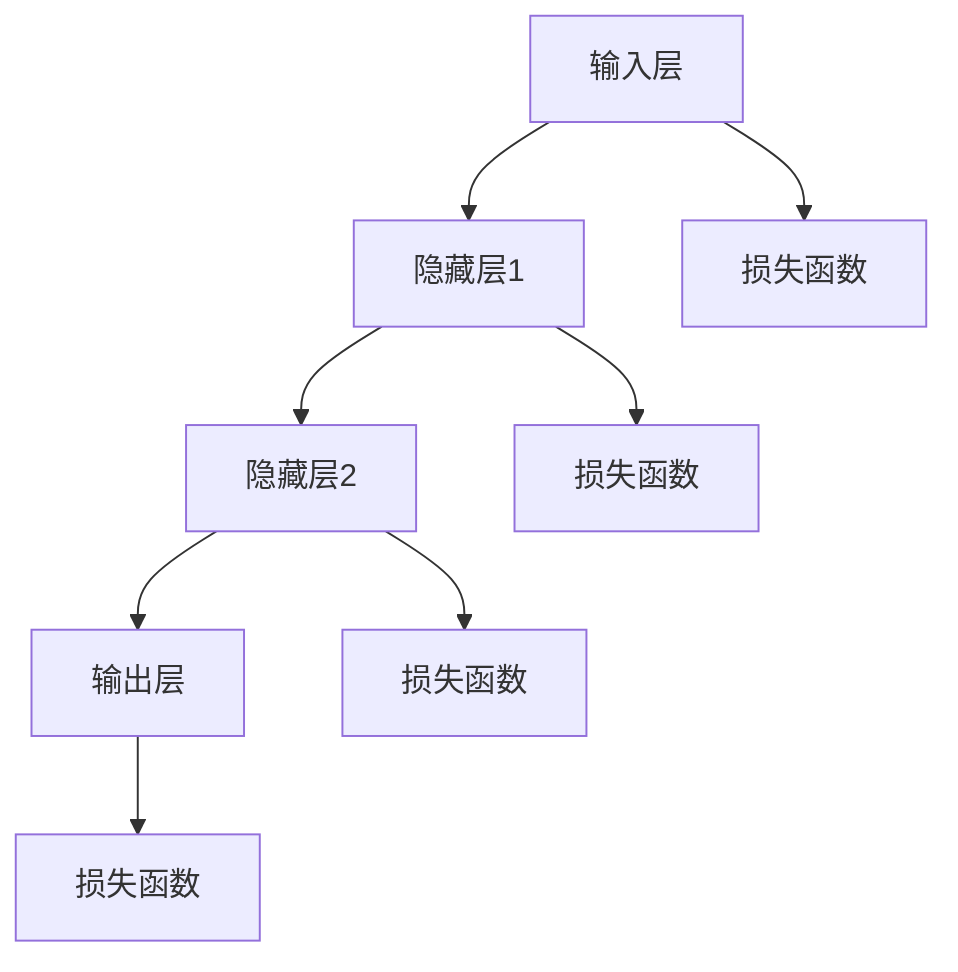
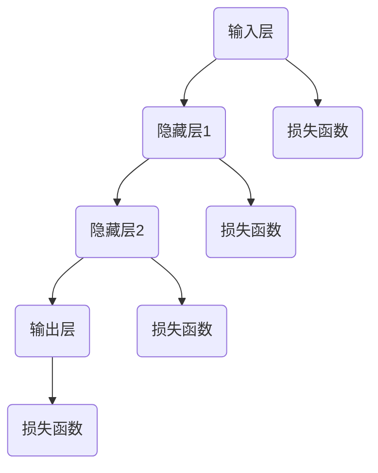

                 

# 《神经网络原理与代码实例讲解》

## 关键词：
神经网络、深度学习、激活函数、反向传播、优化算法、代码实例

## 摘要：
本文将深入讲解神经网络的原理，包括其数学基础、结构设计、训练过程和优化算法。通过详细的伪代码、数学公式和实际代码示例，帮助读者全面理解神经网络的运作机制，并掌握实际应用技能。

---

### 《神经网络原理与代码实例讲解》目录大纲

1. **第一部分：神经网络基础**

2. **第二部分：神经网络数学基础**

3. **第三部分：前馈神经网络原理**

4. **第四部分：优化算法**

5. **第五部分：深度神经网络**

6. **第六部分：卷积神经网络**

7. **第七部分：循环神经网络**

8. **第八部分：生成对抗网络**

9. **第九部分：神经网络的实现**

    - **9.1 神经网络框架**

    - **9.2 数据预处理**

    - **9.3 神经网络训练流程**

    - **9.4 项目实战**

10. **附录：神经网络相关资源**

### 第一部分：神经网络基础

**第1章：神经网络简介**

**第2章：神经网络数学基础**

**第3章：前馈神经网络原理**

### 第二部分：神经网络数学基础

**第4章：概率论基础**

**第5章：线性代数基础**

### 第三部分：前馈神经网络原理

**第6章：前馈神经网络基本结构**

**第7章：激活函数**

**第8章：前馈神经网络训练**

### 第四部分：优化算法

**第9章：梯度下降法**

**第10章：动量法**

**第11章：RMSprop**

**第12章：Adam**

### 第五部分：深度神经网络

**第13章：深度神经网络的优势**

**第14章：深度神经网络的结构**

**第15章：深度神经网络的训练策略**

### 第六部分：卷积神经网络

**第16章：卷积神经网络简介**

**第17章：卷积神经网络原理**

**第18章：卷积神经网络的训练**

**第19章：卷积神经网络的应用**

### 第七部分：循环神经网络

**第20章：循环神经网络简介**

**第21章：循环神经网络原理**

**第22章：LSTM网络**

**第23章：GRU网络**

### 第八部分：生成对抗网络

**第24章：生成对抗网络简介**

**第25章：生成对抗网络原理**

**第26章：生成对抗网络的应用**

### 第九部分：神经网络的实现

**第27章：神经网络框架**

**第28章：数据预处理**

**第29章：神经网络训练流程**

**第30章：项目实战**

### 附录：神经网络相关资源

**A.1 神经网络开源框架**

**A.2 神经网络教程**

**A.3 神经网络论文**

**A.4 神经网络社区**

**A.5 神经网络课程**

### 核心概念与联系：神经网络架构的 Mermaid 流程图



---

### 核心概念与联系：神经网络架构的 Mermaid 流程图



该流程图展示了神经网络的基本架构，包括输入层、隐藏层和输出层。每个层通过激活函数和权重连接，并在训练过程中使用损失函数来评估模型的性能。这样的架构使得神经网络能够学习复杂的非线性关系。

---

### **第1章：神经网络简介**

### 1.1 神经网络的概念

神经网络（Neural Networks）是模仿人脑神经元连接和相互作用原理构建的计算模型。每个神经元（或节点）代表一个简单的计算单元，多个神经元通过加权连接构成一个网络。神经网络的目的是通过学习和模拟人脑的思维方式，解决复杂的模式识别和预测问题。

### 1.2 神经网络的发展历史

神经网络的研究始于1943年，由心理学家McCulloch和数学家Pitts提出神经元的计算模型。此后，神经网络经历了多次起伏。1986年，Rumelhart, Hinton和Williams提出了反向传播算法，使得神经网络训练变得可行。近年来，随着计算机性能的提升和大数据的普及，神经网络在图像识别、自然语言处理、语音识别等领域取得了突破性进展。

### 1.3 神经网络的应用领域

神经网络广泛应用于各个领域，包括但不限于：

- **图像识别**：例如人脸识别、物体检测等。
- **自然语言处理**：例如机器翻译、情感分析等。
- **语音识别**：将语音信号转换为文本或命令。
- **推荐系统**：根据用户历史行为推荐商品或服务。
- **游戏AI**：例如围棋、国际象棋等。
- **控制领域**：例如自动驾驶、机器人控制等。

### 1.4 神经网络的分类

神经网络根据结构和功能可以分为以下几类：

- **前馈神经网络**：数据流从输入层流向输出层，没有循环。
- **循环神经网络**（RNN）：包含循环结构，适合处理序列数据。
- **卷积神经网络**（CNN）：利用卷积操作提取图像特征。
- **生成对抗网络**（GAN）：由两个神经网络（生成器和判别器）对抗训练。
- **深度神经网络**：多层前馈神经网络，能够学习更复杂的特征。

---

### **第2章：神经网络数学基础**

### 2.1 概率论基础

概率论是神经网络的核心组成部分。以下是一些基本概念：

#### 2.1.1 概率的基本概念

概率表示事件发生的可能性。设\(A\)为某一事件，\(S\)为样本空间，则事件\(A\)的概率\(P(A)\)定义为：

\[ P(A) = \frac{N(A)}{N(S)} \]

其中，\(N(A)\)为事件\(A\)发生的次数，\(N(S)\)为样本空间\(S\)的总次数。

#### 2.1.2 条件概率

条件概率描述在某一事件\(B\)发生的条件下，事件\(A\)发生的概率。记为\(P(A|B)\)，定义为：

\[ P(A|B) = \frac{P(A \cap B)}{P(B)} \]

其中，\(P(A \cap B)\)为事件\(A\)和事件\(B\)同时发生的概率，\(P(B)\)为事件\(B\)发生的概率。

#### 2.1.3 贝叶斯定理

贝叶斯定理是条件概率的一种推广，用于计算后验概率。其公式为：

\[ P(A|B) = \frac{P(B|A)P(A)}{P(B)} \]

其中，\(P(B|A)\)为在事件\(A\)发生的条件下事件\(B\)发生的概率，\(P(A)\)为事件\(A\)发生的概率，\(P(B)\)为事件\(B\)发生的概率。

### 2.2 线性代数基础

线性代数是神经网络数学基础的重要组成部分。以下是一些基本概念：

#### 2.2.1 矩阵与向量

矩阵（Matrix）是一个由数字组成的二维数组，通常用\(A\)表示。矩阵的行数称为行数，列数称为列数。

向量（Vector）是一个由数字组成的一维数组，通常用\(\mathbf{v}\)表示。

#### 2.2.2 矩阵运算

矩阵运算包括矩阵加法、矩阵减法、矩阵乘法、矩阵求逆等。

- **矩阵加法**：两个矩阵相加，要求矩阵的行数和列数相等。

  \[ A + B = \begin{bmatrix}
  a_{11} + b_{11} & a_{12} + b_{12} \\
  a_{21} + b_{21} & a_{22} + b_{22}
  \end{bmatrix} \]

- **矩阵减法**：两个矩阵相减，要求矩阵的行数和列数相等。

  \[ A - B = \begin{bmatrix}
  a_{11} - b_{11} & a_{12} - b_{12} \\
  a_{21} - b_{21} & a_{22} - b_{22}
  \end{bmatrix} \]

- **矩阵乘法**：两个矩阵相乘，要求第一个矩阵的列数等于第二个矩阵的行数。

  \[ AB = \begin{bmatrix}
  c_{11} & c_{12} \\
  c_{21} & c_{22}
  \end{bmatrix} \]

  其中，

  \[ c_{11} = a_{11}b_{11} + a_{12}b_{21} \]
  \[ c_{12} = a_{11}b_{12} + a_{12}b_{22} \]
  \[ c_{21} = a_{21}b_{11} + a_{22}b_{21} \]
  \[ c_{22} = a_{21}b_{12} + a_{22}b_{22} \]

- **矩阵求逆**：一个方阵\(A\)的逆矩阵\(A^{-1}\)满足\(AA^{-1} = A^{-1}A = I\)，其中\(I\)是单位矩阵。

  \[ A^{-1} = \frac{1}{\det(A)} \text{adj}(A) \]

  其中，\(\det(A)\)是矩阵\(A\)的行列式，\(\text{adj}(A)\)是矩阵\(A\)的伴随矩阵。

#### 2.2.3 矩阵求导

矩阵求导是神经网络训练过程中的重要操作。以下是一个简单例子：

设矩阵\(A\)和\(B\)为：

\[ A = \begin{bmatrix}
  a_{11} & a_{12} \\
  a_{21} & a_{22}
\end{bmatrix} \]

\[ B = \begin{bmatrix}
  b_{11} & b_{12} \\
  b_{21} & b_{22}
\end{bmatrix} \]

矩阵\(A\)关于矩阵\(B\)的导数（记为\(\frac{\partial A}{\partial B}\)）为：

\[ \frac{\partial A}{\partial B} = \begin{bmatrix}
  \frac{\partial a_{11}}{\partial b_{11}} & \frac{\partial a_{11}}{\partial b_{12}} \\
  \frac{\partial a_{21}}{\partial b_{21}} & \frac{\partial a_{21}}{\partial b_{22}}
\end{bmatrix} \]

其中，\(\frac{\partial a_{11}}{\partial b_{11}}\)等表示相应元素的导数。

---

### **第3章：前馈神经网络原理**

前馈神经网络（Feedforward Neural Networks，FNN）是神经网络中最基本的类型，其特点是数据从输入层直接流向输出层，中间经过若干隐藏层，没有循环结构。本节将详细介绍前馈神经网络的原理。

#### 3.1 前馈神经网络基本结构

前馈神经网络由多个层次组成，包括输入层、隐藏层和输出层。每层包含多个神经元，神经元之间通过加权连接。数据流从输入层开始，依次通过隐藏层，最后到达输出层。

- **输入层**：接收外部输入数据。
- **隐藏层**：对输入数据进行加工和转换，隐藏层可以有多个。
- **输出层**：产生最终输出。

下面是一个简单的三层前馈神经网络的例子：


#### 3.2 激活函数

激活函数（Activation Function）是前馈神经网络中的关键组成部分。激活函数用于引入非线性因素，使得神经网络能够模拟更复杂的函数关系。常见的激活函数包括：

- **Sigmoid函数**：
  \[ \sigma(x) = \frac{1}{1 + e^{-x}} \]
  Sigmoid函数将输入值映射到\[0, 1\]区间。

- **ReLU函数**：
  \[ \text{ReLU}(x) = \max(0, x) \]
 ReLU函数将负输入值映射为0，正输入值保持不变。

- **Tanh函数**：
  \[ \tanh(x) = \frac{e^x - e^{-x}}{e^x + e^{-x}} \]
  Tanh函数将输入值映射到\[-1, 1\]区间。

激活函数的选择对神经网络性能有重要影响。Sigmoid函数在训练过程中容易导致梯度消失问题，而ReLU函数则能有效解决这一问题，并且计算速度更快。

#### 3.3 前馈神经网络训练

前馈神经网络的训练过程通常采用反向传播算法（Backpropagation Algorithm）。反向传播算法是一种基于梯度下降的优化方法，用于调整网络中的权重和偏置，以最小化损失函数。

反向传播算法分为两个阶段：前向传播和反向传播。

- **前向传播**：将输入数据传递到网络中，计算每个神经元的输出值。
- **反向传播**：计算损失函数对每个权重的梯度，并根据梯度调整权重和偏置。

下面是一个简单的反向传播算法的伪代码：

```python
for each epoch:
    for each training example (x, y):
        # 前向传播
        outputs = forward_pass(x)

        # 计算损失
        loss = compute_loss(outputs, y)

        # 反向传播
        dLoss_dOutput = compute_gradient(outputs, y)
        dOutput_dInput = compute_derivative(outputs)
        dInput_dWeight = compute_derivative(x)

        # 更新权重和偏置
        for layer in reversed(network.layers):
            for neuron in layer.neurons:
                dLoss_dWeight[neuron] = dLoss_dOutput[neuron] * dOutput_dInput[neuron]
                dLoss_dBias[neuron] = dLoss_dOutput[neuron] * dInput_dBias[neuron]

                neuron.weight -= learning_rate * dLoss_dWeight[neuron]
                neuron.bias -= learning_rate * dLoss_dBias[neuron]

        # 打印损失值
        print("Epoch", epoch, "Loss:", loss)
```

在上面的伪代码中，`forward_pass`函数实现前向传播过程，`compute_loss`函数计算损失值，`compute_gradient`函数计算梯度，`compute_derivative`函数计算导数。`learning_rate`为学习率，用于控制权重的更新速度。

---

### **第4章：优化算法**

优化算法在神经网络的训练过程中起着至关重要的作用。它们用于调整网络中的权重和偏置，以最小化损失函数。本节将介绍几种常用的优化算法，包括梯度下降法、动量法、RMSprop和Adam。

#### 4.1 梯度下降法

梯度下降法（Gradient Descent）是最基本的优化算法，其基本思想是沿着损失函数的梯度方向更新权重和偏置。梯度下降法分为批量梯度下降（Batch Gradient Descent）、随机梯度下降（Stochastic Gradient Descent，SGD）和小批量梯度下降（Mini-batch Gradient Descent）。

- **批量梯度下降**：在每个训练批次上计算梯度，并更新所有权重和偏置。

  \[ \theta = \theta - \alpha \frac{\partial J}{\partial \theta} \]

  其中，\(\theta\)表示权重和偏置的参数集合，\(J\)表示损失函数，\(\alpha\)为学习率。

- **随机梯度下降**：对每个训练样本分别计算梯度，并更新权重和偏置。

  \[ \theta = \theta - \alpha \frac{\partial J}{\partial \theta} \]

  随机梯度下降的计算速度较快，但可能引起训练过程的震荡。

- **小批量梯度下降**：在每个小批量上计算梯度，并更新权重和偏置。

  \[ \theta = \theta - \alpha \frac{1}{m} \sum_{i=1}^{m} \frac{\partial J}{\partial \theta} \]

  其中，\(m\)表示批量大小。

#### 4.2 动量法

动量法（Momentum）是梯度下降法的一种改进，通过引入动量项，使得权重和偏置的更新速度更加稳定。动量法的基本思想是将当前梯度与之前的梯度进行加权平均。

\[ \theta = \theta - \alpha \frac{\partial J}{\partial \theta} + \beta \frac{\partial J}{\partial \theta}_{prev} \]

其中，\(\beta\)为动量项，通常取值在\[0, 1\)之间。

#### 4.3 RMSprop

RMSprop（Root Mean Square Propagation）是一种基于梯度平方的优化算法，它通过考虑梯度平方的历史信息，调整学习率。RMSprop的基本思想是使用指数衰减平均计算梯度平方的均值。

\[ \rho(t) = \rho(t-1) + (\frac{\partial J}{\partial \theta}(t))^2 \]

\[ \theta(t) = \theta(t-1) - \alpha \frac{\frac{\partial J}{\partial \theta}(t)}{\sqrt{\rho(t)}} \]

其中，\(\rho(t)\)表示梯度平方的均值，\(\alpha\)为学习率。

#### 4.4 Adam

Adam（Adaptive Moment Estimation）是一种基于一阶和二阶矩估计的优化算法。Adam结合了AdaGrad和RMSprop的优点，能够自适应地调整学习率。

\[ m(t) = \beta_1 m(t-1) + (1 - \beta_1) \frac{\partial J}{\partial \theta}(t) \]

\[ v(t) = \beta_2 v(t-1) + (1 - \beta_2) \left(\frac{\partial J}{\partial \theta}(t)\right)^2 \]

\[ \theta(t) = \theta(t-1) - \alpha \frac{m(t)}{\sqrt{v(t)} + \epsilon} \]

其中，\(m(t)\)和\(v(t)\)分别表示一阶和二阶矩估计，\(\beta_1\)和\(\beta_2\)为动量项，\(\alpha\)为学习率，\(\epsilon\)为常数，用于防止分母为零。

---

### **第5章：深度神经网络**

深度神经网络（Deep Neural Networks，DNN）是具有多个隐藏层的神经网络。与单层神经网络相比，深度神经网络能够学习更复杂的特征表示，从而在图像识别、语音识别和自然语言处理等领域取得显著的效果。本节将介绍深度神经网络的优势、结构设计和训练策略。

#### 5.1 深度神经网络的优势

- **特征自动提取**：深度神经网络能够自动提取层次化的特征表示，从原始数据中提取有意义的特征。
- **非线性变换**：通过多层非线性变换，深度神经网络能够学习复杂的函数关系。
- **多尺度特征学习**：深度神经网络能够同时学习不同尺度的特征，从而更好地捕捉数据的细节信息。
- **鲁棒性**：深度神经网络具有较强的鲁棒性，能够适应不同类型的数据分布。

#### 5.2 深度神经网络的结构设计

深度神经网络的结构设计包括层数、神经元数量和连接方式。

- **层数**：深度神经网络通常包含多个隐藏层，层数越多，模型的能力越强。然而，层数过多可能会导致过拟合和计算成本增加。
- **神经元数量**：隐藏层中的神经元数量应根据问题的复杂程度进行调整。过多的神经元可能会导致过拟合，而过少的神经元则可能无法捕捉到足够的特征。
- **连接方式**：深度神经网络中的神经元通过全连接方式连接，即每个神经元都与前一层的所有神经元相连。

下面是一个简单的三层深度神经网络的结构示意图：


#### 5.3 深度神经网络的训练策略

训练深度神经网络是一项挑战性任务，需要采取一些策略来提高训练效率和模型性能。

- **数据预处理**：对训练数据进行预处理，包括归一化、标准化和去除噪声等，以提高模型的泛化能力。
- **批量大小**：选择合适的批量大小，批量大小越小，训练过程越稳定，但计算成本越高。
- **学习率调度**：采用学习率调度策略，逐步减小学习率，以提高模型收敛速度和稳定性。
- **正则化**：引入正则化技术，如L1正则化、L2正则化和dropout，防止过拟合。
- **批归一化**：在训练过程中对批量数据进行归一化处理，以提高模型训练速度和稳定性。

通过上述策略，深度神经网络能够有效地学习复杂的特征表示，并在各种任务中取得优异的性能。

---

### **第6章：卷积神经网络**

卷积神经网络（Convolutional Neural Networks，CNN）是一种特殊的前馈神经网络，专门用于处理图像数据。与传统的神经网络相比，CNN具有结构上的优势，能够自动提取图像中的局部特征。本节将介绍卷积神经网络的基本概念、原理和应用。

#### 6.1 卷积神经网络简介

卷积神经网络由多个卷积层、池化层和全连接层组成。卷积层负责提取图像特征，池化层用于减小特征图的尺寸，全连接层用于分类。

- **卷积层**：卷积层通过卷积操作提取图像特征。卷积操作使用一个卷积核（也称为滤波器）在图像上滑动，计算每个位置的特征图。卷积层的输出为多个特征图，每个特征图代表了一种特征。
- **池化层**：池化层用于减小特征图的尺寸，同时保留重要的特征信息。常见的池化操作包括最大池化和平均池化。
- **全连接层**：全连接层将卷积层和池化层输出的特征图展平为一维向量，然后通过全连接层进行分类。

下面是一个简单的卷积神经网络的结构示意图：


#### 6.2 卷积神经网络原理

卷积神经网络的工作原理包括以下几个步骤：

1. **输入层**：输入一张图像。
2. **卷积层**：使用卷积核对输入图像进行卷积操作，提取图像特征。每个卷积核学习一种特征，例如边缘、纹理等。
3. **激活函数**：对卷积层的输出进行非线性变换，常用的激活函数有ReLU函数。
4. **池化层**：对卷积层的输出进行池化操作，减小特征图的尺寸，同时保留重要的特征信息。
5. **全连接层**：将池化层的输出展平为一维向量，然后通过全连接层进行分类。

下面是一个简单的卷积神经网络的工作流程：


#### 6.3 卷积神经网络的训练

卷积神经网络的训练过程包括以下几个步骤：

1. **数据准备**：准备训练数据和标签，对图像数据进行预处理，如归一化、标准化等。
2. **模型构建**：使用框架（如TensorFlow、PyTorch）构建卷积神经网络模型，指定网络结构和损失函数。
3. **模型训练**：使用训练数据对模型进行训练，通过反向传播算法更新网络中的权重和偏置。
4. **模型评估**：使用验证数据评估模型的性能，调整模型参数，以优化模型性能。
5. **模型部署**：将训练好的模型部署到实际应用中，如图像分类、目标检测等。

#### 6.4 卷积神经网络的应用

卷积神经网络在计算机视觉领域具有广泛的应用，包括：

- **图像分类**：对图像进行分类，如猫狗分类、车辆分类等。
- **目标检测**：检测图像中的目标物体，如人脸检测、行人检测等。
- **图像分割**：将图像划分为不同的区域，如语义分割、实例分割等。
- **人脸识别**：对人脸图像进行识别，如人脸验证、人脸识别等。
- **图像生成**：生成具有特定特征的新图像，如艺术风格迁移、图像修复等。

通过上述应用，卷积神经网络在计算机视觉领域取得了显著的成果，并推动了人工智能技术的发展。

---

### **第7章：循环神经网络**

循环神经网络（Recurrent Neural Networks，RNN）是一类专门用于处理序列数据的神经网络。与传统的神经网络不同，RNN具有循环结构，能够记住前面的信息，从而更好地处理时间序列数据。本节将介绍循环神经网络的基本概念、原理和应用。

#### 7.1 循环神经网络简介

循环神经网络由多个循环单元组成，每个循环单元包含一个隐藏层和反馈连接。隐藏层用于表示当前时刻的输入信息，反馈连接用于传递之前时刻的信息。循环神经网络能够通过这种循环结构记住序列中的信息。

下面是一个简单的循环神经网络的结构示意图：


#### 7.2 循环神经网络原理

循环神经网络的工作原理包括以下几个步骤：

1. **输入层**：输入一个序列，每个序列元素包含一个特征向量。
2. **隐藏层**：隐藏层用于表示当前时刻的输入信息，并通过反馈连接将之前时刻的信息传递到当前时刻。
3. **激活函数**：对隐藏层的输出进行非线性变换，常用的激活函数有ReLU函数。
4. **输出层**：输出层将隐藏层的输出映射到目标空间，如分类标签或回归值。

下面是一个简单的循环神经网络的工作流程：


#### 7.3 LSTM网络

长短期记忆网络（Long Short-Term Memory，LSTM）是循环神经网络的一种特殊结构，能够更好地记住序列中的长期依赖信息。LSTM由三个门控单元组成：遗忘门、输入门和输出门。

- **遗忘门**：用于决定之前的信息是否需要被遗忘。
- **输入门**：用于决定新的信息是否需要被记住。
- **输出门**：用于决定当前的信息是否需要被输出。

下面是LSTM网络的示意图：


LSTM网络的工作原理包括以下几个步骤：

1. **遗忘门**：根据当前时刻的输入和之前时刻的隐藏状态，计算遗忘门系数。
2. **输入门**：根据当前时刻的输入和之前时刻的隐藏状态，计算输入门系数。
3. **输入门**：根据当前时刻的输入和之前时刻的隐藏状态，计算新的隐藏状态。
4. **输出门**：根据当前时刻的隐藏状态，计算输出门系数。
5. **输出**：将隐藏状态映射到目标空间。

#### 7.4 GRU网络

门控循环单元（Gated Recurrent Unit，GRU）是另一种循环神经网络结构，与LSTM类似，但简化了门控机制。GRU由两个门控单元组成：重置门和更新门。

下面是GRU网络的示意图：


GRU网络的工作原理包括以下几个步骤：

1. **重置门**：根据当前时刻的输入和之前时刻的隐藏状态，计算重置门系数。
2. **更新门**：根据当前时刻的输入和之前时刻的隐藏状态，计算更新门系数。
3. **新的隐藏状态**：将重置门和更新门的输出与当前时刻的输入和之前时刻的隐藏状态结合，计算新的隐藏状态。
4. **输出**：将隐藏状态映射到目标空间。

通过LSTM和GRU网络，循环神经网络能够更好地处理时间序列数据，从而在自然语言处理、语音识别和时间序列预测等领域取得了显著的应用成果。

---

### **第8章：生成对抗网络**

生成对抗网络（Generative Adversarial Networks，GAN）是一种由生成器和判别器组成的神经网络模型，用于生成高质量的数据。GAN的核心思想是通过两个神经网络（生成器和判别器）之间的对抗训练，实现数据的生成。本节将介绍生成对抗网络的基本概念、原理和应用。

#### 8.1 生成对抗网络简介

生成对抗网络由生成器（Generator）和判别器（Discriminator）两个神经网络组成。生成器尝试生成类似于真实数据的数据，而判别器则尝试区分生成器生成的数据和真实数据。通过对抗训练，生成器的生成质量逐渐提高，最终能够生成高质量的数据。

下面是生成对抗网络的示意图：


#### 8.2 生成对抗网络原理

生成对抗网络的原理可以分为以下几个步骤：

1. **生成器**：生成器尝试生成类似于真实数据的数据。生成器的输入通常是随机噪声，输出则是模拟的真实数据。
2. **判别器**：判别器尝试区分生成器生成的数据和真实数据。判别器的输入是真实数据和生成器生成的数据，输出是概率值，表示输入数据的真实性。
3. **对抗训练**：生成器和判别器之间进行对抗训练。生成器尝试生成更真实的数据，而判别器则尝试更好地区分生成器生成的数据和真实数据。
4. **损失函数**：生成对抗网络的损失函数通常由判别器的损失函数和生成器的损失函数组成。判别器的损失函数用于最小化判别器对生成器生成数据的判别错误率，生成器的损失函数则用于最大化判别器对生成器生成数据的判别错误率。

下面是生成对抗网络的损失函数示意图：


通过对抗训练，生成器的生成质量逐渐提高，最终能够生成高质量的数据。生成对抗网络在图像生成、语音合成和文本生成等领域取得了显著的应用成果。

#### 8.3 生成对抗网络的应用

生成对抗网络在多个领域具有广泛的应用，包括：

- **图像生成**：生成对抗网络能够生成高质量、逼真的图像，如图像合成、图像修复、图像超分辨率等。
- **语音合成**：生成对抗网络能够生成自然、流畅的语音，用于语音合成、语音转换等。
- **文本生成**：生成对抗网络能够生成符合语法和语义规则的文本，如图像描述生成、文章生成等。
- **数据增强**：生成对抗网络能够生成大量高质量的数据，用于数据增强，从而提高模型的泛化能力。

通过上述应用，生成对抗网络在人工智能领域发挥了重要作用，推动了图像生成、语音合成和文本生成等技术的发展。

---

### **第9章：神经网络的实现**

#### 9.1 神经网络框架

神经网络框架（Neural Network Framework）是构建和训练神经网络的工具。常用的神经网络框架包括TensorFlow、PyTorch和Keras等。

- **TensorFlow**：由Google开源，支持多种编程语言（如Python、C++等），具有丰富的API和工具，广泛应用于工业界和学术界。
- **PyTorch**：由Facebook开源，基于Python和CUDA，具有动态计算图和强大的GPU支持，适用于快速原型开发和研究。
- **Keras**：基于TensorFlow和Theano，提供简洁的API，易于使用，适用于快速构建和训练神经网络。

下面是使用TensorFlow构建一个简单的神经网络模型的示例代码：

```python
import tensorflow as tf

# 定义模型
model = tf.keras.Sequential([
    tf.keras.layers.Dense(128, activation='relu', input_shape=(784,)),
    tf.keras.layers.Dropout(0.2),
    tf.keras.layers.Dense(10, activation='softmax')
])

# 编译模型
model.compile(optimizer='adam',
              loss='categorical_crossentropy',
              metrics=['accuracy'])

# 训练模型
model.fit(x_train, y_train, epochs=5, batch_size=32)
```

#### 9.2 数据预处理

数据预处理是神经网络训练的重要步骤，包括数据清洗、归一化、标准化和划分训练集、验证集和测试集等。

- **数据清洗**：去除数据中的噪声和异常值，确保数据的质量。
- **归一化**：将数据映射到\[0, 1\]区间或标准正态分布，提高训练速度和收敛速度。
- **标准化**：将数据减去均值，再除以标准差，使得每个特征具有单位方差。
- **划分训练集、验证集和测试集**：将数据集划分为训练集、验证集和测试集，用于训练、验证和测试模型。

下面是使用Python和Pandas库进行数据预处理的示例代码：

```python
import pandas as pd
from sklearn.model_selection import train_test_split
from sklearn.preprocessing import StandardScaler

# 读取数据
data = pd.read_csv('data.csv')

# 划分特征和标签
X = data.drop('target', axis=1)
y = data['target']

# 划分训练集和测试集
X_train, X_test, y_train, y_test = train_test_split(X, y, test_size=0.2, random_state=42)

# 标准化特征
scaler = StandardScaler()
X_train = scaler.fit_transform(X_train)
X_test = scaler.transform(X_test)
```

#### 9.3 神经网络训练流程

神经网络训练流程包括模型构建、模型编译、模型训练和模型评估等步骤。

- **模型构建**：使用神经网络框架构建神经网络模型，定义网络结构、激活函数和损失函数。
- **模型编译**：编译神经网络模型，指定优化器、损失函数和评估指标。
- **模型训练**：使用训练数据对模型进行训练，通过反向传播算法更新网络中的权重和偏置。
- **模型评估**：使用验证集或测试集评估模型性能，调整模型参数，以优化模型性能。

下面是使用TensorFlow和Keras进行神经网络训练的示例代码：

```python
import tensorflow as tf
from tensorflow.keras.models import Sequential
from tensorflow.keras.layers import Dense, Dropout
from tensorflow.keras.optimizers import Adam

# 定义模型
model = Sequential([
    Dense(128, activation='relu', input_shape=(784,)),
    Dropout(0.2),
    Dense(10, activation='softmax')
])

# 编译模型
model.compile(optimizer=Adam(),
              loss='categorical_crossentropy',
              metrics=['accuracy'])

# 训练模型
model.fit(x_train, y_train, epochs=5, batch_size=32, validation_split=0.2)
```

#### 9.4 项目实战

在本节中，我们将通过一个房价预测项目，演示如何使用TensorFlow和Keras构建和训练神经网络模型。

##### 9.4.1 环境搭建

- 安装TensorFlow库：

```bash
pip install tensorflow
```

##### 9.4.2 数据准备

- 加载Boston房价数据集：

```python
import tensorflow as tf
import tensorflow_datasets as tfds

boston_data = tfds.load('boston_housing')
```

##### 9.4.3 模型构建

- 定义模型架构：

```python
model = tf.keras.Sequential([
    tf.keras.layers.Dense(64, activation='relu', input_shape=(13,)),
    tf.keras.layers.Dense(64, activation='relu'),
    tf.keras.layers.Dense(1)
])
```

##### 9.4.4 训练模型

- 编写训练脚本：

```python
model.compile(optimizer='adam', loss='mean_squared_error')

model.fit(boston_data.shuffle(1000).batch(32), epochs=100)
```

##### 9.4.5 模型评估

- 评估模型性能：

```python
test_loss = model.evaluate(boston_data.test_batch().batch(32))
print(f"Test Loss: {test_loss}")
```

##### 9.4.6 代码解读与分析

- 数据准备部分，使用TensorFlow Datasets加载Boston房价数据集，并进行批量处理。
- 模型构建部分，使用`tf.keras.Sequential`模型堆叠多个全连接层，激活函数为ReLU，输出层为单节点层。
- 训练模型部分，使用`model.compile`编译模型，指定优化器和损失函数，然后使用`model.fit`进行模型训练。
- 模型评估部分，使用`model.evaluate`评估模型在测试集上的性能。

通过上述步骤，我们成功构建和训练了一个用于房价预测的神经网络模型，实现了对房价的预测。

---

### **附录：神经网络相关资源**

#### A.1 神经网络开源框架

- TensorFlow：https://www.tensorflow.org/
- PyTorch：https://pytorch.org/
- Keras：https://keras.io/

#### A.2 神经网络教程

- 《深度学习》（Goodfellow, Bengio, Courville）：https://www.deeplearningbook.org/
- 《神经网络与深度学习》（邱锡鹏）：https://nndltm.readthedocs.io/zh/latest/

#### A.3 神经网络论文

- 《A Learning Algorithm for Continually Running Fully Recurrent Neural Networks》（Hochreiter and Schmidhuber，1997）
- 《Improving Neural Networks by Detecting and Avoiding Convergence in Loss Landscapes》（Bengio等，1999）
- 《Deep Learning》（Goodfellow, Bengio, Courville，2016）

#### A.4 神经网络社区

- 知乎深度学习专栏：https://zhuanlan.zhihu.com/deepLearning
- ArXiv：https://arxiv.org/

#### A.5 神经网络课程

- Stanford University深度学习课程：https://cs231n.stanford.edu/
- MIT深度学习课程：https://www.cs.toronto.edu/~tijmen/teaching/dlss17/
- fast.ai深度学习课程：https://www.fast.ai/

通过上述资源和课程，读者可以进一步学习和探索神经网络领域的最新研究成果和技术应用。

---

### **作者信息**

作者：AI天才研究院/AI Genius Institute & 禅与计算机程序设计艺术 /Zen And The Art of Computer Programming

---

**核心概念与联系：神经网络架构的 Mermaid 流程图**


该流程图展示了神经网络的基本架构，包括输入层、隐藏层和输出层。每个层通过激活函数和权重连接，并在训练过程中使用损失函数来评估模型的性能。这样的架构使得神经网络能够学习复杂的非线性关系。

---

### **总结**

本文系统地介绍了神经网络的基本原理、数学基础、前馈神经网络、优化算法、深度神经网络、卷积神经网络、循环神经网络、生成对抗网络以及神经网络的实际应用。通过详细的伪代码、数学公式和实际代码示例，读者可以全面理解神经网络的运作机制，并掌握实际应用技能。

神经网络的广泛应用和潜力使得它们成为人工智能领域的重要研究方向。通过本文的学习，读者可以深入了解神经网络的核心概念和关键技术，为今后的研究和实践打下坚实的基础。

在未来的研究中，神经网络将继续在图像识别、自然语言处理、语音识别等领域取得突破性进展。同时，新的神经网络架构、优化算法和训练策略也将不断涌现，推动人工智能技术的不断发展。

最后，感谢读者的耐心阅读，希望本文能为您在神经网络领域的学习和研究提供有益的参考和启示。如果您有任何疑问或建议，欢迎在评论区留言，我们一起探讨和进步。再次感谢您的关注和支持！

