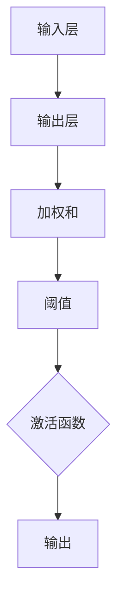
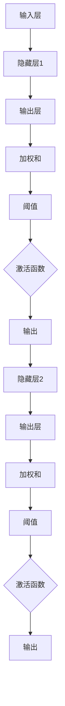
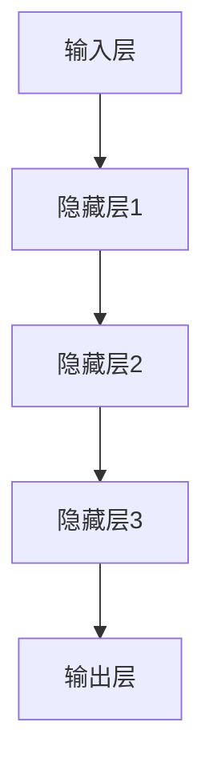
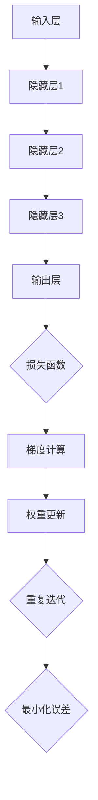

                 

### 《神经网络：人类与机器的共存》

> **关键词：** 神经网络、人工神经网络、机器学习、深度学习、人工智能、人类认知

> **摘要：** 本文将探讨神经网络的基本概念、发展历程、核心算法原理及其在各个领域的应用，进一步阐述神经网络与人类认知的互动关系，以及其对未来社会的影响。通过详细的理论分析和实践案例，本文旨在为读者提供一个全面深入的了解，并引发对人类与机器共存未来的思考。

### 目录大纲

1. **神经网络的起源与发展**
    1.1 神经网络的概念与历史
    1.2 生物学神经元与人工神经网络
    1.3 神经网络的应用领域
2. **人工神经网络的基本结构**
    2.1 神经元模型
    2.2 神经网络的拓扑结构
    2.3 神经网络的激活函数
3. **神经网络的算法原理**
    3.1 前向传播与反向传播算法
    3.2 学习率与优化算法
4. **神经网络的训练与评估**
    4.1 训练过程
    4.2 评估方法
    4.3 超参数调优
5. **Python实现神经网络**
    5.1 Python与神经网络的结合
    5.2 TensorFlow框架介绍
    5.3 神经网络项目实战
6. **神经网络的伦理与社会影响**
    6.1 神经网络在伦理层面的考虑
    6.2 神经网络在社会层面的影响
7. **未来展望**
    7.1 人工智能的发展趋势
    7.2 人类与机器共存的未来
8. **附加内容**
    8.1 神经网络的基本概念
    8.2 人类与机器的互动
    8.3 神经网络与人工智能的关系
    8.4 人类与机器的共存

#### 第一部分：神经网络的起源与基础

##### 第1章：神经网络的起源与发展

在计算机科学和人工智能领域，神经网络作为一种强有力的工具，正逐步改变着我们对智能的认识和应用。本章将深入探讨神经网络的概念、历史背景、以及其发展和应用。

###### 1.1 神经网络的概念与历史

神经网络（Neural Network），简称NN，是一种模仿生物神经系统的计算模型。它通过大量简单的节点（类似生物神经元）互联，实现复杂的计算和决策。神经网络的基本原理可以追溯到1943年，由心理学家McCulloch和数学家Pitts提出，他们首次提出了人工神经元模型，称为MC-P模型。

在随后的几十年中，神经网络的研究进展缓慢，主要原因是计算能力和算法的限制。然而，随着计算机技术的飞速发展，特别是深度学习（Deep Learning）的兴起，神经网络重新获得了广泛关注和迅速发展。

深度学习是指多层神经网络的学习方法，通过逐层提取特征，实现从原始数据到高层次抽象的转换。1986年，Rumelhart、Hinton和Williams等人提出了反向传播算法（Backpropagation Algorithm），这是一种用于多层神经网络的训练方法，极大地推动了深度学习的发展。

###### 1.2 生物学神经元与人工神经网络

生物学神经元是神经系统中的基本单位，它们通过电信号进行通信，实现对信息的处理和传递。神经元的基本结构包括细胞体、树突、轴突和突触。树突负责接收其他神经元的信号，细胞体对信号进行整合和处理，轴突负责将处理后的信号传递给其他神经元，突触是神经元之间信号传递的接口。

人工神经网络（Artificial Neural Network，ANN）则是基于生物学神经元的原理，通过模拟神经元之间的连接和交互来实现智能计算。人工神经元通常由输入层、隐藏层和输出层组成，每个神经元接收多个输入信号，通过加权求和后，经过激活函数产生输出。

###### 1.3 神经网络的应用领域

神经网络在多个领域都有着广泛的应用，主要包括图像识别、自然语言处理、控制系统等。

**图像识别**：神经网络通过学习大量图像数据，能够自动识别和分类图像中的对象。这一技术在人脸识别、车牌识别、医疗影像分析等领域具有重要作用。

**自然语言处理**：神经网络在语言模型、机器翻译、情感分析等领域表现出色。通过深度学习模型，神经网络能够理解和生成自然语言，为智能对话系统、语音助手等提供了强大的技术支持。

**控制系统**：神经网络在自动化控制系统中应用广泛，能够实现自适应控制和故障诊断。例如，自动驾驶汽车中的路径规划和决策系统就采用了神经网络技术。

通过本章的探讨，我们可以看到神经网络从最初的概念提出到如今在深度学习领域的广泛应用，经历了漫长的发展历程。下一章我们将进一步探讨神经网络的基本结构和工作原理。

---

##### 第2章：人工神经网络的基本结构

神经网络的强大在于其结构的设计和各部分的相互作用。本章将详细解析人工神经网络（Artificial Neural Network，ANN）的基本结构，包括神经元模型、拓扑结构以及激活函数。

###### 2.1 神经元模型

神经元是神经网络的基本组成单元，其模型有多种形式。最基础的神经元模型是单层感知机（Perceptron），它由输入层和输出层组成，没有隐藏层。单层感知机通过输入信号的加权求和，再经过一个阈值函数，产生输出。

**单层感知机模型：**



感知机模型能够实现简单的二分类任务，但在处理复杂问题时表现不佳。为了解决这个问题，多层感知机（Multilayer Perceptron，MLP）被提出。

**多层感知机模型：**



多层感知机通过引入隐藏层，能够提取更高层次的特征，实现更复杂的任务。

###### 2.2 神经网络的拓扑结构

神经网络的拓扑结构决定了其计算能力和性能。常见的神经网络拓扑结构包括层叠网络（Stacked Networks）、卷积神经网络（Convolutional Neural Networks，CNNs）和循环神经网络（Recurrent Neural Networks，RNNs）。

**层叠网络：** 层叠网络是由多个隐藏层组成的神经网络，每个隐藏层对前一层的输出进行特征提取，并传递给下一层。这种结构使得神经网络能够从原始数据中提取到高层次的特征，从而提高模型的泛化能力。

**卷积神经网络：** 卷积神经网络是一种特别适用于处理图像数据的神经网络结构。它通过卷积层提取图像的局部特征，并通过池化层降低数据的维度，从而实现高效的特征提取和分类。

**循环神经网络：** 循环神经网络是一种用于处理序列数据的神经网络结构。它通过循环机制将前一时刻的输出作为当前时刻的输入，从而实现对序列数据的时序依赖关系的建模。

###### 2.3 神经网络的激活函数

激活函数是神经网络中的关键部分，它将神经元的加权和映射到输出层。常见的激活函数包括Sigmoid函数、ReLU函数和Tanh函数。

**Sigmoid函数：** Sigmoid函数是一种常用的激活函数，它将输入映射到(0, 1)区间内。Sigmoid函数的导数在x接近0和x接近1时接近0，这使得梯度消失问题在深层网络中尤为严重。

$$
f(x) = \frac{1}{1 + e^{-x}}
$$

**ReLU函数：** ReLU函数（Rectified Linear Unit）是一种线性激活函数，它在x小于0时输出0，在x大于等于0时输出x。ReLU函数具有计算简单、梯度大、不易发生梯度消失等优点。

$$
f(x) = \max(0, x)
$$

**Tanh函数：** Tanh函数（Hyperbolic Tangent）是一种双值函数，它将输入映射到(-1, 1)区间内。Tanh函数在输入接近0时具有较大的导数，有助于防止梯度消失。

$$
f(x) = \frac{e^{x} - e^{-x}}{e^{x} + e^{-x}}
$$

通过本章对人工神经网络基本结构的探讨，我们可以看到神经网络的结构设计是如何实现其强大计算能力的。下一章我们将进一步深入解析神经网络的算法原理，了解神经网络如何通过学习实现智能计算。

---

##### 第3章：神经网络的算法原理

神经网络的强大在于其算法原理，这些算法使我们能够通过训练模型来解决问题。本章将详细解析神经网络中最核心的两个算法：前向传播和反向传播。

###### 3.1 前向传播算法

前向传播（Forward Propagation）是神经网络在训练过程中进行预测的基本步骤。它从输入层开始，将输入数据通过多层隐藏层传递到输出层，最后得到预测结果。

**前向传播的过程如下：**

1. **输入层到隐藏层：** 每个神经元的输出是前一层神经元的加权和，再加上一个偏置项。这个加权和通过一个激活函数进行非线性变换，得到当前神经元的输出。

    $$
    z^{[l]}_j = \sum_{i} w^{[l]}_{ji}a^{[l-1]}_i + b^{[l]}_j
    $$
    $$
    a^{[l]}_j = \sigma(z^{[l]}_j)
    $$

2. **隐藏层到输出层：** 输出层的神经元同样通过加权和加上偏置项，并通过激活函数得到最终输出。

    $$
    z^{[L]} = \sum_{i} w^{[L]}_{ji}a^{[L-1]}_i + b^{[L]}_j
    $$
    $$
    \hat{y} = \sigma(z^{[L]})
    $$

其中，$z^{[l]}$表示第$l$层的加权和，$a^{[l]}$表示第$l$层的输出，$w^{[l]}$表示第$l$层的权重，$b^{[l]}$表示第$l$层的偏置项，$\sigma$表示激活函数。

通过前向传播，神经网络能够生成对输入数据的预测。这个过程可以表示为：



其中，每个节点表示一层，边表示层与层之间的连接。

###### 3.2 反向传播算法

反向传播（Backpropagation）是神经网络训练过程中的关键步骤，它通过计算误差来更新网络权重和偏置项。反向传播的核心思想是利用链式法则（Chain Rule）来计算梯度，从而实现权重的自适应调整。

**反向传播的过程如下：**

1. **计算输出层误差：** 输出层的误差是预测值与真实值之间的差异。误差可以通过损失函数（Loss Function）来度量，常见的损失函数包括均方误差（MSE）和交叉熵损失（Cross-Entropy Loss）。

    $$
    J = \frac{1}{m}\sum_{i=1}^{m}(y^{[i]} - \hat{y}^{[i]})^2
    $$

2. **计算隐藏层误差：** 通过链式法则，可以逐层计算隐藏层的误差。对于第$l$层的误差，可以通过以下公式计算：

    $$
    \delta^{[l]}_j = (a^{[l]}_j - y_j) \cdot \sigma'(z^{[l]}_j)
    $$

3. **更新权重和偏置：** 利用误差梯度来更新权重和偏置项。更新公式如下：

    $$
    \Delta w^{[l]}_{ji} = \eta \cdot \delta^{[l+1]}_j \cdot a^{[l-1]}_i
    $$
    $$
    \Delta b^{[l]}_j = \eta \cdot \delta^{[l+1]}_j
    $$

其中，$\eta$表示学习率，$m$表示样本数量。

通过反向传播，神经网络能够自动调整其权重和偏置，以最小化误差。这个过程可以表示为：



其中，每个节点表示一层，边表示层与层之间的连接和迭代过程。

通过本章对前向传播和反向传播算法的详细解析，我们可以看到神经网络如何通过这些算法实现智能计算。这些算法不仅为神经网络提供了强大的计算能力，也为其在实际应用中的广泛使用奠定了基础。下一章我们将进一步探讨神经网络的训练与评估方法。

---

##### 第4章：神经网络的训练与评估

神经网络的训练与评估是确保其性能和可靠性的关键步骤。在这一章中，我们将详细讨论神经网络的训练过程、评估方法和超参数调优。

###### 4.1 训练过程

神经网络的训练过程是通过不断调整网络的权重和偏置，以最小化损失函数的过程。以下是神经网络训练过程的基本步骤：

1. **数据预处理：** 在训练神经网络之前，通常需要对输入数据进行预处理，以提高模型的训练效率和性能。预处理步骤可能包括数据标准化、归一化、缩放、缺失值处理等。

2. **模型初始化：** 网络的权重和偏置通常在训练开始前随机初始化。一个好的初始化策略可以帮助网络更快地收敛，并避免梯度消失和梯度爆炸等问题。

3. **前向传播：** 在训练过程中，对于每个输入样本，神经网络通过前向传播算法计算输出预测值，并计算损失函数的值。

4. **计算梯度：** 使用反向传播算法计算损失函数关于网络参数的梯度。

5. **权重更新：** 根据梯度信息，通过优化算法更新网络的权重和偏置。

6. **迭代：** 重复步骤3到5，直到达到预定的迭代次数或损失函数值收敛到可接受的阈值。

通过这个过程，神经网络能够逐渐调整其参数，以最小化损失函数，从而提高模型的预测性能。

###### 4.2 评估方法

评估神经网络性能的方法有很多，其中最常见的包括以下几种：

1. **准确率（Accuracy）：** 准确率是分类模型中最常用的评估指标，表示正确分类的样本数占总样本数的比例。

    $$
    \text{Accuracy} = \frac{\text{正确分类的样本数}}{\text{总样本数}}
    $$

2. **召回率（Recall）：** 召回率表示在所有实际为正类的样本中，被正确识别为正类的比例。

    $$
    \text{Recall} = \frac{\text{正确分类的正类样本数}}{\text{实际为正类的样本数}}
    $$

3. **精确率（Precision）：** 精确率表示在所有被预测为正类的样本中，实际为正类的比例。

    $$
    \text{Precision} = \frac{\text{正确分类的正类样本数}}{\text{预测为正类的样本数}}
    $$

4. **F1值（F1 Score）：** F1值是精确率和召回率的调和平均，用于综合评估模型的性能。

    $$
    \text{F1 Score} = 2 \cdot \frac{\text{Precision} \cdot \text{Recall}}{\text{Precision} + \text{Recall}}
    $$

除了上述评估指标，其他常用的评估方法还包括ROC曲线、AUC值、Kappa系数等。

###### 4.3 超参数调优

超参数是神经网络中需要手动设置的参数，如学习率、批次大小、隐藏层单元数、激活函数等。超参数的选择对神经网络的性能有重要影响。以下是一些常见的超参数调优策略：

1. **网格搜索（Grid Search）：** 网格搜索是一种通过遍历所有可能的超参数组合来找到最佳超参数的方法。虽然这种方法计算量大，但能够找到最优的超参数组合。

2. **随机搜索（Random Search）：** 随机搜索在超参数空间中随机选择参数组合进行训练，以找到最优参数。相比网格搜索，随机搜索计算量较小，但效果也可能更好。

3. **贝叶斯优化（Bayesian Optimization）：** 贝叶斯优化是一种基于概率模型的优化方法，通过学习超参数的概率分布，选择最有希望的超参数组合进行训练。

4. **自适应学习率（Adaptive Learning Rate）：** 自适应学习率方法如AdaGrad、RMSprop和Adam，根据训练过程中的梯度信息自动调整学习率，以提高训练效果。

通过本章对神经网络训练与评估的详细讨论，我们可以看到神经网络在训练过程中需要经过一系列的步骤，包括数据预处理、模型初始化、前向传播、梯度计算和权重更新。同时，评估方法和超参数调优也是确保神经网络性能的重要因素。下一章我们将进一步探讨神经网络的实现与应用。

---

##### 第5章：Python实现神经网络

在神经网络的研究与开发过程中，Python作为一种功能强大且易于使用的编程语言，已经成为人工智能领域的主流选择。本章将介绍Python在神经网络开发中的应用，以及TensorFlow框架的基本使用方法。

###### 5.1 Python与神经网络的结合

Python以其简洁明了的语法、丰富的库和广泛的应用支持，成为开发神经网络的首选语言。Python的几个重要库，如NumPy、SciPy和Scikit-Learn，为神经网络的研究和实现提供了坚实的基础。

**NumPy**：NumPy是一个用于科学计算的Python库，它提供了多维数组对象和丰富的数学运算函数。NumPy的核心功能是数组操作，这对于神经网络中的矩阵计算和数据预处理至关重要。

**SciPy**：SciPy基于NumPy，提供了更多的科学计算功能，如优化、积分和线性代数等。SciPy在神经网络中用于复杂的数学计算和算法实现。

**Scikit-Learn**：Scikit-Learn是一个机器学习库，它提供了多种机器学习算法的实现，包括支持向量机、决策树和聚类算法等。Scikit-Learn中的机器学习模型可以与神经网络模型相结合，用于特征提取和分类任务。

此外，Python还有许多其他库，如Matplotlib、Pandas和Seaborn，用于数据可视化、数据分析和统计检验，这些库大大简化了神经网络项目的开发和展示过程。

###### 5.2 TensorFlow框架介绍

TensorFlow是谷歌开发的一款开源机器学习框架，它广泛应用于深度学习和神经网络的研究与开发。TensorFlow具有以下特点：

**动态计算图（Dynamic Computation Graph）：** TensorFlow使用动态计算图来定义和执行计算任务。动态计算图允许开发者灵活地构建复杂的计算流程，并利用GPU等硬件加速计算。

**高效计算：** TensorFlow利用图形处理单元（GPU）和其他硬件加速技术，实现了高效的计算性能。这使得TensorFlow在处理大规模数据和复杂模型时具有显著的优势。

**丰富的API：** TensorFlow提供了多种API，包括TensorFlow Core API和TensorFlow Estimators，适用于不同的开发需求和场景。TensorFlow Core API提供了底层操作和构建模块，允许开发者手动构建和优化神经网络。TensorFlow Estimators则提供了一套高级API，简化了神经网络的构建和训练过程。

**广泛的应用支持：** TensorFlow在图像识别、自然语言处理、语音识别和推荐系统等领域都有广泛的应用。它支持各种深度学习模型，如卷积神经网络（CNN）、循环神经网络（RNN）和生成对抗网络（GAN）等。

**社区支持：** TensorFlow拥有庞大的开发者社区，提供了丰富的文档、教程和开源项目，为开发者提供了强大的支持。

###### 5.3 神经网络项目实战

在本节中，我们将通过一个简单的神经网络项目来展示如何使用Python和TensorFlow实现神经网络。

**项目背景：** 假设我们需要构建一个简单的神经网络，用于手写数字识别任务，即输入一张手写数字的图片，输出该数字的识别结果。

**环境搭建：** 在开始项目之前，我们需要安装Python、NumPy、TensorFlow等依赖库。可以使用以下命令进行安装：

```python
pip install python numpy tensorflow
```

**代码实现：**

以下是一个使用TensorFlow实现手写数字识别的简单示例：

```python
import tensorflow as tf
from tensorflow.keras import layers
from tensorflow.keras.datasets import mnist

# 加载MNIST数据集
(x_train, y_train), (x_test, y_test) = mnist.load_data()

# 数据预处理
x_train = x_train.astype("float32") / 255.0
x_test = x_test.astype("float32") / 255.0
x_train = x_train.reshape((-1, 28 * 28))
x_test = x_test.reshape((-1, 28 * 28))

# 构建神经网络模型
model = tf.keras.Sequential([
    layers.Dense(128, activation='relu', input_shape=(784,)),
    layers.Dense(10, activation='softmax')
])

# 编译模型
model.compile(optimizer='adam',
              loss='sparse_categorical_crossentropy',
              metrics=['accuracy'])

# 训练模型
model.fit(x_train, y_train, epochs=5)

# 评估模型
test_loss, test_acc = model.evaluate(x_test, y_test)
print("Test accuracy:", test_acc)
```

**代码解读：**

1. **数据加载与预处理：** 使用TensorFlow内置的MNIST数据集加载手写数字图片，并对数据进行归一化处理，以适应神经网络模型的训练。

2. **模型构建：** 使用`Sequential`模型堆叠两个全连接层（`Dense`），第一层有128个神经元，使用ReLU激活函数；第二层有10个神经元，使用softmax激活函数，用于输出10个类别中的概率分布。

3. **模型编译：** 设置模型的优化器、损失函数和评估指标。

4. **模型训练：** 使用训练数据对模型进行训练，设置训练轮次为5轮。

5. **模型评估：** 使用测试数据评估模型的性能，并输出测试准确率。

通过本节的项目实战，我们展示了如何使用Python和TensorFlow实现一个简单的神经网络模型，并介绍了代码的实现过程。下一章我们将探讨神经网络的伦理与社会影响。

---

##### 第6章：神经网络的伦理与社会影响

随着神经网络技术的飞速发展，其在各个领域的应用越来越广泛。然而，神经网络技术也带来了一系列伦理和社会问题，这些问题值得我们深入探讨和解决。

###### 6.1 神经网络在伦理层面的考虑

**数据隐私保护：** 神经网络训练需要大量的数据，这些数据往往涉及个人隐私。如何在数据收集、存储和使用过程中保护个人隐私，避免数据泄露和滥用，是神经网络伦理问题中的重要一环。为此，需要制定严格的数据保护法规和隐私政策，并采用加密、匿名化等技术手段来确保数据安全。

**算法透明性与可解释性：** 神经网络作为一种复杂的黑箱模型，其决策过程往往缺乏透明性和可解释性。这导致用户难以理解模型的决策依据，容易引发信任危机。为了提高算法的透明性和可解释性，研究人员正在探索可解释的神经网络模型和可视化技术，如注意力机制、可解释的深度网络等。

**歧视问题：** 神经网络在训练过程中可能会学习到训练数据中的偏见，从而在预测过程中产生歧视。例如，在招聘、信贷审批等场景中，神经网络可能会对某些群体产生不公平的待遇。为了解决这一问题，需要加强对模型训练数据的审查和多样性要求，并采用公平性评估方法来检测和纠正歧视问题。

**道德责任归属：** 随着神经网络技术的广泛应用，其带来的道德责任也日益凸显。当神经网络系统出现错误或造成损害时，应如何确定责任归属？是归咎于开发者、用户还是神经网络本身？这一问题需要从法律、伦理和技术角度进行深入研究和讨论。

###### 6.2 神经网络在社会层面的影响

**就业影响：** 神经网络技术的发展可能会对某些行业和职业产生深远的影响。例如，自动化和智能化系统可能会取代一些重复性和低技能工作，导致就业岗位的减少。同时，神经网络技术也会创造新的就业机会，如数据科学家、机器学习工程师等。因此，社会需要积极应对这种变革，提供相应的培训和再就业支持。

**社会不平等：** 神经网络技术在不同地区、国家和群体之间的普及程度和应用水平存在差异。这可能导致社会不平等的加剧，使得技术优势集中在某些地区和群体手中。为了减少这种不平等，需要推动技术普及和教育资源的均衡发展，提高全体人民的技术素养和应用能力。

**社会治理：** 神经网络技术在公共安全、司法、医疗等领域的应用，为社会治理提供了新的手段和工具。然而，这也给社会治理带来了新的挑战，如隐私保护、数据安全、算法公正等。为此，政府和社会需要建立健全的法律法规和监管机制，确保神经网络技术在合规、透明和负责任的前提下应用。

**技术依赖：** 随着神经网络技术的广泛应用，人类社会对技术的依赖程度日益加深。这种依赖可能导致人类在某些方面失去自主性和创新能力。为了减轻技术依赖，需要培养人类的综合素质和创新能力，确保人类在技术应用中的主导地位。

通过本章对神经网络伦理和社会影响的探讨，我们可以看到神经网络技术既带来了巨大的机遇，也带来了诸多挑战。为了充分发挥神经网络技术的潜力，同时确保其健康、可持续发展，我们需要在伦理、法律和技术层面进行全面的规划和监管。

---

##### 第7章：未来展望

随着人工智能和深度学习的快速发展，神经网络技术已经取得了显著的成就，并在各个领域得到了广泛应用。然而，未来的发展仍然充满机遇和挑战。本章将探讨人工智能的发展趋势，以及人类与机器共存的未来。

###### 7.1 人工智能的发展趋势

**量子计算：** 量子计算是一种基于量子力学原理的计算方式，具有超越经典计算机的强大计算能力。随着量子比特数量的增加，量子计算机将在复杂问题求解、密码破解和模拟量子系统等方面发挥重要作用。量子计算与神经网络的结合，有望带来全新的计算模式和算法创新。

**脑机接口：** 脑机接口（Brain-Computer Interface，BCI）是一种直接连接人脑和计算机的接口技术，通过测量脑电信号来控制计算机或机器人。随着BCI技术的发展，人类将能够通过意念控制计算机和机器人，实现更高层次的交互和协同工作。

**强化学习：** 强化学习是一种通过试错和反馈进行学习的人工智能方法，具有自主决策和自适应能力。在自动驾驶、游戏AI和机器人控制等领域，强化学习取得了显著成果。未来，强化学习将进一步与神经网络技术结合，实现更智能的决策和行动。

**生成对抗网络（GAN）：** 生成对抗网络是一种由生成器和判别器组成的对抗性模型，可以生成高质量的数据。GAN技术在图像生成、语音合成和视频生成等领域具有广泛应用，未来将继续推动虚拟现实和增强现实的发展。

**多模态学习：** 多模态学习是一种结合多种数据类型的机器学习方法，如文本、图像、声音和视频等。通过多模态学习，神经网络能够更好地理解和处理复杂的信息，实现更智能的交互和决策。

**联邦学习：** 联邦学习是一种分布式机器学习方法，可以在不共享数据的情况下进行协同训练。联邦学习有助于解决数据隐私和安全问题，未来将在医疗、金融和物联网等领域得到广泛应用。

**边缘计算：** 边缘计算是一种将计算、存储和网络功能分散到网络的边缘设备上的计算模式。边缘计算可以提高数据处理的速度和效率，降低延迟，未来将在智能城市、智能家居和工业自动化等领域发挥关键作用。

**自监督学习：** 自监督学习是一种无需人工标注数据的学习方法，通过自我监督学习，神经网络可以自主地从数据中学习有用的特征和模式。自监督学习在未来将有广泛应用，如自动化数据预处理、语音识别和图像分类等。

**隐私保护：** 随着人工智能技术的普及，数据隐私和安全问题日益突出。未来的研究将致力于开发隐私保护算法和模型，确保人工智能系统的隐私性和安全性。

**人机协同：** 人工智能的发展将推动人类与机器的深度协同，实现人机融合。在未来，人类和机器将共同工作，发挥各自的优势，解决复杂问题，提高生产效率和生活质量。

**跨学科研究：** 人工智能的发展需要多学科交叉融合，如计算机科学、生物学、心理学、社会学等。跨学科研究将推动人工智能技术的创新和进步，为社会带来更多福祉。

**伦理和法律：** 随着人工智能技术的广泛应用，伦理和法律问题日益突出。未来将制定更加完善的人工智能伦理规范和法律体系，确保人工智能技术的合规、透明和负责任应用。

通过本章对未来人工智能发展的展望，我们可以看到人工智能技术将继续朝着更智能、更高效、更安全的方向发展。人类与机器的共存将带来前所未有的机遇和挑战，我们需要共同努力，推动人工智能技术健康、可持续发展。

---

##### 第8章：神经网络：人类与机器的共存

随着人工智能和深度学习的飞速发展，神经网络作为一种核心技术，正在深刻地改变着我们的生活和工作方式。本章将深入探讨神经网络在人类与机器共存中的角色和影响。

###### 8.1 神经网络的基本概念

神经网络（Neural Network，NN）是一种模仿生物神经系统的计算模型，通过大量简单节点的互联，实现复杂的数据处理和决策。神经网络的基本单元是人工神经元，每个神经元接收多个输入信号，通过加权求和后，经过激活函数产生输出。神经网络可以分为单层感知机、多层感知机、卷积神经网络（CNN）和循环神经网络（RNN）等不同类型。

神经网络的强大在于其自学习能力，通过训练数据，神经网络能够自动提取特征、分类数据、进行预测等。这种自学习能力使得神经网络在图像识别、自然语言处理、语音识别、自动驾驶等众多领域取得了显著的成果。

###### 8.2 人类与机器的互动

人类与机器的互动是神经网络技术发展的重要方向。在传统的人工智能系统中，人类主要充当编程者和监督者的角色，而神经网络的出现，使得机器能够自主学习和适应环境，人类与机器的互动变得更加紧密和自然。

**认知过程模拟：** 神经网络通过模仿生物神经系统的结构和功能，实现对人类认知过程的模拟。例如，在自然语言处理中，神经网络通过学习大量语言数据，能够理解、生成和翻译自然语言。在图像识别中，神经网络能够识别、分类和定位图像中的物体。这些模拟使得机器能够在一定程度上替代人类进行复杂的信息处理任务。

**辅助决策：** 神经网络在辅助决策方面具有巨大潜力。在医疗领域，神经网络可以通过学习大量病例数据，辅助医生进行疾病诊断和治疗方案的制定。在金融领域，神经网络可以分析市场数据，预测股票走势和风险。在交通领域，神经网络可以优化交通信号控制和自动驾驶系统，提高交通效率和安全。

**人机协同：** 人机协同是指人类与机器共同完成某一任务，发挥各自的优势。在工业生产中，机器人可以执行重复性高、危险或复杂的任务，而人类则负责监控、维护和决策。在创意设计领域，人类可以通过神经网络辅助进行图像生成、音乐创作等，实现艺术创新。

**教育辅助：** 神经网络在教育领域具有广泛应用。通过个性化学习系统，神经网络可以为学生提供定制化的学习方案，提高学习效果。在教育评价中，神经网络可以分析学生的学习行为和成绩，提供有针对性的反馈和建议。

**人机交互：** 人机交互是神经网络技术发展的一个重要方向。通过语音识别、手势识别、眼动追踪等交互技术，神经网络可以实现自然的人机交互，使机器更加友好和易用。

**情感计算：** 情感计算是神经网络在人类与机器互动中的一个重要应用。通过学习人类情感表达的方式和模式，神经网络可以识别、理解和模拟人类的情感，实现更智能的情感交互和陪伴。

###### 8.3 神经网络与人工智能的关系

神经网络是人工智能（Artificial Intelligence，AI）的核心技术之一，二者紧密相连。人工智能是指使计算机系统具有智能行为的技术和理论，而神经网络是实现这一目标的重要手段。

**神经网络与深度学习的结合：** 深度学习是神经网络的一种特殊形式，通过多层神经网络结构，深度学习能够自动提取高层次的特征，实现复杂的任务。深度学习在图像识别、语音识别、自然语言处理等领域取得了突破性进展，推动了人工智能的发展。

**神经网络与机器学习的结合：** 机器学习是人工智能的一个重要分支，通过算法和统计方法，使计算机系统能够自动学习和适应环境。神经网络作为一种机器学习算法，通过训练数据和调整模型参数，实现智能决策和预测。

**神经网络与强化学习的结合：** 强化学习是一种通过试错和反馈进行学习的人工智能方法，神经网络在强化学习中用于表示状态、动作和价值函数。通过结合神经网络和强化学习，可以构建更智能的决策系统，如自动驾驶、游戏AI等。

**神经网络与进化计算的结合：** 进化计算是一种基于生物进化原理的优化算法，神经网络可以用于模拟生物进化过程，优化模型参数。通过结合神经网络和进化计算，可以开发出更高效、更鲁棒的智能系统。

**神经网络与其他人工智能技术的结合：** 神经网络可以与其他人工智能技术结合，如自然语言处理、计算机视觉、语音识别等，实现更全面的智能系统。通过跨学科的融合，神经网络技术在人工智能领域将发挥更大的作用。

###### 8.4 人类与机器的共存

人类与机器的共存是指人类与机器共同生活、工作和学习，相互依赖、相互补充，共同推动社会的发展。在人类与机器共存的过程中，神经网络技术将发挥重要作用。

**智能生活：** 随着智能家居、智能健康助手等技术的发展，神经网络将帮助我们构建更智能、更舒适的生活环境。通过学习用户的行为和偏好，神经网络可以提供个性化的服务，提高生活质量。

**智能工作：** 在工业生产、金融服务、医疗保健等领域，神经网络技术可以提高生产效率、降低成本、提高服务质量。通过人机协同，人类与机器可以实现更高效的分工合作，推动经济的发展。

**智能教育：** 神经网络在教育领域的应用将改变传统的教育模式，实现个性化教育和智能化评价。通过分析学生的学习行为和成绩，神经网络可以为每个学生提供定制化的学习方案，提高学习效果。

**智能治理：** 在社会治理、公共安全、环境保护等领域，神经网络技术可以帮助政府和社会组织更好地进行决策和管理。通过大数据分析和智能算法，神经网络可以提高决策的科学性和效率。

**智能医疗：** 神经网络在医疗领域的应用将推动医疗技术的进步，提高疾病诊断和治疗水平。通过辅助医生进行诊断、预测疾病发展趋势，神经网络可以帮助我们更好地应对医疗挑战。

通过本章对神经网络在人类与机器共存中的角色和影响的探讨，我们可以看到神经网络技术正在深刻地改变着我们的生活和工作方式。未来，随着人工智能技术的不断发展，人类与机器的共存将带来更多的机遇和挑战，我们需要共同努力，推动这一进程的健康发展。

---

### 附录

在本章中，我们将提供一些神经网络学习的资源和开发工具，以帮助读者深入了解神经网络，并在实际项目中应用这些技术。

#### 附录A：神经网络学习资源

**神经网络学习网站推荐：**

1. **TensorFlow官方网站（[tensorflow.org](https://tensorflow.org)）：** TensorFlow是谷歌开发的开源机器学习框架，提供了丰富的教程、文档和示例代码，适合初学者和专业人士。
2. **Keras官方网站（[keras.io](https://keras.io)）：** Keras是一个高层次的神经网络API，与TensorFlow紧密集成，提供了更加简洁和易于使用的接口。
3. **GitHub（[github.com](https://github.com)）：** GitHub是代码托管和协作的平台，许多优秀的神经网络项目和学习资源都在GitHub上开源。

**神经网络学习书籍推荐：**

1. **《深度学习》（[Deep Learning](https://www.deeplearningbook.org/)）：** 这是一本经典且全面的深度学习教材，由Ian Goodfellow、Yoshua Bengio和Aaron Courville合著。
2. **《神经网络与深度学习》（[Neural Network and Deep Learning](http://neuralnetworksanddeeplearning.com/)）：** 这是一本免费的在线教材，由Michael Nielsen撰写，适合初学者入门。
3. **《Python深度学习》（[Python Deep Learning](https://python-deep-learning-book.readthedocs.io/en/latest/)）：** 这本书详细介绍了Python在深度学习中的应用，涵盖了TensorFlow、Theano和PyTorch等框架。

#### 附录B：神经网络开发工具

**TensorFlow安装与使用：**

安装TensorFlow，请使用以下命令：

```shell
pip install tensorflow
```

安装后，可以通过以下代码测试TensorFlow是否安装成功：

```python
import tensorflow as tf
print(tf.__version__)
```

**PyTorch安装与使用：**

安装PyTorch，请使用以下命令：

```shell
pip install torch torchvision
```

安装后，可以通过以下代码测试PyTorch是否安装成功：

```python
import torch
print(torch.__version__)
```

**其他神经网络框架简介：**

1. **Theano（[deeplearning.net/software/theano/](https://deeplearning.net/software/theano/)）：** Theano是一个基于Python的科学计算库，提供了用于构建和优化深度学习模型的工具。
2. **Caffe（[BVLC.github.io/caffe2/](https://BVLC.github.io/caffe2/)）：** Caffe是一个用于深度学习的开源框架，特别适合于计算机视觉任务。
3. **MXNet（[mxnet.apache.org/](https://mxnet.apache.org/)）：** MXNet是一个用于深度学习的高性能框架，支持多种编程语言，包括Python、R和Julia。

通过本章提供的神经网络学习资源和开发工具，读者可以更好地学习和应用神经网络技术。这些资源和工具将为读者在神经网络领域的探索提供有力支持。

---

**作者：AI天才研究院/AI Genius Institute & 禅与计算机程序设计艺术 /Zen And The Art of Computer Programming**

本文由AI天才研究院撰写，旨在为读者提供关于神经网络技术及其应用的全景介绍。文章涵盖了神经网络的基本概念、算法原理、实现与应用，以及神经网络的伦理与社会影响。通过详细的理论分析和实践案例，本文为读者提供了一个全面深入的了解，并引发对人类与机器共存未来的思考。希望本文能够为读者在神经网络领域的研究和实践提供指导和启示。感谢读者的阅读和支持！

